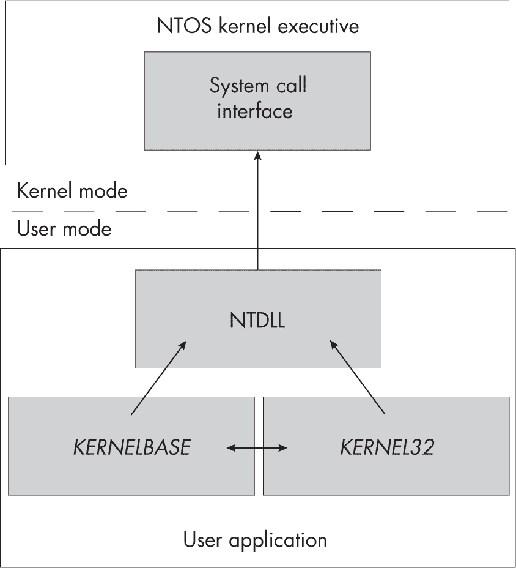
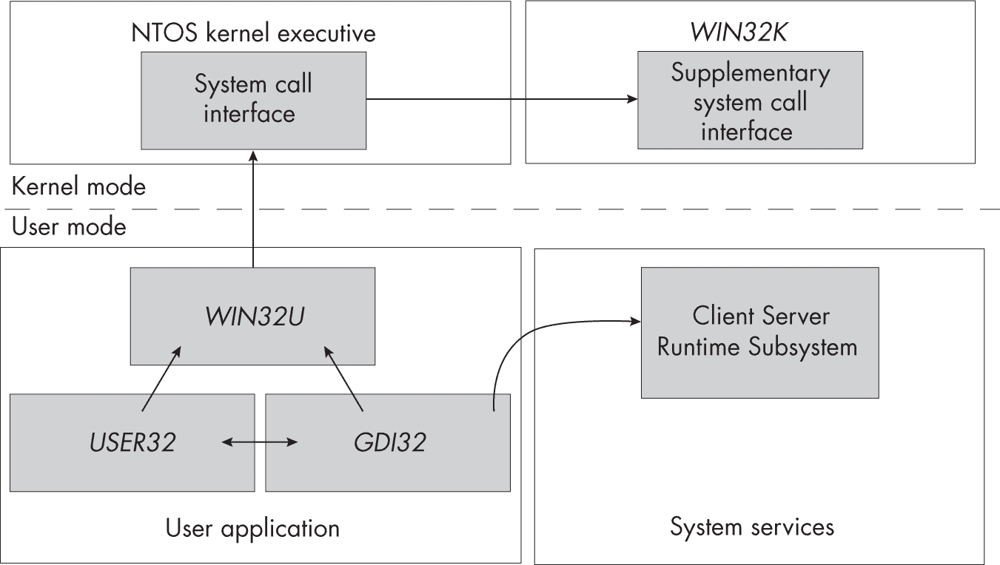
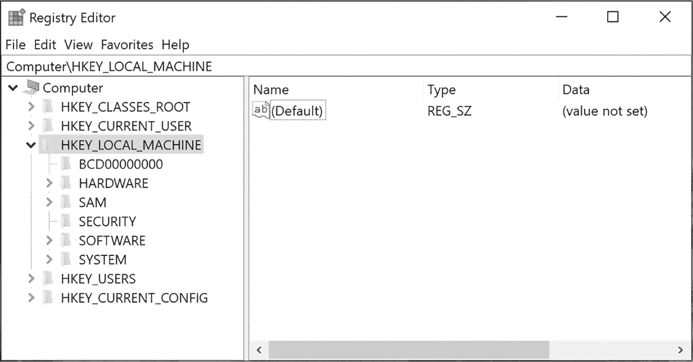

<hgroup>

## <samp class="SANS_Futura_Std_Bold_Condensed_B_11">3</samp> <samp class="SANS_Dogma_OT_Bold_B_11">用户模式应用程序</samp>

</hgroup>


在上一章中，我们讨论了 Windows 内核。但是用户通常不会直接与内核交互。相反，他们与面向用户的应用程序进行交互，比如文字处理器和文件管理器。本章将详细介绍这些用户模式应用程序是如何创建的，以及它们如何与内核交互，为用户提供服务。

我们将首先讨论为用户模式应用程序开发设计的 Win32 应用程序编程接口（APIs），以及它们与 Windows 操作系统设计的关系。然后，我们将介绍 Windows 用户界面的结构，以及如何以编程方式检查它。多个 Windows 系统用户可以同时访问用户界面；我们还将探讨控制台会话如何隔离一个用户的界面和应用程序资源，以避免与同一系统上其他用户的资源冲突。

要理解用户模式应用程序是如何工作的，首先需要理解提供的 API 如何与底层内核系统调用接口交互。我们还将研究这一点，以及文件路径为了与内核兼容必须经历的转换过程。接下来，我们将介绍 Win32 应用程序如何访问注册表；然后，我们将考虑 Win32 如何处理进程和线程的创建，并查看一些重要的系统进程。

### <samp class="SANS_Futura_Std_Bold_B_11">Win32 和用户模式 Windows APIs</samp>

大多数在 Windows 上运行的代码并不会直接与系统调用交互。这是*Windows NT*操作系统原始设计的产物。微软最初开发 Windows NT 时，将其作为 IBM OS/2 操作系统的更新版本，计划它支持多个子系统，来实现不同的 API。在不同的时期，它支持过 POSIX、OS/2 和 Win32 API。

最终，微软与 IBM 的关系恶化，微软将其为 Windows 95 开发的 API 集*Win32*独立出来，并构建了一个子系统来实现它。那个大多不受欢迎的 OS/2 子系统在 Windows 2000 中被移除，而 POSIX 一直保留到 Windows 8.1 版本。到了 Windows 10，Win32 成为唯一剩下的子系统（尽管微软随后实现了 Linux 兼容层，如 Windows Subsystem for Linux，这些并未使用旧的子系统扩展点）。

为了支持这些多个 API，Windows 内核实现了一组通用的系统调用。每个子系统的特定库和服务负责将其 API 转换为低级系统调用接口。图 3-1 展示了 Win32 子系统 API 库的概览。



<samp class="SANS_Futura_Std_Book_Oblique_I_11">图 3-1：Win32 API 模块</samp>

如您所见，Win32 API 的核心实现位于 *KERNEL32* 和 *KERNELBASE* 库中。这些库调用系统提供的 *NT Layer 动态链接库（NTDLL）* 中的方法，后者实现了系统调用分派以及运行时库 API，以执行常见的低级操作。

大多数用户模式应用程序并不直接包含 Windows 系统 API 的实现。相反，*NTDLL* 包含 DLL 加载器，它按需加载新库。加载过程对于开发人员来说大多是不透明的：在构建程序时，您会链接一组库，编译器和工具链会自动将导入表添加到您的可执行文件中，以反映您的依赖关系。DLL 加载器随后检查导入表，自动加载任何依赖的库并解析导入。您还可以指定应用程序中的导出函数，以便其他代码可以依赖您的 API。

#### <samp class="SANS_Futura_Std_Bold_Condensed_Oblique_BI_11">加载新库</samp>

可以在运行时手动访问导出的函数，而无需导入表条目。您可以使用 <samp class="SANS_TheSansMonoCd_W5Regular_11">LoadLibrary</samp> Win32 API 加载新的库，该 API 可通过 PowerShell 使用 <samp class="SANS_TheSansMonoCd_W5Regular_11">Import-Win32Module</samp> 命令暴露。要查找 DLL 导出的函数的内存地址，请使用 Win32 API <samp class="SANS_TheSansMonoCd_W5Regular_11">GetProcAddress</samp>，该 API 可通过 PowerShell 的 <samp class="SANS_TheSansMonoCd_W5Regular_11">Get-Win32ModuleExport</samp> 命令暴露（列表 3-1）。

```
❶ PS> **$lib = Import-Win32Module -Path "kernel32.dll"**
❷ PS> **$lib**
Name         ImageBase        EntryPoint
----         ---------        ----------
KERNEL32.DLL 00007FFA088A0000 00007FFA088B7C70

❸ PS> **Get-Win32ModuleExport -Module $lib**
Ordinal Name                    Address
------- ----                    -------
1       AcquireSRWLockExclusive NTDLL.RtlAcquireSRWLockExclusive
2       AcquireSRWLockShared    NTDLL.RtlAcquireSRWLockShared
3       ActivateActCtx          0x7FFA088BE640
4       ActivateActCtxWorker    0x7FFA088BA950
`--snip--`

❹ PS> **"{0:X}" -f (Get-Win32ModuleExport -Module $lib** 
**-ProcAddress "AllocConsole")**
7FFA088C27C0 
```

列表 3-1：<samp class="SANS_Futura_Std_Book_11">KERNEL32</samp> 库的导出

在这里，我们使用 PowerShell 加载 *KERNEL32* 库并枚举导出和导入的 API。首先，我们使用 <samp class="SANS_TheSansMonoCd_W5Regular_11">Import -Win32Module</samp> 将其加载到内存中 ❶。*KERNEL32* 库总是被加载的，因此此命令将返回已加载的现有地址；然而，对于其他库，加载会导致 DLL 被映射到内存中并初始化。

<samp class="SANS_Dogma_OT_Bold_B_15">警告</samp>

*<samp class="SANS_TheSansMonoCd_W5Regular_Italic_I_11">Import-Win32Module</samp> 命令将把 DLL 加载到内存中，并可能执行代码。在此示例中，这是可以接受的，因为* KERNEL32 *是受信任的系统库之一。然而，不要对不受信任的 DLL 使用此命令，尤其是在分析恶意软件时，因为它可能导致恶意代码的执行。为了安全起见，始终在专门用于此目的的隔离系统上执行恶意软件分析。*

一旦它被加载到内存中，我们可以显示库的一些属性❷。这些包括库的名称，以及加载的内存地址和`<samp class="SANS_TheSansMonoCd_W5Regular_11">EntryPoint</samp>`的地址。一个 DLL 可以选择定义一个函数`<samp class="SANS_TheSansMonoCd_W5Regular_11">DllMain</samp>`，当它被加载时执行。`<samp class="SANS_TheSansMonoCd_W5Regular_11">EntryPoint</samp>`地址是 DLL 加载时在内存中执行的第一条指令。

接下来，我们转储 DLL 中的所有导出函数❸。在这种情况下，我们为每个函数看到三条信息：`<samp class="SANS_TheSansMonoCd_W5Regular_11">Ordinal</samp>`、`<samp class="SANS_TheSansMonoCd_W5Regular_11">Name</samp>`和`<samp class="SANS_TheSansMonoCd_W5Regular_11">Address</samp>`。`<samp class="SANS_TheSansMonoCd_W5Regular_11">Ordinal</samp>`是一个小数字，唯一标识 DLL 中的导出函数。通过序号导入 API 是可能的，这意味着不需要导出名称；当微软不希望将某个函数作为公共 API 正式支持时，你会看到 DLL 的导出表中缺少某些名称。

`<samp class="SANS_TheSansMonoCd_W5Regular_11">Name</samp>`只是导出函数的名称。它不需要与原始源代码中调用的函数名称匹配，尽管通常情况下它们是匹配的。最后，`<samp class="SANS_TheSansMonoCd_W5Regular_11">Address</samp>`是函数第一条指令在内存中的地址。你会注意到，前两个导出有一个字符串而不是地址。这是一个*导出转发*的例子；它允许一个 DLL 通过名称导出函数，并且加载器会自动将其重定向到另一个 DLL。在这种情况下，`<samp class="SANS_TheSansMonoCd_W5Regular_11">AcquireSRWLockExclusive</samp>`在*NTDLL*中实现为`<samp class="SANS_TheSansMonoCd_W5Regular_11">RtlAcquireSRWLockExclusive</samp>`。我们还可以使用`<samp class="SANS_TheSansMonoCd_W5Regular_11">Get-Win32ModuleExport</samp>`通过`<samp class="SANS_TheSansMonoCd_W5Regular_11">GetProcAddress</samp>`API 查找单个导出函数❹。

#### <samp class="SANS_Futura_Std_Bold_Condensed_Oblique_BI_11">查看导入的 API</samp>

以类似的方式，我们可以使用`<samp class="SANS_TheSansMonoCd_W5Regular_11">Get-Win32ModuleImport</samp>`命令查看可执行文件从其他 DLL 导入的 API，如示例 3-2 所示。

```
PS> **Get-Win32ModuleImport -Path "kernel32.dll"**
DllName                                   FunctionCount DelayLoaded
-------                                   ------------- -----------
api-ms-win-core-rtlsupport-l1-1-0.dll     13            False
ntdll.dll                                 378           False
KERNELBASE.dll                            90            False
api-ms-win-core-processthreads-l1-1-0.dll 39            False
`--snip--`

PS> **Get-Win32ModuleImport -Path "kernel32.dll" -DllName "ntdll.dll" |**
**Where-Object Name -Match "^Nt"**
Name                          Address
----                          -------
NtEnumerateKey                7FFA090BC6F0
NtTerminateProcess            7FFA090BC630
NtMapUserPhysicalPagesScatter 7FFA090BC110
NtMapViewOfSection            7FFA090BC5B0
`--snip--` 
```

示例 3-2：枚举`<samp class="SANS_Futura_Std_Book_11">KERNEL32</samp>`库的导入函数

我们通过调用 <samp class="SANS_TheSansMonoCd_W5Regular_11">Get-Win32ModuleImport</samp> 开始，并指定 *KERNEL32* DLL 作为路径。当你指定路径时，命令会自动调用 <samp class="SANS_TheSansMonoCd_W5Regular_11">Import-Win32Module</samp> 并显示所有导入，包括要加载的 DLL 名称和导入函数的数量。最后一列显示该 DLL 是否被开发者标记为 *延迟加载*。这是一种性能优化，它允许 DLL 仅在使用其导出的某个函数时加载。延迟加载避免了在初始化时加载所有 DLL，从而减少了进程启动时间，并且如果导入从未被使用，减少了运行时内存占用。

接下来，我们转储 DLL 的导入函数。由于可执行文件可以从多个库中导入代码，我们使用 <samp class="SANS_TheSansMonoCd_W5Regular_11">DllName</samp> 属性指定我们需要的库。然后我们过滤出所有以 <samp class="SANS_TheSansMonoCd_W5Regular_11">Nt</samp> 前缀开头的导入函数；这样我们就可以清楚地看到 *KERNEL32* 从 *NTDLL* 导入了哪些系统调用。

#### <samp class="SANS_Futura_Std_Bold_Condensed_Oblique_BI_11">搜索 DLL</samp>

加载 DLL 时，加载器从可执行文件创建映像段对象并将其映射到内存。内核负责映射可执行内存；然而，用户模式代码仍然需要解析导入和导出表。

假设你将字符串 <samp class="SANS_TheSansMonoCd_W5Regular_11">ABC.DLL</samp> 传递给 <samp class="SANS_TheSansMonoCd_W5Regular_11">LoadLibrary</samp> API。那么，API 如何知道去哪里找这个 DLL 呢？如果文件没有指定为绝对路径，API 会执行路径搜索算法。该算法最初在 Windows NT 3.1 中实现，并按以下顺序搜索文件：

1.  与当前进程的可执行文件相同的目录

2.  当前工作目录

3.  Windows *System32* 目录

4.  *Windows* 目录

5.  <sup class="SANS_TheSansMonoCd_W5Regular_11">PATH</sup> 环境变量中的每个分号分隔位置

这个加载顺序的问题在于，它可能导致特权进程从不安全的位置加载 DLL。例如，如果一个特权进程通过 <samp class="SANS_TheSansMonoCd_W5Regular_11">SetCurrentDirectory</samp> API 改变当前工作目录，指向一个普通用户可以写入的地方，DLL 会从该位置加载，而不是从 *System32* 目录加载。这种攻击被称为 *DLL 劫持*，它是 Windows 系统中的一个长期存在的问题。

Vista 将默认加载顺序更改为以下方式，这样更安全：

1.  与当前进程的可执行文件相同的目录

2.  Windows *System32* 目录

3.  *Windows* 目录

4.  当前工作目录

5. 每个由分号分隔的位置在 <samp class="SANS_TheSansMonoCd_W5Regular_11">PATH</samp> 环境变量中

现在我们不再从当前工作目录加载 DLL，而是优先加载 *System32* 或 *Windows* 目录。然而，如果攻击者能够写入可执行文件所在的目录，仍然可能发生 DLL 劫持。因此，如果可执行文件作为特权进程运行，只有管理员才能修改其目录，以防止发生 DLL 劫持。

虽然 DLL 加载器通常会从磁盘中检索库文件，但有些库文件使用频率很高，预先初始化它们是有意义的。这可以提高性能，并防止 DLL 被劫持。两个明显的例子是 *KERNEL32* 和 *NTDLL*。

在任何用户应用程序启动之前，系统会配置一个包含预加载图像段列表的 *KnownDlls* OMNS 目录。*KnownDlls* <samp class="SANS_TheSansMonoCd_W5Regular_11">Section</samp> 对象的名称就是库的文件名。DLL 加载器在访问磁盘之前可以首先检查 *KnownDlls*。这样可以提高性能，因为加载器不再需要为文件创建新的 <samp class="SANS_TheSansMonoCd_W5Regular_11">Section</samp> 对象。它还具有安全性优势，确保任何被认为是已知 DLL 的文件都无法被劫持。

我们可以使用 *NtObject* 驱动器列出对象目录，如 清单 3-3 所示。

```
PS> **ls NtObject:\KnownDlls**
Name                TypeName
----                --------
kernel32.dll        Section
kernel.appcore.dll  Section
windows.storage.dll Section
ucrtbase.dll        Section
MSCTF.dll           Section
`--snip--` 
```

清单 3-3：列出 <samp class="SANS_Futura_Std_Book_11">KnownDlls</samp> 对象目录的内容

本节讲解了 Win32 子系统的基础知识，以及它如何使用库来实现用户模式应用程序可以用来与操作系统交互的 API。我们稍后会回到 Win32 API，但首先我们必须讨论 Windows 用户界面，它与 Win32 子系统的功能密不可分。

### <samp class="SANS_Futura_Std_Bold_B_11">Win32 GUI</samp>

“Windows”这个名字指的是操作系统图形用户界面（GUI）的结构。这个 GUI 由一个或多个窗口组成，用户可以通过按钮、文本输入等控件与之交互。自 Windows 1.0 以来，GUI 一直是操作系统最重要的特性，因此它的模型复杂也就不足为奇了。GUI 的实现分为内核模式和用户模式，如 图 3-2 所示。



<samp class="SANS_Futura_Std_Book_Oblique_I_11">图 3-2：Win32 GUI 模块</samp>

你可能会注意到 图 3-2 的左侧看起来非常像 图 3-1，后者显示了普通 Win32 API 的模块。只不过，*NTDLL* 被 *WIN32U* 取代，*WIN32U* 实现了供内核调用的系统调用存根。两个库调用 *WIN32U*：*USER32* 和 *GDI32*。*USER32* 实现了窗口 UI 元素并通常管理 GUI，而 *GDI32* 实现了绘图原语，如字体和形状。

图 3-2 与 图 3-1 之间的一个大区别是，GUI 并没有实际实现于主 NTOS 内核执行体内。相反，它的系统调用是通过 *WIN32K* 驱动程序实现的，该驱动程序与对象管理器、内核和显示驱动程序接口，以处理用户交互并显示结果。*WIN32K* 驱动程序还实现了一个与内核分开的系统调用表。

> <samp class="SANS_Dogma_OT_Bold_B_15">注意</samp>
> 
> *在 Windows 10 之前的版本中，*WIN32U* 中的系统调用分派代码是直接嵌入在用户模式 DLL 中的。这使得应用程序难以直接调用 *WIN32K* 系统调用，而不编写汇编语言。*

GUI API 还与一个特殊的特权进程进行交互：*客户端服务器运行时子系统 (CSRSS)*。该进程负责为较低特权的客户端处理某些特权操作，例如配置每用户的驱动器映射、进程管理和错误处理。

#### <samp class="SANS_Futura_Std_Bold_Condensed_Oblique_BI_11">GUI 内核资源</samp>

GUI 由四种类型的内核资源组成：

**窗口站**    代表与屏幕和用户界面（如键盘和鼠标）的连接的对象

**窗口**    与用户交互的 GUI 元素，接收输入并显示结果

**桌面**    代表可见桌面的对象，并充当窗口的宿主

**绘图资源**    位图、字体或其他需要展示给用户的内容

虽然 Win32 内核和用户组件处理窗口，但窗口站和桌面是通过对象管理器访问的。如 列表 3-4 所示，窗口站和桌面有内核对象类型。

```
PS> **Get-NtType WindowStation,Desktop**
Name
----
WindowStation
Desktop 
```

列表 3-4：显示 WindowStation 和 Desktop 类型对象

一个窗口站在进程启动时或通过 <samp class="SANS_TheSansMonoCd_W5Regular_11">NtUserSetProcessWindowStation</samp> API 被分配给一个进程。桌面是按线程分配的，使用 <samp class="SANS_TheSansMonoCd_W5Regular_11">NtUserSetThreadDesktop</samp>。我们可以使用 列表 3-5 中的命令查询窗口站和桌面的名称。

```
❶ PS> **Get-NtWindowStationName**
WinSta0
Service-0x0-b17580b$

❷ PS> **Get-NtWindowStationName -Current**
WinSta0

❸ PS> **Get-NtDesktopName**
Default
WinLogon

❹ PS> **Get-NtDesktopName -Current**
Default 
```

列表 3-5：显示所有当前的窗口站和桌面

我们首先查询所有可用窗口站的名称❶。在这个例子中，有两个：默认的 <samp class="SANS_TheSansMonoCd_W5Regular_11">WinSta0</samp> 窗口站和另一个进程创建的 <samp class="SANS_TheSansMonoCd_W5Regular_11">Service-0x0-b17580b$</samp>。创建独立窗口站的能力允许一个进程将其图形界面交互与其他同时运行的进程隔离。然而，<samp class="SANS_TheSansMonoCd_W5Regular_11">WinSta0</samp> 是特殊的，因为它是唯一与用户控制台连接的对象。

接下来，我们通过使用 <samp class="SANS_TheSansMonoCd_W5Regular_11">Current</samp> 参数❷来检查当前窗口站的名称。我们可以看到，我们在 <samp class="SANS_TheSansMonoCd_W5Regular_11">WinSta0</samp> 上。

接着，我们查询当前窗口站上的桌面名称❸。我们只看到两个桌面：<samp class="SANS_TheSansMonoCd_W5Regular_11">Default</samp> 和 <samp class="SANS_TheSansMonoCd_W5Regular_11">WinLogon</samp>。只有在以管理员身份运行 <samp class="SANS_TheSansMonoCd_W5Regular_11">Get-NtDesktopName</samp> 命令时，<samp class="SANS_TheSansMonoCd_W5Regular_11">WinLogon</samp> 桌面才会可见，因为它仅用于显示登录屏幕，普通用户应用程序不应能访问该桌面。<samp class="SANS_TheSansMonoCd_W5Regular_11">Desktop</samp> 对象必须相对于窗口站路径打开；桌面没有特定的对象目录。因此，桌面的名称反映了窗口站对象的名称。

最后，我们检查当前线程桌面的名称❹。我们连接的桌面显示为 <samp class="SANS_TheSansMonoCd_W5Regular_11">Default</samp>，因为这是普通用户应用程序唯一可用的桌面。我们可以使用 <samp class="SANS_TheSansMonoCd_W5Regular_11">Get-NtDesktop</samp> 和 <samp class="SANS_TheSansMonoCd_W5Regular_11">Get-NtWindow</samp> 来列举桌面中创建的窗口（见 Listing 3-6）。

```
PS> **$desktop = Get-NtDesktop -Current**
PS> **Get-NtWindow -Desktop $desktop**
Handle ProcessId ThreadId ClassName
------ --------- -------- ---------
66104  11864     12848    GDI+ Hook Window Class
65922  23860     18536    ForegroundStaging
65864  23860     24400    ForegroundStaging
65740  23860     20836    tooltips_class32
`--snip--` 
```

Listing 3-6: 为当前桌面列举窗口

如你所见，每个窗口都有一些属性。首先是它的*句柄*，该句柄在桌面中是唯一的。这与我们在前一章讨论的内核对象句柄不同；它是由 Win32 子系统分配的一个值。

为了正常工作，窗口需要接收来自系统的*消息*。例如，当你点击窗口上的鼠标按钮时，系统会发送一条消息通知窗口点击事件及按下的鼠标按钮。窗口随后可以处理该消息，并根据需要改变其行为。你也可以通过 <samp class="SANS_TheSansMonoCd_W5Regular_11">SendMessage</samp> 和 <samp class="SANS_TheSansMonoCd_W5Regular_11">PostMessage</samp> API 手动发送消息到窗口。

每个消息由一个数字标识符组成——例如<samp class="SANS_TheSansMonoCd_W5Regular_11">0x10</samp>，它表示消息<samp class="SANS_TheSansMonoCd_W5Regular_11">WM_CLOSE</samp>，用于关闭窗口——以及两个额外的参数。这两个参数的含义取决于消息。例如，如果消息是<samp class="SANS_TheSansMonoCd_W5Regular_11">WM_CLOSE</samp>，那么两个参数都不会使用；对于其他消息，它们可能表示指向字符串或整数值的指针。

消息可以是发送的或发布的。发送消息和发布消息的区别在于，发送消息会等待窗口处理消息并返回一个值，而发布消息则只是将消息发送到窗口并立即返回。

在列表 3-6 中，<samp class="SANS_TheSansMonoCd_W5Regular_11">ProcessId</samp>和<samp class="SANS_TheSansMonoCd_W5Regular_11">ThreadId</samp>列标识了使用诸如<samp class="SANS_TheSansMonoCd_W5Regular_11">CreateWindowEx</samp>等 API 创建窗口的进程和线程。窗口具有所谓的*线程亲和性*，这意味着只有创建该窗口的线程才能操作窗口的状态并处理其消息。然而，任何线程都可以向窗口发送消息。为了处理消息，创建线程必须运行一个*消息循环*，该循环调用<samp class="SANS_TheSansMonoCd_W5Regular_11">GetMessage</samp>API 接收下一个可用的消息，然后使用<samp class="SANS_TheSansMonoCd_W5Regular_11">DispatchMessage</samp>API 将其分发到窗口的消息处理回调函数。当应用程序没有运行循环时，你可能会看到 Windows 应用程序挂起，因为没有循环，GUI 无法更新。

在列表 3-6 的最后一列是<samp class="SANS_TheSansMonoCd_W5Regular_11">ClassName</samp>。这是一个*窗口类*的名称，它充当新窗口的模板。当调用<samp class="SANS_TheSansMonoCd_W5Regular_11">CreateWindowEx</samp>时，指定<samp class="SANS_TheSansMonoCd_W5Regular_11">ClassName</samp>，窗口将使用模板中的默认值进行初始化，例如边框样式或默认大小。应用程序通常会注册自己的类来处理独特的窗口。或者，它可以使用系统定义的类来处理按钮和其他常见控件。

#### <samp class="SANS_Futura_Std_Bold_Condensed_Oblique_BI_11">窗口消息</samp>

让我们看一个简单的例子，在列表 3-7 中，我们向窗口发送一个消息，用于查找桌面上所有窗口的标题文本。

```
❶ PS> **$ws = Get-NtWindow**
❷ PS> **$char_count = 2048**
PS> **$buf = New-Win32MemoryBuffer -Length ($char_count*2)**

❸ PS> **foreach($w in $ws) {**
 **$len = Send-NtWindowMessage -Window $w -Message 0xD -LParam $buf.DangerousGetHandle() -WParam $char_count -Wait**
 **$txt = $buf.ReadUnicodeString($len.ToInt32())**
 **if ($txt.Length -eq 0) {**
 **continue**
 **}**
 **"PID: $($w.ProcessId) - $txt"**
**}**
PID: 10064 - System tray overflow window.
PID: 16168 - HardwareMonitorWindow
PID: 10064 - Battery Meter
`--snip--` 
```

列表 3-7：向桌面上所有窗口发送 WM_GETTEXT 消息

首先，我们使用 <samp class="SANS_TheSansMonoCd_W5Regular_11">Get-NtWindow</samp> 命令❶枚举当前桌面上的所有窗口。接下来，我们分配一个内存缓冲区来存储 2,048 个字符❷。请记住，我们将使用此缓冲区存储 16 位的 Unicode 字符，因此字符数必须乘以 2，以确定缓冲区的字节大小。

在一个循环❸中，我们向每个窗口发送 <samp class="SANS_TheSansMonoCd_W5Regular_11">WM_GETTEXT</samp> 消息（消息号为 <samp class="SANS_TheSansMonoCd_W5Regular_11">0xD</samp>），以查询窗口的标题。我们需要指定两个参数：<samp class="SANS_TheSansMonoCd_W5Regular_11">LParam</samp>，它是指向我们分配的缓冲区的指针，以及 <samp class="SANS_TheSansMonoCd_W5Regular_11">WParam</samp>，它是缓冲区中 Unicode 字符的最大数量。这两个参数传递的值对于不同的消息类型会有所不同。我们等待接收发送消息的结果，这表明有多少字符被复制到缓冲区中。然后我们可以读取标题字符串并将其打印到输出，忽略任何没有标题的窗口。

窗口系统还有很多内容值得探索，但这些细节超出了本书的范围。如果你想深入了解 Win32 应用程序的开发，我推荐 Charles Petzold 的开创性著作《*Windows 编程*》第五版（微软出版社，1998 年）。接下来，我们将讨论如何通过创建控制台会话，让多个用户在同一系统上使用各自的用户界面。

#### <samp class="SANS_Futura_Std_Bold_Condensed_Oblique_BI_11">控制台会话</samp>

Windows NT 的第一个版本允许多个用户同时进行身份验证，并各自运行进程。然而，在引入*远程桌面服务（RDS）*之前，无法在同一台机器上并行运行多个用户账户的不同交互式桌面。所有已认证的用户需要共享一个物理控制台。Windows NT 4 引入了多控制台支持，作为一种可选的服务器功能，直到它在 Windows XP 中成为标准功能。

RDS 是 Windows 工作站和服务器上的一项服务，允许你远程连接到图形用户界面并与系统交互。它用于远程管理，并为多个用户提供在同一网络连接系统上的共享主机。此外，它的功能已经被重新用于支持一种机制，可以在同一系统上在不登出用户的情况下切换用户。

为了准备新的用户登录 Windows，会话管理服务在控制台上创建一个新的会话。这个会话用于组织用户的窗口站和桌面对象，使其与同时验证的其他用户的对象隔离。内核创建一个<samp class="SANS_TheSansMonoCd_W5Regular_11">Session</samp>对象来跟踪资源，并将该对象的命名引用存储在*KernelObjects* OMNS 目录中。然而，<samp class="SANS_TheSansMonoCd_W5Regular_11">Session</samp>对象通常仅以整数形式向用户暴露。这个整数没有随机性；它只是随着每个新控制台会话的创建而递增。

会话管理器在新的会话中启动几个进程，在任何用户登录之前。这些进程包括 CSRSS 和 Winlogon 的专用副本，它们显示*凭据*用户界面并处理新用户的身份验证。我们将在第十二章中深入探讨身份验证过程。

进程所属的控制台会话在进程启动时分配。（从技术上讲，控制台会话在访问令牌中指定，但这是第四章的内容。）我们可以通过运行一些 PowerShell 命令来观察每个会话中运行的进程，如清单 3-8 所示。

```
PS> **Get-NtProcess -InfoOnly | Group-Object SessionId**
Count Name        Group
----- ----        -----
  156 0           {, System, Secure System, Registry...}
    1 1           {csrss.exe}
    1 2           {csrss.exe}
  113 3           {csrss.exe, winlogon.exe, fontdrvhost.exe, dwm.exe...} 
```

清单 3-8：使用 Get-NtProcess 显示每个控制台会话中的进程

Windows 只有一个物理控制台，它连接到键盘、鼠标和显示器。不过，可以通过使用客户端并通过*远程桌面协议（RDP）*在网络上创建一个新的远程桌面。

也可以切换登录物理控制台的用户，这支持 Windows 中的*快速用户切换*功能。当物理控制台切换到新用户时，先前的用户仍然登录并在后台运行，但无法与该用户的桌面进行交互。

每个控制台会话都有自己专门的内核内存区域。资源的复制确保了控制台会话的隔离，这充当了一个安全边界。会话编号 0 是特别的，它仅用于特权服务和系统管理。通常无法在此会话中使用 GUI 进行操作。

与控制台会话相关的另一个重要特性是命名对象的隔离。在上一章中，我们讨论了 *BaseNamedObjects* 目录，这是一个用于命名对象的全局位置，提供了一种多用户共享资源的方式。然而，如果多个用户可以同时登录系统，就容易出现名称冲突。Windows 通过在 *\Sessions\<N>\BaseNamedObjects* 目录下创建每个控制台会话的 BNO 目录来解决这个问题，其中 *<N>* 是控制台会话 ID。*Sessions* 目录还包含一个窗口站的目录，位于 *\Sessions\<N>\Windows* 下，确保窗口资源也得到隔离。你可以使用 *NtObjectSession* 驱动器列出当前控制台会话的 BNO 目录，如 列表 3-9 所示。

```
PS> **ls NtObjectSession:\ | Group-Object TypeName**
Count Name                Group
----- ----                -----
  246 Semaphore           {SM0:10876:304:WilStaging_02_p0h...}
  263 Mutant              {SM0:18960:120:WilError_02,...}
  164 Section             {fd8HWNDInterface:3092e,...}
  159 Event               {BrushTransitionsCom...}
    4 SymbolicLink        {AppContainerNamedObjects, Local, Session, Global}
    1 ALPC Port           {SIPC_{2819B8FF-EB1C-4652-80F0-7AB4EFA88BE4}}
    2 Job                 {WinlogonAccess, ProcessJobTracker1980}
    1 Directory           {Restricted} 
```

列表 3-9：一个会话的 BNO 目录内容

会话 0 没有每个控制台会话的 BNO，它使用全局 BNO 目录。

### <samp class="SANS_Futura_Std_Bold_B_11">比较 Win32 API 和系统调用</samp>

并非所有的系统调用都直接通过 Win32 公开，在某些情况下，Win32 API 会减少暴露的系统调用的功能。在本节中，我们将探讨一些系统调用与其 Win32 API 等价物之间的常见差异。

作为案例研究，我们将考虑 <samp class="SANS_TheSansMonoCd_W5Regular_11">CreateMutexEx</samp> API，这是我们在前一章中讨论的 <samp class="SANS_TheSansMonoCd_W5Regular_11">NtCreateMutant</samp> 系统调用的 Win32 版本。该 API 具有 列表 3-10 所示的 C 原型。

```
HANDLE CreateMutexEx(
    SECURITY_ATTRIBUTES* lpMutexAttributes,
    const WCHAR*         lpName,
    DWORD                dwFlags,
    DWORD                dwDesiredAccess
); 
```

列表 3-10：CreateMutexEx Win32 API 的原型

将其与 <samp class="SANS_TheSansMonoCd_W5Regular_11">NtCreateMutant</samp> 原型进行比较，见 列表 3-11。

```
NTSTATUS NtCreateMutant(
    HANDLE*              MutantHandle,
    ACCESS_MASK          DesiredAccess,
    OBJECT_ATTRIBUTES*   ObjectAttributes,
    BOOLEAN              InitialOwner
); 
```

列表 3-11：NtCreateMutant 系统调用的原型

原型之间的第一个区别是，Win32 API 返回一个内核对象的句柄，而系统调用返回一个 <samp class="SANS_TheSansMonoCd_W5Regular_11">NTSTATUS</samp> 代码（并通过指针将句柄作为第一个参数接收）。

你可能会想：如果不是通过 <samp class="SANS_TheSansMonoCd_W5Regular_11">NTSTATUS</samp> 代码，错误如何传递回 API 的调用者？在这方面，Win32 API 并不总是保持一致。如果 API 返回一个句柄，通常会返回一个 <samp class="SANS_TheSansMonoCd_W5Regular_11">NULL</samp> 值。然而，一些 API，如文件 API，会返回 <samp class="SANS_TheSansMonoCd_W5Regular_11">-1</samp> 作为值。如果没有返回句柄，通常会返回一个布尔值，其中 <samp class="SANS_TheSansMonoCd_W5Regular_11">TRUE</samp> 表示成功，<samp class="SANS_TheSansMonoCd_W5Regular_11">FALSE</samp> 表示出错。

但是，如果我们想知道 API 失败的*原因*呢？为此，这些 API 定义了一组错误代码。与 <samp class="SANS_TheSansMonoCd_W5Regular_11">NTSTATUS</samp> 代码不同，这些错误代码没有任何结构，它们只是数字。当 Windows API 失败时，可以通过调用 <samp class="SANS_TheSansMonoCd_W5Regular_11">GetLastError</samp> API 查询该错误代码。

*NTDLL* 提供了一个 <samp class="SANS_TheSansMonoCd_W5Regular_11">RtlNtStatusToDosError</samp> API，用于将 <samp class="SANS_TheSansMonoCd_W5Regular_11">NTSTATUS</samp> 代码转换为预定义的 Win32 错误代码。<samp class="SANS_TheSansMonoCd_W5Regular_11">CreateMutexEx</samp> API 可以在失败时将 <samp class="SANS_TheSansMonoCd_W5Regular_11">NTSTATUS</samp> 代码转换为 Win32 错误代码，然后使用 <samp class="SANS_TheSansMonoCd_W5Regular_11">SetLastError</samp> API 将其写入当前线程的最后错误位置。

我们可以在 PowerShell 中使用 <samp class="SANS_TheSansMonoCd_W5Regular_11">Get-Win32Error</samp> 查找错误代码，如 列表 3-12 所示。

```
PS> **Get-Win32Error 5**
ErrorCode Name                Message
--------- ----                -------
        5 ERROR_ACCESS_DENIED Access is denied. 
```

列表 3-12：查找 Win32 错误代码 5

系统调用和 Win32 API 之间的第二个主要区别是，API 不接受 <samp class="SANS_TheSansMonoCd_W5Regular_11">OBJECT_ATTRIBUTES</samp> 结构。相反，它将属性分成两个参数：<samp class="SANS_TheSansMonoCd_W5Regular_11">lpName</samp>，用于指定对象的名称，和 <samp class="SANS_TheSansMonoCd_W5Regular_11">lpMutexAttributes</samp>，它是指向 <samp class="SANS_TheSansMonoCd_W5Regular_11">SECURITY_ATTRIBUTES</samp> 结构的指针。

<samp class="SANS_TheSansMonoCd_W5Regular_11">lpName</samp> 参数是一个以 NUL 结尾的字符串，由 16 位 Unicode 字符组成。尽管对象管理器使用计数字符串 <samp class="SANS_TheSansMonoCd_W5Regular_11">UNICODE_STRING</samp>，但 Win32 API 使用 C 风格的结尾字符串。这意味着，虽然 NUL 字符是对象名称的有效字符，但在 Win32 API 中无法指定它。

另一个区别是，名称不是对象 OMNS 位置的完整路径；相反，它是相对于当前会话的 BNO 目录的。这意味着，如果名称是 *ABC*，则最终使用的路径是 *\Sessions\<N>\BaseNamedObjects\ABC*，其中 *<N>* 是控制台会话 ID。如果你想在全局 BNO 目录中创建对象，可以将名称前缀为 *Global*（例如，*Global\ABC*）。这之所以有效，是因为 *Global* 是指向 *\BaseNamedObjects* 的符号链接，而 *\BaseNamedObjects* 会随着每个会话的 BNO 目录一起自动创建。如果你想使用 <samp class="SANS_TheSansMonoCd_W5Regular_11">Get</samp> 和 <samp class="SANS_TheSansMonoCd_W5Regular_11">New</samp> PowerShell 命令模拟这种行为，可以传递 <samp class="SANS_TheSansMonoCd_W5Regular_11">-Win32Path</samp> 选项，如 列表 3-13 所示。

```
PS> **$m = New-NtMutant ABC -Win32Path**
PS> **$m.FullPath**
\Sessions\2\BaseNamedObjects\ABC 
```

列表 3-13：使用 -Win32Path 创建新的 Mutant

列表 3-14 显示了 <samp class="SANS_TheSansMonoCd_W5Regular_11">SECURITY_ATTRIBUTES</samp> 结构。

```
struct SECURITY_ATTRIBUTES {
    DWORD  nLength;
    VOID*  lpSecurityDescriptor;
    BOOL   bInheritHandle;
}; 
```

列表 3-14：SECURITY_ATTRIBUTES 结构

这允许你指定新对象的安全描述符，以及句柄是否应可继承。<samp class="SANS_TheSansMonoCd_W5Regular_11">CreateMutexEx</samp> Win32 API 并未暴露来自 <samp class="SANS_TheSansMonoCd_W5Regular_11">OBJECT_ATTRIBUTES</samp> 的其他选项。

这让我们来到了 列表 3-10 中的最后两个参数：<samp class="SANS_TheSansMonoCd_W5Regular_11">dwDesiredAccess</samp> 直接映射到 <samp class="SANS_TheSansMonoCd_W5Regular_11">DesiredAccess</samp>，而本地的 <samp class="SANS_TheSansMonoCd_W5Regular_11">InitialOwner</samp> 参数则通过 <samp class="SANS_TheSansMonoCd_W5Regular_11">dwFlags</samp> 和 <samp class="SANS_TheSansMonoCd_W5Regular_11">CREATE_MUTEX_INITIAL_OWNER</samp> 标志来指定。

你可能遇到的一个意外情况是，如果你尝试在 *KERNEL32* DLL 的导出表中查找 <samp class="SANS_TheSansMonoCd_W5Regular_11">CreateMutexEx</samp> API 的地址，会发生异常（参见 列表 3-15）。

```
PS> **Get-Win32ModuleExport "kernel32.dll" -ProcAddress CreateMutexEx**
Exception calling "GetProcAddress" with "2" argument(s):
"(0x8007007F) - The specified procedure could not be found." 
```

列表 3-15：从 <samp class="SANS_Futura_Std_Book_11">KERNEL32</samp> 获取 CreateMutexEx

我们没有收到地址，而是遇到了异常。我们是不是选错了库？让我们通过转储所有导出项并按名称过滤，来尝试找到该 API，如 列表 3-16 所示。

```
PS> **Get-Win32ModuleExport "kernel32.dll" | Where-Object Name -Match CreateMutexEx**

Ordinal Name           Address
------- ----           -------
217     CreateMutexExA 0x7FFA088C1EB0
218     CreateMutexExW 0x7FFA088C1EC0 
```

列表 3-16：通过列出所有导出项来查找 CreateMutexEx API

如您所见，<samp class="SANS_TheSansMonoCd_W5Regular_11">CreateMutexEx</samp> API 出现了不止一次，每个函数都有一个后缀，要么是 <samp class="SANS_TheSansMonoCd_W5Regular_11">A</samp>，要么是 <samp class="SANS_TheSansMonoCd_W5Regular_11">W</samp>。这是因为 Windows 95（大多数 API 最初创建的地方）并不原生支持 Unicode 字符串，因此这些 API 使用当前文本编码的单字符字符串。随着 Windows NT 的推出，内核完全支持 Unicode，但它为每个函数提供了两个 API，以便兼容旧版 Windows 95 应用程序。

带有 <samp class="SANS_TheSansMonoCd_W5Regular_11">A</samp> 后缀的 API 接受单字符字符串或 *ANSI 字符串*。这些 API 会将其字符串转换为 Unicode 字符串并传递给内核，如果需要返回字符串，它们会再转换回去。另一方面，为 Windows NT 构建的应用程序可以使用带有 <samp class="SANS_TheSansMonoCd_W5Regular_11">W</samp> 后缀的 API，用于 *宽字符字符串*；这些 API 不需要做任何字符串转换。您在构建本地应用程序时会使用哪个 API 取决于您的构建配置，这是另一本书的主题。

### <samp class="SANS_Futura_Std_Bold_B_11">Win32 注册表路径</samp>

在 第二章中，您学习了如何使用 OMNS 路径通过本地系统调用访问注册表的基本知识。用于访问注册表的 Win32 API，例如 <samp class="SANS_TheSansMonoCd_W5Regular_11">RegCreateKeyEx</samp>，并不直接暴露这些 OMNS 路径。相反，您是相对于预定义的根键访问注册表键的。如果您曾使用过 Windows 的 regedit 应用程序，您应该熟悉这些键，如 图 3-3 所示。



<samp class="SANS_Futura_Std_Book_Oblique_I_11">图 3-3：regedit 工具的主视图</samp>

图 3-3 中显示的句柄值与它们对应的 OMNS 路径一起列在 表 3-1 中。

<samp class="SANS_Futura_Std_Heavy_B_11">表 3-1：</samp> <samp class="SANS_Futura_Std_Book_11">预定义的注册表句柄及其本地等效项</samp>

| <samp class="SANS_Futura_Std_Heavy_B_11">预定义句柄名称</samp> | <samp class="SANS_Futura_Std_Heavy_B_11">OMNS 路径</samp> |
| --- | --- |
| <samp class="SANS_TheSansMonoCd_W5Regular_11">HKEY_LOCAL_MACHINE</samp> | <samp class="SANS_Futura_Std_Book_Oblique_I_11">\REGISTRY\MACHINE</samp> |
| <samp class="SANS_TheSansMonoCd_W5Regular_11">HKEY_USERS</samp> | <samp class="SANS_Futura_Std_Book_Oblique_I_11">\REGISTRY\USER</samp> |
| <samp class="SANS_TheSansMonoCd_W5Regular_11">HKEY_CURRENT_CONFIG</samp> | <samp class="SANS_Futura_Std_Book_Oblique_I_11">\REGISTRY\MACHINE\SYSTEM\CurrentControlSet\Hardware Profiles\Current</samp> |
| <samp class="SANS_TheSansMonoCd_W5Regular_11">HKEY_CURRENT_USER</samp> | <samp class="SANS_Futura_Std_Book_Oblique_I_11">\REGISTRY\USER\<SDDL SID></samp> |
| <samp class="SANS_TheSansMonoCd_W5Regular_11">HKEY_CLASSES_ROOT</samp> | <samp class="SANS_Futura_Std_Book_11">合并视图</samp> <samp class="SANS_Futura_Std_Book_Oblique_I_11">\REGISTRY\MACHINE\SOFTWARE\Classes</samp> <samp class="SANS_Futura_Std_Book_11">与</samp> <samp class="SANS_Futura_Std_Book_Oblique_I_11">\REGISTRY\USER\<SDDL SID>_Classes</samp> |

前三个预定义句柄，<samp class="SANS_TheSansMonoCd_W5Regular_11">HKEY_LOCAL_MACHINE</samp>、<samp class="SANS_TheSansMonoCd_W5Regular_11">HKEY_USERS</samp> 和 <samp class="SANS_TheSansMonoCd_W5Regular_11">HKEY_CURRENT_CONFIG</samp>，并没有特别的含义；它们直接映射到一个单独的 OMNS 注册表键路径。下一个句柄，<samp class="SANS_TheSansMonoCd_W5Regular_11">HKEY_CURRENT_USER</samp>，则更有趣；它映射到当前认证用户的 hive。该 hive 键的名称是用户 SID 的 SDDL 字符串。

最终键 <samp class="SANS_TheSansMonoCd_W5Regular_11">HKEY_CLASSES_ROOT</samp> 存储着诸如文件扩展名映射等信息，是用户类 hive 与机器 hive 的合并视图。用户的 hive 优先于机器的 hive，使得用户可以在无需管理员权限的情况下更改文件扩展名。

#### <samp class="SANS_Futura_Std_Bold_Condensed_Oblique_BI_11">开启键</samp>

在使用 <samp class="SANS_TheSansMonoCd_W5Regular_11">Get-NtKey</samp> 和 <samp class="SANS_TheSansMonoCd_W5Regular_11">New-NtKey</samp> 命令时，我们可以通过使用 <samp class="SANS_TheSansMonoCd_W5Regular_11">Win32Path</samp> 参数来指定一个 Win32 路径（示例 3-17）。

```
PS> **Use-NtObject($key = Get-NtKey \REGISTRY\MACHINE\SOFTWARE) {**
 **$key.Win32Path**
**}**
HKEY_LOCAL_MACHINE\SOFTWARE

PS> **Use-NtObject($key = Get-NtKey -Win32Path "HKCU\SOFTWARE") {**
 **$key.FullPath**
**}**
\REGISTRY\USER\S-1-5-21-818064985-378290696-2985406761-1002\SOFTWARE 
```

示例 3-17：使用 Win32 路径与注册表交互

我们首先使用 <samp class="SANS_TheSansMonoCd_W5Regular_11">Get-NtKey</samp> 命令打开一个 <samp class="SANS_TheSansMonoCd_W5Regular_11">Key</samp> 对象。我们使用 OMNS 路径打开该键，然后使用 <samp class="SANS_TheSansMonoCd_W5Regular_11">Win32Path</samp> 属性将路径转换为 Win32 版本。在这种情况下，我们可以看到 *\REGISTRY\MACHINE\SOFTWARE* 被映射到 *HKEY_LOCAL_MACHINE\SOFTWARE*。

然后我们执行反向操作，使用 Win32 名称打开一个键，通过指定 <samp class="SANS_TheSansMonoCd_W5Regular_11">Win32Path</samp> 参数并打印其本地 OMNS 路径。在这里，我们使用当前用户的 hive。请注意，我们使用了预定义键名称的简写形式：<samp class="SANS_TheSansMonoCd_W5Regular_11">HKCU</samp>，而不是 <samp class="SANS_TheSansMonoCd_W5Regular_11">HKEY_CURRENT_USER</samp>。所有其他预定义键也有类似的简写形式；例如，<samp class="SANS_TheSansMonoCd_W5Regular_11">HKLM</samp> 代表 <samp class="SANS_TheSansMonoCd_W5Regular_11">HKEY_LOCAL_MACHINE</samp>。

在输出中，你可以看到表示当前用户的 SDDL SID 字符串。如这个例子所示，使用 Win32 路径访问当前用户的 Hive 比查找当前用户的 SID 并用 OMNS 路径打开它要简单得多。

#### <samp class="SANS_Futura_Std_Bold_Condensed_Oblique_BI_11">列出注册表的内容</samp>

在上一章中，你已经看到如何使用 *NtObject* 或 *NtKey* 驱动程序路径列出注册表内容。对于 Win32 注册表，你还有一些额外的选项。为了简化访问当前用户的 Hive，你可以使用 *NtKeyUser*。例如，你可以通过以下命令列出当前用户的 software 键：

```
PS> **ls NtKeyUser:\SOFTWARE** 
```

PowerShell 还内置了驱动器，*HKLM* 和 *HKCU*，分别用于本地机器和当前用户的 Hive。例如，前一个命令的等价命令如下：

```
PS> **ls HKCU:\SOFTWARE** 
```

为什么要使用这些驱动程序提供者中的某一个而不是另一个呢？好吧，PowerShell 模块的驱动程序提供者有一个优势，那就是允许你查看整个注册表。它们还使用原生 API，这些 API 使用计数字符串，并支持在注册表键和值的名称中使用 NUL 字符。相比之下，Win32 API 使用以 NUL 终止的 C 风格字符串，无法处理嵌入的 NUL 字符。因此，如果名称中嵌入了 NUL 字符，内置的提供者将无法访问该键或值。示例 3-18 演示了这一点。

```
❶ PS> **$key = New-NtKey -Win32Path "HKCU\ABC`0XYZ"**
❷ PS> **Get-Item "NtKeyUser:\ABC`0XYZ"**
NameTypeName
------------
ABC XYZ Key

❸ PS> **Get-Item "HKCU:\ABC`0XYZ"**
Get-Item : Cannot find path 'HKCU:\ABC XYZ' because it does not exist.

PS> **Remove-NtKey $key**
PS> **$key.Close()** 
```

示例 3-18：添加并访问包含 NUL 字符的注册表键

我们首先创建一个名称中包含 NUL 字符的新键，用 <samp class="SANS_TheSansMonoCd_W5Regular_11">`0</samp> 转义字符表示❶。通过 *NtKeyUser* 驱动器访问此路径时，你可以成功地检索到该键❷。然而，如果你尝试使用内置驱动程序提供者进行访问，则无法找到该注册表键❸。

Win32 API 的这种行为可能导致安全问题。例如，恶意代码通过在名称中嵌入 NUL 字符，可以将注册表键和值隐藏起来，防止任何使用 Win32 API 的软件检测到。这可以使恶意代码不被发现。在第 94 页的《查找隐藏的注册表键或值》中，我们将看到如何揭示这种隐藏技术的使用。

如果一些软件使用原生系统调用，而其他软件使用 Win32 API，也可能导致不匹配。例如，如果某些代码检查 *ABC`0XYZ* 路径以确保其已正确设置，然后将其交给另一个使用 Win32 API 的应用程序，新应用程序将访问与之无关的 *ABC* 键，而该键并未被检查。如果 *ABC* 的内容返回给调用者，这可能导致信息泄露问题。

内置的注册表提供者也有一个优势：它可以在不安装外部模块的情况下使用。它还允许你创建新键并添加值，而模块的提供者则不允许你这样做。

### <samp class="SANS_Futura_Std_Bold_B_11">DOS 设备路径</samp>

Win32 API 和原生系统调用之间的另一个主要区别在于它们如何处理文件路径。在上一章中，我们看到可以通过*Device\<VolumeName>*路径访问已挂载的文件系统。然而，我们不能使用 Win32 API 指定这个原生路径。相反，我们使用的是已知路径，例如*C:\Windows*，并且这些路径包含驱动器字母。由于驱动器字母路径是 MS-DOS 的遗留物，我们称之为*DOS 设备路径*。

当然，Win32 API 需要传递一个原生路径给系统调用，以便系统调用能正确工作。*NTDLL* API <samp class="SANS_TheSansMonoCd_W5Regular_11">RtlDosPathNameToNtPathName</samp> 负责处理这个转换过程。这个 API 接收一个 DOS 设备路径并返回完全转换后的原生路径。最简单的转换发生在调用者提供了完整的驱动器路径时：例如，*C:\Windows*。在这些情况下，转换过程只是简单地在路径前加上预定义的路径组件*\??*，以获得结果 *\??\C:\Windows*。

*\??* 路径，也叫做*DOS 设备映射前缀*，表示对象管理器应该使用两步查找过程来查找驱动器字母。对象管理器将首先检查每个用户的 DOS 设备映射目录，路径为 *Sessions\0\DosDevices\<AUTHID>*。由于对象管理器首先检查每个用户的位置，每个用户可以创建自己的驱动器映射。*<AUTHID>* 组件与调用者的认证会话的 <samp class="SANS_TheSansMonoCd_W5Regular_11">Token</samp> 相关；我将在第四章中描述这一点，但现在了解它的值对于每个用户都是唯一的就足够了。注意，使用*0*作为控制台会话 ID 不是打字错误：所有的 DOS 设备映射都会放在一个位置，无论用户登录的是哪个控制台会话。

如果在每个用户的位置没有找到驱动器字母，对象管理器将检查一个全局目录 *GLOBAL??*。如果在那里也没有找到，那么文件查找将失败。驱动器字母是一个指向已挂载卷设备的对象管理器符号链接。我们可以通过使用 <samp class="SANS_TheSansMonoCd_W5Regular_11">Get-NtSymbolicLink</samp> 命令来查看驱动器字母并显示它们的属性（清单 3-19）。

```
PS> **Use-NtObject($cdrive = Get-NtSymbolicLink "\??\C:") {**
    **$cdrive | Select-Object FullPath, Target**
**}**
FullPath     Target
--------     ------
❶ \GLOBAL??\C: \Device\HarddiskVolume3

❷ PS> **Add-DosDevice Z: C:\Windows**
PS> **Use-NtObject($zdrive = Get-NtSymbolicLink "\??\Z:") {**
    **$zdrive | Select-Object FullPath, Target**
**}**
FullPath                                    Target
--------                                    ------
❸ \Sessions\0\DosDevices\00000000-011b224b\Z: \??\C:\windows

❹ PS> **Remove-DosDevice Z:** 
```

清单 3-19：显示 <samp class="SANS_Futura_Std_Book_11">C:</samp> 和 <samp class="SANS_Futura_Std_Book_11">Z:</samp> 驱动器的符号链接

首先，我们打开*C:*驱动器的符号链接并显示其<samp class="SANS_TheSansMonoCd_W5Regular_11">FullPath</samp>和<samp class="SANS_TheSansMonoCd_W5Regular_11">Target</samp>属性。完整路径位于*\\GLOBAL??*目录下，目标是卷路径❶。然后，我们使用<samp class="SANS_TheSansMonoCd_W5Regular_11">Add-DosDevice</samp>命令创建一个新的*Z:*驱动器，将其指向*Windows*目录❷。注意，*Z:*驱动器可以在任何用户应用程序中访问，而不仅仅是在 PowerShell 中。显示*Z:*驱动器的属性时可以看到，它位于每个用户的 DOS 设备映射中，且目标是指向*Windows*目录的本机路径❸。这表明，驱动器字母的目标不一定需要直接指向一个卷，只要最终能到达（在这种情况下，经过*C:*驱动器符号链接之后）。最后，为了完整性，我们使用<samp class="SANS_TheSansMonoCd_W5Regular_11">Remove-DosDevice</samp>删除*Z:*驱动器❹。

#### <samp class="SANS_Futura_Std_Bold_Condensed_Oblique_BI_11">路径类型</samp>

表 3-2 展示了 Win32 API 支持的几种不同路径类型，并给出了转换后的示例本机路径。

<samp class="SANS_Futura_Std_Heavy_B_11">表 3-2：</samp> <samp class="SANS_Futura_Std_Book_11">Win32 路径类型</samp>

| <samp class="SANS_Futura_Std_Heavy_B_11">DOS 路径</samp> | <samp class="SANS_Futura_Std_Heavy_B_11">本机路径</samp> | <samp class="SANS_Futura_Std_Heavy_B_11">描述</samp> |
| --- | --- | --- |
| <samp class="SANS_Futura_Std_Book_Oblique_I_11">some\path</samp> | <samp class="SANS_Futura_Std_Book_Oblique_I_11">\??\C:\ABC\some\path</samp> | <samp class="SANS_Futura_Std_Book_11">相对路径，指向当前目录</samp> |
| <samp class="SANS_Futura_Std_Book_Oblique_I_11">C:\some\path</samp> | <samp class="SANS_Futura_Std_Book_Oblique_I_11">\??\C:\some\path</samp> | <samp class="SANS_Futura_Std_Book_11">绝对路径</samp> |
| <samp class="SANS_Futura_Std_Book_Oblique_I_11">C:some\path</samp> | <samp class="SANS_Futura_Std_Book_Oblique_I_11">\??\C:\ABC\some\path</samp> | <samp class="SANS_Futura_Std_Book_11">驱动器相对路径</samp> |
| <samp class="SANS_Futura_Std_Book_Oblique_I_11">\some\path</samp> | <samp class="SANS_Futura_Std_Book_Oblique_I_11">\??\C:\some\path</samp> | <samp class="SANS_Futura_Std_Book_11">根目录下的路径</samp> |
| <samp class="SANS_Futura_Std_Book_Oblique_I_11">\\.\C:\some\..\path</samp> | <samp class="SANS_Futura_Std_Book_Oblique_I_11">\??\C:\path</samp> | <samp class="SANS_Futura_Std_Book_11">设备路径，规范化</samp> |
| <samp class="SANS_Futura_Std_Book_Oblique_I_11">\\?\C:\some\..\path</samp> | <samp class="SANS_Futura_Std_Book_Oblique_I_11">\??\C:\some\..\path</samp> | <samp class="SANS_Futura_Std_Book_11">设备路径，非规范化</samp> |
| <samp class="SANS_Futura_Std_Book_Oblique_I_11">\??\C:\some\path</samp> | <samp class="SANS_Futura_Std_Book_Oblique_I_11">\??\C:\some\path</samp> | <samp class="SANS_Futura_Std_Book_11">设备路径，未规范化</samp> |
| <samp class="SANS_Futura_Std_Book_Oblique_I_11">\\server\share\path</samp> | <samp class="SANS_Futura_Std_Book_Oblique_I_11">\??\UNC\server\share\path</samp> | <samp class="SANS_Futura_Std_Book_11">服务器共享的 UNC 路径</samp> |

由于 DOS 路径的指定方式，多个 DOS 路径可能表示相同的原生路径。为了确保最终的原生路径是正确的，DOS 路径必须经过*规范化*过程，将这些不同的表示形式转换为相同的规范形式。

规范化过程中的一个简单操作是处理路径分隔符。对于原生路径，只有一个路径分隔符，即反斜杠（*\*）字符。如果使用正斜杠（*/*），对象管理器会将其视为另一个文件名字符。然而，DOS 路径支持正斜杠和反斜杠作为路径分隔符。规范化过程通过确保所有正斜杠被转换为反斜杠来处理这个问题。因此，*C:\Windows* 和 *C:/Windows* 是等价的。

另一个规范化操作是解析父目录引用。当编写 DOS 路径时，你可能会指定一个带有一个点（*.*）或两个点（*..*）的文件名，这两者都有特殊含义。一个点表示当前目录，规范化过程会将其从路径中移除。两个点表示父目录，因此父目录会被移除。因此，路径*C:\ABC\.\XYZ* 会转换为 *C:\ABC\XYZ*，而 *C:\ABC\..\XYZ* 会转换为 *C:\XYZ*。与正斜杠相似，原生 API 不知道这些特殊文件名，并会假设它们是需要查找的文件名。

> <samp class="SANS_Dogma_OT_Bold_B_15">注意</samp>
> 
> *大多数其他操作系统，如 Linux，将此规范化过程处理在内核中。然而，由于子系统模型，Windows 必须在用户模式下通过特定子系统库来进行路径规范化。这是为了支持 OS/2 和 POSIX 环境中的行为差异。*

如果 DOS 路径前缀为 *\\?\* 或 *\??\*，则路径不会被规范化，而是按原样使用，包括任何父目录引用或正斜杠。在某些情况下，* \??\* 前缀可能会导致 Win32 API 将其误认为是一个根驱动器路径，从而打开像 *\??\C:\??\Path* 这样的路径。不清楚为什么微软会添加这种 DOS 路径类型，考虑到它可能会引起混淆。

你可以使用 <samp class="SANS_TheSansMonoCd_W5Regular_11">Get-NtFilePath</samp> 命令手动将 Win32 路径转换为本地路径。你也可以使用 <samp class="SANS_TheSansMonoCd_W5Regular_11">Get-NtFilePathType</samp> 命令检查路径类型。列表 3-20 展示了一些使用这些命令的示例。

```
PS> **Set-Location $env:SystemRoot**
PS C:\Windows> **Get-NtFilePathType "."**
Relative

PS C:\Windows> **Get-NtFilePath "."**
\??\C:\Windows

PS C:\Windows> **Get-NtFilePath "..\"**
\??\C:\

PS C:\Windows> **Get-NtFilePathType "C:ABC"**
DriveRelative

PS C:\Windows> **Get-NtFilePath "C:ABC"**
\??\C:\Windows\ABC

PS C:\Windows> **Get-NtFilePathType "\\?\C:\abc/..\xyz"**
LocalDevice

PS C:\Windows> **Get-NtFilePath "\\?\C:\abc/..\xyz"**
\??\C:\abc/..\xyz 
```

列表 3-20：Win32 文件路径转换示例

当你使用 <samp class="SANS_TheSansMonoCd_W5Regular_11">Get-NtFile</samp> 或 <samp class="SANS_TheSansMonoCd_W5Regular_11">New-NtFile</samp> 命令时，可以使用 <samp class="SANS_TheSansMonoCd_W5Regular_11">Win32Path</samp> 属性将路径视为 Win32 路径并自动转换。

#### <samp class="SANS_Futura_Std_Bold_Condensed_Oblique_BI_11">最大路径长度</samp>

Windows 支持的最大文件名长度受到 <samp class="SANS_TheSansMonoCd_W5Regular_11">UNICODE_STRING</samp> 结构中可存储字符数（32,767）的限制。然而，Win32 API 有更严格的要求。默认情况下，如列表 3-21 所示，任何尝试传递超过 <samp class="SANS_TheSansMonoCd_W5Regular_11">MAX_PATH</samp>（定义为 260 个字符）的路径都会失败。此行为在将路径从 Win32 转换为本地格式时，通过 *NTDLL* API <samp class="SANS_TheSansMonoCd_W5Regular_11">RtlDosPathNameToNtPathName</samp> 实现。

```
PS> **$path = "C:\$('A'*256)"**
PS> **$path.Length**
259

PS> **Get-NtFilePath -Path $path**
\??\C:\AAAAAAAAAAAAAAAAAAAAAAAAAAAAAAAAAAAAAA...

PS> **$path += "A"**
PS> **$path.Length**
260

PS> **Get-NtFilePath -Path $path**
Get-NtFilePath : "(0xC0000106) - A specified name string is too long..."

PS> **$path = "\\?\" + $path**
PS> **$path.Length**
264

PS> **Get-NtFilePath -Path $path**
\??\C:\AAAAAAAAAAAAAAAAAAAAAAAAAAAAAAAAAAAAAA... 
```

列表 3-21：测试 Win32 MAX_PATH 路径限制

我们通过 <samp class="SANS_TheSansMonoCd_W5Regular_11">Get-NtFilePath</samp> 命令调用 <samp class="SANS_TheSansMonoCd_W5Regular_11">RtlDosPathNameToNtPathName</samp> API。我们创建的第一个路径长 259 个字符，可以成功转换为本地路径。然后，我们在路径中再添加一个字符，使路径长度为 260 个字符；此尝试会因错误 <samp class="SANS_TheSansMonoCd_W5Regular_11">STATUS_NAME_TOO_LONG</samp> 而失败。如果 <samp class="SANS_TheSansMonoCd_W5Regular_11">MAX_PATH</samp> 为 260，你可能会想：一个长度为 260 个字符的路径不应该成功吗？不幸的是，答案是否定的。API 会将 NUL 终止字符作为路径长度的一部分，因此最大路径长度实际上只有 259 个字符。

列表 3-21 还展示了一种绕过此限制的方法。如果我们在路径前添加设备前缀 *\\?\*，即使路径的长度现在是 264 个字符，转换仍然会成功。这是因为前缀会被替换为 DOS 设备前缀 *\??\*，其余路径保持原样。虽然这种技巧有效，但请注意，它也会禁用一些有用的功能，例如路径规范化。作为另一种变通方法，在当前版本的 Windows 中，有一种方法可以启用长文件名，如列表 3-22 所示。

```
PS> **$path = "HKLM\SYSTEM\CurrentControlSet\Control\FileSystem"**
PS> **Get-NtKeyValue -Win32Path $path -Name "LongPathsEnabled"**
Name             Type  DataObject
----             ----  ----------
LongPathsEnabled Dword 1

PS> **(Get-Process -Id $pid).Path | Get-Win32ModuleManifest |**
**Select-Object LongPathAware**
LongPathAware
-------------
        ❶ True

❷ PS> **$path = "C:\$('A'*300)"**
PS> **$path.Length**
303

PS> **Get-NtFilePath -Path $path**
\??\C:\AAAAAAAAAAAAAAAAAAAAAAAAAAAAAAAAAAAAAA... 
```

列表 3-22：检查和测试支持长路径的应用程序

我们首先要做的是验证 <samp class="SANS_TheSansMonoCd_W5Regular_11">LongPathsEnabled</samp> 注册表值是否设置为 <samp class="SANS_TheSansMonoCd_W5Regular_11">1</samp>。该值必须在进程启动之前设置为 <samp class="SANS_TheSansMonoCd_W5Regular_11">1</samp>，因为它只会在进程初始化期间读取一次。然而，仅仅启用长路径功能是不够的：进程的可执行文件必须通过指定清单属性来选择加入。我们可以使用 <samp class="SANS_TheSansMonoCd_W5Regular_11">Get-ExecutableManifest</samp> 命令查询此属性，并选择 <samp class="SANS_TheSansMonoCd_W5Regular_11">LongPathAware</samp>。幸运的是，PowerShell 已经启用了此清单选项❶。现在，我们可以成功地转换更长的路径，如展示的 303 字符路径❷。

长路径是安全问题吗？通常，在接口边界的地方会引入安全问题。在这种情况下，文件系统支持异常长路径的事实可能导致错误的假设，即文件路径永远不会超过 260 个字符。一个可能的问题是，当应用程序查询文件的完整路径时，可能会将该路径复制到大小固定为 260 个字符的内存缓冲区中。如果文件路径的长度没有首先检查，这个操作可能会导致缓冲区后面的内存损坏，从而允许攻击者控制应用程序的执行。

### <samp class="SANS_Futura_Std_Bold_B_11">进程创建</samp>

进程是执行用户模式组件并将其隔离以保证安全性的主要方式，因此我们需要详细探讨如何创建进程。在上一章中，我提到可以使用 <samp class="SANS_TheSansMonoCd_W5Regular_11">NtCreateUserProcess</samp> 系统调用来创建进程。然而，大多数进程不会直接使用此系统调用创建；相反，它们会通过 Win32 的 <samp class="SANS_TheSansMonoCd_W5Regular_11">CreateProcess</samp> API 创建，该 API 作为一个封装器。

系统调用通常不会直接使用，因为大多数进程需要与其他用户模式组件进行交互，特别是与 CSRSS 交互，以便与用户桌面进行交互。<samp class="SANS_TheSansMonoCd_W5Regular_11">CreateProcess</samp> API 会将系统调用创建的新进程注册到正确初始化所需的相关服务中。我们在本书中不会详细讨论进程和线程的创建，但在本节中，我会给出一个简要概述。

#### <samp class="SANS_Futura_Std_Bold_Condensed_Oblique_BI_11">命令行解析</samp>

创建新进程的最简单方法是指定一个表示要运行的可执行文件的命令行字符串。<samp class="SANS_TheSansMonoCd_W5Regular_11">CreateProcess</samp> API 会解析该命令行，以找到要传递给内核的可执行文件。

为了测试这个命令行解析，我们可以使用<samp class="SANS_TheSansMonoCd_W5Regular_11">New-Win32Process</samp> PowerShell 命令创建一个新进程，它在后台执行<samp class="SANS_TheSansMonoCd_W5Regular_11">CreateProcess</samp>。我们也可以使用内建命令，如<samp class="SANS_TheSansMonoCd_W5Regular_11">Start-Process</samp>来实现这个功能，但<samp class="SANS_TheSansMonoCd_W5Regular_11">New-Win32Process</samp>很有用，因为它暴露了<samp class="SANS_TheSansMonoCd_W5Regular_11">CreateProcess</samp> API 的完整功能。我们可以使用以下命令启动一个进程：

```
PS> **$proc = New-Win32Process -CommandLine "notepad test.txt"** 
```

我们提供一个命令行，包含要运行的可执行文件名称、记事本和要打开的文件名称，*test.txt*。这个字符串不一定需要提供可执行文件的完整路径；<samp class="SANS_TheSansMonoCd_W5Regular_11">New-Win32Process</samp>命令会解析命令行，试图区分初始可执行文件和要打开的文件的名称。这个过程并不像看起来那么简单。

<samp class="SANS_TheSansMonoCd_W5Regular_11">New-Win32Process</samp>首先会使用一种算法解析命令行，算法会在空格处拆分，除非空格被双引号括起来。在这种情况下，它会将命令行解析成两个字符串，<samp class="SANS_TheSansMonoCd_W5Regular_11">notepad</samp>和<samp class="SANS_TheSansMonoCd_W5Regular_11">test.txt</samp>。然后命令会取第一个字符串，并尝试找到匹配的进程。然而，存在一个小问题：没有*notepad*可执行文件，只有*notepad.exe*。尽管这不是必需的，Windows 的可执行文件通常会有*.exe*扩展名，因此如果扩展名不存在，搜索算法会自动附加这个扩展名。

然后命令会在以下位置搜索可执行文件，这就像我们在“搜索 DLL”一章第 68 页讨论的 DLL 路径搜索一样。请注意，可执行文件的搜索路径与不安全的 DLL 搜索路径相同：

1.  与当前进程的可执行文件相同的目录

2.  当前工作目录

3.  Windows 的*System32*目录

4.  *Windows*目录

5.  <sup class="SANS_TheSansMonoCd_W5Regular_11">PATH</sup>环境变量中每个由分号分隔的位置

如果 <samp class="SANS_TheSansMonoCd_W5Regular_11">New-Win32Process</samp> 找不到 *notepad.exe*，它接下来会尝试查找文件 *notepad test.txt*，以防我们想要的是这个。由于文件名已经有扩展名，它不会将其替换为 *.exe*。如果 <samp class="SANS_TheSansMonoCd_W5Regular_11">New-Win32Process</samp> 找不到该文件，它将返回一个错误。请注意，如果我们传递的是双引号包围的 <samp class="SANS_TheSansMonoCd_W5Regular_11">notepad</samp>，如 <samp class="SANS_TheSansMonoCd_W5Regular_11">"notepad" test.txt</samp>，那么 <samp class="SANS_TheSansMonoCd_W5Regular_11">New-Win32Process</samp> 只会搜索 *notepad.exe*，而不会尝试所有带有空格组合的名称。

这种命令行解析行为有两个安全隐患。首先，如果进程是由更高权限的进程创建，并且较低权限的用户可以将文件写入路径搜索列表中的某个较早位置，那么该进程可能会被劫持。

第二个安全隐患是，如果第一个值包含路径分隔符，则路径搜索算法会发生变化。在这种情况下，<samp class="SANS_TheSansMonoCd_W5Regular_11">New-Win32Process</samp> 会按空格拆分路径，然后将每个组件作为路径进行尝试，搜索该名称是否带有 *.exe* 扩展名或没有扩展名。

让我们看一个例子。如果我们指定命令行为 <samp class="SANS_TheSansMonoCd_W5Regular_11">C:\Program Files\abc.exe</samp>，那么将会搜索以下路径以查找可执行文件：

+   *C:\Program*

+   *C:\Program.exe*

+   *C:\Program Files\abc.exe*

+   *C:\Program Files\abc.exe.exe*

如果用户可以写入文件 *C:\Program* 或 *C:\Program.exe*，他们就可以劫持执行。幸运的是，在 Windows 的默认安装中，普通用户无法在系统驱动器的根目录下写入文件；然而，配置更改有时会允许这种操作。此外，可执行文件的路径可能位于允许写入根目录的其他驱动器上。

为了避免这两种安全隐患，调用者可以通过在调用 <samp class="SANS_TheSansMonoCd_W5Regular_11">New-Win32Process</samp> 时设置 <samp class="SANS_TheSansMonoCd_W5Regular_11">ApplicationName</samp> 属性来指定可执行文件的完整路径：

```
PS> **$proc = New-Win32Process -CommandLine "notepad test.txt"**
**-ApplicationName "C:\windows\notepad.exe"** 
```

如果我们以这种方式指定路径，命令会将其原样传递给新进程。

#### <samp class="SANS_Futura_Std_Bold_Condensed_Oblique_BI_11">Shell API</samp>

如果你在资源管理器中双击一个非可执行文件类型，比如文本文件，它会自动为你启动一个编辑器。然而，如果你尝试通过 <samp class="SANS_TheSansMonoCd_W5Regular_11">New-Win32Process</samp> 运行一个文档，你会看到如下错误：

```
PS> **New-Win32Process -CommandLine "document.txt"**
Exception calling "CreateProcess": "%1 is not a valid Win32 application" 
```

该错误表明该文本文件不是一个有效的 Win32 应用程序。

资源管理器能够启动编辑器的原因是，它并不直接使用底层的 <samp class="SANS_TheSansMonoCd_W5Regular_11">CreateProcess</samp> API；相反，它使用一个外壳 API。用于启动文件编辑器的主要外壳 API 是 <samp class="SANS_TheSansMonoCd_W5Regular_11">ShellExecuteEx</samp>，它在 *SHELL32* 库中实现。这个 API 以及它的简化版本 <samp class="SANS_TheSansMonoCd_W5Regular_11">ShellExecute</samp> 都过于复杂，无法在这里详细讨论。相反，我将简要概述后者。

对于我们的目的，我们需要向 <samp class="SANS_TheSansMonoCd_W5Regular_11">ShellExecute</samp> 指定三个参数：

+   要执行的文件路径

+   要在文件上使用的动词

+   任何附加参数

<samp class="SANS_TheSansMonoCd_W5Regular_11">ShellExecute</samp> 首先做的就是查找要执行的文件的扩展名的处理程序。例如，如果文件是 *test.txt*，它就需要查找 *.txt* 扩展名的处理程序。这些处理程序在注册表的 <samp class="SANS_TheSansMonoCd_W5Regular_11">HKEY_CLASSES_ROOT</samp> 键下注册，正如我们在本章早些时候所看到的，它是机器软件部分和用户注册表部分的合并视图。在 Listing 3-23 中，我们查询了处理程序。

```
PS> **$base_key = "NtKey:\MACHINE\SOFTWARE\Classes"**
❶ PS> **Get-Item "$base_key\.txt" | Select-Object -ExpandProperty Values**
Name          Type   DataObject
----          ----   ----------
Content Type  String text/plain
PerceivedType String text
            ❷ String txtfile

❸ PS> **Get-ChildItem "$base_key\txtfile\Shell" | Format-Table**
Name    TypeName
----    --------
open    Key
print   Key
printto Key

❹ PS> **Get-Item "$base_key\txtfile\Shell\open\Command" |**
**Select-Object -ExpandProperty Values | Format-Table**
Name Type         DataObject
---- ----         ----------
   ❺ ExpandString %SystemRoot%\system32\NOTEPAD.EXE %1 
```

Listing 3-23：查询 <samp class="SANS_Futura_Std_Book_11">.txt</samp> 文件的外壳处理程序

我们首先查询机器类的键，查看 *.txt* 扩展名 ❶。尽管我们本可以检查用户特定的键，但检查机器类的键可以确保我们查看系统的默认设置。*.txt* 注册表键并不直接包含处理程序。相反，表示空名称的默认值指向另一个键：在这种情况下，就是 <samp class="SANS_TheSansMonoCd_W5Regular_11">txtfile</samp> ❷。然后，我们列出 <samp class="SANS_TheSansMonoCd_W5Regular_11">txtfile</samp> 的子键，并找到三个键：<samp class="SANS_TheSansMonoCd_W5Regular_11">open</samp>、<samp class="SANS_TheSansMonoCd_W5Regular_11">print</samp> 和 <samp class="SANS_TheSansMonoCd_W5Regular_11">printto</samp> ❸。我们可以将这些动词名称传递给 <samp class="SANS_TheSansMonoCd_W5Regular_11">ShellExecute</samp>。

这些动词键中的每一个都可以有一个子键，称为 <samp class="SANS_TheSansMonoCd_W5Regular_11">Command</samp>，它包含一个要执行的命令行 ❹。我们可以看到，*.txt* 文件的默认值是打开记事本 ❺；其中的 <samp class="SANS_TheSansMonoCd_W5Regular_11">%1</samp> 会被执行文件的路径替换。（该命令还可以包含 <samp class="SANS_TheSansMonoCd_W5Regular_11">%*</samp>，它包含传递给 <samp class="SANS_TheSansMonoCd_W5Regular_11">ShellExecute</samp> 的任何附加参数。）现在，<samp class="SANS_TheSansMonoCd_W5Regular_11">CreateProcess</samp> API 可以启动可执行文件并处理该文件。

有许多不同的标准动词可以传递给 <samp class="SANS_TheSansMonoCd_W5Regular_11">ShellExecute</samp>。 表 3-3 显示了你可能遇到的一些常见动词。

<samp class="SANS_Futura_Std_Heavy_B_11">表 3-3：</samp> <samp class="SANS_Futura_Std_Book_11">常见 Shell 动词</samp>

| <samp class="SANS_Futura_Std_Heavy_B_11">动词</samp> | <samp class="SANS_Futura_Std_Heavy_B_11">描述</samp> |
| --- | --- |
| <samp class="SANS_TheSansMonoCd_W5Regular_11">open</samp> | <samp class="SANS_Futura_Std_Book_11">打开文件；通常这是默认操作。</samp> |
| <samp class="SANS_TheSansMonoCd_W5Regular_11">edit</samp> | <samp class="SANS_Futura_Std_Book_11">编辑文件。</samp> |
| <samp class="SANS_TheSansMonoCd_W5Regular_11">print</samp> | <samp class="SANS_Futura_Std_Book_11">打印文件。</samp> |
| <samp class="SANS_TheSansMonoCd_W5Regular_11">printto</samp> | <samp class="SANS_Futura_Std_Book_11">打印到指定的打印机。</samp> |
| <samp class="SANS_TheSansMonoCd_W5Regular_11">explore</samp> | <samp class="SANS_Futura_Std_Book_11">浏览目录；用于在资源管理器窗口中打开目录。</samp> |
| <samp class="SANS_TheSansMonoCd_W5Regular_11">runas</samp> | <samp class="SANS_Futura_Std_Book_11">以管理员身份打开文件；通常仅对可执行文件有效。</samp> |
| <samp class="SANS_TheSansMonoCd_W5Regular_11">runasuser</samp> | <samp class="SANS_Futura_Std_Book_11">以其他用户身份打开文件；通常仅对可执行文件有效。</samp> |

你可能会觉得有点奇怪，为什么既有 <samp class="SANS_TheSansMonoCd_W5Regular_11">open</samp> 又有 <samp class="SANS_TheSansMonoCd_W5Regular_11">edit</samp> 这两个动词。如果你打开一个 *.txt* 文件，例如，该文件会在记事本中打开，你也可以编辑它。但这种区分对于某些文件类型很有用，比如批处理文件，其中 <samp class="SANS_TheSansMonoCd_W5Regular_11">open</samp> 动词会执行该文件，而 <samp class="SANS_TheSansMonoCd_W5Regular_11">edit</samp> 则会在文本编辑器中打开它。

要从 PowerShell 使用 <samp class="SANS_TheSansMonoCd_W5Regular_11">ShellExecute</samp>，你可以运行 <samp class="SANS_TheSansMonoCd_W5Regular_11">Start-Process</samp> 命令。默认情况下，<samp class="SANS_TheSansMonoCd_W5Regular_11">ShellExecute</samp> 将使用 <samp class="SANS_TheSansMonoCd_W5Regular_11">open</samp> 动词，但你可以通过 <samp class="SANS_TheSansMonoCd_W5Regular_11">Verb</samp> 参数指定你自己的动词。在以下代码中，我们以管理员身份使用 <samp class="SANS_TheSansMonoCd_W5Regular_11">print</samp> 动词打印一个 *.txt* 文件：

```
PS> **Start-Process "test.txt" -Verb "print"** 
```

动词配置还可以提高安全性。例如，带有 *.ps1* 扩展名的 PowerShell 脚本注册了 <samp class="SANS_TheSansMonoCd_W5Regular_11">open</samp> 动词。然而，点击脚本时会在记事本中打开脚本文件，而不是执行脚本。因此，如果你在资源管理器中双击脚本文件，它不会执行。相反，你必须右键点击文件并明确选择 **使用 PowerShell 运行**。

如前所述，外壳 API 的详细信息超出了本书的范围；正如你可能预期的那样，完整的情况并不像我在这里展示的那样简单。

### <samp class="SANS_Futura_Std_Bold_B_11">系统进程</samp>

在本章及前一章中，我提到了多种具有比普通用户更高权限的进程。这是因为，即使没有用户登录操作系统，系统仍然需要执行诸如等待身份验证、管理硬件和进行网络通信等任务。

内核本可以执行其中一些任务。然而，编写内核代码比编写用户模式代码更加困难，原因有很多：内核没有像用户模式那样广泛的 API 可用；它的资源有限，尤其是内存；并且任何编码错误都可能导致系统崩溃或暴露于安全漏洞之中。

为了避免这些挑战，Windows 在内核模式外运行多种进程，具有较高的权限级别，以提供重要功能。本节将介绍一些特殊进程。

#### <samp class="SANS_Futura_Std_Bold_Condensed_Oblique_BI_11">会话管理器</samp>

*会话管理器子系统 (SMSS)* 是内核启动后启动的第一个用户模式进程。它负责为后续进程设置工作环境。它的职责包括：

+   加载已知的 DLL 并创建 <samp class="SANS_TheSansMonoCd_W5Regular_11">Section</samp> 对象

+   启动子系统进程，如 CSRSS

+   初始化基本的 DOS 设备，如串口

+   运行自动磁盘完整性检查

#### <samp class="SANS_Futura_Std_Bold_Condensed_Oblique_BI_11">Windows 登录过程</samp>

*Windows 登录* 进程负责设置一个新的控制台会话，并显示登录用户界面（主要通过 LogonUI 应用程序）。它还负责启动 *用户模式字体驱动程序 (UMFD)* 进程，该进程将字体渲染到屏幕上，以及 *桌面窗口管理器 (DWM)* 进程，后者执行桌面合成操作，以支持花哨的透明窗口和现代化的图形用户界面效果。

#### <samp class="SANS_Futura_Std_Bold_Condensed_Oblique_BI_11">本地安全授权子系统</samp>

我已经在 SRM 的上下文中提到过 LSASS。然而，值得强调的是它在身份验证中的重要作用。没有 LSASS，用户将无法登录系统。我们将在第十章中更加详细地介绍 LSASS 的角色和职责。

#### <samp class="SANS_Futura_Std_Bold_Condensed_Oblique_BI_11">服务控制管理器</samp>

*服务控制管理器（SCM）* 负责启动 Windows 上大多数特权系统进程。它管理这些进程，这些进程被称为*服务*，并根据需要启动和停止它们。例如，SCM 可以基于某些条件启动服务，例如网络可用时。

每个服务都是一个可安全访问的资源，具有细粒度的控制，决定了哪些用户可以操作其状态。默认情况下，只有管理员才能操作服务。以下是任何 Windows 系统上运行的一些最重要的服务：

**远程过程调用子系统（RPCSS）**RPCSS 服务管理远程过程调用端点的注册，并将注册暴露给本地客户端以及通过网络暴露。这个服务对正在运行的系统至关重要；实际上，如果这个进程崩溃，它将迫使 Windows 重启。

**DCOM 服务器进程启动器**DCOM 服务器进程启动器是 RPCSS 的对等体（曾经是同一服务的一部分）。它用于代表本地或远程客户端启动组件对象模型（COM）服务器进程。

**任务计划程序**能够在特定的时间和日期安排操作是操作系统的一项有用功能。例如，也许你希望确保在特定的时间表上删除未使用的文件。你可以通过任务计划程序服务设置一个操作，在那个时间表上运行清理工具。

**Windows 安装程序**此服务可用于安装新程序和功能。通过以特权服务身份运行，它允许在文件系统上通常受保护的位置进行安装和修改。

**Windows 更新**拥有一个完全更新的操作系统对于保护你的 Windows 系统的安全至关重要。当 Microsoft 发布新的安全修复时，它们应尽快安装。为了避免要求用户检查更新，此服务在后台运行，定期唤醒检查互联网是否有新的补丁。

**应用程序信息**此服务提供了一种在同一桌面上在管理员和非管理员用户之间切换的机制。这个功能通常被称为*用户帐户控制（UAC）*。你可以使用 <samp class="SANS_TheSansMonoCd_W5Regular_11">runas</samp> 动词与 shell APIs 一起启动管理员进程。我们将在下一章中介绍 UAC 如何在底层工作。

我们可以使用各种工具查询由 SCM 控制的所有服务的状态。PowerShell 有内置的<samp class="SANS_TheSansMonoCd_W5Regular_11">Get-Service</samp>命令；然而，本书使用的 PowerShell 模块提供了一个更全面的命令<samp class="SANS_TheSansMonoCd_W5Regular_11">Get-Win32Service</samp>，它不仅可以检查服务的配置安全性，还能查看默认命令未暴露的其他属性。清单 3-24 展示了如何查询所有当前的服务。

```
PS> **Get-Win32Service**
Name               Status   ProcessId
----               ------   ---------
AarSvc             Stopped  0
AESMService        Running  7440
AJRouter           Stopped  0
ALG                Stopped  0
AppIDSvc           Stopped  0
Appinfo            Running  8460
`--snip--` 
```

清单 3-24：使用 Get-Win32Service 显示所有服务

输出显示服务的名称、其状态（可能是<samp class="SANS_TheSansMonoCd_W5Regular_11">Stopped</samp>或<samp class="SANS_TheSansMonoCd_W5Regular_11">Running</samp>），如果服务正在运行，还会显示服务进程的进程 ID。如果使用<samp class="SANS_TheSansMonoCd_W5Regular_11">Format-List</samp>列出服务的属性，你还可以看到其他信息，例如服务的完整描述。

### <samp class="SANS_Futura_Std_Bold_B_11">实际示例</samp>

让我们通过一些实际的例子来练习使用本章中介绍的各种命令，进行安全研究或系统分析。

#### <samp class="SANS_Futura_Std_Bold_Condensed_Oblique_BI_11">查找导入特定 API 的可执行文件</samp>

在本章开始时，你已经看到如何使用<samp class="SANS_TheSansMonoCd_W5Regular_11">Get-Win32ModuleImport</samp>命令提取可执行文件的导入 API。当我试图追踪安全问题时，我发现这个命令尤其有用，它可以帮助我识别所有使用特定 API（例如<samp class="SANS_TheSansMonoCd_W5Regular_11">CreateProcess</samp>）的可执行文件，然后利用这个列表减少我需要反向工程的文件。你可以使用清单 3-25 中展示的基本 PowerShell 脚本来执行这样的搜索。

```
PS> **$imps = ls "$env:WinDir\*.exe" | ForEach-Object {**
 **Get-Win32ModuleImport -Path $_.FullName**
**}**
PS> **$imps | Where-Object Names -Contains "CreateProcessW" |**
**Select-Object ModulePath**
ModulePath
----------
C:\WINDOWS\explorer.exe
C:\WINDOWS\unins000.exe 
```

清单 3-25：查找导入 CreateProcess 的可执行文件

在这里，我们首先列举*Windows*目录中的所有*.exe*文件。对于每个可执行文件，我们调用<samp class="SANS_TheSansMonoCd_W5Regular_11">Get-Win32ModuleImport</samp>命令。该命令会加载模块并解析其导入项。这可能是一个耗时的过程，因此最好将结果捕获到一个变量中，就像我们这里所做的那样。

接下来，我们只选择包含<samp class="SANS_TheSansMonoCd_W5Regular_11">CreateProcessW</samp> API 的导入项。<samp class="SANS_TheSansMonoCd_W5Regular_11">Names</samp>属性是一个包含单个 DLL 导入名称的列表。为了得到导入特定 API 的可执行文件的结果列表，我们可以选择<samp class="SANS_TheSansMonoCd_W5Regular_11">ModulePath</samp>属性，它包含原始加载的路径名。

你可以使用相同的技巧列举 DLL 文件或驱动程序，并快速发现反向工程的目标。

#### <samp class="SANS_Futura_Std_Bold_Condensed_Oblique_BI_11">查找隐藏的注册表键或值</samp>

在第 81 页的“列出注册表内容”中，我提到过，使用本地系统调用与 Win32 API 交互的一个重要优势是，它们允许你访问名称中包含 NUL 字符的键和值。能够找到这些键和值将非常有用，这样你就可以尝试检测系统上主动隐藏注册表键或值的软件（一些恶意软件家族，如 Kovter 和 Poweliks，已知使用这种技术）。我们从查找名称中包含 NUL 字符的键开始（列表 3-26）。

```
PS> **$key = New-NtKey -Win32Path "HKCU\SOFTWARE\`0HIDDENKEY"**
PS> **ls NtKeyUser:\SOFTWARE -Recurse | Where-Object Name -Match "`0"**
Name                TypeName
----                --------
SOFTWARE\ HIDDENKEY Key

PS> **Remove-NtKey $key**
PS> **$key.Close()** 
```

列表 3-26：查找隐藏的注册表键

我们首先在当前用户的注册表蜂窝中创建一个包含 NUL 字符的键。如果你尝试使用内置的注册表提供程序查找此键，它会失败。相反，我们会递归列出当前用户的注册表蜂窝，并选择任何名称中包含 NUL 字符的键。在输出中，你可以看到隐藏的键被发现了。

要查找隐藏的值，我们可以通过枚举一个键的<samp class="SANS_TheSansMonoCd_W5Regular_11">Values</samp>属性来查询该键的值列表。每个值包含键的名称和数据值（列表 3-27）。

```
❶ PS> **$key = New-NtKey -Win32Path "HKCU\SOFTWARE\ABC"**
PS> **Set-NtKeyValue -Key $key -Name "`0HIDDEN" -String "HELLO"**
❷PS> **function Select-HiddenValue {**
 **[CmdletBinding()]**
 **param(**
        **[parameter(ValueFromPipeline)]**
 **$Key**
 **)**

 **Process {**
❸ **foreach($val in $Key.Values) {**
 **if ($val.Name -match "`0") {**
 **[PSCustomObject]@{**
 **RelativePath = $Key.RelativePath**
 **Name = $val.Name**
 **Value = $val.DataObject**
 **}**
 **}**
 **}**
 **}**
**}**
❹ PS> **ls -Recurse NtKeyUser:\SOFTWARE | Select-HiddenValue | Format-Table**
RelativePath Name    Value
------------ ----    -----
SOFTWARE\ABC HIDDEN  HELLO

PS> **Remove-NtKey $key**
PS> **$key.Close()** 
```

列表 3-27：查找隐藏的注册表值

我们首先创建一个普通的键，然后添加一个名称中包含 NUL 字符的值 ❶。接着，我们定义一个函数<samp class="SANS_TheSansMonoCd_W5Regular_11">Select-HiddenValue</samp> ❷，它会检查管道中的键，并选择任何名称中包含 NUL 字符的值，将自定义对象返回到管道 ❸。

接下来，我们递归地列举当前用户的注册表蜂窝，并通过<samp class="SANS_TheSansMonoCd_W5Regular_11">Select-HiddenValue</samp>函数过滤键 ❹。你可以在输出中看到我们发现了隐藏的值。

### <samp class="SANS_Futura_Std_Bold_B_11">总结</samp>

本章提供了快速浏览 Windows 用户模式组件的内容。我们首先深入探讨了 Win32 API 和 DLL 加载。理解这个话题非常重要，因为它揭示了用户模式应用程序如何与内核通信并实现常见功能。

接下来，我提供了 Win32 图形用户界面的概述，包括对 *WIN32K*（Win32 子系统的内核模式组件）使用的单独系统调用表的描述。我介绍了窗口站和桌面对象类型，并概述了控制台会话的目的，以及它如何与你作为用户所看到的桌面对应。

然后我通过详细阐述 Win32 API（在此情况下为<samp class="SANS_TheSansMonoCd_W5Regular_11">CreateMutexEx</samp>）与底层系统调用（<samp class="SANS_TheSansMonoCd_W5Regular_11">NtCreateMutant</samp>）之间的异同，回到了 Win32 API 的话题。这一讨论应该能帮助你更好地理解 Win32 API 如何与操作系统的其他部分交互。我还介绍了 DOS 设备路径与系统调用所理解的本地路径之间的差异，这是理解用户模式应用程序如何与文件系统交互的一个重要话题。

我以讨论与 Win32 进程和线程相关的多个话题作为结尾，涵盖了直接创建进程或通过 shell 创建进程所用的 API，并概述了众所周知的系统进程。在接下来的章节中，我们将更深入地探讨这些话题。在接下来的三章中，我们将重点讨论 Windows 如何通过 SRM 实现安全性。
