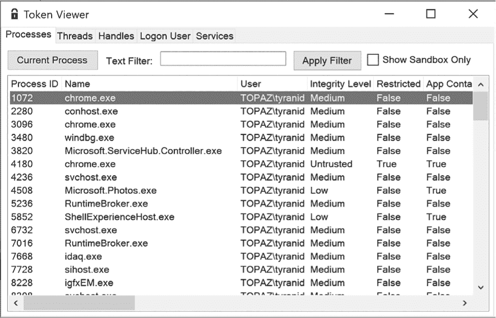
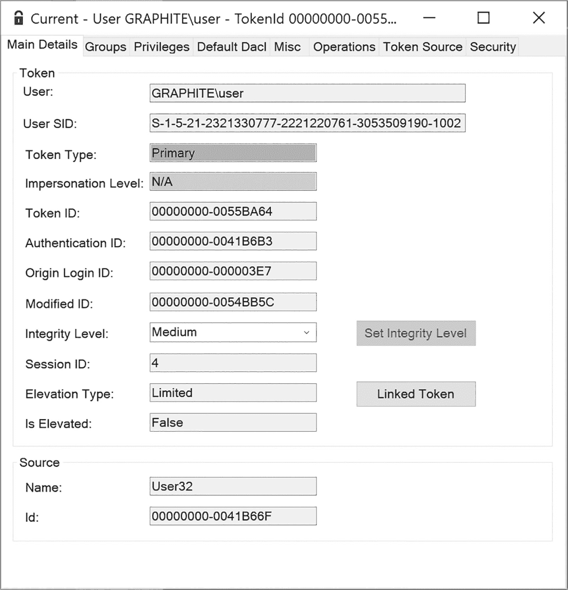
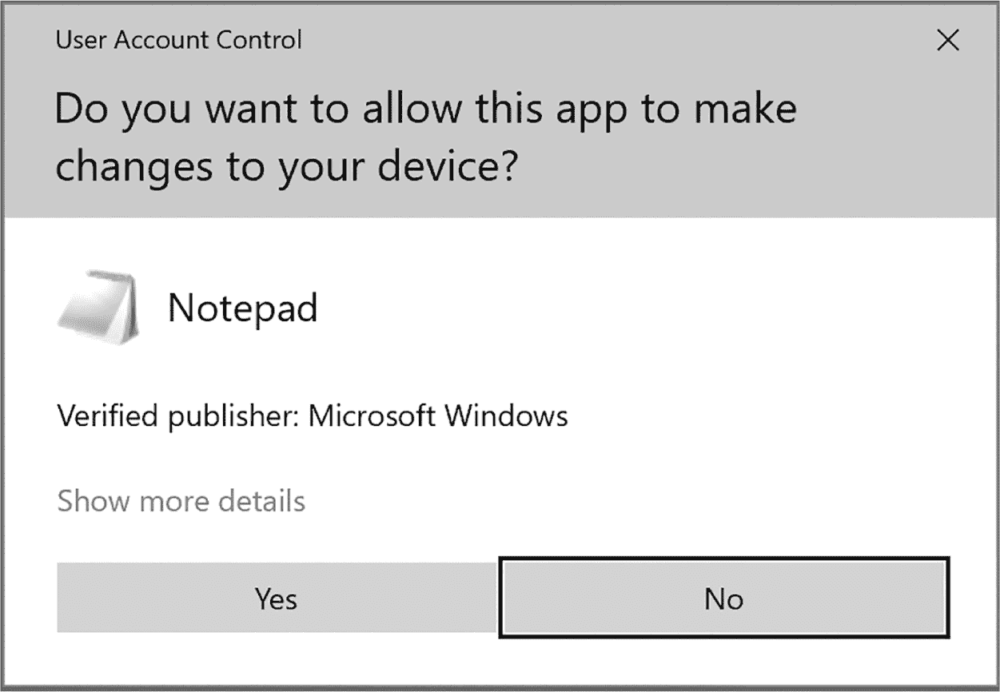
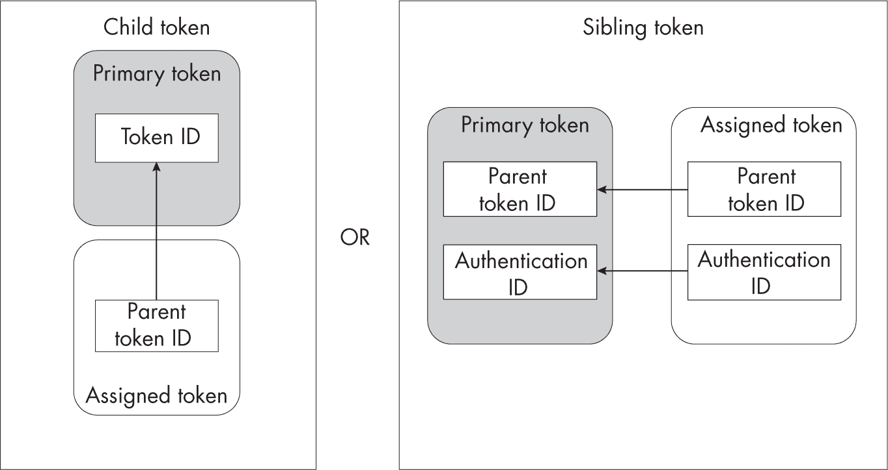
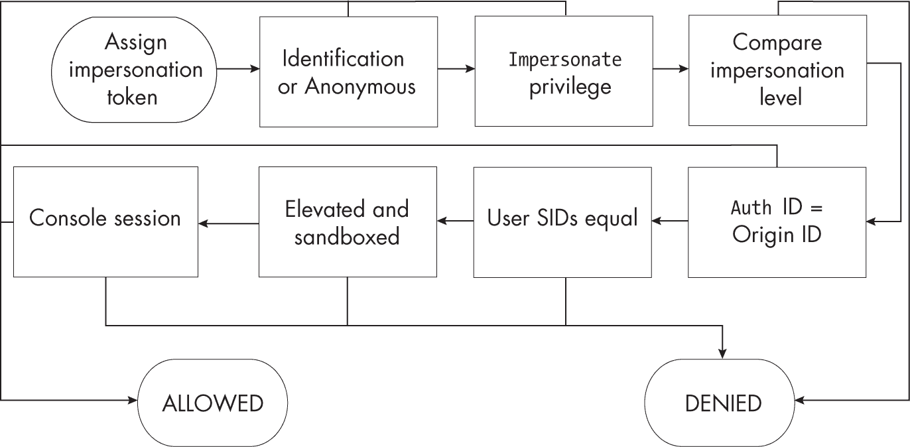

## 第十二章：4 安全访问令牌


*安全访问令牌*，简称*令牌*，是 Windows 安全性的核心。SRM 使用令牌来表示身份，如用户帐户，并授予或拒绝其对资源的访问。Windows 使用Token内核对象来表示令牌，这些对象至少包含它们所代表的特定身份、该身份所属的任何安全组以及该身份已被授予的特殊权限。

像其他内核对象一样，令牌支持Query和Set信息系统调用，这允许用户检查令牌的属性并设置某些属性。尽管不常使用，一些 Win32 API 也公开了这些Set和Query系统调用：例如，GetTokenInformation和SetTokenInformation。

让我们从概述开始，了解在分析 Windows 系统安全性时会遇到的两种主要令牌类型：主令牌和模拟令牌。接下来，我们将详细介绍令牌包含的许多重要属性。在我们讨论第七章的访问检查之前，你需要理解这些属性。

### 主令牌

每个进程都有一个分配的令牌，用于描述其在任何资源访问操作中的身份。当 SRM 执行访问检查时，它会查询进程的令牌，并使用该令牌来确定授予何种访问权限。当令牌用于进程时，它被称为*主令牌*。

你可以使用NtOpenProcessToken系统调用打开一个进程的令牌，该调用将返回一个句柄，你可以使用它查询令牌信息。由于Token对象是一个可安全访问的资源，因此调用者需要通过访问检查才能获取该句柄。请注意，你还需要拥有对进程的句柄，并且需要QueryLimitedInformation访问权限，才能查询该令牌。

打开Token对象时，你可以请求以下访问权限：

AssignPrimary  将Token对象分配为主令牌

Duplicate  复制Token对象

Impersonate  模拟Token对象

Query  查询Token对象的属性，如其组和权限

QuerySource  查询Token对象的来源

AdjustPrivileges  调整一个Token对象的权限列表

AdjustGroups  调整一个Token对象的组列表

AdjustDefault  调整一个Token对象中其他访问权限未涵盖的属性

AdjustSessionId  调整Token对象的会话 ID

你可以通过运行 PowerShell 命令Show-NtToken -All查看可访问的进程及其令牌。这样应该会打开 Token Viewer 应用程序，如图 4-1 所示。



图 4-1：Token Viewer 列出了所有可访问的进程及其令牌。

列表视图只提供可用令牌的简单概览。如果你想查看更多信息，双击其中一个进程条目，会弹出一个详细的令牌视图，如图 4-2 所示。



图 4-2：进程的 Token 对象的详细视图

让我们在这个视图中突出一些重要信息。顶部是用户的名称和 SID。Token对象只存储 SID，但如果有的话，令牌视图会显示名称。下一个字段表示令牌的类型。由于我们正在检查的是主令牌，类型设置为Primary。（此下方）模拟级别仅用于模拟令牌，我们将在下一个章节讨论它。对于主令牌来说并不需要，因此它被设置为 N/A。

在对话框的中间是四个 64 位整数标识符的列表：

**令牌 ID    **在创建Token对象时分配的唯一值

**认证 ID    **表示令牌所属的登录会话的值

**源登录 ID    **父登录会话的身份验证标识符

**修改 ID    **当某些令牌值被修改时，会更新的唯一值

当用户在 Windows 机器上进行身份验证时，LSASS 会创建一个*登录会话*。登录会话跟踪与身份验证相关的用户资源；例如，它会存储用户凭据的副本，以便以后可以重用。在登录会话创建过程中，SRM 会生成一个唯一的身份验证标识符值，用于引用该会话。因此，对于给定的登录会话，所有用户令牌将具有相同的身份验证标识符。如果用户在同一台机器上进行两次身份验证，SRM 将生成不同的身份验证标识符。

起源登录标识符指示了谁创建了令牌的登录会话。如果你在桌面上验证了另一个用户（例如，通过调用LogonUser API 并提供用户名和密码），则起源登录标识符将作为调用令牌的身份验证标识符。请注意，在图 4-2 中，这个字段显示的值是00000000-000003E7。这是 SRM 定义的四个固定身份验证标识符之一，在这种情况下表示*SYSTEM*登录会话。表 4-1 展示了这四个固定值，以及与会话相关联的用户帐户的 SID。

表 4-1： 固定登录会话的身份验证标识符和用户 SID

| 身份验证标识符 | 用户 SID | 登录会话用户名 |
| --- | --- | --- |
| 00000000-000003E4 | S-1-5-20 | NT AUTHORITY\NETWORK SERVICE |
| 00000000-000003E5 | S-1-5-19 | NT AUTHORITY\LOCAL SERVICE |
| 00000000-000003E6 | S-1-5-7 | NT AUTHORITY\ANONYMOUS LOGON |
| 00000000-000003E7 | S-1-5-18 | NT AUTHORITY\SYSTEM |

在详细视图中的标识符后面，是一个字段，指示令牌的*完整性级别*。Windows Vista 首次添加了完整性级别，以实现简单的*强制访问控制*机制，通过该机制，系统范围的策略强制访问资源，而不是允许单个资源指定其访问权限。我们将在第 109 页的“令牌组”中讨论完整性级别。

接下来是会话 ID，这是分配给进程所附加的控制台会话的数字。尽管控制台会话是进程的一个属性，但该值在进程的令牌中指定。

Token Viewer GUI 非常适合你手动检查令牌的信息。对于编程访问，你可以使用Get-NtToken命令在 PowerShell 中打开一个Token对象。使用以下命令获取当前进程的令牌：

```
PS> **$token = Get-NtToken** 
```

如果你想为特定进程打开令牌，可以使用此命令，将<PID>替换为目标进程的进程 ID：

```
PS> **$token = Get-NtToken -ProcessId** **`<PID>`** 
```

Get-NtToken命令的结果是一个Token对象，你可以查询其属性。例如，你可以显示令牌的用户，如清单 4-1 所示。

```
PS> **$token.User**
Name                  Attributes
----                  ----------
GRAPHITE\user         None 
```

清单 4-1：通过令牌对象的属性显示用户

使用Format-NtToken命令将基本信息输出到控制台，如清单 4-2 所示。

```
PS> **Format-NtToken $token -All**
USER INFORMATION
----------------
Name                  Attributes
--------------
GRAPHITE\userNone

GROUP SID INFORMATION
---------------------
Name                  Attributes
--------------
GRAPHITE\NoneMandatory, EnabledByDefault
EveryoneMandatory, EnabledByDefault
`--snip--` 
```

清单 4-2：使用 Format-NtToken 显示令牌的属性

你可以将打开的Token对象传递给Show-NtToken，以显示与图 4-2 中相同的 GUI。

###  impersonation tokens 

你会遇到的另一种令牌是*模拟令牌*。模拟令牌对于系统服务非常重要，因为它们允许具有某个身份的进程暂时模拟另一个身份以进行访问检查。例如，一个服务可能需要在执行某个操作时打开属于其他用户的文件。通过允许该服务模拟调用用户，系统即使该服务无法直接打开文件，也会授予它访问权限。

impersonation 令牌分配给线程，而不是进程。这意味着只有在该线程中运行的代码才会采用模拟身份。模拟令牌可以通过三种方式分配给线程：

+   通过显式授予 Token 对象 Impersonate 访问权限和 Thread 对象 SetThreadToken 访问权限

+   通过显式授予 Thread 对象 DirectImpersonation 访问权限

+   隐式地，通过冒充 RPC 请求

你最有可能遇到隐式令牌分配，因为这是系统服务的最常见情况，系统服务通常暴露 RPC 机制。例如，如果服务创建了一个命名管道服务器，它可以使用 ImpersonateNamedPipe API 冒充连接到管道的客户端。当在命名管道上进行调用时，内核会基于调用线程和进程捕获一个 *冒充上下文*。这个冒充上下文用于将冒充令牌分配给调用 ImpersonateNamedPipe 的线程。冒充上下文可以基于线程上现有的冒充令牌，也可以基于进程的主令牌的副本。

#### 安全服务质量

如果你不希望服务具备冒充你身份的能力，SRM 支持一个叫做 *安全服务质量（SQoS）* 的功能，允许你控制这一点。当你通过文件系统 API 打开命名管道时，你可以在 OBJECT_ATTRIBUTES 结构的 SecurityQualityOfService 字段中传递一个 SECURITY_QUALITY_OF_SERVICE 结构。SQoS 结构包含三个配置值：冒充级别、上下文跟踪模式和有效令牌模式。

SQoS 中的 *冒充级别* 是控制服务使用你身份的能力的最重要字段。它定义了在服务隐式冒充调用者时授予该服务的访问级别。级别可以是四个值之一，按特权的升序排列：

1.  **匿名：** 阻止服务打开 Token 对象并查询用户的身份。这是最低级别；如果调用方指定此级别，只有有限的一组服务可以正常工作。

2.  **身份识别：** 允许服务打开 Token 对象并查询用户的身份、组和权限。然而，在冒充用户时，线程不能打开任何受保护的资源。

3. **模拟：** 允许服务在本地系统上完全行使用户的身份。服务可以打开用户保护的本地资源并对其进行操作。如果用户已经在本地系统上通过身份验证，服务还可以代表用户访问远程资源。然而，如果用户是通过网络连接进行身份验证的，例如通过服务器消息块（SMB）协议，那么服务无法使用Token对象来访问远程资源。

4. **委托：** 允许服务像用户一样打开所有本地和远程资源。这是最高级别。然而，要从网络身份验证的用户访问远程资源，单靠此模拟级别是不够的。Windows 域还必须配置为允许此操作。我们将在第十四章中讨论这个模拟级别，涉及 Kerberos 身份验证。

你可以在调用服务时或创建现有令牌的副本时，在 SQoS 中指定模拟级别。为了限制服务的操作权限，可以指定标识或匿名级别。这样可以防止服务访问任何资源，尽管在标识级别下，服务仍然能够访问令牌并代表调用者执行操作。

让我们使用Invoke-NtToken PowerShell 命令进行测试。在示例 4-3 中，我们模拟了两个不同级别的令牌，并尝试执行一个打开受保护资源的脚本。我们使用ImpersonationLevel属性来指定模拟级别。

```
PS> **$token = Get-NtToken**
PS> **Invoke-NtToken $token {**
    **Get-NtDirectory -Path "\"**
**} -ImpersonationLevel Impersonation**
Name NtTypeName
---- ----------
     Directory

PS> **Invoke-NtToken $token {**
    **Get-NtDirectory -Path "\"**
**} -ImpersonationLevel Identification**
Get-NtDirectory : (0xC00000A5) - A specified impersonation level is invalid.
`--snip--` 
```

示例 4-3：在不同级别上模拟令牌并打开受保护资源

我们执行的第一个命令获取当前进程的主令牌句柄。然后我们调用Invoke-NtToken以模拟令牌在模拟级别，并运行一个调用Get-NtDirectory的脚本来打开根 OMNS 目录。打开操作成功，我们将目录对象打印到控制台。

然后我们尝试在标识级别重复该操作，但这次我们收到一个STATUS_BAD_IMPERSONATION_LEVEL错误。（如果你在开发应用程序或使用系统时看到此错误，现在你就知道原因了！）请注意，打开操作不会返回“访问被拒绝”错误，因为 SRM 没有足够的权限去检查模拟用户是否可以访问该资源。

SQoS 中的另两个字段使用得较少，但仍然很重要。*上下文跟踪模式*决定了在连接到服务时是否静态捕获用户的身份。如果身份没有静态捕获，而调用者在调用服务之前模拟了另一个用户，则新的模拟身份将传递给服务，而不是进程身份。请注意，只有当模拟令牌处于模拟级别或委托级别时，模拟身份才能传递给服务。如果模拟令牌处于身份验证级别或匿名级别，SRM 会生成安全错误并拒绝模拟操作。

*有效令牌模式*以不同的方式更改传递给服务器的令牌。可以在调用之前禁用组和权限，如果禁用了有效令牌模式，服务器可以重新启用这些组和权限并使用它们。然而，如果启用了有效令牌模式，SRM 将剥离这些组和权限，以便服务器不能重新启用它们或使用它们。

默认情况下，如果在打开进程间通信（IPC）通道时没有指定 SQoS 结构，调用者的级别为模拟级别，并且具有静态跟踪和无效令牌。如果捕获了模拟上下文并且调用者已经在模拟中，则线程令牌的模拟级别必须大于或等于模拟级别；否则，捕获将失败。即使 SQoS 请求的是身份验证级别，这一点也会被强制执行。这是一个重要的安全特性；它防止处于身份验证级别或以下的调用者通过 RPC 通道调用并冒充另一个用户。

> 注意
> 
> *我已经描述了如何在本地系统调用级别指定 SQoS，因为< samp class="SANS_TheSansMonoCd_W5Regular_Italic_I_11">SECURITY _QUALITY_OF_SERVICE结构没有通过 Win32 API 直接暴露。相反，它通常通过额外的标志指定；例如，CreateFile通过指定< samp class="SANS_TheSansMonoCd_W5Regular_Italic_I_11">SECURITY_SQOS_PRESENT标志来暴露 SQoS。*

#### 显式令牌模拟

显式模拟令牌有两种方式。如果你有一个带有< samp class="SANS_TheSansMonoCd_W5Regular_11">Impersonate访问权限的模拟< samp class="SANS_TheSansMonoCd_W5Regular_11">Token对象句柄，你可以使用< samp class="SANS_TheSansMonoCd_W5Regular_11">NtSetInformationThread系统调用和< samp class="SANS_TheSansMonoCd_W5Regular_11">ThreadImpersonationToken信息类将其分配给线程。

如果你想使用直接假冒访问来假冒一个线程，可以使用另一种机制。通过源线程的句柄，你可以调用NtImpersonateThread系统调用，并将假冒令牌分配给另一个线程。使用NtImpersonateThread是显式和隐式假冒的结合。内核将捕获一个假冒上下文，仿佛源线程通过命名管道进行了调用。你甚至可以为系统调用指定 SQoS 结构。

你可能会想，假冒操作会打开一个巨大的安全后门。如果我设置了自己的命名管道，并说服一个特权进程连接到我，而调用者没有设置 SQoS 来限制访问，那我不是可以获得提升的权限吗？我们将在第 133 页的“令牌分配”部分回到如何防止这种情况。

### 令牌类型之间的转换

你可以使用复制在两种令牌类型之间进行转换。当你复制一个令牌时，内核会创建一个新的Token对象，并对该对象的所有属性进行深度复制。在令牌复制时，你可以改变它的类型。

这种复制操作与我们在第三章中讨论的句柄复制不同，因为复制一个令牌的句柄只是创建一个新的句柄，指向相同的Token对象。要复制实际的Token对象，你需要拥有句柄上的Duplicate访问权限。

然后你可以使用NtDuplicateToken系统调用或Copy -NtTokenPowerShell 命令来复制令牌。例如，要基于现有令牌创建一个在委托级别的假冒令牌，可以使用列表 4-4 中的脚本。

```
PS> **$imp_token = Copy-NtToken -Token $token -ImpersonationLevel Delegation**
PS> **$imp_token.ImpersonationLevel**
Delegation

PS> **$imp_token.TokenType**
Impersonation 
```

列表 4-4：复制令牌以创建假冒令牌

你可以通过再次使用Copy-NtToken将假冒令牌转换回主令牌，如列表 4-5 所示。

```
PS> **$pri_token = Copy-NtToken -Token $imp_token -Primary**
PS> **$pri_token.TokenType**
Primary

PS> **$pri_token.ImpersonationLevel**
Delegation 
```

列表 4-5：将假冒令牌转换为主令牌

注意输出中的一个有趣之处：新的主令牌与原始令牌具有相同的假冒级别。这是因为 SRM 只考虑TokenType属性；如果令牌是主令牌，假冒级别将被忽略。

既然我们可以将模拟令牌转换回主令牌，你可能会想：我们能否将识别级别或匿名级别的令牌转换回主令牌，创建一个新进程，并绕过 SQoS 设置？我们在列表 4-6 中试试。

```
PS> **$imp_token = Copy-NtToken -Token $token -ImpersonationLevel Identification**
PS> **$pri_token = Copy-NtToken -Token $imp_token -Primary**
Exception: "(0xC00000A5) - A specified impersonation level is invalid." 
```

列表 4-6：将识别级别令牌复制回主令牌

该列表显示我们不能将识别级别的令牌复制回主令牌。第二行会引发异常，因为此操作会破坏 SRM 的安全保证（具体来说，SQoS 允许调用方控制其身份的使用方式）。

最后需要注意的是：如果你使用Get-NtToken打开令牌，可以通过指定Duplicate参数一步完成复制操作。

### 伪令牌句柄

要访问令牌，必须首先打开一个Token对象的句柄，使用完后记得关闭句柄。Windows 10 引入了三种*伪句柄*，允许你查询令牌信息，而无需打开完全的内核对象句柄。以下是这三种句柄及其句柄值（括号内）：

**主令牌 (-4)    **当前进程的主令牌

**模拟 (-5)    **当前线程的模拟令牌；如果线程没有进行模拟，则失败

**有效令牌 (-6)    **当前线程的模拟令牌（如果它正在进行模拟）；否则为主令牌

与当前进程和当前线程伪句柄不同，不能复制这些令牌句柄；它们只能用于某些有限的用途，如查询信息或执行访问检查。如果你指定了Pseudo参数，Get-NtToken命令可以返回这些句柄，如列表 4-7 所示。

```
PS> **Invoke-NtToken -Anonymous {Get-NtToken -Pseudo -Primary | Get-NtTokenSid}**
Name                         Sid
----                         ---
GRAPHITE\user                S-1-4-21-2318445812-3516008893-216915059-1002 ❶

PS> **Invoke-NtToken -Anonymous {Get-NtToken -Pseudo -Impersonation | Get-NtTokenSid}**
Name                         Sid
----                         ---
NT AUTHORITY\ANONYMOUS LOGON S-1-4-7 ❷

PS> **Invoke-NtToken -Anonymous {Get-NtToken -Pseudo -Effective | Get-NtTokenSid}**
Name                         Sid
----                         ---
NT AUTHORITY\ANONYMOUS LOGON S-1-4-7 ❸

PS> **Invoke-NtToken -Anonymous {Get-NtToken -Pseudo -Effective} | Get-NtTokenSid**
Name                         Sid
----                         ---
GRAPHITE\user                S-1-4-21-2318445812-3516008893-216915059-1002 ❹ 
```

列表 4-7：查询伪令牌

在这里，我们在模拟匿名用户时查询三种类型的伪令牌。第一个命令查询主令牌并提取其用户 SID ❶。下一个命令查询模拟令牌，返回匿名用户的 SID ❷。然后我们查询有效令牌，由于我们模拟的是匿名用户，它也返回匿名用户的 SID ❸。最后，我们再次查询有效令牌，这次等脚本块执行完毕后提取用户 SID。此操作返回主令牌的用户 SID ❹，证明伪令牌是上下文敏感的。

### 令牌组

如果管理员必须为每个可能的用户保护每个资源，身份安全将变得难以管理。*组* 允许用户共享更广泛的安全身份。在 Windows 中，大多数访问控制操作是授予组而不是单个用户。

从 SRM 的角度来看，组只是另一个 SID，它可能定义对某个资源的访问。我们可以使用 Get-NtTokenGroup 命令在 PowerShell 控制台中显示这些组，如 列表 4-8 所示。

```
PS> **Get-NtTokenGroup $token**
Name                                     Attributes
----                                     ----------
GRAPHITE\None                            Mandatory, EnabledByDefault, Enabled
Everyone                                 Mandatory, EnabledByDefault, Enabled
BUILTIN\Users                            Mandatory, EnabledByDefault, Enabled
BUILTIN\Performance Log Users            Mandatory, EnabledByDefault, Enabled
NT AUTHORITY\INTERACTIVE                 Mandatory, EnabledByDefault, Enabled
`--snip--` 
```

列表 4-8：查询当前令牌的组

我们还可以使用 Get-NtTokenGroup 通过指定 Attributes 参数来过滤特定的属性标志。表 4-2 显示了我们可以传递给命令的所有可能的属性标志。

表 4-2： SDK 和 PowerShell 格式中的组属性

| SDK 属性名称 | PowerShell 属性名称 |
| --- | --- |
| SE_GROUP_ENABLED | 启用 |
| SE_GROUP_ENABLED_BY_DEFAULT | 默认启用 |
| SE_GROUP_MANDATORY | 强制 |
| SE_GROUP_LOGON_ID | 登录 ID |
| SE_GROUP_OWNER | 所有者 |
| SE_GROUP_USE_FOR_DENY_ONLY | 仅用于拒绝 |
| SE_GROUP_INTEGRITY | 完整性 |
| SE_GROUP_INTEGRITY_ENABLED | 完整性启用 |
| SE_GROUP_RESOURCE | 资源 |

以下各节描述了这些标志的含义。

#### 启用，默认启用，和强制

最重要的标志是Enabled。当设置此标志时，SRM 会在访问检查过程中考虑该组；否则，它会忽略该组。任何设置了EnabledByDefault属性的组都会自动启用。

如果你在令牌句柄上拥有AdjustGroups访问权限，可以使用NtAdjustGroupsToken系统调用禁用某个组（将其排除在访问检查过程之外）；Set-NtTokenGroup PowerShell 命令会暴露这个系统调用。然而，你无法禁用具有Mandatory标志的组。这个标志在普通用户的令牌中会被设置，但某些系统令牌中可能有非强制性的组。如果在通过 RPC 传递模拟令牌时禁用了一个组，并且 SQoS 中设置了有效令牌模式标志，那么模拟令牌将删除该组。

#### LogonId

LogonId标志标识授予所有在同一桌面的令牌的 SID。例如，如果你使用runas工具以其他用户身份运行一个进程，则新进程的令牌将具有与调用者相同的登录 SID，尽管它是不同的身份。这种行为允许 SRM 授予对特定会话资源的访问权限，例如会话对象目录。SID 总是采用S-1-4-4-X-Y的格式，其中X和Y是当身份验证会话创建时分配的 LUID 的两个 32 位值。我们将在下一章回到登录 SID 及其应用场景。

#### Owner

系统上的所有可安全访问的资源都属于某个组 SID 或用户 SID。令牌有一个Owner属性，包含一个 SID，用作创建资源时的默认所有者。SRM 只允许在Owner属性中指定一组特定的用户 SID：要么是用户的 SID，要么是任何带有Owner标志的组 SID。

你可以使用Get -NtTokenSid或Set-NtTokenSid命令获取或设置令牌的当前Owner属性。例如，在 Listing 4-9 中，我们从当前令牌获取所有者 SID，然后尝试设置所有者。

```
PS> **Get-NtTokenSid $token -Owner**
Name          Sid
----          ---
GRAPHITE\user S-1-4-21-818064984-378290696-2985406761-1002

PS> **Set-NtTokenSid -Owner -Sid "S-1-2-3-4"**
Exception setting "Owner": "(0xC000005A) - Indicates a particular
Security ID may not be assigned as the owner of an object." 
```

Listing 4-9：获取和设置令牌的所有者 SID

在这种情况下，我们尝试将Owner属性设置为 SID S-1-2-3-4时，出现异常失败，因为这不是当前用户的 SID，也不在我们的组列表中。

#### UseForDenyOnly

SRM 的访问检查要么允许，要么拒绝对 SID 的访问。但是，当 SID 被禁用时，它将不再参与允许或拒绝检查，这可能导致访问检查不正确。

让我们考虑一个简单的例子。假设有两个组，*员工*和*远程访问*。用户创建了一个文档，希望所有员工都能阅读，但远程访问系统的用户不能访问，因为文档内容敏感，用户不希望泄露。该文档被配置为授予所有*员工*组的成员访问权限，但拒绝*远程访问*组的用户访问。

现在假设一个同时属于这两个组的用户在访问资源时可以禁用一个组。只需禁用*远程访问*组，就可以基于他们在*员工*组中的成员身份，轻松绕过访问限制，从而获得文档的访问权限。

因此，用户通常不会被允许禁用组。然而，在某些情况下，例如沙盒操作，你可能希望能够禁用某个组，以使其无法用于访问资源。UseForDenyOnly标志解决了这个问题。当 SID 被标记为此标志时，它在检查允许访问时不会被考虑，但在拒绝访问检查时仍然会被考虑。用户可以通过过滤其令牌并使用该令牌创建新进程来将自己的组标记为UseForDenyOnly。我们将在第 117 页的“沙盒令牌”部分讨论令牌过滤。

#### 完整性和完整性启用

完整性 和 IntegrityEnabled 属性标志表示一个 SID 代表令牌的完整性级别，并且已经启用。带有 完整性 属性标志的组 SID 在其最终的 RID 中存储此完整性级别，作为一个 32 位数字。RID 可以是任何任意值；然而，SDK 中定义了七个预定义级别，如 表 4-3 所示。只有前六个级别在用户进程中常用且可访问。为了指示一个完整性 SID，SRM 使用 MandatoryLabel 安全权限（其值为 16）。

表 4-3： 预定义的完整性级别值

| 完整性级别 | SDK 名称 | PowerShell 名称 |
| --- | --- | --- |
| 0 | SECURITY_MANDATORY_UNTRUSTED_RID | Untrusted |
| 4096 | SECURITY_MANDATORY_LOW_RID | Low |
| 8192 | SECURITY_MANDATORY_MEDIUM_RID | Medium |
| 8448 | SECURITY_MANDATORY_MEDIUM_PLUS_RID | MediumPlus |
| 12288 | SECURITY_MANDATORY_HIGH_RID | High |
| 16384 | SECURITY_MANDATORY_SYSTEM_RID | System |
| 20480 | SECURITY_MANDATORY_PROTECTED_PROCESS_RID | ProtectedProcess |

用户的默认级别是 中等。管理员通常被分配 高级，服务则被分配 系统。我们可以使用 Get-NtTokenSid 查询令牌的完整性 SID，如 清单 4-10 所示。

```
PS> **Get-NtTokenSid $token -Integrity**
Name                                   Sid
----                                   ---
Mandatory Label\Medium Mandatory Level S-1-16-8192 
```

清单 4-10：获取令牌的完整性级别 SID

我们也可以设置一个新的令牌完整性级别，只要它小于或等于当前值。也可以提升级别，但这需要特权权限，并且需要启用 SeTcbPrivilege。

虽然你可以设置整个 SID，但通常更方便只设置其值。例如，清单 4-11 中的脚本将令牌的完整性级别设置为 低 级别。

```
PS> **Set-NtTokenIntegrityLevel Low -Token $token**
PS> **Get-NtTokenSid $token -Integrity**
Name                                   Sid
----                                   ---
Mandatory Label\Low Mandatory Level    S-1-16-4096 
```

清单 4-11：将令牌完整性级别设置为低

如果你运行此脚本，可能会发现由于文件访问被阻止，你的 PowerShell 控制台开始出现错误。当我们在 第七章 讨论强制完整性控制时，会讨论为什么文件访问会被阻止。

#### 资源

最后的属性标志只需要简单提及一下。资源 属性标志表示该组 SID 是 *域本地 SID*。我们将在 第十章 详细讨论这种 SID 类型。

#### 设备组

令牌还可以有一个单独的 *设备组* 列表。当用户在企业环境中通过网络认证到服务器时，这些组 SID 会被添加，如 清单 4-12 所示。

```
PS> **Get-NtTokenGroup -Device -Token $token**
Name                                 Attributes
----                                 ----------
BUILTIN\Users                        Mandatory, EnabledByDefault, Enabled
AD\CLIENT1$                          Mandatory, EnabledByDefault, Enabled
AD\Domain Computers                  Mandatory, EnabledByDefault, Enabled
NT AUTHORITY\Claims Value            Mandatory, EnabledByDefault, Enabled
`--snip--` 
```

清单 4-12：使用 Get-NtTokenGroup 显示设备组

你可以通过使用 Get-NtTokenGroup 并传递 Device 参数，查询令牌上的组。

### 权限

组允许系统管理员控制用户对特定资源的访问。*权限*，相反，是授予用户的，允许他们绕过所有类型资源的某些安全检查，比如跳过访问检查。权限还可以应用于某些特权操作，如更改系统时钟。你可以在控制台中使用 Get-NtTokenPrivilege 查看令牌的权限（参见 清单 4-13）。

```
PS> **Get-NtTokenPrivilege $token**
Name                           Luid                 Enabled
----                           ----                 -------
SeShutdownPrivilege            00000000-00000013    False
SeChangeNotifyPrivilege        00000000-00000017    True
SeUndockPrivilege              00000000-00000019    False
SeIncreaseWorkingSetPrivilege  00000000-00000021    False
SeTimeZonePrivilege            00000000-00000022    False 
```

清单 4-13：列出令牌权限

输出被分为三列。第一列是特权的通用名称。与 SID 一样，SRM 并不直接使用此名称，而是使用特权的 LUID 值，我们可以在第二列中看到。最后一列指示特权当前是否已启用。特权可以处于启用或禁用状态。

对特权的任何检查都应该确保特权是启用的，而不仅仅是存在。在某些情况下，例如沙箱化，令牌可能列出了特权，但沙箱限制可能会阻止它被标记为启用。Enabled 标志实际上是一组属性标志，类似于组 SID 的属性。我们可以通过将 Get-NtTokenPrivilege 的输出格式化为列表来查看这些属性（清单 4-14）。

```
PS> **Get-NtTokenPrivilege $token -Privileges SeChangeNotifyPrivilege | Format-List**
Name        : SeChangeNotifyPrivilege
Luid        : 00000000-00000017
Attributes  : EnabledByDefault, Enabled
Enabled     : True
DisplayName : Bypass traverse checking 
```

清单 4-14：显示 SeChangeNotifyPrivilege 特权的所有属性

在输出中，我们现在可以看到属性，其中包括 Enabled 和 EnabledByDefault。EnabledByDefault 属性指定特权的默认状态是否为启用。我们还可以看到一个额外的 DisplayName 属性，用于向用户提供额外的信息。

要修改令牌的特权状态，您需要在令牌句柄上具有 AdjustPrivileges 访问权限；然后可以使用 NtAdjustPrivilegesToken 系统调用来调整属性并启用或禁用特权。Enable-NtTokenPrivilege 和 Disable-NtTokenPrivilege PowerShell 命令暴露了此系统调用，如 清单 4-15 所示。

```
PS> **Enable-NtTokenPrivilege SeTimeZonePrivilege -Token $token -PassThru**
Name                           Luid                 Enabled
----                           ----                 -------
SeTimeZonePrivilege            00000000-00000022    True

PS> **Disable-NtTokenPrivilege SeTimeZonePrivilege -Token $token -PassThru**
Name                           Luid                 Enabled
----                           ----                 -------
SeTimeZonePrivilege            00000000-00000022    False 
```

清单 4-15：启用和禁用 SeTimeZonePrivilege 特权

使用 NtAdjustPrivilegesToken API，还可以通过指定 Remove 属性完全移除特权，您可以通过 Remove-NtTokenPrivilege PowerShell 命令来实现。移除特权可确保令牌永远无法再次使用该特权。如果只是禁用特权，它可能会被无意中重新启用。清单 4-16 展示了如何移除特权。

```
PS> **Get-NtTokenPrivilege $token -Privileges SeTimeZonePrivilege**
Name                           Luid                 Enabled
----                           ----                 -------
SeTimeZonePrivilege            00000000-00000022    False

PS> **Remove-NtTokenPrivilege SeTimeZonePrivilege -Token $token**
PS> **Get-NtTokenPrivilege $token -Privileges SeTimeZonePrivilege**
WARNING: Couldn't get privilege SeTimeZonePrivilege 
```

清单 4-16：从令牌中移除特权

要检查权限，用户应用程序可以调用 NtPrivilegeCheck 系统调用，而内核代码可以调用 SePrivilegeCheck API。你可能会想，是否可以直接手动测试某个权限是否启用，而不是使用专用的系统调用。在这种情况下，是的；然而，尽可能使用系统设施总是值得的，以防你在实现中犯错误或没有考虑到某些边缘情况。Test-NtTokenPrivilege PowerShell 命令封装了系统调用，如 清单 4-17 所示。

```
PS> **Enable-NtTokenPrivilege SeChangeNotifyPrivilege**
PS> **Disable-NtTokenPrivilege SeTimeZonePrivilege**
PS> **Test-NtTokenPrivilege SeChangeNotifyPrivilege**
True

PS> **Test-NtTokenPrivilege SeTimeZonePrivilege, SeChangeNotifyPrivilege -All**
False

PS> **Test-NtTokenPrivilege SeTimeZonePrivilege, SeChangeNotifyPrivilege**
**-All -PassResult**
EnabledPrivileges           AllPrivilegesHeld
-----------------           -----------------
{SeChangeNotifyPrivilege}   False 
```

清单 4-17：执行权限检查

本清单演示了使用 Test-NtTokenPrivilege 进行的一些权限检查示例。我们首先启用 SeChangeNotifyPrivilege 并禁用 SeTimeZonePrivilege。这些是授予所有用户的常见权限，但如果你的令牌没有它们，可能需要更改示例。接着，我们仅测试 SeChangeNotifyPrivilege；它被启用，所以该测试返回 True。然后，我们检查 SeTimeZonePrivilege 和 SeChangeNotifyPrivilege；我们可以看到我们没有所有的权限，因此 Test-NtTokenPrivilege 返回 False。最后，我们运行相同的命令，但指定 -PassResult 选项以返回完整的检查结果。我们可以在 EnabledPrivileges 列中看到只有 SeChangeNotifyPrivilege 被启用。

以下是系统上可用的一些权限：

SeChangeNotifyPrivilege 这个权限的名称可能会让人误解。它允许用户接收文件系统或注册表的变化通知，但它也用于绕过遍历检查。我们将在 第八章 中讨论遍历检查。

SeAssignPrimaryTokenPrivilege 和 SeImpersonatePrivilege这些权限分别允许用户绕过主令牌分配和 impersonation 检查。与此列表中的大多数权限不同，这些必须在当前进程的主令牌上启用，而不是在 impersonation 令牌上。

SeBackupPrivilege 和 SeRestorePrivilege  这些权限允许用户绕过访问检查，从而打开特定资源，如文件或注册表项。这使得用户可以在不显式授予访问权限的情况下备份和恢复资源。这些权限还被重新用于其他用途：例如，恢复权限允许用户加载任意的注册表树。

SeSecurityPrivilege 和 SeAuditPrivilege  第一个权限允许用户在资源上获得AccessSystemSecurity访问权限，从而可以修改资源的审计配置。SeAuditPrivilege权限允许用户从应用程序生成任意的对象审计消息。我们将在第五章、第六章和第九章中讨论审计相关内容。

SeCreateTokenPrivilege  该权限应仅授予一小部分用户，因为它允许使用NtCreateToken系统调用创建任意令牌。

SeDebugPrivilege  该权限的名称表明它是调试进程所必需的。然而，事实并非如此，因为即使没有此权限，也可以调试进程。该权限允许用户在打开进程或线程对象时绕过任何访问检查。

SeTcbPrivilege  该权限的名称来源于*可信计算基础（TCB）*，该术语用来指代 Windows 操作系统的特权核心，包括内核。这是一个涵盖所有特权操作的权限，适用于那些没有更具体权限的操作。例如，它允许用户绕过增加令牌完整性级别的检查（最高可至System级别），还可以为进程指定一个回退异常处理程序，这两个操作实际上没有太大关联。

SeLoadDriverPrivilege  我们可以通过NtLoadDriver系统调用加载新的内核驱动程序，尽管通常更常用的是使用 SCM。成功执行该系统调用需要此权限。需要注意的是，拥有此权限并不能绕过内核驱动检查，例如代码签名检查。

SeTakeOwnershipPrivilege 和 SeRelabelPrivilege 这两个特权具有相同的直接效果：它们允许用户被授予 WriteOwner 访问资源的权限，即使正常的访问控制不允许这样做。SeTakeOwnershipPrivilege 允许用户接管资源的所有权，因为拥有 WriteOwner 权限是此操作的必要条件。SeRelabelPrivilege 绕过了对资源强制标签的检查；通常，你只能将标签设置为等于或低于调用者的完整性级别。设置强制标签还需要对句柄具有 WriteOwner 权限，正如我们在第六章中将看到的那样。

我们将在后续章节中查看这些特权的具体应用示例，当时我们将讨论安全描述符和访问检查。现在，让我们转向通过沙箱限制访问的方法。

### 沙箱令牌

在我们的互联世界中，我们必须处理大量不可信的数据。攻击者可能会构造恶意数据，目的包括利用网页浏览器或文档阅读器中的安全漏洞。为应对这一威胁，Windows 提供了一种方法，通过将任何处理不可信数据的进程置于沙箱中来限制用户能够访问的资源。如果该进程被攻破，攻击者将只能看到系统的有限视图，并且无法访问用户的敏感信息。Windows 通过三种特殊的令牌类型来实现沙箱：受限令牌、写保护令牌和低级令牌。

#### 受限令牌

*受限令牌* 类型是 Windows 中最早的沙箱令牌。它作为 Windows 2000 中的一个特性引入，但直到 Google Chrome 网络浏览器推出后才被广泛用于沙箱。其他浏览器，如 Firefox，随后也复制了 Chrome 的沙箱实现，像 Adobe Reader 这样的文档阅读器也是如此。

你可以使用 NtFilterToken 系统调用或 CreateRestrictedToken Win32 API 创建一个受限令牌，每个方法都允许你指定一个受限 SID 列表，以限制该令牌可以访问的资源。这些 SID 不必已经存在于令牌中。例如，Chrome 最严格的沙箱指定 NULL SID (S-1-0-0) 作为唯一的受限 SID。NULL SID 从不作为普通组分配给令牌。

任何访问检查都必须同时允许正常组列表和受限 SIDs 列表；否则，用户将被拒绝访问，我们将在第七章中详细讨论。NtFilterToken 系统调用也可以使用 UseForDenyOnly 属性标记正常组并删除权限。我们可以将过滤令牌的能力与受限 SIDs 结合使用，或者单独使用它，来创建一个权限较低的令牌，而不需要更全面的沙盒。

创建一个无法访问任何资源的受限令牌是很容易的。这样的限制产生了一个很好的沙盒环境，但也使得无法将其用作进程的主要令牌，因为该进程无法启动。这对使用受限令牌的沙盒的有效性带来了严重的限制。列表 4-18 演示了如何创建受限令牌并提取结果。

```
PS> **$token = Get-NtToken -Filtered -RestrictedSids RC -SidsToDisable WD**
**-Flags DisableMaxPrivileges**
PS> **Get-NtTokenGroup $token -Attributes UseForDenyOnly**
Name                           Attributes
----                           ----------
Everyone                       UseForDenyOnly

PS> **Get-NtTokenGroup $token -Restricted**
Name                           Attributes
----                           ----------
NT AUTHORITY\RESTRICTED        Mandatory, EnabledByDefault, Enabled

PS> **Get-NtTokenPrivilege $token**
Name                           Luid                 Enabled
----                           ----                 -------
SeChangeNotifyPrivilege        00000000-00000017    True

PS> **$token.Restricted**
True 
```

列表 4-18：创建受限令牌并显示组和权限

我们首先使用 Get-NtToken 命令创建一个受限令牌。我们指定一个受限 SID，RC，它映射到一个特殊的 NT AUTHORITY\RESTRICTED SID，通常用于系统资源，以允许读取访问。我们还指定希望将 *Everyone* 组 (WD) 转换为 UseForDenyOnly。最后，我们指定一个标志来禁用最大权限。

接下来，我们展示该令牌的属性，从所有正常的组开始，使用 UseForDenyOnly 属性。输出显示，只有*Everyone*组设置了该标志。然后我们展示受限的 SIDs 列表，其中显示了 NT AUTHORITY\RESTRICTED SID。

接下来，我们展示权限。请注意，即使我们要求禁用最大权限，SeChangeNotifyPrivilege 仍然存在。这个权限不会被删除，因为没有它，访问资源会变得非常困难。如果你真的想去除它，可以明确地将其指定给 NtFilterToken，或者在令牌创建后删除它。

最后，我们查询表示是否为受限令牌的令牌属性。

#### 写入受限令牌

*写限制令牌* 阻止对资源的写入访问，但允许读取和执行访问。你可以通过将 WRITE_RESTRICTED 标志传递给 NtFilterToken 来创建一个写限制令牌。

Windows XP SP2 引入了这种令牌类型，以增强系统服务的安全性。它比受限令牌更容易用作沙箱，因为你不需要担心令牌无法读取关键资源，如 DLL 文件。然而，它创建了一个不太有用的沙箱。例如，如果你可以读取某个用户的文件，你可能会窃取他们的私人信息，比如浏览器存储的密码，而无需逃脱沙箱。

为了完整性，我们创建一个写限制令牌并查看其属性（列表 4-19）。

```
PS> **$token = Get-NtToken -Filtered -RestrictedSids WR -Flags WriteRestricted**
PS> **Get-NtTokenGroup $token -Restricted**
Name                           Attributes
----                           ----------
NT AUTHORITY\WRITE RESTRICTED  Mandatory, EnabledByDefault, Enabled

PS> **$token.Restricted**
True

PS> **$token.WriteRestricted**
True 
```

列表 4-19：创建一个写限制令牌

我们首先使用 Get-NtToken 命令创建令牌。我们指定一个受限 SID，WR，它映射到一个特殊的 NT AUTHORITY\WRITE RESTRICTED SID，相当于 NT AUTHORITY\RESTRICTED，但被分配到对特定系统资源的写访问权限。我们还指定 WriteRestricted 标志，以使其成为一个写限制令牌，而不是一个普通的受限令牌。

接下来，我们显示令牌的属性。在受限 SID 列表中，我们看到 NT AUTHORITY\WRITE RESTRICTED。显示 Restricted 属性时，显示该令牌被认为是受限的；然而，我们可以看到它也被标记为 WriteRestricted。

#### 应用容器和低盒令牌

Windows 8 引入了应用容器沙箱，以保护新的 Windows 应用程序模型。应用容器通过使用 *低盒令牌* 来实现其安全性。你可以通过 NtCreateLowBoxToken 系统调用，从现有令牌创建低盒令牌。这个系统调用没有直接对应的 Win32 API，但你可以使用 CreateProcess API 创建一个应用容器进程。我们在这里不会详细讨论如何使用这个 API 创建进程，而是专注于低盒令牌。

在创建低权限令牌时，您需要指定一个软件包 SID 和一组功能 SID。这两种 SID 类型都由*应用程序包权限*（其值为 15）发布。通过检查它们的第一个 RID，您可以区分软件包 SID 和功能 SID，它们分别应该是 2 和 3。软件包 SID 类似于正常令牌中的用户 SID，而功能 SID 类似于受限 SID。我们将把这些如何影响访问检查的具体细节留到第七章中。

功能 SID 修改了访问检查过程，但它们也可以单独表示某些意义。例如，Windows 防火墙专门处理允许网络访问的功能，尽管这与访问检查没有直接关系。功能 SID 有两种类型：

**传统功能** Windows 8 引入的一组预定义的 SID

**命名功能** RID 从文本名称派生

附录 B 包含更全面的命名功能 SID 列表。表 4-4 显示了传统功能。

表 4-4： 传统功能 SID

| 功能名称 | SID |
| --- | --- |
| 您的互联网连接 | S-1-15-3-1 |
| 您的互联网连接，包括来自互联网的传入连接 | S-1-15-3-2 |
| 您的家庭或工作网络 | S-1-15-3-3 |
| 您的图片库 | S-1-15-3-4 |
| 您的视频库 | S-1-15-3-5 |
| 您的音乐库 | S-1-15-3-6 |
| 您的文档库 | S-1-15-3-7 |
| 您的 Windows 凭据 | S-1-15-3-8 |
| 软件和硬件证书或智能卡 | S-1-15-3-9 |
| 可移动存储 | S-1-15-3-10 |
| 您的约会 | S-1-15-3-11 |
| 您的联系人 | S-1-15-3-12 |
| Internet Explorer | S-1-15-3-4096 |

我们可以使用 Get-NtSid 来查询包和能力 SID，如 列表 4-20 所示。

```
PS> **Get-NtSid -PackageName 'my_package' -ToSddl**
❶ S-1-15-2-4047469452-4024960472-3786564613-914846661-3775852572-3870680127
-2256146868

❷ PS> **Get-NtSid -PackageName 'my_package' -RestrictedPackageName "CHILD" -ToSddl**
S-1-15-2-4047469452-4024960472-3786564613-914846661-3775852572-3870680127 -2256146868-951732652-158068026-753518596-3921317197

❸ PS> **Get-NtSid -KnownSid CapabilityInternetClient -ToSddl**
S-1-15-3-1

❹ PS> **Get-NtSid -CapabilityName registryRead -ToSddl**
S-1-15-3-1024-1065365936-1281604716-3511738428-1654721687-432734479 -3232135806-4053264122-3456934681

❺ PS> **Get-NtSid -CapabilityName registryRead -CapabilityGroup  -ToSddl**
S-1-5-32-1065365936-1281604716-3511738428-1654721687-432734479-3232135806 -4053264122-3456934681 
```

列表 4-20：创建包和能力 SID

在这里，我们创建了两个包 SID 和两个能力 SID。我们通过指定名称 Get-NtSid 来生成第一个包 SID，并接收结果 SID ❶。这个包 SID 是通过对名称的小写形式进行 SHA256 摘要算法哈希得到的。256 位的摘要被拆分为七个 32 位的块，这些块作为 RIDs。摘要的最后一个 32 位值被丢弃。

Windows 还支持一个受限的包 SID，它旨在允许一个包创建新的安全子包，这些子包不能相互交互。经典的 Edge 网络浏览器使用此功能来将面向互联网和面向内网的子包分开，这样即使其中一个被攻破，它也无法访问另一个子包的数据。为了创建子包，我们使用原始包的家庭名称加上一个子标识符 ❷。创建的 SID 扩展了原始包 SID，并增加了四个 RIDs，您可以在输出中看到这些内容。

第一个能力 SID ❸ 是用于互联网访问的遗留能力。请注意，生成的 SDDL SID 具有一个额外的 RID 值（1）。第二个 SID 是从一个名称派生的，在本例中是 registryRead ❹，它用于允许读取一组系统注册表键。与包 SID 一样，命名能力 RIDs 是通过对小写名称进行 SHA256 哈希生成的。为了区分遗留能力 SID 和命名能力 SID，第二个 RID 设置为 1024，后面跟着 SHA256 哈希。您可以使用此方法生成自己的能力 SID，尽管除非某些资源配置为使用它，否则您无法对其进行操作。

Windows 还支持 *能力组*，它是一个可以添加到正常组列表中的组 SID ❺。能力组将第一个 RID 设置为 32，其余的 RIDs 设置为从能力名称派生的相同 SHA256 哈希。

现在我们已经获得了 SID，我们可以创建低箱令牌，如 列表 4-21 所示。

```
❶ PS> **$token = Get-NtToken -LowBox -PackageSid 'my_package'**
**-CapabilitySid "registryRead", "S-1-15-3-1"**
❷ PS> **Get-NtTokenGroup $token -Capabilities | Select-Object Name**
Name
----
NAMED CAPABILITIES\Registry Read
APPLICATION PACKAGE AUTHORITY\Your Internet connection

❸ PS> **$package_sid = Get-NtTokenSid $token -Package -ToSddl**
PS> **$package_sid**
S-1-15-2-4047469452-4024960472-3786564613-914846661-3775852572-3870680127 -2256146868

PS> **Get-NtTokenIntegrityLevel $token**
❹ Low

PS> **$token.Close()** 
```

列表 4-21：创建低箱令牌并列出其属性

首先我们调用 Get-NtToken，传入包名（SID 也可以作为 SDDL 使用）和要分配给低权限令牌的能力列表 ❶。然后我们可以查询能力列表 ❷。请注意，两个能力 SID 的名称不同：从名称派生的 SID 以 NAMED CAPABILITIES 为前缀。无法将命名能力 SID 转换回它原本的名称；PowerShell 模块必须根据一个已知能力的大列表来生成名称。第二个 SID 是一个遗留 SID，因此 LSASS 可以将其解析回名称。

接下来，我们查询包 SID ❸。由于包 SID 是通过 SHA256 从名称派生的，因此无法将其解析回包名。同样，PowerShell 模块拥有一个名称列表，可以用来推算出原始名称。

低权限令牌始终设置为 Low 完整性级别 ❹。实际上，如果特权用户将完整性级别更改为 Medium 或更高，所有低权限令牌属性，如包 SID 和能力 SID，将被移除，令牌将恢复为非沙盒令牌。

我们已经讨论了通过将用户的令牌转换为沙盒令牌来使用户权限降低。接下来，我们将探讨使用户具有足够特权以管理 Windows 系统的因素。

### 什么使一个用户成为管理员？

如果你来自 Unix 背景，你会知道用户 ID 0 是管理员账户，或称为 *root*。作为 root，你可以访问任何资源，并按需配置系统。当你安装 Windows 时，首先配置的账户也将是管理员账户。然而，与 root 不同，该账户没有特殊的 SID，系统不会特别处理它。那么，Windows 上的管理员账户到底有什么特征呢？

基本的答案是，Windows 配置了特定的组和权限以提供特殊访问。管理员访问本质上是可自由裁定的，这意味着即使是管理员，也可能被锁定无法访问某些资源；并没有与 root 账户完全等同的账户（尽管 *SYSTEM* 用户接近这个角色）。

管理员通常有三个特点。首先，当你将用户配置为管理员时，通常会将他们添加到 *BUILTIN\Administrators* 组中，然后配置 Windows 在执行访问检查时允许该组访问。例如，系统文件夹，如 *C:\Windows*，会被配置为允许该组创建新的文件和目录。

第二，管理员被授予额外的权限，这些权限有效地绕过了系统的安全控制。例如，SeDebugPrivilege 允许用户获取对系统上任何其他进程或线程的完全访问权限，无论其分配了什么安全性。通过对进程的完全访问，能够向其中注入代码，从而获得其他用户的权限。

第三，管理员通常以 High 完整性级别运行，而系统服务则以 System 完整性级别运行。通过提高管理员的完整性级别，我们使意外将管理员资源（尤其是进程和线程）暴露给非管理员变得更加困难。资源的弱访问控制是常见的错误配置；然而，如果资源的完整性级别设置为高于 Medium，非管理员用户将无法写入该资源。

验证令牌是否为管理员的快速方法是检查 Token 对象上的 Elevated 属性。此属性指示令牌是否包含内核中固定列表中的某些组和可用权限。列表 4-22 显示了一个非管理员的示例。

```
PS> **$token = Get-NtToken**
PS> **$token.Elevated**
False 
```

列表 4-22：非管理员的提升属性

如果令牌具有以下任一权限，则会自动被视为提升权限：

+   SeCreateTokenPrivilege

+   SeTcbPrivilege

+   SeTakeOwnershipPrivilege

+   SeLoadDriverPrivilege

+   SeBackupPrivilege

+   SeRestorePrivilege

+   SeDebugPrivilege

+   SeImpersonatePrivilege

+   SeRelabelPrivilege

+   SeDelegateSessionUserImpersonatePrivilege

该权限不必启用，只需在令牌中可用。

对于提升权限的组，内核没有固定的 SID 列表；相反，它只检查 SID 的最后一个 RID。如果 RID 设置为以下值之一，则该 SID 被认为是提升权限的：114，498，512，516，517，518，519，520，521，544，547，548，549，550，551，553，554，556，或 569。例如，*BUILTIN\Administrators* 组的 SID 为 S-1-4-32-544。由于 544 在此列表中，因此该 SID 被认为是提升权限的。（请注意，即使 S-1-1-2-3-4-544 没有特别之处，它也会被认为是提升权限的。）

### 用户帐户控制

我提到过，当你安装一个新的 Windows 副本时，首先创建的用户总是管理员。以这种方式配置用户非常重要，否则将无法修改系统并安装新软件。

然而，在 Windows Vista 之前，这种默认行为是一个巨大的安全隐患，因为普通消费者通常会安装默认帐户，并且很可能从不更改它。这意味着大多数人会使用完整的管理员帐户进行日常活动，比如浏览网页。如果恶意攻击者能够利用用户浏览器中的安全问题，攻击者将能够完全控制 Windows 计算机。在广泛使用沙箱技术之前，这个威胁是非常严重的。

在 Vista 中，微软通过引入*用户账户控制（UAC）*和分割令牌管理员改变了这种默认行为。在这种模型中，默认用户仍然是管理员；然而，默认情况下，所有程序都是以删除了管理员组和权限的令牌运行的。当用户需要执行管理任务时，系统会将进程提升为完整的管理员，并显示一个提示框，如图 4-3 所示，请求用户确认后继续。



图 4-3：用于提升权限的 UAC 同意对话框

为了使 Windows 的使用对用户更便捷，您可以配置程序，在启动时强制提升权限。程序的提升属性存储在嵌入在可执行文件中的清单 XML 文件中。运行列表 4-23 中的示例，以获取*System32*目录下所有可执行文件的清单信息。

```
PS> **ls C:\Windows\System32\*.exe | Get-Win32ModuleManifest**
Name                           UiAccess   AutoElevate     ExecutionLevel
----                           --------   -----------     --------------
aitstatic.exe                  False      False           asInvoker
alg.exe                        False      False           asInvoker
appidcertstorecheck.exe        False      False           asInvoker
appidpolicyconverter.exe       False      False           asInvoker
ApplicationFrameHost.exe       False      False           asInvoker
appverif.exe                   False      False           highestAvailable
`--snip--` 
```

列表 4-23：查询可执行文件清单信息

如果是微软批准的特殊程序，则清单可以指定是否应自动且静默地提升程序权限（通过在AutoElevate列中设置 True 值表示）。清单还会指示该进程是否可以在具有 UI 访问权限的情况下运行，我们将在第 129 页进一步讨论此话题。ExecutionLevel列有三种可能的值：

asInvoker  以创建该进程的用户身份运行该进程。这是默认设置。

highestAvailable  如果用户是分割令牌管理员，则强制提升到管理员令牌。如果不是，则以创建该进程的用户身份运行。

requireAdministrator  强制提升权限，无论用户是否为分割令牌管理员。如果用户不是管理员，系统将提示输入管理员账户的密码。

当某些操作创建具有提升执行级别的可执行文件时，Shell 会调用 RPC 方法RAiLaunchAdminProcess。该方法检查清单并启动提升过程，包括显示同意对话框。也可以通过使用ShellExecute API 手动提升任何应用程序的权限，此 API 在第 89 页的“Shell APIs”中有介绍，并请求runas操作。PowerShell 使用Start-Process命令暴露此行为，如下所示：

```
PS> **Start-Process notepad -Verb runas** 
```

当你运行此命令时，应该会看到 UAC 提示。如果你在同意对话框中点击“是”，*notepad.exe* 应该会以管理员身份在桌面上运行。

#### 关联令牌和提升类型

当管理员认证到桌面时，系统会跟踪用户的两个令牌：

**有限    ** 用于大多数运行进程的未提升令牌

**完整    ** 只有在提升后使用的完整管理员令牌

*分离令牌管理员* 这个名字来源于这两个令牌，因为用户被授予的访问权限在有限令牌和完整令牌之间分配。

Token 对象有一个字段，用于将两个令牌连接起来。可以通过 NtQueryInformationToken 系统调用和 TokenLinkedToken 信息类查询关联令牌。在 清单 4-24 中，我们使用 PowerShell 检查这些关联令牌的一些属性。

```
❶ PS> **Use-NtObject($token = Get-NtToken -Linked) {**
    **Format-NtToken $token -Group -Privilege -Integrity -Information**
**}**
GROUP SID INFORMATION
-----------------
Name                          Attributes
----                          ----------
❷ BUILTIN\Administrators        Mandatory, EnabledByDefault, Enabled, Owner
`--snip--`

PRIVILEGE INFORMATION
---------------------
Name                          Luid              Enabled
----                          ----              -------
SeIncreaseQuotaPrivilege      00000000-00000005 False
❸ SeSecurityPrivilege           00000000-00000008 False
SeTakeOwnershipPrivilege      00000000-00000009 False
`--snip--`

INTEGRITY LEVEL
---------------
❹ High

TOKEN INFORMATION
-----------------
❺ Type          : Impersonation
Imp Level     : Identification
Auth ID       : 00000000-0009361F
❻ Elevated      : True
❼ Elevation Type: Full
Flags        : NotLow 
```

清单 4-24：显示关联令牌的属性

我们通过将 Linked 参数传递给 Get -NtToken 来访问关联令牌 ❶，然后格式化令牌以显示其组、权限、完整性级别和令牌信息。在组列表中，我们可以看到启用了 *BUILTIN\Administrators* 组 ❷。我们还可以看到，权限列表包含一些高级权限，例如 SeSecurityPrivilege ❸。组和权限的组合确认了这是一个管理员令牌。

令牌的完整性级别设置为 高 ❹，正如我们之前讨论的，这可以防止令牌意外地让敏感资源对非管理员用户可访问。在令牌信息中，我们可以看到在识别级别 ❺ 有一个模拟令牌。要获得一个可以创建新进程的令牌，调用者需要 SeTcbPrivilege 权限，这意味着只有系统服务，例如应用程序信息服务，才能获得该令牌。最后，我们可以看到该令牌被标记为提升的 ❻，并且令牌提升类型表明这是完整令牌 ❼。我们将此与有限令牌进行比较（清单 4-25）。

```
❶ PS> **Use-NtObject($token = Get-NtToken) {**
 **Format-NtToken $token -Group -Privilege -Integrity -Information**
**}**
GROUP SID INFORMATION
-----------------
Name                          Attributes
----                          ----------
❷ BUILTIN\Administrators        UseForDenyOnly
`--snip--`

PRIVILEGE INFORMATION
---------------------
Name                          Luid              Enabled
----                          ----              -------
❸ SeShutdownPrivilege           00000000-00000013 False
SeChangeNotifyPrivilege       00000000-00000017 True
SeUndockPrivilege             00000000-00000019 False
SeIncreaseWorkingSetPrivilege 00000000-00000021 False
SeTimeZonePrivilege           00000000-00000022 False

INTEGRITY LEVEL
---------------
❹ Medium

TOKEN INFORMATION
-----------------
Type          : Primary
Auth ID       : 00000000-0009369B
❺ Elevated      : False
❻ Elevation Type: Limited
❼ Flags         : VirtualizeAllowed, IsFiltered, NotLow 
```

清单 4-25：显示有限令牌的属性

我们首先获取当前令牌，并使用在列表 4-24 ❶中使用的相同格式对其进行格式化。在组列表中，我们可以看到*BUILTIN\Administrators*已经被转换为UseForDenyOnly组 ❷。任何其他符合提升 RID 检查的组都会以相同方式被转换。

权限列表仅显示五个条目 ❸。这些是受限令牌可以拥有的唯一五个权限。令牌的完整性级别设置为Medium，低于完整令牌中的High ❹。在令牌信息中，我们可以看到令牌没有被提升 ❺，而提升类型指示这是受限令牌 ❻。

最后，请注意标志包含值IsFiltered ❼。此标志表示令牌已经通过NtFilterToken系统调用进行了过滤。这是因为，为了创建受限令牌，LSASS 首先会创建一个新的完整令牌，以确保其身份验证 ID 具有唯一值。（如果你比较列表 4-24 和 4-25 中的Auth ID值，你会注意到它们确实不同。）这使得 SRM 能够将这两个令牌视为在不同的登录会话中。然后，LSASS 将令牌传递给NtFilterToken，并使用LuaToken参数标志，将任何提升的组转换为UseForDenyOnly，并删除除五个允许的特权外的所有特权。NtFilterToken不会将完整令牌的完整性级别从High降至Medium，这一操作需要单独进行。最后，LSASS 调用NtSetInformationToken，通过TokenLinkedToken信息类将两个令牌链接在一起。

有第三种提升类型，*默认*，用于任何未与分离令牌管理员关联的令牌：

```
PS> **Use-NtObject($token = Get-NtToken -Anonymous) {$token.ElevationType}**
Default 
```

在这个例子中，匿名用户不是分离令牌管理员，因此令牌具有默认提升类型。

#### UI 访问

Windows Vista 引入的另一个安全特性是*用户界面特权隔离 (UIPI)*，它防止了低特权进程与高特权进程的用户界面进行程序化交互。这是通过完整性级别来强制执行的，也是 UAC 管理员以 高 完整性级别运行的另一个原因。

但是 UIPI 对于设计上需要与用户界面交互的应用程序，如屏幕阅读器和触摸键盘，带来了问题。为了在不赋予进程过多特权的情况下绕过这一限制，可以在令牌上设置 UI 访问标志。是否授予进程 UI 访问权限取决于可执行文件清单中的 UiAccess 设置。

该 UI 访问标志向桌面环境发出信号，表示应该禁用 UIPI 检查。在清单 4-26 中，我们查询了一个合适进程中的此标志，即屏幕键盘（OSK）。

```
PS> **$process = Start-Process "osk.exe" -PassThru**
PS> **$token = Get-NtToken -ProcessId $process.Id**
PS> **$token.UIAccess**
True 
```

清单 4-26：查询屏幕键盘主令牌中的 UI 访问标志

我们启动 OSK 并打开其 令牌 对象以查询 UI 访问标志。要设置此标志，调用者需要 SeTcbPrivilege 权限。作为普通用户创建 UI 访问进程的唯一方法是使用 UAC 服务。因此，任何 UI 访问进程都需要通过 ShellExecute 启动，这也是为什么我们在清单 4-26 中使用了 Start-Process。这些操作在你创建 UI 访问应用程序时都在幕后发生。

#### 虚拟化

由于 UAC，Vista 引入的另一个问题是如何处理遗留应用程序，这些应用程序期望能够写入仅限管理员的目录，如 *Windows* 目录或本地计算机注册表。Vista 实现了一个特殊的解决方法：如果在主令牌上启用了虚拟化标志，它会将来自这些位置的写入操作静默地重定向到每个用户的存储。这使得进程似乎已成功将资源添加到安全位置。

默认情况下，虚拟化标志会自动启用在遗留应用程序上。然而，你也可以通过在主令牌上设置属性手动指定它。在非管理员 shell 中运行清单 4-27 中的命令。

```
❶ PS> **$file = New-NtFile -Win32Path C:\Windows\hello.txt -Access GenericWrite**
New-NtFile : (0xC0000022) - {Access Denied}
A process has requested access to an object, but has not been granted those access rights.

PS> **$token = Get-NtToken**
❷ PS> **$token.VirtualizationEnabled = $true**
❸ PS> **$file = New-NtFile -Win32Path C:\Windows\hello.txt -Access GenericWrite**
❹ PS> **$file.Win32PathName**
C:\Users\user\AppData\Local\VirtualStore\Windows\hello.txt 
```

清单 4-27：在令牌对象上启用虚拟化并在 C:\Windows 创建文件

在这个示例中，我们首先尝试创建一个可写文件，*C:\Windows\hello.txt* ❶。此操作因访问被拒绝异常而失败。然后我们获取当前的主令牌，并将 VirtualizationEnabled 属性设置为 True ❷。当我们重复文件创建操作时，它现在成功了 ❸。如果我们查询文件的位置，我们会发现它位于用户目录下的虚拟存储中 ❹。只有普通的、没有特权的令牌可以启用虚拟化；系统服务和管理员令牌禁用了虚拟化。你可以通过查询 VirtualizationAllowed 属性来了解是否允许虚拟化，查询的对象是 Token 对象。

### 安全属性

一个令牌的 *安全属性* 是一组名称/值对，用于提供任意数据。有三种类型的安全属性与令牌相关联：*本地*、*用户声明* 和 *设备声明*。每个安全属性可以具有一个或多个值，这些值必须是相同类型的。表 4-5 显示了安全属性的有效类型。

表 4-5： 安全属性类型

| 类型名称 | 描述 |
| --- | --- |
| Int64 | 一个有符号的 64 位整数 |
| UInt64 | 一个无符号的 64 位整数 |
| String | 一个 Unicode 字符串 |
| Fqbn | 一个完全限定的二进制名称；包含版本号和 Unicode 字符串 |
| Sid | 一个 SID |
| Boolean | 一个真或假的值，存储为一个 Int64，其中 0 表示假， 1 表示真 |
| OctetString | 一个任意字节数组 |

一组标志可以分配给安全属性，以改变其行为的某些方面，例如是否允许新的令牌继承它。表 4-6 显示了已定义的标志。

表 4-6： 安全属性标志

| 标志名称 | 描述 |
| --- | --- |
| NonInheritable | 该安全属性不能被子进程令牌继承。 |
| CaseSensitive | 如果安全属性包含字符串值，比较应区分大小写。 |
| UseForDenyOnly | 该安全属性仅在检查被拒绝的访问时使用。 |
| DisabledByDefault | 该安全属性默认是禁用的。 |
| Disabled | 该安全属性已禁用。 |
| Mandatory | 该安全属性是强制性的。 |
| Unique | 该安全属性在本地系统上应该是唯一的。 |
| InheritOnce | 该安全属性可以被子进程继承一次，然后应设置为 NonInheritable。 |

几乎每个进程令牌都有 TSA://ProcUnique 安全属性。该安全属性包含在进程创建期间分配的唯一 LUID。我们可以使用 Show-NtTokenEffective 显示有效令牌的值，如清单 4-28 所示。

```
PS> **Show-NtTokenEffective -SecurityAttributes**
SECURITY ATTRIBUTES
-------------------
Name             Flags                  ValueType Values
----             -----                  --------- ------
TSA://ProcUnique NonInheritable, Unique UInt64    {133, 1592482} 
```

清单 4-28：查询当前进程的安全属性

从输出中我们可以看到，属性的名称是 TSA://ProcUnique。它有两个 UInt64 值，结合起来形成一个 LUID。最后，它有两个标志：NonInheritable，表示该安全属性不会传递到新进程的令牌中，以及 Unique，表示内核不应尝试将该安全属性与系统中任何其他具有相同名称的属性合并。

要设置本地安全属性，调用者需要在调用 NtSetInformationToken 之前，具备 SeTcb Privilege 权限。用户和设备声明必须在令牌创建时设置，详细内容我们将在下一节讨论。

### 创建令牌

通常，LSASS 在用户认证到计算机时创建令牌。然而，它也可以为不存在的用户创建令牌，例如用于服务的虚拟帐户。这些令牌可能是交互式的，用于控制台会话，或者是网络令牌，用于通过本地网络访问。一个本地认证的用户可以通过调用 Win32 API（如 LogonUser）来创建另一个用户的令牌，这将调用 LSASS 来执行令牌创建。

我们不会在第十章详细讨论 LSASS。不过，理解 LSASS 如何创建令牌是值得的。为此，LSASS 调用 NtCreateToken 系统调用。正如我之前提到的，这个系统调用需要 SeCreateTokenPrivilege 权限，而这个权限只授予给有限数量的进程。这个权限非常特权，因为你可以用它创建任意的令牌，指定任何组或用户 SID，并访问本地计算机上的任何资源。

虽然你不常需要从 PowerShell 调用 NtCreateToken，但只要你启用了 SeCreateTokenPrivilege 权限，就可以通过 New-NtToken 命令来调用。NtCreateToken 系统调用需要以下参数：

**令牌类型    **主要或模拟

**认证 ID    **LUID 认证 ID；可以设置为任何你想要的值

**过期时间    **允许令牌在设定的时间后过期

**用户    **用户 SID

**组    **组 SID 列表

**权限    **权限列表

**所有者    **所有者 SID

**主组    **主组 SID

**来源    **源信息名称

此外，Windows 8 向系统调用引入了以下新特性，您可以通过 NtCreateTokenEx 系统调用访问：

**设备组    **设备的附加 SID 列表

**设备声明属性    **用于定义设备声明的安全属性列表

**用户声明属性    **用于定义用户声明的安全属性列表

**强制策略    **一组标志，表示令牌的强制完整性策略

任何不在这两个列表中的内容只能通过在新令牌创建后调用 NtSetInformationToken 来配置。根据要设置的令牌属性，您可能需要不同的权限，例如 SeTcbPrivilege。我们通过运行 Listing 4-29 中的脚本来演示如何创建一个新令牌，您必须以管理员身份运行此脚本。

```
PS> **Enable-NtTokenPrivilege SeDebugPrivilege**
❶ PS> **$imp = Use-NtObject($p = Get-NtProcess -Name lsass.exe) {**
 **Get-NtToken -Process $p -Duplicate**
**}**
❷ PS> **Enable-NtTokenPrivilege SeCreateTokenPrivilege -Token $imp**
❸ PS> **$token = Invoke-NtToken $imp {**
 **New-NtToken -User "S-1-0-0" -Group "S-1-1-0"**
**}**
PS> **Format-NtToken $token -User -Group**
USER INFORMATION
----------------
Name     Sid
----     ---
❹ NULL SID S-1-0-0

GROUP SID INFORMATION
-----------------
Name                                   Attributes
----                                   ----------
❺ Everyone                               Mandatory, EnabledByDefault, Enabled
Mandatory Label\System Mandatory Level Integrity, IntegrityEnabled 
```

Listing 4-29: 创建新令牌

普通管理员默认没有 SeCreateTokenPrivilege 权限。因此，我们需要从另一个具有该权限的进程借用令牌。在大多数情况下，最容易借用的进程是 LSASS。我们打开 LSASS 进程及其令牌，将其复制为一个模拟令牌 ❶。接着，我们确保在该令牌上启用了 SeCreateTokenPrivilege 权限 ❷。然后，我们可以模拟该令牌并调用 New-NtToken，传递用户的 SID 和单一组 ❸。最后，我们可以打印出新令牌的详细信息，包括其用户 SID 集 ❹ 和组集 ❺。New-NtToken 命令还会添加一个默认的系统完整性级别 SID，您可以在组列表中看到它。

### 令牌分配

如果普通用户帐户可以分配任意的主令牌或模拟令牌，它就可能提升其权限以访问其他用户的资源。尤其是在模拟的情况下，这将尤其成问题，因为另一个用户帐户只需打开一个命名管道，就会无意中让服务器获取到一个模拟令牌。

因此，SRM 对普通用户在没有 SeAssignPrimaryTokenPrivilege 和 SeImpersonationPrivilege 权限的情况下，施加了限制。我们来看一下必须满足的条件，才能为普通用户分配令牌。

#### 分配主令牌

新进程可以通过以下三种方式之一分配主令牌：

+   它可以继承父进程的令牌。

+   令牌可以在进程创建时分配（例如，使用 CreateProcessAsUser API）。

+   令牌可以在进程创建后通过 NtSetInformationProcess 设置，在进程启动之前。

从父进程继承令牌是目前最常见的令牌分配方式。例如，当你从 Windows 开始菜单启动应用程序时，新的进程将从 Explorer 进程继承令牌。

如果一个进程没有从其父进程继承令牌，那么该进程将获得一个令牌句柄，必须具备 AssignPrimary 访问权限。如果授予对 Token 对象的访问权限，SRM 会对令牌施加进一步的标准，以防分配更高权限的令牌（除非调用者的主令牌启用了 SeAssignPrimaryTokenPrivilege）。

内核函数 SeIsTokenAssignableToProcess 强制执行令牌标准。首先，它会检查分配的令牌的完整性级别是否小于或等于当前进程主令牌的完整性级别。如果满足此标准，它会继续检查令牌是否满足 图 4-4 中显示的两个标准：即令牌要么是调用者主令牌的子令牌，要么是主令牌的同级令牌。



图 4-4：SeIsTokenAssignableToProcess 主令牌分配标准

让我们首先讨论子令牌的情况。用户进程可以基于现有令牌创建一个新的令牌。当发生这种情况时，新的令牌的内核对象中的 ParentTokenId 属性会设置为父令牌的 ID。如果新令牌的 ParentTokenId 与当前主令牌的 ID 值匹配，则授予分配权限。受限令牌就是子令牌的例子；当你使用 NtFilterToken 创建受限令牌时，新的令牌的父令牌 ID 会设置为原令牌的 ID。

*同级令牌*是与现有令牌属于同一身份验证会话中创建的令牌。为了测试此标准，函数会比较父令牌 ID 和两个令牌的身份验证 ID。如果它们相同，则可以分配该令牌。此检查还会测试身份验证会话是否为由内核设置的特殊同级会话（这是一种罕见的配置）。同级令牌的常见示例包括从当前进程令牌复制的令牌和低箱令牌。

请注意，函数不会检查令牌所代表的用户，如果令牌符合某个条件，则可以将其分配给新进程。如果不符合条件，则在令牌分配时会返回 STATUS_PRIVILEGE_NOT_HELD 错误。

runas 工具如何在这些限制下以普通用户身份创建新进程？它使用 CreateProcessWithLogon API，它对用户进行身份验证，并从具有所需特权的系统服务启动进程，以绕过这些检查。

如果我们尝试分配进程令牌，就会看到即使我们为同一用户分配令牌，操作也可以轻易失败。以非管理员用户身份运行 列表 4-30 中的代码。

```
PS> **$token = Get-NtToken -Filtered -Flags DisableMaxPrivileges**
❶ PS> **Use-NtObject($proc = New-Win32Process notepad -Token $token) {**
    **$proc | Out-Host**
**}**
Process            : notepad.exe
Thread             : thread:11236 - process:9572
Pid                : 9572
Tid                : 11236
TerminateOnDispose : False
ExitStatus         : 259
ExitNtStatus       : STATUS_PENDING

❷ PS> **$token = Get-NtToken -Filtered -Flags DisableMaxPrivileges -Token $token**
PS> **$proc = New-Win32Process notepad -Token $token**
❸ Exception calling "CreateProcess" with "1" argument(s): "A required privilege
is not held by the client" 
```

列表 4-30：使用受限令牌创建进程

在这里，我们创建了两个受限的令牌，并使用它们来创建记事本实例。在第一次尝试中，我们根据当前的主令牌 ❶ 创建了新令牌。新令牌中的父令牌 ID 字段被设置为主令牌的 ID，当我们在创建进程时使用该令牌时，操作成功。

在第二次尝试中，我们创建了另一个令牌，但它是基于之前创建的令牌 ❷。使用此令牌创建进程失败，并出现特权错误 ❸。这是因为第二个令牌的父令牌 ID 被设置为工造令牌的 ID，而不是主令牌的 ID。由于令牌不满足子令牌或同级令牌的条件，因此该操作在分配时会失败。

您可以在创建进程后通过使用 NtSetInformationProcess 系统调用或 ProcessAccessToken 来设置令牌，PowerShell 通过 Set-NtToken 命令公开此功能（如 列表 4-31 所示）。

```
PS> **$proc = Get-NtProcess -Current**
PS> **$token = Get-NtToken -Duplicate -TokenType Primary**
PS> **Set-NtToken -Process $proc -Token $token**
Set-NtToken : (0xC00000BB) - The request is not supported. 
```

列表 4-31：进程启动后设置访问令牌

该分配操作不会绕过我们之前讨论的任何分配检查。一旦进程的初始线程开始执行，设置主令牌的选项将被禁用，因此当我们尝试在启动的进程上设置令牌时，会出现 STATUS_UNSUPPORTED 错误。

#### 分配模拟令牌

与主令牌一样，SRM 要求分配的模拟令牌满足一套特定的条件；否则，它将拒绝将令牌分配给线程。有趣的是，这些条件与主令牌的分配条件不同。这可能导致某些情况，允许分配模拟令牌但不允许分配主令牌，反之亦然。

如果令牌是显式指定的，则句柄必须具有 Impersonate 访问权限。如果冒充是隐式发生的，则内核已经在维护该令牌，且无需特定访问权限。

内核中的 SeTokenCanImpersonate 函数处理冒充条件的检查。如图 4-5 所示，这个检查比分配主令牌的检查要复杂得多。



图 4-5：SeTokenCanImpersonate 冒充令牌检查

让我们逐一检查每个验证步骤，并描述它在冒充令牌和主令牌上的考虑。请注意，由于可以将冒充令牌分配给另一个进程中的线程（如果你拥有该线程的适当句柄），因此被检查的主令牌是分配给封装该线程的进程的令牌，而不是调用线程的主令牌。该函数执行以下验证步骤：

1. 检查是否为身份验证或匿名冒充级别。如果冒充令牌具有其中一个级别，将其分配给线程不会构成安全风险，SRM 会立即允许分配。如果冒充令牌代表匿名用户（基于其身份验证 ID），此检查也会允许分配。

2. 检查是否具有冒充权限。如果SeImpersonatePrivilege被启用，SRM 将立即允许分配。

3. 比较主令牌和冒充令牌的完整性级别。如果主令牌的完整性级别低于冒充令牌的级别，则拒绝分配。如果相同或更高，则继续进行检查。

4. 检查身份验证 ID 是否等于源 ID。如果冒充令牌的源登录标识符等于主令牌的身份验证标识符，则 SRM 允许分配。否则，它将继续进行检查。

请注意，这个检查有一个有趣的结果。如本章前面所述，正常用户令牌的源登录标识符被设置为*SYSTEM*用户的身份验证标识符。这是因为认证过程是以*SYSTEM*用户身份运行的。因此，*SYSTEM*用户可以冒充系统上的任何其他令牌，只要满足完整性级别要求，即使 SeImpersonatePrivilege 权限未启用。

5.  检查用户 SID 是否相等。如果主令牌的用户 SID 与冒充令牌的用户 SID 不相等，SRM 将拒绝分配。否则，它将继续进行其他检查。这个标准允许用户冒充自己的用户帐户，但阻止用户冒充其他用户，除非他们拥有其他用户的凭证。在对其他用户进行身份验证时，LSASS 会返回一个冒充令牌，其中源登录标识符设置为调用者的身份验证标识符，因此该令牌会通过之前的检查，且用户 SID 永远不会被比较。

6.  检查 Elevated 标志。此检查确保调用者无法冒充同一用户的更高权限令牌。如果冒充令牌设置了 Elevated 标志，而主令牌没有设置，则冒充将被拒绝。Windows 10 之前的版本未进行此检查，因此之前如果先降低完整性级别，是有可能冒充 UAC 管理员令牌的。

7.  检查沙箱隔离。此检查确保调用者无法冒充一个较低沙箱级别的令牌。要冒充低级令牌，新令牌必须匹配软件包 SID，或是主令牌的受限软件包 SID；否则，冒充将被拒绝。不会检查能力列表。对于受限令牌，只要新令牌也是受限令牌，即使受限 SID 列表不同，也足够满足条件。写保护令牌也适用相同的规则。SRM 有多种加固机制，旨在使获取更高权限的沙箱令牌变得困难。

8.  检查控制台会话。最后一步检查控制台会话是否为会话 0。这可以防止用户冒充会话 0 中的令牌，因为会话 0 可能授予提升的权限（例如能够创建全局的 Section 对象）。

你可能认为如果函数拒绝分配，它会返回一个 STATUS_PRIVILEGE_NOT_HELD 错误，但事实并非如此。相反，SRM 将冒充令牌复制为标识级令牌并分配它。这意味着即使冒充分配失败，线程仍然可以检查令牌的属性。

你可以使用 Test -NtTokenImpersonation PowerShell 命令检查是否能够模拟令牌。该命令模拟令牌并从线程中重新打开它。然后，它比较原始令牌和重新打开的令牌的模拟级别，并返回布尔结果。在列表 4-32 中，我们演示了一个简单的示例，可能会被完整性级别检查识别出问题。请注意，最好不要在你关心的 PowerShell 进程中运行此脚本，因为你将无法恢复原始的完整性级别。

```
PS> **$token = Get-NtToken -Duplicate**
PS> **Test-NtTokenImpersonation $token**
True

PS> **Set-NtTokenIntegrityLevel -IntegrityLevel Low**
PS> **Test-NtTokenImpersonation $token**
False

PS> **Test-NtTokenImpersonation $token -ImpersonationLevel Identification**
True 
```

列表 4-32：检查令牌 impersonation

这些检查非常简单。首先，我们获取当前进程令牌的副本，并将其传递给 Test-NtTokenImpersonation。结果为 True，表示我们可以在模拟级别上模拟该令牌。对于下一个检查，我们将当前进程主令牌的完整性级别降低到 Low 并再次运行测试。这次返回 False，因为在模拟级别上已经无法再模拟该令牌。最后，我们检查是否可以在身份验证级别上模拟该令牌，这也返回 True。

### 实例演示

让我们通过一些实例演示，以便你了解如何使用本章中介绍的各种命令进行安全研究或系统分析。

#### 查找 UI 访问进程

有时，列举你可以访问的所有进程并检查它们的主令牌属性是很有用的。这可以帮助你找到以特定用户身份或具有某些属性的进程。例如，你可以识别设置了 UI 访问标志的进程。在本章早些时候，我们讨论了如何单独检查 UI 访问标志。在列表 4-33 中，我们将对所有可以访问的进程进行检查。

```
PS> **$ps = Get-NtProcess -Access QueryLimitedInformation -FilterScript {**
    **Use-NtObject($token = Get-NtToken -Process $_ -Access Query) {**
 **$token.UIAccess**
 **}**
**}**
PS> **$ps**
Handle Name       NtTypeName Inherit ProtectFromClose
------ ----       ---------- ------- ----------------
3120   ctfmon.exe Process    False   False
3740   TabTip.exe Process    False   False

PS> **$ps.Close()** 
```

列表 4-33：查找具有 UI 访问权限的进程

我们首先调用 Get-NtProcess 命令，打开所有具有 QueryLimitedInformation 访问权限的进程。我们还提供了一个筛选脚本。如果脚本返回 True，该命令将返回该进程；否则，它将关闭对该进程的句柄。

在脚本中，我们以 Query 访问权限打开进程的令牌，并返回 UIAccess 属性。结果会过滤进程列表，只显示带有 UI 访问令牌的进程。我们显示已找到的进程。

#### 寻找可以模拟的令牌句柄

有几种官方的方法可以获取模拟令牌的访问权限，例如使用远程过程调用或打开进程的主令牌。另一种方法是找到现有的 Token 对象句柄，这些句柄可以复制并用于模拟。

如果你以非管理员用户身份运行，并且具有 SeImpersonatePrivilege 权限（例如像 *LOCAL SERVICE* 这样的服务帐户），或者为了评估沙箱的安全性，确保沙箱无法打开并模拟更高权限的令牌时，这种技术会很有用。你也可以使用这种技术，通过等待用户连接到 Windows 机器（例如通过网络）来访问另一个用户的资源。如果你抓取到用户的令牌，你可以在不需要知道其密码的情况下重用他们的身份。列表 4-34 展示了这一思想的简单实现。

```
PS> **function Get-ImpersonationTokens {**
❶ **$hs = Get-NtHandle -ObjectType Token**
 **foreach($h in $hs) {**
 **try {**
❷ **Use-NtObject($token = Copy-NtObject -Handle $h) {**
❸ **if (Test-NtTokenImpersonation -Token $token) {**
 **Copy-NtObject -Object $token**
 **}**
 **}**
 **} catch {**
 **}**
 **}**
**}**
❹ PS> **$tokens = Get-ImpersonationTokens**
❺ PS> **$tokens | Where-Object Elevated** 
```

列表 4-34：寻找可以模拟的提升权限令牌句柄

在 Get-ImpersonationTokens 函数中，我们使用 Get-NtHandle 命令❶ 获取所有类型为 Token 的句柄列表。然后，对于每个句柄，我们尝试使用 Copy-NtObject 命令❷ 将句柄复制到当前进程中。如果成功，我们测试是否能够成功模拟该令牌；如果成功，我们再复制一份令牌，以防它被关闭❸。

运行 Get-ImpersonationTokens 函数会返回所有可模拟的可访问令牌句柄❹。通过这些 Token 对象，我们可以查询感兴趣的属性。例如，我们可以检查令牌是否提升❺，这可能表明我们可以使用该令牌通过模拟获得额外的特权组。

#### 移除管理员权限

在以管理员身份运行程序时，您可能希望做的一件事是暂时放弃您的权限，以便执行某些操作，而不会对计算机造成损害，比如意外删除系统文件。为了执行该操作，您可以使用 UAC 创建过滤过的、较低权限的令牌的相同方法。以管理员身份运行列表 4-35 中的代码。

```
PS> **$token = Get-NtToken -Filtered -Flags LuaToken**
PS> **Set-NtTokenIntegrityLevel Medium -Token $token**
PS> **$token.Elevated**
False

PS> **"Admin" > "$env:windir\admin.txt"**
PS> **Invoke-NtToken $token {"User" > "$env:windir\user.txt"}**
out-file : Access to the path 'C:\WINDOWS\user.txt' is denied.

PS> **$token.Close()** 
```

列表 4-35：移除管理员权限

我们首先过滤当前令牌并指定 LuaToken 标志。此标志移除了所有管理员组和有限令牌不允许拥有的额外权限。LuaToken 标志不会降低令牌的完整性级别，因此我们必须手动将其设置为 Medium。我们可以通过检查 Elevated 属性是否为 False 来验证令牌不再被视为管理员。

为了看到实际效果，我们现在可以将文件写入仅限管理员访问的位置，比如 *Windows* 目录。当我们尝试使用当前进程令牌时，操作成功。然而，当我们尝试在模拟令牌时执行此操作时，系统会因访问被拒绝错误而失败。您还可以使用 New-Win32Process PowerShell 命令使用较低权限的令牌启动新进程。

### 总结

本章介绍了两种主要类型的令牌：与进程相关联的主令牌，以及与线程相关联的模拟令牌，后者允许进程临时模拟另一个用户。我们查看了这两种类型令牌的重要属性，如组、权限和完整性级别，以及这些属性如何影响令牌暴露的安全身份。接着，我们讨论了两种类型的沙箱令牌（受限和低权限沙箱令牌），这些令牌被应用程序（如网页浏览器和文档阅读器）用来限制潜在远程代码执行漏洞的危害。

接下来，我们考虑了令牌如何用来表示管理员权限，包括 Windows 如何实现用户帐户控制（UAC）以及为普通桌面用户提供分离令牌管理员功能。作为此讨论的一部分，我们探讨了操作系统如何定义管理员令牌或提升令牌的具体细节。

最后，我们讨论了将令牌分配给进程和线程的步骤。我们定义了普通用户分配令牌所需满足的具体标准，以及主令牌和模拟令牌的检查方式有何不同。

在下一章，我们将讨论安全描述符。这些描述符定义了基于调用者访问令牌中存在的身份和组，资源将授予什么访问权限。
