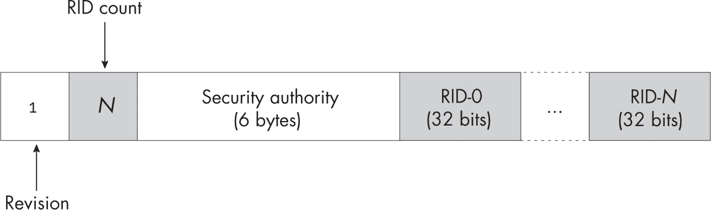
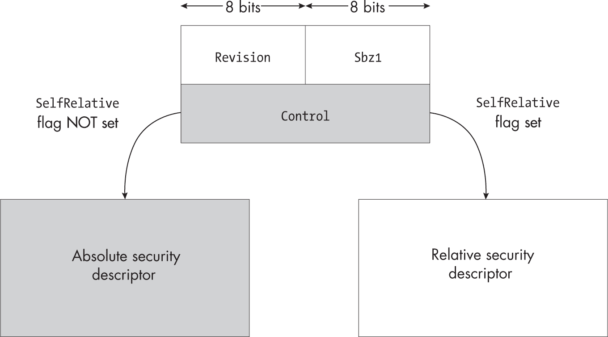
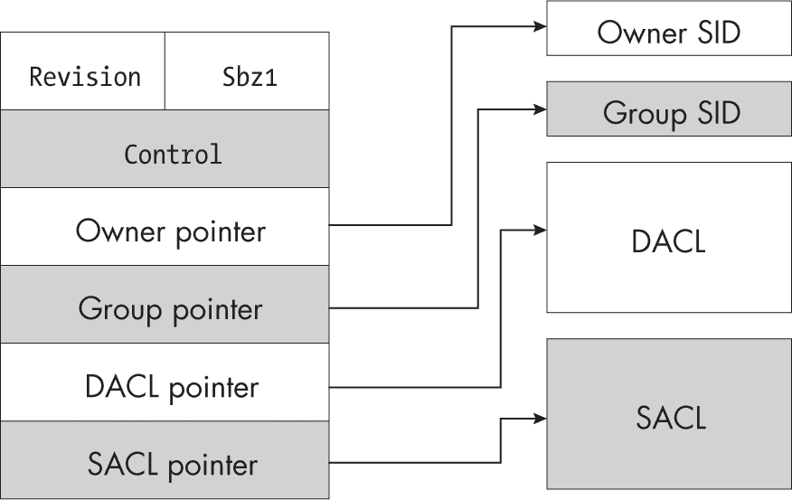
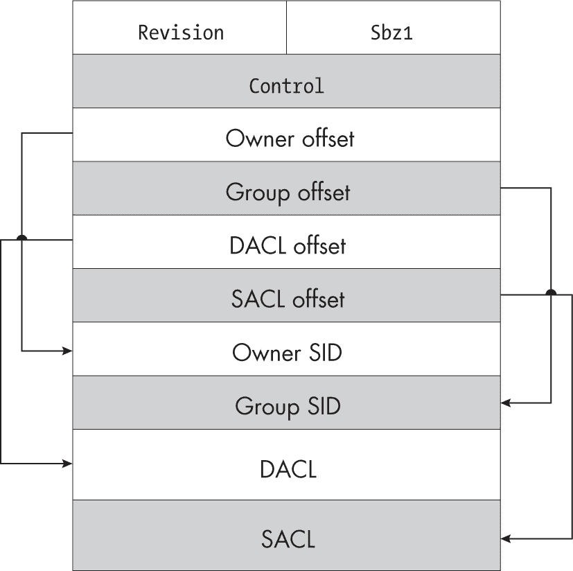
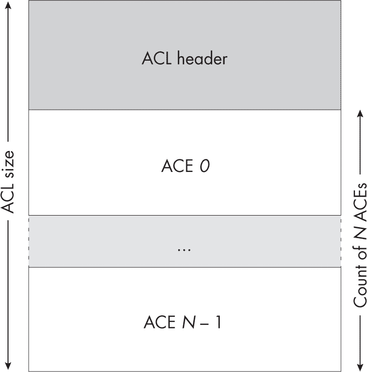
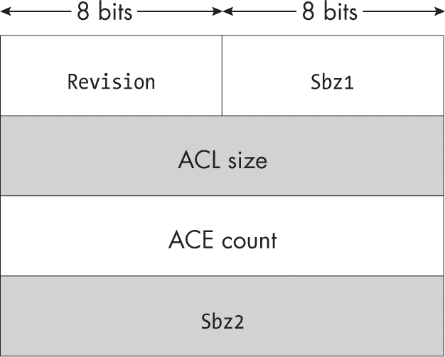
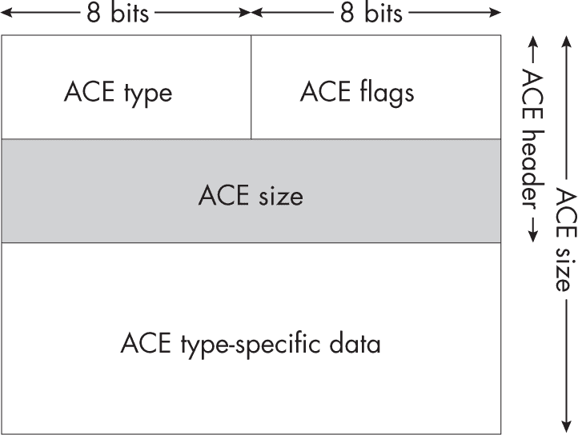
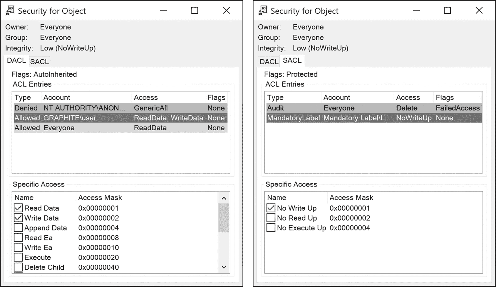
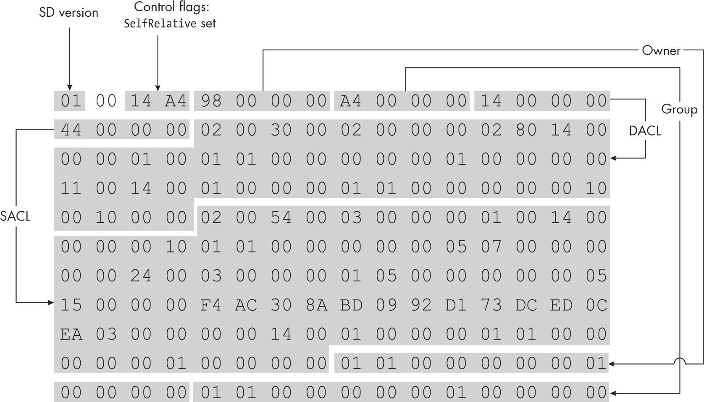

## 第十三章：5 安全描述符


在上一章中，我们讨论了安全访问令牌，它描述了用户的身份给 SRM。在本章中，你将学习*安全描述符*如何定义资源的安全性。安全描述符执行几个功能。它指定资源的所有者，允许 SRM 授予访问自己数据的用户特定权限。它还包含*自主访问控制 (DAC)* 和 *强制访问控制 (MAC)*，它们授予或拒绝用户和组的访问权限。最后，它

可以包含生成审计事件的条目。几乎每个内核资源都有一个安全描述符，用户模式的应用程序可以通过安全描述符实现自己的访问控制，而无需创建内核资源。

理解安全描述符的结构对于理解 Windows 的安全性至关重要，因为它们用于保护每个内核对象和许多用户模式组件，如服务。你甚至会发现安全描述符被用于跨网络边界保护远程资源。在开发 Windows 应用程序或研究 Windows 安全性时，你不可避免地需要检查或创建安全描述符，因此清楚地理解安全描述符的内容将为你节省大量时间。为了帮助理解这一点，我将从更详细地描述安全描述符的结构开始。

### 安全描述符的结构

Windows 将安全描述符作为二进制结构存储在磁盘或内存中。虽然你很少需要手动解析这些结构，但了解它们的内容是有价值的。一个安全描述符由以下七个组成部分构成：

+   修订版本

+   可选的资源管理器标志

+   控制标志

+   可选的所有者 SID

+   可选的组 SID

+   可选的自主访问控制列表

+   可选的系统访问控制列表

让我们依次看看这些内容。任何安全描述符的第一个组成部分是*修订版本*，它表示安全描述符的二进制格式版本。只有一个版本，因此修订版本始终设置为1。接下来是一个可选的标志集，供资源管理器使用。你几乎不会遇到这些标志被设置的情况；然而，它们被活动目录（Active Directory）使用，所以我们将在第十一章中详细讨论它们。

资源管理器标志后面跟着一组 *控制标志*。这些标志有三个用途：定义安全描述符中哪些可选组件是有效的，安全描述符及其组件是如何创建的，以及在将安全描述符应用于对象时如何处理它。表 5-1 显示了有效标志及其描述。我们将在下一章中更详细地介绍此表中的许多术语，如继承。

表 5-1： 有效的控制标志

| 名称 | 值 | 描述 |
| --- | --- | --- |
| OwnerDefaulted | 0x0001 | 通过默认方法分配了所有者 SID。 |
| GroupDefaulted | 0x0002 | 通过默认方法分配了组 SID。 |
| DaclPresent | 0x0004 | DACL 存在于安全描述符中。 |
| DaclDefaulted | 0x0008 | 通过默认方法分配了 DACL。 |
| SaclPresent | 0x0010 | SACL 存在于安全描述符中。 |
| SaclDefaulted | 0x0020 | 通过默认方法分配了 SACL。 |
| DaclUntrusted | 0x0040 | 与 ServerSecurity组合时，DACL 被认为是不可信的。 |
| ServerSecurity | 0x0080 | DACL 被替换为服务器 ACL（关于这方面的更多内容请参见 第六章）。 |
| DaclAutoInheritReq | 0x0100 | 请求对子对象的 DACL 自动继承。 |
| SaclAutoInheritReq | 0x0200 | 请求对子对象的 SACL 自动继承。 |
| DaclAutoInherited | 0x0400 | DACL 支持自动继承。 |
| SaclAutoInherited | 0x0800 | SACL 支持自动继承。 |
| DaclProtected | 0x1000 | DACL 受到继承保护。 |
| SaclProtected | 0x2000 | SACL 受到继承保护。 |
| RmControlValid | 0x4000 | 资源管理器标志有效。 |
| SelfRelative | 0x8000 | 安全描述符为相对格式。 |

控制标志之后是 *所有者 SID*，它表示资源的所有者。通常这是用户的 SID；然而，所有权也可以分配给某个组，例如 *Administrators* 组。成为资源的所有者会授予你某些特权，包括修改资源安全描述符的能力。通过确保所有者具有此能力，系统防止用户将自己锁定在自己的资源之外。

*组 SID* 类似于所有者 SID，但很少使用。它主要存在是为了确保 POSIX 兼容性（这是在 Windows 仍然拥有 POSIX 子系统的时代所关注的问题），并且在 Windows 应用程序的访问控制中没有作用。

安全描述符中最重要的部分是*自主访问控制列表（DACL）*。DACL 包含一个*访问控制条目（ACE）*列表，用于定义分配给 SID 的访问权限。它被认为是*自主的*，因为用户或系统管理员可以选择授予的访问权限级别。有许多不同类型的 ACE。我们将在“访问控制列表头和条目”第 151 页进一步讨论这些内容；现在，你只需要知道每个 ACE 中的基本信息包括以下内容：  

+   适用于该 ACE 的用户或组的 SID  

+   ACE 的类型  

+   SID 允许或拒绝访问的访问掩码  

安全描述符的最后一个组成部分是*安全访问控制列表（SACL）*，它存储审计规则。与 DACL 类似，SACL 包含一个 ACE 列表，但它不是根据定义的 SID 是否与当前用户匹配来确定访问权限，而是确定在资源访问时生成审计事件的规则。自 Windows Vista 以来，SACL 也成为存储附加非审计 ACE 的首选位置，例如资源的强制标签。  

DACL 和 SACL 中需要指出的两个最终元素是DaclPresent和SaclPresent控制标志。这些标志表示 DACL 和 SACL 是否分别存在于安全描述符中。使用这些标志可以设置*NULL ACL*，其中 present 标志已设置，但安全描述符中的 ACL 字段没有指定任何值。NULL ACL 表示没有为该 ACL 定义安全性，并使 SRM 有效地忽略它。这与空 ACL 不同，后者 present 标志已设置，ACL 字段中指定了一个值，但 ACL 中不包含任何 ACE。  

### SID 的结构  

到目前为止，我们一直将 SID 视为不透明的二进制值或数字字符串。在本节中，我们将更详细地查看 SID 包含的内容。图 5-1 中的示意图展示了 SID 在内存中的存储方式。  

  

图 5-1：内存中的 SID 结构  

二进制 SID 有四个组成部分：  

**修订版    **一个始终设置为1的值，因为没有其他定义的版本号  

**相对标识符计数    **SID 中的 RID 数量  

**安全权限    **表示颁发 SID 的方的值

**相对标识符    **零个或多个 32 位数字，表示用户或组  

安全权限可以是任何值，但 Windows 已预定义了一些常用的安全权限。所有知名的安全权限以五个0字节开头，后跟表 5-2 中的一个值。  

表 5-2: 知名权限

| 名称 | 最终值 | 示例名称 |
| --- | --- | --- |
| 空值 | 0 | 空 SID |
| 世界 | 1 | 所有人 |
| 本地 | 2 | 控制台登录 |
| 创建者 | 3 | 创建者拥有者 |
| Nt | 5 | BUILTIN\Users |
| 包 | 15 | 应用程序包权限\您的互联网连接 |
| 强制标签 | 16 | 强制标签\中等强制级别 |
| 作用域策略 ID | 17 | N/A |
| 进程信任 | 19 | 信任级别\受保护轻量- Windows |

安全权限之后是相关的标识符。一个 SID 可以包含一个或多个 RID，其中域 RID 紧跟在用户 RID 之前。

让我们来看看如何为一个著名的组构建 SID，*BUILTIN\Users*。请注意，域组件与组名之间使用反斜杠分隔。在此情况下，域是*BUILTIN*。这是一个由单个 RID 表示的预定义域，RID 为 32。列表 5-1 通过使用 Get-NtSid PowerShell 命令，从组件构建 *BUILTIN* 域的 SID，然后使用 Get-NtSidName 命令来检索 SID 的系统定义名称。

```
PS> **$domain_sid = Get-NtSid -SecurityAuthority Nt -RelativeIdentifier 32**
PS> **Get-NtSidName $domain_sid**
Domain  NameSource  NameUse Sddl
------  ----------  ------- ----
BUILTIN BUILTIN Account Domain  S-1-5-32 
```

列表 5-1：查询 *BUILTIN* 域的 SID

*BUILTIN* 域的 SID 是 Nt 安全权限的成员。我们使用 SecurityAuthority 参数指定此安全权限，并使用 RelativeIdentifier 参数指定单个 RID。

然后我们将 SID 传递给 Get-NtSidName 命令。输出的前两列显示域名和 SID 名称。在这种情况下，这些值是相同的；这是 *BUILTIN* 域注册的一个特殊情况。

下一列指示检索名称的来源位置。在这个示例中，源 Account 表示名称是从 LSASS 获取的。如果源是 WellKnown，这将表示 PowerShell 事先知道该名称，无需查询 LSASS。第四列，NameUse，表示 SID 的类型。在这种情况下，它是 Domain，这是我们可能预期的。最后一列是 SID 以 SDDL 格式表示。

为跟随域 SID 后的 SIDs 指定的任何 RIDs 都标识特定的用户或组。对于*Users*组，我们使用一个 RID，其值为545（由 Windows 预定义）。列表 5-2 通过将545 RID 添加到基础域的 SID 来创建一个新的 SID。

```
PS> **$user_sid =** **Get-NtSid -BaseSid $domain_sid -RelativeIdentifier 545**
PS> **Get-NtSidName $user_sid**
Domain  Name  Source  NameUse Sddl
------  ----  ------  ------- ----
BUILTIN Users Account Alias   S-1-5-32-545

PS> **$user_sid.Name**
BUILTIN\Users 
```

列表 5-2：从安全权限和 RIDs 构造 SID

输出现在显示 *Users* 作为 SID 名称。还请注意，在这种情况下，NameUse 被设置为 Alias。这表示该 SID 代表一个本地的内建组，与 Group 不同，后者代表一个用户定义的组。当我们打印 SID 的 Name 属性时，它输出完全限定的名称，其中域和名称由反斜杠分隔。

你可以在微软的技术文档和其他网站上找到已知的 SID 列表。然而，微软有时会添加未记录的 SID。因此，我建议你测试多个安全权限和 RID 值，以查看能找到哪些其他用户和组。仅仅检查不同的 SID 不会造成任何损害。例如，尝试将列表 5-2 中的用户 RID 替换为544。这个新 SID 代表*BUILTIN\Administrators*组，如列表 5-3 所示。

```
PS> **Get-NtSid -BaseSid $domain_sid -RelativeIdentifier 544**
Name                   Sid
----                    ---
BUILTIN\Administrators S-1-5-32-544 
```

列表 5-3：查询Administrators组 SID

记住特定 SID 的安全权限和 RID 可能很棘手，你可能无法准确回忆起用Name参数查询时的确切名称，如第二章所述。因此，Get-NtSid实现了一种模式，可以从已知的集合中查询 SID。例如，要查询*Administrators*组的 SID，你可以使用列表 5-4 中显示的命令。

```
PS> **Get-NtSid -KnownSid BuiltinAdministrators**
Name                   Sid
----                   ---
BUILTIN\Administrators S-1-5-32-544 
```

列表 5-4：查询已知的Administrators组 SID

你会在整个 Windows 操作系统中找到使用 SID 的地方。理解 SID 的结构至关重要，因为这将帮助你快速评估 SID 可能表示的内容。例如，如果你识别出一个 SID 具有<Nt>安全权限，并且它的第一个 RID 是32，你可以确定它代表的是一个内建的用户或组。了解结构还可以让你在没有更好工具的情况下，从崩溃转储或内存中识别和提取 SID。

### 绝对和相对安全描述符

内核支持两种二进制表示格式的安全描述符：绝对格式和相对格式。在本节中，我们将分别讨论这两种格式，并考虑它们的优缺点。

两种格式都以相同的三个值开始：修订版本、资源管理器标志和控制标志。控制标志中的SelfRelative标志决定了使用哪种格式，如图 5-2 所示。



图 5-2：选择安全描述符格式

安全描述符头部的总大小为 32 位，分为两个 8 位值：修订号和Sbz1，以及 16 位控制标志。安全描述符的资源管理器标志存储在Sbz1中；这些标志只有在设置了RmControlValid控制标志时才有效，尽管无论如何该值都会存在。安全描述符的其余部分紧接在头部之后存储。

最简单的格式——绝对安全描述符，适用于未设置SelfRelative标志的情况。在通用头信息之后，绝对格式定义了四个指针来引用内存中的内容：拥有者 SID、组 SID、DACL 和 SACL，依次排列，如图 5-3 所示。



图 5-3：绝对安全描述符的结构

每个指针引用一个存储数据的绝对内存地址。因此，指针的大小取决于应用程序是 32 位还是 64 位。也可以为指针指定一个 NULL 值，表示该值不存在。拥有者和组 SID 值采用前一节中定义的二进制格式存储。

当SelfRelative标志被设置时，安全描述符会采用相对格式。相对安全描述符不是通过绝对内存地址引用其值，而是将这些位置存储为相对于其头部起始位置的正偏移量。图 5-4 展示了相对安全描述符的构建方式。



图 5-4：相对安全描述符的结构

这些值存储在连续的内存中。我们将在下一节探讨的 ACL 格式已经是相对格式，因此在相对安全描述符中使用时无需进行特别处理。每个偏移量始终为 32 位长，无论系统的位数如何。如果偏移量设置为0，则表示该值不存在，如同绝对安全描述符中的 NULL 情况。

绝对安全描述符的主要优点在于你可以轻松更新其各个组件。例如，要替换拥有者 SID，你只需在内存中分配一个新的 SID，并将其内存地址分配给拥有者指针。相比之下，按照相同方式修改相对安全描述符时，如果新的拥有者 SID 结构比旧的结构大，可能需要调整其分配的内存。

另一方面，相对安全描述符的一个大优点是它可以在一个连续的内存块中构建。这使得你能够将安全描述符序列化为持久化格式，如文件或注册表项。当你需要确定某个资源的安全性时，你可能需要从内存或持久化存储中提取它的安全描述符。通过理解这两种格式，你可以确定如何读取安全描述符，以便查看或操作。

大多数 API 和系统调用都可以接受这两种安全描述符格式，它们通过检查SelfRelative标志来自动确定如何处理安全描述符。然而，你会发现一些例外情况，在这些情况下，某些 API 仅接受一种格式；在这种情况下，如果你向 API 传递了错误格式的安全描述符，通常会收到类似STATUS_INVALID_SECURITY_DESCR的错误。由于内存管理的简便性，从 API 返回的安全描述符几乎总是相对格式。系统提供了RtlAbsoluteToSelfRelativeSD和RtlSelfRelativeToAbsoluteSD这两个 API，以便在需要时在两种格式之间进行转换。

PowerShell 模块使用SecurityDescriptor对象处理所有的安全描述符，无论其格式如何。该对象是用.NET 编写的，并且仅在需要与本地代码交互时才会转换为相对或绝对安全描述符。你可以通过检查SelfRelative属性来确定一个SecurityDescriptor对象是否是从相对安全描述符生成的。

### 访问控制列表头部和条目

DACL 和 SACL 构成了安全描述符中的大部分数据。虽然这些元素的用途不同，但它们共享相同的基本结构。在本节中，我们将讨论它们在内存中的排列方式，关于它们如何在访问检查过程中发挥作用的详细信息请参见第七章。

#### 头部

所有的 ACL 都由一个 ACL 头部和后续的零个或多个 ACE 组成，所有内容在一个连续的内存块中。 图 5-5 展示了这一顶层格式。



图 5-5：ACL 结构的顶层概述

ACL 头部包含一个修订版本、ACL 的总大小（以字节为单位）以及紧随其后的 ACE 条目数量。 图 5-6 展示了头部的结构。



图 5-6：ACL 头部结构

ACL 头部还包含两个保留字段，Sbz1 和 Sbz2，它们的值应始终为 0。这两个字段在现代版本的 Windows 中没有实际用途，它们存在是为了在 ACL 结构需要扩展时使用。目前，版本 字段可以具有三种值，这些值决定了 ACL 的有效 ACE。如果 ACL 使用了一个版本不支持的 ACE，该 ACL 将被认为是无效的。Windows 支持以下版本：

**默认    **默认的 ACL 版本。支持所有基本的 ACE 类型，例如 允许 和 拒绝。通过 版本 值 2 来指定。

**复合    **为默认的 ACL 版本添加了对复合 ACE 的支持。通过 版本 值 3 来指定。

**对象    **为复合 ACL 添加了对对象 ACE 的支持。通过 版本 值 4 来指定。

#### ACE 列表

在 ACL 头部之后是 ACE 列表，它决定了 SID 的访问权限。ACE 的长度可变，但总是以一个包含 ACE 类型、附加标志和 ACE 总大小的头部开始。头部后跟特定于 ACE 类型的数据。图 5-7 显示了这一结构。



图 5-7：ACE 结构

ACE 头部是所有 ACE 类型共有的。这使得应用程序在处理 ACL 时可以安全地访问头部。ACE 类型值可以用来确定 ACE 类型特定数据的确切格式。如果应用程序不理解 ACE 类型，它可以使用大小字段跳过整个 ACE（我们将在第七章中讨论类型如何影响访问检查）。

表 5-3 列出了支持的 ACE 类型、它们有效的最小 ACE 版本，以及它们是否在 DACL 或 SACL 中有效。

表 5-3： 支持的 ACE 类型、最小 ACL 版本和位置

| ACE 类型 | 值 | 最小版本 | ACL | 描述 |
| --- | --- | --- | --- | --- |
| 允许 | 0x0 | 默认 | DACL | 允许访问资源 |
| 拒绝 | 0x1 | 默认 | DACL | 拒绝访问资源 |
| 审计 | 0x2 | 默认 | SACL | 审计资源访问 |
| 报警 | 0x3 | 默认 | SACL | 访问资源时触发警报；未使用 |
| 允许复合 | 0x4 | 复合 | DACL | 在冒充期间允许对资源的访问 |
| 允许对象 | 0x5 | 对象 | DACL | 允许对带有对象类型的资源的访问 |
| 拒绝对象 | 0x6 | 对象 | DACL | 拒绝对带有对象类型的资源的访问 |
| 审计对象 | 0x7 | 对象 | SACL | 审计带有对象类型的资源访问 |
| AlarmObject | 0x8 | 对象 | SACL | 访问时触发警报，带有对象类型；未使用 |
| AllowedCallback | 0x9 | 默认 | DACL | 通过回调授予对资源的访问 |
| DeniedCallback | 0xA | 默认 | DACL | 通过回调拒绝对资源的访问 |
| AllowedCallbackObject | 0xB | 对象 | DACL | 通过回调和对象类型授予访问权限 |
| DeniedCallbackObject | 0xC | 对象 | DACL | 通过回调和对象类型拒绝访问 |
| AuditCallback | 0xD | 默认 | SACL | 通过回调审核访问 |
| AlarmCallback | 0xE | 默认 | SACL | 访问时触发回调警报；未使用 |
| AuditCallbackObject | 0xF | 对象 | SACL | 通过回调和对象类型审核访问 |
| AlarmCallbackObject | 0x10 | 对象 | SACL | 访问时触发回调警报，带有对象类型；未使用 |
| MandatoryLabel | 0x11 | 默认 | SACL | 指定强制标签 |
| ResourceAttribute | 0x12 | 默认 | SACL | 指定资源的属性 |
| ScopedPolicyId | 0x13 | 默认 | SACL | 指定资源的中央访问策略 ID |
| ProcessTrustLabel | 0x14 | 默认 | SACL | 指定一个进程信任标签以限制资源访问 |
| AccessFilter | 0x15 | 默认 | SACL | 指定资源的访问过滤器 |

Windows 正式支持所有这些 ACE 类型，但内核不使用 Alarm 类型。用户应用程序可以指定自己的 ACE 类型，但用户模式和内核模式中的各种 API 会检查有效类型，并在 ACE 类型未知时生成错误。

ACE 的类型特定数据主要分为三种格式：常规 ACE（如 Allowed 和 Denied）；复合 ACE；和对象 ACE。*常规 ACE* 在标题后包含以下字段，字段大小在括号内表示：

**访问掩码（32 位）    **根据 ACE 类型授予或拒绝的访问掩码

**SID（可变大小）    **在本章前述的二进制格式中的 SID

*Compound ACEs* 用于模拟操作期间使用。这些 ACE 可以同时授予模拟调用者和进程用户的访问权限。它们唯一的有效类型是 AllowedCompound。尽管最新版本的 Windows 仍支持复合 ACE，但它们实际上是未记录的，可能已弃用。为了完整起见，我在本书中包括了它们。它们的格式如下：

**访问掩码（32 位）    **授予的访问掩码

**复合 ACE 类型（16 位）    **设置为 1，表示该 ACE 用于模拟

**保留（16 位）    **始终为 0

**服务器 SID（可变大小）    **服务器的 SID，以二进制格式表示；与服务用户匹配

**SID（可变大小）    **以二进制格式表示的 SID；与被模拟的用户匹配

微软引入了*对象 ACE*格式，以支持 Active Directory 域服务的访问控制。Active Directory 使用 128 位 GUID 来表示目录服务对象类型；对象 ACE 决定特定类型对象的访问权限，例如计算机或用户。例如，使用单一的安全描述符，目录可以授予 SID 创建某种类型对象的访问权限，但不授予另种类型的访问权限。对象 ACE 格式如下：

**访问掩码（32 位）    **根据 ACE 类型授予或拒绝的访问掩码

**标志（32 位）    **用于指示以下哪些 GUID 存在

**对象类型（16 字节）    **ObjectType GUID；仅当位 0 的标志设置时才存在

**继承的对象类型（16 字节）    **继承的对象 GUID；仅当位 1 的标志设置时才存在

**SID（可变大小）    **以二进制格式表示的 SID

ACE 的大小可以大于其类型定义的结构，它们可能使用额外的空间来存储非结构化数据。最常见的情况是，这些非结构化数据用于回调 ACE 类型，例如 AllowedCallback，该类型定义了一个条件表达式，决定 ACE 是否在访问检查期间处于活动状态。我们可以使用 ConvertFrom -NtAceCondition PowerShell 命令检查条件表达式生成的数据，如列表 5-5 所示。

```
PS> **ConvertFrom-NtAceCondition 'WIN://TokenId == "XYZ"' | Out-HexDump -ShowAll**
          00 01 02 03 04 05 06 07 08 09 0A 0B 0C 0D 0E 0F  - 0123456789ABCDEF
-----------------------------------------------------------------------------
00000000: 61 72 74 78 F8 1A 00 00 00 57 00 49 00 4E 00 3A  - artx.....W.I.N.:
00000010: 00 2F 00 2F 00 54 00 6F 00 6B 00 65 00 6E 00 49  - ././.T.o.k.e.n.I
00000020: 00 64 00 10 06 00 00 00 58 00 59 00 5A 00 80 00  - .d......X.Y.Z... 
```

列表 5-5：解析条件表达式并显示二进制数据

我们将这些 ACE 称为*回调 ACE*，因为在 Windows 8 之前，应用程序需要调用 AuthzAccessCheck API 来处理它们。该 API 接受一个回调函数，该函数会被调用以确定是否在访问检查中包含回调 ACE。从 Windows 8 开始，内核访问检查内建支持条件 ACE 格式，如列表 5-5 所示，尽管用户应用程序可以自由指定自己的格式并手动处理这些 ACE。

ACE 标志的主要用途是指定 ACE 的继承规则。表 5-4 展示了已定义的 ACE 标志。

表 5-4： ACE 标志

| ACE 标志 | 值 | 描述 |
| --- | --- | --- |
| ObjectInherit | 0x1 | ACE 可以被对象继承。 |
| ContainerInherit | 0x2 | ACE 可以被容器继承。 |
| NoPropagateInherit | 0x4 | ACE 的继承标志不会传递到子项。 |
| InheritOnly | 0x8 | ACE 仅用于继承，不用于访问检查。 |
| Inherited | 0x10 | ACE 是从父容器继承的。 |
| Critical | 0x20 | ACE 是关键的，无法移除。仅适用于 允许的 ACE。 |
| SuccessfulAccess | 0x40 | 应该为成功的访问生成审计事件。 |
| FailedAccess | 0x80 | 应该为失败的访问生成审计事件。 |
| TrustProtected | 0x40 | 当与 AccessFilter ACE 一起使用时，此标志会防止修改。 |

继承标志仅占用最低的 5 位，剩下的 3 位用于 ACE 特定的标志。

### 构建和操作安全描述符

现在你已经熟悉了安全描述符的结构，让我们看看如何使用 PowerShell 构建和操作它们。到目前为止，最常见的使用场景是查看安全描述符的内容，以便理解访问权限如何应用于资源。另一个重要的使用场景是当你需要构建一个安全描述符来锁定资源时。本书中使用的 PowerShell 模块旨在尽可能简化构建和查看安全描述符的过程。

#### 创建新安全描述符

要创建一个新的安全描述符，可以使用 New-NtSecurityDescriptor 命令。默认情况下，它会创建一个没有所有者、组、DACL 或 SACL 的新 SecurityDescriptor 对象。你可以使用命令的参数来添加这些安全描述符的组成部分，如 列表 5-6 所示。

```
PS> **$world = Get-NtSid -KnownSid World**
PS> **$sd = New-NtSecurityDescriptor -Owner $world -Group $world -Type File**
PS> **$sd | Format-Table**
Owner    DACL ACE Count SACL ACE Count Integrity Level
-----    -------------- -------------- ---------------
Everyone NONE           NONE           NONE 
```

列表 5-6：使用指定的所有者创建新的安全描述符

我们首先获取 *World* 组的 SID。在调用 New-NtSecurityDescriptor 创建一个新的安全描述符时，我们使用这个 SID 来指定其 Owner 和 Group。我们还指定了该安全描述符将关联的内核对象类型；这一步骤使得后续的一些命令更容易使用。在本例中，我们假设它是一个 File 对象的安全描述符。

我们随后显示安全描述符，并将输出格式化为表格。正如你所看到的，Owner 字段被设置为 Everyone。默认情况下，Group 值不会显示，因为它并不是那么重要。当前，安全描述符中既没有 DACL 也没有 SACL，并且没有指定完整性级别。

要添加一些 ACEs，我们可以使用 Add-NtSecurityDescriptorAce 命令。对于普通 ACEs，我们需要指定 ACE 类型、SID 和访问掩码。我们还可以选择性地指定 ACE 标志。列表 5-7 中的脚本将一些 ACEs 添加到我们的新安全描述符中。

```
❶ PS> **$user = Get-NtSid**
❷ PS> **Add-NtSecurityDescriptorAce $sd -Sid $user -Access WriteData, ReadData**
PS> **Add-NtSecurityDescriptorAce $sd -KnownSid Anonymous -Access GenericAll**
**-Type Denied**
PS> **Add-NtSecurityDescriptorAce $sd -Name "Everyone" -Access ReadData**
❸ PS> **Add-NtSecurityDescriptorAce $sd -KnownSid World -Access Delete**
**-Type Audit -Flags FailedAccess**
❹ PS> **Set-NtSecurityDescriptorIntegrityLevel $sd Low**
❺ PS> **Set-NtSecurityDescriptorControl $sd DaclAutoInherited, SaclProtected**
❻ PS> **$sd | Format-Table**
Owner    DACL ACE Count SACL ACE Count Integrity Level
-----    -------------- -------------- ---------------
Everyone 3              2              Low

❼ PS> **Get-NtSecurityDescriptorControl $sd**
DaclPresent, SaclPresent, DaclAutoInherited, SaclProtected

❽ PS> **Get-NtSecurityDescriptorDacl $sd | Format-Table**
Type    User                         Flags Mask
----    ----                         ----- ----
Allowed GRAPHITE\user                None  00000003
Denied  NT AUTHORITY\ANONYMOUS LOGON None  10000000
Allowed Everyone                     None  00000001

❾ PS> **Get-NtSecurityDescriptorSacl $sd | Format-Table**
Type           User                                Flags        Mask
----           ----                                -----        ----
Audit          Everyone                            FailedAccess 00010000
MandatoryLabel Mandatory Label\Low Mandatory Level None         00000001 
```

列表 5-7：向新安全描述符添加 ACEs

我们首先通过Get-NtSid ❶获取当前用户的 SID。我们使用此 SID 将一个新的Allowed ACE 添加到 DACL ❷。接着，通过指定<Type>参数，添加一个用于匿名用户的Denied ACE，之后再为*Everyone*组添加一个Allowed ACE。然后，我们修改 SACL，添加一个审计 ACE ❸，并将强制标签设置为Low完整性级别 ❹。为了完成安全描述符的创建，我们设置DaclAutoInherited和SaclProtected控制标志 ❺。

现在我们可以打印刚刚创建的安全描述符的详细信息。显示安全描述符❻表明，DACL 现在包含三个 ACE 和两个 SACL，同时完整性级别为Low。我们还展示了控制标志❼以及 DACL❽和 SACL❾中的 ACE 列表。

#### ACE 排序

由于访问检查的工作方式，ACL 中的 ACE 有一个规范的排序。例如，所有Denied类型的 ACE 应该排在所有Allowed类型 ACE 之前，否则系统可能会根据 ACE 的顺序错误地授予对资源的访问权限。SRM 并不强制执行这种规范的排序；它相信任何应用程序在进行访问检查前，都会正确地对 ACE 进行排序。ACL 应根据以下规则对 ACE 进行排序：

1.  所有Denied-类型的 ACE 必须排在Allowed类型的 ACE 之前。

2.  Allowed类型的 ACE 必须排在Allowed对象 ACE 之前。

Denied类型的 ACE 必须排在<sup class="SANS_TheSansMonoCd_W5Regular_11">Denied</sup>对象 ACE 之前。

所有非继承的 ACE 必须排在带有Inherited标志的 ACE 之前。

在示例 5-7 中，我们在添加了一个 Allowed ACE 后，添加了一个 Denied ACE，从而违反了第一个顺序规则。我们可以使用 Edit-NtSecurity 命令，并通过 CanonicalizeDacl 参数来确保 DACL 被标准化。我们还可以使用 Test-NtSecurityDescriptor PowerShell 命令，并通过 DaclCanonical 参数来测试 DACL 是否已经是标准化的。示例 5-8 演示了这两个命令的使用。

```
PS> **Test-NtSecurityDescriptor $sd -DaclCanonical**
False

PS> **Edit-NtSecurityDescriptor $sd -CanonicalizeDacl**
PS> **Test-NtSecurityDescriptor $sd -DaclCanonical**
True

PS> **Get-NtSecurityDescriptorDacl $sd | Format-Table**
Type    User                         Flags Mask
----    ----                         ----- ----
Denied  NT AUTHORITY\ANONYMOUS LOGON None  10000000
Allowed GRAPHITE\user                None  00000003
Allowed Everyone                     None  00000001 
```

示例 5-8：标准化 DACL

如果你将示例 5-8 中的 ACE 列表与示例 5-7 中的列表进行比较，你会注意到 Denied ACE 已经从中间移到了 ACL 的开始位置。这确保了它会在任何 Allowed ACE 之前被处理。

#### 格式化安全描述符

你可以通过 Format-Table 命令手动打印安全描述符中的值，但这会很耗时。手动格式化的另一个问题是访问掩码不会被解码，因此，你会看到 00000001，而不是像 ReadData 这样的值。最好能有一个简单的方法来打印出安全描述符的详细信息，并根据对象类型进行格式化。这就是 Format-NtSecurityDescriptor 的作用。你可以将安全描述符传递给它，命令将把它打印到控制台上。示例 5-9 提供了一个例子。

```
PS> **Format-NtSecurityDescriptor $sd -ShowAll**
Type: File
Control: DaclPresent, SaclPresent

<Owner>
 - Name  : Everyone
 - Sid   : S-1-1-0

<Group>
 - Name  : Everyone
 - Sid   : S-1-1-0

<DACL> (Auto Inherited)
 - Type  : Denied
 - Name  : NT AUTHORITY\ANONYMOUS LOGON
 - SID   : S-1-5-7
 - Mask  : 0x10000000
 - Access: GenericAll
 - Flags : None

 - Type  : Allowed
 - Name  : GRAPHITE\user
 - SID   : S-1-5-21-2318445812-3516008893-216915059-1002
 - Mask  : 0x00000003
 - Access: ReadData|WriteData
 - Flags : None

 - Type  : Allowed
 - Name  : Everyone
 - SID   : S-1-1-0
 - Mask  : 0x00000001
 - Access: ReadData
 - Flags : None

<SACL> (Protected)
 - Type  : Audit
 - Name  : Everyone
 - SID   : S-1-1-0
 - Mask  : 0x00010000
 - Access: Delete
 - Flags : FailedAccess

<Mandatory Label>
 - Type  : MandatoryLabel
 - Name  : Mandatory Label\Low Mandatory Level
 - SID   : S-1-16-4096
 - Mask  : 0x00000001
 - Policy: NoWriteUp
 - Flags : None 
```

示例 5-9：显示安全描述符

我们将 ShowAll 参数传递给 Format-NtSecurityDescriptor，以确保它显示安全描述符的所有内容；默认情况下，它不会输出 SACL 或其他不常见的 ACE，如 ResourceAttribute。请注意，输出的内核对象类型与我们在示例 5-6 中创建安全描述符时指定的 File 类型匹配。指定内核对象类型允许格式化器打印出该类型的解码访问掩码，而不是一个通用的十六进制值。

输出的下一行显示了当前的控制标志。这些标志是根据安全描述符的当前状态动态计算的；稍后我们将讨论如何更改这些控制标志，以改变安全描述符的行为。控制标志后面是所有者和组 SID 以及 DACL，它们占据了输出的大部分。任何特定于 DACL 的标志会出现在标头旁边；在这种情况下，这些标志表示我们设置了 DaclAutoInherited 标志。接下来，输出按顺序列出 ACL 中的每个 ACE，从 ACE 的类型开始。因为命令已经知道对象类型，所以它会打印出该类型的解码访问掩码，以及原始的十六进制访问掩码。

接下来是 SACL，它显示了我们的单个审计 ACE 以及 SaclProtected 标志。最后显示的组件是强制标签。强制标签的访问掩码即为强制策略，它的解码方式与使用类型特定访问权限的其他 ACEs 不同。强制策略可以设置为 表 5-5 中所示的一个或多个位标志。

表 5-5： 强制策略值

| 名称 | 值 | 描述 |
| --- | --- | --- |
| NoWriteUp | 0x00000001 | 较低完整性级别的调用者无法写入此资源。 |
| NoReadUp | 0x00000002 | 较低完整性级别的调用者无法读取此资源。 |
| NoExecuteUp | 0x00000004 | 较低完整性级别的调用者无法执行此资源。 |

默认情况下，Format-NtSecurityDescriptor 的输出可能会比较冗长。为了缩短其输出，可以指定 Summary 参数，这将尽可能删除多余的数据，同时保留重要信息。列表 5-10 演示了这一点。

```
PS> **Format-NtSecurityDescriptor $sd -ShowAll -Summary**
<Owner> : Everyone
<Group> : Everyone
<DACL>
<DACL> (Auto Inherited)
NT AUTHORITY\ANONYMOUS LOGON: (Denied)(None)(GenericAll)
GRAPHITE\user: (Allowed)(None)(ReadData|WriteData)
Everyone: (Allowed)(None)(ReadData)
<SACL> (Protected)
Everyone: (Audit)(FailedAccess)(Delete)
<Mandatory Label>
Mandatory Label\Low Mandatory Level: (MandatoryLabel)(None)(NoWriteUp) 
```

列表 5-10：以摘要格式显示安全描述符

我在第二章中提到，为了简化使用，本书中使用的 PowerShell 模块为大多数常见标志提供了简单的名称，但你可以根据需要显示完整的 SDK 名称（例如，用于将输出与原生代码进行比较）。要在使用 Format-NtSecurityDescriptor 查看安全描述符内容时显示 SDK 名称，可以使用 SDKName 属性，如列表 5-11 所示。

```
PS> **Format-NtSecurityDescriptor $sd -SDKName -SecurityInformation Dacl**
Type: File
Control: SE_DACL_PRESENT|SE_SACL_PRESENT|SE_DACL_AUTO_INHERITED|SE_SACL_PROTECTED
<DACL> (Auto Inherited)
 - Type  : ACCESS_DENIED_ACE_TYPE
 - Name  : NT AUTHORITY\ANONYMOUS LOGON
 - SID   : S-1-5-7
 - Mask  : 0x10000000
 - Access: GENERIC_ALL
 - Flags : NONE

 - Type  : ACCESS_ALLOWED_ACE_TYPE
 - Name  : GRAPHITE\user
 - SID   : S-1-5-21-2318445812-3516008893-216915059-1002
 - Mask  : 0x00000003
 - Access: FILE_READ_DATA|FILE_WRITE_DATA
 - Flags : NONE

 - Type  : ACCESS_ALLOWED_ACE_TYPE
 - Name  : Everyone
 - SID   : S-1-1-0
 - Mask  : 0x00000001
 - Access: FILE_READ_DATA
 - Flags : NONE 
```

列表 5-11：使用 SDK 名称格式化安全描述符

File 对象的一个特点是它们的访问掩码有两种命名约定，一种用于文件，另一种用于目录。你可以通过使用 Container 参数，或者更一般地，通过将安全描述符对象的 Container 属性设置为 True 来请求 Format-NtSecurityDescriptor 打印目录版本的访问掩码。列表 5-12 显示了设置 Container 参数对输出的影响。

```
PS> **Format-NtSecurityDescriptor $sd -ShowAll -Summary -Container**
<Owner> : Everyone
<Group> : Everyone
<DACL>
NT AUTHORITY\ANONYMOUS LOGON: (Denied)(None)(GenericAll)
❶ GRAPHITE\user: (Allowed)(None)(ListDirectory|AddFile)
Everyone: (Allowed)(None)(ListDirectory)
`--snip--` 
```

列表 5-12：将安全描述符格式化为容器

请注意，当我们将其格式化为容器时，输出行从 ReadData|WriteData 变为 ListDirectory|AddFile ❶。在 Windows 中，File 类型是唯一具有此行为的对象类型。这对安全性非常重要，因为如果将安全描述符格式化为文件而非目录，或反之，你可能会错误地解读 File 的访问权限。

如果你更喜欢图形用户界面（GUI），可以使用以下 Show-NtSecurityDescriptor 命令启动查看器：

```
PS> **Show-NtSecurityDescriptor $sd** 
```

运行该命令应该会打开在图 5-8 中显示的对话框。



图 5-8：显示安全描述符的图形用户界面

该对话框总结了安全描述符的重要数据。顶部显示的是所有者和组 SID（已解析为名称），以及安全描述符的完整性级别和强制策略。这些值与我们创建安全描述符时指定的值匹配。中间是 DACL（左侧）或 SACL（右侧）中的 ACE 列表，具体取决于你选择的选项卡，顶部有 ACL 标志。列表中的每个条目包括 ACE 类型、SID、以通用形式表示的访问掩码和 ACE 标志。底部是解码后的访问权限。当你在 ACL 列表中选择一个 ACE 时，列表将被填充。

#### 转换为和从相对安全描述符转换

我们可以使用 ConvertFrom-NtSecurityDescriptor 命令将安全描述符对象转换为相对格式的字节数组。然后，我们可以打印其内容，查看其底层结构，正如列表 5-13 中所示。

```
PS> **$ba = ConvertFrom-NtSecurityDescriptor $sd**
PS> **$ba | Out-HexDump -ShowAll**
          00 01 02 03 04 05 06 07 08 09 0A 0B 0C 0D 0E 0F  - 0123456789ABCDEF
-----------------------------------------------------------------------------
00000000: 01 00 14 A4 98 00 00 00 A4 00 00 00 14 00 00 00  - ................
00000010: 44 00 00 00 02 00 30 00 02 00 00 00 02 80 14 00  - D.....0.........
00000020: 00 00 01 00 01 01 00 00 00 00 00 01 00 00 00 00  - ................
00000030: 11 00 14 00 01 00 00 00 01 01 00 00 00 00 00 10  - ................
00000040: 00 10 00 00 02 00 54 00 03 00 00 00 01 00 14 00  - ......T.........
00000050: 00 00 00 10 01 01 00 00 00 00 00 05 07 00 00 00  - ................
00000060: 00 00 24 00 03 00 00 00 01 05 00 00 00 00 00 05  - ..$.............
00000070: 15 00 00 00 F4 AC 30 8A BD 09 92 D1 73 DC ED 0C  - ......0.....s...
00000080: EA 03 00 00 00 00 14 00 01 00 00 00 01 01 00 00  - ................
00000090: 00 00 00 01 00 00 00 00 01 01 00 00 00 00 00 01  - ................
000000A0: 00 00 00 00 01 01 00 00 00 00 00 01 00 00 00 00  - ................ 
```

列表 5-13：将绝对安全描述符转换为相对格式并显示其字节

我们可以使用 New-NtSecurityDescriptor 和 Byte 参数将字节数组转换回安全描述符对象：

```
PS> **New-NtSecurityDescriptor -Byte $ba** 
```

作为一个练习，我将留给你自己分析十六进制输出，以根据本章提供的描述找出安全描述符的各种结构。为了帮助你入门，图 5-9 突出了主要结构。



图 5-9：相对安全描述符十六进制输出中主要结构的概述

你需要参考 ACL 和 SID 结构的布局，手动解码其余部分。

### 安全描述符定义语言

在第二章中，我们讨论了用于表示 SID 的安全描述符定义语言（SDDL）格式的基础知识。SDDL 格式也可以表示整个安全描述符。由于安全描述符的 SDDL 版本使用 ASCII 文本，因此它在某种程度上是可读的，且与列表 5-13 中显示的二进制数据不同，它可以轻松复制。因为在 Windows 中常常看到使用 SDDL 字符串，所以让我们来看一下如何用 SDDL 表示安全描述符以及如何读取它。

你可以通过指定 ToSddl 参数给 Format-NtSecurityDescriptor 来将安全描述符转换为 SDDL 格式。这个过程在 Listing 5-14 中有演示，我们传递了前一节中构建的安全描述符。你还可以使用 New-NtSecurityDescriptor 和 ToSddl 参数从 SDDL 字符串创建一个安全描述符。

```
PS> **$sddl =** **Format-NtSecurityDescriptor $sd -ToSddl -ShowAll**
PS> **$sddl**
O:WDG:WDD:AI(D;;GA;;;AN)(A;;CCDC;;;S-1-5-21-2318445812-3516008893-216915059-
1002)(A;;CC;;;WD)S:P(AU;FA;SD;;;WD)(ML;;NW;;;LW) 
```

Listing 5-14: 将安全描述符转换为 SDDL

安全描述符的 SDDL 版本包含四个可选组件。你可以通过查找以下前缀来识别每个组件的开始：

O:  所有者 SID

G:  组 SID

D:  DACL

S:  SACL

在 Listing 5-15 中，我们将 Listing 5-14 的输出拆分为各个组件，便于阅读。

```
PS> **$sddl -split "(?=O:)|(?=G:)|(?=D:)|(?=S:)|(?=\()"**
O:WD
G:WD
D:AI
  (D;;GA;;;AN)
  (A;;CCDC;;;S-1-5-21-2318445812-3516008893-216915059-1002)
  (A;;CC;;;WD)
S:P
  (AU;FA;SD;;;WD)
  (ML;;NW;;;LW) 
```

Listing 5-15: 拆分 SDDL 组件

前两行表示所有者和组的 SID，采用 SDDL 格式。你可能会注意到这些看起来不像我们通常看到的 SDDL SID，因为它们不是以 S-1- 开头。这是因为这些字符串是 Windows 用于知名 SID 的两字符别名，以减少 SDDL 字符串的大小。例如，所有者字符串是 WD，我们可以通过 Get-NtSid 将其转换回完整的 SID（见 Listing 5-16）。

```
PS> **Get-NtSid -Sddl "WD"**
Name     Sid
----     ---
Everyone S-1-1-0 
```

Listing 5-16: 将别名转换为名称和 SID

如你所见，WD 别名代表 *Everyone* 组。表 5-6 显示了一些知名 SID 的别名。你可以在 附录 B 中找到所有支持的 SDDL 别名的更全面列表。

表 5-6： 知名 SID 及其别名

| SID 别名 | 名称 | SDDL SID |
| --- | --- | --- |
| AU | NT AUTHORITY\Authenticated Users | S-1-5-11 |
| BA | BUILTIN\Administrators | S-1-5-32-544 |
| IU | NT AUTHORITY\INTERACTIVE | S-1-5-4 |
| SY | NT AUTHORITY\SYSTEM | S-1-5-18 |
| WD | Everyone | S-1-1-0 |

如果 SID 没有别名，Format-NtSecurityDescriptor 将以 SDDL 格式输出 SID，如清单 5-15 所示。即使是没有别名的 SID，也可以由 LSASS 定义名称。例如，清单 5-15 中的 SID 属于当前用户，如清单 5-17 所示。

```
PS> **Get-NtSid -Sddl "S-1-5-21-2318445812-3516008893-216915059-1002" -ToName**
GRAPHITE\user 
```

清单 5-17：查找 SID 的名称

接下来是清单 5-15 中的 DACL 表示。在 D: 前缀之后，SDDL 格式的 ACL 如下所示：

```
ACLFlags(ACE0)(ACE1)...(ACEn) 
```

ACL 标志是可选的；DACL 的设置为 AI，SACL 的设置为 P。这些值映射到安全描述符控制标志，并且可以是表 5-7 中一个或多个字符串。

表 5-7： ACL 标志字符串映射到安全描述符控制标志

| ACL 标志字符串 | DACL 控制标志 | SACL 控制标志 |
| --- | --- | --- |
| P | DaclProtected | SaclProtected |
| AI | DaclAutoInherited | SaclAutoInherited |
| AR | DaclAutoInheritReq | SaclAutoInheritReq |

我将在第六章中描述这三个控制标志的用途。每个 ACE 都被括在括号中，由多个以分号分隔的字符串组成，遵循以下通用格式：

```
(Type;Flags;Access;ObjectType;InheritedObjectType;SID[;ExtraData]) 
```

Type 是一个简短的字符串，映射到 ACE 类型。表 5-8 显示了这些映射。请注意，SDDL 格式不支持某些 ACE 类型，因此它们在表格中被省略。

表 5-8： 类型字符串与 ACE 类型的映射

| ACE 类型字符串 | ACE 类型 |
| --- | --- |
| A | 允许 |
| D | 拒绝 |
| AU | 审计 |
| AL | 警报 |
| OA | 允许对象 |
| OD | 拒绝对象 |
| OU | 审计对象 |
| OL | 警报对象 |
| XA | 允许回调 |
| XD | 拒绝回调 |
| ZA | 允许回调对象 |
| XU | 审计回调 |
| ML | 强制标签 |
| RA | 资源属性 |
| SP | 作用域策略 ID |
| TL | 处理信任标签 |
| FL | 访问过滤器 |

下一部分是 标志，它表示 ACE 标志。来自 列表 5-15 的审计条目显示了标志字符串 FA，它代表 访问失败。 表 5-9 显示了其他映射。

表 5-9： 标志字符串与 ACE 标志的映射

| ACE 标志字符串 | ACE 标志 |
| --- | --- |
| OI | 对象继承 |
| CI | 容器继承 |
| NP | 不传播继承 |
| IO | 仅继承 |
| ID | 继承 |
| CR | 关键 |
| SA | 成功访问 |
| FA | 访问失败 |
| TP | 信任保护 |

接下来是 访问，它代表 ACE 中的访问掩码。可以是十六进制数（0x1234）、八进制数（011064）或十进制数（4660），或者是短访问字符串的列表。如果没有指定字符串，则使用空的访问掩码。表 5-10 显示了访问字符串。

表 5-10： 访问字符串与访问掩码的映射

| 访问字符串 | 访问名称 | 访问掩码 |
| --- | --- | --- |
| GR | 通用读取 | 0x80000000 |
| GW | 通用写入 | 0x40000000 |
| GX | 通用执行 | 0x20000000 |
| GA | 通用所有权限 | 0x10000000 |
| WO | 写入所有者 | 0x00080000 |
| WD | 写入 DAC | 0x00040000 |
| RC | 读取控制 | 0x00020000 |
| SD | 删除 | 0x00010000 |
| CR | 控制访问 | 0x00000100 |
| LO | 列出对象 | 0x00000080 |
| DT | 删除树 | 0x00000040 |
| WP | 写入属性 | 0x00000020 |
| RP | 读取属性 | 0x00000010 |
| SW | 自我写入 | 0x00000008 |
| LC | 列出子项 | 0x00000004 |
| DC | 删除子项 | 0x00000002 |
| CC | 创建子项 | 0x00000001 |

请注意，现有的访问字符串无法覆盖整个访问掩码范围。这是因为 SDDL（安全描述符定义语言）设计用于表示目录服务对象的掩码，而目录服务对象并没有定义超出有限范围的访问掩码值。这也是为什么权利名称有些混淆的原因；例如，删除子项不一定映射到任意对象类型中删除子项的定义，正如在列表 5-15 中所见，文件类型的特定访问映射到目录服务对象访问，即使它与活动目录无关。

为了更好地支持其他类型，SDDL 格式提供了常见文件和注册表项访问掩码的访问字符串，如表 5-11 所示。如果现有的访问字符串无法表示整个掩码，唯一的选择是将其表示为数字字符串，通常采用十六进制格式。

表 5-11： 文件和注册表项类型的访问字符串

| 访问字符串 | 访问名称 | 访问掩码 |
| --- | --- | --- |
| FA | 文件全部访问 | 0x001F01FF |
| FX | 文件执行 | 0x001200A0 |
| FW | 文件写入 | 0x00120116 |
| FR | 文件读取 | 0x00120089 |
| KA | 键盘全部访问 | 0x000F003F |
| KR | 键盘读取 | 0x00020019 |
| KX | 键盘执行 | 0x00020019 |
| KW | Key Write | 0x00020006 |

对于与对象 ACE 一起使用的 ObjectType 和 InheritedObjectType 组件，SDDL 使用字符串格式表示 GUID。GUID 可以是任何值。例如，表 5-12 包含了一些 Active Directory 使用的知名 GUID。

表 5-12： Active Directory 中使用的知名 ObjectType GUID

| GUID | 目录对象 |
| --- | --- |
| 19195a5a-6da0-11d0-afd3-00c04fd930c9 | Domain |
| bf967a86-0de6-11d0-a285-00aa003049e2 | Computer |
| bf967aba-0de6-11d0-a285-00aa003049e2 | User |
| bf967a9c-0de6-11d0-a285-00aa003049e2 | Group |

这里是一个示例 ACE 字符串，用于设置了 AllowedObject ACE 的 ObjectType：

```
(OA;;CC;2f097591-a34f-4975-990f-00f0906b07e0;;WD) 
```

在 ACE 中，紧随 InheritedObjectType 组件之后的是 SID。如本章前面详细说明的，如果是知名 SID，则可以使用简短别名；如果不是，则使用完整的 SDDL 格式。

在最后一个组件中，对于大多数 ACE 类型来说这是可选的，如果使用回调 ACE，可以指定一个条件表达式；如果使用ResourceAttribute ACE，则可以指定一个安全属性。条件表达式定义了一个布尔表达式，用于比较令牌的安全属性值。评估时，该表达式的结果应为真或假。在示例 5-5 中，我们看到了一个简单的例子：WIN://TokenId == "XYZ"，它将安全属性WIN://TokenId的值与字符串值XYZ进行比较，并在它们相等时返回 true。SDDL 表达式语法有四种不同的属性名称格式，用于引用你想要的安全属性：

**简单    **用于本地安全属性；例如，WIN://TokenId

**设备    **用于设备声明；例如，@Device.ABC

**用户    **用于用户声明；例如，@User.XYZ

**资源    **用于资源属性；例如，@Resource.QRS

条件表达式中的比较值也可以接受几种不同的类型。当从 SDDL 转换到安全描述符时，条件表达式将被解析，但由于此时无法知道安全属性的类型，因此无法对值的类型进行验证。表 5-13 展示了每种条件表达式类型的示例。

表 5-13： 不同条件表达式类型的示例值

| 类型 | 示例 |
| --- | --- |
| 数字 | 十进制： 100， -100；八进制： 0100；十六进制： 0x100 |
| 字符串 | "ThisIsAString" |
| 完全限定的二进制名称 | {"O=MICROSOFT CORPORATION, L=REDMOND, S=WASHINGTON",1004} |
| SID | SID(BA), SID(S-1-0-0) |
| 八位字节字符串 | #0011223344 |

语法接下来定义了用于评估表达式的运算符，从表 5-14 中的单目运算符开始。

表 5-14： 条件表达式的单目运算符

| 操作符 | 描述 |
| --- | --- |
| Exists ATTR | 检查安全属性 ATTR 是否存在 |
| Not_Exists ATTR | 与 Exists 相反 |
| Member_of {SIDLIST} | 检查标记组是否包含 SIDLIST 中的所有 SID |
| Not_Member_of {SIDLIST} | 与 Member_of 相反 |
| Device_Member_of {SIDLIST} | 检查标记设备组是否包含 SIDLIST 中的所有 SID |
| Not_Device_Member_of {SIDLIST} | 与 Device_Member_of 的逆操作 |
| Member_of_Any {SIDLIST} | 检查标记组是否包含任何在 SIDLIST 中的 SID |
| Not_Member_of_Any {SIDLIST} | 与 Not_Member_of_Any 的逆操作 |
| Device_Member_of_Any {SIDLIST} | 检查标记设备组是否包含任何在 SIDLIST 中的 SID |
| Not_Device_Member_of_Any {SIDLIST} | 与 Device_Member_of_Any 的逆操作 |
| !(EXPR) | 表达式的逻辑 NOT |

在表 5-14 中，ATTR是要测试的属性名称，SIDLIST是一个用大括号{}括起来的 SID 值列表，EXPR是另一个条件子表达式。表 5-15 展示了该语法定义的中缀运算符。

表 5-15： 条件表达式的中缀运算符

| 运算符 | 描述 |
| --- | --- |
| ATTR Contains VALUE | 检查安全属性是否包含该值 |
| ATTR Not_Contains VALUE | 与 Contains 相反 |
| ATTR Any_of {VALUELIST} | 检查安全属性是否包含列表中的任何值 |
| ATTR Not_Any_of {VALUELIST} | 与 Any_of 相反 |
| ATTR == VALUE | 检查安全属性是否等于该值 |
| ATTR != VALUE | 检查安全属性是否不等于该值 |
| ATTR < VALUE | 检查安全属性是否小于该值 |
| ATTR <= VALUE | 检查安全属性是否小于或等于该值 |
| ATTR > VALUE | 检查安全属性是否大于该值 |
| ATTR >= VALUE | 检查安全属性是否大于或等于该值 |
| EXPR && EXPR | 两个表达式之间的逻辑与运算 |
| EXPR &#124;&#124; EXPR | 两个表达式之间的逻辑或运算 |

在表 5-15 中，VALUE可以是表 5-13 中的单个值，也可以是用大括号括起来的值列表。Any_of和Not_Any_of运算符仅适用于列表，并且条件表达式必须始终放在 SDDL ACE 中的括号内。例如，如果你想在清单 5-5 中使用显示的条件表达式，并与<code class="SANS_TheSansMonoCd_W5Regular_11">AccessCallback</code> ACE 一起使用，则 ACE 字符串如下所示：

```
(ZA;;GA;;;WD;(WIN://TokenId == "XYZ")) 
```

最后的组件表示<code class="SANS_TheSansMonoCd_W5Regular_11">ResourceAttribute</code> ACE 的安全属性。它的一般格式如下所示：

```
"AttrName",AttrType,AttrFlags,AttrValue(,AttrValue...) 
```

AttrName值是安全属性的名称，AttrFlags是表示安全属性标志的十六进制数字，AttrValue是一个或多个特定于AttrType的值，值之间用逗号分隔。AttrType是一个短字符串，表示安全属性中包含的数据类型。表 5-16 显示了已定义的字符串及其示例。

表 5-16: 安全属性 SDDL 类型字符串

| 属性类型 | 类型名称 | 示例值 |
| --- | --- | --- |
| TI | Int64 | 十进制: 100, -100; 八进制: 0100; 十六进制: 0x100 |
| TU | UInt64 | 十进制: 100; 八进制: 0100; 十六进制: 0x100 |
| TS | 字符串 | "XYZ" |
| TD | SID | BA, S-1-0-0 |
| TB | 布尔值 | 0, 1 |
| RX | 八位字节串 | #0011223344 |

举个例子，下面的 SDDL 字符串表示一个名为 Classification 的 ResourceAttribute ACE。它包含两个字符串值，TopSecret 和 MostSecret，并且设置了 CaseSensitive 和 NonInheritable 标志：

```
S:(RA;;;;;WD;("Classification",TS,0x3,"TopSecret","MostSecret")) 
```

在 清单 5-15 中要定义的最后一个字段是 SACL。该结构与 DACL 中描述的结构相同，尽管支持的 ACE 类型不同。如果你尝试使用不允许在特定 ACL 中使用的类型，解析字符串将失败。在 清单 5-15 中的 SACL 示例中，唯一的 ACE 是强制标签。强制标签 ACE 有自己的访问字符串，用于表示强制策略，如 表 5-17 所示。

表 5-17： 强制标签访问字符串

| 访问字符串 | 访问名称 | 访问掩码 |
| --- | --- | --- |
| NX | 不可执行向上 | 0x00000004 |
| NR | 不可读向上 | 0x00000002 |
| NW | 不可写向上 | 0x00000001 |

SID 表示强制标签的完整性级别；再次定义了特殊的 SID 别名。任何在 表 5-18 中未列出的内容都需要表示为完整的 SID。

表 5-18： 强制标签完整性级别 SID

| SID 别名 | 名称 | SDDL SID |
| --- | --- | --- |
| LW | 低 完整性级别 | S-1-16-4096 |
| ME | 中等 完整性级别 | S-1-16-8192 |
| MP | 中等偏上 完整性级别 | S-1-16-8448 |
| HI | 高 完整性级别 | S-1-16-12288 |
| SI | System 完整性级别 | S-1-16-16384 |

SDDL 格式不能保存你可以存储在安全描述符中的所有信息。例如，SDDL 格式无法表示 OwnerDefaulted 或 GroupDefaulted 控制标志，因此这些会被丢弃。SDDL 还不支持某些 ACE 类型，所以我从表 5-8 中省略了这些。

如前所述，如果在将安全描述符转换为 SDDL 时遇到不支持的 ACE 类型，转换过程将失败。为了绕过这个问题，ConvertFrom-NtSecurityDescriptor PowerShell 命令可以将相对格式的安全描述符转换为 base64，如列表 5-18 所示。使用 base64 可以保留整个安全描述符，并且便于复制。

```
PS> **ConvertFrom-NtSecurityDescriptor $sd -AsBase64 -InsertLineBreaks**
AQAUpJgAAACkAAAAFAAAAEQAAAACADAAAgAAAAKAFAAAAAEAAQEAAAAAAAEAAAAAEQAUAAEAAAAB
AQAAAAAAEAAQAAACAFQAAwAAAAEAFAAAAAAQAQEAAAAAAAUHAAAAAAAkAAMAAAABBQAAAAAABRUA
AAD0rDCKvQmS0XPc7QzqAwAAAAAUAAEAAAABAQAAAAAAAQAAAAABAQAAAAAAAQAAAAABAQAAAAAA
AQAAAAA= 
```

列表 5-18：将安全描述符转换为 base64 表示

要检索安全描述符，你可以向 New-NtSecurityDescriptor 传递 Base64 参数。

### 已完成示例

让我们通过一些已完成的示例来结束本章，这些示例使用了你在这里学到的命令。

#### 手动解析二进制 SID

PowerShell 模块提供了一些命令，你可以用它们解析以各种形式结构化的 SID。其中一种形式是原始字节数组。你可以使用 ConvertFrom-NtSid 命令将现有的 SID 转换为字节数组：

```
PS> **$ba = ConvertFrom-NtSid -Sid "S-1-1-0"** 
```

你还可以使用 Byte 参数和 Get-NtSid 命令将字节数组转换回 SID，如下所示。模块将解析字节数组并返回 SID：

```
PS> **Get-NtSid -Byte $ba** 
```

尽管 PowerShell 可以为你执行这些转换，但理解数据如何在低层次上结构化将对你非常有价值。例如，你可能会识别出解析 SID 错误的代码，这可能导致内存损坏；通过这个发现，你可能会找到一个安全漏洞。

学习如何解析二进制结构的最佳方法是编写一个解析器，就像我们在列表 5-19 中所做的那样。

```
❶ PS> **$sid = Get-NtSid -SecurityAuthority Nt -RelativeIdentifier 100, 200, 300**
PS> **$ba = ConvertFrom-NtSid -Sid $sid**
PS> **$ba | Out-HexDump -ShowAll**
          00 01 02 03 04 05 06 07 08 09 0A 0B 0C 0D 0E 0F  - 0123456789ABCDEF
-----------------------------------------------------------------------------
00000000: 01 03 00 00 00 00 00 05 64 00 00 00 C8 00 00 00  -........d.......
00000010: 2C 01 00 00                                      - ,...

PS> **$stm = [System.IO.MemoryStream]::new($ba)**
❷ PS> **$reader = [System.IO.BinaryReader]::new($stm)**

PS> **$revision = $reader.ReadByte()**
❸ PS> **if ($revision -ne 1) {**
 **throw "Invalid SID revision"**
**}**

❹ PS> **$rid_count = $reader.ReadByte()**
❺ PS> **$auth = $reader.ReadBytes(6)**
PS> **if ($auth.Length -ne 6) {**
 **throw "Invalid security authority length"**
**}**

PS> **$rids = @()**
❻ PS> **while($rid_count -gt 0) {**
 **$rids += $reader.ReadUInt32()**
 **$rid_count--**
**}**

❼ PS> **$new_sid = Get-NtSid -SecurityAuthorityByte $auth -RelativeIdentifier $rids**
PS> **$new_sid -eq $sid**
True 
```

列表 5-19：手动解析二进制 SID

为了演示，我们从创建一个任意的 SID 开始，并将其转换为字节数组❶。不过，通常你会通过其他方式接收到要解析的 SID，例如通过进程的内存。我们还将 SID 以十六进制形式打印出来。（如果你参考 图 5-1 中显示的 SID 结构，你可能已经能识别出其各个组成部分。）

接下来，我们创建一个 BinaryReader 来以结构化的形式解析字节数组❷。使用该读取器，我们首先检查修订值是否设置为 1❸；如果没有，我们抛出一个错误。结构中的下一个是 RID 数量的字节❹，接着是 6 字节的安全权限❺。ReadBytes 方法可能返回一个较短的读取器，所以你需要检查是否已经读取了所有六个字节。

现在，我们进入一个循环，读取二进制结构中的 RIDs 并将它们附加到数组中❻。接着，使用安全权限和 RIDs，我们可以运行 Get-NtSid 来构造一个新的 SID 对象❼，并验证新的 SID 是否与我们开始时的 SID 匹配。

这个列表展示了如何使用 PowerShell 手动解析一个 SID（或实际上是任何二进制结构）。如果你很有冒险精神，也可以实现你自己的二进制安全描述符格式解析器，但这超出了本书的范围。更简单的方法是使用 New-NtSecurityDescriptor 命令来帮你解析。

#### 枚举 SIDs

LSASS 服务没有提供一个公开的方式来查询它所知道的每个 SID 到名称的映射。虽然官方的 Microsoft 文档提供了已知 SID 的列表，但这些列表并不总是最新的，并且不会包含特定于计算机或企业网络的 SID。不过，我们可以尝试使用暴力破解方法枚举这些映射。列表 5-20 定义了一个函数，Get-AccountSids，用于暴力破解 LSASS 拥有名称的 SID 列表。

```
PS> **function Get-AccountSids {**
 **param(**
 **[parameter(Mandatory)]**
❶ **$BaseSid,**
 **[int]$MinRid = 0,**
 **[int]$MaxRid = 256**
 **)**

 **$i = $MinRid**

 **while($i -lt $MaxRid) {**
 **$sid = Get-NtSid -BaseSid $BaseSid -RelativeIdentifier $i**
 **$name = Get-NtSidName $sid**
❷ **if ($name.Source -eq "Account") {**
 **[PSCustomObject]@{**
 **Sid = $sid;**
 **Name = $name.QualifiedName;**
 **Use = $name.NameUse**
 **}**
 **}**
 **$i++**
 **}**
**}**

❸ PS> **$sid = Get-NtSid -SecurityAuthority Nt**
PS> **Get-AccountSids -BaseSid $sid**
Sid          Name                   Use
----         ----                   ---
S-1-5-1      NT AUTHORITY\DIALUP    WellKnownGroup
S-1-5-2      NT AUTHORITY\NETWORK   WellKnownGroup
S-1-5-3      NT AUTHORITY\BATCH     WellKnownGroup
`--snip--`

❹ PS> **$sid = Get-NtSid -BaseSid $sid -RelativeIdentifier 32**
PS> **Get-AccountSids -BaseSid $sid -MinRid 512 -MaxRid 1024**
Sid          Name                   Use
----         ----                   ---
S-1-5-32-544 BUILTIN\Administrators Alias
S-1-5-32-545 BUILTIN\Users          Alias
S-1-5-32-546 BUILTIN\Guests         Alias
`--snip--` 
```

列表 5-20：暴力破解已知 SIDs

该函数接受一个基础 SID 和一个 RID 值范围进行测试❶。然后，它创建列表中的每个 SID，并查询其名称。如果名称的来源是 Account，表示名称是从 LSASS 中获取的，我们会输出该 SID 的详细信息❷。

为了测试这个函数，我们使用包含< sclass="SANS_TheSansMonoCd_W5Regular_11">Nt权限但没有 RID 的基本 SID 调用它❸。我们从 LSASS 获取检索到的名称和 SID 列表。注意，输出中的 SID 不是域 SID，正如你可能预期的那样，而是WellKnownGroup SID。对于我们的目的，WellKnownGroup、Group和Alias之间的区别并不重要；它们都是组。

接下来，我们尝试暴力破解*BUILTIN*域 SID❹。在这种情况下，我们根据对有效范围的先前了解改变了 RID 范围，但你可以尝试任何你喜欢的其他范围。注意，你可以通过检查返回对象中的NameUse属性并在其值为Domain时调用Get-AccountSids来自动化搜索。我将此作为读者的练习。

### 总结

我们通过深入研究安全描述符的结构开始了本章内容。我们详细介绍了其二进制结构，如 SID，并查看了访问控制列表及构成自愿和系统 ACL 的访问控制条目。然后，我们讨论了绝对安全描述符和相对安全描述符之间的差异，以及为什么这两种格式会共存。

接下来，我们探讨了如何使用New-NtSecurityDescriptor和Add-NtSecurityDescriptorAce命令来创建和修改安全描述符，使其包含我们需要的条目。我们还展示了如何使用Format-NtSecurityDescriptor命令以便捷的形式显示安全描述符。

最后，我们介绍了用于表示安全描述符的 SDDL 格式。我们讨论了如何表示各种类型的安全描述符值，例如 ACE，以及如何编写你自己的安全描述符。我们尚未覆盖的一些任务包括如何从内核对象查询安全描述符以及如何分配一个新的安全描述符。我们将在下一章讨论这些主题。
