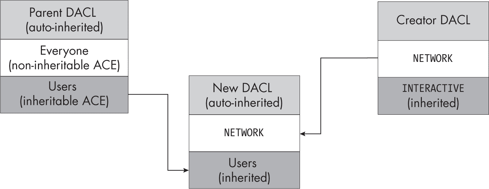

## 6 读取与分配安全描述符


在上一章中，我们讨论了构成安全描述符的各种结构。你还学习了如何在 PowerShell 中操作安全描述符，以及如何使用 SDDL 格式表示它们。在本章中，我们将讨论如何从内核对象中读取安全描述符，以及将安全描述符分配给这些对象的更复杂过程。

我们将重点讨论分配给内核对象的安全描述符。然而，如第 149 页“绝对与相对安全描述符”中所述，安全描述符也可以存储在持久存储中，例如文件或注册表项值中。在这种情况下，安全描述符必须以相对格式存储，并作为字节流读取，然后才能将其转换为可以检查的格式。

### 读取安全描述符

要访问内核对象的安全描述符，可以调用NtQuerySecurityObject系统调用。此系统调用接受一个指向内核对象的句柄，以及一组描述要访问的安全描述符组件的标志。SecurityInformation枚举表示这些标志。

表 6-1 显示了最新版本 Windows 中可用标志的列表，以及安全描述符中信息的位置和查询所需的句柄访问权限。

表 6-1： 安全信息 SecurityInformation 标志及其所需访问权限

| 标志名称 | 描述 | 位置 | 所需句柄访问权限 |
| --- | --- | --- | --- |
| 所有者 | 查询所有者 SID。 | 所有者 | ReadControl |
| 组 | 查询组 SID。 | 组 | ReadControl |
| Dacl | 查询 DACL。 | DACL | ReadControl |
| Sacl | 查询安全审计（仅审核 ACE）。 | SACL | AccessSystemSecurity |
| Label | 查询强制标签。 | SACL | ReadControl |
| Attribute | 查询系统资源属性。 | SACL | ReadControl |
| Scope | 查询范围策略 ID。 | SACL | ReadControl |
| ProcessTrustLabel | 查询进程信任标签。 | SACL | ReadControl |
| AccessFilter | 查询访问过滤器。 | SACL | ReadControl |
| Backup | 查询除了处理信任标签和访问过滤器之外的所有内容。 | All | ReadControl 和 AccessSystemSecurity |

只需 ReadControl 访问权限即可读取大部分信息，除了 SACL 中的审计 ACE，这些需要 AccessSystemSecurity 访问权限。（对于 SACL 中存储的其他 ACE，ReadControl 访问权限是足够的。

获取 AccessSystemSecurity 访问权限的唯一方法是首先启用 SeSecurityPrivilege 特权，然后在打开内核对象时显式请求该访问权限。列表 6-1 显示了这种行为。你必须以管理员身份运行这些命令。

```
PS> **$dir = Get-NtDirectory "\BaseNamedObjects" -Access AccessSystemSecurity**
Get-NtDirectory : (0xC0000061) - A required privilege is not held by
the client.
`--snip--`

PS> **Enable-NtTokenPrivilege SeSecurityPrivilege**
PS> **$dir = Get-NtDirectory "\BaseNamedObjects" -Access AccessSystemSecurity**
PS> **$dir.GrantedAccess**
AccessSystemSecurity 
```

列表 6-1：请求 AccessSystemSecurity 访问并启用 SeSecurityPrivilege

我们第一次尝试以 AccessSystemSecurity 访问权限打开 BNO 目录失败，因为我们没有所需的 SeSecurityPrivilege 特权。接下来，我们启用该特权并重新尝试。这次我们成功打开了目录，打印其 GrantedAccess 参数确认我们已经获得了 AccessSystemSecurity 访问权限。

不完全清楚为什么 Windows 的设计者决定使用 SeSecurityPrivilege 来保护审计信息的读取。虽然我们应该将修改和删除审计信息视为特权操作，但没有明显的理由说明读取这些信息也应该是特权操作。不幸的是，我们只能接受这种设计。

你可以使用 Get-NtSecurityDescriptor PowerShell 命令查询对象的安全描述符，该命令会调用 NtQuerySecurityObject。系统调用会以字节数组的相对格式返回安全描述符，PowerShell 命令将其解析为 SecurityDescriptor 对象并返回给调用者。该命令接受对象或你要查询的资源路径，如 列表 6-2 所示，展示了 BNO 目录的安全描述符。

```
PS> **Use-NtObject($d = Get-NtDirectory "\BaseNamedObjects" -Access** 
**ReadControl) {**
    **Get-NtSecurityDescriptor -Object $d**
**}**
Owner                  DACL ACE Count SACL ACE Count Integrity Level
-----                  -------------- -------------- ---------------
BUILTIN\Administrators 4              1              Low 
```

列表 6-2：查询 BNO 目录的安全描述符

在这里，我们以 ReadControl 访问权限打开 BNO 目录，然后使用 Get-NtSecurityDescriptor 从打开的 Directory 对象中查询安全描述符。

默认情况下，Get-NtSecurityDescriptor 命令查询所有者、组、DACL、强制标签和进程信任标签。如果你想查询其他字段（或省略某些返回的信息），需要通过 SecurityInformation 参数指定，接受 表格 6-1 中的值。例如，清单 6-3 使用路径而非对象，并仅请求 Owner 字段。

```
PS> **Get-NtSecurityDescriptor "\BaseNamedObjects" -SecurityInformation Owner**
Owner                  DACL ACE Count SACL ACE Count Integrity Level
-----                  -------------- -------------- ---------------
BUILTIN\Administrators NONE           NONE           NONE 
```

清单 6-3：查询 BNO 目录的所有者

在输出中，可以看到只有 Owner 列包含有效信息；所有其他列现在的值是 NONE，表示没有值，因为我们没有请求该信息。

### 分配安全描述符

阅读安全描述符很简单；只需要对内核资源具有正确的访问权限，并能够解析从 NtQuerySecurityObject 系统调用返回的相对安全描述符格式。分配安全描述符则是一个更复杂的操作。分配给资源的安全描述符依赖于多个因素：

+   资源是正在创建吗？

+   创建者在创建时是否指定了安全描述符？

+   新资源是否存储在容器中，如目录或注册表项？

+   新资源是容器还是对象？

+   父级或当前安全描述符上设置了哪些控制标志？

+   是哪个用户正在分配安全描述符？

+   现有安全描述符包含哪些 ACE？

+   正在分配的是哪种内核对象类型？

从列表中可以看到，这个过程涉及许多变量，是 Windows 安全性如此复杂的主要原因之一。

我们可以在创建时或通过打开句柄来分配资源的安全性。我们先从更复杂的情况开始：在创建时分配。

#### 在资源创建期间分配安全描述符

在创建新资源时，内核需要为其分配安全描述符。此外，根据创建的资源类型，安全描述符的存储方式也不同。例如，对象管理器资源是临时的，因此内核会将其安全描述符存储在内存中。相比之下，文件系统驱动程序的安全描述符必须持久化存储到磁盘，否则在重启计算机后它会消失。

虽然存储安全描述符的机制可能不同，但内核在处理它时必须遵循许多共同的程序，例如执行继承规则。为了提供一致的实现，内核导出了几个 API，用于计算分配给新资源的安全描述符。这些 API 中最常用的是 SeAssignSecurityEx，它接受以下七个参数：

**创建者安全描述符** 一个可选的安全描述符，用于作为新分配的安全描述符的基础

**父级安全描述符** 一个可选的安全描述符，表示新资源的父对象

**对象类型** 一个可选的 GUID，表示正在创建的对象类型

**容器** 一个布尔值，表示新资源是否是一个容器

**自动继承** 一组位标志，定义自动继承行为

**令牌** 用作创建者身份的令牌句柄

**通用映射** 将通用访问映射到内核类型的特定访问权限

根据这些参数，API 会计算一个新的安全描述符并将其返回给调用者。通过研究这些参数之间的相互作用，我们可以了解内核如何为新对象分配安全描述符。

让我们考虑为一个 突变体 对象执行此分配过程。（该对象将在 PowerShell 实例关闭后删除，确保不会意外留下不必要的文件或注册表项。）表 6-2 提供了我们在使用 NtCreateMutant 创建新 突变体 对象时可能设置参数的示例。

表 6-2： 新 突变体 对象的示例参数

| 参数 | 设置值 |
| --- | --- |
| 创建者安全描述符 | 对象属性结构中的 SecurityDescriptor 字段的值。 |
| 父级安全描述符 | 父级的安全描述符 目录；未为未命名的 突变体设置。 |
| 对象类型 | 未设置。 |
| 容器 | 设置为 False，因为 Mutant 不是一个容器。 |
| 自动继承 | 如果父级安全描述符的控制标志包含 DaclAutoInherited 标志并且创建者 DACL 丢失或没有创建者安全描述符，则设置为 AutoInheritDacl ；如果父级安全描述符的控制标志包含 SaclAutoInherited 标志并且创建者 SACL 丢失或没有创建者安全描述符，则设置为 AutoInheritSacl。 |
| 令牌 | 如果调用者正在 impersonate（模拟身份），则设置为模拟令牌；否则，设置为调用者进程的主令牌。 |
| 通用映射 | 设置为 Mutant 类型的通用映射。 |

你可能会想，为什么在表 6-2 中对象类型没有设置。API 支持该参数，但对象管理器和 I/O 管理器都没有使用它。它的主要目的是让 Active Directory 控制继承，因此我们将在第 203 页的“确定对象继承”部分单独讨论它。

表 6-2 显示了仅有的两个可能的自动继承标志，但我们可以将更多的标志传递给 API。表 6-3 列出了可用的自动继承标志，其中一些将在本章的示例中遇到。

表 6-3: 自动继承标志

| 标志名称 | 描述 |
| --- | --- |
| DaclAutoInherit | 自动继承 DACL。 |
| SaclAutoInherit | 自动继承 SACL。 |
| DefaultDescriptorForObject | 为新安全描述符使用默认的安全描述符。 |
| AvoidPrivilegeCheck | 设置强制标签或 SACL 时不进行权限检查。 |
| AvoidOwnerCheck | 避免检查当前令牌的所有者是否有效。 |
| DefaultOwnerFromParent | 从父安全描述符复制所有者 SID。 |
| DefaultGroupFromParent | 从父安全描述符复制组 SID。 |
| MaclNoWriteUp | 自动继承强制标签，使用 NoWriteUp 策略。 |
| MaclNoReadUp | 自动继承强制标签，使用 NoReadUp 策略。 |
| MaclNoExecuteUp | 自动继承强制标签，使用 NoExecuteUp 策略。 |
| AvoidOwnerRestriction | 忽略父安全描述符对新 DACL 施加的限制。 |
| ForceUserMode | 强制所有检查都像从用户模式调用一样进行（仅适用于内核调用者）。 |

最重要的SeAssignSecurityEx参数是考虑分配给父安全描述符和创建者安全描述符的值。我们将通过这些两个安全描述符参数的一些配置，了解不同的结果。

##### 仅设置创建者安全描述符

在我们考虑的第一个配置中，我们使用 NtCreateMutant，并将对象属性的 SecurityDescriptor 字段设置为有效的安全描述符。如果新的 Mutant 对象没有指定名称，它将被创建时没有父目录，且相应的父安全描述符不会被设置。如果没有父安全描述符，则自动继承标志也不会被设置。

让我们测试一下这个行为，看看在创建一个新的 Mutant 对象时生成的安全描述符。我们不会直接创建对象，而是使用 SeAssignSecurityEx 的用户模式实现，它被 *NTDLL* 导出为 RtlNewSecurityObjectEx。我们可以通过 New-NtSecurityDescriptor PowerShell 命令访问 RtlNewSecurityObjectEx，如 列表 6-4 所示。

```
PS> **$creator = New-NtSecurityDescriptor -Type Mutant**
❶ PS> **Add-NtSecurityDescriptorAce $creator -Name "Everyone" -Access GenericRead** 
❷ PS> **Format-NtSecurityDescriptor $creator** 
Type: Mutant
Control: DaclPresent
<DACL>
 - Type  : Allowed
 - Name  : Everyone
 - SID   : S-1-1-0
 - Mask  : 0x80000000
 - Access: GenericRead
 - Flags : None

PS> **$token = Get-NtToken -Effective -Pseudo**
❸ PS> **$sd = New-NtSecurityDescriptor -Token $token -Creator $creator** 
**-Type Mutant** 
PS> **Format-NtSecurityDescriptor $sd**
Type: Mutant
Control: DaclPresent
❹ <Owner>
 - Name  : GRAPHITE\user
 - Sid   : S-1-5-21-2318445812-3516008893-216915059-1002

❺ <Group>
 - Name  : GRAPHITE\None
 - Sid   : S-1-5-21-2318445812-3516008893-216915059-513

<DACL>
- Type  : Allowed
- Name  : Everyone
- SID   : S-1-1-0
- Mask  : 0x00020001
❻ - Access: ModifyState|ReadControl
- Flags : None 
```

列表 6-4：从创建者安全描述符创建新的安全描述符

我们首先构建一个仅包含一个 ACE 的创建者安全描述符，授予 *Everyone* 组 GenericRead 访问权限 ❶。通过格式化安全描述符 ❷，我们可以确认在格式化输出中只有 DACL 被包含。接下来，使用创建者安全描述符，我们调用 New-NtSecurityDescriptor 命令 ❸，传递当前有效的令牌并指定最终对象类型为 Mutant。这个对象类型决定了通用映射。最后，我们格式化新的安全描述符。

你可能会注意到，在创建过程中，安全描述符发生了变化：它增加了 Owner ❹ 和 Group 值 ❺，并且指定的访问掩码从 GenericRead 变更为 ModifyState|ReadControl ❻。

让我们首先考虑这些新的所有者和组值来自哪里。当我们没有指定<sup class="SANS_TheSansMonoCd_W5Regular_11">Owner</sup>或<sup class="SANS_TheSansMonoCd_W5Regular_11">Group</sup>值时，创建过程会将这些值从提供的令牌的<sup class="SANS_TheSansMonoCd_W5Regular_11">Owner</sup>和<sup class="SANS_TheSansMonoCd_W5Regular_11">PrimaryGroup</sup> SID 中复制。我们可以通过检查<Token>对象的属性，使用<sup class="SANS_TheSansMonoCd_W5Regular_11">Format-NtToken</sup> PowerShell 命令来确认这一点，如清单 6-5 所示。

```
PS> **Format-NtToken $token -Owner -PrimaryGroup**
OWNER INFORMATION
----------------
Name          Sid
----          ---
GRAPHITE\user S-1-5-21-2318445812-3516008893-216915059-1002

PRIMARY GROUP INFORMATION
-------------------------
Name          Sid
----          ---
GRAPHITE\None S-1-5-21-2318445812-3516008893-216915059-513 
```

清单 6-5：显示当前有效令牌的所有者和主组 SID

如果你将清单 6-5 中的输出与清单 6-4 中的安全描述符值进行比较，你会发现所有者和组 SID 是匹配的。

在第四章中，你学习到无法在令牌上设置任意的所有者 SID；此值必须是用户的 SID 或标记为<sup class="SANS_TheSansMonoCd_W5Regular_11">Owner</sup>标志的 SID。你可能会想：由于令牌的 SID 用于设置安全描述符的默认所有者，我们能否利用这种行为在安全描述符中指定任意的所有者 SID？让我们来检查一下。在清单 6-6 中，我们首先将安全描述符设置为*SYSTEM*用户的 SID，然后再次尝试创建安全描述符。

```
PS> **Set-NtSecurityDescriptorOwner $creator -KnownSid LocalSystem**
PS> **New-NtSecurityDescriptor -Token $token -Creator $creator -Type Mutant**
New-NtSecurityDescriptor : (0xC000005A) - Indicates a particular Security ID
may not be assigned as the owner of an object. 
```

清单 6-6：将SYSTEM用户设置为突变体对象的安全描述符所有者

这次，创建失败并抛出异常，状态码为STATUS_INVALID_OWNER。这是因为 API 会检查所分配的所有者 SID 是否对提供的令牌有效。它不一定是<Token>对象的所有者 SID，但它必须是用户的 SID 或设置了<sup class="SANS_TheSansMonoCd_W5Regular_11">Owner</sup>标志的组 SID。

只有当用于创建安全描述符的令牌启用了<sup class="SANS_TheSansMonoCd_W5Regular_11">SeRestorePrivilege</sup>特权时，你才能设置任意的所有者 SID。请注意，这个令牌不一定要属于调用<sup class="SANS_TheSansMonoCd_W5Regular_11">SeAssignSecurityEx</sup> API 的用户。你还可以通过指定<sup class="SANS_TheSansMonoCd_W5Regular_11">AvoidOwnerCheck</sup>自动继承标志来禁用所有者检查；然而，内核在创建新对象时永远不会指定此标志，因此它将始终执行所有者检查。

这并不是说作为普通用户就没有方法设置不同的所有者。然而，任何你发现的设置任意所有者的方法，都可能是一个安全漏洞，微软很可能会修复。此类漏洞的一个例子是 CVE-2018-0748，它允许用户在创建文件时设置任意所有者。用户必须通过本地文件系统共享来创建文件，从而绕过了所有者检查。

对于组 SID 的值没有限制，因为组不会参与访问检查。然而，SACL 有一些限制。如果你在 SACL 中指定了任何审核 ACE 作为创建者安全描述符的一部分，内核将要求SeSecurityPrivilege权限。

记得我们在创建安全描述符时，访问掩码发生了变化吗？这是因为安全描述符分配过程将所有通用访问权限映射到特定类型的访问权限，使用对象类型的通用映射信息。在这种情况下，Mutant类型的GenericRead映射将访问掩码转换为ModifyState|ReadControl。有一个例外：如果 ACE 设置了InheritOnly标志，那么通用访问权限就不会被映射。你很快会理解为什么会有这个例外，当我们讨论继承时。

我们可以通过使用New-NtSecurityDescriptor创建一个没有名称的Mutant对象来确认这种映射行为，如清单 6-7 所示。

```
PS> **$creator = New-NtSecurityDescriptor -Type Mutant**
PS> **Add-NtSecurityDescriptorAce $creator -Name "Everyone" -Access GenericRead**
PS> **Use-NtObject($m = New-NtMutant -SecurityDescriptor $creator) {**
    **Format-NtSecurityDescriptor $m**
**}**
Type: Mutant
Control: DaclPresent
<Owner>
 - Name  : GRAPHITE\user
 - Sid   : S-1-5-21-2318445812-3516008893-216915059-1002

<Group>
 - Name  : GRAPHITE\None
 - Sid   : S-1-5-21-2318445812-3516008893-216915059-513

<DACL>
 - Type  : Allowed
 - Name  : Everyone
 - SID   : S-1-1-0
 - Mask  : 0x00020001
 - Access: ModifyState|ReadControl
 - Flags : None 
```

清单 6-7：通过创建一个 Mutant 对象来验证安全描述符分配规则

如你所见，输出的安全描述符与清单 6-4 中创建的安全描述符相同。

##### 既不设置创建者也不设置父级安全描述符

让我们再探讨一个简单的例子。在这个场景中，既没有设置创建者，也没有设置父级安全描述符。这个例子对应于调用NtCreateMutant时没有提供名称或指定的SecurityDescriptor字段。用于测试的脚本比前一个更简单，如清单 6-8 所示。

```
PS> **$token = Get-NtToken -Effective -Pseudo**
❶ PS> **$sd = New-NtSecurityDescriptor -Token $token -Type Mutant**
PS> **Format-NtSecurityDescriptor $sd -HideHeader**
❷ <Owner>
 - Name  : GRAPHITE\user
 - Sid   : S-1-5-21-2318445812-3516008893-216915059-1002

<Group>
 - Name  : GRAPHITE\None
 - Sid   : S-1-5-21-2318445812-3516008893-216915059-513

❸ <DACL>
 - Type  : Allowed
 - Name  : GRAPHITE\user
 - SID   : S-1-5-21-2318445812-3516008893-216915059-1002
 - Mask  : 0x001F0001
 - Access: Full Access
 - Flags : None

 - Type  : Allowed
 - Name  : NT AUTHORITY\SYSTEM
 - SID   : S-1-5-18
 - Mask  : 0x001F0001
 - Access: Full Access
 - Flags : None

 - Type  : Allowed
 - Name  : NT AUTHORITY\LogonSessionId_0_137918
 - SID   : S-1-5-5-0-137918
 - Mask  : 0x00120001
 - Access: ModifyState|ReadControl|Synchronize
 - Flags : None 
```

清单 6-8：创建一个没有创建者或父级安全描述符的新安全描述符

对New-NtSecurityDescriptor的调用只需要令牌和内核对象类型❶。最终安全描述符中的Owner和Group字段被设置为基于令牌的Owner和PrimaryGroup属性的默认值❷。

但是 DACL ❸是从哪里来的呢？我们既没有指定父项也没有指定创建者安全描述符，所以它不可能来自这些。相反，它是基于Token对象的*默认 DACL*，这是存储在令牌中的 ACL，当没有指定其他 DACL 时，它作为回退使用。你可以通过将令牌传递给Format-NtToken并使用DefaultDacl参数来显示令牌的默认 DACL，如清单 6-9 所示。

```
PS> **Format-NtToken $token -DefaultDacl**
DEFAULT DACL
------------
GRAPHITE\user: (Allowed)(None)(GenericAll)
NT AUTHORITY\SYSTEM: (Allowed)(None)(GenericAll)
NT AUTHORITY\LogonSessionId_0_137918: (Allowed)(None)(GenericExecute|GenericRead) 
```

清单 6-9：显示令牌的默认 DACL

除了其Mutant特有的访问权限，清单 6-9 中的 DACL 与清单 6-8 中的相匹配。我们可以得出结论，如果在创建时既没有指定父项也没有指定创建者安全描述符，那么我们将基于令牌的所有者、主组和默认 DACL 创建一个新的安全描述符。不过，为了确保这一行为，我们通过创建一个没有安全描述符的无名Mutant（清单 6-10）来验证这一点。

```
PS> **Use-NtObject($m = New-NtMutant) {**
    **Format-NtSecurityDescriptor $m**
**}**
Type: Mutant
Control: None
<NO SECURITY INFORMATION> 
```

清单 6-10：创建一个无名 Mutant 以验证默认安全描述符创建行为

等等——这个新的Mutant对象根本没有安全信息！这与我们预期的不符。

问题在于，内核允许某些对象类型在对象没有名称时没有安全性。你可以通过查询对象的SecurityRequired属性来了解该对象是否需要安全性，如清单 6-11 所示。

```
PS> **Get-NtType "Mutant" | Select-Object SecurityRequired**
SecurityRequired
----------------
          False 
```

清单 6-11：查询 Mutant 类型的 SecurityRequired 属性

如你所见，Mutant类型不需要安全性。因此，如果在创建无名Mutant对象时既没有指定创建者也没有指定父项安全描述符，内核将不会生成默认安全描述符。

为什么内核会支持创建没有安全描述符的对象呢？嗯，如果应用程序之间不会共享该对象，那么安全描述符就没有意义；它只会消耗额外的内核内存。只有在你创建了一个具有名称的对象，以便可以共享时，内核才会要求安全性。

为了验证默认安全描述符的生成，现在让我们创建一个需要安全的对象，例如一个 目录 对象（列表 6-12）。

```
PS> **Get-NtType Directory | Select-Object SecurityRequired**
SecurityRequired
----------------
            True

PS> **Use-NtObject($dir = New-NtDirectory) {**
    **Format-NtSecurityDescriptor $dir -Summary**
**}**
GRAPHITE\user: (Allowed)(None)(Full Access)
NT AUTHORITY\SYSTEM: (Allowed)(None)(Full Access)
NT AUTHORITY\LogonSessionId_0_137918: (Allowed)(None)(Query|Traverse|ReadControl) 
```

列表 6-12：创建一个没有名称的目录对象以验证默认安全描述符

列表 6-12 显示默认安全描述符符合我们的假设。

##### 仅设置父级安全描述符

接下来我们考虑的情况要复杂得多。假设我们调用 NtCreateMutant 并指定一个名称，但未指定 SecurityDescriptor 字段。由于必须在一个 目录 对象中创建一个命名的 突变体（正如我们刚才看到的，这需要安全性），因此将设置父级安全描述符。

然而，当我们指定父级安全描述符时，我们也引入了其他内容：*继承*，即新安全描述符复制父级安全描述符的一部分的过程。继承规则决定了父级的哪些部分会传递给新安全描述符，如果父级的某些部分可以继承，我们就称父级安全描述符为*可继承的*。

继承的目的是为一棵资源树定义分层的安全配置。如果没有继承，我们就必须为层次结构中的每个新对象显式地分配一个安全描述符，这会很快变得无法管理。它还会使资源树变得无法管理，因为每个应用程序可能选择不同的行为方式。

让我们测试创建新内核资源时应用的继承规则。我们将重点关注 DACL，但这些概念同样适用于 SACL。为了最小化代码重复，列表 6-13 定义了几个函数，这些函数通过父级安全描述符运行测试并实现各种选项。

```
PS> **function New-ParentSD($AceFlags = 0, $Control = 0) {**
    **$owner = Get-NtSid -KnownSid BuiltinAdministrators**
  ❶ **$parent = New-NtSecurityDescriptor -Type Directory -Owner $owner -Group $owner**
  ❷ **Add-NtSecurityDescriptorAce $parent -Name "Everyone" -Access GenericAll**
    **Add-NtSecurityDescriptorAce $parent -Name "Users" -Access GenericAll -Flags $AceFlags**
  ❸ **Add-NtSecurityDescriptorControl $parent -Control $Control**
  ❹ **Edit-NtSecurityDescriptor $parent -MapGeneric**
    **return $parent**
**}**

PS> **function Test-NewSD($AceFlags = 0,**
                        **$Control = 0,**
                        **$Creator = $null,**
                        **[switch]$Container) {**
  ❺ **$parent = New-ParentSD -AceFlags $AceFlags -Control $Control**
    **Write-Output "-= Parent SD =-"**
    **Format-NtSecurityDescriptor $parent -Summary**

    **if ($Creator -ne $null) {**
        **Write-Output "`r`n-= Creator SD =-"**
        **Format-NtSecurityDescriptor $creator -Summary**
    **}**

  ❻ **$auto_inherit_flags = @()**
    **if (Test-NtSecurityDescriptor $parent -DaclAutoInherited) {**
        **$auto_inherit_flags += "DaclAutoInherit"**
    **}**
    **if (Test-NtSecurityDescriptor $parent -SaclAutoInherited) {**
        **$auto_inherit_flags += "SaclAutoInherit"**
    **}**
    **if ($auto_inherit_flags.Count -eq 0) {**
        **$auto_inherit_flags += "None"**
    **}**

    **$token = Get-NtToken -Effective -Pseudo**
  ❼ **$sd = New-NtSecurityDescriptor -Token $token -Parent $parent -Creator $creator -Type Mutant****-Container:$Container -AutoInherit $auto_inherit_flags**
    **Write-Output "`r`n-= New SD =-"**
  ❽ **Format-NtSecurityDescriptor $sd -Summary**
**}** 
```

列表 6-13：新父级安全描述符和测试新安全描述符的测试函数定义

New-ParentSD函数创建一个新的安全描述符，将Owner和Group字段设置为*管理员*组❶。这将允许我们检查任何从该父级创建的新的安全描述符中是否继承了Owner或Group字段。我们还将Type设置为Directory，符合对象管理器的预期。接下来，我们添加了两个Allowed ACE，一个用于*Everyone*组，另一个用于*Users*组❷，通过其 SID 进行区分。我们为这两个 ACE 分配了GenericAll访问权限，并为*Users* ACE 添加了一些额外的标志。

然后，该函数设置一些可选的安全描述符控制标志❸。通常，当我们将安全描述符分配给父级时，通用访问权限会映射到特定类型的访问权限。在这里，我们使用Edit-NtSecurityDescriptor，并使用MapGeneric参数来为我们执行此映射❹。

在Test-NewSD函数中，我们创建了父安全描述符❺并计算了任何自动继承标志❻。然后，我们创建了一个新的安全描述符，必要时设置Container属性，以及我们计算出的自动继承标志❼。你可以为此函数指定一个创建者安全描述符，用来创建新的安全描述符。目前，我们将这个值留为空$null，但我们将在下一节讨论它。最后，我们将父安全描述符、创建者（如果指定）以及新的安全描述符打印到控制台，以验证输入和输出❽。

让我们从测试默认情况开始：运行Test-NewSD命令，未指定任何附加参数。该命令将创建一个没有控制标志设置的父安全描述符，因此在调用SeAssignSecurityEx时不应出现自动继承标志（列表 6-14）。

```
PS> **Test-NewSD**
-= Parent SD =-
<DACL>
Everyone: (Allowed)(None)(Full Access)
BUILTIN\Users: (Allowed)(None)(Full Access)

-= New SD =-
<Owner> : GRAPHITE\user ❶
<Group> : GRAPHITE\None
<DACL>
GRAPHITE\user: (Allowed)(None)(Full Access) ❷
NT AUTHORITY\SYSTEM: (Allowed)(None)(Full Access)
NT AUTHORITY\LogonSessionId_0_137918: (Allowed)(None)(ModifyState|ReadControl|...) 
```

列表 6-14：使用父安全描述符并且没有创建者安全描述符来创建一个新的安全描述符

在输出中，我们可以看到 Owner 和 Group 并没有从父安全描述符继承❶；相反，它们是我们在本章早些时候看到的默认值。这是有道理的：应该由调用者而不是创建父对象的用户拥有新资源。

然而，新的 DACL 看起来并不像我们预期的那样❷。它被设置为我们之前看到的默认 DACL，并且与我们在父安全描述符中构建的 DACL 无关。我们没有从父 DACL 中获得任何 ACE 的原因是，我们没有将 ACE 指定为可继承的。为了做到这一点，我们需要设置 ObjectInherit 和 ContainerInherit 这两个 ACE 标志中的一个或两个。前者仅适用于像 Mutant 这样的非容器对象，而后者适用于像 Directory 这样的容器对象。两者之间的区别很重要，因为它们会影响继承的 ACE 如何传播到子对象。

Mutant 对象是一个非容器对象，因此我们需要向父安全描述符中的 ACE 添加 ObjectInherit 标志（列表 6-15）。

```
PS> **Test-NewSD -AceFlags "ObjectInherit"** ❶
-= Parent SD =-
<Owner> : BUILTIN\Administrators
<Group> : BUILTIN\Administrators
<DACL>
Everyone: (Allowed)(None)(Full Access)
BUILTIN\Users: (Allowed)(ObjectInherit)(Full Access)

-= New SD =-
<Owner> : GRAPHITE\user ❷
<Group> : GRAPHITE\None
<DACL> ❸
BUILTIN\Users: (Allowed)(None)(ModifyState|Delete|ReadControl|WriteDac|WriteOwner) 
```

列表 6-15：向父安全描述符添加一个 ObjectInherit ACE

在此列表中，我们向测试函数指定了 ObjectInherit ACE 标志❶。请注意，Owner 和 Group 字段没有发生变化❷，但是 DACL 不再是默认值❸。相反，它包含一个 ACE，授予 *Users* 组 ModifyState|Delete|ReadControl|WriteDac|WriteOwner 权限。这是我们设置为继承的 ACE。

然而，你可能会注意到一个问题：父安全描述符的 ACE 被授予了 完全访问 权限，而新安全描述符的 ACE 并没有。为什么访问掩码发生了变化？事实上，它并没有变化；继承过程仅仅将父安全描述符 ACE 的原始 目录 访问掩码（值为 0x000F000F）复制到了继承的 ACE 中。Mutant 对象的有效访问位是 0x001F0001。因此，继承过程使用最接近的映射 0x000F0001，如 列表 6-16 所示。

```
PS> **Get-NtAccessMask (0x0001F0001 -band 0x0000F000F) -ToSpecificAccess Mutant**
ModifyState, Delete, ReadControl, WriteDac, WriteOwner 
```

列表 6-16：检查继承的访问掩码

这是一个相当严重的问题。例如，注意到 Mutant 类型缺少 Synchronize 访问权限，而该权限是调用者等待锁定所必需的。如果没有这个访问权限，Mutant 对象对于应用程序来说将毫无用处。

我们可以通过在 ACE 中指定一个通用访问掩码来解决这个访问掩码问题。这将在创建新安全描述符时映射到类型特定的访问掩码。只有一个复杂之处：我们已经从现有对象中获取了父安全描述符，因此在分配安全描述符时通用访问已经映射。我们在测试函数中使用 Edit-NtSecurityDescriptor 调用模拟了这一行为。

为了解决这个问题，可以在 ACE 中设置 InheritOnly 标志。结果，任何通用访问在初始分配过程中都不会被触及。InheritOnly 标志标记 ACE 仅供继承使用，这防止了通用访问在访问检查中成为问题。在 列表 6-17 中，我们通过修改对测试函数的调用来检查此行为。

```
❶ PS> **Test-NewSD -AceFlags "ObjectInherit, InheritOnly"**
-= Parent SD =-
<Owner> : BUILTIN\Administrators
<Group> : BUILTIN\Administrators
<DACL>
Everyone: (Allowed)(None)(Full Access)
❷ BUILTIN\Users: (Allowed)(ObjectInherit, InheritOnly)(GenericAll)

-= New SD =-
<Owner> : GRAPHITE\user
<Group> : GRAPHITE\None
<DACL>
❸ BUILTIN\Users: (Allowed)(None)(Full Access) 
```

列表 6-17：添加一个 InheritOnly ACE

在这个列表中，我们将 ACE 标志更改为 ObjectInherit 和 InheritOnly ❶。在父安全描述符的输出中，我们可以看到访问掩码不再从 GenericAll ❷ 映射出来。结果，继承的 ACE 现在授予了 完全访问 权限，正如我们要求的那样 ❸。

可以推测，ContainerInherit标志的工作方式与ObjectInherit相同，对吧？其实并不是。我们在清单 6-18 中测试了它的行为。

```
❶ PS> **Test-NewSD -AceFlags "ContainerInherit, InheritOnly" -Container**
-= Parent SD =-
<Owner> : BUILTIN\Administrators
<Group> : BUILTIN\Administrators
<DACL>
Everyone: (Allowed)(None)(Full Access)
BUILTIN\Users: (Allowed)(ContainerInherit, InheritOnly)(GenericAll)

-= New SD =-
<Owner> : GRAPHITE\user
<Group> : GRAPHITE\None
<DACL>
❷ BUILTIN\Users: (Allowed)(None)(Full Access)
❸ BUILTIN\Users: (Allowed)(ContainerInherit, InheritOnly)(GenericAll) 
```

清单 6-18：使用 ContainerInherit 标志创建新的安全描述符

在这里，我们将ContainerInherit和InheritOnly标志添加到 ACE 中，然后传递函数Container参数❶。与ObjectInherit情况不同，我们现在在 DACL 中有两个 ACE。第一个 ACE❷基于可继承 ACE 授予对新资源的访问权限。第二个 ACE❸是可继承 ACE 的副本，具有GenericAll访问权限。

> 注意
> 
> *你可能会想，如何在使用 Mutant 类型时为容器类型创建安全描述符。答案是，API 并不关心最终类型，它仅使用通用映射；然而，在创建实际的 Mutant 对象时，内核永远不会指定 Container 标志。*

ACE 的自动传播非常有用，因为它允许你构建一个容器层次结构，而不需要手动授予它们访问权限。然而，有时你可能想通过指定NoPropagateInherit ACE 标志来禁用这种自动传播，如清单 6-19 所示。

```
PS> **$ace_flags = "ContainerInherit, InheritOnly, NoPropagateInherit"**
PS> **Test-NewSD -AceFlags $ace_flags -Container**
`--snip--`
-= New SD =-
<Owner> : GRAPHITE\user
<Group> : GRAPHITE\None
<DACL>
❶ BUILTIN\Users: (Allowed)(None)(Full Access) 
```

清单 6-19：使用 NoPropagateInherit 防止 ACE 的自动继承

当我们指定此标志时，授予资源访问权限的 ACE 保持存在，但可继承的 ACE 消失❶。

让我们尝试另一种 ACE 标志配置，看看当容器继承ObjectInherit ACE 时会发生什么（清单 6-20）。

```
PS> **Test-NewSD -AceFlags "ObjectInherit" -Container**
`--snip--`
-= New SD =-
<Owner> : GRAPHITE\user
<Group> : GRAPHITE\None
<DACL>
❶ BUILTIN\Users: (Allowed)(ObjectInherit, InheritOnly)(ModifyState|...) 
```

清单 6-20：在容器上测试 ObjectInherit 标志

你可能不期望容器继承 ACE，但事实上，它会自动设置InheritOnly标志，从而获得 ACE❶。这允许容器将 ACE 传递给非容器子对象。

表 6-4 总结了根据父 ACE 标志，容器和非容器对象的继承规则。没有继承的对象已加粗显示。

表 6-4： 父 ACE 标志和继承 ACE 上的标志

| 父 ACE 标志 | 非容器对象 | 容器对象 |
| --- | --- | --- |
| None | No inheritance | No inheritance |
| ObjectInherit | None | InheritOnlyObjectInherit |
| ContainerInherit | No inheritance | ContainerInherit |
| ObjectInheritNoPropagateInherit | None | No inheritance |
| ContainerInheritNoPropagateInherit | No inheritance | None |
| ContainerInheritObjectInherit | None | ContainerInheritObjectInherit |
| ContainerInheritObjectInheritNoPropagateInherit | None | None |

最后，考虑*自动继承标志*。如果你回到表 6-3，你可以看到，如果 DACL 设置了DaclAutoInherited控制标志，内核会将DaclAutoInherit标志传递给SeAssignSecurityEx，因为没有创建者安全描述符。（SACL 有一个对应的SaclAutoInherit标志，但我们这里主要关注 DACL。）DaclAutoInherit标志的作用是什么？在清单 6-21 中，我们进行了一项测试来找出答案。

```
PS> **$ace_flags = "ObjectInherit, InheritOnly"**
❶ PS> **Test-NewSD -AceFlags $ace_flags -Control "DaclAutoInherited"**
-= Parent SD =-
<Owner> : BUILTIN\Administrators
<Group> : BUILTIN\Administrators
❷ <DACL> (Auto Inherited)
Everyone: (Allowed)(None)(Full Access)
BUILTIN\Users: (Allowed)(ObjectInherit, InheritOnly)(GenericAll)

-= New SD =-
<Owner> : GRAPHITE\user
<Group> : GRAPHITE\None
❸ <DACL> (Auto Inherited)
❹ BUILTIN\Users: (Allowed)(Inherited)(Full Access) 
```

清单 6-21：在父级安全描述符中设置 DaclAutoInherited 控制标志

我们将父级安全描述符的控制标志设置为包含DaclAutoInherited标志 ❶，并通过查看格式化后的 DACL 确认它已设置 ❷。我们可以看到新的安全描述符也包含此标志 ❸；此外，继承的 ACE 具有Inherited标志 ❹。

自动继承标志与我们之前讨论的继承标志有什么不同？微软出于兼容性原因保留了这两种继承类型（因为直到 Windows 2000 才引入了Inherited标志）。从内核的角度来看，这两种继承类型除了确定新的安全性是否设置了DaclAutoInherited标志，以及任何继承的 ACE 是否获得Inherited标志之外，并没有太大的不同。但从用户模式的角度来看，这种继承模型表示 DACL 的哪些部分是从父级安全描述符继承而来的。这是重要的信息，许多 Win32 API 都会使用它，正如我们在“Win32 安全 API”第 208 页中所讨论的。

##### 设置创建者和父级安全描述符

在最后的案例中，我们使用名字调用NtCreateMutant并指定SecurityDescriptor字段，设置创建者和父级安全描述符参数。为了观察结果行为，定义一些测试代码。列表 6-22 编写了一个函数来生成创建者安全描述符。我们将重用之前编写的Test-NewSD函数来运行该测试。

```
PS> **function New-CreatorSD($AceFlags = 0, $Control = 0, [switch]$NoDacl) {**
❶ **$creator = New-NtSecurityDescriptor -Type Mutant**
❷ **if (!$NoDacl) {**
❸ **Add-NtSecurityDescriptorAce $creator -Name "Network" -Access GenericAll**
 **Add-NtSecurityDescriptorAce $creator -Name "Interactive"**
**-Access GenericAll -Flags $AceFlags**
 **}**
 **Add-NtSecurityDescriptorControl $creator -Control $Control**
 **Edit-NtSecurityDescriptor $creator -MapGeneric**
 **return $creator**
**}** 
```

列表 6-22：New-CreatorSD 测试函数

这个函数与列表 6-13 中创建的New-ParentSD函数在以下几个方面不同：我们在创建安全描述符时使用Mutant类型 ❶，允许调用者不指定 DACL ❷，如果使用了 DACL，则为其设置不同的 SID ❸。这些变化将帮助我们区分新安全描述符中来自父级和来自创建者的部分。

在一些简单的情况下，父级安全描述符没有可继承的 DACL，API 会遵循它仅设置创建者安全描述符时使用的相同规则。换句话说，如果创建者指定了 DACL，则新的安全描述符将使用它。否则，它将使用默认的 DACL。

如果父级安全描述符包含可继承的 DACL，新的安全描述符将继承它，除非创建者安全描述符也有 DACL。即使是空的或 NULL 的 DACL 也会覆盖父级的继承。在示例 6-23 中，我们验证了这种行为。

```
❶ PS> **$creator = New-CreatorSD -NoDacl**
❷ PS> **Test-NewSD -Creator $creator -AceFlags "ObjectInherit, InheritOnly"**
-= Parent SD =-
<Owner> : BUILTIN\Administrators
<Group> : BUILTIN\Administrators
<DACL>
Everyone: (Allowed)(None)(Full Access)
❸ BUILTIN\Users: (Allowed)(ObjectInherit, InheritOnly)(GenericAll)

-= Creator SD =-
❹ <NO SECURITY INFORMATION>

-= New SD =-
<Owner> : GRAPHITE\user
<Group> : GRAPHITE\None
<DACL>
❺ BUILTIN\Users: (Allowed)(None)(Full Access) 
```

示例 6-23：测试没有创建者 DACL 时父级 DACL 继承

我们首先构建一个没有 DACL 的创建者安全描述符 ❶，然后在具有可继承父级安全描述符的情况下运行测试 ❷。在输出中，我们确认了*Users*组的继承 ACE ❸，并且创建者没有设置 DACL ❹。当我们创建新的安全描述符时，它会接收继承 ACE ❺。

我们还可以检查当我们设置创建者 DACL 时会发生什么（示例 6-24）。

```
❶ PS> **$creator = New-CreatorSD**
❷ PS> **Test-NewSD -Creator $creator -AceFlags "ObjectInherit, InheritOnly"**
-= Parent SD =-
<Owner> : BUILTIN\Administrators
<Group> : BUILTIN\Administrators
<DACL>
Everyone: (Allowed)(None)(Full Access)
BUILTIN\Users: (Allowed)(ObjectInherit, InheritOnly)(GenericAll)

-= Creator SD =-
<DACL>
NT AUTHORITY\NETWORK: (Allowed)(None)(Full Access)
NT AUTHORITY\INTERACTIVE: (Allowed)(None)(Full Access)

-= New SD =-
<Owner> : GRAPHITE\user
<Group> : GRAPHITE\None
<DACL>
❸ NT AUTHORITY\NETWORK: (Allowed)(None)(Full Access)
NT AUTHORITY\INTERACTIVE: (Allowed)(None)(Full Access) 
```

示例 6-24：测试创建者 DACL 覆盖父级 DACL 继承

在这里，我们构建了一个带有 DACL 的创建者安全描述符 ❶，并保持与示例 6-23 中相同的可继承父级安全描述符 ❷。在输出中，我们看到创建者的 DACL 中的 ACE 已被复制到新的安全描述符中 ❸。

前两个测试未指定任何自动继承标志。如果我们在父级安全描述符上指定了DaclAutoInherited控制标志，但未包含创建者 DACL，则继承行为将与示例 6-24 中相同，只是它会设置继承 ACE 标志。

然而，如果我们同时指定创建者 DACL 和控制标志（示例 6-25），就会发生一些有趣的事情。

```
❶ PS> **$creator = New-CreatorSD -AceFlags "Inherited"**
❷ PS> **Test-NewSD -Creator $creator -AceFlags "ObjectInherit, InheritOnly"**
**-Control "DaclAutoInherited"**
-= Parent SD =-
<Owner> : BUILTIN\Administrators
<Group> : BUILTIN\Administrators
<DACL> (Auto Inherited)
Everyone: (Allowed)(None)(Full Access)
BUILTIN\Users: (Allowed)(ObjectInherit, InheritOnly)(GenericAll)

-= Creator SD =-
<DACL>
NT AUTHORITY\NETWORK: (Allowed)(None)(Full Access)
NT AUTHORITY\INTERACTIVE: (Allowed)(Inherited)(Full Access)

-= New SD =-
<Owner> : GRAPHITE\user
<Group> : GRAPHITE\None
<DACL> (Auto Inherited)
❸ NT AUTHORITY\NETWORK: (Allowed)(None)(Full Access)
❹ BUILTIN\Users: (Allowed)(Inherited)(Full Access) 
```

示例 6-25：测试在设置了创建者 DACL 和 DaclAutoInherited 控制标志时父级 DACL 继承

在这个示例中，我们构建了一个创建者安全描述符，并设置了包含INTERACTIVE SID ACE，带有Inherited标志 ❶。接下来，我们在父级安全描述符上使用DaclAutoInherited控制标志运行测试 ❷。在输出中，注意到有两个 ACE。第一个 ACE 是从创建者复制的 ❸，第二个是来自父级的继承 ACE ❹。图 6-1 显示了这种自动继承行为。



图 6-1：当父级和创建者安全描述符都被设置时的自动继承行为

当设置 DaclAutoInherit 时，新的安全描述符的 DACL 会将创建者安全描述符中的非继承 ACE 与父项的可继承 ACE 合并。这种自动继承行为允许你基于父项重建子项的安全描述符，而不会丢失用户显式添加到 DACL 中的任何 ACE。此外，自动设置 Inherited ACE 标志使我们能够区分显式 ACE 和继承 ACE。

请注意，内核中的常规操作不会设置 DaclAutoInherit 标志，只有当父项安全描述符设置了 DaclAutoInherited 控制标志且 DACL 不存在时，才会启用此标志。在我们的测试中，我们指定了 DACL，因此未设置自动继承标志。Win32 API 使用这种行为，稍后我们将在本章讨论。

如果你想抑制显式 ACE 与父项可继承 ACE 的合并，可以设置 DaclProtected 和/或 SaclProtected 安全描述符控制标志。如果设置了受保护的控制标志，继承规则会将各自的 ACL 保持不变，仅仅为 ACL 设置 AutoInherited 控制标志，并清除任何继承的 ACE 标志。在列表 6-26 中，我们测试了这种行为对 DACL 的影响。

```
❶ PS> **$creator = New-CreatorSD -AceFlags "Inherited" -Control "DaclProtected"**
❷ PS> **Test-NewSD -Creator $creator -AceFlags "ObjectInherit, InheritOnly"**
**-Control "DaclAutoInherited"**
-= Parent SD =-
<Owner> : BUILTIN\Administrators
<Group> : BUILTIN\Administrators
<DACL> (Auto Inherited)
Everyone: (Allowed)(None)(Full Access)
BUILTIN\Users: (Allowed)(ObjectInherit, InheritOnly)(GenericAll)

-= Creator SD =-
<DACL> (Protected)
NT AUTHORITY\NETWORK: (Allowed)(None)(Full Access)
NT AUTHORITY\INTERACTIVE: (Allowed)(Inherited)(Full Access)

-= New SD =-
<Owner> : GRAPHITE\user
<Group> : GRAPHITE\None
<DACL> (Protected, Auto Inherited)
NT AUTHORITY\NETWORK: (Allowed)(None)(Full Access)
❸ NT AUTHORITY\INTERACTIVE: (Allowed)(None)(Full Access) 
```

列表 6-26：测试 DaclProtected 控制标志

我们首先通过生成一个带有 DaclProtected 标志的创建者安全描述符，并将其中一个 ACE 的标志设置为 Inherited ❶。接着，我们创建一个具有自动继承父项的新的安全描述符 ❷。如果没有 DaclProtected 标志，新安全描述符的 DACL 将是创建者 DACL 和父项可继承 ACE 的合并版本。相反，我们只会看到创建者 DACL 的 ACE。此外，第二个 ACE 上的 Inherited 标志已被清除 ❸。

如果我们不知道父项安全描述符是否会有可继承 ACE，并且不希望最终得到默认的 DACL，该怎么办呢？这对于永久性对象（如文件或密钥）可能很重要，因为默认的 DACL 包含短暂的登录 SID，而这个 SID 不应持久化到磁盘。毕竟，重用登录 SID 可能会无意中授予不相关用户访问权限。

在这种情况下，我们不能在创建者的安全描述符中设置 DACL；根据继承规则，这将覆盖任何继承的 ACE。相反，我们可以使用 DaclDefaulted 安全描述符控制标志来处理此场景，该标志表示提供的 DACL 是默认的。Listing 6-27 展示了它的使用。

```
PS> **$creator = New-CreatorSD -Control "DaclDefaulted"**
PS> **Test-NewSD -Creator $creator -AceFlags "ObjectInherit, InheritOnly"**
= Parent SD =-
<Owner> : BUILTIN\Administrators
<Group> : BUILTIN\Administrators
<DACL>
Everyone: (Allowed)(None)(Full Access)
BUILTIN\Users: (Allowed)(ObjectInherit, InheritOnly)(GenericAll)

-= Creator SD =-
<DACL> (Defaulted)
NT AUTHORITY\NETWORK: (Allowed)(None)(Full Access)
NT AUTHORITY\INTERACTIVE: (Allowed)(None)(Full Access)

-= New SD =-
<Owner> : GRAPHITE\user
<Group> : GRAPHITE\None
<DACL>
BUILTIN\Users: (Allowed)(None)(Full Access)

PS> **Test-NewSD -Creator $creator**
-= Parent SD =-
<Owner> : BUILTIN\Administrators
<Group> : BUILTIN\Administrators
<DACL>
Everyone: (Allowed)(None)(Full Access)
BUILTIN\Users: (Allowed)(None)(Full Access)

-= Creator SD =-
<DACL> (Defaulted)
NT AUTHORITY\NETWORK: (Allowed)(None)(Full Access)
NT AUTHORITY\INTERACTIVE: (Allowed)(None)(Full Access)

-= New SD =-
<Owner> : GRAPHITE\user
<Group> : GRAPHITE\None
<DACL>
NT AUTHORITY\NETWORK: (Allowed)(None)(Full Access)
NT AUTHORITY\INTERACTIVE: (Allowed)(None)(Full Access) 
```

Listing 6-27: 测试 DaclDefaulted 标志

如果父对象不包含任何可继承的 DACL ACE，新安全描述符将使用创建者的 DACL，而不是默认 DACL。如果父对象包含可继承的 ACE，则继承过程将覆盖 DACL，遵循前面提到的规则。

要实现类似的行为，可以使用 SaclDefaulted 控制标志。然而，令牌不包含默认的 SACL，因此这个标志的重要性较低。

##### 替换 CREATOR OWNER 和 CREATOR GROUP SID

我们已经看到，在继承过程中，继承的 ACE 保留与原始 ACE 相同的 SID。在某些场景下，这可能并不理想。例如，你可能有一个共享目录，允许任何用户创建子目录。那么，你可以在这个共享目录上设置什么样的安全描述符，使得只有子目录的创建者可以访问它？

一种解决方案是删除所有可继承的 ACE。这样，新目录将使用默认的 DACL。这几乎可以确保目录的安全，防止其他用户访问它。然而，如前所述，默认的 DACL 是为短暂资源设计的，例如对象管理器中的资源；持久性的安全描述符不应使用它。

为了支持共享目录等功能，继承实现支持四个特殊的创建者 SID。当安全描述符继承具有这些 SID 的 ACE 时，继承实现会将创建者的 SID 替换为来自创建者令牌的特定 SID：

***CREATOR OWNER*** (S-1-3-0)  被令牌的所有者替换

***CREATOR GROUP*** (S-1-3-1)  由令牌的主组替换

***CREATOR OWNER SERVER*** (S-1-3-2)  由服务器的所有者替换

***CREATOR GROUP SERVER*** (S-1-3-3)  由服务器的主组替换

我们仅在创建服务器安全描述符时使用服务器 SID，具体内容将在第 213 页的“服务器安全描述符和复合 ACE”中讨论。将创建者 SID 转换为特定 SID 是一个单向过程：一旦 SID 被替换，您就无法将其与您明确设置的 SID 区分开来。但是，如果容器继承了 ACE，它将在 仅继承 ACE 中保留创建者 SID。列表 6-28 提供了一个示例。

```
PS> **$parent = New-NtSecurityDescriptor -Type Directory**
PS> **Add-NtSecurityDescriptorAce $parent -KnownSid CreatorOwner**
**-Flags ContainerInherit, InheritOnly -Access GenericWrite**
PS> **Add-NtSecurityDescriptorAce $parent -KnownSid CreatorGroup**
**-Flags ContainerInherit, InheritOnly -Access GenericRead**
PS> **Format-NtSecurityDescriptor $parent -Summary -SecurityInformation Dacl**
<DACL>
❶ CREATOR OWNER: (Allowed)(ContainerInherit, InheritOnly)(GenericWrite)
CREATOR GROUP: (Allowed)(ContainerInherit, InheritOnly)(GenericRead)

PS> **$token = Get-NtToken -Effective -Pseudo**
❷ PS> **$sd = New-NtSecurityDescriptor -Token $token -Parent $parent**
**-Type Directory** **-Container**
PS> **Format-NtSecurityDescriptor $sd -Summary -SecurityInformation Dacl**
<DACL>
❸ GRAPHITE\user: (Allowed)(None)(CreateObject|CreateSubDirectory|ReadControl)
CREATOR OWNER: (Allowed)(ContainerInherit, InheritOnly)(GenericWrite)
❹ GRAPHITE\None: (Allowed)(None)(Query|Traverse|ReadControl)
CREATOR GROUP: (Allowed)(ContainerInherit, InheritOnly)(GenericRead) 
```

列表 6-28：在继承过程中测试创建者 SID

我们首先将带有*创建者所有者*和*创建者组* SID 的两个 ACE 添加到父安全描述符中，赋予这些 ACE 不同的访问级别，以便它们容易区分❶。然后，我们基于父安全描述符创建一个新的安全描述符，并指定它将用于容器❷。在格式化输出中，我们看到用户的 SID 替换了*创建者所有者* SID。这个 SID 基于令牌中的所有者 SID ❸。我们还可以看到*创建者组* SID 已被令牌中的组 SID 替换❹。

由于我们已经为容器创建了安全描述符，因此我们还看到有两个 仅继承 ACE，它们的创建者 SID 没有被更改。这种行为允许创建者 SID 传播到任何未来的子项。

##### 分配强制标签

强制标签 ACE 包含资源的完整性级别。但是当我们使用完整性级别大于或等于 中等的令牌创建新安全描述符时，新安全描述符默认不会接收强制标签。这个行为解释了为什么我们到目前为止在测试中没有看到任何强制标签 ACE。

如果令牌的完整性级别低于 中等，则会自动将此标签分配给新的安全描述符，如列表 6-29 所示。

```
PS> **$token = Get-NtToken -Duplicate -IntegrityLevel Low**
PS> **$sd = New-NtSecurityDescriptor -Token $token -Type Mutant**
PS> **Format-NtSecurityDescriptor $sd -SecurityInformation Label -Summary**
<Mandatory Label>
Mandatory Label\Low Mandatory Level: (MandatoryLabel)(None)(NoWriteUp)
PS> **$token.Close()** 
```

列表 6-29：分配创建者令牌的强制标签

在此列表中，我们复制当前令牌并将其分配给< s/>samp class="SANS_TheSansMonoCd_W5Regular_11">低 完整性级别。当我们基于该令牌创建一个新的安全描述符时，发现它具有与令牌相同完整性级别的强制标签。

应用程序在通过创建者安全描述符创建新资源时，可以显式设置强制标签 ACE。但是，强制标签 ACE 中的完整性级别必须小于或等于令牌的完整性级别；否则，创建将失败，如列表 6-30 所示。

```
PS> **$creator = New-NtSecurityDescriptor -Type Mutant**
PS> **Set-NtSecurityDescriptorIntegrityLevel $creator System**
PS> **$token = Get-NtToken -Duplicate -IntegrityLevel Medium**
PS> **New-NtSecurityDescriptor -Token $token -Creator $creator -Type Mutant**
❶ New-NtSecurityDescriptor : (0xC0000061) - A required privilege is not held
by the client.

❷ PS> **$sd = New-NtSecurityDescriptor -Token $token -Creator $creator** 
**-Type Mutant -AutoInherit AvoidPrivilegeCheck**
PS> **Format-NtSecurityDescriptor $sd -SecurityInformation Label -Summary**
<Mandatory Label>
❸ Mandatory Label\System Mandatory Level: (MandatoryLabel)(None)(NoWriteUp)

PS> **$token.Close()** 
```

列表 6-30：基于创建者安全描述符分配强制标签

首先，我们创建一个新的创建者安全描述符，并为其添加一个具有System完整性级别的强制标签。然后，我们获取调用者的令牌，并将其完整性级别设置为Medium。由于System完整性级别大于Medium，如果我们尝试使用创建者安全描述符来创建一个新的安全描述符，该操作将失败并出现STATUS_PRIVILEGE_NOT_HELD错误❶。

要设置更高的完整性级别，必须在创建者令牌上启用SeRelabelPrivilege权限，或者必须指定AvoidPrivilegeCheck自动继承标志。在此示例中，我们在创建新安全描述符时设置了自动继承标志❷。通过这个添加，创建成功，并且我们可以在格式化的输出中看到强制标签❸。

我们可以通过设置ObjectInherit或ContainerInherit标志来使强制标签 ACE 可继承。也可以指定其InheritOnly标志，该标志会阻止将完整性级别用作访问检查的一部分，仅用于继承。

需要注意的是，完整性级别的限制同样适用于继承的强制标签 ACE。继承的 ACE 必须具有小于或等于令牌的完整性级别，否则安全描述符分配将失败。同样，我们可以通过使用SeRelabelPrivilege权限或AvoidPrivilegeCheck自动继承标志绕过此限制。列表 6-31 展示了一个安全描述符通过继承强制标签 ACE 的示例。

```
PS> **$parent = New-NtSecurityDescriptor -Type Mutant**
❶ PS> **Set-NtSecurityDescriptorIntegrityLevel $parent Low -Flags ObjectInherit**
PS> **$token = Get-NtToken -Effective -Pseudo**
PS> **$sd = New-NtSecurityDescriptor -Token $token -Parent $parent -Type Mutant**
PS> **Format-NtSecurityDescriptor $sd -SecurityInformation Label -Summary**
<Mandatory Label>
❷ Mandatory Label\Low Mandatory Level: (MandatoryLabel)(Inherited)(NoWriteUp) 
```

列表 6-31：通过继承从父安全描述符分配强制标签

首先，我们创建一个父安全描述符，并为其分配一个具有Low完整性级别和设置了ObjectInherit标志的强制标签 ACE❶。然后，我们使用父安全描述符创建一个新的安全描述符。新的安全描述符继承了强制标签，正如Inherited标志所示❷。

某些内核对象类型可能会自动接收强制标签，即使调用者的令牌的完整性级别大于或等于Medium。通过指定某些自动继承标志，您可以在为资源创建新的安全描述符时始终分配调用者的完整性级别。这些标志包括MaclNoWriteUp、MaclNoReadUp和MaclNoExecuteUp，它们会自动继承令牌的完整性级别，并将强制策略设置为NoWriteUp、NoReadUp和NoExecuteUp，分别如此。通过组合这些标志，您可以获得所需的强制策略。

在最新版本的 Windows 中，只有四种类型注册使用这些自动继承标志，如表 6-5 所示。

表 6-5： 启用完整性级别自动继承标志的类型

| 类型名称 | 自动继承标志 |
| --- | --- |
| 进程 | MaclNoWriteUp, MaclNoReadUp |
| 线程 | MaclNoWriteUp, MaclNoReadUp |
| 作业 | MaclNoWriteUp |
| 令牌 | MaclNoWriteUp |

我们可以通过在创建安全描述符时指定这些自动继承标志来测试它们的行为。在清单 6-32 中，我们指定了MaclNoReadUp和MaclNoWriteUp自动继承标志。

```
PS> **$token = Get-NtToken -Effective -Pseudo**
PS> **$sd = New-NtSecurityDescriptor -Token $token -Type Mutant**
**-AutoInherit MaclNoReadUp, MaclNoWriteUp**
PS> **Format-NtSecurityDescriptor $sd -SecurityInformation Label -Summary**
<Mandatory Label>
Mandatory Label\Medium Mandatory Level: (MandatoryLabel)(None)(NoWriteUp|
NoReadUp) 
```

清单 6-32：通过指定自动继承标志分配强制标签

在输出中，我们可以看到一个具有Medium完整性级别的强制标签 ACE，尽管在本节开始时我提到过，Medium级别通常不会被分配。我们还可以看到，强制策略已经设置为NoWriteUp|NoReadUp，这与我们指定的自动继承标志匹配。

##### 确定对象继承

当我们在父安全描述符中指定一个对象 ACE 类型（如AllowedObject）时，继承规则会略有变化。这是因为每个对象 ACE 可以包含两个可选的 GUID：ObjectType，用于访问检查，以及InheritedObjectType，用于继承。

SeAssignSecurityEx API 使用InheritedObjectType GUID 在 ACE 中计算一个新的安全描述符是否应继承该 ACE。如果该 GUID 存在且其值与ObjectType GUID 匹配，则新的安全描述符将继承该 ACE。相反，如果这些值不匹配，ACE 将不会被复制。表 6-6 显示了ObjectType参数与InheritedObjectType的可能组合及 ACE 是否继承。

表 6-6： 是否基于 InheritedObjectType 继承 ACE

| ObjectType 参数已指定？ | InheritedObjectType 在 ACE 中？ | 继承 |
| --- | --- | --- |
| 否 | 否 | 是 |
| 否 | 是 | 否 |
| 是 | 否 | 是 |
| 是 | 是（值匹配） | 是 |
| 是 | 是（并且值不匹配） | 否 |

我已将表格 6-6 中没有继承的情况用**粗体**标出。请注意，这并不替代任何其他继承决定：ACE 必须设置ObjectInherit和/或ContainerInherit标志，才能被考虑进行继承。

在清单 6-33 中，我们通过向安全描述符中添加一些对象 ACE 并将其用作父项，验证了这一行为。

```
PS> **$owner = Get-NtSid -KnownSid BuiltinAdministrators**
PS> **$parent = New-NtSecurityDescriptor -Type Directory -Owner $owner -Group $owner**
❶ PS> **$type_1 = New-Guid**
PS> **$type_2 = New-Guid**
❷ PS> **Add-NtSecurityDescriptorAce $parent -Name "SYSTEM" -Access GenericAll**
**-Flags ObjectInherit -Type AllowedObject -ObjectType $type_1**
❸ PS> **Add-NtSecurityDescriptorAce $parent -Name "Everyone" -Access GenericAll**
**-Flags ObjectInherit -Type AllowedObject -InheritedObjectType $type_1**
❹ PS> **Add-NtSecurityDescriptorAce $parent -Name "Users" -Access GenericAll**
**-Flags ObjectInherit -InheritedObjectType $type_2 -Type AllowedObject**
PS> **Format-NtSecurityDescriptor $parent -Summary -SecurityInformation Dacl**
<DACL>
NT AUTHORITY\SYSTEM: (AllowedObject)(ObjectInherit)(GenericAll) (OBJ:f5ee1953...)
Everyone: (AllowedObject)(ObjectInherit)(GenericAll)(IOBJ:f5ee1953...)
BUILTIN\Users: (AllowedObject)(ObjectInherit)(GenericAll)(IOBJ:0b9ed996...)

PS> **$token = Get-NtToken -Effective -Pseudo**
❺ PS> **$sd = New-NtSecurityDescriptor -Token $token -Parent $parent**
**-Type Directory -ObjectType $type_2**
PS> **Format-NtSecurityDescriptor $sd -Summary -SecurityInformation Dacl**
<DACL>
❻ NT AUTHORITY\SYSTEM: (AllowedObject)(None)(Full Access)(OBJ:f5ee1953...)
❼ BUILTIN\Users: (Allowed)(None)(Full Access) 
```

清单 6-33：验证 InheritedObjectType GUID 的行为

我们首先生成了一些随机 GUID，作为我们的对象类型 ❶。接下来，我们向父安全描述符添加了三个可继承的AllowedObject ACE。在第一个 ACE 中，我们将ObjectType设置为我们创建的第一个 GUID ❷。这个 ACE 表明，继承 ACE 时不会考虑ObjectType GUID。第二个 ACE 将InheritedObjectType设置为第一个 GUID ❸。最后一个 ACE 使用第二个 GUID ❹。

接着我们创建了一个新的安全描述符，将第二个 GUID 传递给ObjectType参数 ❺。当我们检查新的安全描述符时，可以看到它继承了没有InheritedObjectType的 ACE ❻。输出中的第二个 ACE 是带有InheritedObjectType GUID 的 ACE 副本，与 ❼ 匹配。注意，根据输出，InheritedObjectType已被移除，因为该 ACE 不再可继承。

使用单个ObjectType GUID 参数有些不灵活，因此 Windows 还提供了两个 API，它们接受 GUID 列表而不是单个 GUID：SeAssignSecurityEx2内核 API 和RtlNewSecurityObjectWithMultipleInheritance用户模式 API。列表中任何具有InheritedObjectType的 ACE 将被继承；否则，继承规则基本与这里讨论的相同。

这部分内容结束了我们关于在创建过程中分配安全描述符的讨论。如你所见，分配过程比较复杂，尤其是在继承方面。接下来我们将讨论如何将安全描述符分配给现有资源，这个过程要简单得多。

#### 为现有资源分配安全描述符

如果资源已经存在，则无法通过调用创建系统调用（如 NtCreateMutant）并指定对象属性中的 SecurityDescriptor 字段来设置安全描述符。相反，您需要根据要修改的安全描述符部分，使用三种访问权限之一打开资源的句柄。一旦获得该句柄，您可以调用 NtSetSecurityObject 系统调用来设置特定的安全描述符信息。表 6-7 显示了基于 SecurityInformation 枚举，设置每个安全描述符字段所需的访问权限。

表 6-7： SecurityInformation 创建安全描述符的标志和所需访问权限

| 标志名称 | 描述 | 位置 | 所需句柄访问权限 |
| --- | --- | --- | --- |
| 所有者 | 设置所有者 SID。 | 所有者 | 写所有者 |
| 组 | 设置组 SID。 | 组 | 写所有者 |
| Dacl | 设置 DACL。 | DACL | 写 DAC |
| Sacl | 设置 SACL（仅用于审计 ACE）。 | SACL | 访问系统安全 |
| 标签 | 设置必需的标签。 | SACL | 写所有者 |
| Attribute | 设置系统资源属性。 | SACL | WriteDac |
| Scope | 设置作用域策略 ID。 | SACL | AccessSystemSecurity |
| ProcessTrustLabel | 设置进程信任标签。 | SACL | WriteDac |
| AccessFilter | 设置访问过滤器。 | SACL | WriteDac |
| Backup | 设置除进程信任标签和访问过滤器外的所有内容。 | All | WriteDac, WriteOwner, 和 AccessSystemSecurity |

你可能会注意到，设置此信息所需的句柄访问权限比仅查询它所需的访问权限更复杂（详见表 6-1），因为它跨越了三个访问权限，而不是两个。与其尝试记住这些访问权限，不如使用 Get-NtAccessMask PowerShell 命令来检索它们，指定你想要设置的安全描述符部分，并使用 SecurityInformation 参数，如示例 6-34 所示。

```
PS> **Get-NtAccessMask -SecurityInformation AllBasic -ToGenericAccess**
ReadControl

PS> **Get-NtAccessMask -SecurityInformation AllBasic -ToGenericAccess**
**-SetSecurity**
WriteDac, WriteOwner 
```

示例 6-34：发现查询或设置特定安全描述符信息所需的访问掩码

要设置安全描述符，NtSetSecurityObject 系统调用会调用一个特定类型的安全函数。这个特定类型的函数允许内核支持安全描述符的不同存储需求；例如，文件必须将其安全描述符持久化到磁盘，而对象管理器可以将安全描述符存储在内存中。

这些特定类型的函数最终调用 SeSetSecurityDescriptorInfoEx 内核 API 来构建更新后的安全描述符。用户模式将这个内核 API 导出为 RtlSetSecurityObjectEx。一旦安全描述符被更新，特定类型的函数可以使用其首选机制将其存储。

SeSetSecurityDescriptorInfoEx API 接受以下五个参数并返回一个新的安全描述符：

**修改安全描述符    **传递给 NtSetSecurityObject 的新安全描述符

**对象安全描述符    **正在更新的对象的当前安全描述符

**安全信息    **用于指定更新安全描述符的哪些部分的标志，详见 Table 6-7

**自动继承    **一组位标志，定义自动继承行为

**通用映射    **为正在创建的类型提供的通用映射

没有内核代码使用自动继承标志；因此，这个 API 的行为很简单。它只是将安全信息参数中指定的安全描述符部分复制到新的安全描述符中。它还使用通用映射将任何通用访问映射为特定类型的访问，但不包括 InheritOnly ACE。

一些安全描述符控制标志引入了特殊行为。例如，无法显式设置 DaclAutoInherited，但可以将其与 DaclAutoInheritReq 一起指定，以便在新的安全描述符中设置它。

我们可以使用 Edit-NtSecurityDescriptor 命令来测试 RtlSetSecurityObjectEx API，如 Listing 6-35 所示。

```
PS> **$owner = Get-NtSid -KnownSid BuiltinAdministrators**
PS> **$obj_sd = New-NtSecurityDescriptor -Type Mutant -Owner $owner**
**-Group $owner**
PS> **Add-NtSecurityDescriptorAce $obj_sd -KnownSid World -Access GenericAll**
PS> **Format-NtSecurityDescriptor $obj_sd -Summary -SecurityInformation Dacl**
<DACL>
Everyone: (Allowed)(None)(Full Access)

PS> **Edit-NtSecurityDescriptor $obj_sd -MapGeneric**
PS> **$mod_sd = New-NtSecurityDescriptor -Type Mutant**
PS> **Add-NtSecurityDescriptorAce $mod_sd -KnownSid Anonymous**
**-Access GenericRead**
PS> **Set-NtSecurityDescriptorControl $mod_sd DaclAutoInherited,**
**DaclAutoInheritReq**
PS> **Edit-NtSecurityDescriptor $obj_sd $mod_sd -SecurityInformation Dacl**
PS> **Format-NtSecurityDescriptor $obj_sd -Summary -SecurityInformation Dacl**
<DACL> (Auto Inherited)
NT AUTHORITY\ANONYMOUS LOGON: (Allowed)(None)(ModifyState|ReadControl) 
```

Listing 6-35：使用 Edit-NtSecurityDescriptor 修改现有的安全描述符

您可以使用 Set-NtSecurityDescriptor 命令为内核对象设置安全性。该命令可以接受具有所需访问权限的对象句柄或资源的 OMNS 路径。例如，您可以使用以下命令尝试通过设置新的 DACL 来修改对象 *\BaseNamedObjects\ABC*：

```
PS> **$new_sd = New-NtSecurityDescriptor -Sddl "D:(A;;GA;;;WD)"**
PS> **Set-NtSecurityDescriptor -Path "\BaseNamedObjects\ABC"**
**-SecurityDescriptor $new_sd -SecurityInformation Dacl** 
```

请注意“尝试”一词：即使您能够使用所需的访问权限打开资源以设置安全描述符组件，例如 WriteOwner 访问，这也不意味着内核会允许您这样做。关于所有者 SID 和强制标签的相同规则适用于此，与在创建时分配安全描述符时的规则相同。

SeSetSecurityDescriptorInfoEx API 强制执行这些规则。如果没有指定对象安全描述符，则该 API 返回STATUS_NO_SECURITY _ON_OBJECT状态码。因此，你不能为设置了SecurityRequired为False的类型设置安全描述符；该对象将没有安全描述符，因此任何修改它的尝试都会导致错误。

> 注意
> 
> *我还没有提到的一个 ACE 标志是 Critical。Windows 内核包含检查Critical标志并阻止移除设置了该标志的 ACE 的代码。然而，哪些 ACE 被视为Critical由分配新安全描述符的代码决定，像SeSetSecurityInformationEx这样的 API 并不强制执行。因此，不要依赖Critical标志来做任何特定的事情。如果你在用户模式下使用安全描述符，你可以按自己喜欢的方式处理该标志。*

如果你更改容器上的可继承 ACE 会发生什么？安全描述符中的更改会传播到所有现有的子对象吗？简单来说，答案是否定的。从技术上讲，某些类型可以实现这种自动传播行为，但没有类型实现。相反，这需要由用户模式组件来处理。接下来，我们将看看实现这种传播的用户模式 Win32 API。

### Win32 安全 API

大多数应用程序不会直接调用内核系统调用来读取或设置安全描述符。相反，它们使用一系列 Win32 API。尽管我们不会在这里讨论你可能使用的每个 API，但我们将涵盖一些 API 为底层系统调用添加的额外功能。

Win32 实现了GetKernelObjectSecurity和SetKernelObjectSecurity API，它们分别封装了NtQuerySecurityObject和NtSetSecurityObject。同样，CreatePrivateObjectSecurityEx和SetPrivateObjectSecurityEx Win32 API 分别封装了RtlNewSecurityObjectEx和RtlSetSecurityObjectEx。本章讨论的所有原生 API 的每个属性同样适用于这些 Win32 API。

然而，Win32 还提供了一些更高级的 API：最著名的是 GetNamedSecurityInfo 和 SetNamedSecurityInfo。这些 API 允许应用程序通过提供路径和路径所指向资源的类型来查询或设置安全描述符，而不是使用句柄。使用路径和类型使得这些函数更加通用；例如，这些 API 支持获取和设置文件、注册表项、服务、打印机以及 Active Directory 域服务（DS）条目的安全性。

要查询或设置安全描述符，API 必须首先打开指定的资源，然后调用适当的 API 执行操作。例如，要查询文件的安全描述符，API 会使用 CreateFile Win32 API 打开文件，然后调用 NtQuerySecurityObject 系统调用。然而，要查询打印机的安全描述符，Win32 API 需要使用 OpenPrinter 打印机后台程序 API 打开打印机，然后在打开的打印机句柄上调用 GetPrinter API（因为打印机不是内核对象）。

PowerShell 已经通过 GetNamedSecurityInfo API 使用了 Get-Acl 命令；然而，内置命令不支持读取某些安全描述符 ACE，例如强制标签。因此，NtObjectManager 模块实现了 Get-Win32SecurityDescriptor，它调用 GetNamedSecurityInfo 并返回一个 SecurityDescriptor 对象。

如果你只是想显示安全描述符，可以使用 Format-Win32SecurityDescriptor 命令，它接受相同的参数，但不会返回 SecurityDescriptor 对象。清单 6-36 提供了几个利用底层 Win32 安全 API 的命令示例。

```
PS> **Get-Win32SecurityDescriptor "$env:WinDir"**
Owner                       DACL ACE Count SACL ACE Count Integrity Level
-----                       -------------- -------------- ---------------
NT SERVICE\TrustedInstaller 13             NONE           NONE

PS> **Format-Win32SecurityDescriptor "MACHINE\SOFTWARE" -Type RegistryKey**
**-Summary**
<Owner> : NT AUTHORITY\SYSTEM
<Group> : NT AUTHORITY\SYSTEM
<DACL> (Protected, Auto Inherited)
BUILTIN\Users: (Allowed)(ContainerInherit)(QueryValue|...)
`--snip--` 
```

清单 6-36：Get-Win32SecurityDescriptor 和 Format-Win32SecurityDescriptor 的示例用法

我们首先使用Get-Win32SecurityDescriptor来查询*Windows*目录的安全描述符，在本例中为$env:WinDir。请注意，我们没有指定要查询的资源类型，因为默认查询的是文件。在第二个示例中，我们使用Format-Win32Security Descriptor来显示*MACHINE\SOFTWARE*键的安全描述符。此键路径对应于 Win32 的*HKEY_LOCAL_MACHINE\SOFTWARE*键路径。我们需要通过指定Type参数来指明我们正在查询一个注册表键；否则，命令将尝试将该路径作为文件打开，这通常是行不通的。

> 注意
> 
> *要查找每种支持的对象类型的路径格式，请查阅SE_OBJECT_TYPE枚举的 API 文档，该枚举用于在GetNamedSecurityInfo和SetNamedSecurityInfo API 中指定资源类型。*

SetNamedSecurityInfo API 更为复杂，因为它在层级结构（例如文件目录树）中实现了自动继承。如前所述，如果你使用NtSetSecurityObject系统调用来设置文件的安全描述符，任何新的可继承 ACE 都不会传播到现有的子文件。如果你使用SetNamedSecurityInfo在文件目录上设置安全描述符，该 API 将枚举所有子文件和子目录，并尝试更新每个子项的安全描述符。

SetNamedSecurityInfo API 通过查询子项的安全描述符并将其作为创建者安全描述符传递给RtlNewSecurityObjectEx调用，从父目录获取父项的安全描述符来生成新的安全描述符。始终设置DaclAutoInherit和SaclAutoInherit标志，以将创建者安全描述符中的任何显式 ACE 合并到新的安全描述符中。

PowerShell 通过SetNamedSecurityInfo API 暴露了Set-Win32SecurityDescriptor命令，如列表 6-37 所示。

```
PS> **$path = Join-Path "$env:TEMP" "TestFolder"**
❶ PS> **Use-NtObject($f = New-NtFile $path -Win32Path -Options DirectoryFile**
**-Disposition OpenIf) {**
    **Set-NtSecurityDescriptor $f "D:AIARP(A;OICI;GA;;;WD)" Dacl**
**}**

PS> **$item = Join-Path $path test.txt**
PS> **"Hello World!" | Set-Content -Path $item**
PS> **Format-Win32SecurityDescriptor $item -Summary -SecurityInformation Dacl**
<DACL> (Auto Inherited)
❷ Everyone: (Allowed)(Inherited)(Full Access)

PS> **$sd = Get-Win32SecurityDescriptor $path**
PS> **Add-NtSecurityDescriptorAce $sd -KnownSid Anonymous -Access GenericAll**
**-Flags ObjectInherit,ContainerInherit,InheritOnly**
❸ PS> **Set-Win32SecurityDescriptor $path $sd Dacl**
PS> **Format-Win32SecurityDescriptor $item -Summary -SecurityInformation Dacl**
<DACL> (Auto Inherited)
Everyone: (Allowed)(Inherited)(Full Access)
❹ NT AUTHORITY\ANONYMOUS LOGON: (Allowed)(Inherited)(Full Access) 
```

列表 6-37：使用 Set-Win32SecurityDescriptor 测试自动继承

Listing 6-37 演示了 SetNamedSecurityInfo 对文件的自动继承行为。我们首先在系统盘根目录下创建 *TestFolder* 目录，然后设置安全描述符，使其包含一个可继承的 ACE，用于 *Everyone* 组，并设置 DaclAutoInherited 和 DaclProtected 标志 ❶。接下来，我们在该目录内创建一个文本文件，并打印其安全描述符。DACL 包含从父目录继承而来的单个 ACE ❷。

然后我们从目录获取安全描述符，并为匿名用户向其中添加一个新的可继承的 ACE。我们使用这个安全描述符来设置父目录的 DACL，使用 Set-Win32SecurityDescriptor ❸。再次打印文本文件的安全描述符后，我们现在可以看到它包含两个 ACE，因为匿名用户 ACE 已经被添加 ❹。如果我们使用 Set-NtSecurityDescriptor 来设置父目录的安全描述符，这种继承行为将不会发生。

由于 SetNamedSecurityInfo 总是使用自动继承，应用受保护的安全描述符控制标志，如 DaclProtected 或 SaclProtected，成为阻止 ACE 自动传播的重要方式。

奇怪的是，API 并不允许你直接在安全描述符中指定 DaclProtected 和 SaclProtected 控制标志。相反，它引入了一些额外的 SecurityInformation 标志来处理设置和取消设置控制标志。要设置受保护的安全描述符控制标志，你可以使用 ProtectedDacl 和 ProtectedSacl 标志来设置 SecurityInformation。要取消设置标志，使用 UnprotectedDacl 和 UnprotectedSacl。Listing 6-38 提供了设置和取消设置 DACL 保护控制标志的示例。

```
PS> **$path = Join-Path "$env:TEMP\TestFolder" "test.txt"**
❶ PS> **$sd = New-NtSecurityDescriptor "D:(A;;GA;;;AU)"**
PS> **Set-Win32SecurityDescriptor $path $sd Dacl,ProtectedDacl**
PS> **Format-Win32SecurityDescriptor $path -Summary -SecurityInformation Dacl**
❷ <DACL> (Protected, Auto Inherited)
NT AUTHORITY\Authenticated Users: (Allowed)(None)(Full Access)

❸ PS> **Set-Win32SecurityDescriptor $path $sd Dacl,UnprotectedDacl**
PS> **Format-Win32SecurityDescriptor $path -Summary -SecurityInformation Dacl**
❹ <DACL> (Auto Inherited)
NT AUTHORITY\Authenticated Users: (Allowed)(None)(Full Access)
Everyone: (Allowed)(Inherited)(Full Access)
NT AUTHORITY\ANONYMOUS LOGON: (Allowed)(Inherited)(Full Access) 
```

Listing 6-38：测试 ProtectedDacl 和 UnprotectedDacl 的 SecurityInformation 标志

该脚本假定您已经运行过清单 6-37，因为它会重用在那里创建的文件。我们创建了一个带有单一 ACE 的新安全描述符，该 ACE 属于*认证用户*组，并将其分配给文件，使用 ProtectedDacl 和 Dacl 标志 ❶。结果，DACL 的保护控制标志现在已设置在该文件上 ❷。请注意，清单 6-37 中的继承 ACE 已被移除；仅剩下新的、显式的 ACE。

然后，我们再次将安全描述符分配给文件，并使用 UnprotectedDacl 标志 ❸。这一次，当我们打印安全描述符时，我们可以看到它不再具有保护控制标志 ❹。此外，API 恢复了来自父目录的继承 ACE，并将其与*认证用户*组的显式 ACE 合并。

当我们指定 UnprotectedDacl 标志时，命令的行为展示了如何恢复任何文件的继承 ACE。如果指定一个空的 DACL，这样就不会合并显式的 ACE，同时指定 UnprotectedDacl 标志，您将重置安全描述符为基于其父级的版本。为了简化此操作，PowerShell 模块包含了 Reset-Win32SecurityDescriptor 命令（清单 6-39）。

```
PS> **$path = Join-Path "$env:TEMP\TestFolder" "test.txt"**
PS> **Reset-Win32SecurityDescriptor $path Dacl**
PS> **Format-Win32SecurityDescriptor $path -Summary -SecurityInformation Dacl**
<DACL> (Auto Inherited)
Everyone: (Allowed)(Inherited)(Full Access)
NT AUTHORITY\ANONYMOUS LOGON: (Allowed)(Inherited)(Full Access) 
```

清单 6-39：使用 Reset-Win32SecurityDescriptor 重置目录的安全性

在这个清单中，我们调用 Reset-Win32SecurityDescriptor，并指定文件的路径，请求重置 DACL。当我们显示该文件的安全描述符时，我们发现它现在与父目录的安全描述符相匹配，如清单 6-37 所示。

最后一个要介绍的 API 是 GetInheritanceSource，它允许您识别资源继承 ACE 的来源。ACE 标记为 Inherited 标志的一个原因是便于分析继承的 ACE。如果没有该标志，API 将无法区分继承的和非继承的 ACE。

对于每个设置了Inherited标志的 ACE，API 会向上遍历父级层级，直到找到一个没有设置该标志但包含相同 SID 和访问权限掩码的可继承 ACE。当然，不能保证找到的 ACE 就是继承 ACE 的实际来源，它可能位于层级的更高位置。因此，将GetInheritanceSource的输出视为纯粹的参考信息，不要将其用于安全性关键的决策。

像其他 Win32 API 一样，GetInheritanceSource支持不同的类型。然而，它仅限于具有父子关系的资源，如文件、注册表项和 DS 对象。你可以通过Search-Win32SecurityDescriptor命令访问该 API，如 Listing 6-40 所示。

```
PS> **$path = Join-Path "$env:TEMP" "TestFolder"**
PS> **Search-Win32SecurityDescriptor $path | Format-Table**
Name                Depth User                         Access
----                ----- ----                         ------
                    0    Everyone                     GenericAll
                    0    NT AUTHORITY\ANONYMOUS LOGON GenericAll

PS> **$path = Join-Path $path "new.txt"**
PS> **"Hello" | Set-Content $path**
PS> **Search-Win32SecurityDescriptor $path | Format-Table**
Name                Depth User                         Access
----                ----- ----                         ------
C:\Temp\TestFolder\ 1     Everyone                     GenericAll
C:\Temp\TestFolder\ 1     NT AUTHORITY\ANONYMOUS LOGON GenericAll 
```

Listing 6-40：使用 Search-Win32SecurityDescriptor 枚举继承的 ACE

我们首先使用路径调用Search-Win32SecurityDescriptor，路径指向我们在 Listing 6-38 中创建的目录。输出是资源 DACL 中 ACE 的列表，包括每个 ACE 继承自的资源的名称和层级深度。我们在目录上设置了两个显式的 ACE。输出反映为Depth值为0，这表明该 ACE 不是继承的。你还可以看到Name列为空。

然后我们在目录中创建一个新文件，并重新运行命令。在这种情况下，正如你所预期的那样，ACE 显示它们都继承自父文件夹，Depth为1。

本节介绍了 Win32 API 的基础知识。请记住，这些 API 与低级系统调用之间存在明显的行为差异，尤其是在继承方面。当你通过图形界面与资源的安全性进行交互时，几乎可以肯定它正在调用其中一个 Win32 API。

### 服务器安全描述符和复合 ACE

让我们通过一个我在讨论创建者 SID 时简要提到的主题来结束这一章：服务器安全描述符。内核支持两个文档记录非常差的服务器安全描述符控制标志：ServerSecurity 和 DaclUntrusted。我们仅在生成新的安全描述符时使用这些标志，无论是在对象创建时还是显式地分配安全描述符时。主要控制标志 ServerSecurity 表示安全描述符生成代码，调用者期望模拟另一个用户。

当在模拟过程中创建新安全描述符时，所有者和组 SID 会默认为模拟令牌中的值。这可能不是期望的行为，因为成为资源的所有者可能会授予调用者额外的访问权限。然而，调用者不能将所有者设置为任意 SID，因为该 SID 必须能够通过所有者检查，而该检查是基于模拟令牌的。

这就是 ServerSecurity 控制标志的作用。如果在创建新安全描述符时，设置了创建者安全描述符上的该标志，那么所有者和组 SID 默认为调用者的主令牌，而不是模拟令牌。该标志还会将 DACL 中所有的 Allowed ACE 替换为 AllowedCompound ACE，后者的结构我们在第五章中定义过。在复合 ACE 中，服务器 SID 被设置为来自主令牌的所有者 SID。列表 6-41 展示了一个示例。

```
❶ PS> **$token = Get-NtToken -Anonymous**
PS> **$creator = New-NtSecurityDescriptor -Type Mutant**
PS> **Add-NtSecurityDescriptorAce $creator -KnownSid World -Access GenericAll**
PS> **$sd = New-NtSecurityDescriptor -Token $token -Creator $creator**
PS> **Format-NtSecurityDescriptor $sd -Summary -SecurityInformation Owner,Group,Dacl**
❷ <Owner> : NT AUTHORITY\ANONYMOUS LOGON
<Group> : NT AUTHORITY\ANONYMOUS LOGON
<DACL>
Everyone: (Allowed)(None)(Full Access)

❸ PS> **Set-NtSecurityDescriptorControl $creator ServerSecurity**
PS> **$sd = New-NtSecurityDescriptor -Token $token -Creator $creator**
PS> **Format-NtSecurityDescriptor $sd -Summary -SecurityInformation Owner,Group,Dacl**
❹ <Owner> : GRAPHITE\user
<Group> : GRAPHITE\None
<DACL>
❺ Everyone: (AllowedCompound)(None)(Full Access)(Server:GRAPHITE\user) 
```

列表 6-41：测试 ServerSecurity 安全描述符控制标志

我们首先使用匿名用户令牌 ❶ 创建一个新的安全描述符。此初始测试未设置 ServerSecurity 标志。正如预期的那样，所有者 和 组 默认为基于 匿名 用户令牌的值，且我们添加的唯一 ACE 保持不变 ❷。接下来，我们向创建者安全描述符添加 ServerSecurity 控制标志 ❸。再次调用 New-NtSecurityDescriptor 后，我们发现 所有者 和 组 设置为主令牌的默认值，而不是 匿名 用户令牌的值 ❹。此外，唯一的 ACE 已被替换为复合 ACE，其服务器 SID 被设置为主令牌的所有者 SID ❺。我们将在第七章讨论复合 ACE 的变化如何影响访问检查。

DaclUntrusted 控制标志与 ServerSecurity 共同工作。默认情况下，ServerSecurity 假定 DACL 中的任何复合 ACE 都是可信的，并将其逐字复制到输出中。当设置 DaclUntrusted 控制标志时，所有复合 ACE 的服务器 SID 值将被设置为主令牌的所有者 SID。

如果在创建者安全描述符上设置了 ServerSecurity 控制标志，并且新的安全描述符从父级继承 ACE，则我们可以将 *创建者所有者服务器* 和 *创建者组服务器* 的 SID 转换为各自的主令牌值。此外，任何继承的 允许 ACE 将被转换为复合 ACE，默认 DACL 的 ACE 除外。

### 继承行为总结

继承是一个非常重要的话题。表 6-8 总结了我们在本章讨论的 ACL 继承规则，帮助你理解这些规则。

表 6-8： DACL 继承规则总结

| 父级 ACL | 创建者 ACL | 自动继承设置 | 未设置自动继承 |
| --- | --- | --- | --- |
| 无 | 无 | 默认 | 默认 |
| 无 | 当前 | 创建者 | 创建者 |
| 不可继承 | 无 | 默认 | 默认 |
| 可继承 | 无 | 父项 | 父项 |
| 不可继承 | 当前 | 创建者 | 创建者 |
| 可继承 | 当前 | 父项和创建者 | 创建者 |
| 不可继承 | 受保护 | 创建者 | 创建者 |
| 可继承 | 受保护 | 创建者 | 创建者 |
| 不可继承 | 默认 | 创建者 | 创建者 |
| 可继承 | 默认 | 父项 | 父项 |

本表中的前两列描述了父项 ACL 和创建者 ACL 的状态；最后两列则描述了结果 ACL，具体取决于是否设置了DaclAutoInherit和/或SaclAutoInherit标志。需要考虑六种 ACL 类型：

**无    **ACL 在安全描述符中不存在。

**当前    **ACL 在安全描述符中存在（即使它是 NULL 或空的 ACL）。

**不可继承    **ACL 没有继承的 ACE。

**可继承    **ACL 包含一个或多个可继承的 ACE。

**保护    **安全描述符具有设置了DaclProtected或SaclProtected控制标志。

**默认    **安全描述符具有设置了DaclDefaulted或SaclDefaulted控制标志。

此外，可能会有四种结果 ACL：

**默认    **来自令牌的默认 DACL，或者在 SACL 的情况下为空

**创建者    **来自创建者 ACL 的所有 ACE

**父级    **来自父级 ACL 的可继承 ACE

**父级和创建者    **来自父级的可继承 ACE 和来自创建者的显式 ACE

当设置了自动继承标志时，新的安全描述符将具有对应的DaclAutoInherited或SaclAutoInherited控制标志。此外，所有从父级 ACL 继承的 ACE 都将具有Inherited ACE 标志。请注意，本表没有考虑由于对象 ACE、强制标签、服务器安全性和创建者 SID 造成的行为变化，这些因素增加了更多复杂性。

### 实例演示

让我们通过一些已完成的示例来走一遍你在本章中学习过的命令。

#### 查找对象管理器资源所有者

正如你在本章中所见，资源的安全描述符的所有者通常是创建该资源的用户。然而，对于管理员来说，通常是内置的*Administrators*组。唯一能够设置不同所有者 SID 的方法是使用另一个具有设置了Owner标志的令牌组 SID，或者启用SeRestorePrivilege。这两种方法对非管理员用户不可用。

因此，了解资源的所有者可以指示是否有更高权限的用户创建并使用了该资源。这可以帮助你识别在特权应用程序中滥用 Win32 安全 API 的潜在问题，或找到低权限用户可能写入的共享资源；特权用户可能会处理不当，造成安全问题。

清单 6-42 展示了一个简单示例：查找所有者 SID 与调用者不同的对象管理器资源。

```
PS> **function Get-NameAndOwner {**❶
 **[CmdletBinding()]**
 **param(**
 **[parameter(Mandatory, ValueFromPipeline)]**
 **$Entry,**
 **[parameter(Mandatory)]**
 **$Root**
**)**

 **begin {**
 **$curr_owner = Get-NtSid -Owner** ❷
 **}**

 **process {**
 **$sd = Get-NtSecurityDescriptor -Path $Entry.Name -Root $Root** ❸
**-TypeName $Entry.NtTypeName -ErrorAction SilentlyContinue**
 **if ($null -ne $sd -and $sd.Owner.Sid -ne $curr_owner) {**
 **[PSCustomObject] @{**
 **Name = $Entry.Name**
**              NtTypeName = $Entry.NtTypeName**
 **Owner = $sd.Owner.Sid.Name**
**              SecurityDescriptor = $sd**
 **}**
 **}**
 **}**
**}**

PS> **Use-NtObject($dir = Get-NtDirectory \BaseNamedObjects) {**❹
 **Get-NtDirectoryEntry $dir | Get-NameAndOwner -Root $dir**
**}**
NameNtTypeName  Owner                   SecurityDescriptor
--------------  -----                   ------------------
CLR_PerfMon_DoneEnumEvent  Event       NT AUTHORITY\SYSTEM     O:SYG:SYD:(A;;...
WAMACAPO;3_Read            Event       BUILTIN\Administrators  O:SYG:SYD:(A;;...
WAMACAPO;8_Mem             Section     BUILTIN\Administrators  O:SYG:SYD:(A;;...
`--snip--` 
```

清单 6-42：查找由不同用户拥有的<BaseNamedObjects>中的对象

我们首先定义一个函数，用来查询对象管理器目录条目的名称和所有者❶。该函数将 $curr_owner 变量初始化为调用者令牌的所有者 SID❷。我们将此 SID 与资源的所有者进行比较，仅返回由不同用户拥有的资源。

对于每个目录条目，我们使用 Get-NtSecurityDescriptor 命令查询其安全描述符❸。我们可以将路径和根 Directory 对象传递给该命令，以避免手动打开资源。如果我们成功查询到安全描述符，并且所有者 SID 与当前用户的所有者 SID 不匹配，则返回该资源的名称、对象类型和所有者 SID。

为了测试新功能，我们打开一个目录（在此案例中是全局*BaseNamedObjects*目录❹），并使用 Get-NtDirectoryEntry 查询所有条目，通过我们定义的函数进行管道操作。我们接收到一个资源列表，这些资源并不属于当前用户。

例如，输出中包含了 WAMACAPO;8_Mem 对象，它是一个共享内存 Section 对象。如果普通用户可以写入这个 Section 对象，我们应该进一步调查，因为可能存在通过欺骗特权应用程序执行某些操作，从而提升普通用户特权的风险。

我们可以通过使用 Get-NtGrantedAccess 命令并结合对象的 SecurityDescriptor 属性，来测试我们是否能获得对 Section 对象的写入访问权限，如清单 6-43 所示。

```
PS> **$entry**
Name            NtTypeName  Owner                   SecurityDescriptor
----            ----------  -----                   ------------------
WAMACAPO;8_Mem  Section     BUILTIN\Administrators  O:SYG:SYD:(A;;...

PS> **Get-NtGrantedAccess -SecurityDescriptor $entry.SecurityDescriptor**
Query, MapWrite, MapRead, ReadControl 
```

清单 6-43：获取 Section 对象的授权访问权限

$entry 变量包含我们要检查的对象。我们将其安全描述符传递给 Get-NtGrantedAccess 命令，以返回该资源的最大授权访问权限。在这种情况下，我们可以看到 MapWrite 权限存在，这意味着该 Section 对象可能被映射为可写。

我在清单 6-42 中展示的示例应当帮助你理解如何查询任何资源。你可以将目录替换为文件或注册表键，然后通过路径和根对象调用 Get-NtSecurityDescriptor 来查询每种资源类型的所有者。

然而，对于对象管理器和注册表，找到所有者 SID 有一种更简单的方法。对于注册表，我们可以使用 SecurityDescriptor 属性查找从 *NtObject* 驱动提供程序返回的条目的安全描述符。例如，我们可以使用以下脚本选择根注册表项的 Name 和 Owner SID 字段：

```
PS> **ls NtKey:\ | Select Name, {$_.SecurityDescriptor.Owner.Sid}** 
```

我们还可以指定 Recurse 参数以递归地执行检查。

如果你想查询文件的所有者 SID，就不能使用这种技术，因为文件提供程序在其条目中不会返回安全提供程序。相反，你需要使用内置的 Get-Acl 命令。例如，在这里我们查询一个文件的 ACL：

```
PS> **ls C:\ | Get-Acl | Select Path, Owner** 
```

Get-Acl 命令返回所有者的用户名，而不是 SID。如果需要 SID，你必须手动查找 SID，使用 Get-NtSid 命令和 Name 参数。或者，你可以将 Get-Acl 命令的输出转换为用于 NtObjectManager 模块中的 SecurityDescriptor 对象，如 列表 6-44 所示。

```
PS> **(Get-Acl C:\ | ConvertTo-NtSecurityDescriptor).Owner.Sid**
Name                        Sid
----                        ---
NT SERVICE\TrustedInstaller S-1-5-80-956008885-3418522649-1831038044-... 
```

列表 6-44：将 Get-Acl 输出转换为 SecurityDescriptor 对象

我们使用 ConvertTo-NtSecurityDescriptor PowerShell 命令来执行转换。

#### 更改资源所有权

管理员通常会接管资源的所有权。这允许他们轻松修改资源的安全描述符并获得完全访问权限。Windows 提供了多种工具来执行此操作，例如 *takeown.exe*，它将文件的所有者设置为当前用户。但是，建议你亲自操作变更所有者的过程，以便理解它的具体实现方式。以管理员身份运行 列表 6-45 中的命令。

```
PS> **$new_dir = New-NtDirectory "ABC" -Win32Path**
PS> **Get-NtSecurityDescriptor $new_dir | Select {$_.Owner.Sid.Name}**
$_.Owner.Sid.Name
-----------------
BUILTIN\Administrators

PS> **Enable-NtTokenPrivilege SeRestorePrivilege**
PS> **Use-NtObject($dir = Get-NtDirectory "ABC" -Win32Path -Access WriteOwner) {**
 **$sid = Get-NtSid -KnownSid World**
 **$sd = New-NtSecurityDescriptor -Owner $sid**
 **Set-NtSecurityDescriptor $dir $sd -SecurityInformation Owner**
**}**

PS> **Get-NtSecurityDescriptor $new_dir | Select {$_.Owner.Sid.Name}**
$_.Owner.Sid.Name
-----------------
Everyone

PS> **$new_dir.Close()** 
```

列表 6-45：为 Directory 对象设置任意所有者

我们首先创建一个新的 Directory 对象，然后在其上执行操作。（我们避免修改现有资源，以免破坏系统。）接下来，我们查询资源的当前所有者 SID。在这种情况下，由于我们以管理员身份运行该脚本，所以它设置为 *Administrators* 组。

接下来，我们启用 SeRestorePrivilege 权限。只有当我们想要设置任意所有者 SID 时，才需要执行此操作。如果我们想要设置允许的 SID，则可以跳过这一行。然后，我们再次打开 Directory，但仅为 WriteOwner 访问权限。

现在，我们可以创建一个安全描述符，仅将所有者 SID 设置为 World SID。为此，我们调用 Set-NtSecurityDescriptor PowerShell 命令，仅指定 Owner 标志。如果你没有启用 SeRestorePrivilege，此操作将因 STATUS_INVALID_OWNER 状态码而失败。为了确认我们已经更改了所有者 SID，我们再次查询它，这确认它现在被设置为 Everyone（即 World SID 的名称）。

你可以将这一系列操作应用于任何资源类型，包括注册表键和文件：只需更改打开资源时使用的命令。是否会授予 WriteOwner 访问权限取决于访问检查过程的具体情况。在 第七章中，你将了解一些访问检查自动授予 WriteOwner 权限的情况，这些情况基于某些特定标准。

### 总结

本章开始时介绍了如何使用 Get-NtObjectSecurity 命令读取现有内核资源的安全描述符。我们讲解了定义命令应读取哪些部分安全描述符的安全信息标志，并概述了访问存储在 SACL 中的审计信息的特殊规则。

然后，我们讨论了如何将安全描述符分配给资源，无论是在资源创建过程中还是通过修改现有资源。在这个过程中，你了解了 ACL 继承和自动继承。我们还讨论了 Win32 API 的行为，特别是 SetNamedSecurityInfo，以及该 API 如何实现自动继承，即使内核没有显式实现它。最后，我们概述了文档不全的服务器安全描述符和复合 ACEs。在下一章中，我们将（最终）讨论 Windows 如何结合令牌和安全描述符来检查用户是否可以访问资源。
