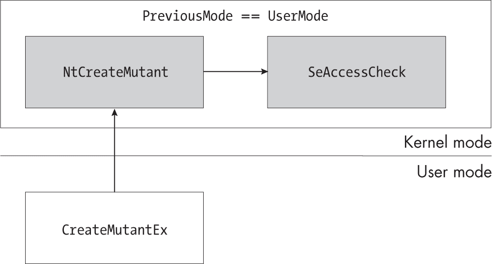
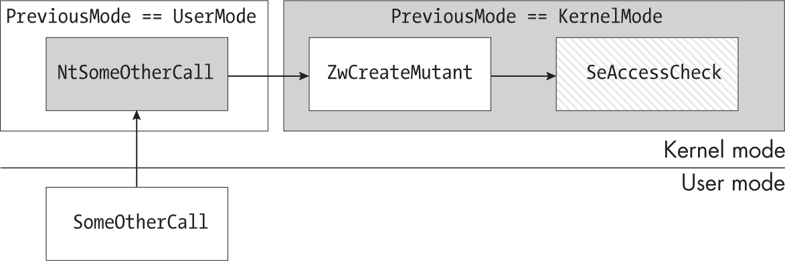
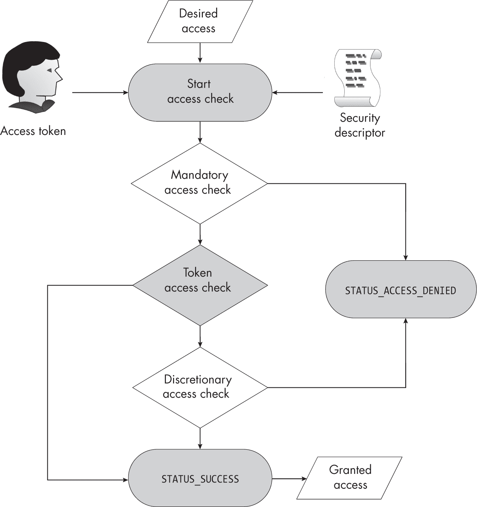
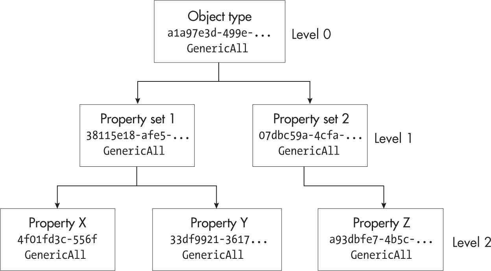
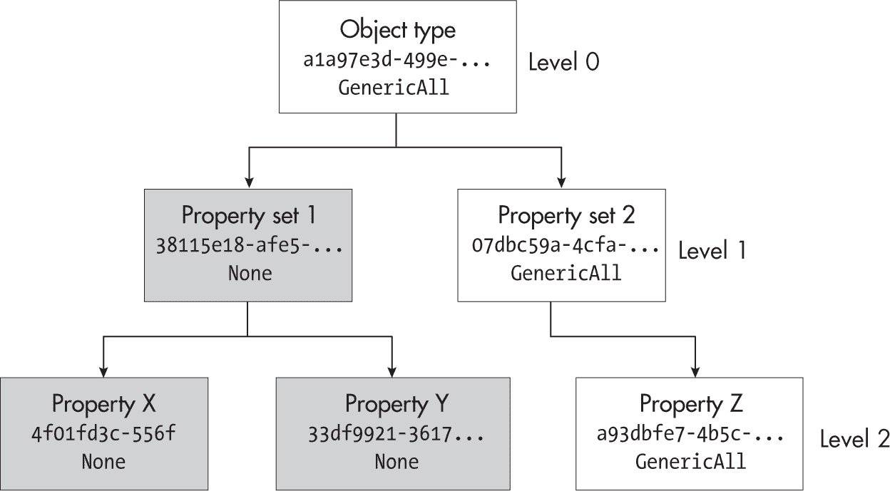
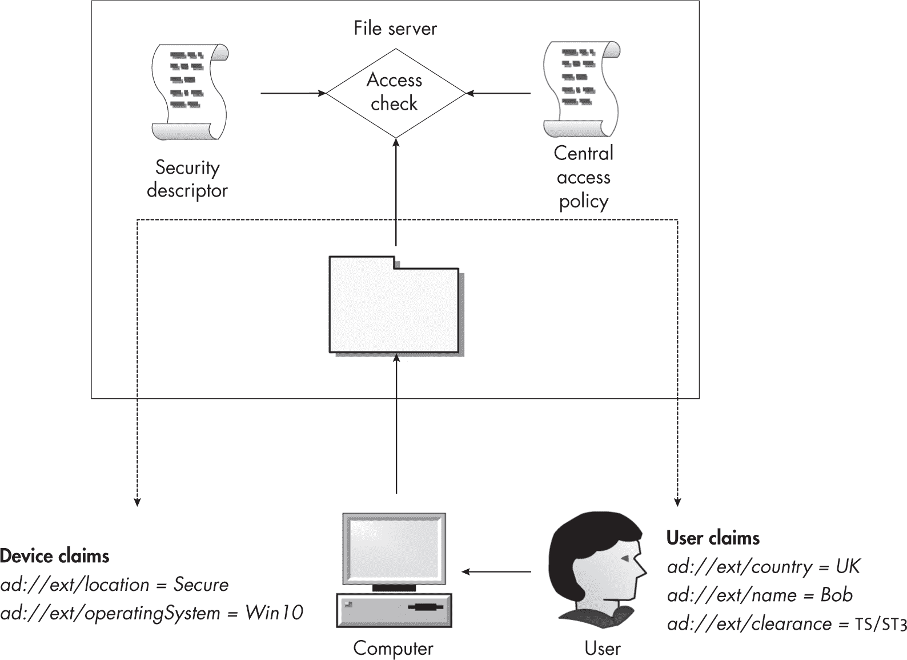

## 7 访问检查过程


我们已经介绍了 SRM 的前两个组件：安全访问令牌和安全描述符。现在，我们将定义其最后一个组件：访问检查过程，它接受令牌和安全描述符，并应用一组固定的规则来确定应用程序是否可以访问资源。

我们将首先讨论您可以调用的用于执行访问检查的 API。然后，我们将深入探讨 Windows 内核中访问检查的实现，详细说明该检查如何处理安全描述符的不同部分以及 Token 对象，从而生成资源的最终授权访问值。在此过程中，我们将使用 PowerShell 脚本开发我们自己的基本访问检查过程实现。

### 运行访问检查

当调用者尝试打开资源时，内核会根据调用者的身份执行访问检查。用于运行访问检查的 API 取决于它是从内核模式还是用户模式调用。让我们首先描述内核模式 API。

#### 内核模式访问检查

SeAccessCheck API 实现了内核模式下的访问检查过程。它接受以下参数：

**安全描述符    **用于检查的安全描述符；必须包含所有者和组 SID

**安全主体上下文    **调用者的主令牌和模拟令牌

**所需访问    **调用者请求访问的访问掩码

**访问模式    **调用者的访问模式，设置为 UserMode 或 KernelMode

**通用映射    **特定类型的通用映射

API 返回四个值：

**授权访问    **用户被授予的访问权限掩码

**访问状态代码    **指示访问检查结果的 NT 状态代码

**特权    **在访问检查过程中使用的任何特权

**成功代码    **布尔值；如果 TRUE，则访问检查成功

如果访问检查成功，API 将把授权访问设置为所需访问参数，成功代码设置为 true，访问状态代码设置为 STATUS_SUCCESS。然而，如果所需访问中的任何位未被授权，它将把授权访问设置为 0，成功代码设置为 false，访问状态代码设置为 STATUS_ACCESS_DENIED。

你可能会想，既然必须授予所需访问的所有位才能使此值表示成功，那么 API 为什么还要返回已授予的访问值？原因是，这种行为支持 MaximumAllowed 访问掩码位，调用者可以在所需访问参数中设置此位。如果该位被设置，并且访问检查至少授予了一个访问权限，API 将返回 STATUS_SUCCESS，并将授予的访问设置为最大允许访问。

安全主体上下文参数是指向一个 SECURITY_SUBJECT_CONTEXT 结构的指针，该结构包含调用者的主令牌和调用者线程的任何模拟令牌。通常，内核代码将使用内核 API SeCaptureSubjectContext 来初始化该结构，并收集当前调用者的正确令牌。如果捕获了模拟令牌，它必须处于模拟级别或更高；否则，API 将失败，并且访问状态码将被设置为 STATUS_BAD_IMPERSONATION_LEVEL。

请注意，调用 SeAccessCheck 的操作可能不会发生在发起原始资源请求的线程中。例如，检查可能已被委派给 System 进程中的后台线程。内核可以从原始线程捕获主体上下文，然后将该上下文传递给调用 SeAccessCheck 的线程，以确保访问检查使用正确的身份。

##### 访问模式

访问模式参数有两个可能的值，UserMode 和 KernelMode。如果将 UserMode 传递给此参数，所有访问检查将继续按正常方式进行。然而，如果传递 KernelMode，内核将禁用所有访问检查。为什么你想在不强制执行任何安全性检查的情况下调用 SeAccessCheck 呢？通常，你不会直接调用带有 KernelMode 值的 API。相反，参数将被设置为调用线程的 PreviousMode 参数的值，该值存储在线程的内核对象结构中。当你从用户模式应用程序调用系统调用时，PreviousMode 的值被设置为 UserMode 并传递给任何需要设置 AccessMode 的 API。

因此，内核通常会强制执行所有访问检查。图 7-1 展示了用户模式应用程序调用 NtCreateMutant 系统调用时的行为。



图 7-1：调用 NtCreateMutant 系统调用时线程的 PreviousMode 值

即使在图 7-1 中调用 SeAccessCheck 的线程正在执行内核代码，该线程的 PreviousMode 值也反映了该调用是从 UserMode 启动的。因此，传递给 SeAccessCheck 的 AccessMode 参数将是 UserMode，并且内核将强制执行访问检查。

将线程的 PreviousMode 值从 UserMode 转换为 KernelMode 的最常见方式是现有的内核代码通过其 Zw 形式调用系统调用：例如，ZwCreateMutant。当进行这样的调用时，系统调用分派程序会正确识别之前的执行发生在内核中，并将 PreviousMode 设置为 KernelMode。图 7-2 展示了线程的 PreviousMode 从 UserMode 转换为 KernelMode 的过程。



图 7-2：线程的 PreviousMode 值在调用 ZwCreateMutant 后被设置为 KernelMode

在图 7-2 中，用户模式应用程序调用一个假设的内核系统调用，NtSomeOtherCall，该调用内部会调用 ZwCreateMutant。执行 NtSomeOtherCall 函数的代码使用的 PreviousMode 值为 UserMode。然而，一旦调用了 ZwCreateMutant，该模式会在系统调用期间变更为 KernelMode。在这种情况下，因为 ZwCreateMutant 会调用 SeAccessCheck 来确定调用者是否有权访问 Mutant 对象，API 会接收到 AccessMode 被设置为 KernelMode，从而禁用访问检查。

如果假设的 NtSomeOtherCall 允许用户模式应用程序影响 Mutant 对象的创建位置，这种行为可能会引入安全问题。一旦禁用了访问检查，用户可能能够在通常不允许访问的位置创建或修改 Mutant。

##### 内存指针检查

访问模式参数有第二个作用：当指定 UserMode 时，内核会检查传递给内核 API 的任何指针，确保它们不会指向内核内存位置。这是一个重要的安全限制；它防止用户模式应用程序强迫内核 API 读取或写入它不应访问的内核内存。

指定 KernelMode 会在禁用访问检查的同时禁用这些指针检查。这种行为混合可能引发安全问题：内核模式驱动程序可能只希望禁用指针检查，但无意中禁用了访问检查。

调用者如何指示访问模式参数的不同用途取决于所使用的内核 API。例如，有时可以为指针检查和访问检查分别指定两个 AccessMode 值。更常见的方法是向调用中指定一个标志；例如，传递给系统调用的 OBJECT_ATTRIBUTES 结构有一个名为 ForceAccessCheck 的标志，它禁用指针检查，但保留访问检查启用。

如果你正在分析内核驱动程序，值得注意的是使用 Zw API 时没有设置 ForceAccessCheck 标志。如果非管理员用户能够控制调用的目标对象管理器路径，那么可能会存在安全漏洞。例如，CVE-2020-17136 是一个内核驱动程序中的漏洞，该驱动程序负责实现 Microsoft OneDrive 远程文件系统。问题发生在驱动程序暴露给 Explorer shell 的 API 在创建基于云的文件时没有设置 ForceAccessCheck 标志。由于这一点，调用内核驱动程序中的 API 的用户可以在文件系统的任何位置创建任意文件，从而使他们获得管理员权限。

#### 用户模式访问检查

为了支持用户模式应用程序，内核通过 NtAccessCheck 系统调用公开了其访问检查实现。此系统调用使用与 SeAccessCheck API 相同的访问检查算法；然而，它专为用户模式调用者的独特行为量身定制。该系统调用的参数如下：

**安全描述符**用于检查的安全描述符；必须包含所有者和组 SID

**客户端令牌**调用者的模拟令牌句柄

**所需访问** 调用者请求的访问权限的访问掩码

**通用映射** 类型特定的通用映射

API 返回四个值：

**授予的访问权限** 用户被授予的访问权限的访问掩码

**访问状态代码** 一个 NT 状态代码，指示访问检查的结果

**权限** 访问检查过程中使用的任何权限

**NT 成功代码** 一个单独的 NT 状态代码，指示系统调用的状态

你会注意到在内核 API 中，一些参数在这里缺失了。例如，没必要指定访问模式，因为它将始终设置为调用者的模式（对于用户模式调用者来说是<code class="SANS_TheSansMonoCd_W5Regular_11">UserMode</code>）。此外，调用者的身份现在是一个指向模拟令牌的句柄，而不是一个主体上下文。这个句柄必须具有<code class="SANS_TheSansMonoCd_W5Regular_11">Query</code>访问权限，才能用于访问检查。如果你想针对主令牌执行访问检查，你需要先将该令牌复制为模拟令牌。

另一个不同之处在于，用户模式下使用的模拟令牌的最低权限可以是识别级别。出现这种差异的原因是，系统调用是为用户服务设计的，目的是检查调用者的权限，而调用者可能会授予一个识别级别的令牌访问权限；这一条件必须考虑在内。

系统调用还会返回一个额外的 NT 状态代码，而不是内核 API 返回的布尔值。返回值指示是否存在传递给系统调用的参数问题。例如，如果安全描述符没有设置所有者和组 SID，系统调用将返回<code class="SANS_TheSansMonoCd_W5Regular_11">STATUS_INVALID_SECURITY_DESCR</code>。

#### Get-NtGrantedAccess PowerShell 命令

我们可以使用<code class="SANS_TheSansMonoCd_W5Regular_11">NtAccessCheck</code>系统调用，基于安全描述符和访问令牌来确定调用者的授予访问权限。PowerShell 模块通过<code class="SANS_TheSansMonoCd_W5Regular_11">Get-NtGrantedAccess</code>命令包装对<code class="SANS_TheSansMonoCd_W5Regular_11">NtAccessCheck</code>的调用，如清单 7-1 所示。

```
❶ PS> **$sd = New-NtSecurityDescriptor -EffectiveToken -Type Mutant**
PS> **Format-NtSecurityDescriptor $sd -Summary**
<Owner> : GRAPHITE\user
<Group> : GRAPHITE\None
<DACL>
GRAPHITE\user: (Allowed)(None)(Full Access)
NT AUTHORITY\SYSTEM: (Allowed)(None)(Full Access)
NT AUTHORITY\LogonSessionId_0_795805: (Allowed)(None)(ModifyState|...)

❷ PS> **Get-NtGrantedAccess $sd -AsString**
Full Access

❸ PS> **Get-NtGrantedAccess $sd -Access ModifyState -AsString**
ModifyState

❹ PS> **Clear-NtSecurityDescriptorDacl $sd**
PS> **Format-NtSecurityDescriptor $sd -Summary**
<Owner> : GRAPHITE\user
<Group> : GRAPHITE\None
<DACL> - <EMPTY>

PS> **Get-NtGrantedAccess $sd -AsString**
❺ ReadControl|WriteDac 
```

清单 7-1：确定调用者授予的访问权限

我们首先使用EffectiveToken参数创建默认安全描述符 ❶，并通过格式化它来确认其正确性。简单来说，系统调用会检查此安全描述符的 DACL 中是否有与令牌 SIDs 匹配的Allowed ACE；如果存在这样的 ACE，它将授予访问掩码。由于 DACL 中的第一个 ACE 授予当前用户 SID Full Access，我们期望检查结果也授予Full Access。

然后，我们调用Get-NtGrantedAccess，并传入安全描述符 ❷。我们没有指定显式的令牌，因此它使用当前有效令牌。我们也没有指定访问掩码，这意味着该命令检查MaximumAllowed访问权限，并将结果转换为字符串。它返回了Full Access，正如我们根据 DACL 的预期结果一样。

接下来，我们测试在使用Access参数 ❸提供显式访问掩码时的Get-NtGrantedAccess命令。该命令将根据安全描述符的类型计算访问掩码枚举，以便我们指定类型特定的值。我们请求检查ModifyState，因此我们只会获得该访问权限。例如，如果我们正在打开一个Mutant对象的句柄，则该句柄的访问掩码将仅授予ModifyState权限。

最后，为了测试访问被拒绝的情况，我们从 DACL 中移除所有 ACE ❹。如果没有Allowed ACE，则不应授予任何访问权限。但当我们再次运行Get-NtGrantedAccess时，我们得到了一个惊讶的结果：我们被授予了ReadControl和WriteDac访问权限，而不是没有权限 ❺。为了理解为什么我们会获得这些访问权限，我们需要深入了解访问检查过程的内部机制。在下一节中，我们将进行探讨。

### PowerShell 中的访问检查过程

Windows 中的访问检查过程自 Windows NT 的第一个版本以来已经发生了重大变化。这一演变导致了一套复杂的算法，用于根据安全描述符和令牌的组合计算用户被授予的访问权限。图 7-3 展示了访问检查过程的主要组成部分。



图 7-3：访问检查过程

第一步是将令牌、安全描述符和期望的访问掩码结合起来。访问检查过程随后使用这些信息，在以下三个主要检查中判断是否应授予或拒绝访问：

**强制访问检查** 当令牌不符合设置的策略时，拒绝访问资源

**令牌访问检查** 根据令牌的所有者和权限授予访问权限

**自主访问检查** 根据 DACL 授予或拒绝访问权限

为了更详细地探讨这些步骤，让我们编写一个基本的 PowerShell 实现来模拟访问检查过程。这个 PowerShell 实现不会替代 Get-NtGrantedAccess 命令，因为为了简单起见，它不会检查最大允许访问权限，可能也不包含更新的功能。尽管如此，拥有一个可以分析和调试的实现仍然有助于你更好地理解整体过程。

访问检查的实现相当复杂，因此我们将分阶段构建它。你可以在本书示例代码中随附的 *chapter7_access_check_impl.psm1* 脚本中访问完整实现。要使用该脚本，可以通过以下命令将其作为模块导入：

```
PS> **Import-Module .\chapter7_access_check_impl.psm1** 
```

#### 定义访问检查函数

该模块导出一个顶层函数来执行访问检查，Get-PSGrantedAccess，如列表 7-2 所示。

```
function Get-PSGrantedAccess {
    param(
        $Token = (Get-NtToken -Effective -Pseudo),
        $SecurityDescriptor,
        $GenericMapping,
        $DesiredAccess
    )

  ❶ $context = @{
        Token = $Token
        SecurityDescriptor = $SecurityDescriptor
        GenericMapping = $GenericMapping
        RemainingAccess = Get-NtAccessMask $DesiredAccess
        Privileges = @()
    }

    ## Test-MandatoryAccess defined below.
  ❷ if (!(Test-MandatoryAccess $context)) {
        return Get-AccessResult STATUS_ACCESS_DENIED
    }

    ## Get-TokenAccess defined below.
    Resolve-TokenAccess $context
  ❸ if (Test-NtAccessMask $context.RemainingAccess -Empty) {
       ❹ return Get-AccessResult STATUS_SUCCESS $context.Privileges
$DesiredAccess
    }

  ❺ if (Test-NtAccessMask $context.RemainingAccess AccessSystemSecurity) {
        return Get-AccessResult STATUS_PRIVILEGE_NOT_HELD
    }

    Get-DiscretionaryAccess $context
  ❻ if (Test-NtAccessMask $context.RemainingAccess -Empty) {
        return Get-AccessResult STATUS_SUCCESS $context.Privileges
$DesiredAccess
    }

  ❼ return Get-AccessResult STATUS_ACCESS_DENIED
} 
```

列表 7-2：顶层访问检查函数

该函数接受我们在本章前面定义的四个参数：令牌、安全描述符、类型的通用映射和期望的访问权限。如果调用者没有指定令牌，我们将使用其有效令牌进行后续的访问检查。

函数要处理的第一个任务是构建一个表示当前访问检查过程状态的上下文 ❶。这里使用的最重要属性是 RemainingAccess。我们最初将此属性设置为 DesiredAccess 参数，然后在访问检查过程中根据授予的权限逐步移除属性中的位。

该函数的其余部分遵循图 7-3 中的流程图。首先，它执行强制访问检查 ❷。我们将在下一节描述此检查的作用。如果检查失败，则函数以 STATUS_ACCESS_DENIED 完成。为了简化代码，完整脚本定义了一个辅助函数，Get-AccessResult，用于构建访问检查的结果。列表 7-3 显示了该函数的定义。

```
function Get-AccessResult {
    param(
        $Status,
        $Privileges = @(),
        $GrantedAccess = 0
    )

    $props = @{
        Status = Get-NtStatus -Name $Status -PassStatus
        GrantedAccess = $GrantedAccess
        Privileges = $Privileges
    }
    return [PSCustomObject]$props
} 
```

清单 7-3：实现 Get-AccessResult 辅助函数

接下来，令牌访问检查会更新上下文中的 RemainingAccess 属性 ❸。如果 RemainingAccess 变为空，则可以得出结论，我们已被授予所有访问权限，并且可以返回 STATUS_SUCCESS ❹。如果它不为空，我们会进行第二次检查：如果调用者请求了 AccessSystemSecurity 且令牌未授予该权限，则此检查失败 ❺。

最后，我们执行自由裁量访问检查。与令牌访问检查一样，我们检查 RemainingAccess 属性：如果它为空，表示调用者已获得他们请求的所有访问权限 ❻；否则，表示他们的访问被拒绝 ❼。有了这个概览后，让我们依次深入探讨每个检查的细节。

#### 执行强制访问检查

Windows Vista 引入了一种名为 *强制完整性控制（MIC）* 的功能，它使用令牌的完整性级别和强制标签 ACE 来基于一般策略控制资源访问。MIC 是一种强制访问检查（MAC）。MAC 的关键行为是它不能授予资源访问权限；它只能拒绝访问。如果调用者请求的访问权限超过策略允许的范围，访问检查会立即拒绝访问，如果 MAC 拒绝访问，DACL 将永远不会被检查。由于没有非特权用户能够绕过该检查，因此它被认为是强制性的。

在最新版本的 Windows 中，访问检查过程执行了两个额外的强制检查，这些检查与 MIC 一起进行。这些检查实现了类似的行为，因此我们将它们放在一起。 清单 7-4 定义了我们在 清单 7-2 中调用的 Test-MandatoryAccess 函数。

```
function Test-MandatoryAccess {
    param($Context)

    ## Test-ProcessTrustLevel is defined below.
    if (!(Test-ProcessTrustLevel $Context)) {
        return $false
    }

    ## Test-AccessFilter is defined below.
    if (!(Test-AccessFilter $Context)) {
        return $false
    }

    ## Test-MandatoryIntegrityLevel is defined below.
    if (!(Test-MandatoryIntegrityLevel $Context)) {
        return $false
    }

    return $true
} 
```

清单 7-4：实现 Test-MandatoryAccess 函数

该函数执行三个检查：Test-ProcessTrustLevel、Test-AccessFilter 和 Test-MandatoryIntegrityLevel。如果任何一个检查失败，则整个访问检查过程失败，并返回 STATUS_ACCESS_DENIED。让我们依次详细介绍每个检查。

##### 进程信任级别检查

Windows Vista 引入了*受保护进程*，这些进程连管理员也无法操控和破坏。受保护进程的初衷是保护媒体内容。然而，微软后来将其扩展到各种用途，如保护防病毒服务和虚拟机。

一个令牌可以被分配一个*进程信任级别 SID*。这个 SID 取决于受保护进程的保护级别，并在该进程创建时分配。为了限制对资源的访问，访问检查过程会确定令牌的 SID 是否与安全描述符中的信任级别 SID 同样或更受信任。

当一个 SID 被认为与另一个 SID 同样或更受信任时，称为*占主导地位*。要检查一个进程信任级别 SID 是否占主导地位，可以调用 RtlSidDominatesForTrust API 或使用 Compare-NtSid 命令并带上 Dominates 参数。列表 7-5 将检查进程信任级别的算法转换为 PowerShell，该算法存储在进程信任标签 ACE 中。

```
function Test-ProcessTrustLevel {
    param($Context)

  ❶ $trust_level = Get-NtTokenSid $Token -TrustLevel
    if ($null -eq $trust_level) {
        $trust_level = Get-NtSid -TrustType None -TrustLevel None
    }

  ❷ $access = Get-NtAccessMask 0xFFFFFFFF
    $sacl = Get-NtSecurityDescriptorSacl $Context.SecurityDescriptor
    foreach($ace in $sacl) {
      ❸ if (!$ace.IsProcessTrustLabelAce -or $ace.IsInheritOnly) {
            continue
        }

      ❹ if (!(Compare-NtSid $trust_level $ace.Sid -Dominates)) {
            $access = Get-NtAccessMask $ace
        }
        break
    }

    $access = Grant-NtAccessMask $access AccessSystemSecurity
  ❺ return Test-NtAccessMask $access $Context.RemainingAccess -All
} 
```

列表 7-5：进程信任级别检查算法

为了检查进程信任级别，我们需要查询当前令牌的 SID ❶。如果令牌没有信任级别 SID，则定义最低可能的 SID。接下来，我们初始化一个访问掩码，使所有位都被设置 ❷。

然后，我们枚举 SACL 中的值，检查除了 InheritOnly ❸ 以外的任何进程信任标签 ACE。当我们找到相关的 ACE 时，我们将其 SID 与查询的令牌 SID 进行比较 ❹。如果 ACE SID 占主导地位，则表示令牌的保护级别较低，访问掩码将设置为 ACE 中的值。

最后，我们将访问掩码与调用者请求的剩余访问进行比较 ❺。如果访问掩码中的所有位都出现在剩余访问中，则函数返回 True，这表示进程信任级别检查成功。请注意，检查始终会添加 AccessSystemSecurity，无论 ACE 中的掩码如何。

让我们测试进程信任标签 ACE 的行为。我们不会创建新的受保护进程，而是使用匿名用户令牌的进程信任级别 SID 来进行访问检查。为了简化测试，我们将定义一个可以重用的辅助函数。这个函数在列表 7-6 中将创建一个默认的安全描述符，允许当前用户和匿名用户访问。每当我们需要一个安全描述符进行测试时，我们可以调用这个函数并使用返回的值。

```
PS> **function New-BaseSD {**
    **$owner = Get-NtSid -KnownSid LocalSystem**
    **$sd = New-NtSecurityDescriptor -Owner $owner -Group $owner -Type Mutant**
    **Add-NtSecurityDescriptorAce $sd -KnownSid Anonymous -Access GenericAll**
    **$sid = Get-NtSid**
    **Add-NtSecurityDescriptorAce $sd -Sid $sid -Access GenericAll**
    **Set-NtSecurityDescriptorIntegrityLevel $sd Untrusted**
    **Edit-NtSecurityDescriptor $sd -MapGeneric**
    **return $sd**
**}** 
```

列表 7-6：定义用于测试的辅助函数

New-BaseSD 函数创建一个基本的安全描述符，所有者和组设置为 *SYSTEM* 用户。然后，它为匿名用户和当前用户 SID 添加一个 Allowed ACE，授予它们完全访问权限。它还将强制性标签设置为 Untrusted 完整性级别（你将在“强制性完整性级别检查”中了解为什么完整性级别很重要，第 235 页）。最后，它将任何通用访问映射为 Mutant 类型特定访问。现在让我们按照 列表 7-7 测试进程信任标签。

```
❶ PS> **$sd = New-BaseSD**
PS> **$trust_sid = Get-NtSid -TrustType ProtectedLight -TrustLevel Windows**
PS> **Add-NtSecurityDescriptorAce $sd -Type ProcessTrustLabel** 
**-Access ModifyState -Sid $trust_sid**
PS> **Get-NtGrantedAccess $sd -AsString**
❷ ModifyState

❸ PS> **$token = Get-NtToken -Anonymous**
PS> **$anon_trust_sid = Get-NtTokenSid -Token $token -TrustLevel**
PS> **Compare-NtSid $anon_trust_sid $trust_sid -Dominates**
❹ True
**PS> Get-NtGrantedAccess $sd -Token $token -AsString**
❺ Full Access 
```

列表 7-7：测试进程信任标签 ACE

首先，我们创建基本的安全描述符，并添加进程信任标签，只授予那些其进程信任级别不优先于进程信任标签的令牌 ModifyState 访问权限 ❶。当我们运行访问检查时，看到没有任何进程信任级别的有效令牌只获得了 ModifyState 访问权限 ❷，这表明进程信任标签正在被强制执行。

接下来，我们使用 Get-NtToken 获取匿名用户的令牌，查询其进程信任级别 SID，并将其与我们添加到安全描述符中的 SID 进行比较 ❸。调用 Compare-NtSid 返回 True ❹，这表示令牌的进程信任级别 SID 优先于安全描述符中的 SID。为了确认这一点，我们运行访问检查，发现匿名用户的令牌被授予了 完全访问 ❺，这意味着进程信任标签没有限制其访问。

你可能会想，是否可以假扮成匿名令牌以绕过进程信任标签。请记住，在用户模式下，我们调用的是 NtAccessCheck，它只接受一个 Token 句柄，但内核的 SeAccessCheck 则接受主令牌和假冒令牌。在内核验证进程信任标签之前，它会检查这两个令牌，并选择信任级别较低的一个。因此，如果假冒令牌被信任而你的主令牌不受信任，实际的信任级别将是不受信任的。

Windows 在将进程信任标签 ACE 分配给资源时会进行二次安全检查。虽然你只需要 WriteDac 访问权限就能设置进程信任标签，但如果你的有效信任级别不支配该标签的信任级别，你无法更改或删除该 ACE。这可以防止你设置新的任意进程信任标签 ACE。微软利用这一能力检查与 Windows 应用程序相关的某些文件是否被修改，并验证这些文件是否由受保护的进程创建。

##### 访问过滤器 ACE

第二个强制访问检查是访问过滤器 ACE。它的工作方式与进程信任标签 ACE 相似，唯一的区别是，它不使用进程信任级别来决定是否应用限制访问掩码，而是使用一个条件表达式，该表达式的结果为 True 或 False。如果条件结果为 False，则 ACE 的访问掩码会限制最大授权访问；如果结果为 True，则忽略访问过滤器。

在 SACL 中可以有多个访问过滤器 ACE。每个结果为 False 的条件表达式都会移除更多的访问掩码。因此，如果你匹配了一个 ACE，但没有匹配第二个限制为 GenericRead 的 ACE，你将获得最大的访问权限 GenericRead。我们可以在 PowerShell 函数中表示这一逻辑，如 列表 7-8 所示。

```
function Test-AccessFilter {
    param($Context)

    $access = Get-NtAccessMask 0xFFFFFFFF
    $sacl = Get-NtSecurityDescriptorSacl $Context.SecurityDescriptor
    foreach($ace in $sacl) {
        if (!$ace.IsAccessFilterAce -or $ace.IsInheritOnly) {
            continue
        }
      ❶ if (!(Test-NtAceCondition $ace -Token $token)) {
          ❷ $access = $access -band $ace.Mask
        }
    }

    $access = Grant-NtAccessMask $access AccessSystemSecurity
  ❸ return Test-NtAccessMask $access $Context.RemainingAccess -All
} 
```

列表 7-8：访问过滤器检查算法

这个算法类似于我们用来检查进程信任级别的算法。唯一的区别是我们检查的是条件表达式，而不是 SID ❶。该函数支持多个访问过滤器 ACE；对于每个匹配的 ACE，访问掩码会与最终访问掩码进行按位与操作，最终访问掩码从所有访问掩码位都设置为 1 开始 ❷。随着掩码进行与运算，每个 ACE 只能移除访问权限，而不能增加访问权限。一旦我们检查完所有 ACE，就会检查剩余的访问权限以确定检查是否成功 ❸。

在 列表 7-9 中，我们检查访问过滤器算法的行为，以确保它按预期工作。

```
PS> **$sd = New-BaseSD**
❶ PS> **Add-NtSecurityDescriptorAce $sd -Type AccessFilter -KnownSid World**
**-Access ModifyState -Condition "Exists TSA://ProcUnique" -MapGeneric**
PS> **Format-NtSecurityDescriptor $sd -Summary -SecurityInformation AccessFilter**
<Access Filters>
Everyone: (AccessFilter)(None)(ModifyState)(Exists TSA://ProcUnique)

❷ PS> **Show-NtTokenEffective -SecurityAttributes**
SECURITY ATTRIBUTES
-------------------
Name             Flags                  ValueType Values
----             -----                  --------- ------
TSA://ProcUnique NonInheritable, Unique UInt64    {187, 365588953}

PS> **Get-NtGrantedAccess $sd -AsString**
❸ Full Access

PS> **Use-NtObject($token = Get-NtToken -Anonymous) {**
    **Get-NtGrantedAccess $sd -Token $token -AsString**
**}**
❹ ModifyState 
```

列表 7-9：测试访问过滤器 ACE

我们将访问过滤器 ACE 添加到安全描述符中，使用条件表达式 "Exists TSA://ProcUnique" ❶。该表达式检查令牌中是否存在 TSA://ProcUnique 安全属性。对于普通用户，此检查应始终返回 True；然而，该属性在匿名用户的令牌中不存在。我们将掩码设置为 ModifyState，并将 SID 设置为 *Everyone* 组。注意，SID 并未被验证，因此可以具有任何值，但使用 *Everyone* 组是惯例。

我们可以使用 Show-NtTokenEffective ❷ 检查当前有效令牌的安全属性。获取有效令牌的最大访问权限会导致 Full Access ❸，这意味着访问过滤器检查通过，且没有限制访问。然而，当我们使用匿名用户的令牌重复此操作时，访问过滤器检查失败，访问权限仅限于 ModifyState ❹。

要设置访问过滤器，您只需要 WriteDac 访问权限。那么，是什么阻止用户移除过滤器呢？显然，访问过滤器本不应授予 WriteDac 访问权限，但如果确实授予了，您可以限制对受保护的进程信任级别的任何更改。为此，将 ACE SID 设置为进程信任级别 SID，并设置 TrustProtected ACE 标志。现在，具有较低进程信任级别的调用者将无法移除或修改访问过滤器 ACE。

##### 强制性完整性级别检查

最后，我们将实施强制性完整性级别检查。在 SACL 中，强制性标签 ACE 的 SID 表示安全描述符的完整性级别。其掩码表示强制性策略，结合了 NoReadUp、NoWriteUp 和 NoExecuteUp 策略，以确定系统根据通用映射结构中的 GenericRead、GenericWrite 和 GenericExecute 值，能够授予调用者的最大访问权限。

为了确定是否执行策略，该检查会比较安全描述符和令牌的完整性级别 SID。如果令牌的 SID 主导了安全描述符的 SID，那么就不会执行策略，任何访问都被允许。然而，如果令牌的 SID 没有主导安全描述符的 SID，那么任何超出策略值的访问请求都会导致访问检查失败，并返回 STATUS_ACCESS_DENIED。

计算一个完整性级别 SID 是否主导另一个 SID 要比计算进程信任级别 SID 的等效值简单得多。为此，我们从每个 SID 中提取最后一个 RID，并将这些 RID 作为数字进行比较。如果一个完整性级别 SID 的 RID 大于或等于另一个 SID 的 RID，则它主导该 SID。

然而，基于通用映射计算策略的访问掩码要复杂得多，因为它需要考虑共享访问权限。我们不会实现计算访问掩码的代码，因为可以使用Get-NtAccessMask中的选项来为我们计算它。

在清单 7-10 中，我们实现了强制完整性级别检查。

```
function Test-MandatoryIntegrityLevel {
    param($Context)

    $token = $Context.Token
    $sd = $Context.SecurityDescriptor
    $mapping = $Context.GenericMapping

  ❶ $policy = Get-NtTokenMandatoryPolicy -Token $token
    if (($policy -band "NoWriteUp") -eq 0) {
        return $true
    }

    if ($sd.HasMandatoryLabelAce) {
        $ace = $sd.GetMandatoryLabel()
        $sd_il_sid = $ace.Sid
      ❷ $access = Get-NtAccessMask $ace.Mask -GenericMapping $mapping
    } else {
      ❸ $sd_il_sid = Get-NtSid -IntegrityLevel Medium
        $access = Get-NtAccessMask -MandatoryLabelPolicy NoWriteUp
-GenericMapping $GenericMapping
    }

  ❹ if (Test-NtTokenPrivilege -Token $token SeRelabelPrivilege) {
        $access = Grant-NtAccessMask $access WriteOwner
    }

  ❺ $il_sid = Get-NtTokenSid -Token $token -Integrity
    if (Compare-NtSid $il_sid $sd_il_sid -Dominates) {
        return $true
    }

    return Test-NtAccessMask $access $Context.RemainingAccess -All
} 
```

清单 7-10：强制完整性级别检查算法

我们首先检查令牌的强制策略 ❶。在这种情况下，我们检查是否设置了 NoWriteUp 标志。如果没有设置该标志，那么我们禁用此令牌的完整性级别检查，并返回 True。然而，这个标志很少会被关闭，并且需要 SeTcbPrivilege 来禁用，因此在几乎所有情况下，完整性级别检查都会继续进行。

接下来，我们需要从强制标签 ACE 中捕获安全描述符的完整性级别和强制策略。如果 ACE 存在，我们提取这些值并使用 Get-NtAccessMask 将策略映射到最大访问掩码 ❷。如果 ACE 不存在，则默认使用 Medium 完整性级别和 NoWriteUp 策略 ❸。

如果令牌具有 SeRelabelPrivilege 权限，我们会将 WriteOwner 访问权限恢复到最大访问权限，即使策略已经移除了该权限 ❹。这允许启用了 SeRelabelPrivilege 的调用者修改安全描述符的强制完整性标签 ACE。

然后我们查询令牌的完整性级别 SID，并将其与安全描述符的 ❺ 进行比较。如果令牌的 SID 占主导地位，那么检查通过并允许任何访问。否则，计算出的策略访问掩码必须授予请求的所有剩余访问掩码。请注意，这里我们没有像在进程信任级别和访问过滤器检查中那样对 AccessSystemSecurity 做特别处理。如果策略包含 NoWriteUp，这是所有资源类型的默认设置，我们将其移除。

让我们验证强制完整性级别检查在实际访问检查过程中的行为（Listing 7-11）。

```
PS> **$sd = New-BaseSD**
PS> **Format-NtSecurityDescriptor $sd -SecurityInformation Label -Summary**
<Mandatory Label>
❶ Mandatory Label\Untrusted Mandatory Level: (MandatoryLabel)(None)(NoWriteUp)

PS> **Use-NtObject($token = Get-NtToken -Anonymous) {**
    **Format-NtToken $token -Integrity**
    **Get-NtGrantedAccess $sd -Token $token -AsString**
**}**
INTEGRITY LEVEL
---------------
❷ Untrusted
Full Access

❸ PS> **Remove-NtSecurityDescriptorIntegrityLevel $sd**
PS> **Use-NtObject($token = Get-NtToken -Anonymous) {**
    **Get-NtGrantedAccess $sd -Token $token -AsString**
**}**
❹ ModifyState|ReadControl|Synchronize 
```

Listing 7-11：测试强制标签 ACE

我们首先创建一个安全描述符并检查其强制完整性标签。我们可以看到它被设置为 Untrusted 完整性级别，这是最低级别，并且它的策略是 NoWriteUp ❶。然后我们获取匿名用户令牌的最大访问权限，我们可以看到该令牌的完整性级别是 Untrusted ❷。由于该完整性级别与安全描述符的完整性级别匹配，因此该令牌被允许完全访问。

为了测试访问掩码限制，我们从安全描述符中移除强制标签 ACE，使得访问检查将默认到 Medium 完整性级别 ❸。再次运行检查后，我们现在得到了 ModifyState|ReadControl|Synchronize ❹，这就是 Mutant 对象的完全访问权限，但没有 GenericWrite 访问掩码。

这就结束了强制访问检查的实现。我们已经看到，这个算法实际上由三个独立的检查组成，分别是进程信任级别、访问过滤器和完整性级别。每个检查只能拒绝访问；它从不授予额外的访问权限。

#### 执行令牌访问检查

第二个主要检查，令牌访问检查，使用调用者令牌的属性来决定是否授予某些访问权限。更具体地说，它检查是否存在任何特殊权限，以及安全描述符的所有者。

与强制访问检查不同，如果令牌的访问掩码已移除所有位，则令牌访问检查可以授予对资源的访问。Listing 7-12 实现了顶级的 Result-TokenAccess 函数。

```
Function Result-TokenAccess {
    param($Context)

    Resolve-TokenPrivilegeAccess $Context
    if (Test-NtAccessMask $Context.RemainingAccess -Empty) {
        return
    }
    return Resolve-TokenOwnerAccess $Context
} 
```

Listing 7-12：令牌访问检查算法

该检查很简单。首先，我们使用我们接下来定义的函数Resolve-TokenPrivilegeAccess检查令牌的权限，并将当前上下文传递给它。如果某些权限已启用，该函数会修改令牌的剩余访问权限；如果剩余访问权限为空，表示没有权限可以授予，我们可以立即返回。然后，我们调用Resolve-TokenOwnerAccess，该函数检查令牌是否拥有资源，并且也可以更新RemainingAccess。让我们深入了解这些具体的检查。

##### 权限检查

*权限检查*(列表 7-13)确定Token对象是否启用了三种不同的权限。对于每种权限，如果权限被启用，我们将授予一个访问掩码，并从剩余访问权限中提取相应的位。

```
function Resolve-TokenPrivilegeAccess {
    param($Context)

    $token = $Context.Token
    $access = $Context.RemainingAccess

  ❶ if ((Test-NtAccessMask $access AccessSystemSecurity) -and
        (Test-NtTokenPrivilege -Token $token SeSecurityPrivilege)) {
        $access = Revoke-NtAccessMask $access AccessSystemSecurity
        $Context.Privileges += "SeSecurityPrivilege"
    }

  ❷ if ((Test-NtAccessMask $access WriteOwner) -and
        (Test-NtTokenPrivilege -Token $token SeTakeOwnershipPrivilege)) {
        $access = Revoke-NtAccessMask $access WriteOwner
        $Context.Privileges += "SeTakeOwnershipPrivilege"
    }

  ❸ if ((Test-NtAccessMask $access WriteOwner) -and
        (Test-NtTokenPrivilege -Token $token SeRelabelPrivilege)) {
        $access = Revoke-NtAccessMask $access WriteOwner
        $Context.Privileges += "SeRelabelPrivilege"
    }

  ❹ $Context.RemainingAccess = $access
} 
```

列表 7-13：令牌权限访问检查算法

首先，我们检查调用者是否请求了AccessSystemSecurity；如果请求了，并且如果启用了SeSecurityPrivilege，我们将AccessSystemSecurity从剩余的访问权限中移除❶。我们还会更新我们已使用的权限列表，以便能够将其返回给调用者。

接下来，我们对SeTakeOwnershipPrivilege ❷和SeRelabelPrivilege ❸进行类似的检查，并在它们启用的情况下从剩余的访问权限中移除WriteOwner。最后，我们使用最终的访问掩码❹更新RemainingAccess值。

从内核的角度来看，授予WriteOwner访问权限给SeTakeOwnershipPrivilege和SeRelabelPrivilege是有意义的，因为修改所有者 SID 和完整性级别需要WriteOwner访问权限。然而，这种实现也意味着，只有SeRelabelPrivilege的令牌也可以获取资源的所有权，而这可能并非我们每次都希望发生的情况。幸运的是，即使是管理员默认情况下也不会获得SeRelabelPrivilege，这使得这个问题相对较小。

让我们将这个函数与实际的访问检查过程进行比较。以管理员身份运行列表 7-14 中的脚本。

```
PS> **$owner = Get-NtSid -KnownSid Null**
❶ PS> **$sd = New-NtSecurityDescriptor -Type Mutant -Owner $owner**
**-Group $owner -EmptyDacl**
❷ PS> **Enable-NtTokenPrivilege SeTakeOwnershipPrivilege**
❸ PS> **Get-NtGrantedAccess $sd -Access WriteOwner -PassResult**
Status               Granted Access Privileges
------               -------------- ----------
❹ STATUS_SUCCESS       WriteOwner     SeTakeOwnershipPrivilege

❺ PS> **Disable-NtTokenPrivilege SeTakeOwnershipPrivilege**
PS> **Get-NtGrantedAccess $sd -Access WriteOwner -PassResult**
Status               Granted Access Privileges
------               -------------- ----------
❻ STATUS_ACCESS_DENIED None           NONE 
```

列表 7-14：测试令牌权限检查

我们首先创建一个安全描述符，应该不授予当前用户任何访问权限❶。然后，我们启用<sub class="SANS_TheSansMonoCd_W5Regular_11">SeTakeOwnershipPrivilege</sub>❷。接下来，我们请求对<sub class="SANS_TheSansMonoCd_W5Regular_11">WriteOwner</sub>权限进行访问检查，并指定<sub class="SANS_TheSansMonoCd_W5Regular_11">PassResult</sub>参数，输出完整的访问检查结果❸。结果显示访问检查成功，授予了<sub class="SANS_TheSansMonoCd_W5Regular_11">WriteOwner</sub>权限，但也表明检查使用了<sub class="SANS_TheSansMonoCd_W5Regular_11">SeTakeOwnershipPrivilege</sub>❹。为了验证我们不是因为其他原因获得了<sub class="SANS_TheSansMonoCd_W5Regular_11">WriteOwner</sub>权限，我们禁用该权限❺并重新运行检查。这次，访问被拒绝❻。

##### 所有者检查

*所有者检查*的存在是为了即使 DACL 没有授予资源所有者任何其他权限，也能授予资源所有者<sub class="SANS_TheSansMonoCd_W5Regular_11">ReadControl</sub>和<sub class="SANS_TheSansMonoCd_W5Regular_11">WriteDac</sub>访问权限。这个检查的目的是防止用户将自己从自己的资源中锁定。如果他们不小心更改了 DACL，使得自己无法访问，他们仍然可以使用<sub class="SANS_TheSansMonoCd_W5Regular_11">WriteDac</sub>权限将 DACL 恢复到之前的状态。

该检查将安全描述符中的所有者 SID 与所有启用的令牌组进行比较（不仅仅是令牌所有者），如果找到匹配项，则授予访问权限。我们在本章开始时在清单 7-1 中展示了此行为。在清单 7-15 中，我们实现了<sub class="SANS_TheSansMonoCd_W5Regular_11">Resolve-TokenOwnerAccess</sub>函数。

```
function Resolve-TokenOwnerAccess {
    param($Context)

    $token = $Context.Token
    $sd = $Context.SecurityDescriptor
    $sd_owner = Get-NtSecurityDescriptorOwner $sd
  ❶ if (!(Test-NtTokenGroup -Token $token -Sid $sd_owner.Sid)) {
        return
    }

  ❷ $sids = Select-NtSecurityDescriptorAce $sd
-KnownSid OwnerRights -First -AclType Dacl
    if ($sids.Count -gt 0) {
        return
    }

    $access = $Context.RemainingAccess
  ❸ $Context.RemainingAccess = Revoke-NtAccessMask $access ReadControl,
WriteDac
} 
```

清单 7-15：令牌所有者访问检查算法

我们使用<sub class="SANS_TheSansMonoCd_W5Regular_11">Test-NtTokenGroup</sub>检查安全描述符的所有者 SID 是否是令牌的启用成员❶。如果所有者 SID 不是成员，我们直接返回。如果它是成员，代码接着需要检查 DACL 中是否有任何*所有者权限*SID（<sub class="SANS_TheSansMonoCd_W5Regular_11">S-1-3-4</sub>）❷。如果有，我们就不遵循默认流程；而是依赖 DACL 检查来授予所有者访问权限。最后，如果两个检查都通过，我们可以从剩余访问权限中移除<sub class="SANS_TheSansMonoCd_W5Regular_11">ReadControl</sub>和<sub class="SANS_TheSansMonoCd_W5Regular_11">WriteDac</sub>❸。

在清单 7-16 中，我们验证了真实的访问检查过程中此行为。

```
❶ PS> **$owner = Get-NtSid -KnownSid World**
PS> **$sd = New-NtSecurityDescriptor -Owner $owner -Group $owner**
**-Type Mutant -EmptyDacl**
PS> **Get-NtGrantedAccess $sd**
❷ ReadControl, WriteDac

❸ PS> **Add-NtSecurityDescriptorAce $sd -KnownSid OwnerRights -Access ModifyState**
PS> **Get-NtGrantedAccess $sd**
❹ ModifyState 
```

清单 7-16：测试令牌所有者检查

我们首先创建一个安全描述符，将所有者和组设置为 *Everyone* ❶。我们还创建一个空的 DACL 的安全描述符，这意味着访问检查过程将在计算授予的访问权限时仅考虑所有者检查。当我们运行访问检查时，我们得到 ReadControl 和 WriteDac ❷。

然后我们添加一个带有 *OWNER RIGHTS* SID ❸ 的 ACE。这将禁用默认的所有者访问，并导致访问检查仅授予 ACE 中指定的访问权限（在这种情况下，ModifyState）。当我们再次运行访问检查时，我们会发现唯一授予的访问权限是 ModifyState ❹，而我们不再拥有 ReadControl 或 WriteDac 访问权限。

这就结束了令牌访问检查。如我们所示，该算法可以在对安全描述符进行任何重大处理之前，先授予调用者某些访问权限。这主要是为了允许用户保持对自己资源的访问，并让管理员获得其他用户文件的所有权。现在，让我们继续进行最终检查。

#### 执行自由访问检查

我们在一些测试中依赖了 DACL 的行为。现在我们将深入探讨 DACL 检查是如何工作的。检查 DACL 看起来可能很简单，但细节中暗藏玄机。列表 7-17 实现了该算法。

```
function Get-DiscretionaryAccess {
    param($Context)

    $token = $Context.Token
    $sd = $Context.SecurityDescriptor
    $access = $Context.RemainingAccess
    $resource_attrs = $null
    if ($sd.ResourceAttributes.Count -gt 0) {
        $resource_attrs = $sd.ResourceAttributes.ResourceAttribute
    }

  ❶ if (!(Test-NtSecurityDescriptor $sd -DaclPresent)
-or (Test-NtSecurityDescriptor $sd -DaclNull)) {
        $Context.RemainingAccess = Get-NtAccessMask 0
        return
    }

    $owner = Get-NtSecurityDescriptorOwner $sd
    $dacl = Get-NtSecurityDescriptorDacl $sd
  ❷ foreach($ace in $dacl) {
      ❸ if ($ace.IsInheritOnly) {
            continue
        }
      ❹ $sid = Get-AceSid $ace -Owner $owner
        $continue_check = $true
        switch($ace.Type) {
            "Allowed" {
              ❺ if (Test-NtTokenGroup -Token $token $sid) {
                    $access = Revoke-NtAccessMask $access $ace.Mask
                }
            }
            "Denied" {
              ❻ if (Test-NtTokenGroup -Token $token $sid -DenyOnly) {
                    if (Test-NtAccessMask $access $ace.Mask) {
                        $continue_check = $false
                    }
                }
            }
            "AllowedCompound" {
                $server_sid = Get-AceSid $ace -Owner $owner
              ❼ if ((Test-NtTokenGroup -Token $token $sid)
-and (Test-NtTokenGroup -Sid $server_sid)) {
                    $access = Revoke-NtAccessMask $access $ace.Mask
                }
            }
            "AllowedCallback" {
              ❽ if ((Test-NtTokenGroup -Token $token $sid)
-and (Test-NtAceCondition $ace -Token $token
-ResourceAttributes $resource_attrs)) {
                    $access = Revoke-NtAccessMask $access $ace.Mask
                }
            }
        }

      ❾ if (!$continue_check -or (Test-NtAccessMask $access -Empty)) {
            break
        }
    }

  ❿ $Context.RemainingAccess = $access
} 
```

列表 7-17：自由访问检查算法

我们首先检查是否存在 DACL；如果存在，我们检查它是否是一个 NULL ACL ❶。如果没有 DACL 或者只有一个 NULL ACL，则不需要强制执行任何安全性，因此函数会清除剩余的访问权限并返回，允许令牌对资源进行任何未被强制访问检查限制的访问。

一旦我们确认有一个 DACL 需要检查，我们就可以枚举其中的每个 ACE ❷。如果某个 ACE 是 InheritOnly，它将不参与检查，因此我们将忽略它 ❸。接下来，我们需要使用我们稍后定义的辅助函数 Get-AceSid ❹ 将 ACE 中的 SID 映射到我们正在检查的 SID。这个函数将 ACE 的 *OWNER RIGHTS* SID 转换为当前安全描述符的所有者，如 列表 7-18 所示。

```
function Get-AceSid {
    param(
        $Ace,
        $Owner
    )

    $sid = $Ace.Sid
    if (Compare-NtSid $sid -KnownSid OwnerRights) {
        $sid = $Owner.Sid
    }

    return $sid
} 
```

列表 7-18：Get-AceSid 的实现

拿到 SID 后，我们可以根据 ACE 的类型评估每个 ACE。对于最简单的类型Allowed，我们检查 SID 是否在令牌的Enabled组中。如果是，我们就授予 ACE 掩码所表示的访问权限，并可以从剩余的访问权限中移除这些位❺。

对于Denied类型，我们还需要检查 SID 是否在令牌的组中；然而，这个检查必须包括Enabled和DenyOnly组，因此我们传递DenyOnly参数❻。请注意，可以将令牌的用户 SID 配置为DenyOnly组，Test-NtTokenGroup会考虑到这一点。Denied ACE 不会修改剩余的访问权限；相反，函数会将掩码与当前剩余的访问权限进行比较，如果剩余访问中的任何位也在掩码中被设置，则函数会拒绝该访问并立即返回剩余的访问权限。

最后两种 ACE 类型是Allowed类型的变种。第一种，AllowedCompound，包含附加的服务器 SID。为了执行此检查，函数将正常 SID 和服务器 SID 与调用者令牌的组进行比较，因为这些值可能不同❼。（请注意，如果使用了*OWNER RIGHTS* SID，则服务器 SID 应该映射到所有者。）只有当两个 SID 都被启用时，ACE 条件才成立。

最后，我们检查AllowedCallback ACE 类型。为此，我们再次检查 SID，并检查条件表达式是否匹配令牌，使用Test-NtAceCondition❽。如果表达式返回True，则 ACE 条件成立，我们从剩余访问权限中移除掩码。为了完全实现条件检查，我们还需要传递来自安全描述符的任何资源属性（我将在第 255 页的《中央访问策略》中更详细地描述资源属性）。请注意，我们故意没有检查DenyCallback。这是因为内核不支持DenyCallback ACE，尽管仅限于用户模式的AuthzAccessCheck API 支持。

在处理完 ACE 后，我们检查剩余的访问权限 ❾。如果剩余的访问权限为空，说明我们已获得请求的全部访问权限，可以停止处理 ACE。这就是为什么我们有规范的 ACL 排序，如 第五章 中讨论的那样；如果 Denied ACE 排在 Allowed ACE 后面，剩余的访问权限可能变为空，并且循环可能在检查到 Denied ACE 之前就退出。

最后，这个函数设置 RemainingAccess ❿。如果 RemainingAccess 的值不为空，访问检查将失败并返回 STATUS_ACCESS_DENIED。因此，一个空的 DACL 会阻止所有访问；如果没有 ACE，RemainingAccess 永远不会改变，因此在函数结束时它不会为空。

我们现在已经涵盖了所有三项访问检查，你应该对它们的结构有了更好的理解。然而，访问检查过程还有更多内容。在下一节中，我们将讨论这个过程如何支持沙盒的实现。

### 沙盒

在 第四章 中，我们介绍了两种类型的沙盒令牌：受限令牌和低级令牌。这些沙盒令牌通过增加更多的检查来修改访问检查过程。让我们更详细地讨论每种令牌类型，从受限令牌开始。

#### 受限令牌

使用受限令牌会通过引入第二个所有者和针对受限 SID 列表的自由访问检查，影响访问检查过程。在 列表 7-19 中，我们修改了 Resolve-TokenOwnerAccess 函数中的所有者 SID 检查，以考虑这一点。

```
❶ if (!(Test-NtTokenGroup -Token $token -Sid $sd_owner.Sid)) {
    return
}

if ($token.Restricted -and
❷ !(Test-NtTokenGroup -Token $token -Sid $sd_owner.Sid -Restricted)) {
    return
} 
```

列表 7-19：修改后的受限令牌的 Get-TokenOwner 访问检查

我们首先执行现有的 SID 检查 ❶。如果所有者 SID 不在令牌组的列表中，则不授予 ReadControl 或 WriteDac 访问权限。接下来是额外的检查 ❷：如果令牌受到限制，则检查受限 SID 列表中是否有所有者 SID，只有当所有者 SID 同时出现在主组列表和受限 SID 列表中时，才授予令牌 ReadControl 和 WriteDac 访问权限。

我们将遵循相同的模式来进行可选访问检查，尽管为了简化起见，我们将向 Get -DiscretionaryAccess 函数添加一个布尔型 Restricted 开关参数，并将其传递给任何对 Test-NtTokenGroup 的调用。例如，我们可以修改在 Listing 7-17 中实现的允许 ACE 检查，使其看起来如 Listing 7-20 所示。

```
"Allowed" {
    if (Test-NtTokenGroup -Token $token $sid -Restricted:$Restricted) {
        $access = Revoke-NtAccessMask $access $ace.Mask
    }
} 
```

Listing 7-20: 修改后的受限令牌的允许 ACE 类型

在 Listing 7-20 中，我们将 Restricted 参数设置为传递给 Get-DiscretionaryAccess 的参数值。现在，我们需要修改 Listing 7-2 中定义的 Get -PSGrantedAccess 函数，以便对受限令牌调用两次 Get-DiscretionaryAccess (Listing 7-21)。

```
❶ $RemainingAccess = $Context.RemainingAccess
Get-DiscretionaryAccess $Context
❷ $success = Test-NtAccessMask $Context.RemainingAccess -Empty

❸ if ($success -and $Token.Restricted) {
  ❹ if (!$Token.WriteRestricted -or
(Test-NtAccessMask $RemainingAccess -WriteRestricted $GenericMapping)) {
        $Context.RemainingAccess = $RemainingAccess
      ❺ Get-DiscretionaryAccess $Context -Restricted
        $success = Test-NtAccessMask $Context.RemainingAccess -Empty
    }
}

❻ if ($success) {
    return Get-AccessResult STATUS_SUCCESS $Context.Privileges $DesiredAccess
}
return Get-AccessResult STATUS_ACCESS_DENIED 
```

Listing 7-21: 修改后的 Get-PSGrantedAccess 函数，考虑了受限令牌

我们首先捕获现有的 RemainingAccess 值 ❶，因为可选的访问检查会修改该值，我们希望再次执行该检查。接着我们运行可选的访问检查并将结果保存在一个变量中 ❷。如果第一次检查成功且令牌受限，我们必须执行第二次检查 ❸。我们还需要考虑令牌是否是写限制的，以及剩余访问是否包括写访问 ❹。我们通过检查传递的通用映射来查找写访问。（请注意，所有者检查不会执行写检查，因此从理论上讲，它可能会授予令牌 WriteDac 访问权限，这被认为是一种写访问权限。）

接下来，我们再次运行检查，这次使用 Restricted 参数，表示应检查受限的 SID ❺。如果第二次检查也通过，我们将 $success 变量设置为 True，并授予访问资源的权限 ❻。

请记住，受限 SID 检查适用于 Allowed 和 Denied ACE 类型。这意味着，如果 DACL 中包含一个引用受限 SID 列表中 SID 的 Denied ACE，函数将拒绝访问，即使该 SID 不在正常的组列表中。

#### 低盒令牌

低箱令牌的访问检查过程类似于受限令牌的检查过程。低箱令牌可以包含一个能力 SID 列表，用于执行第二次检查，就像我们用受限 SID 列表进行的检查一样。同样，如果访问检查过程未通过常规检查和能力检查，则访问检查失败。然而，低箱令牌的访问检查包含一些微妙的差异：

+   它会考虑令牌的包 SID 以及其能力 SID 列表。

+   被检查的能力 SID 必须具有启用属性标志，才能被视为活动。

+   检查仅适用于 Allowed ACE 类型，而不适用于 Denied ACE 类型。

+   NULL DACL 不会授予完全访问权限。

此外，有两个特殊的包 SID 会与任何令牌的包 SID 匹配，用于包 SID 检查：

+   *所有应用程序包* (S-1-15-2-1)

+   *所有受限应用程序包* (S-1-15-2-2)

如果用于访问检查的令牌已将 WIN://NOALLAPPPKG 安全属性设置为单一值 1，则可以禁用在包 SID 检查期间检查 *所有应用程序包* SID。在这种情况下，包 SID 检查将仅考虑 *所有受限应用程序包* SID。如果安全属性不存在或设置为 0，则访问检查将同时考虑两个特殊包 SID。微软将具有此安全属性的进程称为运行 *较低特权应用容器 (LPAC)*。

因为设置令牌的安全属性需要 SeTcbPrivilege 特权，进程创建 API 提供了一个选项，用于将 WIN://NOALLAPPPKG 安全属性添加到新进程的令牌中。列表 7-22 展示了低箱访问检查的基本实现，针对 Allowed ACE 类型。你应该将此代码添加到 列表 7-17 中的任意位置，具体位置可以参考注释。

```
## Add to start of Get-DiscretionaryAccess.
$ac_access = $context.DesiredAccess
if (!$token.AppContainer) {
    $ac_access = Get-NtAccessMask 0
}

## Replace the Allowed case in the ACE switch statement.
"Allowed" {
    if (Test-NtTokenGroup -Token $token $sid -Restricted:$Restricted) {
      ❶ $access = Revoke-NtAccessMask $access $ace.Mask
    } else {
      ❷ if ($Restricted) {
            break
        }

      ❸ if (Test-NtTokenGroup -Token $token $sid -Capability) {
          ❹ $ac_access = Revoke-NtAccessMask $ac_access $ace.Mask
        }
    }
}

## Add at end of ACE loop.
❺ $effective_access = $access -bor $ac_access 
```

列表 7-22：针对 Allowed ACEs 的低箱访问检查实现

第一个测试验证 SID 是否在令牌的组列表中。如果在组列表中找到了 SID，它将从剩余的访问检查中移除该掩码 ❶。如果组测试失败，我们检查它是否为包或能力 SID。我们必须确保不会检查是否处于受限 SID 模式 ❷，因为该模式未定义低箱检查。

我们对能力 SID 的检查包括包 SID 和*所有应用程序包*的 SID ❸。若找到匹配项，我们会从剩余访问权限中移除掩码 ❹。然而，我们需要为正常的 SID 和应用容器 SID 保持分别的剩余访问权限值。因此，我们创建了两个变量，$access 和 $ac_access。我们将<scamp class="SANS_TheSansMonoCd_W5Regular_11">$ac_access变量初始化为原始DesiredAccess的值，而不是当前剩余的访问权限，因为我们不会授予所有者权限（如WriteDac），除非 SID 也匹配某个Allowed包或能力 SID ACE。我们还修改了循环的退出条件，以考虑两个剩余访问权限值 ❺；只有当它们都为空时，我们才退出。

接下来，我们将添加一些额外的检查，以更好地将应用容器进程与现有的Low完整性级别沙箱（例如，Internet Explorer 的受保护模式）隔离开来。我们实现的第一个更改影响了强制访问检查。如果低框令牌的检查失败，我们将第二次检查安全描述符的完整性级别。如果完整性级别小于或等于Medium，我们假设检查成功。即使低框令牌的完整性级别是Low，正如在第四章中所示，这通常会阻止对资源的写访问。这种行为允许更高权限的应用程序将低框令牌的访问权限授予资源，同时阻止Low完整性级别的沙箱。

清单 7-23 演示了这种行为。

```
❶ PS> **$sd = New-NtSecurityDescriptor -Owner "BA" -Group "BA" -Type Mutant**
PS> **Add-NtSecurityDescriptorAce $sd -KnownSid World -Access GenericAll**
PS> **Add-NtSecurityDescriptorAce $sd -KnownSid AllApplicationPackages**
**-Access GenericAll**
PS> **Edit-NtSecurityDescriptor $sd -MapGeneric**
❷ PS> **Set-NtSecurityDescriptorIntegrityLevel $sd Medium**

PS> **Use-NtObject($token = Get-NtToken -Duplicate -IntegrityLevel Low) {**
    **Get-NtGrantedAccess $sd -Token $token -AsString**
**}**
❸ ModifyState|ReadControl|Synchronize

PS> **$sid = Get-NtSid -PackageName "mandatory_access_lowbox_check"**
PS> **Use-NtObject($token = Get-NtToken -LowBox -PackageSid $sid) {**
    **Get-NtGrantedAccess $sd -Token $token -AsString**
**}**
❹ Full Access 
```

清单 7-23：对低框令牌进行强制访问检查的行为

我们首先构建一个安全描述符，为*所有人*和*所有应用程序包*组授予GenericAll访问权限 ❶。我们还设置了显式的完整性级别为Medium ❷，尽管这不是必需的，因为Medium是没有强制标签 ACE 的安全描述符的默认值。接着，我们使用Low完整性级别的令牌进行访问检查，结果只获得了对安全描述符的读取访问权限 ❸。然后，我们使用低框令牌再次进行访问检查；尽管令牌的完整性级别仍为Low，但该令牌获得了完全访问权限 ❹。

我们实施的第二个变化是，如果 DACL 包含包 SID，则拒绝对 低 完整性级别令牌的访问，不论安全描述符的完整性级别或 DACL 如何。该机制阻止访问分配有默认 DACL 的资源，因为当创建低盒令牌时，包 SID 会被添加到默认 DACL 中。列表 7-24 测试了这种行为。

```
PS> **$sid = Get-NtSid -PackageName 'package_sid_low_il_test'**
❶ PS> **$token = Get-NtToken -LowBox -PackageSid $sid**
❷ PS> **$sd = New-NtSecurityDescriptor -Token $token -Type Mutant**
PS> **Format-NtSecurityDescriptor $sd -Summary -SecurityInformation Dacl, Label**
<DACL>
❸ GRAPHITE\user: (Allowed)(None)(Full Access)
NT AUTHORITY\SYSTEM: (Allowed)(None)(Full Access)
NT AUTHORITY\LogonSessionId_0_109260: (Allowed)(None)(ModifyState|...)
❹ package_sid_low_il_test: (Allowed)(None)(Full Access)
<Mandatory Label>
❺ Mandatory Label\Low Mandatory Level: (MandatoryLabel)(None)(NoWriteUp)

PS> **Get-NtGrantedAccess $sd -Token $token -AsString**
❻ Full Access

PS> **$token.Close()**
PS> **$low_token = Get-NtToken -Duplicate -IntegrityLevel Low**
PS> **Get-NtGrantedAccess $sd -Token $low_token -AsString**
❼ None 
```

列表 7-24：验证低完整性级别令牌的包 SID 行为

我们从创建一个低盒令牌开始 ❶。该令牌没有任何附加的功能 SID，只有包 SID。接下来，我们从低盒令牌 ❷ 构建一个默认的安全描述符。当检查安全描述符中的条目时，我们看到当前用户 SID ❸ 和包 SID ❹ 已被授予 完全访问 权限。由于低盒令牌具有 低 完整性级别，安全描述符继承规则要求将完整性级别添加到安全描述符 ❺。

然后，我们基于低盒令牌请求安全描述符的授权访问，并收到 完全访问 权限 ❻。接下来，我们创建当前令牌的副本，但将其完整性级别设置为 低。我们现在得到的授权访问是 无 ❼，尽管我们期望根据安全描述符中的完整性级别 ACE 获得 完全访问 权限。在这种情况下，安全描述符中包 SID 的存在阻止了访问。

还有一点需要注意的是，由于沙箱访问检查是正交的，因此可以从限制令牌创建低盒令牌，从而导致低盒检查和限制 SID 检查同时发生。最终的访问是所有访问中最严格的，这使得沙箱机制更加安全。

### 企业访问检查

企业部署的 Windows 通常会执行一些额外的访问检查。在独立安装的 Windows 中，你通常不需要这些检查，但如果存在，你仍然应该了解它们如何修改访问检查过程。

#### 对象类型访问检查

为了简化起见，我故意从自由访问检查算法中移除了对对象 ACE 的处理。要支持对象 ACE，必须使用不同的访问检查 API：在内核模式下使用 SeAccessCheckByType 或使用 NtAccessCheckByType 系统调用。这些 API 会向访问检查过程引入两个额外的参数：

主体  用于替换 ACE 中的*SELF* SID 的 SID

ObjectTypes  用于检查的有效 GUID 列表

主体很容易定义：当我们处理 DACL 并遇到一个 ACE 的 SID 设置为*SELF* SID（S-1-5-10）时，我们将 SID 替换为主体参数中的值。（微软引入了*SELF* SID 用于 Active Directory，我们将在第十一章中更详细地讨论它的作用。）列表 7-25 展示了一个调整后的<code>Get-AceSid</code>函数版本，考虑到了这一点。你还需要修改<code>Get-PSGrantedAccess</code>函数，使其通过将其添加到<code>$Context</code>值来接收<code>主体</code>参数。

```
function Get-AceSid {
    Param (
        $Ace,
        $Owner,
        $Principal
    )

    $sid = $Ace.Sid
    if (Compare-NtSid $sid -KnownSid OwnerRights) {
        $sid = $Owner
    }
    if ((Compare-NtSid $sid -KnownSid Self) -and ($null -NE $Principal)) {
        $sid = $Principal
    }
    return $sid
} 
```

列表 7-25：将主体 SID 添加到 Get-AceSid 函数

列表 7-26 测试了<code>主体</code>SID 的行为。

```
PS> **$owner = Get-NtSid -KnownSid LocalSystem**
❶ PS> **$sd = New-NtSecurityDescriptor -Owner $owner -Group $owner -Type Mutant**
PS> **Add-NtSecurityDescriptorAce $sd -KnownSid Self -Access GenericAll** 
**-MapGeneric**
❷ PS> **Get-NtGrantedAccess $sd -AsString**
None

PS> **$principal = Get-NtSid**
❸ PS> **Get-NtGrantedAccess $sd -Principal $principal -AsString**
Full Access 
```

列表 7-26：测试主体 SID 替换

我们首先创建一个安全描述符，将所有者和组设置为*SYSTEM*用户 SID，并添加一个授予*SELF* SID GenericAll访问权限的单一<code>Allowed</code> ACE❶。根据访问检查规则，这不应授予用户任何对资源的访问权限。我们可以通过调用<code>Get-NtGrantedAccess</code>❷来确认这一点。

接下来，我们获取有效令牌的用户 SID，并将其作为<code>主体</code>参数传递给<code>Get-NtGrantedAccess</code>❸。DACL 检查将用<code>主体</code> SID 替换*SELF* SID，这与当前用户匹配，从而授予<code>完全访问</code>权限。此检查仅替换 DACL 和 SACL 中的 SID；将*SELF*设置为所有者 SID 不会授予任何访问权限。

另一个参数<code>ObjectTypes</code>则更难实现。它提供了一个有效的 GUID 列表，用于访问检查过程。每个 GUID 代表一个要访问的对象类型；例如，可能有一个与计算机对象关联的 GUID 和一个与用户对象关联的不同 GUID。

每个 GUID 还具有一个关联的层级，将列表转换为一个层级树。每个节点保持自己的剩余访问权限，并将其初始化为主 RemainingAccess 值。Active Directory 使用此层级结构来实现属性和属性集的概念，如 图 7-4 所示。



图 7-4：Active Directory 样式的属性

图 7-4 中的每个节点展示了我们为其命名的内容、ObjectType GUID 的一部分以及当前的 RemainingAccess 值（在本例中为 GenericAll）。第 0 层对应顶层对象，该对象在列表中只能有一个。在第 1 层是属性集，这里标记为 1 和 2。每个属性集下方，第 2 层是单独的属性。

在层级结构中设置对象类型使我们能够配置安全描述符，通过在属性集上设置访问权限，使用单个 ACE 授予多个属性访问权限。如果我们授予一个属性集某些访问权限，我们也会授予该属性集中的所有属性访问权限。反之，如果我们拒绝对某个属性的访问，拒绝状态将向上传播，拒绝对整个属性集和对象的访问。

让我们考虑一个基本的对象类型访问实现。 清单 7-27 中的代码依赖于添加到访问上下文中的 ObjectTypes 属性。我们可以使用 New-ObjectTypeTree 和 Add-ObjectTypeTree 命令来生成该参数的值，其用法将在第 254 页介绍。

清单 7-27 显示了 AllowedObject ACE 类型的访问检查实现。将其添加到来自 清单 7-17 的 ACE 枚举代码中。

```
"AllowedObject" {
  ❶ if (!(Test-NtTokenGroup -Token $token $sid)) {
        break
    }

  ❷ if ($null -eq $Context.ObjectTypes -or $null -eq $ace.ObjectType) {
        break
    }

  ❸ $object_type = Select-ObjectTypeTree $Context.ObjectTypes
    if ($null -eq $object_type) {
       break
    }

  ❹ Revoke-ObjectTypeTreeAccess $object_type $ace.Mask
    $access = Revoke-NtAccessMask $access $ace.Mask
} 
```

清单 7-27：一个实现了 AllowedObject ACE 访问检查算法的例子

我们从 SID 检查 ❶ 开始。如果 SID 不匹配，我们将不处理该 ACE。接下来，我们检查上下文中是否存在 ObjectTypes 属性，且 ACE 是否定义了 ObjectType ❷（ACE 上的 ObjectType 是可选的）。如果这些检查失败，我们将忽略该 ACE。最后，我们检查 ObjectTypes 参数中是否存在与 ObjectType GUID 相关的条目 ❸。

如果所有检查通过，我们将考虑用于访问检查的 ACE。首先，我们撤销对象树 ❹ 中条目的访问权限。这不仅会移除我们找到的 ObjectType 条目的访问权限，还会移除该条目的任何子项的访问权限。我们还会撤销我们为此功能维护的访问权限。

让我们将此行为应用于图 7-4 中显示的树。如果 AllowedObject ACE 授予了属性集 1 的 GenericAll 访问权限，那么新树将像图 7-5 中所示的那样。



图 7-5：在授予属性集 1 访问权限后，对象类型树

由于 GenericAll 访问权限已从属性集 1 的 RemainingAccess 中删除，它也从属性 X 和 Y 中被移除。这些节点现在的 RemainingAccess 为空。请注意，对于 Allowed ACE，只有主 RemainingAccess 重要，因为该树的目的是正确处理 Denied ACE。这意味着并非每种对象类型都必须有一个 RemainingAccess 为 0，才能使访问检查成功。

现在让我们处理 DeniedObject ACE。将清单 7-28 中的代码添加到清单 7-17 中的现有 ACE 枚举代码中。

```
"DeniedObject" {
  ❶ if (!(Test-NtTokenGroup -Token $token $sid -DenyOnly)) {
        break
    }

  ❷ if ($null -ne $Context.ObjectTypes) {
        if ($null -eq $ace.ObjectType) {
            break;
        }

        $object_type = Select-ObjectTypeTree $Context.ObjectTypes
$ace.ObjectType
        if ($null -eq $object_type) {
            break
        }

      ❸ if (Test-NtAccessMask $object_type.RemainingAccess $ace.Mask) {
            $continue_check = $false
            break
        }
    }
  ❹ if (Test-NtAccessMask $access $ace.Mask) {
        $continue_check = $false
    }
} 
```

清单 7-28：DeniedObject ACE 访问检查算法的实现

像往常一样，我们首先检查所有具有 DeniedObject 类型的 ACE ❶. 如果检查通过，我们接着检查 ObjectTypes 上下文属性 ❷。当我们处理 AllowedObject ACE 时，如果缺少 ObjectType 属性，我们就停止检查。然而，对于 DeniedObject ACE，我们的处理方式不同。如果没有 ObjectTypes 属性，检查将继续进行，就像处理正常的 Denied ACE 一样，考虑主 RemainingAccess ❹。

如果 ACE 的访问掩码包含RemainingAccess中的位，我们将拒绝访问❸。如果此检查通过，我们将检查该值与主RemainingAccess的匹配情况。这展示了维护树形结构的目的：如果Denied ACE 匹配了图 7-5 中的属性 X，那么拒绝掩码将没有效果。然而，如果Denied ACE 匹配了属性 Z，那么该对象类型，以及相关的属性集 2 和根对象类型，也会被拒绝。图 7-6 展示了这一点：你可以看到，尽管属性集 1 的分支仍然被允许，但那些节点现在都被拒绝了。


图 7-6：拒绝访问属性 Z 后的对象类型树

NtAccessCheckByType系统调用返回整个对象类型列表的单一状态和授予的访问权限，反映了在对象类型树根节点处指定的访问权限。因此，在图 7-6 的情况下，整个访问检查将失败。

为了找出哪些特定的对象类型未通过访问检查，可以使用NtAccessCheckByTypeResultList系统调用，它返回每个对象类型列表项的状态和授予的访问权限。清单 7-29 展示了如何通过指定ResultList参数来使用此系统调用，并使用Get-NtGrantedAccess。

```
❶ PS> **$tree = New-ObjectTypeTree (New-Guid) -Name "Object"** 
PS> **$set_1 = Add-ObjectTypeTree $tree (New-Guid) -Name "Property Set 1"** 
**-PassThru**
PS> **$set_2 = Add-ObjectTypeTree $tree (New-Guid) -Name "Property Set 2"** 
**-PassThru**
PS> **Add-ObjectTypeTree $set_1 (New-Guid) -Name "Property X"**
PS> **Add-ObjectTypeTree $set_1 (New-Guid) -Name "Property Y"**
PS> **$prop_z = New-Guid**
PS> **Add-ObjectTypeTree $set_2 $prop_z -Name "Property Z"**

PS> **$owner = Get-NtSid -KnownSid LocalSystem**
PS> **$sd = New-NtSecurityDescriptor -Owner $owner -Group $owner -Type Mutant**
❷PS> **Add-NtSecurityDescriptorAce $sd -KnownSid World -Access WriteOwner**
**-MapGeneric -Type DeniedObject -ObjectType $prop_z**
PS> **Add-NtSecurityDescriptorAce $sd -KnownSid World**
**-Access ReadControl, WriteOwner -MapGeneric**
PS> **Edit-NtSecurityDescriptor $sd -CanonicalizeDacl**
❸PS> **Get-NtGrantedAccess $sd -PassResult -ObjectType $tree**
**-Access ReadControl, WriteOwner | Format-Table Status, SpecificGrantedAccess,** 
**Name**
              Status   SpecificGrantedAccess    Name
              ------   ---------------------    ----
❹STATUS_ACCESS_DENIED                    None    Object

❺ PS> **Get-NtGrantedAccess $sd -PassResult -ResultList -ObjectType $tree**
**-Access ReadControl, WriteOwner | Format-Table Status, SpecificGrantedAccess,** 
**Name**
            ❻ Status   SpecificGrantedAccess    Name
              ------   ---------------------    ----
STATUS_ACCESS_DENIED                ReadControl Object
      STATUS_SUCCESS   ReadControl, WriteOwner  Property Set 1
      STATUS_SUCCESS   ReadControl, WriteOwner  Property X
      STATUS_SUCCESS   ReadControl, WriteOwner  Property Y
STATUS_ACCESS_DENIED               ReadControl  Property Set 2
STATUS_ACCESS_DENIED               ReadControl  Property Z 
```

清单 7-29：展示正常与列表结果之间差异的示例

我们从构建对象类型树开始，以匹配图 7-4 中的树形结构❶。我们不关心具体的 GUID 值，除了属性 Z 的 GUID，因为我们需要它来为DeniedObject ACE 生成，因此我们生成随机的 GUID。接下来，我们构建安全描述符，创建一个 ACE 来拒绝对属性 Z 的ReadControl访问❷。我们还包括一个非对象 ACE，授予ReadControl和WriteOwner访问权限。

我们首先运行访问检查，使用对象类型树但不带有ResultList参数，要求访问权限为ReadControl和WriteOwner ❸。我们使用Denied ACE，因为它与对象类型树中的ObjectType GUID 匹配。如我们所预期的，这会导致访问检查过程返回STATUS_ACCESS_DENIED，并且授予的访问权限为None ❹。

当我们再次执行访问检查时，这次带有ResultList，我们会收到一份访问检查结果列表 ❺。顶级对象条目仍然指示访问被拒绝，但访问已授予属性集 1 及其子项 ❻。这个结果与图 7-6 中显示的树相对应。还要注意，对于那些访问被拒绝的条目，它们并没有显示空的授予访问权限；相反，它们表明，如果请求成功，应该会授予ReadControl访问权限。这是访问检查在幕后实现的一个副作用，几乎肯定不应该使用。

#### 中央访问策略

*中央访问策略*是 Windows 8 和 Windows Server 2012 中为企业网络使用而添加的一项功能，是 Windows 名为*动态访问控制*的核心安全机制。它依赖于令牌中的设备和用户声明属性。

我们在第四章中简要讨论了用户和设备声明，当时讨论了条件表达式格式。*用户声明*是为特定用户添加到令牌中的安全属性。例如，你可能有一个声明，表示用户所在的国家。你可以将该声明的值与存储在 Active Directory 中的值同步，这样如果用户比如说移居到另一个国家，他们的用户声明将在下一次认证时更新。

*设备声明*属于用来访问资源的计算机。例如，设备声明可能指示计算机是否位于安全房间中，或者是否运行特定版本的 Windows。图 7-7 展示了中央访问策略的常见应用：限制企业网络中服务器上的文件访问。



图 7-7：文件服务器上的中央访问策略

该中央访问策略包含一个或多个安全描述符，访问检查将考虑这些安全描述符，除了文件的安全描述符之外。最终授予的访问权限是访问检查的最严格结果。虽然不是绝对必要，但额外的安全描述符可以依赖用户和设备声明，在 AllowedCallback ACEs 中确定授予的访问权限。企业的 Kerberos 认证必须配置为支持这些声明，以便将其通过网络发送。我们将在第十四章中回到 Kerberos 认证的话题。

你可能会想知道，使用中央访问策略与仅配置文件的安全性以使用设备和用户声明有什么不同。主要区别在于，它是通过企业域组策略集中管理的。这意味着管理员可以在一个地方更改中央访问策略，并使其在整个企业范围内更新。

另一个区别是，中央访问策略更像是一个强制访问控制机制。例如，用户通常可以修改文件的安全描述符；但是，如果用户迁移到新国家或使用未在规则中列出的不同计算机，中央访问策略可能会限制或完全阻止他们的访问。

我们不会讨论如何配置中央访问策略，因为这个主题更适合于一本关于 Windows 企业管理的书。相反，我们将探讨它是如何通过内核的访问检查过程进行强制执行的。Windows 注册表会在计算机的组策略更新时存储中央访问策略，你可以在以下位置找到该键值：*HKEY_LOCAL_MACHINE\SYSTEM\CurrentControlSet\Control\Lsa\CentralizedAccessPolicies*。

可以配置多个策略，每个策略包含以下信息：

+   策略的名称和描述

+   唯一标识该策略的 SID

+   一个或多个策略规则

每个策略规则包含以下信息：

+   规则的名称和描述

+   一个条件表达式，用于确定何时执行该规则

+   在中央访问策略访问检查中使用的安全描述符

+   用于测试新策略规则的可选暂存安全描述符

你可以使用 Get-CentralAccessPolicy PowerShell 命令显示策略和规则的列表。对于大多数 Windows 系统，该命令不会返回任何信息。要查看类似列表 7-30 中的结果，你需要加入一个配置为使用中央访问策略的域。

```
PS> **Get-CentralAccessPolicy**
Name               CapId                            Description
----               -----                            -----------
Secure Room Policy S-1-17-3260955821-1180564752-... Only for Secure Computers
Main Policy        S-1-17-76010919-1187351633-...

PS> **$rules = Get-CentralAccessPolicy | Select-Object -ExpandProperty Rules**
PS> **$rules | Format-Table**
Name        Description AppliesTo
----        ----------- ---------
Secure Rule Secure!     @RESOURCE.EnableSecure == 1
Main Rule   NotSecure!

PS> **$sd = $rules[0].SecurityDescriptor**
PS> **Format-NtSecurityDescriptor $sd -Type File -SecurityInformation Dacl**
<DACL> (Auto Inherit Requested)
 - Type    : AllowedCallback
 - Name    : Everyone
 - SID     : S-1-1-0
 - Mask    : 0x001F01FF
 - Access  : Full Access
 - Flags   : None
- Condition: @USER.ad://ext/clearance == "TS/ST3" &&
              @DEVICE.ad://ext/location = "Secure" 
```

列表 7-30：显示中央访问策略

在这里，当我们运行 Get-CentralAccessPolicy 时，我们会看到两个策略，Secure Room Policy 和 Main Policy。每个策略都有一个 CapId SID 和一个 Rules 属性，我们可以展开它以查看各个规则。输出表格包含以下字段：Name、Description 和 AppliesTo，这是一个条件表达式，用来选择是否执行该规则。如果 AppliesTo 字段为空，则该规则将始终被执行。Secure Rule 的 AppliesTo 字段根据资源属性进行选择，稍后我们将在 Listing 7-32 中详细讲解。

让我们展示一下这个规则的安全描述符。DACL 包含一个单独的 AllowedCallback ACE，它在条件匹配时授予 *Everyone* 组完全访问权限。在此案例中，权限用户声明必须设置为 TS/ST3，并且设备声明位置必须设置为 Secure。

我们将通过中央访问策略访问检查的基本实现，帮助更好地理解该策略的使用方式。将 Listing 7-31 中的代码添加到 Listing 7-2 中的 Get-PSGrantedAccess 函数末尾。

```
❶ if (!$success) {
    return Get-AccessResult STATUS_ACCESS_DENIED
}

❷ $capid = $SecurityDescriptor.ScopedPolicyId
if ($null -eq $capid) {
    return Get-AccessResult STATUS_SUCCESS $Context.Privileges $DesiredAccess
}

❸ $policy = Get-CentralAccessPolicy -CapId $capid.Sid
if ($null -eq $policy){
    return Get-AccessResult STATUS_SUCCESS $Context.Privileges $DesiredAccess
}

❹ $effective_access = $DesiredAccess
foreach($rule in $policy.Rules) {
    if ($rule.AppliesTo -ne "") {
        $resource_attrs = $null
        if ($sd.ResourceAttributes.Count -gt 0) {
            $resource_attrs = $sd.ResourceAttributes.ResourceAttribute
        }
      ❺ if (!(Test-NtAceCondition -Token $Token -Condition $rule.AppliesTo
-ResourceAttribute $resource_attrs)) {
            continue
        }
    }
    $new_sd = Copy-NtSecurityDescriptor $SecurityDescriptor
  ❻ Set-NtSecurityDescriptorDacl $rule.Sd.Dacl

    $Context.SecurityDescriptor = $new_sd
    $Context.RemainingAccess = $DesiredAccess

  ❼ Get-DiscretionaryAccess $Context
  ❽ $effective_access = $effective_access -band (-bnot $Context.RemainingAccess)
}

❾ if (Test-NtAccessMask $effective_access -Empty) {
    return Get-AccessResult STATUS_ACCESS_DENIED
}
❹ return Get-AccessResult STATUS_SUCCESS $Context.Privileges $effective_access 
```

Listing 7-31：中央访问策略检查

Listing 7-31 紧接着是在自由访问检查后开始的。如果此检查失败，则 $success 变量将为 False，我们应该返回 STATUS_ACCESS_DENIED ❶。为了开始执行中央访问策略的过程，我们需要从 SACL 查询 ScopedPolicyId ACE ❷。如果没有 ScopedPolicyId ACE，我们可以返回成功。如果没有与 ACE SID 匹配的 CapId 的中央访问策略，我们也返回成功 ❸。

在中央访问策略检查中，我们首先将有效访问设置为原始的DesiredAccess ❹。我们将使用有效访问来确定在处理完所有策略规则后可以授予多少DesiredAccess。接下来，我们检查每个规则的AppliesTo条件表达式。如果没有值，则规则适用于所有资源和令牌。如果有条件表达式，我们必须使用Test-NtAceCondition进行检查，传递安全描述符中的任何资源属性 ❺。如果测试未通过，则检查应跳过到下一个规则。

我们使用原始安全描述符中的所有者、组和 SACL 构建一个新的安全描述符，但使用规则的安全描述符中的 DACL ❻。如果规则适用，我们将对DesiredAccess进行另一次自主访问检查 ❼。在此检查之后，我们从effective_access变量中删除所有未授予的位 ❽。

一旦我们检查了所有适用的规则，我们测试有效访问是否为空。如果是，则中央访问策略未授予令牌任何访问权限，因此我们返回STATUS_ACCESS_DENIED ❾。否则，我们返回成功，但只返回授予的有效访问权限，其权限低于第一次访问检查的结果 ❿。

虽然大多数中央访问策略是为了检查文件设计的，但我们可以修改任何资源类型以强制执行某个策略。为了在其他资源上启用它，我们需要做两件事：设置一个带有策略 SID 的范围化策略 ID ACE，并添加任何资源属性 ACE 以匹配AppliesTo条件（如果有的话）。我们在清单 7-32 中执行这些任务。

```
PS> **$sd = New-NtSecurityDescriptor**
❶ PS> **$attr = New-NtSecurityAttribute "EnableSecure" -LongValue 1**
❷ PS> **Add-NtSecurityDescriptorAce $sd -Type ResourceAttribute -Sid "WD"**
**-SecurityAttribute $attr -Flags ObjectInherit, ContainerInherit**
PS> **$capid = "S-1-17-3260955821-1180564752-1365479606-2616254494"**
❸ PS> **Add-NtSecurityDescriptorAce $sd -Type ScopedPolicyId -Sid $capid**
**-Flags ObjectInherit, ContainerInherit**
PS> **Format-NtSecurityDescriptor $sd -SecurityInformation Attribute, Scope**
Type: Generic
Control: SaclPresent
<Resource Attributes>
 - Type  : ResourceAttribute
 - Name  : Everyone
 - SID   : S-1-1-0
 - Mask  : 0x00000000
 - Access: Full Access
 - Flags : ObjectInherit, ContainerInherit
 - Attribute: "EnableSecure",TI,0x0,1

<Scoped Policy ID>
 - Type  : ScopedPolicyId
 - Name  : S-1-17-3260955821-1180564752-1365479606-2616254494
 - SID   : S-1-17-3260955821-1180564752-1365479606-2616254494
 - Mask  : 0x00000000
 - Access: Full Access
 - Flags : ObjectInherit, ContainerInherit

❹ PS> **Enable-NtTokenPrivilege  SeSecurityPrivilege**
❺ PS> **Set-Win32SecurityDescriptor $sd MACHINE\SOFTWARE\PROTECTED**
**-Type RegistryKey -SecurityInformation Scope, Attribute** 
```

清单 7-32：为注册表项启用安全室策略

我们需要做的第一件事是添加一个资源属性 ACE，以满足AppliesTo条件，用于Secure Rule。我们创建一个名为EnableSecure的安全属性对象，并赋予其一个值为1的单一Int64值❶。我们将此安全属性添加到安全描述符的 SACL 中的一个类型为ResourceAttribute的 ACE❷。然后，我们需要设置中央访问策略的 SID，您可以通过在ScopedPolicyId ACE 中使用Get-CentralAccessPolicy命令的输出得到该 SID❸。我们可以格式化安全描述符来检查 ACE 是否正确。

现在我们将这两个 ACE 设置到资源中。在本例中，我们选择的资源是一个注册表项❺。请注意，您必须事先创建该注册表项才能使操作成功。SecurityInformation参数必须设置为Scope和Attribute。正如我们在第五章中观察到的，要设置ScopedPolicyId ACE，我们需要AccessSystemSecurity访问权限，这意味着我们需要首先启用SeSecurityPrivilege❹。

如果你访问注册表项，你应该会发现策略已被强制执行。请注意，因为中央访问策略是为文件系统配置的，所以安全描述符中的访问掩码可能无法正确地与其他资源（如注册表项）配合使用。如果你确实希望支持这种行为，可以手动在 Active Directory 中配置这些属性。

还需要提到的一点是，中央访问策略规则支持指定一个过渡安全描述符，以及常规安全描述符。我们可以使用这个过渡安全描述符来在广泛部署之前测试即将进行的安全更改。过渡安全描述符的检查方式与常规安全描述符相同，不同之处在于检查结果仅用于与实际授予的访问权限进行比较，如果两个访问掩码不同，则会生成审计日志。

### 已完成的示例

让我们通过一些实例来完成本章学习的命令。

#### 使用 Get-PSGrantedAccess 命令

在本章中，我们实现了自己的访问检查过程：Get-PSGrantedAccess 命令。在本节中，我们将探讨该命令的使用方法。你可以从本书的在线附加材料中获取包含该命令的模块，文件名为 *chapter_7_access_check_impl.psm1*。

因为 Get-PSGrantedAccess 是一个简单的访问检查实现，它缺少一些功能，例如不支持计算最大访问权限。然而，它仍然可以帮助你理解访问检查过程。例如，你可以在 PowerShell 集成脚本环境（ISE）或 Visual Studio Code 中使用 PowerShell 调试器逐步执行访问检查，查看它如何根据不同的输入进行功能操作。

以非管理员分隔令牌用户身份运行示例 7-33 中的命令。

```
❶ PS> **Import-Module ".\chapter_7_access_check_impl.psm1"**
❷ PS> **$sd = New-NtSecurityDescriptor "O:SYG:SYD:(A;;GR;;;WD)"**
**-Type File -MapGeneric**
PS> **$type = Get-NtType File**
PS> **$desired_access = Get-NtAccessMask -FileAccess GenericRead** 
**-MapGenericRights**
❸ PS> **Get-PSGrantedAccess -SecurityDescriptor $sd**
**-GenericMapping $type.GenericMapping -DesiredAccess $desired_access**
Status               Privileges                 GrantedAccess
------               ----------                 -------------
STATUS_SUCCESS       {}                         1179785

❹ PS> **$desired_access = Get-NtAccessMask -FileAccess WriteOwner**
PS> **Get-PSGrantedAccess -SecurityDescriptor $sd**
**-GenericMapping $type.GenericMapping -DesiredAccess $desired_access**
Status               Privileges                 GrantedAccess
------               ----------                 -------------
❺ STATUS_ACCESS_DENIED {}                         0

❻ PS> **$token = Get-NtToken -Linked**
❼ PS> **Enable-NtTokenPrivilege -Token $token SeTakeOwnershipPrivilege**
PS> **Get-PSGrantedAccess -Token $token -SecurityDescriptor $sd**
**-GenericMapping $type.GenericMapping -DesiredAccess $desired_access**
Status               Privileges                 GrantedAccess
------               ----------                 -------------
❽ STATUS_SUCCESS       {SeTakeOwnershipPrivilege} 524288 
```

示例 7-33：使用 Get-PSGrantedAccess 命令

首先，我们导入包含 Get-PSGrantedAccess 命令的模块 ❶。导入假定模块文件保存在当前目录中；如果不是，请根据需要修改路径。然后，我们构建了一个限制性的安全描述符，授予 *Everyone* 组读取访问权限，并且没有其他人可以访问 ❷。

接着，我们调用 Get-PSGrantedAccess，请求 GenericRead 访问权限，并包括 File 对象类型的通用映射 ❸。我们没有指定 Token 参数，这意味着检查将使用调用者的有效令牌。该命令返回 STATUS_SUCCESS，并且授予的访问权限与我们最初传递给它的期望访问权限相符。

接下来，我们将所需的访问权限更改为仅有 WriteOwner 访问权限 ❹。根据限制性的安全描述符，只有安全描述符的所有者（被设置为 *SYSTEM* 用户）应被授予此访问权限。当我们重新运行访问检查时，结果为 STATUS_ACCESS_DENIED，且没有授予访问权限 ❺。

为了演示我们如何绕过这些限制，我们查询调用者的链接令牌❻。如第四章所述，UAC 使用链接令牌来暴露完整的管理员令牌。除非以拆分令牌管理员身份运行脚本，否则此命令将不起作用。然而，我们可以在链接令牌上启用SeTakeOwnershipPrivilege权限❼，这应该能够绕过WriteOwner的所有者检查。访问检查现在应该返回STATUS_SUCCESS并授予所需的访问权限❽。Privileges列显示了使用SeTakeOwnershipPrivilege授予了访问权限。

如前所述，值得在调试器中运行此脚本，并逐步进入Get-PSGrantedAccess以跟踪访问检查过程，这样你可以更好地理解它。我还建议尝试在安全描述符中使用不同的值组合。

#### 计算资源的授予访问权限

如果你真的需要了解资源的授予访问权限，最好使用Get-NtGrantedAccess命令，而不是我们开发的 PowerShell 实现。让我们看看如何使用这个命令获取一组资源的授予访问权限。在示例 7-34 中，我们将使用在第六章中用来查找对象所有者的脚本，并计算完整的授予访问权限。

```
PS> **function Get-NameAndGrantedAccess {**
 **[CmdletBinding()]**
 **param(**
 **[parameter(Mandatory, ValueFromPipeline)]**
 **$Entry,**
 **[parameter(Mandatory)]**
 **$Root**
 **)**

 **PROCESS {**
 **$sd = Get-NtSecurityDescriptor -Path $Entry.Name -Root $Root**
**-TypeName $Entry.NtTypeName -ErrorAction SilentlyContinue**
 **if ($null -ne $sd) {**
❶ **$granted_access = Get-NtGrantedAccess -SecurityDescriptor $sd**
 **if (!(Test-NtAccessMask $granted_access -Empty)) {**
 **$props = @{**
 **Name = $Entry.Name;**
 **NtTypeName = $Entry.NtTypeName**
 **GrantedAccess = $granted_access**
 **}**

 **New-Object -TypeName PSObject -Prop $props**
 **}**
 **}**
 **}**
**}**

PS> **Use-NtObject($dir = Get-NtDirectory \BaseNamedObjects) {**
 **Get-NtDirectoryEntry $dir | Get-NameAndGrantedAccess -Root $dir**
**}**
NameNtTypeName  GrantedAccess
--------------  -------------
SM0:8924:120:WilError_03_p0        Semaphore   QueryState, ModifyState, ...
CLR_PerfMon_DoneEnumEvent          Event       QueryState, ModifyState, ...
msys-2.0S5-1888ae32e00d56aa        Directory   Query, Traverse, ...
SyncRootManagerRegistryUpdateEvent Event       QueryState, ModifyState, ...
`--snip--` 
```

示例 7-34：枚举对象并获取它们的授予访问权限

在示例 6-37 中创建的这个修改版脚本中，我们不再仅仅检查所有者 SID，而是使用安全描述符❶调用Get-NtGrantedAccess。这应该会检索调用者的授予访问权限。另一种策略是检查任何在识别级别上的假冒令牌的授予访问权限，使用句柄上的Query访问权限，然后将其作为Token参数传递。在下一章中，我们将探索一种更简单的方法，进行大规模访问检查，而不必编写自己的脚本。

### 总结

在本章中，我们详细介绍了 Windows 中访问检查过程的实现。内容包括描述操作系统的强制访问检查、令牌所有者和权限检查以及自由访问检查。我们还构建了自己的访问检查实现，帮助你更好地理解这一过程。

接下来，我们讲解了两种沙盒令牌（受限令牌和低权限令牌）如何影响访问检查过程，从而限制资源访问。最后，我们讨论了对象类型检查和中央访问策略，这些是 Windows 企业安全中的重要特性。
