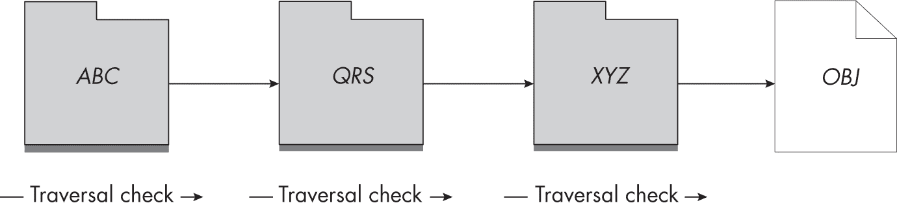
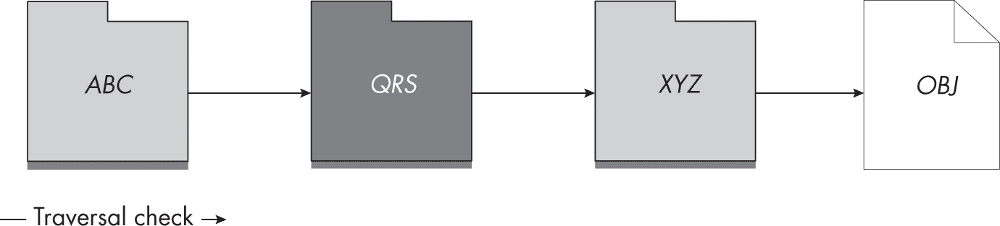

## 第十六章：8 其他访问检查使用案例


访问检查决定了调用者在打开内核资源时应具有的访问权限。然而，我们有时出于其他原因进行这些检查，因为它们可以作为额外的安全检查。本章详细介绍了将访问检查作为二级安全机制的一些示例。

我们将从遍历检查开始，遍历检查决定了调用者是否有权访问一组资源。接下来，我们将讨论在句柄被复制时访问检查的使用。我们还将考虑访问检查如何限制沙箱应用程序访问内核信息，如进程列表。最后，我将介绍一些额外的 PowerShell 命令，它们可以自动化资源的访问检查。

### 遍历检查

当访问一组层次化的资源时，例如一个对象目录树，用户必须遍历该层次结构，直到他们到达目标资源。对于层次结构中的每个目录或容器，系统都会执行一个访问检查，以确定调用者是否可以继续访问下一个容器。这个检查被称为*遍历检查*，每当代码在 I/O 管理器或对象管理器中查找路径时，都会执行此检查。例如，图 8-1 显示了使用路径*ABC\QRS\XYZ\OBJ*访问 OMNS 对象所需的遍历检查。



图 8-1：访问 OBJ 所需的遍历检查

如您所见，在我们能够访问*OBJ*之前，必须执行三个访问检查。每个访问检查从容器中提取安全描述符，然后检查特定类型的访问权限，看看是否允许遍历。OMNS 和文件目录都可以授予或拒绝 Traverse 访问权限。例如，如果*QRS*拒绝调用者的 Traverse 访问权限，则遍历检查将失败，如图 8-2 所示。



图 8-2：遍历检查在 QRS 处被阻止

即使调用者能够通过*XYZ*和*OBJ*的访问检查，因为*QRS*现在通过遍历检查拒绝了访问，因此他们无法再使用*ABC\QRS\XYZ\OBJ*路径访问*OBJ*。

遍历检查会阻止用户访问其资源，如果任何父容器拒绝了Traverse访问权限。这是意料之外的行为——为什么用户不能访问自己的资源呢？它还带来了性能问题。如果用户必须对每个父容器都有访问权限才能访问文件，那么内核就必须花费时间和精力对每个容器执行访问检查，而安全上真正关心的只是用户是否有权访问他们想要打开的资源。

#### SeChangeNotifyPrivilege 权限

为了使遍历检查行为更符合预期并减少性能影响，SRM 定义了SeChangeNotifyPrivilege权限，几乎每个Token对象默认都会启用。当此权限启用时，系统会绕过整个遍历检查，并允许用户访问父容器无法访问的资源。在清单 8-1 中，我们使用 OMNS 目录对象验证该权限的行为。

```
PS> **$path = "\BaseNamedObjects\ABC\QRS\XYZ\OBJ"**
❶ PS> **$os = New-NtMutant $path -CreateDirectories**
❷ PS> **Enable-NtTokenPrivilege SeChangeNotifyPrivilege**
PS> **Test-NtObject $path**
True

PS> **$sd = New-NtSecurityDescriptor -EmptyDacl**
❸ PS> **Set-NtSecurityDescriptor "\BaseNamedObjects\ABC\QRS" $sd Dacl**
PS> **Test-NtObject $path**
❹ True

❺ PS> **Disable-NtTokenPrivilege SeChangeNotifyPrivilege**
PS> **Test-NtObject $path**
False

❻ PS> **Test-NtObject "OBJ" -Root $os[1]**
True 
```

清单 8-1：测试 SeChangeNotifyPrivilege 以绕过遍历检查

我们首先创建一个Mutant对象及其所有父目录，通过使用CreateDirectories属性自动化目录创建 ❶。我们确保权限已启用 ❷，然后使用Test-NtObject命令检查是否可以打开Mutant对象。在输出中，我们可以看到能够打开Mutant对象。

然后，我们为*QRS*目录设置了一个空的 DACL ❸。这应该会阻止对该目录对象的所有访问，包括Traverse访问。但是当我们再次检查访问权限时，我们发现仍然可以访问Mutant对象，因为我们启用了SeChangeNotifyPrivilege权限 ❹。

我们现在禁用该特权，并尝试再次打开Mutant对象❺。这次，目录遍历失败。如果没有SeChangeNotifyPrivilege特权或无法访问*QRS*目录，我们将无法再打开Mutant对象。然而，我们的最终检查表明，如果我们可以访问*QRS*之后的父目录，例如*XYZ*，我们仍然可以通过相对打开，使用目录作为Root参数❻来访问Mutant对象。

#### 有限检查

内核包含一个额外的性能提升，用于遍历检查。如果SeChangeNotifyPrivilege特权被禁用，内核将调用SeFastTraverseCheck函数，该函数执行更有限的检查，而不是完整的访问检查。为完整性起见，我已在 PowerShell 中重新实现了SeFastTraverseCheck函数，以便我们可以更详细地探索其行为。Listing 8-2 展示了其实现。

```
function Get-FastTraverseCheck {
    Param(
      ❶ $TokenFlags,
        $SecurityDescriptor,
        $AccessMask
    )

  ❷ if ($SecurityDescriptor.DaclNull) {
        return $true
    }
  ❸ if (($TokenFlags -band "IsFiltered, IsRestricted") -ne 0) {
        return $false
    }
    $sid = Get-Ntsid -KnownSid World
    foreach($ace in $SecurityDescriptor.Dacl) {
      ❹ if ($ace.IsInheritedOnly -or !$ace.IsAccessGranted($AccessMask)) {
            continue
        }
      ❺ if ($ace.IsDeniedAce) {
            return $false
        }
      ❻ if ($ace.IsAllowedAce -and $ace.Sid -eq $sid) {
            return $true
        }
    }
  ❼ return $false
} 
```

Listing 8-2: SeFastTraverseCheck 的 PowerShell 实现

首先，我们定义函数所需的三个参数：令牌的标志、目录对象的安全描述符和需要检查的Traverse访问权限❶。我们指定访问权限，因为对象管理器和 I/O 管理器使用该函数处理Directory和File对象，并且Traverse访问权限在这两种对象类型之间有所不同；将访问权限作为参数指定，可以使检查函数同时处理这两种情况。

接下来，我们检查安全描述符的 DACL 是否为 NULL，如果是，则授予访问权限❷。然后，我们检查两个令牌标志❸。如果标志表明令牌被过滤或限制，则快速检查失败。内核从调用者的Token对象复制这些标志。我们可以通过用户模式中的Token对象的Flags属性获取这些标志，如 Listing 8-3 所示。

```
PS> **$token = Get-NtToken -Pseudo -Primary**
PS> **$token.Flags**
VirtualizeAllowed, IsFiltered, NotLow

PS> **$token.ElevationType**
Limited 
```

Listing 8-3: 查询令牌标志

注意，标志包括 IsFiltered。如果你不是在受限的令牌沙盒中运行，为什么会设置这个标志呢？查询令牌的提升类型显示它是 Limited，这意味着它是 UAC 管理员的默认令牌。为了将完整的管理员令牌转换为默认令牌，LSASS 使用 NtFilterToken 系统，它会设置 IsFiltered 标志，但不会设置 IsRestricted，因为它只是在移除组，而不是添加受限 SID。这意味着，虽然以默认用户身份运行代码的 UAC 管理员永远无法通过快速遍历检查，但普通用户是可以通过的。这个行为没有任何安全隐患，但意味着如果禁用了 SeChangeNotifyPrivilege，资源查找性能将受到影响。

清单 8-3 中的最终检查包括枚举 DACL 的 ACE。如果 ACE 仅继承或不包含所需的 Traverse 访问掩码，它将被跳过 ❹。如果它是 Denied ACE，快速遍历检查将失败 ❺，并且该 ACE 的 SID 完全不被检查。最后，如果 ACE 是 Allowed ACE 且 SID 等于 *Everyone* 组的 SID，则快速检查成功 ❻。如果没有更多的 ACE，检查将失败 ❼。

请注意，这个快速检查并不考虑调用者的令牌是否启用了 *Everyone* 组。这是因为通常唯一移除 *Everyone* 组的方法是过滤令牌。这个规则的一个大例外是匿名令牌，它没有任何组，但也没有以任何方式被过滤。

现在让我们来看看访问检查的另一个用途：在分配复制句柄时考虑授予的访问权限。

### 处理句柄重复访问检查

系统在创建或打开返回句柄的内核资源时总是执行访问检查。但是，如果该句柄被复制呢？在最简单的情况下，当新句柄的授予访问掩码与原始句柄相同，系统将不会执行任何检查。也可以删除授予访问掩码的某些部分，执行此操作也不会触发额外的访问检查。然而，如果你想为复制的句柄添加额外的访问权限，内核将从对象中查询安全描述符，并执行新的访问检查，以确定是否允许访问。

当你复制一个句柄时，必须同时指定源进程句柄和目标进程句柄，访问检查会在目标进程的上下文中进行。这意味着访问检查会考虑目标进程的主令牌，而不是源进程的主令牌，如果一个具有特权的进程试图将句柄复制到具有额外访问权限的低特权进程，这可能会成为一个问题。此类操作会因访问被拒绝而失败。

列表 8-4 演示了此句柄复制访问检查行为。

```
PS> **$sd = New-NtSecurityDescriptor -EmptyDacl**
❶ PS> **$m = New-NtMutant -Access ModifyState, ReadControl -SecurityDescriptor $sd**
❷ PS> **Use-NtObject($m2 = Copy-NtObject -Object $m) {**
    **$m2.GrantedAccess**
**}**
ModifyState, ReadControl

PS> **$mask = Get-NtAccessMask -MutantAccess ModifyState**
❸ PS> **Use-NtObject($m2 = Copy-NtObject -Object $m -DesiredAccessMask $mask) {**
    **$m2.GrantedAccess**
**}**
ModifyState

❹ PS> **Use-NtObject($m2 = Copy-NtObject -Object $m -DesiredAccess GenericAll) {**
    **$m2.GrantedAccess**
**}**
Copy-NtObject : (0xC0000022) - {Access Denied}
A process has requested access to an object, ... 
```

列表 8-4：测试句柄复制访问检查行为

我们首先创建一个新的Mutant对象，并且设置一个空的 DACL，且仅请求对句柄 ❶ 的ModifyState和ReadControl访问权限。这将阻止所有用户访问该对象，只有所有者可以获得ReadControl和WriteDac权限，这是通过上一章中描述的所有者检查来实现的。我们通过请求相同的访问权限来测试句柄复制，新的句柄返回 ❷。

接下来，我们仅请求ModifyState访问权限 ❸。由于Mutant的 DACL 为空，因此在访问检查时不会授予此访问权限，而由于我们在新句柄上获得了ModifyState权限，我们知道没有进行访问检查。最后，我们尝试通过请求GenericAll访问权限来增加我们的访问权限 ❹。现在必须进行访问检查，因为我们请求的权限大于句柄当前的权限。此检查将导致访问被拒绝错误。

如果我们在创建Mutant时没有设置安全描述符，那么该对象将没有关联的安全性，最后的检查将会成功，并授予完全访问权限。如第二章所述，当将未命名的句柄复制到低特权进程时需要小心，如果你正在降低访问权限；目标进程可能能够将句柄重新复制为一个具有更多权限的句柄。在列表 8-5 中，我们测试了NtDuplicateObject NoRightsUpgrade标志，看看它如何影响句柄复制访问检查。

```
PS> **$m = New-NtMutant -Access ModifyState**
PS> **Use-NtObject($m2 = Copy-NtObject -Object $m -DesiredAccess GenericAll) {**
    **$m2.GrantedAccess**
**}**
ModifyState, Delete, ReadControl, WriteDac, WriteOwner, Synchronize

PS> **Use-NtObject($m2 = Copy-NtObject -Object $m -NoRightsUpgrade) {**
    **Use-NtObject($m3 = Copy-NtObject -Object $m2 -DesiredAccess GenericAll) {}**
**}**
Copy-NtObject : (0xC0000022) - {Access Denied}
A process has requested access to an object, ... 
```

列表 8-5：测试 NtDuplicateObject NoRightsUpgrade 标志

我们首先创建一个无名的Mutant对象，它将没有关联的安全描述符。我们仅请求具有ModifyState访问权限的初始句柄。然而，我们尝试用GenericAll访问权限复制一个新句柄，结果成功了，这使我们获得了完全的访问权限。

现在我们测试NoRightsUpgrade标志。因为我们没有指定任何访问掩码，句柄将会使用ModifyState访问权限被复制。使用新句柄后，我们再进行一次复制，这次请求GenericAll访问权限。我们可以观察到句柄复制失败。这不是由于访问检查，而是因为内核中设置了一个标志，指示任何对更多访问的请求应该立即失败。这防止了该句柄被用来获得额外的访问权限。

错误地处理重复的句柄可能会导致漏洞；例如，CVE-2019-0943，这是我在一个负责缓存 Windows 上字体文件详细信息的特权服务中发现的一个问题。该服务将一个Section对象句柄复制到了一个具有只读访问权限的沙箱进程中。然而，沙箱进程可以将该句柄转换回可写的节句柄，并且该节可以被映射到内存中作为可写。这使得沙箱进程能够修改特权服务的状态并突破沙箱。Windows 通过使用NoRightsUpgrade标志来修复这个漏洞。

在遍历检查和句柄复制过程中发生的访问检查通常是隐藏的，但两者都与单个资源的安全性有关。接下来，我们将讨论访问检查如何限制我们可以提取的信息以及可以执行的操作，这些限制是基于调用者的令牌，而不管这些资源的单独访问设置。

### 沙箱令牌检查

从 Windows 8 开始，微软尝试通过防止沙箱令牌限制逃逸，来使得攻击系统变得更加困难。这对于处理来自互联网的不可信内容的软件尤为重要，比如网页浏览器和文档阅读器。

内核实现了两个使用访问检查来确定调用者是否在沙箱中的 API：ExIsRestrictedCaller（引入于 Windows 8）和 RtlIsSandboxToken（引入于 Windows 10）。这两个 API 产生等效的结果；它们之间的区别在于，ExIsRestrictedCaller 检查的是调用者的令牌，而 RtlIsSandboxToken 检查的是指定的 Token 对象，这个对象不一定是调用者的。

在内部，这些 API 会对令牌执行访问检查，并且仅在令牌不在沙箱中时才授予访问权限。列表 8-6 展示了在 PowerShell 中重新实现此访问检查的方法。

```
PS> **$type = New-NtType -Name "Sandbox" -GenericRead 0x20000** 
**-GenericAll 0x1F0001**
PS> **$sd = New-NtSecurityDescriptor -NullDacl -Owner "SY" -Group "SY"** 
**-Type $type**
PS> **Set-NtSecurityDescriptorIntegrityLevel $sd Medium -Policy NoReadUp**
PS> **Get-NtGrantedAccess -SecurityDescriptor $sd -Access 0x20000 -PassResult**
Status               Granted Access Privileges
------               -------------- ----------
STATUS_SUCCESS       GenericRead    NONE

PS> **Use-NtObject($token = Get-NtToken -Duplicate -IntegrityLevel Low) {**
    **Get-NtGrantedAccess -SecurityDescriptor $sd -Access 0x20000**
**-Token $token -PassResult**
**}**
Status               Granted Access Privileges
------               -------------- ----------
STATUS_ACCESS_DENIED None           NONE 
```

列表 8-6：沙箱令牌的访问检查

首先，我们需要使用 New-NtType 命令定义一个虚拟内核对象类型。这允许我们为访问检查指定通用映射。我们只指定 GenericRead 和 GenericAll 值，因为在这个上下文中，写入和执行权限并不重要。请注意，这种新类型是 PowerShell 本地的；内核对它一无所知。

然后我们定义了一个具有 NULL DACL（访问控制列表）的安全描述符，并将所有者和组 SID 设置为*SYSTEM*用户。使用 NULL DACL 会拒绝低权限令牌的访问，如前一章所述，但不会拒绝其他类型的沙箱令牌，如受限令牌。

为了处理其他令牌类型，我们添加了一个 Medium 强制标签 ACE，政策为 NoReadUp。因此，任何低于 Medium 完整性级别的令牌将被拒绝访问通用映射的 GenericRead 字段中指定的掩码。低权限令牌会忽略 Medium 强制标签，但我们已经使用 NULL DACL 覆盖了这些令牌。请注意，这个安全描述符并不认为完整性级别为 Medium 的受限令牌是沙箱令牌。目前尚不清楚这是故意的疏忽，还是实现中的一个 bug。

现在我们可以使用`Get-NtGrantedAccess`命令，在当前非沙箱令牌下执行访问检查。访问检查成功，授予我们`GenericRead`访问权限。如果我们使用一个具有`Low`完整性级别的令牌重复检查，系统会拒绝我们访问，表明该令牌处于沙箱中。

在后台，内核 API 调用`SeAccessCheck` API，如果调用者拥有标识级别的模拟令牌，API 将返回错误。因此，内核会认为某些模拟令牌处于沙箱中，即使列表 8-6 中的实现表明相反。

当任何一个 API 指示调用者处于沙箱中时，内核会改变其行为，执行以下操作：

+   仅列出可以直接访问的进程和线程。

+   阻止访问已加载的内核模块。

+   枚举打开的句柄及其内核对象地址。

+   创建任意的文件和对象管理符号链接。

+   创建一个具有更多访问权限的新受限令牌。

例如，在列表 8-7 中，我们在模拟低完整性级别令牌时查询句柄并被拒绝访问。

```
PS> **Invoke-NtToken -Current -IntegrityLevel Low {**
    **Get-NtHandle -ProcessId $pid**
**}**
Get-NtHandle : (0xC0000022) - {Access Denied}
A process has requested access to an object, ... 
```

列表 8-7：在模拟低完整性级别令牌时查询句柄信息

虽然只有内核模式代码可以访问`ExIsRestrictedCaller`，但你可以在用户模式下访问`RtlIsSandboxToken`，因为它也在*NTDLL*中导出。这使得你可以使用令牌句柄查询内核，以了解内核是否认为它是一个沙箱令牌。`RtlIsSandboxToken` API 将其结果暴露在`Token`对象的`IsSandbox`属性中，如列表 8-8 所示。

```
PS> **Use-NtObject($token = Get-NtToken) {**
    **$token.IsSandbox**
**}**
False

PS> **Use-NtObject($token = Get-NtToken -Duplicate -IntegrityLevel Low) {**
    **$token.IsSandbox**
**}**
True 
```

列表 8-8：检查令牌的沙箱状态

由`Get-NtProcess`返回的`Process`对象具有`IsSandboxToken`属性。内部上，该属性会打开进程的令牌并调用`IsSandbox`。我们可以通过使用列表 8-9 中的脚本轻松发现哪些进程处于沙箱中。

```
PS> **Use-NtObject($ps = Get-NtProcess -FilterScript {$_.IsSandboxToken}) {**
 **$ps | ForEach-Object {Write-Host "$($_.ProcessId) $($_.Name)"}**
**}**
7128 StartMenuExperienceHost.exe
7584 TextInputHost.exe
4928 SearchApp.exe
7732 ShellExperienceHost.exe
1072 Microsoft.Photos.exe
7992 YourPhone.exe 
```

列表 8-9：枚举当前用户的所有沙箱进程

这些沙盒检查是限制信息泄露和限制危险功能（如符号链接）的重要功能，符号链接能够增加攻击者逃脱沙盒并获取额外权限的机会。例如，阻止访问句柄表可以防止泄露内核对象地址，这些地址可能被用来利用内核内存损坏漏洞。

我们现在已经介绍了访问检查的三种用途，这些用途与打开资源无关。我们将通过描述一些简化对一系列个体资源进行访问检查的命令来结束本章。

### 自动化访问检查

上一章提供了一个示例，使用 Get-NtGrantedAccess 来确定一组内核对象的授予访问权限。如果你想检查不同类型的资源，比如文件，你需要修改脚本以使用文件命令。

因为跨多个资源检查授予访问权限是一个非常有用的操作，所以 PowerShell 模块提供了几个命令来自动化此过程。这些命令旨在帮助你快速评估 Windows 系统上可用资源的安全攻击面。它们的命令名都以 Get-Accessible 开头，你可以使用 Get-Command 来列出它们，如 列表 8-10 所示。

```
PS> **Get-Command Get-Accessible* | Format-Wide**
Get-AccessibleAlpcPort                       Get-AccessibleDevice
Get-AccessibleEventTrace                     Get-AccessibleFile
Get-AccessibleHandle                         Get-AccessibleKey
Get-AccessibleNamedPipe                      Get-AccessibleObject
Get-AccessibleProcess                        Get-AccessibleScheduledTask
Get-AccessibleService                        Get-AccessibleToken
Get-AccessibleWindowStation                  Get-AccessibleWnf 
```

列表 8-10：列出 Get-Accessible* 命令

我们将在后续章节中回到其中一些命令。这里，我们将重点介绍 Get-AccessibleObject 命令，使用该命令可以自动化对整个 OMNS 的访问检查。该命令允许你指定要检查的 OMNS 路径，然后枚举 OMNS 并报告最大授予访问权限或是否可以授予特定的访问掩码。

你还可以指定用于访问检查的令牌。命令可以从以下列表中获取令牌：

+   Token 对象

+   Process 对象

+   处理进程名称

+   处理进程 ID

+   处理命令行

如果运行命令时没有指定选项，它将使用当前的主令牌。然后，它会基于 OMNS 路径枚举所有对象，并对每个指定的令牌执行访问检查。如果访问检查成功，命令将生成一个包含结果详细信息的结构化对象。列表 8-11 显示了一个示例。

```
PS> **Get-AccessibleObject -Path "\"**
TokenId Access                     Name
------- ------                     ----
C5856B9 GenericExecute|GenericRead    \ 
```

列表 8-11：从 OMNS 根目录获取可访问对象

在这里，我们对 OMNS 的根目录执行命令，并在输出中接收三列数据：

TokenId  用于访问检查的令牌的唯一标识符

访问 授予的访问权限，映射到通用访问权限

名称 被检查资源的名称

我们可以使用 `TokenId` 来区分为命令指定的不同令牌的结果。

这个输出只是由 `Get-AccessibleObject` 命令生成的结果的一个子集。你可以使用像 `Format-List` 这样的命令提取其余的信息。你还可以使用 `Format-NtSecurityDescriptor` PowerShell 命令显示用于执行访问检查的安全描述符副本，如 Listing 8-12 所示。

```
PS> **Get-AccessibleObject -Path \ | Format-NtSecurityDescriptor -Summary**
<Owner> : BUILTIN\Administrators
<Group> : NT AUTHORITY\SYSTEM
<DACL>
Everyone: (Allowed)(None)(Query|Traverse|ReadControl)
NT AUTHORITY\SYSTEM: (Allowed)(None)(Full Access)
BUILTIN\Administrators: (Allowed)(None)(Full Access)
NT AUTHORITY\RESTRICTED: (Allowed)(None)(Query|Traverse|ReadControl) 
```

Listing 8-12: 显示用于访问检查的安全描述符

由于我们在这里对一个目录执行了命令，你可能会想知道它是否也会列出目录中的对象。默认情况下，不会；该命令将路径作为对象打开并进行访问检查。如果你想递归检查目录中的所有对象，你需要指定 `Recurse` 参数。`Get-AccessibleObject` 命令还接受一个 `Depth` 参数，你可以使用它来指定最大递归深度。如果你以非管理员用户身份运行递归检查，你可能会看到很多警告，如 Listing 8-13 所示。

```
PS> **Get-AccessibleObject -Path "\" -Recurse**
WARNING: Couldn't access \PendingRenameMutex - Status: STATUS_ACCESS_DENIED
WARNING: Couldn't access \ObjectTypes - Status: STATUS_ACCESS_DENIED
`--snip--` 
```

Listing 8-13: 递归枚举对象时的警告

你可以通过将 `WarningAction` 参数设置为 `Ignore` 来关闭警告，但请记住，它们是想告诉你一些事情。为了让命令工作，它需要打开每个对象并查询其安全描述符。从用户模式运行时，这需要在打开时通过访问检查；如果你没有权限以 `ReadControl` 访问对象，则命令无法执行访问检查。为了获得更好的结果，你可以以管理员身份运行该命令，或者为了最好的结果，通过使用 `Start-Win32ChildProcess` 命令以 *SYSTEM* 用户身份启动一个 *SYSTEM* PowerShell shell。

默认情况下，命令将使用调用者的令牌执行访问检查。但如果你以管理员身份运行命令，你可能不希望这样做，因为几乎所有资源都会允许管理员完全访问。相反，考虑指定任意令牌来检查资源。例如，当作为 UAC 管理员运行时，以下命令使用管理员令牌递归地打开资源，但使用 Explorer 进程中的非管理员令牌执行访问检查：

```
PS> **Get-AccessibleObject -Path \ -ProcessName explorer.exe -Recurse** 
```

通常，我们希望筛选检查的对象列表。你可以对所有对象执行访问检查，然后在之后进行筛选，但这会要求你做很多工作，而这些工作最终可能都被丢弃。为了节省时间，Get-AccessibleObject命令支持多个筛选器参数：

类型筛选器  用于检查的 NT 类型名称列表

筛选器  用于限制打开哪些对象的名称过滤器；可以包含通配符

包含  用于确定哪些结果应包含在输出中的名称过滤器

排除  用于确定哪些结果应从输出中排除的名称过滤器

访问  用于限制输出为仅包含具有特定授予访问权限的对象的访问掩码

例如，以下命令将找到所有可以使用<sup class="SANS_TheSansMonoCd_W5Regular_11">GenericAll</sup>访问权限打开的<sup class="SANS_TheSansMonoCd_W5Regular_11">Mutant</sup>对象：

```
PS> **Get-AccessibleObject -Path \ -TypeFilter Mutant -Access GenericAll -Recurse** 
```

默认情况下，Access参数要求在输出结果之前授予所有访问权限。你可以通过指定AllowPartialAccess来修改这一点，这样将输出与指定访问部分匹配的任何结果。如果你希望查看所有结果，而不管授予的访问权限，指定AllowEmptyAccess。

### 示例演示

让我们通过一些使用你在本章中学到的命令的示例来总结一下。

#### 简化对象的访问检查

在上一章中，我们使用Get-NtGrantedAccess命令自动对内核对象进行访问检查，并确定它们的最大授予访问权限。为了实现这一点，我们首先需要查询对象的安全描述符。然后，我们将此值与要检查的内核对象类型一起传递给命令。

如果你拥有一个对象的句柄，可以通过使用Object参数简化对Get-NtGrantedAccess命令的调用，具体如列表 8-14 所示。

```
PS> **$key = Get-NtKey HKLM\Software -Win32Path -Access ReadControl**
PS> **Get-NtGrantedAccess -Object $key**
QueryValue, EnumerateSubKeys, Notify, ReadControl 
```

列表 8-14：对对象执行访问检查

使用Object参数消除了手动提取对象安全描述符的需要，并会自动为内核对象类型选择正确的通用映射结构。这降低了你在执行对象访问检查时犯错的风险。

#### 查找可写的 Section 对象

系统使用Section对象在进程之间共享内存。如果一个特权进程设置了弱安全描述符，可能会导致权限较低的进程打开并修改该部分的内容。如果该部分包含可以诱使特权进程执行特权操作的可信参数，这可能会引发安全问题。

我在 Internet Explorer 的沙箱配置中发现了这个类的漏洞，CVE-2014-6349。该配置错误地保护了一个共享的Section对象，允许沙箱内的 Internet Explorer 进程打开它并完全禁用沙箱。我通过对所有命名的Section对象执行对MapWrite访问的访问检查，发现了这个问题。一旦我确定了所有具有此访问权限的部分，我会手动确定它们是否可以从沙箱中被利用。在列表 8-15 中，我们使用Get-AccessibleObject命令自动发现可写的部分。

```
❶ PS> **$access = Get-NtAccessMask -SectionAccess MapWrite -AsGenericAccess**
❷ PS> **$objs = Use-NtObject($token = Get-NtToken -Duplicate** 
**-IntegrityLevel Low) {**
  ❸ **Get-AccessibleObject -Win32Path "\" -Recurse -Token $token**
**-TypeFilter Section -Access $access**
**}**
PS> **$objs | ForEach-Object {**
  ❹ **Use-NtObject($sect = Get-NtSection -Path $_.Name) {**
      **Use-NtObject($map = Add-NtSection $sect -Protection ReadWrite** 
**-ViewSize 4096) {**
         **Write-Host "$($sect.FullPath)"**
         **Out-HexDump -ShowHeader -ShowAscii -HideRepeating -Buffer $map |** 
**Out-Host**
      **}**
    **}**
**}**
\Sessions\1\BaseNamedObjects\windows_ie_global_counters
00 01 02 03 04 05 06 07 08 09 0A 0B 0C 0D 0E 0F  - 0123456789ABCDEF
-------------------------------------------------------------------
00 00 00 00 00 00 00 00 00 00 00 00 00 00 00 00  - ................
-> REPEATED 1 LINES
00 00 00 00 00 00 00 00 00 00 00 00 1C 00 00 00  - ................
00 00 00 00 00 00 00 00 00 00 00 00 00 00 00 00  - ................
`--snip--` 
```

列表 8-15：枚举低完整性级别令牌可写的 Section 对象

我们首先计算MapWrite访问的访问掩码，并将其转换为通用访问枚举 ❶。Get-AccessibleObject命令只接受通用访问，因为它无法预先知道你可能要检查哪些对象。然后我们复制当前用户的令牌，并将其完整性级别设置为Low，从而产生一个简单的沙箱 ❷。

我们将令牌和访问掩码传递给Get-AccessibleObject，通过指定单一的路径分隔符给Win32Path参数❸，在用户的*BaseNamedObjects*目录中执行递归检查。命令返回的结果应仅包含可以打开以进行MapWrite访问的部分。

最后，我们列出了已发现的各个部分，显示它们的名称和任何已发现的可写Section对象的初始内容❹。我们打开每个命名的部分，将最多 4,096 字节映射到内存中，然后将内容输出为十六进制转储。我们将该部分映射为可写，因为可能Section对象的安全描述符授予了MapWrite访问权限，但该部分是以只读方式创建的。在这种情况下，映射ReadWrite将会因错误而失败。

你可以直接使用这个脚本来查找值得注意的可写部分。你不需要使用沙箱令牌；查看由特权进程拥有并且对普通用户可用的部分也是很有趣的。你还可以使用它作为模板，对任何其他内核对象类型执行相同的检查。

### 总结

在本章中，我们查看了访问检查在打开资源之外的应用示例。我们首先考虑了遍历检查，用于确定用户是否能够遍历容器的层次列表，例如对象目录。然后我们讨论了在进程之间复制句柄时，访问检查如何被使用，包括在对象没有名称或安全描述符时，这可能会导致安全问题。

接下来，我们探讨了如何使用访问检查来确定调用者的令牌是否被沙箱化。内核通过这样做来限制对信息或某些操作的访问，从而使利用特定类别的安全漏洞变得更加困难。最后，我们了解了如何通过Get-Accessible命令自动执行对各种资源类型的访问检查。我们查看了所有命令的基本参数，以及如何使用它们列举可访问的命名内核对象。

这就是我们对访问检查过程的全部分析。在下一章中，我们将讨论 SRM 的最后一个责任：安全审计。
