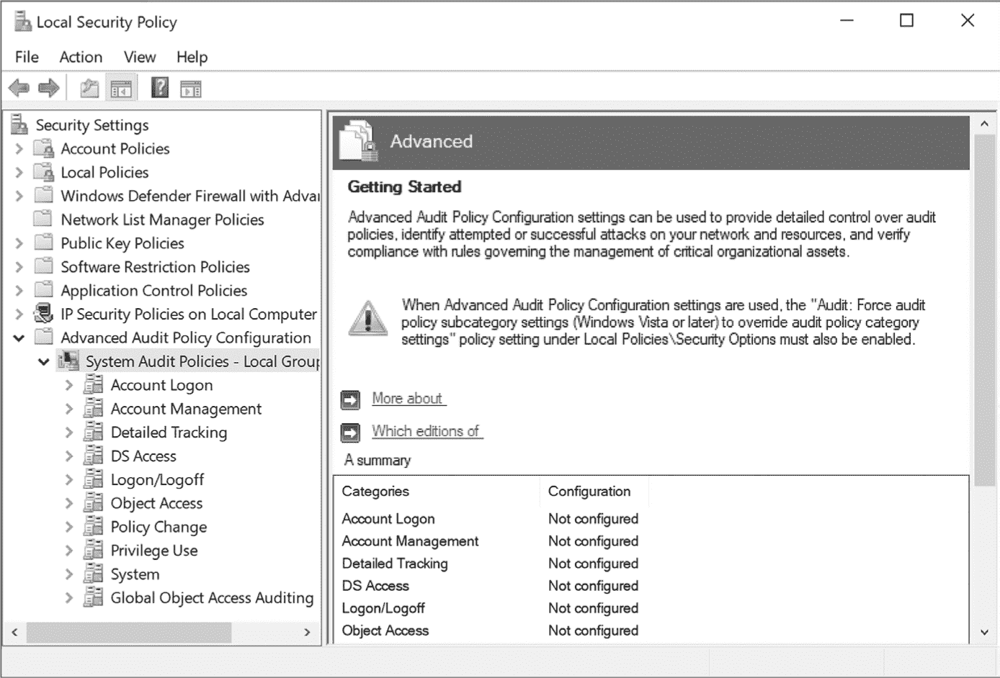

<hgroup>

## <samp class="SANS_Futura_Std_Bold_Condensed_B_11">9</samp> <samp class="SANS_Dogma_OT_Bold_B_11">安全审计</samp>

</hgroup>


访问检查过程与审计过程是交织在一起的。管理员可以配置系统的审计机制以生成访问资源的日志。每个日志事件将包括有关打开资源的用户和应用程序的详细信息，以及访问是否成功。此信息可以帮助我们识别错误的安全设置或检测恶意访问敏感资源。

在这一简短的章节中，我们将首先讨论内核生成资源访问日志后，它会存储在哪里。接着，我们将描述系统管理员如何配置审计机制。最后，我们将详细介绍如何通过 SACL 配置单个资源生成审计日志事件。

### <samp class="SANS_Futura_Std_Bold_B_11">安全事件日志</samp>

Windows 每当访问检查成功或失败时都会生成日志事件。内核将这些日志事件写入*安全事件日志*，只有管理员可以访问该日志。

在对内核资源执行访问检查时，Windows 会生成以下类型的审计事件。安全事件日志通过括号中的事件 ID 来表示这些事件：

+   对象句柄已打开 (<samp class="SANS_TheSansMonoCd_W5Regular_11">4656</samp>)

+   对象句柄已关闭 (<samp class="SANS_TheSansMonoCd_W5Regular_11">4658</samp>)

+   对象已删除 (<samp class="SANS_TheSansMonoCd_W5Regular_11">4660</samp>)

+   对象句柄已复制 (<samp class="SANS_TheSansMonoCd_W5Regular_11">4690</samp>)

+   SACL 已更改 (<samp class="SANS_TheSansMonoCd_W5Regular_11">4717</samp>)

当我们通过内核系统调用访问资源时，例如 <samp class="SANS_TheSansMonoCd_W5Regular_11">NtCreateMutant</samp>，审计机制会自动生成这些事件。但是，对于与对象相关的审计事件，我们必须首先配置系统的两个方面：我们必须设置系统策略以生成审计事件，并且必须在资源的 SACL 中启用审计 ACE。让我们逐一讨论这些配置要求。

#### <samp class="SANS_Futura_Std_Bold_Condensed_Oblique_BI_11">配置系统审计策略</samp>

大多数 Windows 用户无需捕获内核资源的审计信息，因此默认情况下审计策略是禁用的。企业环境通常通过*域安全策略*配置审计策略，该策略由企业网络分发到各个设备。

不在企业网络中的用户可以手动启用审计策略。一种方法是编辑 *本地安全策略*，该策略与域安全策略相同，但仅适用于当前系统。审计策略有两种类型：Windows 7 之前使用的传统策略和高级审计策略。建议使用高级审计策略，因为它提供了更细粒度的配置；我们将不再讨论传统策略。

如果你通过在 PowerShell 中运行 <samp class="SANS_TheSansMonoCd_W5Regular_11">secpol.msc</samp> 命令打开本地安全策略编辑器，你可以查看高级审计策略的当前配置，如 图 9-1 所示。



<samp class="SANS_Futura_Std_Book_Oblique_I_11">图 9-1：显示高级审计策略的安全策略编辑器</samp>

如你所见，审计策略中的类别目前未配置。为了探索审计事件是如何生成的，我们将使用 PowerShell 临时启用所需的审计策略并运行一些示例代码。你使用 PowerShell 所做的任何更改不会反映在本地安全策略中，该策略将在下次同步时恢复（例如，在重启时或在企业网络上更新组策略时）。你可以通过在 PowerShell 或命令提示符中以管理员身份运行命令 <samp class="SANS_TheSansMonoCd_W5Regular_11">gpupdate.exe /force</samp> 来强制设置同步。

高级审计策略有两个级别：顶级类别和多个子类别。你可以使用 <samp class="SANS_TheSansMonoCd_W5Regular_11">Get-NtAuditPolicy</samp> 查询顶级类别，如 清单 9-1 所示。

```
PS> **Get-NtAuditPolicy**
Name               SubCategory Count
----               -----------------
System             5
Logon/Logoff       11
Object Access      14
Privilege Use      3
Detailed Tracking  6
Policy Change      6
Account Management 6
DS Access          4
Account Logon      4 
```

清单 9-1：顶级审计策略类别

在输出中，你可以看到每个类别的名称及其子类别的数量。每个类别还有一个关联的 GUID，但默认情况下该值是隐藏的。要查看它，请从命令的输出中选择 <samp class="SANS_TheSansMonoCd_W5Regular_11">Id</samp> 属性，如 清单 9-2 所示。

```
PS> **Get-NtAuditPolicy | Select-Object Name, Id**
Name               Id
----               --
System             69979848-797a-11d9-bed3-505054503030
Logon/Logoff       69979849-797a-11d9-bed3-505054503030
Object Access      6997984a-797a-11d9-bed3-505054503030
`--snip--` 
```

清单 9-2：显示类别 GUIDs

你可以使用 <samp class="SANS_TheSansMonoCd_W5Regular_11">ExpandCategory</samp> 参数显示子类别。在 清单 9-3 中，我们按名称指定了 <samp class="SANS_TheSansMonoCd_W5Regular_11">System</samp> 类别，然后展开输出以显示其子类别。

```
PS> **Get-NtAuditPolicy -Category System -ExpandCategory**
Name                      Policy
----                      ------
Security State Change     Unchanged
Security System Extension Unchanged
System Integrity          Unchanged
IPsec Driver              Unchanged
Other System Events       Unchanged 
```

清单 9-3：显示审计策略的子类别

你还可以通过使用 <samp class="SANS_TheSansMonoCd_W5Regular_11">CategoryGuid</samp> 参数指定其 GUID 来选择类别。审计策略基于这些子类别。每个子类别策略可以具有以下一个或多个值：

<samp class="SANS_TheSansMonoCd_W7Bold_B_11">未更改</samp><samp class="SANS_TheSansMonoCd_W7Bold_B_11">  </samp>策略未配置，且不应更改。

<samp class="SANS_TheSansMonoCd_W7Bold_B_11">成功  </samp>策略应在可审计资源成功打开时生成审计事件。

<samp class="SANS_TheSansMonoCd_W7Bold_B_11">失败  </samp>策略应在无法打开可审计资源时生成审计事件。

<samp class="SANS_TheSansMonoCd_W7Bold_B_11">无  </samp>策略应从不生成审计事件。

在清单 9-3 中，所有子类别显示值为 <samp class="SANS_TheSansMonoCd_W5Regular_11">Unchanged</samp>，这意味着没有配置策略。我们可以通过以管理员身份运行清单 9-4 中显示的命令来启用内核对象审计。

```
PS> **Enable-NtTokenPrivilege SeSecurityPrivilege**
PS> **Set-NtAuditPolicy -Category ObjectAccess -Policy Success,** 
**Failure -PassThru**
Name                           Policy
----                           ------
File System                    Success, Failure
Registry                       Success, Failure
Kernel Object                  Success, Failure
SAM                            Success, Failure
Certification Services         Success, Failure
Application Generated          Success, Failure
Handle Manipulation            Success, Failure
File Share                     Success, Failure
Filtering Platform Packet Drop Success, Failure
Filtering Platform Connection  Success, Failure
Other Object Access Events     Success, Failure
Detailed File Share            Success, Failure
Removable Storage              Success, Failure
Central Policy Staging         Success, Failure 
```

清单 9-4：设置策略并查看生成的 ObjectAccess 审计策略列表

在这里，我们为所有子类别启用了 <samp class="SANS_TheSansMonoCd_W5Regular_11">Success</samp> 和 <samp class="SANS_TheSansMonoCd_W5Regular_11">Failure</samp> 审计策略，这些子类别都在 <samp class="SANS_TheSansMonoCd_W5Regular_11">ObjectAccess</samp> 下。要进行此修改，我们需要 <samp class="SANS_TheSansMonoCd_W5Regular_11">SeSecurityPrivilege</samp> 权限。我们可以使用 <samp class="SANS_TheSansMonoCd_W5Regular_11">SubCategoryName</samp> 参数按名称设置单个子类别，而不是整个类别，或者使用 <samp class="SANS_TheSansMonoCd_W5Regular_11">SubCategoryGuid</samp> 参数指定 GUID。

我们通过指定 <samp class="SANS_TheSansMonoCd_W5Regular_11">PassThru</samp> 参数来确认审计策略已正确配置，该参数列出已修改的 <samp class="SANS_TheSansMonoCd_W5Regular_11">SubCategory</samp> 对象。输出显示了一些重要的审计策略，包括 <samp class="SANS_TheSansMonoCd_W5Regular_11">文件系统</samp>、<samp class="SANS_TheSansMonoCd_W5Regular_11">注册表</samp> 和 <samp class="SANS_TheSansMonoCd_W5Regular_11">内核对象</samp>，分别启用了对文件、注册表键和其他内核对象的审计。

您可以以管理员身份运行以下命令，以禁用我们在清单 9-4 中所做的更改：

```
PS> **Set-NtAuditPolicy -Category ObjectAccess -Policy None** 
```

除非出于某种原因需要启用审计策略，否则最好在实验结束后禁用它。

#### <samp class="SANS_Futura_Std_Bold_Condensed_Oblique_BI_11">配置每用户审计策略</samp>

除了配置系统范围的策略外，还可以基于每个用户配置审计策略。在系统未定义整体审计策略时，可以使用此功能为特定用户帐户添加审计。还可以使用它将特定用户帐户排除在审计之外。为了方便这种行为，针对每个用户策略的策略设置略有不同：

<samp class="SANS_TheSansMonoCd_W7Bold_B_11">Unchanged  </samp>该策略未配置。设置后，该策略不应被更改。

<samp class="SANS_TheSansMonoCd_W7Bold_B_11">SuccessInclude  </samp>该策略应在成功时生成审计事件，无论系统策略如何。

<samp class="SANS_TheSansMonoCd_W7Bold_B_11">SuccessExclude  </samp>该策略应从不在成功时生成审计事件，无论系统策略如何。

<samp class="SANS_TheSansMonoCd_W7Bold_B_11">FailureInclude  </samp>该策略应在失败时生成审计事件，无论系统策略如何。

<samp class="SANS_TheSansMonoCd_W7Bold_B_11">FailureExclude</samp><samp class="SANS_TheSansMonoCd_W7Bold_B_11">  </samp>该策略应从不在失败时生成审计事件，无论系统策略如何。

<samp class="SANS_TheSansMonoCd_W7Bold_B_11">None  </samp>该策略应从不生成审计事件。

要配置每个用户的策略，可以在使用 <samp class="SANS_TheSansMonoCd_W5Regular_11">Set-NtAuditPolicy</samp> 命令时，指定一个 SID 给 <samp class="SANS_TheSansMonoCd_W5Regular_11">User</samp> 参数。此 SID 必须代表一个用户帐户；它不能代表一个组，如 *Administrators*，或一个服务帐户，如 *SYSTEM*，否则在设置策略时将收到错误。

列表 9-5 配置当前用户的每个用户策略。你必须以管理员身份运行这些命令。

```
PS> **Enable-NtTokenPrivilege SeSecurityPrivilege**
PS> **$sid = Get-NtSid**
PS> **Set-NtAuditPolicy -Category ObjectAccess -User $sid -UserPolicy** 
**SuccessExclude**
PS> **Get-NtAuditPolicy -User $sid -Category ObjectAccess -ExpandCategory**
Name          User           Policy
----          ----           ------
File System   GRAPHITE\admin SuccessExclude
Registry      GRAPHITE\admin SuccessExclude
Kernel Object GRAPHITE\admin SuccessExclude
SAM           GRAPHITE\admin SuccessExclude
`--snip--` 
```

列表 9-5：配置每个用户的审计策略

在这里，我们将用户的 SID 指定给 <samp class="SANS_TheSansMonoCd_W5Regular_11">User</samp> 参数，然后指定 <samp class="SANS_TheSansMonoCd_W5Regular_11">SuccessExclude</samp> 用户策略。这将只排除此用户的成功审计事件。如果要删除某个用户的每个用户策略，可以指定 <samp class="SANS_TheSansMonoCd_W5Regular_11">None</samp> 用户策略：

```
PS> **Set-NtAuditPolicy -Category ObjectAccess -User $sid -UserPolicy None** 
```

你还可以使用 <samp class="SANS_TheSansMonoCd_W5Regular_11">AllUser</samp> 参数和 <samp class="SANS_TheSansMonoCd_W5Regular_11">Get-NtAuditPolicy</samp> 命令列出所有已配置策略的用户，如 列表 9-6 所示。

```
PS> **Get-NtAuditPolicy -AllUser**
Name          User           SubCategory Count
----          ----           -----------------
System        GRAPHITE\admin 5
Logon/Logoff  GRAPHITE\admin 11
Object Access GRAPHITE\admin 14
`--snip--` 
```

列表 9-6：查询所有用户的每个用户策略

你现在已经知道如何查询和设置系统和特定用户的策略。接下来，我们将看看如何授予用户查询和设置这些策略所需的访问权限。

### <samp class="SANS_Futura_Std_Bold_B_11">审计策略安全性</samp>

要查询或设置策略，调用者必须在其令牌上启用 <samp class="SANS_TheSansMonoCd_W5Regular_11">SeSecurityPrivilege</samp> 权限。如果该权限未启用，LSASS 将基于系统配置中的安全描述符执行访问检查。我们可以在安全描述符中配置以下访问权限，以授予用户查询或设置系统或单个用户策略的能力：

<samp class="SANS_TheSansMonoCd_W7Bold_B_11">SetSystemPolicy  </samp>启用设置系统审核策略

<samp class="SANS_TheSansMonoCd_W7Bold_B_11">QuerySystemPolicy  </samp>启用查询系统审核策略

<samp class="SANS_TheSansMonoCd_W7Bold_B_11">SetUserPolicy</samp><samp class="SANS_TheSansMonoCd_W7Bold_B_11">  </samp>启用设置每用户审核策略

<samp class="SANS_TheSansMonoCd_W7Bold_B_11">QueryUserPolicy  </samp>启用查询每用户审核策略

<samp class="SANS_TheSansMonoCd_W7Bold_B_11">EnumerateUsers  </samp>启用枚举所有每用户审核策略

<samp class="SANS_TheSansMonoCd_W7Bold_B_11">SetMiscPolicy  </samp>启用设置杂项审核策略

<samp class="SANS_TheSansMonoCd_W7Bold_B_11">QueryMiscPolicy  </samp>启用查询杂项审核策略

没有标准的审计 API 似乎使用 <samp class="SANS_TheSansMonoCd_W5Regular_11">SetMiscPolicy</samp> 和 <samp class="SANS_TheSansMonoCd_W5Regular_11">QueryMiscPolicy</samp> 访问权限，但因为它们在 Windows SDK 中已定义，因此我在此处列出它们以供完整性参考。

作为管理员，您可以通过启用 <samp class="SANS_TheSansMonoCd_W5Regular_11">SeSecurityPrivilege</samp> 并使用 <samp class="SANS_TheSansMonoCd_W5Regular_11">Get-NtAuditSecurity</samp> 命令来查询当前配置的安全描述符，如列表 9-7 所示。

```
PS> **Enable-NtTokenPrivilege SeSecurityPrivilege**
PS> **$sd =** **Get-NtAuditSecurity**
PS> **Format-NtSecurityDescriptor $sd -Summary -MapGeneric**
<DACL>
❶ BUILTIN\Administrators: (Allowed)(None)(GenericRead)
NT AUTHORITY\SYSTEM: (Allowed)(None)(GenericRead) 
```

列表 9-7：查询并显示审核安全描述符

我们将查询到的安全描述符传递给 <samp class="SANS_TheSansMonoCd_W5Regular_11">Format-NtSecurityDescriptor</samp> 来显示 DACL。请注意，只有*管理员*和*系统*才能访问该策略❶。此外，他们仅限于 <samp class="SANS_TheSansMonoCd_W5Regular_11">GenericRead</samp> 访问权限，这允许用户查询该策略，但不能修改它。因此，即使是管理员也需要启用 <samp class="SANS_TheSansMonoCd_W5Regular_11">SeSecurityPrivilege</samp> 来修改审核策略，因为该特权可以绕过任何访问检查。

> <samp class="SANS_Dogma_OT_Bold_B_15">注意</samp>
> 
> *一个未被授予读取访问权限的用户仍然可以查询高级审核类别和子类别，这些类别忽略安全描述符。然而，他们不会被授予查询已配置设置的权限。Get-NtAuditPolicy 将返回用户无法查询的审核设置的“未更改”值。*

如果您希望允许非管理员更改高级审核策略，您可以使用 <samp class="SANS_TheSansMonoCd_W5Regular_11">Set-NtAuditSecurity</samp> 命令更改安全描述符。以管理员身份运行列表 9-8 中的命令。

```
PS> **Enable-NtTokenPrivilege SeSecurityPrivilege**
PS> **$sd = Get-NtAuditSecurity**
PS> **Add-NtSecurityDescriptorAce $sd -Sid "LA" -Access GenericAll**
PS> **Set-NtAuditSecurity $sd** 
```

列表 9-8：修改审核安全描述符

我们首先查询现有的安全描述符以获取审计策略，并授予本地管理员所有访问权限。然后，我们使用<samp class="SANS_TheSansMonoCd_W5Regular_11">Set-NtAuditSecurity</samp>命令设置修改后的安全描述符。现在，本地管理员可以查询和修改审计策略，而无需启用<samp class="SANS_TheSansMonoCd_W5Regular_11">SeSecurityPrivilege</samp>。

通常不应重新配置审计策略的安全性，更不应授予所有用户写入访问权限。请注意，安全描述符不会影响谁可以查询或设置安全描述符本身；只有启用了 <samp class="SANS_TheSansMonoCd_W5Regular_11">SeSecurityPrivilege</samp> 的调用者才能做到这一点，无论安全描述符中的值如何。

#### <samp class="SANS_Futura_Std_Bold_Condensed_Oblique_BI_11">配置资源 SACL</samp>

仅仅启用审计策略还不足以开始生成审计事件。我们还需要配置对象的 SACL，以指定要使用的审计规则。为了在对象上设置 SACL，我们需要再次启用<samp class="SANS_TheSansMonoCd_W5Regular_11">SeSecurityPrivilege</samp>，这只能作为管理员来完成。清单 9-9 演示了创建带有 SACL 的<samp class="SANS_TheSansMonoCd_W5Regular_11">Mutant</samp>对象的过程。

```
PS> **$sd = New-NtSecurityDescriptor -Type Mutant**
PS> **Add-NtSecurityDescriptorAce $sd -Type Audit -Access GenericAll**
**-Flags SuccessfulAccess, FailedAccess -KnownSid World -MapGeneric**
PS> **Enable-NtTokenPrivilege SeSecurityPrivilege**
PS> **Clear-EventLog -LogName "Security"**
PS> **Use-NtObject($m = New-NtMutant "ABC" -Win32Path -SecurityDescriptor $sd) {**
    **Use-NtObject($m2 = Get-NtMutant "ABC" -Win32Path) {**
    **}**
**}** 
```

清单 9-9：创建一个带有 SACL 的突变体对象

我们首先创建一个空的安全描述符，然后向 SACL 中添加一个单独的<samp class="SANS_TheSansMonoCd_W5Regular_11">Audit</samp> ACE。我们还可以添加其他类型的 ACE，例如<samp class="SANS_TheSansMonoCd_W5Regular_11">AuditObject</samp>和<samp class="SANS_TheSansMonoCd_W5Regular_11">AuditCallback</samp>。

<samp class="SANS_TheSansMonoCd_W5Regular_11">Audit</samp> ACE 的处理过程与第七章中描述的可分配访问检查非常相似。SID 必须与调用令牌中的某个组匹配（包括任何 <samp class="SANS_TheSansMonoCd_W5Regular_11">DenyOnly</samp> SID），且访问掩码必须与授予的访问权限的一项或多项匹配。*Everyone* 组的 SID 是一个特殊情况；无论 SID 是否存在于令牌中，它都会始终匹配。

除了任何常见的继承 ACE 标志，如<samp class="SANS_TheSansMonoCd_W5Regular_11">InheritOnly</samp>外，<samp class="SANS_TheSansMonoCd_W5Regular_11">Audit</samp> ACE 必须指定 <samp class="SANS_TheSansMonoCd_W5Regular_11">SuccessfulAccess</samp> 和 <samp class="SANS_TheSansMonoCd_W5Regular_11">FailedAccess</samp> 标志中的一个或两个，这些标志为审计代码提供了生成审计条目的条件。

我们将创建一个包含 SACL 的安全描述符的 <samp class="SANS_TheSansMonoCd_W5Regular_11">Mutant</samp> 对象。在创建对象之前，我们需要启用 <samp class="SANS_TheSansMonoCd_W5Regular_11">SeSecurityPrivilege</samp>。如果不这样做，创建将失败。为了更方便地查看生成的审计事件，我们还清除了安全事件日志。接下来，我们创建对象，传递给它我们构建的 SACL，然后重新打开它以触发审计日志的生成。

现在我们可以使用 <samp class="SANS_TheSansMonoCd_W5Regular_11">Get-WinEvent</samp> 查询安全事件日志，传递事件 ID <samp class="SANS_TheSansMonoCd_W5Regular_11">4656</samp> 来查找生成的审计事件（清单 9-10）。

```
PS> **$filter = @{logname = 'Security'; id = @(4656)}**
PS> **Get-WinEvent -FilterHashtable $filter | Select-Object -ExpandProperty Message**
A handle to an object was requested.
Subject:
        Security ID:    S-1-5-21-2318445812-3516008893-216915059-1002
        Account Name:   user
        Account Domain: GRAPHITE
        Logon ID:       0x524D0

Object:
        Object Server:          Security
        Object Type:            Mutant
        Object Name:            \Sessions\2\BaseNamedObjects\ABC
        Handle ID:              0xfb4
        Resource Attributes:    -

Process Information:
        Process ID:     0xaac
        Process Name:   C:\Windows\System32\WindowsPowerShell\v1.0\powershell.exe

Access Request Information:
        Transaction ID:        {00000000-0000-0000-0000-000000000000}
        Accesses:               DELETE
                                READ_CONTROL
                                WRITE_DAC
                                WRITE_OWNER
                                SYNCHRONIZE
                                Query mutant state

        Access Reasons:                         -
        Access Mask:                            0x1F0001
        Privileges Used for Access Check:       -
        Restricted SID Count:                   0 
```

清单 9-10：查看 Mutant 对象的打开审计事件

我们首先设置一个安全事件日志过滤器，使用事件 ID <samp class="SANS_TheSansMonoCd_W5Regular_11">4656</samp>，该 ID 对应于句柄的打开。然后，我们使用 <samp class="SANS_TheSansMonoCd_W5Regular_11">Get-WinEvent</samp> 和该过滤器来选择事件的文本消息。

输出以该事件的文本描述开始，确认它是响应于句柄打开时生成的。接下来是 <samp class="SANS_TheSansMonoCd_W5Regular_11">Subject</samp>，其中包含用户的信息，包括他们的 SID 和用户名。为了查找用户名，内核会将审计事件发送给 LSASS 进程。

接下来是已打开对象的详细信息。这些信息包括对象服务器（<samp class="SANS_TheSansMonoCd_W5Regular_11">Security</samp>，表示 SRM）、对象类型（<samp class="SANS_TheSansMonoCd_W5Regular_11">Mutant</samp>）和对象的本地路径，以及句柄 ID（对象的句柄编号）。如果你查询从 <samp class="SANS_TheSansMonoCd_W5Regular_11">NtCreateMutant</samp> 系统调用返回的句柄值，它应该与此值匹配。然后我们获取一些基本的进程信息，最后是有关授予句柄访问权限的信息。

我们如何区分成功和失败事件？最好的方法是提取 <samp class="SANS_TheSansMonoCd_W5Regular_11">KeywordsDisplayNames</samp> 属性，它包含 <samp class="SANS_TheSansMonoCd_W5Regular_11">Audit Success</samp>（如果句柄已打开）或 <samp class="SANS_TheSansMonoCd_W5Regular_11">Audit Failure</samp>（如果句柄无法打开）。清单 9-11 显示了一个示例。

```
PS> **Get-WinEvent -FilterHashtable $filter | Select-Object KeywordsDisplayNames**
KeywordsDisplayNames
--------------------
{Audit Success}
{Audit Failure}
`--snip--` 
```

清单 9-11：提取 KeywordsDisplayNames 以查看成功或失败状态

当你关闭对象的句柄时，会生成另一个审计事件，事件 ID 为 <samp class="SANS_TheSansMonoCd_W5Regular_11">4658</samp>，如清单 9-12 所示。

```
PS> **$filter = @{logname = 'Security'; id = @(4658)}**
PS> **Get-WinEvent -FilterHashtable $filter | Select-Object -ExpandProperty Message**
The handle to an object was closed.
Subject :
        Security ID:    S-1-5-21-2318445812-3516008893-216915059-1002
        Account Name:   user
        Account Domain: GRAPHITE
        Logon ID:       0x524D0

Object:
        Object Server:  Security
        Handle ID:      0xfb4

Process Information:
        Process ID:     0xaac
        Process Name:   C:\Windows\System32\WindowsPowerShell\v1.0\powershell.exe 
```

清单 9-12：查看关闭 Mutant 对象句柄时生成的审计事件

你可能会注意到，关于关闭对象句柄提供的信息，比打开句柄时生成的信息要少一些。你可以通过使用句柄 ID 来手动关联打开和关闭句柄事件，这些 ID 应该是匹配的。

从用户模式手动生成对象审计事件是可能的，使用一些额外的系统调用。然而，为了做到这一点，你需要<samp class="SANS_TheSansMonoCd_W5Regular_11">SeAuditPrivilege</samp>权限，通常这个权限仅授予*SYSTEM*账户，而不是普通管理员。

你可以使用<samp class="SANS_TheSansMonoCd_W5Regular_11">NtAccessCheckAndAuditAlarm</samp>系统调用，在执行访问检查的同时生成审计事件，该调用具有与正常访问检查相同的所有对象 ACE 变体。你可以通过使用<samp class="SANS_TheSansMonoCd_W5Regular_11">Get-NtGrantedAccess</samp> PowerShell 命令，并带上<samp class="SANS_TheSansMonoCd_W5Regular_11">Audit</samp>参数来访问它。

你也可以通过使用<samp class="SANS_TheSansMonoCd_W5Regular_11">NtOpenObjectAuditAlarm</samp>和<samp class="SANS_TheSansMonoCd_W5Regular_11">NtCloseObjectAuditAlarm</samp>系统调用手动生成事件，PowerShell 通过<samp class="SANS_TheSansMonoCd_W5Regular_11">Write-NtAudit</samp>命令公开这些调用。以*SYSTEM*用户身份运行清单 9-13 中的命令，以手动生成审计日志事件。

```
❶ PS> **Enable-NtTokenPrivilege SeAuditPrivilege -WarningAction Stop**
PS> **$owner = Get-NtSid -KnownSid Null**
PS> **$sd = New-NtSecurityDescriptor -Type Mutant -Owner $owner -Group $owner**
PS> **Add-NtSecurityDescriptorAce $sd -KnownSid World -Access GenericAll** 
**-MapGeneric**
❷ PS> **Add-NtSecurityDescriptorAce $sd -Type Audit -Access GenericAll**
**-Flags SuccessfulAccess, FailedAccess -KnownSid World -MapGeneric**
❸ PS> **$handle = 0x1234**
❹ PS> **$r = Get-NtGrantedAccess $sd -Audit -SubsystemName "SuperSecurity"**
**-ObjectTypeName "Badger" -ObjectName "ABC" -ObjectCreation**
**-HandleId $handle -PassResult**
❺ PS> **Write-NtAudit -Close -SubsystemName "SuperSecurity" -HandleId $handle**
**-GenerateOnClose:$r.GenerateOnClose** 
```

清单 9-13：手动生成审计日志事件

我们首先启用<samp class="SANS_TheSansMonoCd_W5Regular_11">SeAuditPrivilege</samp>❶，否则脚本的其余部分将失败。这个权限必须在主令牌上启用；你不能模拟一个拥有此权限的令牌，这就是为什么你必须以*SYSTEM*用户身份运行 PowerShell 实例的原因。

在启用所需权限后，我们构建一个包含 SACL 的安全描述符，以审核成功和失败的访问尝试❷。我们生成一个虚假的句柄 ID❸；在正常的审计事件中，这个值将是内核句柄，但当我们从用户模式生成事件时，它可以是任何我们喜欢的值。然后我们可以运行访问检查，指定<samp class="SANS_TheSansMonoCd_W5Regular_11">Audit</samp>参数，从而启用其他审计参数。我们需要指定<samp class="SANS_TheSansMonoCd_W5Regular_11">SubsystemName</samp>、<samp class="SANS_TheSansMonoCd_W5Regular_11">ObjectTypeName</samp>和<samp class="SANS_TheSansMonoCd_W5Regular_11">ObjectName</samp>参数，这些可以完全是任意的。我们还需要指定句柄 ID❹。

在输出中，我们接收到一个访问检查结果，并且包含一个额外的属性：<samp class="SANS_TheSansMonoCd_W5Regular_11">GenerateOnClose</samp>，它指示我们是否需要写入一个关闭句柄事件。调用 <samp class="SANS_TheSansMonoCd_W5Regular_11">Write-NtAudit</samp> 命令并指定 <samp class="SANS_TheSansMonoCd_W5Regular_11">Close</samp> 参数将会调用 <samp class="SANS_TheSansMonoCd_W5Regular_11">NtCloseObjectAuditAlarm</samp> 系统调用以生成该事件。我们这样做时，会指定结果 ❺ 中的 <samp class="SANS_TheSansMonoCd_W5Regular_11">GenerateOnClose</samp> 值。如果 <samp class="SANS_TheSansMonoCd_W5Regular_11">GenerateOnClose</samp> 为 <samp class="SANS_TheSansMonoCd_W5Regular_11">False</samp>，我们仍然需要写入关闭事件来完成审计，但实际的关闭事件不会写入审计日志。

如果在运行 清单 9-13 中的命令时没有收到任何审计事件，请确保您已启用对象审计，正如我们在 清单 9-4 中所做的那样。

#### <samp class="SANS_Futura_Std_Bold_Condensed_Oblique_BI_11">配置全局 SACL</samp>

正确配置每个资源的 SACL 可能很困难，也可能非常耗时。为此，先进的审计策略允许您为文件或注册表项配置全局 SACL。如果某个资源没有 SACL，系统将使用这个全局 SACL；对于已经有 SACL 的资源，系统将合并全局 SACL 和资源的 SACL。由于这些广泛的审计配置可能会使您的日志输出过载，进而妨碍您监控事件，我建议您谨慎使用全局 SACL。

您可以通过将 <samp class="SANS_TheSansMonoCd_W5Regular_11">File</samp> 或 <samp class="SANS_TheSansMonoCd_W5Regular_11">Key</samp> 值指定给 <samp class="SANS_TheSansMonoCd_W5Regular_11">GlobalSacl</samp> 参数来查询全局 SACL，该参数属于 <samp class="SANS_TheSansMonoCd_W5Regular_11">Get-NtAuditSecurity</samp> PowerShell 命令。您还可以使用 <samp class="SANS_TheSansMonoCd_W5Regular_11">Set-NtAuditSecurity</samp> 命令修改全局 SACL，并指定相同的 <samp class="SANS_TheSansMonoCd_W5Regular_11">GlobalSacl</samp> 参数。要测试此行为，请以管理员身份运行 清单 9-14 中的命令。

```
PS> **Enable-NtTokenPrivilege SeSecurityPrivilege**
PS> **$sd = New-NtSecurityDescriptor -Type File**
PS> **Add-NtSecurityDescriptorAce $sd -Type Audit -KnownSid World**
**-Access WriteData -Flags SuccessfulAccess**
PS> **Set-NtAuditSecurity -GlobalSacl File -SecurityDescriptor $sd**
PS> **Get-NtAuditSecurity -GlobalSacl File |**
**Format-NtSecurityDescriptor -SecurityInformation Sacl -Summary**
<SACL>
Everyone: (Audit)(SuccessfulAccess)(WriteData) 
```

清单 9-14：设置和查询全局文件 SACL

我们首先构建一个包含单个 <samp class="SANS_TheSansMonoCd_W5Regular_11">Audit</samp> ACE 的安全描述符。然后，我们调用 <samp class="SANS_TheSansMonoCd_W5Regular_11">Set-NtAuditSecurity</samp> 设置 <samp class="SANS_TheSansMonoCd_W5Regular_11">File</samp> 类型的全局 SACL。最后，我们查询全局 SACL 以确保它已正确设置。

你可以通过将一个 NULL SACL 的安全描述符传递给 <samp class="SANS_TheSansMonoCd_W5Regular_11">Set-NtAuditSecurity</samp> 来移除全局 SACL。要创建此安全描述符，请使用以下命令：

```
PS> **$sd = New-NtSecurityDescriptor -NullSacl**
```

### <samp class="SANS_Futura_Std_Bold_B_11">实际操作示例</samp>

接下来，我们通过一些实际操作的示例来总结本章学习的命令。

#### <samp class="SANS_Futura_Std_Bold_Condensed_Oblique_BI_11">验证审计访问安全</samp>

在检查恶意代码是否破坏了一个不受信任的 Windows 系统时，最好确认安全设置没有被修改。你可能需要执行的一项检查是确定非管理员用户是否具备更改系统审计策略的权限。如果非管理员用户可以更改该策略，他们就可能禁用审计功能，并隐藏对敏感资源的访问。

我们可以手动检查审计策略的安全描述符，或者使用 <samp class="SANS_TheSansMonoCd_W5Regular_11">Get-NtGrantedAccess</samp> PowerShell 命令来检查。以管理员身份运行 Listing 9-15 中的命令。

```
PS> **Enable-NtTokenPrivilege SeSecurityPrivilege**
PS> **$sd = Get-NtAuditSecurity**
PS> **Set-NtSecurityDescriptorOwner $sd -KnownSid LocalSystem**
PS> **Set-NtSecurityDescriptorGroup $sd -KnownSid LocalSystem**
PS> **Get-NtGrantedAccess $sd -PassResult**
Status         Granted Access Privileges
------         -------------- ----------
STATUS_SUCCESS GenericRead    NONE

PS> **Use-NtObject($token = Get-NtToken -Filtered -Flags LuaToken) {**
  **Get-NtGrantedAccess $sd -Token $token -PassResult**
**}**
Status               Granted Access Privileges
------               -------------- ----------
STATUS_ACCESS_DENIED 0              NONE 
```

Listing 9-15：对审计策略安全描述符执行访问检查

我们首先查询审计策略安全描述符，并设置 <samp class="SANS_TheSansMonoCd_W5Regular_11">Owner</samp> 和 <samp class="SANS_TheSansMonoCd_W5Regular_11">Group</samp> 字段。这些字段是访问检查过程所必需的，但从 <samp class="SANS_TheSansMonoCd_W5Regular_11">Get-NtAuditSecurity</samp> 命令返回的安全描述符中并不包含它们。

然后，我们可以将安全描述符传递给 <samp class="SANS_TheSansMonoCd_W5Regular_11">Get-NtGrantedAccess</samp> 命令，将其与当前管理员令牌进行比较。结果表明，调用者对审计策略拥有 <samp class="SANS_TheSansMonoCd_W5Regular_11">GenericRead</samp> 访问权限，这使得他们能够查询该策略，但在未启用 <samp class="SANS_TheSansMonoCd_W5Regular_11">SeSecurityPrivilege</samp> 的情况下，无法修改它。

最后，我们可以通过创建带有 <samp class="SANS_TheSansMonoCd_W5Regular_11">LuaToken</samp> 标志的过滤令牌，移除 *Administrators* 组。使用过滤令牌进行访问检查表明，它对审计策略没有授权访问（甚至没有读取权限）。如果第二次检查返回的状态不是 <samp class="SANS_TheSansMonoCd_W5Regular_11">STATUS_ACCESS_DENIED</samp>，则可以得出结论，默认的审计策略安全描述符已被更改，值得检查是否是故意或恶意的更改。

#### <samp class="SANS_Futura_Std_Bold_Condensed_Oblique_BI_11">查找带有审计 ACE 的资源</samp>

大多数资源没有配置 SACL，因此你可能想要枚举系统上具有 SACL 的资源。这可以帮助你了解哪些资源可能会生成审计日志事件。示例 9-16 提供了一个简单的例子，展示了我们如何找到这些资源。以管理员身份运行命令。

```
PS> **Enable-NtTokenPrivilege SeDebugPrivilege, SeSecurityPrivilege**
❶ PS> **$ps = Get-NtProcess -Access QueryLimitedInformation, AccessSystemSecurity**
**-FilterScript {**
❷ **$sd = Get-NtSecurityDescriptor $_ -SecurityInformation Sacl**
    **$sd.HasAuditAce**
**}**
❸ PS> **$ps | Format-NtSecurityDescriptor -SecurityInformation Sacl**
Path: \Device\HarddiskVolume3\Windows\System32\lsass.exe
Type: Process
Control: SaclPresent

<SACL>
 - Type  : Audit
 - Name  : Everyone
 - SID   : S-1-1-0
 - Mask  : 0x00000010
 ❹ - Access: VmRead
 - Flags : SuccessfulAccess, FailedAccess

PS> **$ps.Close()** 
```

示例 9-16：查找配置了 SACL 的进程

我们在这里关注的是 <samp class="SANS_TheSansMonoCd_W5Regular_11">Process</samp> 对象，但你也可以将这种方法应用于其他资源类型。

我们首先为所有进程打开 <samp class="SANS_TheSansMonoCd_W5Regular_11">QueryLimitedInformation</samp> 和 <samp class="SANS_TheSansMonoCd_W5Regular_11">AccessSystemSecurity</samp> 访问权限 ❶。我们对进程应用过滤器，查询来自 <samp class="SANS_TheSansMonoCd_W5Regular_11">Process</samp> 对象的 SACL，然后返回 <samp class="SANS_TheSansMonoCd_W5Regular_11">HasAuditAce</samp> 属性的值 ❷。该属性指示安全描述符是否至少具有一个审计 ACE。

然后，我们将从 <samp class="SANS_TheSansMonoCd_W5Regular_11">Get-NtProcess</samp> 命令返回的结果通过管道传输到 <samp class="SANS_TheSansMonoCd_W5Regular_11">Format-NtSecurityDescriptor</samp>，以显示 SACL ❸。在这种情况下，只有一个条目，针对 LSASS 进程。我们可以看到，审计 ACE 会在 LSASS 进程以 <samp class="SANS_TheSansMonoCd_W5Regular_11">VmRead</samp> 访问权限打开时记录事件 ❹。

该策略是 Windows 上的默认审计配置，用于检测对 LSASS 进程的访问。<samp class="SANS_TheSansMonoCd_W5Regular_11">VmRead</samp> 访问权限允许调用者读取进程的虚拟内存，而此 ACE 旨在检测 LSASS 内存内容的提取，这可能包括密码和其他认证凭据。如果进程以其他访问权限打开，则不会生成审计日志条目。

### <samp class="SANS_Futura_Std_Bold_B_11">总结</samp>

在本章中，我们介绍了安全审计的基础知识。我们首先描述了安全事件日志以及在审计资源访问时可能找到的日志条目类型。接下来，我们查看了如何配置审计策略，并使用 <samp class="SANS_TheSansMonoCd_W5Regular_11">Set-NtAuditPolicy</samp> 命令设置高级审计策略。我们还讨论了 Windows 如何控制对审计策略的访问，以及 <samp class="SANS_TheSansMonoCd_W5Regular_11">SeSecurityPrivilege</samp> 权限的重要性，该权限几乎用于所有与审计相关的配置。

要启用对象的审计，我们必须修改 SACL，以定义生成由策略启用的事件的规则。我们已经演示了如何使用 SACL 自动生成审计事件，以及在用户模式访问检查期间手动生成审计事件的示例。

我们现在已经涵盖了 SRM 的所有方面：安全访问令牌、安全描述符、访问检查和审计。在本书的剩余部分，我们将探讨用于验证 Windows 系统身份的各种机制。
