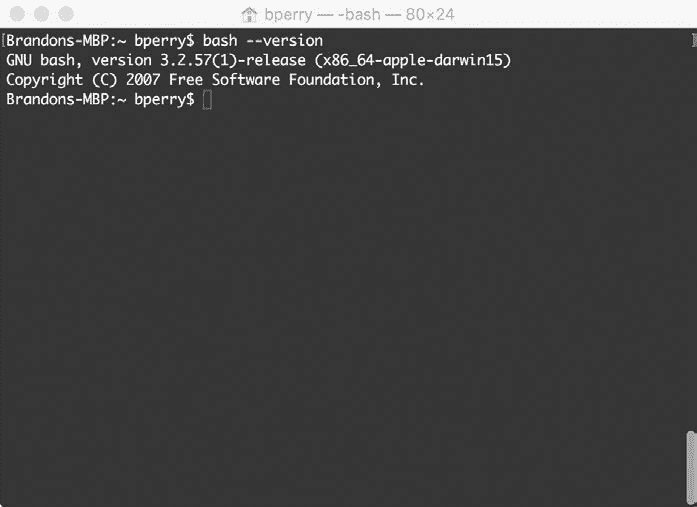
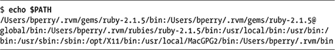

## 0

**Shell 脚本速成课程**


Bash（以及一般的 shell 脚本）已经存在很长时间，每天都有新人接触到 bash 带来的 shell 脚本和系统自动化的强大功能。而且随着微软在 Windows 10 中发布了交互式 bash shell 和 Unix 子系统，现在是学习 shell 脚本简单有效的最佳时机。

### 什么是 shell 脚本？

自计算机早期以来，shell 脚本一直在帮助系统管理员和程序员执行繁琐的工作，否则这些工作需要花费大量时间和体力。那么，什么是 shell 脚本，为什么你应该关心它？Shell 脚本是一个文本文件，它按照脚本中写定的顺序运行一系列命令，针对特定的 shell（在我们的案例中是 bash）。*Shell* 是你操作系统中命令库的命令行接口。

Shell 脚本本质上是通过使用 shell 环境中可用的命令构建的小型程序，用于自动化特定任务——通常是那些没人愿意手动做的任务，比如网页抓取、跟踪磁盘使用情况、下载天气数据、重命名文件等等。你甚至可以使用 shell 脚本制作简单的游戏！这些脚本可以包括简单的逻辑，如你可能在其他语言中看到的 `if` 语句，但它们也可以更加简单，正如你很快会看到的那样。

OS X、BSD 和 Linux 操作系统提供了多种命令行 shell，例如 tcsh、zsh 和广受欢迎的 bash。本书将重点介绍 Unix 环境中的主流 shell——bash。每个 shell 都有自己的特点和功能，但大多数人在 Unix 上首先接触的 shell 通常是 bash。在 OS X 上，终端应用会打开一个带有 bash shell 的窗口（参见 图 0-1）。在 Linux 上，命令 shell 程序可能差异较大，但常见的命令行控制台有 *gnome-terminal*（用于 GNOME）或 *konsole*（用于 KDE）。这些应用程序的配置可以更改，以使用不同类型的命令行 shell，但它们默认都使用 bash。基本上，如果你使用的是任何类似 Unix 的操作系统，打开终端应用应该默认呈现一个 bash shell。



*图 0-1：OS X 上的终端应用，显示了 bash 的一个版本*

**注意**

*2016 年 8 月，微软为 Windows 10 周年版发布了 bash，因此如果你在 Windows 上工作，你仍然可以运行 bash shell。附录 A 给出了如何在 Windows 10 上安装 bash 的说明，但本书假设你运行的是类似 Unix 的操作系统，如 OS X 或 Linux。你可以在 Windows 10 上测试这些脚本，但我们不做任何保证，也没有在 Windows 上进行测试！不过，bash 的美妙之处在于其可移植性，本书中的许多脚本应该可以“正常工作”。*

使用终端与系统交互可能看起来是一个令人生畏的任务。然而，随着时间的推移，打开终端并快速进行系统更改，变得比在菜单中一个接一个地移动鼠标，试图找到你想要更改的选项要自然得多。

### 运行命令

Bash 的核心功能是运行系统上的命令。让我们尝试一个简单的“Hello World”示例。在 bash shell 中，`echo` 命令将文本显示到屏幕上，如下所示：

```
$ echo "Hello World"
```

在 bash 命令行中输入此命令，你会看到屏幕上显示出 `Hello World`。这行代码运行的是存储在标准 bash 库中的 `echo` 命令。bash 将搜索这些标准命令的目录保存在一个名为 `PATH` 的环境变量中。你可以使用 `echo` 命令与 `PATH` 变量一起查看其内容，如列表 0-1 所示。



*列表 0-1：打印当前的* `*PATH*` *环境变量*

**注意**

*在显示输入命令和输出的列表中，输入命令会以粗体显示，并以* `*$*` *开始，以便与输出区分开来。*

输出中的目录之间由冒号分隔。这些都是 bash 在你请求它运行程序或命令时会检查的目录。如果你的命令不在这些目录中，bash 就无法运行它。另外，请注意，bash 会按照出现在`*PATH*`中的顺序检查这些目录。这个顺序很重要，因为如果你在 `PATH` 中的两个目录里有同名的两个命令，顺序可能会产生影响。如果你在找某个特定命令时遇到问题，可以使用 `which` 命令和该命令的名称来查看其在 shell 中的 `PATH`，如列表 0-2 所示。

```
$ which ruby
/Users/bperry/.rvm/rubies/ruby-2.1.5/bin/ruby
$ which echo
/bin/echo
```

*列表 0-2：使用* `*which*` *查找* `*PATH*` *中的命令*

现在，掌握了这些信息后，你可以将相关文件移动或复制到 `echo $PATH` 命令列出的其中一个目录中，如列表 0-1 所示，然后该命令就能运行了。本书中我们将多次使用 `which` 来确定命令的完整路径。它是调试损坏或异常的 `PATH` 时的一个有用工具。

### 配置登录脚本

在本书中，我们将编写脚本，并在其他脚本中使用这些脚本，因此能够轻松调用你的新脚本非常重要。你可以配置你的 `PATH` 变量，以便在启动新的命令 shell 时，像调用其他命令一样，自动调用你的自定义脚本。当你打开命令 shell 时，它做的第一件事就是读取你家目录中的登录脚本（在 OS X 或 Linux 中分别为 */Users/<username>* 或 */home/<username>*），并执行其中找到的任何自定义命令。登录脚本可以是 *.login*、*.profile*、*.bashrc* 或 *.bash_profile*，具体取决于你的系统。要找出哪个文件是登录脚本，可以在每个文件中添加如下行：

```
echo this is .profile
```

将最后一个词修改为与文件名匹配，然后登录。该行应显示在终端窗口的顶部，报告在登录时运行了哪个脚本。如果你打开终端并看到`this is .profile`，你就知道是加载了*.profile*文件作为你的 shell 环境；如果你看到`this is .bashrc`，你就知道加载的是*.bashrc*文件；依此类推。现在你知道了！不过，这个行为可能会有所变化，具体取决于你的 shell。

你可以修改登录脚本，使其将其他目录添加到你的`PATH`变量中。你还可以设置各种 bash 设置，从更改 bash 提示符的外观，到设置自定义的`PATH`，再到其他许多自定义设置。例如，让我们使用`cat`命令查看一个定制的*.bashrc*登录脚本。`cat`命令接受一个文件名作为参数，并将文件内容打印到控制台屏幕上，如 Listing 0-3 所示。

```
$ cat ~/.bashrc
export PATH="$PATH:$HOME/.rvm/bin" # Add RVM to PATH for scripting.
```

*Listing 0-3：这个定制的* .bashrc *文件更新了* `*PATH*` *以包括 RVM。*

这段代码显示了*.bashrc*文件的内容，表明已为`PATH`分配了一个新值，使得本地的 RVM（Ruby 版本管理器）安装能够管理任何已安装的 Ruby 版本。由于*.bashrc*文件每次打开新的命令行时都会设置自定义的`PATH`，因此 RVM 安装将在此系统上默认可用。

你可以实现类似的自定义设置，以便默认情况下使你的 shell 脚本可用。首先，你需要在家目录中创建一个开发文件夹来保存所有的 shell 脚本。然后，你可以将该目录添加到登录文件的`PATH`中，以便更方便地引用你的新脚本。

要确定你的家目录，使用命令`echo $HOME`打印目录路径到终端。导航到该目录并创建你的开发文件夹（我们建议命名为*scripts*）。然后，为了将你的开发目录添加到登录脚本中，打开登录脚本文件并在文件顶部添加以下行，将`*/path/to/scripts/*`替换为你的开发文件夹目录。

```
export PATH="/path/to/scripts/:$PATH"
```

完成此操作后，你保存在开发文件夹中的任何脚本都可以作为命令在 shell 中调用。

### 运行 Shell 脚本

我们现在已经使用了一些命令，如 `echo`、`which` 和 `cat`。但我们仅仅是单独使用了它们，而没有将它们放在一个 shell 脚本中一起使用。让我们编写一个 shell 脚本，依次运行这些命令，如 列表 0-4 所示。这个脚本将打印 *Hello World*，接着是 `neqn` shell 脚本的文件路径，这个脚本默认应该在你的 bash 文件中。然后它会使用这个路径打印 `neqn` 的内容到屏幕上。（此时 `neqn` 的内容不重要，这只是作为示例脚本使用。）这是一个很好例子，展示了如何使用 shell 脚本按顺序执行一系列命令，在本例中是查看文件的完整系统路径并快速检查其内容。

```
echo "Hello World"
echo $(which neqn)
cat $(which neqn)
```

*列表 0-4：我们的第一个 shell 脚本的内容*

打开你喜欢的文本编辑器（Linux 上常用 Vim 或 gedit，OS X 上常用 TextEdit），然后输入 列表 0-4。接着，将 shell 脚本保存到你的开发目录，并命名为 *intro*。Shell 脚本不需要特殊的文件扩展名，因此可以将扩展名留空（或者你可以加上扩展名 *.sh*，但这不是必须的）。脚本的第一行使用 `echo` 命令简单地打印 `Hello World`。第二行稍微复杂一些；它使用 `which` 查找 bash 文件 *neqn* 的位置，然后使用 `echo` 命令将该位置打印到屏幕上。为了像这样运行两个命令，其中一个命令作为另一个命令的参数，bash 使用 *子 shell* 来运行第二个命令并存储输出供第一个命令使用。在我们的例子中，子 shell 运行 `which` 命令，它将返回 `neqn` 脚本的完整路径。这个路径随后作为参数传递给 `echo`，这意味着 `echo` 会将 *neqn* 的路径打印到屏幕上。最后，同样的子 shell 技巧将 *neqn* 的文件路径传递给 `cat` 命令，后者将 `neqn` shell 脚本的内容打印到屏幕上。

文件保存后，我们可以从终端运行 shell 脚本。列表 0-5 显示了运行结果。

```
 $ sh intro
➊ Hello World
➋ /usr/bin/neqn
➌ #!/bin/sh
   # Provision of this shell script should not be taken to imply that use of
   # GNU eqn with groff -Tascii|-Tlatin1|-Tutf8|-Tcp1047 is supported.

   GROFF_RUNTIME="${GROFF_BIN_PATH=/usr/bin}:"
   PATH="$GROFF_RUNTIME$PATH"
   export PATH
   exec eqn -Tascii ${1+"$@"}

   # eof
   $
```

*列表 0-5：运行我们的第一个 shell 脚本*

使用 `sh` 命令运行 shell 脚本，并将 `intro` 脚本作为参数传递。`sh` 命令将逐行执行文件中的每一行，仿佛它是一个传递到终端的 bash 命令。你可以看到，`Hello World` ➊ 被打印到屏幕上，然后打印了 *neqn* 的路径 ➋。最后，打印了 *neqn* 文件的内容 ➌；这是你硬盘上短小的 `neqn` shell 脚本的源代码（至少在 OS X 上是这样——Linux 版本可能略有不同）。

### 让 Shell 脚本更直观

你不需要使用 `sh` 命令来运行你的脚本。如果你在 `intro` shell 脚本中再添加一行并修改脚本的文件系统权限，你将能够像运行其他 bash 命令一样直接调用 shell 脚本，而不需要使用 `sh`。在文本编辑器中，更新你的 `intro` 脚本如下：

```
➊ #!/bin/bash
   echo "Hello World"
   echo $(which neqn)
   cat $(which neqn)
```

我们在文件的顶部添加了一行，引用了文件系统路径 */bin/bash* ➊。这一行被称为*shebang*。shebang 允许你定义哪个程序将用来解释脚本。在这里，我们将文件设置为 bash 文件。你可能见过其他的 shebang，例如 Perl 语言的 (`#!/usr/bin/perl`) 或 Ruby 的 (`#!/usr/bin/env ruby`)。

在顶部添加了这一行后，你仍然需要设置文件权限，以便可以像运行程序一样执行 shell 脚本。请按照 清单 0-6 中所示，在 bash 终端中进行操作。

```
➊ $ chmod +x intro
➋ $ ./intro
   Hello World
   /usr/bin/neqn
   #!/bin/sh
   # Provision of this shell script should not be taken to imply that use of
   # GNU eqn with groff -Tascii|-Tlatin1|-Tutf8|-Tcp1047 is supported.

   GROFF_RUNTIME="${GROFF_BIN_PATH=/usr/bin}:"
   PATH="$GROFF_RUNTIME$PATH"
   export PATH
   exec eqn -Tascii ${1+"$@"}

   # eof
   $
```

*清单 0-6：更改 `intro` 脚本文件权限以允许执行*

我们使用 `chmod` ➊ 命令，传递 `+x` 参数，使文件变为可执行。我们将文件名传递给它以修改文件权限。设置文件权限使得 shell 脚本可以像程序一样运行后，我们就可以按照 ➋ 所示运行脚本，而不需要直接调用 bash。这是良好的 shell 脚本实践，并且随着你技能的提升，它将变得非常有用。本书中大多数脚本都需要像我们为 `intro` 脚本设置的那样的可执行权限。

这只是一个简单的示例，向你展示如何运行 shell 脚本以及如何使用 shell 脚本来运行其他 shell 脚本。本书中的许多 shell 脚本都会使用这种方法，未来你在编写 shell 脚本时也会经常看到 shebang。

### 为什么使用 Shell 脚本？

你可能会想，为什么要使用 bash shell 脚本，而不是像 Ruby 或 Go 这样的新语言。这些语言试图提供跨多种系统的可移植性，但它们通常并不是默认安装的。原因很简单：每台 Unix 机器都有一个基本的 shell，并且绝大多数 shell 使用 bash。如本章开头所述，微软最近为 Windows 10 配备了与主要 Linux 发行版和 OS X 相同的 bash shell。这意味着你的 shell 脚本比以往更加可移植，而且几乎不需要做额外的工作。你还可以比使用其他语言更简洁、更轻松地完成维护和系统任务。尽管 bash 在某些方面仍有不足，但你将在本书中学到如何弥补这些不足。

清单 0-7 显示了一个非常实用的小 shell 脚本示例（实际上只是一个 bash 一行脚本！），它是完全可移植的。该脚本可以查找 OpenOffice 文档文件夹中有多少页—对写作者特别有用。

```
#!/bin/bash
echo "$(exiftool *.odt | grep Page-count | cut -d ":" -f2 | tr '\n' '+')""0" | bc
```

*清单 0-7：用于确定 OpenOffice 文档文件夹中有多少页的 bash 脚本*

我们不会深入探讨这如何运作——毕竟我们才刚刚开始！但从宏观角度来看，它提取了每个文档的页数信息，将这些页数通过加法运算符连接起来，然后将算式传递给命令行计算器，生成总和。所有这一切，基本上只是一行代码。你会在本书中找到更多像这样的酷炫脚本，等你练习了一段时间后，这个脚本应该会让你恍然大悟，觉得非常简单！

### 让我们开始吧

如果你之前还不清楚，现在你应该大致了解了什么是 Shell 脚本。编写小巧的脚本来完成特定任务是 Unix 哲学的核心。理解如何编写自己的脚本，并扩展自己的 Unix 系统，以更好地满足个人需求，这将使你成为一个强力用户。本章只是本书中将要介绍内容的一个小小预览：一些非常酷的 Shell 脚本！
