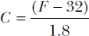

## **创建工具**


创建 shell 脚本的主要目的之一是将复杂的命令行序列放入文件中，使其可复制并且易于调整。所以，不足为奇的是，本书中到处都是用户命令。那么，什么是令人惊讶的呢？令人惊讶的是，我们没有为 Linux、Solaris 和 OS X 系统上的每个命令编写一个封装脚本。

Linux/Unix 是唯一一个你可以决定不喜欢某个命令的默认标志，并通过几个按键永远修复它的操作系统，或者你可以通过使用别名或十几行脚本来模拟你喜欢的其他操作系统工具的行为。这就是 Unix 如此有趣的原因，也是最初写这本书的原因！

### #22 提醒工具

多年来，Windows 和 Mac 用户一直喜欢像 Stickies 这样的简单工具，这些精简的应用程序让你可以在屏幕上粘贴小便签和提醒。它们非常适合记录电话号码或其他提醒。不幸的是，如果你想在 Unix 命令行下记笔记，没有类似的工具，但这个问题可以通过这对脚本轻松解决。

第一个脚本`remember`（如清单 3-1 所示）可以让你轻松将信息片段保存在家目录中的单个`rememberfile`文件中。如果没有传递任何参数，它会读取标准输入直到输入文件结束符（`^D`），即按 CTRL-D。如果传递了参数，它会直接将这些参数保存到数据文件中。

这对脚本中的另一部分是`remindme`，一个伴随脚本，显示在清单 3-2 中，当没有给定参数时，它会显示整个`rememberfile`的内容，或者使用参数作为模式进行搜索并显示其结果。

#### *代码*

```
   #!/bin/bash

   # remember--An easy command line-based reminder pad

   rememberfile="$HOME/.remember"

   if [ $# -eq 0 ] ; then
     # Prompt the user for input and append whatever they write to
     #   the rememberfile.
     echo "Enter note, end with ^D: "
➊   cat - >> $rememberfile
   else
     # Append any arguments passed to the script on to the .remember file.
➋   echo "$@" >> $rememberfile
   fi

   exit 0
```

*清单 3-1: `*remember*` 脚本*

清单 3-2 详细介绍了伴随脚本`remindme`。

```
   #!/bin/bash

   # remindme--Searches a data file for matching lines or, if no
   #   argument is specified, shows the entire contents of the data file

   rememberfile="$HOME/.remember"

   if [ ! -f $rememberfile ] ; then
     echo "$0: You don't seem to have a .remember file. " >&2
     echo "To remedy this, please use 'remember' to add reminders" >&2
     exit 1
   fi

   if [ $# -eq 0 ] ; then
     # Display the whole rememberfile when not given any search criteria.
➌   more $rememberfile
   else
     # Otherwise, search through the file for the given terms, and display
     #   the results neatly.
➍   grep -i -- "$@" $rememberfile | ${PAGER:-more}
   fi

   exit 0
```

*清单 3-2: `*remindme*` 脚本，作为清单 3-1 中`*remember*`脚本的伴随脚本*

#### *工作原理*

清单 3-1 中的`remember`脚本可以作为交互式程序工作，要求用户输入需要记住的详细信息，或者它也可以像脚本一样工作，因为它也可以接受任何作为命令行参数存储的内容。如果用户没有向脚本传递任何参数，那么我们会做一些巧妙的编码。在打印出如何输入项的用户友好消息后，我们通过`cat` ➊读取用户输入的数据：

```
cat - >> $rememberfile
```

在前面的章节中，我们使用`read`命令从用户获取输入。此行代码使用`cat`从`stdin`（命令中的`-`是`stdin`或`stdout`的简写，具体取决于上下文）读取数据，直到用户按下 CTRL-D，告诉`cat`工具文件结束。当`cat`从`stdin`读取数据时，它会将这些数据追加到`rememberfile`中。

如果向脚本指定了参数，所有参数会直接按原样附加到`rememberfile`中 ➋。

如果列表 3-2 中的`remindme`脚本无法运行是因为`rememberfile`文件不存在，因此我们首先会检查`rememberfile`是否存在，在尝试执行任何操作之前。如果`rememberfile`不存在，我们会在屏幕上打印一条消息告知用户原因，然后立即退出。

如果没有向脚本传递任何参数，我们假设用户只是想查看`rememberfile`的内容。我们使用`more`工具来分页显示`rememberfile`的内容，直接将内容展示给用户 ➌。

否则，如果传递了参数给脚本，我们将执行不区分大小写的`grep`，以搜索`rememberfile`中任何匹配的词条，然后也以分页形式显示这些结果 ➍。

#### *运行脚本*

要使用`remindme`工具，首先用`remember`脚本将笔记、电话号码或其他任何东西添加到`rememberfile`中，如列表 3-3 所示。然后，用`remindme`搜索这个自由格式的数据库，可以指定任何长短的模式。

#### *结果*

```
$ remember Southwest Airlines: 800-IFLYSWA
$ remember
Enter note, end with ^D:
Find Dave's film reviews at http://www.DaveOnFilm.com/
^D
```

*列表 3-3：测试`*remember*` shell 脚本*

然后，当你几个月后想要记起那条笔记时，列表 3-4 展示了你如何找到提醒。

```
$ remindme film reviews
Find Dave's film reviews at http://www.DaveOnFilm.com/
```

*列表 3-4：测试`*remindme*` shell 脚本*

或者，如果你记不清一个 800 电话号码，列表 3-5 展示了如何查找部分电话号码。

```
$ remindme 800
Southwest Airlines: 800-IFLYSWA
```

*列表 3-5：使用`*remindme*`脚本查找部分电话号码*

#### *破解脚本*

虽然这些脚本绝对称不上是任何形式的 shell 脚本编程杰作，但它们很好地展示了 Unix 命令行的可扩展性。如果你能想象某件事情，很可能就有一个简单的方法来实现它。

这些脚本可以通过多种方式改进。例如，你可以引入*记录*的概念：每个`remember`条目都有时间戳，多行输入可以作为单一记录保存，并且可以使用正则表达式进行搜索。这个方法让你能够为一组人存储电话号码，并仅凭记住组中某个人的名字就能检索出所有号码。如果你真的热衷于脚本编程，你还可以加入编辑和删除功能。话说回来，手动编辑*~/.remember*文件其实也非常容易。

### #23 一个交互式计算器

如果你记得的话，`scriptbc`（在脚本 #9 中位于第 34 页）允许我们将浮动点`bc`计算作为内联命令参数调用。接下来的合乎逻辑的步骤是编写一个包装脚本，将这个脚本变成一个完全交互的命令行计算器。这个脚本（如清单 3-6 所示）非常简短！确保`scriptbc`脚本在`PATH`中，否则这个脚本将无法运行。

#### *代码*

```
   #!/bin/bash

   # calc--A command line calculator that acts as a frontend to bc

   scale=2

   show_help()
   {
   cat << EOF
     In addition to standard math functions, calc also supports:

     a % b       remainder of a/b
     a ^ b       exponential: a raised to the b power
     s(x)        sine of x, x in radians
     c(x)        cosine of x, x in radians
     a(x)        arctangent of x, in radians
     l(x)        natural log of x
     e(x)        exponential log of raising e to the x
     j(n,x)      Bessel function of integer order n of x
     scale N     show N fractional digits (default = 2)
   EOF
   }

   if [ $# -gt 0 ] ; then
     exec scriptbc "$@"
   fi

   echo "Calc--a simple calculator. Enter 'help' for help, 'quit' to quit."

   /bin/echo -n "calc> "

➊ while read command args
   do
     case $command
     in
       quit|exit) exit 0                                  ;;
       help|\?)   show_help                               ;;
       scale)     scale=$args                             ;;
       *)         scriptbc -p $scale "$command" "$args"   ;;
     esac

     /bin/echo -n "calc> "
   done

   echo ""

   exit 0
```

*清单 3-6: `*calc*` 命令行计算器 Shell 脚本*

#### *它是如何工作的*

也许这个代码最有趣的部分是`while read`语句 ➊，它创建了一个无限循环，直到用户退出（通过输入`quit`或输入文件结束符号（`^D`））之前，一直显示`calc>`提示。这个脚本的简单性正是它特别棒的原因：Shell 脚本不需要复杂才有用！

#### *运行脚本*

该脚本使用了我们在脚本 #9 中编写的浮动点计算器`scriptbc`，因此在运行之前，请确保该脚本可以在你的`PATH`中找到，或者将变量像`$scriptbc`设置为脚本当前的名称。如果没有参数传递给它，默认情况下，该脚本将作为交互工具运行，提示用户进行所需的操作。如果带有参数调用，则这些参数将传递给`scriptbc`命令。清单 3-7 展示了两种用法选项的实际操作。

#### *结果*

```
$ calc 150 / 3.5
42.85
$ calc
Calc--a simple calculator. Enter 'help' for help, 'quit' to quit.
calc> help
  In addition to standard math functions, calc also supports:

  a % b       remainder of a/b
  a ^ b       exponential: a raised to the b power
  s(x)        sine of x, x in radians
  c(x)        cosine of x, x in radians
  a(x)        arctangent of x, in radians
  l(x)        natural log of x
  e(x)        exponential log of raising e to the x
  j(n,x)      Bessel function of integer order n of x
  scale N     show N fractional digits (default = 2)
calc> 54354 ^ 3
160581137553864
calc> quit
$
```

*清单 3-7: 测试`*calc*` Shell 脚本*

**警告**

*浮动点计算，即使对我们人类来说很容易，但在计算机上可能会非常棘手。不幸的是，`*bc*` 命令可能以意想不到的方式暴露出一些这些问题。例如，在`*bc*`中，设置`***scale=0***`并输入`***7 % 3***`。现在尝试使用`***scale=4***`。这将产生`*.0001*`，显然是不正确的。*

#### *破解脚本*

你可以在命令行中的`bc`上做的任何事情，在这个脚本中也可以做，前提是`calc.sh`没有逐行内存或状态保持。这意味着，如果你有兴趣，你可以向帮助系统添加更多的数学函数。例如，变量`obase`和`ibase`允许你指定输入和输出的数字基数，尽管由于没有逐行内存，你需要修改`scriptbc`（在脚本 #9 中位于第 34 页）或者学会将设置和方程都输入在同一行。

### #24 转换温度

清单 3-8 中的脚本标志着本书中第一次使用复杂数学运算，它可以在华氏度、摄氏度和开尔文单位之间转换任何温度。它使用与脚本 #9 中相同的技巧，将方程传递给`bc`，正如我们在第 34 页上所做的那样。

#### *代码*

```
   #!/bin/bash

   # convertatemp--Temperature conversion script that lets the user enter
   #   a temperature in Fahrenheit, Celsius, or Kelvin and receive the
   #   equivalent temperature in the other two units as the output

   if [ $# -eq 0 ] ; then
     cat << EOF >&2
   Usage: $0 temperature[F|C|K]
   where the suffix:
       F    indicates input is in Fahrenheit (default)
       C    indicates input is in Celsius
       K    indicates input is in Kelvin
   EOF
     exit 1
   fi

➊ unit="$(echo $1|sed -e 's/[-[:digit:]]*//g' | tr '[:lower:]' '[:upper:]' )"
➋ temp="$(echo $1|sed -e 's/[^-[:digit:]]*//g')"

   case ${unit:=F}
   in
   F ) # Fahrenheit to Celsius formula: Tc = (F - 32) / 1.8
     farn="$temp"
➌   cels="$(echo "scale=2;($farn - 32) / 1.8" | bc)"
     kelv="$(echo "scale=2;$cels + 273.15" | bc)"
     ;;

   C ) # Celsius to Fahrenheit formula: Tf = (9/5)*Tc+32
     cels=$temp
     kelv="$(echo "scale=2;$cels + 273.15" | bc)"
➍   farn="$(echo "scale=2;(1.8 * $cels) + 32" | bc)"
     ;;

➎ K ) # Celsius = Kelvin - 273.15, then use Celsius -> Fahrenheit formula
     kelv=$temp
     cels="$(echo "scale=2; $kelv - 273.15" | bc)"
     farn="$(echo "scale=2; (1.8 * $cels) + 32" | bc)"
     ;;

     *)
     echo "Given temperature unit is not supported"
     exit 1
   esac

   echo "Fahrenheit = $farn"
   echo "Celsius    = $cels"
   echo "Kelvin     = $kelv"

   exit 0
```

*清单 3-8: `*convertatemp*` Shell 脚本*

#### *它是如何工作的*

在本书的这个阶段，大部分脚本应该已经很清晰了，但让我们仔细看看做所有工作的数学公式和正则表达式。“先讲数学，”大多数学龄儿童无疑会*不*喜欢听到这样的话！这是将华氏度转换为摄氏度的公式：



转换成可以传递给 `bc` 并求解的序列后，它看起来像 ➌ 中的代码。反向转换，即摄氏度到华氏度的转换，位于 ➍。该脚本还将温度从摄氏度转换为开尔文 ➎。这个脚本展示了使用助记变量名的一个重要原因：它使代码更容易阅读和调试。

这里另一个有趣的代码部分是正则表达式，其中最复杂的无疑是 ➊ 的表达式。我们所做的事情其实非常直接，如果你能解读 `sed` 替换的语法。替换的格式总是看起来像 `s/*旧值*/*新值*/`；其中 `*旧值*` 模式表示零次或多次出现的 `-`，后面跟着数字集合中的任何一个（记住 `[:digit:]` 是 ANSI 字符集表示任意数字，`*` 匹配前述模式的零次或多次出现）。然后，`*新值*` 模式是我们希望用来替换 `*旧值*` 模式的内容，在这种情况下它只是 `//`，表示一个空模式；当你只想删除旧模式时，这个模式非常有用。这个替换有效地删除了所有的数字，使得像 `-31f` 这样的输入变成了仅有 `f`，从而得到单位类型。最后，`tr` 命令将所有内容转换为大写，因此，例如，`-31f` 变成了 `F`。

另一个 `sed` 表达式执行相反的操作 ➋：它使用 `^` 操作符来否定类 `[:digit:]` 中任何字符的匹配，从而移除任何非数字字符。（大多数编程语言使用 `!` 作为否定符号。）这为我们提供了最终使用适当方程式进行转换的值。

#### *运行脚本*

这个脚本有一个直观的输入格式，即使它在 Unix 命令中相当不寻常。输入是作为一个数值输入的，带有一个可选后缀，表示输入温度的单位；如果没有给定后缀，代码假设单位为华氏度。

要查看 0° 华氏度对应的摄氏度和开尔文度数，请输入 `0F`。要查看 100° 开尔文在华氏度和摄氏度中的值，请使用 `100K`。要获取 100° 摄氏度在开尔文和华氏度中的值，请输入 `100C`。

你将在 脚本 #60 中再次看到这种单字母后缀的方法，该脚本用于转换货币值，见 第 190 页。

#### *结果*

列表 3-9 展示了不同温度之间的转换。

```
$ convertatemp 212
Fahrenheit = 212
Celsius    = 100.00
Kelvin     = 373.15
$ convertatemp 100C
Fahrenheit = 212.00
Celsius    = 100
Kelvin     = 373.15
$ convertatemp 100K
Fahrenheit = -279.67
Celsius    = -173.15
Kelvin     = 100
```

*列表 3-9：使用一些转换测试* `*convertatemp*` *Shell 脚本*

#### *破解脚本*

你可以添加一些输入标志，每次只生成简洁的输出。例如，`convertatemp -c 100F`可以仅输出 100°F 的摄氏等效温度。这个方法也能帮助你在其他脚本中使用转换后的值。

### #25 计算贷款支付

另一个用户可能会遇到的常见计算是贷款支付估算。清单 3-10 中的脚本也有助于回答“我可以拿这些奖金做什么？”以及相关问题“我终于可以买得起那辆新特斯拉了吗？”。

尽管基于本金、利率和贷款期限来计算支付金额的公式有些复杂，但通过巧妙使用 Shell 变量，能够驯服这个数学难题，并让它变得出乎意料地易于理解。

#### *代码*

```
   #!/bin/bash

   # loancalc--Given a principal loan amount, interest rate, and
   #   duration of loan (years), calculates the per-payment amount

   # Formula is M = P * ( J / (1 - (1 + J) ^ -N)),
   #   where P = principal, J = monthly interest rate, N = duration (months).

   # Users typically enter P, I (annual interest rate), and L (length, years).

➊ . library.sh         # Start by sourcing the script library.

   if [ $# -ne 3 ] ; then
     echo "Usage: $0 principal interest loan-duration-years" >&2
     exit 1
   fi

➋ P=$1 I=$2 L=$3
   J="$(scriptbc -p 8 $I / \( 12 \* 100 \) )"
   N="$(( $L * 12 ))"
   M="$(scriptbc -p 8 $P \* \( $J / \(1 - \(1 + $J\) \^ -$N\) \) )"

   # Now a little prettying up of the value:

➌ dollars="$(echo $M | cut -d. -f1)"
   cents="$(echo $M | cut -d. -f2 | cut -c1-2)"

   cat << EOF
   A $L-year loan at $I% interest with a principal amount of $(nicenumber $P 1 )
   results in a payment of \$$dollars.$cents each month for the duration of
   the loan ($N payments).
   EOF

   exit 0
```

*清单 3-10：* `*loancalc*` *Shell 脚本*

#### *原理*

探索公式本身超出了本书的范围，但值得注意的是，如何在 Shell 脚本中直接实现一个复杂的数学公式。

整个计算可以通过将一个长输入流传递给`bc`来解决，因为该程序也支持变量。然而，能够在脚本中操作中间值超出了`bc`命令本身的能力。此外，坦率地说，将公式拆分为多个中间方程式➋，也有助于调试。例如，下面是将计算出的月支付额拆分为美元和美分并确保以正确格式显示为货币值的代码：

```
dollars="$(echo $M | cut -d. -f1)"
cents="$(echo $M | cut -d. -f2 | cut -c1-2)"
```

`cut`命令在这里证明非常有用➌。这段代码的第二行抓取了月支付值中小数点后的部分，然后将第二个字符之后的内容截断。如果你更愿意将这个数字四舍五入到下一个最接近的美分，只需在截断美分之前加上 0.005。

同时注意到，在➊处，书中早先提到的脚本库通过`. library.sh`命令被整齐地包含进脚本中，确保所有函数（在本脚本中，来自第一章的`nicenumber()`函数）都能被脚本访问。

#### *运行脚本*

这个简化版脚本需要三个参数：贷款金额、利率和贷款期限（单位为年）。

#### *结果*

假设你一直在关注一辆新的特斯拉 Model S，并且想知道如果你购买这辆车，月供会是多少。Model S 的起售价大约为 69,900 美元，最新的汽车贷款利率为 4.75%。假设你目前的汽车价值约 25,000 美元，并且你能够以这个价格进行置换，你将贷款 44,900 美元的差额。如果你还没有改变主意，你希望看到四年期和五年期车贷的总支付差异——这个脚本可以轻松完成这个任务，如列表 3-11 所示。

```
$ loancalc 44900 4.75 4
A 4-year loan at 4.75% interest with a principal amount of 44,900
results in a payment of $1028.93 each month for the duration of
the loan (48 payments).
$ loancalc 44900 4.75 5
A 5-year loan at 4.75% interest with a principal amount of 44,900
results in a payment of $842.18 each month for the duration of
the loan (60 payments).
```

*列表 3-11：测试`*loancalc*`脚本*

如果你能承受四年贷款的较高月供，那么汽车将更早还清，而你的总支付额（即月供乘以还款期数）将明显减少。为了计算准确的节省金额，我们可以使用脚本 #23 中的互动计算器，如第 82 页所示：

```
$ calc '(842.18 * 60) - (1028.93 * 48)'
1142.16
```

这似乎是一个值得的节省：$1,142.16 足够买一台不错的笔记本电脑！

#### *破解脚本*

这个脚本实际上可以加入一个提示功能，如果用户没有提供任何参数的话。更有用的版本可以让用户指定四个参数中的任意三个（本金、利率、还款期数和月供金额），然后自动计算出第四个值。这样，如果你知道自己每月最多可以支付 500 美元，并且 6%的汽车贷款的最长期限是 5 年，你就能计算出自己可以借款的最大金额。你可以通过实现标志，让用户传入他们希望的值，从而完成这个计算。

### #26 事件追踪

这实际上是一对脚本，它们一起实现了一个简单的日历程序，类似于我们在脚本 #22 中的提醒工具（见第 80 页）。第一个脚本`addagenda`（见列表 3-12）允许你指定一个周期性事件（每周某天的周事件或每年某天的年度事件）或一次性事件（指定日期、月份和年份）。所有日期都会经过验证并保存，同时还有一个单行事件描述，这些内容会存储在你主目录下的*.agenda*文件中。第二个脚本`agenda`（见列表 3-13）检查所有已知事件，显示哪些事件安排在当前日期。

这种工具特别适合用来记住生日和纪念日。如果你总是忘记重要的事件，这个实用的脚本将能为你节省不少麻烦！

#### *代码*

```
   #!/bin/bash

   # addagenda--Prompts the user to add a new event for the agenda script

   agendafile="$HOME/.agenda"

   isDayName()
   {
     # Return 0 if all is well, 1 on error.
 case $(echo $1 | tr '[[:upper:]]' '[[:lower:]]') in
       sun*|mon*|tue*|wed*|thu*|fri*|sat*) retval=0 ;;
       * ) retval=1 ;;
     esac
     return $retval
   }

   isMonthName()
   {
     case $(echo $1 | tr '[[:upper:]]' '[[:lower:]]') in
       jan*|feb*|mar*|apr*|may|jun*)     return 0        ;;
       jul*|aug*|sep*|oct*|nov*|dec*)    return 0        ;;
       * ) return 1      ;;
     esac
   }

➊ normalize()
   {
     # Return string with first char uppercase, next two lowercase.
     /bin/echo -n $1 | cut -c1  | tr '[[:lower:]]' '[[:upper:]]'
     echo  $1 | cut -c2-3| tr '[[:upper:]]' '[[:lower:]]'
   }

   if [ ! -w $HOME ] ; then
     echo "$0: cannot write in your home directory ($HOME)" >&2
     exit 1
   fi

   echo "Agenda: The Unix Reminder Service"
   /bin/echo -n "Date of event (day mon, day month year, or dayname): "
   read word1 word2 word3 junk

   if isDayName $word1 ; then
     if [ ! -z "$word2" ] ; then
       echo "Bad dayname format: just specify the day name by itself." >&2
       exit 1
     fi
     date="$(normalize $word1)"

   else

     if [ -z "$word2" ] ; then
       echo "Bad dayname format: unknown day name specified" >&2
       exit 1
     fi

     if [ ! -z "$(echo $word1|sed 's/[[:digit:]]//g')" ]  ; then
       echo "Bad date format: please specify day first, by day number" >&2
       exit 1
     fi

     if [ "$word1" -lt 1 -o "$word1" -gt 31 ] ; then
       echo "Bad date format: day number can only be in range 1-31" >&2
       exit 1
     fi

 if [ ! isMonthName $word2 ] ; then
       echo "Bad date format: unknown month name specified." >&2
       exit 1
     fi

     word2="$(normalize $word2)"

     if [ -z "$word3" ] ; then
       date="$word1$word2"
     else
       if [ ! -z "$(echo $word3|sed 's/[[:digit:]]//g')" ] ; then
         echo "Bad date format: third field should be year." >&2
         exit 1
       elif [ $word3 -lt 2000 -o $word3 -gt 2500 ] ; then
         echo "Bad date format: year value should be 2000-2500" >&2
         exit 1
       fi
       date="$word1$word2$word3"
     fi
   fi

   /bin/echo -n "One-line description: "
   read description

   # Ready to write to data file

➋ echo "$(echo $date|sed 's/ //g')|$description" >> $agendafile

   exit 0
```

*列表 3-12：`*addagenda*`脚本*

第二个脚本（见列表 3-13）较短，但使用频率更高。

```
   #!/bin/sh

   # agenda--Scans through the user's .agenda file to see if there
   #   are matches for the current or next day

   agendafile="$HOME/.agenda"

   checkDate()
   {
     # Create the possible default values that will match today.
     weekday=$1   day=$2   month=$3   year=$4
➌   format1="$weekday"   format2="$day$month"   format3="$day$month$year"

   # And step through the file comparing dates...

   IFS="|"       # The reads will naturally split at the IFS.

   echo "On the agenda for today:"
     while read date description ; do
       if [ "$date" = "$format1" -o "$date" = "$format2" -o \
            "$date" = "$format3" ]
       then
         echo " $description"
       fi
     done < $agendafile
   }

   if [ ! -e $agendafile ] ; then
     echo "$0: You don't seem to have an .agenda file. " >&2
     echo "To remedy this, please use 'addagenda' to add events" >&2
     exit 1
   fi

   # Now let's get today's date...

➍ eval $(date '+weekday="%a" month="%b" day="%e" year="%G"')

➎ day="$(echo $day|sed 's/ //g')" # Remove possible leading space.

   checkDate $weekday $day $month $year

   exit 0
```

*列表 3-13：* `*agenda*` *脚本，它是列表 3-12 中`*addagenda*`脚本的伴侣*

#### *原理*

`addagenda`和`agenda`脚本支持三种类型的重复事件：每周事件（“每周三”）、年度事件（“每年 8 月 3 日”）和一次性事件（“2017 年 1 月 1 日”）。随着议程文件中条目的添加，它们指定的日期会被标准化和压缩，`3 August`变为`3Aug`，`Thursday`变为`Thu`。这一切通过`addagenda`中的`normalize`函数实现 ➊。

这个函数将输入的任何值截断为三个字符，确保第一个字符为大写，第二个和第三个字符为小写。这个格式与`date`命令输出的标准缩写日期和月份名称值相匹配，这对于`agenda`脚本的正确运行至关重要。`addagenda`脚本的其余部分没有特别复杂的内容；大部分代码用于检测无效的数据格式。

最后，在➋处，它将现在标准化的记录数据保存到隐藏文件中。错误检查代码与实际功能代码的比例非常典型，是一个写得很好的程序：在输入时清理数据，你就可以自信地对后续应用程序中的数据格式做出假设。

`agenda`脚本通过将当前日期转换为三种可能的日期字符串格式（*dayname*，*day+month*，*day+month+year*）来检查事件 ➌。然后，它将这些日期字符串与*.agenda*数据文件中的每一行进行比较。如果找到匹配的条目，事件将展示给用户。

这对脚本中的最酷的黑客技巧可能就是如何使用`eval`来为所需的四个日期值分配变量 ➊。

```
eval $(date "+weekday=\"%a\" month=\"%b\" day=\"%e\" year=\"%G\"")
```

可以逐个提取值（例如，`weekday="$(date +%a)"`），但在极少数情况下，如果日期在四次`date`调用之间发生了跨天，方法可能会失败，因此最好使用简洁的单次调用。而且，这样做也很酷。

由于`date`返回的日期是带有前导零或前导空格的数字，而这两者都是不需要的，下一个代码行在➎处会去掉这些多余的部分，然后再继续执行。快去看一看它是怎么工作的！

#### *运行脚本*

`addagenda`脚本会提示用户输入新事件的日期。然后，如果它接受日期格式，脚本会提示输入事件的一行描述。

附带的`agenda`脚本没有参数，当调用时，它会生成一个当前日期所有事件的列表。

#### *结果*

要查看这对脚本如何工作，我们可以像清单 3-14 所示，向数据库中添加一些新事件。

```
$ addagenda
Agenda: The Unix Reminder Service
Date of event (day mon, day month year, or dayname): 31 October
One-line description: Halloween
$ addagenda
Agenda: The Unix Reminder Service
Date of event (day mon, day month year, or dayname): 30 March
One-line description: Penultimate day of March
$ addagenda
Agenda: The Unix Reminder Service
Date of event (day mon, day month year, or dayname): Sunday
One-line description: sleep late (hopefully)
$ addagenda
Agenda: The Unix Reminder Service
Date of event (day mon, day month year, or dayname): march 30 17
Bad date format: please specify day first, by day number
$ addagenda
Agenda: The Unix Reminder Service
Date of event (day mon, day month year, or dayname): 30 march 2017
One-line description: Check in with Steve about dinner
```

*清单 3-14：测试* `*addagenda*` *脚本并添加多个议程项*

现在，`agenda`脚本提供了一个快速便捷的方式，提醒今天发生了什么，详见清单 3-15。

```
$ agenda
On the agenda for today:
  Penultimate day of March
  sleep late (hopefully)
  Check in with Steve about dinner
```

*清单 3-15：使用* `*agenda*` *脚本查看今天的议程项*

注意到它匹配了格式为 *dayname*、*day+month* 和 *day+month+year* 的条目。为了完整起见，列表 3-16 显示了相关的 *.agenda* 文件，并且添加了一些额外的条目：

```
$ cat ~/.agenda
14Feb|Valentine's Day
25Dec|Christmas
3Aug|Dave's birthday
4Jul|Independence Day (USA)
31Oct|Halloween
30Mar|Penultimate day of March
Sun|sleep late (hopefully)
30Mar2017|Check in with Steve about dinner
```

*列表 3-16：存储议程项目的* .agenda *文件的原始内容*

#### *脚本黑客*

这个脚本实际上只是触及了这个复杂且有趣话题的皮毛。举个例子，如果它能够提前几天查看就好了；这可以通过在 `agenda` 脚本中进行一些日期运算来实现。如果你有 GNU `date` 命令，日期运算就很容易。如果没有，那么在 shell 中仅启用日期运算就需要一个复杂的脚本。我们将在本书稍后的章节中更详细地介绍日期运算，特别是在脚本 #99（第 330 页）、脚本 #100（第 332 页）和脚本 #101（第 335 页）。

另一个（更简单的）方法是，当没有与当前日期匹配的项目时，`agenda` 输出 `今天没有安排`，而不是更为草率的 `今天的议程：` 后面什么也没有。

这个脚本还可以在 Unix 机器上用于发送全系统的事件提醒，比如备份计划、公司假期和员工生日。首先，让每个用户机器上的 `agenda` 脚本额外检查一个共享的只读 *.agenda* 文件。然后在每个用户的 *.login* 或类似文件中添加调用 `agenda` 脚本的命令，该文件会在登录时执行。

**注意**

*令人惊讶的是，不同的 Unix 和 Linux 系统上的日期实现有所不同，因此，如果你尝试使用自己的 `date` 命令做一些更复杂的操作且失败了，记得查阅手册页，看看你的系统能做什么，不能做什么。*
