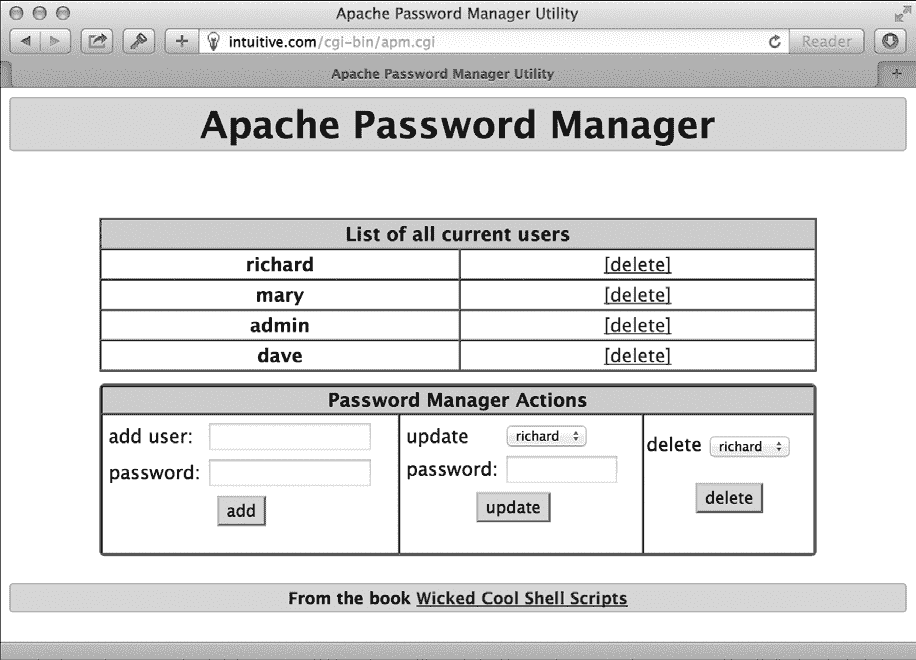

## 9

**WEB 和 INTERNET 管理**


如果你正在运行一个 web 服务器或负责一个网站，无论是简单还是复杂，你很可能经常需要执行某些任务，特别是识别断开的内部和外部站点链接。通过使用 shell 脚本，你可以自动化许多这些任务，也可以自动化一些常见的客户端/服务器任务，比如管理受密码保护的网站目录的访问信息。

### #69 识别断开的内部链接

第七章中的几个脚本突出了 `lynx` 纯文本浏览器的功能，但这个强大的软件应用程序还隐藏着更多的功能。对于网站管理员来说，尤其有用的一项功能是 `traverse`（通过使用 `-traversal` 启用），它使得 `lynx` 尝试遍历网站上的所有链接，以检查是否存在断开的链接。这个功能可以在一个简短的脚本中利用，就像 Listing 9-1 所描述的那样。

#### *代码*

```
   #!/bin/bash

   # checklinks--Traverses all internal URLs on a website, reporting
   #   any errors in the "traverse.errors" file

   # Remove all the lynx traversal output files upon completion.
   trap "$(which rm) -f traverse.dat traverse2.dat" 0

   if [ -z "$1" ] ; then
     echo "Usage: checklinks URL" >&2
     exit 1
   fi

   baseurl="$(echo $1 | cut -d/ -f3 | sed 's/http:\/\///')"

   lynx➊ -traversal -accept_all_cookies➋ -realm "$1" > /dev/null

   if [ -s "traverse.errors" ] ; then
     /bin/echo -n $(wc -l < traverse.errors) errors encountered.
➌   echo Checked $(grep '^http' traverse.dat | wc -l) pages at ${1}:
     sed "s|$1||g" < traverse.errors
     mv traverse.errors ${baseurl}.errors
     echo "A copy of this output has been saved in ${baseurl}.errors"
   else
     /bin/echo -n "No errors encountered. ";
     echo Checked $(grep '^http' traverse.dat | wc -l) pages at ${1}
   fi

   if [ -s "reject.dat" ]; then
     mv reject.dat ${baseurl}.rejects
   fi

   exit 0
```

*Listing 9-1: `*checklinks*` 脚本*

#### *它是如何工作的*

这个脚本的大部分工作是由 `lynx` ➊ 完成的；脚本只是对 `lynx` 的输出文件进行一些处理，整理并以吸引人的方式展示数据。`lynx` 输出文件 *reject.dat* 包含指向外部 URL 的链接列表（查看 Script #70 在 第 220 页 了解如何利用这些数据），*traverse.errors* 包含无效链接的列表（这个脚本的核心），*traverse.dat* 包含所有检查过的页面列表，而 *traverse2.dat* 与 *traverse.dat* 相同，只是它还包括每个访问页面的标题。

`lynx` 命令可以接受很多不同的参数，在这种情况下，我们需要使用 `-accept_all_cookies` ➋，以免程序因是否接受或拒绝来自页面的 cookie 而停滞。我们还使用 `-realm`，确保脚本仅从该网站某个点开始，或“向下”检查树中的页面，而不是遇到的每个链接。如果没有 `-realm`，它可能像个疯子一样挖掘出成千上万的页面。当我们在没有 `-realm` 的情况下运行 `-traversal` 对 *[`www.intuitive.com/wicked/`](http://www.intuitive.com/wicked/)* 进行检查时，它在两个小时的漫长等待后发现了超过 6500 个页面。使用 `-realm` 标志时，它仅在几分钟内识别了 146 个页面进行检查。

#### *运行脚本*

要运行这个脚本，只需在命令行中指定一个 URL。你可以遍历并检查 *任何* 网站，但要小心：像 Google 或 Yahoo! 这样的站点检查起来会非常慢，并且在过程中会占用你所有的磁盘空间。

#### *结果*

让我们检查一个没有错误的微型网站 (Listing 9-2)。

```
$ checklinks http://www.404-error-page.com/
No errors encountered. Checked 1 pages at http://www.404-error-page.com/
```

*Listing 9-2: 运行* `*checklinks*` *脚本，检查没有错误的网站*

果然，一切正常。那么稍大一点的网站呢？清单 9-3 显示了当网站存在潜在损坏链接时，`checklinks` 可能输出的内容。

```
$ checklinks http://www.intuitive.com/library/
5 errors encountered. Checked 62 pages at http://intuitive.com/library/:
   index/   in BeingEarnest.shtml
   Archive/f8     in Archive/ArtofWriting.html
   Archive/f11    in Archive/ArtofWriting.html
   Archive/f16    in Archive/ArtofWriting.html
   Archive/f18    in Archive/ArtofWriting.html
A copy of this output has been saved in intuitive.com.errors
```

*清单 9-3：在有损坏链接的大型网站上运行* `*checklinks*` *命令*

这意味着文件 *BeingEarnest.shtml* 包含了一个指向 */index/* 的链接，但该链接无法解析：文件 */index/* 不存在。在 *ArtofWriting.html* 文件中也有四个奇怪的链接错误。

最后，在 清单 9-4 中，让我们检查 Dave 的电影评论博客，看看可能潜藏着哪些链接错误。

```
$ time checklinks http://www.daveonfilm.com/
No errors encountered. Checked 982 pages at http://www.daveonfilm.com/

real  50m15.069s
user  0m42.324s
sys  0m6.801s
```

*清单 9-4：运行* `*checklinks*` *脚本并使用* `*time*` *工具来了解它花费的时间*

注意，在长命令前添加对 `time` 的调用是查看脚本运行时长的聪明方法。在这里，你可以看到检查 *[`www.daveonfilm.com/`](http://www.daveonfilm.com/)* 上的所有 982 页用了 50 分钟的实际时间，实际处理时间为 42 秒。真是很多！

#### *破解脚本*

数据文件 *traverse.dat* 包含了所有遇到的 URL 列表，而 *reject.dat* 则包含所有遇到但未检查的 URL，通常是因为它们是外部链接。我们将在下一个脚本中处理这些。实际的错误会出现在 清单 9-1 中的 *traverse.errors* 文件 ➌ 部分。

要让这个脚本报告图像引用错误，可以使用 `grep` 从 *traverse.errors* 文件中查找 *.gif*、*.jpeg* 或 *.png* 文件后缀，然后将结果输入到 `sed` 语句（它会清理输出，使其更美观）。

### #70 报告损坏的外部链接

这个伙伴脚本（清单 9-5）是 脚本 #69 的延伸，基于该脚本的输出，识别所有外部链接并进行测试，确保没有 “404 Not Found” 错误。为了简化操作，它假设先前的脚本已经运行完毕，因此它可以利用 **.rejects* 文件中的 URL 列表。

#### *代码*

```
   #!/bin/bash

   # checkexternal--Tests all URLs on a website to build a list of external
   #   references, then check each one to ascertain which might be dead or
   #   otherwise broken. The -a flag forces the script to list all matches,
   #   whether they're accessible or not; by default, only unreachable links
   #   are shown.

   listall=0; errors=0; checked=0

   if [ "$1" = "-a" ] ; then
     listall=1; shift
   fi

   if [ -z "$1" ] ; then
     echo "Usage: $(basename $0) [-a] URL" >&2
     exit 1
   fi

   trap "$(which rm) -f traverse*.errors reject*.dat traverse*.dat" 0

   outfile="$(echo "$1" | cut -d/ -f3).errors.ext"
   URLlist="$(echo $1 | cut -d/ -f3 | sed 's/www\.//').rejects"

   rm -f $outfile     # Ready for new output

   if [ ! -e "$URLlist" ] ; then
     echo "File $URLlist not found. Please run checklinks first." >&2
     exit 1
   fi

   if [ ! -s "$URLlist" ] ; then
     echo "There don't appear to be any external links ($URLlist is empty)." >&2
     exit 1
   fi

   #### Now, finally, we're ready to begin...

   for URL in $(cat $URLlist | sort | uniq)
   do
➊   curl -s "$URL" > /dev/null 2>&1; return=$?
     if [ $return -eq 0 ] ; then
       if [ $listall -eq 1 ] ; then
         echo "$URL is fine."
       fi
     else
       echo "$URL fails with error code $return"
       errors=$(( $errors + 1 ))
     fi
     checked=$(( $checked + 1 ))
   done

   echo ""
   echo "Done. Checked $checked URLs and found $errors errors."
   exit 0
```

*清单 9-5：* `*checkexternal*` *脚本*

#### *它是如何工作的*

这不是本书中最优雅的脚本。它更像是一种强力检查外部链接的方法。对于找到的每个外部链接，`curl` 命令通过尝试抓取其 URL 内容来验证链接的有效性，然后在内容到达后立即丢弃它们，这部分操作在 ➊ 代码块中完成。

这里值得提到的是 `2>&1` 的符号：它使得输出设备 #2 被重定向到输出设备 #1 设置的目标。对于 shell，输出 #2 是 `stderr`（错误信息），输出 #1 是 `stdout`（常规输出）。单独使用 `2>&1` 会使得 `stderr` 重定向到 `stdout`。然而，在此重定向之前，请注意 `stdout` 已经被重定向到 */dev/null*。这是一个虚拟设备，可以接收无限量的数据而不会变大。可以把它想象成一个黑洞，这样你就能理解它的作用了。因此，这个符号确保了 `stderr` 也会被重定向到 */dev/null*。我们丢弃这些信息，因为我们真正关心的是 `curl` 是否从这个命令返回零或非零的返回码。零表示成功；非零表示错误。

遍历的内部页面数只是文件 *traverse.dat* 的行数，外部链接的数量可以通过查看 *reject.dat* 获得。如果指定了 `-a` 标志，输出将列出所有外部链接，无论它们是否可达。否则，只会显示失败的 URL。

#### *运行脚本*

要运行此脚本，只需指定要检查的站点的 URL 作为脚本的参数。

#### *结果*

让我们检查 *[`intuitive.com/`](http://intuitive.com/)* 中的坏链接，参考清单 9-6。

```
$ checkexternal -a http://intuitive.com/
http://chemgod.slip.umd.edu/~kidwell/weather.html fails with error code 6
http://epoch.oreilly.com/shop/cart.asp fails with error code 7
http://ezone.org:1080/ez/ fails with error code 7
http://fx.crewtags.com/blog/ fails with error code 6
http://linc.homeunix.org:8080/reviews/wicked.html fails with error code 6
http://links.browser.org/ fails with error code 6
http://nell.boulder.lib.co.us/ fails with error code 6
http://rpms.arvin.dk/slocate/ fails with error code 6
http://rss.intuitive.com/ fails with error code 6
http://techweb.cmp.com/cw/webcommerce fails with error code 6
http://tenbrooks11.lanminds.com/ fails with error code 6
http://www.101publicrelations.com/blog/ fails with error code 6
http://www.badlink/somewhere.html fails with error code 6
http://www.bloghop.com/ fails with error code 6
http://www.bloghop.com/ratemyblog.htm fails with error code 6
http://www.blogphiles.com/webring.shtml fails with error code 56
http://www.blogstreet.com/blogsqlbin/home.cgi fails with error code 56
http://www.builder.cnet.com/ fails with error code 6
http://www.buzz.builder.com/ fails with error code 6
http://www.chem.emory.edu/html/html.html fails with error code 6
http://www.cogsci.princeton.edu/~wn/ fails with error code 6
http://www.ourecopass.org/ fails with error code 6
http://www.portfolio.intuitive.com/portfolio/ fails with error code 6

Done. Checked 156 URLs and found 23 errors.
```

*清单 9-6：运行* `*checkexternal*` *脚本以检查* [`intuitive.com/`](http://intuitive.com/)

看起来是时候进行一些清理了！

### #71 管理 Apache 密码

Apache Web 服务器的一个极好的功能是它提供对密码保护目录的内置支持，即使在共享的公共服务器上也能使用。这是一个很好的方式，能够在你的网站上拥有私密、安全和有限访问的信息，无论你是运行付费订阅服务，还是仅仅希望确保家庭照片只被家人查看。

标准配置要求在受密码保护的目录中管理一个名为 *.htaccess* 的数据文件。该文件指定了安全“区域”的名称，更重要的是，它指向一个包含用于验证访问该目录的帐户名和密码对的单独数据文件。管理这个文件并不难，唯一的问题是，Apache 提供的唯一工具是原始的 `htpasswd` 程序，它在命令行中运行。作为另一种选择，本书中最复杂、最精密的脚本之一 `apm` 提供了一个密码管理工具，可以在浏览器中作为 CGI 脚本运行，允许你轻松添加新帐户、修改现有帐户的密码以及删除访问列表中的帐户。

要开始使用，您需要一个正确格式化的 *.htaccess* 文件来控制对所在目录的访问。为了演示，这个文件可能是这样的：

```
$ cat .htaccess
AuthUserFile /usr/lib/cgi-bin/.htpasswd
AuthGroupFile /dev/null
AuthName "Members Only Data Area."
AuthType Basic

<Limit GET>
require valid-user
</Limit>
```

一个单独的文件 *.htpasswd* 包含所有账户和密码对。如果这个文件还不存在，你需要创建它。一个空的文件也可以：运行 `touch .htpasswd` 并确保它对运行 Apache 的用户 ID（通常是 `nobody` 用户）是可写的。然后，你就可以使用 Listing 9-7 中的脚本了。然而，这还要求你在 《运行本章中的脚本》 中配置 CGI 环境，具体参见 第 201 页。确保将此 Shell 脚本保存到你的 *cgi-bin* 目录中。

#### *代码*

```
   #!/bin/bash

   # apm--Apache Password Manager allows the administrator to easily
   #   add, update, or delete accounts and passwords for a subdirectory
   #   of a typical Apache configuration (where the config file is called
   #   .htaccess).
 echo "Content-type: text/html"
   echo ""
   echo "<html><title>Apache Password Manager Utility</title><body>"

   basedir=$(pwd)
   myname="$(basename $0)"
   footer="$basedir/apm-footer.html"
   htaccess="$basedir/.htaccess"

   htpasswd="$(which htpasswd) -b"

   # It's strongly suggested you include the following code for security purposes:
   #
   # if [ "$REMOTE_USER" != "admin" -a -s $htpasswd ] ; then
   #   echo "Error: You must be user <b>admin</b> to use APM."
   #   exit 0
   # fi

   # Now get the password filename from the .htaccess file.

   if [ ! -r "$htaccess" ] ; then
     echo "Error: cannot read $htaccess file."
     exit 1
   fi

   passwdfile="$(grep "AuthUserFile" $htaccess | cut -d\   -f2)"
   if [ ! -r $passwdfile ] ; then
     echo "Error: can't read password file: can't make updates."
     exit 1
   elif [ ! -w $passwdfile ] ; then
     echo "Error: can't write to password file: can't update."
     exit 1
   fi

   echo "<center><h1 style='background:#ccf;border-radius:3px;border:1px solid
   #99c;padding:3px;'>"
   echo "Apache Password Manager</h1>"

   action="$(echo $QUERY_STRING | cut -c3)"
   user="$(echo $QUERY_STRING|cut -d\& -f2|cut -d= -f2|\
   tr '[:upper:]' '[:lower:]')"

➊ case "$action" in
     A ) echo "<h3>Adding New User <u>$user</u></h3>"
           if [ ! -z "$(grep -E "^${user}:" $passwdfile)" ] ; then
             echo "Error: user <b>$user</b> already appears in the file."
           else
             pass="$(echo $QUERY_STRING|cut -d\& -f3|cut -d= -f2)"
➋           if [ ! -z "$(echo $pass|tr -d '[[:upper:][:lower:][:digit:]]')" ];
             then
               echo "Error: passwords can only contain a-z A-Z 0-9 ($pass)"
 else
➌             $htpasswd $passwdfile "$user" "$pass"
               echo "Added!<br>"
             fi
           fi
           ;;
     U ) echo "<h3>Updating Password for user <u>$user</u></h3>"
           if [ -z "$(grep -E "^${user}:" $passwdfile)" ] ; then
             echo "Error: user <b>$user</b> isn't in the password file?"
             echo "searched for &quot;^${user}:&quot; in $passwdfile"
           else
             pass="$(echo $QUERY_STRING|cut -d\& -f3|cut -d= -f2)"
             if [ ! -z "$(echo $pass|tr -d '[[:upper:][:lower:][:digit:]]')" ];
             then
               echo "Error: passwords can only contain a-z A-Z 0-9 ($pass)"
             else
               grep -vE "^${user}:" $passwdfile | tee $passwdfile > /dev/null
               $htpasswd $passwdfile "$user" "$pass"
               echo "Updated!<br>"
             fi
           fi
           ;;
     D ) echo "<h3>Deleting User <u>$user</u></h3>"
           if [ -z "$(grep -E "^${user}:" $passwdfile)" ] ; then
             echo "Error: user <b>$user</b> isn't in the password file?"
           elif [ "$user" = "admin" ] ; then
             echo "Error: you can't delete the 'admin' account."
           else
             grep -vE "^${user}:" $passwdfile | tee $passwdfile >/dev/null
             echo "Deleted!<br>"
           fi
           ;;
   esac

   # Always list the current users in the password file...

   echo "<br><br><table border='1' cellspacing='0' width='80%' cellpadding='3'>"
   echo "<tr bgcolor='#cccccc'><th colspan='3'>List "
   echo "of all current users</td></tr>"
➍ oldIFS=$IFS ; IFS=":"   # Change word split delimiter...
     while read acct pw ; do
       echo "<tr><th>$acct</th><td align=center><a href=\"$myname?a=D&u=$acct\">"
       echo "[delete]</a></td></tr>"
     done < $passwdfile
     echo "</table>"
     IFS=$oldIFS             # ...and restore it.

     # Build selectstring with all accounts included...
➎ optionstring="$(cut -d: -f1 $passwdfile | sed 's/^/<option>/'|tr '\n' ' ')"

     if [ ! -r $footer ] ; then
       echo "Warning: can't read $footer"
   else
     # ...and output the footer.
➏   sed -e "s/--myname--/$myname/g" -e "s/--options--/$optionstring/g" < $footer
   fi

   exit 0
```

*Listing 9-7: `*apm*` 脚本*

#### *它是如何工作的*

这个脚本的正常运行需要许多部分协同工作。你不仅需要正确配置 Apache Web 服务器（或等效服务器），还需要在 *.htaccess* 文件中有正确的条目，并且需要有一个包含至少 `admin` 用户条目的 *.htpasswd* 文件。

脚本本身从 *.htaccess* 文件中提取 `htpasswd` 文件名，并进行各种测试，以避免常见的 `htpasswd` 错误情况，包括脚本无法写入文件的情况。所有这些都发生在脚本的主要部分，即 `case` 语句之前。

##### 处理 .htpasswd 文件的更改

`case` 语句 ➊ 决定请求的三个可能操作中的哪一个——`A` 表示添加用户，`U` 表示更新用户记录，`D` 表示删除用户——并根据需要调用正确的代码段。操作和要执行操作的用户账户通过 `QUERY_STRING` 变量指定。该变量由网页浏览器在 URL 中发送到服务器，格式为 `a=*X*&u=*Y*`，其中 `*X*` 是操作字母代码，`*Y*` 是指定的用户名。当更改密码或添加用户时，还需要一个第三个参数 `p`，以指定密码值。

例如，假设我们要添加一个新用户 `joe`，密码为 `knife`。此操作会导致以下 `QUERY_STRING` 从 Web 服务器发送到脚本：

```
a=A&u=joe&p=knife
```

脚本解包这一信息，将 `action` 变量设置为 `A`，`user` 设置为 `joe`，`pass` 设置为 `knife`。然后，它使用 ➋ 处的测试来确保密码仅包含有效的字母字符。

最后，如果一切正常，它会调用 `htpasswd` 程序来加密密码，并将其添加到 ➌ 处的 *.htpasswd* 文件中。除了处理 *.htpasswd* 文件的更改外，脚本还生成一个 HTML 表格，列出 *.htpasswd* 文件中的每个用户，并附有一个 `[delete]` 链接。

在生成表格标题的三行 HTML 输出后，脚本继续执行 ➍。这个 `while` 循环通过将 *输入字段分隔符* (*IFS*) 改为冒号并在完成后将其恢复来读取 *.htpasswd* 文件中的用户名和密码对。

##### 添加操作底部的操作提示

该脚本还依赖于一个名为 *apm-footer.html* 的 HTML 文件，该文件包含 `--myname--` 和 `--options--` 字符串 ➏，这两个字符串分别在文件输出到 `stdout` 时被当前 CGI 脚本的名称和用户列表替换。

`$myname` 变量由 CGI 引擎处理，该引擎会用脚本的实际名称替换该变量。脚本本身根据 *.htpasswd* 文件中的账户名和密码对在 ➎ 处构建 `$optionstring` 变量。

清单 9-8 中的 HTML 页脚文件提供了添加用户、更新用户密码和删除用户的功能。

```
<!-- footer information for APM system. -->

<div style='margin-top: 10px;'>
<table border='1' cellpadding='2' cellspacing='0' width="80%"
 style="border:2px solid #666;border-radius:5px;" >
 <tr><th colspan='4' bgcolor='#cccccc'>Password Manager Actions</th></tr>
 <tr><td>
  <form method="get" action="--myname--">
  <table border='0'>
    <tr><td><input type='hidden' name="a" value="A">
     add user:</td><td><input type='text' name='u' size='15'>
    </td></tr><tr><td>
     password: </td><td> <input type='text' name='p' size='15'>
    </td></tr><tr><td colspan="2" align="center">
     <input type='submit' value='add' style="background-color:#ccf;">
    </td></tr>
  </table></form>
</td><td>
  <form method="get" action="--myname--">
  <table border='0'>
    <tr><td><input type='hidden' name="a" value="U">
      update</td><td><select name='u'>--options--</select>
    </td></tr><tr><td>
      password: </td><td><input type='text' name='p' size='10'>
    </td></tr><tr><td colspan="2" align="center">
      <input type='submit' value='update' style="background-color:#ccf;">
    </td></tr>
  </table></form>
</td><td>
  <form method="get" action="--myname--"><input type='hidden'
    name="a" value="D">delete <select name='u'> --options-- </select>
    <br /><br /><center>
    <input type='submit' value='delete' style="background-color:#ccf;"></
center></form>
</td></tr>
</table>
</div>

<h5 style='background:#ccf;border-radius:3px;border:1px solid
#99c;padding:3px;'>
  From the book <a href="http://www.intuitive.com/wicked/">Wicked Cool Shell
Scripts</a>
</h5>

</body></html>
```

*清单 9-8：用于添加新用户创建部分的* apm-footer.html *文件*

#### *运行脚本*

你很可能希望将此脚本保存在你想要用密码保护的目录中，尽管你也可以像我们一样将其放入 *cgi-bin* 目录。不管怎样，确保在脚本开头适当调整 `htpasswd` 和目录的值。你还需要一个*.htaccess* 文件来定义访问权限，并且一个 *.htpasswd* 文件必须存在且可被运行 Apache 网络服务器的用户写入。

**注意**

*使用* `*apm*` *时，确保你创建的第一个账户是* `*admin*` *，这样在后续调用脚本时才能正常使用！代码中有一个特殊测试，允许你在* .htpasswd *为空时创建* `*admin*` *账户。*

#### *结果*

运行`apm`脚本的结果如图 9-1 所示。请注意，它不仅列出了每个账户并提供删除链接，还提供了添加新账户、修改现有账户密码、删除账户或列出所有账户的选项。



*图 9-1：基于 shell 脚本的 Apache 密码管理系统*

#### *破解脚本*

Apache `htpasswd` 程序提供了一个很好的命令行界面，用于将新账户和加密的密码信息追加到账户数据库中。但只有两种常见的分发版 `htpasswd` 支持批量使用脚本——也就是说，从命令行给脚本提供账户和密码。你可以很容易地判断你的版本是否支持：如果 `htpasswd` 在你尝试使用 `-b` 标志时没有报错，那么你使用的就是更好、更现代的版本。不过，通常来说，你应该是没问题的。

请注意，如果此脚本安装不正确，任何知道 URL 的人都可以将自己添加到访问文件中并删除其他所有人。这是不安全的。一个解决方案是仅允许在用户已登录为 `admin` 时运行此脚本（正如脚本顶部的注释代码所提到的）。另一种保护脚本的方法是将其放在一个本身已经密码保护的目录中。

### #72 使用 SFTP 同步文件

虽然`ftp`程序在大多数系统上仍然可用，但它正逐渐被新的文件传输协议如`rsync`和`ssh`（安全外壳）所替代。这样做有几个原因。自本书第一版以来，FTP 开始在“大数据”时代的扩展性和数据安全性方面表现出一些弱点，且更高效的数据传输协议变得越来越主流。默认情况下，FTP 还会以明文方式传输数据，这对于家用或在受信任网络上的企业网络一般是可以接受的，但如果你在开放网络（例如图书馆或星巴克）中进行 FTP 传输，而该网络有许多人与你共享，那么就不太安全了。

所有现代服务器都应该支持安全性更高的`ssh`软件包，支持端到端加密。加密传输的文件传输部分是`sftp`，虽然它比`ftp`更原始，但我们仍然可以使用它。清单 9-9 显示了如何利用`sftp`安全地同步文件。

**注意**

*如果你的系统没有* `*ssh*` *，请向你的供应商和管理员团队投诉。没有理由不安装。如果你有访问权限，你也可以在* [`www.openssh.com/`](http://www.openssh.com/) *上获取该软件包并自行安装。*

#### *代码*

```
  #!/bin/bash

   # sftpsync--Given a target directory on an sftp server, makes sure that
   #   all new or modified files are uploaded to the remote system. Uses
   #   a timestamp file ingeniously called .timestamp to keep track.

   timestamp=".timestamp"
   tempfile="/tmp/sftpsync.$$"
   count=0

   trap "$(which rm) -f $tempfile" 0 1 15      # Zap tempfile on exit

   if [ $# -eq 0 ] ; then
     echo "Usage: $0 user@host { remotedir }" >&2
     exit 1
   fi

   user="$(echo $1 | cut -d@ -f1)"
   server="$(echo $1 | cut -d@ -f2)"

   if [ $# -gt 1 ] ; then
     echo "cd $2" >> $tempfile
   fi

   if [ ! -f $timestamp ] ; then
     # If no timestamp file, upload all files.
     for filename in *
     do
       if [ -f "$filename" ] ; then
         echo "put -P \"$filename\"" >> $tempfile
         count=$(( $count + 1 ))
       fi
     done
   else
     for filename in $(find . -newer $timestamp -type f -print)
     do
       echo "put -P \"$filename\"" >> $tempfile
       count=$(( $count + 1 ))
     done
   fi

   if [ $count -eq 0 ] ; then
     echo "$0: No files require uploading to $server" >&2
     exit 1
   fi

   echo "quit" >> $tempfile

   echo "Synchronizing: Found $count files in local folder to upload."

➊ if ! sftp -b $tempfile "$user@$server" ; then
      echo "Done. All files synchronized up with $server"
      touch $timestamp
   fi
   exit 0
```

*清单 9-9：* `*sftpsync*` *脚本*

#### *工作原理*

`sftp`程序允许将一系列命令作为管道或输入重定向传递给它。这个功能使得这个脚本非常简单：它几乎完全专注于构建一个命令序列，用于上传所有更改过的文件。最后，这些命令会被传递给`sftp`程序执行。

如果你的`sftp`版本在传输失败时没有正确返回非零失败代码到 shell，只需删除脚本末尾的条件块➊，并用以下内容替换：

```
sftp -b $tempfile "$user@$server"
touch $timestamp
```

由于`sftp`需要指定账户为`user@host`，它实际上比等效的 FTP 脚本更简单。还要注意添加到`put`命令中的`-P`标志：它会使 FTP 保留传输所有文件的本地权限以及创建和修改时间。

#### *运行脚本*

进入本地源目录，确保目标目录存在，并使用你的用户名、服务器名称和远程目录调用脚本。对于简单的情况，我们有一个别名叫做`ssync`（源同步），它会进入我们需要保持同步的目录并自动调用`sftpsync`。

```
alias ssync="sftpsync taylor@intuitive.com /wicked/scripts"
```

#### *结果*

使用用户、主机和要同步的目录作为参数运行`sftpsync`应该允许你同步目录，如清单 9-10 所示。

```
$ sftpsync taylor@intuitive.com /wicked/scripts
Synchronizing: Found 2 files in local folder to upload.
Connecting to intuitive.com...
taylortaylor@intuitive.com's password:
sftp> cd /wicked/scripts
sftp> put -P "./003-normdate.sh"
Uploading ./003-normdate.sh to /usr/home/taylor/usr/local/etc/httpd/htdocs/
intuitive/wicked/scripts/003-normdate.sh
sftp> put -P "./004-nicenumber.sh"
Uploading ./004-nicenumber.sh to /usr/home/taylor/usr/local/etc/httpd/htdocs/
intuitive/wicked/scripts/004-nicenumber.sh
sftp> quit
Done. All files synchronized up with intuitive.com
```

*清单 9-10：运行* `*sftpsync*` *脚本*

#### *修改脚本*

我们用来调用`sftpsync`的封装脚本是一个非常有用的脚本，在本书的开发过程中，我们一直使用它来确保网络归档中的脚本副本与我们自己服务器上的脚本完全同步，同时避免了 FTP 协议的不安全性，[`www.intuitive.com/wicked/`](http://www.intuitive.com/wicked/)。

清单 9-11 中的这个封装器`ssync`包含了所有必要的逻辑，用于移动到正确的本地目录（参见变量`localsource`），并创建一个文件归档，包含所有文件的最新版本，称为*tarball*（命名来源于用于构建它的`tar`命令）。

```
#!/bin/bash

# ssync--If anything has changed, creates a tarball and syncs a remote
#   directory via sftp using sftpsync

sftpacct="taylor@intuitive.com"
tarballname="AllFiles.tgz"
localsource="$HOME/Desktop/Wicked Cool Scripts/scripts"
remotedir="/wicked/scripts"
timestamp=".timestamp"
count=0

# First off, let's see if the local directory exists and has files.

if [ ! -d "$localsource" ] ; then
  echo "$0: Error: directory $localsource doesn't exist?" >&2
  exit 1
fi

cd "$localsource"

# Now let's count files to ensure something's changed.

if [ ! -f $timestamp ] ; then
  for filename in *
  do
    if [ -f "$filename" ] ; then
      count=$(( $count + 1 ))
    fi
  done
else
  count=$(find . -newer $timestamp -type f -print | wc -l)
fi

if [ $count -eq 0 ] ; then
  echo "$(basename $0): No files found in $localsource to sync with remote."
  exit 0
fi

echo "Making tarball archive file for upload"

tar -czf $tarballname ./*

# Done! Now let's switch to the sftpsync script.

exec sftpsync $sftpacct $remotedir
```

*清单 9-11：* `*ssync*` *封装脚本*

如有必要，创建一个新的归档文件，所有文件（当然包括新的归档文件）根据需要上传到服务器，如清单 9-12 所示。

```
$ ssync
Making tarball archive file for upload
Synchronizing: Found 2 files in local folder to upload.
Connecting to intuitive.com...
taylor@intuitive.com's password:
sftp> cd shellhacks/scripts
sftp> put -P "./AllFiles.tgz"
Uploading ./AllFiles.tgz to shellhacks/scripts/AllFiles.tgz
sftp> put -P "./ssync"
Uploading ./ssync to shellhacks/scripts/ssync
sftp> quit
Done. All files synchronized up with intuitive.com
```

*清单 9-12：运行* `*ssync*` *脚本*

另一个改进是让`ssync`通过`cron`任务每隔几小时在工作日内自动调用，以便远程备份服务器上的文件在没有人工干预的情况下与本地文件同步。
