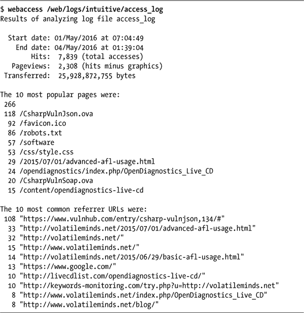

## 10

**互联网服务器管理**


管理 web 服务器和服务的工作通常与设计和管理网站内容的工作完全分开。尽管前一章提供的工具主要面向 web 开发人员和其他内容管理者，本章将展示如何分析 web 服务器日志文件、镜像网站以及监控网络健康状况。

### #73 探索 Apache 的 access_log

如果你运行的是 Apache 或类似的 web 服务器，使用 *Common Log Format*，你可以通过 shell 脚本进行快速的统计分析。在标准配置下，服务器会为站点写入 *access_log* 和 *error_log* 文件（通常位于 */var/log*，但这可能依赖于系统）。如果你有自己的服务器，应该务必归档这些宝贵的信息。

表 10-1 列出了 *access_log* 文件中的字段。

**表 10-1：** *access_log* 文件中的字段值

| **列** | **值** |
| --- | --- |
| 1 | 访问服务器的主机 IP |
| 2–3 | HTTPS/SSL 连接的安全信息 |
| 4 | 特定请求的日期和时区偏移 |
| 5 | 调用的方法 |
| 6 | 请求的 URL |
| 7 | 使用的协议 |
| 8 | 结果代码 |
| 9 | 传输的字节数 |
| 10 | 引荐来源 |
| 11 | 浏览器标识字符串 |

*access_log* 中的典型一行如下所示：

```
65.55.219.126 - - [04/Jul/2016:14:07:23 +0000] "GET /index.rdf HTTP/1.0" 301
310 "-" "msnbot-UDiscovery/2.0b (+http://search.msn.com/msnbot.htm)""
```

结果代码（第 8 个字段）为`301`表示请求被认为是成功的。引荐来源（第 10 个字段）表示用户在请求页面之前访问的页面的 URL。十年前，这通常是上一页面的 URL；现在，由于隐私原因，通常是`"-"`，就像你在这里看到的。

站点的命中次数可以通过对日志文件进行行计数来确定，而文件中条目的日期范围可以通过比较第一行和最后一行来确认。

```
$ wc -l access_log
   7836 access_log
$ head -1 access_log ; tail -1 access_log
69.195.124.69 - - [29/Jun/2016:03:35:37 +0000] ...
65.55.219.126 - - [04/Jul/2016:14:07:23 +0000] ...
```

考虑到这些要点，清单 10-1 中的脚本可以从 Apache 格式的 *access_log* 文件中生成多个有用的统计数据。该脚本期望我们在第一章中编写的`scriptbc`和`nicenumber`脚本已经存在于`PATH`中。

#### *代码*

```
   #!/bin/bash
   # webaccess--Analyzes an Apache-format access_log file, extracting
   #   useful and interesting statistics

   bytes_in_gb=1048576

 # You will want to change the following to match your own hostname
   #   to help weed out internally referred hits in the referrer analysis.
   host="intuitive.com"

   if [ $# -eq 0 ] ; then
     echo "Usage: $(basename $0) logfile" >&2
     exit 1
   fi

   if [ ! -r "$1" ] ; then
     echo "Error: log file $1 not found." >&2
     exit 1
   fi

➊ firstdate="$(head -1 "$1" | awk '{print $4}' | sed 's/\[//')"
   lastdate="$(tail -1 "$1" | awk '{print $4}' | sed 's/\[//')"

   echo "Results of analyzing log file $1"
   echo ""
   echo "  Start date: $(echo $firstdate|sed 's/:/ at /')"
   echo "    End date: $(echo $lastdate|sed 's/:/ at /')"

➋ hits="$(wc -l < "$1" | sed 's/[^[:digit:]]//g')"

   echo "        Hits: $(nicenumber $hits) (total accesses)"

➌ pages="$(grep -ivE '(.gif|.jpg|.png)' "$1" | wc -l | sed 's/[^[:digit:]]//g')"

   echo "   Pageviews: $(nicenumber $pages) (hits minus graphics)"

   totalbytes="$(awk '{sum+=$10} END {print sum}' "$1")"

   /bin/echo -n " Transferred: $(nicenumber $totalbytes) bytes "

   if [ $totalbytes -gt $bytes_in_gb ] ; then
     echo "($(scriptbc $totalbytes / $bytes_in_gb) GB)"
   elif [ $totalbytes -gt 1024 ] ; then
     echo "($(scriptbc $totalbytes / 1024) MB)"
   else
     echo ""
   fi

   # Now let's scrape the log file for some useful data.

   echo ""
   echo "The 10 most popular pages were:"

➍ awk '{print $7}' "$1" | grep -ivE '(.gif|.jpg|.png)' | \
     sed 's/\/$//g' | sort | \
     uniq -c | sort -rn | head -10

   echo ""

   echo "The 10 most common referrer URLs were:"

➎ awk '{print $11}' "$1" | \
     grep -vE "(^\"-\"$|/www.$host|/$host)" | \
     sort | uniq -c | sort -rn | head -10

   echo ""
   exit 0
```

*清单 10-1：* `*webaccess*` *脚本*

#### *工作原理*

让我们将每个块看作是一个独立的小脚本。例如，前几行通过简单地抓取文件中第一行和最后一行的第四个字段，提取`firstdate`和`lastdate` ➊。通过使用`wc` ➋来计算文件中的行数，从而计算命中次数，页面查看次数则通过简单地从命中数中减去图像文件的请求（即扩展名为*.gif*、*.jpg*或*.png*的文件）来计算。传输的总字节数是通过将每行第 10 个字段的值相加，再调用`nicenumber`以便以更吸引人的方式呈现。

为了计算最受欢迎的页面，首先我们从日志文件中提取出所有请求的页面，然后筛选出所有的图片文件 ➌。接着，我们使用 `uniq -c` 对每一行进行排序，并计算每一行出现的次数。最后，我们再排序一次，确保最常出现的行排在前面。在代码中，这整个过程位于 ➍。

请注意，我们确实对内容进行了些许规范化：`sed` 命令会去除末尾的斜杠，确保 `/subdir/` 和 `/subdir` 被视为相同的请求。

类似于提取 10 个最受请求页面的部分，第 ➎ 部分提取了引荐信息。

这会从日志文件中提取第 11 个字段，筛选掉来自当前主机的引荐条目以及值为 `"-"` 的条目，后者是当 web 浏览器阻止引荐数据时发送的值。然后，代码将结果输入到相同的 `sort|uniq -c|sort -rn|head -10` 序列中，获取 10 个最常见的引荐网址。

#### *运行脚本*

要运行此脚本，只需将 Apache（或其他常见日志格式）日志文件的名称作为唯一参数传递。

#### *结果*

在典型日志文件上运行此脚本的结果非常有帮助，如清单 10-2 所示。



*清单 10-2：在 Apache 访问日志上运行* `*webaccess*` *脚本*

#### *修改脚本*

分析 Apache 日志文件的一大挑战是，有些情况下两个不同的 URL 会指向相同的页面；例如，*/custer/* 和 */custer/index.html* 是同一个页面。计算最受欢迎的 10 个页面时，应该考虑到这一点。`sed` 命令执行的转换已经确保了 */custer* 和 */custer/* 不会被单独处理，但要知道一个目录的默认文件名可能会有点复杂（尤其是因为这可能是 web 服务器的特定配置）。

通过将前 10 个最受欢迎的引荐网址的 URL 修剪为仅包含基础域名（例如，*slashdot.org*），你可以让这些引荐网址更有用。接下来的脚本 #74 将探讨从引荐字段中可以获取的更多信息。下次你的网站被“slashdotted”时，你就没有理由不知道了！

### #74 理解搜索引擎流量

脚本 #73 可以提供一些指向你网站的搜索引擎查询的总体概览，但进一步的分析不仅能揭示哪些搜索引擎正在带来流量，还能显示通过搜索引擎访问你网站的用户输入了哪些关键词。这些信息对于了解你的网站是否已被搜索引擎正确索引至关重要。此外，它还可以为改善你网站搜索引擎排名和相关性提供起点，尽管如前所述，这些附加信息正慢慢被 Apache 和网页浏览器开发者弃用。清单 10-3 详细描述了从 Apache 日志中获取这些信息的 Shell 脚本。

#### *代码*

```
   #!/bin/bash
   # searchinfo--Extracts and analyzes search engine traffic indicated in the
   #   referrer field of a Common Log Format access log

   host="intuitive.com"    # Change to your domain, as desired.
   maxmatches=20
   count=0
   temp="/tmp/$(basename $0).$$"

   trap "$(which rm) -f $temp" 0

   if [ $# -eq 0 ] ; then
     echo "Usage: $(basename $0) logfile"  >&2
     exit 1
   fi
   if [ ! -r "$1" ] ; then
     echo "Error: can't open file $1 for analysis." >&2
     exit 1
   fi

➊ for URL in $(awk '{ if (length($11) > 4) { print $11 } }' "$1" | \
     grep -vE "(/www.$host|/$host)" | grep '?')
   do
➋   searchengine="$(echo $URL | cut -d/ -f3 | rev | cut -d. -f1-2 | rev)"
     args="$(echo $URL | cut -d\? -f2 | tr '&' '\n' | \
        grep -E '(^q=|^sid=|^p=|query=|item=|ask=|name=|topic=)' | \
➌      sed -e 's/+/ /g' -e 's/%20/ /g' -e 's/"//g' | cut -d= -f2)"
     if [ ! -z "$args" ] ; then
       echo "${searchengine}:      $args" >> $temp
➍   else
       # No well-known match, show entire GET string instead...
       echo "${searchengine}       $(echo $URL | cut -d\? -f2)" >> $temp
     fi
     count="$(( $count + 1 ))"
   done

   echo "Search engine referrer info extracted from ${1}:"

   sort $temp | uniq -c | sort -rn | head -$maxmatches | sed 's/^/ /g'

   echo ""

   echo Scanned $count entries in log file out of $(wc -l < "$1") total.

   exit 0
```

*清单 10-3：*`*searchinfo*`*脚本*

#### *工作原理*

该脚本的主要`for`循环 ➊ 提取日志文件中所有有效的引用来源条目，这些条目的字符串长度大于 4，引用来源域名与`$host`变量不匹配，并且引用来源字符串中包含`?`，表示用户进行了搜索。

然后，脚本尝试识别引用来源的域名以及用户输入的搜索值 ➋。对数百个搜索查询的检查表明，常见的搜索网站使用少量的常见变量名。例如，在雅虎上搜索时，搜索字符串是`p=pattern`。谷歌和 MSN 使用`q`作为搜索变量名。`grep`调用包含了`p`、`q`和其他最常见的搜索变量名。

`sed` ➌ 的调用清理结果搜索模式，替换`+`和`%20`序列为空格，并去除引号，`cut`命令返回等号后的所有内容。换句话说，代码仅返回搜索词。

紧接着这些行的条件语句测试`args`变量是否为空。如果为空（即查询格式不是已知格式），则说明这是一个我们未见过的搜索引擎，因此我们输出整个模式，而不是仅输出清理后的模式值。

#### *运行脚本*

要运行此脚本，只需在命令行中指定 Apache 或其他常见日志格式文件的名称（参见清单 10-4）。

**注意**

*这是本书中最慢的脚本之一，因为它会生成大量子 Shell 来执行各种任务，因此如果运行时间较长，请不要感到惊讶。*

#### *结果*

```
$ searchinfo /web/logs/intuitive/access_log
Search engine referrer info extracted from access_log:
      771
        4 online reputation management akado
        4 Names Hawaiian Flowers
        3 norvegian star
        3 disneyland pirates of the caribbean
        3 disney california adventure
        3 colorado railroad
        3 Cirque Du Soleil Masks
        2 www.baskerballcamp.com
        2 o logo
        2 hawaiian flowers
        2 disneyland pictures pirates of the caribbean
        2 cirque
        2 cirqu
        2 Voil%C3%A0 le %3Cb%3Elogo du Cirque du Soleil%3C%2Fb%3E%21
        2 Tropical Flowers Pictures and Names
        2 Hawaiian Flowers
        2 Hawaii Waterfalls
        2 Downtown Disney Map Anaheim

Scanned 983 entries in log file out of 7839 total.
```

*清单 10-4：在 Apache 日志上运行*`*searchinfo*`*脚本*

#### *破解脚本*

修改该脚本的一种方法是跳过最可能不是来自搜索引擎的引用来源 URL。要做到这一点，只需注释掉 ➍ 处的`else`子句。

另一种处理此任务的方法是搜索来自特定搜索引擎的所有访问，该搜索引擎作为第二个命令参数传递，然后比较指定的搜索字符串。核心的`for`循环将像这样更改：

```
for URL in $(awk '{ if (length($11) > 4) { print $11 } }' "$1" | \
  grep $2)
do
  args="$(echo $URL | cut -d\? -f2 | tr '&' '\n' | \
     grep -E '(^q=|^sid=|^p=|query=|item=|ask=|name=|topic=)' | \
     cut -d= -f2)"
  echo $args  | sed -e 's/+/ /g' -e 's/"//g' >> $temp
  count="$(( $count + 1 ))"
done
```

你还需要调整使用信息，使其提到新的第二个参数。再次强调，由于 Web 浏览器，尤其是 Google，在报告 Referer 信息时发生的变化，这个脚本最终将仅报告空白数据。如你所见，在这个日志文件中，匹配的条目中有 771 个没有报告来源页面，因此没有提供关于关键字使用的有用信息。

### #75 探索 Apache error_log

就像脚本 #73 在第 235 页中展示的那样，Apache 或兼容 Apache 的 Web 服务器的常规访问日志中包含有趣且有用的统计信息，本脚本则从*error_log*文件中提取关键信息。

对于那些没有自动将日志分为独立的*access_log*和*error_log*组件的 Web 服务器，你有时可以通过根据日志中每个条目的返回代码（第 9 字段）来过滤，从而将中央日志文件分为这些组件：

```
awk '{if (substr($9,0,1) <= "3") { print $0 } }' apache.log > access_log
awk '{if (substr($9,0,1)  > "3") { print $0 } }' apache.log > error_log
```

以 4 或 5 开头的返回代码表示失败（400 系列是客户端错误，500 系列是服务器错误），而以 2 或 3 开头的返回代码表示成功（200 系列是成功消息，300 系列是重定向）。

其他生成包含成功和错误的单一中央日志文件的服务器，通过`[error]`字段值来表示错误消息条目。在这种情况下，可以使用`grep '[error]'`来创建错误日志，使用`grep -v '[error]'`来创建访问日志。

无论你的服务器是否自动生成错误日志，还是需要通过查找包含`'[error]'`字符串的条目来创建自己的错误日志，错误日志中的几乎所有内容与访问日志的内容都不同，包括日期的指定方式。

```
$ head -1 error_log
[Mon Jun 06 08:08:35 2016] [error] [client 54.204.131.75] File does not exist:
/var/www/vhosts/default/htdocs/clientaccesspolicy.xml
```

在访问日志中，日期作为一个紧凑的单字段值指定，没有空格；而错误日志则使用五个字段。此外，错误日志中的条目没有统一的方案，其中字段的词语/字符串位置在空格分隔条目中始终标识特定字段，而是具有一个有意义的错误描述，该描述的长度是可变的。仅查看这些描述值，就能发现令人惊讶的变化，如下所示：

```
$ awk '{print $9" "$10" "$11" "$12 }' error_log | sort -u
File does not exist:
Invalid error redirection directive:
Premature end of script
execution failure for parameter
premature EOF in parsed
script not found or
malformed header from script
```

其中一些错误需要手动检查，因为它们可能很难追溯到引起问题的网页。

清单 10-5 中的脚本专注于最常见的问题——特别是`文件不存在`错误——然后生成一个不匹配已知错误情况的其他错误日志条目的转储。

#### *代码*

```
   #!/bin/bash
   # weberrors--Scans through an Apache error_log file, reports the
   #   most important errors, and then lists additional entries

   temp="/tmp/$(basename $0).$$"

   # For this script to work best, customize the following three lines for
   #   your own installation.

   htdocs="/usr/local/etc/httpd/htdocs/"
   myhome="/usr/home/taylor/"
   cgibin="/usr/local/etc/httpd/cgi-bin/"

   sedstr="s/^/  /g;s|$htdocs|[htdocs]  |;s|$myhome|[homedir] "
   sedstr=$sedstr"|;s|$cgibin|[cgi-bin] |"

   screen="(File does not exist|Invalid error redirect|premature EOF"
   screen=$screen"|Premature end of script|script not found)"

   length=5                # Entries per category to display

   checkfor()
   {
     grep "${2}:" "$1" | awk '{print $NF}' \
       | sort | uniq -c | sort -rn | head -$length | sed "$sedstr" > $temp

     if [ $(wc -l < $temp) -gt 0 ] ; then
       echo ""
       echo "$2 errors:"
       cat $temp
     fi
   }

   trap "$(which rm) -f $temp" 0

   if [ "$1" = "-l" ] ; then
     length=$2; shift 2
   fi

   if [ $# -ne 1 -o ! -r "$1" ] ; then
     echo "Usage: $(basename $0) [-l len] error_log" >&2
     exit 1
   fi

   echo Input file $1 has $(wc -l < "$1") entries.

   start="$(grep -E '\[.*:.*:.*\]' "$1" | head -1 \
      | awk '{print $1" "$2" "$3" "$4" "$5 }')"
   end="$(grep -E '\[.*:.*:.*\]' "$1" | tail -1 \
      | awk '{print $1" "$2" "$3" "$4" "$5 }')"

   /bin/echo -n "Entries from $start to $end"

   echo ""

   ### Check for various common and well-known errors:

   checkfor "$1" "File does not exist"
   checkfor "$1" "Invalid error redirection directive"
   checkfor "$1" "Premature EOF"
   checkfor "$1" "Script not found or unable to stat"
   checkfor "$1" "Premature end of script headers"

➊ grep -vE "$screen" "$1" | grep "\[error\]" | grep "\[client " \
     | sed 's/\[error\]/\`/' | cut -d\` -f2 | cut -d\ -f4- \
➋   | sort | uniq -c | sort -rn | sed 's/^/ /' | head -$length > $temp

   if [ $(wc -l < $temp) -gt 0 ] ; then
     echo ""
     echo "Additional error messages in log file:"
     cat $temp
   fi

   echo ""
   echo "And non-error messages occurring in the log file:"

➌ grep -vE "$screen" "$1" | grep -v "\[error\]" \
     | sort | uniq -c | sort -rn \
     | sed 's/^/  /' | head -$length

   exit 0
```

*清单 10-5：* `*weberrors*` *脚本*

#### *工作原理*

该脚本通过扫描错误日志，查找在 `checkfor` 函数中指定的五种错误，利用 `awk` 调用 `$NF`（表示该输入行中的字段数）提取每个错误行的最后一个字段。然后，使用 `sort | uniq -c | sort -rn` ➋ 将输出排序，便于提取该类问题中最常见的错误。

为了确保只显示那些与错误类型匹配的内容，每个特定的错误搜索会保存到临时文件中，然后测试该文件是否为空，只有在文件非空时才会输出消息。所有这些操作都通过脚本顶部附近的 `checkfor()` 函数精心完成。

脚本的最后几行识别出那些脚本没有检查的、但仍符合标准 Apache 错误日志格式的最常见错误。位于 ➊ 的 `grep` 调用是一个更长管道的一部分。

接着，脚本识别出那些脚本没有检查的、*不*符合标准 Apache 错误日志格式的最常见错误。再次提醒，位于 ➌ 的 `grep` 调用是一个更长管道的一部分。

#### *运行脚本*

这个脚本应该传入一个标准 Apache 格式的错误日志路径作为唯一参数，见示例 10-6。如果传入 `-l length` 参数，它将显示每种错误类型检查的 `length` 个匹配项，而不是默认的每种错误类型五个条目。

#### *结果*

```
$ weberrors error_log
Input file error_log has 768 entries.
Entries from [Mon Jun 05 03:35:34 2017] to [Fri Jun 09 13:22:58 2017]

File does not exist errors:
       94 /var/www/vhosts/default/htdocs/mnews.htm
       36 /var/www/vhosts/default/htdocs/robots.txt
       15 /var/www/vhosts/default/htdocs/index.rdf
       10 /var/www/vhosts/default/htdocs/clientaccesspolicy.xml
        5 /var/www/vhosts/default/htdocs/phpMyAdmin

Script not found or unable to stat errors:
        1 /var/www/vhosts/default/cgi-binphp5
        1 /var/www/vhosts/default/cgi-binphp4
        1 /var/www/vhosts/default/cgi-binphp.cgi
        1 /var/www/vhosts/default/cgi-binphp-cgi
        1 /var/www/vhosts/default/cgi-binphp

Additional error messages in log file:
        1 script '/var/www/vhosts/default/htdocs/wp-trackback.php' not found
or unable to stat
        1 script '/var/www/vhosts/default/htdocs/sprawdza.php' not found or
unable to stat
        1 script '/var/www/vhosts/default/htdocs/phpmyadmintting.php' not
found or unable to stat

And non-error messages occurring in the log file:
        6 /usr/lib64/python2.6/site-packages/mod_python/importer.py:32:
DeprecationWarning: the md5 module is deprecated; use hashlib instead
        6   import md5
        3 [Sun Jun 25 03:35:34 2017] [warn] RSA server certificate CommonName
(CN) `Parallels Panel' does NOT match server name!?
        1 sh: /usr/local/bin/zip: No such file or directory
        1 sh: /usr/local/bin/unzip: No such file or directory
```

*示例 10-6：在 Apache 错误日志上运行* `*weberrors*` *脚本*

### #76 使用远程归档避免灾难

无论你是否拥有一个全面的备份策略，使用单独的异地归档系统备份一些关键文件都是一种很好的保险政策。即使只有一个包含所有客户地址的关键文件，或者你的发票，甚至是你与心上人之间的邮件，偶尔使用异地归档也能在你最意想不到的时候拯救你的“命运”。

这听起来比实际复杂，因为正如你在示例 10-7 中看到的，“归档”实际上只是通过电子邮件发送到远程邮箱的文件，这个邮箱甚至可以是 Yahoo! 或 Gmail 邮箱。文件列表保存在一个单独的数据文件中，并且允许使用 shell 通配符。文件名可以包含空格，这会让脚本变得相对复杂，正如你将看到的那样。

#### *代码*

```
   #!/bin/bash
   # remotebackup--Takes a list of files and directories, builds a single
   #   compressed archive, and then emails it off to a remote archive site
   #   for safekeeping. It's intended to be run every night for critical
   #   user files but not intended to replace a more rigorous backup scheme.

   outfile="/tmp/rb.$$.tgz"
   outfname="backup.$(date +%y%m%d).tgz"
   infile="/tmp/rb.$$.in"

   trap "$(which rm) -f $outfile $infile" 0

   if [ $# -ne 2 -a $# -ne 3 ] ; then
     echo "Usage: $(basename $0) backup-file-list remoteaddr {targetdir}" >&2
     exit 1
   fi

   if [ ! -s "$1" ] ; then
     echo "Error: backup list $1 is empty or missing" >&2
     exit 1
   fi

   # Scan entries and build fixed infile list. This expands wildcards
   #   and escapes spaces in filenames with a backslash, producing a
   #   change: "this file" becomes this\ file, so quotes are not needed.

➊ while read entry; do
     echo "$entry" | sed -e 's/ /\\ /g' >> $infile
   done < "$1"

   # The actual work of building the archive, encoding it, and sending it

➋ tar czf - $(cat $infile) | \
     uuencode $outfname | \
     mail -s "${3:-Backup archive for $(date)}" "$2"

   echo "Done. $(basename $0) backed up the following files:"
   sed 's/^/   /' $infile
   /bin/echo -n "and mailed them to $2 "

   if [ ! -z "$3" ] ; then
     echo "with requested target directory $3"
   else
     echo ""
   fi

   exit 0
```

*示例 10-7：* `*remotebackup*` *脚本*

#### *原理*

在基本有效性检查后，脚本处理包含关键文件列表的文件，这个文件作为第一个命令行参数传入，确保文件名中嵌入的空格在 `while` 循环 ➊ 中能够正常工作。它通过在每个空格前加上反斜杠来实现。然后，使用 `tar` 命令 ➋ 构建归档文件，因为 `tar` 无法读取标准输入的文件列表，因此必须通过 `cat` 调用将文件名传递给它。

`tar`命令自动压缩归档文件，随后使用`uuencode`确保最终的归档数据文件可以成功通过电子邮件发送而不被损坏。最终结果是，远程地址接收到一封带有`tar`归档的 uuencoded 附件的电子邮件。

**注意**

*`*uuencode*` *程序将二进制数据打包，以便它可以安全地通过电子邮件系统传输而不会被损坏。有关更多信息，请参见* `*man uuencode*` *。*

#### *运行脚本*

这个脚本需要两个参数：一个文件名，包含待归档和备份的文件列表，以及压缩后的`uuencoded`归档文件的目标电子邮件地址。文件列表可以像这样简单：

```
$ cat filelist
*.sh
*.html
```

#### *结果*

清单 10-8 详细说明了如何运行`remotebackup`shell 脚本，以备份当前目录中的所有 HTML 和 shell 脚本文件，并打印结果。

```
$ remotebackup filelist taylor@intuitive.com
Done. remotebackup backed up the following files:
   *.sh
   *.html
and mailed them to taylor@intuitive.com
$ cd /web
$ remotebackup backuplist taylor@intuitive.com mirror
Done. remotebackup backed up the following files:
   ourecopass
and mailed them to taylor@intuitive.com with requested target directory mirror
```

*清单 10-8：运行* `*remotebackup*` *脚本以备份 HTML 和 shell 脚本文件*

#### *破解脚本*

首先，如果你有现代版本的`tar`，你可能会发现它有能力从`stdin`读取文件列表（例如，GNU 的`tar`有一个`-T`标志，可以从标准输入读取文件列表）。在这种情况下，通过更新文件列表给`tar`的方式，可以简化脚本。

然后，文件归档可以被解压或简单地保存，并且每周运行一个邮箱修剪脚本，以确保邮箱不会变得过大。清单 10-9 详细说明了一个示例修剪脚本。

```
#!/bin/bash
# trimmailbox--A simple script to ensure that only the four most recent
#   messages remain in the user's mailbox. Works with Berkeley Mail
#   (aka Mailx or mail)--will need modifications for other mailers!

keep=4  # By default, let's just keep around the four most recent messages.

totalmsgs="$(echo 'x' | mail | sed -n '2p' | awk '{print $2}')"

if [ $totalmsgs -lt $keep ] ; then
  exit 0          # Nothing to do
fi

topmsg="$(( $totalmsgs - $keep ))"

mail > /dev/null << EOF
d1-$topmsg
q
EOF

exit 0
```

*清单 10-9：* `*trimmailbox*` *脚本，需与* `*remotebackup*` *脚本一起使用*

这个简洁的脚本删除邮箱中除了最新邮件（`$keep`）以外的所有邮件。显然，如果你使用的是像 Hotmail 或 Yahoo! Mail 这样的邮箱来存储归档文件，这个脚本就无法工作，你将需要偶尔登录去修剪邮箱。

### #77 监控网络状态

Unix 中最令人困惑的管理工具之一是`netstat`，这有点遗憾，因为它提供了关于网络吞吐量和性能的很多有用信息。使用`-s`标志时，`netstat`输出关于你计算机上支持的每种协议的大量信息，包括 TCP、UDP、IPv4/v6、ICMP、IPsec 等。对于典型配置来说，大多数协议是不相关的；通常你想要检查的协议是 TCP。这个脚本分析 TCP 协议流量，确定数据包传输失败的百分比，并在任何值超出范围时发出警告。

将网络性能分析作为长期性能的快照是有用的，但分析数据的更好方法是通过趋势。如果你的系统在传输中定期有 1.5%的丢包率，而在过去三天中，丢包率已经上升到 7.8%，那么一个问题正在形成，需要更详细地分析。

因此，该脚本由两部分组成。第一部分，如列表 10-10 所示，是一个短脚本，旨在每 10 到 30 分钟运行一次，记录关键统计数据到日志文件中。第二个脚本（列表 10-11）解析日志文件，报告典型的性能数据以及任何异常或其他随时间增加的值。

**警告**

*某些版本的 Unix 无法按原样运行此代码（尽管我们已经确认它在 OS X 上能够正常工作）！事实证明，Linux 和 Unix 版本之间的 `netstat` 命令输出格式存在相当大的差异（许多细微的空格变化或拼写略有不同）。标准化 `netstat` 输出将是一个非常有用的脚本。*

#### *代码*

```
   #!/bin/bash
   # getstats--Every 'n' minutes, grabs netstats values (via crontab)

   logfile="/Users/taylor/.netstatlog"   # Change for your configuration.
   temp="/tmp/getstats.$$.tmp"

   trap "$(which rm) -f $temp" 0

   if [ ! -e $logfile ] ; then     # First time run?
     touch $logfile
   fi
   ( netstat -s -p tcp > $temp

   # Check your log file the first time this is run: some versions of netstat
   #   report more than one line, which is why the "| head -1" is used here.
➊ sent="$(grep 'packets sent' $temp | cut -d\  -f1 | sed \
   's/[^[:digit:]]//g' | head -1)"
   resent="$(grep 'retransmitted' $temp | cut -d\  -f1 | sed \
   's/[^[:digit:]]//g')"
   received="$(grep 'packets received$' $temp | cut -d\  -f1 | \
     sed 's/[^[:digit:]]//g')"
   dupacks="$(grep 'duplicate acks' $temp | cut -d\  -f1 | \
     sed 's/[^[:digit:]]//g')"
   outoforder="$(grep 'out-of-order packets' $temp | cut -d\  -f1 | \
     sed 's/[^[:digit:]]//g')"
   connectreq="$(grep 'connection requests' $temp | cut -d\  -f1 | \
     sed 's/[^[:digit:]]//g')"
   connectacc="$(grep 'connection accepts' $temp | cut -d\  -f1 | \
     sed 's/[^[:digit:]]//g')"
   retmout="$(grep 'retransmit timeouts' $temp | cut -d\  -f1 | \
     sed 's/[^[:digit:]]//g')"

   /bin/echo -n "time=$(date +%s);"
➋ /bin/echo -n "snt=$sent;re=$resent;rec=$received;dup=$dupacks;"
   /bin/echo -n "oo=$outoforder;creq=$connectreq;cacc=$connectacc;"
   echo "reto=$retmout"

   ) >> $logfile

   exit 0
```

*列表 10-10：* `*getstats*` *脚本*

第二个脚本，如列表 10-11 所示，分析 `netstat` 的历史日志文件。

```
   #!/bin/bash
   # netperf--Analyzes the netstat running performance log, identifying
   #   important results and trends

   log="/Users/taylor/.netstatlog"     # Change for your configuration.
   stats="/tmp/netperf.stats.$$"
   awktmp="/tmp/netperf.awk.$$"

   trap "$(which rm) -f $awktmp $stats" 0

   if [ ! -r $log ] ; then
     echo "Error: can't read netstat log file $log" >&2
     exit 1
   fi

   # First, report the basic statistics of the latest entry in the log file...

   eval $(tail -1 $log)    # All values turn into shell variables.

➌ rep="$(scriptbc -p 3 $re/$snt\*100)"
   repn="$(scriptbc -p 4 $re/$snt\*10000 | cut -d. -f1)"
   repn="$(( $repn / 100 ))"
   retop="$(scriptbc -p 3 $reto/$snt\*100)";
   retopn="$(scriptbc -p 4 $reto/$snt\*10000 | cut -d. -f1)"
   retopn="$(( $retopn / 100 ))"
   dupp="$(scriptbc -p 3 $dup/$rec\*100)";
   duppn="$(scriptbc -p 4 $dup/$rec\*10000 | cut -d. -f1)"
   duppn="$(( $duppn / 100 ))"
   oop="$(scriptbc -p 3 $oo/$rec\*100)";
   oopn="$(scriptbc -p 4 $oo/$rec\*10000 | cut -d. -f1)"
   oopn="$(( $oopn / 100 ))"

   echo "Netstat is currently reporting the following:"

   /bin/echo -n "  $snt packets sent, with $re retransmits ($rep%) "
   echo "and $reto retransmit timeouts ($retop%)"

 /bin/echo -n "  $rec packets received, with $dup dupes ($dupp%)"
   echo " and $oo out of order ($oop%)"
   echo "   $creq total connection requests, of which $cacc were accepted"
   echo ""

   ## Now let's see if there are any important problems to flag.

   if [ $repn -ge 5 ] ; then
     echo "*** Warning: Retransmits of >= 5% indicates a problem "
     echo "(gateway or router flooded?)"
   fi
   if [ $retopn -ge 5 ] ; then
     echo "*** Warning: Transmit timeouts of >= 5% indicates a problem "
     echo "(gateway or router flooded?)"
   fi
   if [ $duppn -ge 5 ] ; then
     echo "*** Warning: Duplicate receives of >= 5% indicates a problem "
     echo "(probably on the other end)"
   fi
   if [ $oopn -ge 5 ] ; then
     echo "*** Warning: Out of orders of >= 5% indicates a problem "
     echo "(busy network or router/gateway flood)"
   fi

   # Now let's look at some historical trends...

   echo "Analyzing trends..."

   while read logline ; do
       eval "$logline"
       rep2="$(scriptbc -p 4 $re / $snt \* 10000 | cut -d. -f1)"
       retop2="$(scriptbc -p 4 $reto / $snt \* 10000 | cut -d. -f1)"
       dupp2="$(scriptbc -p 4 $dup / $rec \* 10000 | cut -d. -f1)"
       oop2="$(scriptbc -p 4 $oo / $rec \* 10000 | cut -d. -f1)"
       echo "$rep2 $retop2 $dupp2 $oop2" >> $stats
     done < $log

   echo ""

   # Now calculate some statistics and compare them to the current values.

   cat << "EOF" > $awktmp
       { rep += $1; retop += $2; dupp += $3; oop += $4 }
   END { rep /= 100; retop /= 100; dupp /= 100; oop /= 100;
         print "reps="int(rep/NR) ";retops=" int(retop/NR) \
            ";dupps=" int(dupp/NR) ";oops="int(oop/NR) }
   EOF

➍ eval $(awk -f $awktmp < $stats)

   if [ $repn -gt $reps ] ; then
     echo "*** Warning: Retransmit rate is currently higher than average."
     echo "    (average is $reps% and current is $repn%)"
   fi

   if [ $retopn -gt $retops ] ; then
     echo "*** Warning: Transmit timeouts are currently higher than average."
     echo "    (average is $retops% and current is $retopn%)"
   fi
   if [ $duppn -gt $dupps ] ; then
     echo "*** Warning: Duplicate receives are currently higher than average."
     echo "    (average is $dupps% and current is $duppn%)"
   fi
   if [ $oopn -gt $oops ] ; then
     echo "*** Warning: Out of orders are currently higher than average."
     echo "    (average is $oops% and current is $oopn%)"
   fi
   echo \(Analyzed $(wc -l < $stats) netstat log entries for calculations\)
   exit 0
```

*列表 10-11：* `*netperf*` *脚本，供与* `*getstats*` *脚本一起使用*

#### *工作原理*

`netstat` 程序非常有用，但它的输出可能令人畏惧。列表 10-12 显示了输出的前 10 行。

```
$ netstat -s -p tcp | head
tcp:
    51848278 packets sent
        46007627 data packets (3984696233 bytes)
        16916 data packets (21095873 bytes) retransmitted
        0 resends initiated by MTU discovery
        5539099 ack-only packets (2343 delayed)
        0 URG only packets
        0 window probe packets
        210727 window update packets
        74107 control packets
```

*列表 10-12：运行* `*netstat*` *以获取 TCP 信息*

第一步是提取仅包含有趣和重要的网络性能统计数据的条目。这是 `getstats` 的主要工作，它通过将 `netstat` 命令的输出保存到临时文件 *$temp* 中，然后遍历 *$temp* 计算关键值，例如发送和接收的总包数。比如在 ➊ 处的代码获取了发送的包数。

`sed` 调用会移除任何非数字值，以确保没有标签或空格会成为结果值的一部分。然后，所有提取的值都以 `var1Name=var1Value; var2Name=var2Value;` 的格式写入 *netstat.log* 日志文件中。这个格式将使我们稍后能够在 *netstat.log* 中对每一行使用 `eval`，并在 shell 中实例化所有变量：


`netperf` 脚本负责繁重的工作，它解析 *netstat.log* 文件，并报告最新的性能数据以及任何异常或其他随时间增加的值。`netperf` 脚本通过将重传包数除以发送的包数，并将结果乘以 100 来计算当前的重传百分比。重传百分比的整数版本是通过将重传包数除以发送的总包数，乘以 10,000，然后再除以 100 来计算的 ➌。

如你所见，脚本中变量的命名方案以分配给各个 `netstat` 值的缩写开头，这些值存储在 `getstats` 脚本结束时的 *netstat.log* 中 ➋。这些缩写包括 `snt`、`re`、`rec`、`dup`、`oo`、`creq`、`cacc` 和 `reto`。在 `netperf` 脚本中，所有表示总发送或接收数据包的十进制百分比的变量，都会在这些缩写后加上 `p` 后缀；表示整数百分比的变量则加上 `pn` 后缀。之后，在 `netperf` 脚本中，`ps` 后缀用于表示在最终计算中使用的百分比摘要（平均值）变量。  

`while` 循环逐个处理 *netstat.log* 中的每个条目，计算四个关键百分位变量（`re`、`retr`、`dup` 和 `oo`，分别代表重传、传输超时、重复包和乱序包）。所有结果都会写入 `$stats` 临时文件，然后 `awk` 脚本会将 `$stats` 中的每一列求和，并通过将总和除以文件中的记录数（`NR`）来计算每列的平均值。  

➍ 位置的 `eval` 行将各部分联系在一起。`awk` 调用接收由 `while` 循环生成的统计摘要（`$stats`），并利用保存在 `$awktmp` 文件中的计算结果输出 `variable=value` 序列。这些 `variable=value` 序列随后通过 `eval` 语句被引入到 shell 中，从而实例化 `reps`、`retops`、`dupps` 和 `oops` 变量，分别代表平均重传、平均重传超时、平均重复包和平均乱序包。当前的百分位值可以与这些平均值进行比较，以发现可能的问题趋势。  

#### *运行脚本*

为了让 `netperf` 脚本正常工作，它需要 *netstat.log* 文件中的信息。这些信息是通过设置一个 `crontab` 条目来调用 `getstats`，并按照某种频率生成的。在现代的 OS X、Unix 或 Linux 系统上，以下 `crontab` 条目可以正常工作，当然，你需要使用适合你系统的脚本路径：  

```
*/15 * * * *       /home/taylor/bin/getstats
```

它每 15 分钟会生成一条日志文件条目。为了确保必要的文件权限，最好在第一次运行 `getstats` 之前，手动创建一个空的日志文件。  

```
$ sudo touch /Users/taylor/.netstatlog
$ sudo chmod a+rw /Users/taylor/.netstatlog
```

现在，`getstats` 程序应该可以顺利运行，逐步构建你系统网络性能的历史数据图景。要分析日志文件的内容，运行 `netperf` 而不带任何参数。  

#### *结果*  

首先，让我们查看 *.netstatlog* 文件，参见列表 10-13。  

  

*列表 10-13：*.netstatlog* 文件的最后三行，这是由运行`*crontab*`条目的`*getstats*`脚本在定期间隔下生成的结果。  

看起来不错。列表 10-14 展示了运行 `netperf` 后的结果以及它的报告内容。  

```
$ netperf
Netstat is currently reporting the following:
  52170128 packets sent, with 16927 retransmits (0%) and 2722 retransmit timeouts (0%)
  20290926 packets received, with 129910 dupes (.600%) and 18064 out of order (0%)
   39841 total connection requests, of which 123 were accepted

Analyzing trends...

(Analyzed 6 netstat log entries for calculations)
```

*Listing 10-14: 运行* `*netperf*` *脚本分析* .netstatlog *文件*

#### *修改脚本*

您可能已经注意到，`getstats` 脚本并没有使用人类可读的日期格式，而是使用纪元时间保存条目到 *.netstatlog* 文件中，纪元时间表示自 1970 年 1 月 1 日以来经过的秒数。例如，1,063,983,000 秒表示 2003 年 9 月底的一天。使用纪元时间将使得增强此脚本变得更加容易，因为它能够计算读取之间的时间差。

### #78 按进程名称调整任务优先级

有很多时候，改变任务的优先级是非常有用的，无论是聊天服务器应该只使用“空闲”周期，MP3 播放器应用程序不那么重要，文件下载变得不那么重要，还是实时 CPU 监视器需要提高优先级。您可以使用 `renice` 命令更改进程的优先级；然而，它要求您指定进程 ID，这可能会有些麻烦。一种更有用的方法是使用像 Listing 10-15 中的脚本，它通过匹配进程名称到进程 ID，自动调整指定应用程序的优先级。

#### *代码*

```
#!/bin/bash
# renicename--Renices the job that matches the specified name

user=""; tty=""; showpid=0; niceval="+1"        # Initialize

while getopts "n:u:t:p" opt; do
  case $opt in
   n ) niceval="$OPTARG";               ;;
   u ) if [ ! -z "$tty" ] ; then
         echo "$0: error: -u and -t are mutually exclusive." >&2
         exit 1
       fi
       user=$OPTARG                     ;;
   t ) if [ ! -z "$user" ] ; then
         echo "$0: error: -u and -t are mutually exclusive." >&2
         exit 1
       fi
       tty=$OPTARG                      ;;
   p ) showpid=1;                       ;;
   ? ) echo "Usage: $0 [-n niceval] [-u user|-t tty] [-p] pattern" >&2
       echo "Default niceval change is \"$niceval\" (plus is lower" >&2
       echo "priority, minus is higher, but only root can go below 0)" >&2
       exit 1
  esac
done
shift $(($OPTIND - 1))  # Eat all the parsed arguments.

if [ $# -eq 0 ] ; then
  echo "Usage: $0 [-n niceval] [-u user|-t tty] [-p] pattern" >&2
  exit 1
fi

if [ ! -z "$tty" ] ; then
  pid=$(ps cu -t $tty | awk "/ $1/ { print \\$2 }")
elif [ ! -z "$user" ] ; then
  pid=$(ps cu -U $user | awk "/ $1/ { print \\$2 }")
else
  pid=$(ps cu -U ${USER:-LOGNAME} | awk "/ $1/ { print \$2 }")
fi

if [ -z "$pid" ] ; then
  echo "$0: no processes match pattern $1" >&2
  exit 1
elif [ ! -z "$(echo $pid | grep ' ')" ] ; then
  echo "$0: more than one process matches pattern ${1}:"
  if [ ! -z "$tty" ] ; then
    runme="ps cu -t $tty"
  elif [ ! -z "$user" ] ; then
    runme="ps cu -U $user"
  else
    runme="ps cu -U ${USER:-LOGNAME}"
  fi
  eval $runme | \
      awk "/ $1/ { printf \"  user %-8.8s pid %-6.6s job %s\n\", \
      \$1,\$2,\$11 }"
  echo "Use -u user or -t tty to narrow down your selection criteria."
elif [ $showpid -eq 1 ] ; then
  echo $pid
else
  # Ready to go. Let's do it!
  /bin/echo -n "Renicing job \""
  /bin/echo -n $(ps cp $pid | sed 's/ [ ]*/ /g' | tail -1 |  cut -d\  -f6-)
  echo "\" ($pid)"
  renice $niceval $pid
fi

exit 0
```

*Listing 10-15: The* `*renicename*` *脚本*

#### *工作原理*

该脚本借鉴了 Script #47 在 第 150 页 上的代码，该脚本执行了类似的进程名称到进程 ID 的映射——不过那个脚本是结束作业，而不是仅仅降低它们的优先级。

在这种情况下，您不想不小心调整多个匹配进程的优先级（例如，想象一下 `renicename -n 10 "*" `），因此如果匹配的进程超过一个，脚本会失败。否则，它会进行指定的更改，并允许实际的 `renice` 程序报告可能遇到的任何错误。

#### *运行脚本*

运行此脚本时，您有多个可选选项：`-n val` 允许您指定所需的 `nice`（作业优先级）值。默认值为 `niceval=1`。`-u user` 标志允许按用户限制匹配的进程，而 `-t tty` 允许按终端名称进行类似的筛选。要仅查看匹配的进程 ID，而不实际更改应用程序的优先级，可以使用 `-p` 标志。除了一个或多个标志，`renicename` 还需要一个命令模式，该模式将与系统上运行的进程名称进行比较，以确定哪些进程匹配。

#### *结果*

首先，Listing 10-16 展示了当有多个匹配的进程时会发生什么情况。

```
$ renicename "vi"
renicename: more than one process matches pattern vi:
  user taylor    pid 6584    job vi
  user taylor    pid 10949   job vi
Use -u user or -t tty to narrow down your selection criteria.
```

*Listing 10-16: 运行* `*renicename*` *脚本，使用具有多个进程 ID 的进程名称*

随后，我们退出了其中一个进程，并运行了相同的命令。

```
$ renicename "vi"
Renicing job "vi" (6584)
```

我们可以确认这个操作是有效的，并且通过使用 `-l` 标志配合指定的进程 ID 来查看我们的 `vi` 进程已被优先处理，如 Listing 10-17 所示。

```
$ ps –l 6584
UID   PID  PPID     F CPU PRI NI        SZ   RSS WCHAN    S   ADDR TTY                 TIME CMD
501  6584  1193  4006   0  30  1➊  2453832  1732     -  SN+  0 ttys000  0:00.01 vi wasting.time
```

*Listing 10-17: 确认进程已被正确调整优先级*

从`ps`命令的这个超宽输出格式很难读取，但请注意第 7 列是`NI`，对于这个进程，它的值是 1 ➊。检查你运行的其他进程，你会看到它们的优先级都是 0，这是标准用户的优先级水平。

#### *破解脚本*

这个脚本的一个有趣补充是另一个脚本，它监视任何启动的时间敏感程序，并自动将其调整为设定的优先级。如果某些互联网服务或应用程序消耗大量 CPU 资源，这可能会很有帮助。例如，列表 10-18 使用`renicename`将进程名映射到进程 ID，然后检查进程当前的 nice 级别。如果作为命令参数指定的 nice 级别低于当前级别（即优先级较低），则会发出`renice`命令。

```
#!/bin/bash
# watch_and_nice--Watches for the specified process name and renices it
#   to the desired value when seen.

if [ $# -ne 2 ] ; then
  echo "Usage: $(basename $0) desirednice jobname" >&2
  exit 1
fi

pid="$(renicename -p "$2")"

if [ "$pid" == "" ] ; then
  echo "No process found for $2"
  exit 1
fi

if [ ! -z "$(echo $pid | sed 's/[0-9]*//g')" ] ; then
  echo "Failed to make a unique match in the process table for $2" >&2
  exit 1
fi

currentnice="$(ps -lp $pid | tail -1 | awk '{print $6}')"

if [ $1 -gt $currentnice ] ; then
  echo "Adjusting priority of $2 to $1"
  renice $1 $pid
fi

exit 0
```

*列表 10-18：* `*watch_and_nice*` *脚本*

在`cron`作业中，可以使用此脚本确保某些应用在启动后几分钟内被推送到所需的优先级。
