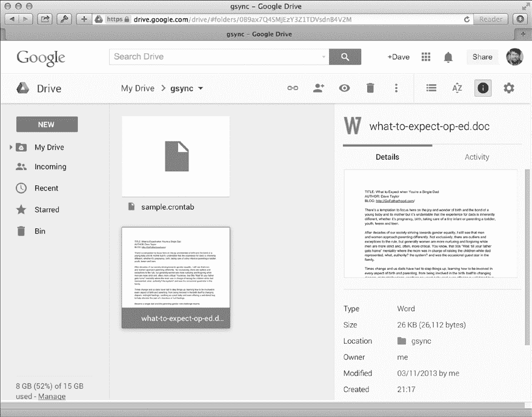

## 13

**与云合作**


过去十年中最显著的变化之一是互联网作为一种设备的崛起，最显著的是基于互联网的数据存储。最初它只是用于备份，但现在随着移动技术的同步崛起，基于云的存储对于日常磁盘使用变得非常有用。使用云的应用包括音乐库（iTunes 的 iCloud）和文件档案（Windows 系统上的 OneDrive 和 Android 设备上的 Google Drive）。

现在一些系统完全围绕云构建。一个例子是谷歌的 Chrome 操作系统，这是一个围绕网页浏览器构建的完整工作环境。十年前，这听起来可能很荒谬，但当你考虑到如今你在浏览器中花费的时间……嗯，库比蒂诺或雷蒙德的那些人再也不会笑了。

云计算非常适合 Shell 脚本的扩展，因此让我们开始吧。本章中的脚本将主要关注 OS X，但这些概念可以很容易地在 Linux 或其他 BSD 系统上复制。

### #89 保持 Dropbox 运行

Dropbox 是众多有用的云存储系统之一，尤其受到使用多种设备的用户欢迎，因为它在 iOS、Android、OS X、Windows 和 Linux 平台上都有广泛的支持。理解这一点很重要，虽然 Dropbox 是一个云存储系统，但在你的设备上显示的部分只是一个小型应用，旨在后台运行，将你的系统连接到 Dropbox 的基于互联网的服务器，并提供一个相对简单的用户界面。如果 Dropbox 应用没有在后台运行，我们就无法成功地将文件从计算机备份并同步到 Dropbox。

因此，测试程序是否在运行是通过调用`ps`来实现的，具体如 Listing 13-1 所示。

#### *代码*

```
   #!/bin/bash
   # startdropbox--Makes sure Dropbox is running on OS X

   app="Dropbox.app"
   verbose=1

   running="$(➊ps aux | grep -i $app | grep -v grep)"

   if [ "$1" = "-s" ] ; then         # -s is for silent mode.
     verbose=0
   fi

   if [ ! -z "$running" ] ; then
     if [ $verbose -eq 1 ] ; then
       echo "$app is running with PID $(echo $running | cut -d\  -f2)"
     fi
   else
     if [ $verbose -eq 1 ] ; then
       echo "Launching $app"
     fi
➋   open -a $app
   fi

   exit 0
```

*Listing 13-1：`*startdropbox*`脚本*

#### *它是如何工作的*

脚本中有两行关键代码，分别用➊和➋标出。第一行调用`ps`命令➊，然后使用一系列`grep`命令查找指定的应用——*Dropbox.app*——并同时将自身从结果中过滤掉。如果结果字符串不为零，则表示 Dropbox 程序正在运行并且是守护进程（*守护进程*是指一种设计用于 24/7 在后台运行并执行不需要用户干预的有用任务的程序），此时我们就完成了。

如果*Dropbox.app*程序没有运行，那么在 OS X 上调用`open` ➋可以找到该应用并启动它。

#### *运行脚本*

使用`-s`标志来消除输出时，没有任何内容可见。然而，默认情况下，仍然会有简短的状态输出，如 Listing 13-2 所示。

#### *结果*

```
$ startdropbox
Launching Dropbox.app
$ startdropbox
Dropbox.app is running with PID 22270
```

*Listing 13-2：运行`*startdropbox*`脚本以启动 Dropbox.app*

#### *黑客脚本*

对此做的事情不多，但如果你想在 Linux 系统上运行脚本，请确保已从官方 Dropbox 网站安装了官方的 Dropbox 包。你可以通过 `startdropbox` 来启动 Dropbox（配置完成后）。

### #90 同步 Dropbox

使用像 Dropbox 这样的基于云的系统，编写一个脚本来保持文件夹或文件集的同步是显而易见的。Dropbox 通过在系统上模拟本地硬盘驱动器的方式，保持 Dropbox 目录中所有内容在本地和云端的同步。

在清单 13-3 中，`syncdropbox` 脚本利用这一点，通过提供一种简便的方法将充满文件的目录或指定的文件集复制到 Dropbox 云端。在前一种情况下，目录中的每个文件都会被复制过来；在后一种情况下，指定的每个文件都会被放入 Dropbox 的 *sync* 文件夹中。

#### *代码*

```
   #!/bin/bash
   # syncdropbox--Synchronize a set of files or a specified folder with Dropbox.
   #   This is accomplished by copying the folder into ~/Dropbox or the set of
   #   files into the sync folder in Dropbox and then launching Dropbox.app
   #   as needed.

 name="syncdropbox"
   dropbox="$HOME/Dropbox"
   sourcedir=""
   targetdir="sync"    # Target folder on Dropbox for individual files

   # Check starting arguments.

   if [ $# -eq 0 ] ; then
     echo "Usage: $0 [-d source-folder] {file, file, file}" >&2
     exit 1
   fi

   if [ "$1" = "-d" ] ; then
     sourcedir="$2"
     shift; shift
   fi

   # Validity checks

   if [ ! -z "$sourcedir" -a $# -ne 0 ] ; then
     echo "$name: You can't specify both a directory and specific files." >&2
     exit 1
   fi

   if [ ! -z "$sourcedir" ] ; then
     if [ ! -d "$sourcedir" ] ; then
       echo "$name: Please specify a source directory with -d." >&2
       exit 1
     fi
   fi

   #######################
   #### MAIN BLOCK
   #######################

   if [ ! -z "$sourcedir" ] ; then
➊   if [ -f "$dropbox/$sourcedir" -o -d "$dropbox/$sourcedir" ] ; then
       echo "$name: Specified source directory $sourcedir already exists." >&2
       exit 1
     fi

     echo "Copying contents of $sourcedir to $dropbox..."
     # -a does a recursive copy, preserving owner info, etc.
     cp -a "$sourcedir" $dropbox
   else
     # No source directory, so we've been given individual files.
     if [ ! -d "$dropbox/$targetdir" ] ; then
       mkdir "$dropbox/$targetdir"
       if [ $? -ne 0 ] ; then
         echo "$name: Error encountered during mkdir $dropbox/$targetdir." >&2
         exit 1
       fi
     fi
     # Ready! Let's copy the specified files.

➋ cp -p -v "$@" "$dropbox/$targetdir"
   fi

   # Now let's launch the Dropbox app to let it do the actual sync, if needed.
   exec startdropbox -s
```

*清单 13-3：* `*syncdropbox*` *脚本*

#### *它是如何工作的*

清单 13-3 中的绝大多数内容是在测试错误条件，这虽然繁琐，但对于确保脚本正确调用并且不会弄乱任何东西非常有用。（我们可不希望丢失数据！）

复杂性来自于测试表达式，比如 ➊ 处的测试。这会测试 Dropbox 文件夹中的目标目录 `$sourcedir` 是不是一个文件（这会很奇怪）或一个已存在的目录。可以理解为“如果 `$dropbox/$sourcedir` 存在为文件 或者 存在为目录，那么...”

在另一个有趣的行中，我们调用 `cp` ➋ 来复制单独指定的文件。你可能需要查看 `cp` 的手册页，看看这些标志都有什么作用。记住，`$@` 是命令调用时指定的所有位置参数的快捷方式。

#### *运行脚本*

和书中许多脚本一样，你可以不带参数地调用此脚本，快速复习一下如何使用它，正如清单 13-4 所展示的那样。

```
$ syncdropbox
Usage: syncdropbox [-d source-folder] {file, file, file}
```

*清单 13-4：打印 `*syncdropbox*` 脚本的使用方法*

#### *结果*

现在在清单 13-5 中，让我们将一个特定的文件推送到 Dropbox 进行同步和备份。

```
$ syncdropbox test.html
test.html -> /Users/taylor/Dropbox/sync/test.html
$
```

*清单 13-5：将特定文件同步到 Dropbox*

这很简单，而且有用，因为你会记得，这样就能让指定的文件——或者充满文件的目录——可以从任何已登录你 Dropbox 账户的设备上轻松访问。

#### *破解脚本*

当指定一个目录但该目录已存在于 Dropbox 时，比较本地和 Dropbox 目录的内容会比仅仅打印错误并失败更有用。此外，在指定一组文件时，能够指定 Dropbox 文件层级中的目标目录也会非常有用。

**其他云服务**

将这前两个脚本适配到微软的 OneDrive 服务或苹果的 iCloud 服务是相当简单的，因为它们具有相同的基本功能。主要的区别是命名约定和目录位置。哦，还有就是 OneDrive 在某些情况下是 OneDrive（例如需要运行的应用程序），而在其他情况下是 SkyDrive（例如你主目录中的目录）。不过，这一切都很容易管理。

### #91 从云照片流创建幻灯片

有些人喜欢 iCloud 的照片备份服务——Photo Stream，而另一些人则觉得它倾向于保存每一张拍摄的照片——甚至是那些从移动设备拍摄的废弃垃圾照片——令人烦恼。不过，将照片同步到喜爱的云备份服务还是很常见的。缺点是这些文件本质上是隐藏的——因为它们深藏在文件系统中，很多照片幻灯片程序无法自动获取它们。

我们将通过`slideshow`来改进这一点，这是一个简单的脚本（如清单 13-6 所示），它会轮询相机上传文件夹，并显示其中的图片，限制在特定尺寸内。为了实现所需效果，我们可以使用与 ImageMagick 一起提供的`display`工具（ImageMagick 是一组功能强大的工具，你将在下一章中学习更多）。在 OS X 上，`brew`包管理器的用户可以轻松安装 ImageMagick：

```
$ brew install imagemagick --with-x11
```

**注意**

*几年前，苹果停止在其主操作系统中提供 X11——一个流行的 Linux 和 BSD 图形库。为了在 OS X 上使用`*slideshow*`脚本，你需要通过安装 XQuartz 软件包来为 ImageMagick 提供它所需的 X11 库和资源。你可以在官方网站找到有关 XQuartz 的更多信息以及如何安装它：* [`www.xquartz.org/`](https://www.xquartz.org/)。

#### *代码*

```
   #!/bin/bash
   # slideshow--Displays a slide show of photos from the specified directory.
   #   Uses ImageMagick's "display" utility.

   delay=2              # Default delay in seconds
➊ psize="1200x900>"    # Preferred image size for display

   if [ $# -eq 0 ] ; then
     echo "Usage: $(basename $0) watch-directory" >&2
     exit 1
   fi

   watch="$1"

   if [ ! -d "$watch" ] ; then
     echo "$(basename $0): Specified directory $watch isn't a directory." >&2
     exit 1
   fi

   cd "$watch"

   if [ $? -ne 0 ] ; then
     echo "$(basename $0): Failed trying to cd into $watch" >&2
     exit 1
   fi

   suffixes="$(➋file * | grep image | cut -d: -f1 | rev | cut -d. -f1 | \
      rev | sort | uniq | sed 's/^/\*./')"

   if [ -z "$suffixes" ] ; then
     echo "$(basename $0): No images to display in folder $watch" >&2
     exit 1
   fi

   /bin/echo -n "Displaying $(ls $suffixes | wc -l) images from $watch "
➌ set -f ; echo "with suffixes $suffixes" ; set +f

   display -loop 0 -delay $delay -resize $psize -backdrop $suffixes

   exit 0
```

*清单 13-6：* `*slideshow*` *脚本*

#### *工作原理*

清单 13-6 中并没有太多内容，除了弄清楚 ImageMagick 要求的每个参数，以便让`display`命令按预期执行的痛苦过程。整个第十四章都在讲解 ImageMagick，因为这些工具实在太有用了，所以这只是一个前瞻。目前，只需相信这些东西写得很正确，包括看起来很奇怪的图像几何结构`1200x900>` ➊，其中末尾的`>`表示“将图像调整到适应这些尺寸，同时保持与原始几何结构的比例”。

换句话说，一个尺寸为 2200 × 1000 的图像会自动调整大小，以适应 1200 像素宽的限制，垂直尺寸会按比例从 1000 像素缩小到 545 像素。很棒！

该脚本还确保指定目录中存在图像文件，通过`file`命令➋提取所有图像文件，然后通过一条相当复杂的管道序列，将文件名简化为它们的后缀（**.jpg**、**.png**等）。

将这些代码放在 Shell 脚本中的问题是，每次脚本引用星号时，它会扩展为与通配符符号匹配的所有文件名，因此它不会仅仅显示**.jpg*，而是当前目录中所有的*.jpg*文件。这就是为什么脚本暂时禁用*globbing* ➌，即 Shell 将这些通配符扩展为其他文件名的能力。

然而，如果在整个脚本中禁用 globbing，`display`程序会抱怨找不到名为**.jpg*的图像文件。这可就不好了。

#### *运行脚本*

指定一个包含一个或多个图像文件的目录，理想情况下是来自云备份系统（如 OneDrive 或 Dropbox）的照片存档，如列表 13-7 所示。

#### *结果*

```
$ slideshow ~/SkyDrive/Pictures/
Displaying 2252 images from ~/Skydrive/Pictures/ with suffixes *.gif *.jpg *.png
```

*列表 13-7：运行* `*幻灯片放映*` *脚本以显示云存档中的图像*

运行脚本后，一个新窗口应该会弹出，缓慢地循环显示你备份和同步的图像。这将是一个非常方便的脚本，用于分享那些精彩的度假照片！

#### *破解脚本*

你可以做很多事情来让这个脚本更加优雅，其中大部分与让用户指定当前硬编码到`display`调用中的值有关（例如图像分辨率）。特别是，你可以允许使用不同的显示设备，以便将图像推送到第二个屏幕，或者允许用户更改图像之间的延迟时间。

### #92 与 Google Drive 同步文件

Google Drive 是另一个流行的基于云的存储系统。与 Google 办公工具套件紧密集成，它实际上是整个在线编辑和制作系统的门户，这使得它作为同步目标更具吸引力。将一个 Microsoft Word 文件复制到 Google Drive 后，你可以在任何网页浏览器中编辑它，无论它是否在你的电脑上。演示文稿、电子表格甚至照片也一样。真是太有用了！

一个有趣的点是，Google Drive 并不会将 Google Docs 文件存储在你的系统上，而是存储指向云中文档的指针。例如，考虑一下这个：

```
$ cat M3\ Speaker\ Proposals\ \(voting\).gsheet
{"url": "https://docs.google.com/spreadsheet/ccc?key=0Atax7Q4SMjEzdGdxYVVzdXRQ
WVpBUFh1dFpiYlpZS3c&usp=docslist_api", "resource_id": "spreadsheet:0Atax7Q4SMj
EzdGdxYVVzdXRQWVpBUFh1dFpiYlpZS3c"}
```

这肯定不是那个电子表格的内容。

通过一些`curl`的操作，你可能能够编写一个工具来分析这些元数据信息，但让我们先专注于一个稍微简单一点的：一个脚本，让你选择并指定文件，自动将它们镜像到你的 Google Drive 账户中，详细内容见列表 13-8。

#### *代码*

```
   #!/bin/bash
   # syncgdrive--Lets you specify one or more files to automatically copy
   #   to your Google Drive folder, which syncs with your cloud account

   gdrive="$HOME/Google Drive"
   gsync="$gdrive/gsync"
   gapp="Google Drive.app"

   if [ $# -eq 0 ] ; then
     echo "Usage: $(basename $0) [file or files to sync]" >&2
     exit 1
   fi

   # First, is Google Drive running? If not, launch it.
➊ if [ -z "$(ps -ef | grep "$gapp" | grep -v grep)" ] ; then
     echo "Starting up Google Drive daemon..."
     open -a "$gapp"
   fi

   # Now, does the /gsync folder exist?
   if [ ! -d "$gsync" ] ; then
     mkdir "$gsync"
     if [ $? -ne 0 ] ; then
       echo "$(basename $0): Failed trying to mkdir $gsync" >&2
       exit 1
     fi
   fi

   for name  # Loop over the arguments passed to the script.
   do
     echo "Copying file $name to your Google Drive"
     cp -a "$name" "$gdrive/gsync/"
   done

   exit 0
```

*列表 13-8：* `*同步 Google Drive*` *脚本*

#### *它是如何工作的*

如同脚本 #89 在第 300 页的内容， 这个脚本会在复制文件到 Google Drive 文件夹之前，检查特定的云服务守护进程是否在运行。这是在代码块➊中实现的。

为了写出真正整洁的代码，我们可能应该检查 `open` 调用的返回代码，但我们就把这个留给读者自己练习，好吗？ 

接下来，脚本确保在 Google Drive 上存在一个名为 *gsync* 的子目录，如果需要，它会创建该目录，并使用 `-a` 选项将指定的文件或文件夹复制到其中，以确保保留创建和修改时间。

#### *运行脚本*

只需指定一个或多个你希望与 Google Drive 账户同步的文件，脚本就会自动完成所有幕后工作，确保同步成功。

#### *结果*

这个其实很酷。指定一个你希望复制到 Google Drive 的文件，就像列表 13-9 中所展示的那样。

```
$ syncgdrive sample.crontab
Starting up Google Drive daemon...
Copying file sample.crontab to your Google Drive
$ syncgdrive ~/Documents/what-to-expect-op-ed.doc
Copying file /Users/taylor/Documents/what-to-expect-op-ed.doc to your Google
Drive
```

*列表 13-9：启动 Google Drive 并使用* `*syncgdrive*` *脚本同步文件*

注意，第一次运行时，它还必须启动 Google Drive 守护进程。等待几秒钟，让文件复制到云存储系统后，它们会出现在 Google Drive 的 Web 界面上，如图 13-1 所示。



*图 13-1:* Sample.crontab *和与 Google Drive 自动同步的办公文档将在线显示。*

#### *破解脚本*

这里有点虚假广告：当你指定要同步的文件时，脚本并不会*保持*文件与未来的更改同步；它只会复制文件一次，完成任务。如果你想要做一个有趣的黑客项目，可以创建一个更强大的版本，在其中指定你希望保持备份的文件，并定期检查这些文件，将任何新文件复制到 *gsync* 目录。

### #93 计算机说。。。

OS X 包含一个复杂的语音合成系统，可以告诉你系统的当前状态。通常，它位于“辅助功能”选项中，但你可以用支持语音的电脑做很多事情，比如朗读错误信息或大声读取文件内容。

事实证明，所有这些强大的功能——还有一堆有趣的语音——都可以通过 OS X 中名为 `say` 的内置工具从命令行访问。你可以通过以下命令来测试它：

```
$ say "You never knew I could talk to you, did you?"
```

我们知道你会觉得这很有趣！

内置程序可以做很多事情，但这也是一个完美的机会，可以编写一个封装脚本，使得更容易查看已安装的语音并进行每个语音的演示。列表 13-10 中的脚本并不替代 `say` 命令；它只是让命令更易于使用（这是本书中的一个常见主题）。

#### *代码*

```
   #!/bin/bash
   # sayit--Uses the "say" command to read whatever's specified (OS X only)

   dosay="$(which say) --quality=127"
   format="$(which fmt) -w 70"

   voice=""                # Default system voice
   rate=""                 # Default to the standard speaking rate

   demovoices()
   {
     # Offer up a sample of each available voice.

➊   voicelist=$( say -v \? | grep "en_" | cut -c1-12 \
       | sed 's/ /_/;s/ //g;s/_$//')

     if [ "$1" = "list" ] ; then
       echo "Available voices: $(echo $voicelist | sed 's/ /, /g;s/_/ /g') \
         | $format"
       echo "HANDY TIP: use \"$(basename $0) demo\" to hear all the voices"
       exit 0
     fi

➋   for name in $voicelist ; do
       myname=$(echo $name | sed 's/_/ /')
       echo "Voice: $myname"
       $dosay -v "$myname" "Hello! I'm $myname. This is what I sound like."
     done

     exit 0
   }

   usage()
   {
     echo "Usage: sayit [-v voice] [-r rate] [-f file] phrase"
     echo "   or: sayit demo"
     exit 0
   }

   while getopts "df:r:v:" opt; do
     case $opt in
       d ) demovoices list    ;;
       f ) input="$OPTARG"    ;;
       r ) rate="-r $OPTARG"  ;;
       v ) voice="$OPTARG"    ;;
     esac
   done

   shift $(($OPTIND - 1))

   if [ $# -eq 0 -a -z "$input" ] ; then
     $dosay "Hey! You haven't given me any parameters to work with."
     echo "Error: no parameters specified. Specify a file or phrase."
     exit 0
   fi

   if [ "$1" = "demo" ] ; then
     demovoices
   fi

   if [ ! -z "$input" ] ; then
     $dosay $rate -v "$voice" -f $input
   else
     $dosay $rate -v "$voice" "$*"
   fi
   exit 0
```

*列表 13-10：* `*sayit*` *脚本*

#### *工作原理*

实际上，安装的语音比总结中列出的还要多（这些只是针对英语优化的语音）。要查看完整的语音列表，我们需要回到原始的`say`命令，并使用`-v \?`参数。接下来是完整语音列表的简略版本：

```
$ say -v \?
Agnes       en_US   # Isn't it nice to have a computer that will talk to you?
Albert      en_US   # I have a frog in my throat. No, I mean a real frog!
Alex        en_US   # Most people recognize me by my voice.
Alice       it_IT   # Salve, mi chiamo Alice e sono una voce italiana.
--snip--
Zarvox      en_US   # That looks like a peaceful planet.
Zuzana      cs_CZ   # Dobrý den, jmenuji se Zuzana. Jsem český hlas.
$
```

我们最喜欢的评论是来自 Pipe Organ（“我们必须为这个阴郁的声音欢欣鼓舞。”）和 Zarvox（“那看起来像是一个和平的星球。”）。

然而，很明显，这个选择的语音太多了。而且其中一些语音真的把英语发音搞得乱七八糟。一种解决方案是通过`"en_"`（或者其他你偏好的语言）来筛选，只获取英语语音。你可以使用`"en_US"`来获取美式英语，但其他英语语音也值得一听。我们在➊处得到了所有语音的完整列表。

我们在这一块代码的结尾包括了复杂的`sed`替换序列，因为它不是一个格式良好的列表：有单个词的名称（Fiona）和两个词的名称（Bad News），但是空格也被用来创建列数据。为了解决这个问题，每行中的第一个空格被转换为下划线，所有其他空格则被去除。如果语音的名称是一个单词，它将看起来像这样：`"Ralph_"`，然后最后的`sed`替换将去除任何尾随的下划线。在这个过程中，两个词的名称会有一个下划线，所以它们在输出给用户时需要修正。然而，这段代码的一个好处是，它使得使用默认的空格作为分隔符时，`while`循环变得更容易编写。

另一个有趣的部分是每个语音按顺序介绍自己——`sayit demo`调用——在➋处。

一旦你理解了`say`命令本身的工作原理，所有这一切都变得相当简单。

#### *运行脚本*

由于这个脚本生成的是音频，在书中你看不到太多内容，而且由于我们还没有《Wicked Cool Shell Scripts》的有声书（你能想象你看不到的所有内容吗？），你需要自己尝试其中的一些内容以体验结果。不过，脚本列出所有已安装语音的功能可以通过示例 13-11 来演示。

#### *结果*

```
$ sayit -d
Available voices: Agnes, Albert, Alex, Bad News, Bahh, Bells, Boing,
Bruce, Bubbles, Cellos, Daniel, Deranged, Fred, Good News, Hysterical,
Junior, Karen, Kathy, Moira, Pipe Organ, Princess, Ralph, Samantha,
Tessa, Trinoids, Veena, Vicki, Victoria, Whisper, Zarvox
HANDY TIP: use "sayit.sh demo" to hear all the different voices
$ sayit "Yo, yo, dog! Whassup?"
$ sayit -v "Pipe Organ" -r 60 "Yo, yo, dog! Whassup?"
$ sayit -v "Ralph" -r 80 -f alice.txt
```

*示例 13-11：运行`*sayit*`脚本以打印支持的语音并进行朗读*

#### *修改脚本*

对`say -v \?`输出的仔细检查表明，至少有一个语音的语言编码错误。Fiona 被列为`en-scotland`，而不是`en_scotland`，后者会更一致（因为 Moira 被列为`en_IE`，而不是`en-irish`或`en-ireland`）。一个简单的解决方法是让脚本同时支持`en_`和`en-`。否则，你可以自己摸索，想想什么时候使用脚本或守护进程与你对话会有用。
