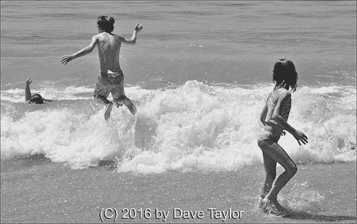
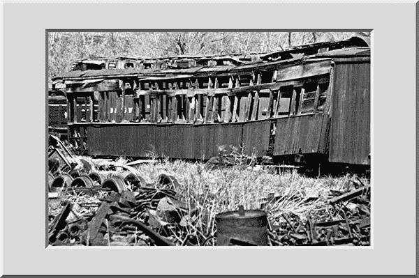
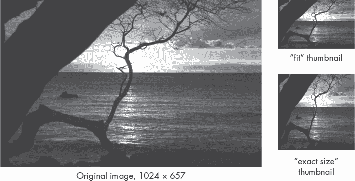

## **IMAGEMAGICK 与图形文件的操作**


在 Linux 世界中，命令行有着极其广泛的功能，但由于它是基于文本的，你不能做太多图形相关的操作。或者说，真的不能吗？

事实证明，强大的命令行工具套件 ImageMagick 几乎适用于每一个命令行环境，从 OS X 到 Linux 以及更多平台。如果你没有在脚本#91 中（第 304 页）已经下载并安装该套件，那么你需要从*[`www.imagemagick.org/`](http://www.imagemagick.org/)*或通过像`apt`、`yum`、`brew`这样的包管理器进行安装。

因为这些工具是为命令行设计的，所以它们占用的磁盘空间非常小，大约只有 19MB（适用于 Windows 版本）。如果你想深入了解一些强大而灵活的软件，还可以获取源代码。开源再次获胜。

### #94 更智能的图像大小分析器

`file`命令提供了确定文件类型的能力，在某些情况下还能获得图像的尺寸。但它常常失败：

```
$ file * | head -4
100_0399.png:    PNG image data, 1024 x 768, 8-bit/color RGBA, non-interlaced
8t grade art1.jpeg:  JPEG image data, JFIF standard 1.01
99icon.gif:          GIF image data, version 89a, 143 x 163
Angel.jpg:           JPEG image data, JFIF standard 1.01
```

PNG 和 GIF 文件是可以处理的，但那更常见的 JPEG 呢？`file`命令无法识别图像的尺寸，真让人烦恼！

#### *代码*

让我们通过一个脚本来解决这个问题（列表 14-1），该脚本使用 ImageMagick 的`identify`工具，更准确地确定图像的尺寸。

```
   #!/bin/bash
   # imagesize--Displays image file information and dimensions using the
   #   identify utility from ImageMagick

   for name
   do
➊   identify -format "%f: %G with %k colors.\n" "$name"
   done
   exit 0
```

*列表 14-1：*`*imagesize*`*脚本*

#### *它是如何工作的*

当你使用`-verbose`标志时，`identify`工具会提取关于每张分析图像的非常大量的信息，如它在仅一个 PNG 图形的输出中所展示的那样：

```
$ identify -verbose testimage.png
Image: testimage.png
  Format: PNG (Portable Network Graphics)
  Class: DirectClass
  Geometry: 1172x158+0+0
  Resolution: 72x72
  Print size: 16.2778x2.19444
  Units: Undefined

  --snip--

  Profiles:
    Profile-icc: 3144 bytes
      IEC 61966-2.1 Default RGB colour space - sRGB
  Artifacts:
    verbose: true
  Tainted: False
  Filesize: 80.9KBB
  Number pixels: 185KB
  Pixels per second: 18.52MB
  User time: 0.000u
  Elapsed time: 0:01.009
  Version: ImageMagick 6.7.7-10 2016-06-01 Q16 http://www.imagemagick.org
$
```

这真是太多数据了，你可能会觉得数据量太大。但如果没有`-verbose`标志，输出就显得相当晦涩：

```
$ identify testimage.png
testimage.png PNG 1172x158 1172x158+0+0 8-bit DirectClass 80.9KB 0.000u
0:00.000
```

我们想找到一个合适的平衡点，输出格式字符串在实现这一目标时非常有帮助。让我们更仔细地看看列表 14-1，专注于脚本中唯一有意义的行➊。

`-format`字符串有近 30 个选项，可以让你从一张或多张图像中精确提取你需要的数据。我们将使用`%f`表示原始文件名，`%G`作为宽度×高度的快捷方式，以及`%k`作为计算值，用来表示图像中使用的最大颜色数。

你可以在*[`www.imagemagick.org/script/escape.php`](http://www.imagemagick.org/script/escape.php)*了解更多关于`-format`选项的信息。

#### *运行脚本*

ImageMagick 完成了所有的工作，所以这个脚本基本上只是编码所需的特定输出格式。正如列表 14-2 所示，获取图像信息既快捷又简单。

#### *结果*

```
$ imagesize * | head -4
100_0399.png: 1024x768 with 120719 colors.
8t grade art1.jpeg: 480x554 with 11548 colors.
dticon.gif: 143x163 with 80 colors.
Angel.jpg: 532x404 with 80045 colors.
$
```

*列表 14-2：运行*`*imagesize*`*脚本*

#### *破解脚本*

当前，我们能看到图像的像素大小和可用的颜色集，但一个非常有用的补充是文件大小。然而，更多的信息会很难阅读，除非对输出进行一些重新格式化。

### #95 水印图像

如果你希望在网上发布时保护你的图像和其他内容，你很可能会失望。任何在线内容都可以被复制，无论你是否设置密码，使用强大的版权声明，甚至是添加阻止用户保存单张图像的代码。事实上，任何在线的东西都需要通过设备的图像缓冲区来呈现，而这个缓冲区可以通过屏幕截图或类似工具被复制。

但一切并非无望。你可以做两件事来保护你的在线图像。一种方法是只发布小尺寸的图像。看看专业摄影师的网站，你就会明白我们是什么意思。通常他们只分享缩略图，因为他们希望你购买更大的图像文件。

水印是另一种解决方案，尽管一些艺术家不愿意直接在照片上添加版权图像或其他标识信息。但使用 ImageMagick，添加水印非常容易，甚至可以批量处理，正如列表 14-3 所示。

#### *代码*

```
   #!/bin/bash
   # watermark--Adds specified text as a watermark on the input image,
   #   saving the output as image+wm

   wmfile="/tmp/watermark.$$.png"
   fontsize="44"                          # Should be a starting arg

   trap "$(which rm) -f $wmfile" 0 1 15    # No temp file left behind

   if [ $# -ne 2 ] ; then
     echo "Usage: $(basename $0) imagefile \"watermark text\"" >&2
     exit 1
   fi

   if [ ! -r "$1" ] ; then
     echo "$(basename $0): Can't read input image $1" >&2
     exit 1
   fi

   # To start, get the dimensions of the image.

➊ dimensions="$(identify -format "%G" "$1")"

   # Let's create the temporary watermark overlay.

➋ convert -size $dimensions xc:none -pointsize $fontsize -gravity south \
     -draw "fill black text 1,1 '$2' text 0,0 '$2' fill white text 2,2 '$2'" \
     $wmfile

   # Now let's composite the overlay and the original file.
➌ suffix="$(echo $1 | rev | cut -d. -f1 | rev)"
   prefix="$(echo $1 | rev | cut -d. -f2- | rev)"

   newfilename="$prefix+wm.$suffix"
➍ composite -dissolve 75% -gravity south $wmfile "$1" "$newfilename"

   echo "Created new watermarked image file $newfilename."

   exit 0
```

*列表 14-3：* `*水印*` *脚本*

#### *工作原理*

这段脚本中的几乎所有混乱代码都来自 ImageMagick。是的，它做了复杂的事情，但即便如此，ImageMagick 的设计和文档让它成为一个很难使用的工具。不过，千万不要因此而放弃，因为 ImageMagick 各种工具的功能和特点非常强大，完全值得花时间去学习。

第一步是获取图像的尺寸➊，以便水印叠加层的尺寸与图像完全匹配。如果不匹配，就会发生问题！

`"%G"`会输出宽度×高度，然后将其作为新画布的尺寸传递给`convert`程序。➋处的`convert`命令是我们从 ImageMagick 文档中复制的，因为老实说，从零开始准确地写出它相当棘手。（要了解`convert -draw`参数语言的具体信息，我们建议你做个快速的在线搜索，或者你也可以直接复制我们的代码！）

新的文件名应该是基础文件名并加上`"+wm"`，这就是➌三行代码的作用。`rev`命令逐字符反转输入，这样`cut -d. -f1`就能获取文件名的后缀，因为我们无法预测文件名中会出现多少个点。然后，后缀被重新排序，并添加`"+wm."`。

最后，我们使用`composite`工具➍将各个部分组合起来，制作带水印的图像。你可以尝试不同的`-dissolve`值，以调整叠加层的透明度。

#### *运行脚本*

脚本接受两个参数：要加水印的图像名称和水印序列的文本。如果水印包含多个单词，请确保整个短语用引号括起来，以便正确传输，正如 列表 14-4 所示。

```
$ watermark test.png "(C) 2016 by Dave Taylor"
Created new watermarked image file test+wm.png.
```

*列表 14-4：运行* `*watermark*` *脚本*

#### *结果*

结果如 图 14-1 所示。



*图 14-1：自动应用水印的图像*

如果遇到 `unable to read font` 错误，那么很可能是缺少了 Ghostscript 软件套件（在 OS X 上比较常见）。为了解决这个问题，可以通过包管理器安装 Ghostscript。例如，使用以下命令在 OS X 上安装 `brew` 包管理器：

```
$ brew install ghostscript
```

#### *修改脚本*

水印的字体大小应根据图像的大小来调整。如果图像宽度为 280 像素，44 点的水印会太大，但如果图像宽度为 3800 像素，44 点可能又会太小。选择合适的字体大小或文本位置可以通过将其添加为另一个参数留给用户。

ImageMagick 还能够识别你系统中的字体，因此允许用户按名称指定用于水印的字体会很有帮助。

### #96 图像框架

包围图像添加边框或华丽框架通常非常有用，ImageMagick 在这方面有很多功能，可以通过 `convert` 工具来实现。问题是，就像这个工具套件的其他部分一样，很难从 ImageMagick 文档中弄清楚如何使用这个工具。

例如，以下是 `-frame` 参数的解释：

*geometry* 参数中的尺寸部分表示图像的宽度和高度上增加的额外宽度和高度。如果 *geometry* 参数中没有给出偏移量，那么添加的边框将是纯色的。如果有 *x* 和 *y* 偏移量，则表示边框的宽度和高度被分割成一个外部的斜角，厚度为 *x* 像素，内部的斜角厚度为 *y* 像素。

明白了吗？

也许直接查看一个示例会更容易。实际上，这正是我们将在这个脚本中通过 `usage()` 函数来做的，正如 列表 14-5 中所示。

#### *代码*

```
   #!/bin/bash
   # frameit--Makes it easy to add a graphical frame around
   #   an image file, using ImageMagick

   usage()
   {
   cat << EOF
   Usage: $(basename $0) -b border -c color imagename
      or  $(basename $0) -f frame  -m color imagename

   In the first case, specify border parameters as size x size or
   percentage x percentage followed by the color desired for the
   border (RGB or color name).

   In the second instance, specify the frame size and offset,
   followed by the matte color.

   EXAMPLE USAGE:
     $(basename $0) -b 15x15 -c black imagename
     $(basename $0) -b 10%x10% -c gray imagename

     $(basename $0) -f 10x10+10+0 imagename
     $(basename $0) -f 6x6+2+2 -m tomato imagename
   EOF
   exit 1
   }

   #### MAIN CODE BLOCK

   # Most of this is parsing starting arguments!

   while getopts "b:c:f:m:" opt; do
     case $opt in
     b ) border="$OPTARG";                ;;
     c ) bordercolor="$OPTARG";           ;;
     f ) frame="$OPTARG";                 ;;
     m ) mattecolor="$OPTARG";            ;;
     ? ) usage;                           ;;
     esac
   done
   shift $(($OPTIND - 1))    # Eat all the parsed arguments.

   if [ $# -eq 0 ] ; then    # No images specified?
     usage
   fi

   # Did we specify a border and a frame?

   if [ ! -z "$bordercolor" -a ! -z "$mattecolor" ] ; then
     echo "$0: You can't specify a color and matte color simultaneously." >&2
     exit 1
   fi

   if [ ! -z "$frame" -a ! -z "$border" ] ; then
     echo "$0: You can't specify a border and frame simultaneously." >&2
     exit 1
   fi

   if [ ! -z "$border" ] ; then
     args="-bordercolor $bordercolor -border $border"
   else
     args="-mattecolor $mattecolor -frame $frame"
   fi

➊ for name
   do
     suffix="$(echo $name | rev | cut -d. -f1 | rev)"
     prefix="$(echo $name | rev | cut -d. -f2- | rev)"
➋   newname="$prefix+f.$suffix"
     echo "Adding a frame to image $name, saving as $newname"
➌   convert $name $args $newname
   done

   exit 0
```

*列表 14-5：* `*frameit*` *脚本*

#### *工作原理*

由于我们已经探讨了如何使用 `getopts` 来优雅地解析复杂的脚本参数，这个包装脚本相当简单，大部分工作发生在最后几行。在 `for` 循环 ➊ 中，创建了指定文件名的新版本，后缀为 `"+f"`（在文件类型后缀之前）。

对于像 *abandoned-train.png* 这样的文件名，后缀将是 `png`，前缀将是 `abandoned-train`。注意，我们丢失了句点（`.`），但当我们构建新文件名时会把它加回去 ➋。完成这一步之后，就只是调用 `convert` 程序并传入所有参数的问题 ➌。

#### *运行脚本*

指定你想要的框架类型——可以使用`-frame`（用于更复杂的 3D 效果）或`-border`（用于简单的边框）——以及适当的 ImageMagick 几何值，喜欢的边框或底色，以及输入的文件名（或文件名列表）。清单 14-6 展示了一个例子。

```
$ frameit -f 15%x15%+10+10 -m black abandoned-train.png
Adding a frame to image abandoned-train.png, saving as abandoned-train+f.png
```

*清单 14-6：运行* `*frameit*` *脚本*

#### *结果*

这个命令的结果如图 14-2 所示。



*图 14-2：博物馆风格的 3D 底框*

#### *修改脚本*

如果你忘记了一个参数，ImageMagick 会给出一个通常令人困惑的错误：

```
$ frameit -f 15%x15%+10+10 alcatraz.png
Adding a frame to image alcatraz.png, saving as alcatraz+f.png
convert: option requires an argument '-mattecolor' @ error/convert.c/
ConvertImageCommand/1936.
```

一个聪明的技巧是在脚本中添加额外的错误测试，以防止用户遭遇这些麻烦，你不觉得吗？

这个脚本可能会在文件名包含空格时出现问题。当然，空格绝不应该出现在用于放置在网页服务器上的文件名中，但你仍然应该修复脚本以解决这个问题。

### #97 创建图像缩略图

我们很惊讶这个问题出现得如此频繁：有人在网页上放了一个极其大的图片，或者通过电子邮件发送了一张远大于计算机屏幕的照片。这不仅让人烦恼，而且浪费带宽和计算机资源。

我们将要实现的这个脚本从你给定的任何图片创建一个缩略图，允许你指定详细的高度和宽度参数，或者简单地指示生成的小图像必须适应某些尺寸。事实上，创建缩略图是官方推荐使用强大的`mogrify`工具的一种方式：

```
$ mkdir thumbs
$ mogrify -format gif -path thumbs -thumbnail 100x100 *.jpg
```

请注意，通常你应该在与原始图像不同的并行目录中创建缩略图，而不是与原始图像放在同一目录下。事实上，`mogrify`工具如果被误用，可能会非常危险，因为它会将目录中的所有图像覆盖成缩略图版本，破坏原始文件。为了解决这个问题，`mogrify`命令会在*thumbs*子目录中创建 100 × 100 的缩略图，将其从 JPEG 格式转换为 GIF 格式。

这很有用，但应用范围仍然较窄。让我们创建一个更通用的缩略图处理脚本，像清单 14-7 中所示的那样。它当然可以用来完成上述任务，但也可以用于许多其他的图像缩小任务。

#### *代码*

```
   #!/bin/bash
   # thumbnails--Creates thumbnail images for the graphics file specified,
   #   matching exact dimensions or not-to-exceed dimensions

   convargs="➊-unsharp 0x.5 -resize"
   count=0; exact=""; fit=""

   usage()
   {
     echo "Usage: $0 (-e|-f) thumbnail-size image [image] [image]" >&2
     echo "-e  resize to exact dimensions, ignoring original proportions" >&2
     echo "-f  fit image into specified dimensions, retaining proportion" >&2
 echo "-s  strip EXIF information (make ready for web use)" >&2
     echo "    please use WIDTHxHEIGHT for requested size (e.g., 100x100)"
     exit 1
   }

   #############
   ## BEGIN MAIN

   if [ $# -eq 0 ] ; then
     usage
   fi

   while getopts "e:f:s" opt; do
     case $opt in
      e ) exact="$OPTARG";                ;;
      f ) fit="$OPTARG";                  ;;
      s ) strip="➋-strip";               ;;
      ? ) usage;                          ;;
     esac
   done
   shift $(($OPTIND - 1))  # Eat all the parsed arguments.

   rwidth="$(echo $exact $fit | cut -dx -f1)"    # Requested width
   rheight="$(echo $exact $fit | cut -dx -f2)"   # Requested height

   for image
   do
     width="$(identify -format "%w" "$image")"
     height="$(identify -format "%h" "$image")"

     # Building thumbnail for image=$image, width=$width, and height=$height
     if [ $width -le $rwidth -a $height -le $rheight ] ; then
       echo "Image $image is already smaller than requested dimensions. Skipped."
     else
       # Build new filename.

       suffix="$(echo $image | rev | cut -d. -f1 | rev)"
       prefix="$(echo $image | rev | cut -d. -f2- | rev)"
       newname="$prefix-thumb.$suffix"

       # Add the "!" suffix to ignore proportions as needed.

➌     if [ -z "$fit" ] ; then
         size="$exact!"
         echo "Creating ${rwidth}x${rheight} (exact size) thumb for file $image"
       else
         size="$fit"
         echo "Creating ${rwidth}x${rheight} (max size) thumb for file $image"
       fi

       convert "$image" $strip $convargs "$size" "$newname"
     fi
     count=$(( $count + 1 ))
   done

   if [ $count -eq 0 ] ; then
     echo "Warning: no images found to process."
   fi

   exit 0
```

*清单 14-7：* `*thumbnails*` *脚本*

#### *工作原理*

ImageMagick 非常复杂，它确实需要像这样的脚本来简化常见任务。在这个脚本中，我们利用了一些额外的功能，包括`-strip` ➋参数，用来去除可交换图像文件格式（EXIF）信息，这些信息对照片归档有用，但在网上使用时并不必要（例如，使用的相机、照片的 ISO 速度、光圈值、地理位置数据等）。

另一个新的标志是`-unsharp` ➊，它是一个滤镜，确保缩小的缩略图不会因为处理而变得模糊。解释这个参数的潜在值及其如何影响结果涉及大量的科学内容，因此为了简化，我们使用了`0x.5`这个参数而不做解释。想了解更多？网络搜索会很快提供相关细节。

理解精确大小的缩略图和适应某些尺寸的缩略图之间的区别，最好的方法是查看实例，就像在图 14-3 中那样。



*图 14-3：指定大小的缩略图（`*-e*` *参数）与按比例适应某些尺寸的缩略图（`*-f*` *参数）之间的区别*

创建精确缩略图和创建适应缩略图之间的区别，仅仅是一个感叹号。这就是在 ➌ 处发生的事情。

除此之外，你在这个脚本中看到的所有内容之前都见过，从文件名的分解和重组，到使用`-format`标志来获取当前图像的高度或宽度。

#### *运行脚本*

列表 14-8 展示了脚本的实际工作过程，它为一张夏威夷的照片创建了不同尺寸的缩略图。

#### *结果*

```
$ thumbnails
Usage: thumbnails (-e|-f) thumbnail-size image [image] [image]
-e  resize to exact dimensions, ignoring original proportions
-f  fit image into specified dimensions, retaining proportion
-s  strip EXIF information (make ready for web use)
    please use WIDTHxHEIGHT for requested size (e.g., 100x100)
$ thumbnails -s -e 300x300 hawaii.png
Creating 300x300 (exact size) thumb for file hawaii.png
$ thumbnails -f 300x300 hawaii.png
Creating 300x300 (max size) thumb for file hawaii.png
$
```

*列表 14-8：运行* `*thumbnails*` *脚本*

#### *破解脚本*

这个脚本的一个整洁的补充功能是能够根据传入的多个尺寸范围生成各种缩略图，例如，你可以一次性创建一个 100 × 100，500 × 500 和壁纸尺寸的 1024 × 768 图像。另一方面，也许这样的任务更适合交给另一个 shell 脚本来完成。

### #98 解读 GPS 地理位置信息

现在大多数照片都是用手机或其他智能数字设备拍摄的，这些设备知道它们的纬度和经度。当然，这涉及到隐私问题，但能够准确定位照片拍摄地点也是非常有趣的。不幸的是，虽然 ImageMagick 的 `identify` 工具可以让你提取这些 GPS 信息，但数据的格式使其难以读取：

```
exif:GPSLatitude: 40/1, 4/1, 1983/100
exif:GPSLatitudeRef: N
exif:GPSLongitude: 105/1, 12/1, 342/100
exif:GPSLongitudeRef: W
```

显示的信息是以度、分、秒的形式呈现的——这很合理——但这种格式不太直观，特别是因为像 Google Maps 或 Bing Maps 这样的站点期望的格式更像是：

```
40 4' 19.83" N, 105 12' 3.42" W
```

这个脚本将 EXIF 信息转换为后者的格式，以便你可以将数据直接复制粘贴到映射程序中。作为这一过程的一部分，脚本需要解决一些基础方程（请注意，`identify` 工具提供的纬度秒数值是 1983/100，等于 19.83）。

#### *代码*

纬度和经度的概念比你想象的要古老。事实上，葡萄牙地图制作人 Pedro Reinel 早在 1504 年就开始在他的地图上绘制纬度线。计算中也涉及一些特殊的数学。幸运的是，我们不需要手动计算。相反，我们只需知道如何将 EXIF 中的纬度和经度值转换为现代地图应用程序所期望的格式，正如 Listing 14-9 中所看到的那样。这个脚本还使用了 Script #8 中的`echon`脚本，第 33 页有详细说明。

```
   #!/bin/bash
   # geoloc--For images that have GPS information, converts that data into
   #   a string that can be fed to Google Maps or Bing Maps

   tempfile="/tmp/geoloc.$$"

   trap "$(which rm) -f $tempfile" 0 1 15

   if [ $# -eq 0 ] ; then
     echo "Usage: $(basename $0) image" >&2
     exit 1
   fi

   for filename
   do
     identify -format➊ "%[EXIF:*]" "$filename" | grep GPSL > $tempfile

➋   latdeg=$(head -1 $tempfile | cut -d, -f1 | cut -d= -f2)
     latdeg=$(scriptbc -p 0 $latdeg)
     latmin=$(head -1 $tempfile | cut -d, -f2)
     latmin=$(scriptbc -p 0 $latmin)
     latsec=$(head -1 $tempfile | cut -d, -f3)
     latsec=$(scriptbc $latsec)
     latorientation=$(sed -n '2p' $tempfile | cut -d= -f2)

     longdeg=$(sed -n '3p' $tempfile | cut -d, -f1 | cut -d= -f2)
     longdeg=$(scriptbc -p 0 $longdeg)
     longmin=$(sed -n '3p' $tempfile | cut -d, -f2)
     longmin=$(scriptbc -p 0 $longmin)
     longsec=$(sed -n '3p' $tempfile | cut -d, -f3)
     longsec=$(scriptbc $longsec)
     longorientation=$(sed -n '4p' $tempfile | cut -d= -f2)

➌   echon "Coords: $latdeg ${latmin}' ${latsec}\" $latorientation, "
     echo "$longdeg ${longmin}' ${longsec}\" $longorientation"

   done

   exit 0
```

*Listing 14-9: The* `*geoloc*` *脚本*

#### *原理*

每次我们探索使用 ImageMagick 时，我们都会发现有新的参数和新的方法来利用它的功能。在这个案例中，事实证明你可以在➊处使用`-format`参数，仅提取与图像关联的 EXIF 信息中的特定匹配参数。

请注意，我们使用`GPSL`作为`grep`的匹配模式，而不是`GPS`。这样我们就不用去筛选其他额外的 GPS 相关信息了。试试去掉`L`，看看会打印出多少其他 EXIF 数据！

之后，就是提取特定的信息字段，并通过`scriptbc`解决数学方程，将数据转换为有意义的格式，就像➋处的`latdeg`行所展示的那样。

到目前为止，使用`cut`的管道命令应该已经不陌生了。这些是非常有用的脚本工具！

一旦所有数据提取完成，所有方程式解决之后，我们需要以符合标准的纬度和经度表示方式重新组合信息，就像我们在➌处所做的那样。这样就完成了！

#### *运行脚本*

给脚本输入一张图像，如果文件包含纬度和经度信息，脚本将其转换为可以被 Google Maps、Bing Maps 或任何其他主要地图程序分析的格式，正如 Listing 14-10 所示。

#### *结果*

```
$ geoloc parking-lot-with-geotags.jpg
Coords: 40 3' 19.73" N, 103 12' 3.72" W
$
```

*Listing 14-10: 运行* `*geoloc*` *脚本*

#### *破解脚本*

如果输入一张没有 EXIF 信息的照片会发生什么呢？这正是脚本应该优雅地处理的问题，而不仅仅是输出一个由于`bc`调用失败而产生的错误信息，或者打印出空的坐标，不是吗？增加一些防御性代码，确保从 ImageMagick 提取的 GPS 位置信息是合理的，将是一个有用的改进。
