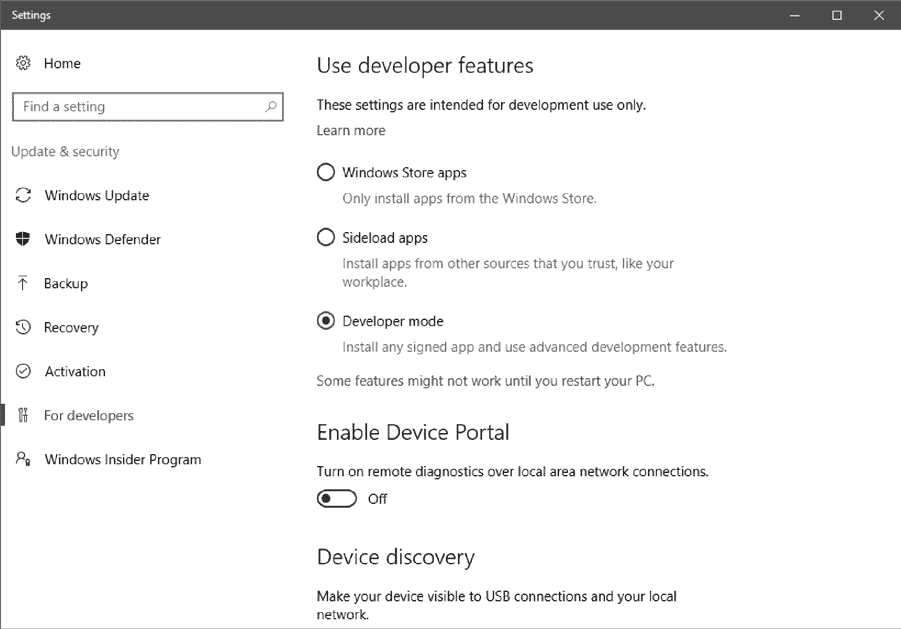
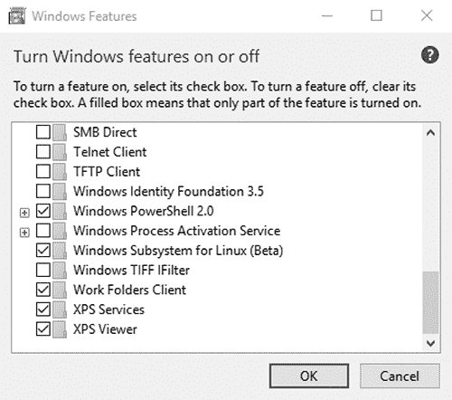
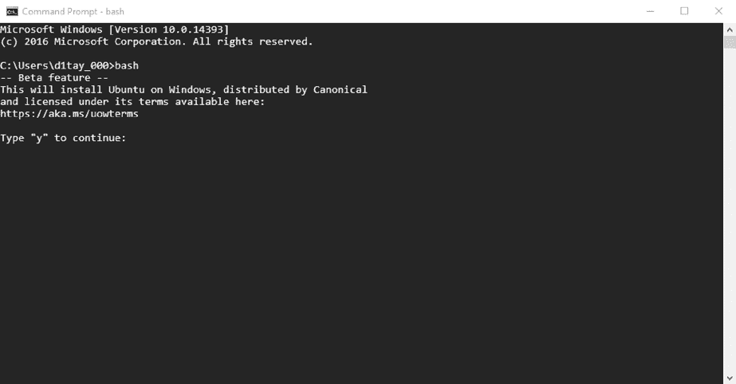
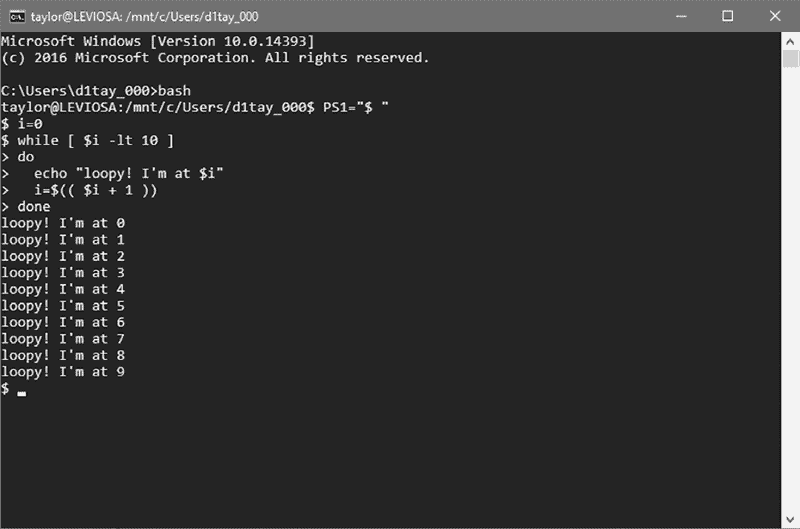

## **A**

**在 Windows 10 上安装 Bash**

就在我们准备出版这本书时，微软发布了适用于 Windows 的 bash shell——我们怎么能在讲解 shell 脚本编程的书中不提及这个新选项呢？

问题在于，你不仅需要运行 Windows 10，还需要安装 Windows 10 周年更新版（版本 14393，发布于 2016 年 8 月 2 日）。你还需要一款支持 x64 的处理器，并且是 Windows Insider 计划的成员。这样你就可以开始安装 bash 了！

首先，加入 Insider 计划，网址是 *[`insider.windows.com/`](https://insider.windows.com/)*。加入是免费的，它将为你提供一个便捷的方式来将 Windows 更新至周年版。Insider 计划有一个 Windows 10 升级助手，能提示你更新，因此使用它来更新至所需的版本。这可能需要一些时间，完成后你需要重启系统。

### **开启开发者模式**

一旦你加入了 Windows Insider 计划并安装了 Windows 10 周年版，就需要进入开发者模式。首先，进入设置并搜索“开发者模式”。此时应该会出现“使用开发者功能”部分。从这里，选择**开发者模式**，如图 A-1 所示。

*图 A-1：在 Windows 10 中启用开发者模式*

当你选择开发者模式时，Windows 可能会警告你，开启开发者模式可能会让你的设备暴露于风险之中。这个警告是有道理的：进入开发者模式确实会让你面临更大的风险，因为你可能会不小心从未批准的站点安装程序。然而，如果你能保持谨慎和警惕，我们鼓励你继续操作，这样至少可以测试一下 bash 系统。点击警告后，Windows 会下载并安装一些额外的软件，安装过程需要几分钟。

接下来，你需要进入 Windows 的传统设置界面，以启用适用于 Linux 的 Windows 子系统。（微软居然有 Linux 子系统，真是太酷了！）通过搜索“开启 Windows 功能”进入该界面。此时会弹出一个包含多个服务和功能的窗口，每个功能旁边都有复选框（见图 A-2）。

不要取消任何勾选项；只需勾选**适用于 Linux 的 Windows 子系统（Beta）**。然后点击**确定**。

系统会提示你重启，以便完全启用 Linux 子系统和新的开发者工具。请按照提示操作。

*图 A-2：开启或关闭 Windows 功能窗口*

### **安装 Bash**

现在你准备好从命令行安装 bash 了！确实是老派操作。在开始菜单中，搜索“命令提示符”并打开命令窗口。然后直接输入 `**bash**`，系统会提示你安装 bash 软件，正如图 A-3 所示。输入 `**y**`，bash 就会开始下载。

*图 A-3：在 Windows 10 的命令行系统中安装 bash*

下载、编译和安装的内容非常多，因此这个步骤也需要一些时间。一旦安装完成，你将被提示输入一个 Unix 用户名和密码。你可以选择任何你喜欢的用户名和密码，它们不需要与你的 Windows 用户名和密码匹配。

现在你已经在 Windows 10 系统中拥有了一个完整的 bash shell，如图 A-4 所示。当你打开命令提示符时，只需输入`bash`，bash 就可以使用了。

*图 A-4：是的，我们正在命令提示符中运行 bash。就在 Windows 10 上！*

### **微软的 Bash Shell 与 Linux 发行版**

到目前为止，Windows 上的 bash 更像是一种好奇心，而不是对 Windows 10 用户非常有用的工具，但了解它还是有好处的。如果你只有 Windows 10 系统可用，并且想要了解更多关于 bash shell 脚本编程的内容，不妨试试看。

如果你对 Linux 更加认真，双系统启动 PC 并安装一个 Linux 发行版，甚至在虚拟机中运行完整的 Linux 发行版（尝试 VMware，它是一个很好的虚拟化解决方案），将会更加适合你。

但仍然要给微软点赞，将 bash 添加到 Windows 10 中。非常酷。
