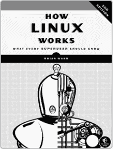
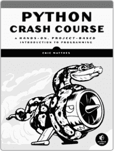
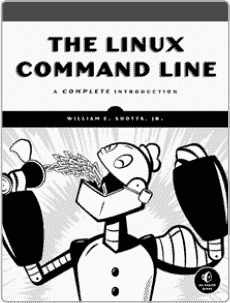
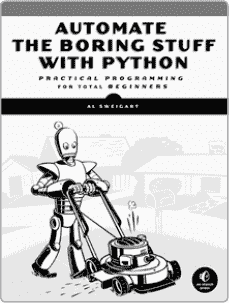
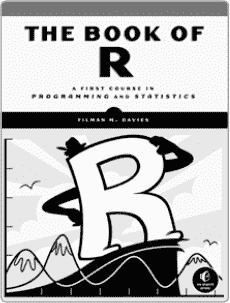
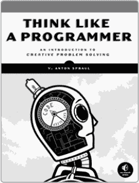

**资源**

访问 *[`www.nostarch.com/wcss2/`](https://www.nostarch.com/wcss2/)* 获取资源、勘误表以及更多信息。

*更多实用书籍来自*  **NO STARCH PRESS**

**《Linux 工作原理，第 2 版》**

**每个超级用户应该知道的知识**

*由* BRIAN WARD 编著

2014 年 11 月，392 页，$39.95

ISBN 978-1-59327-567-9

**《Python 编程速成》**

**基于项目的编程入门**

*由* ERIC MATTHES 编著

2015 年 11 月，560 页，$39.95

ISBN 978-1-59327-603-4

**《Linux 命令行》**

**完整入门指南**

*由* WILLIAM E. SHOTTS, JR. 编著

2012 年 1 月，480 页，$39.95

ISBN 978-1-59327-389-7

**用 Python 自动化无聊的事情**

**完全初学者的实用编程指南**

*由* AL SWEIGART 编著

2015 年 4 月，504 页，$29.95

ISBN 978-1-59327-599-0

**《R 语言宝典》**

**编程与统计学的第一课程**

*由* TILMAN M. DAVIES 编著

2016 年 7 月，832 页，$49.95

ISBN 978-1-59327-651-5

**像程序员一样思考**

**创造性问题解决入门**

*由* V. ANTON SPRAUL 编著

2012 年 8 月，256 页，$34.95

ISBN 978-1-59327-424-5

**电话：**

1.800.420.7240 或

1.415.863.9900

**电子邮件：**

SALES@NOSTARCH.COM

**网站：**

[WWW.NOSTARCH.COM](http://WWW.NOSTARCH.COM)

《*邪恶酷炫的 Shell 脚本，第 2 版*》采用 New Baskerville、Futura、Dogma 和 TheSans Mono Condensed 字体。书籍由 Sheridan Books, Inc. 在密歇根州切尔西印刷和装订。纸张采用 60# Finch Offset 纸，且通过森林管理委员会（FSC）认证。

本书采用平装绑定，书页通过冷凝胶粘合，书块的第一页和最后一页附着在封面上。封面并未直接粘在书脊上，打开时书籍能平摊，书脊不会裂开。
