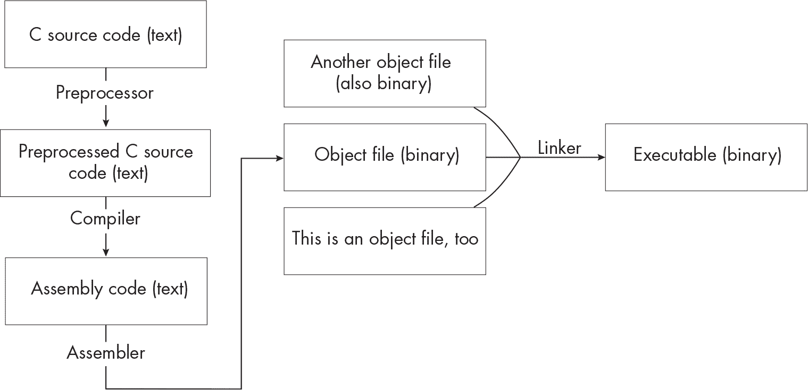

<hgroup>

# <samp class="SANS_Dogma_OT_Bold_B_11">导言</samp>

</hgroup>


当我们讨论编程语言如何工作时，我们往往借用来自幻想小说的比喻：编译器是魔法，而从事编译器工作的人是巫师。龙可能以某种方式参与其中。但在大多数程序员的日常生活中，编译器的表现更像是科幻小说中的通用翻译耳机，而不是魔法物品。它们既不炫目也不戏剧化，不会吸引太多注意力。它们只是悄无声息地在后台运行，将你流利地使用（或输入）的语言翻译成机器的外语。

出于某种原因，科幻小说中的角色似乎很少去想他们的翻译器是如何工作的。但一旦你开始编写代码，就很难不对你的编译器在做什么产生好奇。几年前，这种好奇心占据了我，于是我决定通过编写自己的编译器来深入了解编译器的工作原理。对我来说，编写一个真实编程语言的编译器很重要，这是我自己使用过的语言。而且我希望我的编译器生成的汇编代码可以在没有仿真器或虚拟机的情况下运行。但当我四处查找时，我发现大多数编译器构建指南都使用运行在理想化处理器上的玩具语言。这些指南有些非常优秀，但它们并不是我真正需要的。

当一位朋友把我引导到阿卜杜拉齐兹·古鲁姆（Abdulaziz Ghuloum）的一篇短文《编译器构建的增量方法》（* [`<wbr>scheme2006<wbr>.cs<wbr>.uchicago<wbr>.edu<wbr>/11<wbr>-ghuloum<wbr>.pdf`](http://scheme2006.cs.uchicago.edu/11-ghuloum.pdf) *）时，我终于解开了困境。文中解释了如何将 Scheme 编译为 x86 汇编，从最简单的程序开始，一次添加一个新的语言结构。我并不特别想为 Scheme 编写一个编译器，所以我将这篇论文改编为我更感兴趣的语言：C。随着我在这个项目上的不断推进，我从 x86 切换到了现代版本的 x64 汇编。我还扩展了对 C 的更大子集的支持，并添加了一些优化过程。到这时，我已经远远超出了古鲁姆原始的计划（抱歉，双关一下），但他的基本策略仍然非常有效：一次专注于语言的一个小部分，这使得我能够保持进展，看到自己在不断前进。在这本书中，你将进行同样的项目。在这个过程中，你将深入理解你编写的代码以及它运行的系统。

## <samp class="SANS_Futura_Std_Bold_B_11">本书适合谁阅读</samp>

我写这本书是为了那些对编译器如何工作感到好奇的程序员。许多关于编译器构建的书籍是为大学或研究生水平的课程编写的，但这本书的目的是让那些自己探索这一主题的人也能轻松理解。你不需要具备编译器、解释器或汇编语言的任何先验知识就能完成这个项目。对计算机架构的基本理解是有帮助的，但并非必需；我会在涉及到相关概念时进行讨论，并偶尔推荐一些外部资源以供你了解更多背景信息。话虽如此，这本书并不是为初学编程的人准备的。你应该能够独立编写有实质内容的程序，并且对二进制数字、正则表达式以及图形和树等基本数据结构有所了解。你需要对 C 语言有足够的了解，能读懂并理解小型 C 程序，但不需要是 C 语言专家。在本书中，我们会随着进度一起深入探索语言的方方面面。

尽管本书是针对编程新手编写的，但对于已经有一些编译器经验的人来说同样是值得一读的。也许你曾为大学课程或个人项目实现了一个简单的语言，现在你希望做一些更实际的工作。或者，可能你曾经做过解释器相关的工作，想尝试将程序编译成机器代码。如果你属于这一类人，这本书会涉及一些你已经了解的内容，但也会提供许多新的挑战。至少，我保证你会学到一些关于 C 语言的知识。

## <samp class="SANS_Futura_Std_Bold_B_11">为什么要编写 C 语言编译器？</samp>

我假设你已经对编写编译器的想法有所了解——毕竟你已经拿起了这本书。我想稍微谈一下为什么我们特别要为 C 语言编写一个编译器。简短的回答是，C 是一种（相对）简单的语言，但并不是玩具语言。从本质上讲，即使你从未编写过编译器，C 语言也足够简单，可以实现。但它也是一个特别清晰的例子，展示了编程语言如何受到它们运行的系统和使用者的影响。C 的一些特性会根据你目标的硬件而有所不同；其他特性则在操作系统之间有所差异；还有一些特性则没有明确规定，以便给编译器开发者更多的灵活性。语言中的一些部分是历史遗留物，保留至今是为了支持旧代码，而另一些则是较新的尝试，旨在让 C 语言变得更安全、更可靠。

C 语言中的这些复杂部分值得解决，原因有几个。首先，你将发展出一个清晰的思维模型，理解你的编译器如何与系统中的其他部分协同工作。其次，你会感受到不同群体对语言的不同看法，从试图消除歧义和不一致的规范作者，到寻求性能改进的编译器实现者，再到只想让代码正常工作的普通程序员。

我希望这个项目能让你以不同的方式看待*所有*编程语言：不仅仅是语言标准中规定的固定规则集，而是设计、实现和使用这些语言的人们之间持续的协商。一旦你开始以这种方式看待编程语言，它们就会变得更加丰富、有趣，并且不那么令人沮丧。

## <samp class="SANS_Futura_Std_Bold_B_11">从 10,000 英尺高度看编译过程</samp>

在继续之前，让我们从高层次上了解一下源代码是如何转变为可执行文件的，以及编译器在这个过程中的位置。我们会清理一些术语，并在此过程中稍微回顾一下计算机架构。*编译器*是一个将代码从一种编程语言转换为另一种编程语言的程序。它只是整个系统的一部分（尽管通常是最复杂的部分），该系统负责让你的代码能够运行。我们将构建一个编译器，将 C 程序转换为*汇编代码*，这是我们希望处理器执行的指令的文本表示。

不同的处理器理解不同的指令；我们将专注于 x64 指令集，也叫做 x86-64 或 AMD64\。这是大多数人计算机运行的指令集。（你可能遇到的另一种指令集是 ARM。大多数智能手机和平板电脑使用 ARM 处理器，ARM 处理器也开始出现在笔记本电脑中。）

处理器无法理解文本，因此它无法直接运行我们的汇编代码。我们需要将其转换为*目标代码*，即处理器能够解码并执行的二进制指令。例如，汇编指令<samp class="SANS_TheSansMonoCd_W5Regular_11">ret</samp>对应的字节是<samp class="SANS_TheSansMonoCd_W5Regular_11">0xc3</samp>。*汇编器*处理这个转换，接收汇编程序并输出目标文件。最后，*链接器*将我们需要包含在最终程序中的所有目标文件合并，解决来自其他文件的变量或函数的引用，并添加一些关于如何启动程序的信息。最终的结果是一个可执行文件，我们可以运行它。这是一个极度简化的视图，但足够让我们入门。

除了编译器、汇编器和链接器，编译 C 程序还需要另一个工具：*预处理器*，它在编译器之前运行。预处理器会剥离注释，执行预处理指令，如 <samp class="SANS_TheSansMonoCd_W5Regular_11">#include</samp>，并扩展宏，以生成已经准备好进行编译的预处理代码。整个过程大致如下图所示 图 1。



<samp class="SANS_Futura_Std_Book_Oblique_I_11">图 1：将源文件转化为可执行文件 描述</samp>

当您使用像 <samp class="SANS_TheSansMonoCd_W5Regular_11">gcc</samp> 或 <samp class="SANS_TheSansMonoCd_W5Regular_11">clang</samp> 这样的命令编译程序时，您实际上是在调用 *编译器驱动程序*，它是一个小的包装器，负责依次调用预处理器、编译器、汇编器和链接器。您将编写自己的编译器和编译器驱动程序，但不会编写自己的预处理器、汇编器或链接器。相反，您将使用系统中已经安装的这些工具的版本。

## <samp class="SANS_Futura_Std_Bold_B_11">您将构建的内容</samp>

在本书的过程中，您将构建一个支持 C 语言大部分子集的编译器。您可以使用任何编程语言编写自己的编译器；我将以伪代码呈现实现的关键部分。本书分为三个部分。在第一部分，基础知识中，您将实现 C 语言的核心特性：表达式、变量、控制流语句和函数调用。

**第一章：一个最简编译器** 在本章中，您将构建一个能够处理最简单 C 程序的编译器，这些程序仅返回整数常量。您将了解编译的不同阶段，如何将 C 程序在内部表示为抽象语法树，以及如何读取简单的汇编程序。

**第二章：一元运算符** 接下来，您将通过实现两个一元运算符来扩展您的编译器：取反和按位取反。本章介绍了 TACKY，一种新的中间表示，它桥接了抽象语法树和汇编代码之间的差距。它还解释了如何在汇编中执行取反和按位取反，以及汇编程序如何在名为栈的内存区域中存储值。

**第三章：二元运算符** 在本章中，您将实现执行基本算术运算的二元运算符，如加法和减法。您将使用一种名为优先级提升（precedence climbing）的技术来解析算术表达式，确保正确的结合性和优先级，并学习如何在汇编中进行算术运算。

**第四章：逻辑和关系运算符** 在这一章中，您将为逻辑与（AND）、逻辑或（OR）、逻辑非（NOT）运算符以及诸如`>`、`==`和`!=`等关系运算符添加支持。本章介绍了几种新的汇编指令，包括条件指令和跳转指令。

**第五章：局部变量** 接下来，您将扩展编译器，以支持局部变量的声明、使用和赋值。在本章中，您将添加一个新的编译阶段来执行语义分析。这个阶段能够检测编程错误，比如使用未声明的变量。

**第六章：if 语句和条件表达式** 在本章中，您将为编译器添加对`if`语句的支持，这是编译器的第一个控制流结构，同时还将支持形式为`a ? b : c`的条件表达式。使用 TACKY 作为中间表示将在这里大有裨益；您可以通过现有的 TACKY 指令实现这两种语言结构，因此无需修改后续的编译阶段。

**第七章：复合语句** 在这一章中，您将添加对复合语句的支持，复合语句将语句和声明组合在一起，并控制标识符的作用域。您将详细研究 C 语言的作用域规则，并学习如何在语义分析阶段应用这些规则。

**第八章：循环** 本章涉及`while`、`do`和`for`循环，以及`break`和`continue`语句。您将编写一个新的语义分析阶段，将`break`和`continue`语句与它们所包含的循环关联起来。

**第九章：函数** 在本章中，您将实现对`main`之外的函数调用和函数声明的支持。您在这里有两个主要任务：编写类型检查器来检测语义错误，例如调用函数时传递错误数量的参数，以及生成汇编代码。您将深入学习 Unix 类系统的调用约定，这些约定决定了汇编中的函数调用方式。通过严格遵守这些约定，您将能够编译调用外部库的代码。

**第十章：文件作用域变量声明与存储类说明符** 接下来，你将增加对文件作用域变量声明以及<samp class="SANS_TheSansMonoCd_W5Regular_11">extern</samp>和<samp class="SANS_TheSansMonoCd_W5Regular_11">static</samp>说明符的支持。本章讨论了 C 语言标识符的几个特性，包括链接性和存储持续时间。它会讲解如何在语义分析阶段确定标识符的链接性和存储持续时间，以及这些特性如何影响你最终生成的汇编代码。它还介绍了内存的新区域——数据段，并描述了如何定义和操作存储在其中的值。

在第 II 部分，超越 int 的类型中，你将实现更多的类型。本部分将深入探讨 C 语言中的一些混乱、令人困惑和出乎意料的细节。

**第十一章：长整型** 在本章中，你将实现<samp class="SANS_TheSansMonoCd_W5Regular_11">long</samp>类型，并为后续章节添加更多类型奠定基础。你将学习如何在类型检查时推断每个表达式的类型，并学习如何在汇编中操作不同大小的值。

**第十二章：无符号整数** 在这一章中，你将实现无符号整数类型。此章节详细讲解 C 语言标准中的整数类型转换规则，并介绍一些新的汇编指令，用于执行无符号整数操作。

**第十三章：浮点数** 接下来，你将实现浮点数类型<samp class="SANS_TheSansMonoCd_W5Regular_11">double</samp>。本章描述了浮点数的二进制表示及浮点舍入误差的风险。它介绍了一组新的汇编指令，用于执行浮点运算，并解释了传递浮点参数和返回值的调用约定。

**第十四章：指针** 在本章中，你将实现指针类型以及地址和指针解引用操作符。你还将在类型检查器中验证指针操作，并为 TACKY 中间表示添加显式内存访问指令。

**第十五章：数组与指针运算** 本章接续第十四章的内容，增加对数组类型及相关语言特性支持：下标操作符、指针运算和复合初始化器。它深入探讨了数组和指针之间的关系，并阐明类型检查器应如何分析这些类型。

**第十六章: 字符和字符串** 本章涵盖了字符类型、字符常量和字符串字面量。你将了解 C 语言程序使用字符串字面量的不同方式，并且你将添加新的 TACKY 和汇编构造来表示字符串常量。在本章的最后，你将编译几个执行输入/输出（I/O）操作的示例程序。

**第十七章: 支持动态内存分配** 在本章中，你将实现 <samp class="SANS_TheSansMonoCd_W5Regular_11">void</samp> 类型和 <samp class="SANS_TheSansMonoCd_W5Regular_11">sizeof</samp> 操作符，这将使你能够编译调用 <samp class="SANS_TheSansMonoCd_W5Regular_11">malloc</samp> 和其他内存管理函数的程序。这里最大的挑战是处理类型检查器中的 <samp class="SANS_TheSansMonoCd_W5Regular_11">void</samp>。由于 <samp class="SANS_TheSansMonoCd_W5Regular_11">void</samp> 是一种没有值的类型，类型检查器会与之前实现的其他类型有很大不同的处理方式。

**第十八章: 结构体** 结构体，以及成员访问操作符 <samp class="SANS_TheSansMonoCd_W5Regular_11">.</samp> 和 <samp class="SANS_TheSansMonoCd_W5Regular_11">-></samp>，是本书中你将添加的最后一组语言特性。为了实现它们，你需要在前面章节中学到的所有技能。在语义分析阶段，你将根据 C 语言的作用域规则解析结构体标签，并分析结构体类型声明，确定它们在内存中的布局。当你生成 TACKY 时，你将把成员访问操作符转化为一系列简单的内存访问指令。而在生成汇编代码时，你将遵循传递结构体作为参数和返回值的调用约定。

在第三部分，优化中，你不会添加任何新的语言特性。相反，你将实现几个经典的编译器优化，以生成更高效的汇编代码。第三部分与第一部分和第二部分有很大不同，因为这些优化并非 C 语言特有，它们同样适用于用任何语言编写的程序。

**第十九章: 优化 TACKY 程序** 在本章中，你将添加一个针对 TACKY 程序的优化阶段。这个阶段将包括四种不同的优化：常量折叠、不可达代码消除、死存储消除和复制传播。这四种优化是协同工作的，每一项优化都会比单独使用时更有效。本章还介绍了几种工具，用于理解程序的行为，包括控制流图和数据流分析。你将使用这些工具发现优化程序的方法，而不会改变它们的行为。

**第二十章：寄存器分配** 为了完成这个项目，你将编写一个寄存器分配器，用于确定如何在汇编程序中将值存储在寄存器中，而不是内存中。你将使用图着色技术来找到值与寄存器之间的有效映射。一旦你的寄存器分配器的初始版本工作正常，你将使用另一种技术——寄存器合并，进一步提高其效率，去除一些不必要的汇编指令。

**下一步** 最后，我们将总结一些关于如何继续学习并独立构建你的编译器的建议。

第二部分和第三部分都建立在第一部分的基础上，但它们是相互独立的。你可以完成其中任何一部分、两部分，或都不完成。附录提供了一些有用的信息，供你在过程中参考。

**附录 A：使用 GDB 或 LLDB 调试汇编代码** 本附录将引导你如何使用 GDB（GNU 调试器）和 LLDB（LLVM 调试器）来调试汇编程序。当你的编译器生成有问题的汇编时，这些工具将帮助你找出问题所在。

**附录 B：汇编生成与代码发射表** 本附录中的表格总结了如何将每个 TACKY 构造转换为汇编，并且如何在代码发射过程中打印每个汇编构造。在更新这些处理阶段的所有章节中，都包括类似的表格，展示了该章节中所做的更改；本附录将这些内容整合在一起。

最后，免责声明：本书覆盖了很多内容，但并不涵盖所有内容。有一些 C 语言中非常重要的部分我们不会实现：如函数指针、可变长度参数列表、<samp class="SANS_TheSansMonoCd_W5Regular_11">typedef</samp>和类型限定符，如<samp class="SANS_TheSansMonoCd_W5Regular_11">const</samp>，仅举几例。我们并不是尽可能多地塞入功能，而是会深入探讨我们*实现的*功能，确保你真正理解它们是如何工作以及为什么这样工作。通过这种方式，你将掌握继续自主构建所需的所有技能和概念。

## <samp class="SANS_Futura_Std_Bold_B_11">如何使用本书</samp>

每一章都是实现特定功能的详细指南。在每章的开头，我会讨论你将要构建的功能以及你需要理解的任何重要概念，以便开始。接着，我们将逐步讲解如何更新编译器的各个阶段，以支持这个新功能。如果某些步骤特别复杂或重要，我会提供伪代码。你不需要严格按照伪代码操作；它的目的是帮助你明确要完成的目标，而不是规定具体的操作细节。

每一章都在前一章的基础上构建，因此你需要按顺序完成它们，除非你跳过第二部分直接开始第三部分。

### <samp class="SANS_Futura_Std_Bold_Condensed_Oblique_BI_11">测试套件</samp>

每一章都包含几个检查点，你可以停下来并使用本书的测试套件测试你的编译器，该测试套件可以在*[`<wbr>github<wbr>.com<wbr>/nlsandler<wbr>/writing<wbr>-a<wbr>-c<wbr>-compiler<wbr>-tests`](https://github.com/nlsandler/writing-a-c-compiler-tests)*中找到。每章的测试套件包括一组无效的测试程序，你的编译器应当拒绝并显示错误信息；还包括一组有效的测试程序，编译器应能成功编译。使用提供的*test_compiler*脚本来运行这些测试。

### <samp class="SANS_Futura_Std_Bold_Condensed_Oblique_BI_11">额外加分特性</samp>

一些章节提到额外的语言特性，你可以自行实现；我称这些为“额外加分”特性。额外加分特性与章节中讲解的主要特性相关。你可以运用已经学到的技术来实现这些特性，但需要自己解决细节。你可能需要查看一些测试程序的汇编输出，以弄清楚如何处理这些特性。你还需要查阅外部参考资料，比如 C 标准和 x64 指令集文档（你可以在第 xxxvi 页的“附加资源”中找到这些和其他资源的链接）。这些额外加分特性完全是可选的；你可以尝试那些看起来有趣的特性，跳过那些没有兴趣的特性。

这些特性的测试已包含在测试套件中，但默认情况下不会运行。你可以通过传递适当的命令行选项给*test_compiler*来运行它们。

## <samp class="SANS_Futura_Std_Bold_B_11">选择实现语言的一些建议</samp>

虽然可以用任何编程语言编写编译器，但有些语言比其他语言更适合这一任务。我们将创建一个*for* C 的编译器，但我不建议用 C 来编写它。尽管 C 作为编程语言有其优势，但这个项目并不发挥其优势。你最好选择一种具有更容易的内存管理和更丰富标准库的语言。

你还应该考虑使用支持*模式匹配*的语言。你可以将其看作是一种升级版的<samp class="SANS_TheSansMonoCd_W5Regular_11">switch</samp>语句，允许你为具有不同结构和包含不同数据的值定义不同的情况。（注意，这与正则表达式匹配不同，正则表达式匹配有时也被称为“模式匹配”。）我们第一段伪代码演示了模式匹配的使用：

```
greet(someone):
    match someone with
    | ImportantPerson(title, last_name) ->
        say("Good day to you, {title} {last_name}!")
    | Friend(first_name) -> say("Hello, {first_name}!")
    | Stranger -> say("Howdy, stranger!")
    | Animal(name, species) ->
        say("Hi, {name}! Who's a good {species}? It's you!")
```

这对于分析和转换程序非常有用，因为程序通常包含多种类型的表达式、语句等，例如：

```
do_something(expr):
    match expr with
    | Constant(int) -> do_something_for_int(int)
    | BinaryExpr(op, left, right) ->
        do_something(left)
        do_something(right)
    // handle more kinds of expressions
```

本书中的伪代码到处都使用了模式匹配，因此如果你使用一种支持模式匹配的语言，会更容易跟上进度。

长期以来，模式匹配是函数式编程语言（如 ML 和 Haskell）的专属功能。（这些语言在编程语言学术界非常流行，绝非巧合。）最近，几乎所有人都注意到模式匹配非常有用，它正在进入更多的主流语言。Rust 和 Swift 都支持模式匹配，Python 在 3.10 版本中添加了此功能，Java 从 16 版本开始逐步构建对其的支持。在开始用你喜欢的语言编写编译器之前，做一些研究，了解该语言对模式匹配的支持情况。根据你找到的信息，你可能决定使用该语言的最新版本，使用模式匹配库（例如，C++ 有几个这样的库），或者使用你第二喜欢的语言。或者你可能决定忽略我的建议；模式匹配很有用，但没有它也能应付。

## <samp class="SANS_Futura_Std_Bold_B_11">系统要求</samp>

要完成这个项目，你需要一台运行 macOS 或 Linux 系统的计算机，且配备 x64 处理器（或者一台配备 Apple Silicon 处理器的 Mac，该处理器可以无需太多麻烦地模拟 x64）。如果你使用的是 Windows 计算机，你需要通过 Windows 子系统 Linux（WSL）设置一个 Linux 环境。你可以在 *[`<wbr>docs<wbr>.microsoft<wbr>.com<wbr>/en<wbr>-us<wbr>/windows<wbr>/wsl<wbr>/install`](https://docs.microsoft.com/en-us/windows/wsl/install)* 找到 WSL 的安装说明。

这个项目有两个依赖项。要运行*test_compiler*，你需要 Python 3.8 或更高版本。你可能已经安装了较新版本的 Python；如果没有，可以从 *[`<wbr>www<wbr>.python<wbr>.org<wbr>/downloads`](https://www.python.org/downloads)* 下载，或通过系统的包管理器安装。（有关详细的安装说明，请参见本书的网页 *[`<wbr>norasandler<wbr>.com<wbr>/book<wbr>/#setup`](https://norasandler.com/book/#setup)*。）要检查是否安装了合适版本的 Python，请运行：

```
$ **python3 --version**
```

你还需要一个真正的 C 编译器（严格来说，是一个真正的 C 编译器驱动程序）来调用预处理器、汇编器和链接器。测试脚本也依赖于编译器驱动程序。如果你使用的是 Linux，使用 GCC 作为编译器驱动程序。如果你使用的是 macOS，使用 Xcode 中包含的 Clang 版本。（测试脚本使用<samp class="SANS_TheSansMonoCd_W5Regular_11">gcc</samp>命令来调用编译器驱动程序；Xcode 的 Clang 安装时会有 <samp class="SANS_TheSansMonoCd_W5Regular_11">clang</samp> 和别名 <samp class="SANS_TheSansMonoCd_W5Regular_11">gcc</samp>。）最好安装一个可以逐步调试汇编代码的调试器，帮助你调试编译器生成的代码。我建议在 Linux 上使用 GDB，在 macOS 上使用 LLDB 进行调试。

### <samp class="SANS_Futura_Std_Bold_Condensed_Oblique_BI_11">在 Linux 上安装 GCC 和 GDB</samp>

如果您使用的是 Linux，应该使用 GCC 作为编译器驱动程序，使用 GDB 作为调试器。要检查它们是否已经安装，运行：

```
$ **gcc -v**
$ **gdb -v**
```

如果缺少其中任何一条命令，您可以通过系统的包管理器安装它们。例如，在 Ubuntu 上安装这两个工具，运行：

```
$ **sudo apt-get install gcc gdb**
```

### <samp class="SANS_Futura_Std_Bold_Condensed_Oblique_BI_11">在 macOS 上安装命令行开发工具</samp>

在 macOS 上最简单的选项是安装 Xcode 命令行开发工具，这些工具包括 Clang 编译器和 LLDB 调试器。要检查它们是否已经安装，运行：

```
$ **clang -v**
```

如果工具尚未安装，当您尝试运行此命令时，系统会提示您安装它们。

本书中的示例是用 GCC 编译的，因此如果您使用 Clang 编译，它生成的汇编代码有时会有所不同。这些差异不会影响您完成项目的能力。

### <samp class="SANS_Futura_Std_Bold_Condensed_Oblique_BI_11">在 Apple Silicon 上运行</samp>

如果您的计算机使用 Apple Silicon 处理器（苹果的 ARM 芯片），您需要使用 Rosetta 2 来运行您编译的程序。最简单的解决方案是将所有内容——包括编译器和测试脚本——作为 x64 二进制文件在 Rosetta 2 下运行。要打开 x64 终端，运行：

```
$ **arch -x86_64 zsh**
```

您可以在这个终端中运行您的编译器、Clang、编译后的程序以及 *test_compiler*，一切应该都能正常工作。只需确保构建您的编译器以便它能在 x64 上运行，而不是 ARM。

如果 <samp class="SANS_TheSansMonoCd_W5Regular_11">arch</samp> 命令无法工作，可能是因为尚未安装 Rosetta 2。要安装它，请运行：

```
$ **softwareupdate --install-rosetta --agree-to-license**
```

### <samp class="SANS_Futura_Std_Bold_Condensed_Oblique_BI_11">验证您的设置</samp>

测试脚本包含一个 <samp class="SANS_TheSansMonoCd_W5Regular_11">--check-setup</samp> 选项，您可以使用它来确保系统已正确设置。运行以下命令以下载测试套件并验证您的设置：

```
$ **git clone https://github.com/nlsandler/writing-a-c-compiler-tests.git**
$ **cd writing-a-c-compiler-tests**
$ **./test_compiler --check-setup**
All system requirements met!
```

如果测试脚本没有报告任何问题，您就可以开始了！

## <samp class="SANS_Futura_Std_Bold_B_11">附加资源</samp>

您可以在本书的网页上找到勘误、更新、链接以及其他资源，网址为 *[`<wbr>norasandler<wbr>.com<wbr>/book<wbr>/`](https://norasandler.com/book/)*。如果您在项目或测试脚本中遇到问题，请先查看此页面。本书的网页会包含针对 GCC、Xcode 命令行工具和该项目所依赖的其他工具的最新版本发布的更新。

如果您遇到困难，并且希望查看该项目的完整工作实现，请参考本书的参考实现：NQCC2，即不完全的 C 编译器，可以在 *[`<wbr>github<wbr>.com<wbr>/nlsandler<wbr>/nqcc2`](https://github.com/nlsandler/nqcc2)* 获取。它是用 OCaml 编写的，但有很多注释可以帮助您理解，即使您不是 OCaml 程序员。

最后，以下是一些你可能会发现有用的外部资源。如果你决定实现任何额外的加分功能，或者进一步构建你的编译器，这些资源尤其有用：

+   **C 标准** 规定了 C 程序应该如何表现。我们将使用 C17（ISO/IEC 9899:2018），这是本书编写时最新的标准版本。你可以从国际标准化组织（ISO）购买副本，网址是 *[`www.iso.org/standard/74528.html`](https://www.iso.org/standard/74528.html)*。另外，如果你不喜欢为 PDF 支付 200 美元，你可以使用标准的类似草案版本，该版本可在 *[`www.open-std.org/JTC1/SC22/WG14/www/docs/n2310.pdf`](https://www.open-std.org/JTC1/SC22/WG14/www/docs/n2310.pdf)* 上免费下载。这是 C23 的早期草案——C17 之后的下一个版本，带有显示更改的差异标记。它不是官方的 ISO 标准，所以我不建议用它来构建生产级的 C 编译器，但对于这个项目来说，它已经足够接近了。

+   **System V 应用程序二进制接口（ABI）** 定义了一组约定，供 Unix 类操作系统上的可执行文件遵循。这将在 第九章 中变得重要，当我们实现函数调用时。你可以在 *[`gitlab.com/x86-psABIs/x86-64-ABI`](https://gitlab.com/x86-psABIs/x86-64-ABI)* 找到 x64 系统的最新版本的 System V ABI。

+   **Intel 64 软件开发者手册** (*[`www.intel.com/content/www/us/en/developer/articles/technical/intel-sdm.html`](https://www.intel.com/content/www/us/en/developer/articles/technical/intel-sdm.html)*) 是英特尔官方文档，涵盖 x64 指令集。我们关注的是第 2 卷，即指令集参考。还有一个非官方版本，位于 *[`www.felixcloutier.com/x86/`](https://www.felixcloutier.com/x86/)*，它更易于浏览。

+   **编译器探索器** (*[`godbolt.org`](https://godbolt.org)*) 是一个非常实用的网站，你可以在这里查看各种广泛使用的编译器如何将你的代码转换成汇编语言。它使得比较不同编译器的输出变得非常容易，并且能够看到不同优化级别和编译器标志的影响。

> <samp class="SANS_Dogma_OT_Bold_B_39">注意</samp>

*C23 计划于 2024 年发布，取代 C17。就我们的目的而言，C17 和 C23 之间的差异并不显著。我们不会实现 C23 中引入的新语言特性，但我们也没有实现 C17 中的所有内容。我们实现的 C 子集在两个版本的标准中基本相同。如果你对 C23 中的不同之处感兴趣，可以在* [`<wbr>open<wbr>-std<wbr>.org<wbr>/JTC1<wbr>/SC22<wbr>/WG14<wbr>/www<wbr>/docs<wbr>/n3096<wbr>.pdf`](https://open-std.org/JTC1/SC22/WG14/www/docs/n3096.pdf) *找到一个免费的、几乎最终版的草案，另外也可以在* [`<wbr>en<wbr>.cppreference<wbr>.com<wbr>/w<wbr>/c<wbr>/23`](https://en.cppreference.com/w/c/23)*上看到一个非正式的变更列表。*

## <samp class="SANS_Futura_Std_Bold_B_11">让我们开始吧！</samp>

我们已经涵盖了所有的前置知识，准备好开始了。在第一章中，我们将编写我们的第一个 C 程序。
