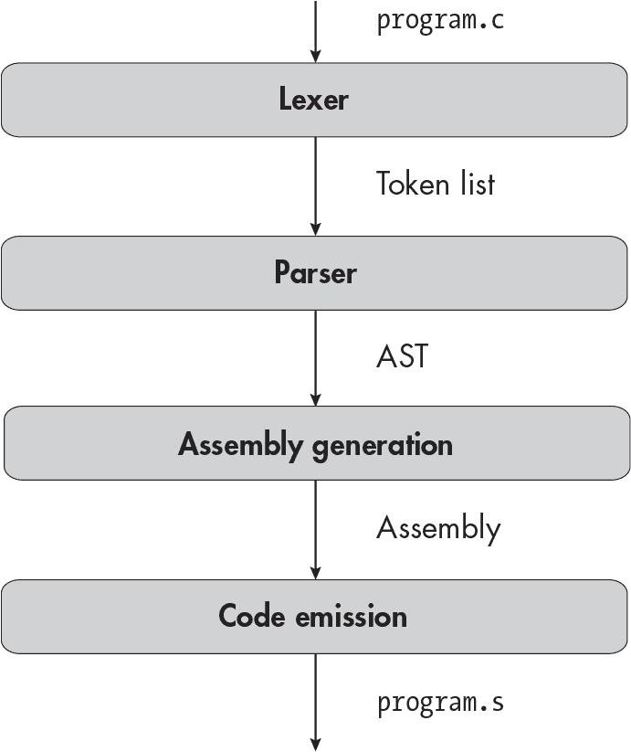
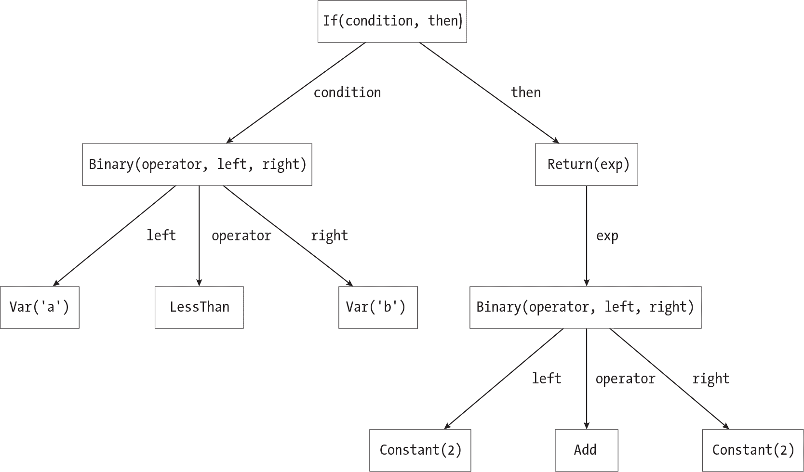
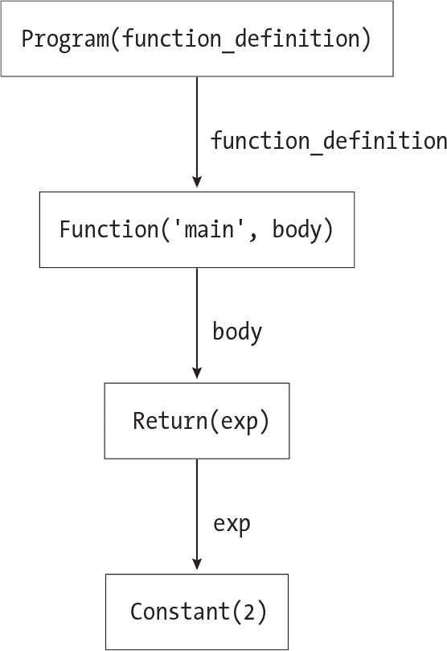

<samp class="SANS_Futura_Std_Book_Oblique_I_11">描述</samp>

<hgroup>

## <samp class="SANS_Futura_Std_Bold_Condensed_B_11">1</samp> <samp class="SANS_Dogma_OT_Bold_B_11">一个最小的编译器</samp>

</hgroup>


在本章中，你将编写一个最小的编译器，只能处理最简单的 C 程序。你将学习如何读取一个简单的汇编程序，并实现四个基本的编译器阶段，这些阶段将贯穿本书的其余部分。让我们先来看看这些编译器阶段。

### <samp class="SANS_Futura_Std_Bold_B_11">四个编译器阶段</samp>

你在本章中编写的编译器将分四个阶段处理源代码：

1.  *词法分析器*将源代码拆分成一系列*标记*。标记是程序的最小语法单位；它们包括分隔符、算术符号、关键字和标识符。如果程序像一本书，那么标记就像单独的单词。

1.  *解析器*将标记列表转换为*抽象语法树（AST）*，它以一种我们可以轻松遍历和分析的形式表示程序。

1.  *汇编生成*阶段将抽象语法树转换为汇编代码。在此阶段，我们仍然以编译器可以理解的数据结构来表示汇编指令，而不是文本形式。

1.  *代码生成*阶段将汇编代码写入文件，以便汇编器和链接器可以将其转换为可执行文件。

这是一种典型的编译器结构方式，尽管具体阶段和中间表示形式有所不同。对于本章来说，这也有些过于复杂——你可以在一个阶段内编译本章处理的程序——但是现在设置这个结构将使你在未来章节中更容易扩展编译器。随着你实现更多的语言特性，你将扩展这些编译器阶段，并添加一些新的阶段。每一章开始时，都会展示一个当前的编译器架构图，包括你已经实现的阶段以及你需要添加的任何新阶段。本章的架构图展示了你即将实现的四个阶段。在后续章节的图表中，新的阶段将用粗体标出。

在开始编写代码之前，先快速了解如何使用系统中已安装的 C 编译器将 C 代码编译为汇编代码，并了解如何阅读汇编程序。

### <samp class="SANS_Futura_Std_Bold_B_11">你好，汇编语言！</samp>

最简单的 C 程序如下所示：列表 1-1。

```
int main(void) {
    return 2;
}
```

<samp class="SANS_Futura_Std_Book_Oblique_I_11">列表 1-1：一个返回数字 2 的简单程序</samp>

该程序由一个单独的函数组成，<samp class="SANS_TheSansMonoCd_W5Regular_11">main</samp>，其中包含一个<	samp class="SANS_TheSansMonoCd_W5Regular_11">return</samp>语句，返回一个整数（在这种情况下是<samp class="SANS_TheSansMonoCd_W5Regular_11">2</samp>）。将此程序保存为*return_2.c*，然后使用<samp class="SANS_TheSansMonoCd_W5Regular_11">gcc</samp>命令将其转换为汇编代码：

```
$ **gcc -S -O -fno-asynchronous-unwind-tables -fcf-protection=none** **return_2.c**
```

如果你使用的是 macOS，这个命令可能会调用 Clang 而不是 GCC，但命令行选项的效果是相同的。这些选项会生成相当易读的汇编代码：

<samp class="SANS_TheSansMonoCd_W7Bold_B_11">-S</samp> 不要运行汇编器或链接器。这会让编译器生成汇编代码，而不是二进制文件。

<samp class="SANS_TheSansMonoCd_W7Bold_B_11">-O</samp> 优化代码。这会删除一些我们目前不关心的指令。

<samp class="SANS_TheSansMonoCd_W7Bold_B_11">-fno-asynchronous-unwind-tables</samp> 不生成用于调试的展开表。我们不需要它。

<samp class="SANS_TheSansMonoCd_W7Bold_B_11">-fcf-protection=none</samp> 禁用控制流保护，这是一种安全特性，会添加一些我们当前不关心的额外指令。控制流保护可能在你的系统上默认已经禁用，在这种情况下，这个选项不会起作用。如果你使用的是不支持该选项的旧版本 GCC 或 Clang，请跳过这个选项。

结果保存在*return_2.s*中，应该类似于清单 1-2。

```
 .globl main
main:
    movl    $2, %eax
    ret
```

<samp class="SANS_Futura_Std_Book_Oblique_I_11">清单 1-2: 清单 1-1 中的程序翻译成汇编代码</samp>

你的 *.s* 文件可能包含其他一些行，但你现在可以安全地忽略它们。 清单 1-2 中的四行是一个完整的汇编程序。汇编程序包含几种类型的语句。第一行，<samp class="SANS_TheSansMonoCd_W5Regular_11">.globl main</samp>，是一个*汇编指令*，它为汇编器提供指示。汇编指令总是以句点开头。在这里，<samp class="SANS_TheSansMonoCd_W5Regular_11">main</samp>是一个*符号*，它表示一个内存地址。符号出现在汇编指令和汇编指令中；例如，指令<samp class="SANS_TheSansMonoCd_W5Regular_11">jmp main</samp>会跳转到<code>main</code>符号所指向的地址。

<samp class="SANS_TheSansMonoCd_W5Regular_11">.globl main</samp>指令告诉汇编器，<samp class="SANS_TheSansMonoCd_W5Regular_11">main</samp>是一个*全局*符号。默认情况下，你只能在定义该符号的同一个汇编文件（因此也是同一个目标文件）中使用它。但由于<code>main</code>是全局的，其他目标文件也可以引用它。汇编器将在目标文件的*符号表*部分记录这一事实，链接器在链接目标文件时会使用符号表。符号表包含目标文件或可执行文件中所有符号的信息。

在第二行，我们使用 <samp class="SANS_TheSansMonoCd_W5Regular_11">main</samp> 作为后续代码的*标签*。标签由一个字符串或数字和一个冒号组成。标签标记了一个符号所指代的位置。这个特定的标签将 <samp class="SANS_TheSansMonoCd_W5Regular_11">main</samp> 定义为下一行 <samp class="SANS_TheSansMonoCd_W5Regular_11">movl</samp> 指令的地址。汇编器并不知道该指令的最终内存地址，但它知道该指令所在的*段*以及它在该段中的偏移量。（一个目标文件由多个段组成，包含不同类型的数据；例如，有用于机器指令、全局变量、调试信息等的独立段。不同的段在运行时加载到程序地址空间的不同部分。）<samp class="SANS_TheSansMonoCd_W5Regular_11">main</samp> 的地址将在*文本段*中，该段包含机器指令。因为 <samp class="SANS_TheSansMonoCd_W5Regular_11">main</samp> 指向该汇编文件中的第一条机器指令，所以它在文本段中的偏移量为 0。汇编器会在符号表中记录这个偏移量。

下一行的 <samp class="SANS_TheSansMonoCd_W5Regular_11">movl</samp> 指令是*机器指令*，它出现在最终的可执行文件中。列表 1-2 中的 <samp class="SANS_TheSansMonoCd_W5Regular_11">movl</samp> 指令将值 <samp class="SANS_TheSansMonoCd_W5Regular_11">2</samp> 移入一个*寄存器*，寄存器是一个非常小且快速的存储单元，它有自己的名字，并且位于 CPU 上。这里，我们将 <samp class="SANS_TheSansMonoCd_W5Regular_11">2</samp> 移入名为 EAX 的寄存器，它可以容纳 32 位。根据我们平台的调用约定，返回值通过 EAX（或 RAX，视返回值类型而定，64 位等价物）传递给调用者。由于调用者也知道这个约定，它可以在函数返回后从 EAX 中获取返回值。<samp class="SANS_TheSansMonoCd_W5Regular_11">movl</samp> 中的 <samp class="SANS_TheSansMonoCd_W5Regular_11">l</samp> 后缀表示该指令的操作数是*长字*，即 32 位整数（在 x64 汇编中，不同于大多数现代 C 实现，*long* 表示 32 位）。<samp class="SANS_TheSansMonoCd_W5Regular_11">movq</samp> 指令操作的是*四字*，即 64 位整数。当我不指定指令大小时，我会直接写 <samp class="SANS_TheSansMonoCd_W5Regular_11">mov</samp> 来引用这条指令。

最后，我们有另一条机器指令 <samp class="SANS_TheSansMonoCd_W5Regular_11">ret</samp>，它将控制权返回给调用者。你可能会看到 <samp class="SANS_TheSansMonoCd_W5Regular_11">retq</samp>，而不是 <samp class="SANS_TheSansMonoCd_W5Regular_11">ret</samp>，因为该指令隐式地操作一个 64 位的返回地址。我跳过了很多细节，包括调用约定是什么、谁决定这些约定以及 <samp class="SANS_TheSansMonoCd_W5Regular_11">ret</samp> 如何知道调用者的位置。等我们在第九章中讲解函数调用时，我会再回到这些问题。

> <samp class="SANS_Dogma_OT_Bold_B_39">注意</samp>

*本书中所有的汇编列表都使用 AT&T 语法。在其他地方，你可能会看到用英特尔语法编写的 x64 汇编。它们是同一种语言的两种不同表示方式；最大的区别在于它们将指令操作数的顺序不同。*

到此为止，公平地说，我们可以问一下调用者是谁，因为 <samp class="SANS_TheSansMonoCd_W5Regular_11">main</samp> 是该程序中唯一的函数。你也许会想知道，为什么我们需要 <samp class="SANS_TheSansMonoCd_W5Regular_11">.globl main</samp> 指令，因为似乎没有其他目标文件可能包含对 <samp class="SANS_TheSansMonoCd_W5Regular_11">main</samp> 的引用。答案是，链接器会添加一些称为 <samp class="SANS_TheSansMonoCd_W5Regular_11">crt0</samp> 的包装代码，用于在 <samp class="SANS_TheSansMonoCd_W5Regular_11">main</samp> 执行前进行设置，并在其退出后进行清理。（<samp class="SANS_TheSansMonoCd_W5Regular_11">crt</samp> 代表 *C 运行时*。）这个包装代码执行以下操作：

1.  调用 <samp class="SANS_TheSansMonoCd_W5Regular_11">main</samp> 函数。这就是为什么 <samp class="SANS_TheSansMonoCd_W5Regular_11">main</samp> 必须是全局可见的；如果不是，<samp class="SANS_TheSansMonoCd_W5Regular_11">crt0</samp> 就无法调用它。

1.  获取 <samp class="SANS_TheSansMonoCd_W5Regular_11">main</samp> 的返回值。

1.  调用 <samp class="SANS_TheSansMonoCd_W5Regular_11">exit</samp> 系统调用，将 <samp class="SANS_TheSansMonoCd_W5Regular_11">main</samp> 的返回值传递给它。然后，<samp class="SANS_TheSansMonoCd_W5Regular_11">exit</samp> 处理操作系统内部需要执行的任务，以终止进程并将返回值转化为退出码。

关键是，你无需担心进程的启动或结束；你可以将 <samp class="SANS_TheSansMonoCd_W5Regular_11">main</samp> 当作一个普通的函数来处理。

链接器还通过一个称为 *符号解析* 的过程，将符号表中的每个条目与一个内存地址关联起来。然后，它执行 *重定位*，将每个使用符号的地方更新为使用相应的地址。（实际上，链接过程比这要复杂得多！如果你想了解更多，参考第 21 页的“附加资源”。）

要验证*return_2.s*中的汇编代码是否有效，先汇编并链接它，然后运行，并使用<samp class="SANS_TheSansMonoCd_W5Regular_11">$?</samp>命令行操作符检查退出代码：

```
$ **gcc return_2.s -o return_2**
$ **./return_2**
$ **echo $?**
2
```

请注意，你可以像普通源文件一样将汇编文件传递给<samp class="SANS_TheSansMonoCd_W5Regular_11">gcc</samp>命令。它假设所有扩展名为*.s*的输入文件都包含汇编代码，因此会直接汇编并链接这些文件，而不会先尝试编译它们。

### <samp class="SANS_Futura_Std_Bold_B_11">编译器驱动程序</samp>

正如你在介绍中学到的，编译器单独并不十分有用。你还需要一个*编译器驱动程序*，它调用预处理器、编译器、汇编器和链接器。因此，你需要在开始编写编译器之前先编写一个编译器驱动程序。它应该通过三步将源文件转换为可执行文件：

1. 运行此命令以预处理源文件：

```
**gcc -E -P** **`INPUT_FILE`** **-o** **`PREPROCESSED_FILE`**
```

该命令首先对<samp class="SANS_TheSansMonoCd_W5Regular_Italic_I_11">INPUT_FILE</samp>进行预处理，然后将结果写入<samp class="SANS_TheSansMonoCd_W5Regular_Italic_I_11">PREPROCESSED_FILE</samp>。<samp class="SANS_TheSansMonoCd_W5Regular_11">-E</samp>选项告诉 GCC 仅运行预处理器，而不执行编译过程的后续步骤。默认情况下，预处理器会生成*行标记*，指示原始源文件及该文件中每部分的起始行号。（由于<samp class="SANS_TheSansMonoCd_W5Regular_11">#include</samp>指令，预处理文件可能包含来自多个源文件的代码。）<samp class="SANS_TheSansMonoCd_W5Regular_11">-P</samp>选项告诉预处理器不生成行标记；我们的词法分析器和解析器将无法处理它们。按照惯例，<samp class="SANS_TheSansMonoCd_W5Regular_Italic_I_11">PREPROCESSED_FILE</samp>文件应具有*.i*扩展名。

2. 编译预处理后的源文件，并生成一个扩展名为*.s*的汇编文件。你需要跳过这一步，因为你还没有编写编译器。完成后删除预处理文件。

3. 汇编并链接汇编文件，生成可执行文件，使用以下命令：

```
**gcc** **`ASSEMBLY_FILE`** **-o** **`OUTPUT_FILE`**
```

完成后删除汇编文件。

你的编译器驱动程序必须具有特定的命令行接口，以便本书的测试脚本*test_compiler*能够运行它。它必须是一个命令行程序，接受一个指向 C 源文件的路径作为唯一参数。如果该命令成功，它必须在与输入文件相同的目录中生成一个可执行文件，并且文件名相同（去掉文件扩展名）。换句话说，如果你运行 <samp class="SANS_TheSansMonoCd_W5Regular_11">./</samp><samp class="SANS_TheSansMonoCd_W5Regular_Italic_I_11">YOUR_COMPILER /path/to/program.c</samp>，它应该在*/path/to/program*生成一个可执行文件，并以退出码 0 终止。如果编译器失败，编译器驱动程序应该返回一个非零退出码，并且不应该生成任何汇编或可执行文件；这就是*test_compiler*验证编译器捕捉到无效程序错误的方法。最后，编译器驱动程序应支持以下选项，这些选项是*test_compiler*用于测试中间阶段的：

| <samp class="SANS_TheSansMonoCd_W7Bold_B_11">--lex</samp> | 指示它运行词法分析器，但在解析之前停止 |
| --- | --- |
| <samp class="SANS_TheSansMonoCd_W7Bold_B_11">--parse</samp> | 指示它运行词法分析器和解析器，但在汇编生成之前停止 |
| <samp class="SANS_TheSansMonoCd_W7Bold_B_11">--codegen</samp> | 指示它执行词法分析、解析和汇编生成，但在代码生成之前停止 |

这些选项都不应生成任何输出文件，如果没有遇到错误，所有选项都应以退出码 0 终止。你可能还想添加一个<samp class="SANS_TheSansMonoCd_W5Regular_11">-S</samp>选项，它指示你的编译器生成汇编文件，但不进行汇编或链接。你需要这个选项来运行第三部分中的测试；它对于第一部分和第二部分不是必须的，但它对调试非常有用。

一旦你编写了编译器驱动程序，就可以开始着手编写实际的编译器了。你需要实现本章开头列出的四个编译器阶段：词法分析器，它生成标记列表；解析器，它将这些标记转换成抽象语法树；汇编生成阶段，它将抽象语法树转换为汇编代码；以及代码生成阶段，它将汇编代码写入文件。让我们从词法分析器开始。

### <samp class="SANS_Futura_Std_Bold_B_11">词法分析器</samp>

词法分析器应读取源文件并生成一个标记列表。在开始编写词法分析器之前，你需要了解可能会遇到的所有标记。以下是清单 1-1 中的所有标记：

| <samp class="SANS_TheSansMonoCd_W7Bold_B_11">int</samp> | 一个关键字 |
| --- | --- |
| <samp class="SANS_TheSansMonoCd_W7Bold_B_11">main</samp> | 一个标识符，其值为“main” |
| <samp class="SANS_TheSansMonoCd_W7Bold_B_11">(</samp> | 一个左括号 |
| <samp class="SANS_TheSansMonoCd_W7Bold_B_11">void</samp> | 一个关键字 |
| <samp class="SANS_TheSansMonoCd_W7Bold_B_11">)</samp> | 一个右圆括号 |
| <samp class="SANS_TheSansMonoCd_W7Bold_B_11">{</samp> | 一个左大括号 |
| <samp class="SANS_TheSansMonoCd_W7Bold_B_11">return</samp> | 一个关键字 |
| <samp class="SANS_TheSansMonoCd_W7Bold_B_11">2</samp> | 一个常量，其值为“2” |
| <samp class="SANS_TheSansMonoCd_W7Bold_B_11">;</samp> | 一个分号 |
| <samp class="SANS_TheSansMonoCd_W7Bold_B_11">}</samp> | 一个右大括号 |

我在这里使用了两个与词法分析器相关的术语。*标识符*是一个字母或下划线，后面跟着字母、下划线和数字的混合。标识符区分大小写。整数*常量*由一个或多个数字组成。（我们将在第二部分中添加字符常量和浮点常量。本书中不会实现十六进制或八进制整数常量。）

请注意，标识符和常量在此标记列表中有值，但其他类型的标记没有。标识符有许多可能的值（例如，<samp class="SANS_TheSansMonoCd_W5Regular_11">foo</samp>，<samp class="SANS_TheSansMonoCd_W5Regular_11">variable1</samp>，以及 <samp class="SANS_TheSansMonoCd_W5Regular_11">my_cool_function</samp>），因此词法分析器生成的每个标识符标记必须保留其特定的名称。同样，每个常量标记需要保留一个整数值。相比之下，只有一个可能的 <samp class="SANS_TheSansMonoCd_W5Regular_11">return</samp> 关键字，因此 <samp class="SANS_TheSansMonoCd_W5Regular_11">return</samp> 关键字标记不需要存储任何额外的信息。尽管现在只有一个标识符 <samp class="SANS_TheSansMonoCd_W5Regular_11">main</samp>，你应该构建词法分析器以便以后支持任意标识符。还要注意，这里没有空白标记。如果我们正在编译像 Python 这样的语言，其中空白符很重要，我们就需要包括空白符标记。

你可以通过正则表达式（regex）识别每种标记类型。表 1-1 给出了每个标记在 Perl 兼容正则表达式（PCRE）语法中的对应正则表达式。

<samp class="SANS_Futura_Std_Heavy_B_11">表 1-1：</samp> <samp class="SANS_Futura_Std_Book_11">标记及其正则表达式</samp>

| <samp class="SANS_Futura_Std_Heavy_B_11">标记</samp> | <samp class="SANS_Futura_Std_Heavy_B_11">正则表达式</samp> |
| --- | --- |
| <samp class="SANS_Futura_Std_Book_11">标识符</samp> | <samp class="SANS_TheSansMonoCd_W5Regular_11">[a-zA-Z_]\w*\b</samp> |
| <samp class="SANS_Futura_Std_Book_11">常量</samp> | <samp class="SANS_TheSansMonoCd_W5Regular_11">[0-9]+\b</samp> |
| <samp class="SANS_TheSansMonoCd_W5Regular_11">int</samp> <samp class="SANS_Futura_Std_Book_11">关键字</samp> | <samp class="SANS_TheSansMonoCd_W5Regular_11">int\b</samp> |
| <samp class="SANS_TheSansMonoCd_W5Regular_11">void</samp> <samp class="SANS_Futura_Std_Book_11">关键字</samp> | <samp class="SANS_TheSansMonoCd_W5Regular_11">void\b</samp> |
| <samp class="SANS_TheSansMonoCd_W5Regular_11">return</samp> <samp class="SANS_Futura_Std_Book_11">关键字</samp> | <samp class="SANS_TheSansMonoCd_W5Regular_11">return\b</samp> |
| <samp class="SANS_Futura_Std_Book_11">左括号</samp> | <samp class="SANS_TheSansMonoCd_W5Regular_11">\()</samp> |
| <samp class="SANS_Futura_Std_Book_11">右括号</samp> | <samp class="SANS_TheSansMonoCd_W5Regular_11">\)</samp> |
| <samp class="SANS_Futura_Std_Book_11">左花括号</samp> | <samp class="SANS_TheSansMonoCd_W5Regular_11">{</samp> |
| <samp class="SANS_Futura_Std_Book_11">右花括号</samp> | <samp class="SANS_TheSansMonoCd_W5Regular_11">}</samp> |
| <samp class="SANS_Futura_Std_Book_11">分号</samp> | <samp class="SANS_TheSansMonoCd_W5Regular_11">;</samp> |

程序标记化的过程大致如下图所示：Listing 1-3。

```
while input isn't empty:
    if input starts with whitespace:
        trim whitespace from start of input
    else:
        find longest match at start of input for any regex in Table 1-1
        if no match is found, raise an error
        convert matching substring into a token
        remove matching substring from start of input
```

<samp class="SANS_Futura_Std_Book_Oblique_I_11">Listing 1-3: 将字符串转换为标记序列</samp>

请注意，标识符、关键字和常量必须在单词边界处结束，单词边界由 <samp class="SANS_TheSansMonoCd_W5Regular_11">\b</samp> 表示。例如，<samp class="SANS_TheSansMonoCd_W5Regular_11">123;bar</samp> 的前三个数字匹配常量的正则表达式，你应该将它们转换为常量 <samp class="SANS_TheSansMonoCd_W5Regular_11">123</samp>。这是因为 <samp class="SANS_TheSansMonoCd_W5Regular_11">;</samp> 不在 <samp class="SANS_TheSansMonoCd_W5Regular_11">\w</samp> 字符类中，因此 <samp class="SANS_TheSansMonoCd_W5Regular_11">3</samp> 和 <samp class="SANS_TheSansMonoCd_W5Regular_11">;</samp> 之间的边界是单词边界。然而，<samp class="SANS_TheSansMonoCd_W5Regular_11">123bar</samp> 的前三个数字并不匹配常量的正则表达式，因为这些数字后面跟着的是属于 <samp class="SANS_TheSansMonoCd_W5Regular_11">\w</samp> 字符类的字符，而不是单词边界。如果你的词法分析器看到像 <samp class="SANS_TheSansMonoCd_W5Regular_11">123bar</samp> 这样的字符串，它应该抛出错误，因为该字符串的开头不匹配任何标记的正则表达式。

现在你已经准备好编写词法分析器了。以下是一些要牢记的提示：

**像其他标识符一样对待关键字。**

标识符的正则表达式也匹配关键字。不要试图同时找到下一个标记的结尾并判断它是否是关键字。首先，找到标记的结尾。然后，如果它看起来像是标识符，再检查它是否匹配任何关键字。

**不要在空白字符处分割。**

不建议通过按空白字符拆分字符串来开始，因为空白字符并不是标记之间的唯一边界。例如，<samp class="SANS_TheSansMonoCd_W5Regular_11">main(void)</samp>包含四个标记，但没有空白字符。

**你只需要支持 ASCII 字符。**

本书的测试程序只包含 ASCII 字符。C 标准提供了一种叫做*通用字符名称*的机制，用于在标识符中包含非 ASCII 字符，但我们不会实现它们。许多 C 语言实现允许直接使用 Unicode 字符，但你也不需要支持这一点。

一旦你写完了词法分析器，下一步就是测试它。

### <samp class="SANS_Futura_Std_Bold_B_11">解析器</samp>

现在你已经有了标记列表，你将需要弄清楚这些标记如何组合成语言构造。在大多数编程语言中，包括 C 语言，这种组合是分层的：程序中的每个语言构造由多个更简单的构造组成。单独的标记表示最基本的构造，如变量、常量和算术运算符。树形数据结构是表示这种层次关系的自然方式。正如我在本章开头所提到的，解析器会接受由词法分析器生成的标记列表，并生成一个称为抽象语法树（AST）的树形表示。解析器创建了 AST 之后，汇编生成阶段会遍历它，确定应该生成什么样的汇编代码。

编写解析器有两种方法：你可以手写，或者使用像 Bison 或 ANTLR 这样的*解析器生成器*来自动生成你的解析代码。使用解析器生成器工作量较小，但本书使用的是手写解析器。这样做有几个原因。最重要的是，手写解析器可以让你深入理解解析器的工作原理。使用解析器生成器很容易，但可能无法完全理解它所生成的代码。许多解析器生成器的学习曲线也很陡峭，因此你最好在花时间掌握具体工具之前，先学习一些通用的技术，如递归下降解析。

手写解析器相对于解析器生成器生成的解析器也有一些实际优势：它们可能更快，更容易调试，灵活性更高，并且对错误处理的支持更好。事实上，GCC 和 Clang 都使用手写解析器，这表明手写解析器并非仅仅是一个学术练习。

话虽如此，如果你更愿意使用解析器生成器，那也没问题。这完全取决于你希望从本书中获得什么。不过请注意，我不会讨论如何使用这些工具，所以你需要自己弄清楚。如果你选择这条路线，请确保研究你选择的实现语言中可用的解析库。

无论你选择哪个选项，你都需要设计你的解析器应该生成的抽象语法树。让我们从查看一个抽象语法树的示例开始。

#### <samp class="SANS_Futura_Std_Bold_Condensed_Oblique_BI_11">一个示例抽象语法树</samp>

请考虑列表 1-4 中的<samp class="SANS_TheSansMonoCd_W5Regular_11">if</samp>语句。

```
if (a < b) {
    return 2 + 2;
}
```

<samp class="SANS_Futura_Std_Book_Oblique_I_11">列表 1-4：一个简单的</samp> <samp class="SANS_Futura_Std_Book_Oblique_I_11">if</samp> <samp class="SANS_Futura_Std_Book_Oblique_I_11">语句</samp>

相应抽象语法树的根节点表示整个<samp class="SANS_TheSansMonoCd_W5Regular_11">if</samp>语句。这个节点有两个子节点：

1.  条件，<samp class="SANS_TheSansMonoCd_W5Regular_11">a < b</samp>

1.  语句体，<samp class="SANS_TheSansMonoCd_W5Regular_11">return 2</samp> <samp class="SANS_TheSansMonoCd_W5Regular_11">+</samp> <samp class="SANS_TheSansMonoCd_W5Regular_11">2;</samp>

这些结构中的每一个都可以进一步拆解。例如，条件是一个具有三个子节点的二元操作：

1.  左操作数，变量<samp class="SANS_TheSansMonoCd_W5Regular_11">a</samp>

1.  运算符，<samp class="SANS_TheSansMonoCd_W5Regular_11"><</samp>

1.  右操作数，变量<samp class="SANS_TheSansMonoCd_W5Regular_11">b</samp>

图 1-1 显示了这段代码的完整抽象语法树，其中一个<samp class="SANS_TheSansMonoCd_W5Regular_11">If</samp>节点代表<samp class="SANS_TheSansMonoCd_W5Regular_11">if</samp>语句的根节点，一个<samp class="SANS_TheSansMonoCd_W5Regular_11">Binary</samp>节点代表条件，等等。



<samp class="SANS_Futura_Std_Book_Oblique_I_11">图 1-1：一个简单 if 语句的抽象语法树 描述</samp>

图 1-1 中的抽象语法树包含与列表 1-4 相同的信息：它展示了程序将执行的操作及其顺序。但与列表 1-4 不同，这棵抽象语法树以一种编译器可以轻松处理的方式呈现这些信息。在后续阶段，编译器将遍历这棵树，在遇到每种节点类型时执行不同的操作。你的编译器将使用这种通用策略来完成一系列不同的任务，从解析变量名到生成汇编代码。

现在，让我们看看列表 1-1 中的 C 程序的抽象语法树。图 1-2 显示了这个更简单的抽象语法树。



<samp class="SANS_Futura_Std_Book_Oblique_I_11">图 1-2： 列表 1-1 的抽象语法树 描述</samp>

接下来，你将定义必要的数据结构，以便在代码中构建像图 1-2 这样的抽象语法树。

#### <samp class="SANS_Futura_Std_Bold_Condensed_Oblique_BI_11">抽象语法树定义</samp>

本书提供了用一种专门用于描述 AST 的语言——*Zephyr 抽象语法描述语言（ASDL）*——的 AST 描述。我在这里使用 ASDL 作为一种方便的、与编程语言无关的符号表示。你不会直接在编译器中使用 ASDL；而是会在你选择的实现语言中定义等效的数据结构。接下来的几段简要概述了 ASDL。你可以在第 21 页的“附加资源”中找到描述整个语言的原始论文链接。

列表 1-5 包含了你将在本章实现的 C 语言子集的 ASDL 定义（类似于列表 1-1 的程序）。

```
program = Program(function_definition)
function_definition = Function(identifier name, statement body)
statement = Return(exp)
exp = Constant(int)
```

<samp class="SANS_Futura_Std_Book_Oblique_I_11">列表 1-5：本章的抽象语法树定义</samp>

列表 1-5 中的每一行描述了如何构建一种 AST 节点类型。请注意，图 1-2 中的每个 AST 节点都有对应的 ASDL 定义。这个 AST 的根节点是 <samp class="SANS_TheSansMonoCd_W5Regular_11">program</samp> 节点。目前，这个节点只能有一个子节点，类型是 <samp class="SANS_TheSansMonoCd_W5Regular_11">function_definition</samp>。一个函数定义有两个子节点：一个函数名，类型为 <samp class="SANS_TheSansMonoCd_W5Regular_11">identifier</samp>，以及一个函数体，类型为 <samp class="SANS_TheSansMonoCd_W5Regular_11">statement</samp>。现在，函数仅由一个语句组成，并且没有参数。稍后，你将添加对函数参数和更复杂函数体的支持。请注意，在这个定义中，<samp class="SANS_TheSansMonoCd_W5Regular_11">name</samp> 和 <samp class="SANS_TheSansMonoCd_W5Regular_11">body</samp> 是*字段名*，它们是对人类友好的标签，不会改变 AST 的结构。字段名在 ASDL 中是可选的。当字段名存在时，它紧跟在字段类型之后，类似于 <samp class="SANS_TheSansMonoCd_W5Regular_11">identifier name</samp>。

在 ASDL 中，<samp class="SANS_TheSansMonoCd_W5Regular_11">identifier</samp> 是一个内置类型，用来表示函数和变量名；它们本质上是字符串，但我们希望将它们与像 <samp class="SANS_TheSansMonoCd_W5Regular_11">"Hello, World!"</samp> 这样的字符串字面量区分开，因为它们出现在抽象语法树（AST）的不同部分。由于 <samp class="SANS_TheSansMonoCd_W5Regular_11">identifier</samp> 是一个内置类型，它没有子节点。<samp class="SANS_TheSansMonoCd_W5Regular_11">function_definition</samp> 节点的另一个子节点是 <samp class="SANS_TheSansMonoCd_W5Regular_11">statement</samp>。目前，唯一的语句类型是 <samp class="SANS_TheSansMonoCd_W5Regular_11">return</samp> 语句。这个语句有一个子节点：它的返回值，类型是 <samp class="SANS_TheSansMonoCd_W5Regular_11">exp</samp>，即 *表达式* 的缩写。当前唯一的 <samp class="SANS_TheSansMonoCd_W5Regular_11">exp</samp> 是常量整数；<samp class="SANS_TheSansMonoCd_W5Regular_11">int</samp> 是另一个内置 ASDL 类型，因此 AST 已经完成。

当然，<samp class="SANS_TheSansMonoCd_W5Regular_11">return</samp> 语句并不是 C 语言中的唯一语句，常量也不是唯一的表达式。在后续章节中，我们将添加新的构造函数来表示其他类型的语句和表达式。例如，我们将为 <samp class="SANS_TheSansMonoCd_W5Regular_11">statement</samp> 添加一个 <samp class="SANS_TheSansMonoCd_W5Regular_11">If</samp> 构造函数，用来表示 <samp class="SANS_TheSansMonoCd_W5Regular_11">if</samp> 语句：

```
statement = Return(exp) | If(exp condition, statement then, statement? else)
```

<samp class="SANS_TheSansMonoCd_W5Regular_11">statement?</samp> 类型表示一个可选语句，因为 <samp class="SANS_TheSansMonoCd_W5Regular_11">if</samp> 语句并不总是有一个 <samp class="SANS_TheSansMonoCd_W5Regular_11">else</samp> 子句。<samp class="SANS_TheSansMonoCd_W5Regular_11">|</samp> 符号用来分隔构造函数。在这里，它告诉我们一个 <samp class="SANS_TheSansMonoCd_W5Regular_11">statement</samp> 可以是一个 <samp class="SANS_TheSansMonoCd_W5Regular_11">return</samp> 语句，由 <samp class="SANS_TheSansMonoCd_W5Regular_11">Return</samp> 构造函数定义，或者是一个 <samp class="SANS_TheSansMonoCd_W5Regular_11">if</samp> 语句，由 <samp class="SANS_TheSansMonoCd_W5Regular_11">If</samp> 构造函数定义。

现在轮到你实现列表 1-5 中的 AST 定义，使用你写编译器时所用的任何语言。表示 AST 的标准方式在不同的编程语言之间有所不同。如果你在像 F#、ML 或 Haskell 这样的函数式语言中实现编译器，可以使用代数数据类型来定义 AST。Rust 中的枚举本质上是代数数据类型，因此它们也可以表示 AST。如果你使用的是像 Java 这样的面向对象语言，可以为每种节点类型定义一个抽象类，然后为每个构造器定义继承自这些抽象类的类。例如，你可以定义一个`Exp`抽象类，以及继承自它的`Constant`和`BinaryExp`类。

如果你仍然不确定如何编写 AST 定义，请查看第 21 页中的“附加资源”。

#### <samp class="SANS_Futura_Std_Bold_Condensed_Oblique_BI_11">正式语法</samp>

AST 包含了编译器后续阶段所需的所有信息。然而，它并没有告诉你每个语言结构是由哪些令牌构成的。例如，列表 1-5 中的 AST 描述并没有说明`return`语句必须以分号结尾，或者函数体需要用大括号括起来。（这就是为什么它被称为*抽象*语法树——相比之下，*具体*语法树包括了原始输入中的每个令牌。）一旦你拥有了 AST，这些具体的细节就变得不重要，因此可以方便地省略它们。然而，当你在解析一系列令牌以构建 AST 时，这些细节非常重要，因为它们指示了每个语言结构的开始和结束。

因此，除了抽象语法树（AST）描述之外，你还需要一组规则来定义如何从令牌列表构建语言结构。这组规则称为*正式语法*，它与 AST 描述紧密相关。列表 1-6 定义了 C 程序的正式语法，类似于列表 1-1。

```
<program> ::= <function>
<function> ::= "int" <identifier> "(" "void" ")" "{" <statement> "}"
<statement> ::= "return" <exp> ";"
<exp> ::= <int>
<identifier> ::= ? An identifier token ?
<int> ::= ? A constant token ?
```

<samp class="SANS_Futura_Std_Book_Oblique_I_11">列表 1-6：本章的正式语法</samp>

清单 1-6 中的语法是 *扩展巴科斯范式（EBNF）* 表示法。该语法的每一行都是一个 *产生式规则*，定义了如何通过其他语言构造和符号的序列来形成一个语言构造。每个出现在产生式规则左侧的符号（如 <samp class="SANS_TheSansMonoCd_W5Regular_11"><function></samp>）都是 *非终结符号*。单独的符号，如关键字、标识符和标点符号，是 *终结符号*。所有非终结符号都用尖括号括起来，而特定的符号（如 <samp class="SANS_TheSansMonoCd_W5Regular_11">;</samp>）用引号括起来。<samp class="SANS_TheSansMonoCd_W5Regular_11"><identifier></samp> 和 <samp class="SANS_TheSansMonoCd_W5Regular_11"><int></samp> 符号分别表示单个标识符和常量符号。由于这些符号不像其他终结符号那样是固定的字符串，我们使用 *特殊序列* 来描述它们：即用问号括起来的符号的简明英文描述。

清单 1-6 看起来与 清单 1-5 中的 AST 定义非常相似。事实上，它们具有相同的结构；清单 1-5 中的每个 AST 节点都对应于 清单 1-6 中的一个非终结符号。唯一的区别是，清单 1-6 明确指定了我们将在树的每个节点找到哪些符号，这有助于我们判断何时开始处理 AST 中下一级的节点，以及何时完成对一个节点的处理并返回到其上层父节点。

就像后续章节会为一些 AST 节点引入多个构造器一样，它们也会为相应的符号引入多个产生式规则。例如，下面是如何为 <samp class="SANS_TheSansMonoCd_W5Regular_11"><statement></samp> 添加产生式规则，以支持 <samp class="SANS_TheSansMonoCd_W5Regular_11">if</samp> 语句：

```
<statement> ::= "return" <exp> ";" | "if" "(" <exp> ")" <statement> ["else" <statement>]
```

请注意，EBNF 中的方括号表示某些内容是可选的，类似于 ASDL 中的问号。

在编写解析器时，你会参考这个正式的语法，但你不会在编译器中显式地定义这些语法规则。

#### <samp class="SANS_Futura_Std_Bold_Condensed_Oblique_BI_11">递归下降解析</samp>

现在你已经有了 AST 定义和正式文法，我们来谈谈如何实际编写解析器。我们将使用一种直接的技术，叫做*递归下降解析*，它使用不同的函数解析每个非终结符号，并返回相应的 AST 节点。例如，当解析器期望遇到清单 1-6 中定义的<code><statement></code>符号时，它会调用一个函数来解析该符号，并从清单 1-5 中返回<code>statement</code> AST 节点。主要的解析函数解析<code><program></code>符号，代表整个程序。每次调用一个函数处理一个新符号时，解析器会下降到树的更低层级。这就是递归下降中的*下降*部分。（它被称为*递归*下降是因为文法规则通常是递归的，在这种情况下，处理这些规则的函数也是递归的。例如，一个表达式的操作数可能是另一个表达式；我们将在下一章看到这个例子。）

让我们来逐步解析其中一个解析函数。清单 1-7 中的伪代码展示了如何解析一个<code><statement></code>符号。

```
parse_statement(tokens):
    expect("return", tokens)
    return_val = parse_exp(tokens)
    expect(";", tokens)
    return Return(return_val)

expect(expected, tokens):
    actual = take_token(tokens)
    if actual != expected:
        fail("Syntax error")
```

<samp class="SANS_Futura_Std_Book_Oblique_I_11">清单 1-7：解析语句</samp>

当我们期望剩余的令牌列表以一个<samp class="SANS_TheSansMonoCd_W5Regular_11"><statement></samp>开始时，我们调用<sam class="SANS_TheSansMonoCd_W5Regular_11">parse_statement</samp>函数。根据清单 1-6，一个<sam class="SANS_TheSansMonoCd_W5Regular_11"><statement></samp>由三个符号组成：<samp class="SANS_TheSansMonoCd_W5Regular_11">return</samp>关键字、一个<samp class="SANS_TheSansMonoCd_W5Regular_11"><exp></samp>符号和一个<samp class="SANS_TheSansMonoCd_W5Regular_11">;</samp>令牌。首先，我们调用一个辅助函数<samp class="SANS_TheSansMonoCd_W5Regular_11">expect</samp>，以验证第一个令牌确实是<sam class="SANS_TheSansMonoCd_W5Regular_11">return</samp>关键字。如果是的话，<sam class="SANS_TheSansMonoCd_W5Regular_11">expect</samp>会将其丢弃，这样我们就可以继续处理下一个令牌。如果不是的话，我们将报告程序的语法错误。接下来，我们需要将<samp class="SANS_TheSansMonoCd_W5Regular_11"><exp></samp>符号转化为一个<sam class="SANS_TheSansMonoCd_W5Regular_11">exp</samp> AST 节点。由于这是一个不同的非终结符号，它应该由一个单独的函数<samp class="SANS_TheSansMonoCd_W5Regular_11">parse_exp</samp>来处理，而我在这里并没有定义它。我们调用<samp class="SANS_TheSansMonoCd_W5Regular_11">parse_exp</samp>来获取表示返回值的 AST 节点，然后再次调用<samp class="SANS_TheSansMonoCd_W5Regular_11">expect</samp>来验证这个表达式后面跟随的是最后一个令牌，一个分号。最后，我们构造<sam class="SANS_TheSansMonoCd_W5Regular_11">Return</samp> AST 节点并返回它。

注意，<sam class="SANS_TheSansMonoCd_W5Regular_11">parse_statement</samp>会将构成语句的所有令牌从<samp class="SANS_TheSansMonoCd_W5Regular_11">tokens</samp>列表中移除。<sam class="SANS_TheSansMonoCd_W5Regular_11">parse_statement</samp>返回后，它的调用者继续处理<samp class="SANS_TheSansMonoCd_W5Regular_11">tokens</samp>中的剩余令牌。如果在解析整个程序后仍然有令牌剩余，那就会发生语法错误。

现在，每个正式语法中的符号只有一个产生式规则。在后面的章节中，当某些符号有多个产生式规则时，解析器将需要确定使用哪个产生式规则。它将通过查看列表中的前几个令牌来实现这一点，而不会移除它们。递归下降解析器通过查看几个令牌来确定使用哪个产生式规则，这种解析器被称为*预测解析器*。预测解析的替代方法是*带回溯的递归下降解析*，它涉及依次尝试每个产生式规则，直到找到一个有效的规则。

现在你可以编写自己的递归下降解析器了。记住你需要为清单 1-6 中的每个非终结符号编写一个函数来解析。这里有一些提示，能让这变得更容易：

**编写一个漂亮的打印程序。**

一个漂亮的打印程序是一个以人类可读的方式打印出你的 AST 的函数。这将使调试解析器变得更加容易。对于 清单 1-1 中的程序，一个漂亮打印的 AST 可能如下所示：

```
Program(
    Function(
        name="main",
        body=Return(
          Constant(2)
        )
    )
)
```

**提供有用的错误信息。**

这还将帮助你调试解析器，并且使你的编译器更加用户友好。像 <samp class="SANS_TheSansMonoCd_W5Regular_11">Expected ";" but found "return"</samp> 这样的错误信息比 <samp class="SANS_TheSansMonoCd_W5Regular_11">Fail</samp> 更加有帮助。

### <samp class="SANS_Futura_Std_Bold_B_11">汇编生成</samp>

汇编生成阶段应将 AST 转换为 x64 汇编代码，按照程序执行的大致顺序遍历 AST，为每个节点生成适当的汇编指令。首先，定义一个适当的数据结构来表示汇编程序，就像你在编写解析器时定义数据结构来表示 AST 一样。你正在添加另一个数据结构，而不是立即将汇编写入文件，这样你就可以在生成汇编代码后修改它。在本章中你不需要重写任何汇编代码，但在后面的章节中你将需要。

我将再次使用 ASDL 来描述我们将用来表示汇编的结构。清单 1-8 中有定义。

```
program = Program(function_definition)
function_definition = Function(identifier name, instruction* instructions)
instruction = Mov(operand src, operand dst) | Ret
operand = Imm(int) | Register
```

<samp class="SANS_Futura_Std_Book_Oblique_I_11">清单 1-8：汇编程序的 ASDL 定义</samp>

这看起来和上一节中的 AST 定义很相似！事实上，这*就是*一个 AST 定义，但它是针对汇编程序的，而不是 C 程序的。每个节点对应汇编中的一个构造，例如单条指令，而不是 C 中的构造，比如语句。我将把 清单 1-8 中定义的数据结构称为*汇编 AST*，以区别于 清单 1-5 中定义的 AST。

让我们来详细看看 列表 1-8。<samp class="SANS_TheSansMonoCd_W5Regular_11">program</samp> 类型表示一个完整的汇编程序，它由一个单独的 <samp class="SANS_TheSansMonoCd_W5Regular_11">function_definition</samp> 组成。一个 <samp class="SANS_TheSansMonoCd_W5Regular_11">function_definition</samp> 有两个字段：函数名和一系列指令。<samp class="SANS_TheSansMonoCd_W5Regular_11">*</samp> 在 <samp class="SANS_TheSansMonoCd_W5Regular_11">instruction*</samp> 中表示该字段是一个列表。<samp class="SANS_TheSansMonoCd_W5Regular_11">instruction</samp> 类型有两个构造函数，用来表示可以出现在我们汇编程序中的两条指令：<samp class="SANS_TheSansMonoCd_W5Regular_11">mov</samp> 和 <samp class="SANS_TheSansMonoCd_W5Regular_11">ret</samp>。<samp class="SANS_TheSansMonoCd_W5Regular_11">mov</samp> 指令有两个操作数：它将第一个操作数（源操作数）复制到第二个操作数（目标操作数）。<samp class="SANS_TheSansMonoCd_W5Regular_11">ret</samp> 指令没有任何操作数。<samp class="SANS_TheSansMonoCd_W5Regular_11">operand</samp> 类型定义了指令的两个可能操作数：一个寄存器和一个 *立即数*（或常量）。目前，你不需要指定操作的寄存器，因为生成的代码将只使用 EAX。你将在后续章节中提到其他寄存器。这个阶段的结构与解析器类似：你需要一个函数来处理每种类型的 AST 节点，该函数会调用其他函数来处理该节点的子节点。表 1-2 描述了你应为每个 AST 节点生成的汇编代码。

<samp class="SANS_Futura_Std_Heavy_B_11">表 1-2：</samp> <samp class="SANS_Futura_Std_Book_11">将 AST 节点转换为汇编代码</samp>

| <samp class="SANS_Futura_Std_Heavy_B_11">AST 节点</samp> | <samp class="SANS_Futura_Std_Heavy_B_11">汇编构造</samp> |
| --- | --- |
| <samp class="SANS_TheSansMonoCd_W5Regular_11">Program(function_definition)</samp> | <samp class="SANS_TheSansMonoCd_W5Regular_11">Program(function_definition)</samp> |
| <samp class="SANS_TheSansMonoCd_W5Regular_11">Function(name, body)</samp> | <samp class="SANS_TheSansMonoCd_W5Regular_11">Function(name, instructions)</samp> |
| <samp class="SANS_TheSansMonoCd_W5Regular_11">Return(exp)</samp> | <samp class="SANS_TheSansMonoCd_W5Regular_11">Mov(exp, Register) Ret</samp> |
| <samp class="SANS_TheSansMonoCd_W5Regular_11">Constant(int)</samp> | <samp class="SANS_TheSansMonoCd_W5Regular_11">Imm(int)</samp> |

这个翻译相当直接，但有几点需要注意。首先，一个语句可能会生成多条汇编指令。其次，只有当一个表达式能够表示为单一的汇编操作数时，这种翻译才有效。现在这是成立的，因为唯一的表达式是一个常量整数，但当我们在下一章引入一元运算符后，就不再适用了。到时候，编译器需要生成多条指令来计算表达式，然后确定该表达式存储的位置，以便将其复制到 EAX 寄存器中。

### <samp class="SANS_Futura_Std_Bold_B_11">代码生成</samp>

现在你的编译器可以生成汇编指令，最后一步是将这些指令写入文件。这个文件看起来会很像清单 1-2 中的汇编程序，但有几个细节因平台而异。首先，如果你使用的是 macOS，你应始终在函数名前添加一个下划线。例如，将<sup class="SANS_TheSansMonoCd_W5Regular_11">main</sup>函数的标签输出为<sup class="SANS_TheSansMonoCd_W5Regular_11">_main</sup>。（在 Linux 上不要添加这个下划线。）

第二，如果你使用的是 Linux，你需要在文件末尾添加这一行：

```
 .section .note.GNU-stack,"",@progbits
```

这一行启用了一个重要的安全加固措施：它表明你的代码不需要*可执行栈*。如果处理器被允许执行存储在某个内存区域的机器指令，那么该区域就是*可执行的*。*栈*，你将在下一章中了解更多，是一个存储局部变量和临时值的内存区域。正常情况下，它不存储机器指令。将栈设置为不可执行是防范某些安全漏洞的基本手段，但并不是每个程序都能启用这一防护措施，因为一些使用了特定非标准语言扩展的程序实际上需要可执行栈。在汇编文件中包括这一行，表明它*不*需要可执行栈，这样就可以启用这一安全措施。我们在本书中生成的所有代码都不需要可执行栈，因此我们将始终生成这一行。（关于可执行栈的更多信息，请参见第 21 页的“附加资源”部分。）

代码生成阶段应遍历汇编 AST，并打印它遇到的每个结构，就像汇编生成阶段遍历来自清单 1-5 的 AST 一样。由于汇编 AST 与最终的汇编程序非常相似，代码生成阶段将非常简单，即使你在后续章节中向编译器添加更多功能。

表 1-3、1-4 和 1-5 说明了如何打印每个汇编结构。

<samp class="SANS_Futura_Std_Heavy_B_11">表 1-3：</samp> <samp class="SANS_Futura_Std_Book_11">格式化顶级汇编结构</samp>

| <samp class="SANS_Futura_Std_Heavy_B_11">汇编顶层构造</samp> | <samp class="SANS_Futura_Std_Heavy_B_11">输出</samp> |
| --- | --- |

| <samp class="SANS_TheSansMonoCd_W5Regular_11">程序(函数定义)</samp> | <samp class="SANS_Futura_Std_Book_11">打印出函数定义。在 Linux 系统上，添加以下内容到文件末尾：</samp>

```
 .section .note.GNU-stack,"",@progbits
```

|

| <samp class="SANS_TheSansMonoCd_W5Regular_11">函数(名称, 指令)</samp> |
| --- |

```
 .globl `<name>  <name>`:
    `<instructions>`
```

|

<samp class="SANS_Futura_Std_Heavy_B_11">表 1-4：</samp> <samp class="SANS_Futura_Std_Book_11">格式化汇编指令</samp>

| <samp class="SANS_Futura_Std_Heavy_B_11">汇编指令</samp> | <samp class="SANS_Futura_Std_Heavy_B_11">输出</samp> |
| --- | --- |
| <samp class="SANS_TheSansMonoCd_W5Regular_11">移动(src, dst)</samp> | <samp class="SANS_TheSansMonoCd_W5Regular_11">movl</samp> <samp class="SANS_TheSansMonoCd_W5Regular_Italic_I_11"><src></samp><samp class="SANS_TheSansMonoCd_W5Regular_11">,</samp> <samp class="SANS_TheSansMonoCd_W5Regular_Italic_I_11"><dst></samp> |
| <samp class="SANS_TheSansMonoCd_W5Regular_11">返回</samp> | <samp class="SANS_TheSansMonoCd_W5Regular_11">ret</samp> |

<samp class="SANS_Futura_Std_Heavy_B_11">表 1-5：</samp> <samp class="SANS_Futura_Std_Book_11">格式化汇编操作数</samp>

| <samp class="SANS_Futura_Std_Heavy_B_11">汇编操作数</samp> | <samp class="SANS_Futura_Std_Heavy_B_11">输出</samp> |
| --- | --- |
| <samp class="SANS_TheSansMonoCd_W5Regular_11">寄存器</samp> | <samp class="SANS_TheSansMonoCd_W5Regular_11">%eax</samp> |
| <samp class="SANS_TheSansMonoCd_W5Regular_11">立即数(int)</samp> | <samp class="SANS_TheSansMonoCd_W5Regular_11">$</samp><samp class="SANS_TheSansMonoCd_W5Regular_Italic_I_11"><int></samp> |

确保在指令之间加入换行符。你还应该输出可读性强、格式良好的汇编代码，因为你在调试编译器时会花很多时间阅读这些汇编代码。你可以通过缩进每一行（标签除外）来使汇编代码更具可读性，就像在列表 1-2 中那样。考虑在你的汇编程序中添加注释。汇编中的<samp class="SANS_TheSansMonoCd_W5Regular_11">#</samp>符号表示注释，注释掉行的其余部分，类似于 C 语言中的<samp class="SANS_TheSansMonoCd_W5Regular_11">//</samp>。

一旦你实现了代码生成阶段，你将能够将像列表 1-1 这样的简单程序编译成可运行的可执行文件。

### <samp class="SANS_Futura_Std_Bold_B_11">总结</samp>

在本章中，你编写了一个编译器，能够将完整的 C 程序转化为可以在你的计算机上运行的可执行文件。你学习了如何解释用 x64 汇编语言编写的程序、如何使用扩展的巴科斯范式（Backus-Naur Form, BNF）定义语法规则，以及如何在 ASDL 中定义抽象语法树（AST）。你在本章中学到的技能和概念——以及你实现的四个编译器阶段——为你在本书中接下来的所有工作奠定了基础。

在下一章中，你将为编译器添加对一元运算符的支持。在此过程中，你将学习汇编程序如何管理堆栈，并且你将实现一个新的中间表示，使你编译的程序更容易分析、转换和优化。

### <samp class="SANS_Futura_Std_Bold_B_11">附加资源</samp>

要了解本章介绍的一些概念，查看以下资源。

**链接器**

+   David Drysdale 的《初学者链接器指南》是一个很好的起点（*[`<wbr>www<wbr>.lurklurk<wbr>.org<wbr>/linkers<wbr>/linkers<wbr>.html`](https://www.lurklurk.org/linkers/linkers.html)*）。

+   Ian Lance Taylor 的 20 篇关于链接器的文章深入探讨了这一主题。第一篇文章可以在*[`<wbr>www<wbr>.airs<wbr>.com<wbr>/blog<wbr>/archives<wbr>/38`](https://www.airs.com/blog/archives/38)*找到，目录可以在*[`<wbr>lwn<wbr>.net<wbr>/Articles<wbr>/276782<wbr>/`](https://lwn.net/Articles/276782/)*查看。

+   Eli Bendersky 的《共享库中的位置独立代码（PIC）》是一篇博文，提供了编译器、链接器和汇编器如何协同工作以生成位置独立代码的概述，重点讨论了 32 位机器（*[`<wbr>eli<wbr>.thegreenplace<wbr>.net<wbr>/2011<wbr>/11<wbr>/03<wbr>/position<wbr>-independent<wbr>-code<wbr>-pic<wbr>-in<wbr>-shared<wbr>-libraries`](https://eli.thegreenplace.net/2011/11/03/position-independent-code-pic-in-shared-libraries)*）。

+   Eli Bendersky 的《x64 上共享库中的位置独立代码（PIC）》在前一篇文章的基础上展开，专注于 64 位系统（*[`<wbr>eli<wbr>.thegreenplace<wbr>.net<wbr>/2011<wbr>/11<wbr>/11<wbr>/position<wbr>-independent<wbr>-code<wbr>-pic<wbr>-in<wbr>-shared<wbr>-libraries<wbr>-on<wbr>-x64`](https://eli.thegreenplace.net/2011/11/11/position-independent-code-pic-in-shared-libraries-on-x64)*）。

**AST 定义**

+   Joel Jones 的《抽象语法树实现惯例》提供了关于如何在各种编程语言中实现 AST 的良好概述（*[`<wbr>hillside<wbr>.net<wbr>/plop<wbr>/plop2003<wbr>/Papers<wbr>/Jones<wbr>-ImplementingASTs<wbr>.pdf`](https://hillside.net/plop/plop2003/Papers/Jones-ImplementingASTs.pdf)*）。

+   Daniel Wang、Andrew Appel、Jeff Korn 和 Christopher Serra 的《Zephyr 抽象语法描述语言》是关于 ASDL 的原创论文。它包括了几个不同语言中 AST 定义的示例（*[`<wbr>www<wbr>.cs<wbr>.princeton<wbr>.edu<wbr>/~appel<wbr>/papers<wbr>/asdl97<wbr>.pdf`](https://www.cs.princeton.edu/~appel/papers/asdl97.pdf)*）。

**可执行堆栈**

+   Ian Lance Taylor 的《可执行堆栈》是一篇博文，讨论了哪些程序需要可执行堆栈，并描述了 Linux 系统如何判断一个程序的堆栈是否应该是可执行的（*[`<wbr>www<wbr>.airs<wbr>.com<wbr>/blog<wbr>/archives<wbr>/518`](https://www.airs.com/blog/archives/518)*）。
