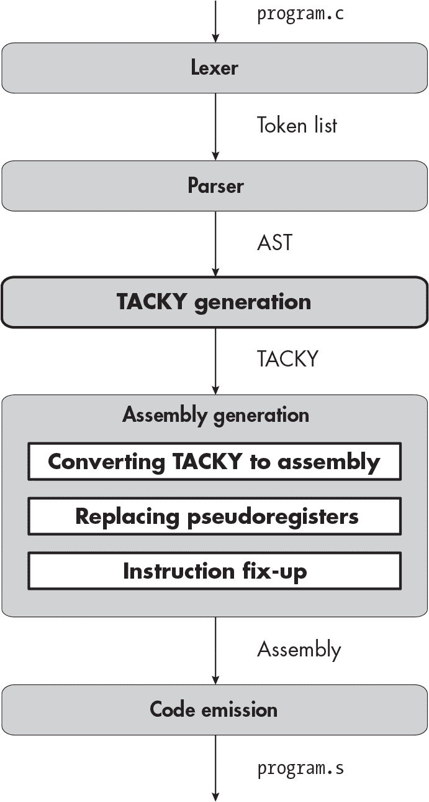
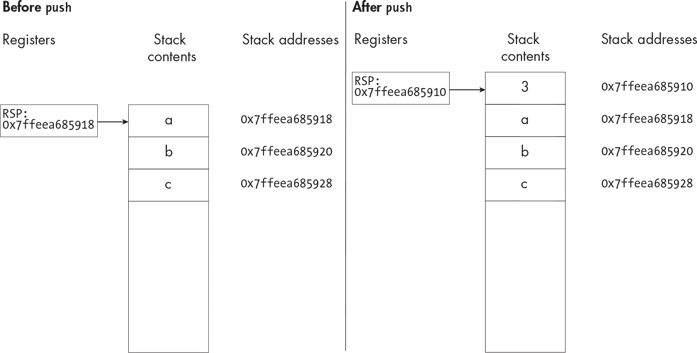
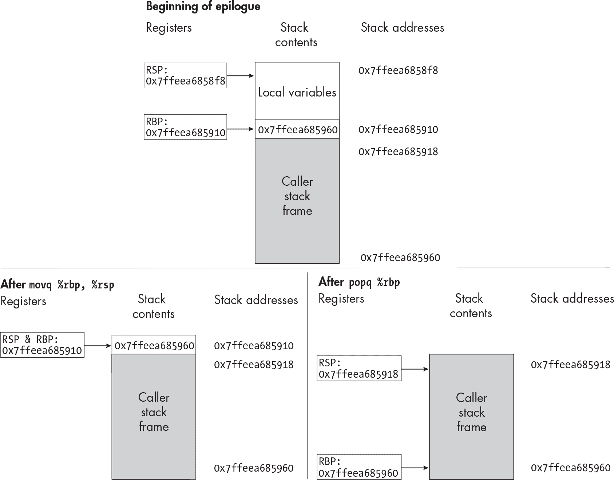

描述


## 第二章：2 一元运算符


C 语言有几种 *一元运算符*，它们作用于单个值。在本章中，你将扩展编译器，以处理两个一元运算符：否定和按位取反。你将把复杂的、嵌套的一元表达式转换为可以在汇编中表达的简单操作。你不会在单一的编译过程中过滤这一转换，而是会在解析器生成的抽象语法树（AST）和汇编生成过程生成的汇编抽象语法树之间引入一种新的中间表示。你还将把汇编生成过程分解为几个较小的过程。新过程在本章开头的图示中已被加粗标出。

首先，我们来看看一个使用新一元运算符的 C 程序和我们将生成的相应汇编代码。

### 汇编中的否定和按位取反

在本章中，你将学习如何编译像清单 2-1 这样的程序。

```
int main(void) {
    return ~(-2);
}
```

清单 2-1：带有否定和按位取反的 C 程序

这个程序包含了一个嵌套表达式，使用了两个新的一元运算符。第一个运算符，*否定*（-），否定一个整数——这没什么意外。*按位取反*（~）运算符将一个整数的每一位进行翻转，这样会使整数变为其负数，然后再减去 1。（之所以会有这样的效果，是因为计算机使用一种称为 *二进制补码* 的系统来表示有符号整数。如果你不熟悉二进制补码，请参见第 45 页中的“附加资源”，其中有一些关于其工作原理的解释链接。）

你的编译器会将清单 2-1 转换为清单 2-2 中的汇编代码。

```
 .globl main
main:
    pushq   %rbp
    movq     %rsp, %rbp
    subq     $8, %rsp
  ❶ movl     $2, ❷ -4(%rbp)
  ❸ negl     -4(%rbp)
  ❹ movl     -4(%rbp), %r10d
  ❺ movl     %r10d, -8(%rbp)
  ❻ notl     -8(%rbp)
  ❼ movl     -8(%rbp), %eax
    movq     %rbp, %rsp
    popq     %rbp
    ret
```

清单 2-2：对应清单 2-1 的汇编代码

在 main 后的前三条指令形成了 *函数前奏*，它设置了当前的栈帧；我将在下一节详细讲解栈时覆盖它们。函数前奏之后，我们计算中间结果 –2，然后是最终结果 1，并将每个结果存储在一个独立的内存地址上。这并不是很高效，因为我们浪费了大量的指令将值从一个地址复制到另一个地址。我们将在第三部分中实现的优化将清理掉这些不必要的复制。

第一条 mov 指令 ❶ 将 2 存储到内存中的一个地址。操作数 -4(%rbp) ❷ 意味着“RBP 寄存器中存储的值减去四”。RBP 中的值是栈上的一个内存地址（稍后会详细讲解），因此 -4(%rbp) 指向的是比当前地址低 4 字节的另一个内存地址。接下来，我们使用 neg 指令 ❸ 对该地址的值进行取反，因此 -4(%rbp) 包含的值变成 -2。（和 mov 一样，neg 指令也有一个 l 后缀，表示它是在操作 32 位值。）

然后我们处理外部的按位取反表达式。首先，我们将存储在 -4(%rbp) 的源值复制到目的地址 -8(%rbp)。我们不能通过单条指令完成这个操作，因为 mov 指令的源操作数和目的操作数不能都是内存地址。至少有一个操作数必须是寄存器或立即数。我们通过将 -2 从内存中复制到一个临时寄存器 R10D ❹，再从该寄存器复制到目的内存地址 ❺ 来绕过这一限制。然后，我们使用 not 指令 ❻ 对 -2 进行按位取反操作，因此内存地址 -8(%rbp) 现在包含我们想要返回的值：~(-2)，其结果为 1。为了返回这个值，我们将其移动到 EAX 寄存器中 ❼。最后的三条指令是 *函数尾部代码*，用于销毁栈帧并从函数返回。

> 注意

*如果你使用 GCC、Clang 或其他生产环境的 C 编译器将 示例 2-1 编译成汇编，它将与 示例 2-2 完全不同。这是因为这些编译器在编译时就会计算常量表达式，即使你已经禁用了优化！我猜它们之所以这样做，是因为某些常量表达式，比如静态变量初始化器，*必须*在编译时进行计算，而在编译时计算所有常量表达式比只计算部分常量表达式更简单。*

### 栈

关于 清单 2-2，仍有两个未解的问题：函数序言和尾声做了什么，以及为什么我们要相对于 RBP 寄存器中的值引用栈地址。为了回答这些问题，我们需要讨论程序内存中的一个段，叫做 *栈*。RSP 寄存器，也称为 *栈指针*，始终保存栈顶的地址。（RSP 指向的是最后使用的栈槽，而不是第一个空闲的栈槽。）与任何栈数据结构一样，你可以将值推入栈中，也可以从栈中弹出值；push 和 pop 汇编指令正是完成这一操作的。

栈向较低的内存地址增长。当你将数据推入栈时，RSP 会减小。这意味着“栈顶”——存储在 RSP 中的地址——是栈中的 *最低* 地址。本书中的栈图是按照较低的内存地址位于顶部来排列的，因此栈顶位于图的顶部。可以将这些图中的内存地址视为代码列表中的行号。代码列表的顶部是第 1 行，行号随着向下移动而增加；同样，图中的地址随着向下滚动页面或屏幕而增加。需要注意的是，大多数书籍和文章中的栈图采用的是相反的布局：它们将栈顶放在图的底部，因此较低的内存地址显示在页面的下方。我觉得这种布局非常令人困惑，但如果你喜欢它，只需把书倒过来即可。

类似 push $3 这样的指令做了两件事：

1.  将要推送的值（在这个例子中是 3）写入栈上的下一个空闲位置。push 和 pop 指令以 8 字节为增量调整栈指针，栈顶的值目前位于 RSP 存储的地址，因此下一个空闲位置是 RSP – 8。

1.  将 RSP 减少 8 字节。此时 RSP 中的新地址就是栈顶，而该地址上的值是 3。

图 2-1 说明了 push 指令对栈和 RSP 寄存器的影响。



图 2-1：push $3 对内存和 RSP 的影响 描述

pop 指令执行相反的操作。例如，pop %rax 会将栈顶的值复制到 RAX 寄存器中，然后将 RSP 加上 8 字节。

由于push指令会将栈指针减去 8 字节，因此它必须推送一个 8 字节的值。同样，pop指令总是从栈上弹出一个 8 字节的值。像 int 中的返回值那样的类型为int的值，只有 4 字节。你不能只将 4 字节的值推入栈中，但你可以使用movl指令将一个 4 字节的值复制到你已经分配的栈空间中。Listing 2-2 中的几个指令就是这样做的，包括movl $2, -4(%rbp)。（在 32 位系统上，情况正好相反；你可以推送和弹出 4 字节的值，但不能推送 8 字节的值。在这两种系统上，尽管非常不常见，你也可以使用pushw和popw指令来推送和弹出 2 字节的值；w后缀，代表*字（word）*，表示该指令接受一个 2 字节的操作数。我们在本书中不会使用pushw、popw或任何其他 2 字节指令。）在 x64 系统上，内存地址是 8 字节，因此你可以使用push和pop将它们放入栈中或从栈中取出。这在稍后会派上用场。

栈不仅仅是一个无差别的内存块；它被划分为叫做*栈帧*的不同部分。每当一个函数被调用时，它通过减少栈指针来在栈顶分配一些内存。这块内存就是该函数的栈帧，用于存储局部变量和临时值。在函数返回之前，它会释放栈帧，将栈指针恢复到之前的值。按照惯例，RBP 寄存器指向当前栈帧的基址；因此，它有时被称为*基指针*。我们通过相对于 RBP 存储的地址来引用当前栈帧中的数据。这意味着我们不需要绝对地址，因为我们无法提前知道它们。由于栈是向着较低的内存地址增长的，因此当前栈帧中的每个地址都低于 RBP 中存储的地址；这就是为什么像-4(%rbp)这样的局部变量地址，都是相对于 RBP 的负偏移量。在后面的章节中，我们还会提到相对于 RBP 的数据，比如调用者栈帧中的函数参数。（也可以将局部变量和参数相对于 RSP 进行引用，而根本不涉及 RBP；大多数生产环境编译器会作为一种优化这样做。）

现在你已经理解了栈的工作原理，接下来我们更详细地看一下函数前言和尾部。函数前言通过三条指令设置栈帧：

1.  pushq %rbp 将当前的 RBP 值，即调用者栈帧基地址，保存到栈中。稍后恢复调用者栈帧时，我们需要这个值。这个值将位于由下一条指令建立的新栈帧的栈底。

1.  movq %rsp, %rbp 将栈顶设为新栈帧的基地址。此时，当前栈帧的栈顶和栈底是相同的。当前栈帧只保存一个值，这个值是 RSP 和 RBP 都指向的：即我们在前一条指令中保存的调用者栈帧的基地址。

1.  subq $n, %rsp 将栈指针减去 *n* 字节。此时栈帧有 *n* 字节的空间来存储局部变量和临时变量。

图 2-2 显示了函数前言中每条指令对栈的影响。在这个图中，subq 指令分配了 24 字节的空间，足够容纳六个 4 字节的整数。


图 2-2：函数前言每个阶段栈的状态 描述

函数尾部通过将 RSP 和 RBP 恢复到函数前言之前的相同值，恢复了调用者的栈帧。这需要两条指令：

1.  movq %rbp, %rsp 将我们带回函数前言第二条指令执行后的位置：RSP 和 RBP 都指向当前栈帧的栈底，该栈帧保存了调用者的 RBP 值。

1.  popq %rbp 恢复了函数前言中的第一条指令，恢复了调用者的 RSP 和 RBP 寄存器值。它通过恢复 RBP，因为栈顶的值是我们在函数前言开始时保存的调用者栈帧的基地址。通过移除栈帧中的最后一个值来恢复 RSP，使 RSP 指向调用者栈帧的栈顶。

图 2-3 显示了每条指令在函数尾部的作用。



图 2-3：函数尾部每个阶段栈的状态 描述

现在我们知道编译器应该生成什么输出，继续编程吧。我们将从扩展词法分析器和语法分析器开始。

### 词法分析器

在这一章中，你将扩展词法分析器，使其识别三个新的符号：

| ~ | 一个波浪号，按位取反运算符 |
| --- | --- |
| - | 一个连字符，取反运算符 |
| -- | 两个连字符，递减运算符 |

虽然你在这一章中不会实现递减运算符，但仍然需要为它添加一个符号。否则，编译器将接受一些应该被拒绝的程序，例如列表 2-3 中的那个程序。

```
int main(void) {
    return --2;
}
```

列表 2-3：一个使用递减运算符的无效 C 程序

这段代码不应该编译通过，因为不能对常量进行递减操作。但如果你的编译器没有识别出--是一个独立的符号，它会认为列表 2-3 等同于列表 2-4，而后者是一个完全有效的程序。

```
int main(void) {
    return -(-2);
}
```

列表 2-4：一个有效的 C 程序，连续两个取反运算符

你的编译器应该拒绝那些你未实现的语言特性；它不应该错误地编译它们。因此，词法分析器需要知道--是一个单独的符号，而不是两个连续的取反运算符。（另一方面，词法分析器应将~~解析为两个连续的按位取反运算符。像~~2这样的表达式是有效的。）

你可以像处理标点符号（例如;和(在第一章中的方式一样）来处理新的符号。首先，你需要为每个新的符号定义一个正则表达式。这里的正则表达式是~、-和--。接着，每当词法分析器试图生成一个符号时，它需要检查输入是否与这些新正则表达式匹配，也要检查来自上一章的正则表达式。当输入流的开始匹配多个可能的符号时，选择最长的一个。例如，如果输入流以--开头，则应将其解析为递减运算符，而不是两个连续的取反运算符。

### 解析器

为了解析本章中的新运算符，我们首先需要扩展我们在 第一章 中定义的抽象语法树（AST）和形式语法。首先让我们看看 AST。由于一元运算是表达式，我们用一个新的构造器为 exp AST 节点表示它们。清单 2-5 显示了更新后的 AST 定义，新增的部分已加粗。

```
program = Program(function_definition)
function_definition = Function(identifier name, statement body)
statement = Return(exp)
exp = Constant(int) | **Unary(unary_operator, exp)**
**unary_operator = Complement | Negate**
```

清单 2-5：包含一元运算的抽象语法树

更新后的 exp 规则表明，一个表达式可以是常量整数或一元运算。一元运算由两种一元运算符之一，补码 或 取反，应用于一个内层表达式。请注意，exp 的定义是递归的：Unary 构造器对于一个 exp 节点包含另一个 exp 节点。这使得我们能够构造任意深度嵌套的表达式，如 -(~(-~-(-4)))。

我们还需要对语法进行相应的更改，如 清单 2-6 所示。

```
<program> ::= <function>
<function> ::= "int" <identifier> "(" "void" ")" "{" <statement> "}"
<statement> ::= "return" <exp> ";"
<exp> ::= <int> **| <unop> <exp> | "(" <exp> ")"**
**<unop> ::= "-" | "~"**
<identifier> ::= ? An identifier token ?
<int> ::= ? A constant token ?
```

清单 2-6：包含一元运算的形式语法

清单 2-6 包含了一条新的产生式规则，用于一元表达式，并且新增了一个 <unop> 符号来表示两个一元运算符。这些更改与 清单 2-5 中对 AST 的扩展相对应。我们还为 exp 符号添加了第三条产生式规则，描述了带括号的表达式。它在 AST 中没有对应的构造器，因为编译器的其他部分不需要区分一个带括号的表达式与一个没有括号的相同表达式。表达式 1、(1) 和 ((((1)))) 都由相同的 AST 节点表示：Constant(1)。

减法运算符（--）在该语法中没有出现，因此当你的解析器遇到 -- 标记时应该报错。

要更新解析阶段，请修改编译器的 AST 数据结构，以匹配列表 2-5。然后，更新递归下降解析代码，以反映列表 2-6 中的更改。在这一章中，解析表达式变得有些复杂，因为您需要弄清楚应用<exp>符号的三个不同生成规则中的哪一个。列表 2-7 中的伪代码演示了如何解析一个表达式。

```
parse_exp(tokens):
    next_token = peek(tokens)
  ❶ if next_token is an int:
        `--snip--`
  ❷ else if next_token is "~" or "-":
        operator = parse_unop(tokens)
        inner_exp = parse_exp(tokens)
      ❸ return Unary(operator, inner_exp)
  ❹ else if next_token == "(":
        take_token(tokens)
        inner_exp = parse_exp(tokens)
        expect(")", tokens)
      ❺ return inner_exp
  ❻ else:
        fail("Malformed expression")
```

列表 2-7：解析表达式

首先，我们查看输入中的下一个标记，以确定应用哪个生成规则。我们调用peek来查看这个标记，但不将其从输入流中移除。一旦确定使用哪个生成规则，我们将处理整个输入，包括第一个标记，并使用该规则。因此，我们现在不想从输入中消费这个标记。

如果我们即将解析的表达式是有效的，next_token应该是一个整数、一元运算符或左括号。如果它是一个整数❶，我们像上一章那样解析它。如果它是一个一元运算符❷，我们应用列表 2-6 中的第二个生成规则来构建一个一元表达式。该规则是<unop> <exp>，因此我们先解析一元运算符，然后解析内部表达式。<unop>符号是一个单一标记，next_token，我们已经检查过了。在列表 2-7 中，我们在一个单独的函数（parse_unop，其定义已被省略）中处理<unop>。实际上，您可能不需要一个单独的函数来解析一个标记。无论如何，我们最终得到一个 AST 节点，表示适当的一元运算符。生成规则中的下一个符号是<exp>，我们通过递归调用parse_exp来解析它。（这就是“递归下降”中的递归部分。）这个调用应返回一个exp AST 节点，表示一元表达式的操作数。现在我们有了运算符和操作数的 AST 节点，所以我们返回整个一元表达式的 AST 节点❸。

如果 next_token 是一个左括号 ❹，我们将应用 <exp> 的第三条产生式规则，即 "(" <exp> ")"。我们从输入流中移除左括号，然后递归调用 parse_exp 来处理后续的表达式。接着，我们调用 expect 来移除右括号，若缺失则抛出语法错误。由于 AST 不需要表示括号的存在，我们将原样返回内部表达式 ❺。

最后，如果 next_token 不是整数、单目运算符或左括号 ❻，则表达式格式错误，我们会抛出语法错误。

### TACKY: 一种新的中间表示

将 AST 转换为汇编并不像上一章那样直接。C 表达式可以有嵌套的子表达式，而汇编指令不能。像 -(~2) 这样的单一表达式需要分解为两条汇编指令：一条用于应用内部的按位补码操作，另一条用于应用外部的取反操作。

我们将通过一个新的中间表示（IR），*三地址码 (TAC)*，来弥补 C 和汇编之间的差距。在 TAC 中，每条指令的操作数是常量或变量，而不是嵌套表达式。之所以称为三地址码，是因为大多数指令最多使用三个值：两个源操作数和一个目标。 （本章的指令只使用一个或两个值；我们将在实现二元运算符时在第三章介绍使用三个值的指令。）要在 TAC 中重写嵌套表达式，我们通常需要引入新的临时变量。例如，清单 2-8 显示了 return 1 + 2 * 3; 的三地址码。

```
tmp0 = 2 * 3
tmp1 = 1 + tmp0
return tmp1
```

清单 2-8：三地址码 for return 1 + 2 * 3;

使用三地址码而不是直接将 AST 转换为汇编代码有两个主要原因。首先，它使我们能够在不涉及汇编语言细节的情况下，单独处理一些重要的结构性转换——比如去除嵌套表达式——例如，确定哪些操作数对于哪些指令是有效的。这意味着我们可以编写多个较小、更简单的编译器阶段，而不是一个庞大、复杂的汇编生成阶段。其次，三地址码非常适合我们将在 Part III 中实现的几种优化。它有一个简单而统一的结构，这使得回答类似“这个表达式的结果是否会被使用？”或“这个变量是否总是具有相同的值？”这样的问题变得容易。对于这些问题的答案决定了哪些优化是安全的。

大多数编译器在内部使用某种形式的三地址码，但具体细节各不相同。我决定在本书中将这种中间表示命名为*TACKY*。（在我看来，为你的中间表示命名是编译器设计中最有趣的部分之一。）我为本书编造了 TACKY，但它与其他编译器中的三地址码相似。

#### 定义 TACKY

我们将像其他中间表示一样，在 ASDL 中定义 TACKY。Listing 2-9 中 TACKY 的定义看起来类似于 Listing 2-5 中 AST 的定义，但也有一些重要的不同之处。

```
program = Program(function_definition)
function_definition = Function(identifier, ❶ instruction* body)
instruction = Return(val) | Unary(unary_operator, val src, val dst)
val = Constant(int) | Var(identifier)
unary_operator = Complement | Negate
```

Listing 2-9：TACKY 中间表示

在 TACKY 中，函数体由一系列指令❶组成，而不是单一的语句。在这方面，它与我们在上一章中定义的汇编 AST 相似。现在，TACKY 有两条指令：Return和Unary。Return返回一个值；Unary对src（表达式的源值）执行某个一元操作，并将结果存储在dst（目标）中。两条指令都操作val，它们可以是常数整数（Constant）或临时变量（Var）。我们生成的 TACKY 必须满足一个要求，这在 Listing 2-9 中没有明确指出：一元操作的dst必须是临时的Var，而不是Constant。试图将值赋给常量是没有意义的。

现在你已经看到了 TACKY 的 ASDL 定义，你需要在自己的编译器中实现这个定义，类似于 AST 和汇编 AST 的定义。一旦你有了 TACKY 数据结构，你就可以开始编写 IR 生成阶段，将 AST 转换为 TACKY。

#### 生成 TACKY

你的 TACKY 生成阶段应该遍历 列表 2-5 中定义的 AST 形式，并返回 列表 2-9 中定义的 TACKY AST 形式。棘手的部分是将一个 exp 节点转换为指令列表；一旦你弄明白了这一点，处理其他 AST 节点就很容易了。表 2-1 列出了几个 AST 示例及其对应的 TACKY。

表 2-1： 一元表达式的 TACKY 表示

| AST | TACKY |
| --- | --- |
| Return(Constant(3)) | Return(Constant(3)) |
| Return(Unary(Complement, Constant(2))) | Unary(Complement, Constant(2), Var("tmp.0")) Return(Var("tmp.0")) |

|

```
Return(Unary(Negate,
	     Unary(Complement,
		  Unary(Negate, Constant(8)))))
```

| Unary(Negate, Constant(8), Var("tmp.0")) Unary(Complement, Var("tmp.0"), Var("tmp.1")) Unary(Negate, Var("tmp.1"), Var("tmp.2")) Return(Var("tmp.2")) |
| --- |

在这些示例中，我们将每个一元操作转换为 Unary TACKY 指令，从最内层的表达式开始，逐步向外扩展。我们将每个 Unary 指令的结果存储在一个临时变量中，然后在外部表达式或 return 语句中使用该变量。列表 2-10 描述了如何将一个 exp AST 节点转换为 TACKY。

```
emit_tacky(e, instructions):
    match e with
  ❶ | Constant(c) ->
        return ❷ Constant(c)
    | Unary(op, inner) ->
        src = emit_tacky(inner, instructions)
        dst_name = make_temporary()
        dst = Var(dst_name)
        tacky_op = convert_unop(op)
        instructions.append(Unary(tacky_op, src, dst))
        return dst
```

列表 2-10：将表达式转换为 TACKY 指令列表

这个伪代码通过将计算表达式所需的指令附加到 instructions 参数，来生成指令。它还返回一个 TACKY val，代表表达式的结果，我们将在翻译外部表达式或语句时使用它。

清单 2-10 中的 match 语句检查我们正在翻译的表达式类型，然后执行相应的语句来处理该表达式。如果表达式是常量，我们返回等效的 TACKY Constant，并且不生成任何新的指令。请注意，这段代码中包含了两种不同的 Constant 构造；我们匹配的是原始 AST 中的节点 ❶，而我们返回的是 TACKY AST 中的节点 ❷。接下来的语句中，两个 Unary 构造也具有相同的情况。

如果 e 是一元表达式，我们为源和目标构建 TACKY 值。首先，我们递归调用 emit_tacky 来处理源表达式，从而得到相应的 TACKY 值。这还会生成计算该值的 TACKY 指令。然后，我们为目标创建一个新的临时变量。make_temporary 辅助函数为这个变量生成一个唯一的名称。我们使用另一个辅助函数 convert_unop 来将一元运算符转换为其 TACKY 等效形式。一旦我们获得源、目标和一元运算符，就可以构建 Unary TACKY 指令，并将其附加到 instructions 列表中。最后，我们返回 dst 作为整个表达式的结果。

请记住，emit_tacky 处理的是表达式，而不是 return 语句。你需要一个单独的函数（我不会提供伪代码）来将 return 语句转换为 TACKY。这个函数应该调用 emit_tacky 来处理语句的返回值，然后生成一个 TACKY Return 指令。

#### 生成临时变量的名称

很明显，每个临时变量都需要一个独特的名称。在后续章节中，我们还需要保证这些自动生成的名称不会与用户定义的函数和全局变量名称冲突，或者与不同函数自动生成的名称冲突。这些标识符必须是唯一的，因为我们将把所有这些标识符——包括自动生成的名称和用户定义的函数与变量名称——存储在同一个表中。

一种简单的解决方案是维护一个全局整数计数器；为了生成一个唯一的名称，递增计数器并使用其新值作为临时变量的名称。这个名称不会与其他临时名称冲突，因为每次递增计数器时它都会生成一个新值。它也不会与用户定义的标识符冲突，因为整数在 C 语言中不是有效的标识符。在表 2-1 中，我使用了这种方法的变体，将描述性字符串、句点和全局计数器的值连接起来，生成像tmp.0这样的唯一标识符。这些不会与用户定义的标识符冲突，因为 C 语言中的标识符不能包含句点。通过这种命名方案，你可以在自动生成的名称中编码有用的信息，比如它们所在的函数名称。（如果你像我这里一样将每个变量命名为tmp，那就没那么有用了。）

#### 更新编译器驱动程序

要测试 TACKY 生成器，你需要添加一个新的--tacky命令行选项，通过该选项让编译器运行到 TACKY 生成阶段，但在汇编生成之前停止。像现有的--lex、--parse和--codegen选项一样，这个新选项不应产生任何输出。

### 汇编生成

TACKY 更接近汇编，但它仍然没有明确指出我们需要哪些汇编指令。下一步是将 TACKY 程序转换为我们在上一章定义的汇编抽象语法树（AST）。我们将在三个小的编译器阶段完成这个过程。首先，我们将生成一个汇编 AST，但仍然直接引用临时变量。接下来，我们将用栈上的具体地址替换这些变量。这一步会导致一些无效的指令，因为许多 x64 汇编指令不能对两个操作数使用内存地址。所以，在最后一个编译器阶段，我们将重写汇编 AST，以修复任何无效的指令。

#### 将 TACKY 转换为汇编

我们将从扩展上一章中定义的汇编 AST 开始。我们需要一些新的构造来表示清单 2-2 中的neg和not指令。我们还需要决定如何在汇编 AST 中表示函数的前导和尾声。

处理函数序言和尾声有几种不同的方法。我们可以将 `push`、 `pop` 和 `sub` 指令添加到汇编 AST 中。我们可以添加对应于整个函数序言和尾声的高级指令，而不是维护汇编 AST 结构和汇编指令之间的一对一对应关系。或者我们可以完全忽略函数序言和尾声，并在代码生成过程中添加它们。我会同时使用第一种和最后一种选项的结合。本章的汇编 AST 在 Listing 2-11 中显示了与 `sub` 指令（函数序言中的第三条指令）对应的结构。该结构指定了我们需要从堆栈指针中减去的字节数。汇编 AST 不包括序言和尾声中的其他指令；这些指令总是相同的，因此我们可以在代码生成过程中添加它们。尽管如此，其他代表函数序言和尾声的方法也能工作，所以选择你喜欢的方式。

我们还将引入 *伪寄存器* 来表示临时变量。我们将伪寄存器作为汇编指令中的操作数使用，就像真实寄存器一样；唯一的区别在于我们可以无限制地使用它们。因为它们不是真实寄存器，所以它们不能出现在最终的汇编程序中；在后续的编译器通行证中，它们需要被真实寄存器或内存地址替换。目前，我们将每个伪寄存器分配到内存中的不同地址。在 第三部分 中，我们将编写一个 *寄存器分配器*，它将尽可能多地将伪寄存器分配给硬件寄存器，而不是内存地址。

Listing 2-11 展示了更新后的汇编 AST，新增部分已加粗。

```
program = Program(function_definition)
function_definition = Function(identifier name, instruction* instructions)
instruction = Mov(operand src, operand dst)
            **| Unary(unary_operator, operand)**
            **| AllocateStack(int)**
            | Ret
**unary_operator = Neg | Not**
operand = Imm(int) | **Reg(reg) | Pseudo(identifier) | Stack(int)**
**reg = AX | R10**
```

`Listing 2-11: 带有一元运算符的汇编 AST`

`instruction` 节点新增了几个构造函数，用于表示我们的新汇编指令。 `Unary` 构造函数表示单个 `not` 或 `neg` 指令。它接受一个操作数，用作源操作数和目的操作数。 `AllocateStack` 构造函数表示函数序言中的第三条指令， `subq $n, %rsp`。它的一个子节点是整数，指示我们从 RSP 中减去的字节数。

我们还有几个新的指令操作数。<sup class="SANS_TheSansMonoCd_W5Regular_11">Reg</sup>构造器表示硬件寄存器。它可以指定到目前为止我们看到的任一硬件寄存器：EAX 或 R10D。<sup class="SANS_TheSansMonoCd_W5Regular_11">Pseudo</sup>操作数让我们使用任意标识符作为伪寄存器。我们用它来表示在生成 TACKY 时创建的临时变量。最终，我们需要将每个伪寄存器替换为栈上的位置；我们用<sup class="SANS_TheSansMonoCd_W5Regular_11">Stack</sup>操作数表示这些位置，它指示了从 RBP 起始偏移量的栈地址。例如，我们可以使用汇编 AST 节点<sup class="SANS_TheSansMonoCd_W5Regular_11">Stack(-4)</sup>来表示操作数<sup class="SANS_TheSansMonoCd_W5Regular_11">-4(%rbp)</sup>。

> <sup class="SANS_Dogma_OT_Bold_B_39">注意</sup>

*每个硬件寄存器有多个别名，取决于你需要多少字节的寄存器。EAX 指的是 64 位 RAX 寄存器的低 32 位，而 R10D 指的是 64 位 R10 寄存器的低 32 位。AL 和 R10B 分别指的是 RAX 和 R10 的低 8 位。在汇编 AST 中，寄存器名称不依赖于大小，因此在示例 2-11 中，AX 可以根据上下文表示寄存器别名 RAX、EAX 或 AL。（AX 通常指的是 RAX 的低 16 位，但在本书中我们不会使用 16 字节的寄存器别名。）*

现在我们可以编写一个直接从 TACKY 到汇编的转换，如表 2-2 到 2-5 所示。正如表 2-2 所示，我们将 TACKY 中的<sup class="SANS_TheSansMonoCd_W5Regular_11">Program</sup>和<sup class="SANS_TheSansMonoCd_W5Regular_11">Function</sup>节点转换为相应的汇编构造。

<sup class="SANS_Futura_Std_Heavy_B_11">表 2-2：</sup> <sup class="SANS_Futura_Std_Book_11">将顶级 TACKY 构造转换为汇编</sup>

| <sup class="SANS_Futura_Std_Heavy_B_11">TACKY 顶级构造</sup> | <sup class="SANS_Futura_Std_Heavy_B_11">汇编顶级构造</sup> |
| --- | --- |
| <sup class="SANS_TheSansMonoCd_W5Regular_11">Program(function_definition)</sup> | <sup class="SANS_TheSansMonoCd_W5Regular_11">Program(function_definition)</sup> |
| <sup class="SANS_TheSansMonoCd_W5Regular_11">Function(name, instructions)</sup> | <sup class="SANS_TheSansMonoCd_W5Regular_11">Function(name, instructions)</sup> |

我们将把每条 TACKY 指令转换成一系列汇编指令，如表 2-3 所示。由于我们的新汇编指令对源和目标使用相同的操作数，我们会先将源值复制到目标，然后再发出一条一元<sup class="SANS_TheSansMonoCd_W5Regular_11">neg</sup>或<sup class="SANS_TheSansMonoCd_W5Regular_11">not</sup>指令。

表 2-3: 将 TACKY 指令转换为汇编

| TACKY 指令 | 汇编指令 |
| --- | --- |
| 返回(值) | Mov(值, Reg(AX)) Ret |
| 一元运算符(一元运算符, 源, 目标) | Mov(源, 目标) 一元运算符(一元运算符, 目标) |

表 2-4 显示了每个 TACKY 一元运算符 对应的汇编 一元运算符，而 表 2-5 显示了 TACKY 操作数到汇编操作数的转换。

表 2-4: 将 TACKY 算术运算符转换为汇编

| TACKY 运算符 | 汇编运算符 |
| --- | --- |
| 补码 | Not |
| 取反 | Neg |

表 2-5: 将 TACKY 操作数转换为汇编

| TACKY 操作数 | 汇编操作数 |
| --- | --- |
| 常量(int) | 立即数(int) |
| 变量(标识符) | 伪变量(标识符) |

请注意，我们还没有使用 AllocateStack 指令；我们将在代码生成的最后阶段添加它，当我们知道需要分配多少字节时。我们也没有使用任何 Stack 操作数；我们将在下一个编译阶段将每个 Pseudo 操作数替换为 Stack 操作数。同时，我们还没有使用 R10D 寄存器；我们将在重写无效指令时引入它。

#### 替换伪寄存器

接下来，我们编写一个编译器阶段，将每个 Pseudo 操作数替换为 Stack 操作数，同时保持汇编 AST 的其余部分不变。在 Listing 2-2 中，我们使用了两个栈位置：-4(%rbp) 和 -8(%rbp)。此阶段遵循相同的模式：我们将看到的第一个临时变量替换为 Stack(-4)，下一个替换为 Stack(-8)，依此类推。我们为每个新变量减去四，因为每个临时变量都是一个 4 字节的整数。你需要在处理过程中维护一个从标识符到偏移量的映射，以便每次出现伪寄存器时都能用栈上的相同地址替换它。例如，如果你处理如下指令：

```
Mov(Imm(2), Pseudo("a"))
Unary(Neg, Pseudo("a"))
```

你应将 Pseudo("a") 在两条指令中都替换为相同的 Stack 操作数。

此编译器阶段还应返回最终临时变量的栈偏移量，因为这告诉我们在下一次阶段需要在栈上分配多少字节。

#### 修正指令

现在，我们需要再次遍历汇编 AST 并进行两个小修正。首先，我们将在 function_definition 的指令列表开头插入 AllocateStack 指令。传递给 AllocateStack 的整数参数应该是我们在上一个编译器阶段分配的最后一个临时变量的栈偏移量。这样，我们就能在栈上分配足够的空间以容纳我们使用的每一个地址。例如，如果我们替换三个临时变量，并将最后一个替换为 -12(%rbp)，我们将在指令列表的开头插入 AllocateStack(12)。

第二个修复是重写无效的 Mov 指令。当我们将伪寄存器替换为栈地址时，可能会出现 Mov 指令，其中源操作数和目标操作数都是 Stack 操作数。这种情况发生在程序中的一元表达式至少有一层嵌套时。但 mov 指令和许多其他指令一样，不能同时将内存地址作为源操作数和目标操作数。如果你尝试汇编一个类似 movl -4(%rbp), -8(%rbp) 的指令，汇编器将会拒绝它。当遇到无效的 mov 指令时，应将其重写为首先从源地址复制到 R10D 寄存器，然后再从 R10D 复制到目标地址。例如，指令

```
movl    -4(%rbp), -8(%rbp)
```

变为：

```
movl    -4(%rbp), %r10d
movl    %r10d, -8(%rbp)
```

我选择 R10D 作为临时寄存器，因为它没有其他特殊用途。有些寄存器是特定指令所要求的；例如，执行除法的 idiv 指令要求被除数存储在 EAX 寄存器中。其他寄存器用于函数调用时传递参数。在此阶段使用这些寄存器作为临时寄存器可能会导致冲突。例如，你可能将一个函数参数复制到正确的寄存器中，但在使用该寄存器在内存地址之间传输其他值时不小心覆盖了它。由于 R10D 没有特殊用途，因此我们不必担心这些冲突。

### 代码输出

最后，我们将扩展代码输出阶段，以处理我们的新构造并输出函数的前言和后记。表 2-6 到 2-9 显示了如何输出每个汇编构造。新构造和我们输出现有构造的方式更改部分已加粗。

表 2-6 显示了在输出汇编 函数 时如何包含前言部分。

表 2-6： 格式化顶层汇编构造

| 汇编顶层构造 | 输出 |
| --- | --- |
| 程序（函数定义） |

```
Print out the function definition. On Linux, add at end of file: 
 .section .note.GNU-stack,"",@progbits
```

|

| 函数（名称，指令） |
| --- |

```
 .globl <name>
<name>: 
 pushq    %rbp
 movq    {@}%rsp, %rbp 
 <instructions>
```

|

表 2-7 显示了如何在 Ret 指令前加入函数尾部代码，并如何输出新的 Unary 和 AllocateStack 指令。

表 2-7： 汇编指令格式

| 汇编指令 | 输出 |
| --- | --- |
| Mov(src, dst) |

```
movl  <src>, <dst>
```

|

| Ret |
| --- |

```
movq    %rbp, %rsp
popq    %rbp  
ret
```

|

| Unary(unary_operator, operand) |
| --- |

```
<unary_operator>    <operand>
```

|

| AllocateStack(int) |
| --- |

```
subq    $<int>, %rsp
```

|

正如此表所示，你应该将 AllocateStack 输出为一个 subq 指令。根据 unary_operator 参数，将 Unary 输出为 negl 或 notl 指令。表 2-8 显示了每个 unary_operator 对应的指令。

表 2-8： 汇编操作符指令名称

| 汇编操作符 | 指令名称 |
| --- | --- |
| Neg | negl |
| Not | notl |

最后，表 2-9 显示了如何输出新的 Reg 和 Stack 操作数。

表 2-9： 汇编操作数格式

| 汇编操作数 | 输出 |
| --- | --- |
| Reg(AX) | %eax |
| Reg(R10) | %r10d |
| 堆栈(int) | <int>(%rbp) |
| 立即数(int) | $<int> |

由于 RBP 和 RSP 包含内存地址，每个地址为 8 字节，我们总是使用四字指令来操作它们，这些指令以q后缀结尾。表 2-7 中的<code>movl</code>指令和序言与尾声中的<code>movq</code>指令除了操作数的大小外，完全相同。

### 总结

在本章中，你扩展了编译器以实现取反和按位补码操作。你还实现了一种新的中间表示，编写了两个新的编译器阶段来转换汇编代码，并学习了栈帧的结构。接下来，你将实现加法和减法等二进制操作。下一章对后端的改动非常简单，难点在于让解析器遵循运算符优先级和结合性规则。

### 附加资源

本章介绍了*二进制补码*，它是现代计算机表示带符号整数的方式。二进制补码将在本书中贯穿出现，因此值得花时间去理解它。以下是它如何工作的几个概述：

+   《二进制补码》由 Thomas Finley 编写，介绍了二进制补码表示法的工作原理及其原因（*<[`<wbr>www<wbr>.cs<wbr>.cornell<wbr>.edu<wbr>/~tomf<wbr>/notes<wbr>/cps104<wbr>/twoscomp<wbr>.html`](https://www.cs.cornell.edu/~tomf/notes/cps104/twoscomp.html)*）。

+   《计算机系统的构成元素》第二章*The Elements of Computing Systems*，由 Noam Nisan 和 Shimon Schocken 编写（MIT 出版社，2005 年），从更侧重硬件的角度涵盖了类似的内容。这本书是 Nand 到 Tetris 项目的配套书。该章节可以在*[`<wbr>www<wbr>.nand2tetris<wbr>.org<wbr>/course`](https://www.nand2tetris.org/course)*免费下载；点击“项目 2：布尔算术”下的书本图标。
