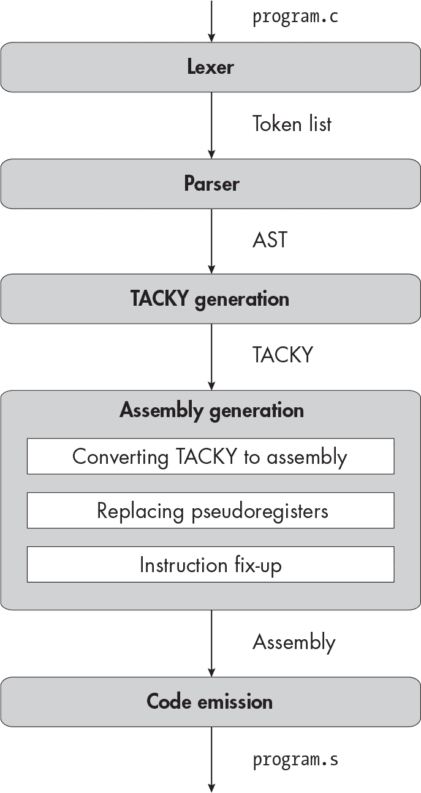
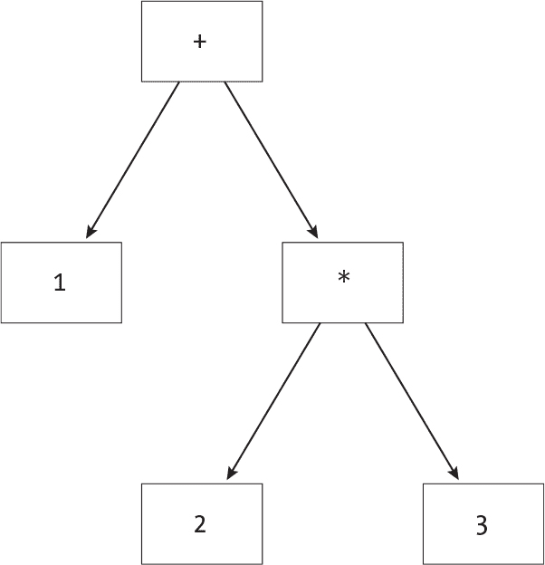

描述


## 3 二元运算符


在这一章中，你将实现五种新运算符：加法、减法、乘法、除法和取余运算符。这些都是 *二元运算符*，它们需要两个操作数。本章不需要任何新的编译器阶段；你只需要扩展你已经编写的每个阶段。在解析阶段，你将看到递归下降解析法在处理二元表达式时的局限性。相反，你将使用一种不同的技术，*优先级爬升*，这种技术在后续章节中更容易扩展。优先级爬升是你需要的最后一种主要解析技术。一旦它就位，你将能够以相对较少的工作量为本书的剩余部分添加新的语法。在汇编生成阶段，你将引入几个执行二元运算的汇编指令。和往常一样，我们从词法分析器开始。

### 词法分析器

词法分析器需要识别四个新令牌：

+ 加号，加法运算符

* 星号，乘法运算符

/ 斜杠，除法运算符

% 百分号，取余运算符

这个列表没有包括 - 令牌，因为你在上一章已经添加了它。词法分析阶段不会区分取反和减法；无论哪种情况，它都会生成相同的令牌。

你应该以与前几章中的单字符令牌相同的方式进行词法分析。

### 解析器

现在，你将向抽象语法树（AST）中添加另一种表达式：二元运算。 列表 3-1 显示了更新后的 AST 定义。

```
program = Program(function_definition)
function_definition = Function(identifier name, statement body)
statement = Return(exp)
exp = Constant(int)
    | Unary(unary_operator, exp)
    **| Binary(binary_operator, exp, exp)**
unary_operator = Complement | Negate
**binary_operator = Add | Subtract | Multiply | Divide | Remainder**
```

列表 3-1：包含二元运算的抽象语法树

请注意，解析器与词法分析器不同，它区分取反和减法。- 令牌根据它在表达式中的位置，可能被解析为 取反 或 减法。

同样需要注意的是，AST 的结构决定了嵌套表达式的计算顺序。让我们看几个例子，看看 AST 的结构如何控制运算顺序。图 3-1 中的 AST 表示表达式 1 + (2 * 3)，其结果为 7。



图 3-1：表达式 1 + (2 * 3) 的 AST 描述

+ 操作有两个操作数：1 和 (2 * 3)。为了评估这个表达式，你首先计算 2 * 3，然后将 1 加到结果中。另一方面，图 3-2 中的 AST 表示的是表达式 (1 + 2) * 3，其结果为 9。


图 3-2：表达式 (1 + 2) * 3 的 AST 描述

在这种情况下，你首先计算 1 + 2，然后再乘以 3。一般来说，在评估 AST 节点之前，你需要先评估它的两个子节点。这个先处理节点的子节点再处理节点本身的模式，称为 *后序遍历*。请注意，任何树形数据结构都可以通过后序遍历进行遍历，不仅仅是 AST。

你的编译器遍历 AST 生成代码，而不是评估表达式，但原理是一样的。当你将二元表达式的 AST 转换为 TACKY 时，你首先生成计算两个操作数的指令，然后生成操作本身的指令。（在第二章中，你也使用了后序遍历来处理一元操作。）

对于你的解析器来说，正确地分组嵌套表达式至关重要。如果你试图解析 1 + (2 * 3)，但最终得到图 3-2 的 AST，你最终会错误地编译程序。

我们刚才看到的例子使用了括号来显式地分组嵌套表达式。有些表达式，比如 1 + 2 * 3，并没有为每个嵌套表达式加上括号。在这些情况下，我们会根据运算符的*优先级*和*结合性*来分组表达式。优先级较高的运算符先被求值；由于 * 的优先级高于 +，因此你会把 1 + 2 * 3 解析为 1 + (2 * 3)。结合性告诉你如何处理优先级相同的运算符。如果一个操作是*左结合*的，你会先应用左边的运算符；如果是*右结合*的，你会先应用右边的运算符。例如，由于加法和减法是左结合的，1 + 2 - 3 会被解析为 (1 + 2) - 3。本章中的所有新运算符都是左结合的，并且有两个优先级级别：*、/ 和 % 的优先级较高，而 + 和 - 的优先级较低。

#### 递归下降解析的难题

编写一个正确处理运算符优先级和结合性的递归下降解析器出乎意料地棘手。为了理解原因，先让我们尝试向正式文法中添加一个用于二元表达式的生成规则。这个新规则在 Listing 3-2 中以粗体标出，定义在<exp>中。

```
<exp> ::= <int> | <unop> <exp> | "(" <exp> ")" | **<exp> <binop> <exp>**
```

Listing 3-2：一个不适用于递归下降解析器的简单语法规则

一个二元表达式由一个表达式、一个二元操作符和另一个表达式组成，因此<exp> <binop> <exp>是定义它的正式语法中的显然方式。但有几个原因使得递归下降解析器不能使用这个产生式规则。

首先，列表 3-2 是*模糊的*：它允许你以多种方式解析某些输入。例如，根据这个语法，图 3-1 和图 3-2 都是1 + 2 * 3的有效解析。我们需要知道+和*的相对优先级，以决定使用哪种解析，但语法并没有包含这些信息。

其次，新的产生式规则是*左递归的*：该产生式规则中最左边的符号对于<exp>本身也是<exp>。你不能在递归下降解析器中应用左递归规则；如果尝试这样做，你会遇到无限递归的情况。试想一下，在parse_exp中实现这个产生式规则的情况。该规则中的第一个符号是<exp>，因此parse_exp必须通过递归调用自己来处理该符号。但parse_exp在递归调用之前不会消费任何标记。它会用完全相同的输入递归调用自己，因此永远不会终止。

我们可以通过几种方式解决这些问题。如果我们想要一个纯粹的递归下降解析器，我们可以重构语法，去除模糊性和左递归。由于这种方法有一些缺点，我们将使用优先级提升，它是递归下降解析的替代方法。然而，首先了解纯递归下降的解决方案是有帮助的。

#### 充分的解决方案：重构语法

如果我们重构语法，我们将得到每个优先级层次的一个语法规则，像在列表 3-3 中一样。

```
<exp> ::= <term> {("+" | "-") <term>}
<term> ::= <factor> {("*" | "/" | "%") <factor>}
<factor> ::= <int> | <unop> <factor> | "(" <exp> ")"
```

列表 3-3：适用于二元操作的递归下降友好型语法

使用列表 3-3 中的语法，解析1 + 2 * 3只有一种方式，并且没有左递归。大括号表示重复，因此一个单独的<exp>可以包含任意数量的<term>。它可能是一个<term>，或者是<term> + <term>，或者是<term> - <term> + <term>，等等。然后，解析器将这些长串的术语分组成一个左关联的树形结构，以构建一个<exp> AST 节点。（请注意，我们不能使用像<exp> ::= <term> "+" <exp>这样的规则，因为它会导致右关联树。而列表 3-3 中的语法则没有指定关联性，允许解析器构建左关联树或右关联树。）

这种方法是有效的，但随着你添加更多的优先级级别，它会变得越来越笨重。现在我们有三个优先级级别，如果算上<factor>，我们将在第四章引入逻辑和关系运算符时再增加四个。如果我们采用这种方法，每增加一个优先级级别，我们就需要为语法添加一个新的符号，并为我们的解析器添加一个相应的函数。这会产生大量的样板代码，因为不同优先级级别的表达式解析函数几乎是相同的。

#### 更好的解决方案：优先级提升

优先级上升是一种更简单的方式来解析二元表达式。它可以处理像 <exp> <binop> <exp> 这样的产生式规则，同时尊重每个二元操作符的优先级。在优先级上升中，每个操作符都有一个数字优先级等级，而 parse_exp 函数接受一个最小优先级等级作为参数。这使得你可以为正在解析的任何子表达式指定适当的优先级等级。例如，假设你刚刚遇到一个 + 标记，现在你希望将接下来的部分解析为加法表达式的右侧：你需要指定它应该仅包括优先级高于 + 的操作。这个解决方案使得添加新操作符变得容易；你只需要为每个新操作符分配一个数字优先级等级，但不需要对解析代码进行其他修改。

##### 将优先级上升与递归下降结合

我们可以使用优先级上升来解析二元表达式，同时仍然使用递归下降来解析其他语言结构。记住，递归下降解析器使用不同的函数来解析每个符号。这使得我们可以用不同的技术解析不同的符号：我们在 parse_exp 函数中使用优先级上升，在解析其他所有符号的函数中使用递归下降。parse_exp 函数将从输入流中移除标记并返回一个 AST 节点，就像基于递归下降的解析函数一样，但它将使用不同的策略来获得这个结果。

由于我们已经使用递归下降来解析一元和带括号的表达式，因此我们用一个与二元操作不同的符号来表示它们。列表 3-4 展示了结果语法，并且与第二章的变化部分已加粗显示。

```
<program> ::= <function>
<function> ::= "int" <identifier> "(" "void" ")" "{" <statement> "}"
<statement> ::= "return" <exp> ";"
**<exp> ::= <factor> | <exp> <binop> <exp>**
**<factor> ::= <int> | <unop> <factor> | "(" <exp> ")"**
<unop> ::= "-" | "~"
**<binop> ::= "-" | "+" | "*" | "/" | "%"**
<identifier> ::= ? An identifier token ?
<int> ::= ? A constant token ?
```

列表 3-4：处理二元操作的最终语法

在列表 2-6 中我们称之为<exp>的符号现在称为<factor>；它表示一个常量、一个一元表达式或一个括号表达式。（我们将保留列表 3-3 中的名称*factor*，因为这个符号可以出现在乘法表达式中作为因子。）我们用常规的递归下降方法来解析一个<factor>。它的定义几乎与第二章中<exp>的定义完全相同，唯一的不同是我们现在允许括号内有二元表达式和因子。这意味着(1 + 2) 是一个因子，因为"(" <exp> ")"是<factor>的一个生成规则。然而，-1 + 2 不是一个因子，因为<unop> <exp> 不是<factor>的生成规则。一个<exp> 要么是一个按显式方式定义的二元操作，要么是一个因子。因为<exp>和<factor>的规则相互引用，解析这些符号的函数是相互递归的。这些函数都返回exp AST 节点；<factor>和<exp>是语法中的不同符号，但在 AST 中并不是不同的类型。

解析因子的伪代码如列表 3-5 所示。

```
parse_factor(tokens):
    next_token = peek(tokens)
    if next_token is an int:
        `--snip--`
    else if next_token is "~" or "-":
        operator = parse_unop(tokens)
      ❶ inner_exp = parse_factor(tokens)
        return Unary(operator, inner_exp)
else if next_token == "(":
        take_token(tokens)
      ❷ inner_exp = parse_exp(tokens)
        expect(")", tokens)
        return inner_exp
    else:
        fail("Malformed factor")
```

列表 3-5：解析一个因子

这看起来和上一章的表达式解析代码非常相似（如列表 2-7 所示）。唯一的不同是，当我们期望一个<factor>时，我们调用parse_factor ❶，而当我们期望一个<exp>时，我们调用parse_exp ❷；以前我们在两个地方都调用了parse_exp。

##### 使运算符具有左关联性

接下来，让我们编写新版的parse_exp。我们将从一个简单版本的函数开始，该函数仅处理相同优先级的+和-运算符。这个简化版的parse_exp需要以左结合的方式分组表达式，但目前还不需要处理多个优先级。

在这个简单的情况下，我们会遇到像factor1 + factor2 - factor3 + factor4 这样的输入。这些表达式应该始终以左结合的方式解析，得到像((factor1 + factor2) - factor3) + factor4 这样的表达式。结果，每个表达式的右操作数，包括子表达式，都会是一个单一的因子。例如，(factor1 + factor2)的右操作数是factor2，而((factor1 + factor2) - factor3)的右操作数是factor3。

由于表达式的右操作数始终是一个单一的因子，我们可以使用列表 3-6 中的伪代码来解析这些表达式。

```
parse_exp(tokens):
  ❶ left = parse_factor(tokens)
    next_token = peek(tokens)
  ❷ while next_token is "+" or "-":
        operator = parse_binop(tokens)
      ❸ right = parse_factor(tokens)
      ❹ left = Binary(operator, left, right)
        next_token = peek(tokens)
    return left
```

示例 3-6：解析不考虑优先级的左结合表达式

我们从解析一个单一的因子 ❶ 开始，它可以是整个表达式或更大表达式的左操作数。接下来，我们检查接下来的符号是否是二元运算符 ❷。如果是，我们从输入中读取它并将其转换为 binary_operator AST 节点。然后，我们构造一个二元表达式 ❹，其中左操作数是到目前为止我们解析的内容，右操作数是下一个因子，我们通过调用 parse_factor ❸ 来获取。我们重复这个过程，直到遇到一个不再是 + 或 - 的符号；这意味着没有剩余的二元表达式可以构造，我们就完成了。

##### 处理优先级

现在，让我们扩展 示例 3-6 来处理 *、/ 和 %。这些运算符也是左结合的，但它们的优先级比 + 和 - 要高。

一旦我们添加了这些运算符，每个表达式的右操作数可以是单一的因子，或者是仅包含新高优先级运算符的子表达式。例如，1 + 2 * 3 + 4 将被解析为 (1 + (2 * 3)) + 4。整个表达式的右操作数是一个单一的因子，4。内层子表达式的右操作数，1 + (2 * 3)，是一个乘积，2 * 3。

换句话说，如果最外层的表达式是 + 或 - 操作，它的右操作数只包含因子和 *、/ 和 % 操作。但如果最外层的表达式本身是 *、/ 或 % 操作，它的右操作数必须是单一因子。

一般化来说：当我们解析形式为 e1 <op> e2 的表达式时，e2 中的所有运算符应具有高于 <op> 的优先级。我们可以通过调整 列表 3-6 中的代码来实现这一点，得到 列表 3-7。

```
parse_exp(tokens, **min_prec**):
    left = parse_factor(tokens)
    next_token = peek(tokens)
    while next_token is **a binary operator and precedence(next_token) >= min_prec**:
        operator = parse_binop(tokens)
        **right = parse_exp(tokens, precedence(next_token) + 1)**
        left = Binary(operator, left, right)
        next_token = peek(tokens)
    return left
```

列表 3-7：使用优先级爬升解析左结合表达式

这个伪代码是我们整个优先级爬升算法的实现。min_prec 参数让我们能够声明当前解析的子表达式中的所有运算符都需要超过某个优先级水平。例如，我们可以只包含优先级高于 + 的运算符。我们通过在每次 while 循环的迭代中将当前运算符的优先级与 min_prec 进行比较来强制执行这一点；如果运算符的优先级过低，我们将排除该运算符及其后续部分。然后，当我们解析操作的右侧时，我们将最小优先级设置为高于当前运算符的优先级。这保证了优先级更高的运算符会优先计算。由于与当前运算符具有相同优先级的运算符不会被包含在右侧表达式中，因此生成的抽象语法树（AST）将是左结合的。

当你从其他函数调用 parse_exp（包括从 parse_factor，用于处理带括号的表达式）时，从最小优先级为零开始，这样结果将包括所有优先级水平的运算符。

列表 3-7 中的代码要求我们为每个二元运算符分配一个优先级值。表 3-1 显示了我分配的值。

表 3-1： 二元运算符的优先级值

| 操作符 | 优先级 |
| --- | --- |
| * | 50 |
| / | 50 |
| % | 50 |
| + | 45 |
| - | 45 |

精确的优先级值并不重要，只要高优先级操作符的值大于低优先级操作符的值即可。表 3-1 中的数字为我们提供了足够的空间，以便后续添加低优先级操作符。

#### 优先级爬升示例

让我们通过一个例子来解析以下表达式：

```
1 * 2 - 3 * (4 + 5)
```

以下代码片段追踪了示例 3-7 中的优先级爬升代码在解析该表达式时的执行过程。我们从调用 parse _exp 开始，传入 0 作为最小优先级参数：

```
parse_exp("1 * 2 - 3 * (4 + 5)", 0):
```

接下来，在 parse_exp 内部，我们解析第一个因子：

```
 left = parse_factor("1 * 2 - 3 * (4 + 5)")
        = Constant(1)
    next_token = "*"
```

第一次调用 parse_factor 解析令牌 1，返回 Constant(1)。接下来，我们查看后续的令牌 *。该令牌是一个二元操作符，优先级大于零，因此我们进入 while 循环。

循环的第一次迭代如下所示：

```
 // loop iteration #1
    operator = parse_binop("* 2 - 3 * (4 + 5)")
             = Multiply
    right = parse_exp("2 - 3 * (4 + 5)", 51)
                left = parse_factor("2 - 3 * (4 + 5)")
                     = Constant(2)
                next_token = "-"
                // precedence(next_token) < 51
         = Constant(2)
    left = Binary(Multiply, Constant(1), Constant(2))
    next_token = "-"
```

在循环内部，parse_binop从输入中消费next_token并将其转换为 AST 节点Multiply，这时剩下的表达式为2 - 3 * (4 + 5)。接下来，我们递归调用parse_exp以获取该乘积的右侧部分。由于*的优先级为 50，传递给parse_exp的第二个参数为51。在递归调用中，我们再次得到下一个因子(2)和紧随其后的令牌(-)。-令牌是一个二元运算符，但它的优先级仅为 45；它未达到 51 的最小优先级，因此我们不会进入while循环。相反，我们返回Constant(2)。

回到外层调用的parse_exp中，我们为1 * 2构造一个Binary AST 节点，基于我们迄今解析的值。然后，我们检查下一个令牌，看看是否还有子表达式需要处理。下一个令牌是-；我们已经查看了它，但并没有从输入中移除它，而是在递归调用parse_exp时。由于-是一个二元运算符，并且它的优先级超过了我们的最小优先级 0，我们跳回到while循环的开始，以解析下一个子表达式：

```
 // loop iteration #2
    operator = parse_binop("- 3 * (4 + 5)")
             = Subtract
    right = parse_exp("3 * (4 + 5)", 46)
                left = parse_factor("3 * (4 + 5)")
                     = Constant(3)
                next_token = "*"
                // loop iteration #1
                operator = parse_binop("* (4 + 5)")
                         = Multiply
                right = parse_exp("(4 + 5)", 51)
                            left = parse_factor("(4 + 5)")
                                        parse_exp("4 + 5)", 0)
                                        `--snip--`
                                = Binary(Add, Constant(4), Constant(5))
                      = Binary(Add, Constant(4), Constant(5))
                left = Binary(
                           Multiply,
                           Constant(3),
                           Binary(Add, Constant(4), Constant(5))
                        )
          = Binary(
                Multiply,
                Constant(3),
                Binary(Add, Constant(4), Constant(5))
            )
    left = Binary(
               Subtract,
               Binary(Multiply, Constant(1), Constant(2)),
               Binary(
                   Multiply,
                   Constant(3),
                   Binary(Add, Constant(4), Constant(5))
                )
            )
```

在第二次进入循环时，我们从输入中消费-并递归调用parse_exp。这次，由于-的优先级为 45，传递给parse_exp的第二个参数为46。

按照我们通常的流程，我们获取下一个因子（3）和下一个标记（*）。由于 * 的优先级超过最小优先级，我们需要解析另一个子表达式。我们消耗了 *，剩下 (4 + 5)，然后再次递归调用 parse_exp。

在这次对 parse_exp 的调用中，我们像往常一样首先调用 parse_factor。这个调用消耗了剩余的输入，并返回了 4 + 5 的 AST 节点。为了处理那个带括号的表达式，parse_factor 需要递归调用 parse_exp，并将最小优先级重置为 0，但我们这里不详细讲解。此时，我们的表达式中已经没有剩余的标记。假设这是一个有效的 C 程序，下一个标记是分号（;）。由于下一个标记不是二元操作符，我们退出循环，并返回从 parse_factor 得到的表达式。

在更高一级，我们根据此次调用中处理过的子表达式构建 3 * (4 + 5) 的抽象语法树（AST）节点。再次地，我们查看下一个标记，发现它不是二元操作符，然后返回。

最后，回到原始的对 parse_exp 的调用，我们从第一次循环迭代中构建的左操作数（1 * 2）、当前的 operator（-）以及刚从递归调用中返回的右操作数（3 * (4 + 5)）构建最终的表达式。最后，我们检查下一个标记，发现它不是二元操作符，然后返回。

现在你已经了解了如何使用优先级递增法解析二元表达式，你可以开始扩展你的解析器了。记住，使用优先级递增法解析二元表达式，并使用递归下降法解析语法中的其他符号，包括因子。

### TACKY 生成

接下来，让我们更新将抽象语法树（AST）转换为 TACKY 的阶段。我们将从向 TACKY 添加二元操作开始。清单 3-8 定义了更新后的 TACKY 中间表示（IR），本章新增的内容已加粗。

```
program = Program(function_definition)
function_definition = Function(identifier, instruction* body)
instruction = Return(val)
            | Unary(unary_operator, val src, val dst)
            **| Binary(binary_operator, val src1, val src2, val dst)**
val = Constant(int) | Var(identifier)
unary_operator = Complement | Negate
**binary_operator = Add | Subtract | Multiply | Divide | Remainder**
```

清单 3-8：向 TACKY 添加二元操作

我们已经添加了 Binary 指令来表示二元操作，并且我们定义了所有可能的运算符。像一元操作一样，TACKY 中的二元操作是作用于常量和变量，而不是嵌套子表达式。如清单 3-9 所示，我们可以通过与处理一元表达式基本相同的方式，将二元表达式转化为一系列 TACKY 指令。

```
emit_tacky(e, instructions):
    match e with
    | `--snip--`
    | Binary(op, e1, e2) ->
        v1 = emit_tacky(e1, instructions)
        v2 = emit_tacky(e2, instructions)
        dst_name = make_temporary()
        dst = Var(dst_name)
        tacky_op = convert_binop(op)
        instructions.append(Binary(tacky_op, v1, v2, dst))
        return dst
```

清单 3-9：将二元表达式转换为 TACKY

我们生成 TACKY 指令来求值每个操作数，然后生成使用这些源值的 Binary 指令。与处理一元表达式时的唯一不同之处在于，我们现在处理的是两个操作数，而不是一个。

在我们继续进行汇编生成之前，我想稍微提一下一个相关的点。在清单 3-9 中，我们生成的 TACKY 会先计算二元表达式的第一个操作数，再计算第二个操作数，但其实也可以先计算第二个操作数再计算第一个。根据 C 标准，同一操作的子表达式通常是*无序的*；也就是说，它们可以按任意顺序进行求值。如果两个子表达式是无序的，但其中一个或两个是函数调用，那么它们是*不确定顺序的*，意味着它们可以按任意顺序执行，但不能交错执行。在许多情况下，无序和不确定顺序的求值会导致不可预测的结果。考虑以下程序，其中包含两个不确定顺序的 printf 调用：

```
#include <stdio.h>

int main(void) {
    return printf("Hello, ") + printf("World!");
}
```

你可以使用符合 C 标准的编译器编译这个程序，运行它，并得到以下任一输出：

```
Hello, World!
World!Hello,
```

在一些特殊情况下，我们必须先评估第一个操作数：逻辑运算符 && 和 ||，我们将在第四章中讲解；条件运算符 ?:，我们将在第六章中讲解；以及逗号运算符，我们不会实现。关于表达式求值顺序的更深入讨论，请参阅 cppreference.com 网站上的“Order of Evaluation”页面，这是 C/C++的参考维基 (*[`<wbr>en<wbr>.cppreference<wbr>.com<wbr>/w<wbr>/c<wbr>/language<wbr>/eval<wbr>_order`](https://en.cppreference.com/w/c/language/eval_order)*)。如果你对 C 标准中相关内容感兴趣，请参阅第 5.1.2.3 节（该节涵盖了求值顺序的一般规则，并定义了*未排序*和*不确定排序*的术语）以及第 6.5 节的第 1 到第 3 段（特别讲解了表达式操作数的求值顺序）。

未排序的操作是一个更广泛模式的例子：有很多情况下 C 标准没有明确规定程序应该如何行为。我们将在本书中看到更多的例子。通过对程序行为的某些细节不做具体规定，C 标准将很多权力交给了编译器开发者，允许他们编写复杂的编译器优化。但这也有明显的权衡：程序员很容易写出可能与预期行为不符的代码。### 汇编生成

下一步是将 TACKY 转换为汇编代码。我们需要几个新的汇编指令来处理加法、减法、乘法、除法和余数运算。我们先讨论如何使用这些指令；然后我们将在汇编生成阶段对每一轮进行必要的更新。

#### 在汇编中进行算术运算

加法、减法和乘法的指令格式都是 op src, dst，其中：

op 是一条指令。

src 是立即数、寄存器或内存地址。

dst 是寄存器或内存地址。

每条指令将 op 应用到 dst 和 src 上，并将结果存储到 dst 中。加法、减法和乘法的指令分别是 add、sub 和 imul。像往常一样，如果操作数是 32 位，则这些指令会带有 l 后缀；如果操作数是 64 位，则会带有 q 后缀。表 3-2 展示了每条指令的示例。

表 3-2： 加法、减法和乘法的汇编指令

| 指令 | 含义 |
| --- | --- |
| addl $2, %eax | eax = eax + 2 |
| subl $2, %eax | eax = eax - 2 |
| imull {@}$2, %eax | eax = eax * 2 |

请注意，dst 是对应数学表达式中的*第一个*操作数，因此 subl a, b 计算的是 b - a，而不是 a - b。

这些指令非常容易使用和理解。如果我们生活在一个完美的世界里，我们就能以完全相同的方式执行除法操作。但事实并非如此，因此我们只能使用 idiv 指令。

我们使用idiv来实现除法和余数操作。尽管除法操作需要两个数字，但它只需要一个操作数：除数。（在a / b中，a是被除数，b是除数。）这个操作数不能是立即数。在其 32 位形式中，idiv从 EDX 和 EAX 寄存器中获取它需要的另一个值——被除数，并将其视为一个 64 位的值。它从 EDX 获取最重要的 32 位，从 EAX 获取最不重要的 32 位。与其他算术指令不同，idiv会产生两个结果：商和余数。它将商存储在 EAX 中，将余数存储在 EDX 中。（idiv的 64 位版本，写作idivq，使用 RDX 和 RAX 作为被除数，而不是 EDX 和 EAX。）

为了用idiv计算a / b，我们需要将a——它可以是一个 32 位的立即数或者一个存储在内存中的 32 位值——转化为一个跨越 EDX 和 EAX 的 64 位值。每当我们需要将一个有符号整数转换为更宽的格式时，我们会使用一个叫做*符号扩展*的操作。这个操作将新 64 位值的高 32 位用原 32 位值的符号位填充。

扩展正数的符号时，只需要用零填充高 32 位（4 个字节）。例如，将 3 的二进制表示进行符号扩展后变为：

```
00000000000000000000000000000011
```

变为：

```
0000000000000000000000000000000000000000000000000000000000000011
```

两种表示方式的值都是 3；第二种只是有更多的前导零。为了扩展负数的符号，我们用 1 填充高 4 个字节。例如，将负数-3 的二进制表示从

```
11111111111111111111111111111101
```

变为：

```
1111111111111111111111111111111111111111111111111111111111111101
```

多亏了二进制补码的神奇，这两个二进制数的值都是-3。（如果你不清楚如何操作，查看第二章中“附加资源”部分，详见第 45 页。）

cdq指令正是我们想要的：它将 EAX 中的值符号扩展到 EDX。如果 EAX 中的数是正数，这条指令将 EDX 置为全零。如果 EAX 是负数，它将 EDX 置为全 1。综合来看，作为一个例子，以下汇编代码计算了9 / 2和9 % 2：

```
movl   $2, -4(%rbp)
movl   $9, %eax
cdq
idivl  -4(%rbp)
```

这将把 9 / 2 的结果，即商，存储在 EAX 中。它将把 9 % 2 的结果，即余数，存储在 EDX 中。

我们已经涵盖了本章需要的所有新指令：add、sub、imul、idiv 和 cdq。接下来，我们将把这些指令添加到汇编 AST 中，并更新从 TACKY 到汇编的转换。

#### 将二元运算转换为汇编

列表 3-10 定义了更新后的汇编 AST，本章新增的部分以粗体显示。

```
program = Program(function_definition)
function_definition = Function(identifier name, instruction* instructions)
instruction = Mov(operand src, operand dst)
            | Unary(unary_operator, operand)
            **| Binary(binary_operator, operand, operand)**
            **| Idiv(operand)**
            **| Cdq**
            | AllocateStack(int)
            | Ret
unary_operator = Neg | Not
**binary_operator = Add | Sub | Mult**
operand = Imm(int) | Reg(reg) | Pseudo(identifier) | Stack(int)
reg = AX | **DX** | R10 | **R11**
```

列表 3-10：带有二元运算符的汇编 AST

由于加法、减法和乘法指令形式相同，我们将使用 Binary 构造器表示它们，适用于 instruction 节点。我们还将为新的 idiv 和 cdq 指令添加构造器。最后，我们将把 EDX 和 R11 寄存器添加到 AST 定义中；我们需要 EDX 用于除法，R11 用于指令修正过程。

现在，我们需要将新的二元操作从 TACKY 转换为汇编。对于加法、减法和乘法，我们将单个 TACKY 指令转换为两个汇编指令。也就是说，我们进行转换

```
Binary(op, src1, src2, dst)
```

转换为：

```
Mov(src1, dst)
Binary(op, src2, dst)
```

除法稍微复杂一些；我们将第一个操作数移入 EAX，使用 cdq 扩展其符号，发出 idiv 指令，然后将结果从 EAX 移动到目标位置。所以，我们进行转换

```
Binary(Divide, src1, src2, dst)
```

转换为：

```
Mov(src1, Reg(AX))
Cdq
Idiv(src2)
Mov(Reg(AX), dst)
```

余数操作完全相同，唯一不同的是，我们最终希望从 EDX 中获取余数，而不是从 EAX 中获取商。因此，我们进行转换

```
Binary(Remainder, src1, src2, dst)
```

转换为：

```
Mov(src1, Reg(AX))
Cdq
Idiv(src2)
Mov(**Reg(DX)**, dst)
```

idiv 指令不能作用于立即数，因此如果 src2 是常数，那么除法和余数的汇编指令将无效。没关系；我们将在指令修正过程中解决这个问题。表 3-3 到 3-6 总结了从 TACKY 到汇编的转换，其中新增和更改的构造以粗体显示。

表 3-3： 将顶层 TACKY 构造转换为汇编

| TACKY 顶层构造 | 汇编顶层构造 |
| --- | --- |
| Program(function_definition) | Program(function_definition) |
| Function(name, instructions) | Function(name, instructions) |

表 3-4: 将 TACKY 指令转换为汇编语言

| TACKY 指令 | 汇编指令 |
| --- | --- |
| Return(val) | Mov(val, Reg(AX)) Ret |
| Unary(unary_operator, src, dst) | Mov(src, dst) Unary(unary_operator, dst) |

| Binary(Divide, src1, src2, dst) | Mov(src1, Reg(AX)) Cdq

Idiv(src2)

Mov(Reg(AX), dst) |

| Binary(Remainder, src1, src2, dst) | Mov(src1, Reg(AX)) Cdq

Idiv(src2)

Mov(Reg(DX), dst) |

| Binary(binary_operator, src1, src2, dst) | Mov(src1, dst) Binary(binary_operator, src2, dst) |
| --- | --- |

表 3-5: 将 TACKY 算术运算符转换为汇编语言

| TACKY 运算符 | 汇编运算符 |
| --- | --- |
| Complement | Not |
| Negate | Neg |
| Add | Add |
| Subtract | Sub |
| Multiply | Mult |

表 3-6: 将 TACKY 操作数转换为汇编语言

| TACKY 操作数 | 汇编操作数 |
| --- | --- |
| Constant(int) | Imm(int) |
| Var(identifier) | Pseudo(identifier) |

请注意，表 3-4 包含了 Binary TACKY 指令的三行：一行用于除法，一行用于余数操作，另一行用于其他所有操作。

#### 替换伪寄存器

更新此过程，以替换新 Binary 和 Idiv 指令中的伪寄存器。你应该像处理现有的 Mov 和 Unary 指令一样处理它们。当你在 Mov、Unary、Binary 或 Idiv 指令中看到伪寄存器时，用相应的堆栈地址替换它。如果该伪寄存器尚未分配到堆栈地址，则将其分配到下一个可用的 4 字节地址。

#### 修复 idiv、add、sub 和 imul 指令

在生成最终程序的最后一次编译过程中，我们重写之前阶段产生的任何无效指令。我们需要在这里添加一些更多的重写规则。首先，我们需要修复那些采用常量操作数的 idiv 指令。每当 idiv 需要操作一个常量时，我们首先将该常量复制到我们的临时寄存器中。例如，我们重写

```
idivl  $3
```

如下所示：

```
movl   $3, %r10d
idivl  %r10d
```

add 和 sub 指令，像 mov 一样，不能同时使用内存地址作为源操作数和目标操作数。我们像重写 mov 一样重写它们，因此

```
addl   -4(%rbp), -8(%rbp)
```

变为：

```
movl   -4(%rbp), %r10d
addl   %r10d, -8(%rbp)
```

imul 指令不能使用内存地址作为目标，无论它的源操作数是什么。为了修复指令的目标操作数，我们使用 R11 寄存器代替 R10。因此，为了修复 imul，我们将目标加载到 R11 中，将其与源操作数相乘，然后将结果存回目标地址。换句话说，指令

```
imull  $3, -4(%rbp)
```

变为：

```
movl   -4(%rbp), %r11d
imull  $3, %r11d
movl   %r11d, -4(%rbp)
```

使用不同的寄存器来修正源操作数和目标操作数，将在第二部分中变得非常有用，因为我们有时会重写同一条指令的源和目标。我们需要两个寄存器，以便不同操作数的修正指令不会互相覆盖。

一旦你更新了汇编生成、伪寄存器替换和指令修正编译过程，你的编译器应该能够生成完整且正确的汇编程序来执行基本的算术运算。剩下的就是以正确的格式输出这些汇编程序。

### 代码生成

最后一步是扩展代码生成阶段，以处理我们的新汇编指令。表 3-7 到表 3-10 展示了如何打印出每个构造，其中新的构造已加粗显示。

表 3-7: 顶层汇编构造格式化

| 汇编顶层构造 | 输出 |
| --- | --- |
| Program(function_definition) |

```
Print out the function definition.
On Linux, add at end of file: 
 .section .note.GNU-stack,"",@progbits
```

|

| Function(name, instructions) |
| --- |

```
 .globl <name>
<name>:
```

```
 pushq    %rbp
    movq     %rsp, %rbp 
    <instructions>
```

|

表 3-8: 汇编指令格式化

| 汇编指令 | 输出 |
| --- | --- |
| Mov(src, dst) |

```
movl  <src>, <dst>
```

|

| Ret |
| --- |

```
movq    %rbp, %rsp
popq    %rbp
ret
```

|

| Unary(unary_operator, operand) |
| --- |

```
<unary_operator>     <operand>
```

|

| Binary(binary_operator, src, dst) |
| --- |

```
<binary_operator>    <src>, <dst>
```

|

| Idiv(operand) |
| --- |

```
idivl <operand>
```

|

| Cdq |
| --- |

```
cdq
```

|

| AllocateStack(int) |
| --- |

```
subq    $<int>, %rsp
```

|

表 3-9: 汇编运算符的指令名称

| 汇编运算符 | 指令名称 |
| --- | --- |
| Neg | negl |
| Not | notl |
| Add | addl |
| Sub | subl |
| Mult | imull |

表 3-10： 汇编操作数格式化

| 汇编操作数 | 输出 |
| --- | --- |
| Reg(AX) | %eax |
| Reg(DX) | %edx |
| Reg(R10) | %r10d |
| Reg(R11) | %r11d |
| Stack(int) | <int>(%rbp) |
| Imm(int) | $<int> |

新指令操作 32 位值，因此它们带有 l 后缀（除了 cdq，它不遵循常规命名规则）。请注意，我们用来减去整数的 subl 指令和用来在栈上分配空间的 subq 指令是同一指令的 32 位和 64 位版本。

### 额外加分：位运算符

既然你已经学会了如何编译二进制运算符，你可以自己实现位运算二进制运算符。这些包括位与（&）、位或（|）、位异或（^）、左移（<<）和右移（>>）。你的编译器可以像处理你刚刚添加的运算符一样处理这些运算符。你需要查阅这些运算符的相对优先级，并查看 x64 指令集的文档，了解如何使用相关的汇编指令。

位运算是可选的；后续的测试用例不依赖于它们。如果你实现了位运算符，使用 --bitwise 标志来包含此功能的测试用例：

```
$ **./test_compiler** `**/path/to/your_compiler**` **--chapter 3 --bitwise**
```

在后续章节运行测试脚本时，也要包含此标志，以便包含任何使用位运算符的章节的测试用例。

### 总结

在本章中，你在编译器中实现了多个二元算术操作。你使用了一种新技术——优先级递增，来解析递归下降解析器处理不佳的表达式。在下一章中，你将实现更多的单目和二元操作符：逻辑运算符 !、&& 和 ||，以及像 ==、< 和 > 这样的关系运算符。部分运算符与汇编指令的对应关系较弱，因此我们将在 TACKY 中将它们分解为更低级的指令。我们还将介绍条件汇编指令，这在稍后实现如 if 语句和循环等控制流语句时，尤为重要。

### 附加资源

这些博客文章帮助我理解了优先级递增以及它如何与解决同一问题的类似算法相关；你可能也会觉得它们有帮助：

+   Eli Bendersky 的《通过优先级递增解析表达式》是对优先级递增算法的详细概述 (*[`eli.thegreenplace.net/2012/08/02/parsing-expressions-by-precedence-climbing`](https://eli.thegreenplace.net/2012/08/02/parsing-expressions-by-precedence-climbing)*)。列表 3-7 中的优先级递增代码在很大程度上改编自这篇博客文章；它还启发了《优先级递增实战》一文中的示例展示，在第 55 页。

+   《递归下降解析器的一些问题》，同样由 Eli Bendersky 撰写，讨论了如何使用纯递归下降解析器处理二元表达式 (*[`eli.thegreenplace.net/2009/03/14/some-problems-of-recursive-descent-parsers`](https://eli.thegreenplace.net/2009/03/14/some-problems-of-recursive-descent-parsers)*)。

+   Andy Chu 写了两篇关于优先级递增的有用博客文章。第一篇《Pratt 解析与优先级递增是相同的算法》探讨了优先级递增和 Pratt 解析算法的基本相似性 (*[`www.oilshell.org/blog/2016/11/01.html`](https://www.oilshell.org/blog/2016/11/01.html)*)。第二篇《优先级递增被广泛应用》讨论了它们之间的区别 (*[`www.oilshell.org/blog/2017/03/30.html`](https://www.oilshell.org/blog/2017/03/30.html)*)。这些文章澄清了不同解析算法中一些令人困惑的术语。
