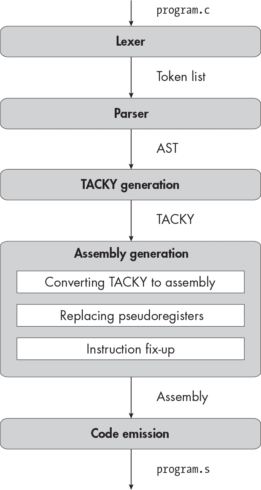

<samp class="SANS_Futura_Std_Book_Oblique_I_11">Description</samp>

<hgroup>

## <samp class="SANS_Futura_Std_Bold_Condensed_B_11">4</samp> <samp class="SANS_Dogma_OT_Bold_B_11">逻辑与关系操作符</samp>

</hgroup>


现在你已经知道如何编译二元操作符，接下来你将添加大量的操作符（再加一个一元操作符）。在本章中，你将添加三个逻辑操作符：NOT（<samp class="SANS_TheSansMonoCd_W5Regular_11">!</samp>）、AND（<samp class="SANS_TheSansMonoCd_W5Regular_11">&&</samp>）和 OR（<samp class="SANS_TheSansMonoCd_W5Regular_11">||</samp>）。你还将添加关系操作符：<samp class="SANS_TheSansMonoCd_W5Regular_11"><</samp>、<samp class="SANS_TheSansMonoCd_W5Regular_11">></samp>、<samp class="SANS_TheSansMonoCd_W5Regular_11">==</samp>，等等。这些操作符中的每一个都会测试某个条件，如果条件为真，则返回 1，否则返回 0。

<samp class="SANS_TheSansMonoCd_W5Regular_11">&&</samp>和<samp class="SANS_TheSansMonoCd_W5Regular_11">||</samp>操作符与我们迄今为止看到的二元操作符不同，因为它们是*短路*操作符：如果你在评估第一个操作数后就知道结果，那么就不再评估第二个操作数。为了支持短路逻辑，我们将在 TACKY 中添加新的指令，允许我们跳过代码块。在汇编生成阶段，我们还将引入几条新指令，包括条件汇编指令，只有在满足特定条件时，我们才会执行相应的操作。

在继续讲解编译器的处理过程之前，我们先简要讨论一下短路操作符。

### <samp class="SANS_Futura_Std_Bold_B_11">短路操作符</samp>

C 标准保证，当你不需要第二个操作数时，<samp class="SANS_TheSansMonoCd_W5Regular_11">&&</samp>和<samp class="SANS_TheSansMonoCd_W5Regular_11">||</samp>会进行短路。例如，考虑表达式<samp class="SANS_TheSansMonoCd_W5Regular_11">(1 - 1) &&</samp> <samp class="SANS_TheSansMonoCd_W5Regular_11">foo()</samp>。由于第一个操作数的值是 0，整个表达式将无论如何都评估为 0，不管<samp class="SANS_TheSansMonoCd_W5Regular_11">foo</samp>返回什么，因此我们根本不会调用<samp class="SANS_TheSansMonoCd_W5Regular_11">foo</samp>。同样，如果<samp class="SANS_TheSansMonoCd_W5Regular_11">||</samp>的第一个操作数非零，我们就不再评估第二个操作数。

这不仅仅是性能优化；第二个操作数可能不会改变表达式的结果，但它的求值可能会产生可见的副作用。例如，<samp class="SANS_TheSansMonoCd_W5Regular_11">foo</samp> 函数可能会执行 I/O 操作或更新全局变量。如果你的编译器没有实现<code><samp class="SANS_TheSansMonoCd_W5Regular_11">&&</samp></code> 和 <code><samp class="SANS_TheSansMonoCd_W5Regular_11">||</samp></code> 作为短路运算符，一些已编译的程序将表现异常。（标准在第 6.5.13 节第 4 段中定义了 <samp class="SANS_TheSansMonoCd_W5Regular_11">&&</samp> 运算符的行为，在第 6.5.14 节第 4 段中定义了 <samp class="SANS_TheSansMonoCd_W5Regular_11">||</samp> 运算符的行为。）

现在我们已经明确了这些运算符的工作方式，你可以继续编码了。

### <samp class="SANS_Futura_Std_Bold_B_11">词法分析器</samp>

本章中，你将添加九个新标记：

| <samp class="SANS_TheSansMonoCd_W7Bold_B_11">!</samp> | 感叹号，逻辑非运算符 |
| --- | --- |
| <samp class="SANS_TheSansMonoCd_W7Bold_B_11">&&</samp> | 两个与符号，逻辑与运算符 |
| <samp class="SANS_TheSansMonoCd_W7Bold_B_11">&#124;&#124;</samp> | 两个竖线，逻辑或运算符 |
| <samp class="SANS_TheSansMonoCd_W7Bold_B_11">==</samp> | 两个等号，“等于”运算符 |
| <samp class="SANS_TheSansMonoCd_W7Bold_B_11">!=</samp> | 感叹号后跟等号，“不等于”运算符 |
| <samp class="SANS_TheSansMonoCd_W7Bold_B_11"><</samp> | “小于”运算符 |
| <samp class="SANS_TheSansMonoCd_W7Bold_B_11">></samp> | “大于”运算符 |
| <samp class="SANS_TheSansMonoCd_W7Bold_B_11"><=</samp> | “小于或等于”运算符 |
| <samp class="SANS_TheSansMonoCd_W7Bold_B_11">>=</samp> | “大于或等于”运算符 |

你的词法分析器应该像处理其他运算符一样处理这些运算符。记住，词法分析器应该始终选择下一个标记的最长匹配项。例如，如果输入是 <samp class="SANS_TheSansMonoCd_W5Regular_11"><=something</samp>，词法分析器发出的下一个标记应该是 <samp class="SANS_TheSansMonoCd_W5Regular_11"><=</samp>，而不是 <samp class="SANS_TheSansMonoCd_W5Regular_11"><</samp>。

### <samp class="SANS_Futura_Std_Bold_B_11">解析器</samp>

接下来，我们将把新操作添加到 AST 定义中。清单 4-1 展示了更新后的定义，已添加的部分用粗体标出。

```
program = Program(function_definition)
function_definition = Function(identifier name, statement body)
statement = Return(exp)
exp = Constant(int)
    | Unary(unary_operator, exp)
    | Binary(binary_operator, exp, exp)
unary_operator = Complement | Negate **| Not**
binary_operator = Add | Subtract | Multiply | Divide | Remainder **| And | Or**
                **| Equal | NotEqual | LessThan | LessOrEqual**
                **| GreaterThan | GreaterOrEqual**
```

<samp class="SANS_Futura_Std_Book_Oblique_I_11">清单 4-1：带有比较和逻辑运算符的抽象语法树</samp>

我们还需要对语法做相应的修改，详情见清单 4-2。

```
<program> ::= <function>
<function> ::= "int" <identifier> "(" "void" ")" "{" <statement> "}"
<statement> ::= "return" <exp> ";"
<exp> ::= <factor> | <exp> <binop> <exp>
<factor> ::= <int> | <unop> <factor> | "(" <exp> ")"
<unop> ::= "-" | "~" **| "!"**
<binop> ::= "-" | "+" | "*" | "/" | "%" **| "&&" | "||"**
          **| "==" | "!=" | "<" | "<=" | ">" | ">="**
<identifier> ::= ? An identifier token ?
<int> ::= ? A constant token ?
```

<samp class="SANS_Futura_Std_Book_Oblique_I_11">清单 4-2：带有比较和逻辑运算符的语法</samp>

在 清单 4-1 和 4-2 中，我们增加了一些新运算符，但没有做其他更改。现在，我们准备更新解析代码。首先，更新 <samp class="SANS_TheSansMonoCd_W5Regular_11">parse_factor</samp> 来处理新的 <samp class="SANS_TheSansMonoCd_W5Regular_11">!</samp> 运算符。它应该以与解析一元运算符 <samp class="SANS_TheSansMonoCd_W5Regular_11">~</samp> 和 <samp class="SANS_TheSansMonoCd_W5Regular_11">-</samp> 运算符相同的方式解析 <samp class="SANS_TheSansMonoCd_W5Regular_11">!</samp>。

接下来，更新 <samp class="SANS_TheSansMonoCd_W5Regular_11">parse_exp</samp> 以处理新的二元运算符。在 第三章 中，我们将每个二元运算符与一个数字优先级值进行了关联。现在，我们将为新的运算符赋予优先级值。这些运算符的优先级低于 第三章 中的运算符，并且它们都是左结合的。在新的运算符中，<samp class="SANS_TheSansMonoCd_W5Regular_11"><</samp>、<samp class="SANS_TheSansMonoCd_W5Regular_11"><=</samp>、<samp class="SANS_TheSansMonoCd_W5Regular_11">></samp> 和 <samp class="SANS_TheSansMonoCd_W5Regular_11">>=</samp> 拥有最高的优先级，其次是等式运算符，<samp class="SANS_TheSansMonoCd_W5Regular_11">==</samp> 和 <samp class="SANS_TheSansMonoCd_W5Regular_11">!=</samp>。<samp class="SANS_TheSansMonoCd_W5Regular_11">&&</samp> 运算符的优先级低于等式运算符，而 <samp class="SANS_TheSansMonoCd_W5Regular_11">||</samp> 拥有最低的优先级。我选择的优先级值列在 表 4-1 中，新运算符以粗体显示。

<samp class="SANS_Futura_Std_Heavy_B_11">表 4-1：</samp> <samp class="SANS_Futura_Std_Book_11">旧版和新版二元运算符的优先级值</samp>

| <samp class="SANS_Futura_Std_Heavy_B_11">运算符</samp> | <samp class="SANS_Futura_Std_Heavy_B_11">优先级</samp> |
| --- | --- |
| <samp class="SANS_TheSansMonoCd_W5Regular_11">*</samp> | <samp class="SANS_Futura_Std_Book_11">50</samp> |
| <samp class="SANS_TheSansMonoCd_W5Regular_11">/</samp> | <samp class="SANS_Futura_Std_Book_11">50</samp> |
| <samp class="SANS_TheSansMonoCd_W5Regular_11">%</samp> | <samp class="SANS_Futura_Std_Book_11">50</samp> |
| <samp class="SANS_TheSansMonoCd_W5Regular_11">+</samp> | <samp class="SANS_Futura_Std_Book_11">45</samp> |
| <samp class="SANS_TheSansMonoCd_W5Regular_11">-</samp> | <samp class="SANS_Futura_Std_Book_11">45</samp> |
| <samp class="SANS_Futura_Std_Heavy_B_11"><</samp> | <samp class="SANS_Futura_Std_Heavy_B_11">35</samp> |
| <samp class="SANS_Futura_Std_Heavy_B_11"><=</samp> | <samp class="SANS_Futura_Std_Heavy_B_11">35</samp> |
| <samp class="SANS_Futura_Std_Heavy_B_11">></samp> | <samp class="SANS_Futura_Std_Heavy_B_11">35</samp> |
| <samp class="SANS_Futura_Std_Heavy_B_11">>=</samp> | <samp class="SANS_Futura_Std_Heavy_B_11">35</samp> |
| <samp class="SANS_Futura_Std_Heavy_B_11">==</samp> | <samp class="SANS_Futura_Std_Heavy_B_11">30</samp> |
| <samp class="SANS_Futura_Std_Heavy_B_11">!=</samp> | <samp class="SANS_Futura_Std_Heavy_B_11">30</samp> |
| <samp class="SANS_Futura_Std_Heavy_B_11">&&</samp> | <samp class="SANS_Futura_Std_Heavy_B_11">10</samp> |
| <samp class="SANS_Futura_Std_Heavy_B_11">&#124;&#124;</samp> | <samp class="SANS_Futura_Std_Heavy_B_11">5</samp> |

这些值间隔得足够远，可以为第三章中的可选位运算符留出空间。底部还留有足够的空间，供我们在接下来的两章中添加 <samp class="SANS_TheSansMonoCd_W5Regular_11">=</samp> 和 <samp class="SANS_TheSansMonoCd_W5Regular_11">?:</samp> 运算符。只要所有运算符之间的优先级关系正确，你不需要使用表格中的精确值。

你还需要扩展将令牌转换为 <samp class="SANS_TheSansMonoCd_W5Regular_11">unary _operator</samp> 和 <samp class="SANS_TheSansMonoCd_W5Regular_11">binary_operator</samp> AST 节点的代码。例如，将 <samp class="SANS_TheSansMonoCd_W5Regular_11">+</samp> 令牌转换为 <samp class="SANS_TheSansMonoCd_W5Regular_11">Add</samp> 节点的函数，应该还要将 <samp class="SANS_TheSansMonoCd_W5Regular_11">==</samp> 令牌转换为 <samp class="SANS_TheSansMonoCd_W5Regular_11">Equal</samp> 节点。（最后两章中的伪代码调用了单独的函数，<samp class="SANS_TheSansMonoCd_W5Regular_11">parse_unop</samp> 和 <samp class="SANS_TheSansMonoCd_W5Regular_11">parse_binop</samp>，来处理这些转换。）

一旦你更新了解析器的优先级值表，<samp class="SANS_TheSansMonoCd_W5Regular_11">parse _binop</samp> 和 <samp class="SANS_TheSansMonoCd_W5Regular_11">parse_unop</samp>，你就完成了！我们在上一章实现的优先级提升算法可以处理新的运算符，无需进一步更改。

### <samp class="SANS_Futura_Std_Bold_B_11">TACKY 生成</samp>

现在词法分析器和解析器已经正常工作，我们可以进入一个不太熟悉的领域：处理 TACKY 中的新运算符。你可以像实现二元运算符一样，将关系运算符转换为 TACKY。例如，给定表达式 <samp class="SANS_TheSansMonoCd_W5Regular_11">e1 < e2</samp>，生成的 TACKY 看起来像是 清单 4-3 中的内容。

```
`<instructions for e1>`
v1 = `<result of e1>`
`<instructions for e2>`
v2 = `<result of e2>`
Binary(LessThan, v1, v2, result)
```

<samp class="SANS_Futura_Std_Book_Oblique_I_11">清单 4-3：实现 TACKY 中的</samp> <samp class="SANS_Futura_Std_Book_Oblique_I_11"><</samp> <samp class="SANS_Futura_Std_Book_Oblique_I_11">运算符</samp>

然而，您不能通过这种方式生成 <samp class="SANS_TheSansMonoCd_W5Regular_11">&&</samp> 和 <samp class="SANS_TheSansMonoCd_W5Regular_11">||</samp> 操作符，因为它们是短路操作。列表 4-3 中的代码始终会评估 <samp class="SANS_TheSansMonoCd_W5Regular_11">e1</samp> 和 <samp class="SANS_TheSansMonoCd_W5Regular_11">e2</samp>，但我们需要生成的代码有时会跳过 <samp class="SANS_TheSansMonoCd_W5Regular_11">e2</samp>。为了支持短路操作符，我们将添加一条 *无条件跳转* 指令，允许我们跳转到程序中的其他位置。我们还将添加两条 *条件跳转* 指令，只有在满足特定条件时才会跳转。

#### <samp class="SANS_Futura_Std_Bold_Condensed_Oblique_BI_11">向 TACKY 中间表示添加跳转、复制和比较</samp>

列表 4-4 展示了最新的 TACKY 中间表示，包含新的跳转指令。

```
program = Program(function_definition)
function_definition = Function(identifier, instruction* body)
instruction = Return(val)
            | Unary(unary_operator, val src, val dst)
            | Binary(binary_operator, val src1, val src2, val dst)
            **| Copy(val src, val dst)**
            **| Jump(identifier target)**
            **| JumpIfZero(val condition, identifier target)**
            **| JumpIfNotZero(val condition, identifier target)**
            **| Label(identifier)**
val = Constant(int) | Var(identifier)
unary_operator = Complement | Negate **| Not**
binary_operator = Add | Subtract | Multiply | Divide | Remainder **| Equal | NotEqual**
                **| LessThan | LessOrEqual | GreaterThan | GreaterOrEqual**
```

<samp class="SANS_Futura_Std_Book_Oblique_I_11">列表 4-4：向 TACKY 添加比较、跳转和标签</samp>

<samp class="SANS_TheSansMonoCd_W5Regular_11">跳转</samp> 指令的工作原理与 C 语言中的 <samp class="SANS_TheSansMonoCd_W5Regular_11">goto</samp> 类似：它使程序跳转到某个标识符 <samp class="SANS_TheSansMonoCd_W5Regular_11">目标</samp> 所标记的位置。<samp class="SANS_TheSansMonoCd_W5Regular_11">标签</samp> 指令将标识符与程序中的位置关联起来。列表 4-5 中的 TACKY 代码片段展示了 <samp class="SANS_TheSansMonoCd_W5Regular_11">跳转</samp> 和 <samp class="SANS_TheSansMonoCd_W5Regular_11">标签</samp> 指令如何协同工作。

```
Unary(Negate, Constant(1), Var("tmp"))
Jump("there")
❶ Unary(Negate, Constant(2), Var("tmp"))
Label("there")
Return(Var("tmp"))
```

<samp class="SANS_Futura_Std_Book_Oblique_I_11">列表 4-5：TACKY 的代码片段，包含一条</samp> <samp class="SANS_Futura_Std_Book_Oblique_I_11">跳转</samp> <samp class="SANS_Futura_Std_Book_Oblique_I_11">指令</samp>

该程序将 <samp class="SANS_TheSansMonoCd_W5Regular_11">-1</samp> 存储在 <samp class="SANS_TheSansMonoCd_W5Regular_11">tmp</samp> 中，然后执行 <samp class="SANS_TheSansMonoCd_W5Regular_11">跳转</samp> 指令，跳转到 <samp class="SANS_TheSansMonoCd_W5Regular_11">标签</samp> 指令。接着，它执行 <samp class="SANS_TheSansMonoCd_W5Regular_11">返回</samp> 指令，返回 <samp class="SANS_TheSansMonoCd_W5Regular_11">-1</samp>。第二条 <samp class="SANS_TheSansMonoCd_W5Regular_11">一元</samp> 指令 ❶ 完全不会执行，因为我们跳过了它。

TACKY IR 中的第一个条件跳转指令 <samp class="SANS_TheSansMonoCd_W5Regular_11">JumpIfZero</samp>，当 <samp class="SANS_TheSansMonoCd_W5Regular_11">condition</samp> 的值为 0 时，跳转到由 <samp class="SANS_TheSansMonoCd_W5Regular_11">target</samp> 指定的指令。如果 <samp class="SANS_TheSansMonoCd_W5Regular_11">condition</samp> 不为 0，我们不会跳转到 <samp class="SANS_TheSansMonoCd_W5Regular_11">target</samp>，而是按常规执行下一条指令。第二个条件跳转指令 <samp class="SANS_TheSansMonoCd_W5Regular_11">JumpIfNotZero</samp> 则相反：只有当 <samp class="SANS_TheSansMonoCd_W5Regular_11">condition</samp> 不为 0 时，我们才会跳转到 <samp class="SANS_TheSansMonoCd_W5Regular_11">target</samp>。我们其实并不需要这两条指令，因为你可以使用其中一条指令配合 <samp class="SANS_TheSansMonoCd_W5Regular_11">Not</samp> 指令来实现相同的行为。但添加这两条指令可以使我们为 <samp class="SANS_TheSansMonoCd_W5Regular_11">&&</samp> 和 <samp class="SANS_TheSansMonoCd_W5Regular_11">||</samp> 运算符生成更简单的 TACKY，从而最终转换为更简洁、短小的汇编代码。

另一个新指令是 <samp class="SANS_TheSansMonoCd_W5Regular_11">Copy</samp>。由于 <samp class="SANS_TheSansMonoCd_W5Regular_11">&&</samp> 和 <samp class="SANS_TheSansMonoCd_W5Regular_11">||</samp> 最终返回 1 或 0，我们使用此指令将 1 或 0 复制到临时变量中，该变量保存表达式的结果。

除了这五个额外的指令外，最新的 TACKY IR 还包括新的关系和逻辑二元运算符，以及一元 <samp class="SANS_TheSansMonoCd_W5Regular_11">Not</samp> 运算符。

#### <samp class="SANS_Futura_Std_Bold_Condensed_Oblique_BI_11">将短路运算符转换为 TACKY</samp>

让我们使用新的 TACKY 指令来实现 <samp class="SANS_TheSansMonoCd_W5Regular_11">&&</samp> 和 <samp class="SANS_TheSansMonoCd_W5Regular_11">||</samp> 运算符。对于表达式 <samp class="SANS_TheSansMonoCd_W5Regular_11">e1 && e2</samp>，TACKY 应该如下所示 Listing 4-6。

```
`<instructions for e1>`
v1 = `<result of e1>`
JumpIfZero(v1, false_label)
`<instructions for e2>`
v2 = `<result of e2>`
JumpIfZero(v2, false_label)
result = 1
Jump(end)
Label(false_label)
result = 0
Label(end)
```

<samp class="SANS_Futura_Std_Book_Oblique_I_11">Listing 4-6: 在 TACKY 中实现</samp> <samp class="SANS_Futura_Std_Book_Oblique_I_11">&&</samp> <samp class="SANS_Futura_Std_Book_Oblique_I_11">运算符</samp>

我们首先评估<samp class="SANS_TheSansMonoCd_W5Regular_11">e1</samp>。如果它是 0，我们将直接跳过后续步骤，并将<samp class="SANS_TheSansMonoCd_W5Regular_11">result</samp>设置为<samp class="SANS_TheSansMonoCd_W5Regular_11">0</samp>，无需评估<samp class="SANS_TheSansMonoCd_W5Regular_11">e2</samp>。我们通过<samp class="SANS_TheSansMonoCd_W5Regular_11">JumpIfZero</samp>指令实现这一点；如果<samp class="SANS_TheSansMonoCd_W5Regular_11">v1</samp>为 0，我们直接跳转到<samp class="SANS_TheSansMonoCd_W5Regular_11">false_label</samp>，然后使用<samp class="SANS_TheSansMonoCd_W5Regular_11">Copy</samp>指令将<samp class="SANS_TheSansMonoCd_W5Regular_11">result</samp>设置为<samp class="SANS_TheSansMonoCd_W5Regular_11">0</samp>。（我将其写成<samp class="SANS_TheSansMonoCd_W5Regular_11">result</samp> <samp class="SANS_TheSansMonoCd_W5Regular_11">=</samp> <samp class="SANS_TheSansMonoCd_W5Regular_11">0</samp>，而不是<samp class="SANS_TheSansMonoCd_W5Regular_11">Copy(0, result)</samp>，以提高可读性。稍后的章节中，我会在 TACKY 符号表示法上做类似的处理。）如果<samp class="SANS_TheSansMonoCd_W5Regular_11">v1</samp>不是 0，我们仍然需要评估<samp class="SANS_TheSansMonoCd_W5Regular_11">e2</samp>。我们处理<samp class="SANS_TheSansMonoCd_W5Regular_11">v2</samp>为 0 的情况，方式与处理<samp class="SANS_TheSansMonoCd_W5Regular_11">v1</samp>为 0 时相同，使用<samp class="SANS_TheSansMonoCd_W5Regular_11">JumpIfZero</samp>跳转到<samp class="SANS_TheSansMonoCd_W5Regular_11">false_label</samp>。只有在没有执行任何条件跳转时，我们才会到达<samp class="SANS_TheSansMonoCd_W5Regular_11">Copy</samp>指令，<samp class="SANS_TheSansMonoCd_W5Regular_11">result</samp> <samp class="SANS_TheSansMonoCd_W5Regular_11">=</samp> <samp class="SANS_TheSansMonoCd_W5Regular_11">1</samp>。这意味着<samp class="SANS_TheSansMonoCd_W5Regular_11">e1</samp>和<samp class="SANS_TheSansMonoCd_W5Regular_11">e2</samp>都非零，因此我们将<samp class="SANS_TheSansMonoCd_W5Regular_11">result</samp>设置为<samp class="SANS_TheSansMonoCd_W5Regular_11">1</samp>。然后，我们跳过<samp class="SANS_TheSansMonoCd_W5Regular_11">result</samp> <samp class="SANS_TheSansMonoCd_W5Regular_11">=</samp> <samp class="SANS_TheSansMonoCd_W5Regular_11">0</samp>，跳转到<samp class="SANS_TheSansMonoCd_W5Regular_11">end</samp>标签，避免覆盖<samp class="SANS_TheSansMonoCd_W5Regular_11">result</samp>。

我会把将 <samp class="SANS_TheSansMonoCd_W5Regular_11">||</samp> 操作翻译成 TACKY 留给你自己完成。生成的 TACKY 将类似于 列表 4-6，但是它会使用 <samp class="SANS_TheSansMonoCd_W5Regular_11">JumpIfNotZero</samp> 指令，而不是 <samp class="SANS_TheSansMonoCd_W5Regular_11">JumpIfZero</samp>。这还剩下 <samp class="SANS_TheSansMonoCd_W5Regular_11">!</samp> 和所有的关系操作符；你可以像前几章中添加的一元和二元操作符一样，将它们转化为 TACKY。

#### <samp class="SANS_Futura_Std_Bold_Condensed_Oblique_BI_11">生成标签</samp>

标签和临时变量一样，必须在全局范围内唯一：像 <samp class="SANS_TheSansMonoCd_W5Regular_11">Jump("foo")</samp> 这样的指令，如果标签 <samp class="SANS_TheSansMonoCd_W5Regular_11">foo</samp> 出现在多个地方，就没有意义。你可以通过将全局计数器纳入标签中，确保它们是唯一的，就像你在 第二章 中对变量名所做的那样。

与临时变量不同，标签会出现在最终的汇编程序中，因此它们必须是汇编器认为语法上有效的标识符。它们应只包含字母、数字、点和下划线。选择描述性标签可以让你的汇编程序更易于阅读和调试。例如，你可以使用字符串 <samp class="SANS_TheSansMonoCd_W5Regular_11">and_false</samp><samp class="SANS_TheSansMonoCd_W5Regular_Italic_I_11">N</samp> 作为 列表 4-6 中的 <samp class="SANS_TheSansMonoCd_W5Regular_11">false_label</samp>，其中 <samp class="SANS_TheSansMonoCd_W5Regular_Italic_I_11">N</samp> 是全局计数器的当前值。

虽然标签不能相互冲突，但它们与临时变量名冲突是可以的。如果你在这里生成的标签与用户定义的函数名冲突也是可以的，即使自动生成的标签和函数名都会在最终的汇编程序中变成标签。我们将在代码生成时对自动生成的标签进行处理，以避免它们与用户定义的标识符冲突。

### <samp class="SANS_Futura_Std_Bold_B_11">汇编中的比较与跳转</samp>

在开始汇编生成过程之前，让我们先讲解一下我们需要的新汇编指令。首先，我们将讨论 <samp class="SANS_TheSansMonoCd_W5Regular_11">cmp</samp> 指令，它用于比较两个值，以及 *条件设置* 指令，它根据比较结果将字节设置为 1 或 0。我们将使用这些指令来实现像 <samp class="SANS_TheSansMonoCd_W5Regular_11"><</samp> 这样的关系操作符。接下来，我们将讨论条件跳转和无条件跳转指令。

#### <samp class="SANS_Futura_Std_Bold_Condensed_Oblique_BI_11">比较和状态标志</samp>

所有条件指令依赖的“条件”是 RFLAGS 寄存器的状态。与 EAX、RSP 和我们到目前为止见过的其他寄存器不同，我们通常不能直接设置 RFLAGS。相反，CPU 每次执行指令时会自动更新 RFLAGS。如其名称所示，这个寄存器中的每一位都是一个标志，报告有关最后一条指令或 CPU 状态的某些信息。不同的指令更新不同的标志：<samp class="SANS_TheSansMonoCd_W5Regular_11">add</samp>、<samp class="SANS_TheSansMonoCd_W5Regular_11">sub</samp> 和 <samp class="SANS_TheSansMonoCd_W5Regular_11">cmp</samp> 指令更新本节中我们将讨论的所有标志，而 <samp class="SANS_TheSansMonoCd_W5Regular_11">mov</samp> 指令则不更新任何标志。我们现在可以忽略其他指令的影响。在讨论 RFLAGS 时，每当我提到“最后一条指令”或“最后结果”，我指的是影响我正在讨论的特定标志的最后一条指令。

现在，我们关注这三个标志：

**零标志 (ZF)**

如果最后一条指令的结果为 0，则 ZF 被设置为 1；如果最后一条指令的结果为非零值，则 ZF 被设置为 0。

**符号标志 (SF)**

如果最后结果的最高有效位是 1，则 SF 被设置为 1；如果最高有效位是 0，则 SF 被设置为 0。记住，在二进制补码表示法中，负数的最高有效位始终是 1，正数的最高有效位始终是 0。因此，符号标志告诉我们最后一条指令的结果是正数还是负数。（如果最后的结果应该被解释为无符号整数，那么它不能为负数，因此符号标志没有意义。）

**溢出标志 (OF)**

如果最后一条指令导致有符号整数溢出，则 OF 被设置为 1；否则设置为 0。*整数溢出*发生在有符号整数操作的结果无法用可用的位数表示时。一个正数结果会在其值超过类型可以表示的最大值时发生溢出。假设我们正在操作 4 位整数。我们可以表示的最大有符号数是 7，即二进制表示为 <samp class="SANS_TheSansMonoCd_W5Regular_11">0111</samp>。如果我们使用 <samp class="SANS_TheSansMonoCd_W5Regular_11">add</samp> 指令将其加 1，结果是 <samp class="SANS_TheSansMonoCd_W5Regular_11">1000</samp>。如果我们将其解释为无符号整数，它的值是 8；但是，如果我们将其解释为二进制补码有符号整数，它的值是 -8。计算的结果应该是正数，但由于发生了溢出，它变成了负数。这个计算将溢出标志设置为 1。

我们还会遇到与此相反的整数溢出情况：当结果应该为负数，但它小于可能的最小值。例如，在普通数学中，–8 – 1 = –9。然而，如果我们使用 <samp class="SANS_TheSansMonoCd_W5Regular_11">sub</samp> 指令从–8 的 4 位二进制补码表示中减去 1，得到的是 <samp class="SANS_TheSansMonoCd_W5Regular_11">1000</samp>，结果会变成 <samp class="SANS_TheSansMonoCd_W5Regular_11">0111</samp>，即 7。此时，溢出标志也会被设置为 1。

无符号结果也可能对其类型表示来说过大或过小，但在本书中我不会将其称为整数溢出。相反，我称结果为 *环绕*，这与 C 标准中对无符号操作的术语以及大多数关于 x64 汇编的讨论更一致。我做出这个区分是因为无符号环绕遵循的规则与有符号整数溢出不同，CPU 对其检测的方式也不同。你将在第二部分学习如何处理无符号环绕。像 SF 一样，如果结果是无符号的，OF 是没有意义的。

表 4-2 和 表 4-3 总结了每种整数溢出的可能情况。表 4-2 描述了加法的结果。

<samp class="SANS_Futura_Std_Heavy_B_11">表 4-2：</samp> <samp class="SANS_Futura_Std_Book_11">从加法产生的整数溢出与下溢</samp>

| <samp class="SANS_TheSansMonoCd_W7Bold_B_11">a + b</samp> | <samp class="SANS_TheSansMonoCd_W7Bold_B_11">b > 0</samp> | <samp class="SANS_TheSansMonoCd_W7Bold_B_11">b < 0</samp> |
| --- | --- | --- |
| <samp class="SANS_TheSansMonoCd_W7Bold_B_11">a > 0</samp> | <samp class="SANS_Futura_Std_Book_11">从正数到负数的溢出</samp> | <samp class="SANS_Futura_Std_Book_11">都不是</samp> |
| <samp class="SANS_TheSansMonoCd_W7Bold_B_11">a < 0</samp> | <samp class="SANS_Futura_Std_Book_11">都不是</samp> | <samp class="SANS_Futura_Std_Book_11">从负数到正数的溢出</samp> |

表 4-3 描述了减法的结果；它只是 表 4-2 的列交换版本，因为 <samp class="SANS_TheSansMonoCd_W5Regular_11">a - b</samp> 和 <samp class="SANS_TheSansMonoCd_W5Regular_11">a</samp> <samp class="SANS_TheSansMonoCd_W5Regular_11">+</samp> <samp class="SANS_TheSansMonoCd_W5Regular_11">(- b)</samp> 是等价的。

<samp class="SANS_Futura_Std_Heavy_B_11">表 4-3：</samp> <samp class="SANS_Futura_Std_Book_11">从减法产生的整数溢出与下溢</samp>

| <samp class="SANS_TheSansMonoCd_W7Bold_B_11">a - b</samp> | <samp class="SANS_TheSansMonoCd_W7Bold_B_11">b > 0</samp> | <samp class="SANS_TheSansMonoCd_W7Bold_B_11">b < 0</samp> |
| --- | --- | --- |
| <samp class="SANS_TheSansMonoCd_W7Bold_B_11">a > 0</samp> | <samp class="SANS_Futura_Std_Book_11">都没有溢出</samp> | <samp class="SANS_Futura_Std_Book_11">从正数溢出到负数</samp> |
| <samp class="SANS_TheSansMonoCd_W7Bold_B_11">a < 0</samp> | <samp class="SANS_Futura_Std_Book_11">从负数溢出到正数</samp> | <samp class="SANS_Futura_Std_Book_11">都没有溢出</samp> |

指令 <samp class="SANS_TheSansMonoCd_W5Regular_11">cmp b, a</samp> 计算 <samp class="SANS_TheSansMonoCd_W5Regular_11">a - b</samp>，与 <samp class="SANS_TheSansMonoCd_W5Regular_11">sub</samp> 指令完全相同，并对 RFLAGS 产生相同的影响，但它会丢弃结果，而不是将其存储在 <samp class="SANS_TheSansMonoCd_W5Regular_11">a</samp> 中。当你只想比较两个数，而不想覆盖 <samp class="SANS_TheSansMonoCd_W5Regular_11">a</samp> 时，这种方式更为方便。

让我们来看看在执行 <samp class="SANS_TheSansMonoCd_W5Regular_11">cmp b, a</samp> 指令后 ZF 和 SF 的值：

+   如果 <samp class="SANS_TheSansMonoCd_W5Regular_11">a</samp> <samp class="SANS_TheSansMonoCd_W5Regular_11">==</samp> <samp class="SANS_TheSansMonoCd_W5Regular_11">b</samp>，则 <samp class="SANS_TheSansMonoCd_W5Regular_11">a - b</samp> 的结果为 0，因此 ZF 为 1，SF 为 0。

+   如果 <samp class="SANS_TheSansMonoCd_W5Regular_11">a > b</samp>，则 <samp class="SANS_TheSansMonoCd_W5Regular_11">a - b</samp> 是正数，因此 SF 和 ZF 都为 0。

+   如果 <samp class="SANS_TheSansMonoCd_W5Regular_11">a < b</samp>，则 <samp class="SANS_TheSansMonoCd_W5Regular_11">a - b</samp> 是负数，因此 SF 为 1，ZF 为 0。

通过执行 <samp class="SANS_TheSansMonoCd_W5Regular_11">cmp</samp> 指令，然后检查 ZF 和 SF，你可以处理本章中实现的每一个比较。但等一下！这并不完全正确，因为 <samp class="SANS_TheSansMonoCd_W5Regular_11">a - b</samp> 可能会发生溢出，这将改变 SF 的值。让我们来看看溢出如何影响每种情况：

+   如果 <samp class="SANS_TheSansMonoCd_W5Regular_11">a</samp> <samp class="SANS_TheSansMonoCd_W5Regular_11">==</samp> <samp class="SANS_TheSansMonoCd_W5Regular_11">b</samp>，则 <samp class="SANS_TheSansMonoCd_W5Regular_11">a - b</samp> 的结果为 0，因此不会发生溢出。

+   如果 <samp class="SANS_TheSansMonoCd_W5Regular_11">a > b</samp>，则当 <samp class="SANS_TheSansMonoCd_W5Regular_11">a</samp> 为正数且 <samp class="SANS_TheSansMonoCd_W5Regular_11">b</samp> 为负数时，<samp class="SANS_TheSansMonoCd_W5Regular_11">a - b</samp> 可能会溢出。此时，正确的结果应为正数，但如果发生溢出，结果将为负数。在这种情况下，SF 将为 1，OF 也会为 1。

+   如果 <samp class="SANS_TheSansMonoCd_W5Regular_11">a < b</samp>，则当 <samp class="SANS_TheSansMonoCd_W5Regular_11">a</samp> 为负且 <samp class="SANS_TheSansMonoCd_W5Regular_11">b</samp> 为正时，<samp class="SANS_TheSansMonoCd_W5Regular_11">a - b</samp> 可能会溢出。在这种情况下，正确的结果应该是负数，但实际结果将是正数。这意味着 SF 将为 0，但 OF 将为 1。

表 4-4 给出了我们考虑的每种情况中这些标志的值。

<samp class="SANS_Futura_Std_Heavy_B_11">表 4-4:</samp> <samp class="SANS_Futura_Std_Book_11">cmp</samp> 指令对状态标志的 <samp class="SANS_Futura_Std_Book_11">影响</samp>

|  | <samp class="SANS_Futura_Std_Heavy_B_11">ZF</samp> | <samp class="SANS_Futura_Std_Heavy_B_11">OF</samp> | <samp class="SANS_Futura_Std_Heavy_B_11">SF</samp> |
| --- | --- | --- | --- |
| <samp class="SANS_TheSansMonoCd_W7Bold_B_11">a</samp> <samp class="SANS_TheSansMonoCd_W7Bold_B_11">==</samp> <samp class="SANS_TheSansMonoCd_W7Bold_B_11">b</samp> | <samp class="SANS_Futura_Std_Book_11">1</samp> | <samp class="SANS_Futura_Std_Book_11">0</samp> | <samp class="SANS_Futura_Std_Book_11">0</samp> |
| <samp class="SANS_TheSansMonoCd_W7Bold_B_11">a > b</samp><samp class="SANS_Futura_Std_Medium_Oblique_I_11">, 无溢出</samp> | <samp class="SANS_Futura_Std_Book_11">0</samp> | <samp class="SANS_Futura_Std_Book_11">0</samp> | <samp class="SANS_Futura_Std_Book_11">0</samp> |
| <samp class="SANS_TheSansMonoCd_W7Bold_B_11">a > b</samp><samp class="SANS_Futura_Std_Medium_Oblique_I_11">, 溢出</samp> | <samp class="SANS_Futura_Std_Book_11">0</samp> | <samp class="SANS_Futura_Std_Book_11">1</samp> | <samp class="SANS_Futura_Std_Book_11">1</samp> |
| <samp class="SANS_TheSansMonoCd_W7Bold_B_11">a < b</samp><samp class="SANS_Futura_Std_Medium_Oblique_I_11">, 无溢出</samp> | <samp class="SANS_Futura_Std_Book_11">0</samp> | <samp class="SANS_Futura_Std_Book_11">0</samp> | <samp class="SANS_Futura_Std_Book_11">1</samp> |
| <samp class="SANS_TheSansMonoCd_W7Bold_B_11">a < b</samp><samp class="SANS_Futura_Std_Medium_Oblique_I_11">, 溢出</samp> | <samp class="SANS_Futura_Std_Book_11">0</samp> | <samp class="SANS_Futura_Std_Book_11">1</samp> | <samp class="SANS_Futura_Std_Book_11">0</samp> |

你可以通过检查 SF 和 OF 是否相同来判断<a class="SANS_TheSansMonoCd_W5Regular_11">a</a>和<b class="SANS_TheSansMonoCd_W5Regular_11">b</b>哪个更大。如果它们相同，我们知道<a class="SANS_TheSansMonoCd_W5Regular_11">a</a> <samp class="SANS_TheSansMonoCd_W5Regular_11">≥</samp> <samp class="SANS_TheSansMonoCd_W5Regular_11">b</samp>。或者它们都为 0，因为我们得到的是一个没有溢出的正（或零）结果，或者它们都为 1，因为我们得到了一个溢出的正结果，直到它变为负数。如果 SF 和 OF 不同，我们知道<a class="SANS_TheSansMonoCd_W5Regular_11">a < b</a>。要么我们得到一个没有溢出的负结果，要么我们得到一个溢出的负结果并变为正数。

现在你已经理解了如何设置 ZF、OF 和 SF，让我们来看一下几条依赖于这些标志的指令。

#### <samp class="SANS_Futura_Std_Bold_Condensed_Oblique_BI_11">条件设置指令</samp>

要实现关系运算符，我们首先使用<samp class="SANS_TheSansMonoCd_W5Regular_11">cmp</samp>指令设置一些标志，然后基于这些标志设置表达式的结果。我们通过*条件设置*指令执行第二步。每个条件设置指令接受一个寄存器或内存地址作为操作数，它根据 RFLAGS 的状态将该操作数设置为 0 或 1。所有的条件设置指令都是相同的，唯一的区别是它们测试不同的条件。表 4-5 列出了我们在本章中需要的条件设置指令。

<samp class="SANS_Futura_Std_Heavy_B_11">表 4-5：</samp> <samp class="SANS_Futura_Std_Book_11">条件设置指令</samp>

| <samp class="SANS_Futura_Std_Heavy_B_11">指令</samp> | <samp class="SANS_Futura_Std_Heavy_B_11">含义</samp> | <samp class="SANS_Futura_Std_Heavy_B_11">标志</samp> |
| --- | --- | --- |
| <samp class="SANS_TheSansMonoCd_W5Regular_11">sete</samp> | <samp class="SANS_Futura_Std_Book_11">如果</samp> <samp class="SANS_TheSansMonoCd_W5Regular_11">a</samp> <samp class="SANS_TheSansMonoCd_W5Regular_11">==</samp> <samp class="SANS_TheSansMonoCd_W5Regular_11">b</samp> <samp class="SANS_Futura_Std_Book_11">则设置字节</samp> | <samp class="SANS_Futura_Std_Book_11">ZF 设置</samp> |
| <samp class="SANS_TheSansMonoCd_W5Regular_11">setne</samp> | <samp class="SANS_Futura_Std_Book_11">如果</samp> <samp class="SANS_TheSansMonoCd_W5Regular_11">a !=</samp> <samp class="SANS_TheSansMonoCd_W5Regular_11">b</samp> <samp class="SANS_Futura_Std_Book_11">则设置字节</samp> | <samp class="SANS_Futura_Std_Book_11">ZF 未设置</samp> |
| <samp class="SANS_TheSansMonoCd_W5Regular_11">setg</samp> | <samp class="SANS_Futura_Std_Book_11">如果</samp> <samp class="SANS_TheSansMonoCd_W5Regular_11">a > b</samp> <samp class="SANS_Futura_Std_Book_11">则设置字节</samp> | <samp class="SANS_Futura_Std_Book_11">ZF 未设置且 SF == OF</samp> |
| <samp class="SANS_TheSansMonoCd_W5Regular_11">setge</samp> | <samp class="SANS_Futura_Std_Book_11">如果</samp> <samp class="SANS_TheSansMonoCd_W5Regular_11">a</samp> <samp class="SANS_TheSansMonoCd_W5Regular_11">≥</samp> <samp class="SANS_TheSansMonoCd_W5Regular_11">b</samp> <samp class="SANS_Futura_Std_Book_11">SF == OF</samp> |
| <samp class="SANS_TheSansMonoCd_W5Regular_11">setl</samp> | <samp class="SANS_Futura_Std_Book_11">如果</samp> <samp class="SANS_TheSansMonoCd_W5Regular_11">a < b</samp> <samp class="SANS_Futura_Std_Book_11">SF != OF</samp> |
| <samp class="SANS_TheSansMonoCd_W5Regular_11">setle</samp> | <samp class="SANS_Futura_Std_Book_11">如果</samp> <samp class="SANS_TheSansMonoCd_W5Regular_11">a</samp> <samp class="SANS_TheSansMonoCd_W5Regular_11">≤</samp> <samp class="SANS_TheSansMonoCd_W5Regular_11">b</samp> <samp class="SANS_Futura_Std_Book_11">ZF 已设置或 SF != OF</samp> |

与我们到目前为止看到的其他指令不同，条件设置指令仅接受 1 字节操作数。例如，<samp class="SANS_TheSansMonoCd_W5Regular_11">sete %eax</samp>不是有效指令，因为 EAX 是 4 字节寄存器。然而，指令 <samp class="SANS_TheSansMonoCd_W5Regular_11">sete %al</samp> 是有效的；它设置了 AL 寄存器，EAX 的最低有效字节。为了有条件地将整个 EAX 寄存器设置为 0 或 1，你需要在设置 AL 之前将 EAX 清零，因为条件设置指令不会清除其上半部分字节。例如，如果 EAX 是

```
11111111111111111111111111111011
```

然后你运行

```
movl    $2, %edx
cmpl    $1, %edx
sete    %al
```

然后 EAX 中的新值是

```
11111111111111111111111100000000
```

这显然不是 0。<samp class="SANS_TheSansMonoCd_W5Regular_11">sete</samp>指令将 EAX 的最后一个字节清零，但没有清除其他部分。

如果其操作数是一个内存地址，条件设置指令将更新该地址处的单字节。请注意，内存地址可以是 1 字节、4 字节或 8 字节的操作数，这取决于上下文。在 <samp class="SANS_TheSansMonoCd_W5Regular_11">sete -4(%rbp)</samp> 中，操作数 <samp class="SANS_TheSansMonoCd_W5Regular_11">-4(%rbp)</samp> 表示 RBP-4 处的单字节内存；在 <samp class="SANS_TheSansMonoCd_W5Regular_11">addl $1, -4(%rbp)</samp> 中，它表示从 RBP-4 开始的 4 字节内存。

#### <samp class="SANS_Futura_Std_Bold_Condensed_Oblique_BI_11">跳转指令</samp>

<samp class="SANS_TheSansMonoCd_W5Regular_11">jmp</samp>汇编指令接受一个标签作为参数，并执行无条件跳转到该标签。跳转汇编指令操作另一个特殊目的寄存器 RIP，RIP 始终保存下一个要执行的指令的地址（IP 代表*指令指针*）。为了执行一系列指令，CPU 进行*取指-执行周期*：

1.  从 RIP 指向的内存地址中取出指令并将其存储在一个特殊用途的*指令寄存器*中。（此寄存器没有名称，因为你无法在汇编中引用它。）

1.  将 RIP 增量指向下一条指令。x64 中的指令长度并不相同，因此 CPU 必须检查它刚刚取回的指令的长度，并按该长度增加 RIP。

1.  在指令寄存器中运行指令。

1.  重复执行。

通常，按照这些步骤执行指令时，它们会按照出现在内存中的顺序执行。但 <samp class="SANS_TheSansMonoCd_W5Regular_11">jmp</samp> 将一个新值放入 RIP 中，这会改变 CPU 下一步执行的指令。汇编器和链接器将跳转指令中的标签转换为 *相对偏移量*，该偏移量告诉你应该如何增减 RIP。请参考 清单 4-7 中的汇编代码片段。

```
 addl    $1, %eax
    jmp     foo
    movl    $0, %eax
foo:
    ret
```

<samp class="SANS_Futura_Std_Book_Oblique_I_11">清单 4-7：包含</samp> <samp class="SANS_Futura_Std_Book_Oblique_I_11">jmp</samp> <samp class="SANS_Futura_Std_Book_Oblique_I_11">指令的汇编代码片段</samp>

<samp class="SANS_TheSansMonoCd_W5Regular_11">movl $0, %eax</samp> 的机器指令长度为 5 字节。为了跳过它并执行 <samp class="SANS_TheSansMonoCd_W5Regular_11">ret</samp> 指令，<samp class="SANS_TheSansMonoCd_W5Regular_11">jmp</samp> 需要额外增加 5 字节。汇编器和链接器因此将 <samp class="SANS_TheSansMonoCd_W5Regular_11">jmp foo</samp> 转换为 <samp class="SANS_TheSansMonoCd_W5Regular_11">jmp 5</samp> 的机器指令。然后，当 CPU 执行该指令时，它：

1.  获取指令 <samp class="SANS_TheSansMonoCd_W5Regular_11">jmp 5</samp> 并将其存储在指令寄存器中。

1.  增加 RIP，以指向下一条指令 <samp class="SANS_TheSansMonoCd_W5Regular_11">movl $0, %eax</samp>。

1.  执行 <samp class="SANS_TheSansMonoCd_W5Regular_11">jmp 5</samp>。这会将 RIP 增加 5 字节，使其指向 <samp class="SANS_TheSansMonoCd_W5Regular_11">ret</samp>。

1.  获取 RIP 指向的指令 <samp class="SANS_TheSansMonoCd_W5Regular_11">ret</samp>，并从该位置继续取指-执行周期。

请注意，标签不是指令：CPU 不执行它们，且它们不会出现在最终可执行文件的文本区中（该部分包含机器指令）。

*条件跳转*将标签作为参数，但只有在条件满足时才跳转到该标签。条件跳转看起来与条件设置指令非常相似；它们依赖于相同的条件，使用 RFLAGS 中的相同标志。例如，清单 4-8 中的汇编代码如果 EAX 和 EDX 寄存器相等，则返回 <samp class="SANS_TheSansMonoCd_W5Regular_11">3</samp>，否则返回 <samp class="SANS_TheSansMonoCd_W5Regular_11">0</samp>。

```
 cmpl    %eax, %edx
    je      return3
    movl    $0, %eax
    ret
return3:
    movl    $3, %eax
    ret
```

<samp class="SANS_Futura_Std_Book_Oblique_I_11">清单 4-8：包含条件跳转的汇编代码片段</samp>

如果 EAX 和 EDX 的值相等，<samp class="SANS_TheSansMonoCd_W5Regular_11">cmpl</samp>会将 ZF 设置为 1，接着<samp class="SANS_TheSansMonoCd_W5Regular_11">je</samp>跳转到<samp class="SANS_TheSansMonoCd_W5Regular_11">return3</samp>。然后，紧随<samp class="SANS_TheSansMonoCd_W5Regular_11">return3</samp>之后的两个指令会执行，函数返回<samp class="SANS_TheSansMonoCd_W5Regular_11">3</samp>。如果 EAX 和 EDX 不相等，<samp class="SANS_TheSansMonoCd_W5Regular_11">je</samp>不会执行跳转，函数返回<samp class="SANS_TheSansMonoCd_W5Regular_11">0</samp>。类似地，<samp class="SANS_TheSansMonoCd_W5Regular_11">jne</samp>只有当 ZF 为 0 时才会跳转。还有其他一些跳转指令检查不同的条件，但在这一章中我们不需要它们。

### <samp class="SANS_Futura_Std_Bold_B_11">汇编生成</samp>

既然你已经理解了所需的新的汇编指令集，让我们扩展汇编 AST 并更新每个汇编生成阶段。列表 4-9 定义了最新的汇编 AST，新增的部分已加粗显示。

```
program = Program(function_definition)
function_definition = Function(identifier name, instruction* instructions)
instruction = Mov(operand src, operand dst)
            | Unary(unary_operator, operand)
            | Binary(binary_operator, operand, operand)
            **| Cmp(operand, operand)**
            | Idiv(operand)
            | Cdq
            **| Jmp(identifier)**
            **| JmpCC(cond_code, identifier)**
            **| SetCC(cond_code, operand)**
            **| Label(identifier)**
            | AllocateStack(int)
            | Ret
unary_operator = Neg | Not
binary_operator = Add | Sub | Mult
operand = Imm(int) | Reg(reg) | Pseudo(identifier) | Stack(int)
**cond_code = E | NE | G | GE | L | LE**
reg = AX | DX | R10 | R11
```

<samp class="SANS_Futura_Std_Book_Oblique_I_11">列表 4-9：包含比较和条件指令的汇编 AST</samp>

由于所有条件跳转指令的形式相同，我们通过一个<samp class="SANS_TheSansMonoCd_W5Regular_11">JmpCC</samp>指令表示它们，并通过不同的条件码区分它们。我们对条件设置指令也做同样的处理。虽然<samp class="SANS_TheSansMonoCd_W5Regular_11">Label</samp>实际上不是指令（因为标签不会被 CPU 执行），但在此阶段我们将标签视为指令。

为了实现 TACKY <samp class="SANS_TheSansMonoCd_W5Regular_11">JumpIfZero</samp>和<samp class="SANS_TheSansMonoCd_W5Regular_11">JumpIfNotZero</samp>指令，我们使用新的<samp class="SANS_TheSansMonoCd_W5Regular_11">JmpCC</samp>汇编指令。我们转换

```
JumpIfZero(val, target)
```

为：

```
Cmp(Imm(0), val)
JmpCC(E, target)
```

我们以相同的方式实现<samp class="SANS_TheSansMonoCd_W5Regular_11">JumpIfNotZero</samp>，但条件码使用<samp class="SANS_TheSansMonoCd_W5Regular_11">NE</samp>代替<samp class="SANS_TheSansMonoCd_W5Regular_11">E</samp>。

类似地，我们使用条件设置指令实现所有的关系运算符。例如，TACKY 指令

```
Binary(GreaterThan, src1, src2, dst)
```

变为：

```
Cmp(src2, src1)
Mov(Imm(0), dst)
SetCC(G, dst)
```

对于所有其他关系运算符，替换<font class="SANS_TheSansMonoCd_W5Regular_11">G</font>为相应的条件码。记得在条件设定指令之前清零目标寄存器，因为它仅设置最低字节。在<font class="SANS_TheSansMonoCd_W5Regular_11">cmp</font>指令之后执行<font class="SANS_TheSansMonoCd_W5Regular_11">mov</font>是安全的，因为<font class="SANS_TheSansMonoCd_W5Regular_11">mov</font>不会改变 RFLAGS。一个潜在的问题是，<font class="SANS_TheSansMonoCd_W5Regular_11">SetCC</font>需要一个 1 字节的操作数，但<font class="SANS_TheSansMonoCd_W5Regular_11">dst</font>是 4 字节；幸运的是，我们可以在代码生成阶段处理这个问题。如果<font class="SANS_TheSansMonoCd_W5Regular_11">dst</font>是内存中的位置，<font class="SANS_TheSansMonoCd_W5Regular_11">SetCC</font>会设置该位置的第一个字节，这正是我们需要的行为。（由于 x64 处理器是*小端*，第一个字节是最低有效字节，因此将该字节设置为 1 会将整个 32 位值设置为 1。）如果<font class="SANS_TheSansMonoCd_W5Regular_11">dst</font>是寄存器，我们将在代码生成过程中使用相应的 1 字节寄存器名称来发出<font class="SANS_TheSansMonoCd_W5Regular_11">SetCC</font>。汇编 AST 中的寄存器大小不敏感，因此无论我们将<font class="SANS_TheSansMonoCd_W5Regular_11">dst</font>作为 4 字节操作数还是 1 字节操作数使用，目前我们都以相同的方式表示它。

因为<font class="SANS_TheSansMonoCd_W5Regular_11">!x</font>等价于<font class="SANS_TheSansMonoCd_W5Regular_11">x</font> <font class="SANS_TheSansMonoCd_W5Regular_11">==</font> <font class="SANS_TheSansMonoCd_W5Regular_11">0</font>，我们也通过条件设定指令实现一元运算符<font class="SANS_TheSansMonoCd_W5Regular_11">!</font>。我们转换 TACKY 指令

```
Unary(Not, src, dst)
```

转换成：

```
Cmp(Imm(0), src)
Mov(Imm(0), dst)
SetCC(E, dst)
```

剩余的 TACKY 指令——<samp class="SANS_TheSansMonoCd_W5Regular_11">Jump</samp>、<samp class="SANS_TheSansMonoCd_W5Regular_11">Label</samp>和<samp class="SANS_TheSansMonoCd_W5Regular_11">Copy</samp>——很简单。一个 TACKY 的<font class="SANS_TheSansMonoCd_W5Regular_11">Jump</font>变成汇编语言中的<font class="SANS_TheSansMonoCd_W5Regular_11">Jmp</font>，<font class="SANS_TheSansMonoCd_W5Regular_11">Label</font>变成<font class="SANS_TheSansMonoCd_W5Regular_11">Label</font>，<font class="SANS_TheSansMonoCd_W5Regular_11">Copy</font>变成<font class="SANS_TheSansMonoCd_W5Regular_11">Mov</font>。表 4-6 和 4-7 总结了如何将每个新的 TACKY 结构转换为汇编语言。请注意，这些表格只包含新的结构，与第二章和第三章中的等效表格不同。

表 4-6 显示了如何将新的 <samp class="SANS_TheSansMonoCd_W5Regular_11">Copy</samp>、<samp class="SANS_TheSansMonoCd_W5Regular_11">Label</samp> 以及条件和无条件跳转指令转换为汇编，同时展示了带有新 <samp class="SANS_TheSansMonoCd_W5Regular_11">Not</samp> 操作符的 <samp class="SANS_TheSansMonoCd_W5Regular_11">Unary</samp> 指令和带有新关系运算符的 <samp class="SANS_TheSansMonoCd_W5Regular_11">Binary</samp> 指令。

<samp class="SANS_Futura_Std_Heavy_B_11">表 4-6：</samp> <samp class="SANS_Futura_Std_Book_11">将 TACKY 指令转换为汇编</samp>

| <samp class="SANS_Futura_Std_Heavy_B_11">TACKY 指令</samp> | <samp class="SANS_Futura_Std_Heavy_B_11">汇编指令</samp> |
| --- | --- |

| <samp class="SANS_TheSansMonoCd_W5Regular_11">Unary(Not, src, dst)</samp> | <samp class="SANS_TheSansMonoCd_W5Regular_11">Cmp(Imm(0), src) Mov(Imm(0), dst)</samp> |

SetCC(E, dst)</samp> |

| <samp class="SANS_TheSansMonoCd_W5Regular_11">Binary(relational_operator, src1, src2, dst)</samp> | <samp class="SANS_TheSansMonoCd_W5Regular_11">Cmp(src2, src1) Mov(Imm(0), dst)</samp>

<samp class="SANS_TheSansMonoCd_W5Regular_11">SetCC(relational_operator, dst)</samp> |

| <samp class="SANS_TheSansMonoCd_W5Regular_11">Jump(target)</samp> | <samp class="SANS_TheSansMonoCd_W5Regular_11">Jmp(target)</samp> |
| --- | --- |
| <samp class="SANS_TheSansMonoCd_W5Regular_11">JumpIfZero(condition, target)</samp> | <samp class="SANS_TheSansMonoCd_W5Regular_11">Cmp(Imm(0), condition) JmpCC(E, target)</samp> |
| <samp class="SANS_TheSansMonoCd_W5Regular_11">JumpIfNotZero(condition, target)</samp> | <samp class="SANS_TheSansMonoCd_W5Regular_11">Cmp(Imm(0), condition) JmpCC(NE, target)</samp> |
| <samp class="SANS_TheSansMonoCd_W5Regular_11">Copy(src, dst)</samp> | <samp class="SANS_TheSansMonoCd_W5Regular_11">Mov(src, dst)</samp> |
| <samp class="SANS_TheSansMonoCd_W5Regular_11">Label(identifier)</samp> | <samp class="SANS_TheSansMonoCd_W5Regular_11">Label(identifier)</samp> |

表 4-7 给出了 TACKY 中每个关系运算符的相应条件代码。

<samp class="SANS_Futura_Std_Heavy_B_11">表 4-7：</samp> <samp class="SANS_Futura_Std_Book_11">将 TACKY 比较转换为汇编</samp>

| <samp class="SANS_Futura_Std_Heavy_B_11">TACKY 比较</samp> | <samp class="SANS_Futura_Std_Heavy_B_11">汇编条件代码</samp> |
| --- | --- |
| <samp class="SANS_TheSansMonoCd_W5Regular_11">Equal</samp> | <samp class="SANS_TheSansMonoCd_W5Regular_11">E</samp> |
| <samp class="SANS_TheSansMonoCd_W5Regular_11">NotEqual</samp> | <samp class="SANS_TheSansMonoCd_W5Regular_11">NE</samp> |
| <samp class="SANS_TheSansMonoCd_W5Regular_11">LessThan</samp> | <samp class="SANS_TheSansMonoCd_W5Regular_11">L</samp> |
| <samp class="SANS_TheSansMonoCd_W5Regular_11">LessOrEqual</samp> | <samp class="SANS_TheSansMonoCd_W5Regular_11">LE</samp> |
| <samp class="SANS_TheSansMonoCd_W5Regular_11">GreaterThan</samp> | <samp class="SANS_TheSansMonoCd_W5Regular_11">G</samp> |
| <samp class="SANS_TheSansMonoCd_W5Regular_11">GreaterOrEqual</samp> | <samp class="SANS_TheSansMonoCd_W5Regular_11">GE</samp> |

从现在开始，每章描述从 TACKY 到汇编的转换的表格将仅显示与前一章不同的部分。附录 B 包含了两组表格，展示了从 TACKY 到汇编的完整转换：一组显示了在 第一部分结束时的转换，另一组显示了在 第二部分结束时的转换。

#### <samp class="SANS_Futura_Std_Bold_Condensed_Oblique_BI_11">替换伪寄存器</samp>

更新此过程，以便将新出现的 <samp class="SANS_TheSansMonoCd_W5Regular_11">Cmp</samp> 和 <samp class="SANS_TheSansMonoCd_W5Regular_11">SetCC</samp> 指令使用的任何伪寄存器替换为栈地址，就像你为其他所有指令所做的那样。

#### <samp class="SANS_Futura_Std_Bold_Condensed_Oblique_BI_11">修正 cmp 指令</samp>

<samp class="SANS_TheSansMonoCd_W5Regular_11">cmp</samp> 指令，和 <samp class="SANS_TheSansMonoCd_W5Regular_11">mov</samp>、<samp class="SANS_TheSansMonoCd_W5Regular_11">add</samp>、<samp class="SANS_TheSansMonoCd_W5Regular_11">sub</samp> 指令一样，不能对两个操作数使用内存地址。我们按照通常的方式重写它，将

```
cmpl    -4(%rbp), -8(%rbp)
```

转换为：

```
movl    -4(%rbp), %r10d
cmpl    %r10d, -8(%rbp)
```

<samp class="SANS_TheSansMonoCd_W5Regular_11">cmp</samp> 指令的第二个操作数不能是常量。如果你记得 <samp class="SANS_TheSansMonoCd_W5Regular_11">cmp</samp> 遵循与 <samp class="SANS_TheSansMonoCd_W5Regular_11">sub</samp> 相同的格式，这样就能理解。<samp class="SANS_TheSansMonoCd_W5Regular_11">sub</samp>、<samp class="SANS_TheSansMonoCd_W5Regular_11">add</samp> 或 <samp class="SANS_TheSansMonoCd_W5Regular_11">imul</samp> 指令的第二个操作数也不能是常量，因为该操作数保存结果。尽管 <samp class="SANS_TheSansMonoCd_W5Regular_11">cmp</samp> 不产生结果，但相同的规则适用。我们重写

```
cmpl    %eax, $5
```

作为：

```
movl    $5, %r11d
cmpl    %eax, %r11d
```

遵循前一章节的约定，我们使用 R10 固定 <samp class="SANS_TheSansMonoCd_W5Regular_11">cmp</samp> 指令的第一个操作数，使用 R11 固定其第二个操作数。

### <samp class="SANS_Futura_Std_Bold_B_11">代码发射</samp>

我们已经生成了一个有效的汇编程序，准备开始发射它。在本章中，代码发射稍微复杂一些，原因有两个。首先，我们处理的是 1 字节和 4 字节寄存器。我们将根据寄存器出现在条件集指令（需要 1 字节操作数）还是其他我们到目前为止遇到的指令（需要 4 字节操作数）中，打印出不同的寄存器名称。

第二个问题是生成标签。某些汇编标签是由编译器自动生成的，而另一些——函数名——是用户定义的标识符。目前，唯一的函数名是 <samp class="SANS_TheSansMonoCd_W5Regular_11">main</samp>，但最终我们将编译包含任意函数名的程序。由于标签必须是唯一的，因此自动生成的标签不能与程序中可能出现的任何函数名冲突。

我们通过为自动生成的标签添加一个特殊的*本地标签*前缀来避免冲突。Linux 上的本地标签前缀是 <samp class="SANS_TheSansMonoCd_W5Regular_11">.L</samp>，而 macOS 上是 <samp class="SANS_TheSansMonoCd_W5Regular_11">L</samp>。在 Linux 上，这些标签不会与用户定义的标识符冲突，因为 C 语言中的标识符不能包含句点。在 macOS 上，它们也不会冲突，因为我们会在所有用户定义的名称前加下划线（例如，<samp class="SANS_TheSansMonoCd_W5Regular_11">main</samp> 变成 <samp class="SANS_TheSansMonoCd_W5Regular_11">_main</samp>）。

本地标签有一个方便的优点：当你需要调试这段代码时，它们不会混淆 GDB 或 LLDB。汇编器将大多数标签放入目标文件的符号表中，但会将以本地标签前缀开头的标签排除在外。如果自动生成的标签出现在符号表中，GDB 和 LLDB 会误将它们当作函数名，这样在你尝试反汇编一个函数或查看堆栈跟踪时就会出现问题。

除了这两个问题，代码生成过程相对直接。表 4-8 到 4-10 总结了这一阶段的变更。从这一点开始，代码生成表格将只显示与前一章不同的部分，就像描述从 TACKY 到汇编的转换的表格一样。请参阅 附录 B 获取完整的代码生成过程概览；它包括三组表格，展示了这一过程在 第一部分、第二部分 和 第三部分 结束时的样子。

表 4-8 展示了如何打印出本章的新汇编指令。它使用 <samp class="SANS_TheSansMonoCd_W5Regular_11">.L</samp> 前缀来表示本地标签；如果你使用的是 macOS，请改用不带句点的 <samp class="SANS_TheSansMonoCd_W5Regular_11">L</samp> 前缀。

<samp class="SANS_Futura_Std_Heavy_B_11">表 4-8:</samp> <samp class="SANS_Futura_Std_Book_11">格式化汇编指令</samp>

| <samp class="SANS_Futura_Std_Heavy_B_11">汇编指令</samp> | <samp class="SANS_Futura_Std_Heavy_B_11">输出</samp> |
| --- | --- |
| <samp class="SANS_TheSansMonoCd_W5Regular_11">Cmp(operand, operand)</samp> |

```
<samp class="SANS_TheSansMonoCd_W5Regular_11">cmpl   </samp> <samp class="SANS_TheSansMonoCd_W5Regular_Italic_I_11"><operand>,</samp> <samp class="SANS_TheSansMonoCd_W5Regular_11"><samp class="SANS_TheSansMonoCd_W5Regular_Italic_I_11"><operand></samp></samp>
```

|

| <samp class="SANS_TheSansMonoCd_W5Regular_11">Jmp(label)</samp> |
| --- |

```
<samp class="SANS_TheSansMonoCd_W5Regular_11">jmp     .L</samp><samp class="SANS_TheSansMonoCd_W5Regular_Italic_I_11"><label></samp>
```

|

| <samp class="SANS_TheSansMonoCd_W5Regular_11">JmpCC(cond_code, label)</samp> |
| --- |

```
<samp class="SANS_TheSansMonoCd_W5Regular_11">j</samp><samp class="SANS_TheSansMonoCd_W5Regular_Italic_I_11"><cond_code></samp> <samp class="SANS_TheSansMonoCd_W5Regular_11">.L</samp><samp class="SANS_TheSansMonoCd_W5Regular_Italic_I_11"><label></samp>
```

|

| <samp class="SANS_TheSansMonoCd_W5Regular_11">SetCC(cond_code, operand)</samp> |
| --- |

```
<samp class="SANS_TheSansMonoCd_W5Regular_11">set</samp><samp class="SANS_TheSansMonoCd_W5Regular_Italic_I_11"><cond_code></samp> <samp class="SANS_TheSansMonoCd_W5Regular_11"></samp> <samp class="SANS_TheSansMonoCd_W5Regular_Italic_I_11"><operand></samp>
```

|

| <samp class="SANS_TheSansMonoCd_W5Regular_11">标签(label)</samp> |
| --- |

```
<samp class="SANS_TheSansMonoCd_W5Regular_11">.L</samp><samp class="SANS_TheSansMonoCd_W5Regular_Italic_I_11"><label></samp><samp class="SANS_TheSansMonoCd_W5Regular_11">:</samp>
```

|

`<samp class="SANS_TheSansMonoCd_W5Regular_11">cmp</samp>` 指令添加了一个 `<samp class="SANS_TheSansMonoCd_W5Regular_11">l</samp>` 后缀，用来表示它操作的是 4 字节的值。条件设置指令不使用后缀来指示操作数大小，因为它们只支持 1 字节的操作数。跳转和标签也不使用操作数大小后缀，因为它们不需要操作数。然而，条件跳转和设置指令确实需要后缀来表示它们测试的条件。表 4-9 给出了每个条件码对应的后缀。

<samp class="SANS_Futura_Std_Heavy_B_11">表 4-9:</samp> <samp class="SANS_Futura_Std_Book_11">条件码指令后缀</samp>

| <samp class="SANS_Futura_Std_Heavy_B_11">条件码</samp> | <samp class="SANS_Futura_Std_Heavy_B_11">指令后缀</samp> |
| --- | --- |
| <samp class="SANS_TheSansMonoCd_W5Regular_11">E</samp> | <samp class="SANS_TheSansMonoCd_W5Regular_11">e</samp> |
| <samp class="SANS_TheSansMonoCd_W5Regular_11">NE</samp> | <samp class="SANS_TheSansMonoCd_W5Regular_11">ne</samp> |
| <samp class="SANS_TheSansMonoCd_W5Regular_11">L</samp> | <samp class="SANS_TheSansMonoCd_W5Regular_11">l</samp> |
| <samp class="SANS_TheSansMonoCd_W5Regular_11">LE</samp> | <samp class="SANS_TheSansMonoCd_W5Regular_11">le</samp> |
| <samp class="SANS_TheSansMonoCd_W5Regular_11">G</samp> | <samp class="SANS_TheSansMonoCd_W5Regular_11">g</samp> |
| <samp class="SANS_TheSansMonoCd_W5Regular_11">GE</samp> | <samp class="SANS_TheSansMonoCd_W5Regular_11">ge</samp> |

最后，表 4-10 给出了每个寄存器的 1 字节和 4 字节别名。4 字节别名与前一章相同；新的 1 字节别名用粗体标出。

<samp class="SANS_Futura_Std_Heavy_B_11">表 4-10:</samp> <samp class="SANS_Futura_Std_Book_11">格式化汇编操作数</samp>

| <samp class="SANS_Futura_Std_Heavy_B_11">汇编操作数</samp> | <samp class="SANS_Futura_Std_Heavy_B_11">输出</samp> |
| --- | --- |
| <samp class="SANS_TheSansMonoCd_W5Regular_11">Reg(AX)</samp> | <samp class="SANS_Futura_Std_Book_11">4 字节</samp> | <samp class="SANS_TheSansMonoCd_W5Regular_11">%eax</samp> |
|  | <samp class="SANS_Futura_Std_Heavy_B_11">1 字节</samp> | <samp class="SANS_TheSansMonoCd_W7Bold_B_11">%al</samp> |
| <samp class="SANS_TheSansMonoCd_W5Regular_11">Reg(DX)</samp> | <samp class="SANS_Futura_Std_Book_11">4 字节</samp> | <samp class="SANS_TheSansMonoCd_W5Regular_11">%edx</samp> |
|  | <samp class="SANS_Futura_Std_Heavy_B_11">1 字节</samp> | <samp class="SANS_TheSansMonoCd_W7Bold_B_11">%dl</samp> |
| <samp class="SANS_TheSansMonoCd_W5Regular_11">Reg(R10)</samp> | <samp class="SANS_Futura_Std_Book_11">4 字节</samp> | <samp class="SANS_TheSansMonoCd_W5Regular_11">%r10d</samp> |
|  | <samp class="SANS_Futura_Std_Heavy_B_11">1 字节</samp> | <samp class="SANS_TheSansMonoCd_W7Bold_B_11">%r10b</samp> |
| <samp class="SANS_TheSansMonoCd_W5Regular_11">Reg(R11)</samp> | <samp class="SANS_Futura_Std_Book_11">4 字节</samp> | <samp class="SANS_TheSansMonoCd_W5Regular_11">%r11d</samp> |
|  | <samp class="SANS_Futura_Std_Heavy_B_11">1 字节</samp> | <samp class="SANS_TheSansMonoCd_W7Bold_B_11">%r11b</samp> |

当寄存器出现在<samp class="SANS_TheSansMonoCd_W5Regular_11">SetCC</samp>时，输出 1 字节的寄存器名称，而在其他地方则输出 4 字节的名称。

### <samp class="SANS_Futura_Std_Bold_B_11">总结</samp>

现在你的编译器可以处理关系和逻辑运算符了。在这一章中，你为 TACKY 添加了条件跳转，以支持短路运算符，并学习了几条新的汇编指令。你还了解了 CPU 如何跟踪当前指令并记录比较的结果。你在这一章中引入的新 TACKY 和汇编指令最终将帮助你实现像<samp class="SANS_TheSansMonoCd_W5Regular_11">if</samp>语句和循环这样的复杂控制结构。但首先，你将实现 C 语言中最基本的功能之一：变量！

### <samp class="SANS_Futura_Std_Bold_B_11">附加资源</samp>

若要深入讨论未定义行为，请参阅以下博客文章：

+   John Regehr 的《C 和 C++中的未定义行为指南，第一部分》是关于 C 标准中未定义行为的含义以及它如何影响编译器设计的一个很好的概述 (*[`<wbr>blog<wbr>.regehr<wbr>.org<wbr>/archives<wbr>/213`](https://blog.regehr.org/archives/213)*).

+   Raph Levien 的《未定义行为下，一切皆有可能》探讨了 C 语言中未定义行为的一些来源，以及它是如何被纳入标准的历史 (*[`<wbr>raphlinus<wbr>.github<wbr>.io<wbr>/programming<wbr>/rust<wbr>/2018<wbr>/08<wbr>/17<wbr>/undefined<wbr>-behavior<wbr>.html`](https://raphlinus.github.io/programming/rust/2018/08/17/undefined-behavior.html)*).
