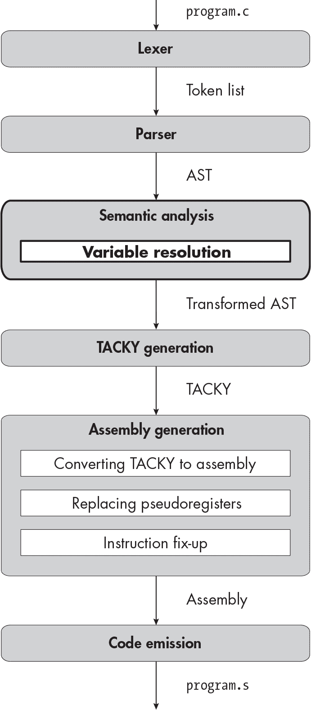

<samp class="SANS_Futura_Std_Book_Oblique_I_11">描述</samp>

<hgroup>

## <samp class="SANS_Futura_Std_Bold_Condensed_B_11">5</samp> <samp class="SANS_Dogma_OT_Bold_B_11">局部变量</samp>

</hgroup>


到目前为止，你只能编译返回常量表达式的程序。在本章中，你将实现局部变量，这将使你能够编译出更有趣的程序。你的编译器需要支持更具表现力的语法，以便能够解析声明、赋值和引用变量的 C 程序。它还需要处理变量声明和使用中的各种错误。为了捕捉这些潜在的错误，你将添加一个*语义分析*阶段，这个阶段在本章开头的图表中已经加粗。这个阶段验证变量是否在同一作用域中被多次声明，或者是否在声明之前就被使用。它还会为每个变量分配一个唯一的标识符，这样你就可以在 TACKY 中安全地引用它。

幸运的是，你的编译器中的 TACKY 和汇编 IR 已经支持变量，因为它们使用临时变量来存储中间结果。这意味着在 TACKY 生成之后，你无需对编译器做任何修改。在深入编译器的各个阶段之前，让我们定义一下需要支持的语言特性。

### <samp class="SANS_Futura_Std_Bold_B_11">变量、声明和赋值</samp>

为了使变量即使在一定程度上有用，我们需要实现一些新的语言特性。首先，我们需要支持变量*声明*。在 C 语言中，每个局部变量必须在使用之前声明。变量声明由变量的类型、名称和一个可选的表达式组成，称为*初始化器*，用于指定变量的初始值。以下是带有初始化器的声明：

```
int a = 2 * 3;
```

以下是没有初始化器的声明：

```
int b;
```

第二，我们必须支持在表达式中使用变量的值，像 <samp class="SANS_TheSansMonoCd_W5Regular_11">b</samp> <samp class="SANS_TheSansMonoCd_W5Regular_11">+</samp> <samp class="SANS_TheSansMonoCd_W5Regular_11">1</samp>。就像整数常量一样，变量本身就是一个完整的表达式，但也可以出现在更复杂的逻辑和算术表达式中。

最后，我们需要支持变量的*赋值*。在 C 语言中，你使用赋值运算符(<samp class="SANS_TheSansMonoCd_W5Regular_11">=</samp>)来更新变量。C 语言中的变量赋值是一个表达式，像加法、减法等一样。这意味着它会计算出一个结果，你可以在<samp class="SANS_TheSansMonoCd_W5Regular_11">return</samp>语句中使用它，或者作为更大表达式的一部分。赋值表达式的结果是目标变量的更新值。例如，表达式<samp class="SANS_TheSansMonoCd_W5Regular_11">2 * (a</samp> <samp class="SANS_TheSansMonoCd_W5Regular_11">=</samp> <samp class="SANS_TheSansMonoCd_W5Regular_11">5)</samp>计算结果为 10。首先，你将值<samp class="SANS_TheSansMonoCd_W5Regular_11">5</samp>赋给变量<samp class="SANS_TheSansMonoCd_W5Regular_11">a</samp>，然后你将新的<samp class="SANS_TheSansMonoCd_W5Regular_11">a</samp>值乘以<samp class="SANS_TheSansMonoCd_W5Regular_11">2</samp>。由于赋值是一个表达式，你可以在一个表达式中同时进行多个赋值，例如<samp class="SANS_TheSansMonoCd_W5Regular_11">a</samp> <samp class="SANS_TheSansMonoCd_W5Regular_11">=</samp> <samp class="SANS_TheSansMonoCd_W5Regular_11">b</samp> <samp class="SANS_TheSansMonoCd_W5Regular_11">=</samp> <samp class="SANS_TheSansMonoCd_W5Regular_11">c</samp>。与我们迄今为止见过的其他二元运算不同，赋值是右结合的，因此<samp class="SANS_TheSansMonoCd_W5Regular_11">a</samp> <samp class="SANS_TheSansMonoCd_W5Regular_11">=</samp> <samp class="SANS_TheSansMonoCd_W5Regular_11">b</samp> <samp class="SANS_TheSansMonoCd_W5Regular_11">=</samp> <samp class="SANS_TheSansMonoCd_W5Regular_11">c</samp>相当于<samp class="SANS_TheSansMonoCd_W5Regular_11">a</samp> <samp class="SANS_TheSansMonoCd_W5Regular_11">=</samp> <samp class="SANS_TheSansMonoCd_W5Regular_11">(b</samp> <samp class="SANS_TheSansMonoCd_W5Regular_11">=</samp> <samp class="SANS_TheSansMonoCd_W5Regular_11">c)</samp>。要计算这个表达式，你首先进行赋值<samp class="SANS_TheSansMonoCd_W5Regular_11">b</samp> <samp class="SANS_TheSansMonoCd_W5Regular_11">=</samp> <samp class="SANS_TheSansMonoCd_W5Regular_11">c</samp>。然后，你将该表达式的结果，即新的<samp class="SANS_TheSansMonoCd_W5Regular_11">b</samp>值，赋给<samp class="SANS_TheSansMonoCd_W5Regular_11">a</samp>。

变量赋值是我们遇到的第一个具有*副作用*的表达式。这意味着它不仅仅是简化成一个值；它还对执行环境产生了一些影响。在<samp class="SANS_TheSansMonoCd_W5Regular_11">2 * (a</samp> <samp class="SANS_TheSansMonoCd_W5Regular_11">=</samp> <samp class="SANS_TheSansMonoCd_W5Regular_11">5)</samp>中，子表达式<samp class="SANS_TheSansMonoCd_W5Regular_11">a</samp> <samp class="SANS_TheSansMonoCd_W5Regular_11">=</samp> <samp class="SANS_TheSansMonoCd_W5Regular_11">5</samp>有一个值（<samp class="SANS_TheSansMonoCd_W5Regular_11">5</samp>），它也有一个副作用（更新<a class="SANS_TheSansMonoCd_W5Regular_11">a</samp>）。大多数情况下，我们只关心变量赋值的副作用，而不是结果值。

一个操作只有在其作用在语言结构外部可见时，才算作副作用。例如，更新局部变量是赋值表达式的副作用，因为变量的新值在表达式外部是可见的。但它*不是*包含赋值表达式的函数的副作用，因为该效果在函数外部不可见。另一方面，更新全局变量将是表达式*和*函数的副作用。

由于我们正在实现带有副作用的表达式，因此添加对*表达式语句*的支持也是合理的，这些语句会评估一个表达式但不使用其结果。像以下这种赋值给变量的语句，

```
foo = 3 * 3;
```

就是表达式语句。这个表达式有副作用，将值<samp class="SANS_TheSansMonoCd_W5Regular_11">9</samp>赋给<samp class="SANS_TheSansMonoCd_W5Regular_11">foo</samp>。整个表达式的结果也是值<samp class="SANS_TheSansMonoCd_W5Regular_11">9</samp>，但这个结果没有在其他地方使用；只有更新<samp class="SANS_TheSansMonoCd_W5Regular_11">foo</samp>的副作用影响了程序。

你也可以有没有任何副作用的表达式语句：

```
1 + a * 2;
```

通常你不会看到没有副作用的表达式语句，因为它们完全没用，但它们是完全有效的。

任何表达式都可以出现在<samp class="SANS_TheSansMonoCd_W5Regular_11">=</samp> 运算符的右侧，但只有某些表达式可以出现在左侧。将值赋给变量、数组元素和结构体成员是合理的：

```
x = 3;
array[2] = 100;
my_struct.member = x * 2;
```

但将值赋给常量或逻辑或算术表达式的结果是没有意义的：

```
4 = 5;
foo && bar = 6;
a - 5 = b;
```

可以出现在赋值左侧的表达式被称为*左值*。在本章中，我们处理的唯一左值是变量。你将在第二部分学习到更复杂的左值。

现在你已经理解了本章将要添加的语言特性，让我们来扩展编译器。

### <samp class="SANS_Futura_Std_Bold_B_11">词法分析器</samp>

在本章中，你将添加一个新的标记：

<samp class="SANS_TheSansMonoCd_W7Bold_B_11">=</samp> 等号，赋值运算符

你不需要新的标记来表示变量名。词法分析器已经识别了标识符，例如函数名<samp class="SANS_TheSansMonoCd_W5Regular_11">main</samp>，而变量名只是标识符。我们不会在解析阶段之前区分函数名和变量名。

### <samp class="SANS_Futura_Std_Bold_B_11">解析器</samp>

像往常一样，我们将更新 AST 和语法，以支持本章的新语言结构。我们还将更新我们的优先级爬升代码，以正确解析赋值表达式。

#### <samp class="SANS_Futura_Std_Bold_Condensed_Oblique_BI_11">更新后的 AST 和语法</samp>

让我们首先通过扩展 AST 定义，来支持变量的使用、声明和赋值。为了支持在表达式中使用变量，我们将为<samp class="SANS_TheSansMonoCd_W5Regular_11">exp</samp> AST 节点添加一个<samp class="SANS_TheSansMonoCd_W5Regular_11">Var</samp>构造函数。由于变量赋值也是一种表达式，我们还将为<samp class="SANS_TheSansMonoCd_W5Regular_11">exp</samp>添加一个<samp class="SANS_TheSansMonoCd_W5Regular_11">Assignment</samp>构造函数。清单 5-1 展示了更新后的<samp class="SANS_TheSansMonoCd_W5Regular_11">exp</samp>定义。

```
exp = Constant(int)
    **| Var(identifier)**
    | Unary(unary_operator, exp)
    | Binary(binary_operator, exp, exp)
    **| Assignment(exp, exp)**
```

<samp class="SANS_Futura_Std_Book_Oblique_I_11">清单 5-1：定义</samp> <samp class="SANS_Futura_Std_Book_Oblique_I_11">exp</samp> <samp class="SANS_Futura_Std_Book_Oblique_I_11">AST 节点，包括</samp> <samp class="SANS_Futura_Std_Book_Oblique_I_11">Var</samp> <samp class="SANS_Futura_Std_Book_Oblique_I_11">和</samp> <samp class="SANS_Futura_Std_Book_Oblique_I_11">Assignment</samp>

一个<samp class="SANS_TheSansMonoCd_W5Regular_11">Var</samp>节点保存变量名。一个<samp class="SANS_TheSansMonoCd_W5Regular_11">Assignment</samp>由两部分组成：被更新的左值和我们将赋值给该左值的表达式。当我们解析程序时，我们将允许赋值左边是任何表达式。在语义分析阶段，我们将确保该表达式是一个有效的左值。我们在语义分析阶段验证左值，而不是在解析阶段验证，因为我们将需要在后续章节中支持更复杂的左值。

接下来，我们将扩展<samp class="SANS_TheSansMonoCd_W5Regular_11">statement</samp> AST 节点，以支持表达式语句。我们将添加一个新的<samp class="SANS_TheSansMonoCd_W5Regular_11">Expression</samp>构造函数，它接受一个单独的<samp class="SANS_TheSansMonoCd_W5Regular_11">exp</samp>节点作为参数。我们还将添加一个<samp class="SANS_TheSansMonoCd_W5Regular_11">Null</samp>构造函数，用于表示*空语句*，它是没有表达式的表达式语句：

```
statement = Return(exp) **| Expression(exp) | Null**
```

空语句没有内容；它只是一个分号。当语法需要一个语句，但你不希望该语句执行任何操作时，它作为一个占位符出现。列表 5-2 取自 C 标准第 6.8.3 节，第 5 段，展示了你可能需要空语句的原因。

```
char *s;
/* ... */
while ( ❶ *s++ != '\0')
  ❷ ;
```

<samp class="SANS_Futura_Std_Book_Oblique_I_11">列表 5-2：来自 C 标准的空语句示例</samp>

在这个例子中，<samp class="SANS_TheSansMonoCd_W5Regular_11">while</samp> 循环通过遍历每个字符直到遇到空字节来找到一个空终止字符串的结尾。循环体不需要做任何事情，因为所有的工作都发生在控制表达式 ❶ 中，但完全省略循环体在语法上是无效的。相反，你可以使用空语句 ❷。空语句与局部变量没有真正的关系，但我们会在这里实现它们，因为它们在技术上是表达式语句的一种。（它们也容易实现。）

我们还需要一个 AST 节点来表示变量声明：

```
declaration = Declaration(identifier name, exp? init)
```

声明由一个名称和一个可选的初始化器组成。（<samp class="SANS_TheSansMonoCd_W5Regular_11">exp?</samp> 中的问号表示该字段是可选的。）我们将在第二部分中包含声明的类型信息，但现在不需要它，因为 <samp class="SANS_TheSansMonoCd_W5Regular_11">int</samp> 是唯一可能的类型。

声明是一个单独的 AST 节点，而不是另一种类型的<samp class="SANS_TheSansMonoCd_W5Regular_11">语句</samp>，因为声明不是语句！概念上，区别在于语句在程序运行时会被执行，而声明只是告诉编译器某个标识符存在并可以稍后使用。在 TACKY 生成过程中，这一区别会变得非常明显：我们会像普通变量赋值一样处理带有初始化器的声明，但没有初始化器的声明将会消失。

从解析器的角度来看，更具体的区别是，程序中有些地方可以出现语句，但不能出现声明。例如，<samp class="SANS_TheSansMonoCd_W5Regular_11">if</samp> 语句的主体总是另一个语句：

```
if (a == 2)
    return 4;
```

它不能是声明，因为声明不是语句。因此，这是无效的：

```
if (a == 2)
    int x = 0;
```

听到 <samp class="SANS_TheSansMonoCd_W5Regular_11">if</samp> 语句的主体是一个单独的语句可能令人惊讶，因为 <samp class="SANS_TheSansMonoCd_W5Regular_11">if</samp> 语句的主体通常看起来像是一个语句和声明的列表，如下所示：

```
if (a == 2) {
    int x = 0;
    return x;
}
```

但是，包裹在大括号中的语句和声明列表实际上是一个单独的语句，称为 *复合语句*。我们将在第七章中实现复合语句；目前，关键点是我们需要在 AST 中区分语句和声明。

最后，我们需要修改函数体的定义方式，以便解析包含多个声明和语句的函数，像列表 5-3 中展示的那样。

```
int main(void) {
    int a;
    a = 2;
    return a * 2;
}
```

<samp class="SANS_Futura_Std_Book_Oblique_I_11">列表 5-3：包含声明和多个语句的程序</samp>

到目前为止，我们将函数体定义为一个单一的语句：

```
function_definition = Function(identifier name, statement body)
```

但现在，我们需要将其定义为一系列语句和声明，统称为*块项*。我们将添加一个新的抽象语法树（AST）节点来表示块项：

```
block_item = S(statement) | D(declaration)
```

然后我们可以将函数体表示为一系列块项：

```
function_definition = Function(identifier name, **block_item*** body)
```

这里的星号表示<samp class="SANS_TheSansMonoCd_W5Regular_11">body</samp>是一个列表。将所有内容组合在一起，列表 5-4 展示了新的 AST 定义，章节中的新增部分以粗体显示。

```
program = Program(function_definition)
function_definition = Function(identifier name, **block_item*** body)
**block_item = S(statement) | D(declaration)**
**declaration = Declaration(identifier name, exp? init)**
statement = Return(exp) **| Expression(exp) | Null**
exp = Constant(int)
    **| Var(identifier)**
    | Unary(unary_operator, exp)
    | Binary(binary_operator, exp, exp)
    **| Assignment(exp, exp)**
unary_operator = Complement | Negate | Not
binary_operator = Add | Subtract | Multiply | Divide | Remainder | And | Or
                | Equal | NotEqual | LessThan | LessOrEqual
                | GreaterThan | GreaterOrEqual
```

<samp class="SANS_Futura_Std_Book_Oblique_I_11">列表 5-4：包含变量、赋值表达式和表达式语句的抽象语法树</samp>

列表 5-5 展示了更新后的语法。

```
<program> ::= <function>
<function> ::= "int" <identifier> "(" "void" ")" "{" **{<block-item>}** "}"
**<block-item> ::= <statement> | <declaration>**
**<declaration> ::= "int" <identifier> ["=" <exp>] ";"**
<statement> ::= "return" <exp> ";" **| <exp> ";" | ";"**
<exp> ::= <factor> | <exp> <binop> <exp>
<factor> ::= <int> **| <identifier>** | <unop> <factor> | "(" <exp> ")"
<unop> ::= "-" | "~" | "!"
<binop> ::= "-" | "+" | "*" | "/" | "%" | "&&" | "||"
          | "==" | "!=" | "<" | "<=" | ">" | ">=" **| "="**
<identifier> ::= ? An identifier token ?
<int> ::= ? A constant token ?
```

<samp class="SANS_Futura_Std_Book_Oblique_I_11">列表 5-5：包含变量、赋值表达式和表达式语句的语法</samp>

列表 5-5 引入了一些新的 EBNF 符号表示法。将符号序列用大括号括起来表示它可以重复零次或多次，因此<samp class="SANS_TheSansMonoCd_W5Regular_11">{<block-item>}</samp>表示一个块项列表。请注意未加引号的大括号表示重复，而带引号的大括号表示字面上的<samp class="SANS_TheSansMonoCd_W5Regular_11">{</samp>和}符号。在<function>规则中，表达式<samp class="SANS_TheSansMonoCd_W5Regular_11">"{" {<block-item>} "}"</samp>表示一个<samp class="SANS_TheSansMonoCd_W5Regular_11">{</samp>符号，接着是一个块项符号的列表，然后是一个}符号。列表 5-6 中的伪代码展示了如何解析函数定义中的块项列表。

```
parse_function_definition(tokens):
    // parse everything up through the open brace as before...
    `--snip--`
    function_body = []
    while peek(tokens) != "}":
        next_block_item = parse_block_item(tokens)
        function_body.append(next_block_item)
    take_token(tokens)
    return Function(name, function_body)
```

<samp class="SANS_Futura_Std_Book_Oblique_I_11">列表 5-6：解析块项列表</samp>

你需要继续解析块项，直到遇到一个闭括号，这表示函数体的结束。然后，你可以从输入流中移除该括号并完成函数定义的处理。

就像大括号在 EBNF 表示法中表示重复一样，将一系列符号用方括号括起来表示它是可选的。我们通过表达式 <samp class="SANS_TheSansMonoCd_W5Regular_11">["=" <exp>]</samp> 来表示声明中的可选初始化器。为了处理这个可选构造，您的声明解析代码应检查语法规则中的标识符后面是否跟着一个 <samp class="SANS_TheSansMonoCd_W5Regular_11">=</samp> 符号，表示初始化器存在，或者跟着一个 <samp class="SANS_TheSansMonoCd_W5Regular_11">;</samp> 符号，表示初始化器不存在。

在解析 <samp class="SANS_TheSansMonoCd_W5Regular_11"><block-item></samp> 时，您需要一种方法来判断当前的块项是语句还是声明。为此，查看第一个符号；如果它是 <samp class="SANS_TheSansMonoCd_W5Regular_11">int</samp> 关键字，则为声明，否则为语句。

列表 5-5 还包括了一个新的产生式规则，针对 <samp class="SANS_TheSansMonoCd_W5Regular_11"><factor></samp> 符号，代表了新的 <samp class="SANS_TheSansMonoCd_W5Regular_11">Var</samp> 构造器，并引入了新的二元运算符 <samp class="SANS_TheSansMonoCd_W5Regular_11">=</samp>，表示变量赋值。即使我们不会通过 <samp class="SANS_TheSansMonoCd_W5Regular_11">Binary</samp> AST 节点来表示变量赋值，它看起来还是像语法中的任何其他二元运算符。这使我们能够使用已经实现的优先级爬升算法解析变量赋值，尽管这需要做一些调整。

#### <samp class="SANS_Futura_Std_Bold_Condensed_Oblique_BI_11">改进的优先级爬升算法</samp>

使用我们当前的优先级爬升代码解析赋值表达式时有一个问题：<samp class="SANS_TheSansMonoCd_W5Regular_11">=</samp> 运算符是右结合的，但我们的代码只能处理左结合运算符。为了提醒自己为什么如此，咱们再看一遍优先级爬升的伪代码。我们在列表 3-7 中看到了这个算法的完整版本；它在这里被复现为列表 5-7。

```
parse_exp(tokens, min_prec):
    left = parse_factor(tokens)
    next_token = peek(tokens)
    while next_token is a binary operator and precedence(next_token) >= min_prec:
        operator = parse_binop(tokens)
        right = parse_exp(tokens, ❶ precedence(next_token) + 1)
        left = Binary(operator, left, right)
        next_token = peek(tokens)
    return left
```

<samp class="SANS_Futura_Std_Book_Oblique_I_11">列表 5-7：使用优先级爬升解析左结合运算符</samp>

当我们对<samp class="SANS_TheSansMonoCd_W5Regular_11">parse_exp</samp>进行递归调用时，我们将最小优先级设置为高于当前运算符的优先级❶。因此，如果<samp class="SANS_TheSansMonoCd_W5Regular_11">next_token</samp>是<samp class="SANS_TheSansMonoCd_W5Regular_11">+</samp>，并且<samp class="SANS_TheSansMonoCd_W5Regular_11">tokens</samp>是<samp class="SANS_TheSansMonoCd_W5Regular_11">b</samp> <samp class="SANS_TheSansMonoCd_W5Regular_11">+</samp> <samp class="SANS_TheSansMonoCd_W5Regular_11">4</samp>，那么递归调用<samp class="SANS_TheSansMonoCd_W5Regular_11">parse_exp</samp>将只返回<samp class="SANS_TheSansMonoCd_W5Regular_11">b</samp>，因为<samp class="SANS_TheSansMonoCd_W5Regular_11">+</samp>不满足最小优先级要求。这就是我们得到像<samp class="SANS_TheSansMonoCd_W5Regular_11">(left</samp> <samp class="SANS_TheSansMonoCd_W5Regular_11">+</samp> <samp class="SANS_TheSansMonoCd_W5Regular_11">b)</samp> <samp class="SANS_TheSansMonoCd_W5Regular_11">+</samp> <samp class="SANS_TheSansMonoCd_W5Regular_11">4</samp>这样的左结合表达式的方式。

然而，如果<samp class="SANS_TheSansMonoCd_W5Regular_11">next_token</samp>是右结合的，我们不应在递归调用<samp class="SANS_TheSansMonoCd_W5Regular_11">parse_exp</samp>时遇到相同的符号时停止，而是应将其包含在右侧表达式中。为了做到这一点，我们需要将右侧的最小优先级设置为*等于*当前符号的优先级。换句话说，当处理像<samp class="SANS_TheSansMonoCd_W5Regular_11">=</samp>这样的右结合符号时，递归调用应该是：

```
right = parse_exp(tokens, precedence(next_token))
```

假设你正在解析<samp class="SANS_TheSansMonoCd_W5Regular_11">a</samp> <samp class="SANS_TheSansMonoCd_W5Regular_11">=</samp> <samp class="SANS_TheSansMonoCd_W5Regular_11">b</samp> <samp class="SANS_TheSansMonoCd_W5Regular_11">=</samp> <samp class="SANS_TheSansMonoCd_W5Regular_11">c</samp>。你将首先将左侧的部分解析为因子<samp class="SANS_TheSansMonoCd_W5Regular_11">a</samp>，然后递归调用<samp class="SANS_TheSansMonoCd_W5Regular_11">parse_exp</samp>来处理<samp class="SANS_TheSansMonoCd_W5Regular_11">b</samp> <samp class="SANS_TheSansMonoCd_W5Regular_11">=</samp> <samp class="SANS_TheSansMonoCd_W5Regular_11">c</samp>。如果这次递归调用中的最小优先级是<samp class="SANS_TheSansMonoCd_W5Regular_11">precedence("=")</samp> <samp class="SANS_TheSansMonoCd_W5Regular_11">+</samp> <samp class="SANS_TheSansMonoCd_W5Regular_11">1</samp>，它将只解析下一个因子<samp class="SANS_TheSansMonoCd_W5Regular_11">b</samp>。但如果最小优先级是<samp class="SANS_TheSansMonoCd_W5Regular_11">precedence("=")</samp>，它将解析整个赋值表达式，将<samp class="SANS_TheSansMonoCd_W5Regular_11">b</samp> <samp class="SANS_TheSansMonoCd_W5Regular_11">=</samp> <samp class="SANS_TheSansMonoCd_W5Regular_11">c</samp>作为右侧表达式。最终结果将是<samp class="SANS_TheSansMonoCd_W5Regular_11">a</samp> <samp class="SANS_TheSansMonoCd_W5Regular_11">=</samp> <samp class="SANS_TheSansMonoCd_W5Regular_11">(b</samp> <samp class="SANS_TheSansMonoCd_W5Regular_11">=</samp> <samp class="SANS_TheSansMonoCd_W5Regular_11">c)</samp>，这正是我们想要的。

解析变量赋值和其他二元表达式之间唯一的区别是，我们需要构造一个<samp class="SANS_TheSansMonoCd_W5Regular_11">Assignment</samp> AST 节点，而不是<samp class="SANS_TheSansMonoCd_W5Regular_11">Binary</samp>节点。清单 5-8 提供了更新后的带有这些调整的优先级爬升伪代码。

```
parse_exp(tokens, min_prec):
    left = parse_factor(tokens)
    next_token = peek(tokens)
    while next_token is a binary operator and precedence(next_token) >= min_prec:
        **if next_token is "=":**
            **take_token(tokens) // remove "=" from list of tokens**
            **right = parse_exp(tokens, precedence(next_token))**
            **left = Assignment(left, right)**
        **else:**
            operator = parse_binop(tokens)
            right = parse_exp(tokens, precedence(next_token) + 1)
            left = Binary(operator, left, right)
        next_token = peek(tokens)
    return left
```

<samp class="SANS_Futura_Std_Book_Oblique_I_11">清单 5-8：扩展的优先级爬升算法</samp>

最后，我们需要将<samp class="SANS_TheSansMonoCd_W5Regular_11">=</samp>添加到我们的优先级表中。表 5-1 列出了我为所有二元运算符使用的优先级值，新运算符已加粗显示。它的优先级低于我们迄今为止实现的任何其他运算符。

<samp class="SANS_Futura_Std_Heavy_B_11">表 5-1：</samp> <samp class="SANS_Futura_Std_Book_11">二元运算符的优先级值</samp>

| <samp class="SANS_Futura_Std_Heavy_B_11">运算符</samp> | <samp class="SANS_Futura_Std_Heavy_B_11">优先级</samp> |
| --- | --- |
| <samp class="SANS_TheSansMonoCd_W5Regular_11">*</samp> | <samp class="SANS_Futura_Std_Book_11">50</samp> |
| <samp class="SANS_TheSansMonoCd_W5Regular_11">/</samp> | <samp class="SANS_Futura_Std_Book_11">50</samp> |
| <samp class="SANS_TheSansMonoCd_W5Regular_11">%</samp> | <samp class="SANS_Futura_Std_Book_11">50</samp> |
| <samp class="SANS_TheSansMonoCd_W5Regular_11">+</samp> | <samp class="SANS_Futura_Std_Book_11">45</samp> |
| <samp class="SANS_TheSansMonoCd_W5Regular_11">-</samp> | <samp class="SANS_Futura_Std_Book_11">45</samp> |
| <samp class="SANS_TheSansMonoCd_W5Regular_11"><</samp> | <samp class="SANS_Futura_Std_Book_11">35</samp> |
| <samp class="SANS_TheSansMonoCd_W5Regular_11"><=</samp> | <samp class="SANS_Futura_Std_Book_11">35</samp> |
| <samp class="SANS_TheSansMonoCd_W5Regular_11">></samp> | <samp class="SANS_Futura_Std_Book_11">35</samp> |
| <samp class="SANS_TheSansMonoCd_W5Regular_11">>=</samp> | <samp class="SANS_Futura_Std_Book_11">35</samp> |
| <samp class="SANS_TheSansMonoCd_W5Regular_11">==</samp> | <samp class="SANS_Futura_Std_Book_11">30</samp> |
| <samp class="SANS_TheSansMonoCd_W5Regular_11">!=</samp> | <samp class="SANS_Futura_Std_Book_11">30</samp> |
| <samp class="SANS_TheSansMonoCd_W5Regular_11">&&</samp> | <samp class="SANS_Futura_Std_Book_11">10</samp> |
| <samp class="SANS_TheSansMonoCd_W5Regular_11">&#124;&#124;</samp> | <samp class="SANS_Futura_Std_Book_11">5</samp> |
| <samp class="SANS_TheSansMonoCd_W7Bold_B_11">=</samp> | <samp class="SANS_Futura_Std_Heavy_B_11">1</samp> |

到目前为止，你已经知道如何为本章中遇到的每个程序构建一个有效的 AST；你现在可以更新解析器并进行测试了。

### <samp class="SANS_Futura_Std_Bold_B_11">语义分析</samp>

到目前为止，我们唯一需要关注的错误是语法错误。如果我们能够解析一个程序，我们就知道剩下的编译过程会成功。现在，程序可能在语法上是正确的，但却是*语义上*无效的；换句话说，它可能根本没有意义。例如，一个程序可能试图将一个值赋给一个不可赋值的表达式：

```
2 = a * 3; // ERROR: can't assign a value to a constant
```

或者它可能在同一作用域内声明同一个变量两次：

```
int a = 3;
int a; // ERROR: a has already been declared!
```

或者它可能尝试在变量声明之前使用该变量：

```
int main(void) {
    a = 4; // ERROR: a has not been declared yet!
    return a;
}
```

所有这些示例都使用了有效的语法，但如果你尝试编译它们，应该会得到错误。语义分析阶段会检测到这种错误。这个阶段最终将包括多个不同的 pass，用来验证程序的不同方面。在本章中，我们将加入第一个语义分析 pass，*变量解析*。

变量解析阶段会跟踪程序中所有作用域内的变量，并通过查找相应的声明来*解析*每个变量的引用。如果程序声明了同一个变量多次，或者使用了未声明的变量，它会报告错误。它还会为每个局部变量重命名，使用一个全局唯一的标识符。例如，它可能会将程序

```
int main(void) {
    int a = 4;
    int b = a + 1;
    a = b - 5;
    return a + b;
}
```

转换为如下内容：

```
int main(void) {
    int a0 = 4;
    int b1 = a0 + 1;
    a0 = b1 - 5;
    return a0 + b1;
}
```

（当然，这个阶段实际上是转换 AST，而不是源文件，但我使用 C 源代码来呈现这些示例，以使其更易读。）

这个转换可能看起来帮助不大——变量名<samp class="SANS_TheSansMonoCd_W5Regular_11">a</samp>和<samp class="SANS_TheSansMonoCd_W5Regular_11">b</samp>已经是唯一的——但是一旦我们引入多个变量作用域，它就变得至关重要，因为不同作用域中的不同变量可以有相同的名称。例如，我们可能会将程序转换为

```
int main(void) {
    int a = 2;
    if (a < 5) {
        int a = 7;
        return a;
    }
    return a;
}
```

转换为：

```
int main(void) {
    int a0 = 2;
    if (a0 < 5) {
        int a1 = 7;
        return a1;
    }
    return a0;
}
```

这清楚地表明<samp class="SANS_TheSansMonoCd_W5Regular_11">a0</samp>和<samp class="SANS_TheSansMonoCd_W5Regular_11">a1</samp>是两个不同的变量，这将简化后续的编译器阶段。

#### <samp class="SANS_Futura_Std_Bold_Condensed_Oblique_BI_11">变量解析</samp>

现在我们将编写变量解析阶段。在这个阶段，我们将构建一个映射，将用户定义的变量名映射到我们在后续阶段使用的唯一名称。我们将按顺序处理块项，检查错误，并在过程中替换变量名。当遇到变量声明时，我们将添加一个新的条目，将该变量名映射到我们生成的唯一名称。然后，当我们遇到使用变量的表达式时，我们将用映射中的对应唯一名称替换变量名。清单 5-9 中的伪代码演示了如何解析变量声明。

```
resolve_declaration(Declaration(name, init), variable_map):
  ❶ if name is in variable_map:
        fail("Duplicate variable declaration!")
    unique_name = make_temporary()
  ❷ variable_map.add(name, unique_name)
  ❸ if init is not null:
        init = resolve_exp(init, variable_map)
  ❹ return Declaration(unique_name, init)
```

<samp class="SANS_Futura_Std_Book_Oblique_I_11">清单 5-9：解析变量声明</samp>

首先，我们检查声明的变量是否已经存在于变量映射中❶。如果存在，意味着它在函数中已经声明过，这是一个重复声明。在这种情况下，我们抛出一个错误。接下来，我们将用户定义的变量名与一个唯一的自动生成名称关联，在变量映射中进行更新❷。

更新变量映射后，我们将处理声明初始化器（如果有的话）❸。对<samp class="SANS_TheSansMonoCd_W5Regular_11">resolve_exp</samp>的调用会返回一个新的初始化器副本，任何变量都会被重命名，如果初始化器使用了未声明的变量，则抛出错误。最后，我们返回一个副本的<samp class="SANS_TheSansMonoCd_W5Regular_11">Declaration</samp>节点❹，该节点使用新生成的名称替代旧的用户定义名称，并包含从<samp class="SANS_TheSansMonoCd_W5Regular_11">resolve_exp</samp>获取的新初始化器。

你在<samp class="SANS_TheSansMonoCd_W5Regular_11">resolve_declaration</samp>中生成的标识符不能与临时 TACKY 变量的名称冲突。如果你使用全局计数器来生成唯一标识符，请在语义分析和 TACKY 生成阶段都使用相同的计数器。

这些标识符也不能与函数名或全局变量名冲突。（在第十章中，你将看到全局变量保留其原始名称，像函数一样，而不是像局部变量那样被重命名。）你可以依赖通常的技巧，生成那些在 C 语言中语法上无效的标识符。我建议在自动生成的名称中包含变量的原始名称，以帮助调试；例如，你可以将 <samp class="SANS_TheSansMonoCd_W5Regular_11">a</samp> 重命名为 <samp class="SANS_TheSansMonoCd_W5Regular_11">a.0</samp>，将 <samp class="SANS_TheSansMonoCd_W5Regular_11">b</samp> 重命名为 <samp class="SANS_TheSansMonoCd_W5Regular_11">b.1</samp>。

> <samp class="SANS_Dogma_OT_Bold_B_39">注意</samp>

*你可能已经注意到，上一节中的示例使用了自动生成的标识符，这些标识符在 C 语言中是*语法上有效的*，例如 a0 和 b1，因为这些示例是作为 C 源代码展示的。那些示例中的命名方案在实际中无法使用，因为重命名后的变量可能会与函数名和彼此冲突。例如，两个名为 a 和 a1 的局部变量都可能被重命名为 a12。*

要解析 <samp class="SANS_TheSansMonoCd_W5Regular_11">return</samp> 语句或表达式语句，我们只需处理其中的内层表达式，正如 清单 5-10 所示。

```
resolve_statement(statement, variable_map):
    match statement with
    | Return(e) -> return Return(resolve_exp(e, variable_map))
    | Expression(e) -> return Expression(resolve_exp(e, variable_map))
    | Null -> return Null
```

<samp class="SANS_Futura_Std_Book_Oblique_I_11">清单 5-10：解析一个语句</samp>

当我们解析一个表达式时，我们会检查表达式中的所有变量使用和赋值是否有效。清单 5-11 展示了如何做到这一点。

```
resolve_exp(e, variable_map):
    match e with
    | Assignment(left, right) ->
        if left is not a Var node:
            fail("Invalid lvalue!")
        return Assignment( ❶ resolve_exp(left, variable_map), ❷ resolve_exp(right, variable_map))
    | Var(v) ->
        if v is in variable_map:
            return Var( ❸ variable_map.get(v))
        else:
            fail("Undeclared variable!")
    | `--snip--`
```

<samp class="SANS_Futura_Std_Book_Oblique_I_11">清单 5-11：解析一个表达式</samp>

当我们遇到一个 <samp class="SANS_TheSansMonoCd_W5Regular_11">赋值</samp> 表达式时，我们检查左侧是否是有效的左值；目前，这意味着它必须是一个 <samp class="SANS_TheSansMonoCd_W5Regular_11">Var</samp>。然后我们递归地解析左 ❶ 和右 ❷ 子表达式。当我们遇到一个 <samp class="SANS_TheSansMonoCd_W5Regular_11">Var</samp> 时，我们用来自变量映射表的唯一标识符替换变量名 ❸。如果它不在变量映射表中，那就意味着它还没有声明，所以我们会抛出一个错误。由于我们使用 <samp class="SANS_TheSansMonoCd_W5Regular_11">resolve_exp</samp> 递归地处理赋值的两侧，<samp class="SANS_TheSansMonoCd_W5Regular_11">Var</samp> 这个案例也处理了赋值表达式左侧的变量。

为了处理其他类型的表达式，我们递归地处理任何子表达式，使用 <samp class="SANS_TheSansMonoCd_W5Regular_11">resolve_exp</samp>。最终，变量解析阶段应返回一个完整的 AST，使用自动生成的变量名而不是用户定义的变量名。

#### <samp class="SANS_Futura_Std_Bold_Condensed_Oblique_BI_11">--validate 选项</samp>

要测试新的编译器传递，你需要在编译器驱动程序中添加一个<samp class="SANS_TheSansMonoCd_W5Regular_11">--validate</samp>命令行选项。该选项应使编译器运行到语义分析阶段，并在 TACKY 生成之前停止。在后面的章节中，更新语义分析阶段以包含多个传递后，该选项应指示编译器运行所有这些传递。

像现有的编译器选项一样，这个新选项不应生成任何输出文件。像往常一样，如果编译成功，它应返回 0 退出代码，如果失败，则返回非零退出代码。

### <samp class="SANS_Futura_Std_Bold_B_11">TACKY 生成</samp>

在本章中，我们无需修改 TACKY IR。我们已经可以使用 TACKY <samp class="SANS_TheSansMonoCd_W5Regular_11">Var</samp>构造函数来引用变量，并使用<samp class="SANS_TheSansMonoCd_W5Regular_11">Copy</samp>指令为其赋值。TACKY IR 不包含变量声明，因为它不需要它们。我们已经在语义分析阶段从变量声明中获得了所需的所有信息，现在可以丢弃它们。

尽管 TACKY 本身无需更改，但 TACKY 生成传递需要更改：我们需要扩展此传递以处理 AST 中的最新添加内容。首先，我们将处理本章中添加的两种新表达式。接下来，我们将处理 AST 中的其他新增内容，包括表达式语句和声明。

#### <samp class="SANS_Futura_Std_Bold_Condensed_Oblique_BI_11">变量和赋值表达式</samp>

我们将把 AST 中的每个<samp class="SANS_TheSansMonoCd_W5Regular_11">Var</samp>转换为 TACKY 中的<samp class="SANS_TheSansMonoCd_W5Regular_11">Var</samp>，保持相同的标识符。由于我们是自动生成标识符的，因此可以保证它不会与 TACKY 程序中的其他标识符冲突。为了处理<samp class="SANS_TheSansMonoCd_W5Regular_11">Assignment</samp> AST 节点，我们将发出指令以评估右侧表达式，然后发出<samp class="SANS_TheSansMonoCd_W5Regular_11">Copy</samp>指令，将结果复制到左侧。列表 5-12 展示了如何处理这两种表达式。

```
emit_tacky(e, instructions):
    match e with
    | `--snip--`
    | Var(v) -> return Var(v)
    | Assignment(Var(v), rhs) ->
        result = emit_tacky(rhs, instructions)
        instructions.append(Copy(result, Var(v)))
        return Var(v)
```

<samp class="SANS_Futura_Std_Book_Oblique_I_11">列表 5-12：将变量和赋值表达式转换为 TACKY</samp>

这是一种低效的变量赋值处理方式；我们经常会先计算右边的表达式，将结果存储到一个临时变量中，然后再将其复制到变量<samp class="SANS_TheSansMonoCd_W5Regular_11">v</samp>，而不是直接将结果存储到<samp class="SANS_TheSansMonoCd_W5Regular_11">v</samp>中，从而避免使用临时变量。我们在第三部分中实现的优化将会去除这些多余的复制操作。

#### <samp class="SANS_Futura_Std_Bold_Condensed_Oblique_BI_11">声明、语句和函数体</samp>

现在我们来处理声明。如前所述，在这个阶段我们可以丢弃变量声明；在 TACKY 中，你不需要在使用变量之前进行声明。但是我们确实需要发出 TACKY 指令来*初始化*变量。如果声明包含初始值，我们将像普通变量赋值一样处理它。如果声明没有初始值，我们将不会发出任何 TACKY 指令。

我们还需要处理表达式语句和空语句。为了将表达式语句转换为 TACKY，我们只需处理内部表达式。这将返回一个新的临时变量，保存表达式的结果，但我们在生成 TACKY 指令时不会再次使用该变量。对于空语句，我们不会发出任何 TACKY 指令。

最后，我们将处理一个函数包含多个块项而非单个语句的情况。我们将按顺序处理函数体中的块项，并为每个块项发出 TACKY 指令。假设我们正在编译 C 函数列表 5-13。

```
int main(void) {
    int b;
    int a = 10 + 1;
    b = a * 2;
    return b;
}
```

<samp class="SANS_Futura_Std_Book_Oblique_I_11">列表 5-13：包含变量声明和赋值表达式的 C 函数</samp>

假设我们在变量解析过程中将<samp class="SANS_TheSansMonoCd_W5Regular_11">a</samp>和<samp class="SANS_TheSansMonoCd_W5Regular_11">b</samp>重命名为<samp class="SANS_TheSansMonoCd_W5Regular_11">a.1</samp>和<samp class="SANS_TheSansMonoCd_W5Regular_11">b.0</samp>，并且我们对所有临时变量使用命名方案<samp class="SANS_TheSansMonoCd_W5Regular_11">tmp.</samp><samp class="SANS_TheSansMonoCd_W5Regular_Italic_I_11">n</samp>，其中<samp class="SANS_TheSansMonoCd_W5Regular_Italic_I_11">n</samp>是全局计数器的值。那么，我们将为函数体生成列表 5-14 中所示的 TACKY 指令。（这个列表与前一章中的列表 4-6 类似，使用了<samp class="SANS_TheSansMonoCd_W5Regular_11">dst</samp> <samp class="SANS_TheSansMonoCd_W5Regular_11">=</samp> <samp class="SANS_TheSansMonoCd_W5Regular_11">src</samp>这样的符号表示<samp class="SANS_TheSansMonoCd_W5Regular_11">Copy</samp>指令，而不是<samp class="SANS_TheSansMonoCd_W5Regular_11">Copy(src, dst)</samp>。同样，使用如<samp class="SANS_TheSansMonoCd_W5Regular_11">dst</samp> <samp class="SANS_TheSansMonoCd_W5Regular_11">=</samp> <samp class="SANS_TheSansMonoCd_W5Regular_11">src1</samp> <samp class="SANS_TheSansMonoCd_W5Regular_11">+</samp> <samp class="SANS_TheSansMonoCd_W5Regular_11">src2</samp>这样的符号表示<samp class="SANS_TheSansMonoCd_W5Regular_11">Binary</samp>指令，而不是<samp class="SANS_TheSansMonoCd_W5Regular_11">Binary(Add, src1, src2, dst)</samp>。)

```
tmp.2 = 10 + 1
a.1 = tmp.2
tmp.3 = a.1 * 2
b.0 = tmp.3
Return(b.0)
```

<samp class="SANS_Futura_Std_Book_Oblique_I_11">列表 5-14: 在 TACKY 中实现列表 5-13</samp>

我们不会为列表 5-13 中<samp class="SANS_TheSansMonoCd_W5Regular_11">b</samp>的声明生成任何 TACKY，因为它没有包含初始化器。我们将把<samp class="SANS_TheSansMonoCd_W5Regular_11">a</samp>的声明转换为列表 5-14 中的前两条指令，这些指令计算<samp class="SANS_TheSansMonoCd_W5Regular_11">10</samp> <samp class="SANS_TheSansMonoCd_W5Regular_11">+</samp> <samp class="SANS_TheSansMonoCd_W5Regular_11">1</samp>并将结果复制到<samp class="SANS_TheSansMonoCd_W5Regular_11">a</samp>。我们将把表达式语句<samp class="SANS_TheSansMonoCd_W5Regular_11">b</samp> <samp class="SANS_TheSansMonoCd_W5Regular_11">=</samp> <samp class="SANS_TheSansMonoCd_W5Regular_11">a * 2;</samp>转换为接下来的两条指令，并将<samp class="SANS_TheSansMonoCd_W5Regular_11">return</samp>语句转换为最终的<samp class="SANS_TheSansMonoCd_W5Regular_11">Return</samp>指令。

到目前为止，你已经知道如何将整个 AST 转换为 TACKY。但是我们还没有完全完成；我们还有一个最后的边缘案例需要考虑。

#### <samp class="SANS_Futura_Std_Bold_Condensed_Oblique_BI_11">没有返回语句的函数</samp>

由于我们的抽象语法树（AST）现在支持多种语句，我们可能会遇到没有<samp class="SANS_TheSansMonoCd_W5Regular_11">return</samp>语句的函数，例如列表 5-15。

```
int main(void) {
    int a = 4;
    a = 0;
}
```

<samp class="SANS_Futura_Std_Book_Oblique_I_11">列表 5-15：没有返回语句的</samp> <samp class="SANS_Futura_Std_Book_Oblique_I_11">main</samp> <samp class="SANS_Futura_Std_Book_Oblique_I_11">函数</samp>

如果你调用这个函数，会发生什么？C 标准给出了对于<samp class="SANS_TheSansMonoCd_W5Regular_11">main</samp>函数的一个答案，而对于其他任何函数则给出了不同的答案。（我忽略了返回类型为<samp class="SANS_TheSansMonoCd_W5Regular_11">void</samp>的函数，因为它们没有返回值，我们还没有实现它们。）第 5.1.2.2.3 节指出，“到达结束<samp class="SANS_TheSansMonoCd_W5Regular_11">main</samp>函数的那一行会返回值 0”，因此列表 5-15 中的代码等同于列表 5-16 中的代码。

```
int main(void) {
    int a = 4;
    a = 0;
    **return 0;**
}
```

<samp class="SANS_Futura_Std_Book_Oblique_I_11">列表 5-16：返回 0 的</samp> <samp class="SANS_Futura_Std_Book_Oblique_I_11">main</samp> <samp class="SANS_Futura_Std_Book_Oblique_I_11">函数</samp>

对于其他函数，情况更加复杂。根据第 6.9.1 节第 12 段，“除非另有说明，如果结束一个函数的语句被执行，且调用者使用了该函数的返回值，则行为未定义。”这隐含地涵盖了两种可能的情况。在第一种情况中，如列表 5-17 所示，调用者尝试使用函数的返回值。

```
#include <stdio.h>

int foo(void) {
    printf("I'm living on the edge, baby!");
    // no return statement
}

int main(void) {
    return foo(); // try to use return value from foo
}
```

<samp class="SANS_Futura_Std_Book_Oblique_I_11">列表 5-17：尝试使用一个函数的返回值，而该函数并未返回任何东西</samp>

这将导致未定义的行为，意味着一切都无法预测；标准并没有对将会发生什么做出任何保证。在第二种情况中，如列表 5-18 所示，我们调用函数但不使用其返回值。

```
#include <stdio.h>

int foo(void) {
    printf("I'm living on the edge, baby!");
    // no return statement
}

int main(void) {
    foo();
    return 0;
}
```

<samp class="SANS_Futura_Std_Book_Oblique_I_11">列表 5-18：调用一个函数但不使用其返回值</samp>

这个程序没有未定义行为；它保证会打印<сamp class="SANS_TheSansMonoCd_W5Regular_11">I'm living on the edge, baby!</samp>，然后以状态码 0 退出。当我们编译像<сamp class="SANS_TheSansMonoCd_W5Regular_11">foo</samp>这样的函数时，我们并不知道它的调用者是否使用了它的返回值，因此我们必须假设它是像清单 5-18 这样的程序的一部分。特别是，我们需要在<сamp class="SANS_TheSansMonoCd_W5Regular_11">foo</samp>的末尾恢复调用者的栈帧，并将控制权返回给调用者。因为我们没有返回任何特定的值，所以我们可以随意设置 EAX 寄存器，或者根本不设置它。

处理这两种情况的最简单方法是，在每个函数体的末尾添加一个额外的 TACKY 指令，<samp class="SANS_TheSansMonoCd_W5Regular_11">Return(Constant(0))</samp>。这样可以为<сamp class="SANS_TheSansMonoCd_W5Regular_11">main</samp>和类似清单 5-18 的程序提供正确的行为。如果函数已经以<сamp class="SANS_TheSansMonoCd_W5Regular_11">return</samp>语句结束，这条额外的指令将永远不会执行，因此不会改变程序的行为。在第三部分中，您将学习如何在不需要时消除这条额外的<сamp class="SANS_TheSansMonoCd_W5Regular_11">Return</samp>指令。

一旦您扩展了 TACKY 生成阶段，您就可以开始测试整个编译器了！因为我们没有改变 TACKY IR，所以也不需要更改汇编生成或代码生成阶段。

### <samp class="SANS_Futura_Std_Bold_B_11">额外奖励：复合赋值、增量和减量</samp>

现在您的编译器已经支持了简单的赋值运算符<сamp class="SANS_TheSansMonoCd_W5Regular_11">=</samp>，您可以选择实现多个*复合赋值*运算符：<сamp class="SANS_TheSansMonoCd_W5Regular_11">+=</samp>，<сamp class="SANS_TheSansMonoCd_W5Regular_11">-=</samp>，<сamp class="SANS_TheSansMonoCd_W5Regular_11">*=</samp>，<сamp class="SANS_TheSansMonoCd_W5Regular_11">/=</samp>，以及<сamp class="SANS_TheSansMonoCd_W5Regular_11">%=</samp>。如果您在第三章中添加了位运算符，您也应该在这里添加相应的复合赋值运算符：<сamp class="SANS_TheSansMonoCd_W5Regular_11">&=</samp>，<сamp class="SANS_TheSansMonoCd_W5Regular_11">|=</samp>，<сamp class="SANS_TheSansMonoCd_W5Regular_11">^=</samp>，<сamp class="SANS_TheSansMonoCd_W5Regular_11"><<=</samp>，以及<сamp class="SANS_TheSansMonoCd_W5Regular_11">>>=</samp>。

你还可以添加增量和减量运算符，<samp class="SANS_TheSansMonoCd_W5Regular_11">++</samp> 和 <samp class="SANS_TheSansMonoCd_W5Regular_11">--</samp>。每个运算符有两种不同的使用方式：作为前缀运算符，例如表达式 <samp class="SANS_TheSansMonoCd_W5Regular_11">++a</samp>，或作为后缀运算符，例如表达式 <samp class="SANS_TheSansMonoCd_W5Regular_11">a++</samp>。当你将 <samp class="SANS_TheSansMonoCd_W5Regular_11">++</samp> 或 <samp class="SANS_TheSansMonoCd_W5Regular_11">--</samp> 作为前缀运算符使用时，它会递增或递减操作数，并评估为其新值。后缀运算符 <samp class="SANS_TheSansMonoCd_W5Regular_11">++</samp> 或 <samp class="SANS_TheSansMonoCd_W5Regular_11">--</samp> 也会递增或递减操作数，但评估为操作数的原始值。和本章中的其他语言结构一样，你可以在不改变编译器任何部分的情况下，在 TACKY 生成后实现复合赋值、增量和减量运算符。

要包含增量和减量运算符的测试用例，在运行测试套件时使用 <samp class="SANS_TheSansMonoCd_W5Regular_11">--increment</samp> 标志。要包含复合赋值的测试用例，使用 <samp class="SANS_TheSansMonoCd_W5Regular_11">--compound</samp> 标志。只有在你同时使用 <samp class="SANS_TheSansMonoCd_W5Regular_11">--compound</samp> 和 <samp class="SANS_TheSansMonoCd_W5Regular_11">--bitwise</samp> 标志时，测试脚本才会运行位运算复合赋值运算符（例如 <samp class="SANS_TheSansMonoCd_W5Regular_11">|=</samp>）的测试用例。

你可以使用 <samp class="SANS_TheSansMonoCd_W5Regular_11">--extra-credit</samp> 标志一次性测试所有额外的加分功能。命令

```
$ **./test_compiler** `**/path/to/your_compiler**` **--chapter 5 --extra-credit**
```

等同于：

```
$ **./test_compiler** `**/path/to/your_compiler**` **--chapter 5 --bitwise --compound --increment**
```

当我们在后面的章节中引入更多额外的加分功能时，<samp class="SANS_TheSansMonoCd_W5Regular_11">--extra-credit</samp> 标志也会涵盖这些功能。

### <samp class="SANS_Futura_Std_Bold_B_11">总结</samp>

本章在几个方面都是一个里程碑：你添加了一种新的语句类型，并实现了第一个有副作用的语言结构。你还实现了语义分析阶段，用于捕获你编译的程序中的新类型的错误。在后续章节中，你将继续扩展语义分析阶段，以检测更多的错误，并收集后续编译所需的附加信息。接下来，你将实现第一个控制流结构：<samp class="SANS_TheSansMonoCd_W5Regular_11">if</samp> 语句和条件表达式。
