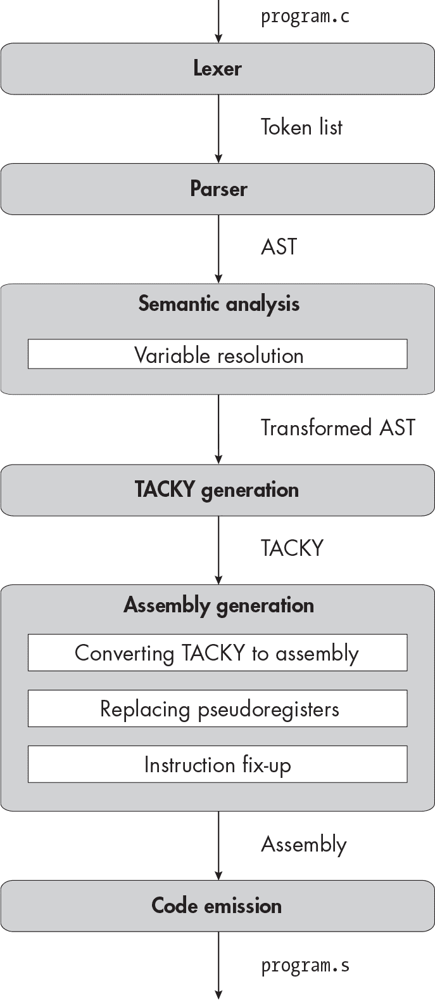

描述


## 第六章：6 IF 语句和条件表达式


在上一章中，你学习了如何编译执行一系列语句的程序。但是大多数 C 程序的执行路径更为复杂；它们通常需要根据程序的当前状态，在运行时决定执行哪些语句。程序执行语句的顺序就是它的*控制流*，允许你更改程序控制流的语言结构称为*控制结构*。

在本章中，你将实现第一个控制结构：if语句。你还将实现*条件表达式*。和<sup class="SANS_TheSansMonoCd_W5Regular_11">if</sup>语句一样，条件表达式也让你控制运行哪些代码。例如，条件表达式(a == 0) ? 3 : 4在 a 等于0时评估为 3，否则评估为 4。在实现短路运算符&&和||时，我们已经为<sup class="SANS_TheSansMonoCd_W5Regular_11">if</sup>语句和条件表达式奠定了很多基础，具体见第四章。我们已经有了 TACKY 结构，允许我们有条件地运行或跳过代码，因此在 TACKY 生成后，我们无需更改任何阶段。让我们开始吧！

### 词法分析器

本章将介绍四个令牌：

| if | 一个关键字，表示<sup class="SANS_TheSansMonoCd_W5Regular_11">if</sup>语句的开始 |
| --- | --- |
| else | 一个关键字，表示<sup class="SANS_TheSansMonoCd_W5Regular_11">else</sup>子句在<sup class="SANS_TheSansMonoCd_W5Regular_11">if</sup>语句中的开始 |
| ? | 问号，条件表达式中第一个和第二个操作数之间的分隔符 |
| : | 冒号，条件表达式中第二个和第三个操作数之间的分隔符 |

一旦你的词法分析器支持这四个令牌，你就可以进行测试了。

### 解析器

现在我们将更新解析器以支持 `if` 语句和条件表达式。由于这两者是不同的语言结构，我们将逐一处理，首先从 `if` 语句开始。

#### 解析 if 语句

我们将通过扩展 `statement` AST 节点来支持 `if` 语句。清单 6-1 给出了这个节点的更新定义。

```
statement = Return(exp)
          | Expression(exp)
          **| If(exp condition, statement then, statement? else)**
          | Null
```

清单 6-1: 定义 语句 AST 节点，包括 if 语句

新的 `If` 构造函数接受三个参数。`condition` 表达式，有时称为 *控制表达式*，决定语句体是否被执行。`then` 语句是 `if` 语句的第一个子句，当 `condition` 的结果非零时执行。第二个子句，`else` 语句是可选的。如果它存在，当 `condition` 的结果为 0 时执行。

正如我在前一章中提到的，`if` 语句中的每个子句本身就是一个独立的语句。尽管它看起来像是多个语句，但像清单 6-2 中的 `if` 语句体实际上是一个复合语句。

```
if (a == 3) {
    a = a + 1;
    int b = a * 4;
    return a && b;
}
```

清单 6-2: 一个 其语句体为复合语句的 if 语句

我们还没有实现复合语句，因此此时我们无法编译像 清单 6-2 中的代码。清单 6-3 给出了我们可以编译的 `if` 语句示例。

```
if (a == 3)
    return a;
else
    b = 8;
```

清单 6-3: 一个 不包含任何复合语句的 if 语句

我们也可以编译嵌套在其他 if 语句内的 if 语句，就像 列表 6-4 中那样。

```
if (a)
    if (a > 10)
        return a;
    else
        return 10 - a;
```

列表 6-4：一个 if 语句嵌套在另一个 if 语句内

注意，列表 6-1 中的 AST 定义没有 else if 构造，因为一个 if 语句最多只能有一个 else 子句。else if 子句实际上只是一个包含另一个 if 语句的 else 子句。以 列表 6-5 为例。

```
if (a > 100)
    return 0;
else if (a > 50)
    return 1;
else
    return 2;
```

列表 6-5：一个 if 语句嵌套在一个 else 子句内

让我们以一种更能反映其解析方式的格式重新排版：

```
if (a > 100)
    return 0;
else
    if (a > 50)
        return 1;
    else
        return 2;
```

列表 6-5 的 AST 将如下所示：

```
If(
    condition=Binary(GreaterThan, Var("a"), Constant(100)),
    then=Return(Constant(0)),
    else=If(
        condition=Binary(GreaterThan, Var("a"), Constant(50)),
        then=Return(Constant(1)),
        else=Return(Constant(2))
    )
)
```

列表 6-6 显示了语法的变化，这些变化与抽象语法树（AST）的变化完全一致。

```
<statement> ::= "return" <exp> ";"
              | <exp> ";"
 **| "if" "(" <exp> ")" <statement> ["else" <statement>]**
              | ";"
```

列表 6-6：语句的语法规则，包括 if 语句

我们可以使用简单的递归下降解析法来处理这个新的产生式规则。有趣的是，这个规则是模糊的，但这种模糊性不会对我们的解析器造成任何问题。让我们再看看 列表 6-4：

```
if (a)
    if (a > 10)
        return a;
    else
        return 10 - a;
```

有两种方法可以解析这个列表，两种方法都遵循我们新的语法规则：我们可以将 else 子句与第一个或第二个 if 语句组合在一起。换句话说，我们可以这样解析这个列表：

```
if (a) {
    if (a > 10)
        return a;
    else
        return 10 - a;
}
```

或者我们也可以这样解析：

```
if (a) {
    if (a > 10)
        return a;
}
else
    return 10 - a;
```

C 标准明确规定，第一种选择是正确的；`else`子句应始终与最接近的`if`语句组合。然而，语法本身并未告诉我们应选择哪个选项。语法中的这个怪癖被称为*悬挂的 else*歧义，它可能会给自动将形式语法转换为解析代码的解析器生成器带来问题。

幸运的是，悬挂的 else 歧义对像我们这样的手写递归下降解析器来说并不是问题。每当我们解析一个`if`语句时，我们会在语句主体之后查找一个`else`关键字；如果找到，我们将继续解析`else`子句。在像 Listing 6-4 这样的情况下，这意味着我们会将`else`子句解析为内层`if`语句的一部分，这是正确的行为。

现在就实现这个产生规则吧；然后，我们将继续讨论条件表达式。

#### 解析条件表达式

条件`: ?`操作符是一个*三元*操作符，接受三个操作数。在 Listing 6-7 中，我们将此操作符添加到`exp` AST 节点。

```
exp = Constant(int)
    | Var(identifier)
    | Unary(unary_operator, exp)
    | Binary(binary_operator, exp, exp)
| Assignment(exp, exp)
 **| Conditional(exp condition, exp, exp)**
```

Listing 6-7: exp AST 节点的定义，包括条件表达式

在 Listing 6-8 中，我们将其添加到`<exp>`语法规则中。

```
<exp> ::= <factor> | <exp> <binop> <exp> | **<exp> "?" <exp> ":" <exp>**
```

Listing 6-8: 表达式的语法规则，包括条件表达式

现在我们需要弄清楚它的优先级和结合性。对于三元表达式，优先级和结合性如何工作并不显而易见。诀窍是将其视为一个二元表达式，其中中间的操作符是 "?" <exp> ":"。这个“操作符”容易解析，因为它被 ? 和 : 符号所分隔；它恰好包括了一个完整的子表达式。（你应该仅在解析阶段这样理解它，而不是在后续阶段。我们可以像解析二元表达式那样*解析*它，但我们会以完全不同的方式*评估*它！）这使我们能够定义条件操作符相对于其他二元操作符的优先级：它的优先级高于赋值操作符，低于其他所有操作符。例如，表达式

```
a = 1 ? 2 : 3
```

被解析为

```
a = (1 ? 2 : 3)
```

但

```
a || b ? 2 : 3
```

被解析为：

```
(a || b) ? 2 : 3
```

相同的逻辑适用于第三个操作数。我们解析为

```
1 ? 2 : 3 || 4
```

如

```
1 ? 2 : (3 || 4)
```

但我们解析为

```
1 ? 2 : a = 5
```

如：

```
(1 ? 2 : a) = 5
```

语义分析阶段会拒绝这个最后的表达式，因为 1 ? 2 : a 不是一个有效的左值。然而，任何表达式都可以出现在 ? 和 : 符号之间，甚至是赋值表达式。这些符号像括号一样，限定了表达式的开始和结束位置。所以，条件表达式

```
x ? x = 1 : 2
```

等同于：

```
x ? (x = 1) : 2
```

当你将一个条件表达式嵌套在另一个条件表达式内时，逻辑同样适用，这意味着

```
a ? b ? 1 : 2 : 3
```

被解析为：

```
a ? (b ? 1 : 2) : 3
```

接下来，我们来看一下结合性。条件操作符是右结合的，所以

```
a ? 1 : b ? 2 : 3
```

被解析为：

```
a ? 1 : (b ? 2 : 3)
```

由于条件表达式可以像奇怪的二元表达式一样被解析，我们几乎可以用现有的优先级爬升代码处理它们。首先，我们将 ? 添加到我们的优先级表中；表 6-1 列出了所有的优先级值。

表 6-1： 二元和三元操作符的优先级值

| 操作符 | 优先级 |
| --- | --- |
| * | 50 |
| / | 50 |
| % | 50 |
| + | 45 |
| - | 45 |
| < | 35 |
| <= | 35 |
| > | 35 |
| >= | 35 |
| == | 30 |
| != | 30 |
| && | 10 |
| &#124;&#124; | 5 |
| ? | 3 |
| = | 1 |

在优先级爬升中，我们只考虑 ? <exp> : 的“操作符”的第一个标记，所以 ? 放在表中而 : 不放。

接下来，我们将再次更新我们的优先级爬升代码。在上一章中，我们将赋值作为特殊情况处理，以便我们可以使用 Assignment AST 节点。现在，我们也将条件表达式视为特殊情况处理。列表 6-9 显示了更新后的优先级爬升伪代码。与此算法的上一个版本，列表 5-8，相比，已经用粗体标记出来。

```
parse_exp(tokens, min_prec):
    left = parse_factor(tokens)
    next_token = peek(tokens)
    while next_token is a binary operator and precedence(next_token) >= min_prec:
        if next_token is "=":
            take_token(tokens) // remove "=" from list of tokens
            right = parse_exp(tokens, precedence(next_token))
            left = Assignment(left, right)
        **else if next_token is "?":**
            **middle = parse_conditional_middle(tokens)**
            **right = parse_exp(tokens, precedence(next_token))**
            **left = Conditional(left, middle, right)**
        else:
            operator = parse_binop(tokens)
            right = parse_exp(tokens, precedence(next_token) + 1)
            left = Binary(operator, left, right)
        next_token = peek(tokens)
    return left
```

列表 6-9：支持条件表达式的优先级爬升

函数 parse_conditional_middle，这里没有包含代码，应该只消耗 ? 标记，然后解析表达式（将最小优先级重置为 0），然后消耗 : 标记。接下来，我们像解析其他表达式的右侧一样解析第三个操作数：通过递归调用 parse_exp。由于条件运算符是右结合的，就像赋值一样，我们在递归调用中将最小优先级设置为 precedence(next_token)，而不是 precedence(next_token) + 1。最后，我们从这三个操作数构造一个 Conditional AST 节点。

清单 6-10 给出了完整的 AST 定义，支持if语句和条件表达式的更改已加粗。这些更改与本节早些时候介绍的更改相同；我把它们整理在这里，便于参考。

```
program = Program(function_definition)
function_definition = Function(identifier name, block_item* body)
block_item = S(statement) | D(declaration)
declaration = Declaration(identifier name, exp? init)
statement = Return(exp)
          | Expression(exp)
          **| If(exp condition, statement then, statement? else)**
          | Null
exp = Constant(int)
| Var(identifier)
    | Unary(unary_operator, exp)
    | Binary(binary_operator, exp, exp)
| Assignment(exp, exp)
 **| Conditional(exp condition, exp, exp)**
unary_operator = Complement | Negate | Not
binary_operator = Add | Subtract | Multiply | Divide | Remainder | And | Or
                | Equal | NotEqual | LessThan |LessOrEqual
                | GreaterThan | GreaterOrEqual
```

清单 6-10：包含条件表达式和if语句的抽象语法树

清单 6-11 展示了相应的语法更改。

```
<program> ::= <function>
<function> ::= "int" <identifier> "(" "void" ")" "{" {<block-item>} "}"
<block-item> ::= <statement> | <declaration>
<declaration> ::= "int" <identifier> ["=" <exp>] ";"
<statement> ::= "return" <exp> ";"
              | <exp> ";"
 **| "if" "(" <exp> ")" <statement> ["else" <statement>]**
              | ";"
<exp> ::= <factor> | <exp> <binop> <exp> **| <exp> "?" <exp> ":" <exp>**
<factor> ::= <int> | <identifier> | <unop> <factor> | "(" <exp> ")"
<unop> ::= "-" | "~" | "!"
<binop> ::= "-" | "+" | "*" | "/" | "%" | "&&" | "||"
          | "==" | "!=" | "<" | "<=" | ">" | ">=" | "="
<identifier> ::= ? An identifier token ?
<int> ::= ? A constant token ?
```

清单 6-11：包含条件表达式和if语句的语法

一旦你实现了这些更改，你就可以开始测试你的解析器了。

### 变量解析

这次修改较小。你将扩展resolve_statement和resolve_exp，以处理我们在本章中添加的新结构，遍历它们的子语句和子表达式。这将以与其他结构中的变量相同的方式更新if语句和条件表达式中的变量名。

### TACKY 生成

我们可以使用现有的 TACKY 指令实现if语句和条件表达式。我们将在这里使用与第四章中短路运算符&&和||相同的基本方法：首先我们会评估控制表达式，然后使用条件跳转去到语句或表达式的相应分支。让我们先实现if语句。

#### 将 if 语句转换为 TACKY

形式为if (<condition>) then <statement>的语句应该转换为清单 6-12 中的 TACKY。

```
`<instructions for condition>`
c = `<result of condition>`
JumpIfZero(c, end)
`<instructions for statement>`
Label(end)
```

清单 6-12：用于if语句的 TACKY

就是这样！首先，我们评估控制表达式，<condition>。如果结果为 0，我们跳到整个 if 语句的结尾。否则，我们执行 <statement> 中的指令。如果语句还有一个 else 子句，那么生成的 TACKY 就会稍微复杂一些。语句 if (<condition>) then <statement1> else <statement2> 转换为 清单 6-13 中的 TACKY。

```
`<instructions for condition>`
c = `<result of condition>`
JumpIfZero(c, else_label)
`<instructions for statement1>`
Jump(end)
Label(else_label)
`<instructions for statement2>`
Label(end)
```

清单 6-13：带有 if 语句和 else 子句的 TACKY

就像在 清单 6-12 中一样，我们先评估控制表达式，然后在结果为 0 时执行条件跳转。但与跳到 if 语句的结尾不同，在这种情况下，我们跳到 else_label，然后执行 <statement2>。如果控制表达式评估为非零值，我们执行 <statement1>，然后跳到整个语句的结尾。我们可以以类似的方式处理条件表达式；接下来我们将看看这些。

#### 将条件表达式转换为 TACKY

对于条件表达式，像短路表达式一样，C 标准提供了关于哪些子表达式会被执行以及执行时机的保证。要评估表达式 <condition> ? <clause1> : <clause2>，你必须首先评估 <condition>，然后根据 <condition> 的结果，评估 <clause1> 或 <clause2> 中的一个。例如，你不能先评估两个子句，然后再评估 <condition> 来决定使用哪个结果，因为那可能会产生意外的副作用。结果是，我们将非常类似于处理 if 语句的方式来处理条件表达式。唯一的区别是，表达式与语句不同，它会产生一个需要存储到正确目标位置的结果。表达式 <condition> ? <e1> : <e2> 将生成 列表 6-14 中的 TACKY。

```
`<instructions for condition>`
c = `<result of condition>`
JumpIfZero(c, e2_label)
`<instructions to calculate e1>`
v1 = `<result of e1>`
result = v1
Jump(end)
Label(e2_label)
`<instructions to calculate e2>`
v2 = `<result of e2>`
result = v2
Label(end)
```

列表 6-14：用于条件表达式的 TACKY

这看起来几乎与 列表 6-13 中的 TACKY 完全相同。唯一的区别是我们在每个子句结束时将结果复制到临时 result 变量中。

和往常一样，在处理 if 语句和条件表达式时，你生成的所有标签和临时变量名应该是唯一的。一旦你的 TACKY 生成阶段工作正常，你就可以编译本章的测试用例。

### 额外积分：带标签的语句和 goto

现在你已经有了一些添加新类型语句的经验，你可以选择实现goto，这是一个大家又爱又恨的语句。你还需要添加对标签语句的支持，以便goto能跳转到某个地方。你可以在 TACKY 生成阶段之后实现这两种语句，而无需更改任何内容；但是，你需要检测一些新的错误情况，比如在同一个函数中为两个标签语句使用相同的标签。我建议编写一个新的语义分析过程来捕捉这些错误，而不是在变量解析阶段尝试捕捉它们。

要测试这个功能，请运行测试脚本并使用--goto标志：

```
$ **./test_compiler** `**/path/to/your_compiler**` **--chapter 6 --goto**
```

如果你在前面的章节中也实现了额外加分功能，你可以通过使用--extra-credit标志一次性测试所有功能。

### 总结

你刚刚实现了第一个控制结构！你在早期章节中所做的所有工作开始发挥作用了。你为了支持&&和||所添加的基本 TACKY 指令让你可以轻松实现本章节中的更复杂功能。你还建立了在之前学习的解析技术的基础上，扩展了优先级提升代码来处理三元运算符。但是，你能编译的if语句仍然非常有限；你不能在if语句的主体中声明变量或执行更长的代码块。在下一章中，你将通过添加对复合语句的支持来消除这些限制。最令人兴奋的变化将在语义分析阶段，你将学习如何处理嵌套作用域。
