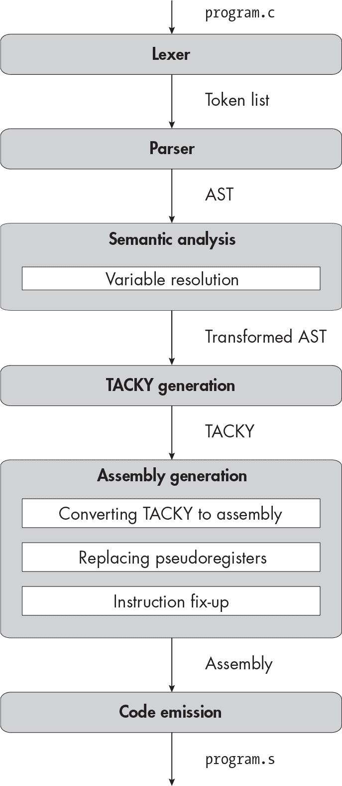

描述


## 7 复合语句


在本章中，你将实现复合语句。复合语句有两个重要作用。正如你在前两章中看到的，它们将其他语句和声明组合成一个单一单元，可以出现在更大的结构中，比如< samp class="SANS_TheSansMonoCd_W5Regular_11">if语句中。更有趣的是，它们还划定了函数内不同的*作用域*。变量的作用域是该变量可以使用的程序部分；当你在复合语句中声明一个变量时，它的作用域仅延伸到该语句的末尾。

在本章中，我们将花一些时间扩展解析器，以便将块项组合在一起，但我们的主要任务将是扩展变量解析阶段，以跟踪每个变量的作用域。我们几乎不需要修改 TACKY 生成阶段，且不会接触词法分析器或汇编生成阶段。在开始解析器之前，我将简要概述 C 语言中作用域的工作原理，并定义一些我将在本章后续中使用的术语。

### 作用域的概述

可以包含声明并确定这些声明作用域的语言结构被称为*块*。复合语句和函数体都是块。循环也是块，我们将在第八章中实现。（从技术上讲，if语句也是，但这对我们的实现来说并不重要。）局部变量的作用域从该变量声明的地方开始。这意味着变量的作用域可以从块的中间开始。它的作用域一直延伸到声明它的块的结尾。例如，在程序中

```
int main(void) {
    int a ❶ = 5;
    return a;
❷}
```

变量a的作用域从其初始化器之前的❶开始，并一直延伸到函数的最后❷。

复合语句可以单独出现，也可以出现在另一个语句内部。在示例 7-1 中，我们将复合语句作为< samp class="SANS_TheSansMonoCd_W5Regular_11">if语句的主体。

```
int main(void) {
    if (1) {
        int a ❶ = 2;
        return a + 1;
  ❷}
    return 0;
}
```

示例 7-1：将复合语句作为 if 语句体使用

在这个例子中，变量a的作用域从❶开始，直到复合语句的结尾❷。

当你进入一个新的块时，你仍然可以使用来自外部作用域的变量，如以下代码片段所示：

```
int a = 2;
{
    int b = a + 2;
}
```

尽管 a 是在外部作用域中声明的，但当我们在内部作用域初始化 b 时，我们仍然可以引用它。因此，我们将 b 初始化为 4。但让我们看看在列表 7-2 中发生了什么，在那里我们在内部块内声明了另一个名为 a 的变量。

```
❶ int a = 2;
{
  ❷ int a = 3;
    int b = a + 2;
}
```

列表 7-2：声明两个同名但作用域不同的变量

这次，当我们初始化 b 时，作用域中有两个名为 a 的不同变量：一个是在外部作用域中声明的 ❶，另一个是在内部作用域中声明的 ❷。在这种情况下，我们总是使用在最内层作用域中声明的变量。因此，我们将 b 初始化为 5。尽管外部的 a 仍然在作用域内，但我们无法访问它；它被内部的变量所*隐藏*（或*遮蔽*）。

被隐藏与超出作用域是不同的，因为被隐藏的变量可以在程序的后续部分再次变得可见。列表 7-3，它几乎与列表 7-2 相同，说明了这一区别。

```
❶ int a = 2;
{
  ❷ int a = 3;
    int b = a + 2;
}
❸ return a;
```

列表 7-3：一个隐藏的变量再次变得可见

正如我们在前面的示例中所看到的，第一条声明的a ❶ 被第二条声明 ❷ 隐藏了。但是 return 语句 ❸ 位于复合语句的末尾。在那个时候，第二个 a 已经超出了作用域，因此第一个 a 再次可见。因此，我们将在 return 语句中使用第一个 a，返回 2。

如果我们交换列表 7-2 中内部块内两个语句的顺序会怎样呢？那样我们就会得到：

```
int a = 2;
{
    int b = a + 2;
    int a = 3;
}
```

现在，当我们声明b时，内部的a还不在作用域内，因此它不会隐藏外部的a。表达式a + 2将引用第一个声明的a，因此我们会将b初始化为4。

你可以拥有许多层嵌套作用域，正如列表 7-4 所示。

```
int main(void) {
  ❶ int x = 1;
    {
      ❷ int x = 2;
        if (x > 1) {
          ❸ x = 3;
          ❹ int x = 4;
        }
      ❺ return x;
    }
  ❻ return x;
}
```

列表 7-4：多个嵌套作用域

在这个列表中，我们声明了三个不同作用域的名为x的变量。我们在❶声明第一个x，在❷声明第二个。我们在❸将值3赋给第二个x并在❺返回它，因此整个程序返回3。第三个名为x的变量，在❹声明，但从未使用。我们从未到达❻处的最后一个return语句，但如果到了那里，它将返回1，即在❶处声明的第一个变量名为x的值。

我们需要处理与变量作用域相关的两个错误情况。（我们在第五章中简要讨论过这两个问题，但在具有多个作用域的程序中，检测这些错误要复杂一些。）首先，如果没有与该名称对应的变量在作用域内，就不能使用该变量名。列表 7-5 说明了这个错误。

```
int main(void) {
    {
        int x ❶ = 4;
  ❷}
    return ❸ x;
    int x ❹ = 3;
❺}
```

列表 7-5：使用未声明的变量

在这个列表中，我们声明了两个不同的变量，名为x。第一个声明的作用域从❶开始，到❷结束。第二个声明的作用域从❹开始，一直到函数的末尾❺。在❸处，这两个声明都不在作用域内。此时使用变量名x是错误的，因为该名称没有指向任何东西。

其次，不能在同一作用域内有多个相同变量名的声明。如果两个变量的作用域在同一位置结束，我们就说它们有相同的作用域；也就是说，它们在同一个代码块内声明。例如，以下代码片段是无效的：

```
int a = 3;
{
    int b = a;
    int b = 1;
}
```

b的第二次声明是非法的，因为它与第一次声明的作用域相同。

现在你理解了需要实现的作用域规则，让我们开始解析器的工作。

### 解析器

被括号包裹的语句和声明列表可以是函数体或复合语句。让我们定义一个block AST 节点来表示这两种结构：

```
block = Block(block_item*)
```

请注意，这个 AST 节点并不代表if语句，且一旦我们在第八章中实现它们时，也不会表示循环语句，尽管它们在技术上也是块。

接下来，我们将扩展statement节点，以表示复合语句：

```
statement = Return(exp)
          | Expression(exp)
          | If(exp condition, statement then, statement? else)
 **| Compound(block)**
          | Null
```

我们还将更改function_definition节点，使用block：

```
function_definition = Function(identifier name, **block** body)
```

第 7-6 列表给出了包含这些更改的新 AST 定义，已加粗显示。

```
program = Program(function_definition)
function_definition = Function(identifier name, **block** body)
block_item = S(statement) | D(declaration)
**block = Block(block_item*)**
declaration = Declaration(identifier name, exp? init)
statement = Return(exp)
          | Expression(exp)
          | If(exp condition, statement then, statement? else)
 **| Compound(block)**
          | Null
exp = Constant(int)
    | Var(identifier)
    | Unary(unary_operator, exp)
    | Binary(binary_operator, exp, exp)
    | Assignment(exp, exp)
    | Conditional(exp condition, exp, exp)
unary_operator = Complement | Negate | Not
binary_operator = Add | Subtract | Multiply | Divide | Remainder | And | Or
                | Equal | NotEqual | LessThan | LessOrEqual
                | GreaterThan | GreaterOrEqual
```

列表 7-6：带有复合语句的抽象语法树

第 7-7 列表展示了语法的相应更改。

```
<program> ::= <function>
<function> ::= "int" <identifier> "(" "void" ")" **<block>**
**<block> ::= "{" {<block-item>} "}"**
<block-item> ::= <statement> | <declaration>
<declaration> ::= "int" <identifier> ["=" <exp>] ";"
<statement> ::= "return" <exp> ";"
              | <exp> ";"
              | "if" "(" <exp> ")" <statement> ["else" <statement>]
              **| <block>**
              | ";"
<exp> ::= <factor> | <exp> <binop> <exp> | <exp> "?" <exp> ":" <exp>
<factor> ::= <int> | <identifier> | <unop> <factor> | "(" <exp> ")"
<unop> ::= "-" | "~" | "!"
<binop> ::= "-" | "+" | "*" | "/" | "%" | "&&" | "||"
          | "==" | "!=" | "<" | "<=" | ">" | ">=" | "="
<identifier> ::= ? An identifier token ?
<int> ::= ? A constant token ?
```

列表 7-7：带有复合语句的语法

请记住，在"{"和"}"的定义中，<block>是字面意义上的括号，而{和}表示重复。你可以使用你已经熟悉的递归下降技术来解析更新后的语法。当你解析<statement>符号时，{标记会告诉你已经遇到复合语句，就像if关键字表示一个<sup class="SANS_TheSansMonoCd_W5Regular_11">if</sup>语句的开始，return表示<sup class="SANS_TheSansMonoCd_W5Regular_11">return</sup>语句的开始。

### 变量解析

现在我们将更新变量解析过程，以遵循本章开始时讨论的作用域规则。在这个过程中，任何在原始程序中具有相同名称的局部变量将会被赋予不同的名称。在后续的过程中，我们完全不需要考虑作用域；因为每个变量都会有一个独特的名称，我们可以像之前的章节中那样，将每个变量转换成 TACKY 变量，接着是伪寄存器，最后转换成内存地址，而不必担心每个名称所指代的对象。

#### 在多个作用域中解析变量

作为示例，让我们再来看一遍 列表 7-4 中的程序：

```
int main(void) {
    int x = 1;
    {
        int x = 2;
        if (x > 1) {
            x = 3;
            int x = 4;
        }
        return x;
    }
    return x;
}
```

列表 7-8 显示了变量解析后的程序样子。

```
int main(void) {
    int x0 = 1;
    {
        int x1 = 2;
        if (x1 > 1) {
            x1 = 3;
            int x2 = 4;
        }
        return x1;
    }
    return x0;
}
```

列表 7-8：在进行变量解析后，列表 7-4 中的程序

现在每个变量都有了不同的名称。这些新名称清晰地标明了我们在每个时刻使用的是哪个变量。例如，现在我们可以明确知道函数开始时声明的变量（我们已将其重命名为 x0）只在最后一次使用。

我们的变量解析基本方法与之前章节相同。我们将遍历 AST，在此过程中维护一个从用户定义的名称到生成的名称的映射。现在，我们新的作用域规则将决定我们如何更新这个映射。表 7-1 显示了在 列表 7-4 中每个时刻变量映射的样子。

表 7-1： 在 列表 7-4 中的变量映射

| int main(void) { | (空映射) |
| --- | --- |

|

```
 int x = 1;
    {
```

| x → x0 |
| --- |

|

```
 int x = 2;
        if (x > 1) {
            x = 3;
```

| x → x1 |
| --- |

|

```
 int x = 4;
         }
```

| x → x2 |
| --- |

|

```
 return x;
     }
```

| x → x1 |
| --- |

|

```
     return x;
}
```

| x → x0 |
| --- |

变量映射的状态会在两种情况下发生变化。首先，当声明一个新变量时，我们将其添加到映射中，并覆盖任何具有相同名称的现有变量。其次，当我们退出一个代码块时，我们会恢复到进入该代码块之前的变量映射状态。

第一个情况已经很熟悉：每当我们遇到一个变量声明时，我们就会添加一个映射条目。为了处理第二种情况，每当进入一个新块时，我们会复制一份变量映射。在处理该块时，我们会向这份复制的映射中添加新的条目，而不会改变外部作用域的变量映射。

现在你已经对这个过程的基本原理有了了解，接下来我们一起看一下伪代码。

#### 更新变量解析伪代码

首先，我们来处理声明。在前面的章节中，如果编译器遇到同一个变量名的两次声明，它会失败：

```
resolve_declaration(Declaration(name, init), variable_map):
    if name is in variable_map:
        fail("Duplicate variable declaration!")
 `--snip--`
```

但现在情况有点复杂了。重复使用相同的变量名在多个声明中是合法的。然而，在*同一块内*声明同一个变量名是非法的。为了强制执行这一规则，我们会追踪变量映射中每个条目的两个事实：它的新自动生成名称以及它是否在当前块中声明。列表 7-9 给出了处理声明的更新伪代码。与之前版本的 列表 5-9 相比，变化部分已加粗。

```
resolve_declaration(Declaration(name, init), variable_map):
    if name is in variable_map **and variable_map.get(name).from_current_block:**
        fail("Duplicate variable declaration!")
    unique_name = make_temporary()
    variable_map.add(name, **MapEntry(new_name=unique_name, from_current_block=True)**)
    if init is not null:
        init = resolve_exp(init, variable_map)
    return Declaration(unique_name, init)
```

列表 7-9: 解析变量声明

接下来，我们需要一个可以按顺序处理块项的函数（我将在后续的伪代码列表中称之为 resolve_block）。你已经编写了这段代码来处理函数体；现在你只需要重构它，使其也可以用来处理复合语句。记住，在处理一个块项（特别是声明）时所做的更改，必须在处理后续块项时可见。

我们还会更新 resolve_statement 来处理复合语句。列表 7-10 给出了更新后的 resolve_statement 伪代码，和之前版本的 列表 5-10 的变化部分已加粗。这里的重要细节是：当我们遍历复合语句时，我们会传递变量映射的一个*副本*，这样在复合语句内部处理的任何声明在外部作用域不可见。

```
resolve_statement(statement, variable_map):
    match statement with
    | Return(e) -> return Return(resolve_exp(e, variable_map))
    | Expression(e) -> return Expression(resolve_exp(e, variable_map))
 **| Compound(block) ->**
 **new_variable_map = copy_variable_map(variable_map)**
 **return Compound(resolve_block(block, new_variable_map))**
    | `--snip--`
```

列表 7-10: 解析复合语句

最后，我们将实现 copy_variable_map。这应该创建一个变量映射的副本，并将 from_current_block 标志设置为 False，应用于每个条目。这样，在处理内部作用域中隐藏外部作用域声明的声明时，我们就不会抛出错误。

一旦你完成了这些更改，你的变量解析阶段将能够处理嵌套作用域！### TACKY 生成

最后一步是扩展 TACKY 生成阶段，以处理复合语句。这非常直接：要将复合语句转换为 TACKY，只需将其中的每个代码块项转换为 TACKY。基本上，你应该像处理函数体一样处理复合语句。你完全不需要接触后续的编译器阶段；一旦 TACKY 生成工作完成，你就完成了本章的内容！

### 总结

在本章中，你通过扩展编译器的几个阶段，实现了一种新的语句类型。你编写了一个更复杂的变量解析阶段，能够正确解析多个作用域中的变量，极大地扩展了你能够编译的程序集合。接下来，你将实现循环语句、break 语句和 continue 语句。本章的工作对于你添加对 for 循环的支持特别重要，因为一个 for 循环包含了两个不同的作用域。
