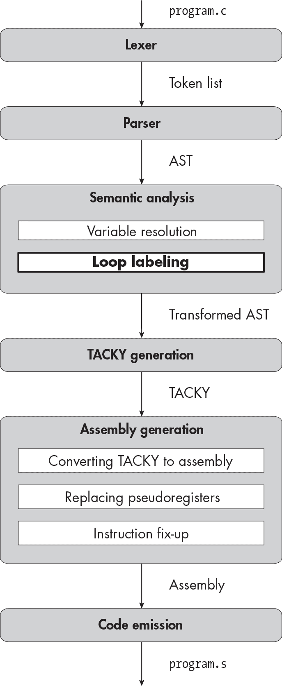

描述


## 8 循环


在本章中，你将添加所有与循环相关的内容。这包括 for、while 和 do 循环，另外还有 break 和 continue 语句，用来跳过循环的某些部分。这些是本书中你将实现的最后几个语句。一旦你完成本章的内容，并且实现了所有额外的加分特性，你的编译器就能处理*每*一种 C 语句。

但你首先有工作要做！你将更新词法分析器和语法分析器，以支持所有五个新语句。然后，你将增加一个新的语义分析步骤，我们称之为*循环标注*。这个新步骤，如本章开头的图表中加粗的部分所示，将注释 AST，将每个 break 或 continue 语句与包含它的循环关联起来。最后，你将把每个新语句翻译成一系列 TACKY 指令。你可以使用已经定义的 TACKY 指令来实现所有新语句，因此在 TACKY 生成之后你不会再更改任何阶段。

本章中新引入的语句会带来一些边界情况和错误，我们需要处理这些情况。在我们开始讲解词法分析器之前，我们将简要讨论每个语句。

### 循环及如何跳出它们

让我们首先看看三种循环语句，然后考虑 break 和 continue 语句。Listing 8-1 展示了一个 while 循环的示例。

```
while ( ❶ a > 0)
    a = a / 2;
```

Listing 8-1: 一个 while 循环

首先，我们评估语句的*控制表达式* ❶。如果它是 0（即假），循环结束，我们进入下一个语句。如果它是非零的，我们执行 while 循环体，然后返回控制表达式，清空并重复执行。

一个 do 循环，像在 Listing 8-2 中的那个，几乎是完全相同的。

```
do
    a = a + 1;
while (a < 100);
```

列表 8-2：一个 do 循环

唯一的区别是我们先执行循环体，*然后*检查控制表达式。这意味着循环体至少会执行一次。像if语句体一样，循环体是一个单一的语句，可以是包含声明的复合语句。你在循环体内声明的任何变量，在控制表达式中将无法访问。例如，列表 8-3 是无效的。

```
do {
    int a = a + 1;
} while (a < 100);
```

列表 8-3：一个 do 循环，其中控制表达式使用了一个超出作用域的变量

当for循环出现时，事情开始变得更加复杂。它们有两种不同的形式。在第一种形式中，如列表 8-4 所示，循环头由三个表达式组成。

```
int a;
for ( ❶ a = 0; ❷ a < 5; ❸ a = a + 1)
    b = b * 2;
```

列表 8-4：一个 for 循环，其中初始语句是一个表达式

初始表达式❶在第一次循环迭代之前评估一次。然后，在每次迭代时，我们：

1.  评估控制表达式❷。如果它为假，循环终止。否则，我们…

1.  执行语句体。

1.  评估最终表达式❸。

你可以省略循环头中的任何或所有表达式。如果省略初始表达式或最终表达式，当该语句通常会被评估时，什么也不会发生。如果省略控制表达式，循环将表现得好像其控制表达式始终为真（即非零）。这意味着它永远不会终止，除非它包含一个可以跳出循环体的break、goto或return语句。

列表 8-5 展示了第二种类型的for循环，其中初始语句是一个声明，而不是表达式。

```
for (int a = 0; a < 5; a = a + 1)
    b = b * 2;
```

列表 8-5：一个 for 循环，其中初始语句是一个声明

for循环头引入了一个新的作用域，因此你可以像列表 8-6 那样编写代码。

```
int a = 5;
for (int a = 0; a < 5; a = a + 1)
    b = b + a;
```

清单 8-6：在 for 循环前和循环头部声明两个同名变量

在这个清单中，头部声明的变量a隐藏了上一行声明的变量a。由于复合语句总是引入一个新的作用域，包括当它作为循环体出现时，清单 8-7 也是有效的。

```
❶ int a = 5;
for ( ❷ int a = 0; a < 5; a = a + 1) {
  ❸ int a = 1;
    b = b + a;
}
```

清单 8-7：在 for 循环前，循环头部和循环体中声明三个同名变量

在清单 8-7 中，有三个不同的变量名为a：一个在循环开始前声明 ❶，一个在循环头部声明 ❷，另一个在循环体内声明 ❸。

尽管在for循环头部的表达式是可选的，但循环体是必须的。（这对于do和while循环也是如此。）然而，循环体可以是一个空语句，就像在清单 8-8 中一样。

```
while ((a = a + 1) < 10)
    ;
```

清单 8-8：将空语句用作循环体

这里单独的;是一个空语句。尽管这个语句什么也不做，但我们需要包含它，以便解析器能够识别循环的结束位置。正如我们在第五章中实现它们时所看到的，空语句并不是一个特定于循环的构造；你可以在任何可以使用其他类型语句的地方使用它们。实际上，它们主要出现在循环体内，因为它们很少在其他地方有用。

现在让我们讨论一下break和continue语句。两者只能出现在循环内部。（实际上，这并不完全正确；break语句也可以出现在switch语句内部，你可以将它作为本章的附加功能来实现。）break语句，像清单 8-9 中的语句一样，跳转到循环结束后的位置。

```
while (1) {
    a = a - 1;
    if (a < 0)
        break;
}
return a;
```

清单 8-9：一个 break 语句

当我们遇到这个 break 语句时，我们将跳转到 return 语句，位于 while 循环之后。

break 语句仅终止最内层的循环。例如，参考 列表 8-10 中的代码片段。

```
while (b > 0) {
    do {
        a = a - 1;
        if (a < 0)
            break;
    } while (1);
    b = b * a;
}
return b;
```

列表 8-10：使用 break 语句跳出两个嵌套循环中的内层循环

当我们到达这个列表中的 break 语句时，我们将跳出内层循环，但不会跳出外层循环，因此我们会跳转到 b = b * a;。在本章中，我将把包含 break 或 continue 语句的最内层循环称为它的 *封闭循环*。（如果称之为“最小封闭循环”会更符合 C 标准中的术语，但这有点冗长。）

continue 语句跳转到封闭循环体内最后一条语句之后的位置。参考 列表 8-11 中的例子。

```
while (a > 0) {
    a = a * b;
    if (b > 0)
        continue;
    b = b + 1;
    return b;
❶}
```

列表 8-11：A continue 语句

当我们到达 continue 语句时，我们将跳过所有后续的语句，直接跳转到循环体的末尾 ❶。从那里，while 循环照常执行，意味着它将跳转回控制表达式。像 列表 8-12 中的那种 for 循环中的 continue 语句也起到相同的作用。

```
for (int i = 0; i < 5; ❶ i = i + 1) {
    a = a * i;
    if (b > 0)
        continue;
    b = b + 1;
❷}
```

列表 8-12：A continue 语句在 for 循环内部

在这个列表中，我们仍然从 continue 语句跳转到循环体的末尾 ❷。然后，我们按常规跳转到最终表达式 ❶。

如果在循环外出现了一个 break 或 continue 语句，就像在清单 8-13 中一样，编译应该失败。

```
int main(void) {
    break;
}
```

清单 8-13：无效的 break 语句

然而，如果这些语句之一嵌套在循环内部深层次的地方，像清单 8-14 中的 break 语句那样，也是完全合法的。

```
while (1) {
    if (a > 4) {
        b = b * 2;
        return a + b;
    } else {
        int c = a ? b : 5;
        {
            int d = c;
            break;
        }
    }
    return 0;
}
return 1;
```

清单 8-14：一个 break 语句出现在循环内多层嵌套的情况

这个 break 语句跳转到 return 1;，因为那是循环结束后的下一点。

在一个循环中有多个 break 和 continue 语句是合法的，就像在清单 8-15 中一样。

```
for (int i = 0; i < 10; i = i + 1) {
    if (i % 2 == 0)
        continue;
    if (x > y)
        continue;
    break;
}
```

清单 8-15：多个 break 和 continue 语句在循环内部

现在我们已经涵盖了你需要了解的关于本章将要添加的语句的关键内容，我们可以开始实现它们了。第一步，像往常一样，是更新词法分析器（lexer）。

### 词法分析器

本章中你将添加五个关键字：

do

while

for

break

continue

你不需要其他新的标记（tokens）。

### 解析器

接下来，我们将更新抽象语法树（AST）。我们将添加五个新语句：

```
statement = Return(exp)
          | Expression(exp)
          | If(exp condition, statement then, statement? else)
| Compound(block)
 **| Break**
 **| Continue**
 **| While(exp condition, statement body)**
 **| DoWhile(statement body, exp condition)**
 **| For(for_init init, exp? condition, exp? post, statement body)**
          | Null
```

`break` 和 `continue` 语句是最简单的。`while` 和 `do` 语句也相对简单；它们都有一个主体和一个控制表达式。`for` 语句是最复杂的：它包括一个初始子句、一个可选的控制表达式、一个可选的最终表达式和一个主体。初始子句可以是声明、表达式或没有任何内容，因此我们需要一个新的 AST 节点来描述它：

```
for_init = InitDecl(declaration) | InitExp(exp?)
```

将所有内容整合在一起，我们得到了最新的 AST 定义，如 示例 8-16 所示。

```
program = Program(function_definition)
function_definition = Function(identifier name, block body)
block_item = S(statement) | D(declaration)
block = Block(block_item*)
declaration = Declaration(identifier name, exp? init)
**for_init = InitDecl(declaration) | InitExp(exp?)**
statement = Return(exp)
          | Expression(exp)
          | If(exp condition, statement then, statement? else)
| Compound(block)
 **| Break**
 **| Continue**
 **| While(exp condition, statement body)**
 **| DoWhile(statement body, exp condition)**
 **| For(for_init init, exp? condition, exp? post, statement body)**
          | Null
exp = Constant(int)
| Var(identifier)
    | Unary(unary_operator, exp)
    | Binary(binary_operator, exp, exp)
| Assignment(exp, exp)
| Conditional(exp condition, exp, exp)
unary_operator = Complement | Negate | Not
binary_operator = Add | Subtract | Multiply | Divide | Remainder | And | Or
                | Equal | NotEqual | LessThan|LessOrEqual
                | GreaterThan | GreaterOrEqual
```

示例 8-16：包含循环的抽象语法树和 break 和 continue 语句

本章更新 AST 涉及一个复杂的问题。循环标注阶段会为程序中的每个 `break`、`continue` 和循环语句加上标签（我们将使用这些标签将每个 `break` 和 `continue` 语句与其包含的循环关联起来）。这意味着你需要一种方法将这些标签附加到 AST 中的新语句上。这里有几种不同的选择。一种方法是在每个新构造函数中包含一个 `label` 参数，像这样：

```
statement = `--snip--`
          | Break(**identifier label**)
          | Continue(**identifier label**)
          | While(exp condition, statement body, **identifier label**)
          | DoWhile(statement body, exp condition, **identifier label**)
          | For(for_init init, exp? condition, exp? post, statement body, **identifier label**)
```

如果你选择这种方法，你可能需要在解析过程中使用虚拟标签，然后在循环标注阶段将它们替换为真实标签。另一种方法是定义两个 AST 数据结构：一个在循环标注前使用，没有注释，另一个在循环标注后使用，带有注释。正确的方法取决于你使用的编译语言（以及你的个人偏好）。

更新 AST 后，我们将对语法进行相应的修改，如 示例 8-17 所示。

```
<program> ::= <function>
<function> ::= "int" <identifier> "(" "void" ")" <block>
<block> ::= "{" {<block-item>} "}"
<block-item> ::= <statement> | <declaration>
<declaration> ::= "int" <identifier> ["=" <exp>] ";"
**<for-init> ::= <declaration> | [<exp>] ";"**
<statement> ::= "return" <exp> ";"
              | <exp> ";"
| "if" "(" <exp> ")" <statement> ["else" <statement>]
              | <block>
              **| "break" ";"**
 **| "continue" ";"**
 **| "while" "(" <exp> ")" <statement>**
 **| "do" <statement> "while" "(" <exp> ")" ";"**
 **| "for" "(" <for-init> [<exp>] ";" [<exp>] ")" <statement>**
              | ";"
<exp> ::= <factor> | <exp> <binop> <exp> | <exp> "?" <exp> ":" <exp>
<factor> ::= <int> | <identifier> | <unop> <factor> | "(" <exp> ")"
<unop> ::= "-" | "~" | "!"
<binop> ::= "-" | "+" | "*" | "/" | "%" | "&&" | "||"
          | "==" | "!=" | "<" | "<=" | ">" | ">=" | "="
<identifier> ::= ? An identifier token ?
<int> ::= ? A constant token ?
```

示例 8-17：包含循环的语法和 break 和 continue 语句

我建议编写一个辅助函数来解析可选的表达式。你可以使用这个辅助函数来解析`for`循环头部中的两个可选表达式，以及表达式语句和空语句。这个辅助函数应该让你指定哪个标记表示可选表达式的结束；语法中的大多数可选表达式后面跟着一个分号，但`for`循环头部的第三个子句后面跟着一个右括号。

### 语义分析

目前编译器的语义分析阶段执行一个任务：解析变量名。在本章中，它将承担一个全新的任务：循环标记。循环标记步骤将每个`break`和`continue`语句与其所在的循环关联起来。更具体地说，这个步骤为每个循环语句分配一个唯一的 ID，并为每个`break`和`continue`语句添加其所在循环的 ID。如果在循环外发现`break`或`continue`语句，将抛出错误。在 TACKY 生成过程中，我们将使用这些注释信息，将每个`break`和`continue`语句转换为相对于其所在循环的跳转。

我们将在两次遍历中分别解析变量名和标记循环，每次遍历整个程序。让我们首先扩展变量解析步骤，以处理本章的新语句；然后实现循环标记步骤。

#### 扩展变量解析

你需要扩展resolve_statement，以遍历本章中添加的五个新语句。你将像处理`if`语句一样处理`while`和`do`循环，递归地处理每个子语句和子表达式。解析`break`和`continue`语句要简单得多；因为它们没有子语句或子表达式，你不需要做任何额外处理。

解析一个for循环稍微复杂一些，因为循环头部引入了一个新的变量作用域。清单 8-18 演示了如何在resolve_statement中处理for循环。

```
resolve_statement(statement, variable_map):
    match statement with
  | `--snip--`
    | For(init, condition, post, body) ->
        new_variable_map = copy_variable_map(variable_map)
        init = resolve_for_init(init, new_variable_map)
        condition = resolve_optional_exp(condition, new_variable_map)
        post = resolve_optional_exp(post, new_variable_map)
        body = resolve_statement(body, new_variable_map)
        return For(init, condition, post, body)
```

清单 8-18：解析一个 for 循环

我们首先创建一个新的变量映射副本，就像在复合语句的开始时一样。复制映射可以确保在循环头部声明的变量不会在循环外部可见，并且如果它隐藏了外部作用域的变量，也不会触发编译器错误。

接下来，我们使用resolve_for_init处理初始子句，稍后我们将查看这个函数。然后，我们使用新的变量映射遍历for循环的控制表达式、终止表达式和主体。我不会提供resolve_optional_exp的伪代码，它处理可选的控制表达式和终止表达式；如果表达式存在，它会调用resolve_exp，如果不存在，则不执行任何操作。

清单 8-19 显示了resolve_for_init的伪代码。

```
resolve_for_init(init, variable_map):
    match init with
    | InitExp(e) -> return InitExp(resolve_optional_exp(e, variable_map))
    | InitDecl(d) -> return InitDecl(resolve_declaration(d, variable_map))
```

清单 8-19：解析一个 for 循环的初始子句

我们在初始子句中解析一个表达式或声明的方式与在程序其他地方解析它时完全相同。如果该子句是一个声明，调用resolve_declaration将把新声明的变量添加到变量映射中，使其在整个循环中可见。

#### 循环标记

在解析变量后，我们将再次遍历程序，给每个循环、break 和 continue 语句标注上 ID。每当我们遇到循环语句时，我们将为其生成一个唯一的 ID。然后，在遍历循环体时，我们将这个 ID 附加到遇到的任何 break 和 continue 语句上。让我们来看几个例子。在接下来的三个列表中，标记 ❶ 和 ❷ 表示附加到抽象语法树（AST）的 ID。尽管循环标注阶段是给 AST 添加注解，而不是源文件，但为了可读性，这些列表以源代码的形式呈现。

列表 8-20 演示了我们如何标注包含两个连续循环的代码片段。

```
❶ while (1) {
    a = a - 1;
    if (a < 0)
      ❶ break;
}

❷ for (int b = 0; b < 100; b = b + 1) {
    if (b % 2 == 0)
      ❷ continue;
    a = a * b;
}
return a;
```

列表 8-20: 标注 break 和 continue 语句及其包含的循环

本列表中的两个循环各自获得一个 ID。我们将 while 循环标注为 ID ❶，将 for 循环标注为 ID ❷。每个 break 或 continue 语句都会被标注上其所包含循环的 ID，因此我们将 break 语句标注为 ID ❶，将 continue 语句标注为 ID ❷。

如果多个 break 或 continue 语句位于同一个包含循环中，它们都会被标注为相同的 ID，正如 列表 8-21 所示。

```
❶ for (int i = 0; i < 10; i = i + 1) {
    if (i % 2 == 0)
      ❶ continue;
    if (x > y)
      ❶ continue;
  ❶ break;
}
```

列表 8-21: 标注同一循环中的多个 break 和 continue 语句

由于标注为 ❶ 的 for 循环是两个 continue 语句和 break 语句的包含循环，我们将这三条语句都标注为 ID ❶。

如果 break 或 continue 语句出现在嵌套循环内，我们会用其包含的最内层循环的 ID 为其注解。列表 8-22 演示了如何注解嵌套循环。

```
❶ while (a > 0) {
  ❷ for (int i = 0; i < 10; i = i + 1) {
        if (i % 2 == 0)
          ❷ continue;
        a = a / 2;
    }
    if (a == b)
      ❶ break;
}
```

列表 8-22：注解嵌套循环

外部的 while 循环和内部的 for 循环分别被标注为 ❶ 和 ❷。由于 continue 语句出现在内部循环中，我们用 ID ❷ 为其注解。break 语句出现在外部循环中，因此我们用 ID ❶ 为其注解。

#### 实现循环标注

为了实现这个编译器阶段，我们在遍历 AST 时将当前的循环 ID 作为参数传递，就像我们在变量解析阶段将变量映射传递给 resolve_statement、resolve_exp 等函数一样。当我们不在循环内时，当前的 ID 为 null 或 None，或者根据你的实现语言，表示缺失值的其他方式。当遇到循环语句时，我们会生成一个新的 ID，并用它注解该语句。然后，在遍历循环体时，我们将其作为当前 ID 传递。当遇到 break 或 continue 语句时，我们用传递给我们的 ID 为其注解。列表 8-23 中的伪代码演示了如何用循环 ID 注解语句。

```
label_statement(statement, current_label):
    match statement with
    | Break ->
        if current_label is null:
            fail("break statement outside of loop")
        return ❶ annotate(Break, current_label)
    | Continue ->
        if current_label is null:
            fail("continue statement outside of loop")
        return ❷ annotate(Continue, current_label)
    | While(condition, body) ->
        new_label = ❸ make_label()
        labeled_body = label_statement(body, new_label)
        labeled_statement = While(condition, labeled_body)
        return ❹ annotate(labeled_statement, new_label)
    | `--snip--`
```

列表 8-23：循环注解算法

make_label辅助函数❸生成唯一的循环 ID；你可以在此使用与生成 TACKY 中唯一标签相同的辅助函数。annotate辅助函数接受一个statement AST 节点和一个标签，并返回一个带有该标签的 AST 节点副本。在这里，我们用它来注解Break ❶、Continue ❷和While ❹语句。我没有提供annotate的定义，因为它将依赖于你在 AST 中如何表示循环注解。我还省略了处理DoWhile、For以及我们在早期章节中添加的所有语句的伪代码。你可以像处理While语句一样处理DoWhile和For语句。要处理任何其他类型的语句，请递归地调用label_statement，并传递相同的current_label值给每个子语句。

一旦你更新了循环标签的传递过程，就可以测试整个语义分析阶段了。

### TACKY 生成

接下来，我们将把每个新语句转换为 TACKY。在本章中，我们不会改变 TACKY IR，因为我们可以使用现有的 TACKY 指令来实现这些语句。

#### break 和 continue 语句

一个break语句会无条件跳转到程序中的某个点，因此我们使用单一的Jump指令来实现它。continue语句也是如此。唯一的问题是跳转到哪里。我们在上一节添加的循环注解可以帮助我们回答这个问题。

每当我们将一个循环语句转换为 TACKY 时，我们会在循环体的指令后面生成一个Label。任何该循环中的continue语句都可以实现为跳转到该标签，我将其称为*continue 标签*。我们将生成另一个Label作为整个循环的最后一条指令；我将其称为*break 标签*。

我们将根据在循环注释过程中添加的 ID 来导出这些标签。例如，如果一个循环被标记为 loop0，则其 break 和 continue 标签可能是 break_loop0 和 continue_loop0。使用此命名方案，我们将把带有 ID loop0 注释的 Break AST 节点转换为以下 TACKY 指令：

```
Jump("break_loop0")
```

我们将使用相同的注释将一个 Continue 节点转换为：

```
Jump("continue_loop0")
```

你不需要使用这个特定的命名方案（尽管你的命名方案必须保证这些标签不会与 TACKY 程序中的其他标签冲突）。重要的是，你可以在将 break 或 continue 语句转换为 TACKY 时，导出与转换其封闭循环时相同的标签，因为该语句及其封闭循环都使用相同的 ID 注释。

#### do 循环

我们可以通过三步执行语句 do <body> while (<condition>);。首先，我们执行循环体。然后，评估条件并将结果与零进行比较。最后，如果结果不为零，我们跳回到循环的开始。清单 8-24 演示了如何在 TACKY 中实现这些步骤。

```
Label(start)
`<instructions for body>`
`<instructions for condition>`
v = `<result of condition>`
JumpIfNotZero(v, start)
```

清单 8-24：do 循环的 TACKY 指令

我们还需要 break 和 continue 标签。continue 标签位于循环体和条件之间，而 break 标签位于最后，在 JumpIfNotZero 之后。添加这两个标签可以得到完整的 TACKY for do 循环，如清单 8-25 所示。

```
Label(start)
`<instructions for body>`
**Label(continue_label)**
`<instructions for condition>`
v = `<result of condition>`
JumpIfNotZero(v, start)
**Label(break_label)**
```

清单 8-25：带有 break 和 continue 标签的 do 循环的 TACKY 指令

现在，循环体中的任何 continue 语句将跳转到 continue 标签，而任何 break 语句将跳转到 break 标签。只有在循环体中出现 break 或 continue 语句时，这些标签才是必要的——否则它们不会被使用——但为了简化，我们总是会生成这些标签。这样，我们就不需要判断循环中是否包含 break 或 continue 语句。

#### while 循环

我们将像处理 do 循环一样处理 while 循环，但在这种情况下，我们将在循环体之前执行条件判断，然后使用 JumpIfZero 来退出循环（如果条件为假）。我们可以将语句 while (<condition>) <body> 转换为 清单 8-26 中的 TACKY。

```
Label(start)
`<instructions for condition>`
v = `<result of condition>`
JumpIfZero(v, end)
`<instructions for body>`
❶ Jump(start)
Label(end)
```

清单 8-26: while 循环的 TACKY 指令

现在，让我们来决定将 break 和 continue 标签放在哪里。这次我们不需要额外的 Label 指令；我们可以重用 清单 8-26 中已经存在的 Label 指令。我们将把 break 标签放在本清单末尾的 Label 指令中。它将作为 JumpIfZero 指令和任何循环体中的 break 语句的目标。

同样，我们将在本清单开头的 Label 指令中放置 continue 标签。这与将 continue 标签放在循环体末尾之后 ❶ 的效果相同，因为循环体之后的指令是一个无条件跳转，它会立即将我们带回循环的开始。让 continue 语句直接跳转到循环开始处，可以让它们绕过那个 Jump 指令，从而提高一些效率。

Listing 8-27 显示了在我们将while循环转换为 TACKY 时，应该使用 break 和 continue 标签的位置。

```
Label(**continue_label**)
`<instructions for condition>`
v = `<result of condition>`
JumpIfZero(v, **break_label**)
`<instructions for body>`
Jump(**continue_label**)
Label(**break_label**)
```

Listing 8-27: 带有 break 和 continue 标签的 TACKY 指令，用于 while 循环

这个 TACKY 与 Listing 8-26 完全相同，只是它使用了continue_label和break_label，而不是start和end。

#### for 循环

我们的最终任务是将for循环转换为 TACKY。我们将把语句for (<init> ; <condition> ; <post>) <body> 转换为 Listing 8-28 中的 TACKY，这包括了 break 和 continue 标签。

```
`<instructions for init>`
Label(start)
`<instructions for condition>`
v = `<result of condition>`
JumpIfZero(v, break_label)
`<instructions for body>`
Label(continue_label)
`<instructions for post>`
Jump(start)
Label(break_label)
```

Listing 8-28: 带有 break 和 continue 标签的 TACKY 指令，用于 for 循环

首先，我们执行<code><init></code>。然后，我们执行控制表达式<code><condition></code>，并检查结果是否为零。如果是，我们跳转到<code>Label(break _label)</code>，跳过执行循环体和最终表达式。否则，我们执行循环体，接着是最终表达式<code><post></code>，然后跳转回<code>Label(start)</code>并开始下一轮循环。我们不会再次执行<code><init></code>，因为<code>Label(start)</code>在<code><init></code>之后。请注意，continue 标签出现在循环体的末尾，紧接在<code><post></code>之前，而 break 标签则出现在循环的最末尾，起到双重作用：既是<code>JumpIfZero</code>指令的目标，也是任何<code>break</code>语句的目标。

接下来，让我们分析如何处理循环头中的三个子句。第一个子句可以是一个表达式、一个声明，或者什么都没有。如果它是声明或表达式，我们将像处理<code>for</code>循环外的声明或表达式一样处理它。如果没有这个子句，我们将不生成任何指令。

第二个子句是控制表达式。如果这个表达式存在，我们将像处理<code>while</code>和<code>do</code>循环中的控制表达式一样，转换它为 TACKY。如果缺失，C 标准规定这个表达式会被“替换为一个非零常量”（第 6.8.5.3 节，第 2 段）。我们可以直接在条件跳转中使用一个非零常量：

```
JumpIfZero(Const(1), break_label)
```

但这个指令实际上什么也不做；Const(1)永远不可能等于零，因此我们永远不会跳转。相反，我们将完全省略<code>JumpIfZero</code>指令，因为这种方式更高效，能实现相同的行为。

最后，我们需要处理第三个子句，<post>。如果存在，我们将转换它为 TACKY；如果缺失，我们将不生成任何指令。### 额外加分：switch 语句

在这一章中，你有机会实现 switch、case 和 default 语句。为了支持这些语句，你将需要对语义分析阶段进行重大修改。首先，你需要更改循环注解阶段，因为 break 语句可以跳出 switch 语句以及循环。你不能在 switch 语句中使用 continue 语句，因此这个阶段需要将 continue 语句与 break 语句区分开来。

你将需要额外的分析，可能是在一个单独的编译器阶段，来收集出现在每个 switch 语句中的所有情况。为了生成一个 switch 语句的 TACKY，你需要得到该语句中所有情况的列表。然而，这些信息在 AST（抽象语法树）中并不立即可用。一个 switch 语句中的情况可能嵌套了多层，或者 switch 语句的主体根本没有包含任何情况。你需要以更易用的形式将这些信息附加到 AST 上。

使用 --switch 标志来启用对 switch 语句的测试：

```
$ **./test_compiler** `**/path/to/your_compiler**` **--chapter 8 --switch**
```

或者，像往常一样，使用 --extra-credit 标志来启用所有额外的学分测试。

### 总结

在本章中，你实现了最后一组控制流语句。你为三种不同的循环语句添加了支持，并增加了对 break 和 continue 语句的支持。你实现了一个新的语义分析阶段，将 break 和 continue 语句与它们所包含的循环关联，并且你学会了如何将这些复杂的结构转换为一系列 TACKY 指令。

虽然我们已经完成了控制流的*语句*，但在下一章中，你将为一种新的控制流*表达式*添加支持：函数调用。你将学习关于调用约定的知识，这些约定决定了在汇编语言中函数调用的工作原理，并编写一个简单的类型检查器。最棒的是，你将通过编译“Hello, World!”来结束这一章。
