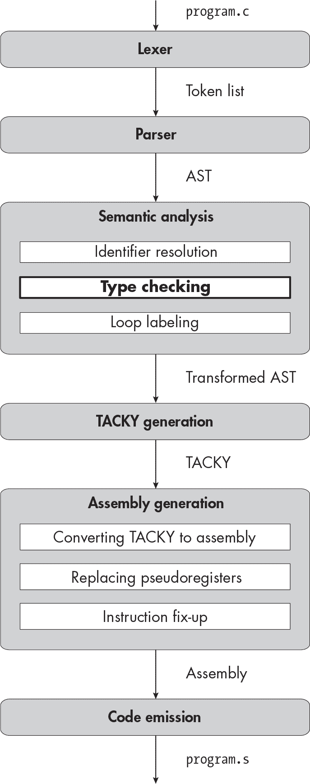
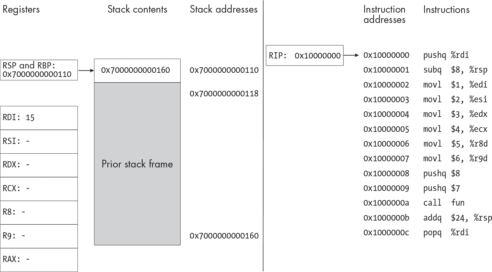
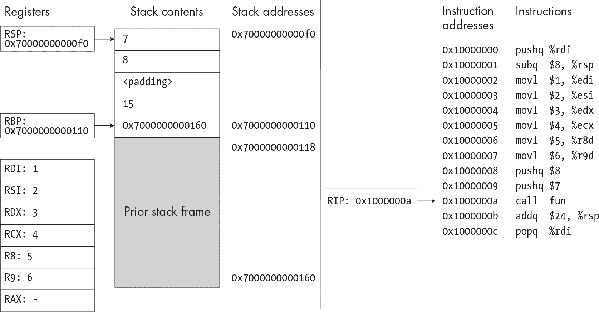
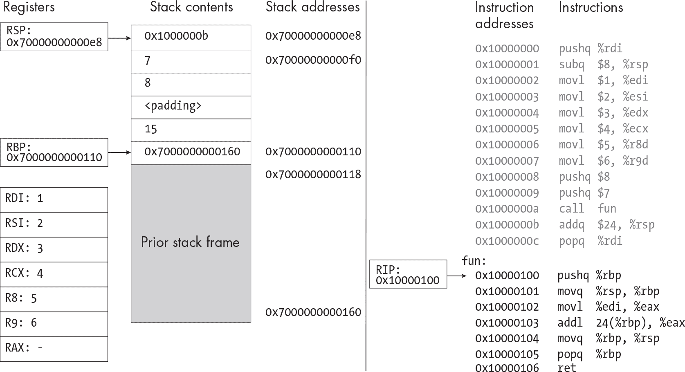
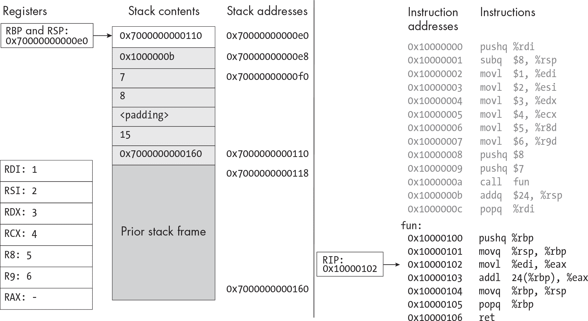
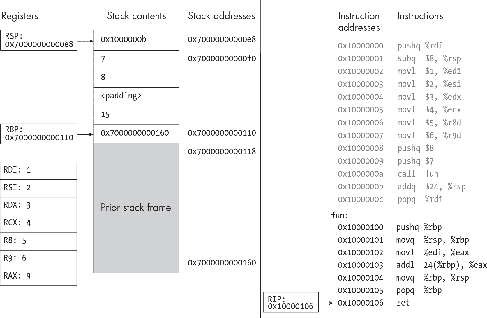
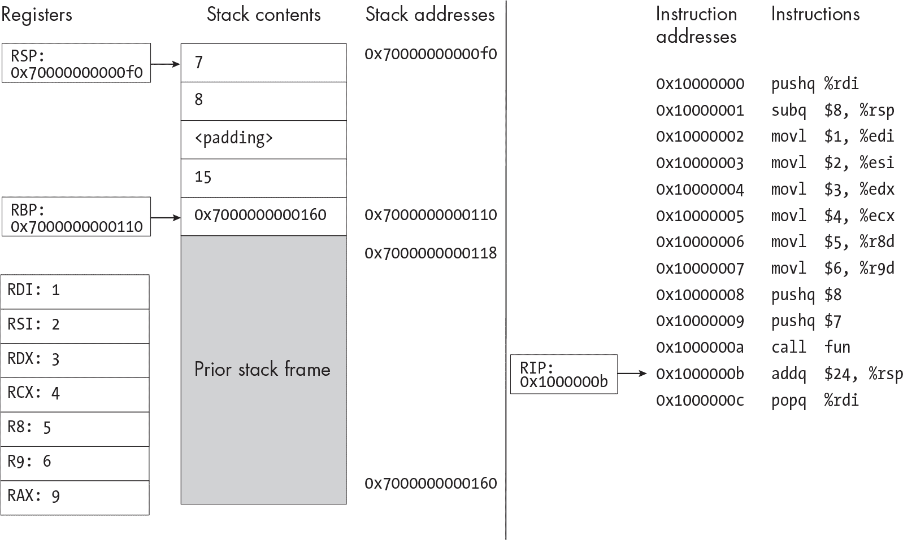
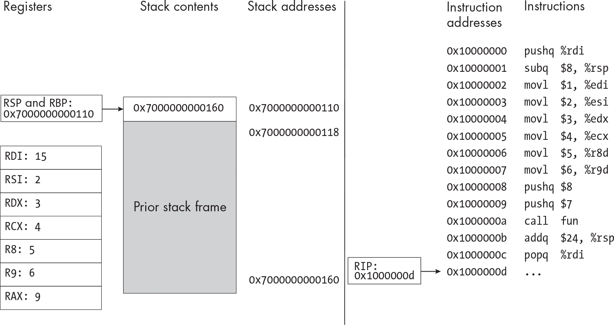

<samp class="SANS_Futura_Std_Book_Oblique_I_11">描述</samp>

<hgroup>

## <samp class="SANS_Futura_Std_Bold_Condensed_B_11">9</samp> <samp class="SANS_Dogma_OT_Bold_B_11">函数</samp>

</hgroup>


*函数*——可以在一个地方定义并在其他地方调用的代码块——是每种主流编程语言中的基本概念。实际上，它们如此基础，以至于有专门的处理器指令来进行函数调用。在本章中，你将根据类 Unix 系统的标准*调用约定*实现函数调用和定义，调用约定精确定义了函数调用在汇编级别的工作方式。调用约定使得分别编译的二进制文件（即使它们可能是用不同的源语言编写的）能够相互操作。通过遵循你系统的调用约定，你将能够编译调用外部库函数的程序，包括标准库。你编译的程序最终将能够执行 I/O 操作！由其他编译器构建的程序也将能够使用你编译器构建的库。

本章的大部分内容将集中在语义分析和汇编代码生成上。在语义分析阶段，我们将添加一个新的*类型检查*过程，在本章开始时的图示中已被加粗显示。这个过程目前非常简化，但随着我们在第二部分中添加新类型，它会不断发展。在汇编生成阶段，我们将深入探讨系统的调用约定，它告诉我们如何设置堆栈帧、传递参数和返回值，以及如何从一个函数转移控制到另一个函数。

首先，我们来明确我们将要实现的功能。

### <samp class="SANS_Futura_Std_Bold_B_11">声明、定义和调用函数</samp>

在本章中，你将实现函数调用、函数声明和函数定义。一个函数*声明*告诉你函数的名称和类型。声明将函数名引入作用域，以便后续调用。一个函数*定义*是一个包含函数体的声明。（所有函数定义都是声明，但并非所有声明都是定义。）你的编译器已经支持某些函数定义，因为它可以编译<samp class="SANS_TheSansMonoCd_W5Regular_11">main</samp>。现在，你将将其通用化，以编译其他函数。

#### <samp class="SANS_Futura_Std_Bold_Condensed_Oblique_BI_11">声明和定义</samp>

一个函数声明，像清单 9-1 中的函数声明，必须包括函数的返回类型、函数名，以及每个参数的类型和名称。

```
int foo(int param1, int param2, int param3);
```

<samp class="SANS_Futura_Std_Book_Oblique_I_11">清单 9-1：一个函数声明</samp>

目前，函数的返回类型和参数类型都必须是 <samp class="SANS_TheSansMonoCd_W5Regular_11">int</samp>。正如我们之前看到的，如果函数没有参数，它的参数列表只是 <samp class="SANS_TheSansMonoCd_W5Regular_11">void</samp> 关键字：

```
int foo(void);
```

函数定义看起来就像 清单 9-1 中的函数声明，外加一个函数体。清单 9-2 显示了一个函数定义的例子。

```
int foo(int param1, int param2, int param3) {
    return param1 + param2 + param3;
}
```

<samp class="SANS_Futura_Std_Book_Oblique_I_11">清单 9-2：一个函数定义</samp>

你可以多次声明相同的函数，但所有声明必须兼容：返回类型、参数类型和参数个数必须相同。参数名称可以在声明之间有所不同，因为只有函数定义中的参数名称会被使用。例如，清单 9-3 就是完全有效的。

```
int foo(int x, int y, int z);

int main(void) {
    return foo(1, 2, 3);
}

int foo(int param1, int param2, int param3);

  int foo(int a, int b, int c) {
    return a + b + c;
}
```

<samp class="SANS_Futura_Std_Book_Oblique_I_11">清单 9-3：用不同的参数名称多次声明一个函数</samp>

虽然声明一个函数多次是合法的，但你不能定义一个函数多次；如果你这么做，当调用该函数时，就无法判断执行哪个定义。

你可以在两个地方声明函数：在顶层或在其他函数的主体内。清单 9-4 包含了这两种声明方式。

```
int foo(int a, int b);

int main(void) {
    int foo(int a, int b);
    return foo(1, 2);
}
```

<samp class="SANS_Futura_Std_Book_Oblique_I_11">清单 9-4：嵌套和顶级函数声明</samp>

然而，你不能在另一个函数的主体内定义函数。C 标准只支持在顶层定义函数，因此它不允许像 清单 9-5 这样的程序。

```
int main(void) {
    int foo(int a, int b) {return a + b;};
    return foo(1, 2);
}
```

<samp class="SANS_Futura_Std_Book_Oblique_I_11">清单 9-5：嵌套函数定义（不支持）</samp>

一些编译器作为语言扩展支持嵌套函数定义，并能够成功编译 清单 9-5。我们不会实现这个语言扩展；我们只坚持使用 C 标准中的功能。

#### <samp class="SANS_Futura_Std_Bold_Condensed_Oblique_BI_11">函数调用</samp>

函数调用由一个函数名，后跟一系列用逗号分隔的参数，这些参数被括在圆括号中：

```
foo(1, 2, 3);
```

在函数声明中的标识符被称为函数*参数*，传递给函数调用的表达式则被称为函数*实参*。例如，在清单 9-6 中，<samp class="SANS_TheSansMonoCd_W5Regular_11">a</samp>、<samp class="SANS_TheSansMonoCd_W5Regular_11">b</samp>和<samp class="SANS_TheSansMonoCd_W5Regular_11">c</samp>是< samp class="SANS_TheSansMonoCd_W5Regular_11">foo</samp>的参数，而<a href="#">a</a> <samp class="SANS_TheSansMonoCd_W5Regular_11">+</samp> <samp class="SANS_TheSansMonoCd_W5Regular_11">b</samp>和<samp class="SANS_TheSansMonoCd_W5Regular_11">2 * c</samp>是传递给< samp class="SANS_TheSansMonoCd_W5Regular_11">bar</samp>的实参。 

```
int foo(int a, int b, int c) {
    return bar(a + b, 2 * c);
}
```

<samp class="SANS_Futura_Std_Book_Oblique_I_11">清单 9-6：函数参数与实参</samp>

如清单 9-7 所示，函数必须在调用之前声明，但不一定要定义。

```
int foo(int arg1, int arg2, int arg3);

int main(void) {
    return foo(1, 2, 3);
}
```

<samp class="SANS_Futura_Std_Book_Oblique_I_11">清单 9-7：声明函数并调用它</samp>

<samp class="SANS_TheSansMonoCd_W5Regular_11">foo</samp>的定义可能会出现在同一个文件的后面，或者可能出现在单独的库中。寻找程序调用的每个函数的定义是链接器的任务，而不是编译器。如果链接器无法找到定义，链接将失败。

在函数声明之前调用函数是非法的，因此清单 9-8 是无效的。

```
int main(void) {
    return foo(1, 2, 3);
}

int foo(int arg1, int arg2, int arg3);
```

<samp class="SANS_Futura_Std_Book_Oblique_I_11">清单 9-8：调用一个未声明的函数</samp>

实际上，许多编译器会警告调用未声明函数的程序，但不会拒绝它们。我们的实现更为严格，在语义分析期间会拒绝像清单 9-8 这样的程序。

调用函数时使用错误数量的实参，或者将变量当作函数来调用也是非法的。（如果我们在实现函数指针时，这一点会有例外。）#### <samp class="SANS_Futura_Std_Bold_Condensed_Oblique_BI_11">标识符链接</samp>

函数名和变量名都是标识符。它们存在于相同的命名空间中，并遵循相同的作用域规则。像变量名一样，函数名也可以被内层作用域中的其他声明所遮蔽。请看清单 9-9，其中变量名<samp class="SANS_TheSansMonoCd_W5Regular_11">foo</samp>遮蔽了函数名<samp class="SANS_TheSansMonoCd_W5Regular_11">foo</samp>。

```
int foo(int a, int b);

int main(void) {
    int foo = 3;
    return foo;
}
```

<samp class="SANS_Futura_Std_Book_Oblique_I_11">清单 9-9：变量名遮蔽函数名</samp>

该程序可以正常编译并返回<samp class="SANS_TheSansMonoCd_W5Regular_11">3</samp>。如清单 9-10 所示，函数名也可以遮蔽变量名。

```
int main(void) {
    int a = 3;
    if (a > 0) {
        int a(void);
        return a();
    }
    return 0;
}
```

<samp class="SANS_Futura_Std_Book_Oblique_I_11">列表 9-10：一个函数名覆盖一个变量名</samp>

在这里，函数名 <samp class="SANS_TheSansMonoCd_W5Regular_11">a</samp> 覆盖了变量名 <samp class="SANS_TheSansMonoCd_W5Regular_11">a</samp>；只要函数 <samp class="SANS_TheSansMonoCd_W5Regular_11">a</samp> 在其他地方定义，这个程序也可以编译通过。

然而，在其他方面，函数声明的解析与我们之前看到的局部变量声明非常不同。每个局部变量声明都引用不同的变量，即使其中一些变量具有相同的名称（当我们在变量解析过程中为每个变量提供唯一的名称时，我们会明确指出这一点）。但是，多个同名的函数声明都引用同一个函数。考虑列表 9-11，其中包括三个使用名称 <samp class="SANS_TheSansMonoCd_W5Regular_11">incr</samp> 的函数声明。

```
int two(void) {
    int incr(int i);
    return incr(1);
}

int incr(int i);

int main(void) {
    return two() + incr(3);
}

int incr(int i) {
    return i + 1;
}
```

<samp class="SANS_Futura_Std_Book_Oblique_I_11">列表 9-11：多个函数声明引用单个定义</samp>

这些声明中的每一个最终都引用相同的函数定义。这个列表不包含三个不同的函数声明，名为 <samp class="SANS_TheSansMonoCd_W5Regular_11">incr</samp>；它包含三个相同函数的声明。

在 C 标准中，一个声明的 *链接性* 决定了它如何与同一标识符的其他声明相关联。链接性有几种不同的类型。根据 C 标准第 6.2.2 节第 2 段，“每个具有 *外部链接性* 的特定标识符的声明表示相同的对象或函数。”在列表 9-11 中，每个 <samp class="SANS_TheSansMonoCd_W5Regular_11">incr</samp> 的声明都有外部链接性，因此这些声明都引用相同的函数定义。具有外部链接性的声明即使出现在不同的翻译单元中，也可以引用相同的对象或函数。（*翻译单元* 就是一个经过预处理的源文件。）

考虑一个由两个不同文件组成的程序。在一个文件中，如列表 9-12 所示，我们定义一个函数。

```
int library_fun(int a, int b) {
    return a + b;
}
```

<samp class="SANS_Futura_Std_Book_Oblique_I_11">列表 9-12：在一个文件中定义一个库函数</samp>

在另一个文件中，如列表 9-13 所示，我们声明并使用该函数。

```
int library_fun(int a, int b);

int main(void) {
    return library_fun(1, 2);
}
```

<samp class="SANS_Futura_Std_Book_Oblique_I_11">列表 9-13：在不同文件中声明并调用库函数</samp>

尽管<samp class="SANS_TheSansMonoCd_W5Regular_11">library_fun</samp>在两个不同的文件中声明，链接器会识别这两个声明指向同一个内容：在列出 9-12 中的<samp class="SANS_TheSansMonoCd_W5Regular_11">library_fun</samp>的定义。然后，它会更新在列出 9-13 中的每个<samp class="SANS_TheSansMonoCd_W5Regular_11">library_fun</samp>的使用，指向列出 9-12 中的定义。

在本章中，所有函数标识符都有外部链接。另一方面，局部变量没有链接*。* C 标准第 6.2.2 节第 2 段指出，“每个没有链接的标识符的声明都表示一个唯一的实体。”局部变量不能与另一个局部变量引用相同的对象，也不能与具有外部链接的标识符（如函数名）引用相同的内容。

> <samp class="SANS_Dogma_OT_Bold_B_39">注意</samp>

*看起来标识符的链接性仅取决于它是函数还是变量，但在下一章中你将看到，情况并非如此。我们将实现具有外部链接的全局变量声明，并实现具有第三种链接性——*内部链接*——的函数和变量声明。具有内部链接的声明可以与同一翻译单元中的其他声明链接，但不能与其他翻译单元中的声明链接。*

由于同一个函数名的所有声明必须指向同一个函数定义，即使它们出现在不同的作用域中，它们也必须兼容。列出 9-14 包含了两个不兼容的函数声明。

```
int main(void) {
    int f(int x);
    int ret = f(1);
    if (ret) {
        int f(int a, int b);
        return f(0, 1);
    }
    return 0;
}
```

<samp class="SANS_Futura_Std_Book_Oblique_I_11">列出 9-14：冲突的函数声明</samp>

两个<samp class="SANS_TheSansMonoCd_W5Regular_11">f</samp>的声明应当指向同一个函数，因为它们都具有外部链接。然而没有任何一个函数定义能够同时满足这两个声明，因为它们的参数数量不同。由于这两个声明冲突，这段代码无法编译。

现在我们已经讲解了一些关于函数的背景知识，接下来可以开始编写编译器。但我们不会立即从词法分析器开始。首先，我们需要更新编译器驱动程序。

### <samp class="SANS_Futura_Std_Bold_B_11">编译库</samp>

在前面的章节中，我们只能编译独立的可执行文件。每个我们编译的源文件都定义了一个 <samp class="SANS_TheSansMonoCd_W5Regular_11">main</samp> 函数，它是程序的入口点。现在我们能够处理其他函数时，我们也应该能够编译没有入口点的库。当你的编译器将源代码转换为汇编时，它并不关心是处理一个库还是可执行文件。然而，你的编译器驱动程序是关心的，因为链接器期望一个完整的程序包含 <samp class="SANS_TheSansMonoCd_W5Regular_11">main</samp>。如果你尝试用当前的编译器驱动程序编译一个没有 <samp class="SANS_TheSansMonoCd_W5Regular_11">main</samp> 函数的源文件，你会得到一个链接器错误，错误信息可能类似于以下内容：

```
/usr/bin/ld: . . ./x86_64-linux-gnu/Scrt1.o: in function `_start':
(.text+0x24): undefined reference to `main'
collect2: error: ld returned 1 exit status
```

这个错误意味着链接器正在尝试但未能将你的代码链接到 <samp class="SANS_TheSansMonoCd_W5Regular_11">crt0</samp>，即调用 <samp class="SANS_TheSansMonoCd_W5Regular_11">main</samp> 的包装代码。

<samp class="SANS_TheSansMonoCd_W5Regular_11">gcc</samp> 命令接受一个 <samp class="SANS_TheSansMonoCd_W5Regular_11">-c</samp> 命令行标志，告诉它不要调用链接器；当这个标志存在时，它会生成一个目标文件，而不是可执行文件。为了与测试套件一起工作，你的编译器驱动程序也应该识别 <samp class="SANS_TheSansMonoCd_W5Regular_11">-c</samp> 标志。当它收到这个标志时，编译器驱动程序应该像往常一样先将源程序转换为汇编文件，然后运行以下命令将汇编程序转换为目标文件：

```
gcc -c `ASSEMBLY_FILE` -o `OUTPUT_FILE`
```

输出的文件名应该是原始文件名加上 *.o* 后缀。换句话说，<samp class="SANS_TheSansMonoCd_W5Regular_11">./YOUR_COMPILER -c /path/to/program.c</samp> 应该生成一个位于 */path/to/program.o* 的目标文件。

> <samp class="SANS_Dogma_OT_Bold_B_39">注意</samp>

*如果你想要编译并分发一个真正的库，你不仅仅是生成一个目标文件；你应该创建一个共享库（在 Linux 上是一个 *.so* 文件，在 macOS 上是一个 *.dylib* 文件）。如果你愿意，可以向你的编译器驱动程序添加另一个选项来生成共享库；你的驱动程序可以通过使用适当的标志调用 GCC 或 Clang，将汇编程序转换为共享库，而不是目标文件。但是，编译器生成共享库的能力有一个重大限制，特别是在 Linux 上；我们将在第十章中详细讨论这个问题。*

此时，你可能还想扩展你的编译器驱动程序，以接受多个输入源文件。测试套件不要求这个功能，但如果你想编译多文件程序，你将需要它。为了处理多个源文件，你的编译器驱动程序应该分别将每个源文件转换为汇编文件，然后使用 <samp class="SANS_TheSansMonoCd_W5Regular_11">gcc</samp> 命令将它们汇编并链接在一起。

### <samp class="SANS_Futura_Std_Bold_B_11">词法分析器</samp>

本章中你将添加一个新的标记：

<samp class="SANS_TheSansMonoCd_W7Bold_B_11">,</samp> 逗号

函数参数或参数列表由逗号分隔。

### <samp class="SANS_Futura_Std_Bold_B_11">解析器</samp>

我们需要在几个位置扩展 AST，以支持函数调用、声明和定义。让我们从函数调用开始，它是一种表达式：

```
exp = Constant(int)
| Var(identifier)
    | Unary(unary_operator, exp)
    | Binary(binary_operator, exp, exp)
| Assignment(exp, exp)
| Conditional(exp condition, exp, exp)
 **| FunctionCall(identifier, exp* args)**
```

函数调用的 AST 节点包含函数名和一组参数。每个参数都是一个表达式。

接下来，我们将重构<samp class="SANS_TheSansMonoCd_W5Regular_11">declaration</samp>节点，使其既能表示函数声明，也能表示变量声明：

```
declaration = FunDecl(function_declaration) | VarDecl(variable_declaration)
variable_declaration = (identifier name, exp? init)
```

我们已经将<samp class="SANS_TheSansMonoCd_W5Regular_11">function_definition</samp>节点重命名为<samp class="SANS_TheSansMonoCd_W5Regular_11">function_declaration</samp>。（稍后我们会详细讲解此节点的其他更改。）<samp class="SANS_TheSansMonoCd_W5Regular_11">variable_declaration</samp>节点包含与之前章节中<samp class="SANS_TheSansMonoCd_W5Regular_11">declaration</samp>相同的信息：变量名和可选的初始化值。但它与我们迄今为止看到的其他 AST 节点有所不同；它不像<samp class="SANS_TheSansMonoCd_W5Regular_11">FunDecl</samp>或<samp class="SANS_TheSansMonoCd_W5Regular_11">VarDecl</samp>那样包含一个命名构造函数。当 ASDL 中的一个节点有多个构造函数时——比如<samp class="SANS_TheSansMonoCd_W5Regular_11">declaration</samp>节点和大多数其他 AST 节点——每个构造函数需要一个独特的名称，以便我们区分它们。但由于<samp class="SANS_TheSansMonoCd_W5Regular_11">variable_declaration</samp>节点只有一个构造函数，因此不要求为该构造函数命名。在 ASDL 术语中，具有一个未命名构造函数的节点定义被称为*产品类型*。我们迄今为止使用的其他节点都是*和类型*，因为它们都有命名的构造函数。产品类型只是语法上的一种便捷方式，这样我们就不需要使用笨重、冗余的构造函数名称。

现在让我们更新<samp class="SANS_TheSansMonoCd_W5Regular_11">function_declaration</samp>。以下是现有的<samp class="SANS_TheSansMonoCd_W5Regular_11">function _definition</samp>节点：

```
function_definition = Function(identifier name, block body)
```

我们需要在这里进行一些更改。首先，正如我之前所提到的，我们将其重命名为更准确的<samp class="SANS_TheSansMonoCd_W5Regular_11">function_declaration</samp>。我们还将添加函数参数，并将函数体设为可选，这样该节点既可以表示函数声明，也可以表示函数定义。最后，为了与<samp class="SANS_TheSansMonoCd_W5Regular_11">variable_declaration</samp>保持一致，我们将移除<samp class="SANS_TheSansMonoCd_W5Regular_11">Function</samp>构造函数名称，从而将其转变为产品类型。我们修改后的 AST 节点用于表示函数声明和定义如下：

```
function_declaration = (identifier name, identifier* params, block? body)
```

最后，我们需要改变程序的顶层定义。现在，程序不再是一个单独的<samp class="SANS_TheSansMonoCd_W5Regular_11">main</samp>函数，而是一个包含函数定义和声明的列表：

```
program = Program(function_declaration*)
```

第 9-15 节展示了完整的更新后的抽象语法树。

```
program = Program(**function_declaration***)
**declaration = FunDecl(function_declaration) | VarDecl(variable_declaration)**
**variable_declaration = (identifier name, exp? init)**
**function_declaration = (identifier name, identifier* params, block? body)**
block_item = S(statement) | D(declaration)
block = Block(block_item*)
for_init = InitDecl(**variable_declaration**) | InitExp(exp?)
statement = Return(exp)
          | Expression(exp)
          | If(exp condition, statement then, statement? else)
| Compound(block)
          | Break
          | Continue
          | While(exp condition, statement body)
          | DoWhile(statement body, exp condition)
          | For(for_init init, exp? condition, exp? post, statement body)
          | Null
exp = Constant(int)
| Var(identifier)
    | Unary(unary_operator, exp)
    | Binary(binary_operator, exp, exp)
| Assignment(exp, exp)
| Conditional(exp condition, exp, exp)
 **| FunctionCall(identifier, exp* args)**
unary_operator = Complement | Negate | Not
binary_operator = Add | Subtract | Multiply | Divide | Remainder | And | Or
                | Equal | NotEqual | LessThan |LessOrEqual
                | GreaterThan| GreaterOrEqual
```

<samp class="SANS_Futura_Std_Book_Oblique_I_11">第 9-15 节：带有函数调用、声明和定义的抽象语法树</samp>

一个<samp class="SANS_TheSansMonoCd_W5Regular_11">声明</samp>可以作为一个块项出现，但是<samp class="SANS_TheSansMonoCd_W5Regular_11">变量声明</samp>只能出现在<samp class="SANS_TheSansMonoCd_W5Regular_11">for</samp>循环头部。请注意，这个抽象语法树可以表示嵌套的函数定义，比如第 9-5 节中的函数，尽管我们目前不支持它们。我们将在语义分析阶段检查嵌套的函数定义，并在遇到任何情况时抛出错误。

第 9-16 节展示了更新后的语法。

```
<program> ::= **{<function-declaration>}**
**<declaration> ::= <variable-declaration> | <function-declaration>**
**<variable-declaration> ::= "int" <identifier> ["=" <exp>] ";"**
**<function-declaration> ::= "int" <identifier> "(" <param-list> ")" (<block> | ";")**
**<param-list> ::= "void" | "int" <identifier> {"," "int" <identifier>}**
<block> ::= "{" {<block-item>} "}"
<block-item> ::= <statement> | <declaration>
<for-init> ::= **<variable-declaration>** | [<exp>] ";"
<statement> ::= "return" <exp> ";"
              | <exp> ";"
              | "if" "(" <exp> ")" <statement> ["else" <statement>]
              | <block>
              | "break" ";"
              | "continue" ";"
              | "while" "(" <exp> ")" <statement>
              | "do" <statement> "while" "(" <exp> ")" ";"
              | "for" "(" <for-init> [<exp>] ";" [<exp>] ")" <statement>
              | ";"
<exp> ::= <factor> | <exp> <binop> <exp> | <exp> "?" <exp> ":" <exp>
<factor> ::= <int> | <identifier> | <unop> <factor> | "(" <exp> ")"
           **| <identifier> "(" [<argument-list>] ")"**
**<argument-list> ::= <exp> {"," <exp>}**
<unop> ::= "-" | "~" | "!"
<binop> ::= "-" | "+" | "*" | "/" | "%" | "&&" | "||"
          | "==" | "!=" | "<" | "<=" | ">" | ">=" | "="
<identifier> ::= ? An identifier token ?
<int> ::= ? A constant token ?
```

<samp class="SANS_Futura_Std_Book_Oblique_I_11">第 9-16 节：带有函数调用、声明和定义的语法</samp>

第 9-16 节中的<samp class="SANS_TheSansMonoCd_W5Regular_11"><param-list></samp>和<samp class="SANS_TheSansMonoCd_W5Regular_11"><argument-list></samp>符号在抽象语法树中没有等价的节点。我已经从函数声明和函数调用的产生规则中分离出它们，以使这些规则更易读。一个<samp class="SANS_TheSansMonoCd_W5Regular_11"><param-list></samp>如果一个函数没有参数，只包含<samp class="SANS_TheSansMonoCd_W5Regular_11">void</samp>关键字；否则，它包含一个逗号分隔的参数列表，每个参数都有类型和名称。一个<samp class="SANS_TheSansMonoCd_W5Regular_11"><argument-list></samp>包含一个逗号分隔的表达式列表。请注意，函数声明中需要一个<samp class="SANS_TheSansMonoCd_W5Regular_11"><param-list></samp>，但在函数调用中<samp class="SANS_TheSansMonoCd_W5Regular_11"><argument-list></samp>是可选的。解析逗号分隔的参数或参数类似于解析块项列表；只需在列表元素之间消耗<samp class="SANS_TheSansMonoCd_W5Regular_11">,</samp>标记，并在看到 a）标记时停止。

函数调用的优先级高于任何二元或三元运算符，因此在解析<samp class="SANS_TheSansMonoCd_W5Regular_11"><factor></samp>符号时，应首先处理它们。如果一个<samp class="SANS_TheSansMonoCd_W5Regular_11"><factor></samp>以标识符开始，请查看下一个符号以确定表达式是变量还是函数调用。如果下一个符号是<samp class="SANS_TheSansMonoCd_W5Regular_11">(</samp>，可以假设这是一个函数调用。同样，你需要检查<samp class="SANS_TheSansMonoCd_W5Regular_11">(</samp>符号，以区分函数和变量声明。

### <samp class="SANS_Futura_Std_Bold_B_11">语义分析</samp>

在变量解析阶段，我们为每个局部变量赋予一个新的、独特的名称。然而，我们不应重命名具有外部链接的实体。两个名为<samp class="SANS_TheSansMonoCd_W5Regular_11">var</samp>的局部变量声明指向不同的内存地址，因此我们为它们分配不同的名称。但两个名为<samp class="SANS_TheSansMonoCd_W5Regular_11">fun</samp>的函数声明指向相同的代码，因此这些声明在编译过程中应保持相同的名称。此外，具有外部链接的对象必须保留来自原始源代码的名称，因为链接器将在符号解析时依赖该名称。除非在每个目标文件编译时都保留了名称<samp class="SANS_TheSansMonoCd_W5Regular_11">fun</samp>，否则链接器将无法将调用<samp class="SANS_TheSansMonoCd_W5Regular_11">fun</samp>的目标文件与定义<samp class="SANS_TheSansMonoCd_W5Regular_11">fun</samp>的目标文件链接起来。

因此，我们需要更新变量解析阶段，以重命名没有链接的标识符，但保留具有外部链接的标识符不变。（由于这个阶段将处理函数和变量，因此从现在开始我将其称为*标识符解析*，而非变量解析。）我们将检查所有常见的错误条件，比如重复声明和未声明的标识符；我们还将验证没有嵌套的函数定义。由于在同一作用域中多次声明具有外部链接的名称是合法的，捕获重复声明的逻辑会稍作修改。例如，示例 9-17 是完全合法的。

```
int main(void) {
    int foo(void);
    int foo(void);
    return foo();
}
```

<samp class="SANS_Futura_Std_Book_Oblique_I_11">示例 9-17：同一作用域内的多个函数声明</samp>

由于两个<samp class="SANS_TheSansMonoCd_W5Regular_11">foo</samp>的声明都有外部链接，它们指向相同的函数，因此没有冲突。标识符的重复声明只有在它们指向不同的实体时才会冲突；当你在同一作用域中稍后使用该标识符时，无法判断它应该指向哪个实体。

我们还有一些其他的错误情况需要检查。我们必须验证每个函数声明的参数数量是否一致，并确保没有函数被定义多次。同时，我们还要验证变量是否被当作函数使用，以及函数是否传入了正确数量的参数。这些错误和我们之前检查的错误情况不太相似，因为它们并不直接涉及标识符的作用域。它们是*类型错误*，当一个对象的不同声明具有冲突的类型，或者对象以其类型不支持的方式使用时，就会发生类型错误。

我们将定义一个独立的类型检查阶段来捕捉这些错误。此阶段还将构建一个符号表，用来存储程序中每个标识符的类型以及我们需要跟踪的其他一些标识符属性。在编译器的后续阶段，我们将回头参考这个符号表。（这不同于目标文件中的符号表，链接器在符号解析期间使用它。我们在类型检查器中构建的符号表是编译器内部的。）

本章结束时，语义分析阶段将包括三个阶段：标识符解析、类型检查和循环标记。循环标记阶段可以在其他两个阶段的任意时刻进行。

#### <samp class="SANS_Futura_Std_Bold_Condensed_Oblique_BI_11">扩展标识符解析</samp>

让我们更新标识符解析阶段，以处理函数调用、函数声明和函数定义。我们需要为标识符映射中的每个条目跟踪一项新的信息：它是否具有外部链接性。在构建标识符映射时，不要假设函数总是具有外部链接性，而变量永远没有。这个假设目前成立，但在下一章中它将不再成立。

我们还将更新伪代码中的一些名称：将<samp class="SANS_TheSansMonoCd_W5Regular_11">variable_map</samp>改为<samp class="SANS_TheSansMonoCd_W5Regular_11">identifier_map</samp>，并将标识符映射中的<samp class="SANS_TheSansMonoCd_W5Regular_11">from_current_block</samp>字段重命名为<samp class="SANS_TheSansMonoCd_W5Regular_11">from_current_scope</samp>，因为函数声明可以出现在块之外，即在顶层。

##### <samp class="SANS_Futura_Std_Bold_Condensed_B_11">函数调用</samp>

函数名，像变量名一样，必须在标识符映射中存在才能使用。列表 9-18 展示了如何由<samp class="SANS_TheSansMonoCd_W5Regular_11">resolve_exp</samp>处理函数调用。

```
resolve_exp(e, identifier_map):
    match e with
    | `--snip--`
    | FunctionCall(fun_name, args) ->
        if fun_name is in identifier_map:
            new_fun_name = identifier_map.get(fun_name).new_name
            new_args = []
            for arg in args:
                new_args.append(resolve_exp(arg, identifier_map))
            return FunctionCall(new_fun_name, new_args)
        else:
            fail("Undeclared function!")
```

<samp class="SANS_Futura_Std_Book_Oblique_I_11">列表 9-18：解析函数调用</samp>

首先，我们在标识符映射中查找函数名称，以确认它在程序的当前阶段是否在作用域中。然后，我们用标识符映射中的新名称替换这个名称。在一个有效的程序中，这个新名称将与原始名称相同，因为我们不会重命名具有外部链接的标识符。但我们也需要考虑无效程序的情况。也许<samp class="SANS_TheSansMonoCd_W5Regular_11">fun_name</samp>实际上是一个局部变量的名称，而不是函数；在这种情况下，尝试像调用函数一样调用它就是一个类型错误。解析<samp class="SANS_TheSansMonoCd_W5Regular_11">fun_name</samp>将使我们在类型检查时捕捉到这个类型错误。我们还会等到类型检查通过后再确认该函数调用是否有正确数量的参数。

在我们替换函数名称后，我们会递归地对每个函数参数调用<samp class="SANS_TheSansMonoCd_W5Regular_11">resolve_exp</samp>，就像我们递归地解析一元、二元和三元表达式中的每个子表达式一样。

##### <samp class="SANS_Futura_Std_Bold_Condensed_B_11">函数声明</samp>

现在让我们考虑函数声明。无论函数声明出现在代码块中还是顶层，我们几乎都可以以完全相同的方式处理它。首先，我们将函数名称添加到当前作用域。然后，我们处理它的参数，将它们添加到一个新的内部作用域。最后，如果有函数体，我们也处理它。清单 9-19 展示了如何解析函数声明。

```
resolve_function_declaration(decl, identifier_map):
    if decl.name is in identifier_map:
        prev_entry = identifier_map.get(decl.name)
      ❶ if prev_entry.from_current_scope and (not prev_entry.has_linkage):
            fail("Duplicate declaration")

  ❷ identifier_map.add(decl.name, MapEntry(
        new_name=decl.name, from_current_scope=True, has_linkage=True
    ))

  ❸ inner_map = copy_identifier_map(identifier_map)
    new_params = []
    for param in decl.params:
        new_params.append(resolve_param(param, inner_map))

    new_body = null
    if decl.body is not null:
        new_body = resolve_block(decl.body, inner_map)
    return (decl.name, new_params, new_body)
```

<samp class="SANS_Futura_Std_Book_Oblique_I_11">清单 9-19: 解析函数声明</samp>

在我们更新标识符映射之前，需要确保我们没有非法地重新声明一个标识符❶。如果标识符当前不在作用域中，那么就没有冲突。如果标识符在外部作用域中已经声明，那也是没问题的；新的声明会覆盖旧的声明。到目前为止，这和我们处理变量声明的方式完全相同。不过，我们还需要考虑链接性。具有外部链接的标识符的多个声明可以出现在同一作用域中。我们已经知道新的声明具有外部链接，因为它是一个函数声明，所以只要旧的声明也具有外部链接，这样做是合法的。但是，如果旧的声明没有链接（因为它声明了一个局部变量），我们将抛出错误。标识符映射中的<samp class="SANS_TheSansMonoCd_W5Regular_11">has_linkage</samp>属性告诉我们一个标识符是否具有外部链接。（在下一章中，它将跟踪标识符是否具有任何链接性，无论是内部还是外部。）

如果没有冲突的声明，我们将此名称添加到 <samp class="SANS_TheSansMonoCd_W5Regular_11">identifier_map</samp> ❷。我们不会为函数生成新名称；该映射条目的 <samp class="SANS_TheSansMonoCd_W5Regular_11">new_name</samp> 属性应为原始名称。因为该声明具有外部链接性，<samp class="SANS_TheSansMonoCd_W5Regular_11">has_linkage</samp> 属性应为 <samp class="SANS_TheSansMonoCd_W5Regular_11">True</samp>。

接下来，我们解析参数名称。声明中的函数参数列表开启了一个新作用域，因此我们需要复制标识符映射以跟踪它们 ❸。参数名称可以覆盖外部作用域中的名称，但同一个函数声明中的两个参数不能共享名称。所以，这是合法的：

```
int a;
int foo(int a);
```

但是，这不是：

```
int foo(int a, int a);
```

我省略了 <samp class="SANS_TheSansMonoCd_W5Regular_11">resolve_param</samp> 的伪代码，但它应该与你现有的代码相同，用于解决变量声明：它应确保参数名称在当前作用域中尚未声明，生成一个唯一的名称，为其添加到标识符映射中，并返回新的名称。你可能想写一个辅助函数来解决参数和局部变量声明，因为在这两种情况下逻辑是相同的。

我们解析函数的参数有两个原因。首先，我们需要验证没有重复的参数名称。其次，我们需要确保在处理函数体时，参数处于作用域中。当我们处理没有函数体的函数声明时，第二点就不重要了；我们可以通过检查重复的参数而不重命名它们或更新内部作用域来完成。然而，我认为最简单的做法是无论函数是否有体，都以统一的方式处理函数声明。

Listing 9-19 的最后一步是处理函数体（如果有的话）。我们像往常一样使用 <samp class="SANS_TheSansMonoCd_W5Regular_11">resolve_block</samp> 来处理；我们只需要确保传入 <samp class="SANS_TheSansMonoCd_W5Regular_11">inner_map</samp>，这样函数参数就会在作用域内。函数名本身也在作用域内，因为我们在复制之前已经将其添加到外部映射中；因此，我们能够处理递归调用自身的函数。

函数参数和函数体处于同一作用域中，因此在处理函数体时，应该传入 <samp class="SANS_TheSansMonoCd_W5Regular_11">inner_map</samp>，而不是它的副本。例如，这就是非法的：

```
int foo(int a) {
    int a = 3;
    return a;
}
```

变量声明 <samp class="SANS_TheSansMonoCd_W5Regular_11">int a</samp> <samp class="SANS_TheSansMonoCd_W5Regular_11">=</samp> <samp class="SANS_TheSansMonoCd_W5Regular_11">3;</samp> 是一个非法的重复声明，因为它与参数 <samp class="SANS_TheSansMonoCd_W5Regular_11">a</samp> 在同一个作用域中。

到此为止，我们可以返回更新后的<samp class="SANS_TheSansMonoCd_W5Regular_11">function_declaration</samp>节点。尽管函数名本身没有改变，但函数体内声明的参数列表和任何变量都已在此新节点中被重命名。

##### <samp class="SANS_Futura_Std_Bold_Condensed_B_11">局部声明</samp>

你可以像前几章一样处理局部变量声明；只需确保在标识符映射中记录这些声明没有链接性。要处理局部函数声明，首先检查它是否有函数体。如果有，抛出一个错误；否则，调用<samp class="SANS_TheSansMonoCd_W5Regular_11">resolve _function_declaration</samp>，这是我们在示例 9-19 中定义的。

##### <samp class="SANS_Futura_Std_Bold_Condensed_B_11">顶层处理</samp>

最后，我们需要将所有这些内容整合在一起，以处理函数声明的列表。按顺序处理它们，同时在过程中构建标识符映射。你添加的每个函数名将在后续处理的函数声明中保持作用域。函数中的参数名和局部变量在后续函数中不可见，因为它们被添加到内层作用域。

#### <samp class="SANS_Futura_Std_Bold_Condensed_Oblique_BI_11">编写类型检查器</samp>

我们剩下的验证全部是类型检查。每个标识符，无论是函数还是变量，都有一个类型。变量可以有像<samp class="SANS_TheSansMonoCd_W5Regular_11">int</samp>、<samp class="SANS_TheSansMonoCd_W5Regular_11">long</samp>和<samp class="SANS_TheSansMonoCd_W5Regular_11">double</samp>这样的类型，但在我们项目的这个阶段，每个变量的类型都是<samp class="SANS_TheSansMonoCd_W5Regular_11">int</samp>。一个函数的类型取决于其返回类型和参数的类型。例如，一个函数可以有这样的类型：“接收三个<samp class="SANS_TheSansMonoCd_W5Regular_11">int</samp>参数并返回一个<samp class="SANS_TheSansMonoCd_W5Regular_11">int</samp>。”现在，我们只支持接受<samp class="SANS_TheSansMonoCd_W5Regular_11">int</samp>类型参数并返回<samp class="SANS_TheSansMonoCd_W5Regular_11">int</samp>类型结果的函数，因此只有参数的数量会有所不同。

类型检查阶段验证所有标识符的声明和使用是否具有兼容的类型。例如，如果你声明<samp class="SANS_TheSansMonoCd_W5Regular_11">x</samp>是一个变量，你不能像调用函数一样使用它：

```
int x = 3;
return x();
```

你不能在多个地方声明具有不同类型的函数：

```
int foo(int a, int b);
int foo(int a);
```

你不能调用具有错误参数数量的函数：

```
int foo(int a, int b);

int main(void) {
    return foo(1);
}
```

你也不能多次定义相同的函数：

```
int foo(void) {
    return 1;
}

int foo(void) {
    return 2;
}
```

这个错误本身并不是类型错误，但最容易在这里检查。

为了进行类型检查，我们将记录符号表中每个标识符的类型。我们还将记录每个遇到的函数是已定义还是仅仅声明；也就是说，它是否有函数体。符号表将成为我们获取程序中每个标识符信息的核心来源。在本章中，我们将主要使用符号表来捕获类型错误。在未来的章节中，我们将向该表中添加更多信息，并找到更多使用它的方式。

为了构建符号表，我们需要一种方法在编译器中表示类型，就像我们需要一种方法表示抽象语法树（AST）一样。目前，你的类型定义应该是这样的：

```
type = Int | FunType(int param_count)
```

每个变量的类型是 <samp class="SANS_TheSansMonoCd_W5Regular_11">int</samp>，我们只需要了解函数类型的一个信息，那就是它有多少个参数。在第二部分中，我们将添加更多的类型。

我们将通过按常规方式遍历程序来构建符号表。当我们遇到函数或变量声明时，我们会在符号表中记录它的类型。类型检查器不像标识符解析阶段那样转换抽象语法树，因此各个类型检查方法不会返回转换后的 AST 节点；它们只会添加符号表条目并报告错误。（类型检查器会在第二部分中转换抽象语法树。）

示例 9-20 展示了如何进行变量声明的类型检查。

```
typecheck_variable_declaration(decl, symbols):
    symbols.add(decl.name, Int)
    if decl.init is not null:
        typecheck_exp(decl.init, symbols)
```

<samp class="SANS_Futura_Std_Book_Oblique_I_11">示例 9-20：类型检查变量声明</samp>

每个变量到此时都有了唯一的名称，因此我们知道这个声明不会与符号表中的任何现有条目冲突。我们只需将其添加到符号表中，然后检查其初始化器的类型（如果有的话）。函数稍微复杂一些。因为你可以声明一个函数多次，它可能已经在符号表中有条目。因此，在将函数添加到符号表之前，你需要验证它是否与已有条目冲突。示例 9-21 给出了类型检查函数声明的伪代码。

```
typecheck_function_declaration(decl, symbols):
    fun_type = FunType(length(decl.params))
    has_body = decl.body is not null
    already_defined = False

    if decl.name is in symbols:
        old_decl = symbols.get(decl.name)
      ❶ if old_decl.type != fun_type:
            fail("Incompatible function declarations")
        already_defined = old_decl.defined
      ❷ if already_defined and has_body:
            fail("Function is defined more than once")

  ❸ symbols.add(decl.name, fun_type, defined=(already_defined or has_body))

  ❹ if has_body:
        for param in decl.params:
            symbols.add(param, Int)
        typecheck_block(decl.body)
```

<samp class="SANS_Futura_Std_Book_Oblique_I_11">示例 9-21：类型检查函数声明</samp>

我们首先检查函数是否已经用不同的类型声明过 ❶。然后，确保我们没有重新定义一个已经定义过的函数 ❷。函数符号表条目中的 <samp class="SANS_TheSansMonoCd_W5Regular_11">defined</samp> 属性跟踪我们是否已经对该函数的定义进行了类型检查。（变量的符号表条目不需要这个属性。）

在验证后，我们将函数添加到符号表 ❸ 中。如果存在相应的条目，它会覆盖现有的符号表条目。这样是可以的，因为类型不会改变。我们只需要在设置 <samp class="SANS_TheSansMonoCd_W5Regular_11">defined</samp> 属性时考虑旧的条目。如果该函数已经定义，或者当前声明具有函数体，我们会将 <samp class="SANS_TheSansMonoCd_W5Regular_11">defined</samp> 设置为 <samp class="SANS_TheSansMonoCd_W5Regular_11">True</samp>。最后，如果当前声明有函数体 ❹，我们会将每个函数的参数添加到符号表中，然后对函数体进行类型检查。

请记住，符号表包括我们迄今为止已进行类型检查的每一个声明，即使它不在当前作用域内。考虑这个例子：

```
int main(void) {
  ❶ int foo(int a);
    return foo(1);
}

❷ int foo(int a, int b);
```

嵌套的函数声明 ❶ 在函数重新声明 ❷ 时不在作用域内。然而，当我们进行声明 ❷ 的类型检查时，声明 ❶ 会出现在符号表中。因此，我们会检测到这两个声明冲突并抛出错误。

我们将验证标识符的使用和声明。标识符可以在 <samp class="SANS_TheSansMonoCd_W5Regular_11">Var</samp> AST 节点中作为变量使用，或者在 <samp class="SANS_TheSansMonoCd_W5Regular_11">FunctionCall</samp> AST 节点中作为函数名使用。在这两种情况下，您都应该验证该标识符是否具有预期的类型。列表 9-22 演示了如何类型检查这两种类型的表达式。

```
typecheck_exp(e, symbols):
    match e with
    | FunctionCall(f, args) ->
        f_type = symbols.get(f).type
      ❶ if f_type == Int:
            fail("Variable used as function name")
      ❷ if f_type.param_count != length(args):
            fail("Function called with the wrong number of arguments")
      ❸ for arg in args:
            typecheck_exp(arg, symbols)
    | Var(v) ->
      ❹ if symbols.get(v).type != Int:
            fail("Function name used as variable")
    | `--snip--`
```

<samp class="SANS_Futura_Std_Book_Oblique_I_11">列表 9-22：类型检查表达式</samp>

当标识符作为函数被调用时，您需要验证它是否被声明为函数，而不是 <samp class="SANS_TheSansMonoCd_W5Regular_11">int</samp> ❶。您还需要验证它是否使用了正确数量的参数 ❷，然后递归地对每个参数进行类型检查 ❸。当标识符作为变量使用时，您需要验证它是否被声明为变量，而不是函数 ❹。

记住，您的符号表需要在后续的编译器过程中可访问。我建议将符号表设置为全局变量（或者根据您使用的实现语言，可以使用单例模式），这样可以方便从编译器的任何位置访问它。在我们的类型检查伪代码中，符号表是作为一个显式参数传递给 <samp class="SANS_TheSansMonoCd_W5Regular_11">typecheck_*</samp> 函数，而不是全局变量，以便更清晰地表达。但在实际实现中，我发现使用全局变量会更简单些。

### <samp class="SANS_Futura_Std_Bold_B_11">TACKY 生成</samp>

现在我们已经确认输入程序有效，让我们将其转换为 TACKY。我们需要对 TACKY IR 进行一些修改。首先，我们需要一个新的 TACKY 指令来表示函数调用。其次，我们需要在 TACKY 函数定义中包含参数。最后，我们将整个 TACKY 程序定义为一个函数列表，而不是单个函数。清单 9-23 展示了更新后的 TACKY IR 定义。

```
program = Program(**function_definition***)
function_definition = Function(identifier, **identifier* params,** instruction* body)
instruction = Return(val)
            | Unary(unary_operator, val src, val dst)
            | Binary(binary_operator, val src1, val src2, val dst)
            | Copy(val src, val dst)
            | Jump(identifier target)
            | JumpIfZero(val condition, identifier target)
            | JumpIfNotZero(val condition, identifier target)
            | Label(identifier)
            **| FunCall(identifier fun_name, val* args, val dst)**
val = Constant(int) | Var(identifier)
unary_operator = Complement | Negate | Not
binary_operator = Add | Subtract | Multiply | Divide | Remainder | Equal | NotEqual
                | LessThan | LessOrEqual | GreaterThan | GreaterOrEqual
```

<samp class="SANS_Futura_Std_Book_Oblique_I_11">清单 9-23：将函数调用添加到 TACKY</samp>

这些更改与 清单 9-15 中 AST 的更改非常相似。然而，TACKY IR 所需的更改比 AST 少，因为我们在 TACKY 中不表示函数声明。就像没有初始值的变量声明一样，TACKY IR 生成时会丢弃没有函数体的声明。只有函数定义会被转换为 TACKY。

新的 <samp class="SANS_TheSansMonoCd_W5Regular_11">FunCall</samp> 指令需要一个函数名、一组参数列表和一个返回值的目标位置。与其他 TACKY 指令的操作数一样，函数参数必须是常量或变量，而不是表达式。

要将整个程序转换为 TACKY，逐个处理顶层函数声明，将每个函数定义转换为 TACKY <samp class="SANS_TheSansMonoCd_W5Regular_11">function_definition</samp> 并丢弃没有函数体的声明。要将函数调用转换为 TACKY，生成指令以评估每个参数，并构建由这些 TACKY 值组成的列表。函数调用 <samp class="SANS_TheSansMonoCd_W5Regular_11">fun(e1, e2, …)</samp> 对应的 TACKY 将如下所示 清单 9-24。

```
`<instructions for e1>`
v1 = `<result of e1>`
`<instructions for e2>`
v2 = `<result of e2>`
`--snip--`
result = FunCall(fun, [v1, v2, . . .])
```

<samp class="SANS_Futura_Std_Book_Oblique_I_11">清单 9-24：将函数调用转换为 TACKY</samp>

这与我们处理其他包含嵌套子表达式的表达式的方法相同，比如一元和二元运算。现在我们只是将其推广到任意数量的嵌套表达式，因为一个函数可以有任意数量的参数。

记得在每个函数体的末尾添加 <samp class="SANS_TheSansMonoCd_W5Regular_11">Return(0)</samp> 指令，以确保即使某些执行路径缺少 <samp class="SANS_TheSansMonoCd_W5Regular_11">return</samp> 语句，也能正确返回调用者。接下来，我们将处理本章中最棘手的部分：在汇编中实现函数调用。

### <samp class="SANS_Futura_Std_Bold_B_11">汇编生成</samp>

在本章中，我们将对 TACKY 到汇编的转换过程做出两个重大修改：将函数参数放到栈上，以便它们可以在函数体内访问，以及将新的 <samp class="SANS_TheSansMonoCd_W5Regular_11">FunCall</samp> 指令转换为汇编代码。我们还将对伪寄存器替换和指令修正过程做一些小的修改。但在做这些修改之前，我们需要了解我们将使用的调用约定。

#### <samp class="SANS_Futura_Std_Bold_Condensed_Oblique_BI_11">理解调用约定</samp>

*调用约定*是调用者和被调用者之间关于如何调用函数的协议。它回答了诸如以下问题：

+   参数是如何传递给被调用者的？它们是通过寄存器传递还是通过栈传递？

+   函数的返回值是如何传回给调用者的？

+   在函数结束时，是否由被调用者还是调用者负责从栈中移除参数？

+   被调用者允许覆盖哪些寄存器，哪些寄存器需要保留？

共享调用约定允许调用者和被调用者协作。调用者知道将参数放在哪里，而被调用者知道从哪里查找它们。被调用者知道将返回值存储在哪里，调用者知道在被调用者返回后从哪里找到它。调用者和被调用者都知道需要保存哪些寄存器，以确保被调用者不会覆盖调用者在函数调用后将使用的任何值。这确保了两个函数可以访问它们所需的信息。

调用约定是更大规范的一部分，称为*应用二进制接口（ABI）*，它使得由不同编译器构建的目标文件可以链接在一起。只要目标文件共享相同的 ABI，它们就能互操作。除了调用约定，ABI 还指定了不同 C 类型在内存中的表示方式，这在第二部分中非常重要。构成 ABI 的大多数其他细节——例如可执行文件格式——由汇编器、链接器和操作系统处理，因此我们不需要担心它们。

如果你的编译器遵循你平台上的调用约定，你就可以编译依赖于标准库以及你可能想要使用的任何其他库的程序。你将能够编译进行系统调用和执行 I/O 操作的程序。你仍然无法编译标准库本身——它依赖于我们尚未实现的各种语言特性——但由于它已经被编译并且存在于你的系统中，你可以链接到它。

每个类 Unix 系统都使用 *System V ABI* 中定义的标准调用约定。（该 ABI 以 Unix System V 命名，这是 Unix 的早期商业版本。）由于我们正在针对 macOS 和 Linux，因此我们将使用 System V 调用约定。System V ABI 对不同处理器架构有不同版本；我们将使用针对 x64 处理器的版本。Windows 有其自己的 ABI，我们不需要担心。如果你在 Windows Subsystem for Linux 上进行这个项目，你仍然可以使用 System V 调用约定。接下来，我们将了解这种调用约定是如何工作的。  #### <samp class="SANS_Futura_Std_Bold_Condensed_Oblique_BI_11">使用 System V ABI 调用函数</samp>

在上一节中，我列出了一些调用约定必须回答的问题。让我们看看 System V 调用约定如何回答这些问题，以及它所施加的其他要求：

**参数传递**

函数的前六个整数参数按照顺序通过 EDI、ESI、EDX、ECX、R8D 和 R9D 寄存器传递（64 位整数使用这些寄存器的 64 位名称传递：RDI、RSI、RDX、RCX、R8 和 R9）。其余的参数则以*相反顺序*推入栈中。例如，为了实现函数调用 <samp class="SANS_TheSansMonoCd_W5Regular_11">foo(a, b, c, d, e, f, g, h)</samp>，首先将变量 <samp class="SANS_TheSansMonoCd_W5Regular_11">a</samp> 复制到 EDI 中，然后将 <samp class="SANS_TheSansMonoCd_W5Regular_11">b</samp> 复制到 ESI 中，依此类推，直到 <samp class="SANS_TheSansMonoCd_W5Regular_11">f</samp>。然后，将最后一个参数 <samp class="SANS_TheSansMonoCd_W5Regular_11">h</samp> 推入栈中，最后将 <samp class="SANS_TheSansMonoCd_W5Regular_11">g</samp> 推入栈中。

**返回值**

如我们所知，函数的返回值通过 EAX（或者如果是返回 64 位整数，则通过 RAX）传递。在执行 <samp class="SANS_TheSansMonoCd_W5Regular_11">ret</samp> 指令时，返回值必须位于 EAX 中。

**参数清理**

被调用者返回后，调用者会从栈中移除所有参数。被调用者不会清理参数。

**调用者保存和被调用者保存的寄存器**

如果寄存器是 *caller-saved*，被调用者可以覆盖它。因此，调用者在发出 <samp class="SANS_TheSansMonoCd_W5Regular_11">call</samp> 指令之前，必须将寄存器的值保存在栈中，以便稍后使用。然后，在函数返回后，调用者可以从栈中弹出该值。（如果寄存器中的值在函数调用后不再使用，调用者则无需保存它。）如果寄存器是 *callee-saved*，那么它在函数返回时必须与函数开始时的内容相同。如果被调用者需要使用该寄存器，通常会在函数前言中将寄存器的值推入栈中，然后在函数尾部将其弹出。寄存器 RAX、R10、R11 以及所有参数传递寄存器是 caller-saved；其余寄存器是 callee-saved。

**栈对齐**

System V ABI 要求栈必须是 16 字节对齐的。换句话说，当我们发出 <samp class="SANS_TheSansMonoCd_W5Regular_11">call</samp> 指令时，存储在 RSP（栈指针）中的地址必须能够被 16 整除。ABI 强制要求这一点，因为某些指令需要 16 字节对齐的操作数。如果栈一开始就是 16 字节对齐的，那么更容易保持这些操作数的正确对齐。

你可以在 *[`<wbr>gitlab<wbr>.com<wbr>/x86<wbr>-psABIs<wbr>/x86<wbr>-64<wbr>-ABI`](https://gitlab.com/x86-psABIs/x86-64-ABI)* 上找到完整的 System V x64 ABI。然而，查看一个示例可能比阅读规范更有帮助。请参考 列表 9-25。

```
int fun(int a, int b, int c, int d, int e, int f, int g, int h) {
    return a + h;
}

int caller(int arg) {
    return arg + fun(1, 2, 3, 4, 5, 6, 7, 8);
}
```

<samp class="SANS_Futura_Std_Book_Oblique_I_11">列表 9-25：一个包含函数调用的 C 程序</samp>

列表 9-26 给出了 <samp class="SANS_TheSansMonoCd_W5Regular_11">fun</samp> 的汇编代码。它比编译器生成的代码更为优化，以便更清楚地说明 System V 调用约定。

```
 .globl fun
fun:
    pushq   %rbp
    movq    %rsp, %rbp
    # copy first argument into EAX
    movl    %edi, %eax
    # add last argument to EAX
    addl    24(%rbp), %eax
    # epilogue
    movq    %rbp, %rsp
    popq    %rbp
    ret
```

<samp class="SANS_Futura_Std_Book_Oblique_I_11">列表 9-26：用于</samp> <samp class="SANS_Futura_Std_Book_Oblique_I_11">fun</samp> <samp class="SANS_Futura_Std_Book_Oblique_I_11">的汇编代码，见 列表 9-25</samp>

列表 9-27 给出了从 <samp class="SANS_TheSansMonoCd_W5Regular_11">caller</samp> 调用 <samp class="SANS_TheSansMonoCd_W5Regular_11">fun</samp> 的汇编代码。

```
 # save RDI before function call 
    pushq   %rdi
    # fix stack alignment
    subq    $8, %rsp
    # pass first six arguments in registers
    movl    $1, %edi
    movl    $2, %esi
    movl    $3, %edx
    movl    $4, %ecx
    movl    $5, %r8d
    movl    $6, %r9d
    # pass last two arguments on the stack
    pushq   $8
    pushq   $7
    # transfer control to fun
    call    fun
    # restore the stack and RDI
    addq    $24, %rsp
    popq    %rdi
```

<samp class="SANS_Futura_Std_Book_Oblique_I_11">列表 9-27：调用</samp> <samp class="SANS_Futura_Std_Book_Oblique_I_11">fun</samp> <samp class="SANS_Futura_Std_Book_Oblique_I_11">的汇编代码，见 列表 9-25</samp>

让我们一步步地跟踪这个函数调用，看看程序状态如何在每一步发生变化。在接下来的图示中，左侧列显示了堆栈和通用寄存器的内容，右侧列显示了 RIP 的内容，RIP 始终保存着下一条要执行的指令的地址。（请注意，这些图中的指令地址并不真实。这些地址表明每条指令只有 1 字节长，但指令长度是变化的，通常超过一个字节！）

图 9-1 显示了在调用 <samp class="SANS_TheSansMonoCd_W5Regular_11">fun</samp> 之前程序的初始状态。



<samp class="SANS_Futura_Std_Book_Oblique_I_11">图 9-1: Listing 9-25 中程序的初始状态 描述</samp>

在 图 9-1 中，RSP 和 RBP 指向相同的地址。<samp class="SANS_TheSansMonoCd_W5Regular_11">caller</samp> 中没有局部变量，因此我们不需要分配任何堆栈空间。图中的寄存器都保存着 64 位的值，但我们通常会使用 32 位寄存器名称，如 EDI、ESI 和 EDX，因为我们所有的函数参数和返回值都是 32 位整数。然而，在保存到堆栈和从堆栈恢复时，我们将使用 64 位寄存器名称，因为 <samp class="SANS_TheSansMonoCd_W5Regular_11">push</samp> 和 <samp class="SANS_TheSansMonoCd_W5Regular_11">pop</samp> 需要 64 位操作数。

<samp class="SANS_TheSansMonoCd_W5Regular_11">caller</samp> 的唯一参数 <samp class="SANS_TheSansMonoCd_W5Regular_11">arg</samp> 是通过 RDI 传递的。假设 <samp class="SANS_TheSansMonoCd_W5Regular_11">arg</samp> 的值是 <samp class="SANS_TheSansMonoCd_W5Regular_11">15</samp>。为了调用 <samp class="SANS_TheSansMonoCd_W5Regular_11">fun</samp>，我们需要根据 System V 调用约定传递所有八个参数。前六个参数将通过寄存器传递，最后两个参数将通过堆栈传递。但是，将第一个参数复制到 RDI 会覆盖掉 <samp class="SANS_TheSansMonoCd_W5Regular_11">arg</samp>，而我们在函数调用后还需要它。因此，第一步，在传递任何参数之前，就是将 <samp class="SANS_TheSansMonoCd_W5Regular_11">arg</samp> 保存到堆栈中：

```
 # save RDI before function call
    pushq   %rdi
```

接下来，我们调整 RSP，使其在执行<samp class="SANS_TheSansMonoCd_W5Regular_11">call</samp>指令时保持 16 字节对齐。我们需要从栈上放置的参数和保存的寄存器的数量开始倒推。在函数调用开始之前，我们可以假设栈指针是 16 的倍数。（为了保证这一点，我们将在函数前言中分配 16 字节的栈空间。）然后，我们将把一些寄存器和函数参数压入栈中；每个将占用 8 字节。如果压入栈的寄存器和参数总数是偶数，那么在添加所有这些内容后栈将保持 16 字节对齐。如果栈上的寄存器和参数数目是奇数，我们需要从栈指针中减去 8 字节，以获得正确的对齐方式。

在这个示例中，我们将一个寄存器 RDI 压入栈中。我们还需要将两个参数压入栈中，分别是<samp class="SANS_TheSansMonoCd_W5Regular_11">g</samp>和<samp class="SANS_TheSansMonoCd_W5Regular_11">h</samp>。在执行<samp class="SANS_TheSansMonoCd_W5Regular_11">call</samp>指令之前，我们总共会将三个值压入栈中，总计 24 字节。因此，在保存 RDI 后，我们需要再调整栈 8 字节：

```
 # fix stack alignment
    subq    $8, %rsp
```

现在我们准备好设置<samp class="SANS_TheSansMonoCd_W5Regular_11">fun</samp>的参数了。我们从前六个参数开始，它们将通过寄存器传递。因为这些参数都是 32 位整数，所以我们将在这里使用 32 位寄存器名称：

```
 # pass first six arguments in registers
    movl    $1, %edi
    movl    $2, %esi
    movl    $3, %edx
    movl    $4, %ecx
    movl    $5, %r8d
    movl    $6, %r9d
```

接下来，我们将剩余的两个参数按逆序压入栈中：

```
 # pass last two arguments on the stack
    pushq   $8
    pushq   $7
```

每条指令都会将一个 64 位常量压入栈中，因为<samp class="SANS_TheSansMonoCd_W5Regular_11">push</samp>指令只能压入 64 位值。图 9-2 显示了在我们保存 RDI、调整栈并设置函数参数后程序的状态。



<samp class="SANS_Futura_Std_Book_Oblique_I_11">图 9-2：调用指令之前程序的状态 描述</samp>

你可以看出，栈确实是 16 字节对齐的，因为栈指针可以被 16 整除（或者是 16 进制的<samp class="SANS_TheSansMonoCd_W5Regular_11">0x10</samp>）。一旦我们的参数设置好，我们就可以通过<samp class="SANS_TheSansMonoCd_W5Regular_11">call</samp>汇编指令调用<sup class="SANS_TheSansMonoCd_W5Regular_11">fun</sup>：

```
 # transfer control to fun
    call    fun
```

<samp class="SANS_TheSansMonoCd_W5Regular_11">call</samp>指令做了两件事。首先，它将紧随其后的指令地址，即返回地址，压入栈中。然后，它通过将该指令的地址复制到 RIP 中，将控制权转移到标记为<samp class="SANS_TheSansMonoCd_W5Regular_11">fun</samp>的指令。图 9-3 显示了在执行<sup class="SANS_TheSansMonoCd_W5Regular_11">call</sup>指令后，程序的状态。



<samp class="SANS_Futura_Std_Book_Oblique_I_11">图 9-3：调用指令执行后的程序状态</samp> <samp class="SANS_Futura_Std_Book_Oblique_I_11">描述</samp>

我们已经熟悉的函数序言为 <samp class="SANS_TheSansMonoCd_W5Regular_11">fun</samp> 设置了栈帧，这使得程序进入了 图 9-4 所示的状态。



<samp class="SANS_Futura_Std_Book_Oblique_I_11">图 9-4：函数序言执行后 fun 的程序状态</samp> <samp class="SANS_Futura_Std_Book_Oblique_I_11">描述</samp>

在这个图中，带有白色背景的部分是 <samp class="SANS_TheSansMonoCd_W5Regular_11">fun</samp> 的栈帧。带有浅灰色背景的部分是 <samp class="SANS_TheSansMonoCd_W5Regular_11">caller</samp> 的栈帧。在 <samp class="SANS_TheSansMonoCd_W5Regular_11">fun</samp> 中，我们需要计算 <samp class="SANS_TheSansMonoCd_W5Regular_11">a</samp> <samp class="SANS_TheSansMonoCd_W5Regular_11">+</samp> <samp class="SANS_TheSansMonoCd_W5Regular_11">h</samp>。这要求我们访问通过寄存器传入的一个参数（<samp class="SANS_TheSansMonoCd_W5Regular_11">a</samp>）和通过栈传入的另一个参数（<samp class="SANS_TheSansMonoCd_W5Regular_11">h</samp>）。<samp class="SANS_TheSansMonoCd_W5Regular_11">fun</samp> 中的下一条指令将 <samp class="SANS_TheSansMonoCd_W5Regular_11">a</samp> 的值复制到 EAX 寄存器：

```
 # copy first argument into EAX
    movl    %edi, %eax
```

接下来，我们希望将通过栈传入的 <samp class="SANS_TheSansMonoCd_W5Regular_11">h</samp> 加到 EAX 寄存器中的值上。栈参数，就像局部变量一样，可以相对于 RBP 来访问。我们知道 RBP 指向包含调用者栈帧基地址的栈槽。就在它下面的栈槽，即 <samp class="SANS_TheSansMonoCd_W5Regular_11">8(%rbp)</samp>，包含了调用者的返回地址。紧接着下面的值，即 <samp class="SANS_TheSansMonoCd_W5Regular_11">16(%rbp)</samp>，将是第一个栈参数 <samp class="SANS_TheSansMonoCd_W5Regular_11">g</samp>。（记住，我们是按逆序推入栈的。这意味着第一个栈参数 <samp class="SANS_TheSansMonoCd_W5Regular_11">g</samp> 最后推入栈，因此它现在离当前栈帧最近。）下一个参数 <samp class="SANS_TheSansMonoCd_W5Regular_11">h</samp> 将位于它下面 8 字节的位置，即 <samp class="SANS_TheSansMonoCd_W5Regular_11">24(%rbp)</samp>，我们可以相应地访问它：

```
 # add last argument to EAX
    addl    24(%rbp), %eax
```

我们将一个 64 位常量`<samp class="SANS_TheSansMonoCd_W5Regular_11">8</samp>`压入栈中，但`<samp class="SANS_TheSansMonoCd_W5Regular_11">addl</samp>`需要一个 32 位操作数。因此，它将从`<samp class="SANS_TheSansMonoCd_W5Regular_11">24(%rbp)</samp>`开始的 4 个字节解释为一个 32 位整数，从而有效地丢弃了高 32 位。由于这些高 32 位只是前导零，结果值仍然是`<samp class="SANS_TheSansMonoCd_W5Regular_11">8</samp>`。也就是说，尽管每个压入栈的参数必须是 64 位，但我们仍然可以在被调用者中将它们解释为 32 位整数。

此时，EAX 中存储着正确的返回值。我们已经准备好进行函数尾处理：

```
 # epilogue
    movq    %rbp, %rsp
    popq    %rbp
```

请注意，`<samp class="SANS_TheSansMonoCd_W5Regular_11">movq</samp>`指令在这个特定的程序中并不必要。通常，这条指令会释放当前的栈帧，将 RBP 的旧值放回栈顶。但我们没有为`<samp class="SANS_TheSansMonoCd_W5Regular_11">fun</samp>`分配任何栈空间，因此 RSP 和 RBP 已经有相同的值。

函数尾处理将栈恢复到与函数开始之前相同的状态。图 9-5 显示了此时的程序状态。



<samp class="SANS_Futura_Std_Book_Oblique_I_11">图 9-5：返回给调用者之前的程序状态 描述</samp>

我们通过`<samp class="SANS_TheSansMonoCd_W5Regular_11">ret</samp>`指令返回给调用者，该指令从栈中弹出返回地址，并将控制权转移到该地址。图 9-6 显示了我们返回给调用者后程序的状态。



<samp class="SANS_Futura_Std_Book_Oblique_I_11">图 9-6：返回给调用者之后的程序状态 描述</samp>

此时，栈的状态与`<samp class="SANS_TheSansMonoCd_W5Regular_11">call</samp>`指令之前完全相同。最后一步是清理填充和栈参数，并将`<samp class="SANS_TheSansMonoCd_W5Regular_11">arg</samp>`恢复到 RDI：

```
 # restore the stack and RDI
    addq    $24, %rsp
    popq    %rdi
```

现在，栈恢复到函数调用之前的状态，RDI 也已恢复到原始状态。RAX 寄存器包含返回值，我们可以在函数体中稍后使用。由于其他寄存器在调用`<samp class="SANS_TheSansMonoCd_W5Regular_11">fun</samp>`之前没有被初始化，因此我们现在不需要清理它们。图 9-7 显示了我们在清理完函数调用后程序的状态。



<samp class="SANS_Futura_Std_Book_Oblique_I_11">图 9-7：函数调用完成后的程序状态 描述</samp>

到此为止，你应该清楚地理解了如何在汇编中调用函数并访问函数参数。现在我们准备更新汇编生成阶段。

#### <samp class="SANS_Futura_Std_Bold_Condensed_Oblique_BI_11">将函数调用和定义转换为汇编</samp>

现在，我们将第一次扩展我们的汇编 AST，距离第四章已经有一段时间了。清单 9-28 定义了新的 AST，并且有变化的部分已加粗。

```
program = Program(**function_definition***)
function_definition = Function(identifier name, instruction* instructions)
instruction = Mov(operand src, operand dst)
            | Unary(unary_operator, operand)
            | Binary(binary_operator, operand, operand)
            | Cmp(operand, operand)
            | Idiv(operand)
            | Cdq
            | Jmp(identifier)
            | JmpCC(cond_code, identifier)
            | SetCC(cond_code, operand)
            | Label(identifier)
            | AllocateStack(int)
            **| DeallocateStack(int)**
            **| Push(operand)**
            **| Call(identifier)**
            | Ret

unary_operator = Neg | Not
binary_operator = Add | Sub | Mult
operand = Imm(int) | Reg(reg) | Pseudo(identifier) | Stack(int)
cond_code = E | NE | G | GE | L | LE
reg = AX | **CX |** DX | **DI | SI | R8 | R9 |** R10 | R11
```

<samp class="SANS_Futura_Std_Book_Oblique_I_11">清单 9-28：支持函数调用的汇编 AST</samp>

首先，我们将顶层定义的 <samp class="SANS_TheSansMonoCd_W5Regular_11">Program</samp> 修改为支持多个函数定义。我们还引入了三条新指令。为了在函数调用之前调整栈对齐，我们可以使用已经存在的 <samp class="SANS_TheSansMonoCd_W5Regular_11">AllocateStack</samp> 指令，它最终会转换为 <samp class="SANS_TheSansMonoCd_W5Regular_11">subq</samp> 指令。为了在函数调用后移除参数和填充内容，我们添加了一个相应的 <samp class="SANS_TheSansMonoCd_W5Regular_11">DeallocateStack</samp> 指令，它会被转换为 <samp class="SANS_TheSansMonoCd_W5Regular_11">addq</samp>。我们还需要 <samp class="SANS_TheSansMonoCd_W5Regular_11">Push</samp> 指令来将参数压入栈中。我们已经在函数序言中使用过 <samp class="SANS_TheSansMonoCd_W5Regular_11">push</samp>，但那时它的使用非常有限，可以在代码生成时机械地添加它。现在我们将更加广泛地使用它，因此需要将其添加到汇编 AST 中。当然，我们还需要 <samp class="SANS_TheSansMonoCd_W5Regular_11">Call</samp> 指令来实际调用函数。最后，我们需要一些新的寄存器来传递参数：<samp class="SANS_TheSansMonoCd_W5Regular_11">CX</samp>、<samp class="SANS_TheSansMonoCd_W5Regular_11">DI</samp>、<samp class="SANS_TheSansMonoCd_W5Regular_11">SI</samp>、<samp class="SANS_TheSansMonoCd_W5Regular_11">R8</samp> 和 <samp class="SANS_TheSansMonoCd_W5Regular_11">R9</samp>。参数还可以通过 <samp class="SANS_TheSansMonoCd_W5Regular_11">DX</samp> 寄存器传递，这在我们的 AST 中已经存在。像前几章一样，AST 不区分每个寄存器的不同别名：例如，<samp class="SANS_TheSansMonoCd_W5Regular_11">DI</samp> 会被转换为 <samp class="SANS_TheSansMonoCd_W5Regular_11">%rdi</samp>、<samp class="SANS_TheSansMonoCd_W5Regular_11">%edi</samp> 或 <samp class="SANS_TheSansMonoCd_W5Regular_11">%dil</samp>，具体取决于我们是想使用整个寄存器、其低 4 个字节，还是最低的一个字节。

在这些对汇编抽象语法树（AST）的修改完成后，我们可以更新 TACKY 到汇编的转换。记住，我们对 TACKY IR 做了三处更改：我们将程序定义为一个函数列表，而不是一个单一的函数，向每个函数定义中添加了参数，并且添加了一个 <samp class="SANS_TheSansMonoCd_W5Regular_11">FunCall</samp> 指令。处理第一个更改是直接的：我们将 TACKY 中的函数列表转换为汇编中的函数列表。接下来，我们将使函数参数在汇编中可访问。然后，我们将看到如何将新的 <samp class="SANS_TheSansMonoCd_W5Regular_11">FunCall</samp> 指令转换为汇编代码。

##### <samp class="SANS_Futura_Std_Bold_Condensed_B_11">汇编中访问函数参数</samp>

在函数开始时，每个参数都会存储在由我们的调用约定所指定的寄存器或栈位置中。我们可以通过直接引用这些位置来在汇编代码中访问函数参数。列表 9-26 中的 <samp class="SANS_TheSansMonoCd_W5Regular_11">fun</samp> 的汇编代码采取了这种方法；当我们需要添加参数 <samp class="SANS_TheSansMonoCd_W5Regular_11">a</samp> 和 <samp class="SANS_TheSansMonoCd_W5Regular_11">h</samp> 时，我们直接引用它们的调用约定所定义的位置，<samp class="SANS_TheSansMonoCd_W5Regular_11">%edi</samp> 和 <samp class="SANS_TheSansMonoCd_W5Regular_11">24(%rbp)</samp>。这种方式有效，但有一些缺点。它要求我们在函数调用之前将参数传递寄存器压入栈中，之后再将其弹出，就像我们在 列表 9-27 中对 <samp class="SANS_TheSansMonoCd_W5Regular_11">fun</samp> 调用前后必须压入和弹出 RDI 一样。它还可能导致与使用参数传递寄存器的其他指令发生冲突。例如，<samp class="SANS_TheSansMonoCd_W5Regular_11">idiv</samp> 指令会写入 EDX 寄存器，可能会破坏存储在该寄存器中的函数参数。最后，它使得伪寄存器分配阶段变得更加复杂，因为参数必须与局部变量区别开来处理。

我们将采用一种不同的方法，绕过这些问题：在每个函数体的开始，我们会将每个参数从调用约定所定义的寄存器或内存地址复制到当前函数栈帧中的一个位置。我们来看一个简单的例子。列表 9-29 定义了一个有一个参数的函数。

```
int simple(int param) {
    return param;
}
```

<samp class="SANS_Futura_Std_Book_Oblique_I_11">列表 9-29：一个带有单一参数的函数</samp>

当我们为这个函数生成汇编代码时，我们将在函数体的开始包含一个额外的 <samp class="SANS_TheSansMonoCd_W5Regular_11">Mov</samp> 指令：

```
Mov(Reg(DI), Pseudo("param"))
```

这条指令将函数的第一个参数复制到<samp class="SANS_TheSansMonoCd_W5Regular_11">param</samp>伪寄存器中。请记住，在 TACKY 中，任何对<samp class="SANS_TheSansMonoCd_W5Regular_11">Var("param")</samp>的使用都会被转换为对汇编中<samp class="SANS_TheSansMonoCd_W5Regular_11">Pseudo("param")</samp>的使用。

整个函数生成的汇编代码看起来像这样：

```
Mov(Reg(DI), Pseudo("param"))
Mov(Pseudo("param"), Reg(AX))
Ret
```

（事实上，<samp class="SANS_TheSansMonoCd_W5Regular_11">param</samp>会在标识符解析期间被重命名，而且在 TACKY 生成过程中我们会发出额外的<samp class="SANS_TheSansMonoCd_W5Regular_11">Return(0)</samp>指令，但这两个细节对于本示例来说并不重要。）

我们将按照通常的方式将伪寄存器替换为栈位置。由于<samp class="SANS_TheSansMonoCd_W5Regular_11">param</samp>是我们唯一的伪寄存器，我们将其分配给<samp class="SANS_TheSansMonoCd_W5Regular_11">Stack(-4)</samp>。最终我们将发出在 Listing 9-30 中显示的汇编程序。

```
 .globl simple
simple:
    pushq   %rbp
    movq    %rsp, %rbp
    subq    $16, %rsp
    movl    %edi, -4(%rbp)
    movl    -4(%rbp), %eax
    movq    %rbp, %rsp
    popq    %rbp
    ret
```

<samp class="SANS_Futura_Std_Book_Oblique_I_11">Listing 9-30: Listing 9-29 的汇编程序</samp>

将参数复制到栈上使得代码生成保持简单。我们不需要在函数调用之前保存调用者保存的寄存器，或者在调用后恢复它们，因为我们只在非常短暂的时间内使用这些寄存器。当我们通过寄存器传递函数参数时，我们会立即将它们保存到栈上，而不是长时间将它们保存在寄存器中。除了函数参数外，我们仅在调用者保存的寄存器中存储返回值、<samp class="SANS_TheSansMonoCd_W5Regular_11">idiv</samp>指令的结果以及在指令重写阶段临时复制到 R10D 或 R11D 中的值。就像参数一样，这些值要么会立即使用，要么会复制到栈中。结果是，调用者保存的寄存器中的值不需要在函数调用之间保持持久化；这就是为什么我们不需要保存或恢复它们的原因。（同时，callee 不需要保存或恢复大多数 callee 保存的寄存器，因为我们根本不使用它们。唯一的例外是 RBP 和 RSP 寄存器，我们会在函数前言和尾声中保存和恢复它们。）

同样地，我们不需要担心<code class="SANS_TheSansMonoCd_W5Regular_11">idiv</code>指令会破坏 EDX 中的参数。我们也不需要任何额外的逻辑来处理伪寄存器分配过程中的函数参数：我们可以像处理局部变量一样将它们分配到栈位置。

另一方面，将参数复制到堆栈上效率低下。首先，我们生成了额外的<samp class="SANS_TheSansMonoCd_W5Regular_11">mov</samp>指令。其次，我们强迫程序每次读写参数时访问内存，而访问内存通常比寄存器要慢。幸运的是，当我们在第三部分实现寄存器分配时，能够消除大部分这些额外的指令和内存访问。

当你生成这些参数复制指令时，从将第一个参数从<samp class="SANS_TheSansMonoCd_W5Regular_11">Reg(DI)</samp>移到伪寄存器开始，第二个参数从<samp class="SANS_TheSansMonoCd_W5Regular_11">Reg(SI)</samp>移到伪寄存器，以此类推，直到第六个参数（或者如果函数参数少于六个，则按实际参数个数）。然后，从<samp class="SANS_TheSansMonoCd_W5Regular_11">Stack(16)</samp>复制第七个参数，从<samp class="SANS_TheSansMonoCd_W5Regular_11">Stack(24)</samp>复制第八个参数，以此类推，直到处理完所有参数。正如我们之前看到的，调用者堆栈框架的顶部<samp class="SANS_TheSansMonoCd_W5Regular_11">8(%rbp)</samp>是返回地址，第七个参数——第一个通过堆栈传递的参数——总是在其下方，位于<samp class="SANS_TheSansMonoCd_W5Regular_11">16(%rbp)</samp>。从那里开始，每个额外参数的偏移量增加 8 字节，因为调用者将它们作为 8 字节的值推送到堆栈上（尽管被调用者将它们解释为 4 字节的值）。

##### <samp class="SANS_Futura_Std_Bold_Condensed_B_11">实现 FunCall</samp>

之前，我们走过了函数调用的汇编代码。现在让我们看看如何生成这些汇编代码。列表 9-31 给出了将<samp class="SANS_TheSansMonoCd_W5Regular_11">FunCall</samp> TACKY 指令转换为汇编的伪代码。

```
convert_function_call(FunCall(fun_name, args, dst)):
    arg_registers = [DI, SI, DX, CX, R8, R9]

    // adjust stack alignment
    register_args, stack_args = first 6 args, remaining args
    if length(stack_args) is odd:
        stack_padding = 8
    else:
        stack_padding = 0

    if stack_padding != 0:
        emit(AllocateStack(stack_padding))

 // pass args in registers
    reg_index = 0
    for tacky_arg in register_args:
        r = arg_registers[reg_index]
        assembly_arg = convert_val(tacky_arg)
        emit(Mov(assembly_arg, Reg(r)))
        reg_index += 1

    // pass args on stack
    for tacky_arg in reverse(stack_args):
        assembly_arg = convert_val(tacky_arg)
        if assembly_arg is a Reg or Imm operand:
          ❶ emit(Push(assembly_arg))
        else:
          ❷ emit(Mov(assembly_arg, Reg(AX)))
            emit(Push(Reg(AX)))

    // emit call instruction
    emit(Call(fun_name))

    // adjust stack pointer
    bytes_to_remove = 8 * length(stack_args) + stack_padding
    if bytes_to_remove != 0:
        emit(DeallocateStack(bytes_to_remove))

    // retrieve return value
    assembly_dst = convert_val(dst)
    emit(Mov(Reg(AX), assembly_dst))
```

<samp class="SANS_Futura_Std_Book_Oblique_I_11">列表 9-31：为函数调用生成汇编代码</samp>

第一步是确保堆栈正确对齐。我们必须在将参数传递到堆栈之前做这件事；如果在参数和被调用者的堆栈框架之间添加额外的填充，调用者将无法找到它们。当我们在列表 9-27 中走过函数调用时，我们看到如果将偶数个参数和调用者保存的寄存器推送到堆栈，之后堆栈仍然是 16 字节对齐的——不需要填充。如果推送的是奇数个，我们需要从堆栈指针中减去额外的 8 字节以保持正确的对齐。现在，感谢上一节中的参数复制技巧，我们只需考虑推送到堆栈上的参数，而不需要考虑调用者保存的寄存器。因此，我们只需检查将要推送到堆栈上的参数数量，如果是奇数，则生成一个<samp class="SANS_TheSansMonoCd_W5Regular_11">AllocateStack</samp>指令。

接下来，我们传递函数参数。在处理每个参数时，我们通过 `<samp class="SANS_TheSansMonoCd_W5Regular_11">convert_val</samp>` 辅助函数将其从 TACKY 值转换为汇编操作数。（我省略了 `<samp class="SANS_TheSansMonoCd_W5Regular_11">convert_val</samp>` 的伪代码，因为你已经知道如何执行此转换。）前六个参数被复制到适当的寄存器中。当然，一个函数可能有少于六个参数；在这种情况下，我们将每个参数复制到一个寄存器中。

如果函数有超过六个参数，剩余的参数必须通过栈传递。我们先推送最后一个参数，再推送倒数第二个，依此类推，直到第七个参数。请记住，我们的参数是 4 字节整数，但我们需要为每个参数推送 8 字节到栈上（因为 ABI 要求这样做，而且因为 `<samp class="SANS_TheSansMonoCd_W5Regular_11">pushq</samp>` 只接受 8 字节操作数）。然而，被调用函数只会使用每个参数的低 4 字节。如果某个参数是一个 <samp class="SANS_TheSansMonoCd_W5Regular_11">Reg</samp> 或 <samp class="SANS_TheSansMonoCd_W5Regular_11">Imm</samp> 操作数，我们通过单条 <samp class="SANS_TheSansMonoCd_W5Regular_11">Push</samp> 指令传递它❶。如果它在内存中，我们先将参数复制到 <samp class="SANS_TheSansMonoCd_W5Regular_11">AX</samp> 寄存器中，然后再将其推送❷。使用像 `<samp class="SANS_TheSansMonoCd_W5Regular_11">pushq $7</samp>` 这样的立即数指令会将该值的 8 字节表示推送到栈中。推送一个 <samp class="SANS_TheSansMonoCd_W5Regular_11">Reg</samp> 操作数会推送整个 8 字节寄存器，我们可以使用相应的 4 字节别名来访问其低 4 字节。（代码生成阶段将使用像 <samp class="SANS_TheSansMonoCd_W5Regular_11">%eax</samp> 这样的 4 字节寄存器别名在大多数指令中，包括 <samp class="SANS_TheSansMonoCd_W5Regular_11">movl</samp>，以及像 <samp class="SANS_TheSansMonoCd_W5Regular_11">%rax</samp> 这样的 8 字节别名在 <samp class="SANS_TheSansMonoCd_W5Regular_11">pushq</samp> 指令中。)

如果我们在指令中直接使用一个 4 字节的内存操作数，如 <samp class="SANS_TheSansMonoCd_W5Regular_11">pushq -4(%rbp)</samp>，我们会先将 4 字节的操作数压入栈中，然后再跟着压入 4 字节的内存后续内容。这通常没问题，虽然有点笨拙。但如果操作数后面的 4 字节不是可读的内存，尝试访问这些字节会触发段错误，从而导致程序崩溃。这个问题在我们从栈中压入操作数时不会发生；其后的字节要么保存当前函数的临时值，要么是调用者栈帧的基址。但是，当我们压入静态变量时，这个问题可能会出现，我们将在第十章中实现这一部分。静态变量可能出现在有效内存区域的末尾；在这种情况下，变量后面的内存地址可能是无效的。（你可以在 Randall Hyde 的 *The Art of 64-Bit Assembly, Volume 1* [No Starch Press, 2021] 中了解更多这个边缘情况；参见 5.5.3.3 节，“栈上传递参数”）。通过在将操作数压入栈之前将其从内存复制到寄存器，我们可以避免这个问题。请注意，<samp class="SANS_TheSansMonoCd_W5Regular_11">AX</samp> 是唯一可以帮助我们将内存操作数压入栈的寄存器，因为我们必须保留被调用者保存的寄存器，参数已经存放在传递参数的寄存器中，并且我们已将 R10 和 R11 保留用于指令修复阶段。

一旦每个参数都准备好，我们就发出 <samp class="SANS_TheSansMonoCd_W5Regular_11">call</samp> 指令，将控制权转交给被调用者。调用返回后，我们不再需要栈上传递的参数，也当然不需要填充。我们使用 <samp class="SANS_TheSansMonoCd_W5Regular_11">DeallocateStack</samp> 指令，将这些参数和填充的总大小加到栈指针上。释放这些空间后，栈指针会恢复到准备函数调用之前的位置。

最后，我们检索函数的返回值。这个值将保存在 EAX 中，我们通过 <samp class="SANS_TheSansMonoCd_W5Regular_11">mov</samp> 指令将其复制到目标位置。

表 9-1 和 9-2 总结了本章将 TACKY 转换为汇编的变化。新构造和现有构造的修改已加粗显示。

<samp class="SANS_Futura_Std_Heavy_B_11">表 9-1:</samp> <samp class="SANS_Futura_Std_Book_11">将顶层 TACKY 构造转换为汇编</samp>

| <samp class="SANS_Futura_Std_Heavy_B_11">TACKY 顶层构造</samp> | <samp class="SANS_Futura_Std_Heavy_B_11">汇编顶层构造</samp> |
| --- | --- |
| <samp class="SANS_TheSansMonoCd_W5Regular_11">Program(</samp><samp class="SANS_TheSansMonoCd_W7Bold_B_11">function_definitions</samp><samp class="SANS_TheSansMonoCd_W5Regular_11">)</samp> | <samp class="SANS_TheSansMonoCd_W5Regular_11">Program(</samp><samp class="SANS_TheSansMonoCd_W7Bold_B_11">function_definitions</samp><samp class="SANS_TheSansMonoCd_W5Regular_11">)</samp> |
| <samp class="SANS_TheSansMonoCd_W5Regular_11">Function(name,</samp> <samp class="SANS_TheSansMonoCd_W7Bold_B_11">params</samp><samp class="SANS_TheSansMonoCd_W5Regular_11">, instructions)</samp> |

```
<samp class="SANS_TheSansMonoCd_W5Regular_11">Function(name,</samp> 
 <samp class="SANS_TheSansMonoCd_W7Bold_B_11">[Mov(Reg(DI), param1),
            Mov(Reg(SI), param2),</samp> 
             <samp class="SANS_TheSansMonoCd_W7Bold_Italic_BI_11"><copy next four parameters from registers>,</samp> <samp class="SANS_TheSansMonoCd_W7Bold_B_11">
            Mov(Stack(16), param7),
            Mov(Stack(24), param8),
           </samp> <samp class="SANS_TheSansMonoCd_W7Bold_Italic_BI_11"><copy remaining parameters from stack></samp><samp class="SANS_Futura_Std_Book_11">]</samp> <samp class="SANS_TheSansMonoCd_W7Bold_B_11">+</samp> <samp class="SANS_TheSansMonoCd_W5Regular_11">
         instructions)</samp>
```

|

<samp class="SANS_Futura_Std_Heavy_B_11">表 9-2：</samp> <samp class="SANS_Futura_Std_Book_11">将 TACKY 指令转换为汇编</samp>

| <samp class="SANS_Futura_Std_Heavy_B_11">TACKY 指令</samp> | <samp class="SANS_Futura_Std_Heavy_B_11">汇编指令</samp> |
| --- | --- |
| <samp class="SANS_TheSansMonoCd_W7Bold_B_11">FunCall(fun_name, args, dst)</samp> |

```
<samp class="SANS_TheSansMonoCd_W7Bold_Italic_BI_11"><fix stack alignment>
<set up arguments></samp> 
<samp class="SANS_TheSansMonoCd_W7Bold_B_11">Call(fun_name)</samp> 
<samp class="SANS_TheSansMonoCd_W7Bold_Italic_BI_11"><deallocate arguments/padding></samp> 
<samp class="SANS_TheSansMonoCd_W7Bold_B_11">Mov(Reg(AX), dst)</samp>
```

|

函数调用的汇编太复杂，无法完全在表格中指定，因此表 9-2 中关于<st1 class="SANS_TheSansMonoCd_W5Regular_11">FunCall</st1>的转换更像是一个粗略的概述。

#### <samp class="SANS_Futura_Std_Bold_Condensed_Oblique_BI_11">替换伪寄存器</samp>

接下来，我们将更新伪寄存器替换过程。这里的大部分逻辑不会改变：我们将以与过去章节相同的方式，在每个函数定义中替换伪寄存器。正如我们之前所看到的，代表函数参数的伪寄存器不需要任何特殊处理。它们将像局部变量一样分配栈上的位置。

然而，我们需要进行几个更新。首先，我们将扩展此过程以替换新<st1 class="SANS_TheSansMonoCd_W5Regular_11">Push</st1>指令中的伪寄存器。（我们现在不直接推送伪寄存器，但我们会在第二部分中这么做。）其次，我们将更改如何跟踪每个函数所需的栈空间。之前，这个过程返回一个单一的数字，因为程序只包含一个函数。现在我们需要为每个处理的函数返回一个栈大小。你可以将每个函数的栈大小记录在符号表中，或者在汇编 AST 中注释每个函数的栈大小。

请注意，参数会计入函数的栈大小，无论它们是通过栈传递还是通过寄存器传递，因为我们将它们复制到函数的栈帧中。

#### <samp class="SANS_Futura_Std_Bold_Condensed_Oblique_BI_11">在指令修复过程中分配栈空间</samp>

我们需要对指令修正阶段做一个小调整：我们将更改添加 <samp class="SANS_TheSansMonoCd_W5Regular_11">AllocateStack</samp> 到每个函数定义的方式。首先，我们将查找每个函数所需的堆栈空间，查找的位置是我们在伪寄存器替换过程中记录的位置。接下来，我们将把堆栈大小四舍五入到下一个 16 的倍数。将堆栈帧的大小四舍五入，使得在函数调用期间更容易保持正确的堆栈对齐。

### <samp class="SANS_Futura_Std_Bold_B_11">代码输出</samp>

现在我们需要确保代码输出阶段能够处理我们所有的新指令和操作数。大部分内容都很简单直接，但也有一些特定平台的细节需要考虑。正如我们已经看到的，macOS 上的函数名会以下划线作为前缀，而 Linux 上则不会。这一点在 <samp class="SANS_TheSansMonoCd_W5Regular_11">call</samp> 指令中也适用，因此在 macOS 上你将输出：

```
 call _foo
```

在 Linux 上，你将输出：

```
 call foo
```

在 Linux 上，你还会以不同的方式调用外部库中的函数，和调用同一文件中定义的函数不同。如果 <samp class="SANS_TheSansMonoCd_W5Regular_11">foo</samp> 没有在当前翻译单元中定义，你将输出：

```
 call foo@PLT
```

PLT 代表*过程链接表*，这是 ELF 可执行文件中的一个部分。(*ELF*，全称 *Executable and Linkable Format*，是 Linux 和大多数类 Unix 系统中对象文件和可执行文件的标准格式；macOS 使用一种名为 *Mach-O* 的不同文件格式。) 程序使用 PLT 来调用共享库中的函数。我们已经学习过，链接器将对象文件合并并解析符号，定位到内存中的具体位置，从而生成可执行文件。在现代系统中，这些位置通常编码为相对于当前指令的偏移量，而不是绝对的内存地址。当我们在同一个可执行文件中定义并使用符号时，链接器可以根据使用该符号的指令计算出符号的相对偏移量，并解决该引用。

共享库是另一个故事。当程序使用共享库时，链接器不会将整个库复制到可执行文件中。相反，库会在运行时被单独加载到内存中。链接器并不知道这个库在内存中的确切位置，因此它无法解析共享库函数的名称。另一个软件部分，叫做*动态链接器*，必须在运行时解析这些名称。动态链接器可以通过几种不同的方式来解析符号，但最常见的方法是*懒惰绑定*。使用懒惰绑定时，直到程序尝试调用某个函数时，我们才会确定该函数的地址。这时，PLT（过程链接表）就派上用场了。操作数<samp class="SANS_TheSansMonoCd_W5Regular_11">foo@PLT</samp>并不指代函数<samp class="SANS_TheSansMonoCd_W5Regular_11">foo</samp>。它指向 PLT 中的一小段代码，这段代码会在我们还不知道时确定<samp class="SANS_TheSansMonoCd_W5Regular_11">foo</samp>的地址，然后调用<samp class="SANS_TheSansMonoCd_W5Regular_11">foo</samp>。链接器负责生成这段代码，这段代码称为*PLT 条目*。

如果<samp class="SANS_TheSansMonoCd_W5Regular_11">foo</samp>在当前翻译单元中未定义，它可能在共享库中定义，或者在链接器会包含到最终可执行文件中的另一个目标文件中。在后一种情况下，我们不需要 PLT：链接器能够确定<samp class="SANS_TheSansMonoCd_W5Regular_11">foo</samp>的地址（或者，更准确地说，它的偏移量相对于引用它的<samp class="SANS_TheSansMonoCd_W5Regular_11">call</samp>指令）。代码生成阶段无法区分这两种情况，因此它应该无论如何都包括<samp class="SANS_TheSansMonoCd_W5Regular_11">@PLT</samp>后缀；即使我们不需要它，包含这个后缀也不会有害。

> <samp class="SANS_Dogma_OT_Bold_B_39">注意</samp>

*关于 PLT 如何工作以及为什么需要它的更深入解释，请参阅第一章“附加资源”中的两个关于位置无关代码的博客文章，位于第 21 页。*

在 Linux 上，要检查一个函数是否在当前翻译单元中定义——因此它是否需要<samp class="SANS_TheSansMonoCd_W5Regular_11">@PLT</samp>修饰符——你需要在符号表中查找它。在 macOS 上，由于懒惰绑定的处理方式略有不同，你根本不需要<samp class="SANS_TheSansMonoCd_W5Regular_11">@PLT</samp>修饰符。

表 9-3 至 9-5 展示了本章中代码生成阶段的更改，新增的构造和更新的现有构造已用粗体标出。

<samp class="SANS_Futura_Std_Heavy_B_11">表 9-3：</samp> <samp class="SANS_Futura_Std_Book_11">格式化顶级汇编构造</samp>

| <samp class="SANS_Futura_Std_Heavy_B_11">汇编顶层结构</samp> | <samp class="SANS_Futura_Std_Heavy_B_11">输出</samp> |
| --- | --- |
| <samp class="SANS_TheSansMonoCd_W5Regular_11">程序(</samp><samp class="SANS_TheSansMonoCd_W7Bold_B_11">函数定义</samp><samp class="SANS_TheSansMonoCd_W5Regular_11">)</samp> |

```
<samp class="SANS_Futura_Std_Heavy_B_11">Print out each function definition.</samp> 
<samp class="SANS_Futura_Std_Book_11">On Linux, add at end of file:</samp> 
 <samp class="SANS_TheSansMonoCd_W5Regular_11">.section .note.GNU-stack,"",@progbits</samp>
```

|

<samp class="SANS_Futura_Std_Heavy_B_11">表 9-4:</samp> <samp class="SANS_Futura_Std_Book_11">格式化汇编指令</samp>

| <samp class="SANS_Futura_Std_Heavy_B_11">汇编指令</samp> | <samp class="SANS_Futura_Std_Heavy_B_11">输出</samp> |
| --- | --- |
| <samp class="SANS_TheSansMonoCd_W7Bold_B_11">释放栈空间(int)</samp> |

```
<samp class="SANS_TheSansMonoCd_W7Bold_B_11">addq    $</samp><samp class="SANS_TheSansMonoCd_W7Bold_Italic_BI_11"><int></samp><samp class="SANS_TheSansMonoCd_W7Bold_B_11">, %rsp</samp>
```

|

| <samp class="SANS_TheSansMonoCd_W7Bold_B_11">推送(操作数)</samp> |
| --- |

```
<samp class="SANS_TheSansMonoCd_W7Bold_B_11">pushq  </samp> <samp class="SANS_TheSansMonoCd_W7Bold_Italic_BI_11"><operand></samp>
```

|

| <samp class="SANS_TheSansMonoCd_W7Bold_B_11">调用(label)</samp> |
| --- |

```
<samp class="SANS_TheSansMonoCd_W7Bold_B_11">call   </samp> <samp class="SANS_TheSansMonoCd_W7Bold_Italic_BI_11"><label></samp> 
<samp class="SANS_Futura_Std_Heavy_B_11">or
call      </samp> <samp class="SANS_TheSansMonoCd_W7Bold_Italic_BI_11"><label></samp><samp class="SANS_TheSansMonoCd_W7Bold_B_11">@PLT</samp>
```

|

<samp class="SANS_Futura_Std_Heavy_B_11">表 9-5:</samp> <samp class="SANS_Futura_Std_Book_11">格式化汇编操作数</samp>

| <samp class="SANS_Futura_Std_Heavy_B_11">汇编操作数</samp> | <samp class="SANS_Futura_Std_Heavy_B_11">输出</samp> |
| --- | --- |
| <samp class="SANS_TheSansMonoCd_W5Regular_11">寄存器(AX)</samp> | <samp class="SANS_Futura_Std_Heavy_B_11">8 字节</samp> | <samp class="SANS_TheSansMonoCd_W7Bold_B_11">%rax</samp> |
|  | <samp class="SANS_Futura_Std_Book_11">4 字节</samp> | <samp class="SANS_TheSansMonoCd_W5Regular_11">%eax</samp> |
|  | <samp class="SANS_Futura_Std_Book_11">1 字节</samp> | <samp class="SANS_TheSansMonoCd_W5Regular_11">%al</samp> |
| <samp class="SANS_TheSansMonoCd_W5Regular_11">寄存器(DX)</samp> | <samp class="SANS_Futura_Std_Heavy_B_11">8 字节</samp> | <samp class="SANS_TheSansMonoCd_W7Bold_B_11">%rdx</samp> |
|  | <samp class="SANS_Futura_Std_Book_11">4 字节</samp> | <samp class="SANS_TheSansMonoCd_W5Regular_11">%edx</samp> |
|  | <samp class="SANS_Futura_Std_Book_11">1 字节</samp> | <samp class="SANS_TheSansMonoCd_W5Regular_11">%dl</samp> |
| <samp class="SANS_TheSansMonoCd_W7Bold_B_11">寄存器(CX)</samp> | <samp class="SANS_Futura_Std_Heavy_B_11">8 字节</samp> | <samp class="SANS_TheSansMonoCd_W7Bold_B_11">%rcx</samp> |
|  | <samp class="SANS_Futura_Std_Heavy_B_11">4 字节</samp> | <samp class="SANS_TheSansMonoCd_W7Bold_B_11">%ecx</samp> |
|  | <samp class="SANS_Futura_Std_Heavy_B_11">1 字节</samp> | <samp class="SANS_TheSansMonoCd_W7Bold_B_11">%cl</samp> |
| <samp class="SANS_TheSansMonoCd_W7Bold_B_11">寄存器(DI)</samp> | <samp class="SANS_Futura_Std_Heavy_B_11">8 字节</samp> | <samp class="SANS_TheSansMonoCd_W7Bold_B_11">%rdi</samp> |
|  | <samp class="SANS_Futura_Std_Heavy_B_11">4 字节</samp> | <samp class="SANS_TheSansMonoCd_W7Bold_B_11">%edi</samp> |
|  | <samp class="SANS_Futura_Std_Heavy_B_11">1 字节</samp> | <samp class="SANS_TheSansMonoCd_W7Bold_B_11">%dil</samp> |
| <samp class="SANS_TheSansMonoCd_W7Bold_B_11">寄存器(SI)</samp> | <samp class="SANS_Futura_Std_Heavy_B_11">8 字节</samp> | <samp class="SANS_TheSansMonoCd_W7Bold_B_11">%rsi</samp> |
|  | <samp class="SANS_Futura_Std_Heavy_B_11">4 字节</samp> | <samp class="SANS_TheSansMonoCd_W7Bold_B_11">%esi</samp> |
|  | <samp class="SANS_Futura_Std_Heavy_B_11">1 字节</samp> | <samp class="SANS_TheSansMonoCd_W7Bold_B_11">%sil</samp> |
| <samp class="SANS_TheSansMonoCd_W7Bold_B_11">Reg(R8)</samp> | <samp class="SANS_Futura_Std_Heavy_B_11">8 字节</samp> | <samp class="SANS_TheSansMonoCd_W7Bold_B_11">%r8</samp> |
|  | <samp class="SANS_Futura_Std_Heavy_B_11">4 字节</samp> | <samp class="SANS_TheSansMonoCd_W7Bold_B_11">%r8d</samp> |
|  | <samp class="SANS_Futura_Std_Heavy_B_11">1 字节</samp> | <samp class="SANS_TheSansMonoCd_W7Bold_B_11">%r8b</samp> |
| <samp class="SANS_TheSansMonoCd_W7Bold_B_11">Reg(R9)</samp> | <samp class="SANS_Futura_Std_Heavy_B_11">8 字节</samp> | <samp class="SANS_TheSansMonoCd_W7Bold_B_11">%r9</samp> |
|  | <samp class="SANS_Futura_Std_Heavy_B_11">4 字节</samp> | <samp class="SANS_TheSansMonoCd_W7Bold_B_11">%r9d</samp> |
|  | <samp class="SANS_Futura_Std_Heavy_B_11">1 字节</samp> | <samp class="SANS_TheSansMonoCd_W7Bold_B_11">%r9b</samp> |
| <samp class="SANS_TheSansMonoCd_W5Regular_11">Reg(R10)</samp> | <samp class="SANS_Futura_Std_Heavy_B_11">8 字节</samp> | <samp class="SANS_TheSansMonoCd_W7Bold_B_11">%r10</samp> |
|  | <samp class="SANS_Futura_Std_Book_11">4 字节</samp> | <samp class="SANS_TheSansMonoCd_W5Regular_11">%r10d</samp> |
|  | <samp class="SANS_Futura_Std_Book_11">1 字节</samp> | <samp class="SANS_TheSansMonoCd_W5Regular_11">%r10b</samp> |
| <samp class="SANS_TheSansMonoCd_W5Regular_11">Reg(R11)</samp> | <samp class="SANS_Futura_Std_Heavy_B_11">8 字节</samp> | <samp class="SANS_TheSansMonoCd_W7Bold_B_11">%r11</samp> |
|  | <samp class="SANS_Futura_Std_Book_11">4 字节</samp> | <samp class="SANS_TheSansMonoCd_W5Regular_11">%r11d</samp> |
|  | <samp class="SANS_Futura_Std_Book_11">1 字节</samp> | <samp class="SANS_TheSansMonoCd_W5Regular_11">%r11b</samp> |

现在，我们为每个寄存器都有了 8 字节、4 字节和 1 字节的名称。在`push`指令中，我们将使用 8 字节寄存器名称，在条件设置指令中使用 1 字节名称，其它地方使用 4 字节名称。

### <samp class="SANS_Futura_Std_Bold_B_11">调用库函数</samp>

一旦你更新了编译器的后端，你将能够编译调用标准库函数的程序。你将无法使用<samp class="SANS_TheSansMonoCd_W5Regular_11">#include</samp>指令，因为任何标准库头文件都会使用编译器不支持的语言特性。相反，你需要显式声明任何你想要使用的库函数。

到目前为止，我们可以调用的库函数不多。因为我们实现的唯一类型是<samp class="SANS_TheSansMonoCd_W5Regular_11">int</samp>，所以我们不能调用任何使用非<samp class="SANS_TheSansMonoCd_W5Regular_11">int</samp>类型作为返回类型或参数类型的函数。但我们可以调用<samp class="SANS_TheSansMonoCd_W5Regular_11">putchar</samp>，它接受一个<samp class="SANS_TheSansMonoCd_W5Regular_11">int</samp>参数，并将对应的 ASCII 字符打印到标准输出。这足够让我们编译清单 9-32，这是一个稍微不正统的“Hello, World!”实现。

```
int putchar(int c);

int main(void) {
    putchar(72);
    putchar(101);
    putchar(108);
    putchar(108);
    putchar(111);
    putchar(44);
    putchar(32);
    putchar(87);
    putchar(111);
    putchar(114);
    putchar(108);
    putchar(100);
    putchar(33);
    putchar(10);
}
```

<samp class="SANS_Futura_Std_Book_Oblique_I_11">清单 9-32：Hello, World!</samp>

尝试使用你的编译器编译清单 9-32 并运行它。如果你正确实现了所有内容，它将写入标准输出：

```
$ **./hello_world**
Hello, World!
```

这是一个重大里程碑！在运行剩余的测试用例之前，先花点时间享受一下你的成就感。

### <samp class="SANS_Futura_Std_Bold_B_11">总结</samp>

函数调用是我们迄今为止见过的最强大、最复杂的特性。为了实现它们，你扩展了语义分析阶段，以理解不同种类的标识符，并学会了 System V 调用约定的细节。所有这些工作都得到了回报：你终于可以编译与外部世界交互的程序了！

你还为其他语言特性奠定了基础。当你在下一章（第一部分的最后一章）实现文件作用域变量和存储类说明符时，你将扩展标识符链接的概念，并基于标识符解析阶段的最新变化。随着第二部分中更多类型的加入，你还将继续扩展类型检查器。
