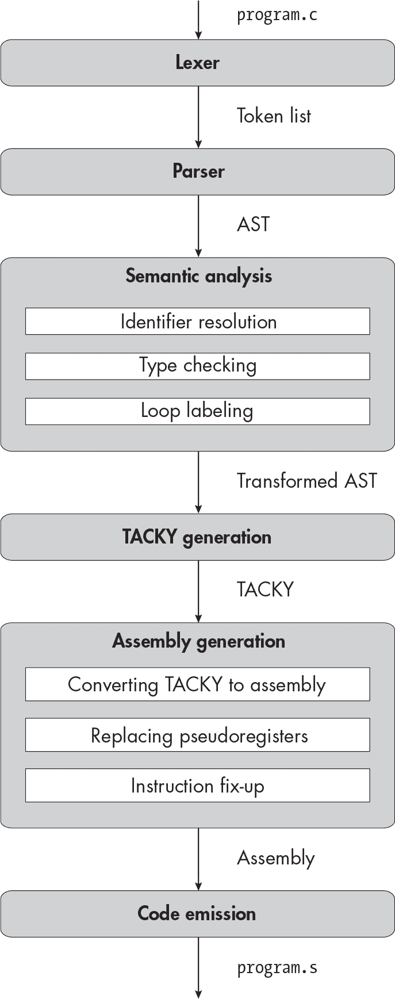

描述


## 11 长整型


在本章中，你将添加一个新类型：long。这是一种有符号整数类型，就像 int 一样；这两者之间唯一的区别是它们所能表示的值的范围。你还将添加一个显式类型转换操作，它将一个值转换为不同的类型。

由于 long 类型与我们已经支持的 int 类型非常相似，因此我们无需添加许多新的汇编或 TACKY 指令，也不需要实现复杂的类型转换逻辑。相反，我们将集中精力为 第二部分 的其余内容打好基础。我们将跟踪常量和变量的类型，将类型信息附加到抽象语法树（AST）上，识别隐式类型转换并使其显式，并确定汇编指令的操作数大小。我们将需要对编译器的每个阶段（除了循环标记）进行至少一点小改动。在开始之前，让我们看看 long 类型在汇编中的操作表现如何。

### 汇编中的长整型

C 语言标准并未指定整数类型的大小，但 System V x64 ABI 规定 int 是 4 字节，而 long 是 8 字节。为了极度简化问题，C 表达式中使用 long 操作数最终会转换为针对 quadwords（8 字节操作数）的汇编指令。例如，以下汇编指令在 quadwords 上操作来计算 2 + 2，并生成一个 quadword 结果：

```
movq    $2, %rax
addq    $2, %rax
```

这与使用 longwords（4 字节）编写的等效代码几乎完全相同：

```
movl    $2, %eax
addl    $2, %eax
```

唯一的区别是 mov 和 add 指令的后缀，以及我们是否使用整个 RAX 寄存器或仅使用其下 4 字节的 EAX。

> 注意

*术语* word*、*longword* 和 *quadword* 起源于 16 位处理器时代，当时 int 是 2 字节，long 是 4 字节。更糟糕的是，4 字节的值常常被称为 *doublewords* 而不是 longwords。我使用 *longword* 这一术语来模仿 AT&T 汇编语法，但英特尔的文档使用 *doubleword*。

大多数四字指令只接受 8 字节操作数并生成 8 字节结果，就像大多数长字指令只接受 4 字节操作数并生成 4 字节结果一样。而 C 语言中的表达式则经常同时使用多种操作数类型，或者将一种类型的值赋给另一种类型的对象。在编译过程中，我们将把这些表达式分解为简单的指令，这些指令要么接受单一类型的操作数并生成相同类型的结果，要么显式地进行类型转换。幸运的是，C 标准明确告诉我们这些类型转换发生的位置。

#### 类型转换

C 标准第 6.3.1.3 节第 1 段定义了如何在整数类型之间进行转换：“如果值可以由新类型表示，则不作更改。”换句话说，如果某个表达式计算结果为 3，然后你将其强制转换为另一种整数类型，那么该强制转换表达式的结果应该仍然是 3。

由于long大于int，我们可以安全地将任何int转换为long而不会改变其值。我们使用的是有符号整数的二进制补码表示法，因此我们将通过符号扩展将int转换为long，这种符号扩展的知识你在第三章中学过。具体来说，我们将使用movsx（或“带符号扩展的移动”）汇编指令。这条指令将 4 字节的源数据移入 8 字节的目标数据，并将值符号扩展到目标数据的上 4 字节。

将一个long转换为int会更棘手，因为它可能太大或太小，无法表示为int。C 标准第 6.3.1.3 节的第 3 段告诉我们，“当新类型为有符号类型且值无法在其中表示时，[结果]要么由实现定义，要么引发实现定义的信号。”换句话说，我们需要决定如何处理。我们的实现将按照 GCC 的方式处理这种转换，正如其文档中所述：“对于转换为宽度为*N*的类型，值会对 2*^N*取模，从而使其在类型范围内；不会引发信号” (*[`<wbr>gcc<wbr>.gnu<wbr>.org<wbr>/onlinedocs<wbr>/gcc<wbr>/Integers<wbr>-implementation<wbr>.html`](https://gcc.gnu.org/onlinedocs/gcc/Integers-implementation.html)*).

按模 2³² 减少一个值意味着加或减一个 2³² 的倍数，使其落入 `int` 的范围内。这里有一个简单的例子。你可以表示的最大 `int` 值是 2³¹ – 1，即 2,147,483,647。假设你需要将下一个最大的整数值 (2³¹，即 2,147,483,648) 从 `long` 转换为 `int`。从该值减去 2³² 会得到 -2³¹，即 -2,147,483,648，这是 `int` 能表示的最小值。

在实践中，我们将通过丢弃 `long` 的上 4 个字节，将其转换为 `int`。如果一个 `long` 可以表示为 `int`，那么丢弃这些字节不会改变它的值。例如，这是 -3 的 8 字节二进制表示：

```
11111111 11111111 11111111 11111111 11111111 11111111 11111111 11111101
```

这是相同值的 4 字节表示：

```
 11111111 11111111 11111111 11111101
```

如果一个 `long` 无法表示为 `int`，丢弃其上 4 个字节的效果是将其值按模 2³² 进行减少。以我们之前的例子为例，`long` 2,147,483,648 的二进制表示如下：

```
00000000 00000000 00000000 00000000 10000000 00000000 00000000 00000000
```

将其转换为 `int` 后，结果为值 -2,147,483,648，其二进制表示如下：

```
 10000000 00000000 00000000 00000000
```

要丢弃一个 `long` 的上 4 个字节，我们只需使用 `movl` 指令复制它的下 4 个字节。例如，以下指令将截断存储在 RCX 中的值：

```
movl    %ecx, %eax
```

当我们将值存储在寄存器的下 4 个字节时，寄存器的上 4 个字节将被置为零。

#### 静态长整型变量

静态存储持续时间的变量在汇编中定义方式基本相同，不管其类型如何，但静态四字和长字之间有一些小的差别。考虑以下文件作用域变量声明：

```
static long var = 100;
```

我们将把这个声明转换为 Listing 11-1 中的汇编代码。

```
 .data
    .align 8
var:
    .quad 100
```

Listing 11-1: 在数据区初始化一个 8 字节值

这与我们为静态 int 生成的汇编有两点不同：对齐方式是 8 而不是 4，并且我们使用 .quad 指令初始化 8 字节的值，而不是使用 .long 来初始化 4 字节。

System V x64 ABI 规定 long 和 int 分别是 8 字节和 4 字节对齐的。C 标准未指定它们的对齐方式，像它们的大小一样是未定义的。

现在我们对要生成的汇编有了大致的了解，接下来让我们开始编写编译器吧！ ### 词法分析器

在这一章中，您将添加以下两个标记：

long 一个关键字。

长整型常量 这些与我们当前的整型常量不同，因为它们有一个 l 或 L 后缀。长整型常量标记与正则表达式 [0-9]+[lL]\b 匹配。

### 解析器

在这一章中，我们将向抽象语法树（AST）添加长整型常量、类型信息和类型转换表达式。列表 11-2 展示了更新后的 AST 定义。

```
program = Program(declaration*)
declaration = FunDecl(function_declaration) | VarDecl(variable_declaration)
variable_declaration = (identifier name, exp? init,
                      ❶ **type var_type,** storage_class?)
function_declaration = (identifier name, identifier* params, block? body,
                      ❷ **type fun_type,** storage_class?)

❸ **type = Int | Long | FunType(type* params, type ret)**
storage_class = Static | Extern
block_item = S(statement) | D(declaration)
block = Block(block_item*)
for_init = InitDecl(variable_declaration) | InitExp(exp?)
statement = Return(exp)
          | Expression(exp)
          | If(exp condition, statement then, statement? else)
          | Compound(block)
          | Break
          | Continue
          | While(exp condition, statement body)
          | DoWhile(statement body, exp condition)
          | For(for_init init, exp? condition, exp? post, statement body)
          | Null
exp = Constant(**const**)
    | Var(identifier)
  ❹ **| Cast(type target_type, exp)**
    | Unary(unary_operator, exp)
    | Binary(binary_operator, exp, exp)
    | Assignment(exp, exp)
    | Conditional(exp condition, exp, exp)
    | FunctionCall(identifier, exp* args)
unary_operator = Complement | Negate | Not
binary_operator = Add | Subtract | Multiply | Divide | Remainder | And | Or
                | Equal | NotEqual | LessThan | LessOrEqual
                | GreaterThan | GreaterOrEqual
❺ **const = ConstInt(int) | ConstLong(int)**
```

列表 11-2：包含长整型常量、类型信息和类型转换表达式的抽象语法树

type AST 节点可以表示 int、long 和函数类型 ❸。我们并不打算在这里定义全新的数据结构，而是可以扩展我们在第九章中开始使用的 type 结构，在符号表条目中使用。从现在开始，我们将在符号表和 AST 中都使用该数据结构。

在第九章中，我们像这样定义了type：

```
type = Int | FunType(int param_count)
```

在列表 11-2 中，我们通过添加 Long 和跟踪有关函数类型的附加信息，包括返回类型和参数类型列表，修改了这个定义。之前我们不需要这些信息，因为每个参数和返回类型的类型都必须是 int。请注意，我们新的递归定义的 type 可以表示一些无效类型，比如返回函数的函数，但解析器永远不会生成这些无效类型。

一旦我们更新了表示 type 的方式，我们将类型信息附加到变量❶和函数声明❷。我们不会在函数声明的 params 中添加类型信息，因为函数的类型已经包含了其参数的类型。我们还扩展了 exp AST 节点，以表示类型转换表达式❹，并定义了一个新的 const AST 节点，具有区分长整型和整型常量的不同构造函数❺。我们在类型检查过程中需要区分不同类型的常量。

如果你的实现语言支持有符号的 64 位和 32 位整数类型，并且支持这些类型之间的转换，且转换语义与我们在 C 实现中对 long 和 int 之间的转换相同，我建议使用这些类型来表示 AST 中的 ConstLong 和 ConstInt。（大多数语言通过默认或库提供这些语义的定长整数类型。）这将使得在编译时更容易将静态初始化器转换为正确的类型；它还将简化常量折叠，这是一种我们将在第三部分中实现的优化。如果你的实现语言没有具有正确语义的整数类型，你至少应确保 ConstLong 节点使用能够表示所有 long 值的整数类型。

更新 AST 后，我们将对语法进行相应的更改，参见列表 11-3。

```
<program> ::= {<declaration>}
<declaration> ::= <variable-declaration> | <function-declaration>
<variable-declaration> ::= {<specifier>}+ <identifier> ["=" <exp>] ";"
<function-declaration> ::= {<specifier>}+ <identifier> "(" <param-list> ")" (<block> | ";")
<param-list> ::= "void"
               | **{<type-specifier>}+** <identifier> {"," **{<type-specifier>}+** <identifier>}
**<type-specifier> ::= "int" | "long"**
<specifier> ::= **<type-specifier> |** "static" | "extern"
<block> ::= "{" {<block-item>} "}"
<block-item> ::= <statement> | <declaration>
<for-init> ::= <variable-declaration> | [<exp>] ";"
<statement> ::= "return" <exp> ";"
              | <exp> ";"
              | "if" "(" <exp> ")" <statement> ["else" <statement>]
              | <block>
              | "break" ";"
              | "continue" ";"
              | "while" "(" <exp> ")" <statement>
              | "do" <statement> "while" "(" <exp> ")" ";"
              | "for" "(" <for-init> [<exp>] ";" [<exp>] ")" <statement>
              | ";"
<exp> ::= <factor> | <exp> <binop> <exp> | <exp> "?" <exp> ":" <exp>
<factor> ::= **<const>** | <identifier>
           **| "(" {<type-specifier>}+ ")" <factor>**
           | <unop> <factor> | "(" <exp> ")"
           | <identifier> "(" [<argument-list>] ")"
<argument-list> ::= <exp> {"," <exp>}
<unop> ::= "-" | "~" | "!"
<binop> ::= "-" | "+" | "*" | "/" | "%" | "&&" | "||"
          | "==" | "!=" | "<" | "<=" | ">" | ">=" | "="
**<const> ::= <int> | <long>**
<identifier> ::= ? An identifier token ?
<int> ::= ? An int token ?
**<long> ::= ? An int or long token ?**
```

列表 11-3：包含长常量、长类型说明符和类型转换表达式的语法

我们需要处理两个稍微复杂的细节。首先，每当我们解析类型修饰符列表时，我们需要将它们转换为一个单一的 type AST 节点。长整型可以通过 long 修饰符来声明，也可以通过同时使用 long 和 int 来声明，顺序可以任意。 清单 11-4 说明了如何将类型修饰符列表转换为类型。

```
parse_type(specifier_list):
    if specifier_list == ["int"]:
        return Int
    if (specifier_list == ["int", "long"]
        or specifier_list == ["long", "int"]
        or specifier_list == ["long"]):
        return Long
    fail("Invalid type specifier")
```

清单 11-4：从类型修饰符列表中确定类型

这适用于没有存储类的类型，我们通常会在参数列表或类型转换表达式中找到这些类型。对于函数和变量声明，我们将在 清单 10-21 中的修饰符解析代码的基础上进行扩展。清单 11-5 复制了该代码，并用粗体标出了更改部分。

```
parse_type_and_storage_class(specifier_list):
    types = []
    storage_classes = []
    for specifier in specifier_list:
        if specifier is "int" **or "long"**:
            types.append(specifier)
        else:
            storage_classes.append(specifier)

    **type = parse_type(types)**

    if length(storage_classes) > 1:
        fail("Invalid storage class")
    if length(storage_classes) == 1:
        storage_class = parse_storage_class(storage_classes[0])
    else:
        storage_class = null

    return (type, storage_class)
```

清单 11-5：从修饰符列表中确定类型和存储类

我们仍然将类型修饰符与存储类修饰符分开，并像在 清单 10-21 中那样确定存储类，但我们在这里做了一些小的改动。首先，我们将 long 识别为类型修饰符。其次，我们不再要求类型修饰符列表必须恰好包含一个元素（这个更改没有用粗体标出，因为我们只是删除了一些现有代码）。第三，我们不再总是将 type 设置为 Int，而是使用新的 parse_type 函数来确定类型。

第二个复杂的细节是解析常量标记。清单 11-6 展示了如何将这些标记转换为 const AST 节点。

```
parse_constant(token):
    v = integer value of token
    if v > 2⁶³ - 1:
        fail("Constant is too large to represent as an int or long")

    if token is an int token and v <= 2³¹ - 1:
        return ConstInt(v)

    return ConstLong(v)
```

清单 11-6：将常量标记转换为 AST 节点

我们将一个整数常量标记（没有 l 或 L 后缀）解析为 ConstInt 节点，除非它的值超出了 int 类型的范围。类似地，我们将一个长整型常量标记（带有 l 或 L 后缀）解析为 ConstLong 节点，除非它的值超出了 long 类型的范围。如果一个整数常量标记超出了 int 类型的范围，但在 long 类型的范围内，我们将其解析为 ConstLong 节点。如果一个整数或长整型常量标记对于 long 来说过大，我们将抛出一个错误。

一个 int 是 32 位的，因此它可以保存从 –2³¹ 到 2³¹ – 1 之间的任何值，包括端点。按相同的逻辑，一个 long 可以保存从 –2⁶³ 到 2⁶³ – 1 之间的任何值。你的解析器应该检查每个常量标记是否超出了相应类型的最大值。它不需要检查最小值，因为这些标记不能表示负数；负号是一个单独的标记。

### 语义分析

接下来，我们将扩展执行语义分析的编译器过程。我们将对标识符解析做一个微小的机械性修改：我们将扩展 resolve_exp，使其像遍历其他类型的表达式一样遍历类型转换表达式。我以后在章节中不会每次都明确提到这种修改；从现在开始，只要我们添加一个包含子表达式的新表达式，就可以扩展标识符解析过程来遍历它。做完这个修改后，我们就可以转向更有趣的问题——扩展类型检查器。

就像 C 程序中的每个对象都有一个类型一样，每个表达式的结果也有一个类型。例如，对两个 int 操作数执行任何二元算术运算将得到一个 int 结果，对两个 long 操作数执行相同的操作将得到一个 long 结果，调用具有特定返回类型的函数将返回该类型的结果。

在类型检查过程中，我们将为 AST 中的每个表达式注释其结果的类型。我们将使用这些类型信息来确定我们在 TACKY 中生成的临时变量的类型，以便保存中间结果。这将反过来帮助我们确定汇编指令所需的操作数大小，以及为每个临时变量分配的栈空间大小。

在我们给表达式注释类型信息的同时，我们还会识别程序中的任何隐式类型转换，并通过在 AST 中插入 Cast 表达式将其显式化。然后，我们可以在 TACKY 生成过程中轻松生成正确的类型转换指令。

#### 将类型信息添加到 AST

在我们更新类型检查器之前，我们需要一种方法来将类型信息附加到 exp AST 节点。显而易见的解决方案，如 Listing 11-7 所示，是在每个 exp 构造器中机械地添加一个 type 字段。

```
exp = Constant(const, **type**)
    | Var(identifier, **type**)
    | Cast(type target_type, exp, **type**)
    | Unary(unary_operator, exp, **type**)
    | Binary(binary_operator, exp, exp, **type**)
    | Assignment(exp, exp, **type**)
    | Conditional(exp condition, exp, exp, **type**)
    | FunctionCall(identifier, exp* args, **type**)
```

Listing 11-7: 向 exp 节点添加类型信息

如果你使用的是面向对象的实现语言，并且每个 exp 都有一个公共基类，那么这就非常简单。你可以像 Listing 11-8 中所示那样，在基类中添加一个 type 字段。

```
class BaseExp {
    `--snip--`
 **type expType;**
}
```

Listing 11-8: 为 exp 节点添加类型

另一方面，如果你使用代数数据类型实现了 AST，那么这种方法会非常令人烦恼。你不仅需要更新每一个 exp 构造器，而且每当你想获取表达式的类型时，还必须在每个构造器上进行模式匹配。一个稍微不那么繁琐的方法，如 Listing 11-9 所示，是定义互相递归的 exp 和 typed_exp AST 节点。

```
typed_exp = TypedExp(type, exp)
exp = Constant(const)
    | Var(identifier)
    | Cast(type target_type, typed_exp)
    | Unary(unary_operator, typed_exp)
    | Binary(binary_operator, typed_exp, typed_exp)
    | Assignment(typed_exp, typed_exp)
    | Conditional(typed_exp condition, typed_exp, typed_exp)
    | FunctionCall(identifier, typed_exp* args)
```

Listing 11-9: 向 exp 节点添加类型信息的另一种方式

无论你选择哪种方式，你都需要定义两个独立的 AST 数据结构——一个包含类型信息，一个不包含类型信息——或者在构建 AST 时，在解析器中为每个exp初始化一个空类型或虚拟类型。这里没有唯一正确的答案，这取决于你的实现语言和个人喜好。为了不强加某种特定方法，本书接下来的伪代码将使用两个函数来处理 AST 中的类型信息：set_type(e, t)返回带有类型t注解的e的副本，而get_type(e)返回来自e的类型注解。

#### 类型检查表达式

一旦我们扩展了 AST 的定义，我们将重写在第九章中定义的typecheck_exp，使其返回每个处理过的exp AST 节点的新注解副本。

清单 11-10 展示了如何进行变量的类型检查。

```
typecheck_exp(e, symbols):
    match e with
    | Var(v) ->
        v_type = symbols.get(v).type
        if v_type is a function type:
            fail("Function name used as variable")
        return set_type(e, v_type)
```

清单 11-10：类型检查变量

首先，我们在符号表中查找变量的类型。然后，我们验证是否没有将函数名当作变量使用，就像我们在之前的章节中所做的一样。最后，我们为表达式标注上变量的类型并返回。

清单 11-11 展示了如何进行常量的类型检查。这很简单，因为不同类型的常量在抽象语法树（AST）中有不同的构造函数。

```
 | Constant(c) ->
        match c with
        | ConstInt(i) -> return set_type(e, Int)
        | ConstLong(l) -> return set_type(e, Long)
```

清单 11-11：类型检查常量

对于剩下的表达式，我们需要遍历任何子表达式并对它们进行标注。一个强制转换表达式的结果会有我们强制转换的目标类型。我们在清单 11-12 中进行了类型检查。

```
 | Cast(t, inner) ->
        typed_inner = typecheck_exp(inner, symbols)
        cast_exp = Cast(t, typed_inner)
        return set_type(cast_exp, t)
```

清单 11-12：类型检查强制转换表达式

结果为 1 或 0 表示真或假的表达式（包括比较和逻辑运算如!）的类型为int。算术和按位运算表达式的结果类型与它们的操作数类型相同。对于一元表达式，这很直接，我们在清单 11-13 中进行了类型检查。

```
 | Unary(op, inner) ->
        typed_inner = typecheck_exp(inner, symbols)
        unary_exp = Unary(op, typed_inner)
        match op with
        | Not -> return set_type(unary_exp, Int)
        | _   -> return set_type(unary_exp, get_type(typed_inner))
```

清单 11-13：类型检查一元表达式

二元表达式更为复杂，因为两个操作数可能具有不同的类型。对于逻辑 && 和 || 操作，这并不重要，因为它们可以依次评估每个操作数的真值。对于比较和算术操作，则需要同时使用两个操作数，这就变得重要了。C 标准定义了一组规则，称为 *通常的算术转换*，用于隐式地将算术表达式的两个操作数转换为相同类型，这个类型被称为 *公共类型* 或 *公共实数类型*。

给定两个操作数的类型，清单 11-14 展示了如何找到它们的公共实数类型。目前这很简单，因为只有两种可能的类型。

```
get_common_type(type1, type2):
    if type1 == type2:
        return type1
    else:
        return Long
```

清单 11-14：找到公共实数类型

如果两个类型已经相同，则不需要进行转换。如果它们不同，我们将较小的类型（必须是 Int）转换为较大的类型（必须是 Long），因此公共类型是 Long。一旦我们添加更多类型，找到公共类型就不再如此简单。

一旦我们知道了两个操作数将被转换成的公共类型，我们就可以使用 清单 11-15 中展示的 convert_to 辅助函数，将这些类型转换显式化。

```
convert_to(e, t):
    if get_type(e) == t:
        return e
    cast_exp = Cast(t, e)
    return set_type(cast_exp, t)
```

清单 11-15：将隐式类型转换显式化

如果一个表达式已经具有正确的结果类型，convert_to 将返回它，并保持不变。否则，它会将表达式包装在一个 Cast AST 节点中，然后用正确的类型对结果进行注解。

有了这两个辅助函数，我们就可以对二元表达式进行类型检查。清单 11-16 展示了 typecheck_exp 的相关部分。

```
 | Binary(op, e1, e2) ->
      ❶ typed_e1 = typecheck_exp(e1, symbols)
        typed_e2 = typecheck_exp(e2, symbols)
        if op is And or Or:
            binary_exp = Binary(op, typed_e1, typed_e2)
            return set_type(binary_exp, Int)
      ❷ t1 = get_type(typed_e1)
        t2 = get_type(typed_e2)
        common_type = get_common_type(t1, t2)
        converted_e1 = convert_to(typed_e1, common_type)
        converted_e2 = convert_to(typed_e2, common_type)
        binary_exp = Binary(op, converted_e1, converted_e2)
      ❸ if op is Add, Subtract, Multiply, Divide, or Remainder:
            return set_type(binary_exp, common_type)
        else:
            return set_type(binary_exp, Int)
```

清单 11-16：对二元表达式进行类型检查

我们从对两个操作数进行类型检查开始❶。如果操作符是 And 或 Or，我们不进行任何类型转换。否则，我们执行常规的算术类型转换❷。我们首先找到共同类型，然后将两个操作数转换为该类型。（实际上，至少有一个操作数已经是正确的类型，因此 convert_to 将返回未更改的操作数。）接下来，我们使用这些转换后的操作数构建新的 Binary AST 节点。最后，我们用正确的结果类型注释新的 AST 节点❸。如果这是一个算术操作，结果将具有与操作数相同的类型，也就是我们之前找到的共同类型。否则，它是一个比较，结果是整数形式的真或假，因此结果类型是 Int。

在赋值表达式中，我们将赋值的值转换为它所赋给的对象的类型。清单 11-17 给出了这种情况的伪代码。

```
 | Assignment(left, right) ->
        typed_left = typecheck_exp(left, symbols)
        typed_right = typecheck_exp(right, symbols)
        left_type = get_type(typed_left)
        converted_right = convert_to(typed_right, left_type)
        assign_exp = Assignment(typed_left, converted_right)
        return set_type(assign_exp, left_type)
```

清单 11-17：赋值表达式的类型检查

记住，赋值表达式的结果是赋值后左侧操作数的值；不出所料，结果的类型也与左侧操作数相同。

条件表达式的工作方式类似于二元算术表达式：我们找到两个分支的共同类型，将两个分支转换为该共同类型，并用该类型标注结果。我们会对控制条件进行类型检查，但不需要将其转换为其他类型。我不会为此提供伪代码。

最后但同样重要的是，清单 11-18 展示了如何进行函数调用的类型检查。

```
 | FunctionCall(f, args) ->
        f_type = symbols.get(f).type
        match f_type with
        | FunType(param_types, ret_type) ->
            if length(param_types) != length(args):
                fail("Function called with the wrong number of arguments")
            converted_args = []
          ❶ for (arg, param_type) in zip(args, param_types):
                typed_arg = typecheck_exp(arg, symbols)
                converted_args.append(convert_to(typed_arg, param_type))
            call_exp = FunctionCall(f, converted_args)
          ❷ return set_type(call_exp, ret_type)
        | _ -> fail("Variable used as function name")
```

清单 11-18：函数调用的类型检查

我们从符号表中查找函数类型。就像在前几章中一样，我们需要确保我们尝试调用的标识符实际上是一个函数，并且我们传递给它正确数量的参数。然后，我们同时遍历函数的参数和形参❶。我们对每个参数进行类型检查，然后将其转换为对应的形参类型。最后，我们用函数的返回类型注释整个表达式❷。

#### 类型检查 return 语句

当一个函数返回一个值时，它会隐式地转换为该函数的返回类型。类型检查器需要将这种隐式转换显式化。为了进行`return`语句的类型检查，我们需要查找封闭函数的返回类型，并将返回值转换为该类型。这要求我们跟踪当前正在类型检查的函数的名称，或者至少是返回类型。为了简化，我将省略类型检查`return`语句的伪代码，因为它非常直接。

#### 类型检查声明和更新符号表

接下来，我们将更新如何类型检查函数和变量声明，并且更新我们在符号表中存储的信息。首先，我们需要为符号表中的每个条目记录正确的类型；我们不能仅仅假设每个变量、参数和返回值都是`int`类型。其次，每当我们检查是否存在冲突的声明时，我们需要验证当前声明和之前的声明是否具有相同的类型。仅仅检查一个变量之前是否被声明为一个函数，或者一个函数是否之前被声明为不同数量的参数是不够的；它们的类型必须完全相同。例如，如果一个变量被声明为`int`类型，之后又被重新声明为`long`类型，类型检查器应该抛出一个错误。第三，当我们进行自动变量的类型检查时，我们需要将它的初始化器转换为该变量的类型，就像我们将赋值表达式右侧的值转换为左侧类型一样。

最后，我们将改变符号表中静态初始化器的表示方式。静态初始化器，像常量表达式一样，现在可以是`int`类型或`long`类型。清单 11-19 给出了静态初始化器的更新定义。

```
initial_value = Tentative | Initial(**static_init**) | NoInitializer
**static_init = IntInit(int) | LongInit(int)**
```

清单 11-19：符号表中的静态初始化器

这个 static_init 的定义可能看起来很冗余，因为它与 Listing 11-2 中定义的 const AST 节点基本相同，但它们将在后续章节中有所不同。像 ConstInt 和 ConstLong AST 节点一样，你应该仔细选择在实现语言中使用什么整数类型来表示这两种初始化器。特别重要的是确保 LongInit 能够容纳任何带符号的 64 位整数。

在将表达式转换为静态初始化器时，你可能需要执行类型转换。例如，假设一个程序包含以下声明：

```
static int i = 100L;
```

常量 100L 在我们的抽象语法树（AST）中将被解析为 ConstLong。由于它被赋值给一个静态的 int，我们需要在编译时将其从 long 强制转换为 int，并将其作为 IntInit(100) 存储在符号表中。这种类型的转换在使用一个太大以至于无法用 32 位表示的 long 常量初始化 int 类型变量时特别棘手，例如在下面的声明中：

```
static int i = 2147483650L;
```

根据我们之前指定的实现定义行为，我们需要从该值中减去 2³²，直到它足够小，可以适应 int 类型。这样得到的结果是 -2,147,483,646，所以我们在符号表中记录的初始值应该是 IntInit(-2147483646)。理想情况下，你可以使用已经具有适当语义的带符号整数类型来进行类型转换，这样你就不必自己处理这些常量的二进制表示了。

这里有一些提示可以帮助你处理静态初始化器：

**使你的常量类型转换代码可重用。**

类型检查器并不是唯一一个会将常量转换为不同类型的地方。在 Part III 中，你将实现 TACKY 中的常量折叠。常量折叠阶段将会计算常量表达式，包括类型转换。你可能希望将你的类型转换代码构建为一个独立的模块，以便在之后的常量折叠过程中重用。

**不要在静态初始化器上调用 typecheck_exp。**

将每个静态初始化器直接转换为static_init，而不首先调用typecheck_exp。这样做将简化后续章节中的内容，因为在后面的章节中，typecheck_exp会以更复杂的方式转换表达式。

### TACKY 生成

在本章中，我们将对 TACKY AST 做出一些修改。首先，我们将为每个顶级的StaticVariable添加类型，并用我们新定义的static_init构造表示每个静态变量的初始值：

```
StaticVariable(identifier, bool global, **type t, static_init init**)
```

我们还将重新使用来自列表 11-2 的const构造来表示常量：

```
val = Constant(**const**) | Var(identifier)
```

最后，我们将引入几个新指令，用于在不同类型之间转换值：

```
SignExtend(val src, val dst)
Truncate(val src, val dst)
```

SignExtend和Truncate指令分别将<int>转换为<long>，并将<long>转换为<int>。列表 11-20 给出了完整更新的 TACKY IR。本列表使用了type、static_init和const，但没有定义它们，因为我们已经定义了这三个构造。

```
program = Program(top_level*)
top_level = Function(identifier, bool global, identifier* params, instruction* body)
          | StaticVariable(identifier, bool global, **type t, static_init init**)
instruction = Return(val)
            **| SignExtend(val src, val dst)**
            **| Truncate(val src, val dst)**
            | Unary(unary_operator, val src, val dst)
            | Binary(binary_operator, val src1, val src2, val dst)
            | Copy(val src, val dst)
            | Jump(identifier target)
            | JumpIfZero(val condition, identifier target)
            | JumpIfNotZero(val condition, identifier target)
            | Label(identifier)
            | FunCall(identifier fun_name, val* args, val dst)
val = Constant(**const**) | Var(identifier)
unary_operator = Complement | Negate | Not
binary_operator = Add | Subtract | Multiply | Divide | Remainder | Equal | NotEqual
                | LessThan | LessOrEqual | GreaterThan | GreaterOrEqual
```

列表 11-20：为 TACKY 添加对长整型的支持

我们将在生成 TACKY 时，通过查找符号表中的类型和初始化信息来处理对StaticVariable的更改。如果符号表中有静态变量的暂定定义，我们将根据其类型初始化为IntInit(0)或LongInit(0)。

处理常量就更加简单了；其逻辑与前面章节基本相同。我们将直接把Constant AST 节点转换为 TACKY 的Constant，因为它们都使用相同的const定义。

回想一下，当我们将逻辑&&或||表达式转换为 TACKY 时，我们显式地将 1 或 0 赋值给保存表达式结果的变量。由于这些逻辑表达式的类型都是int，我们将它们的结果表示为ConstInt(1)和ConstInt(0)。

列表 11-21 展示了如何将类型转换表达式转换为 TACKY。我们将使用在上一个步骤中添加的类型信息来确定我们要转换的类型。

```
emit_tacky(e, instructions, symbols):
    match e with
    | `--snip--`
 | Cast(t, inner) ->
        result = emit_tacky(inner, instructions, symbols)
        if t == get_type(inner):
          ❶ return result
        dst_name = make_temporary()
        symbols.add(dst_name, t, attrs=LocalAttr)
        dst = Var(dst_name)
        if t == Long:
          ❷ instructions.append(SignExtend(result, dst))
        else:
          ❸ instructions.append(Truncate(result, dst))
        return dst
```

列表 11-21：将类型转换表达式转换为 TACKY

如果内部表达式已经具有我们要转换到的类型，则转换没有任何效果；我们发出 TACKY 来评估内部表达式，但不执行其他操作 ❶。否则，我们将发出SignExtend指令，将int转换为long ❷，或者发出Truncate指令，将long转换为int ❸。

#### 跟踪临时变量的类型

当我们在列表 11-21 中创建临时变量dst时，我们将其与适当的类型一起添加到符号表中。我们需要为每个创建的临时变量执行此操作，以便在汇编生成阶段可以查找它们的类型。汇编生成阶段将以两种方式使用此类型信息：确定每条汇编指令的操作数大小，以及确定为每个变量分配多少栈空间。

我们添加的每个临时变量都保存一个表达式的结果，因此我们可以通过检查表达式的类型注解来确定其类型。让我们再看一遍列表 3-9，它展示了如何将二元算术表达式转换为 TACKY。列表 11-22 演示了相同的转换，其中来自列表 3-9 的更改已加粗。

```
emit_tacky(e, instructions, **symbols**):
    match e with
    | `--snip--`
    | Binary(op, e1, e2) ->
        v1 = emit_tacky(e1, instructions, **symbols**)
        v2 = emit_tacky(e2, instructions, **symbols**)
        dst_name = make_temporary()
        **symbols.add(dst_name, get_type(e), attrs=LocalAttr)**
        dst = Var(dst_name)
        tacky_op = convert_binop(op)
        instructions.append(Binary(tacky_op, v1, v2, dst))
        return dst
    | `--snip--`
```

列表 11-22：将二元表达式转换为 TACKY 时跟踪临时变量的类型

这里的主要变化是将 dst 添加到符号表中。由于 dst 保存了表达式 e 的结果，我们查找 e 的类型注释以确定 dst 的类型。像所有临时变量一样，dst 是一个局部自动变量，因此我们将在符号表中给它添加 LocalAttr 属性。

让我们将其重构为一个辅助函数，如 列表 11-23 所示。

```
make_tacky_variable(var_type, symbols):
    var_name = make_temporary()
    symbols.add(var_name, var_type, attrs=LocalAttr)
    return Var(var_name)
```

列表 11-23：用于生成 TACKY 变量的辅助函数

从现在开始，我们将在生成 TACKY 中的临时变量时使用 make_tacky_variable。

#### 生成额外的返回指令

在第五章中，我提到过，我们在每个 TACKY 函数的末尾添加了一条额外的 Return 指令，以防原始 C 函数中的每个执行路径都没有到达 return 语句。这条额外的指令总是返回 ConstInt(0)，即使函数的返回类型不是 int。当我们从 main 返回时，这是正确的返回类型。当我们从任何其他没有显式 return 语句的函数返回时，返回值是未定义的。我们仍然需要将控制权返回给调用者，但我们没有义务返回任何特定的值，因此如果我们把类型弄错了也没关系。

### 汇编生成

本章我们将对汇编 AST 做出几处修改。列表 11-24 给出了完整的定义，修改部分已加粗。

```
program = Program(top_level*)
**assembly_type = Longword | Quadword**
top_level = Function(identifier name, bool global, instruction* instructions)
          | StaticVariable(identifier name, bool global, **int alignment, static_init init**)
instruction = Mov(**assembly_type,** operand src, operand dst)
            **| Movsx(operand src, operand dst)**
            | Unary(unary_operator, **assembly_type**, operand)
 | Binary(binary_operator, **assembly_type**, operand, operand)
            | Cmp(**assembly_type**, operand, operand)
            | Idiv(**assembly_type**, operand)
            | Cdq(**assembly_type**)
            | Jmp(identifier)
            | JmpCC(cond_code, identifier)
            | SetCC(cond_code, operand)
            | Label(identifier)
            | Push(operand)
            | Call(identifier)
            | Ret

unary_operator = Neg | Not
binary_operator = Add | Sub | Mult
operand = Imm(int) | Reg(reg) | Pseudo(identifier) | Stack(int) | Data(identifier)
cond_code = E | NE | G | GE | L | LE
reg = AX | CX | DX | DI | SI | R8 | R9 | R10 | R11 | **SP**
```

列表 11-24：支持四字操作数和 8 字节静态变量的汇编 AST

最大的变化是为大多数指令标记其操作数的类型。这使得我们可以在汇编发射过程中为每条指令选择正确的后缀。我们还会为Cdq添加一个类型，因为 32 位版本的Cdq将 EAX 扩展到 EDX，而 64 位版本将 RAX 扩展到 RDX。只有三条指令需要操作数，但不需要类型：SetCC，它只接受字节大小的操作数；Push，它总是压入四字（quadword）；以及新的Movsx指令，我们稍后会讨论。

我们将不再复用之前定义的源级类型，而是定义一个新的assembly_type结构。这将简化汇编类型的工作，因为我们将在后续章节中引入更多的 C 类型。例如，我们将在第十二章中添加无符号整数，但汇编语言并不区分有符号和无符号整数。

在生成汇编时，我们将根据操作数的类型确定每条指令的类型。例如，我们将转换 TACKY 指令

```
Binary(Add, Constant(ConstInt(3)), Var("src"), Var("dst"))
```

这些汇编指令如下：

```
Mov(Longword, Imm(3), Pseudo("dst"))
Binary(Add, Longword, Pseudo("src"), Pseudo("dst"))
```

由于第一个操作数是ConstInt，我们知道生成的mov和add指令应该使用长字（longword）操作数。我们可以假设第二个操作数和目标与第一个操作数具有相同的类型，因为在 TACKY 生成过程中我们已经插入了适当的类型转换指令。如果操作数是变量而不是常量，我们将查找其在符号表中的类型。

我们还将弄清楚如何根据参数的类型传递堆栈参数。列表 11-25 重现了convert_function_call的相关部分，该部分我们在列表 9-31 中定义过，并且已将此次更改加粗。

```
convert_function_call(FunCall(fun_name, args, dst)):
    `--snip--`
    // pass args on stack
    for tacky_arg in reverse(stack_args):
        assembly_arg = convert_val(tacky_arg)
        if assembly_arg is a Reg or Imm operand **or has type Quadword**:
            emit(Push(assembly_arg))
        else:
            emit(Mov(**Longword**, assembly_arg, Reg(AX)))
            emit(Push(Reg(AX)))
    `--snip--`
```

列表 11-25：在 convert_function_call 中传递四字（quadword）数据

在 第九章中，我们学到，如果我们使用一个 8 字节的 pushq 指令将一个 4 字节的操作数从内存推送到栈上，可能会遇到问题。为了解决这个问题，我们发出两个指令来将一个 4 字节的 Pseudo 推送到栈上：我们将其复制到 EAX 寄存器中，然后推送 RAX 寄存器。8 字节的 Pseudo 不需要此解决方法；我们通过一个 Push 指令将其传递到栈上，方式与传递立即数值相同。

为了处理从 int 到 long 的转换，我们将使用符号扩展指令 movsx。目前，这个指令不需要类型信息，因为它的源操作数必须是 int 类型，目标操作数必须是 long 类型。我们将转换

```
SignExtend(src, dst)
```

到：

```
Movsx(src, dst)
```

为了截断一个值，我们只需使用 4 字节的 movl 指令将其最低的 4 字节移动到目标位置。我们将转换

```
Truncate(src, dst)
```

到：

```
Mov(Longword, src, dst)
```

我们还调整了 StaticVariable 结构：

```
StaticVariable(identifier name, bool global, **int alignment, static_init init**)
```

我们保留了 TACKY 中的 static_init 结构，因此我们知道是否为每个静态变量初始化 4 或 8 字节。我们还添加了一个 alignment 字段，因为我们需要在汇编中指定每个静态变量的对齐方式。

最后，我们已从汇编 AST 中移除了 DeallocateStack 和 AllocateStack 指令。这些指令只是四字节加法和减法的占位符，现在我们可以通过普通的 addq 和 subq 指令表示它们。由于 DeallocateStack 和 AllocateStack 代表的是对 RSP 的加减操作，我们还将 RSP 寄存器添加到汇编 AST 中，以便在正常的指令中使用它。在前面的章节中，我们通过以下指令在函数调用前保持栈对齐：

```
AllocateStack(bytes)
```

现在我们将改用以下指令：

```
Binary(Sub, Quadword, Imm(bytes), Reg(SP))
```

类似地，不再使用

```
DeallocateStack(bytes)
```

我们将使用

```
Binary(Add, Quadword, Imm(bytes), Reg(SP))
```

用于在函数调用后恢复栈指针。

表格 11-1 至 11-4 总结了本章对从 TACKY 转换到汇编的更新。新增的结构和对现有结构的转换更改以**粗体**显示。

表 11-1: 将顶级 TACKY 构造转换为汇编

| TACKY 顶级构造 | 汇编顶级构造 |
| --- | --- |
| Function(name, global, params, instructions) |

```
Function(name, global,
          [Mov(<param1 type>, Reg(DI), param1),
           Mov(<param2 type>, Reg(SI), param2), 
 <copy next four parameters from registers>, 
           Mov(<param7 type>, Stack(16), param7),
           Mov(<param8 type>, Stack(24), param8), 
 <copy remaining parameters from stack>] +
        instructions)
```

|

| StaticVariable(name, global, t, init) | StaticVariable(name, global, <alignment of t>, init) |
| --- | --- |

表 11-2: 将 TACKY 指令转换为汇编

| TACKY 指令 | 汇编指令 |
| --- | --- |
| Return(val) | Mov(<val type>, val, Reg(AX)) Ret |

| Unary(Not, src, dst) | Cmp(<src type>, Imm(0), src) Mov(<dst type>, Imm(0), dst)

SetCC(E, dst) |

| Unary(unary_operator, src, dst) | Mov(<src type>, src, dst) Unary(unary_operator, <src type>, dst) |
| --- | --- |

| Binary(Divide, src1, src2, dst) | Mov(<src1 type>, src1, Reg(AX)) Cdq(<src1 type>)

Idiv(<src1 type>, src2)

Mov(<src1 type>, Reg(AX), dst) |

| Binary(Remainder, src1, src2, dst) | Mov(<src1 type>, src1, Reg(AX)) Cdq(<src1 type>)

Idiv(<src1 type>, src2)

Mov(<src1 type>, Reg(DX), dst) |

| Binary(arithmetic_operator, src1, src2, dst) | Mov(<src1 type>, src1, dst) Binary(arithmetic_operator, <src1 type>, src2, dst) |
| --- | --- |

| Binary(relational_operator, src1, src2, dst) | Cmp(<src1 type>, src2, src1) Mov(<dst type>, Imm(0), dst)

SetCC(relational_operator, dst) |

| JumpIfZero(condition, target) | Cmp(<condition type>, Imm(0), condition) JmpCC(E, target) |
| --- | --- |
| JumpIfNotZero(condition, target) | Cmp(<condition type>, Imm(0), condition) JmpCC(NE, target) |
| 复制(Copy(src, dst)) | Mov(<src 类型>, src, dst) |

| 函数调用(FunCall(fun_name, args, dst)) | <修正栈对齐> <设置参数>

调用(Call(fun_name))

<释放参数/填充>

Mov(<dst 类型>, Reg(AX), dst) |

| 符号扩展(SignExtend(src, dst)) | Movsx(src, dst) |
| --- | --- |
| 截断(Truncate(src, dst)) | Mov(Longword, src, dst) |

表 11-3： 将 TACKY 操作数转换为汇编

| TACKY 操作数 | 汇编操作数 |
| --- | --- |
| 常量(整型常量(ConstInt(int))) | 立即数(Imm(int)) |
| 常量(ConstLong(int)) | 立即数(Imm(int)) |

表 11-4： 将类型转换为汇编

| 源类型 | 汇编类型 | 对齐方式 |
| --- | --- | --- |
| 整型(Int) | 长整型(Longword) | 4 |
| 长整型(Long) | 四倍长整型(Quadword) | 8 |

在表 11-3 中，我们将两种类型的 TACKY 常量转换为 立即数(Imm) 操作数。在汇编中，4 字节和 8 字节的立即数值没有区别。汇编器根据操作数所在指令的大小推断立即数的大小。

表 11-4 给出了从源级到汇编类型的转换，以及每种类型的对齐方式。请注意，这种转换与表 11-1 到表 11-3 中的转换方式有所不同，因为当我们遍历一个 TACKY 程序时，我们不会遇到可以直接转换为汇编程序中assembly_type节点的type AST 节点。如我们所见，通常我们需要推断 TACKY 指令的操作数类型，然后才能将其转换为汇编类型。唯一具有显式类型的 TACKY 构造是StaticVariable，但我们不需要将此类型转换为汇编类型；我们只需要计算它的对齐方式。我们将在此编译器步骤的下一步中再次使用表 11-4 中的转换方法，在那里我们将构建一个新的符号表来跟踪汇编类型。

#### 在后端符号表中跟踪汇编类型

在将 TACKY 程序转换为汇编之后，我们将把符号表转换为更适合其余编译器步骤的形式。这个新的符号表将存储变量的汇编类型，而不是它们的源类型。它还将存储我们在伪寄存器替换、指令修正和代码生成步骤中需要查找的一些其他属性。我将把这个新的符号表称为*后端符号表*，将现有的符号表称为*前端符号表*，或者简称*符号表*。

后端符号表将每个标识符映射到一个asm_symtab_entry构造，该构造在清单 11-26 中定义。

```
asm_symtab_entry = ObjEntry(assembly_type, bool is_static)
                 | FunEntry(bool defined)
```

清单 11-26：后端符号表中条目的定义

我们将使用ObjEntry来表示变量（以及在后续章节中，常量）。我们将跟踪每个对象的汇编类型，以及它是否具有静态存储持续时间。FunEntry表示函数。我们不需要跟踪函数的类型——这也好，因为assembly_type无法表示函数类型——但我们会跟踪它们是否在当前翻译单元中定义。如果你在符号表中跟踪每个函数的栈帧大小，可以在FunEntry构造函数中添加一个额外的stack_frame_size字段。我建议将后端符号表设为全局变量或单例，就像现有的前端符号表一样。

在 TACKY 到汇编的转换过程结束时，您应该遍历前端符号表，并将每个条目转换为后端符号表中的条目。这个过程足够简单，我不会提供伪代码。您还需要更新伪寄存器替换、指令修复和代码生成过程中涉及前端符号表的地方，并改为使用后端符号表。

#### 替换长字和四字伪寄存器

伪寄存器替换过程需要进行几个修改。首先，我们将扩展它，以替换新的movsx指令中的伪寄存器。其次，每当我们将栈地址分配给伪寄存器时，我们会在后端符号表中查找该伪寄存器的类型，以确定分配多少空间。如果它是四字，我们将分配 8 字节；如果它是长字，我们将像以前一样分配 4 字节。最后，我们将确保每个四字伪寄存器在栈上的地址是 8 字节对齐的。考虑以下汇编代码片段：

```
Mov(Longword, Imm(0), Pseudo("foo"))
Mov(Quadword, Imm(1), Pseudo("bar"))
```

假设我们在后端符号表中查找foo的类型，发现它是 4 字节。我们将像往常一样把它分配给-4(%rbp)。接下来，我们查找bar，发现它是 8 字节。我们可以将它分配给-12(%rbp)，即在foo下方 8 字节的位置。但这样的话，bar就会发生错位，因为它的地址不是 8 字节的倍数。（记住，RBP 中的地址始终是 16 字节对齐的。）为了保持正确的对齐，我们将向下取整到下一个 8 的倍数，将bar存储在-16(%rbp)。对齐要求是 System V ABI 的一部分；如果忽略它们，您的代码可能与其他翻译单元中的代码无法正确交互。

#### 修复指令

我们将在本章中对指令修复过程进行几处更新。首先，我们需要为现有的重写规则中的所有指令指定操作数大小。这些大小应该始终与被重写的原始指令的操作数大小相同。

接下来，我们将重写 movsx 指令。它不能使用内存地址作为目标，也不能使用立即数作为源。如果 movsx 的两个操作数无效，我们需要同时使用 R10 和 R11 来修复它们。例如，我们将重写

```
Movsx(Imm(10), Stack(-16))
```

改为：

```
Mov(Longword, Imm(10), Reg(R10))
Movsx(Reg(R10), Reg(R11))
Mov(Quadword, Reg(R11), Stack(-16))
```

在此重写规则中，使用每个 mov 指令时，重要的是使用正确的操作数大小。由于 movsx 的源操作数为 4 字节，因此在将该操作数移入寄存器时，我们指定一个长字（longword）操作数大小。由于 movsx 的结果为 8 字节，因此在将结果移动到其最终内存位置时，我们指定一个四字（quadword）操作数大小。

我们的三条二进制算术指令的四字版本（addq、imulq 和 subq）不能处理不适合 int 的立即数，cmpq 和 pushq 也不能。如果任何这些指令的源操作数超出了 int 的范围，我们需要先将其复制到 R10 中，然后才能使用它。

movq 指令可以将这些非常大的立即数值移动到寄存器中，但不能直接移入内存，因此

```
Mov(Quadword, Imm(4294967295), Stack(-16))
```

应重写为：

```
Mov(Quadword, Imm(4294967295), Reg(R10))
Mov(Quadword, Reg(R10), Stack(-16))
```

> 注意

*汇编器仅在立即数可以表示为* 有符号 *32 位整数时，才允许在 addq、imulq、subq、cmpq 或 pushq 中使用立即数。这是因为这些指令都会将其立即操作数从 32 位符号扩展到 64 位。如果一个立即数仅能表示为 32 位的* 无符号 *整数（这意味着其高位被设置），符号扩展将改变其值。有关更多详细信息，请参见此 Stack Overflow 问题：* [`<wbr>stackoverflow<wbr>.com<wbr>/questions<wbr>/64289590<wbr>/integer<wbr>-overflow<wbr>-in<wbr>-gas`](https://stackoverflow.com/questions/64289590/integer-overflow-in-gas)*。*

我们还将修复在每个函数开始时分配堆栈空间的方式。我们将不再在每个函数中添加 AllocateStack(bytes) 来分配堆栈空间，而是添加以下指令，执行相同的操作：

```
Binary(Sub, Quadword, Imm(bytes), Reg(SP))
```

我们将添加最后一条重写规则来安抚汇编器，尽管这不是绝对必要的。记住，我们将Truncate TACKY 指令转换为一个 4 字节的movl指令，这意味着我们可以生成将 8 字节立即数移动到 4 字节目标位置的movl指令：

```
Mov(Longword, Imm(4294967299), Reg(R10))
```

由于movl不能使用 8 字节的立即数，汇编器会自动将这些值截断为 32 位。例如，当它处理指令movl $4294967299, %r10d时，它会将立即数4294967299转换为3。GNU 汇编器在进行这个转换时会发出警告，但 LLVM 汇编器则不会。为了避免这些警告，我们将自己在movl指令中截断 8 字节立即数。这意味着我们将把之前的指令重写为：

```
Mov(Longword, Imm(3), Reg(R10))
```

除去汇编器警告，即使不包括这个重写规则，你的汇编程序依然能正常工作。

### 代码生成

我们的最终任务是扩展代码生成阶段。我们将为每条指令添加适当的后缀，发出正确的对齐和静态变量的初始值，并处理新的Movsx指令。每当指令使用寄存器时，我们会为该指令的操作数大小发出相应的寄存器名称。

操作数为 4 字节的指令有一个 l 后缀，表示长字（longword），而操作数为 8 字节的指令有一个 q 后缀，表示四倍字（quadword），有一个例外：8 字节版本的 cdq 有一个完全不同的助记符 cqo。Movsx 指令会根据其源操作数和目标操作数的大小添加后缀。例如，movslq 会将一个长字扩展为四倍字。现在，我们将始终用 lq 后缀发出此指令；随着我们在后续章节中添加更多汇编类型，将需要更多后缀。（你也可能看到此指令写作 movsx，当汇编器能够推断出两个操作数的大小时。例如，汇编器会接受指令 movsx %r10d, %r11，因为它可以从寄存器名称推断出源和目标的大小。）

表 11-5 到 11-10 总结了本章对代码发射过程的更新。新结构和对现有结构的更改已加粗。

表 11-5： 格式化顶级汇编结构

| 汇编顶级结构 |  | 输出 |
| --- | --- | --- |
| StaticVariable(name, global, alignment, init) | 初始化为零 |

```
 <global-directive> 
 .bss 
 <alignment-directive>
<name>: 
    <init>
```

|

|  | 初始化为非零值 |
| --- | --- |

```
 <global-directive> 
 .data 
 <alignment-directive>
<name>: 
 <init>
```

|

| 对齐指令 | 仅限 Linux | .align <alignment> |
| --- | --- | --- |
|  | macOS 或 Linux | .balign <alignment> |

表 11-6： 格式化静态初始化器

| 静态初始化器 | 输出 |
| --- | --- |
| IntInit(0) | .zero 4 |
| IntInit(i) | .long <i> |
| LongInit(0) | .zero 8 |
| LongInit(i) | .quad <i> |

表 11-7： 汇编指令的格式化

| 汇编指令 | 输出 |
| --- | --- |
| Mov(t, src, dst) |

```
mov<t>    <src>, <dst>
```

|

| Movsx(src, dst) |
| --- |

```
movslq    <src>, <dst>
```

|

| Unary(unary_operator, t, operand) |
| --- |

```
<unary_operator><t>     <operand>
```

|

| Binary(binary_operator, t, src, dst) |
| --- |

```
<binary_operator><t>    <src>, <dst>
```

|

| Idiv(t, operand) |
| --- |

```
idiv<t>   <operand>
```

|

| Cdq(Longword) |
| --- |

```
cdq
```

|

| Cdq(Quadword) |
| --- |

```
cqo
```

|

| Cmp(t, operand, operand) |
| --- |

```
cmp<t> <operand>, <operand>
```

|

表 11-8： 汇编操作符的指令名称

| 汇编操作符 | 指令名称 |
| --- | --- |
| Neg | neg |
| Not | not |
| 加法 | add |
| 减法 | sub |
| 乘法 | imul |

表 11-9： 汇编类型的指令后缀

| 汇编类型 | 指令后缀 |
| --- | --- |
| 长字 | l |
| 四字长 | q |

表 11-10： 格式化汇编操作数

| 汇编操作数 | 输出 |
| --- | --- |
| Reg(SP) | %rsp |

表 11-6 展示了如何打印表示静态变量初始化器的 static_init 构造体。表 11-8 展示了从一元和二元操作符到没有后缀的指令名称的映射；后缀现在取决于指令的类型（如表 11-9 所示）。除了后缀外，这些指令名称与早期章节中的相同。

一旦你更新了代码生成阶段，就可以开始测试你的编译器了。

### 总结

现在你的编译器有了类型系统！在这一章中，你为抽象语法树（AST）添加了类型信息，使用符号表在多个编译阶段追踪类型信息，并在汇编生成时添加了对多种操作数大小的支持。长整数并不是最炫酷的语言特性，所以你可能觉得自己做了很多工作，却似乎没有太多展示的内容。但你在这一章中创建的基础设施将是你在第二部分中所做的一切工作的基础。在下一章，你将在此基础上继续实现无符号整数。
