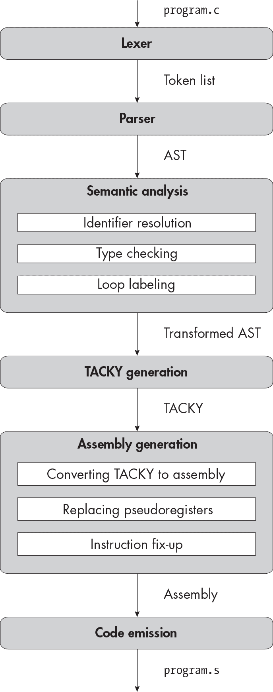

描述


## 12 无符号整数


在本章中，您将实现我们两个有符号整数类型的无符号对等类型：unsigned int 和 unsigned long。您将扩展通常的算术转换以处理无符号整数，并实现有符号和无符号类型之间的强制转换。在后端，您将使用一些新的汇编指令来进行无符号整数算术运算。

在 第十一章 中，我们集中讨论了推断和追踪类型信息；现在我们将能够在此基础上，利用相对较少的工作来添加新类型。在修改编译器之前，让我们先快速概述一下有符号和无符号类型之间的转换。

### 类型转换，再次说明

每种整数类型的转换都有两个方面需要考虑：整数值的变化以及其二进制表示的变化。我们在上一章中看到过 int 和 long 之间的转换。符号扩展将有符号整数的表示从 32 位扩展到 64 位，而不改变其值。将 long 截断为 int 也会改变其表示，如果原始值无法适应新类型，还会改变其值。

有了这个区分，我将把我们的类型转换分为四种情况。在每种情况下，我会描述整数的表示如何变化。然后，我会解释这些变化如何与 C 标准中有关其值变化的规则相对应。

#### 在相同大小的有符号和无符号类型之间转换

第一个情况是当我们在相同大小的有符号和无符号类型之间转换时：即，在 int 和 unsigned int 之间，或在 long 和 unsigned long 之间。这些转换不会改变整数的二进制表示。唯一改变的是我们是否使用二进制补码来解释其值。让我们考虑这种解释变化的影响。

如果一个有符号整数为正数，则其最高位将为 0，因此将其解释为无符号整数不会改变其值。反之亦然：如果一个无符号整数小于有符号类型能表示的最大值，则其最高位必定为 0。因此，如果我们使用二进制补码重新解释它，其值将不会发生变化。正如你在上一章中学到的，当我们将整数转换为新类型时，标准要求我们尽可能保留其值。我们在这里满足了这一要求。

这就留下了最高位为 1 的整数。当我们将一个有符号的负整数重新解释为无符号整数时，我们将最高位的值从负数变为正数。如果最高位是 1，这会导致值增加 2*^N*，其中*N*是该类型的位数。这正是标准所要求的行为；第 6.3.1.3 节第 2 段指出，如果新类型无法表示该值，并且新类型是无符号的，“则通过反复加或减去新类型能够表示的最大值加 1，直到该值落入新类型的范围。”

相反，将一个带有前导 1 的无符号类型转换为相应的有符号类型将会从其值中减去 2*^N*。这与我们在上一章中为有符号整数转换所选择的实现定义行为相符，遵循 GCC：“该值会按 2*^N*取模，以保持在类型范围内。”

#### 将无符号整数转换为更大类型

第二种情况是当我们将无符号整数转换为更大类型时，可能是long或无符号长整数。处理这种情况时，我们会通过将新表示的高位填充为零来*零扩展*该整数。这种转换始终保留原始值，因为我们只是给正数添加了前导零。

#### 将有符号整数转换为更大类型

第三个情况是我们将有符号的 int 转换为 long 或 unsigned long。我们已经使用符号扩展将 int 转换为 long。我们将以相同的方式将 int 转换为 unsigned long。如果 int 是正数，符号扩展将只会添加前导零，无论你将结果解释为有符号还是无符号，它的值都将保持不变。如果值是负数，符号扩展后再将结果解释为 unsigned long 将会向它的值添加 2⁶⁴，这是标准要求的。

#### 从较大类型转换到较小类型

在最后一种情况中，我们将较大的类型（long 或 unsigned long）转换为较小的类型（int 或 unsigned int）。我们总是通过截断值来处理这种情况。这样会添加或减去 2³²，直到值落入新类型的范围——或者等效地，减少值对 2³² 取模——这就是我们想要的行为。我不会详细讲解为什么在每种情况下截断整数会产生正确的值；你可以自己做一些例子，或者相信我的话。

现在你知道了类型转换的预期效果，让我们开始编写编译器吧。

### 词法分析器

在这一章中，你将添加四个新令牌：

signed 一个关键字，用于指定有符号整数类型。

unsigned 一个关键字，用于指定无符号整数类型。

**无符号整数常量** 具有 u 或 U 后缀的整数常量。无符号常量令牌匹配正则表达式 [0-9]+[uU]\b。

**无符号长整型常量** 具有不区分大小写的 ul 或 lu 后缀的整数常量。无符号长整型常量的令牌匹配正则表达式 [0-9]+([lL][uU]|[uU][lL])\b。

更新你的词法分析器以支持这些令牌，然后进行测试。

### 语法分析器

接下来，我们将更新 AST 以支持这两种新的无符号类型及其对应的常量。这些更新在清单 12-1 中已加粗。

```
program = Program(declaration*)
declaration = FunDecl(function_declaration) | VarDecl(variable_declaration)
variable_declaration = (identifier name, exp? init,
                        type var_type, storage_class?)
function_declaration = (identifier name, identifier* params, block? body,
                        type fun_type, storage_class?)
type = Int | Long | **UInt | ULong |** FunType(type* params, type ret)
storage_class = Static | Extern
block_item = S(statement) | D(declaration)
block = Block(block_item*)
for_init = InitDecl(variable_declaration) | InitExp(exp?)
statement = Return(exp)
          | Expression(exp)
          | If(exp condition, statement then, statement? else)
          | Compound(block)
          | Break
          | Continue
          | While(exp condition, statement body)
          | DoWhile(statement body, exp condition)
          | For(for_init init, exp? condition, exp? post, statement body)
          | Null
exp = Constant(const)
    | Var(identifier)
    | Cast(type target_type, exp)
    | Unary(unary_operator, exp)
    | Binary(binary_operator, exp, exp)
    | Assignment(exp, exp)
    | Conditional(exp condition, exp, exp)
    | FunctionCall(identifier, exp* args)
unary_operator = Complement | Negate | Not
binary_operator = Add | Subtract | Multiply | Divide | Remainder | And | Or
                | Equal | NotEqual | LessThan | LessOrEqual
                | GreaterThan | GreaterOrEqual
const = ConstInt(int) | ConstLong(int) **| ConstUInt(int) | ConstULong(int)**
```

清单 12-1：包含无符号类型和无符号常量的抽象语法树

就像在上一章中你添加了ConstLong一样，你需要确保ConstUInt可以表示完整的unsigned int范围，而ConstULong可以表示完整的unsigned long范围。如果你的实现语言中有无符号的 32 位和 64 位整数类型，可以在这里使用它们。

清单 12-2 展示了更新后的语法，修改部分已加粗。

```
<program> ::= {<declaration>}
<declaration> ::= <variable-declaration> | <function-declaration>
<variable-declaration> ::= {<specifier>}+ <identifier> ["=" <exp>] ";"
<function-declaration> ::= {<specifier>}+ <identifier> "(" <param-list> ")" (<block> | ";")
<param-list> ::= "void"
               | {<type-specifier>}+ <identifier> {"," {<type-specifier>}+ <identifier>}
<type-specifier> ::= "int" | "long" **| "unsigned" | "signed"**
<specifier> ::= <type-specifier> | "static" | "extern"
<block> ::= "{" {<block-item>} "}"
<block-item> ::= <statement> | <declaration>
<for-init> ::= <variable-declaration> | [<exp>] ";"
<statement> ::= "return" <exp> ";"
              | <exp> ";"
              | "if" "(" <exp> ")" <statement> ["else" <statement>]
              | <block>
              | "break" ";"
              | "continue" ";"
              | "while" "(" <exp> ")" <statement>
              | "do" <statement> "while" "(" <exp> ")" ";"
              | "for" "(" <for-init> [<exp>] ";" [<exp>] ")" <statement>
              | ";"
<exp> ::= <factor> | <exp> <binop> <exp> | <exp> "?" <exp> ":" <exp>
<factor> ::= <const> | <identifier>
           | "(" {<type-specifier>}+ ")" <factor>
           | <unop> <factor> | "(" <exp> ")"
           | <identifier> "(" [<argument-list>] ")"
<argument-list> ::= <exp> {"," <exp>}
<unop> ::= "-" | "~" | "!"
<binop> ::= "-" | "+" | "*" | "/" | "%" | "&&" | "||"
          | "==" | "!=" | "<" | "<=" | ">" | ">=" | "="
<const> ::= <int> | <long> | **<uint> | <ulong>**
<identifier> ::= ? An identifier token ?
<int> ::= ? An int token ?
<long> ::= ? An int or long token ?
**<uint> ::= ? An unsigned int token ?**
**<ulong> ::= ? An unsigned int or unsigned long token ?**
```

清单 12-2：包含 signed 和 unsigned 类型说明符和无符号常量的语法

解析类型说明符比上一章更复杂，因为有许多不同的方式可以引用同一类型。例如，下面这些都是指定long类型的有效方式：

long

long int

signed long

signed long int

类型说明符的顺序并不重要，因此long signed、long int signed等都指定相同的类型。清单 12-3 中的伪代码提供了一种方式来规范这些混乱。

```
parse_type(specifier_list):
    if (specifier_list is empty
        or specifier_list contains the same specifier twice
        or specifier_list contains both "signed" and "unsigned"):
        fail("Invalid type specifier")
    if specifier_list contains "unsigned" and "long":
        return ULong
    if specifier_list contains "unsigned":
        return UInt
    if specifier_list contains "long":
        return Long
    return Int
```

清单 12-3：从类型说明符列表中确定类型

我们首先检查错误情况。你至少需要一个说明符来指示类型，并且不能包含相同的说明符两次。例如，你不能指定类型为int long int。（long long类型说明符会使这个验证检查更复杂，但我们不打算实现它。）你也不能在同一类型说明中同时包含signed和unsigned说明符，因为它们是互相矛盾的。

一旦我们确认输入指定了有效的类型，我们会检查 unsigned 和 long 修饰符。如果两者都存在，那么类型就是 unsigned long。否则，如果存在 unsigned，类型就是 unsigned int；如果存在 long，类型就是 long；如果两者都不存在，类型就是 int。基本上，int 是默认类型，而 unsigned 和 long 修饰符可以指示除默认类型以外的其他类型。C 标准第 6.7.2 节，第 2 段列出了所有指定每种类型的方法。

我们还需要处理常量标记。在上一章中，列表 11-6 演示了如何解析有符号常量标记。我这里不再包括无符号常量标记的伪代码，但逻辑是一样的。如果无符号整数常量标记在 unsigned int 能表示的范围内（即在 0 和 2³² – 1 之间，包括 0 和最大值），我们将其解析为 ConstUInt。否则，我们将其解析为 ConstULong。

一个无符号长整型常量标记将始终解析为 ConstULong。如果任何类型的无符号常量标记不在 unsigned long 的范围内（介于 0 和 2⁶⁴ – 1 之间），我们会抛出一个错误。如果你感兴趣，C 标准第 6.4.4.1 节有关于如何确定整数常量类型的完整规则。 ### 类型检查器

在本章中我们不需要修改循环标记或标识符解析阶段。我们只需要在类型检查器中处理无符号整数。

首先，我们将更新通常算术转换的实现，这会隐式地将二元表达式中的操作数转换为通用类型。我们来了解一下整数类型的通常算术转换规则，这些规则在 C 标准第 6.3.1.8 节第 1 段中有定义。第一个规则非常直观：

> 如果两个操作数具有相同的类型，则不需要进一步的转换。

第二个稍微难理解一点：

> 否则，如果两个操作数都是有符号整数类型或都是无符号整数类型，则将具有较小整数转换等级的操作数转换为具有较大等级的操作数的类型。

这只是意味着“如果两个整数有相同的符号性，转换较小的类型为较大的类型。”我们在将值从int隐式转换为long时已经做到了这一点。第 6.3.1.1 节，第 1 段，规定了*整数转换等级*，它提供了每种整数类型的相对顺序，而不是精确地规定这些类型的大小。在我们目前为止使用的类型中，long和unsigned long具有最高的等级，然后是int和unsigned int。相同类型的有符号和无符号版本始终具有相同的等级。由于它们的相对转换等级，long保证至少和int一样大，但不一定更大。（事实上，在大多数 32 位系统上，这两种类型的大小是相同的。）无论它们的确切大小如何，long和int的共同类型是long，而unsigned long和unsigned int的共同类型是unsigned long。这里没有什么大惊小怪的。

第三条规则讨论的是有一个有符号操作数和一个无符号操作数的情况：

> 否则，如果具有无符号整数类型的操作数的等级大于或等于另一个操作数类型的等级，则具有有符号整数类型的操作数会转换为具有无符号整数类型的操作数的类型。

所以，如果两种类型的大小相同，或者无符号类型更大，我们选择无符号类型。例如，int和unsigned int的共同类型是unsigned int，而<int和unsigned long的共同类型是unsigned long。剩下的情况是有符号类型更大，这由第四条规则来处理：

> 否则，如果带符号整数类型的操作数能够表示无符号整数类型操作数的所有值，那么无符号整数类型的操作数将转换为带符号整数类型操作数的类型。

在 System V x64 ABI 下，long 可以表示 unsigned int 类型的所有值，因此 unsigned int 和 long 的公共类型是 long。在 long 和 int 相同大小的实现中，情况则不同。在这些实现中，long 的等级高于 int，但无法表示 unsigned int 类型的所有值。第五条规则涵盖了这些实现。尽管此规则不适用于我们，但我会为了完整性而包含它：

> 否则，两个操作数都将转换为与带符号整数类型操作数相对应的无符号整数类型。

因此，在 long 和 int 大小相同的系统上，long 和 unsigned int 的公共类型是 unsigned long。

这归结为查找公共类型的三条规则，清单 12-4 在伪代码中描述了这些规则。

```
get_common_type(type1, type2):
  ❶ if type1 == type2:
        return type1
  ❷ if size(type1) == size(type2):
        if type1 is signed:
            return type2
        else:
            return type1
  ❸ if size(type1) > size(type2):
        return type1
    else:
        return type2
```

清单 12-4：查找两个整数的公共类型

首先，如果类型相同，选择任意一个 ❶。否则，如果它们大小相同，选择无符号类型 ❷。如果它们大小不同，选择较大的类型 ❸。除了常规的算术转换，我们将对类型检查表达式的逻辑进行一次小更新：我们将使用正确的类型标注无符号常量，方式与我们已经标注带符号常量相同。

接下来，让我们看看如何在符号表中记录静态变量的初始值。我们将添加两种新的静态初始化器，就像我们添加了两种新的常量一样：

```
static_init = IntInit(int) | LongInit(int) | **UIntInit(int) | ULongInit(int)**
```

我们需要根据本章开始时介绍的类型转换规则，将每个初始化器转换为它所初始化的变量的类型。考虑以下声明：

```
static unsigned int u = 4294967299L;
```

值 4,294,967,299 超出了unsigned int的范围。当将u添加到符号表时，我们将通过从该值中减去 2³² 来将其转换为 unsigned int。（实际上，你可能只需要在实现语言中使用等效的整数类型转换。）结果初始化器将是 UIntInit(3)。

同样地，以下声明将一个超出其范围的 int 进行初始化：

```
static int i = 4294967246u;
```

一旦我们对该值进行 2³² 取模，结果初始化器将是 IntInit(-50)。

对于有符号和无符号变量，严格来说不需要使用不同的静态初始化器。相反，你可以使用 IntInit 来表示 int 和 unsigned int 的初始化器，使用 LongInit 来表示 long 和 unsigned long 的初始化器。最终，汇编器将为初始化器写出相同的字节，无论你将其表示为有符号还是无符号值：指令 .long -50 和 .long 4294967246 完全相同。将 UIntInit 和 ULongInit 初始化器分开，只是让我们的类型转换更容易追踪。

### TACKY 生成

在本章中，我们将向 TACKY 添加一项：ZeroExtend 指令。列表 12-5 定义了整个 TACKY IR。

```
program = Program(top_level*)
top_level = Function(identifier, bool global, identifier* params, instruction* body)
          | StaticVariable(identifier, bool global, type t, static_init init)
instruction = Return(val)
            | SignExtend(val src, val dst)
            | Truncate(val src, val dst)
            **| ZeroExtend(val src, val dst)**
            | Unary(unary_operator, val src, val dst)
            | Binary(binary_operator, val src1, val src2, val dst)
            | Copy(val src, val dst)
            | Jump(identifier target)
            | JumpIfZero(val condition, identifier target)
 | JumpIfNotZero(val condition, identifier target)
            | Label(identifier)
            | FunCall(identifier fun_name, val* args, val dst)
val = Constant(const) | Var(identifier)
unary_operator = Complement | Negate | Not
binary_operator = Add | Subtract | Multiply | Divide | Remainder | Equal | NotEqual
                | LessThan | LessOrEqual | GreaterThan | GreaterOrEqual
```

列表 12-5：将 ZeroExtend 指令添加到 TACKY

现在我们必须为将转换为和从无符号类型转换的类型转换表达式生成正确的 TACKY。在本章开始时，我们讨论了将整数转换为新类型如何影响其二进制表示的四种不同情况。列表 12-6 展示了在每种情况下应该发出什么样的 TACKY 指令。

```
emit_tacky(e, instructions, symbols):
    match e with
    | `--snip--`
    | Cast(t, inner) ->
        result = emit_tacky(inner, instructions, symbols)
        inner_type = get_type(inner)
        if t == inner_type:
            return result
        dst = make_tacky_variable(t, symbols)
      ❶ if size(t) == size(inner_type):
            instructions.append(Copy(result, dst))
      ❷ else if size(t) < size(inner_type):
            instructions.append(Truncate(result, dst))
      ❸ else if inner_type is signed:
            instructions.append(SignExtend(result, dst))
      ❹ else:
            instructions.append(ZeroExtend(result, dst))
        return dst
```

列表 12-6：将类型转换表达式转换为 TACKY

与上一章一样，如果内部表达式已经具有正确的类型，则类型转换表达式不做任何操作。否则，我们检查原始类型和目标类型的大小是否相同❶。如果相同，我们不需要扩展、截断或以其他方式更改内部值，因为其在汇编中的表示不会改变。我们只是将其复制到一个具有正确类型的临时变量中。这里的Copy指令可能看起来多余，但我们需要它来帮助我们在汇编生成过程中跟踪类型信息。根据操作数是有符号还是无符号，我们将为某些 TACKY 指令生成不同的汇编。如果我们不将每个表达式的结果存储在正确类型的变量中，我们将生成不正确的汇编。

接下来，我们检查目标类型是否小于原始类型❷。如果是这种情况，我们会发出Truncate指令。如果该检查也失败，则该类型转换表达式将较小的类型转换为较大的类型。如果原始类型是有符号的❸，我们发出SignExtend指令；如果是无符号的❹，我们发出ZeroExtend指令。

一旦你的编译器为无符号常量和类型转换表达式生成了正确的 TACKY 指令，你就可以进行测试。

### 汇编中的无符号整数操作

在大多数情况下，我们可以使用完全相同的汇编指令来操作有符号和无符号值。然而，在两个情况下，我们需要不同地处理无符号值：比较和除法。我们还需要将新的ZeroExtend指令转换为汇编指令。在更新汇编生成阶段之前，让我们先看看在汇编中无符号比较、无符号除法和零扩展是如何工作的。

#### 无符号比较

在第四章中，你学会了如何比较两个整数：发出cmp指令以设置 RFLAGS 寄存器，然后发出一个条件指令，其行为取决于该寄存器的状态。我们将采用相同的方法来比较无符号整数，但我们需要依赖不同的标志来使用不同的条件码。

执行算术运算的几条指令，包括add、sub和cmp，不区分有符号和无符号值。列表 12-7 演示了如何使用一个操作同时实现有符号和无符号加法。

```
 1000
+ 0010
------
  1010
```

列表 12-7：二进制整数加法

如果我们将操作数和结果解释为无符号的 4 位整数，清单 12-7 计算的是 8 + 2 = 10。如果我们将它们解释为有符号的 4 位整数，则计算的是 −8 + 2 = −6。只要我们一致地解释两个操作数和结果，无论哪种方式都能得到正确的答案。你可以将 add、sub 和大多数其他算术汇编指令的结果视为具有两种可能值的比特序列，一种是有符号的，一种是无符号的。

在处理器执行这些指令之一之后，RFLAGS 中的某些标志会告诉我们结果的有符号值，其他一些标志则告诉我们其无符号值，还有一些标志适用于这两种值。（有些标志与这些指令的结果无关，但我们不关心它们。）我们在第四章中讨论了三个标志：ZF，零标志；SF，符号标志；和 OF，溢出标志。无论我们将结果解释为有符号还是无符号，ZF 都适用，因为零在这两种情况下的表示方式是相同的。然而，SF 和 OF 标志仅在结果的有符号值上提供有意义的信息。

例如，SF 表示结果为负数。在第四章中，我们使用这个标志得出结论，a - b 是负数。在那种情况下，假设没有溢出，我们知道 a 小于 b。对于无符号值，这种方法不起作用，因为无符号值按定义是正数。考虑清单 12-8，它使用无符号的 4 位整数来计算 15 – 3。

```
 1111
- 0011
------
  1100
```

清单 12-8：减法二进制整数

由于 15 大于 3，因此此操作的结果是一个正数，12。结果具有前导 1 并没有告诉我们哪个操作数更大。类似地，OF 告诉我们某个指令结果的有符号值从正数环绕到负数，或反之，这并没有告诉我们任何关于其无符号值的有用信息。

要比较无符号整数，我们将使用 CF，即*进位标志*。该标志指示结果的无符号值发生了溢出，因为正确的值小于零或大于该类型能够表示的最大值。例如，假设我们要用无符号 4 位整数计算 15 + 1。15 的无符号 4 位表示为 1111；当我们将其加 1 时，它会回绕到 0000。这个计算将使进位标志被设置为 1。如果我们尝试计算 0 - 1，且结果在相反方向回绕到 1111，即 15，那么进位标志也会被设置为 1。如果 a < b，则 a - b 的结果总是回绕并设置进位标志。如果 a > b，则结果总是可以表示为无符号整数，因此不会发生回绕。让我们看看当我们将 a 和 b 作为无符号整数时，cmp b, a 会如何影响 CF 和 ZF：

+   如果 a == b，则 a - b 将为 0，因此 ZF 将为 1，CF 将为 0。

+   如果 a > b，则 a - b 将是一个正数。它将大于 0，但小于或等于 a，因此不会回绕。ZF 和 CF 都将为 0。

+   如果 a < b，则 a - b 将为负数，因此它必须回绕。ZF 将为 0，CF 将为 1。

请注意，ZF 和 CF 是互斥的；一个操作永远不会同时设置这两个标志。本章中所需的所有条件码都依赖于这两个标志之一或两者。表 12-1 列出了这些条件码。

表 12-1： 无符号比较的条件码

| 条件码 | 含义 | 标志 |
| --- | --- | --- |
| E | a == b | ZF 被设置 |
| NE | a != b | ZF 未设置 |
| A | a > b | CF 未设置且 ZF 未设置 |
| AE | a >= b | CF 未设置 |
| B | a < b | CF 设置 |
| BE | a <= b | CF 设置或 ZF 设置 |

我们使用现有的 E 和 NE 条件码来测试相等和不等，但我们将使用新的代码来确定两个操作数中哪个更大。新代码中的 A 和 B 是“above”（上面）和“below”（下面）的助记符。新的条件码可以出现在条件跳转和设置指令中，就像旧的条件码一样。列表 12-9 演示了如何在 EAX 中设置 1，如果 EDX 中的无符号值大于 10。

```
cmpl    $10, %edx
movl    $0, %eax
seta    %al
```

列表 12-9：在汇编中执行无符号比较

这与有符号比较的模式完全相同：我们发出 cmp 指令，然后清除目标值，最后发出带有适当条件码后缀的 set 指令。

#### 无符号除法

对于大多数算术操作，相同的指令可以在有符号和无符号整数上正确操作。但对于除法，这种方式不适用。假设我们想要计算 1000 / 0010。如果将这些值解释为有符号 4 位整数，则为 −8 / 2，结果是 −4，表示为 1100。如果它们是无符号 4 位整数，则为 8 / 2，结果是 4，即 0100。单条指令无法在两种情况下都产生正确的结果。

因此，我们需要一个新的指令div来执行无符号除法。这个指令与idiv一样。它需要一个操作数，即除数。被除数是存储在 EDX 和 EAX 中的值，或者在处理四字时是存储在 RDX 和 RAX 中的值。它将商存储在 EAX 或 RAX 中，将余数存储在 EDX 或 RDX 中。

由于被除数是无符号的，我们将其从 EAX 扩展到 EDX（或从 RAX 扩展到 RDX），而不是进行符号扩展。我们通过将 RDX 清零，而不是发出cdq指令来实现这一点。

#### 零扩展

我们需要实现的最后一个操作是零扩展。我们可以通过将一个长字移动到寄存器中来将其零扩展为四字；这将清除寄存器的上 4 个字节。然后，如果需要将值存储到内存中，我们可以将整个 8 字节的值移动到最终位置。以下代码将位于-4(%rbp)的值零扩展，然后将结果保存到-16(%rbp)：

```
movl    -4(%rbp), %eax
movq    %rax, -16(%rbp)
```

我们使用 4 字节的movl指令将值复制到寄存器中，使用 8 字节的movq指令将其复制出来。如果零扩展操作的最终目标是寄存器而不是内存位置，我们只需要第一个 4 字节的movl指令。

还有一个独立的movz指令，它用于零扩展小于 4 字节的源值。我们暂时不需要这个指令，但在第十六章中实现字符类型时会用到它。

### 汇编生成

现在你已经知道如何在汇编中处理无符号整数，你可以开始扩展汇编生成阶段。清单 12-10 定义了最新的汇编 AST，本文中新增的部分已加粗。

```
program = Program(top_level*)
assembly_type = Longword | Quadword
top_level = Function(identifier name, bool global, instruction* instructions)
          | StaticVariable(identifier name, bool global, int alignment, static_init init)
instruction = Mov(assembly_type, operand src, operand dst)
            | Movsx(operand src, operand dst)
            **| MovZeroExtend(operand src, operand dst)**
            | Unary(unary_operator, assembly_type, operand)
            | Binary(binary_operator, assembly_type, operand, operand)
            | Cmp(assembly_type, operand, operand)
            | Idiv(assembly_type, operand)
            **| Div(assembly_type, operand)**
            | Cdq(assembly_type)
            | Jmp(identifier)
            | JmpCC(cond_code, identifier)
            | SetCC(cond_code, operand)
            | Label(identifier)
            | Push(operand)
            | Call(identifier)
            | Ret

unary_operator = Neg | Not
binary_operator = Add | Sub | Mult
operand = Imm(int) | Reg(reg) | Pseudo(identifier) | Stack(int) | Data(identifier)
cond_code = E | NE | G | GE | L | LE **| A | AE | B | BE**
reg = AX | CX | DX | DI | SI | R8 | R9 | R10 | R11 | SP
```

清单 12-10：带有无符号操作的汇编 AST

我们添加了上一节中讨论的新条件码和无符号div指令。我们还添加了一个MovZeroExtend指令来处理零扩展。目前，这个指令只是一个占位符。在指令修复阶段，我们会将其替换为一个或两个mov指令，具体取决于其目标是内存还是寄存器。（目前，目标总是内存，因此我们始终需要两个mov指令；一旦我们在第三部分中实现寄存器分配，这一点将发生变化。）当我们添加字符类型时，MovZeroExtend还将表示真正的movz指令，用于将 1 字节的值零扩展。

让我们回顾一下我们在汇编生成阶段需要做的更改。首先，当我们将源级类型转换为汇编类型时，我们失去了带符号和无符号整数之间的区别。在 TACKY 中，long和unsigned long值在汇编中都变成了四字长，而int和unsigned int值则变成了长字。

当我们将比较指令从 TACKY 转换为汇编时，我们首先查找任一操作数的类型（两个操作数的类型保证相同）。然后，根据该类型是否带符号，我们选择适当的条件码。例如，处理

```
Binary(LessThan, Var("src1"), Var("src2"), Var("dst"))
```

我们从符号表中查找src1或src2的类型。假设类型是UInt。在这种情况下，我们将生成以下汇编指令：

```
Cmp(Longword, Pseudo("src2"), Pseudo("src1"))
Mov(Longword, Imm(0), Pseudo("dst"))
SetCC(B, Pseudo("dst"))
```

这些指令与我们为带符号比较生成的指令完全相同，唯一的区别是我们使用了B条件码，而不是L。

为了处理 TACKY 的除法或余数操作，我们将第一个操作数复制到 EAX 寄存器中，如之前所做的那样。然后，如果操作数是带符号的，我们将 EAX 符号扩展到 EDX 并发出idiv指令。如果操作数是无符号的，我们将 EDX 清零并发出div指令。（自然地，如果操作数是四字长，我们将使用 RAX 和 RDX 代替 EAX 和 EDX。）例如，我们将转换为

```
Binary(Remainder, ConstULong(100), Var("x"), Var("dst"))
```

转换为：

```
Mov(Quadword, Imm(100), Reg(AX))
Mov(Quadword, Imm(0), Reg(DX))
Div(Quadword, Pseudo("x"))
Mov(Quadword, Reg(DX), Pseudo("dst"))
```

最后，我们将每个 ZeroExtend TACKY 指令转换为 MovZeroExtend 汇编指令。

表 12-2 到 12-5 总结了从 TACKY 到汇编的最新转换更新。新增的构造和我们转换现有构造的方式的更改已加粗显示。

表 12-2： 将 TACKY 指令转换为汇编

| TACKY 指令 |  | 汇编指令 |
| --- | --- | --- |
| Binary(Divide, src1, src2, dst) | 有符号 |

```
Mov(<src1 type>, src1, Reg(AX))
Cdq(<src1 type>)
Idiv(<src1 type>, src2)
Mov(<src1 type>, Reg(AX), dst)
```

|

| 无符号 |
| --- |

```
Mov(<src1 type>, src1, Reg(AX))
Mov(<src1 type>, Imm(0), Reg(DX))
Div(<src1 type>, src2)
Mov(<src1 type>, Reg(AX), dst)
```

|

| Binary(Remainder, src1, src2, dst) | 有符号 |
| --- | --- |

```
Mov(<src1 type>, src1, Reg(AX))
Cdq(<src1 type>)
Idiv(<src1 type>, src2)
Mov(<src1 type>, Reg(DX), dst)
```

|

| 无符号 |
| --- |

```
Mov(<src1 type>, src1, Reg(AX))
Mov(<src1 type>, Imm(0), Reg(DX))
Div(<src1 type>, src2)
Mov(<src1 type>, Reg(DX), dst)
```

|

| ZeroExtend(src, dst) |  | MovZeroExtend(src, dst) |
| --- | --- | --- |

表 12-3： 将 TACKY 比较转换为汇编

| TACKY 比较 |  | 汇编条件码 |
| --- | --- | --- |
| LessThan | 有符号 | L |
| 无符号 | B |
| LessOrEqual | 有符号 | LE |
| 无符号 | BE |
| GreaterThan | 有符号 | G |
| 无符号 | A |
| GreaterOrEqual | 有符号 | GE |
| 无符号 | AE |

表 12-4： 将 TACKY 操作数转换为汇编

| 粘性操作数 | 汇编操作数 |
| --- | --- |
| 常量(ConstUInt(int)) | Imm(int) |
| 常量(ConstULong(int)) | Imm(int) |

表 12-5： 类型转换为汇编类型

| 源类型 | 汇编类型 | 对齐 |
| --- | --- | --- |
| UInt | Longword | 4 |
| ULong | Quadword | 8 |

接下来，我们将更新伪寄存器替换和指令修正的处理过程。

#### 替换伪寄存器

我们将扩展这个过程，以处理新的 Div 和 MovZeroExtend 指令。否则，这里没有什么需要更改的。这个过程查看的是每个操作数的汇编类型，而不是其源级类型，因此它不会区分有符号和无符号操作数。

#### 修正 Div 和 MovZeroExtend 指令

接下来，我们将重写 Div 和 MovZeroExtend。与 Idiv 类似，新的 Div 指令不能使用常量操作数。我们将像重写 Idiv 一样重写它，必要时将操作数复制到 R10。

我们将用一条或两条 mov 指令替换 MovZeroExtend。如果目标是寄存器，我们将发出一条 movl 指令。例如，我们将重写

```
MovZeroExtend(Stack(-16), Reg(AX))
```

如下所示：

```
Mov(Longword, Stack(-16), Reg(AX))
```

如果目标在内存中，我们将使用一条 movl 指令将其零扩展到 R11 中，然后再从那里移动到目标。因此，我们将重写

```
MovZeroExtend(Imm(100), Stack(-16))
```

如下所示：

```
Mov(Longword, Imm(100), Reg(R11))
Mov(Quadword, Reg(R11), Stack(-16))
```

我们不会对这个过程做其他更改。

### 代码生成

我们将在本章中对代码发射阶段进行一些更改。首先，我们将添加`div`指令和新的条件码。我们还将添加两个新的静态初始化器，UIntInit和ULongInit，它们的发射方式将与其有符号对应物<code>IntInit</code>和<code>LongInit</code>完全相同。表 12-6 至 12-8 展示了如何发射这些新结构。

表 12-6： 格式化静态初始化器

| 静态初始化器 | 输出 |
| --- | --- |
| UIntInit(0) | .zero 4 |
| UIntInit(i) | .long <i> |
| ULongInit(0) | .zero 8 |
| ULongInit(i) | .quad <i> |

表 12-7： 格式化汇编指令

| 汇编指令 | 输出 |
| --- | --- |
| Div(t, operand) |

```
div<t>    <operand>
```

|

表 12-8： 条件码的指令后缀

| 条件码 | 指令后缀 |
| --- | --- |
| A | a |
| AE | ae |
| B | b |
| BE | be |

我没有像往常一样加粗这些表格中的新结构和更改，因为所有这些汇编结构都是新的。

### 概述

在本章中，你在第十一章中打下的基础上，实现了两个无符号整数类型。你深入研究了 C 标准中关于类型转换的规则，并探索了这些转换如何影响整数的表示和数值。在类型检查器中，你了解了有符号和无符号整数是如何转换为共同类型的。在汇编生成过程中，你实现了零扩展、无符号除法和比较操作。

在第十三章中，你将添加一个浮点类型，double。浮点数在硬件中的处理方式与整数有很大不同；它们甚至有自己的寄存器！正如你将看到的那样，这些硬件差异影响了从类型转换到函数调用约定的方方面面。
