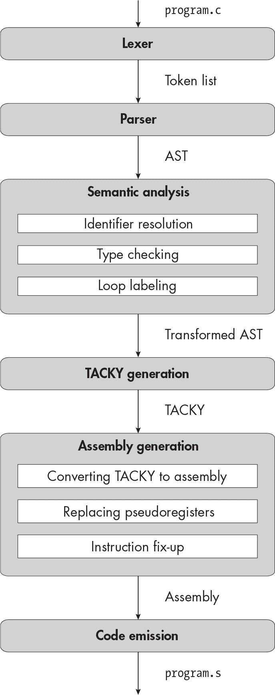
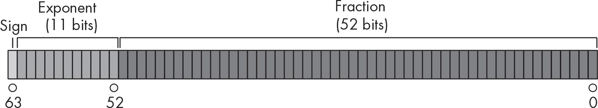
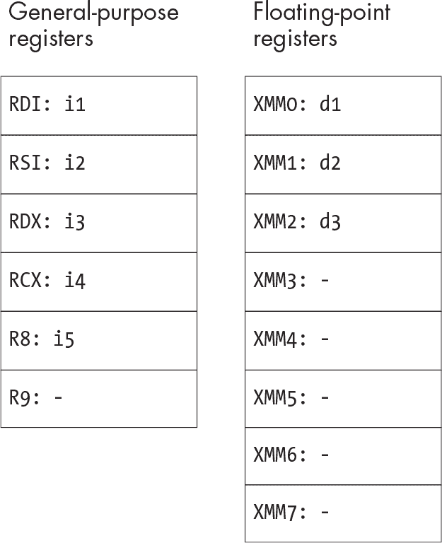
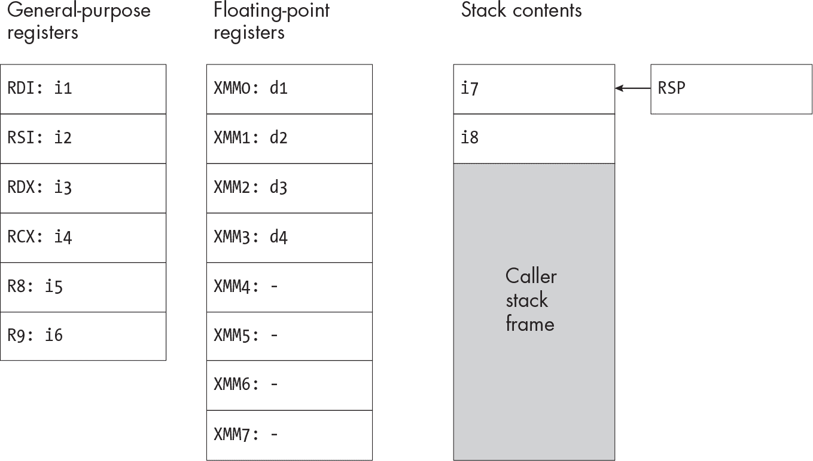
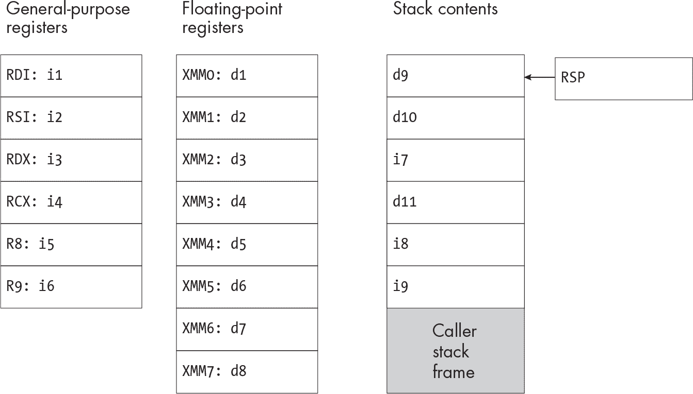
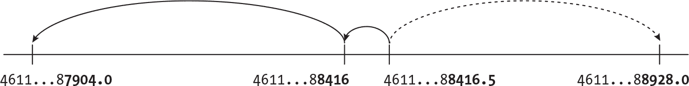
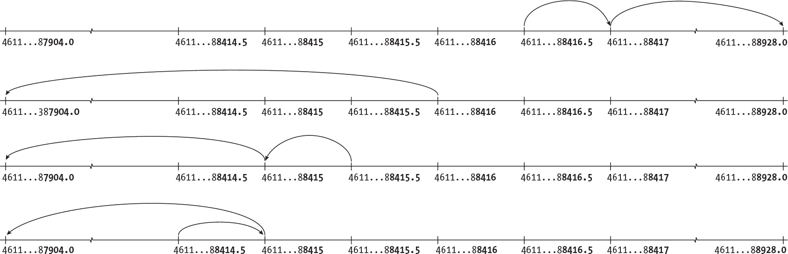

<samp class="SANS_Futura_Std_Book_Oblique_I_11">描述</samp>

<hgroup>

## <samp class="SANS_Futura_Std_Bold_Condensed_B_11">13</samp> <samp class="SANS_Dogma_OT_Bold_B_11">浮动点数字</samp>

</hgroup>


你的编译器现在支持四种不同的整数类型，但它仍然不支持非整数值。它也不支持超出<samp class="SANS_TheSansMonoCd_W5Regular_11">long</samp>和<samp class="SANS_TheSansMonoCd_W5Regular_11">unsigned long</samp>范围的值。在本章中，你将通过实现<samp class="SANS_TheSansMonoCd_W5Regular_11">double</samp>类型来解决这些不足。此类型使用*浮动点*二进制表示法，与我们目前看到的有符号和无符号整数表示法完全不同。C 标准还定义了另外两种浮动点类型，<samp class="SANS_TheSansMonoCd_W5Regular_11">float</samp>和<samp class="SANS_TheSansMonoCd_W5Regular_11">long double</samp>，但我们在本书中不会实现它们。

本章将有两个主要任务。第一个任务是弄清楚我们到底要实现什么行为。我们不能仅仅检查 C 标准，因为许多浮动点行为是由实现定义的。相反，我们将参考另一个标准——*IEEE 754*，以填补 C 标准未指定的大部分细节。我们的第二个主要任务是生成汇编代码；我们将需要一整套新的专用汇编指令和寄存器来处理浮动点数字。

我们将从快速了解 IEEE 754 标准开始，该标准定义了<samp class="SANS_TheSansMonoCd_W5Regular_11">double</samp>的二进制格式以及浮动点行为的其他方面。接下来，我们将考虑浮动点操作中可能引入舍入误差的所有方式，并决定我们的实现将如何处理这些误差。我们不会覆盖浮动点算术的每个方面，但你可以在“附加资源”中找到指向标准本身的链接，以及对 IEEE 754、舍入误差和浮动点行为其他方面的更全面的解释，链接在 343 页。

### <samp class="SANS_Futura_Std_Bold_B_11">IEEE 754，它有什么用？</samp>

IEEE 754 标准指定了几种浮点格式以及如何处理它们。它定义了一组浮点运算，包括基本的算术运算、转换和比较。它还定义了几种舍入模式，控制这些运算结果如何舍入，并定义了各种浮点异常，如溢出和除零错误。该标准可以作为实现浮点运算的任何系统的规范，无论该系统是处理器还是高级编程语言。在处理器中，所需的操作通常作为机器指令实现。在大多数编程语言中，包括 C，一些 IEEE 754 操作作为基本运算符，如 <samp class="SANS_TheSansMonoCd_W5Regular_11">+</samp> 和 <samp class="SANS_TheSansMonoCd_W5Regular_11">-</samp>，而其他操作则作为标准库函数实现。

几乎所有现代编程语言都以 IEEE 754 格式表示浮点数（因为它们运行在使用该格式的硬件上），但它们对标准的其他方面支持的程度各不相同。例如，并非所有编程语言都允许你检测浮点异常或使用非默认舍入模式。

理论上，你可以在不使用 IEEE 754 的情况下实现 C 语言；C 标准并没有规定如何表示 <samp class="SANS_TheSansMonoCd_W5Regular_11">double</samp> 和其他浮点类型。然而，标准的设计是与 IEEE 754 兼容的。C 标准的附录 F 是一个可选部分，规定了如何完全支持 IEEE 754，并明确将 C 类型、操作和宏与其 IEEE 754 等效项绑定。（注意，标准中提到的“IEC 60559”其实就是 IEEE 754 的另一个名称。）

虽然 C 标准并没有指定如何表示浮点类型，但 System V x64 ABI 却有明确要求。遵循此 ABI 的实现，包括我们的实现，必须将这些类型表示为 IEEE 754 格式。然而，ABI 并没有处理 IEEE 754 的其他方面。

大多数 C 实现提供命令行选项，精确控制它们遵循 IEEE 754 的严格程度。我们的编译器将不提供这些选项；相反，它将大致匹配 Clang 和 GCC 的默认行为。这意味着我们将根据 IEEE 754 实现数学浮点运算，并正确处理大多数特殊值，但我们将忽略浮点异常和非默认舍入模式。

在接下来的几节中，我将讨论你在编写编译器时需要了解的 IEEE 754 的部分内容。我不会讨论底层硬件（如加法和减法）或 C 标准库中的操作（如平方根和余数）。你不需要了解它们的详细规格，因为这些操作已经为你处理好了。但你 *确实* 需要了解 IEEE 754 数字的二进制格式，所以我们将从这一部分开始。

### <samp class="SANS_Futura_Std_Bold_B_11">IEEE 754 双精度格式</samp>

系统 V x64 ABI 告诉我们要使用 IEEE 754 *双精度* 格式表示 <samp class="SANS_TheSansMonoCd_W5Regular_11">double</samp>，该格式宽度为 64 位。图 13-1 说明了该格式。（此图经过轻微修改，来源于 *[`<wbr>en<wbr>.wikipedia<wbr>.org<wbr>/wiki<wbr>/Double<wbr>-precision<wbr>_floating<wbr>-point<wbr>_format`](https://en.wikipedia.org/wiki/Double-precision_floating-point_format)*。）



<samp class="SANS_Futura_Std_Book_Oblique_I_11">图 13-1：IEEE 754 双精度浮点格式 描述</samp>

双精度浮点格式有三个字段：符号位、指数字段和尾数字段。这些字段分别编码三个值：符号 *s*，指数 *e* 和尾数 *f*。（有时 *f* 被称为 *尾数*，而不是 significand。）这种格式的数字的值为 (–1)*^s* × *f* × 2*^e*，除了一些特殊情况，我们稍后会讨论这些情况。

尾数 *f* 是一个 *二进制分数*，类似于十进制数。在十进制数中，小数点左侧的数字（*整数部分*）表示非负的 10 的幂，而右侧的数字（*小数部分*）表示负的 10 的幂：1/10、1/100 等。类似地，二进制分数中整数部分的每一位代表 2 的非负幂，如 1、2、4 或 8，而小数部分的每一位代表 2 的负幂，如 1/2、1/4 或 1/8。

*f* 的整数部分始终为 1；52 位的尾数字段仅编码小数部分。这意味着 *f* 的值始终大于或等于 1 且小于 2。例如，尾数字段

```
1000000000000000000000000000000000000000000000000000
```

表示 *f* 的小数部分是 0.1，因此 *f* 的整体值是二进制分数 1.1，在十进制表示中为 1.5。隐含的前导 1 使得 52 位的尾数字段可以表示最长达 53 位的二进制分数。

*e* 的值在 –1,022 和 1,023 之间。指数字段使用 *偏移* 编码：我们将该字段中的 11 位解读为无符号整数，然后减去 1,023 得到 *e* 的值。例如，假设该字段有以下位：

```
00000000010
```

将这些位解释为普通无符号整数时，它们表示数字 2。因此，指数 *e* 的值为 2 – 1,023，即 –1,021。当指数域全为 1 或全为 0 时，表示我们稍后将讨论的某些特殊值。

由于 *f* 总是正数，如果符号位为 1，则整个浮点数为负数；如果符号位为 0，则为正数。本质上，浮点数让我们用科学记数法表示数字，但使用的是 2 的幂而不是 10 的幂。

IEEE 754 标准还定义了一些特殊值，它们的解释与普通浮点数不同：

**零和负零**

如果一个浮点数的所有位都是零，它的值是 <samp class="SANS_TheSansMonoCd_W5Regular_11">0.0</samp>。如果它的所有位都是零，除了符号位外，它的值是 <samp class="SANS_TheSansMonoCd_W5Regular_11">-0.0</samp>。这个值与 <samp class="SANS_TheSansMonoCd_W5Regular_11">0.0</samp> 相等，但遵循常规规则来确定算术结果的符号。例如，<samp class="SANS_TheSansMonoCd_W5Regular_11">-1.0 * 0.0</samp> 和 <samp class="SANS_TheSansMonoCd_W5Regular_11">1.0 * -0.0</samp> 都计算为 <samp class="SANS_TheSansMonoCd_W5Regular_11">-0.0</samp>。

**次正规数**

如我们刚才所见，大多数浮点数的有效数字在 1 和 2 之间。我们称这些数值为*正规化*的。标准化的 <samp class="SANS_TheSansMonoCd_W5Regular_11">double</samp> 所能表示的最小幅度是 1 × 2^(-1,022)，因为最小指数为 –1,022。在*次正规数*中，有效数字小于 1，这使得我们能够表示更接近零的值。一个全零的指数域表示该数字是次正规数，因此它的指数为 –1,022，有效数字的整数部分为 0，而不是 1。次正规数在硬件中比正规化数要慢得多，因此一些 C 语言实现允许用户禁用次正规数，并将任何次正规结果四舍五入为零。

**无限**

在另一端，标准化的 <samp class="SANS_TheSansMonoCd_W5Regular_11">double</samp> 所能表示的最大幅度是有效数字的最大值（接近 2）乘以 2^(1,023)。任何更大的数值都会被四舍五入为无限大。将非零数除以零的结果也是无限大。IEEE 标准定义了正无穷和负无穷；例如，表达式 <samp class="SANS_TheSansMonoCd_W5Regular_11">-1.0 / 0.0</samp> 计算为负无穷大。一个指数全为 1 且分数域全为 0 的数值表示无限大。符号位指示它是正无穷还是负无穷。

**NaN**

NaN 是*非数字*（not-a-number）的缩写。一些操作，包括<samp class="SANS_TheSansMonoCd_W5Regular_11">0.0 / 0.0</samp>，会产生 NaN。IEEE 754 标准定义了*信号 NaN*，如果你尝试使用它们会引发异常，和*安静 NaN*，它们则不会。一个指数全为 1 且分数域非零的数字表示 NaN。

我们将支持所有这些值，除了 NaN。安静的 NaN 是额外的附加功能，因为在比较中正确处理它们需要一些额外的工作。我们可以支持负零、次正规数和无穷大，而不需要额外的工作；处理器将为我们处理这些。

除了双精度格式，IEEE 754 还定义了几个我们不会使用的浮点格式，包括*单精度*，对应于<samp class="SANS_TheSansMonoCd_W5Regular_11">float</samp>，以及*双扩展精度*，通常对应于<samp class="SANS_TheSansMonoCd_W5Regular_11">long double</samp>。这些格式包括与双精度相同的三个字段，使用相同的公式来确定浮点数的值，并具有相同的特殊值；它们只是具有不同的位宽。

### <samp class="SANS_Futura_Std_Bold_B_11">舍入行为</samp>

你不能准确地表示每一个实数作为<samp class="SANS_TheSansMonoCd_W5Regular_11">double</samp>。实数是无限的，而<samp class="SANS_TheSansMonoCd_W5Regular_11">double</samp>只有 64 位。我们并不特别关心*所有*的实数；我们只关心在 C 程序中出现的数字。不幸的是，<samp class="SANS_TheSansMonoCd_W5Regular_11">double</samp>也不能准确地表示大多数这些数字，所以我们需要对它们进行舍入。让我们首先看看 IEEE 754 是如何告诉我们将实数舍入为<samp class="SANS_TheSansMonoCd_W5Regular_11">double</samp>的。然后，我们将讨论三种可能遇到舍入误差的情况：从十进制到二进制浮点数的常量转换、执行类型转换和进行算术操作时。

#### <samp class="SANS_Futura_Std_Bold_Condensed_Oblique_BI_11">舍入模式</samp>

IEEE 754 定义了几种不同的舍入模式，包括舍入到最接近值、舍入到零、舍入到正无穷大和舍入到负无穷大。现代处理器支持这四种舍入模式，并提供指令让程序更改当前的舍入模式。我们将仅支持默认的 IEEE 舍入模式，即 *舍入到最接近值，四舍五入时舍入偶数*。顾名思义，在这种模式下，结果的真实值总是舍入到最接近的可表示的 <samp class="SANS_TheSansMonoCd_W5Regular_11">double</samp>。 “舍入偶数”意味着如果结果恰好在两个可表示值之间，则舍入到最低有效位为 0 的那个值。我们将在将常量转换为浮点数、将整数类型转换为 <samp class="SANS_TheSansMonoCd_W5Regular_11">double</samp> 以及在算术操作中使用这种舍入模式。

#### <samp class="SANS_Futura_Std_Bold_Condensed_Oblique_BI_11">四舍五入常量</samp>

C 程序员通常使用十进制表示 <samp class="SANS_TheSansMonoCd_W5Regular_11">double</samp> 常量。在编译时，我们会将常量从十进制表示转换为双精度浮点表示。这个转换是不精确的，因为大多数十进制常量无法在二进制浮点中精确表示。例如，你无法在二进制浮点中表示十进制数 0.1，因为二进制小数的每一位代表 2 的幂次方，但你无法通过加起来的 2 的幂次方得到 0.1。如果 C 程序的源代码中包含常量 <samp class="SANS_TheSansMonoCd_W5Regular_11">0.1</samp>，编译器会将这个常量四舍五入为 列表 13-1 中的值，这个值是我们可以表示为 <samp class="SANS_TheSansMonoCd_W5Regular_11">double</samp> 类型的最接近值。

```
0.1000000000000000055511151231257827021181583404541015625
```

<samp class="SANS_Futura_Std_Book_Oblique_I_11">列表 13-1：最接近</samp> <samp class="SANS_Futura_Std_Book_Oblique_I_11">double</samp> <samp class="SANS_Futura_Std_Book_Oblique_I_11">到 0.1 的十进制表示</samp>

与 0.1 不同，这个值可以精确表示为一个 53 位的二进制小数乘以 2 的某个幂，如 列表 13-2 中所示。

```
1.100110011001100110011001100110011001100110011001101 * 2^-4
```

<samp class="SANS_Futura_Std_Book_Oblique_I_11">列表 13-2：最接近</samp> <samp class="SANS_Futura_Std_Book_Oblique_I_11">double</samp> <samp class="SANS_Futura_Std_Book_Oblique_I_11">到 0.1 的二进制表示</samp>

将 0.1 表示为 <samp class="SANS_TheSansMonoCd_W5Regular_11">double</samp> 类似于尝试用十进制表示 1/3；因为你无法将其分解为 10 的幂，所以无法用任何数量的小数位精确表示它。相反，你必须将 1/3 四舍五入为你可以在可用空间中表示的最接近值。例如，一个最多可以显示四位数字的计算器会将 1/3 显示为 <samp class="SANS_TheSansMonoCd_W5Regular_11">.3333</samp>。

> <samp class="SANS_Dogma_OT_Bold_B_39">注意</samp>

*IEEE 754 定义了几种*十进制浮动点*格式，这些格式能够表示十进制常数而不会出现这种舍入误差。这些格式将数字编码为十进制有效数字与 10 的幂相乘的形式。C23 包含了与这些格式对应的新十进制浮动点类型。*

#### <samp class="SANS_Futura_Std_Bold_Condensed_Oblique_BI_11">舍入类型转换</samp>

在将整数转换为<​samp class="SANS_TheSansMonoCd_W5Regular_11">double</samp>时，我们也可能需要进行舍入。这个问题产生的原因是<​samp class="SANS_TheSansMonoCd_W5Regular_11">double</samp>能够表示的值之间的间距。随着值的大小增加，表示值之间的间距也变得更大。到了一定程度，间距变得大于 1，这意味着你无法表示该范围内的所有整数。为了说明这个问题，让我们假设一个精度为三位数的十进制格式。这个格式可以表示任何小于 1000 的整数；例如，我们可以将 992 和 993 分别表示为 9.92 × 10²和 9.93 × 10²。但它无法表示大于 1000 的每个整数。我们可以将 1000 精确表示为 1.00 × 10³，但下一个可表示的值是 1.01 × 10³，或 1010；之间有 10 的间距。一旦达到 10,000，这个间距将增大到 100，并且在更大的数值下，间距会继续增长。当从<​samp class="SANS_TheSansMonoCd_W5Regular_11">long</samp>或<​samp class="SANS_TheSansMonoCd_W5Regular_11">unsigned long</samp>转换为<​samp class="SANS_TheSansMonoCd_W5Regular_11">double</samp>时，我们会遇到完全相同的问题。<​samp class="SANS_TheSansMonoCd_W5Regular_11">double</samp>具有 53 位精度，因为有效数字是一个 53 位的二进制分数。然而，<​samp class="SANS_TheSansMonoCd_W5Regular_11">long</samp>或<​samp class="SANS_TheSansMonoCd_W5Regular_11">unsigned long</samp>具有 64 位精度。假设我们需要将<​samp class="SANS_TheSansMonoCd_W5Regular_11">9223372036854775803</samp>从<​samp class="SANS_TheSansMonoCd_W5Regular_11">long</samp>转换为<​samp class="SANS_TheSansMonoCd_W5Regular_11">double</samp>。这个<​samp class="SANS_TheSansMonoCd_W5Regular_11">long</samp>的二进制表示为：

```
111111111111111111111111111111111111111111111111111111111111011
```

这是 63 位，因此无法适应<​samp class="SANS_TheSansMonoCd_W5Regular_11">double</samp>的有效数字！我们需要将其舍入为最接近的<​samp class="SANS_TheSansMonoCd_W5Regular_11">double</samp>，即<​samp class="SANS_TheSansMonoCd_W5Regular_11">9223372036854775808.0</samp>，或 1 × 2⁶³。

#### <samp class="SANS_Futura_Std_Bold_Condensed_Oblique_BI_11">舍入算术操作</samp>

最后，我们可能需要对基本的浮点操作结果进行舍入，比如加法、减法和乘法。再次强调，这是因为可表示值之间的间隙。例如，让我们试着计算 993 + 45，使用上一节中的三位十进制格式。正确的结果是 1,038，但三位数无法表示它；我们需要将其舍入为 1.04 × 10³。除法也可能产生无法在任何精度下表示的值，就像 1 / 3 的结果无法用任何数量的十进制数字表示一样。幸运的是，我们基本上可以忽略这一类舍入误差；浮点算术的汇编指令会在没有额外努力的情况下正确地进行舍入。

现在你已经了解了 IEEE 754 格式的基础和需要实现的舍入行为，你可以开始着手编写编译器了。我们将从编译器驱动程序的修改开始。

### <samp class="SANS_Futura_Std_Bold_B_11">链接共享库</samp>

本章的测试套件使用了来自 <samp class="SANS_TheSansMonoCd_W5Regular_11"><math.h></samp> 的函数，这是标准数学库。我们将向编译器驱动程序添加一个新命令行选项，允许我们链接共享库，如 <samp class="SANS_TheSansMonoCd_W5Regular_11"><math.h></samp>。这个选项的形式是 <samp class="SANS_TheSansMonoCd_W5Regular_11">-l</samp><samp class="SANS_TheSansMonoCd_W5Regular_Italic_I_11"><lib></samp>，其中 <samp class="SANS_TheSansMonoCd_W5Regular_Italic_I_11"><lib></samp> 是库的名称。你应该将这个选项传递给 <samp class="SANS_TheSansMonoCd_W5Regular_11">gcc</samp> 命令来组装和链接程序，并将其放在命令中任何输入汇编文件的名称之后。例如，如果你的编译器是通过以下命令调用的

```
`./YOUR_COMPILER` /path/to/program.c -lm
```

它应该使用以下命令来组装和链接程序：

```
gcc /path/to/program.s -o /path/to/program -lm
```

如果你使用的是 macOS，你不需要添加这个新选项，因为标准数学库默认已经链接。不过，你可能还是希望添加这个选项，因为能够链接共享库通常是有用的。

### <samp class="SANS_Futura_Std_Bold_B_11">词法分析器</samp>

在本章中，你将引入两个新标记：

<samp class="SANS_TheSansMonoCd_W7Bold_B_11">double</samp> 一个关键字

**浮点常量** 使用科学计数法或包含小数点的常量

你还需要修改词法分析器识别常量标记的结束方式；这将影响新引入的浮点常量以及你已经支持的整数常量。

让我们先了解浮点常量的格式。然后，我们将看到如何识别常量的结束。最后，我们将为每个常量标记定义新的正则表达式。

#### <samp class="SANS_Futura_Std_Bold_Condensed_Oblique_BI_11">识别浮点常量标记</samp>

带有小数点的数字，如 <samp class="SANS_TheSansMonoCd_W5Regular_11">1.5</samp> 和 <samp class="SANS_TheSansMonoCd_W5Regular_11">.72</samp>，是有效的标记，表示浮点数。我们将包括小数点的数字序列称为 *分数常量*。分数常量可以包括没有小数位的点。例如，<samp class="SANS_TheSansMonoCd_W5Regular_11">1.</samp> 是一个有效的分数常量，值与 <samp class="SANS_TheSansMonoCd_W5Regular_11">1.0</samp> 相同。

浮点常量也可以用科学计数法表示。使用科学计数法的标记由以下部分组成：

+   一个尾数，它可以是一个整数或分数常量

+   一个大写或小写的 <samp class="SANS_TheSansMonoCd_W5Regular_11">E</samp>

+   一个指数，它是一个整数，前面可以有一个可选的 <samp class="SANS_TheSansMonoCd_W5Regular_11">+</samp> 或 <samp class="SANS_TheSansMonoCd_W5Regular_11">-</samp> 符号

<samp class="SANS_TheSansMonoCd_W5Regular_11">100E10</samp>、<samp class="SANS_TheSansMonoCd_W5Regular_11">.05e-2</samp> 和 <samp class="SANS_TheSansMonoCd_W5Regular_11">5.E+3</samp> 都是有效的浮点常量。这些常量都是十进制的，其指数是 10 的幂。例如，<samp class="SANS_TheSansMonoCd_W5Regular_11">5.E+3</samp> 是 5 × 10³，或者 5000。C 标准还定义了十六进制浮点常量，但我们不会实现它们。没有表示无穷大的常量。<samp class="SANS_TheSansMonoCd_W5Regular_11"><math.h></samp> 头文件定义了一个 <samp class="SANS_TheSansMonoCd_W5Regular_11">INFINITY</samp> 宏，它应该表示正无穷大常量，但我们的编译器无法包含这个头文件，因为它使用了 <samp class="SANS_TheSansMonoCd_W5Regular_11">float</samp>、<samp class="SANS_TheSansMonoCd_W5Regular_11">struct</samp> 以及其他我们不支持的语言特性。因此，我们不会支持这个宏（或者说，不支持 <samp class="SANS_TheSansMonoCd_W5Regular_11"><math.h></samp> 中定义的任何其他宏）。

编写一个正则表达式来匹配每个浮点常量有点棘手，所以让我们将其分解为几个步骤。列表 13-3 中的正则表达式匹配的是分数常量。

```
[0-9]*\.[0-9]+|[0-9]+\.
```

<samp class="SANS_Futura_Std_Book_Oblique_I_11">列表 13-3：分数常量的正则表达式</samp>

这个正则表达式的第一部分，<samp class="SANS_TheSansMonoCd_W5Regular_11">[0-9]*\.[0-9]+</samp>，匹配任何小数点后有数字的常量，比如<samp class="SANS_TheSansMonoCd_W5Regular_11">.03</samp>或<samp class="SANS_TheSansMonoCd_W5Regular_11">3.14</samp>。<samp class="SANS_TheSansMonoCd_W5Regular_11">|</samp>后面的部分匹配像<samp class="SANS_TheSansMonoCd_W5Regular_11">3.</samp>这样的常量，即小数点后没有数字。列表 13-4 定义了一个类似的正则表达式，用来匹配科学计数法中常量的有效数值。

```
[0-9]*\.[0-9]+|[0-9]+\.?
```

<samp class="SANS_Futura_Std_Book_Oblique_I_11">列表 13-4：科学计数法中常量有效数值的正则表达式</samp>

与列表 13-3 的唯一不同之处在于，第二个子句中的尾随小数点是可选的，因此它既能匹配整数，也能匹配带尾随小数点的分数常量。

我们将使用列表 13-5 中的正则表达式来匹配浮点常量的指数部分。

```
[Ee][+-]?[0-9]+
```

<samp class="SANS_Futura_Std_Book_Oblique_I_11">列表 13-5：科学计数法中常量指数部分的正则表达式</samp>

这个正则表达式包括大小写不敏感的<samp class="SANS_TheSansMonoCd_W5Regular_11">E</samp>，表示指数的开始，一个可选符号和指数的整数值。为了匹配任何浮点常量，我们将组合一个巨大的正则表达式，其形式为<samp class="SANS_TheSansMonoCd_W5Regular_Italic_I_11"><列表 13-4> <列表 13-5></samp> <samp class="SANS_TheSansMonoCd_W5Regular_11">|</samp> <samp class="SANS_TheSansMonoCd_W5Regular_Italic_I_11"><列表 13-3></samp>，这给出了列表 13-6。

```
([0-9]*\.[0-9]+|[0-9]+\.?)[Ee][+-]?[0-9]+|[0-9]*\.[0-9]+|[0-9]+\.
```

<samp class="SANS_Futura_Std_Book_Oblique_I_11">列表 13-6：匹配浮点常量每个部分的正则表达式</samp>

换句话说，浮点常量要么是一个尾随指数的有效数值，要么是一个分数常量。不过，列表 13-6 并不完全：我们还需要一个额外的组件来匹配该标记的结束与下一个标记开始之间的边界。

#### <samp class="SANS_Futura_Std_Bold_Condensed_Oblique_BI_11">匹配常量的结尾</samp>

直到现在，我们一直要求常量以单词边界结束。例如，给定字符串 <samp class="SANS_TheSansMonoCd_W5Regular_11">123foo</samp>，我们不会接受子字符串 <samp class="SANS_TheSansMonoCd_W5Regular_11">123</samp> 作为常量。现在我们将添加另一个要求：常量符号后面不能紧跟一个句点。这意味着，例如，词法分析器将识别字符串 <samp class="SANS_TheSansMonoCd_W5Regular_11">123L;</samp> 的开始部分作为长整型常量符号 <samp class="SANS_TheSansMonoCd_W5Regular_11">123L</samp>，但它会拒绝字符串 <samp class="SANS_TheSansMonoCd_W5Regular_11">123L.bar;</samp> 作为格式错误。同样，词法分析器将接受字符串 <samp class="SANS_TheSansMonoCd_W5Regular_11">1.0+x</samp>，但拒绝 <samp class="SANS_TheSansMonoCd_W5Regular_11">1.0.+x</samp>，并且它会接受 <samp class="SANS_TheSansMonoCd_W5Regular_11">1.}</samp>，但拒绝 <samp class="SANS_TheSansMonoCd_W5Regular_11">1..}</samp>。请注意，像 <samp class="SANS_TheSansMonoCd_W5Regular_11">1.</samp> 这样的浮点常量的最后一个字符可以是句点，但常量*之后*的第一个字符不能是句点。

> <samp class="SANS_Dogma_OT_Bold_B_39">注意</samp>

*如果你对这个要求在 C 标准中的来源感到好奇，可以查看第 6.4.8 节中对预处理数字的定义、第 5.1.1.2 节中关于翻译阶段的列表，以及第 6.4 节第 3 段中关于符号和预处理符号的讨论。这些章节描述了一个多阶段过程，用于将源文件划分为预处理符号，然后将它们转换为符号。我们并不完全遵循这个过程，但我们定义了每个符号的方式，以便在我们支持的 C 子集上产生相同的结果。*

为了强制执行这个新要求，我们将在每个常量符号的正则表达式末尾使用 <samp class="SANS_TheSansMonoCd_W5Regular_11">[^\w.]</samp> 字符类，而不是特殊的单词边界字符 <samp class="SANS_TheSansMonoCd_W5Regular_11">\b</samp>。<samp class="SANS_TheSansMonoCd_W5Regular_11">[^\w.]</samp> 字符类匹配任何单个字符，除了单词字符（字母、数字或下划线）或句点。这个单一的非单词、非句点字符标记了常量的结束，但不属于常量本身，因此我们将在每个正则表达式中定义一个捕获组来匹配实际的常量。

例如，我们之前用于有符号整型常量的正则表达式是 <samp class="SANS_TheSansMonoCd_W5Regular_11">[0-9]+\b</samp>。我们的新正则表达式是 <samp class="SANS_TheSansMonoCd_W5Regular_11">([0-9]+)[\w.]</samp>。这个正则表达式匹配整个字符串 <samp class="SANS_TheSansMonoCd_W5Regular_11">100;</samp>，包括结尾的 <samp class="SANS_TheSansMonoCd_W5Regular_11">;</samp>。捕获组 <samp class="SANS_TheSansMonoCd_W5Regular_11">([0-9]+)</samp> 只匹配常量 <samp class="SANS_TheSansMonoCd_W5Regular_11">100</samp>，而不包括最终的 <samp class="SANS_TheSansMonoCd_W5Regular_11">;</samp> 字符。每当词法分析器识别到一个常量时，它应该只消耗输入中的常量本身，而不是紧随其后的字符。

在清单 13-7 中，我们最终定义了整个正则表达式来识别浮点常量。

```
(([0-9]*\.[0-9]+|[0-9]+\.?)[Ee][+-]?[0-9]+|[0-9]*\.[0-9]+|[0-9]+\.)[^\w.]
```

<samp class="SANS_Futura_Std_Book_Oblique_I_11">清单 13-7：识别浮点常量的完整正则表达式</samp>

这只是我们在清单 13-6 中定义的正则表达式，用括号括起来形成捕获组，并跟随 <samp class="SANS_TheSansMonoCd_W5Regular_11">[^\w.]</samp> 字符类。

表 13-1 定义了所有常量标记的新正则表达式。

<samp class="SANS_Futura_Std_Heavy_B_11">表 13-1:</samp> <samp class="SANS_Futura_Std_Book_11">常量标记的正则表达式</samp>

| <samp class="SANS_Futura_Std_Heavy_B_11">标记</samp> | <samp class="SANS_Futura_Std_Heavy_B_11">正则表达式</samp> |
| --- | --- |
| <samp class="SANS_Futura_Std_Book_11">有符号整型常量</samp> | <samp class="SANS_TheSansMonoCd_W5Regular_11">([0-9]+)[^\w.]</samp> |
| <samp class="SANS_Futura_Std_Book_11">无符号整型常量</samp> | <samp class="SANS_TheSansMonoCd_W5Regular_11">([0-9]+[uU])[^\w.]</samp> |
| <samp class="SANS_Futura_Std_Book_11">有符号长整型常量</samp> | <samp class="SANS_TheSansMonoCd_W5Regular_11">([0-9]+[lL])[^\w.]</samp> |
| <samp class="SANS_Futura_Std_Book_11">无符号长整型常量</samp> | <samp class="SANS_TheSansMonoCd_W5Regular_11">([0-9]+([lL][uU]&#124;[uU][lL]))[^\w.]</samp> |
| <samp class="SANS_Futura_Std_Book_11">浮点常量</samp> | <samp class="SANS_TheSansMonoCd_W5Regular_11">(([0-9]*\.[0-9]+&#124;[0-9]+\.?)[Ee][+-]?[0-9]+&#124;[0-9]*\.[0-9]+&#124;[0-9]+\.)[^\w.]</samp> |

继续添加新的浮点常量标记，并更新你如何识别前面章节中的常量标记。别忘了也要添加 <samp class="SANS_TheSansMonoCd_W5Regular_11">double</samp> 关键字！

### <samp class="SANS_Futura_Std_Bold_B_11">解析器</samp>

解析器的更改相对有限。清单 13-8 给出了更新后的 AST，其中包含了 <samp class="SANS_TheSansMonoCd_W5Regular_11">double</samp> 类型和浮点常量。

```
program = Program(declaration*)
declaration = FunDecl(function_declaration) | VarDecl(variable_declaration)
variable_declaration = (identifier name, exp? init,
                        type var_type, storage_class?)
function_declaration = (identifier name, identifier* params, block? body,
                        type fun_type, storage_class?)
type = Int | Long | UInt | ULong | **Double |** FunType(type* params, type ret)
storage_class = Static | Extern
block_item = S(statement) | D(declaration)
block = Block(block_item*)
for_init = InitDecl(variable_declaration) | InitExp(exp?)
statement = Return(exp)
          | Expression(exp)
          | If(exp condition, statement then, statement? else)
          | Compound(block)
          | Break
          | Continue
          | While(exp condition, statement body)
          | DoWhile(statement body, exp condition)
          | For(for_init init, exp? condition, exp? post, statement body)
          | Null
exp = Constant(const)
    | Var(identifier)
    | Cast(type target_type, exp)
    | Unary(unary_operator, exp)
    | Binary(binary_operator, exp, exp)
    | Assignment(exp, exp)
    | Conditional(exp condition, exp, exp)
    | FunctionCall(identifier, exp* args)
unary_operator = Complement | Negate | Not
binary_operator = Add | Subtract | Multiply | Divide | Remainder | And | Or
                | Equal | NotEqual | LessThan | LessOrEqual
                | GreaterThan | GreaterOrEqual
const = ConstInt(int) | ConstLong(int)
      | ConstUInt(int) | ConstULong(int)
 **| ConstDouble(double)**
```

<samp class="SANS_Futura_Std_Book_Oblique_I_11">清单 13-8：带有</samp> <samp class="SANS_Futura_Std_Book_Oblique_I_11">double</samp> <samp class="SANS_Futura_Std_Book_Oblique_I_11">类型和浮点常量的抽象语法树</samp>

你的 AST 应该使用双精度浮点格式表示 <samp class="SANS_TheSansMonoCd_W5Regular_11">double</samp> 常量，因为它们在运行时就是以这种格式表示的。你需要查找在你的实现语言中，哪种类型使用这种格式。如果你使用的表示方式比 <samp class="SANS_TheSansMonoCd_W5Regular_11">double</samp> 精度低，你可能无法准确表示源代码中每个常量最接近的 <samp class="SANS_TheSansMonoCd_W5Regular_11">double</samp> 值，从而导致编译后的程序中常量的四舍五入错误。

令人惊讶的是，使用比 <samp class="SANS_TheSansMonoCd_W5Regular_11">double</samp> 精度更高的格式存储常量也可能会导致问题。将浮点数存储为更高精度的格式后，再将其四舍五入到较低精度的格式，可能会产生与直接四舍五入一次不同的结果。这种现象被称为 *双重四舍五入误差*。（这里的 *double* 指的是两次四舍五入，而不是 <samp class="SANS_TheSansMonoCd_W5Regular_11">double</samp> 类型。）我们将在生成汇编代码时更深入地探讨双重四舍五入误差。

更新 AST 后，我们将对语法做出相应的更改。清单 13-9 显示了包含这些更改的完整语法，已将更改部分加粗。

```
<program> ::= {<declaration>}
<declaration> ::= <variable-declaration> | <function-declaration>
<variable-declaration> ::= {<specifier>}+ <identifier> ["=" <exp>] ";"
<function-declaration> ::= {<specifier>}+ <identifier> "(" <param-list> ")" (<block> | ";")
<param-list> ::= "void"
               | {<type-specifier>}+ <identifier> {"," {<type-specifier>}+ <identifier>}
<type-specifier> ::= "int" | "long" | "unsigned" | "signed" **| "double"**
<specifier> ::= <type-specifier> | "static" | "extern"
<block> ::= "{" {<block-item>} "}"
<block-item> ::= <statement> | <declaration>
<for-init> ::= <variable-declaration> | [<exp>] ";"
<statement> ::= "return" <exp> ";"
              | <exp> ";"
              | "if" "(" <exp> ")" <statement> ["else" <statement>]
              | <block>
              | "break" ";"
              | "continue" ";"
              | "while" "(" <exp> ")" <statement>
              | "do" <statement> "while" "(" <exp> ")" ";"
              | "for" "(" <for-init> [<exp>] ";" [<exp>] ")" <statement>
              | ";"
<exp> ::= <factor> | <exp> <binop> <exp> | <exp> "?" <exp> ":" <exp>
<factor> ::= <const> | <identifier>
           | "(" {<type-specifier>}+ ")" <factor>
           | <unop> <factor> | "(" <exp> ")"
           | <identifier> "(" [<argument-list>] ")"
<argument-list> ::= <exp> {"," <exp>}
<unop> ::= "-" | "~" | "!"
<binop> ::= "-" | "+" | "*" | "/" | "%" | "&&" | "||"
          | "==" | "!=" | "<" | "<=" | ">" | ">=" | "="
<const> ::= <int> | <long> | <uint> | <ulong> **| <double>**
<identifier> ::= ? An identifier token ?
<int> ::= ? An int token ?
<long> ::= ? An int or long token ?
<uint> ::= ? An unsigned int token ?
<ulong> ::= ? An unsigned int or unsigned long token ?
**<double> ::= ? A floating-point constant token ?**
```

<samp class="SANS_Futura_Std_Book_Oblique_I_11">清单 13-9：带有</samp> <samp class="SANS_Futura_Std_Book_Oblique_I_11">double</samp> <samp class="SANS_Futura_Std_Book_Oblique_I_11">类型说明符和浮点常量的语法</samp>

在过去的两章中，我们不得不处理许多不同的整数类型指定方式。幸运的是，指定 <samp class="SANS_TheSansMonoCd_W5Regular_11">double</samp> 类型只有一种方式：使用 <samp class="SANS_TheSansMonoCd_W5Regular_11">double</samp> 关键字。清单 13-10 演示了在处理类型说明符列表时如何处理 <samp class="SANS_TheSansMonoCd_W5Regular_11">double</samp>。

```
parse_type(specifier_list):
    if specifier_list == ["double"]:
        return Double
    if specifier_list contains "double":
        fail("Can't combine 'double' with other type specifiers")
 `--snip--`
```

<samp class="SANS_Futura_Std_Book_Oblique_I_11">清单 13-10：从类型说明符列表中确定类型</samp>

要么 <samp class="SANS_TheSansMonoCd_W5Regular_11">double</samp> 应该是列表中唯一的修饰符，要么根本不应该出现；它不能与 <samp class="SANS_TheSansMonoCd_W5Regular_11">long</samp>、<samp class="SANS_TheSansMonoCd_W5Regular_11">unsigned</samp> 或我们迄今为止引入的任何其他类型修饰符一起使用（然而，它可以与存储类修饰符如 <samp class="SANS_TheSansMonoCd_W5Regular_11">static</samp> 和 <samp class="SANS_TheSansMonoCd_W5Regular_11">extern</samp> 一起出现）。

接下来，我们将把浮点常量标记转换为抽象语法树（AST）中的常量。我们之前看到，大多数十进制常量在二进制浮点表示中无法精确表示，因此我们需要对它们进行四舍五入。根据 C 标准，这里的舍入方向是由实现决定的，不一定需要与运行时舍入模式匹配。我们在这里使用四舍五入模式，就像在其他地方一样。你的实现语言的内置字符串到浮点数转换工具应能正确处理此问题。

当我们解析整数常量时，需要确保它们在该类型可表示的范围内。然而，浮点常量不能超出范围。由于 <samp class="SANS_TheSansMonoCd_W5Regular_11">double</samp> 支持正无穷大和负无穷大，它的范围包括所有实数。因此，我们的解析器在解析 <samp class="SANS_TheSansMonoCd_W5Regular_11">double</samp> 常量时不会遇到任何错误。

### <samp class="SANS_Futura_Std_Bold_B_11">类型检查器</samp>

我们将进行一些修改，以便在类型检查器中考虑到 <samp class="SANS_TheSansMonoCd_W5Regular_11">double</samp>。首先，我们将确保用正确的类型注释 <samp class="SANS_TheSansMonoCd_W5Regular_11">double</samp> 常量。然后，我们将更新查找两个值的共同实数类型的方式。这里的规则很简单：如果任一值是 <samp class="SANS_TheSansMonoCd_W5Regular_11">double</samp>，那么共同实数类型就是 <samp class="SANS_TheSansMonoCd_W5Regular_11">double</samp>。列表 13-11 展示了如何更新 <samp class="SANS_TheSansMonoCd_W5Regular_11">get_common_type</samp> 辅助函数以处理 <samp class="SANS_TheSansMonoCd_W5Regular_11">double</samp>。

```
get_common_type(type1, type2):
    if type1 == type2:
        return type1
 **if type1 == Double or type2 == Double:**
 **return Double**
 `--snip--`
```

<samp class="SANS_Futura_Std_Book_Oblique_I_11">列表 13-11：查找两个值的共同实数类型</samp>

我们还需要检测一些新的类型错误。按位取反运算符 <samp class="SANS_TheSansMonoCd_W5Regular_11">~</samp> 和求余运算符 <samp class="SANS_TheSansMonoCd_W5Regular_11">%</samp> 只接受整数操作数。我们将验证这两个运算符在 <samp class="SANS_TheSansMonoCd_W5Regular_11">typecheck_exp</samp> 中的正确使用。列表 13-12 演示了如何对 <samp class="SANS_TheSansMonoCd_W5Regular_11">~</samp> 运算符进行类型检查。

```
typecheck_exp(e, symbols):
    match e with
  | `--snip--`
    | Unary(Complement, inner) ->
        typed_inner = typecheck_exp(inner, symbols)
      ❶ if get_type(typed_inner) == Double:
            fail("Can't take the bitwise complement of a double")
        unary_exp = Unary(Complement, typed_inner)
        return set_type(unary_exp, get_type(typed_inner))
```

<samp class="SANS_Futura_Std_Book_Oblique_I_11">列表 13-12：类型检查按位补码表达式</samp>

首先，我们对操作数进行类型检查。然后，我们验证操作数是否为整数❶。最后，我们用其结果的类型注解该表达式。只有验证步骤与早期章节不同。我们可以以类似的方式处理<samp class="SANS_TheSansMonoCd_W5Regular_11">%</samp>运算符。

为了总结类型检查器的变更，我们将处理类型为<samp class="SANS_TheSansMonoCd_W5Regular_11">double</samp>的静态变量。我们将为这些变量添加一种新的初始化器：

```
static_init = IntInit(int) | LongInit(int) | UIntInit(int) | ULongInit(int)
 **| DoubleInit(double)**
```

像往常一样，我们会将每个初始化器转换为它初始化的变量类型，使用在运行时应用的相同规则。C 标准要求我们在将<samp class="SANS_TheSansMonoCd_W5Regular_11">double</samp>转换为整数类型时进行向零截断。例如，我们会将<samp class="SANS_TheSansMonoCd_W5Regular_11">2.8</samp>转换为<samp class="SANS_TheSansMonoCd_W5Regular_11">2</samp>。如果截断后的值超出结果整数类型的范围，则结果是未定义的，因此你可以根据需要处理它。最干净的做法是直接抛出错误。

当我们将一个整数转换为<samp class="SANS_TheSansMonoCd_W5Regular_11">double</samp>时，如果它能够被精确表示，我们将保留其值。否则，我们将舍入到最接近的可表示值。你应该能够使用你所使用的实现语言的内置类型转换工具从<samp class="SANS_TheSansMonoCd_W5Regular_11">double</samp>转换为整数类型，反之亦然。

### <samp class="SANS_Futura_Std_Bold_B_11">TACKY 生成</samp>

在 TACKY 中，我们将添加一些新指令来处理<samp class="SANS_TheSansMonoCd_W5Regular_11">double</samp>和整数类型之间的转换。列表 13-13 给出了更新后的 TACKY IR。

```
program = Program(top_level*)
top_level = Function(identifier, bool global, identifier* params, instruction* body)
          | StaticVariable(identifier, bool global, type t, static_init init)
instruction = Return(val)
            | SignExtend(val src, val dst)
            | Truncate(val src, val dst)
            | ZeroExtend(val src, val dst)
            **| DoubleToInt(val src, val dst)**
            **| DoubleToUInt(val src, val dst)**
            **| IntToDouble(val src, val dst)**
            **| UIntToDouble(val src, val dst)**
            | Unary(unary_operator, val src, val dst)
            | Binary(binary_operator, val src1, val src2, val dst)
            | Copy(val src, val dst)
            | Jump(identifier target)
            | JumpIfZero(val condition, identifier target)
            | JumpIfNotZero(val condition, identifier target)
            | Label(identifier)
            | FunCall(identifier fun_name, val* args, val dst)
val = Constant(const) | Var(identifier)
unary_operator = Complement | Negate | Not
binary_operator = Add | Subtract | Multiply | Divide | Remainder | Equal | NotEqual
                | LessThan | LessOrEqual | GreaterThan | GreaterOrEqual
```

<samp class="SANS_Futura_Std_Book_Oblique_I_11">列表 13-13：在 TACKY 中添加 double 和整数类型之间的转换</samp>

列表 13-13 介绍了四条新指令，用于在<samp class="SANS_TheSansMonoCd_W5Regular_11">double</samp>和有符号与无符号整数类型之间转换：<samp class="SANS_TheSansMonoCd_W5Regular_11">DoubleToInt</samp>、<samp class="SANS_TheSansMonoCd_W5Regular_11">DoubleToUInt</samp>、<samp class="SANS_TheSansMonoCd_W5Regular_11">IntToDouble</samp>和<samp class="SANS_TheSansMonoCd_W5Regular_11">UIntToDouble</samp>。对于不同大小的整数操作数，我们没有不同的指令；例如，<samp class="SANS_TheSansMonoCd_W5Regular_11">DoubleToInt</samp>可以转换为<samp class="SANS_TheSansMonoCd_W5Regular_11">int</samp>或<samp class="SANS_TheSansMonoCd_W5Regular_11">long</samp>。

要更新 TACKY 生成通道，只需在遇到转换为或从 <samp class="SANS_TheSansMonoCd_W5Regular_11">double</samp> 时发出适当的转换指令。

### <samp class="SANS_Futura_Std_Bold_B_11">汇编中的浮点操作</samp>

在开始编写汇编生成通道之前，我们需要理解如何在汇编中处理浮点数。因为浮点数采用与有符号和无符号整数完全不同的二进制表示方式，我们不能使用现有的算术指令对它们进行操作。相反，我们将使用一组专用指令，称为*流式 SIMD 扩展（SSE）*指令。这个指令集包括对浮点值和整数的操作。它之所以得名，是因为它包含了*单指令，多数据（SIMD）*指令，这些指令在一个包含多个值的向量上同时执行相同的操作（或者在二元操作的情况下，在两个值向量上执行）。例如，一个 SIMD 加法指令，其操作数为两个元素向量 <samp class="SANS_TheSansMonoCd_W5Regular_11">[1.0, 2.0]</samp> 和 <samp class="SANS_TheSansMonoCd_W5Regular_11">[4.0, 6.0]</samp>，将分别将它们对应的元素相加，得到向量 <samp class="SANS_TheSansMonoCd_W5Regular_11">[5.0, 8.0]</samp>。

*SSE* 这个术语有点误导，因为只有一些 SSE 指令对向量执行 SIMD 操作。其他的则对单一值进行操作。当我们谈论 SSE 指令时，我们将向量称为*打包*操作数，而将单一值称为*标量*操作数。使用这些不同类型操作数的 SSE 指令分别被称为打包指令和标量指令。我们的实现将主要使用标量指令，尽管我们将需要一个打包指令。

SSE 指令最初作为 x86 指令集的扩展被引入；它们并非在每个 x86 处理器上都可用。随着时间的推移，新增了几组 SSE 指令，分别命名为 SSE2、SSE3 和 SSE4。SSE 和 SSE2 指令最终被纳入到核心 x64 指令集，因此在每个 x64 处理器上都可以使用。第一代浮点 SSE 指令只支持单精度操作数，这些操作数对应 C 语言中的 <samp class="SANS_TheSansMonoCd_W5Regular_11">float</samp> 类型。SSE2 添加了对双精度操作数的支持。由于我们正在处理双精度操作数，因此本章中我们将仅使用 SSE2 指令。

> <samp class="SANS_Dogma_OT_Bold_B_39">注意</samp>

*x64 和 x86 指令集包括一套较旧的浮点指令，这些指令最早是在英特尔 8087* 浮点单元（FPU）*中引入的，该单元是一个处理浮点运算的独立处理器。这些指令被称为* x87 *或* FPU 指令*（有时简称为*浮点指令*）。请注意，一些关于浮点汇编的资源—特别是较旧的资源—仅讨论 x87 指令，而不提及 SSE。*

就像我们已经熟悉的通用指令一样，SSE 指令也使用描述其操作数的后缀。对标量双精度值进行操作的指令使用 <samp class="SANS_TheSansMonoCd_W5Regular_11">sd</samp> 后缀。对打包双精度值进行操作的指令使用 <samp class="SANS_TheSansMonoCd_W5Regular_11">pd</samp> 后缀。标量和打包单精度指令分别使用 <samp class="SANS_TheSansMonoCd_W5Regular_11">ss</samp> 和 <samp class="SANS_TheSansMonoCd_W5Regular_11">ps</samp> 后缀。接下来的几节将介绍本章所需的 SSE 指令。

#### <samp class="SANS_Futura_Std_Bold_Condensed_Oblique_BI_11">使用 SSE 指令</samp>

SSE 指令和你在之前章节学习的汇编指令之间有两个主要区别。第一个区别是 SSE 指令使用一组单独的寄存器，称为 *XMM 寄存器*。共有 16 个 XMM 寄存器：XMM0、XMM1，以此类推，直到 XMM15。每个 XMM 寄存器的宽度为 128 位，但我们只会使用它们的低 64 位。从现在开始，我将所有非 XMM 寄存器（例如 RAX、RSP 等）称为 *通用寄存器*。SSE 指令不能使用通用寄存器，而非 SSE 指令也不能使用 XMM 寄存器。SSE 和非 SSE 指令都可以引用内存中的值。

第二个区别是 SSE 指令不能使用立即数操作数。如果我们需要在 SSE 指令中使用常量，我们将在只读内存中定义该常量。然后，可以通过 RIP 相对寻址访问该常量，就像访问静态变量一样。清单 13-14 计算 <samp class="SANS_TheSansMonoCd_W5Regular_11">1.0</samp> <samp class="SANS_TheSansMonoCd_W5Regular_11">+</samp> <samp class="SANS_TheSansMonoCd_W5Regular_11">1.0</samp> 的汇编示例，演示了如何使用 XMM 寄存器和浮点常量。

```
 .section .rodata
    .align 8
.L_one:
    .double 1.0
    .text
one_plus_one:
    movsd   .L_one(%rip), %xmm0
    addsd   .L_one(%rip), %xmm0
    `--snip--`
```

<samp class="SANS_Futura_Std_Book_Oblique_I_11">清单 13-14：计算</samp> <samp class="SANS_Futura_Std_Book_Oblique_I_11">1.0 + 1.0</samp> <samp class="SANS_Futura_Std_Book_Oblique_I_11">在汇编中</samp>

在清单的开头，我们定义了常量 <samp class="SANS_TheSansMonoCd_W5Regular_11">1.0</samp>。我们几乎可以像定义静态变量一样定义并初始化这个常量。关键的不同之处在于，我们并不把这个值存储在数据或 BSS 段中；相反，我们使用 <samp class="SANS_TheSansMonoCd_W5Regular_11">.section .rodata</samp> 指令将它放在 *只读数据段* 中。顾名思义，程序在运行时可以从这个段读取数据，但不能写入数据。

<samp class="SANS_TheSansMonoCd_W5Regular_11">.section</samp> 指令可以用来写入任何段。我们在这里使用它，因为我们没有专门的指令来写入只读数据段，正如我们有专门的 <samp class="SANS_TheSansMonoCd_W5Regular_11">.text</samp>、<samp class="SANS_TheSansMonoCd_W5Regular_11">.bss</samp> 和 <samp class="SANS_TheSansMonoCd_W5Regular_11">.data</samp> 指令一样。在 macOS 使用的目标文件格式中，有几个只读数据段；我们将使用 <samp class="SANS_TheSansMonoCd_W5Regular_11">.literal8</samp> 指令来写入包含 8 字节常量的段。

我们使用了一个新指令 <samp class="SANS_TheSansMonoCd_W5Regular_11">.double</samp>，将标记为 <samp class="SANS_TheSansMonoCd_W5Regular_11">.L_one</samp> 的内存地址初始化为浮点值 <samp class="SANS_TheSansMonoCd_W5Regular_11">1.0</samp>。<samp class="SANS_TheSansMonoCd_W5Regular_11">.L</samp> 前缀使得 <samp class="SANS_TheSansMonoCd_W5Regular_11">.L_one</samp> 成为一个局部标签。正如你在第四章中学到的，局部标签会在目标文件的符号表中被省略。编译器通常使用局部标签来表示浮点常量。

现在我们已经定义了所需的数据，让我们看看汇编函数 <samp class="SANS_TheSansMonoCd_W5Regular_11">one_plus_one</samp> 的开头。第一条指令，<samp class="SANS_TheSansMonoCd_W5Regular_11">movsd .L_one(%rip), %xmm0</samp>，将常量 <samp class="SANS_TheSansMonoCd_W5Regular_11">1.0</samp> 从内存复制到 XMM0 寄存器。<samp class="SANS_TheSansMonoCd_W5Regular_11">movsd</samp> 指令与 <samp class="SANS_TheSansMonoCd_W5Regular_11">mov</samp> 指令类似，都是将数据从一个位置复制到另一个位置。我们将使用 <samp class="SANS_TheSansMonoCd_W5Regular_11">movsd</samp> 在 XMM 寄存器之间，或在 XMM 寄存器与内存之间复制值。

最后，我们使用 <samp class="SANS_TheSansMonoCd_W5Regular_11">addsd</samp> 指令执行浮点加法。该指令将 <samp class="SANS_TheSansMonoCd_W5Regular_11">.L_one</samp> 中的常量加到 XMM0 中的值，并将结果存储回 XMM0。<samp class="SANS_TheSansMonoCd_W5Regular_11">addsd</samp> 的源可以是一个 XMM 寄存器或一个内存地址，目标必须是一个 XMM 寄存器。

现在你已经对如何使用 SSE 指令有了一个高级的了解，我们来深入探讨一些具体的内容。首先，我们将探索 System V 调用约定如何处理浮点函数参数和返回值。接着，我们将讲解如何在汇编中实现个别浮点操作，例如算术运算、比较和类型转换。到那时，你将最终准备好为你的编译器后端添加浮点支持。

#### <samp class="SANS_Futura_Std_Bold_Condensed_Oblique_BI_11">在 System V 调用约定中使用浮点值</samp>

在第九章中，你学习了函数的前六个参数是通过通用寄存器传递的，而返回值是通过 EAX 寄存器（或 RAX，具体取决于其大小）传递的。System V 调用约定处理浮点值的方式稍有不同：它们是通过 XMM 寄存器而不是通用寄存器传递和返回的。

函数的前八个浮点参数是通过寄存器 XMM0 到 XMM7 传递的。任何剩余的浮点参数都会按反向顺序压入堆栈，就像整数参数一样。浮点返回值通过 XMM0 传递，而不是 RAX。考虑清单 13-15 中的函数，它接受两个<samp class="SANS_TheSansMonoCd_W5Regular_11">double</samp>参数，将它们相加并返回结果。

```
double add_double(double a, double b) {
    return a + b;
}
```

<samp class="SANS_Futura_Std_Book_Oblique_I_11">清单 13-15：添加两个</samp> <samp class="SANS_Futura_Std_Book_Oblique_I_11">double</samp> <samp class="SANS_Futura_Std_Book_Oblique_I_11">参数</samp>

我们可以将这个函数编译成清单 13-16 中的汇编代码。

```
 .text
    .globl add_double
add_double:
    addsd   %xmm1, %xmm0
    ret
```

<samp class="SANS_Futura_Std_Book_Oblique_I_11">清单 13-16：</samp> <samp class="SANS_Futura_Std_Book_Oblique_I_11">add_double</samp> <samp class="SANS_Futura_Std_Book_Oblique_I_11">在汇编中的实现</samp>

根据 System V 调用约定，参数<samp class="SANS_TheSansMonoCd_W5Regular_11">a</samp>和<samp class="SANS_TheSansMonoCd_W5Regular_11">b</samp>将分别通过寄存器 XMM0 和 XMM1 传递。因此，指令<samp class="SANS_TheSansMonoCd_W5Regular_11">addsd %xmm1, %xmm0</samp>将会把<samp class="SANS_TheSansMonoCd_W5Regular_11">b</samp>加到<samp class="SANS_TheSansMonoCd_W5Regular_11">a</samp>上，并将结果存储在 XMM0 中。由于<samp class="SANS_TheSansMonoCd_W5Regular_11">double</samp>值是通过 XMM0 返回的，因此函数的返回值在执行完该<samp class="SANS_TheSansMonoCd_W5Regular_11">addsd</samp>指令后已经在正确的位置。此时，函数可以立即返回。此代码比你的编译器生成的代码更优化——例如，它不包含函数的前言和尾声——但它展示了如何在汇编中传递和返回浮点值。

当一个函数包含混合的 <samp class="SANS_TheSansMonoCd_W5Regular_11">double</samp> 类型和整数类型的参数时，将正确的参数按正确的顺序压入栈中可能会很棘手。首先，我们需要将参数分配给寄存器，从参数列表的开始处开始工作。然后，我们将任何剩余的未分配参数（无论类型如何）从参数列表的末尾开始推送到栈中。让我们通过一些例子来逐步解决，从 列表 13-17 开始。

```
long pass_parameters_1(int i1, double d1, int i2, unsigned long i3,
                       double d2, double d3, long i4, int i5);
```

<samp class="SANS_Futura_Std_Book_Oblique_I_11">列表 13-17：一个包含整数和</samp> <samp class="SANS_Futura_Std_Book_Oblique_I_11">double</samp> <samp class="SANS_Futura_Std_Book_Oblique_I_11">参数的函数声明</samp>

这个例子很简单，因为我们可以通过寄存器传递每个参数。图 13-2 展示了在使用 <samp class="SANS_TheSansMonoCd_W5Regular_11">pass_parameters_1</samp> 函数并调用 <samp class="SANS_TheSansMonoCd_W5Regular_11">call</samp> 指令之前，各个寄存器的状态。



<samp class="SANS_Futura_Std_Book_Oblique_I_11">图 13-2：从 列表 13-17 传递参数 描述</samp>

列表 13-18 展示了一个稍微复杂的例子，其中一些整数参数通过栈传递。

```
double pass_parameters_2(double d1, long i1, long i2, double d2, int i3,
                         long i4, long i5, double d3, long i6, long i7,
                         int i8, double d4);
```

<samp class="SANS_Futura_Std_Book_Oblique_I_11">列表 13-18：一个包含更多参数的函数声明</samp>

我们将通过寄存器将每个 <samp class="SANS_TheSansMonoCd_W5Regular_11">double</samp> 参数传递给这个函数，但最后两个整数参数，<samp class="SANS_TheSansMonoCd_W5Regular_11">i7</samp> 和 <samp class="SANS_TheSansMonoCd_W5Regular_11">i8</samp>，将通过栈传递。图 13-3 展示了每个参数将落到的位置。



<samp class="SANS_Futura_Std_Book_Oblique_I_11">图 13-3：从 列表 13-18 传递参数 描述</samp>

在我们将所有可用的寄存器分配给参数之后，只有 <samp class="SANS_TheSansMonoCd_W5Regular_11">i7</samp> 和 <samp class="SANS_TheSansMonoCd_W5Regular_11">i8</samp> 剩下。因为我们按反向顺序将栈参数压入栈中，所以我们先压入 <samp class="SANS_TheSansMonoCd_W5Regular_11">i8</samp>，然后是 <samp class="SANS_TheSansMonoCd_W5Regular_11">i7</samp>，这将使 <samp class="SANS_TheSansMonoCd_W5Regular_11">i7</samp> 位于栈的顶部。

最后，让我们考虑在 列表 13-19 中声明的函数。当我们调用这个函数时，我们需要将 <samp class="SANS_TheSansMonoCd_W5Regular_11">double</samp> 和整数类型的参数都传递到栈中。

```
int pass_parameters_3(double d1, double d2, int i1, double d3, double d4,
                      double d5, double d6, unsigned int i2, long i3,
                      double d7, double d8, unsigned long i4, double d9,
                      int i5, double d10, int i6, int i7, double d11,
                      int i8, int i9);
```

<samp class="SANS_Futura_Std_Book_Oblique_I_11">列表 13-19：一个包含过多参数的函数声明</samp>

我们将把前六个整数参数，<samp class="SANS_TheSansMonoCd_W5Regular_11">i1</samp> 到 <samp class="SANS_TheSansMonoCd_W5Regular_11">i6</samp>，以及前八个 <samp class="SANS_TheSansMonoCd_W5Regular_11">double</samp> 类型参数，<samp class="SANS_TheSansMonoCd_W5Regular_11">d1</samp> 到 <samp class="SANS_TheSansMonoCd_W5Regular_11">d8</samp>，放在寄存器中。Listing 13-20 复制了 Listing 13-19，并且将传递在堆栈上的参数加粗显示。

```
int pass_parameters_3(double d1, double d2, int i1, double d3, double d4,
                      double d5, double d6, unsigned int i2, long i3,
                      double d7, double d8, unsigned long i4, **double d9**,
                      int i5, **double d10,** int i6, **int i7, double d11,**
                      **int i8, int i9**);
```

<samp class="SANS_Futura_Std_Book_Oblique_I_11">Listing 13-20: The declaration of</samp> <samp class="SANS_Futura_Std_Book_Oblique_I_11">pass_parameters_3</samp><samp class="SANS_Futura_Std_Book_Oblique_I_11">, with parameters passed on the stack bolded</samp>

按照相反的顺序，我们将依次压入 <samp class="SANS_TheSansMonoCd_W5Regular_11">i9</samp>，然后是 <samp class="SANS_TheSansMonoCd_W5Regular_11">i8</samp>，<samp class="SANS_TheSansMonoCd_W5Regular_11">d11</samp>，<samp class="SANS_TheSansMonoCd_W5Regular_11">i7</samp>，<samp class="SANS_TheSansMonoCd_W5Regular_11">d10</samp> 和 <samp class="SANS_TheSansMonoCd_W5Regular_11">d9</samp>。Figure 13-4 图示了我们将把每个参数放置的位置。



<samp class="SANS_Futura_Std_Book_Oblique_I_11">Figure 13-4: Passing parameters from Listing 13-19 Description</samp>

现在我们理解了调用约定如何处理浮点值，让我们来看一下基本的算术和比较操作。

#### <samp class="SANS_Futura_Std_Bold_Condensed_Oblique_BI_11">使用 SSE 指令进行算术运算</samp>

我们需要支持五种浮点数算术操作：加法、减法、乘法、除法和取反。我们已经看到过一个使用 <samp class="SANS_TheSansMonoCd_W5Regular_11">addsd</samp> 指令进行加法的例子。其他的二元操作也有对应的 SSE 指令：减法使用 <samp class="SANS_TheSansMonoCd_W5Regular_11">subsd</samp>，乘法使用 <samp class="SANS_TheSansMonoCd_W5Regular_11">mulsd</samp>，除法使用 <samp class="SANS_TheSansMonoCd_W5Regular_11">divsd</samp>。这四条 SSE 指令的模式与整数的 <samp class="SANS_TheSansMonoCd_W5Regular_11">add</samp>、<samp class="SANS_TheSansMonoCd_W5Regular_11">sub</samp> 和 <samp class="SANS_TheSansMonoCd_W5Regular_11">imul</samp> 指令相同：接收一个源操作数和一个目标操作数，进行二元操作，并将结果存储到目标操作数中。这四条浮点指令都需要一个 XMM 寄存器或内存地址作为源操作数，以及一个 XMM 寄存器作为目标操作数。浮点除法遵循与其他算术指令相同的模式，不需要像整数除法那样特殊处理。

没有浮点取反指令。为了取反浮点值，我们将其与<samp class="SANS_TheSansMonoCd_W5Regular_11">-0.0</samp>进行异或，后者的符号位已设置，但其他位均为零。这将翻转值的符号位，从而实现取反操作。该操作正确地取反了正常数、非正规数、正负零以及正负无穷大。

唯一的复杂之处在于，不能使用<samp class="SANS_TheSansMonoCd_W5Regular_11">xorsd</samp>指令来对两个<samp class="SANS_TheSansMonoCd_W5Regular_11">double</samp>进行异或。相反，我们将使用<samp class="SANS_TheSansMonoCd_W5Regular_11">xorpd</samp>指令，它会对两个包含各两个<samp class="SANS_TheSansMonoCd_W5Regular_11">double</samp>的打包向量进行异或操作。每个<samp class="SANS_TheSansMonoCd_W5Regular_11">xorpd</samp>的操作数宽度为 16 字节；低 8 字节存储向量的第一个元素，高 8 字节存储第二个元素。我们将使用每个操作数的低 8 字节，并忽略高字节。像<samp class="SANS_TheSansMonoCd_W5Regular_11">addsd</samp>和其他算术浮点指令一样，<samp class="SANS_TheSansMonoCd_W5Regular_11">xorpd</samp>使用 XMM 寄存器或内存地址作为源操作数，并使用 XMM 寄存器作为目标。与其他指令不同，<samp class="SANS_TheSansMonoCd_W5Regular_11">xorpd</samp>仅接受 16 字节对齐的内存地址；使用未对齐的源操作数会导致运行时异常。

假设我们想要取反<samp class="SANS_TheSansMonoCd_W5Regular_11">-8(%rbp)</samp>处的<samp class="SANS_TheSansMonoCd_W5Regular_11">double</samp>值，并将结果存储在<samp class="SANS_TheSansMonoCd_W5Regular_11">-16(%rbp)</samp>。首先，我们定义常量<samp class="SANS_TheSansMonoCd_W5Regular_11">-0.0</samp>：

```
 .section .rodata
    .align 16
.L_negative.zero:
    .double -0.0
```

我们使用<samp class="SANS_TheSansMonoCd_W5Regular_11">.align 16</samp>指令来确保该常量是 16 字节对齐的。接下来，我们将其与源值进行异或（XOR）操作：

```
 movsd   -8(%rbp), %xmm0
    xorpd   .L_negative.zero(%rip), %xmm0
    movsd   %xmm0, -16(%rbp)
```

第一条<samp class="SANS_TheSansMonoCd_W5Regular_11">movsd</samp>指令将源值移动到 XMM0 的低 8 字节，并将高 8 字节置零。<samp class="SANS_TheSansMonoCd_W5Regular_11">xorpd</samp>指令将 XMM0 的低 8 字节与<samp class="SANS_TheSansMonoCd_W5Regular_11">.L_negative.zero</samp>处的 8 字节值进行异或，后者是<samp class="SANS_TheSansMonoCd_W5Regular_11">-0.0</samp>。它同时将 XMM0 的高 8 字节与紧接在内存中<samp class="SANS_TheSansMonoCd_W5Regular_11">-0.0</samp>后面的 8 字节进行异或。执行此指令后，XMM0 的低字节保存了我们取反的值，而高 8 字节则是无效的。最后一条<samp class="SANS_TheSansMonoCd_W5Regular_11">movsd</samp>指令将 XMM0 的低字节复制到最终目的地<samp class="SANS_TheSansMonoCd_W5Regular_11">-16(%rbp)</samp>。

我们还将使用 <samp class="SANS_TheSansMonoCd_W5Regular_11">xorpd</samp> 来清零寄存器。由于任何数字与自身异或的结果为 0，像 <samp class="SANS_TheSansMonoCd_W5Regular_11">xorpd %xmm0, %xmm0</samp> 这样的指令是清零浮点寄存器的最简单方法。

> <samp class="SANS_Dogma_OT_Bold_B_39">注意</samp>

*XOR 技巧同样适用于通用寄存器；例如，xorq %rax, %rax 会将 RAX 清零。实际上，大多数编译器会以这种方式清零浮点寄存器和通用寄存器，因为这种方法比使用 mov 指令稍微快一些。由于我们更注重清晰和简洁而非性能，所以我们使用 mov 来清零通用寄存器。但对于 XMM 寄存器，使用 xor 来清零是更简单的选择。*

#### <samp class="SANS_Futura_Std_Bold_Condensed_Oblique_BI_11">浮点数比较</samp>

我们将使用 <samp class="SANS_TheSansMonoCd_W5Regular_11">comisd</samp> 指令比较浮点值，其工作原理类似于 <samp class="SANS_TheSansMonoCd_W5Regular_11">cmp</samp>。执行 <samp class="SANS_TheSansMonoCd_W5Regular_11">comisd b, a</samp> 时，如果两个值相等，ZF 设置为 1，反之为 0。如果 <samp class="SANS_TheSansMonoCd_W5Regular_11">a</samp> 小于 <samp class="SANS_TheSansMonoCd_W5Regular_11">b</samp>，CF 设置为 1，否则为 0。这些标志与无符号比较的结果相同。与 <samp class="SANS_TheSansMonoCd_W5Regular_11">cmp</samp> 不同，<samp class="SANS_TheSansMonoCd_W5Regular_11">comisd</samp> 指令始终将 SF 和 OF 设置为 0。因此，我们将使用与无符号比较相同的条件码进行浮点比较：<samp class="SANS_TheSansMonoCd_W5Regular_11">A</samp>、<samp class="SANS_TheSansMonoCd_W5Regular_11">AE</samp>、<samp class="SANS_TheSansMonoCd_W5Regular_11">B</samp> 和 <samp class="SANS_TheSansMonoCd_W5Regular_11">BE</samp>。

<samp class="SANS_TheSansMonoCd_W5Regular_11">comisd</samp> 指令能够正确处理次正规数、无穷大和负零，而无需我们额外操作。它将 <samp class="SANS_TheSansMonoCd_W5Regular_11">0.0</samp> 和 <samp class="SANS_TheSansMonoCd_W5Regular_11">-0.0</samp> 视为相等，正如 IEEE 754 标准要求的那样。处理 NaN（本章的额外内容）*确实*需要特别处理。当任一操作数为 NaN 时，<samp class="SANS_TheSansMonoCd_W5Regular_11">comisd</samp> 会报告*无序*结果，而这个结果我们无法通过到目前为止学习的条件码检测到。有关更多细节，请参见 第 342 页的“额外内容：NaN”。

#### <samp class="SANS_Futura_Std_Bold_Condensed_Oblique_BI_11">浮点类型与整数类型之间的转换</samp>

在清单 13-13 中，我们为四种不同的类型转换定义了 TACKY 指令：<samp class="SANS_TheSansMonoCd_W5Regular_11">IntToDouble</samp>、<samp class="SANS_TheSansMonoCd_W5Regular_11">DoubleToInt</samp>、<samp class="SANS_TheSansMonoCd_W5Regular_11">UIntToDouble</samp>和<samp class="SANS_TheSansMonoCd_W5Regular_11">DoubleToUInt</samp>。SSE 指令集包括有符号整数类型的转换，因此实现<ssamp class="SANS_TheSansMonoCd_W5Regular_11">IntToDouble</samp>和<samp class="SANS_TheSansMonoCd_W5Regular_11">DoubleToInt</samp>非常容易。它不包括无符号整数类型之间的转换，因此实现<ssamp class="SANS_TheSansMonoCd_W5Regular_11">UIntToDouble</samp>和<samp class="SANS_TheSansMonoCd_W5Regular_11">DoubleToUInt</samp>则需要一些巧思。实现这些更为复杂的转换方式有不止一种方法，我们将以大致与 GCC 相同的方式实现它们。

让我们逐一讲解这四种转换。

##### <samp class="SANS_Futura_Std_Bold_Condensed_B_11">将 double 转换为有符号整数</samp>

<samp class="SANS_TheSansMonoCd_W5Regular_11">cvttsd2si</samp>指令将<samp class="SANS_TheSansMonoCd_W5Regular_11">double</samp>转换为有符号整数。它会将源操作数截断到零，这是 C 标准对于从<samp class="SANS_TheSansMonoCd_W5Regular_11">double</samp>到整数类型转换的要求。此指令接受一个后缀，表示结果的大小：<samp class="SANS_TheSansMonoCd_W5Regular_11">cvttsd2sil</samp>将源值转换为 32 位整数，<samp class="SANS_TheSansMonoCd_W5Regular_11">cvttsd2siq</samp>将其转换为 64 位整数。

由于<samp class="SANS_TheSansMonoCd_W5Regular_11">double</samp>可以表示比<samp class="SANS_TheSansMonoCd_W5Regular_11">int</samp>或<samp class="SANS_TheSansMonoCd_W5Regular_11">long</samp>更广泛的数值范围，因此<samp class="SANS_TheSansMonoCd_W5Regular_11">cvttsd2si</samp>的源值可能超出目标类型的范围。在这种情况下，指令会返回特殊的*不确定整数*值，这个值是目标类型所能支持的最小整数。同时，它会设置一个状态标志，表示操作无效。当将<samp class="SANS_TheSansMonoCd_W5Regular_11">double</samp>转换为整数类型时，如果超出了该类型的范围，这是未定义行为，因此我们可以自由地处理这种情况。我们将使用不确定整数作为转换结果，并忽略状态标志。

更加用户友好的编译器可能会检查状态标志，并在转换超出范围时引发运行时错误，而不是默默返回一个虚假的结果。它也可能对从 <samp class="SANS_TheSansMonoCd_W5Regular_11">double</samp> 到无符号整数类型的转换进行相同的处理，我们接下来将讨论这个问题。我们的方法虽然容易让 C 程序员“自作自受”，但至少我们并不孤单：默认情况下，GCC 和 Clang 也会以与我们相同的方式处理超出范围的转换。

##### <samp class="SANS_Futura_Std_Bold_Condensed_B_11">将 double 转换为无符号整数</samp>

并非总能使用 <samp class="SANS_TheSansMonoCd_W5Regular_11">cvttsd2si</samp> 指令将 <samp class="SANS_TheSansMonoCd_W5Regular_11">double</samp> 转换为无符号整数。当 <samp class="SANS_TheSansMonoCd_W5Regular_11">double</samp> 位于无符号整数类型的范围内，但超出了相应有符号类型的范围时，我们就会遇到问题。考虑以下 C 类型转换表达式：

```
(unsigned int) 4294967290.0
```

这应评估为 <samp class="SANS_TheSansMonoCd_W5Regular_11">4294967290</samp>，它是一个完全有效的 <samp class="SANS_TheSansMonoCd_W5Regular_11">unsigned int</samp>。但是，如果我们尝试使用 <samp class="SANS_TheSansMonoCd_W5Regular_11">cvttsd2sil</samp> 指令将 <samp class="SANS_TheSansMonoCd_W5Regular_11">4294967290.0</samp> 转换，它将产生不确定的整数，而不是正确的答案，因为该值超出了 <samp class="SANS_TheSansMonoCd_W5Regular_11">signed int</samp> 的范围。同时也没有 SSE 指令可以将 <samp class="SANS_TheSansMonoCd_W5Regular_11">double</samp> 转换为无符号整数。我们需要有些聪明才智来解决这些限制。

> <samp class="SANS_Dogma_OT_Bold_B_39">注意</samp>

*一种更新的指令集扩展，名为* AVX *，确实包括了从 double 到无符号整数类型的转换，但并不是所有的 x64 处理器都支持此扩展。*

为了将 <samp class="SANS_TheSansMonoCd_W5Regular_11">double</samp> 转换为 <samp class="SANS_TheSansMonoCd_W5Regular_11">unsigned int</samp>，我们首先将其转换为 <samp class="SANS_TheSansMonoCd_W5Regular_11">signed long</samp>，然后截断结果。例如，要将 XMM0 中的 <samp class="SANS_TheSansMonoCd_W5Regular_11">double</samp> 转换为 <samp class="SANS_TheSansMonoCd_W5Regular_11">unsigned int</samp> 并将其存储到栈上，我们可以使用 Listing 13-21 中的汇编代码。

```
cvttsd2siq  %xmm0, %rax
movl  %eax, -4(%rbp)
```

<samp class="SANS_Futura_Std_Book_Oblique_I_11">Listing 13-21：将</samp> <samp class="SANS_Futura_Std_Book_Oblique_I_11">double</samp> <samp class="SANS_Futura_Std_Book_Oblique_I_11">转换为</samp> <samp class="SANS_Futura_Std_Book_Oblique_I_11">unsigned int</samp> <samp class="SANS_Futura_Std_Book_Oblique_I_11">的汇编代码</samp>

所有位于 <samp class="SANS_TheSansMonoCd_W5Regular_11">无符号整型</samp> 范围内的值，也在 <samp class="SANS_TheSansMonoCd_W5Regular_11">有符号长整型</samp> 范围内，因此 <samp class="SANS_TheSansMonoCd_W5Regular_11">cvttsd2siq</samp> 会正确处理这些值。如果值超出了 <samp class="SANS_TheSansMonoCd_W5Regular_11">无符号整型</samp> 的范围，行为是未定义的，因此我们不关心结果会是什么。

从 <samp class="SANS_TheSansMonoCd_W5Regular_11">double</samp> 转换为 <samp class="SANS_TheSansMonoCd_W5Regular_11">无符号长整型</samp> 更加复杂。首先，我们检查要转换的 <samp class="SANS_TheSansMonoCd_W5Regular_11">double</samp> 是否位于 <samp class="SANS_TheSansMonoCd_W5Regular_11">有符号长整型</samp> 的范围内。如果是，我们可以通过 <samp class="SANS_TheSansMonoCd_W5Regular_11">cvttsd2siq</samp> 指令进行转换。如果不是，我们将从 <samp class="SANS_TheSansMonoCd_W5Regular_11">double</samp> 中减去 <samp class="SANS_TheSansMonoCd_W5Regular_11">LONG_MAX</samp> <samp class="SANS_TheSansMonoCd_W5Regular_11">+</samp> <samp class="SANS_TheSansMonoCd_W5Regular_11">1</samp> 的值，以便得到一个落在 <samp class="SANS_TheSansMonoCd_W5Regular_11">有符号长整型</samp> 范围内的结果。然后，我们将该结果通过 <samp class="SANS_TheSansMonoCd_W5Regular_11">cvttsd2siq</samp> 指令转换为整数，转换后再加上 <samp class="SANS_TheSansMonoCd_W5Regular_11">LONG_MAX</samp> <samp class="SANS_TheSansMonoCd_W5Regular_11">+</samp> <samp class="SANS_TheSansMonoCd_W5Regular_11">1</samp>。 列表 13-22 演示了如何将存储在 XMM0 中的 <samp class="SANS_TheSansMonoCd_W5Regular_11">double</samp> 转换为 RAX 中的 <samp class="SANS_TheSansMonoCd_W5Regular_11">无符号长整型</samp>。

```
 .section .rodata
    .align 8
.L_upper_bound:
  ❶ .double 9223372036854775808.0
    .text
    `--snip--`
  ❷ comisd  .L_upper_bound(%rip), %xmm0
    jae     .L_out_of_range
  ❸ cvttsd2siq    %xmm0, %rax
    jmp     .L_end
.L_out_of_range:
    movsd   %xmm0, %xmm1
  ❹ subsd   .L_upper_bound(%rip), %xmm1
    cvttsd2siq    %xmm1, %rax
    movq    $9223372036854775808, %rdx
    addq    %rdx, %rax
.L_end:
```

<samp class="SANS_Futura_Std_Book_Oblique_I_11">列表 13-22：将一个</samp> <samp class="SANS_Futura_Std_Book_Oblique_I_11">double</samp> <samp class="SANS_Futura_Std_Book_Oblique_I_11">转换为</samp> <samp class="SANS_Futura_Std_Book_Oblique_I_11">无符号长整型</samp> <samp class="SANS_Futura_Std_Book_Oblique_I_11">在汇编中的实现</samp>

我们定义了一个常量 <samp class="SANS_TheSansMonoCd_W5Regular_11">double</samp>，其值为 <samp class="SANS_TheSansMonoCd_W5Regular_11">LONG_MAX</samp> <samp class="SANS_TheSansMonoCd_W5Regular_11">+</samp> <samp class="SANS_TheSansMonoCd_W5Regular_11">1</samp>，即 2⁶³ ❶。为了执行转换，首先我们检查 XMM0 中的值是否低于这个常量 ❷。如果是，我们可以通过 <samp class="SANS_TheSansMonoCd_W5Regular_11">cvttsd2siq</samp> 指令将其转换为整数 ❸，然后跳过处理其他情况的指令。

如果 XMM0 大于 <samp class="SANS_TheSansMonoCd_W5Regular_11">.L_upper_bound</samp> 常量，那么它对 <samp class="SANS_TheSansMonoCd_W5Regular_11">cvttsd2siq</samp> 来说太大，无法转换。为了处理这种情况，我们跳转到 <samp class="SANS_TheSansMonoCd_W5Regular_11">.L_out_of_range</samp> 标签。我们首先将源值复制到 XMM1，以避免覆盖原始值，然后从中减去 <samp class="SANS_TheSansMonoCd_W5Regular_11">.L_upper_bound</samp> ❹。如果原始值在 <samp class="SANS_TheSansMonoCd_W5Regular_11">unsigned long</samp> 范围内，则新值将位于 <samp class="SANS_TheSansMonoCd_W5Regular_11">long</samp> 范围内。因此，我们可以使用 <samp class="SANS_TheSansMonoCd_W5Regular_11">cvttsd2siq</samp> 指令将 XMM1 转换为 <samp class="SANS_TheSansMonoCd_W5Regular_11">signed long</samp>。（如果原始值不在 <samp class="SANS_TheSansMonoCd_W5Regular_11">unsigned long</samp> 范围内，行为将根据 C 标准未定义，<samp class="SANS_TheSansMonoCd_W5Regular_11">cvttsd2siq</samp> 将导致不确定的整数。）此时，RAX 中的值正好比正确答案小 2⁶³（或 9,223,372,036,854,775,808），因此我们加上 <samp class="SANS_TheSansMonoCd_W5Regular_11">9223372036854775808</samp> 以得到最终结果。

Listing 13-22 包含一个十进制值，<samp class="SANS_TheSansMonoCd_W5Regular_11">.L_upper_bound</samp>，汇编器将其转换为双精度浮点数。它还包含浮点数相减。我们知道，这两种操作都可能引入舍入误差。这个舍入误差会导致结果不正确吗？

幸运的是，它不会出现问题。我们可以证明 示例 13-22 完全不需要任何舍入。首先，<samp class="SANS_TheSansMonoCd_W5Regular_11">9223372036854775808.0</samp> 可以精确表示为一个 <samp class="SANS_TheSansMonoCd_W5Regular_11">double</samp>，其中有效数字是 <samp class="SANS_TheSansMonoCd_W5Regular_11">1</samp>，指数是 <samp class="SANS_TheSansMonoCd_W5Regular_11">63</samp>。（这就是我们使用这个常量而不是 <samp class="SANS_TheSansMonoCd_W5Regular_11">LONG_MAX</samp> 的原因，因为 <samp class="SANS_TheSansMonoCd_W5Regular_11">double</samp> 无法精确表示 <samp class="SANS_TheSansMonoCd_W5Regular_11">LONG_MAX</samp>。）<samp class="SANS_TheSansMonoCd_W5Regular_11">double</samp> 还可以在我们关心的每种情况下精确表示 <samp class="SANS_TheSansMonoCd_W5Regular_11">subsd .L_upper_bound(%rip), %xmm0</samp> 的结果。具体来说，我们关心的是源值大于或等于 <samp class="SANS_TheSansMonoCd_W5Regular_11">9223372036854775808.0</samp>（即 2⁶³），但小于或等于 <samp class="SANS_TheSansMonoCd_W5Regular_11">ULONG_MAX</samp>（即 2⁶⁴ – 1）。这意味着我们可以将该值写为 1.*x* × 2⁶³，其中 *x* 是某个比特序列。由于 <samp class="SANS_TheSansMonoCd_W5Regular_11">double</samp> 类型具有 53 位精度，*x* 的长度不能超过 52 位。当我们从源值中减去 1 × 2⁶³ 时，结果将是 *x* × 2⁶²，该结果最多需要 52 位精度才能精确表示。（这是 *Sterbenz 引理* 的一个特例，如果你有兴趣可以查阅。）

因此，这次减法会给我们一个精确的结果，转换为整数后再加上 <samp class="SANS_TheSansMonoCd_W5Regular_11">9223372036854775808</samp> 将会得到一个精确的最终答案。

##### <samp class="SANS_Futura_Std_Bold_Condensed_B_11">将有符号整数转换为双精度浮点数</samp>

<samp class="SANS_TheSansMonoCd_W5Regular_11">cvtsi2sd</samp> 指令将一个有符号整数转换为 <samp class="SANS_TheSansMonoCd_W5Regular_11">double</samp> 类型。你可以根据源操作数是 32 位还是 64 位整数，使用 <samp class="SANS_TheSansMonoCd_W5Regular_11">l</samp> 或 <samp class="SANS_TheSansMonoCd_W5Regular_11">q</samp> 后缀。如果结果无法精确表示为 <samp class="SANS_TheSansMonoCd_W5Regular_11">double</samp> 类型，它将根据 CPU 当前的舍入模式进行舍入，我们可以假设使用的是四舍五入到最近的模式。

##### <samp class="SANS_Futura_Std_Bold_Condensed_B_11">将无符号整数转换为双精度浮点数</samp>

<samp class="SANS_TheSansMonoCd_W5Regular_11">cvtsi2sd</samp>指令将其源操作数解释为二进制补码值，这意味着任何上位位设置的值都会被转换为负的<samp class="SANS_TheSansMonoCd_W5Regular_11">double</samp>。不幸的是，我们没有可以代替的无符号版本的<samp class="SANS_TheSansMonoCd_W5Regular_11">cvtsi2sd</samp>指令。因此，我们又回到了类似于上一节关于无符号整数的情况，因此我们将依赖于类似的技术。

为了将一个<samp class="SANS_TheSansMonoCd_W5Regular_11">unsigned int</samp>转换为<samp class="SANS_TheSansMonoCd_W5Regular_11">double</samp>，我们可以将其零扩展为<samp class="SANS_TheSansMonoCd_W5Regular_11">long</samp>，然后使用<samp class="SANS_TheSansMonoCd_W5Regular_11">cvtsi2sdq</samp>将其转换为<samp class="SANS_TheSansMonoCd_W5Regular_11">double</samp>。Listing 13-23 展示了如何使用这种方法将无符号整数<samp class="SANS_TheSansMonoCd_W5Regular_11">4294967290</samp>转换为<samp class="SANS_TheSansMonoCd_W5Regular_11">double</samp>。

```
movl  $4294967290, %eax
cvtsi2sdq  %rax, %xmm0
```

<samp class="SANS_Futura_Std_Book_Oblique_I_11">Listing 13-23: 在汇编中将</samp> <samp class="SANS_Futura_Std_Book_Oblique_I_11">unsigned int</samp> <samp class="SANS_Futura_Std_Book_Oblique_I_11">转换为</samp> <samp class="SANS_Futura_Std_Book_Oblique_I_11">double</samp>

请记住，<samp class="SANS_TheSansMonoCd_W5Regular_11">movl</samp>指令将一个值移动到寄存器的低 32 位，并将其高 32 位清零。该示例中的第一条指令实际上是将<samp class="SANS_TheSansMonoCd_W5Regular_11">4294967290</samp>移动到 RAX 寄存器中，并进行零扩展。这个零扩展后的数字，无论我们将其解释为有符号还是无符号，其值都是相同的，因此<samp class="SANS_TheSansMonoCd_W5Regular_11">cvtsi2sdq</samp>指令将正确转换它，将浮点值<samp class="SANS_TheSansMonoCd_W5Regular_11">4294967290.0</samp>存储在 XMM0 中。

这就剩下从<samp class="SANS_TheSansMonoCd_W5Regular_11">unsigned long</samp>转换到<samp class="SANS_TheSansMonoCd_W5Regular_11">double</samp>的部分了。为了处理这种情况，我们首先检查值是否在<samp class="SANS_TheSansMonoCd_W5Regular_11">signed long</samp>能够表示的范围内。如果在范围内，我们可以直接使用<samp class="SANS_TheSansMonoCd_W5Regular_11">cvtsi2sdq</samp>。否则，我们将源值减半，使其进入<samp class="SANS_TheSansMonoCd_W5Regular_11">signed long</samp>的范围，使用<samp class="SANS_TheSansMonoCd_W5Regular_11">cvtsi2sdq</samp>进行转换，然后将转换结果乘以二。尝试在汇编中执行这种转换可能会像 Listing 13-24 一样。

```
 ❶ cmpq    $0, -8(%rbp)
    jl      .L_out_of_range
  ❷ cvtsi2sdq    -8(%rbp), %xmm0
    jmp     .L_end
.L_out_of_range:
    movq    -8(%rbp), %rax
  ❸ shrq    %rax
    cvtsi2sdq    %rax, %xmm0
 addsd   %xmm0, %xmm0
.L_end:
```

<samp class="SANS_Futura_Std_Book_Oblique_I_11">示例 13-24: 在汇编中错误地将</samp> <samp class="SANS_Futura_Std_Book_Oblique_I_11">无符号长整型</samp> <samp class="SANS_Futura_Std_Book_Oblique_I_11">转换为</samp> <samp class="SANS_Futura_Std_Book_Oblique_I_11">double</samp>

我们首先检查源值（位于 <samp class="SANS_TheSansMonoCd_W5Regular_11">-8(%rbp)</samp>）是否越界，通过与零进行有符号比较 ❶。如果该有符号值大于或等于零，我们可以直接使用 <samp class="SANS_TheSansMonoCd_W5Regular_11">cvtsi2sdq</samp> ❷，然后跳过处理越界情况的指令。

否则，我们跳转到 <samp class="SANS_TheSansMonoCd_W5Regular_11">.L_out_of_range</samp> 标签。我们将源值复制到 RAX 中，然后通过将其右移 1 位，使用单目 <samp class="SANS_TheSansMonoCd_W5Regular_11">shrq</samp> 指令将其减半 ❸。（助记符 <samp class="SANS_TheSansMonoCd_W5Regular_11">shr</samp> 是 *shift right* 的缩写。）接下来，我们使用 <samp class="SANS_TheSansMonoCd_W5Regular_11">cvtsi2sdq</samp> 将减半后的值转换为最接近的可表示的 <samp class="SANS_TheSansMonoCd_W5Regular_11">double</samp>。最后，我们将结果加到自己身上，得到原始值的 <samp class="SANS_TheSansMonoCd_W5Regular_11">double</samp> 表示（或者至少是 <samp class="SANS_TheSansMonoCd_W5Regular_11">double</samp> 能精确表示的最接近的值）。

但是这段代码存在一个问题：结果并不总是正确四舍五入。当我们用 <samp class="SANS_TheSansMonoCd_W5Regular_11">shrq</samp> 将一个整数减半时，会向下舍入；例如，将 <samp class="SANS_TheSansMonoCd_W5Regular_11">9</samp> 减半的结果是 <samp class="SANS_TheSansMonoCd_W5Regular_11">4</samp>。如果这个向下舍入的整数恰好位于 <samp class="SANS_TheSansMonoCd_W5Regular_11">double</samp> 能表示的两个连续值之间的精确中点位置，<samp class="SANS_TheSansMonoCd_W5Regular_11">cvtsi2sdq</samp> 可能再次向下舍入，尽管原始整数离上方的 <samp class="SANS_TheSansMonoCd_W5Regular_11">double</samp> 值更近，而不是下方的那个。这就造成了双重舍入错误！

让我们通过一个具体的例子来演示。（为了让这个例子更易读，我会将相邻大数之间不同的数字用**粗体**显示。）我们将根据示例 13-24 将<samp class="SANS_TheSansMonoCd_W5Regular_11">922337203685477</samp><samp class="SANS_TheSansMonoCd_W7Bold_B_11">6833</samp>转换为<samp class="SANS_TheSansMonoCd_W5Regular_11">double</samp>类型。与我们的源操作数最接近的<samp class="SANS_TheSansMonoCd_W5Regular_11">double</samp>值是<samp class="SANS_TheSansMonoCd_W5Regular_11">922337203685477</samp><samp class="SANS_TheSansMonoCd_W7Bold_B_11">5808.0</samp>，比源值少了 1,025，以及<samp class="SANS_TheSansMonoCd_W5Regular_11">922337203685477</samp><samp class="SANS_TheSansMonoCd_W7Bold_B_11">7856.0</samp>，比源值多了 1,023。我们应该将源值转换为更高的<samp class="SANS_TheSansMonoCd_W5Regular_11">double</samp>值，因为它更接近。

使用<samp class="SANS_TheSansMonoCd_W5Regular_11">shrq</samp>将源值减半得到<samp class="SANS_TheSansMonoCd_W5Regular_11">461168601842738</samp><samp class="SANS_TheSansMonoCd_W7Bold_B_11">8416</samp>。这个整数正好位于两个相邻的<samp class="SANS_TheSansMonoCd_W5Regular_11">double</samp>值的中间：<samp class="SANS_TheSansMonoCd_W5Regular_11">461168601842738</samp><samp class="SANS_TheSansMonoCd_W7Bold_B_11">7904.0</samp> 和 <samp class="SANS_TheSansMonoCd_W5Regular_11">461168601842738</samp><samp class="SANS_TheSansMonoCd_W7Bold_B_11">8928.0</samp>。

以二进制分数形式写出时，较低的值是：

```
1.000000000000000000000000000000000000000000000000000**0** * 2⁶²
```

而更高的一个是：

```
1.000000000000000000000000000000000000000000000000000**1** * 2⁶²
```

这种表示法显示了两个值的有效数位，写出了所有可用的精度。由于我们按四舍五入规则将值四舍五入到最接近的偶数，所以我们选择有效数位的最低有效位为 0 的那个值。在这个特定的例子中，这意味着向下舍入，因此<samp class="SANS_TheSansMonoCd_W5Regular_11">cvtsi2sd</samp>产生了较低的<samp class="SANS_TheSansMonoCd_W5Regular_11">double</samp>值<samp class="SANS_TheSansMonoCd_W5Regular_11">461168601842738</samp><samp class="SANS_TheSansMonoCd_W7Bold_B_11">7904.0</samp>。然后我们将其加到自身上，最终得到的答案是<samp class="SANS_TheSansMonoCd_W5Regular_11">922337203685477</samp><samp class="SANS_TheSansMonoCd_W7Bold_B_11">5808.0</samp>。我们并没有得到比初始值稍大的<samp class="SANS_TheSansMonoCd_W5Regular_11">double</samp>，即正确的四舍五入结果，而是得到了比它稍小的<samp class="SANS_TheSansMonoCd_W5Regular_11">double</samp>。 图 13-5 展示了双重舍入如何导致错误结果。（为了缩小图形大小，我们只显示了每个数字的前几位和最后几位。）



<samp class="SANS_Futura_Std_Book_Oblique_I_11">图 13-5：从无符号长整型转换到双精度浮点型时的双重四舍五入错误 描述</samp>

虚线箭头表示将 <samp class="SANS_TheSansMonoCd_W5Regular_11">922337203685477</samp><samp class="SANS_TheSansMonoCd_W7Bold_B_11">6833</samp> <samp class="SANS_TheSansMonoCd_W5Regular_11">/ 2</samp> 四舍五入到最近的 <samp class="SANS_TheSansMonoCd_W5Regular_11">double</samp> 的正确结果。两条实线则展示了双重四舍五入的实际结果。

为了避免这种错误，我们需要确保在将初始值减半时，不会将结果四舍五入到两个 <samp class="SANS_TheSansMonoCd_W5Regular_11">double</samp> 可以表示的值之间的中点。我们将使用一种名为 *四舍五入到奇数* 的技巧。当我们将源值减半时，不会将其截断为零，而是四舍五入到最近的奇数。使用这种四舍五入规则，我们将把 <samp class="SANS_TheSansMonoCd_W5Regular_11">9 / 2</samp> 四舍五入到 <samp class="SANS_TheSansMonoCd_W5Regular_11">5</samp>，而不是四舍五入到 <samp class="SANS_TheSansMonoCd_W5Regular_11">4</samp>。类似地，我们将把 <samp class="SANS_TheSansMonoCd_W5Regular_11">7 / 2</samp> 四舍五入到 <samp class="SANS_TheSansMonoCd_W5Regular_11">3</samp>，而将 <samp class="SANS_TheSansMonoCd_W5Regular_11">922337203685477</samp><samp class="SANS_TheSansMonoCd_W7Bold_B_11">6833</samp> <samp class="SANS_TheSansMonoCd_W5Regular_11">/ 2</samp> 四舍五入到 <samp class="SANS_TheSansMonoCd_W5Regular_11">461168601842738</samp><samp class="SANS_TheSansMonoCd_W7Bold_B_11">8417</samp>。如果除以 2 的结果已经是一个整数，我们就不需要四舍五入；例如，<samp class="SANS_TheSansMonoCd_W5Regular_11">16 / 2</samp> 仍然是 <samp class="SANS_TheSansMonoCd_W5Regular_11">8</samp>。（只有 <samp class="SANS_TheSansMonoCd_W5Regular_11">shrq</samp> 的结果需要四舍五入到奇数；<samp class="SANS_TheSansMonoCd_W5Regular_11">cvtsi2sdq</samp> 仍然会四舍五入到最近的值。）

四舍五入到奇数在这种情况下有效，因为我们想避免的中点总是偶数。二进制浮点数之间的间隔总是 2 的幂，并且在更大的数量级上间隔会增大。请记住，我们仅在整数太大以至于无法适应 <samp class="SANS_TheSansMonoCd_W5Regular_11">long</samp> 时，才会对其进行减半转换。因此，减半后的值将在 <samp class="SANS_TheSansMonoCd_W5Regular_11">(LONG_MAX</samp> <samp class="SANS_TheSansMonoCd_W5Regular_11">+</samp> <samp class="SANS_TheSansMonoCd_W5Regular_11">1) / 2</samp> 和 <samp class="SANS_TheSansMonoCd_W5Regular_11">ULONG_MAX / 2</samp> 之间。在这个范围内，可表示的 <samp class="SANS_TheSansMonoCd_W5Regular_11">double</samp> 值之间的间隔是 1,024，因此每个中点都是 512 的倍数，而 512 是偶数。

图 13-6 展示了几种不同的四舍五入到奇数的情况。



<samp class="SANS_Futura_Std_Book_Oblique_I_11">图 13-6：使用奇数舍入以避免双重舍入误差 描述</samp>

在第一种情况下，舍入到奇数可以防止我们将结果舍入到中点然后向下舍入到不正确的结果。在其余情况下，它不会改变最终结果；无论是在第一次舍入时舍入到奇数还是朝向零，我们得到的答案都与仅使用最近舍入、平均分割模式下舍入一次相同。有时舍入到奇数是必要的，以获得正确的答案，有时它没有影响，但它永远不会给我们错误的答案。

现在我们知道为什么向奇数舍入有效了，让我们来看看如何在汇编中实现它。清单 13-25 展示了如何将存储在 RAX 中的值减半并将结果舍入为奇数。

```
movq    %rax, %rdx
shrq    %rdx
andq    $1, %rax
orq     %rax, %rdx
```

<samp class="SANS_Futura_Std_Book_Oblique_I_11">清单 13-25：使用 <samp class="SANS_Futura_Std_Book_Oblique_I_11">shrq</samp> 减半整数后进行奇数舍入</samp>

这个清单包含两条新指令：<samp class="SANS_TheSansMonoCd_W5Regular_11">and</samp> 和 <samp class="SANS_TheSansMonoCd_W5Regular_11">or</samp>。如果你在第三章中做了额外的学分部分，你应该已经熟悉它们了。这些指令执行位与和位或操作，分别与我们的其他整数二进制操作指令（包括 <samp class="SANS_TheSansMonoCd_W5Regular_11">add</samp> 和 <samp class="SANS_TheSansMonoCd_W5Regular_11">sub</samp>）完全相同。

让我们来看看这段代码为什么有效。首先，我们将要减半的值复制到 RDX 中，并用 <samp class="SANS_TheSansMonoCd_W5Regular_11">shrq</samp> 减半。接下来，我们取原始值在 RAX 中和 <samp class="SANS_TheSansMonoCd_W5Regular_11">1</samp> 的位与操作；如果原始值是奇数，则结果为 <samp class="SANS_TheSansMonoCd_W5Regular_11">1</samp>，如果是偶数，则为 <samp class="SANS_TheSansMonoCd_W5Regular_11">0</samp>。

现在我们需要决定如何处理 RDX 中的减半值。此时有三种可能性：

1.  原始值是偶数，因此 RDX 包含减半后的确切结果。因此，我们不需要再舍入。

1.  原始值为奇数，并且 <samp class="SANS_TheSansMonoCd_W5Regular_11">shrq</samp> 的结果也是奇数。例如，如果原始值是 <samp class="SANS_TheSansMonoCd_W5Regular_11">3</samp>，用 <samp class="SANS_TheSansMonoCd_W5Regular_11">shrq</samp> 减半将得到 <samp class="SANS_TheSansMonoCd_W5Regular_11">1</samp>。在这种情况下，结果已经舍入为奇数，无需更改。

1.  原始值是奇数，而 <samp class="SANS_TheSansMonoCd_W5Regular_11">shrq</samp> 的结果是偶数。例如，如果原始值是 <samp class="SANS_TheSansMonoCd_W5Regular_11">5</samp>，使用 <samp class="SANS_TheSansMonoCd_W5Regular_11">shrq</samp> 将其除以 2 会得到 <samp class="SANS_TheSansMonoCd_W5Regular_11">2</samp>。在这种情况下，结果没有四舍五入为奇数，我们需要将其递增。

在这三种情况下，最后一条指令 <samp class="SANS_TheSansMonoCd_W5Regular_11">orq %rax, %rdx</samp> 达到了预期效果。在第一种情况下，由于之前的 <samp class="SANS_TheSansMonoCd_W5Regular_11">and</samp> 指令，RAX 为 0，所以它不做任何操作。在第二种情况下，由于 RDX 的最低有效位已经是 1，它也不做任何操作。在第三种情况下，它将 RDX 的最低有效位从 0 翻转为 1，并使得值变为奇数。

综合来看，清单 13-26 展示了将一个 <samp class="SANS_TheSansMonoCd_W5Regular_11">unsigned long</samp> 转换为正确四舍五入的 <samp class="SANS_TheSansMonoCd_W5Regular_11">double</samp> 的完整汇编代码。

```
 cmpq    $0, -8(%rbp)
    jl      .L_out_of_range
    cvtsi2sdq    -8(%rbp), %xmm0
    jmp     .L_end
.L_out_of_range:
    movq    -8(%rbp), %rax
 **movq    %rax, %rdx**
 **shrq    %rdx**
 **andq    $1, %rax**
 **orq     %rax, %rdx**
    cvtsi2sdq    **%rdx,** %xmm0
    addsd   %xmm0, %xmm0
.L_end:
```

<samp class="SANS_Futura_Std_Book_Oblique_I_11">清单 13-26：在汇编中正确地将一个</samp> <samp class="SANS_Futura_Std_Book_Oblique_I_11">unsigned long</samp> <samp class="SANS_Futura_Std_Book_Oblique_I_11">转换为</samp> <samp class="SANS_Futura_Std_Book_Oblique_I_11">double</samp> <samp class="SANS_Futura_Std_Book_Oblique_I_11">类型</samp>

这段代码与清单 13-24 中的原始转换完全相同，唯一的不同之处在于加粗部分：我们将 <samp class="SANS_TheSansMonoCd_W5Regular_11">shrq</samp> 的结果四舍五入为奇数，并使用四舍五入后的值（在 RDX 中）作为 <samp class="SANS_TheSansMonoCd_W5Regular_11">cvtsi2sdq</samp> 指令的源。

我们现在已经讨论了如何实现我们所需的每个浮点操作；我们准备更新汇编生成阶段！

### <samp class="SANS_Futura_Std_Bold_B_11">汇编生成</samp>

如常，我们的第一项任务是更新汇编抽象语法树（AST）。我们将添加一个新的 <samp class="SANS_TheSansMonoCd_W5Regular_11">Double</samp> 汇编类型：

```
assembly_type = Longword | Quadword **| Double**
```

我们还将添加一个新的顶级构造，表示浮点常量：

```
StaticConstant(identifier name, int alignment, static_init init)
```

这个构造几乎与 <samp class="SANS_TheSansMonoCd_W5Regular_11">StaticVariable</samp> 相同。唯一的区别是我们可以省略 <samp class="SANS_TheSansMonoCd_W5Regular_11">global</samp> 属性，因为我们不会定义全局常量。目前，我们仅定义浮点常量；在后续章节中，我们将使用该构造来定义其他类型的常量。

接下来，我们将添加两个新的指令，<samp class="SANS_TheSansMonoCd_W5Regular_11">Cvtsi2sd</samp> 和 <samp class="SANS_TheSansMonoCd_W5Regular_11">Cvttsd2si</samp>：

```
instruction = `--snip--`
            | Cvttsd2si(assembly_type dst_type, operand src, operand dst)
            | Cvtsi2sd(assembly_type src_type, operand src, operand dst)
```

每个操作都需要一个 <samp class="SANS_TheSansMonoCd_W5Regular_11">assembly_type</samp> 参数，用来指定它是作用于 <samp class="SANS_TheSansMonoCd_W5Regular_11">长字（Longword）</samp> 还是 <samp class="SANS_TheSansMonoCd_W5Regular_11">四字（Quadword）</samp> 整数。

我们将重用现有的 <samp class="SANS_TheSansMonoCd_W5Regular_11">Cmp</samp> 和 <samp class="SANS_TheSansMonoCd_W5Regular_11">Binary</samp> 指令来表示使用 <samp class="SANS_TheSansMonoCd_W5Regular_11">comisd</samp> 进行的浮点比较和使用 <samp class="SANS_TheSansMonoCd_W5Regular_11">addsd</samp>、<samp class="SANS_TheSansMonoCd_W5Regular_11">subsd</samp> 等进行的算术运算。我们还将添加一个新的 <samp class="SANS_TheSansMonoCd_W5Regular_11">DivDouble</samp> 二元操作符来表示浮点除法。（回忆一下，汇编 AST 并不包括整数除法的二元操作符，因为 <samp class="SANS_TheSansMonoCd_W5Regular_11">div</samp> 和 <samp class="SANS_TheSansMonoCd_W5Regular_11">idiv</samp> 的模式与其他算术指令不同。）我们还将添加用于取反浮点值的 <samp class="SANS_TheSansMonoCd_W5Regular_11">Xor</samp> 二元操作符，以及用于将 <samp class="SANS_TheSansMonoCd_W5Regular_11">无符号长整数</samp> 转换为 <samp class="SANS_TheSansMonoCd_W5Regular_11">双精度浮点数（double）</samp> 的位运算符 <samp class="SANS_TheSansMonoCd_W5Regular_11">And</samp> 和 <samp class="SANS_TheSansMonoCd_W5Regular_11">Or</samp>：

```
binary_operator = `--snip--` | DivDouble | And | Or | Xor
```

对于这种类型的转换，我们还需要一元操作符 <samp class="SANS_TheSansMonoCd_W5Regular_11">Shr</samp>：

```
unary_operator = `--snip--` | Shr
```

最后，我们将添加 XMM 寄存器。我们需要 XMM0 到 XMM7 用于参数传递，再加上一些额外的临时寄存器用于指令重写。你可以使用 XMM0 到 XMM7 之外的任何寄存器作为临时寄存器；我将使用 XMM14 和 XMM15。你可以将所有 16 个寄存器都添加到 AST 中，或者只添加当前需要的寄存器：

```
reg = `--snip--` | XMM0 | XMM1 | XMM2 | XMM3 | XMM4 | XMM5 | XMM6 | XMM7 | XMM14 | XMM15
```

列表 13-27 给出了完整的汇编 AST，其中的更改部分已加粗。

```
program = Program(top_level*)
assembly_type = Longword | Quadword **| Double**
top_level = Function(identifier name, bool global, instruction* instructions)
          | StaticVariable(identifier name, bool global, int alignment, static_init init)
          **| StaticConstant(identifier name, int alignment, static_init init)**
instruction = Mov(assembly_type, operand src, operand dst)
            | Movsx(operand src, operand dst)
            | MovZeroExtend(operand src, operand dst)
            **| Cvttsd2si(assembly_type dst_type, operand src, operand dst)**
            **| Cvtsi2sd(assembly_type src_type, operand src, operand dst)**
            | Unary(unary_operator, assembly_type, operand)
            | Binary(binary_operator, assembly_type, operand, operand)
            | Cmp(assembly_type, operand, operand)
            | Idiv(assembly_type, operand)
            | Div(assembly_type, operand)
            | Cdq(assembly_type)
            | Jmp(identifier)
            | JmpCC(cond_code, identifier)
            | SetCC(cond_code, operand)
            | Label(identifier)
            | Push(operand)
            | Call(identifier)
            | Ret

unary_operator = Neg | Not **| Shr**
binary_operator = Add | Sub | Mult **| DivDouble | And | Or | Xor**
operand = Imm(int) | Reg(reg) | Pseudo(identifier) | Stack(int) | Data(identifier)
cond_code = E | NE | G | GE | L | LE | A | AE | B | BE
reg = AX | CX | DX | DI | SI | R8 | R9 | R10 | R11 | SP
    **| XMM0 | XMM1 | XMM2 | XMM3 | XMM4 | XMM5 | XMM6 | XMM7 | XMM14 | XMM15**
```

<samp class="SANS_Futura_Std_Book_Oblique_I_11">列表 13-27：带有浮点常量、指令和寄存器的汇编 AST</samp>

我们已经了解了如何在汇编中执行浮点运算，但仍有一些实现细节需要讨论。我们将首先处理常量。

#### <samp class="SANS_Futura_Std_Bold_Condensed_Oblique_BI_11">浮点常量</samp>

在前几章中，我们将 TACKY 中的整数常量转换为汇编中的 <samp class="SANS_TheSansMonoCd_W5Regular_11">Imm</samp> 操作数。对于浮点常量，这种方法不适用。相反，当我们遇到 TACKY 中的 <samp class="SANS_TheSansMonoCd_W5Regular_11">double</samp> 常量时，我们将生成一个具有唯一标识符的新的顶层 <samp class="SANS_TheSansMonoCd_W5Regular_11">StaticConstant</samp> 构造。为了在指令中使用该常量，我们像使用静态变量一样，通过 <samp class="SANS_TheSansMonoCd_W5Regular_11">Data</samp> 操作数来引用它。例如，假设我们需要将以下 TACKY 指令转换为汇编：

```
Copy(Constant(ConstDouble(1.0)), Var("x"))
```

首先，我们将生成一个唯一的标签 <samp class="SANS_TheSansMonoCd_W5Regular_11">const_label</samp>，该标签不会与符号表中的任何名称或我们作为跳转目标使用的内部标签冲突。然后，我们将像这样定义一个新的顶层常量：

```
StaticConstant(const_label, 8, DoubleInit(1.0))
```

这个顶层常量必须按 8 字节对齐，以符合 System V ABI。在定义此常量后，我们将生成以下汇编指令：

```
Mov(Double, Data(const_label), Pseudo("x"))
```

跟踪您在整个汇编生成过程中定义的每一个 <samp class="SANS_TheSansMonoCd_W5Regular_11">StaticConstant</samp>。然后，在该过程结束时，将这些常量添加到您的顶层构造列表中。

除了常量处理之外，这个示例还展示了汇编生成中的一些不变事项。首先，无论我们是复制整数还是 <samp class="SANS_TheSansMonoCd_W5Regular_11">double</samp>，我们依然会将 TACKY 的 <samp class="SANS_TheSansMonoCd_W5Regular_11">Copy</samp> 指令转换为汇编中的 <samp class="SANS_TheSansMonoCd_W5Regular_11">Mov</samp> 指令。其次，TACKY 变量仍然会被转换为 <samp class="SANS_TheSansMonoCd_W5Regular_11">Pseudo</samp> 操作数，无论它们的类型是什么。

这里有一些可选的调整，您可以进行修改，以便让您的顶层常量更符合生产环境编译器生成的格式：

**避免重复常量**

不要生成多个等效的 <samp class="SANS_TheSansMonoCd_W5Regular_11">StaticConstant</samp> 构造。相反，每当您在 TACKY 中看到一个 <samp class="SANS_TheSansMonoCd_W5Regular_11">double</samp> 常量时，请检查您是否已经生成了具有相同值和对齐方式的 <samp class="SANS_TheSansMonoCd_W5Regular_11">StaticConstant</samp>。如果已经生成了，请在汇编代码中引用该常量，而不是生成一个新的常量。只需记住，<samp class="SANS_TheSansMonoCd_W5Regular_11">0.0</samp> 和 <samp class="SANS_TheSansMonoCd_W5Regular_11">-0.0</samp> 是不同的常量，即使它们在大多数语言中比较时相等，仍然需要分别生成 <samp class="SANS_TheSansMonoCd_W5Regular_11">StaticConstant</samp> 构造。

**使用局部标签来处理顶层常量**

编译器通常使用以 <samp class="SANS_TheSansMonoCd_W5Regular_11">L</samp>（在 macOS 上）或 <samp class="SANS_TheSansMonoCd_W5Regular_11">.L</samp>（在 Linux 上）开头的本地标签来表示浮点常量，这样它们就不会作为符号出现在最终的可执行文件中。（回想一下，我们已经为跳转目标使用了本地标签。）如果你想遵循这种命名约定，请暂时不要添加本地标签前缀；等到代码生成阶段再添加。现在，先将顶级常量添加到后端符号表中，并使用一个新属性将它们与变量区分开来。示例 13-28 展示了如何从示例 11-26 更新原始后端符号表条目，加入这个属性。

```
asm_symtab_entry = ObjEntry(assembly_type, bool is_static, **bool is_constant**)
 | FunEntry(bool defined)
```

<samp class="SANS_Futura_Std_Book_Oblique_I_11">示例 13-28：后端符号表中条目的定义，包括</samp> <samp class="SANS_Futura_Std_Book_Oblique_I_11">is_constant</samp> <samp class="SANS_Futura_Std_Book_Oblique_I_11">属性</samp>

在代码生成期间，我们将使用这个新属性来确定哪些操作数应该添加本地标签前缀。<samp class="SANS_TheSansMonoCd_W5Regular_11">is_static</samp> 属性对于常量也应该为真，因为我们将常量存储在只读数据段中，并通过 RIP 相对寻址方式访问它们。我们会等到代码生成时才添加本地标签，而不是一开始就生成它们，因为当我们在第十六章添加更多种类的顶级常量时，这种方法更容易扩展。

可以自由选择执行这两项修改，跳过这两项，或者只做其中一项。

#### <samp class="SANS_Futura_Std_Bold_Condensed_Oblique_BI_11">一元指令、二元指令和条件跳转</samp>

我们将像处理整数等效指令一样，将浮点加法、减法和乘法指令从 TACKY 转换为汇编。浮点除法将遵循与这些指令相同的模式，尽管整数除法则不然。考虑以下 TACKY 指令：

```
Binary(Divide, Var("src1"), Var("src2"), Var("dst"))
```

如果其操作数的类型是 <samp class="SANS_TheSansMonoCd_W5Regular_11">double</samp>，我们将生成以下汇编：

```
Mov(Double, Pseudo("src1"), Pseudo("dst"))
Binary(DivDouble, Double, Pseudo("src2"), Pseudo("dst"))
```

我们还将以不同于整数的方式来处理浮点数的取反操作。为了取反一个 <samp class="SANS_TheSansMonoCd_W5Regular_11">double</samp> 类型的值，我们将它与 <samp class="SANS_TheSansMonoCd_W5Regular_11">-0.0</samp> 进行异或操作。例如，要转换 TACKY 指令

```
Unary(Negate, Var("src"), Var("dst"))
```

我们将从定义一个新的 16 字节对齐的常量开始：

```
StaticConstant(const, 16, DoubleInit(-0.0))
```

然后，我们将生成以下汇编指令：

```
Mov(Double, Pseudo("src"), Pseudo("dst"))
Binary(Xor, Double, Data(const), Pseudo("dst"))
```

我们需要将 <samp class="SANS_TheSansMonoCd_W5Regular_11">-0.0</samp> 对齐到 16 字节，以便在 <samp class="SANS_TheSansMonoCd_W5Regular_11">xorpd</samp> 指令中使用。这是我们唯一一次将 <samp class="SANS_TheSansMonoCd_W5Regular_11">double</samp> 对齐到 16 字节，而不是 8 字节。我们不需要担心 <samp class="SANS_TheSansMonoCd_W5Regular_11">dst</samp> 的对齐；<samp class="SANS_TheSansMonoCd_W5Regular_11">xorpd</samp> 的目标必须是一个寄存器，我们将在指令修正过程中处理这个要求。

接下来，让我们讨论如何处理关系二元运算符：<samp class="SANS_TheSansMonoCd_W5Regular_11">Equal</samp>、<samp class="SANS_TheSansMonoCd_W5Regular_11">LessThan</samp> 等。由于 <samp class="SANS_TheSansMonoCd_W5Regular_11">comisd</samp> 设置了 CF 和 ZF 标志，因此我们将像无符号整数比较一样处理浮点数比较。以下是一个示例：

```
Binary(LessThan, Var("x"), Var("y"), Var("dst"))
```

如果 <samp class="SANS_TheSansMonoCd_W5Regular_11">x</samp> 和 <samp class="SANS_TheSansMonoCd_W5Regular_11">y</samp> 是浮点值，我们将生成以下汇编代码：

```
Cmp(Double, Pseudo("y"), Pseudo("x"))
Mov(Longword, Imm(0), Pseudo("dst"))
SetCC(B, Pseudo("dst"))
```

我们将采用与三个 TACKY 指令相似的方法，这些指令将一个值与零进行比较：<samp class="SANS_TheSansMonoCd_W5Regular_11">JumpIfZero</samp>、<samp class="SANS_TheSansMonoCd_W5Regular_11">JumpIfNotZero</samp> 和一元 <samp class="SANS_TheSansMonoCd_W5Regular_11">Not</samp> 操作。我们将进行转换。

```
JumpIfZero(Var("x"), "label")
```

转换为以下汇编代码：

```
Binary(Xor, Double, Reg(XMM0), Reg(XMM0))
Cmp(Double, Pseudo("x"), Reg(XMM0))
JmpCC(E, "label")
```

请注意，我们需要使用 <samp class="SANS_TheSansMonoCd_W5Regular_11">xorpd</samp> 清零一个 XMM 寄存器，以便进行比较。在这里你不需要使用 XMM0，但不应使用在重写过程中选择的临时寄存器。如果你严格区分每个后端过程引入的寄存器，避免寄存器使用冲突会更加容易。

#### <samp class="SANS_Futura_Std_Bold_Condensed_Oblique_BI_11">类型转换</samp>

由于我们已经覆盖了每种类型转换的汇编代码，因此这里不再重复，但我会标出一些我们尚未讨论的细节。首先，你需要选择用于这些转换的硬件寄存器。所有四种 <samp class="SANS_TheSansMonoCd_W5Regular_11">double</samp> 与无符号整数类型之间的转换都使用 XMM 寄存器、通用寄存器或两者。例如，列表 13-26 使用 RAX 和 RDX 将整数减半并四舍五入为奇数。在这里你不需要坚持使用我们之前讲解这些转换时所用的寄存器；只需避免使用被调用方保存的寄存器（RBX、R12、R13、R14 和 R15）以及你在重写过程中使用的寄存器（R10 和 R11，以及你的两个临时 XMM 寄存器；我的分别是 XMM14 和 XMM15）。

其次，当你处理从 <samp class="SANS_TheSansMonoCd_W5Regular_11">unsigned int</samp> 到 <samp class="SANS_TheSansMonoCd_W5Regular_11">double</samp> 的转换时，务必生成一个 <samp class="SANS_TheSansMonoCd_W5Regular_11">MovZeroExtend</samp> 指令，显式地将源值零扩展，而不是使用 <samp class="SANS_TheSansMonoCd_W5Regular_11">Mov</samp> 指令。这一点在我们实现第三部分的寄存器分配时非常重要。我们将使用一种叫做*寄存器合并*的技术来删除冗余的 <samp class="SANS_TheSansMonoCd_W5Regular_11">mov</samp> 指令，在分配寄存器时；在这里使用 <samp class="SANS_TheSansMonoCd_W5Regular_11">MovZeroExtend</samp> 而不是 <samp class="SANS_TheSansMonoCd_W5Regular_11">Mov</samp>，表示你正在使用该指令清零字节，而不仅仅是移动值，因此不应将其删除。

具体而言，如果 <samp class="SANS_TheSansMonoCd_W5Regular_11">x</samp> 是一个 <samp class="SANS_TheSansMonoCd_W5Regular_11">unsigned int</samp>，你将转换 TACKY 指令

```
UIntToDouble(Var("x"), Var("y"))
```

转换成以下汇编：

```
MovZeroExtend(Pseudo("x"), Reg(AX))
Cvtsi2sd(Quadword, Reg(AX), Pseudo("y"))
```

在这里，你可以使用除 RAX 之外的其他寄存器，只要它满足我们刚刚讨论的要求。

#### <samp class="SANS_Futura_Std_Bold_Condensed_Oblique_BI_11">函数调用</samp>

在函数调用中处理浮动点值的棘手部分是弄清楚每个参数是如何传递的。我们将在两个地方使用这些信息。首先，当我们翻译 TACKY <samp class="SANS_TheSansMonoCd_W5Regular_11">FunCall</samp> 指令时，我们需要它来正确传递参数。其次，我们将在每个函数体的开始部分使用它来设置参数。我们将编写一个辅助函数，<samp class="SANS_TheSansMonoCd_W5Regular_11">classify_parameters</samp>，来处理这两个地方所需的记账工作。给定一组 TACKY 值，这个辅助函数将把每个值转换为汇编操作数，并确定它的汇编类型。它还会将列表分成三部分：一部分是通过通用寄存器传递的操作数，一部分是通过 XMM 寄存器传递的操作数，另一部分是通过栈传递的操作数。列表 13-29 给出了<ssamp class="SANS_TheSansMonoCd_W5Regular_11">classify_parameters</samp>的伪代码。

```
classify_parameters(values):
    int_reg_args = []
    double_reg_args = []
    stack_args = []

    for v in values:
        operand = convert_val(v)
        t = assembly_type_of(v)
      ❶ typed_operand = (t, operand)
        if t == Double:
          ❷ if length(double_reg_args) < 8:
              ❸ double_reg_args.append(operand)
            else:
                stack_args.append(typed_operand)
        else:
            if length(int_reg_args) < 6:
              ❹ int_reg_args.append(typed_operand)
            else:
                stack_args.append(typed_operand)

    return (int_reg_args, double_reg_args, stack_args)
```

<samp class="SANS_Futura_Std_Book_Oblique_I_11">列表 13-29：分类函数参数或参数列表</samp>

为了处理每个参数，我们首先将其从 TACKY 值转换为汇编操作数，并将其类型转换为相应的汇编类型。（我不会给出<samp class="SANS_TheSansMonoCd_W5Regular_11">assembly_type_of</samp>的伪代码，它只是查找 TACKY 值的类型并将其转换为汇编类型。）我们将这些打包成一对，<samp class="SANS_TheSansMonoCd_W5Regular_11">typed_operand</samp> ❶。<samp class="SANS_TheSansMonoCd_W5Regular_11">int_reg_args</samp>和<samp class="SANS_TheSansMonoCd_W5Regular_11">stack_args</samp>的元素将都是这种形式的对。<samp class="SANS_TheSansMonoCd_W5Regular_11">double_reg_args</samp>的元素将是普通的汇编操作数；因为它们都是<samp class="SANS_TheSansMonoCd_W5Regular_11">double</samp>类型，因此显式指定每个类型是多余的。

接下来，我们确定将操作数添加到哪个列表中。我们会检查是否可以通过其类型的可用寄存器传递它。例如，如果它的类型是<samp class="SANS_TheSansMonoCd_W5Regular_11">Double</samp>，我们会检查<samp class="SANS_TheSansMonoCd_W5Regular_11">double_reg_args</samp>是否已经包含了八个值 ❷。如果包含了，寄存器 XMM0 至 XMM7 已被占用。如果没有，至少还有一个 XMM 寄存器是可用的。

如果我们可以通过 XMM 寄存器传递操作数，我们将把<samp class="SANS_TheSansMonoCd_W5Regular_11">operand</samp>添加到<samp class="SANS_TheSansMonoCd_W5Regular_11">double_arg_regs</samp> ❸。如果我们可以通过通用寄存器传递它，我们将把<samp class="SANS_TheSansMonoCd_W5Regular_11">typed_operand</samp>添加到<samp class="SANS_TheSansMonoCd_W5Regular_11">int_arg_regs</samp> ❹。如果没有可用的正确类型的寄存器，我们将把<samp class="SANS_TheSansMonoCd_W5Regular_11">typed_operand</samp>添加到<samp class="SANS_TheSansMonoCd_W5Regular_11">stack_args</samp>。处理完每个值后，我们将返回这三个列表。

当我们构建这三个列表时，我们会保留值出现的顺序。特别是，我们将按值在原始列表中出现的顺序将值添加到<samp class="SANS_TheSansMonoCd_W5Regular_11">stack_args</samp>中，而不是倒序。这意味着，<samp class="SANS_TheSansMonoCd_W5Regular_11">stack_args</samp>中的第一个值将最后被压入栈中，并会出现在栈顶。从被调用者的角度来看，第一个值将存储在<samp class="SANS_TheSansMonoCd_W5Regular_11">16(%rbp)</samp>，第二个值将存储在<samp class="SANS_TheSansMonoCd_W5Regular_11">24(%rbp)</samp>，依此类推。

回想一下，在函数体开始时，我们会将任何参数从它们的初始位置复制到伪寄存器中。Listing 13-30 演示了如何使用<samp class="SANS_TheSansMonoCd_W5Regular_11">classify_parameters</samp>来执行此设置。

```
set_up_parameters(parameters):

    // classify them
    int_reg_params, double_reg_params, stack_params = classify_parameters(parameters)

    // copy parameters from general-purpose registers
    int_regs = [DI, SI, DX, CX, R8, R9]
    reg_index = 0
    for (param_type, param) in int_reg_params:
        r = int_regs[reg_index]
 emit(Mov(param_type, Reg(r), param))
        reg_index += 1

    // copy parameters from XMM registers
    double_regs = [XMM0, XMM1, XMM2, XMM3, XMM4, XMM5, XMM6, XMM7]
    reg_index = 0
    for param in double_reg_params:
        r = double_regs[reg_index]
        emit(Mov(Double, Reg(r), param))
        reg_index += 1

    // copy parameters from the stack
    offset = 16
    for (param_type, param) in stack_params:
        emit(Mov(param_type, Stack(offset), param))
        offset += 8
```

<samp class="SANS_Futura_Std_Book_Oblique_I_11">清单 13-30：在函数体内设置参数</samp>

在这个清单中，<samp class="SANS_TheSansMonoCd_W5Regular_11">set_up_parameters</samp>接受一个 TACKY 的<samp class="SANS_TheSansMonoCd_W5Regular_11">Var</samp>列表，表示函数的参数列表。我们通过<samp class="SANS_TheSansMonoCd_W5Regular_11">classify_parameters</samp>处理这个列表，然后处理由此产生的三个汇编操作数列表。对于通过通用寄存器传递的参数，我们将 EDI（或 RDI，取决于类型）中的值复制到第一个参数的伪寄存器，将 ESI 中的值复制到第二个参数，以此类推。我们以相同的方式处理通过 XMM 寄存器传递的参数。最后，我们处理通过栈传递的参数：我们将<sup class="SANS_TheSansMonoCd_W5Regular_11">Stack(16)</sup>中的值复制到<sup class="SANS_TheSansMonoCd_W5Regular_11">stack_params</sup>中的第一个伪寄存器，然后将栈偏移量增加 8，以处理每个后续的参数，直到处理完整个列表。

我们还将使用<samp class="SANS_TheSansMonoCd_W5Regular_11">classify_parameters</samp>来实现 TACKY 的<samp class="SANS_TheSansMonoCd_W5Regular_11">FunCall</samp>指令。让我们重新审视将<samp class="SANS_TheSansMonoCd_W5Regular_11">FunCall</samp>转换为汇编的伪代码，这段代码最早在清单 9-31 中介绍，并在清单 11-25 中更新。清单 13-31 再次展示了这个伪代码，并将处理浮点参数和返回值的新逻辑加粗。（我没有加粗像将<samp class="SANS_TheSansMonoCd_W5Regular_11">arg_registers</samp>重命名为<samp class="SANS_TheSansMonoCd_W5Regular_11">int_registers</samp>这样的细节变化。）

```
convert_function_call(FunCall(fun_name, args, dst)):
    int_registers = [DI, SI, DX, CX, R8, R9]
    **double_registers = [XMM0, XMM1, XMM2, XMM3, XMM4, XMM5, XMM6, XMM7]**

    **// classify arguments**
    **int_args, double_args, stack_args = classify_parameters(args)**

    // adjust stack alignment
    if length(stack_args) is odd:
        stack_padding = 8
    else:
        stack_padding = 0

    if stack_padding != 0:
        emit(Binary(Sub, Quadword, Imm(stack_padding), Reg(SP)))

 // pass args in registers
    reg_index = 0
    for (assembly_type, assembly_arg) in int_args:
        r = int_registers[reg_index]
        emit(Mov(assembly_type, assembly_arg, Reg(r)))
        reg_index += 1

    **reg_index = 0**
    **for assembly_arg in double_args:**
        **r = double_registers[reg_index]**
        **emit(Mov(Double, assembly_arg, Reg(r)))**
        **reg_index += 1**

    // pass args on stack
    for (assembly_type, assembly_arg) in reverse(stack_args):
        if (assembly_arg is a Reg or Imm operand
            or assembly_type == Quadword
            **or assembly_type == Double**):
            emit(Push(assembly_arg))
        else:
            emit(Mov(**assembly_type**, assembly_arg, Reg(AX)))
            emit(Push(Reg(AX)))

    // emit call instruction
    emit(Call(fun_name))

    // adjust stack pointer
    bytes_to_remove = 8 * length(stack_args) + stack_padding
    if bytes_to_remove != 0:
        emit(Binary(Add, Quadword, Imm(bytes_to_remove), Reg(SP)))

    // retrieve return value
    assembly_dst = convert_val(dst)
    return_type = assembly_type_of(dst)
    **if return_type == Double:**
        **emit(Mov(Double, Reg(XMM0), assembly_dst))**
    **else:**
        emit(Mov(return_type, Reg(AX), assembly_dst))
```

<samp class="SANS_Futura_Std_Book_Oblique_I_11">清单 13-31：支持</samp> <samp class="SANS_Futura_Std_Book_Oblique_I_11">double</samp> <samp class="SANS_Futura_Std_Book_Oblique_I_11">在函数调用中的使用</samp>

让我们逐步分析这个清单中的变化。首先，我们需要用<samp class="SANS_TheSansMonoCd_W5Regular_11">classify_parameters</samp>对参数进行分类。<samp class="SANS_TheSansMonoCd_W5Regular_11">int_args</samp>中的参数与之前一样通过通用寄存器传递（可能会有一些小的调整，这里没有加粗，以适应我们迭代的是带类型的汇编操作数，而不是 TACKY 值）。我们新增了一个步骤，将每个参数从<samp class="SANS_TheSansMonoCd_W5Regular_11">double_args</samp>复制到相应的 XMM 寄存器中。

接下来，我们更新了如何通过栈传递参数。我们对 清单 11-25 做了两项小改动，上次我们查看这个步骤时就在其中。首先，像 <samp class="SANS_TheSansMonoCd_W5Regular_11">Quadword</samp> 类型的操作数一样，<samp class="SANS_TheSansMonoCd_W5Regular_11">Double</samp> 类型的伪操作数直接推入栈中，而不需要先将其复制到寄存器中，因为它们是符合 <samp class="SANS_TheSansMonoCd_W5Regular_11">Push</samp> 指令的正确操作数大小。其次，在我们将操作数移动到 <samp class="SANS_TheSansMonoCd_W5Regular_11">AX</samp> 寄存器中然后再推入栈的情况下，我们不再硬编码 <samp class="SANS_TheSansMonoCd_W5Regular_11">Longword</samp> 作为 <samp class="SANS_TheSansMonoCd_W5Regular_11">Mov</samp> 指令的类型；而是使用我们在 <samp class="SANS_TheSansMonoCd_W5Regular_11">classify_parameters</samp> 中确定的操作数类型。这确保了我们的代码能够适应后续章节，其中我们将添加更多汇编类型。

最后，我们更新了如何获取函数的返回值。如果返回值是 <samp class="SANS_TheSansMonoCd_W5Regular_11">double</samp>，我们将其从 XMM0 复制到目标位置。否则，我们会像往常一样从 EAX（或 RAX）复制返回值。我们无需更改如何在函数调用前调整栈对齐、发出 <samp class="SANS_TheSansMonoCd_W5Regular_11">call</samp> 指令或在调用后清理参数。

#### <samp class="SANS_Futura_Std_Bold_Condensed_Oblique_BI_11">返回指令</samp>

最后但同样重要的是，我们将改变如何翻译 TACKY <samp class="SANS_TheSansMonoCd_W5Regular_11">Return</samp> 指令。例如，给定 TACKY 指令

```
Return(Var("x"))
```

我们将在后台符号表中查找 <samp class="SANS_TheSansMonoCd_W5Regular_11">x</samp> 的类型。如果它是整数，我们可以像之前一样处理。如果它是 <samp class="SANS_TheSansMonoCd_W5Regular_11">double</samp>，我们会将其复制到 XMM0，然后返回：

```
Mov(Double, Pseudo("x"), Reg(XMM0))
Ret
```

至此，我们已经覆盖了汇编生成过程中所有的更新。

#### <samp class="SANS_Futura_Std_Bold_Condensed_Oblique_BI_11">从 TACKY 到汇编的完整转换</samp>

表格 13-2 到 13-7 总结了本章关于从 TACKY 到汇编的转换的变化。像往常一样，新的结构和现有结构的转换变化以粗体标出。 表格 13-3 中的 <samp class="SANS_TheSansMonoCd_W5Regular_Italic_I_11"><R></samp> 和 <samp class="SANS_TheSansMonoCd_W5Regular_Italic_I_11"><X></samp> 占位符分别表示任意的通用和 XMM 寄存器。

<samp class="SANS_Futura_Std_Heavy_B_11">表格 13-2：</samp> <samp class="SANS_Futura_Std_Book_11">将顶层 TACKY 结构转换为汇编</samp>

| <samp class="SANS_Futura_Std_Heavy_B_11">TACKY 顶层构造</samp> | <samp class="SANS_Futura_Std_Heavy_B_11">汇编顶层构造</samp> |  |
| --- | --- | --- |
| <samp class="SANS_TheSansMonoCd_W5Regular_11">程序（top_level_defs）</samp> |

```
<samp class="SANS_TheSansMonoCd_W5Regular_11">Program(top_level_defs</samp> <samp class="SANS_TheSansMonoCd_W7Bold_B_11">+</samp> <samp class="SANS_TheSansMonoCd_W5Regular_11"><samp class="SANS_TheSansMonoCd_W7Bold_Italic_BI_11"><all StaticConstant constructs for
         floating-point constants></samp><samp class="SANS_TheSansMonoCd_W5Regular_11">)</samp></samp>
```

|

|

```
<samp class="SANS_TheSansMonoCd_W5Regular_11">Function(name, global, params,
          instructions)</samp>
```

|

```
<samp class="SANS_TheSansMonoCd_W5Regular_11">Function(name, global,</samp> 
 <samp class="SANS_TheSansMonoCd_W7Bold_B_11"></samp> <samp class="SANS_TheSansMonoCd_W5Regular_11">[Mov(<</samp><samp class="SANS_TheSansMonoCd_W7Bold_Italic_BI_11">first int param type</samp><samp class="SANS_TheSansMonoCd_W5Regular_11">>, Reg(DI),</samp> <samp class="SANS_Futura_Std_Book_11"><samp class="SANS_TheSansMonoCd_W5Regular_11"><</samp><samp class="SANS_TheSansMonoCd_W7Bold_Italic_BI_11">first int param</samp><samp class="SANS_TheSansMonoCd_W5Regular_11">>),</samp>
 <samp class="SANS_TheSansMonoCd_W7Bold_B_11"></samp> <samp class="SANS_TheSansMonoCd_W5Regular_11">Mov</samp><samp class="SANS_TheSansMonoCd_W5Regular_11">(<</samp><samp class="SANS_TheSansMonoCd_W7Bold_Italic_BI_11">second int param type</samp><samp class="SANS_TheSansMonoCd_W5Regular_11">>, Reg(SI),</samp>
 <samp class="SANS_TheSansMonoCd_W7Bold_Italic_BI_11"></samp> <samp class="SANS_TheSansMonoCd_W5Regular_11"><</samp><samp class="SANS_TheSansMonoCd_W7Bold_Italic_BI_11">second int param</samp><samp class="SANS_TheSansMonoCd_W5Regular_11">>),</samp>
 <samp class="SANS_TheSansMonoCd_W7Bold_Italic_BI_11"></samp> <samp class="SANS_TheSansMonoCd_W5Regular_Italic_I_11"><copy next four</samp> <samp class="SANS_TheSansMonoCd_W7Bold_Italic_BI_11">integer</samp> <samp class="SANS_TheSansMonoCd_W5Regular_Italic_I_11">parameters from registers></samp><samp class="SANS_TheSansMonoCd_W5Regular_11">,</samp>
 <samp class="SANS_TheSansMonoCd_W7Bold_B_11">Mov(Double, Reg(XMM0),</samp> <samp class="SANS_Futura_Std_Book_11"><samp class="SANS_TheSansMonoCd_W7Bold_Italic_BI_11"><first double param>),</samp>
 <samp class="SANS_TheSansMonoCd_W7Bold_B_11">Mov(Double, Reg(XMM1),</samp> <samp class="SANS_Futura_Std_Book_11"><samp class="SANS_TheSansMonoCd_W7Bold_Italic_BI_11"><second double param></samp><samp class="SANS_TheSansMonoCd_W7Bold_B_11">),</samp> 
 <samp class="SANS_TheSansMonoCd_W7Bold_Italic_BI_11"><copy next six double parameters from registers>,</samp>
 <samp class="SANS_TheSansMonoCd_W5Regular_11">Mov(<</samp><samp class="SANS_TheSansMonoCd_W7Bold_Italic_BI_11">first stack param type</samp><samp class="SANS_TheSansMonoCd_W5Regular_11">>, Stack(16),</samp>
 <samp class="SANS_TheSansMonoCd_W7Bold_Italic_BI_11"><first stack param</samp><samp class="SANS_TheSansMonoCd_W5Regular_11">>),</samp>
 <samp class="SANS_TheSansMonoCd_W5Regular_11">Mov(<</samp><samp class="SANS_TheSansMonoCd_W7Bold_Italic_BI_11">second stack param type</samp><samp class="SANS_TheSansMonoCd_W5Regular_11">>, Stack(24),</samp>
 <samp class="SANS_TheSansMonoCd_W7Bold_Italic_BI_11"></samp> <samp class="SANS_TheSansMonoCd_W5Regular_11"><</samp><samp class="SANS_TheSansMonoCd_W7Bold_Italic_BI_11">second stack param</samp><samp class="SANS_TheSansMonoCd_W5Regular_11">>),</samp>
 <samp class="SANS_TheSansMonoCd_W5Regular_Italic_I_11"><copy remaining parameters from stack></samp><samp class="SANS_Futura_Std_Book_11">]</samp> +
 <samp class="SANS_TheSansMonoCd_W5Regular_11">instructions)</samp></samp></samp></samp>
```

|

<samp class="SANS_Futura_Std_Heavy_B_11">表 13-3：</samp> <samp class="SANS_Futura_Std_Book_11">将 TACKY 指令转换为汇编代码</samp>

| <samp class="SANS_Futura_Std_Heavy_B_11">TACKY 指令</samp> |  | <samp class="SANS_Futura_Std_Heavy_B_11">汇编指令</samp> |
| --- | --- | --- |
| <samp class="SANS_TheSansMonoCd_W5Regular_11">返回（val）</samp> | <samp class="SANS_Futura_Std_Book_11">整数</samp> |

```
<samp class="SANS_TheSansMonoCd_W5Regular_11">Mov(</samp><samp class="SANS_TheSansMonoCd_W5Regular_Italic_I_11"><val type></samp><samp class="SANS_TheSansMonoCd_W5Regular_11">, val, Reg(AX))
Ret</samp>
```

|

| <samp class="SANS_TheSansMonoCd_W7Bold_B_11">双精度</samp> |
| --- |

```
<samp class="SANS_TheSansMonoCd_W7Bold_B_11">Mov(Double, val, Reg(XMM0))
Ret</samp>
```

|

| <samp class="SANS_TheSansMonoCd_W5Regular_11">一元运算（非，src，dst）</samp> | <samp class="SANS_Futura_Std_Book_11">整数</samp> |
| --- | --- |

```
<samp class="SANS_TheSansMonoCd_W5Regular_11">Cmp(</samp><samp class="SANS_TheSansMonoCd_W5Regular_Italic_I_11"><src type></samp><samp class="SANS_TheSansMonoCd_W7Bold_B_11">,</samp> <samp class="SANS_TheSansMonoCd_W5Regular_11">Imm(0), src)
Mov(</samp><samp class="SANS_TheSansMonoCd_W5Regular_Italic_I_11"><dst type></samp><samp class="SANS_TheSansMonoCd_W7Bold_B_11">,</samp> <samp class="SANS_TheSansMonoCd_W5Regular_11">Imm(0), dst)
SetCC(E, dst)</samp>
```

|

| <samp class="SANS_TheSansMonoCd_W7Bold_B_11">双精度</samp> |
| --- |

```
<samp class="SANS_TheSansMonoCd_W7Bold_B_11">Binary(Xor, Double, Reg(</samp><samp class="SANS_TheSansMonoCd_W7Bold_Italic_BI_11"><X></samp><samp class="SANS_TheSansMonoCd_W7Bold_B_11">), Reg(</samp><samp class="SANS_TheSansMonoCd_W7Bold_Italic_BI_11"><X></samp><samp class="SANS_TheSansMonoCd_W7Bold_B_11">))
Cmp(Double, src, Reg(</samp><samp class="SANS_TheSansMonoCd_W7Bold_Italic_BI_11"><X></samp><samp class="SANS_TheSansMonoCd_W7Bold_B_11">))
Mov(</samp><samp class="SANS_TheSansMonoCd_W7Bold_Italic_BI_11"><dst type></samp><samp class="SANS_TheSansMonoCd_W7Bold_B_11">, Imm(0), dst)
SetCC(E, dst)</samp>
```

|

| <samp class="SANS_TheSansMonoCd_W7Bold_B_11">一元运算（取反，src，dst）（双精度</samp> <samp class="SANS_Futura_Std_Heavy_B_11">取反运算）</samp> |  |
| --- | --- |

```
<samp class="SANS_TheSansMonoCd_W7Bold_B_11">Mov(Double, src, dst)
Binary(Xor, Double, Data(</samp><samp class="SANS_TheSansMonoCd_W7Bold_Italic_BI_11"><negative-zero></samp><samp class="SANS_TheSansMonoCd_W7Bold_B_11">), dst)</samp>
```

```
<samp class="SANS_Futura_Std_Heavy_B_11">And add a top-level constant:</samp>
<samp class="SANS_TheSansMonoCd_W7Bold_B_11">StaticConstant(</samp><samp class="SANS_TheSansMonoCd_W7Bold_Italic_BI_11"><negative-zero></samp><samp class="SANS_TheSansMonoCd_W7Bold_B_11">, 16,
                DoubleInit(-0.0))</samp>
```

|

| <samp class="SANS_TheSansMonoCd_W5Regular_11">二元运算（除法，src1，src2，dst）</samp> <samp class="SANS_Futura_Std_Heavy_B_11">（整数除法）</samp> | <samp class="SANS_Futura_Std_Book_11">有符号</samp> |
| --- | --- |

```
<samp class="SANS_TheSansMonoCd_W5Regular_11">Mov(</samp><samp class="SANS_TheSansMonoCd_W5Regular_Italic_I_11"><src1 type></samp><samp class="SANS_TheSansMonoCd_W5Regular_11">, src1, Reg(AX))
Cdq(</samp><samp class="SANS_TheSansMonoCd_W5Regular_Italic_I_11"><src1 type></samp><samp class="SANS_TheSansMonoCd_W5Regular_11">)
Idiv(</samp><samp class="SANS_TheSansMonoCd_W5Regular_Italic_I_11"><src1 type></samp><samp class="SANS_TheSansMonoCd_W5Regular_11">, src2)
Mov(</samp><samp class="SANS_TheSansMonoCd_W5Regular_Italic_I_11"><src1 type></samp><samp class="SANS_TheSansMonoCd_W5Regular_11">, Reg(AX), dst)</samp>
```

|

|  | <samp class="SANS_Futura_Std_Book_11">无符号</samp> |
| --- | --- |

```
<samp class="SANS_TheSansMonoCd_W5Regular_11">Mov(</samp><samp class="SANS_TheSansMonoCd_W5Regular_Italic_I_11"><src1 type></samp><samp class="SANS_TheSansMonoCd_W5Regular_11">, src1, Reg(AX))
Mov(</samp><samp class="SANS_TheSansMonoCd_W5Regular_Italic_I_11"><src1 type></samp><samp class="SANS_TheSansMonoCd_W5Regular_11">, Imm(0), Reg(DX))
Div(</samp><samp class="SANS_TheSansMonoCd_W5Regular_Italic_I_11"><src1 type></samp><samp class="SANS_TheSansMonoCd_W5Regular_11">, src2)
Mov(</samp><samp class="SANS_TheSansMonoCd_W5Regular_Italic_I_11"><src1 type></samp><samp class="SANS_TheSansMonoCd_W5Regular_11">, Reg(AX), dst)</samp>
```

|

| <samp class="SANS_TheSansMonoCd_W5Regular_11">跳转如果为零（condition，target）</samp> | <samp class="SANS_Futura_Std_Book_11">整数</samp> |
| --- | --- |

```
<samp class="SANS_TheSansMonoCd_W5Regular_11">Cmp(</samp><samp class="SANS_TheSansMonoCd_W5Regular_Italic_I_11"><condition type></samp><samp class="SANS_TheSansMonoCd_W5Regular_11">, Imm(0), condition)
JmpCC(E, target)</samp>
```

|

|  | <samp class="SANS_TheSansMonoCd_W7Bold_B_11">双精度</samp> |
| --- | --- |

```
<samp class="SANS_TheSansMonoCd_W7Bold_B_11">Binary(Xor, Double, Reg(</samp><samp class="SANS_TheSansMonoCd_W7Bold_Italic_BI_11"><X></samp><samp class="SANS_TheSansMonoCd_W7Bold_B_11">), Reg(</samp><samp class="SANS_TheSansMonoCd_W7Bold_Italic_BI_11"><X></samp><samp class="SANS_TheSansMonoCd_W7Bold_B_11">))
Cmp(Double, condition, Reg(</samp><samp class="SANS_TheSansMonoCd_W7Bold_Italic_BI_11"><X></samp><samp class="SANS_TheSansMonoCd_W7Bold_B_11">))
JmpCC(E, target)</samp>
```

|

| <samp class="SANS_TheSansMonoCd_W5Regular_11">跳转如果不为零（condition，target）</samp> | <samp class="SANS_Futura_Std_Book_11">整数</samp> |
| --- | --- |

```
<samp class="SANS_TheSansMonoCd_W5Regular_11">Cmp(</samp><samp class="SANS_TheSansMonoCd_W5Regular_Italic_I_11"><condition type></samp><samp class="SANS_TheSansMonoCd_W5Regular_11">, Imm(0), condition)
JmpCC(NE, target)</samp>
```

|

|  | <samp class="SANS_TheSansMonoCd_W7Bold_B_11">双精度</samp> |
| --- | --- |

```
<samp class="SANS_TheSansMonoCd_W7Bold_B_11">Binary(Xor, Double, Reg(</samp><samp class="SANS_TheSansMonoCd_W7Bold_Italic_BI_11"><X></samp><samp class="SANS_TheSansMonoCd_W7Bold_B_11">), Reg(</samp><samp class="SANS_TheSansMonoCd_W7Bold_Italic_BI_11"><X></samp><samp class="SANS_TheSansMonoCd_W7Bold_B_11">))
Cmp(Double, condition, Reg(</samp><samp class="SANS_TheSansMonoCd_W7Bold_Italic_BI_11"><X></samp><samp class="SANS_TheSansMonoCd_W7Bold_B_11">))
JmpCC(NE, target)</samp>
```

|

| <samp class="SANS_TheSansMonoCd_W5Regular_11">函数调用（fun_name，args，dst）</samp> |  |
| --- | --- |

```
<samp class="SANS_TheSansMonoCd_W5Regular_Italic_I_11"><fix stack alignment></samp> 
<samp class="SANS_TheSansMonoCd_W7Bold_Italic_BI_11"><move arguments to general-purpose registers>
<move arguments to XMM registers>
<push arguments onto the stack></samp> 
<samp class="SANS_TheSansMonoCd_W5Regular_11">Call(fun_name)</samp> 
<samp class="SANS_TheSansMonoCd_W5Regular_Italic_I_11"><deallocate arguments/padding></samp> 
<samp class="SANS_TheSansMonoCd_W5Regular_11">Mov(</samp><samp class="SANS_TheSansMonoCd_W5Regular_Italic_I_11"><dst type></samp><samp class="SANS_TheSansMonoCd_W5Regular_11">,</samp> <samp class="SANS_Futura_Std_Book_11"><samp class="SANS_TheSansMonoCd_W7Bold_Italic_BI_11"><dst register></samp><samp class="SANS_TheSansMonoCd_W5Regular_11">, dst)</samp></samp>
```

|

| <samp class="SANS_TheSansMonoCd_W7Bold_B_11">IntToDouble(src, dst)</samp> |  |
| --- | --- |

```
<samp class="SANS_TheSansMonoCd_W7Bold_B_11">Cvtsi2sd(</samp><samp class="SANS_TheSansMonoCd_W7Bold_Italic_BI_11"><src type></samp><samp class="SANS_TheSansMonoCd_W7Bold_B_11">, src, dst)</samp>
```

|

| <samp class="SANS_TheSansMonoCd_W7Bold_B_11">DoubleToInt(src, dst)</samp> |  |
| --- | --- |

```
<samp class="SANS_TheSansMonoCd_W7Bold_B_11">Cvttsd2si(</samp><samp class="SANS_TheSansMonoCd_W7Bold_Italic_BI_11"><dst type></samp><samp class="SANS_TheSansMonoCd_W7Bold_B_11">, src, dst)</samp>
```

|

| <samp class="SANS_TheSansMonoCd_W7Bold_B_11">UIntToDouble(src, dst)</samp> | <samp class="SANS_TheSansMonoCd_W7Bold_B_11">无符号整数</samp> |
| --- | --- |

```
<samp class="SANS_TheSansMonoCd_W7Bold_B_11">MovZeroExtend(src, Reg(</samp><samp class="SANS_TheSansMonoCd_W7Bold_Italic_BI_11"><R></samp><samp class="SANS_TheSansMonoCd_W7Bold_B_11">))
Cvtsi2sd(Quadword, Reg(</samp><samp class="SANS_TheSansMonoCd_W7Bold_Italic_BI_11"><R></samp><samp class="SANS_TheSansMonoCd_W7Bold_B_11">), dst)</samp>
```

|

| <samp class="SANS_TheSansMonoCd_W7Bold_B_11">无符号长整型</samp> |
| --- |

```
<samp class="SANS_TheSansMonoCd_W7Bold_B_11">Cmp(Quadword, Imm(0), src)
JmpCC(L,</samp> <samp class="SANS_Futura_Std_Book_11"><samp class="SANS_TheSansMonoCd_W7Bold_Italic_BI_11"><label1></samp><samp class="SANS_TheSansMonoCd_W7Bold_B_11">)
Cvtsi2sd(Quadword, src, dst) Jmp(</samp><samp class="SANS_TheSansMonoCd_W7Bold_Italic_BI_11"><label2></samp><samp class="SANS_TheSansMonoCd_W7Bold_B_11">)
Label(</samp><samp class="SANS_TheSansMonoCd_W7Bold_Italic_BI_11"><label1></samp><samp class="SANS_TheSansMonoCd_W7Bold_B_11">)
Mov(Quadword, src, Reg(</samp><samp class="SANS_TheSansMonoCd_W7Bold_Italic_BI_11"><R1></samp><samp class="SANS_TheSansMonoCd_W7Bold_B_11">))
Mov(Quadword, Reg(</samp><samp class="SANS_TheSansMonoCd_W7Bold_Italic_BI_11"><R1></samp><samp class="SANS_TheSansMonoCd_W7Bold_B_11">), Reg(</samp><samp class="SANS_TheSansMonoCd_W7Bold_Italic_BI_11"><R2></samp><samp class="SANS_TheSansMonoCd_W7Bold_B_11">))
Unary(Shr, Quadword, Reg(</samp><samp class="SANS_TheSansMonoCd_W7Bold_Italic_BI_11"><R2></samp><samp class="SANS_TheSansMonoCd_W7Bold_B_11">))
Binary(And, Quadword, Imm(1), Reg(</samp><samp class="SANS_TheSansMonoCd_W7Bold_Italic_BI_11"><R1></samp><samp class="SANS_TheSansMonoCd_W7Bold_B_11">))
Binary(Or, Quadword, Reg(</samp><samp class="SANS_TheSansMonoCd_W7Bold_Italic_BI_11"><R1></samp><samp class="SANS_TheSansMonoCd_W7Bold_B_11">), Reg(</samp><samp class="SANS_TheSansMonoCd_W7Bold_Italic_BI_11"><R2></samp><samp class="SANS_TheSansMonoCd_W7Bold_B_11">))
Cvtsi2sd(Quadword, Reg(</samp><samp class="SANS_TheSansMonoCd_W7Bold_Italic_BI_11"><R2></samp><samp class="SANS_TheSansMonoCd_W7Bold_B_11">), dst)
Binary(Add, Double, dst, dst)
Label(</samp><samp class="SANS_TheSansMonoCd_W7Bold_Italic_BI_11"><label2></samp><samp class="SANS_TheSansMonoCd_W7Bold_B_11">)</samp></samp>
```

|

| <samp class="SANS_TheSansMonoCd_W7Bold_B_11">DoubleToUInt(src, dst)</samp> | <samp class="SANS_TheSansMonoCd_W7Bold_B_11">无符号整数</samp> |
| --- | --- |

```
<samp class="SANS_TheSansMonoCd_W7Bold_B_11">Cvttsd2si(Quadword, src, Reg(</samp><samp class="SANS_TheSansMonoCd_W7Bold_Italic_BI_11"><R></samp><samp class="SANS_TheSansMonoCd_W7Bold_B_11">))
Mov(Longword, Reg(</samp><samp class="SANS_TheSansMonoCd_W7Bold_Italic_BI_11"><R></samp><samp class="SANS_TheSansMonoCd_W7Bold_B_11">), dst)</samp>
```

|

| <samp class="SANS_TheSansMonoCd_W7Bold_B_11">无符号长整型</samp> |
| --- |

```
<samp class="SANS_TheSansMonoCd_W7Bold_B_11">Cmp(Double, Data(</samp><samp class="SANS_TheSansMonoCd_W7Bold_Italic_BI_11"><upper-bound></samp><samp class="SANS_TheSansMonoCd_W7Bold_B_11">), src)
JmpCC(AE,</samp> <samp class="SANS_Futura_Std_Book_11"><samp class="SANS_TheSansMonoCd_W7Bold_Italic_BI_11"><label1></samp><samp class="SANS_TheSansMonoCd_W7Bold_B_11">)
Cvttsd2si(Quadword, src, dst)
Jmp(</samp><samp class="SANS_TheSansMonoCd_W7Bold_Italic_BI_11"><label2></samp><samp class="SANS_TheSansMonoCd_W7Bold_B_11">)
Label(</samp><samp class="SANS_TheSansMonoCd_W7Bold_Italic_BI_11"><label1></samp><samp class="SANS_TheSansMonoCd_W7Bold_B_11">)
Mov(Double, src, Reg(</samp><samp class="SANS_TheSansMonoCd_W7Bold_Italic_BI_11"><X></samp><samp class="SANS_TheSansMonoCd_W7Bold_B_11">))
Binary(Sub, Double, Data(</samp><samp class="SANS_TheSansMonoCd_W7Bold_Italic_BI_11"><upper-bound></samp><samp class="SANS_TheSansMonoCd_W7Bold_B_11">),</samp> 
 <samp class="SANS_TheSansMonoCd_W7Bold_B_11"></samp> <samp class="SANS_TheSansMonoCd_W7Bold_B_11">Reg(</samp><samp class="SANS_TheSansMonoCd_W7Bold_Italic_BI_11"><X></samp><samp class="SANS_TheSansMonoCd_W7Bold_B_11">))
Cvttsd2si(Quadword, Reg(</samp><samp class="SANS_TheSansMonoCd_W7Bold_Italic_BI_11"><X></samp><samp class="SANS_TheSansMonoCd_W7Bold_B_11">), dst)
Mov(Quadword, Imm(9223372036854775808), Reg(</samp><samp class="SANS_TheSansMonoCd_W7Bold_Italic_BI_11"><R></samp><samp class="SANS_TheSansMonoCd_W7Bold_B_11">))
Binary(Add, Quadword, Reg(</samp><samp class="SANS_TheSansMonoCd_W7Bold_Italic_BI_11"><R></samp><samp class="SANS_TheSansMonoCd_W7Bold_B_11">), dst)
Label(</samp><samp class="SANS_TheSansMonoCd_W7Bold_Italic_BI_11"><label2></samp><samp class="SANS_TheSansMonoCd_W7Bold_B_11">)</samp></samp>
```

```
<samp class="SANS_Futura_Std_Heavy_B_11">And add a top-level constant:</samp>
<samp class="SANS_TheSansMonoCd_W7Bold_B_11">StaticConstant(</samp><samp class="SANS_TheSansMonoCd_W7Bold_Italic_BI_11"><upper-bound></samp><samp class="SANS_TheSansMonoCd_W7Bold_B_11">, 8,
                DoubleInit(9223372036854775808.0))</samp>
```

|

<samp class="SANS_Futura_Std_Heavy_B_11">表 13-4：</samp> <samp class="SANS_Futura_Std_Book_11">将 TACKY 算术运算符转换为汇编代码</samp>

| <samp class="SANS_Futura_Std_Heavy_B_11">TACKY 运算符</samp> | <samp class="SANS_Futura_Std_Heavy_B_11">汇编运算符</samp> |
| --- | --- |
| <samp class="SANS_TheSansMonoCd_W7Bold_B_11">除法</samp> | <samp class="SANS_TheSansMonoCd_W7Bold_B_11">DivDouble</samp> |
| <samp class="SANS_Futura_Std_Heavy_B_11">(double</samp> <samp class="SANS_Futura_Std_Heavy_B_11">除法)</samp> |  |

<samp class="SANS_Futura_Std_Heavy_B_11">表 13-5:</samp> <samp class="SANS_Futura_Std_Book_11">将 TACKY 比较转换为汇编</samp>

| <samp class="SANS_Futura_Std_Heavy_B_11">TACKY 比较</samp> | <samp class="SANS_Futura_Std_Heavy_B_11">汇编条件代码</samp> |
| --- | --- |
| <samp class="SANS_TheSansMonoCd_W5Regular_11">LessThan</samp> | <samp class="SANS_Futura_Std_Book_11">Signed</samp> | <samp class="SANS_TheSansMonoCd_W5Regular_11">L</samp> |
|  | <samp class="SANS_Futura_Std_Book_11">无符号</samp> <samp class="SANS_Futura_Std_Heavy_B_11">或</samp> <samp class="SANS_TheSansMonoCd_W7Bold_B_11">double</samp> | <samp class="SANS_TheSansMonoCd_W5Regular_11">B</samp> |
| <samp class="SANS_TheSansMonoCd_W5Regular_11">LessOrEqual</samp> | <samp class="SANS_Futura_Std_Book_11">Signed</samp> | <samp class="SANS_TheSansMonoCd_W5Regular_11">LE</samp> |
|  | <samp class="SANS_Futura_Std_Book_11">无符号</samp> <samp class="SANS_Futura_Std_Heavy_B_11">或</samp> <samp class="SANS_TheSansMonoCd_W7Bold_B_11">double</samp> | <samp class="SANS_TheSansMonoCd_W5Regular_11">BE</samp> |
| <samp class="SANS_TheSansMonoCd_W5Regular_11">GreaterThan</samp> | <samp class="SANS_Futura_Std_Book_11">Signed</samp> | <samp class="SANS_TheSansMonoCd_W5Regular_11">G</samp> |
|  | <samp class="SANS_Futura_Std_Book_11">Unsigned</samp> <samp class="SANS_Futura_Std_Heavy_B_11">or</samp> <samp class="SANS_TheSansMonoCd_W7Bold_B_11">double</samp> | <samp class="SANS_TheSansMonoCd_W5Regular_11">A</samp> |
| <samp class="SANS_TheSansMonoCd_W5Regular_11">GreaterOrEqual</samp> | <samp class="SANS_Futura_Std_Book_11">Signed</samp> | <samp class="SANS_TheSansMonoCd_W5Regular_11">GE</samp> |
|  | <samp class="SANS_Futura_Std_Book_11">无符号</samp> <samp class="SANS_Futura_Std_Heavy_B_11">或</samp> <samp class="SANS_TheSansMonoCd_W7Bold_B_11">double</samp> | <samp class="SANS_TheSansMonoCd_W5Regular_11">AE</samp> |

<samp class="SANS_Futura_Std_Heavy_B_11">表 13-6:</samp> <samp class="SANS_Futura_Std_Book_11">将 TACKY 操作数转换为汇编</samp>

| <samp class="SANS_Futura_Std_Heavy_B_11">TACKY 操作数</samp> | <samp class="SANS_Futura_Std_Heavy_B_11">汇编操作数</samp> |
| --- | --- |
| <samp class="SANS_TheSansMonoCd_W7Bold_B_11">常量(ConstDouble(double))</samp> |

```
<samp class="SANS_TheSansMonoCd_W7Bold_B_11">Data(</samp><samp class="SANS_TheSansMonoCd_W7Bold_Italic_BI_11"><ident></samp><samp class="SANS_TheSansMonoCd_W7Bold_B_11">)</samp> 
<samp class="SANS_TheSansMonoCd_W7Bold_B_11">And add top-level constant:</samp> 
<samp class="SANS_TheSansMonoCd_W7Bold_B_11">StaticConstant(</samp><samp class="SANS_TheSansMonoCd_W7Bold_Italic_BI_11"><ident></samp><samp class="SANS_TheSansMonoCd_W7Bold_B_11">, 8, DoubleInit(double))</samp>
```

|

<samp class="SANS_Futura_Std_Heavy_B_11">表 13-7:</samp> <samp class="SANS_Futura_Std_Book_11">将类型转换为汇编</samp>

| <samp class="SANS_Futura_Std_Heavy_B_11">源类型</samp> | <samp class="SANS_Futura_Std_Heavy_B_11">汇编类型</samp> | <samp class="SANS_Futura_Std_Heavy_B_11">对齐</samp> |
| --- | --- | --- |
| <samp class="SANS_TheSansMonoCd_W7Bold_B_11">Double</samp> | <samp class="SANS_TheSansMonoCd_W7Bold_B_11">Double</samp> | <samp class="SANS_TheSansMonoCd_W7Bold_B_11">8</samp> |

正如 表 13-2 中顶级 <samp class="SANS_TheSansMonoCd_W5Regular_11">Program</samp> 构造所示，你需要将此过程中新定义的每个 <samp class="SANS_TheSansMonoCd_W5Regular_11">StaticConstant</samp> 添加到顶级定义列表中。从这一点开始，更新后端的其余部分相对顺利。

#### <samp class="SANS_Futura_Std_Bold_Condensed_Oblique_BI_11">伪寄存器替换</samp>

你应该为每个 <samp class="SANS_TheSansMonoCd_W5Regular_11">double</samp> 伪寄存器在栈上分配 8 字节，并确保它是 8 字节对齐的。如果后端符号表表明某个 <samp class="SANS_TheSansMonoCd_W5Regular_11">double</samp> 具有静态存储持续时间，你应该将对它的任何引用替换为 <samp class="SANS_TheSansMonoCd_W5Regular_11">Data</samp> 操作数，就像处理其他静态变量一样。简而言之，这个过程可以将 <samp class="SANS_TheSansMonoCd_W5Regular_11">Double</samp> 和 <samp class="SANS_TheSansMonoCd_W5Regular_11">Quadword</samp> 伪寄存器视为相同，因为它们具有相同的大小和对齐方式。

像往常一样，你还应该扩展此过程以处理本章中的新汇编指令。

#### <samp class="SANS_Futura_Std_Bold_Condensed_Oblique_BI_11">指令修复</samp>

接下来，我们将重新编写无效的 SSE 指令。我们还需要重写对整数操作的新的位运算指令。首先，我们处理 SSE 指令。你应该为修复指令的源操作数分配一个 XMM 寄存器，另一个用于修复目标。我将使用 XMM14 来修复源操作数，XMM15 来修复目标。

<samp class="SANS_TheSansMonoCd_W5Regular_11">cvttsd2si</samp> 的目标必须是寄存器。例如，我们将重新编写

```
Cvttsd2si(Quadword, Stack(-8), Stack(-16))
```

为：

```
Cvttsd2si(Quadword, Stack(-8), Reg(R11))
Mov(Quadword, Reg(R11), Stack(-16))
```

<samp class="SANS_TheSansMonoCd_W5Regular_11">cvtsi2sd</samp> 指令有两个约束条件：源操作数不能是常量，目标必须是寄存器。因此，我们将重新编写

```
Cvtsi2sd(Longword, Imm(10), Stack(-8))
```

为：

```
Mov(Longword, Imm(10), Reg(R10))
Cvtsi2sd(Longword, Reg(R10), Reg(XMM15))
Mov(Double, Reg(XMM15), Stack(-8))
```

<samp class="SANS_TheSansMonoCd_W5Regular_11">comisd</samp> 指令与 <samp class="SANS_TheSansMonoCd_W5Regular_11">cmp</samp> 指令有不同的约束条件。其第二个操作数（即“目标”位置）必须是寄存器。因此，我们将重新编写

```
Cmp(Double, Stack(-8), Stack(-16))
```

为：

```
Mov(Double, Stack(-16), Reg(XMM15))
Cmp(Double, Stack(-8), Reg(XMM15))
```

<samp class="SANS_TheSansMonoCd_W5Regular_11">addsd</samp>、<samp class="SANS_TheSansMonoCd_W5Regular_11">subsd</samp>、<samp class="SANS_TheSansMonoCd_W5Regular_11">mulsd</samp>、<samp class="SANS_TheSansMonoCd_W5Regular_11">divsd</samp>或<samp class="SANS_TheSansMonoCd_W5Regular_11">xorpd</samp>指令的目标也必须是一个寄存器，因此我们会相应地重写所有这些指令。<samp class="SANS_TheSansMonoCd_W5Regular_11">xorpd</samp>指令还要求源操作数为寄存器或 16 字节对齐的内存地址，但我们不需要为此编写重写规则，因为我们生成的所有<samp class="SANS_TheSansMonoCd_W5Regular_11">xorpd</samp>指令已经满足这一要求。

我们将采用与第二章中介绍的通用<samp class="SANS_TheSansMonoCd_W5Regular_11">mov</samp>指令相同的重写规则来处理<samp class="SANS_TheSansMonoCd_W5Regular_11">movsd</samp>，因为它也受到相同的约束：操作数不能都在内存中。（当然，唯一的不同是我们将使用 XMM 寄存器而不是 R10 作为临时寄存器。）

这就剩下新的按位指令了。我们不需要重写<samp class="SANS_TheSansMonoCd_W5Regular_11">shr</samp>。<samp class="SANS_TheSansMonoCd_W5Regular_11">and</samp>和<samp class="SANS_TheSansMonoCd_W5Regular_11">or</samp>指令的约束与整数的<samp class="SANS_TheSansMonoCd_W5Regular_11">add</samp>和<samp class="SANS_TheSansMonoCd_W5Regular_11">sub</samp>相同：操作数不能都为内存地址，且它们不能接受超出<int>范围的立即数操作数。

还有一个约束我们现在暂时忽略：<samp class="SANS_TheSansMonoCd_W5Regular_11">push</samp>指令不能压入 XMM 寄存器。我们将等到下一章再为无效的<samp class="SANS_TheSansMonoCd_W5Regular_11">push</samp>指令添加重写规则，因为它将使用一种新的汇编操作数类型，我们还没有添加该类型。实际上，直到我们在第三部分中实现寄存器分配时，我们才需要这个重写规则；在此之前，我们只会压入立即数值和内存操作数（以及函数序言中的 RBP 寄存器）。

### <samp class="SANS_Futura_Std_Bold_B_11">代码生成</samp>

一如既往，最后一步是输出最新的汇编抽象语法树（AST）。这一步最复杂的部分是发射浮点常数和静态变量。让我们来逐步了解如何在汇编中格式化浮点数，如何标记浮点常数，以及如何将浮点常数和变量存储到正确的段中。

#### <samp class="SANS_Futura_Std_Bold_Condensed_Oblique_BI_11">浮点数格式化</samp>

在汇编中有几种不同的方式来格式化浮点数。一种选择是将这些数字作为*十六进制浮点*常量打印，其中尾数是一个十六进制数字，指数是 2 的幂。这个表示法可以精确地表示一个<samp class="SANS_TheSansMonoCd_W5Regular_11">double</samp>，没有任何舍入。十六进制浮点常量的尾数有一个<samp class="SANS_TheSansMonoCd_W5Regular_11">0x</samp>前缀，指数有一个<samp class="SANS_TheSansMonoCd_W5Regular_11">p</samp>或<samp class="SANS_TheSansMonoCd_W5Regular_11">P</samp>前缀。例如，十六进制浮点数中的<samp class="SANS_TheSansMonoCd_W5Regular_11">20.0</samp>是<samp class="SANS_TheSansMonoCd_W5Regular_11">0x2.8p+3</samp>。十六进制数<samp class="SANS_TheSansMonoCd_W5Regular_11">0x2.8</samp>在十进制中是<samp class="SANS_TheSansMonoCd_W5Regular_11">2.5</samp>，而 2.5 × 2³ = 20。我们可以在<double>指令中使用这种表示法，如下所示：

```
.L_twenty:
    .double 0x2.8p+3
```

当你以这种表示法输出<samp class="SANS_TheSansMonoCd_W5Regular_11">double</samp>时，你需要最多 14 个十六进制数字才能精确表示它。不幸的是，并不是每个汇编器都理解这种格式。LLVM 汇编器（macOS 上的默认汇编器）可以理解，然而 GNU 汇编器（GAS）则不行。

如果你的汇编器不支持十六进制浮点常量，你可以输出一个四字节数（quadword），它与所需的<samp class="SANS_TheSansMonoCd_W5Regular_11">double</samp>有相同的二进制表示。使用这种方法打印出<samp class="SANS_TheSansMonoCd_W5Regular_11">20.0</samp>的结果是：

```
.L_twenty:
    .quad 4626322717216342016
```

这不是最具可读性的汇编，但只要你的实现语言提供一种方式让你访问浮点数的二进制表示，它就能完美工作。你的最后一个选择是使用十进制浮点常量，这在之前的汇编示例中使用过：

```
.L_twenty:
    .double 20.0
```

十进制可能比十六进制浮点数更不紧凑。例如，考虑<samp class="SANS_TheSansMonoCd_W5Regular_11">0x1.999999999999ap-4</samp>，它是最接近十进制数 0.1 的<samp class="SANS_TheSansMonoCd_W5Regular_11">double</samp>。这个值的精确十进制表示是：

```
1.000000000000000055511151231257827021181583404541015625e-1
```

你不需要输出整个值；17 个数字足以确保进行*往返转换*回到原始的<samp class="SANS_TheSansMonoCd_W5Regular_11">double</samp>。换句话说，你可以输出一个 17 位数字的十进制近似值<samp class="SANS_TheSansMonoCd_W5Regular_11">0x1.999999999999ap-4</samp>，像这样：

```
1.0000000000000001e-1
```

这不是完全正确的值，但它足够接近，以至于当汇编器将其转换回<samp class="SANS_TheSansMonoCd_W5Regular_11">double</samp>时，你将得到原始值<samp class="SANS_TheSansMonoCd_W5Regular_11">0x1.999999999999ap-4</samp>。

#### <samp class="SANS_Futura_Std_Bold_Condensed_Oblique_BI_11">标记浮点常量</samp>

如果你在顶层常量中使用局部标签，发出这些常量标识符时，应该包含局部标签前缀（在 macOS 上为 <samp class="SANS_TheSansMonoCd_W5Regular_11">L</samp>，在 Linux 上为 <samp class="SANS_TheSansMonoCd_W5Regular_11">.L</samp>）。你需要检查后端符号表，以区分表示静态变量和表示常量的 <samp class="SANS_TheSansMonoCd_W5Regular_11">Data</samp> 操作数。如果对象的 <samp class="SANS_TheSansMonoCd_W5Regular_11">is_constant</samp> 属性为真，它需要使用局部标签前缀；否则，它是一个变量，不需要。

如果你不使用局部标签，你需要统一发出所有 <samp class="SANS_TheSansMonoCd_W5Regular_11">Data</samp> 操作数。在 macOS 上，这意味着常量和静态变量的标签都需要加上下划线前缀。

#### <samp class="SANS_Futura_Std_Bold_Condensed_Oblique_BI_11">将常量存储在只读数据区</samp>

存储常量的区段名称是平台特定的。在 Linux 上，你应使用 <samp class="SANS_TheSansMonoCd_W5Regular_11">.section .rodata</samp> 指令来指定该区段。在 macOS 上，8 字节对齐和 16 字节对齐的常量存储在不同的区段。如果常量是 8 字节对齐的，使用 <samp class="SANS_TheSansMonoCd_W5Regular_11">.literal8</samp> 指令将其存储在正确的区段中。对于我们的 16 字节对齐常量（<samp class="SANS_TheSansMonoCd_W5Regular_11">-0.0</samp>，用于实现取反），使用 <samp class="SANS_TheSansMonoCd_W5Regular_11">.literal16</samp> 指令。

macOS 链接器期望 16 字节对齐的常量长度为 16 字节，但 <samp class="SANS_TheSansMonoCd_W5Regular_11">-0.0</samp> 只有 8 字节。紧跟在 <samp class="SANS_TheSansMonoCd_W5Regular_11">-0.0</samp> 指令之后，发出 <samp class="SANS_TheSansMonoCd_W5Regular_11">.quad 0</samp> 指令，以将该常量所在区段的总大小提升到 16 字节，从而满足链接器的要求。

#### <samp class="SANS_Futura_Std_Bold_Condensed_Oblique_BI_11">将静态变量初始化为 0.0 或 -0.0</samp>

我们不会将类型为 <samp class="SANS_TheSansMonoCd_W5Regular_11">double</samp> 的静态变量存储在 BSS 区段中，也不会使用 <samp class="SANS_TheSansMonoCd_W5Regular_11">.zero</samp> 指令初始化它们，即使它们被初始化为零。这避免了关于 <samp class="SANS_TheSansMonoCd_W5Regular_11">double</samp> 是否真的是初始化为 <samp class="SANS_TheSansMonoCd_W5Regular_11">0.0</samp> 或 <samp class="SANS_TheSansMonoCd_W5Regular_11">-0.0</samp> 的潜在混淆。（这两个值通常比较相等，但我们不能在 BSS 区段中存储 <samp class="SANS_TheSansMonoCd_W5Regular_11">-0.0</samp>，也不能使用 <samp class="SANS_TheSansMonoCd_W5Regular_11">.zero</samp> 指令初始化它，因为其二进制表示并非全为零。）

#### <samp class="SANS_Futura_Std_Bold_Condensed_Oblique_BI_11">将所有内容结合起来</samp>

除了浮点常量和静态变量之外，代码生成阶段还需要处理新的 XMM 寄存器、新的指令以及现有指令的浮点版本上的 <samp class="SANS_TheSansMonoCd_W5Regular_11">sd</samp> 后缀。这些更改很广泛，但不需要过多讨论。表 13-8 到 13-13 总结了本章对代码生成阶段的更新。新的结构和我们生成现有结构的方式的更改以粗体显示。

<samp class="SANS_Futura_Std_Heavy_B_11">表 13-8：</samp> <samp class="SANS_Futura_Std_Book_11">格式化汇编顶层结构</samp>

| <samp class="SANS_Futura_Std_Heavy_B_11">汇编顶层结构</samp> | <samp class="SANS_Futura_Std_Heavy_B_11">输出</samp> |
| --- | --- |

|

```
<samp class="SANS_TheSansMonoCd_W5Regular_11">StaticVariable(name, global,
                alignment, init)</samp>
```

| <samp class="SANS_Futura_Std_Book_11">初始化为零的整数</samp> |
| --- |

```
 <samp class="SANS_TheSansMonoCd_W5Regular_Italic_I_11"><global-directive></samp> <samp class="SANS_TheSansMonoCd_W5Regular_11">.bss
   </samp> <samp class="SANS_TheSansMonoCd_W5Regular_Italic_I_11"><alignment-directive>
<name></samp><samp class="SANS_TheSansMonoCd_W5Regular_11">:
   </samp> <samp class="SANS_TheSansMonoCd_W5Regular_Italic_I_11"><init></samp>
```

|

| <samp class="SANS_Futura_Std_Book_11">具有非零初始化器的整数，</samp> <samp class="SANS_Futura_Std_Heavy_B_11">或任何</samp> <samp class="SANS_TheSansMonoCd_W7Bold_B_11">double</samp> |
| --- |

```
 <samp class="SANS_TheSansMonoCd_W5Regular_Italic_I_11"><global-directive></samp> <samp class="SANS_TheSansMonoCd_W5Regular_11">
   .data</samp> <samp class="SANS_TheSansMonoCd_W5Regular_Italic_I_11">
    <alignment-directive>
<name></samp><samp class="SANS_TheSansMonoCd_W5Regular_11">:</samp> 
 <samp class="SANS_TheSansMonoCd_W5Regular_Italic_I_11"><init></samp>
```

|

|

```
<samp class="SANS_TheSansMonoCd_W7Bold_B_11">StaticConstant(name, alignment,
                init)</samp>
```

| <samp class="SANS_Futura_Std_Heavy_B_11">Linux</samp> |
| --- |

```
 <samp class="SANS_TheSansMonoCd_W7Bold_B_11">.section .rodata</samp> 
 <samp class="SANS_TheSansMonoCd_W5Regular_Italic_I_11"></samp> <samp class="SANS_TheSansMonoCd_W7Bold_Italic_BI_11"><alignment-directive></samp> <samp class="SANS_TheSansMonoCd_W5Regular_Italic_I_11"><samp class="SANS_TheSansMonoCd_W7Bold_Italic_BI_11"><name></samp><samp class="SANS_TheSansMonoCd_W7Bold_B_11">:</samp> 
 <samp class="SANS_TheSansMonoCd_W7Bold_Italic_BI_11"><init></samp></samp>
```

|

|

```
<samp class="SANS_Futura_Std_Heavy_B_11">macOS (8-byte-aligned constants)</samp>
```

|

```
 <samp class="SANS_TheSansMonoCd_W7Bold_B_11">.literal8
    .balign 8</samp> 
<samp class="SANS_TheSansMonoCd_W7Bold_Italic_BI_11"><name></samp><samp class="SANS_TheSansMonoCd_W7Bold_B_11">:</samp> 
 <samp class="SANS_TheSansMonoCd_W7Bold_Italic_BI_11"><init></samp>
```

|

|

```
<samp class="SANS_Futura_Std_Heavy_B_11">macOS (16-byte-aligned constants)</samp>
```

|

```
 <samp class="SANS_TheSansMonoCd_W7Bold_B_11">.literal16
    .balign 16</samp> 
<samp class="SANS_TheSansMonoCd_W7Bold_Italic_BI_11"><name></samp><samp class="SANS_TheSansMonoCd_W7Bold_B_11">:</samp> 
 <samp class="SANS_TheSansMonoCd_W7Bold_Italic_BI_11"><init></samp> 
 <samp class="SANS_TheSansMonoCd_W7Bold_B_11">.quad 0</samp>
```

|

<samp class="SANS_Futura_Std_Heavy_B_11">表 13-9：</samp> <samp class="SANS_Futura_Std_Book_11">格式化静态初始化器</samp>

| <samp class="SANS_Futura_Std_Heavy_B_11">静态初始化器</samp> | <samp class="SANS_Futura_Std_Heavy_B_11">输出</samp> |
| --- | --- |
| <samp class="SANS_TheSansMonoCd_W7Bold_B_11">DoubleInit(d)</samp> | <samp class="SANS_TheSansMonoCd_W7Bold_B_11">.double</samp> <samp class="SANS_TheSansMonoCd_W7Bold_Italic_BI_11"><d></samp> <samp class="SANS_Futura_Std_Heavy_B_11">或 .quad</samp> <samp class="SANS_TheSansMonoCd_W7Bold_Italic_BI_11"><d-interpreted-as-long></samp> |

<samp class="SANS_Futura_Std_Heavy_B_11">表 13-10：</samp> <samp class="SANS_Futura_Std_Book_11">格式化汇编指令</samp>

| <samp class="SANS_Futura_Std_Heavy_B_11">汇编指令</samp> | <samp class="SANS_Futura_Std_Heavy_B_11">输出</samp> |
| --- | --- |
| <samp class="SANS_TheSansMonoCd_W7Bold_B_11">Cvtsi2sd(t, src, dst)</samp> |

```
<samp class="SANS_TheSansMonoCd_W7Bold_B_11">cvtsi2sd</samp><samp class="SANS_TheSansMonoCd_W7Bold_Italic_BI_11"><t></samp> <samp class="SANS_TheSansMonoCd_W5Regular_11"></samp> <samp class="SANS_TheSansMonoCd_W7Bold_Italic_BI_11"><src>, <dst></samp>
```

|

| <samp class="SANS_TheSansMonoCd_W7Bold_B_11">Cvttsd2si(t, src, dst)</samp> |
| --- |

```
<samp class="SANS_TheSansMonoCd_W7Bold_B_11">cvttsd2si</samp><samp class="SANS_TheSansMonoCd_W7Bold_Italic_BI_11"><t></samp> <samp class="SANS_TheSansMonoCd_W5Regular_11"></samp> <samp class="SANS_TheSansMonoCd_W7Bold_Italic_BI_11"><src>, <dst></samp>
```

|

| <samp class="SANS_TheSansMonoCd_W7Bold_B_11">Binary(Xor, Double, src, dst)</samp> |
| --- |

```
<samp class="SANS_TheSansMonoCd_W7Bold_B_11">xorpd   </samp> <samp class="SANS_TheSansMonoCd_W7Bold_Italic_BI_11"><src></samp><samp class="SANS_TheSansMonoCd_W7Bold_B_11">,</samp> <samp class="SANS_TheSansMonoCd_W7Bold_Italic_BI_11"><dst></samp>
```

|

| <samp class="SANS_TheSansMonoCd_W7Bold_B_11">Binary(Mult, Double, src, dst)</samp> |
| --- |

```
<samp class="SANS_TheSansMonoCd_W7Bold_B_11">mulsd   </samp> <samp class="SANS_TheSansMonoCd_W7Bold_Italic_BI_11"><src></samp><samp class="SANS_TheSansMonoCd_W7Bold_B_11">,</samp> <samp class="SANS_TheSansMonoCd_W7Bold_Italic_BI_11"><dst></samp>
```

|

| <samp class="SANS_TheSansMonoCd_W7Bold_B_11">Cmp(Double, operand, operand)</samp> |
| --- |

```
<samp class="SANS_TheSansMonoCd_W7Bold_B_11">comisd  </samp> <samp class="SANS_TheSansMonoCd_W7Bold_Italic_BI_11"><operand>, <operand></samp>
```

|

<samp class="SANS_Futura_Std_Heavy_B_11">表 13-11:</samp> <samp class="SANS_Futura_Std_Book_11">汇编操作符的指令名称</samp>

| <samp class="SANS_Futura_Std_Heavy_B_11">汇编操作符</samp> | <samp class="SANS_Futura_Std_Heavy_B_11">指令名称</samp> |
| --- | --- |
| <samp class="SANS_TheSansMonoCd_W7Bold_B_11">Shr</samp> | <samp class="SANS_TheSansMonoCd_W7Bold_B_11">shr</samp> |
| <samp class="SANS_TheSansMonoCd_W7Bold_B_11">DivDouble</samp> | <samp class="SANS_TheSansMonoCd_W7Bold_B_11">div</samp> |
| <samp class="SANS_TheSansMonoCd_W7Bold_B_11">And</samp> | <samp class="SANS_TheSansMonoCd_W7Bold_B_11">and</samp> |
| <samp class="SANS_TheSansMonoCd_W7Bold_B_11">Or</samp> | <samp class="SANS_TheSansMonoCd_W7Bold_B_11">or</samp> |

<samp class="SANS_Futura_Std_Heavy_B_11">表 13-12:</samp> <samp class="SANS_Futura_Std_Book_11">汇编类型的指令后缀</samp>

| <samp class="SANS_Futura_Std_Heavy_B_11">汇编类型</samp> | <samp class="SANS_Futura_Std_Heavy_B_11">指令后缀</samp> |
| --- | --- |
| <samp class="SANS_TheSansMonoCd_W7Bold_B_11">Double</samp> | <samp class="SANS_TheSansMonoCd_W7Bold_B_11">sd</samp> |

<samp class="SANS_Futura_Std_Heavy_B_11">表 13-13:</samp> <samp class="SANS_Futura_Std_Book_11">格式化汇编操作数</samp>

| <samp class="SANS_Futura_Std_Heavy_B_11">汇编操作数</samp> | <samp class="SANS_Futura_Std_Heavy_B_11">输出</samp> |
| --- | --- |
| <samp class="SANS_TheSansMonoCd_W7Bold_B_11">Reg(XMM0)</samp> | <samp class="SANS_TheSansMonoCd_W7Bold_B_11">%xmm0</samp> |
| <samp class="SANS_TheSansMonoCd_W7Bold_B_11">Reg(XMM1)</samp> | <samp class="SANS_TheSansMonoCd_W7Bold_B_11">%xmm1</samp> |
| <samp class="SANS_TheSansMonoCd_W7Bold_B_11">Reg(XMM2)</samp> | <samp class="SANS_TheSansMonoCd_W7Bold_B_11">%xmm2</samp> |
| <samp class="SANS_TheSansMonoCd_W7Bold_B_11">Reg(XMM3)</samp> | <samp class="SANS_TheSansMonoCd_W7Bold_B_11">%xmm3</samp> |
| <samp class="SANS_TheSansMonoCd_W7Bold_B_11">Reg(XMM4)</samp> | <samp class="SANS_TheSansMonoCd_W7Bold_B_11">%xmm4</samp> |
| <samp class="SANS_TheSansMonoCd_W7Bold_B_11">Reg(XMM5)</samp> | <samp class="SANS_TheSansMonoCd_W7Bold_B_11">%xmm5</samp> |
| <samp class="SANS_TheSansMonoCd_W7Bold_B_11">Reg(XMM6)</samp> | <samp class="SANS_TheSansMonoCd_W7Bold_B_11">%xmm6</samp> |
| <samp class="SANS_TheSansMonoCd_W7Bold_B_11">Reg(XMM7)</samp> | <samp class="SANS_TheSansMonoCd_W7Bold_B_11">%xmm7</samp> |
| <samp class="SANS_TheSansMonoCd_W7Bold_B_11">Reg(XMM14)</samp> | <samp class="SANS_TheSansMonoCd_W7Bold_B_11">%xmm14</samp> |
| <samp class="SANS_TheSansMonoCd_W7Bold_B_11">Reg(XMM15)</samp> | <samp class="SANS_TheSansMonoCd_W7Bold_B_11">%xmm15</samp> |

请注意，表 13-8 没有为常量添加本地标签前缀，尽管您可以选择包含这些前缀，正如我们之前讨论的那样。还需要注意的是，表 13-10 中的<samp class="SANS_TheSansMonoCd_W5Regular_11">xorpd</samp>、<samp class="SANS_TheSansMonoCd_W5Regular_11">comisd</samp>和<samp class="SANS_TheSansMonoCd_W5Regular_11">mulsd</samp>指令需要特别处理。作为一个打包指令，<samp class="SANS_TheSansMonoCd_W5Regular_11">xorpd</samp>不使用标准的<samp class="SANS_TheSansMonoCd_W5Regular_11">sd</samp>后缀，而<samp class="SANS_TheSansMonoCd_W5Regular_11">comisd</samp>和<samp class="SANS_TheSansMonoCd_W5Regular_11">mulsd</samp>指令的名称与它们的整数对等物不同。

完成这些更改后，您就可以测试整个编译器了。

### <samp class="SANS_Futura_Std_Bold_B_11">额外加分：NaN</samp>

您可以添加对安静 NaN 的支持，作为额外的加分功能。算术操作应该可以正常工作，而不需要额外的努力，因为 SSE 指令会适当地传播 NaN。您也不需要处理类型转换，因为从 NaN 到整数的转换是未定义的。唯一需要担心的操作是比较。

当您将任何值与 NaN 进行比较时，结果是无序的。如果<samp class="SANS_TheSansMonoCd_W5Regular_11">x</samp>是 NaN，那么<samp class="SANS_TheSansMonoCd_W5Regular_11">x > y</samp>、<samp class="SANS_TheSansMonoCd_W5Regular_11">x < y</samp>和<samp class="SANS_TheSansMonoCd_W5Regular_11">x</samp> <samp class="SANS_TheSansMonoCd_W5Regular_11">==</samp> <samp class="SANS_TheSansMonoCd_W5Regular_11">y</samp>都为假。NaN 甚至与自己比较时也是不相等的。<samp class="SANS_TheSansMonoCd_W5Regular_11">comisd</samp>指令通过将三个标志设置为 1 来指示无序的结果：ZF、CF 和 PF，即*奇偶标志*。正如已经遇到的基于 ZF、CF 和其他状态标志的条件代码一样，<samp class="SANS_TheSansMonoCd_W5Regular_11">P</samp>条件代码依赖于奇偶标志。例如，<samp class="SANS_TheSansMonoCd_W5Regular_11">jp</samp>指令只有在 PF 为 1 时才会跳转。您需要使用此条件代码来正确处理浮点比较中的 NaN。

使用<samp class="SANS_TheSansMonoCd_W5Regular_11">--nan</samp>标志来包含 NaN 的测试用例，当您运行测试套件时：

```
$ **./test_compiler** `**/path/to/your_compiler**` **--chapter 13 --nan**
```

或者使用<samp class="SANS_TheSansMonoCd_W5Regular_11">--extra-credit</samp>标志来启用所有的加分测试，和往常一样。

### <samp class="SANS_Futura_Std_Bold_B_11">总结</samp>

你的编译器现在支持浮点数了！在这一章中，你学习了如何在汇编中定义浮点常量，如何使用 SSE 指令，以及如何根据 System V 调用约定传递浮点参数。你还处理了编译器中的四舍五入误差，从解析器到代码生成。最重要的是，你看到浮点运算是多么难以正确实现。许多程序员大致知道浮点运算可能不精确；而编写编译器迫使你准确理解它是如何出错的。在下一章中，你将添加一个完全不同的类型：指针。你将处理棘手的解析问题，扩展类型检查器，并向 TACKY 和汇编 AST 中添加一些非常有用的构造。

### <samp class="SANS_Futura_Std_Bold_B_11">附加资源</samp>

这些是我在编写本章时依赖的资源，按照它们与章节的相关性进行大致分类。我还包括了一些我认为特别有用的在线浮点可视化工具。

**IEEE 754**

+   IEEE 754 标准可以在 IEEE 官网上购买，价格为 100 美元（*[`<wbr>ieeexplore<wbr>.ieee<wbr>.org<wbr>/document<wbr>/8766229`](https://ieeexplore.ieee.org/document/8766229)*）。但你可能可以通过以下免费的资源获得所需的答案：

    +   Wikipedia 上的《双精度浮点格式》文章详细描述了 IEEE 754 双精度值的二进制编码（*[`<wbr>en<wbr>.wikipedia<wbr>.org<wbr>/wiki<wbr>/Double<wbr>-precision<wbr>_floating<wbr>-point<wbr>_format`](https://en.wikipedia.org/wiki/Double-precision_floating-point_format)*）。

    +   David Goldberg 的《每个计算机科学家都应该知道的浮点运算》是浮点数学的最著名入门书籍之一，虽然可能不是最易读的（*[`<wbr>docs<wbr>.oracle<wbr>.com<wbr>/cd<wbr>/E19957<wbr>-01<wbr>/806<wbr>-3568<wbr>/ncg<wbr>_goldberg<wbr>.html`](https://docs.oracle.com/cd/E19957-01/806-3568/ncg_goldberg.html)*）。我发现“IEEE 标准”部分中关于 IEEE 754 格式的讨论尤其有用。文章还涉及了一些我完全忽略的重要主题，例如异常和错误处理。

    +   Michael Borgwardt 创建的《浮点指南》网站以通俗易懂的方式介绍了如何使用 IEEE 754 浮点数（*[`<wbr>floating<wbr>-point<wbr>-gui<wbr>.de`](https://floating-point-gui.de)*）。如果前两篇文章内容过于密集，可以从这里开始。

+   要了解更多关于 GCC 和 Clang 中对 IEEE 754 标准的支持，请查看以下资源：

    +   GCC wiki 上的“GCC 中浮点数学的语义”总结了 GCC 中浮点支持的现状，描述了默认的浮点行为，并讨论了完全符合 IEEE 754 标准的一些挑战 (*[`<wbr>gcc<wbr>.gnu<wbr>.org<wbr>/wiki<wbr>/FloatingPointMath`](https://gcc.gnu.org/wiki/FloatingPointMath)*).

    +   Clang 编译器用户手册中的“控制浮点行为”章节讨论了 Clang 中的 IEEE 754 合规性 (*[`<wbr>clang<wbr>.llvm<wbr>.org<wbr>/docs<wbr>/UsersManual<wbr>.html#controlling<wbr>-floating<wbr>-point<wbr>-behavior`](https://clang.llvm.org/docs/UsersManual.html#controlling-floating-point-behavior)*).

**“四舍五入行为”的参考资料见 第 299 页**

+   Rick Regan 撰写的博客文章《二进制浮点数的间隔》讨论了连续浮点数之间的间隔 (*[`<wbr>www<wbr>.exploringbinary<wbr>.com<wbr>/the<wbr>-spacing<wbr>-of<wbr>-binary<wbr>-floating<wbr>-point<wbr>-numbers<wbr>/`](https://www.exploringbinary.com/the-spacing-of-binary-floating-point-numbers/)*)。我发现，专注于数字线中的间隔是理解浮点四舍五入误差的关键。在阅读这篇博客后，关于这一话题的其他讨论突然变得更加清晰。

**“汇编中的浮点运算”参考资料见 第 310 页**

+   有关 System V 调用约定的详细信息，请参见 System V x64 ABI (*[`<wbr>gitlab<wbr>.com<wbr>/x86<wbr>-psABIs<wbr>/x86<wbr>-64<wbr>-ABI`](https://gitlab.com/x86-psABIs/x86-64-ABI)*).

+   有关单个 SSE 指令的详细信息，包括它们如何处理溢出和四舍五入，请参见英特尔 64 位软件开发者手册 (*[`<wbr>www<wbr>.intel<wbr>.com<wbr>/content<wbr>/www<wbr>/us<wbr>/en<wbr>/developer<wbr>/articles<wbr>/technical<wbr>/intel<wbr>-sdm<wbr>.html`](https://www.intel.com/content/www/us/en/developer/articles/technical/intel-sdm.html)*).

+   Bruce Dawson 撰写的博客文章《有时浮点数学是完美的》概述了浮点计算*不会*产生四舍五入误差的情况 (*[`<wbr>randomascii<wbr>.wordpress<wbr>.com<wbr>/2017<wbr>/06<wbr>/19<wbr>/sometimes<wbr>-floating<wbr>-point<wbr>-math<wbr>-is<wbr>-perfect<wbr>/`](https://randomascii.wordpress.com/2017/06/19/sometimes-floating-point-math-is-perfect/)*)。这帮助我理清了为什么我们从 <samp class="SANS_TheSansMonoCd_W5Regular_11">double</samp> 转换为 <samp class="SANS_TheSansMonoCd_W5Regular_11">unsigned long</samp> 的汇编代码不会有四舍五入误差。

+   Pascal Cuoq 在 Stack Overflow 上写了一篇关于从`unsigned long`到`double`的汇编级转换的精彩回答 (*[`stackoverflow.com/a/26799227`](https://stackoverflow.com/a/26799227)*). 这是我找到的关于这种转换的最佳解释。

+   “GCC 避免双重舍入错误，采用四舍五入到奇数”的另一篇 Rick Regan 的文章，提供了关于双重舍入错误的更多背景信息 (*[`www.exploringbinary.com/gcc-avoids-double-rounding-errors-with-round-to-odd/`](https://www.exploringbinary.com/gcc-avoids-double-rounding-errors-with-round-to-odd/)*).

**关于“代码生成”的参考资料，请见第 338 页**

我参考了 Rick Regan 在 Exploring Binary 上的两篇博客文章，处理代码生成过程中的浮点常量：

+   “十六进制浮点常量”讲述了如何通过以十六进制表示浮点数来避免舍入误差 (*[`www.exploringbinary.com/hexadecimal-floating-point-constants/`](https://www.exploringbinary.com/hexadecimal-floating-point-constants/)*).

+   “往返转换所需的位数”解释了为什么 17 位十进制数字足以表示浮点常量 (*[`www.exploringbinary.com/number-of-digits-required-for-round-trip-conversions/`](https://www.exploringbinary.com/number-of-digits-required-for-round-trip-conversions/)*).

**浮点数可视化工具**

这些工具让你可以实验 IEEE 754 标准下的十进制数字表示：

+   由 Rick Regan 创建的十进制到浮点数转换器，允许你将十进制数转换为最接近的可表示`double`，并以多种格式显示，包括原始二进制、十六进制浮点数和二进制科学记数法 (*[`www.exploringbinary.com/floating-point-converter/`](https://www.exploringbinary.com/floating-point-converter/)*).

+   由 Bartosz Ciechanowski 创建的 Float Exposed，允许你查看和编辑`double`的符号、指数和有效数字字段，以及其原始二进制表示 (*[`float.exposed`](https://float.exposed)*).
