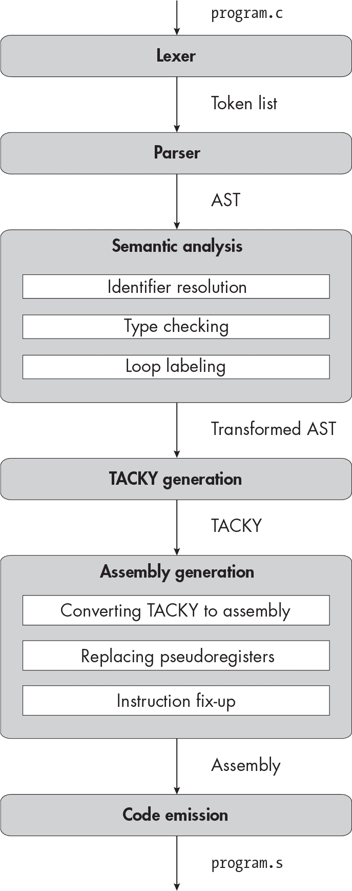
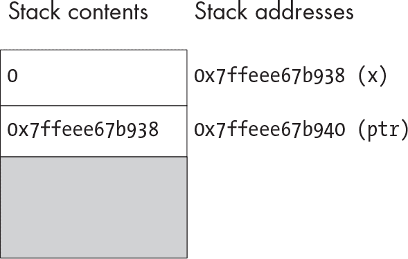
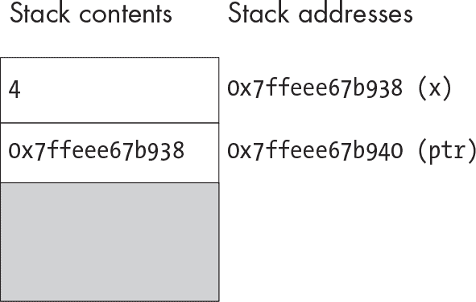

<samp class="SANS_Futura_Std_Book_Oblique_I_11">描述</samp>

<hgroup>

## <samp class="SANS_Futura_Std_Bold_Condensed_B_11">14</samp> <samp class="SANS_Dogma_OT_Bold_B_11">指针</samp>

</hgroup>


到目前为止，你只实现了*算术类型*。这些类型有很多共同之处；它们都支持相同的基本数学运算，而且你总是可以从一种类型隐式转换为另一种类型。在第二部分的其余部分，我们将添加几种非算术类型，如指针、数组和结构体。这些类型与算术类型以及彼此之间差别很大。它们不支持普通的算术运算。相反，每种类型支持自己独特的一组操作。

在本章中，你将实现*指针类型*，它们表示内存地址。你还将添加两个用于操作指针的新运算符：地址运算符 <samp class="SANS_TheSansMonoCd_W5Regular_11">&</samp> 和解引用运算符 <samp class="SANS_TheSansMonoCd_W5Regular_11">*</samp>。你将学习如何解析复杂的类型说明符，并如何检测几种新的类型错误。在 TACKY 和汇编生成过程中，你将添加一些新结构来读取和写入内存中的位置。随着后续章节中更多非算术类型的加入，你将继续在这些更改的基础上构建。

首先，让我们讨论一些在本章中会提到的关键概念：对象、值和左值转换。

### <samp class="SANS_Futura_Std_Bold_B_11">对象与值</samp>

对象和值在之前的章节中已经提到过，但我从未精确定义过这两个术语，也没有解释它们之间的区别。你可以将*值*理解为带有类型的位序列。例如，位

```
11111111111111111111111111111111
```

类型为 <samp class="SANS_TheSansMonoCd_W5Regular_11">int</samp> 的变量，其值为 <samp class="SANS_TheSansMonoCd_W5Regular_11">-1</samp>。到目前为止，我们只遇到过整数值和浮点值。

*对象*是内存中的一个位置，存储着一个值。到目前为止，我们只见过变量是对象。从程序员的角度来看，每个对象都有一个内存地址，这个地址在其生命周期内是固定的，并且有一个值，你可以通过赋值表达式更新它。（在实践中，有些对象可能存储在寄存器中而非内存中，并且你不能更新每个对象的值，但我们暂时可以忽略这些例外情况。）

在 第五章中，我将 lvalue 描述为可以出现在赋值表达式左侧的表达式。现在我们可以使用 C 标准第 6.3.2.1 节，第 1 段中更精确的定义：“lvalue 是一个… 可能表示一个对象的表达式。”（请注意，尽管名为 lvalue，它*并不是*一个值；它是一个表达式。）求值一个非 lvalue 表达式会产生一个值。而求值一个 lvalue 则“确定指定对象的身份”，根据标准第 5.1.2.3 节第 2 段的定义。如果一个表达式表示一个对象，你可以对它进行赋值。否则，你不能。

当你在像 <samp class="SANS_TheSansMonoCd_W5Regular_11">x</samp> <samp class="SANS_TheSansMonoCd_W5Regular_11">+</samp> <samp class="SANS_TheSansMonoCd_W5Regular_11">1</samp> 这样的表达式中使用一个对象时，你实际上是在使用它的当前值。但是当你给一个对象赋值时，你并不关心它的当前值，因为你只是要覆盖它；你关心的是它的位置，也就是你要写入的地方。换句话说，如果 <samp class="SANS_TheSansMonoCd_W5Regular_11">x</samp> 是一个 <samp class="SANS_TheSansMonoCd_W5Regular_11">int</samp> 类型的变量，你有时把它当作一个 <samp class="SANS_TheSansMonoCd_W5Regular_11">int</samp> 类型的值来处理，有时又把它当作一个可以存储 <samp class="SANS_TheSansMonoCd_W5Regular_11">int</samp> 类型值的容器来处理。C 标准将第一种情况，即在表达式中使用对象的值，称为 *lvalue 转换*。这是一种“转换”，因为你将一个表示对象的 lvalue 转换为一个普通的值。如果一个 lvalue 出现在赋值表达式的左操作数位置，或作为 <samp class="SANS_TheSansMonoCd_W5Regular_11">&</samp> 运算符的操作数，它不会经过 lvalue 转换。如果它出现在表达式的其他任何地方，它会经过 lvalue 转换。例如，<samp class="SANS_TheSansMonoCd_W5Regular_11">x</samp> 在表达式 <samp class="SANS_TheSansMonoCd_W5Regular_11">x</samp> <samp class="SANS_TheSansMonoCd_W5Regular_11">=</samp> <samp class="SANS_TheSansMonoCd_W5Regular_11">3</samp> 和 <samp class="SANS_TheSansMonoCd_W5Regular_11">y</samp> <samp class="SANS_TheSansMonoCd_W5Regular_11">=</samp> <samp class="SANS_TheSansMonoCd_W5Regular_11">&x</samp> 中是一个 lvalue，但在表达式 <samp class="SANS_TheSansMonoCd_W5Regular_11">foo(x)</samp>、<samp class="SANS_TheSansMonoCd_W5Regular_11">x</samp> <samp class="SANS_TheSansMonoCd_W5Regular_11">==</samp> <samp class="SANS_TheSansMonoCd_W5Regular_11">y</samp> 和 <samp class="SANS_TheSansMonoCd_W5Regular_11">a</samp> <samp class="SANS_TheSansMonoCd_W5Regular_11">=</samp> <samp class="SANS_TheSansMonoCd_W5Regular_11">x</samp> 中，它不是一个 lvalue。在后续章节中，我们会遇到其他没有经过 lvalue 转换的表达式。

这个术语让我们能够在讨论指针时不至于感到困惑。现在我们可以准确地讨论指针支持哪些操作。

### <samp class="SANS_Futura_Std_Bold_B_11">指针操作</samp>

在本节中，我将介绍地址运算符 <samp class="SANS_TheSansMonoCd_W5Regular_11">&</samp>，它用于获取指向对象的指针，以及解引用运算符 <samp class="SANS_TheSansMonoCd_W5Regular_11">*</samp>，通过指针访问对象。我还会讨论指针的类型转换和比较，以及涉及 <samp class="SANS_TheSansMonoCd_W5Regular_11">&</samp> 运算符的一个特殊情况。至于指针的加法和减法，我暂时不会讨论；我们将在下一章实现这些操作。

#### <samp class="SANS_Futura_Std_Bold_Condensed_Oblique_BI_11">地址和解引用操作</samp>

为了了解 <samp class="SANS_TheSansMonoCd_W5Regular_11">&</samp> 和 <samp class="SANS_TheSansMonoCd_W5Regular_11">*</samp> 操作是如何工作的，我们来逐步分析 Listing 14-1 中的程序。我们将特别关注程序中哪些表达式表示对象，哪些表达式结果是值。

```
int main(void) {
    int x = 0;
    int *ptr = &x;
    *ptr = 4;
    return *ptr;
}
```

<samp class="SANS_Futura_Std_Book_Oblique_I_11">Listing 14-1：一个简单的程序，使用</samp> <samp class="SANS_Futura_Std_Book_Oblique_I_11">&</samp> <samp class="SANS_Futura_Std_Book_Oblique_I_11">和</samp> <samp class="SANS_Futura_Std_Book_Oblique_I_11">*</samp> <samp class="SANS_Futura_Std_Book_Oblique_I_11">操作</samp>

我们从声明一个变量开始，<samp class="SANS_TheSansMonoCd_W5Regular_11">x</samp>。由于 <samp class="SANS_TheSansMonoCd_W5Regular_11">x</samp> 是一个对象，它有一个地址，尽管每次运行程序时这个地址都不会相同。假设在运行 Listing 14-1 时，<samp class="SANS_TheSansMonoCd_W5Regular_11">x</samp> 最终位于内存地址 <samp class="SANS_TheSansMonoCd_W5Regular_11">0x7ffeee67b938</samp>。它的值也是 <samp class="SANS_TheSansMonoCd_W5Regular_11">0</samp>。由于 <samp class="SANS_TheSansMonoCd_W5Regular_11">x</samp> 的类型是 <samp class="SANS_TheSansMonoCd_W5Regular_11">int</samp>，我们也将其值解释为 <samp class="SANS_TheSansMonoCd_W5Regular_11">int</samp> 类型。

接下来，我们声明变量<samp class="SANS_TheSansMonoCd_W5Regular_11">ptr</samp>，它也是一个对象。<samp class="SANS_TheSansMonoCd_W5Regular_11">ptr</samp>的类型是<samp class="SANS_TheSansMonoCd_W5Regular_11">int *</samp>，即“指向<samp class="SANS_TheSansMonoCd_W5Regular_11">int</samp>的指针”，表示一个类型为<samp class="SANS_TheSansMonoCd_W5Regular_11">int</samp>对象的地址。像<samp class="SANS_TheSansMonoCd_W5Regular_11">x</samp>一样，<samp class="SANS_TheSansMonoCd_W5Regular_11">ptr</samp>也有一个地址；假设它是<samp class="SANS_TheSansMonoCd_W5Regular_11">0x7ffeee67b940</samp>。它还有一个值：表达式<samp class="SANS_TheSansMonoCd_W5Regular_11">&x</samp>的结果。<samp class="SANS_TheSansMonoCd_W5Regular_11">&</samp>操作符获取其操作数的地址，这意味着其操作数必须指代一个有地址的对象。换句话说，操作数必须是左值。然而，<samp class="SANS_TheSansMonoCd_W5Regular_11">&</samp>操作符的结果不是一个对象，而是一个指针类型的值。

在表达式<samp class="SANS_TheSansMonoCd_W5Regular_11">&x</samp>中，操作数是左值<samp class="SANS_TheSansMonoCd_W5Regular_11">x</samp>。计算<samp class="SANS_TheSansMonoCd_W5Regular_11">&x</samp>的结果是值<samp class="SANS_TheSansMonoCd_W5Regular_11">0x7ffeee67b938</samp>，这是<samp class="SANS_TheSansMonoCd_W5Regular_11">x</samp>的地址。我们将此值赋给变量<samp class="SANS_TheSansMonoCd_W5Regular_11">ptr</samp>，就像我们可以将任何兼容类型的值赋给一个变量一样。为了帮助我们理清思路，图 14-1 显示了此时程序栈的内容。



<samp class="SANS_Futura_Std_Book_Oblique_I_11">图 14-1：在清单 14-1 描述中声明的对象的地址和初始值</samp>

如图所示，<samp class="SANS_TheSansMonoCd_W5Regular_11">0x7ffeee67b938</samp>既是<samp class="SANS_TheSansMonoCd_W5Regular_11">x</samp>的地址，也是<samp class="SANS_TheSansMonoCd_W5Regular_11">ptr</samp>的值。我之前说过，值是具有类型的比特序列；值<samp class="SANS_TheSansMonoCd_W5Regular_11">0x7ffeee67b938</samp>的类型是<samp class="SANS_TheSansMonoCd_W5Regular_11">int *</samp>，因为它是类型为<samp class="SANS_TheSansMonoCd_W5Regular_11">int</samp>对象的地址。

在清单 14-1 的下一行，我们有赋值表达式 <samp class="SANS_TheSansMonoCd_W5Regular_11">*ptr</samp> <samp class="SANS_TheSansMonoCd_W5Regular_11">=</samp> <samp class="SANS_TheSansMonoCd_W5Regular_11">4</samp>，该表达式由多个子表达式组成。在右边，我们有常量 <samp class="SANS_TheSansMonoCd_W5Regular_11">4</samp>；在左边，我们有变量 <samp class="SANS_TheSansMonoCd_W5Regular_11">ptr</samp>，它本身是解引用表达式 <samp class="SANS_TheSansMonoCd_W5Regular_11">*ptr</samp> 的一部分。常量并不特别有趣，但另外两个子表达式很有意思。这些表达式中最内层的，<samp class="SANS_TheSansMonoCd_W5Regular_11">ptr</samp>，表示一个类型为 <samp class="SANS_TheSansMonoCd_W5Regular_11">int *</samp> 的对象。我们没有给它赋值或取它的地址；我们只是读取它的值。因此，我们隐式地将其转换为左值，结果是类型为 <samp class="SANS_TheSansMonoCd_W5Regular_11">int *</samp> 的*值*，即 <samp class="SANS_TheSansMonoCd_W5Regular_11">0x7ffeee67b938</samp>。我们在解引用表达式 <samp class="SANS_TheSansMonoCd_W5Regular_11">*ptr</samp> 中使用了这个值。解引用表达式是一个左值，因此其结果是一个对象。在这个例子中，它是地址为 <samp class="SANS_TheSansMonoCd_W5Regular_11">0x7ffeee67b938</samp> 的对象，因为这是被解引用的值。由于我们对对象 <samp class="SANS_TheSansMonoCd_W5Regular_11">*ptr</samp> 进行赋值，而不是使用它的值，它不需要进行左值转换。图 14-2 显示了此语句执行后堆栈的内容。



<samp class="SANS_Futura_Std_Book_Oblique_I_11">图 14-2：通过解引用指针赋值后的堆栈内容 描述</samp>

我们在最后的 <samp class="SANS_TheSansMonoCd_W5Regular_11">return</samp> 语句中再次解引用 <samp class="SANS_TheSansMonoCd_W5Regular_11">ptr</samp>。同样，<samp class="SANS_TheSansMonoCd_W5Regular_11">*ptr</samp> 的结果是地址为 <samp class="SANS_TheSansMonoCd_W5Regular_11">0x7ffeee67b938</samp> 的对象。然而，这次我们并没有对该对象进行赋值，也没有对其应用 <samp class="SANS_TheSansMonoCd_W5Regular_11">&</samp> 操作符。因此，我们进行了左值转换，结果是该对象当前的值，即 <samp class="SANS_TheSansMonoCd_W5Regular_11">4</samp>。

现在你已经理解了 <samp class="SANS_TheSansMonoCd_W5Regular_11">*</samp> 和 <samp class="SANS_TheSansMonoCd_W5Regular_11">&</samp> 如何作用于对象和数值，接下来让我们讨论指针类型之间的转换。

#### <samp class="SANS_Futura_Std_Bold_Condensed_Oblique_BI_11">空指针与类型转换</samp>

一个值为 0 的整数常量表达式，称为*空指针常量*，可以隐式转换为任何指针类型。这种转换的结果是一个*空指针*：

```
int *null = 0;
```

因为空指针不是一个有效的内存地址，所以解引用空指针的结果是未定义的。实际上，解引用空指针很可能会导致程序崩溃。C 标准允许像<samp class="SANS_TheSansMonoCd_W5Regular_11">(long) 0</samp>和<samp class="SANS_TheSansMonoCd_W5Regular_11">10 - 10</samp>这样的常量表达式作为空指针常量，但我们只支持像<samp class="SANS_TheSansMonoCd_W5Regular_11">0</samp>和<samp class="SANS_TheSansMonoCd_W5Regular_11">0ul</samp>这样的常量字面值。（这与我们在第十章中对静态初始化器施加的限制相同。）

除了空指针常量外，隐式地将整数转换为指针或将指针转换为整数是非法的。考虑以下代码片段：

```
int x = 0;
int *ptr = x;
```

因为<samp class="SANS_TheSansMonoCd_W5Regular_11">x</samp>的类型是<samp class="SANS_TheSansMonoCd_W5Regular_11">int</samp>，所以将其赋值给类型为<samp class="SANS_TheSansMonoCd_W5Regular_11">ptr</samp>（类型为<samp class="SANS_TheSansMonoCd_W5Regular_11">int *</samp>）是非法的。出于同样的原因，将非零常量赋值给指针也是非法的：

```
int *ptr1 = 3;
int *ptr2 = 0x7ffeee67b938;
```

这些对<samp class="SANS_TheSansMonoCd_W5Regular_11">ptr1</samp>和<samp class="SANS_TheSansMonoCd_W5Regular_11">ptr2</samp>的声明都是非法的，因为<samp class="SANS_TheSansMonoCd_W5Regular_11">3</samp>和<samp class="SANS_TheSansMonoCd_W5Regular_11">0x7ffeee67b938</samp>是整数，而不是指针。请注意，表达式的类型与其值是否是有效的内存地址无关。即使<samp class="SANS_TheSansMonoCd_W5Regular_11">0x7ffeee67b938</samp>恰好是一个有效的地址，常量表达式<samp class="SANS_TheSansMonoCd_W5Regular_11">0x7ffeee67b938</samp>仍然是一个<samp class="SANS_TheSansMonoCd_W5Regular_11">long</samp>，而不是一个指针。

将一种指针类型隐式转换为另一种指针类型也是非法的（<samp class="SANS_TheSansMonoCd_W5Regular_11">void *</samp>的转换除外，我将在第十七章中介绍）。例如，你不能将<samp class="SANS_TheSansMonoCd_W5Regular_11">double *</samp>隐式转换为<samp class="SANS_TheSansMonoCd_W5Regular_11">long *</samp>：

```
double *d = 0;
long *l = d;
```

GCC 会对前三个代码片段中的隐式转换发出警告，但仍然会编译它们。我们将采取更严格的做法，将这些隐式转换视为错误。

另一方面，*显式*地在指针类型之间，或者在指针类型和整数类型之间进行转换是合法的。清单 14-2 展示了一个从<samp class="SANS_TheSansMonoCd_W5Regular_11">double *</samp>到<samp class="SANS_TheSansMonoCd_W5Regular_11">unsigned long *</samp>的显式转换示例。

```
double negative_zero = -0.0;
double *d = &negative_zero;
❶ unsigned long *l = (unsigned long *) d;
```

<samp class="SANS_Futura_Std_Book_Oblique_I_11">列表 14-2：显式指针类型转换</samp>

在显式转换和赋值❶之后，<samp class="SANS_TheSansMonoCd_W5Regular_11">d</samp>和<samp class="SANS_TheSansMonoCd_W5Regular_11">l</samp>包含相同的内存地址，但被解释为两种不同的指针类型。

一个重要的警告是，在进行此类型转换后，如果取消引用<samp class="SANS_TheSansMonoCd_W5Regular_11">l</samp>，会导致未定义的行为。除了少数例外情况，如果我们声明一个具有某种类型的对象（称为其*有效类型*），然后使用不同类型的表达式访问它，结果是未定义的。换句话说，从一种指针类型转换到另一种指针类型总是合法的，但使用该类型转换的结果可能不合法。在列表 14-2 中，<samp class="SANS_TheSansMonoCd_W5Regular_11">negative_zero</samp>的有效类型是<samp class="SANS_TheSansMonoCd_W5Regular_11">double</samp>，因此我们不能使用表达式<samp class="SANS_TheSansMonoCd_W5Regular_11">*l</samp>来访问它，因为该表达式的类型是<samp class="SANS_TheSansMonoCd_W5Regular_11">unsigned</samp> <samp class="SANS_TheSansMonoCd_W5Regular_11">long</samp>。关于可以用来访问对象的表达式类型的完整规则——非正式地称为*严格别名规则*——在 C 标准的第 6.5 节第 6 至 7 段中有详细说明。幸运的是，由于我们不需要检测未定义的行为或优雅地处理它，因此可以忽略这些规则；我们的实现将愉快地编译违反这些规则的程序。

最后，你可以显式地在指针类型和整数类型之间进行转换。当你将一个空指针常量转换为指针类型时，结果是一个空指针。当你将任何其他整数转换为指针类型，或将任何指针转换为整数类型时，结果是实现定义的。在 x64 系统上，内存地址是无符号 64 位整数，类似于<samp class="SANS_TheSansMonoCd_W5Regular_11">0x7ffeee67b938</samp>。因此，如果你将一个<samp class="SANS_TheSansMonoCd_W5Regular_11">unsigned long</samp>转换为指针（或反之），其值不会改变。将任何其他整数类型转换为指针类型，或将指针类型转换为整数类型的效果与转换为或从<samp class="SANS_TheSansMonoCd_W5Regular_11">unsigned long</samp>的效果相同。例如，如果你将一个带有值<samp class="SANS_TheSansMonoCd_W5Regular_11">-1</samp>的有符号<samp class="SANS_TheSansMonoCd_W5Regular_11">int</samp>或<samp class="SANS_TheSansMonoCd_W5Regular_11">long</samp>转换为指针类型，它将导致表示的最大内存地址<samp class="SANS_TheSansMonoCd_W5Regular_11">0xffffffffffffffff</samp>。这个地址不太可能包含有效的对象，因此取消引用它很可能会导致未定义的行为。

将指针类型强制转换为 <samp class="SANS_TheSansMonoCd_W5Regular_11">double</samp> 或将 <samp class="SANS_TheSansMonoCd_W5Regular_11">double</samp> 强制转换为指针类型是非法的。

#### <samp class="SANS_Futura_Std_Bold_Condensed_Oblique_BI_11">指针比较</samp>

你可以使用 <samp class="SANS_TheSansMonoCd_W5Regular_11">==</samp> 和 <samp class="SANS_TheSansMonoCd_W5Regular_11">!=</samp> 操作符比较相同类型的指针。两个非空指针相等时，它们指向同一个对象（或者正好指向同一个数组的末尾，等我们实现数组后）。否则它们不相等。指向有效对象的指针总是与空指针不相等，而两个空指针总是相等。你还可以在任何比较表达式是否为零的结构中使用指针，包括逻辑 <samp class="SANS_TheSansMonoCd_W5Regular_11">!</samp>、<samp class="SANS_TheSansMonoCd_W5Regular_11">&&</samp> 和 <samp class="SANS_TheSansMonoCd_W5Regular_11">||</samp> 表达式；条件表达式中的条件；以及 <samp class="SANS_TheSansMonoCd_W5Regular_11">if</samp> 语句或循环中的控制条件。在这些情况下，空指针算作零，任何非空指针算作非零。

你还可以使用其他关系运算符（如 <samp class="SANS_TheSansMonoCd_W5Regular_11">></samp>）比较指针，但我们暂时不支持这类操作。这种类型的指针比较在处理指向数组元素的指针时最为有用，因此我们将在下一章添加数组时实现它。

#### <samp class="SANS_Futura_Std_Bold_Condensed_Oblique_BI_11">& 解引用指针的操作</samp>

我们之前看到过，<samp class="SANS_TheSansMonoCd_W5Regular_11">&</samp> 操作符的操作数必须是一个左值。由于解引用指针是一个左值，你可以使用这个操作符获取它的地址，就像我们在 示例 14-3 中做的那样。

```
int *ptr = &var;
int *ptr2 = &*ptr;
```

<samp class="SANS_Futura_Std_Book_Oblique_I_11">示例 14-3：获取解引用指针的地址</samp>

表达式 <samp class="SANS_TheSansMonoCd_W5Regular_11">&*ptr</samp> 是有效的，但它并不太有用。内部表达式指定了存储在某个地址的对象，而外部表达式获取该对象的地址。最终你得到的是 <samp class="SANS_TheSansMonoCd_W5Regular_11">ptr</samp> 的值，即你最初解引用的地址。

实际上，C 标准将 <samp class="SANS_TheSansMonoCd_W5Regular_11">&*</samp><samp class="SANS_TheSansMonoCd_W5Regular_Italic_I_11"><exp></samp> 视为一个特殊情况：第 6.5.3.2 节第 3 段指出：“[* 运算符]和 & 运算符都不会被求值，结果就像两个都被省略一样，唯一的区别是这些运算符的约束仍然适用，而且结果不是左值。”换句话说，<samp class="SANS_TheSansMonoCd_W5Regular_11">&*</samp><samp class="SANS_TheSansMonoCd_W5Regular_Italic_I_11"><exp></samp> 的结果始终是 <samp class="SANS_TheSansMonoCd_W5Regular_Italic_I_11"><exp></samp> 的值。通常情况下，像在列表 14-3 中，无论我们是否求值 <samp class="SANS_TheSansMonoCd_W5Regular_11">*</samp> 和 <samp class="SANS_TheSansMonoCd_W5Regular_11">&</samp> 运算符，最终结果都是 <samp class="SANS_TheSansMonoCd_W5Regular_Italic_I_11"><exp></samp>。唯一的例外是当 <samp class="SANS_TheSansMonoCd_W5Regular_Italic_I_11"><exp></samp> 不是有效的内存地址时，像在列表 14-4 中那样。

```
int *null_ptr = 0;
int *ptr2 = &*null_ptr;
```

<samp class="SANS_Futura_Std_Book_Oblique_I_11">列表 14-4：获取反引用空指针的地址</samp>

解引用 <samp class="SANS_TheSansMonoCd_W5Regular_11">null_ptr</samp> 通常会导致运行时错误。然而，由于列表 14-4 中的 <samp class="SANS_TheSansMonoCd_W5Regular_11">&</samp> 和 <samp class="SANS_TheSansMonoCd_W5Regular_11">*</samp> 表达式并没有被求值，所以这段代码的等效形式是：

```
int *null_ptr = 0;
int *ptr2 = null_ptr;
```

因此，列表 14-4 可以顺利运行，没有错误；它将 <samp class="SANS_TheSansMonoCd_W5Regular_11">null_ptr</samp> 和 <samp class="SANS_TheSansMonoCd_W5Regular_11">ptr2</samp> 初始化为空指针。

既然我们已经掌握了指针语义，让我们开始处理词法分析器（lexer）吧！

### <samp class="SANS_Futura_Std_Bold_B_11">词法分析器</samp>

在这一章，你将添加一个单独的令牌：

<samp class="SANS_TheSansMonoCd_W7Bold_B_11">&</samp> 一个和号，地址运算符

你已经添加了 <samp class="SANS_TheSansMonoCd_W5Regular_11">*</samp> 令牌来支持乘法。如果你在第三章实现了位运算符的附加功能，那么你也已经添加了 <samp class="SANS_TheSansMonoCd_W5Regular_11">&</samp> 令牌，因此你不需要修改词法分析器。

### <samp class="SANS_Futura_Std_Bold_B_11">解析器</samp>

接下来，我们将向抽象语法树（AST）添加指针类型和两个新的指针运算符。指针类型是通过递归构造的，来自它所指向对象的类型；例如，<samp class="SANS_TheSansMonoCd_W5Regular_11">int *</samp>、<samp class="SANS_TheSansMonoCd_W5Regular_11">double *</samp> 和 <samp class="SANS_TheSansMonoCd_W5Regular_11">unsigned long *</samp> 都是有效的类型。你还可以声明指向指针的指针，因此 <samp class="SANS_TheSansMonoCd_W5Regular_11">int **</samp>、<samp class="SANS_TheSansMonoCd_W5Regular_11">long ***</samp> 等也是有效的类型。因此，AST 通过递归定义指针类型：

```
type = Int | Long | UInt | ULong | Double
     | FunType(type* params, type ret)
     **| Pointer(type referenced)**
```

在 C 语言中，由更简单类型构建的类型称为*派生类型*。指针类型和函数类型都是派生类型。我们将在后续章节中实现的数组类型和结构类型也是派生类型。指针所指向的类型称为*引用类型*。例如，<samp class="SANS_TheSansMonoCd_W5Regular_11">int *</samp> 的引用类型是 <samp class="SANS_TheSansMonoCd_W5Regular_11">int</samp>。

我们将扩展 <samp class="SANS_TheSansMonoCd_W5Regular_11">exp</samp> AST 节点，以表示解引用和取地址运算符：

```
exp = `--snip--`
    | Dereference(exp)
    | AddrOf(exp)
```

从语法上讲，这两个运算符都是一元运算符，因此你可以扩展 <samp class="SANS_TheSansMonoCd_W5Regular_11">unary _operator</samp>，而不是 <samp class="SANS_TheSansMonoCd_W5Regular_11">exp</samp>，如果你想这样做。但是我认为将它们作为不同的表达式处理会更容易，因为我们在类型检查和 TACKY 生成过程中将以不同的方式处理这些运算符。列表 14-5 显示了更新后的 AST，本章的新增部分已加粗。

```
program = Program(declaration*)
declaration = FunDecl(function_declaration) | VarDecl(variable_declaration)
variable_declaration = (identifier name, exp? init, type var_type, storage_class?)
function_declaration = (identifier name, identifier* params, block? body,
                        type fun_type, storage_class?)
type = Int | Long | UInt | ULong | Double
     | FunType(type* params, type ret)
     **| Pointer(type referenced)**
storage_class = Static | Extern
block_item = S(statement) | D(declaration)
block = Block(block_item*)
for_init = InitDecl(variable_declaration) | InitExp(exp?)
statement = Return(exp)
          | Expression(exp)
          | If(exp condition, statement then, statement? else)
          | Compound(block)
          | Break
          | Continue
          | While(exp condition, statement body)
          | DoWhile(statement body, exp condition)
          | For(for_init init, exp? condition, exp? post, statement body)
          | Null
exp = Constant(const)
    | Var(identifier)
    | Cast(type target_type, exp)
    | Unary(unary_operator, exp)
    | Binary(binary_operator, exp, exp)
    | Assignment(exp, exp)
    | Conditional(exp condition, exp, exp)
    | FunctionCall(identifier, exp* args)
    **| Dereference(exp)**
    **| AddrOf(exp)**
unary_operator = Complement | Negate | Not
binary_operator = Add | Subtract | Multiply | Divide | Remainder | And | Or
                | Equal | NotEqual | LessThan | LessOrEqual
                | GreaterThan | GreaterOrEqual
const = ConstInt(int) | ConstLong(int)
      | ConstUInt(int) | ConstULong(int)
      | ConstDouble(double)
```

<samp class="SANS_Futura_Std_Book_Oblique_I_11">列表 14-5：包含指针类型以及解引用和取地址运算符的抽象语法树</samp>

接下来，我们将更新语法并找出如何解析它。我们可以像解析其他一元运算符一样解析 <samp class="SANS_TheSansMonoCd_W5Regular_11">*</samp> 和 <samp class="SANS_TheSansMonoCd_W5Regular_11">&</samp> 运算符，因此我们将它们添加到 <samp class="SANS_TheSansMonoCd_W5Regular_11"><unop></samp> 语法规则中：

```
<unop> ::= "-" | "~" | "!" **| "*" | "&"**
```

在声明和强制类型转换表达式中解析指针类型更具挑战性。我们需要一种方法来扩展它，以处理一般的派生类型，而不仅仅是指针；否则，我们将不得不完全重写它，以应对下一章中的数组。我们将从更新解析器开始，以支持声明中的派生类型。然后，我们将处理强制类型转换表达式中的派生类型。

#### <samp class="SANS_Futura_Std_Bold_Condensed_Oblique_BI_11">解析声明</samp>

一个函数或变量声明由三部分组成：一组说明符、一个声明符和一个可选的初始化器或函数体。你已经知道初始化器和函数体是什么样子，所以我这里不再讨论它们。说明符是之前章节中已经熟悉的内容：它们包括像 <samp class="SANS_TheSansMonoCd_W5Regular_11">static</samp> 这样的存储类说明符，用于确定标识符的存储类和链接性，和像 <samp class="SANS_TheSansMonoCd_W5Regular_11">int</samp> 这样的类型说明符，用于确定我所说的 *基本类型*。基本类型是标识符的类型，或者是派生其类型的起始点。（这个术语在 C 标准中并没有出现，但它有时出现在 C 声明的其他讨论中。）*声明符* 是其他所有内容：它表示正在声明的标识符，以及我们将应用于基本类型的派生序列。例如，<samp class="SANS_TheSansMonoCd_W5Regular_11">var</samp>、<samp class="SANS_TheSansMonoCd_W5Regular_11">*var</samp>、<samp class="SANS_TheSansMonoCd_W5Regular_11">foo(int a)</samp> 和 <samp class="SANS_TheSansMonoCd_W5Regular_11">foo[3]</samp> 都是声明符。

最简单的声明符是标识符：

```
int var;
```

在这里，基本类型是 <samp class="SANS_TheSansMonoCd_W5Regular_11">int</samp>，声明符是 <samp class="SANS_TheSansMonoCd_W5Regular_11">var</samp>，因此它声明了一个名为 <samp class="SANS_TheSansMonoCd_W5Regular_11">var</samp> 的变量，其类型为 <samp class="SANS_TheSansMonoCd_W5Regular_11">int</samp>。这个声明没有包含任何类型派生。

要派生一个新类型，我们将像 <samp class="SANS_TheSansMonoCd_W5Regular_11">var</samp> 这样的声明符嵌套在另一个声明符中：

```
int *(var);
```

这里我们有一个指针声明符 <samp class="SANS_TheSansMonoCd_W5Regular_11">*(var)</samp>，它包含嵌套声明符 <samp class="SANS_TheSansMonoCd_W5Regular_11">var</samp>。指针声明符采用某种类型 *t*，并派生出“指向 *t* 的指针”类型，因此这个声明声明了一个名为 <samp class="SANS_TheSansMonoCd_W5Regular_11">var</samp> 的变量，类型为“指向 <samp class="SANS_TheSansMonoCd_W5Regular_11">int</samp> 的指针”。请注意，C 的语法允许我们将任何声明符包裹在括号中。我将 <samp class="SANS_TheSansMonoCd_W5Regular_11">var</samp> 包裹在括号中，以使嵌套关系变得显式，但如果我们省略括号，声明的意义是一样的：

```
int *var;
```

我们使用多层嵌套声明符来指定多个类型派生；这些派生从外到内应用，以确定最终类型。最内层的声明符始终是一个普通的标识符。这里是一个包含三个嵌套声明符的例子：

```
int *(*(var));
```

完整的声明符是 <samp class="SANS_TheSansMonoCd_W5Regular_11">*(*(var))</samp>，它包含 <samp class="SANS_TheSansMonoCd_W5Regular_11">*(var)</samp>，而 <samp class="SANS_TheSansMonoCd_W5Regular_11">*(var)</samp> 又包含 <samp class="SANS_TheSansMonoCd_W5Regular_11">var</samp>。就像前面的例子一样，这个声明符中的括号没有任何作用；我只是为了清晰起见才加上的。

让我们来逐步解析类型推导。从外到内，我们首先看到基本类型 <samp class="SANS_TheSansMonoCd_W5Regular_11">int</samp>。接下来，我们看到一个指针声明符，因此我们推导出类型“指向 <samp class="SANS_TheSansMonoCd_W5Regular_11">int</samp> 的指针”。然后，我们看到另一个指针声明符，所以我们推导出“指向指向 <samp class="SANS_TheSansMonoCd_W5Regular_11">int</samp> 的指针”。最后，我们遇到标识符，这完成了声明，但没有增加任何类型信息。最终我们得到一个变量 <samp class="SANS_TheSansMonoCd_W5Regular_11">var</samp>，其类型是“指向指向 <samp class="SANS_TheSansMonoCd_W5Regular_11">int</samp> 的指针”。

另外两种声明符是 *函数声明符*（我们已经支持）和 *数组声明符*（我们将在下一章添加）。函数声明符接受一个类型 *t*，并推导出类型“返回 *t* 的函数”。让我们拆解一个函数声明：

```
int foo(void);
```

这里的完整声明符是 <samp class="SANS_TheSansMonoCd_W5Regular_11">foo(void)</samp>，它包含嵌套声明符 <samp class="SANS_TheSansMonoCd_W5Regular_11">foo</samp>。为每个声明符加上括号，得到以下等效声明：

```
int ((foo)(void));
```

我们从基本类型 <samp class="SANS_TheSansMonoCd_W5Regular_11">int</samp> 开始。外部声明符告诉我们推导出类型“返回 <samp class="SANS_TheSansMonoCd_W5Regular_11">int</samp> 的函数”，而内部声明符则表明我们正在声明标识符 <samp class="SANS_TheSansMonoCd_W5Regular_11">foo</samp>。当然，函数声明符还声明了函数的参数。每个参数就像一个声明一样，包含基本类型和声明符：

```
int foo(int a, int *b);
```

正如我们已经知道的，形式为 <samp class="SANS_TheSansMonoCd_W5Regular_11">(void)</samp> 的参数列表是一种特殊情况：它声明函数没有参数。

最后，数组声明符以类型 *t* 开始，并推导出类型“类型为 *t* 的 *n* 个元素的数组”。例如，以下代码包含声明符 <samp class="SANS_TheSansMonoCd_W5Regular_11">arr[3]</samp>，它有一个嵌套的声明符 <samp class="SANS_TheSansMonoCd_W5Regular_11">arr</samp>：

```
int arr[3];
```

这声明了 <samp class="SANS_TheSansMonoCd_W5Regular_11">arr</samp> 是一个包含三个元素的 <samp class="SANS_TheSansMonoCd_W5Regular_11">int</samp> 类型数组。

更复杂的声明可以包括嵌套指针、数组和函数声明符的混合。我们用后缀表达式表示的函数和数组声明符优先级高于指针声明符，因此

```
int *arr[3];
```

等价于：

```
int *(arr[3]);
```

为了解释这个声明，我们从 <samp class="SANS_TheSansMonoCd_W5Regular_11">int</samp> 开始，应用外部指针声明符得出“指向 <samp class="SANS_TheSansMonoCd_W5Regular_11">int</samp> 的指针”，应用内部数组声明符得出“一个包含三个指向 <samp class="SANS_TheSansMonoCd_W5Regular_11">int</samp> 的指针的数组”，最后得出最内层声明符 <samp class="SANS_TheSansMonoCd_W5Regular_11">arr</samp>。如果要声明一个指向数组的指针，我们可以用括号覆盖这一优先级：

```
int (*arr)[3];
```

同样，这个声明声明了一个指向具有单一参数的函数的指针：

```
int (*fptr)(int a);
```

函数指针在 C 中是合法的，但在本书中我们不会实现它们。你还可以嵌套声明符来指定完全非法的类型。例如，<samp class="SANS_TheSansMonoCd_W5Regular_11">int foo(void)(void);</samp> 声明了一个返回函数的函数，而该返回的函数又返回一个 <samp class="SANS_TheSansMonoCd_W5Regular_11">int</samp>。这个声明在语法上是正确的，但在语义上无效；一个函数不能返回另一个函数。

现在你已经理解了声明符的基本语法，我们准备为它们编写语法规则。有关声明符的完整描述，请参见 C 标准的第 6.7.6 节。我还推荐 Steve Friedl 的《阅读 C 类型声明》，它以比标准更易理解的方式描述了声明符的语法（* [`<wbr>unixwiz<wbr>.net<wbr>/techtips<wbr>/reading<wbr>-cdecl<wbr>.html`](http://unixwiz.net/techtips/reading-cdecl.html) *）。

由于声明符有多个优先级层次，我们需要多个语法规则来定义它们的语法。在最高优先级层次，<samp class="SANS_TheSansMonoCd_W5Regular_11"><simple-declarator></samp> 是一个单独的标识符或带括号的声明符：

```
<simple-declarator> ::= <identifier> | "(" <declarator> ")"
```

在下一个优先级层次，我们有 C 语法中称为*直接声明符*的部分，包括函数和数组声明符。本章仅支持函数声明符：

```
<direct-declarator> ::= <simple-declarator> [<param-list>]
<param-list> ::= "(" "void" ")" | "(" <param> {"," <param>} ")"
<param> ::= {<type-specifier>}+ <declarator>
```

在<samp class="SANS_TheSansMonoCd_W5Regular_11"><direct-declarator></samp>的定义中，直接声明符可以是简单声明符或函数声明符，后者通过存在参数列表来表示。请注意，我们已经稍微修改了<samp class="SANS_TheSansMonoCd_W5Regular_11"><param-list></samp>，将该符号重构为包含参数列表周围的括号，并将单个参数的定义移入单独的<samp class="SANS_TheSansMonoCd_W5Regular_11"><param></samp>符号中。最重要的是，<samp class="SANS_TheSansMonoCd_W5Regular_11"><param></samp>的定义现在包括了声明符，而不是一个普通的标识符。这使得我们能够解析带有指针类型（最终也包括数组类型）的参数。最后，我们将定义一个顶级的<samp class="SANS_TheSansMonoCd_W5Regular_11"><declarator></samp>，其中包括指针声明符：

```
<declarator> ::= "*" <declarator> | <direct-declarator>
```

不幸的是，这个语法实际上与我们的抽象语法树（AST）定义不完全匹配。一个小问题是，它允许我们指定一些不支持的类型，包括函数指针、返回函数的函数，以及将其他函数作为参数的函数。更严重的问题是，在我们的语法中，类型推导是从外到内应用的，而在 AST 定义中，它们是从内到外应用的。让我们重新审视一下之前看过的一个声明：

```
int (*arr)[3];
```

我们想解析这个声明并构造类型“指向类型为<samp class="SANS_TheSansMonoCd_W5Regular_11">int</samp>的三元素数组的指针”。如果我们尝试使用递归下降解析来构造这个类型，会发生什么呢？首先，我们会遇到基本类型<samp class="SANS_TheSansMonoCd_W5Regular_11">int</samp>。然后，我们会看到一个左括号，表示直接声明符的开始。在该直接声明符内，我们会看到一个指针声明符——然后我们就会卡住。我们应该推导出指针类型，但指向什么呢？到目前为止我们看到的基本类型是<samp class="SANS_TheSansMonoCd_W5Regular_11">int</samp>，但“指向<samp class="SANS_TheSansMonoCd_W5Regular_11">int</samp>的指针”是不正确的。由于类型推导是从外到内应用的，我们应该首先推导出数组类型。但我们无法做到，因为解析器必须先消费内层的带括号的声明符，才能到达指定数组类型的<samp class="SANS_TheSansMonoCd_W5Regular_11">[3]</samp>。

我们在这里卡住了，因为我们能够识别语法符号的顺序与应用类型推导的顺序不匹配。当我们解析一个声明时，不能一边解析一边推导其类型。相反，我们首先会将每个声明符解析为一种临时表示形式，这种表示形式更接近语法，如清单 14-6 中的那样。

```
declarator = Ident(identifier)
           | PointerDeclarator(declarator)
           | FunDeclarator(param_info* params, declarator)
param_info = Param(type, declarator)
```

<samp class="SANS_Futura_Std_Book_Oblique_I_11">清单 14-6：表示声明符的语法</samp>

我们可以使用标准的递归下降解析法生成一个<samp class="SANS_TheSansMonoCd_W5Regular_11">声明符</samp>构造，遵循我们刚刚介绍的语法规则。

下一步是遍历该<samp class="SANS_TheSansMonoCd_W5Regular_11">声明符</samp>，并推导出所有我们将用于构造 AST 节点的信息：声明的类型、标识符以及任何参数的标识符。在每一层，我们都会应用适当的类型推导，然后递归地处理内层声明符。清单 14-7 展示了此步骤的伪代码。

```
process_declarator(declarator, base_type):
    match declarator with
    | Ident(name) -> return (name, base_type, []) ❶
    | PointerDeclarator(d) -> ❷
        derived_type = Pointer(base_type)
        return process_declarator(d, derived_type)
 | FunDeclarator(params, d) -> ❸
        match d with
        | Ident(name) -> ❹
            param_names = []
            param_types = []
            for Param(p_base_type, p_declarator) in params: ❺
                param_name, param_t, _ = process_declarator(p_declarator, p_base_type)
                if param_t is a function type:
                    fail("Function pointers in parameters aren't supported")
                param_names.append(param_name)
                param_types.append(param_t)

            derived_type = FunType(param_types, base_type)
            return (name, derived_type, param_names)
        | _ -> fail("Can't apply additional type derivations to a function type")
```

<samp class="SANS_Futura_Std_Book_Oblique_I_11">清单 14-7：从声明符中推导类型和标识符信息</samp> <samp class="SANS_Futura_Std_Book_Oblique_I_11">声明符</samp>

<samp class="SANS_TheSansMonoCd_W5Regular_11">process_declarator</samp>函数接受两个参数。第一个是声明符本身。第二个<samp class="SANS_TheSansMonoCd_W5Regular_11">base_type</samp>是我们迄今为止推导出的类型。最初，这将是声明开始时由说明符列表指示的基本类型。例如，如果我们正在处理声明<samp class="SANS_TheSansMonoCd_W5Regular_11">double **fun(int x)</samp>，我们将从<samp class="SANS_TheSansMonoCd_W5Regular_11">base_type</samp>为<samp class="SANS_TheSansMonoCd_W5Regular_11">double</samp>开始。<samp class="SANS_TheSansMonoCd_W5Regular_11">process_declarator</samp>的结果将是一个包含三个值的元组：声明的标识符、推导出的类型以及任何参数的名称。如果声明声明的是变量，或者声明的是没有参数的函数，则参数名称列表将为空。使用这三个值，我们将能够构造一个<samp class="SANS_TheSansMonoCd_W5Regular_11">声明</samp> AST 节点。

让我们逐步了解如何从<samp class="SANS_TheSansMonoCd_W5Regular_11">声明符</samp>构造中提取这些值。在最简单的情况下，声明符是一个标识符 ❶。我们不需要应用任何类型推导或引入任何参数，因此我们返回标识符、不变的<samp class="SANS_TheSansMonoCd_W5Regular_11">base_type</samp>，以及一个空的参数名列表。例如，在处理声明<samp class="SANS_TheSansMonoCd_W5Regular_11">int x;</samp>时，我们会立即遇到这种情况，并返回<samp class="SANS_TheSansMonoCd_W5Regular_11">("x", Int, [])</samp>。

在第二种情况下，我们处理指针声明符 ❷。在这种情况下，我们从<samp class="SANS_TheSansMonoCd_W5Regular_11">base_type</samp>推导出指针类型。然后，我们递归地调用<samp class="SANS_TheSansMonoCd_W5Regular_11">process_declarator</samp>，对刚刚推导出的类型和仍需要处理的内层声明符进行处理。

在最后一种情况下，我们处理函数声明符❸。这一情况有些不同，因为内部声明符必须是一个普通标识符。如果它是另一个函数声明符，我们将得到一个返回函数的函数，这是不合法的。如果它是一个指针声明符，我们将得到一个函数指针，但我们并没有实现函数指针。因此，我们验证内部声明符是一个普通标识符，而不是递归解析它❹。

假设内部声明符是有效的，下一步是确定函数类型和参数名称。我们将遍历声明符中的参数，递归调用<samp class="SANS_TheSansMonoCd_W5Regular_11">process_declarator</samp>来获取每个参数的类型和名称❺。同时，我们会验证这些函数参数中没有是函数本身的情况。（C 标准实际上允许你声明函数类型的参数，但它要求编译器隐式地将其调整为函数指针类型。由于我们不支持函数指针，因此会拒绝这种情况。）一旦处理完所有参数，我们将构建完整的函数类型，并返回关于此声明的所有相关信息。

清单 14-8 展示了如何将所有部分组合在一起解析整个声明。

```
parse_declaration(tokens):
    specifiers = parse_specifier_list(tokens)
    base_type, storage_class = parse_type_and_storage_class(specifiers)
    declarator = parse_declarator(tokens)
    name, decl_type, params = process_declarator(declarator, base_type)
    if decl_type is a function type:
 `<construct function_declaration>`
    else:
 `<construct variable_declaration>`
```

<samp class="SANS_Futura_Std_Book_Oblique_I_11">清单 14-8：解析整个声明</samp>

我们首先按照常规方式确定声明的基本类型：我们从<samp class="SANS_TheSansMonoCd_W5Regular_11">tokens</samp>中消耗一个说明符列表，然后将这些说明符转换为类型和存储类别。接下来，我们解析声明符，然后调用<samp class="SANS_TheSansMonoCd_W5Regular_11">process_declarator</samp>来确定其完整类型和名称。最后，我们检查结果类型以确定它是函数声明还是变量声明，并相应地解析声明的其余部分。

#### <samp class="SANS_Futura_Std_Bold_Condensed_Oblique_BI_11">解析类型名称</samp>

指针类型也可以出现在强制类型转换表达式中：

```
int *result_of_cast = (int *) exp;
```

但是，你不能在强制类型转换表达式中使用声明符，因为声明符必须包含一个标识符。C 语言通过*抽象声明符*解决了这个问题，抽象声明符是没有标识符的声明符。我们现在将添加抽象指针声明符，并在下一章添加抽象数组声明符。（我们不需要抽象函数声明符，因为它们只用于指定函数指针。）

一个抽象声明符可能是一个或多个<samp class="SANS_TheSansMonoCd_W5Regular_11">*</samp>符号的序列，表示指针类型派生的序列：

```
(int ***) exp;
```

抽象声明符也可以像它们的非抽象对应物一样被括起来：

```
(int (*)) exp;
```

一个外部抽象声明符可以包含一个内部括号声明符：

```
(int *(*)) exp;
```

括号此时并没有实际意义。当我们在下一章添加数组时，它们将变得更有用。例如，表达式

```
(int *[3]) exp;
```

将<samp class="SANS_TheSansMonoCd_W5Regular_11">exp</samp>转换为指向三个指针的数组，指向<samp class="SANS_TheSansMonoCd_W5Regular_11">int</samp>，因为抽象数组声明符<samp class="SANS_TheSansMonoCd_W5Regular_11">[3]</samp>的优先级更高。这个类型转换表达式是非法的，因为你不能将表达式转换为数组类型。另一方面，这个表达式是合法的：

```
(int (*)[3]) exp;
```

这个将<samp class="SANS_TheSansMonoCd_W5Regular_11">exp</samp>转换为指向三个<samp class="SANS_TheSansMonoCd_W5Regular_11">int</samp>元素数组的指针；括号中的指针声明符优先级更高，因此数组声明符首先应用于<samp class="SANS_TheSansMonoCd_W5Regular_11">int</samp>。

我们使用两条语法规则来定义抽象声明符：

```
<abstract-declarator> ::= "*" [<abstract-declarator>]
                        | <direct-abstract-declarator>
<direct-abstract-declarator> ::= "(" <abstract-declarator> ")"
```

一个<samp class="SANS_TheSansMonoCd_W5Regular_11"><abstract-declarator></samp>，像普通的<samp class="SANS_TheSansMonoCd_W5Regular_11"><declarator></samp>一样，由指针声明符或直接声明符组成。两者之间的关键区别在于，在抽象指针声明符中，内部声明符是可选的。换句话说，单独的<samp class="SANS_TheSansMonoCd_W5Regular_11">*</samp>是一个有效的抽象声明符，但不是有效的普通声明符。

一个<samp class="SANS_TheSansMonoCd_W5Regular_11"><direct-abstract-declarator></samp>是一个用括号括起来的<samp class="SANS_TheSansMonoCd_W5Regular_11"><abstract-declarator></samp>。在下一章中，这个符号也将涵盖抽象数组声明符。我们将像处理普通声明符一样，解析抽象声明符为一次性的<samp class="SANS_TheSansMonoCd_W5Regular_11">abstract_declarator</samp>结构。Listing 14-9 定义了这个结构。

```
abstract_declarator = AbstractPointer(abstract_declarator)
                    | AbstractBase
```

<samp class="SANS_Futura_Std_Book_Oblique_I_11">Listing 14-9: 表示抽象声明符的语法</samp>

<samp class="SANS_TheSansMonoCd_W5Regular_11">AbstractBase</samp>表示基本情况，其中<samp class="SANS_TheSansMonoCd_W5Regular_11">*</samp>标记后面没有跟随内部声明符。例如，我们会将抽象声明符<samp class="SANS_TheSansMonoCd_W5Regular_11">*(*)</samp>解析为<samp class="SANS_TheSansMonoCd_W5Regular_11">AbstractPointer(AbstractPointer(AbstractBase))</samp>。目前，<samp class="SANS_TheSansMonoCd_W5Regular_11">abstract_declarator</samp>仅告诉我们找到了多少层指针间接引用（在这个例子中是两层）。这是一种相当复杂的方式来传达一个数字，但它为下一章的数组声明符打下了基础。

类型名称在类型转换表达式中是由类型说明符序列组成，后面跟一个可选的抽象声明符，所有内容都被括号括起来：

```
<factor> ::= `--snip--`
           | "(" {<type-specifier>}+ **[<abstract-declarator>]** ")" <factor>
           | `--snip--`
```

要处理强制转换表达式，你需要一个与示例 14-7 中的<samp class="SANS_TheSansMonoCd_W5Regular_11">process_declarator</samp>类似的<samp class="SANS_TheSansMonoCd_W5Regular_11">process_abstract_declarator</samp>函数，用于将基本类型和<samp class="SANS_TheSansMonoCd_W5Regular_11">abstract_declarator</samp>转换为派生类型。这个函数比<samp class="SANS_TheSansMonoCd_W5Regular_11">process_declarator</samp>要简单，它不会处理函数声明符，而且只会返回类型，而不是标识符或参数列表。

#### <samp class="SANS_Futura_Std_Bold_Condensed_Oblique_BI_11">将所有内容整合在一起</samp>

我们已经覆盖了对解析器所做的所有更改。示例 14-10 显示了完整的语法，新增的内容已加粗。

```
<program> ::= {<declaration>}
<declaration> ::= <variable-declaration> | <function-declaration>
<variable-declaration> ::= {<specifier>}+ **<declarator>** ["=" <exp>] ";"
<function-declaration> ::= {<specifier>}+ **<declarator>** (<block> | ";")
**<declarator> ::= "*" <declarator> | <direct-declarator>**
**<direct-declarator> ::= <simple-declarator> [<param-list>]**
**<param-list> ::= "(" "void" ")" | "(" <param> {"," <param>} ")"**
**<param> ::= {<type-specifier>}+ <declarator>**
**<simple-declarator> ::= <identifier> | "(" <declarator> ")"**
<type-specifier> ::= "int" | "long" | "unsigned" | "signed" | "double"
<specifier> ::= <type-specifier> | "static" | "extern"
<block> ::= "{" {<block-item>} "}"
<block-item> ::= <statement> | <declaration>
<for-init> ::= <variable-declaration> | [<exp>] ";"
<statement> ::= "return" <exp> ";"
              | <exp> ";"
              | "if" "(" <exp> ")" <statement> ["else" <statement>]
              | <block>
              | "break" ";"
              | "continue" ";"
              | "while" "(" <exp> ")" <statement>
              | "do" <statement> "while" "(" <exp> ")" ";"
              | "for" "(" <for-init> [<exp>] ";" [<exp>] ")" <statement>
              | ";"
<exp> ::= <factor> | <exp> <binop> <exp> | <exp> "?" <exp> ":" <exp>
<factor> ::= <const> | <identifier>
           | "(" {<type-specifier>}+ **[<abstract-declarator>]** ")" <factor>
           | <unop> <factor> | "(" <exp> ")"
           | <identifier> "(" [<argument-list>] ")"
<argument-list> ::= <exp> {"," <exp>}
**<abstract-declarator> ::= "*" [<abstract-declarator>]**
 **| <direct-abstract-declarator>**
**<direct-abstract-declarator> ::= "(" <abstract-declarator> ")"**
<unop> ::= "-" | "~" | "!" **| "*" | "&"**
<binop> ::= "-" | "+" | "*" | "/" | "%" | "&&" | "||"
          | "==" | "!=" | "<" | "<=" | ">" | ">=" | "="
<const> ::= <int> | <long> | <uint> | <ulong> | <double>
<identifier> ::= ? An identifier token ?
<int> ::= ? An int token ?
<long> ::= ? An int or long token ?
<uint> ::= ? An unsigned int token ?
<ulong> ::= ? An unsigned int or unsigned long token ?
<double> ::= ? A floating-point constant token ?
```

<samp class="SANS_Futura_Std_Book_Oblique_I_11">示例 14-10：带指针类型和解引用及取地址操作符的语法</samp>

我们对语法做了三处重大更改。首先，我们在函数、变量和参数声明中使用< samp class="SANS_TheSansMonoCd_W5Regular_11"><declarator></samp>符号，而不是简单的标识符。其次，我们使用相应的< samp class="SANS_TheSansMonoCd_W5Regular_11"><abstract-declarator></samp>符号，在强制转换表达式中指定指针类型。第三，我们增加了新的一元操作符< samp class="SANS_TheSansMonoCd_W5Regular_11">&</samp>和< samp class="SANS_TheSansMonoCd_W5Regular_11">*</samp>。

### <samp class="SANS_Futura_Std_Bold_B_11">语义分析</samp>

接下来是语义分析！我们将扩展类型检查器，以验证涉及指针的表达式并推断这些表达式的类型。标识符解析阶段也会有所变化；我们将把一部分验证从这个阶段移到类型检查器中。

我们需要检测三种类型错误：

1.  对不支持的类型应用操作符。例如，你不能对指针进行乘法或除法操作，也不能对算术值进行解引用。

1.  对两种不兼容类型的值进行操作。这包括像尝试将指针与< s>double</s>进行比较这样的错误。我们遇到这种错误的原因是，C 语言通常不允许像对待算术类型那样对指针类型进行隐式转换。

1.  在需要左值的地方未使用左值。我们已经要求赋值表达式的左边必须是左值。现在，我们还要求< s>AddrOf</s>表达式的操作数也必须是左值。我们还将扩展左值的定义，包含解引用指针和变量。

这种第三类错误是我们目前在标识符解析过程中处理的错误。现在从标识符解析过程中移除这种验证；稍后你会将其添加到类型检查器中。（在此期间，确保标识符解析过程遍历新的<samp class="SANS_TheSansMonoCd_W5Regular_11">Dereference</samp> 和 <samp class="SANS_TheSansMonoCd_W5Regular_11">AddrOf</samp> 表达式。）接下来，我们将更新逻辑以进行表达式的类型检查。

#### <samp class="SANS_Futura_Std_Bold_Condensed_Oblique_BI_11">类型检查指针表达式</samp>

我们需要调整几乎所有我们支持的表达式的类型检查方法。让我们从新的 <samp class="SANS_TheSansMonoCd_W5Regular_11">Dereference</samp> 和 <samp class="SANS_TheSansMonoCd_W5Regular_11">AddrOf</samp> 表达式开始。然后，我们将更新现有构造的类型检查逻辑。

##### <samp class="SANS_Futura_Std_Bold_Condensed_B_11">解引用与 AddrOf 表达式</samp>

一个 <samp class="SANS_TheSansMonoCd_W5Regular_11">Dereference</samp> 表达式必须接受一个指针类型的操作数。它会产生一个具有其操作数引用类型（即它所指向的类型）的结果。清单 14-11 演示了如何检查一个 <samp class="SANS_TheSansMonoCd_W5Regular_11">Dereference</samp> 表达式的类型，并用正确的结果类型进行标注。

```
typecheck_exp(e, symbols):
    match e with
  | `--snip--`
    | Dereference(inner) ->
        typed_inner = typecheck_exp(inner, symbols)
        match get_type(typed_inner) with
        | Pointer(referenced_t) ->
            deref_exp = Dereference(typed_inner)
            return set_type(deref_exp, referenced_t)
        | _ -> fail("Cannot dereference non-pointer")
```

<samp class="SANS_Futura_Std_Book_Oblique_I_11">清单 14-11：类型检查一个</samp> <samp class="SANS_Futura_Std_Book_Oblique_I_11">Dereference</samp> <samp class="SANS_Futura_Std_Book_Oblique_I_11">表达式</samp>

我们首先像往常一样进行表达式操作数的类型检查。然后，我们查找操作数的类型。如果它是指向某种类型的指针，<samp class="SANS_TheSansMonoCd_W5Regular_11">referenced_t</samp>，我们将<сamp class="SANS_TheSansMonoCd_W5Regular_11">referenced_t</samp>设置为整个表达式的结果类型。否则，我们抛出一个错误。

要检查一个 <samp class="SANS_TheSansMonoCd_W5Regular_11">AddrOf</samp> 表达式的类型，我们首先检查它的操作数是否是左值（也就是说，它是一个 <samp class="SANS_TheSansMonoCd_W5Regular_11">Var</samp> 或 <samp class="SANS_TheSansMonoCd_W5Regular_11">Dereference</samp> 表达式）。然后，我们记录它的结果类型，即指向其操作数类型的指针。清单 14-12 演示了如何检查 <samp class="SANS_TheSansMonoCd_W5Regular_11">AddrOf</samp> 的类型。

```
 | AddrOf(inner) ->
        if inner is an lvalue:
            typed_inner = typecheck_exp(inner, symbols)
            referenced_t = get_type(typed_inner)
            addr_exp = AddrOf(typed_inner)
            return set_type(addr_exp, Pointer(referenced_t))
        else:
            fail("Can't take the address of a non-lvalue!")
```

<samp class="SANS_Futura_Std_Book_Oblique_I_11">清单 14-12：类型检查一个</samp> <samp class="SANS_Futura_Std_Book_Oblique_I_11">AddrOf</samp> <samp class="SANS_Futura_Std_Book_Oblique_I_11">表达式</samp>

接下来，我们将使用<samp class="SANS_TheSansMonoCd_W5Regular_11">Equal</samp>和<samp class="SANS_TheSansMonoCd_W5Regular_11">NotEqual</samp>进行指针比较类型检查。（我们将在第十五章中处理使用<samp class="SANS_TheSansMonoCd_W5Regular_11">GreaterThan</samp>、<samp class="SANS_TheSansMonoCd_W5Regular_11">LessThan</samp>以及其他关系运算符的指针比较。）我们还将处理条件表达式，它们遵循类似的类型规则。

##### <samp class="SANS_Futura_Std_Bold_Condensed_B_11">比较和条件表达式</samp>

如你在前面的章节中所学，比较中的两个操作数必须具有相同的类型，或者至少可以隐式转换为相同的类型。然而，我们不能对指针类型进行隐式转换。因此，如果某个操作数是指针类型，则需要两个操作数的类型相同。目前，空指针常量是此规则的唯一例外；它们是唯一可以隐式转换为指针类型的表达式。（一旦我们实现了<samp class="SANS_TheSansMonoCd_W5Regular_11">void</samp>，我们也将允许在<samp class="SANS_TheSansMonoCd_W5Regular_11">void *</samp>和其他指针类型之间进行隐式转换。）

例如，以下代码片段将指针与空指针常量进行比较：

```
double *d = get_pointer();
return d == 0;
```

当我们在本例中进行类型检查<samp class="SANS_TheSansMonoCd_W5Regular_11">d</samp> <samp class="SANS_TheSansMonoCd_W5Regular_11">==</samp> <samp class="SANS_TheSansMonoCd_W5Regular_11">0</samp>时，我们将<samp class="SANS_TheSansMonoCd_W5Regular_11">0</samp>隐式转换为类型为<samp class="SANS_TheSansMonoCd_W5Regular_11">double *</samp>的空指针。清单 14-13 定义了一个辅助函数，用于识别空指针常量。

```
is_null_pointer_constant(e):
    match e with
    | Constant(c) ->
        match c with
        | ConstInt(0) -> return True
        | ConstUInt(0) -> return True
        | ConstLong(0) -> return True
        | ConstULong(0) -> return True
        | _ -> return False
    | _ -> return False
```

<samp class="SANS_Futura_Std_Book_Oblique_I_11">清单 14-13：检查一个表达式是否为空指针常量</samp>

该函数捕获了我们对表达式作为空指针常量的三个要求：它必须是常量文字，它必须是整数，并且它的值必须为 0。（请记住，我们定义空指针常量的标准比 C 标准更严格；C 标准允许更复杂的常量表达式以及常量文字。）

清单 14-14 定义了另一个辅助函数，用于确定两个表达式（其中至少一个是指针）是否具有兼容的类型。

```
get_common_pointer_type(e1, e2):
    e1_t = get_type(e1)
    e2_t = get_type(e2)
    if e1_t == e2_t:
        return e1_t
 else if is_null_pointer_constant(e1):
        return e2_t
    else if is_null_pointer_constant(e2):
        return e1_t
    else:
        fail("Expressions have incompatible types")
```

<samp class="SANS_Futura_Std_Book_Oblique_I_11">清单 14-14：获取两个表达式的共同类型，其中至少一个具有指针类型</samp>

当一个操作指针的表达式期望两个操作数具有相同的类型时，<samp class="SANS_TheSansMonoCd_W5Regular_11">get_common_pointer_type</samp>会确定该类型应该是什么。如果它的参数类型不同，并且都不是空指针常量，它们就不兼容，因此会抛出错误。

现在我们已经定义了<samp class="SANS_TheSansMonoCd_W5Regular_11">get_common_pointer_type</samp>，终于可以对<samp class="SANS_TheSansMonoCd_W5Regular_11">Equal</samp>和<samp class="SANS_TheSansMonoCd_W5Regular_11">NotEqual</samp>表达式进行类型检查了。列表 14-15 展示了如何对<samp class="SANS_TheSansMonoCd_W5Regular_11">Equal</samp>表达式进行类型检查；我们会以相同的方式处理<samp class="SANS_TheSansMonoCd_W5Regular_11">NotEqual</samp>。

```
typecheck_exp(e, symbols):
    match e with
  | `--snip--`
    | Binary(Equal, e1, e2) ->
        typed_e1 = typecheck_exp(e1, symbols)
        typed_e2 = typecheck_exp(e2, symbols)
        t1 = get_type(typed_e1)
        t2 = get_type(typed_e2)
        if t1 or t2 is a pointer type:
          ❶ common_type = get_common_pointer_type(typed_e1, typed_e2)
        else:
          ❷ common_type = get_common_type(t1, t2)
        converted_e1 = convert_to(typed_e1, common_type)
        converted_e2 = convert_to(typed_e2, common_type)
        equality_exp = Binary(Equal, converted_e1, converted_e2)
        return set_type(equality_exp, Int)
```

<samp class="SANS_Futura_Std_Book_Oblique_I_11">列表 14-15：对</samp><samp class="SANS_Futura_Std_Book_Oblique_I_11">Equal</samp><samp class="SANS_Futura_Std_Book_Oblique_I_11">表达式进行类型检查</samp>

这遵循了类型检查比较的常见模式：我们对两个操作数进行类型检查，找到它们的共同类型，将它们都转换为该类型，然后将结果的类型设置为<samp class="SANS_TheSansMonoCd_W5Regular_11">Int</samp>。与之前章节的关键变化是我们如何找到共同类型。如果任一操作数是指针，我们使用刚才定义的帮助函数❶。否则，我们将继续使用<samp class="SANS_TheSansMonoCd_W5Regular_11">get_common_type</samp>❷。

当我们将两个操作数转换为通用指针类型时，我们将看到三种可能的结果之一：

1.  两个操作数已经具有相同的类型，因此<samp class="SANS_TheSansMonoCd_W5Regular_11">convert_to</samp>调用不会产生任何效果。

1.  一个操作数是空指针常量，我们会将其隐式转换为另一个操作数的类型。

1.  操作数具有不兼容的类型，因此<samp class="SANS_TheSansMonoCd_W5Regular_11">get_common_pointer_type</samp>会抛出错误。

我们将使用类似的逻辑来进行条件表达式的类型检查。在表达式 <samp class="SANS_TheSansMonoCd_W5Regular_Italic_I_11"><cond></samp> <samp class="SANS_TheSansMonoCd_W5Regular_11">?</samp> <samp class="SANS_TheSansMonoCd_W5Regular_Italic_I_11"><clause1></samp> <samp class="SANS_TheSansMonoCd_W5Regular_11">:</samp> <samp class="SANS_TheSansMonoCd_W5Regular_Italic_I_11"><clause2></samp> 中的第二个和第三个操作数与 <samp class="SANS_TheSansMonoCd_W5Regular_11">Equal</samp> 或 <samp class="SANS_TheSansMonoCd_W5Regular_11">NotEqual</samp> 表达式中的操作数受到相同的类型约束。如果其中任何一个是指针，我们将验证两个操作数并使用 <samp class="SANS_TheSansMonoCd_W5Regular_11">get_common_pointer_type</samp> 找到它们的公共类型，然后将它们转换为该类型。<samp class="SANS_TheSansMonoCd_W5Regular_Italic_I_11"><cond></samp> 表达式可以是指针也可以是算术值，因为我们可以将其与零进行比较。

##### <samp class="SANS_Futura_Std_Bold_Condensed_B_11">赋值与仿佛通过赋值进行的类型转换</samp>

接下来，我们将处理赋值表达式。我们首先验证赋值表达式左侧是否是左值。然后，我们将表达式右侧的值转换为左侧对象的类型，如果转换不合法则失败。C 标准所称的“仿佛通过赋值进行的类型转换”在多个地方出现，不仅限于赋值表达式，因此我们将编写另一个辅助函数来处理它。Listing 14-16 定义了这个辅助函数。

```
convert_by_assignment(e, target_type):
    if get_type(e) == target_type:
        return e
    if get_type(e) is arithmetic and target_type is arithmetic:
        return convert_to(e, target_type)
    if is_null_pointer_constant(e) and target_type is a pointer type:
        return convert_to(e, target_type)
    else:
        fail("Cannot convert type for assignment")
```

<samp class="SANS_Futura_Std_Book_Oblique_I_11">Listing 14-16: 将表达式转换为目标类型，仿佛是通过赋值操作</samp>

这里的规则并不令人惊讶：我们可以将值赋给相同类型的对象，我们可以隐式地将任何算术类型转换为任何其他算术类型，并且我们可以隐式地将空指针常量转换为任何指针类型。否则，我们将引发错误。

我们将使用这个辅助函数来转换赋值表达式的右侧值，也会在其他一些地方使用它。为了进行函数调用的类型检查，我们将使用 <samp class="SANS_TheSansMonoCd_W5Regular_11">convert_by_assignment</samp> 将每个参数转换为相应参数的类型。我们还将用它将变量初始化器转换为正确的类型，并检测无效类型的初始化器，例如以下内容：

```
int *d = 2.0;
```

最后，我们将使用 <samp class="SANS_TheSansMonoCd_W5Regular_11">convert_by_assignment</samp> 将 <samp class="SANS_TheSansMonoCd_W5Regular_11">return</samp> 语句中的值转换为函数的返回类型，并检测返回错误类型的函数，如 Listing 14-17 所示。

```
int *bad_pointer(void) {
    return 2.0;
}
```

<samp class="SANS_Futura_Std_Book_Oblique_I_11">Listing 14-17: 返回不兼容类型值的函数</samp>

稍后，当我们实现 <samp class="SANS_TheSansMonoCd_W5Regular_11">void</samp> 时，我们将扩展 <samp class="SANS_TheSansMonoCd_W5Regular_11">get_common_pointer_type</samp> 和 <samp class="SANS_TheSansMonoCd_W5Regular_11">convert_by_assignment</samp>，以接受隐式转换到 <samp class="SANS_TheSansMonoCd_W5Regular_11">void *</samp> 和从 <samp class="SANS_TheSansMonoCd_W5Regular_11">void *</samp> 的转换。

##### <samp class="SANS_Futura_Std_Bold_Condensed_B_11">其他表达式</samp>

我们仍然需要处理类型转换表达式、一元运算符和二元运算符，除了 <samp class="SANS_TheSansMonoCd_W5Regular_11">Equal</samp> 和 <samp class="SANS_TheSansMonoCd_W5Regular_11">NotEqual</samp>。让我们从类型转换开始。如你之前所学，指针不能转换为 <samp class="SANS_TheSansMonoCd_W5Regular_11">double</samp> 类型，或者 <samp class="SANS_TheSansMonoCd_W5Regular_11">double</samp> 不能转换为指针。如果类型检查器遇到这种类型转换，它应该抛出一个错误。否则，它可以像处理其他类型的转换表达式一样处理指针类型的转换。

接下来，我们将处理一元运算符。将 <samp class="SANS_TheSansMonoCd_W5Regular_11">Negate</samp> 或 <samp class="SANS_TheSansMonoCd_W5Regular_11">Complement</samp> 运算符应用于指针是非法的，因为对内存地址取反或按位取反不会产生有意义的结果。而将 <samp class="SANS_TheSansMonoCd_W5Regular_11">Not</samp> 运算符应用于指针是可以的，因为将内存地址与零进行比较是有意义的。

二元运算符以几种不同的方式处理指针。首先，我们有布尔运算符 <samp class="SANS_TheSansMonoCd_W5Regular_11">And</samp> 和 <samp class="SANS_TheSansMonoCd_W5Regular_11">Or</samp>。这些运算符的类型检查逻辑不会改变。像 <samp class="SANS_TheSansMonoCd_W5Regular_11">Not</samp> 一样，它们都接受指针。由于它们不会将操作数转换为共同类型，因此可以对指针和算术操作数的任意组合进行操作。

另一方面，算术 <samp class="SANS_TheSansMonoCd_W5Regular_11">Multiply</samp>、<samp class="SANS_TheSansMonoCd_W5Regular_11">Divide</samp> 和 <samp class="SANS_TheSansMonoCd_W5Regular_11">Remainder</samp> 运算符不接受指针。将这些运算符应用于指针类型的操作数应该产生一个错误。而指针加法和减法是合法的，指针比较也可以使用 <samp class="SANS_TheSansMonoCd_W5Regular_11">GreaterThan</samp>、<samp class="SANS_TheSansMonoCd_W5Regular_11">LessThan</samp>、<samp class="SANS_TheSansMonoCd_W5Regular_11">GreaterOrEqual</samp> 和 <samp class="SANS_TheSansMonoCd_W5Regular_11">LessOrEqual</samp>，但我们将在下一章实现这些功能。它们在本章的测试中不会出现。现在，你的编译器可以假设它永远不会遇到这些表达式，或者明确拒绝它们。

#### <samp class="SANS_Futura_Std_Bold_Condensed_Oblique_BI_11">在符号表中跟踪静态指针初始化器</samp>

现在让我们谈谈静态初始化器。像非静态变量一样，指针类型的静态变量可以初始化为空指针：

```
static int *ptr = 0;
```

因此，我们需要一种方法将空指针表示为符号表中的 <samp class="SANS_TheSansMonoCd_W5Regular_11">static_init</samp>。我们将使用 <samp class="SANS_TheSansMonoCd_W5Regular_11">ULongInit(0)</samp> 初始化器，而不是定义一个专门用于空指针的构造，因为指针是无符号 64 位整数。

使用其他静态变量的地址来初始化指针类型的静态变量也是合法的：

```
static int a;
static int *a_ptr = &a;
```

然而，我们的实现不支持这种类型的静态初始化器；我们已经决定，只有常量字面量才是我们接受的静态初始化器。

### <samp class="SANS_Futura_Std_Bold_B_11">TACKY 生成</samp>

本章将介绍三条新的 TACKY 指令，这些指令作用于指针。第一条，<samp class="SANS_TheSansMonoCd_W5Regular_11">GetAddress</samp>，对应 AST 中的 <samp class="SANS_TheSansMonoCd_W5Regular_11">AddrOf</samp> 操作符：

```
GetAddress(val src, val dst)
```

该指令将 <samp class="SANS_TheSansMonoCd_W5Regular_11">src</samp> 的地址（必须是一个变量，而不是常量）复制到 <samp class="SANS_TheSansMonoCd_W5Regular_11">dst</samp>。我们还将添加两条指令来解引用指针：

```
Load(val src_ptr, val dst)
Store(val src, val dst_ptr)
```

<samp class="SANS_TheSansMonoCd_W5Regular_11">Load</samp> 指令将一个内存地址 <samp class="SANS_TheSansMonoCd_W5Regular_11">src_ptr</samp> 作为源操作数。它从该内存地址获取当前值，并将其复制到 <samp class="SANS_TheSansMonoCd_W5Regular_11">dst</samp>。<samp class="SANS_TheSansMonoCd_W5Regular_11">Store</samp> 指令将一个内存地址 <samp class="SANS_TheSansMonoCd_W5Regular_11">dst_ptr</samp> 作为目标操作数，并将 <samp class="SANS_TheSansMonoCd_W5Regular_11">src</samp> 的值写入该地址。示例 14-18 定义了完整的 TACKY IR，三条新指令已加粗。

```
program = Program(top_level*)
top_level = Function(identifier, bool global, identifier* params, instruction* body)
          | StaticVariable(identifier, bool global, type t, static_init init)
instruction = Return(val)
            | SignExtend(val src, val dst)
            | Truncate(val src, val dst)
            | ZeroExtend(val src, val dst)
 | DoubleToInt(val src, val dst)
            | DoubleToUInt(val src, val dst)
            | IntToDouble(val src, val dst)
            | UIntToDouble(val src, val dst)
            | Unary(unary_operator, val src, val dst)
            | Binary(binary_operator, val src1, val src2, val dst)
            | Copy(val src, val dst)
            **| GetAddress(val src, val dst)**
            **| Load(val src_ptr, val dst)**
            **| Store(val src, val dst_ptr)**
            | Jump(identifier target)
            | JumpIfZero(val condition, identifier target)
            | JumpIfNotZero(val condition, identifier target)
            | Label(identifier)
            | FunCall(identifier fun_name, val* args, val dst)
val = Constant(const) | Var(identifier)
unary_operator = Complement | Negate | Not
binary_operator = Add | Subtract | Multiply | Divide | Remainder | Equal | NotEqual
                | LessThan | LessOrEqual | GreaterThan | GreaterOrEqual
```

<samp class="SANS_Futura_Std_Book_Oblique_I_11">示例 14-18：向 TACKY 添加指针操作</samp>

将<samp class="SANS_TheSansMonoCd_W5Regular_11">Dereference</samp>和<samp class="SANS_TheSansMonoCd_W5Regular_11">AddrOf</samp>转换为 TACKY 是很棘手的，因为这些转换依赖于上下文。<samp class="SANS_TheSansMonoCd_W5Regular_11">Dereference</samp>表达式可以有三种用法：你可以将其转换为左值、对其进行赋值或取其地址。我们将在这三种情况下生成不同的 TACKY 指令。同样地，当<samp class="SANS_TheSansMonoCd_W5Regular_11">AddrOf</samp>的操作数是变量时，我们会以一种方式处理它，而如果操作数是解除引用的指针，则以另一种方式处理它。首先，让我们看看在每种情况下应生成哪些指令。然后，我将提出一种 TACKY 转换策略，以尽量减少我们需要处理的特殊情况。

#### <samp class="SANS_Futura_Std_Bold_Condensed_Oblique_BI_11">TACKY 中的指针操作</samp>

要解除引用一个指针并对结果进行左值转换，我们将使用<samp class="SANS_TheSansMonoCd_W5Regular_11">Load</samp>指令。在这种情况下，我们可以将表达式<samp class="SANS_TheSansMonoCd_W5Regular_11">*</samp><samp class="SANS_TheSansMonoCd_W5Regular_Italic_I_11"><exp></samp>翻译为 Listing 14-19。

```
`<instructions for exp>`
ptr = `<result of exp>`
result = Load(ptr)
```

<samp class="SANS_Futura_Std_Book_Oblique_I_11">Listing 14-19：TACKY 实现指针解除引用并进行左值转换</samp>

当我们想要对解除引用的指针进行赋值，而不是将其转换为左值时，我们会使用<samp class="SANS_TheSansMonoCd_W5Regular_11">Store</samp>。我们将把形如<samp class="SANS_TheSansMonoCd_W5Regular_11">*</samp><samp class="SANS_TheSansMonoCd_W5Regular_Italic_I_11"><left></samp> <samp class="SANS_TheSansMonoCd_W5Regular_11">=</samp> <samp class="SANS_TheSansMonoCd_W5Regular_Italic_I_11"><right></samp>的赋值表达式翻译为 Listing 14-20。

```
`<instructions for left>`
ptr = `<result of left>`
`<instructions for right>`
result = `<result of right>`
Store(result, ptr)
```

<samp class="SANS_Futura_Std_Book_Oblique_I_11">Listing 14-20：TACKY 实现赋值表达式左侧的指针解除引用</samp>

我们首先计算<samp class="SANS_TheSansMonoCd_W5Regular_11">ptr</samp>，即某个对象的地址，以及<samp class="SANS_TheSansMonoCd_W5Regular_11">result</samp>，即我们想要赋值给该对象的值。然后，我们使用<samp class="SANS_TheSansMonoCd_W5Regular_11">Store</samp>来执行赋值操作。请注意，这里唯一的<samp class="SANS_TheSansMonoCd_W5Regular_11">Store</samp>指令实现了原始表达式中的解除引用和赋值操作。

最后，让我们考虑<samp class="SANS_TheSansMonoCd_W5Regular_11">AddrOf</samp>表达式。如果它的操作数是变量，我们将使用<samp class="SANS_TheSansMonoCd_W5Regular_11">GetAddress</samp>获取指向它的指针。因此，我们将把<samp class="SANS_TheSansMonoCd_W5Regular_11">&var</samp>翻译为：

```
result = GetAddress(var)
```

但如果操作数是解引用指针，外部的<samp class="SANS_TheSansMonoCd_W5Regular_11">AddrOf</samp>和内部的<samp class="SANS_TheSansMonoCd_W5Regular_11">Dereference</samp>表达式都不会被求值。当我们看到形式为<samp class="SANS_TheSansMonoCd_W5Regular_11">&*</samp><samp class="SANS_TheSansMonoCd_W5Regular_Italic_I_11"><exp></samp>的表达式时，我们只会将内部的<samp class="SANS_TheSansMonoCd_W5Regular_Italic_I_11"><exp></samp>翻译成 TACKY。

#### <samp class="SANS_Futura_Std_Bold_Condensed_Oblique_BI_11">TACKY 转换策略</samp>

为了管理所有这些不同的情况，我们将使用两个不同的函数将表达式转换为 TACKY。第一个是我们现有的<samp class="SANS_TheSansMonoCd_W5Regular_11">emit_tacky</samp>函数。这个函数不再返回一个 TACKY 操作数。相反，它将返回一个新的构造体<samp class="SANS_TheSansMonoCd_W5Regular_11">exp_result</samp>，它表示一个尚未进行左值转换的表达式结果。第二个函数<samp class="SANS_TheSansMonoCd_W5Regular_11">emit_tacky_and_convert</samp>将调用<samp class="SANS_TheSansMonoCd_W5Regular_11">emit_tacky</samp>，对结果进行左值转换（如果它是一个左值而非常量），并将其作为 TACKY 操作数返回。在大多数情况下，我们将使用<samp class="SANS_TheSansMonoCd_W5Regular_11">emit_tacky_and_convert</samp>来处理表达式。但对于那些不应该进行左值转换的表达式——例如赋值表达式的左侧——我们将直接调用<samp class="SANS_TheSansMonoCd_W5Regular_11">emit_tacky</samp>。

首先，让我们定义<samp class="SANS_TheSansMonoCd_W5Regular_11">exp_result</samp>：

```
exp_result = PlainOperand(val) | DereferencedPointer(val)
```

<samp class="SANS_TheSansMonoCd_W5Regular_11">DereferencedPointer</samp>表示通过解引用指针指定的对象，顾名思义。它接受一个参数：一个 TACKY 指针类型的操作数。<samp class="SANS_TheSansMonoCd_W5Regular_11">PlainOperand</samp>表示一个普通的常量或变量。它的参数是任何类型的 TACKY 操作数。<samp class="SANS_TheSansMonoCd_W5Regular_11">exp_result</samp>构造体本身不是一个 TACKY 操作数，因此它不会出现在 TACKY 指令中。它只是帮助我们处理<samp class="SANS_TheSansMonoCd_W5Regular_11">AddrOf</samp>和赋值表达式，这些表达式操作的是对象而非值。对于这些表达式，我们将根据其操作数是解引用的指针还是普通变量，生成不同的指令。在后面的章节中，我们将添加更多解引用指针的操作符，比如数组下标和<samp class="SANS_TheSansMonoCd_W5Regular_11">-></samp>操作符来访问结构体成员。到那时，<samp class="SANS_TheSansMonoCd_W5Regular_11">DereferencedPointer</samp>构造器将特别有用，因为它将帮助我们以统一的方式表示所有这些不同操作符的结果。

现在，让我们更新 <samp class="SANS_TheSansMonoCd_W5Regular_11">emit_tacky</samp>。我们将在整个函数中进行一些更改。首先，在我们当前对子表达式递归调用 <samp class="SANS_TheSansMonoCd_W5Regular_11">emit_tacky</samp> 的地方——除非是在赋值表达式的左侧——我们将改为调用 <samp class="SANS_TheSansMonoCd_W5Regular_11">emit_tacky_and_convert</samp>。该函数将把子表达式转换为 TACKY，并对结果进行左值转换。其次，在我们当前返回一个 TACKY 操作数的地方，我们将把这个操作数包装在一个 <samp class="SANS_TheSansMonoCd_W5Regular_11">PlainOperand</samp> 构造函数中。列表 14-21 展示了如何处理一元表达式，并在本章中标出了更改的部分。

```
emit_tacky(e, instructions, symbols):
    match e with
  | `--snip--`
    | Unary(op, inner) ->
        src = **emit_tacky_and_convert**(inner, instructions, symbols)
        dst = make_tacky_variable(get_type(e), symbols)
        tacky_op = convert_unop(op)
        instructions.append(Unary(tacky_op, src, dst))
        return **PlainOperand**(dst)
```

<samp class="SANS_Futura_Std_Book_Oblique_I_11">列表 14-21：将一元表达式翻译为 TACKY</samp>

我们将对 <samp class="SANS_TheSansMonoCd_W5Regular_11">emit_tacky</samp> 当前处理的每一种表达式类型进行相同的修改。

接下来，让我们处理 <samp class="SANS_TheSansMonoCd_W5Regular_11">解引用</samp> 表达式。列表 14-22 演示了如何在 <samp class="SANS_TheSansMonoCd_W5Regular_11">emit_tacky</samp> 中处理这些。

```
 | Dereference(inner) ->
        result = emit_tacky_and_convert(inner, instructions, symbols)
        return DereferencedPointer(result)
```

<samp class="SANS_Futura_Std_Book_Oblique_I_11">列表 14-22：将</samp> <samp class="SANS_Futura_Std_Book_Oblique_I_11">解引用</samp> <samp class="SANS_Futura_Std_Book_Oblique_I_11">表达式翻译为 TACKY</samp>

为了处理这个表达式，我们首先处理并进行左值转换它的操作数。这会生成一个指针类型的 TACKY 操作数，<samp class="SANS_TheSansMonoCd_W5Regular_11">result</samp>。然后，我们返回一个 <samp class="SANS_TheSansMonoCd_W5Regular_11">DereferencedPointer</samp> 来表示 <samp class="SANS_TheSansMonoCd_W5Regular_11">result</samp> 所指向的对象。

在 <samp class="SANS_TheSansMonoCd_W5Regular_11">emit_tacky</samp> 返回一个 <samp class="SANS_TheSansMonoCd_W5Regular_11">exp_result</samp> 后，我们要么对其进行赋值，要么获取它的地址，或者进行左值转换。列表 14-23 展示了如何处理赋值。

```
 | Assignment(left, right) ->
      ❶ lval = emit_tacky(left, instructions, symbols)
      ❷ rval = emit_tacky_and_convert(right, instructions, symbols)
        match lval with
        | PlainOperand(obj) ->
          ❸ instructions.append(Copy(rval, obj))
            return lval
        | DereferencedPointer(ptr) ->
          ❹ instructions.append(Store(rval, ptr))
            return PlainOperand(rval)
```

<samp class="SANS_Futura_Std_Book_Oblique_I_11">列表 14-23：将赋值表达式翻译为 TACKY</samp>

我们不会对赋值表达式的左侧进行左值转换❶，但会对右侧进行左值转换❷。如果左侧是一个 <samp class="SANS_TheSansMonoCd_W5Regular_11">PlainOperand</samp>，我们会像之前章节中那样发出 <samp class="SANS_TheSansMonoCd_W5Regular_11">Copy</samp> 指令❸。如果它是一个 <samp class="SANS_TheSansMonoCd_W5Regular_11">DereferencedPointer</samp>，我们会发出 <samp class="SANS_TheSansMonoCd_W5Regular_11">Store</samp> 指令，将数据写入内部指针指向的位置❹。请注意，即使我们通过指针进行赋值，返回的结果仍然是 <samp class="SANS_TheSansMonoCd_W5Regular_11">PlainOperand</samp>。这是因为赋值表达式的结果是存储在左侧对象中的值，而不是对象本身。

我们使用类似的模式来处理 <samp class="SANS_TheSansMonoCd_W5Regular_11">AddrOf</samp>。 列表 14-24 给出了伪代码。

```
 | AddrOf(inner) ->
      ❶ v = emit_tacky(inner, instructions, symbols)
        match v with
        | PlainOperand(obj) ->
            dst = make_tacky_variable(get_type(e), symbols)
          ❷ instructions.append(GetAddress(obj, dst))
            return PlainOperand(dst)
        | DereferencedPointer(ptr) ->
          ❸ return PlainOperand(ptr)
```

<samp class="SANS_Futura_Std_Book_Oblique_I_11">列表 14-24：将</samp> <samp class="SANS_Futura_Std_Book_Oblique_I_11">AddrOf</samp> <samp class="SANS_Futura_Std_Book_Oblique_I_11">表达式翻译成 TACKY</samp>

我们首先处理表达式的操作数，但不进行左值转换❶，然后根据结果进行模式匹配，以决定如何继续。如果是一个普通值，我们发出 <samp class="SANS_TheSansMonoCd_W5Regular_11">GetAddress</samp> 指令❷。如果是一个解引用指针，我们就丢弃解引用，返回指针❸。

最后，在 列表 14-25 中，我们定义了 <samp class="SANS_TheSansMonoCd_W5Regular_11">emit_tacky_and_convert</samp>，它执行左值转换。

```
emit_tacky_and_convert(e, instructions, symbols):
    result = emit_tacky(e, instructions, symbols)
    match result with
    | PlainOperand(val) -> return val
    | DereferencedPointer(ptr) ->
        dst = make_tacky_variable(get_type(e), symbols)
        instructions.append(Load(ptr, dst))
        return dst
```

<samp class="SANS_Futura_Std_Book_Oblique_I_11">列表 14-25：将表达式翻译成 TACKY 并执行左值转换</samp>

要对解引用指针进行左值转换，我们将使用 <samp class="SANS_TheSansMonoCd_W5Regular_11">Load</samp> 指令来检索其值。其他操作数可以原样返回，无需发出额外的指令。一个 *完整表达式*，如果它不是另一个表达式的一部分，总是会进行左值转换。这意味着你应该使用 <samp class="SANS_TheSansMonoCd_W5Regular_11">emit_tacky_and_convert</samp>，而不是 <samp class="SANS_TheSansMonoCd_W5Regular_11">emit_tacky</samp>，来处理完整表达式并获取其结果。例如，你将在循环和 <samp class="SANS_TheSansMonoCd_W5Regular_11">if</samp> 语句中使用 <samp class="SANS_TheSansMonoCd_W5Regular_11">emit_tacky_and_convert</samp> 来处理控制表达式。

一些完整表达式的结果——特别是`for`循环头部的表达式语句以及第一个和第三个子句——并未被使用。作为优化，你可以使用`emit_tacky`来处理这些表达式，这样可以节省掉不必要的`Load`指令。

为了总结这一节，我们将实现指针类型之间的类型转换。对于类型转换的目的，我们将指针类型视为与`unsigned long`完全相同。例如，我们通过`SignExtend`指令将`int`转换为任何指针类型，通过`Truncate`指令将指针类型转换为`int`。其他表达式的 TACKY 实现，如逻辑运算和比较操作，将保持不变。

### <samp class="SANS_Futura_Std_Bold_B_11">汇编生成</samp>

在上一节中，我们添加了`Load`和`Store`指令，允许我们从内存中读取和写入数据。这意味着 TACKY 终于赶上了汇编，正如我们从第二章开始一直在使用汇编读取和写入内存一样。例如，操作数`-4(%rbp)`标识内存中的一个位置，我们可以使用`mov`指令从该位置读取或写入数据。

但是 RBP 并没有什么特别的；我们可以通过存储在任何寄存器中的地址来访问内存。以下是如何从存储在 RAX 寄存器中的地址读取值并将其复制到 RCX：

```
movq    (%rax), %rcx
```

请注意，`(%rax)`等同于`0(%rax)`。

汇编的抽象语法树（AST）将略有变化，以处理像`(%rax)`这样的操作数。首先，我们将 RBP 寄存器添加到抽象语法树中：

```
reg = AX | CX | DX | DI | SI | R8 | R9 | R10 | R11 | SP | **BP** | `--snip--`
```

然后，我们将替换`Stack`操作数，该操作数允许我们访问 RBP 中某个偏移地址的内存，换成一个更通用的`Memory`操作数，该操作数可以使用存储在任何寄存器中的基地址：

```
 operand = Imm(int) | Reg(reg) | Pseudo(identifier) | **Memory(reg, int)** | Data(identifier)
```

这使得将`Load`或`Store`指令转换为汇编变得非常简单。我们将翻译

```
Load(ptr, dst)
```

转换为：

```
Mov(Quadword, ptr, Reg(AX))
Mov(`<dst type>`, Memory(AX, 0), dst)
```

在第一条指令中，我们将内存地址 <samp class="SANS_TheSansMonoCd_W5Regular_11">ptr</samp> 移动到寄存器中。在第二条指令中，我们将该地址处存储的值（通过 <samp class="SANS_TheSansMonoCd_W5Regular_11">Memory</samp> 操作数访问）移动到目标位置。在这个例子中，我们将 <samp class="SANS_TheSansMonoCd_W5Regular_11">ptr</samp> 复制到 RAX，但任何通用寄存器都可以（除了 R10、R11 或被调用者保存的寄存器）。

按照同样的思路，我们将翻译

```
Store(src, ptr)
```

转到：

```
Mov(Quadword, ptr, Reg(AX))
Mov(`<src type>`, src, Memory(AX, 0))
```

请注意，当我们将指针复制到寄存器时，我们使用 <samp class="SANS_TheSansMonoCd_W5Regular_11">Quadword</samp> 操作数类型，因为指针占 8 个字节。但是，当我们将值从指针所指示的内存位置复制到或复制到该内存位置时，值的类型决定了 <samp class="SANS_TheSansMonoCd_W5Regular_11">mov</samp> 指令的类型。

我们将使用一种新的汇编指令：<samp class="SANS_TheSansMonoCd_W5Regular_11">lea</samp>（即*加载有效地址*）来实现 <samp class="SANS_TheSansMonoCd_W5Regular_11">GetAddress</samp>。指令 <samp class="SANS_TheSansMonoCd_W5Regular_11">lea src, dst</samp> 将源操作数（必须是内存操作数）的*地址*复制到目标。举例来说，<samp class="SANS_TheSansMonoCd_W5Regular_11">lea (%rbp), %rax</samp> 相当于 <samp class="SANS_TheSansMonoCd_W5Regular_11">mov %rbp, %rax</samp>。你还可以使用 <samp class="SANS_TheSansMonoCd_W5Regular_11">lea</samp> 来获取 RIP 相对地址，因此

```
lea    x(%rip), %rax
```

将符号 <samp class="SANS_TheSansMonoCd_W5Regular_11">x</samp> 的地址存储在 RAX 寄存器中。

使用这个新指令，将 <samp class="SANS_TheSansMonoCd_W5Regular_11">GetAddress</samp> 转换为汇编非常简单。我们将翻译

```
GetAddress(src, dst)
```

转到：

```
Lea(src, dst)
```

如我之前提到的，这里 <samp class="SANS_TheSansMonoCd_W5Regular_11">src</samp> 必须是内存操作数，而不是常量或寄存器，原因显而易见。目前，我们能够确保满足这一约束；我们将每个伪寄存器映射到一个内存地址，并且类型检查器会捕捉到任何试图取常量地址的操作。但是在第三部分中，当我们实现寄存器分配时，我们将把一些变量存储在寄存器中，而不是内存中。到那时，我们需要额外的工作来确保 <samp class="SANS_TheSansMonoCd_W5Regular_11">lea</samp> 不会尝试加载寄存器的地址。

列表 14-26 定义了整个汇编抽象语法树（AST），包括新的 <samp class="SANS_TheSansMonoCd_W5Regular_11">Memory</samp> 操作数、<samp class="SANS_TheSansMonoCd_W5Regular_11">BP</samp> 寄存器和 <samp class="SANS_TheSansMonoCd_W5Regular_11">Lea</samp> 指令。

```
program = Program(top_level*)
assembly_type = Longword | Quadword | Double
top_level = Function(identifier name, bool global, instruction* instructions)
          | StaticVariable(identifier name, bool global, int alignment, static_init init)
          | StaticConstant(identifier name, int alignment, static_init init)
instruction = Mov(assembly_type, operand src, operand dst)
            | Movsx(operand src, operand dst)
            | MovZeroExtend(operand src, operand dst)
            **| Lea(operand src, operand dst)**
            | Cvttsd2si(assembly_type dst_type, operand src, operand dst)
            | Cvtsi2sd(assembly_type src_type, operand src, operand dst)
            | Unary(unary_operator, assembly_type, operand)
            | Binary(binary_operator, assembly_type, operand, operand)
            | Cmp(assembly_type, operand, operand)
            | Idiv(assembly_type, operand)
            | Div(assembly_type, operand)
            | Cdq(assembly_type)
            | Jmp(identifier)
            | JmpCC(cond_code, identifier)
            | SetCC(cond_code, operand)
            | Label(identifier)
            | Push(operand)
            | Call(identifier)
            | Ret

unary_operator = Neg | Not | Shr
binary_operator = Add | Sub | Mult | DivDouble | And | Or | Xor
operand = Imm(int) | Reg(reg) | Pseudo(identifier) | **Memory(reg, int)** | Data(identifier)
cond_code = E | NE | G | GE | L | LE | A | AE | B | BE
reg = AX | CX | DX | DI | SI | R8 | R9 | R10 | R11 | SP | **BP**
    | XMM0 | XMM1 | XMM2 | XMM3 | XMM4 | XMM5 | XMM6 | XMM7 | XMM14 | XMM15
```

<samp class="SANS_Futura_Std_Book_Oblique_I_11">清单 14-26：带有</samp> <samp class="SANS_Futura_Std_Book_Oblique_I_11">Memory</samp> <samp class="SANS_Futura_Std_Book_Oblique_I_11">操作数、</samp> <samp class="SANS_Futura_Std_Book_Oblique_I_11">BP</samp> <samp class="SANS_Futura_Std_Book_Oblique_I_11">寄存器和</samp> <samp class="SANS_Futura_Std_Book_Oblique_I_11">Lea</samp> <samp class="SANS_Futura_Std_Book_Oblique_I_11">指令的汇编 AST</samp>

当我们将其他 TACKY 指令转换为汇编时，我们将指针类型视为与 <samp class="SANS_TheSansMonoCd_W5Regular_11">unsigned long</samp> 完全相同。我们将指针类型转换为 <samp class="SANS_TheSansMonoCd_W5Regular_11">Quadword</samp> 汇编类型，使用 <samp class="SANS_TheSansMonoCd_W5Regular_11">cmp</samp> 指令比较指针，将指针类型的返回值传递给 RAX 寄存器，并将指针类型的参数传递给与整数参数相同的一般用途寄存器。

我们还将进行一次完全机械性的修改：在我们之前使用过的操作数形式 <samp class="SANS_TheSansMonoCd_W5Regular_11">Stack(</samp><samp class="SANS_TheSansMonoCd_W5Regular_Italic_I_11"><i></samp><samp class="SANS_TheSansMonoCd_W5Regular_11">)</samp> 中，我们将改为使用 <samp class="SANS_TheSansMonoCd_W5Regular_11">Memory(BP,</samp> <samp class="SANS_TheSansMonoCd_W5Regular_Italic_I_11"><i></samp><samp class="SANS_TheSansMonoCd_W5Regular_11">)</samp>。 表 14-1 到 14-3 总结了本章关于 TACKY 到汇编的转换更新；像往常一样，新构造和现有构造的转换更改都以粗体显示。

<samp class="SANS_Futura_Std_Heavy_B_11">表 14-1：</samp> <samp class="SANS_Futura_Std_Book_11">将顶层 TACKY 构造转换为汇编</samp>

| <samp class="SANS_Futura_Std_Heavy_B_11">TACKY 顶层构造</samp> | <samp class="SANS_Futura_Std_Heavy_B_11">汇编顶层构造</samp> |
| --- | --- |

|

```
<samp class="SANS_TheSansMonoCd_W5Regular_11">Function(name, global, params,
          instructions)</samp>
```

|

```
<samp class="SANS_TheSansMonoCd_W5Regular_11">Function(name, global,</samp> 
 <samp class="SANS_Futura_Std_Book_11"></samp> <samp class="SANS_TheSansMonoCd_W5Regular_11">       </samp> <samp class="SANS_TheSansMonoCd_W5Regular_11">[Mov(</samp><samp class="SANS_TheSansMonoCd_W5Regular_Italic_I_11"><first int param type></samp><samp class="SANS_TheSansMonoCd_W5Regular_11">, Reg(DI),</samp> 
 <samp class="SANS_TheSansMonoCd_W5Regular_Italic_I_11"><first int param>)</samp>,
 <samp class="SANS_TheSansMonoCd_W5Regular_11">Mov(</samp><samp class="SANS_TheSansMonoCd_W5Regular_Italic_I_11"><second int param type></samp><samp class="SANS_TheSansMonoCd_W5Regular_11">, Reg(SI),</samp> 
 <samp class="SANS_TheSansMonoCd_W5Regular_Italic_I_11"><second int param>),
           <copy next four integer parameters from registers>,</samp> 
 <samp class="SANS_TheSansMonoCd_W5Regular_11">Mov(Double, Reg(XMM0),</samp> <samp class="SANS_TheSansMonoCd_W5Regular_Italic_I_11"><first double param></samp><samp class="SANS_TheSansMonoCd_W5Regular_11">),
          Mov(Double, Reg(XMM1),</samp> <samp class="SANS_TheSansMonoCd_W5Regular_Italic_I_11"><second double param></samp><samp class="SANS_TheSansMonoCd_W5Regular_11">),</samp> 
 <samp class="SANS_TheSansMonoCd_W5Regular_Italic_I_11"><copy next six double parameters from registers>,</samp> 
 <samp class="SANS_TheSansMonoCd_W5Regular_11">Mov(</samp><samp class="SANS_TheSansMonoCd_W5Regular_Italic_I_11"><first stack param type></samp><samp class="SANS_TheSansMonoCd_W5Regular_11">,</samp>
 <samp class="SANS_Futura_Std_Heavy_B_11">Memory(BP, 16)</samp>
<samp class="SANS_TheSansMonoCd_W5Regular_11">,</samp> <samp class="SANS_TheSansMonoCd_W5Regular_Italic_I_11">               <first stack param>)</samp>
<samp class="SANS_TheSansMonoCd_W5Regular_11">,          Mov(</samp><samp class="SANS_TheSansMonoCd_W5Regular_Italic_I_11"><second stack param type></samp><samp class="SANS_TheSansMonoCd_W5Regular_11">,</samp>
 <samp class="SANS_Futura_Std_Heavy_B_11">Memory(BP, 24),</samp> 
 <samp class="SANS_TheSansMonoCd_W5Regular_Italic_I_11"><second stack param></samp><samp class="SANS_TheSansMonoCd_W5Regular_11">),</samp> 
 <samp class="SANS_TheSansMonoCd_W5Regular_Italic_I_11"><copy remaining parameters from stack></samp><samp class="SANS_Futura_Std_Book_11">]</samp> <samp class="SANS_TheSansMonoCd_W5Regular_11">+
         instructions)</samp>
```

|

<samp class="SANS_Futura_Std_Heavy_B_11">表 14-2：</samp> <samp class="SANS_Futura_Std_Book_11">将 TACKY 指令转换为汇编</samp>

| <samp class="SANS_Futura_Std_Heavy_B_11">TACKY 指令</samp> | <samp class="SANS_Futura_Std_Heavy_B_11">汇编指令</samp> |
| --- | --- |
| <samp class="SANS_Futura_Std_Heavy_B_11">Load(ptr, dst)</samp> |

```
<samp class="SANS_Futura_Std_Heavy_B_11">Mov(Quadword, ptr, Reg(</samp><samp class="SANS_TheSansMonoCd_W7Bold_Italic_BI_11"><R></samp><samp class="SANS_Futura_Std_Heavy_B_11">))
Mov(</samp><samp class="SANS_TheSansMonoCd_W7Bold_Italic_BI_11"><dst type></samp><samp class="SANS_Futura_Std_Heavy_B_11">, Memory(</samp><samp class="SANS_TheSansMonoCd_W7Bold_Italic_BI_11"><R></samp><samp class="SANS_Futura_Std_Heavy_B_11">, 0), dst)</samp>
```

|

| <samp class="SANS_Futura_Std_Heavy_B_11">Store(src, ptr)</samp> |
| --- |

```
<samp class="SANS_Futura_Std_Heavy_B_11">Mov(Quadword, ptr, Reg(</samp><samp class="SANS_TheSansMonoCd_W7Bold_Italic_BI_11"><R></samp><samp class="SANS_Futura_Std_Heavy_B_11">))
Mov(</samp><samp class="SANS_TheSansMonoCd_W7Bold_Italic_BI_11"><src type></samp><samp class="SANS_Futura_Std_Heavy_B_11">, src, Memory(</samp><samp class="SANS_TheSansMonoCd_W7Bold_Italic_BI_11"><R></samp><samp class="SANS_Futura_Std_Heavy_B_11">, 0))</samp>
```

|

| <samp class="SANS_Futura_Std_Heavy_B_11">GetAddress(src, dst)</samp> |
| --- |

```
<samp class="SANS_Futura_Std_Heavy_B_11">Lea(src, dst)</samp>
```

|

<samp class="SANS_Futura_Std_Heavy_B_11">表 14-3：</samp> <samp class="SANS_Futura_Std_Book_11">将类型转换为汇编</samp>

| <samp class="SANS_Futura_Std_Heavy_B_11">源类型</samp> | <samp class="SANS_Futura_Std_Heavy_B_11">汇编类型</samp> | <samp class="SANS_Futura_Std_Heavy_B_11">对齐方式</samp> |
| --- | --- | --- |
| <samp class="SANS_Futura_Std_Heavy_B_11">Pointer(referenced_t)</samp> | <samp class="SANS_Futura_Std_Heavy_B_11">Quadword</samp> | <samp class="SANS_Futura_Std_Heavy_B_11">8</samp> |

接下来，我们将更新伪寄存器替换和指令修正的处理过程。

#### <samp class="SANS_Futura_Std_Bold_Condensed_Oblique_BI_11">用内存操作数替换伪寄存器</samp>

我们将在整个处理过程中使用新的 <samp class="SANS_TheSansMonoCd_W5Regular_11">Memory</samp> 操作数，取代旧的 <samp class="SANS_TheSansMonoCd_W5Regular_11">Stack</samp> 操作数。我们还将扩展这个处理过程，替换 <samp class="SANS_TheSansMonoCd_W5Regular_11">lea</samp> 指令中的伪寄存器。我们不会做其他更改。当我们将 TACKY 指针变量转换为伪寄存器时，我们为它们分配了 <samp class="SANS_TheSansMonoCd_W5Regular_11">Quadword</samp> 汇编类型；现在，我们将像分配其他 <samp class="SANS_TheSansMonoCd_W5Regular_11">Quadword</samp> 一样为它们分配栈空间。

#### <samp class="SANS_Futura_Std_Bold_Condensed_Oblique_BI_11">修正 lea 和 push 指令</samp>

<samp class="SANS_TheSansMonoCd_W5Regular_11">lea</samp> 指令的目标必须是一个寄存器；我们将按照常规方式重写它。我们还将为 <samp class="SANS_TheSansMonoCd_W5Regular_11">push</samp> 指令添加一个新的重写规则。如我在上一章中提到的，不能对 XMM 寄存器执行 <samp class="SANS_TheSansMonoCd_W5Regular_11">push</samp> 操作，因此我们将重写类似的指令。

```
pushq   %xmm0
```

如下：

```
subq    $8, %rsp
movsd   %xmm0, (%rsp)
```

<samp class="SANS_TheSansMonoCd_W5Regular_11">push</samp> 指令将栈指针减去 8 字节，然后将操作数移到栈顶。当我们无法使用 <samp class="SANS_TheSansMonoCd_W5Regular_11">push</samp> 时，我们将在两条指令中执行相同的操作：先是 <samp class="SANS_TheSansMonoCd_W5Regular_11">sub</samp>，然后是 <samp class="SANS_TheSansMonoCd_W5Regular_11">mov</samp>。<samp class="SANS_TheSansMonoCd_W5Regular_11">(%rsp)</samp> 操作数指定栈顶的内存位置。

因为我们不会生成任何作用于 XMM 寄存器的 <samp class="SANS_TheSansMonoCd_W5Regular_11">push</samp> 指令，所以这个重写规则目前并非严格必要。一旦我们在第三部分实现寄存器分配，它将变得必要；那时，我们当前存储在内存中的值可能会被分配到 XMM 寄存器。

### <samp class="SANS_Futura_Std_Bold_B_11">代码生成</samp>

我们的最终任务是更新代码生成阶段，以处理新的 <samp class="SANS_TheSansMonoCd_W5Regular_11">Lea</samp> 指令、<samp class="SANS_TheSansMonoCd_W5Regular_11">Memory</samp> 操作数和 <samp class="SANS_TheSansMonoCd_W5Regular_11">BP</samp> 寄存器。表 14-4 和 14-5 总结了如何输出这些新结构。（我没有在这些表格中加粗新结构和变更，因为这三种结构完全是新的。）

<samp class="SANS_Futura_Std_Heavy_B_11">表 14-4：</samp> <samp class="SANS_Futura_Std_Book_11">汇编指令格式化</samp>

| <samp class="SANS_Futura_Std_Heavy_B_11">汇编指令</samp> | <samp class="SANS_Futura_Std_Heavy_B_11">输出</samp> |
| --- | --- |
| <samp class="SANS_TheSansMonoCd_W5Regular_11">Lea(src, dst)</samp> |

```
<samp class="SANS_TheSansMonoCd_W5Regular_11">leaq</samp> <samp class="SANS_TheSansMonoCd_W5Regular_Italic_I_11"><src></samp><samp class="SANS_TheSansMonoCd_W5Regular_11">,</samp> <samp class="SANS_TheSansMonoCd_W5Regular_Italic_I_11"><dst></samp>
```

|

<samp class="SANS_Futura_Std_Heavy_B_11">表 14-5：</samp> <samp class="SANS_Futura_Std_Book_11">汇编操作数格式化</samp>

| <samp class="SANS_Futura_Std_Heavy_B_11">汇编操作数</samp> | <samp class="SANS_Futura_Std_Heavy_B_11">输出</samp> |
| --- | --- |
| <samp class="SANS_TheSansMonoCd_W5Regular_11">Reg(BP)</samp> | <samp class="SANS_TheSansMonoCd_W5Regular_11">%rbp</samp> |
| <samp class="SANS_TheSansMonoCd_W5Regular_11">Memory(reg, int)</samp> | <samp class="SANS_TheSansMonoCd_W5Regular_Italic_I_11"><int></samp><samp class="SANS_TheSansMonoCd_W5Regular_11">(</samp><samp class="SANS_TheSansMonoCd_W5Regular_Italic_I_11"><reg></samp><samp class="SANS_TheSansMonoCd_W5Regular_11">)</samp> |

我们总是使用 8 字节别名来表示 <samp class="SANS_TheSansMonoCd_W5Regular_11">Memory</samp> 操作数中的基址寄存器和 <samp class="SANS_TheSansMonoCd_W5Regular_11">Lea</samp> 指令中的目标寄存器，因为内存地址是 8 字节整数。

当 <samp class="SANS_TheSansMonoCd_W5Regular_11">Memory</samp> 操作数中的偏移量为零时，你可以选择打印它或省略它；<samp class="SANS_TheSansMonoCd_W5Regular_11">(%rax)</samp> 和 <samp class="SANS_TheSansMonoCd_W5Regular_11">0(%rax)</samp> 都是有效的。

### <samp class="SANS_Futura_Std_Bold_B_11">总结</samp>

在本章中，你为编译器添加了对指针的支持。你学习了如何将复杂的声明符解析为派生类型，并如何进行指针操作的类型检查。在 TACKY 生成阶段，你建立了一种统一的方式来处理指针解引用表达式，无论它们如何使用。在后端，你调整了现有的 <samp class="SANS_TheSansMonoCd_W5Regular_11">Stack</samp> 操作数，它访问相对于 RBP 地址的内存，并修改它以支持存储在任意寄存器中的地址。

在下一章，你将实现数组，这是你遇到的第一个非标量类型。你还将实现数组下标和指针运算，并探索它们之间的等价性。由于指针和数组关系密切，本章中介绍的概念、技术和指令将在下一章中也至关重要。
