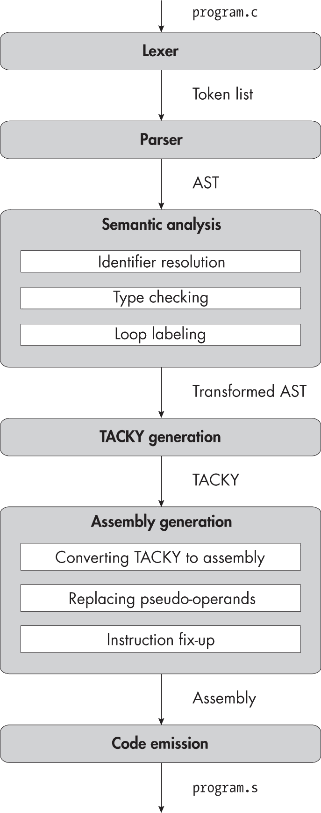
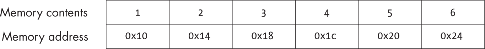

<samp class="SANS_Futura_Std_Book_Oblique_I_11">描述</samp>

<hgroup>

## <samp class="SANS_Futura_Std_Bold_Condensed_B_11">15</samp> <samp class="SANS_Dogma_OT_Bold_B_11">数组与指针运算</samp>

</hgroup>


在本章中，你将实现数组类型。你还将添加程序员用来处理数组的主要语言特性：复合初始化器、下标运算符和指针运算。数组和指针是不同的但密切相关的类型。许多数组类型的表达式会隐式转换为指针，而许多指针操作（如下标操作）则是用来操作指向数组元素的指针。因此，为了支持数组，你需要在上章中添加的指针支持基础上进行构建。

类型检查器在这里发挥着特别关键的作用。它将处理从数组到指针的隐式转换，并用你将依赖的类型信息注释抽象语法树（AST），以便执行指针运算。一旦类型检查器完成了所有的繁重工作，在 TACKY 生成过程中，将相对容易地将下标运算符和复合初始化器拆解为简单的指针操作。你在本章中不会添加任何新的汇编指令，但你会引入新的操作数来表示内存中的对象和这些对象中的元素。

和往常一样，我们将从我们要添加的语言构造的概述开始。我们将特别关注指针与数组之间的关系，以及这种关系如何体现在指针运算和下标表达式中。这是 C 语言中一个特别令人困惑的方面，也是本章中所有内容的关键。

### <samp class="SANS_Futura_Std_Bold_B_11">数组与指针运算</samp>

让我们先定义一些术语。在上一章中，我们将我们所知道的每种对象类型分为两类：算术类型和非算术类型。现在我们将引入另一个区分。*标量类型*表示一个单一的值。我们已经实现的指针和算术类型都是标量类型。*聚合类型*表示一组值。数组是聚合类型，结构体也是聚合类型（我们将在第十八章实现它）。数组中的所有值都具有相同的类型，这就是数组的*元素类型*。

#### <samp class="SANS_Futura_Std_Bold_Condensed_Oblique_BI_11">数组声明与初始化器</samp>

当我们声明一个数组时，我们指定它的元素类型以及它包含多少个元素。例如，我们可以声明一个包含三个<samp class="SANS_TheSansMonoCd_W5Regular_11">int</samp>对象的数组：

```
int int_array[3];
```

或者我们也可以声明一个包含五个指向<samp class="SANS_TheSansMonoCd_W5Regular_11">double</samp>类型的指针的数组：

```
double *(ptr_array[5]);
```

（记住，我们通过从基本类型—在这个例子中是<samp class="SANS_TheSansMonoCd_W5Regular_11">double</samp>—开始，然后从外到内应用类型推导来解释声明。）

这两个示例都使用标量元素类型，但我们也可以使用聚合元素类型。以下示例声明了一个包含三个元素的数组，其中每个元素本身是一个包含两个<samp class="SANS_TheSansMonoCd_W5Regular_11">long</samp>对象的数组：

```
long nested_array[3][2];
```

这样的数组数组被称为*多维数组*。请注意，我们仍然从外到内应用类型推导来确定这个数组的类型。我们从基础类型<samp class="SANS_TheSansMonoCd_W5Regular_11">long</samp>开始，应用由<samp class="SANS_TheSansMonoCd_W5Regular_11">[2]</samp>指定的推导，得到类型为“两个<samp class="SANS_TheSansMonoCd_W5Regular_11">long</samp>对象的数组”，然后应用由<samp class="SANS_TheSansMonoCd_W5Regular_11">[3]</samp>指定的推导，得到类型为“三个包含两个<samp class="SANS_TheSansMonoCd_W5Regular_11">long</samp>对象数组的数组”。

你可以使用*复合初始化器*初始化一个数组，指定每个元素的初始值：

```
int int_array[3] = {1, foo(), a * 4};
```

你也可以使用嵌套的复合初始化器初始化一个多维数组：

```
long nested_array[3][2] = {{a, a + 1}, {3l, -4}, {foo(), 6}};
```

在这里，三个嵌套的复合初始化器初始化外部数组的三个元素。每个元素本身是一个包含两个<samp class="SANS_TheSansMonoCd_W5Regular_11">long</samp>对象的数组。每个这些元素的嵌套初始化器指定了两个算术值（这些值可以隐式转换为<samp class="SANS_TheSansMonoCd_W5Regular_11">long</samp>）。

你也可以让一个数组不初始化。如果它具有自动存储持续时间，它的初始值将是未定义的。如果它具有静态存储持续时间，它将被初始化为全零。换句话说，我们将未初始化的数组视为与未初始化的标量对象相同。

#### <samp class="SANS_Futura_Std_Bold_Condensed_Oblique_BI_11">数组的内存布局</samp>

到此为止，讨论一下平面数组和多维数组的内存布局会有所帮助。如果你声明一个包含*n*个对象的数组，这些*n*个对象将在内存中按顺序排列。考虑清单 15-1 中的数组，它具有标量元素类型。

```
int six_ints[6] = {1, 2, 3, 4, 5, 6};
```

<samp class="SANS_Futura_Std_Book_Oblique_I_11">清单 15-1：标量值的数组</samp>

图 15-1 展示了<samp class="SANS_TheSansMonoCd_W5Regular_11">six_ints</samp>在初始化后可能在内存中的样子（此图中的内存地址仅供说明，实际系统中这些地址不一定有效）。



<samp class="SANS_Futura_Std_Book_Oblique_I_11">图 15-1：内存中</samp> <samp class="SANS_Futura_Std_Book_Oblique_I_11">six_ints 的布局 描述</samp>

将此声明与列表 15-2 进行对比，后者声明了一个具有与<samp class="SANS_TheSansMonoCd_W5Regular_11">six_ints</samp>相同数量和类型的标量元素的多维数组。

```
int three_arrays[3][2] = {{1, 2}, {3, 4}, {5, 6}};
```

<samp class="SANS_Futura_Std_Book_Oblique_I_11">列表 15-2：嵌套数组的数组</samp>

存储<samp class="SANS_TheSansMonoCd_W5Regular_11">three_arrays</samp>的内存将像图 15-1 所示那样。在内存中，无法区分一个元素的结束和另一个元素的开始，因此这两个数组是不可区分的。尽管<samp class="SANS_TheSansMonoCd_W5Regular_11">three_arrays</samp>的嵌套结构不会影响其在内存中的布局，但它会影响如何访问单个数组元素，正如我们接下来将看到的。

#### <samp class="SANS_Futura_Std_Bold_Condensed_Oblique_BI_11">数组到指针衰退</samp>

一旦我们定义并初始化了一个数组，我们能对它做什么呢？实际上，能做的很少。事实上，数组类型的对象只有两种有效操作。首先，我们可以使用<samp class="SANS_TheSansMonoCd_W5Regular_11">sizeof</samp>运算符获取数组的大小，我们将在第十七章中实现它。其次，我们可以使用<samp class="SANS_TheSansMonoCd_W5Regular_11">&</samp>运算符获取它的地址：

```
int my_array[3] = {1, 2, 3};
int (*my_pointer)[3] = &my_array;
```

就这样！数组上没有其他有效的操作。这听起来可能很荒谬，因为 C 程序经常读取和写入数组元素。那么这里到底发生了什么呢？C 标准（第 6.3.2.1 节，第 3 段）提供了这个谜题的答案：“除非它是<samp class="SANS_TheSansMonoCd_W5Regular_11">sizeof</samp>运算符的操作数，或者一元的<samp class="SANS_TheSansMonoCd_W5Regular_11">&</samp>运算符的操作数……具有‘数组类型 *type*’的表达式会被转换为指向数组对象初始元素的‘指针类型 *type*’表达式，并且不是左值。”

这种从数组到指针的隐式转换被称为*数组到指针衰退*。（我有时会说数组衰退为指针，有时说它隐式地转换为指针，两者意思相同。）虽然我们不能对数组做太多操作，但可以对指针进行各种有用的操作。我们已经实现了一些这样的操作，并将在本章添加更多操作。

列表 15-3 中的代码片段展示了数组衰退的示例。

```
int my_array[3] = {1, 2, 3};
int *my_pointer = ❶ my_array;
return ❷ *my_pointer;
```

<samp class="SANS_Futura_Std_Book_Oblique_I_11">列表 15-3：将数组隐式转换为指针</samp>

假设<samp class="SANS_TheSansMonoCd_W5Regular_11">my_array</samp>的起始地址是<samp class="SANS_TheSansMonoCd_W5Regular_11">0x10</samp>。当<samp class="SANS_TheSansMonoCd_W5Regular_11">my_array</samp>出现在赋值表达式的右侧时，它会被隐式转换为一个指针，类型是<samp class="SANS_TheSansMonoCd_W5Regular_11">int *</samp>，值为<samp class="SANS_TheSansMonoCd_W5Regular_11">0x10</samp> ❶。然后我们可以将这个指针的值赋给<samp class="SANS_TheSansMonoCd_W5Regular_11">my_pointer</samp>。当我们解引用<samp class="SANS_TheSansMonoCd_W5Regular_11">my_pointer</samp>时，结果是存储在<samp class="SANS_TheSansMonoCd_W5Regular_11">my_array</samp>前 4 个字节中的<samp class="SANS_TheSansMonoCd_W5Regular_11">int</samp>对象 ❷。因此，我们将返回该对象的当前值<samp class="SANS_TheSansMonoCd_W5Regular_11">1</samp>。注意，地址<samp class="SANS_TheSansMonoCd_W5Regular_11">0x10</samp>的解释可以根据其类型有所不同。作为<samp class="SANS_TheSansMonoCd_W5Regular_11">int *</samp>，它指向数组的第一个元素，我们可以通过指针解引用操作来读写它。表达式<samp class="SANS_TheSansMonoCd_W5Regular_11">&my_array</samp>具有相同的值<samp class="SANS_TheSansMonoCd_W5Regular_11">0x10</samp>，但它指向整个数组，其类型是<samp class="SANS_TheSansMonoCd_W5Regular_11">int (*)[3]</samp>。

在处理多维数组时，跟踪指针的类型尤为重要。请参考清单 15-4，它尝试给两个数组元素赋值。

```
int nested_array[2][2] = {{1, 2}, {3, 4}};
**nested_array = 10;
*nested_array = 0;
```

<samp class="SANS_Futura_Std_Book_Oblique_I_11">清单 15-4：数组元素的合法和非法赋值</samp>

第一个赋值表达式，将值赋给<samp class="SANS_TheSansMonoCd_W5Regular_11">**nested_array</samp>，是有效的。首先，我们隐式地将变量<samp class="SANS_TheSansMonoCd_W5Regular_11">nested_array</samp>转换为指向数组初始元素的指针。该元素的类型是<samp class="SANS_TheSansMonoCd_W5Regular_11">int[2]</samp>，因此指针的类型是<samp class="SANS_TheSansMonoCd_W5Regular_11">int(*)[2]</samp>。对这个指针的第一次解引用操作会返回一个类型为<samp class="SANS_TheSansMonoCd_W5Regular_11">int[2]</samp>的数组对象。我们隐式地将*这个*数组转换为类型为<samp class="SANS_TheSansMonoCd_W5Regular_11">int *</samp>的指针。因此，第二次指针解引用操作产生一个<samp class="SANS_TheSansMonoCd_W5Regular_11">int</samp>对象，我们可以对其进行赋值。赋值表达式将该对象当前的值<samp class="SANS_TheSansMonoCd_W5Regular_11">1</samp>覆盖为新值<samp class="SANS_TheSansMonoCd_W5Regular_11">10</samp>。这个表达式中的<samp class="SANS_TheSansMonoCd_W5Regular_11">int(*)[2]</samp>和<samp class="SANS_TheSansMonoCd_W5Regular_11">int *</samp>指针都指向<samp class="SANS_TheSansMonoCd_W5Regular_11">nested_array</samp>的起始位置；只是它们的类型不同。

下一个赋值表达式，将值赋给<samp class="SANS_TheSansMonoCd_W5Regular_11">*nested_array</samp>，是非法的。它的开始与之前相同：我们隐式地将<samp class="SANS_TheSansMonoCd_W5Regular_11">nested_array</samp>转换为类型为<samp class="SANS_TheSansMonoCd_W5Regular_11">int(*)[2]</samp>的指针，解引用它，并隐式地将结果转换为类型为<samp class="SANS_TheSansMonoCd_W5Regular_11">int *</samp>的指针。接着，我们尝试直接赋值给这个指针，但 C 标准声明这个隐式转换的结果“不是一个左值”，因此我们不能赋值给它。即使允许这种赋值，也不清楚它会做什么；它就像是对<samp class="SANS_TheSansMonoCd_W5Regular_11">&</samp>操作的结果进行赋值一样。

现在我们知道如何访问数组的初始元素，无论在哪个维度。我们甚至可以读写数组中的初始标量对象。然而，我们通常还希望访问数组的其他元素。为此，我们需要使用指针运算。

#### <samp class="SANS_Futura_Std_Bold_Condensed_Oblique_BI_11">使用指针运算访问数组元素</samp>

一旦我们获得了指向数组初始元素的指针，我们就可以使用指针加法来生成指向数组其他元素的指针。让我们通过列表 15-5 中的例子来讲解。

```
int array[3] = {1, 2, 3};
int *ptr = array + 1;
```

<samp class="SANS_Futura_Std_Book_Oblique_I_11">列表 15-5：使用指针运算访问数组后续元素</samp>

我们将再次使用<samp class="SANS_TheSansMonoCd_W5Regular_11">0x10</samp>作为数组的起始地址。在表达式<samp class="SANS_TheSansMonoCd_W5Regular_11">array</samp> <samp class="SANS_TheSansMonoCd_W5Regular_11">+</samp> <samp class="SANS_TheSansMonoCd_W5Regular_11">1</samp>中，变量<samp class="SANS_TheSansMonoCd_W5Regular_11">array</samp>像往常一样变为指向初始数组元素的指针。当我们将<samp class="SANS_TheSansMonoCd_W5Regular_11">1</samp>加到这个指针时，结果是指向数组中下一个<samp class="SANS_TheSansMonoCd_W5Regular_11">int</samp>元素的指针。由于每个<samp class="SANS_TheSansMonoCd_W5Regular_11">int</samp>是 4 个字节，我们需要将<samp class="SANS_TheSansMonoCd_W5Regular_11">1</samp>乘以 4 的倍数来计算需要加到<samp class="SANS_TheSansMonoCd_W5Regular_11">array</samp>地址的字节数。结果指针的值是<samp class="SANS_TheSansMonoCd_W5Regular_11">0x14</samp>。如果我们解引用这个指针，我们将得到地址<samp class="SANS_TheSansMonoCd_W5Regular_11">0x14</samp>处的<samp class="SANS_TheSansMonoCd_W5Regular_11">int</samp>对象，它的当前值是<samp class="SANS_TheSansMonoCd_W5Regular_11">2</samp>。数组元素是从零开始索引的，所以我们说数组的初始元素位于索引 0，下一元素位于索引 1。

更一般地，当我们将一个整数*n*加到一个指针时，结果是指向数组中位置为*n*个元素后移的另一个元素的指针。类似地，我们可以通过减去一个整数（或加上一个负整数）来在数组中向后移动。如果结果会超出数组的边界，行为是未定义的。

> <samp class="SANS_Dogma_OT_Bold_B_39">注意</samp>

*如果 x 是一个*n*元素的数组，x + n 指向 x 的末尾之后的位置。这个指针是一个特例，它不被认为是越界的，你可以在指针运算中使用它。例如，你可以将它与指向同一数组中其他元素的指针进行比较。（当你遍历数组元素时，这是一种有用的方式来测试你是否已经到达数组的末尾。）但解引用它是未定义行为，因为它并不指向数组中的任何元素。*

当我们进行指针运算时，我们所指向的数组的嵌套结构非常重要，因为它决定了什么算作单个元素。让我们看一下清单 15-6，看看这如何适用于我们在清单 15-1 和 15-2 中定义的两个数组，这两个数组在内存中具有相同的内容。

```
int six_ints[6] = {1, 2, 3, 4, 5, 6};
int three_arrays[3][2] = {{1, 2}, {3, 4}, {5, 6}};
❶ int *int_ptr = six_ints + 1;
❷ int (*array_ptr)[2] = three_arrays + 1;
```

<samp class="SANS_Futura_Std_Book_Oblique_I_11">清单 15-6：平面和嵌套数组的指针运算</samp>

表达式 <samp class="SANS_TheSansMonoCd_W5Regular_11">six_ints</samp> <samp class="SANS_TheSansMonoCd_W5Regular_11">+</samp> <samp class="SANS_TheSansMonoCd_W5Regular_11">1</samp> 的结果是一个指向 <samp class="SANS_TheSansMonoCd_W5Regular_11">six_ints</samp> 中索引 1 位置的元素的指针 ❶。该元素是一个值为 <samp class="SANS_TheSansMonoCd_W5Regular_11">2</samp> 的 <samp class="SANS_TheSansMonoCd_W5Regular_11">int</samp>。类似地，当我们计算 <samp class="SANS_TheSansMonoCd_W5Regular_11">three_arrays</samp> <samp class="SANS_TheSansMonoCd_W5Regular_11">+</samp> <samp class="SANS_TheSansMonoCd_W5Regular_11">1</samp> 时，我们得到一个指向 <samp class="SANS_TheSansMonoCd_W5Regular_11">three_arrays</samp> 中索引 1 位置的数组元素的指针 ❷。然而，在这种情况下，该元素本身是一个包含两个 <samp class="SANS_TheSansMonoCd_W5Regular_11">int</samp> 对象的数组，其当前值为 <samp class="SANS_TheSansMonoCd_W5Regular_11">3</samp> 和 <samp class="SANS_TheSansMonoCd_W5Regular_11">4</samp>。尽管 <samp class="SANS_TheSansMonoCd_W5Regular_11">six_ints</samp> 和 <samp class="SANS_TheSansMonoCd_W5Regular_11">three_arrays</samp> 在内存中的内容可能相同，但对它们执行相同的操作会产生非常不同的结果。

那么我们如何访问 <samp class="SANS_TheSansMonoCd_W5Regular_11">three_arrays</samp> 中的标量对象呢？例如，如何读取这个数组中的最后一个 <samp class="SANS_TheSansMonoCd_W5Regular_11">int</samp>，其值为 <samp class="SANS_TheSansMonoCd_W5Regular_11">6</samp>？首先，我们将获取指向 <samp class="SANS_TheSansMonoCd_W5Regular_11">three_arrays</samp> 中最后一个元素的指针：

```
int (*outer_ptr)[2] = three_arrays + 2;
```

这将指向整个包含两个元素的数组 <samp class="SANS_TheSansMonoCd_W5Regular_11">{5, 6}</samp>。我们将对其进行解引用，以获取指向该数组中单个标量元素的指针：

```
int *inner_ptr = *outer_ptr;
```

该解引用表达式会产生一个类型为 <samp class="SANS_TheSansMonoCd_W5Regular_11">int[2]</samp> 的数组，它会衰减为一个类型为 <samp class="SANS_TheSansMonoCd_W5Regular_11">int *</samp> 的指针。现在，<samp class="SANS_TheSansMonoCd_W5Regular_11">inner_ptr</samp> 指向这个嵌套数组中的第一个 <samp class="SANS_TheSansMonoCd_W5Regular_11">int</samp>，其值为 <samp class="SANS_TheSansMonoCd_W5Regular_11">5</samp>。我们将递增它，使其指向下一个 <samp class="SANS_TheSansMonoCd_W5Regular_11">int</samp>，其值为 <samp class="SANS_TheSansMonoCd_W5Regular_11">6</samp>：

```
inner_ptr = inner_ptr + 1;
```

此时，我们可以通过正常的指针解引用访问它的值：

```
int result = *inner_ptr;
```

我们可以将这些语句合并为 Listing 15-7 中的单一表达式。

```
int result = *(*(three_arrays + 2) + 1);
```

<samp class="SANS_Futura_Std_Book_Oblique_I_11">Listing 15-7: 访问</samp> <samp class="SANS_Futura_Std_Book_Oblique_I_11">three_arrays</samp> <samp class="SANS_Futura_Std_Book_Oblique_I_11">中的最后一个</samp> <samp class="SANS_Futura_Std_Book_Oblique_I_11">int</samp>

通过反复的指针加法、解引用和从数组到指针的隐式转换，我们可以访问多维数组中的任何元素。显然，这是一个巨大的痛苦。下标操作符，<samp class="SANS_TheSansMonoCd_W5Regular_11">[]</samp>，提供了更方便的语法来完成相同的操作。表达式 <samp class="SANS_TheSansMonoCd_W5Regular_11">a[i]</samp> 等价于 <samp class="SANS_TheSansMonoCd_W5Regular_11">*(a</samp> <samp class="SANS_TheSansMonoCd_W5Regular_11">+</samp> <samp class="SANS_TheSansMonoCd_W5Regular_11">i)</samp>，因此我们可以将 清单 15-7 改写为 清单 15-8。

```
int result = three_arrays[2][1];
```

<samp class="SANS_Futura_Std_Book_Oblique_I_11">清单 15-8：更便捷的访问最后一个</samp> <samp class="SANS_Futura_Std_Book_Oblique_I_11">int</samp> <samp class="SANS_Futura_Std_Book_Oblique_I_11">在</samp> <samp class="SANS_Futura_Std_Book_Oblique_I_11">three_arrays</samp>

我想强调的最后一点是，下标和指针算术适用于所有指针，而不仅仅是从数组衰退出来的指针。如果被指向的对象不在数组中，我们将把它当作一个一元素数组中的唯一元素来处理。例如，清单 15-9 是完全有效的。

```
int a = 5;
int *ptr = &a;
return ptr[0] == 5;
```

<samp class="SANS_Futura_Std_Book_Oblique_I_11">清单 15-9：为标量对象进行下标操作</samp>

当我们将 <samp class="SANS_TheSansMonoCd_W5Regular_11">0</samp> 加到 <samp class="SANS_TheSansMonoCd_W5Regular_11">ptr</samp> 并解引用结果时，我们得到对象 <samp class="SANS_TheSansMonoCd_W5Regular_11">a</samp>。因此，表达式 <samp class="SANS_TheSansMonoCd_W5Regular_11">ptr[0]</samp> <samp class="SANS_TheSansMonoCd_W5Regular_11">==</samp> <samp class="SANS_TheSansMonoCd_W5Regular_11">5</samp> 评估为 1（即，真）。

#### <samp class="SANS_Futura_Std_Bold_Condensed_Oblique_BI_11">更多指针算术</samp>

我们将支持对指针进行另外两个操作。第一个是减法；清单 15-10 给出了一个示例。

```
int arr[3] = {1, 2, 3};
int *ptr = arr + 2;
return ptr - arr;
```

<samp class="SANS_Futura_Std_Book_Oblique_I_11">清单 15-10：减去两个指针</samp>

当我们减去指向同一数组中两个元素的指针时，结果是它们索引之间的差值。在这个例子中，毫不意外地，我们返回 <samp class="SANS_TheSansMonoCd_W5Regular_11">2</samp>。

我们还可以比较指向数组元素的指针，就像在 清单 15-11 中一样。

```
int arr[3] = {1, 2, 3};
int *ptr = arr + 2;
return ptr > arr;
```

<samp class="SANS_Futura_Std_Book_Oblique_I_11">清单 15-11：比较指针</samp>

指向较高数组索引元素的指针会比较大于指向较低索引元素的指针。在这个例子中，<samp class="SANS_TheSansMonoCd_W5Regular_11">ptr</samp> 指向索引为 2 的元素，<samp class="SANS_TheSansMonoCd_W5Regular_11">arr</samp> 会退化为指向索引为 0 的元素的指针，因此比较 <samp class="SANS_TheSansMonoCd_W5Regular_11">ptr > arr</samp> 的结果为 1。如果两个指针不指向同一个数组，那么它们相减或比较的结果是未定义的。

#### <samp class="SANS_Futura_Std_Bold_Condensed_Oblique_BI_11">函数声明中的数组类型</samp>

函数不能返回数组，如以下声明所示，这是不合法的：

```
int foo(void)[3];
```

函数也不能接受数组作为参数。奇怪的是，C 标准允许你*声明*一个带有数组参数的函数，但它要求编译器将你的函数签名调整为接受指针。例如，声明

```
int foo(int array_of_three_elements[3]);
```

将变为：

```
int foo(int *array_of_three_elements);
```

我们将调整带有数组类型的参数，使其在类型检查器中具有相应的指针类型。

#### <samp class="SANS_Futura_Std_Bold_Condensed_Oblique_BI_11">我们不实现的功能</samp>

我们不会支持的功能足够重要，我会明确提到它们。我们不会实现可变长度数组，其长度在运行时决定，如下所示：

```
int variable_length_array[x];
```

我们只允许常量作为数组声明中的维度。我们也不允许声明不完整的数组类型：

```
int array[];
```

C 要求在定义数组时指定数组的维度，但在声明时不需要。然而，我们将要求在声明和定义中都指定数组维度。

我们不会实现*复合字面量*，它允许你在初始化器外构造数组对象（以及其他聚合对象）：

```
int *p = (int []){2, 4};
```

最后，我们不会完全支持 C 的聚合对象初始化语义。复合初始化器有些自由，你可以省略花括号，将标量值包装在花括号中，或者初始化某些元素而不初始化其他元素。这使得很难弄清楚哪个表达式应该初始化哪个元素。我们将采取更严格的方法。首先，我们将要求每个嵌套数组的初始化器周围加上花括号。换句话说，我们将接受以下声明

```
int arr[2][2] = {{1, 2}, {3, 4}};
```

但是我们将拒绝以下等效的声明，尽管 C 标准允许它：

```
int arr[2][2] = {1, 2, 3, 4};
```

我们还将拒绝围绕标量初始化器的花括号，如下所示：

```
int i = {3};
```

我们不支持设计符号，它允许你以非顺序的方式初始化元素：

```
int arr[3] = {0, [2] = 1};
```

然而，我们*将*允许不初始化每个数组元素的复合初始化器，如下所示：

```
int arr[3] = {1, 2};
```

在这种情况下，我们将用零填充剩余的元素；这是 C 标准所要求的行为。现在我们已经明确了我们将构建和不会构建的内容，我们可以继续进行词法分析器的部分。

### <samp class="SANS_Futura_Std_Bold_B_11">词法分析器</samp>

在这一章中，你将添加两个标记：

<samp class="SANS_TheSansMonoCd_W7Bold_B_11">[</samp> 一个左方括号

<samp class="SANS_TheSansMonoCd_W7Bold_B_11">]</samp> 一个右方括号

添加这些标记后，你可以测试你的词法分析器。

### <samp class="SANS_Futura_Std_Bold_B_11">解析器</samp>

接下来，我们将把数组类型、下标表达式和复合初始化器添加到抽象语法树（AST）中。数组的类型表示数组中元素的数量以及这些元素的类型：

```
type = `--snip--` | Array(type element, int size)
```

我们可以通过嵌套 <samp class="SANS_TheSansMonoCd_W5Regular_11">Array</samp> 构造器来指定多维数组。例如，我们将表示声明的类型

```
int x[3][4];
```

如 <samp class="SANS_TheSansMonoCd_W5Regular_11">Array(Array(Int, 4), 3)</samp>。由于我们不支持变长数组，每个数组类型必须具有常量大小。

一个下标表达式包含两个子表达式，一个指针和一个索引：

```
exp = `--snip--`
    | Subscript(exp, exp)
```

令人惊讶的是，这两个子表达式的出现顺序并不重要；表达式 <samp class="SANS_TheSansMonoCd_W5Regular_11">x[1]</samp> 和 <samp class="SANS_TheSansMonoCd_W5Regular_11">1[x]</samp> 是等价的。

最后，我们将添加一个 <samp class="SANS_TheSansMonoCd_W5Regular_11">initializer</samp> 构造，支持标量和复合变量初始化器：

```
initializer = SingleInit(exp) | CompoundInit(initializer*)
```

我们将使用 <samp class="SANS_TheSansMonoCd_W5Regular_11">CompoundInit</samp> 来初始化数组，使用 <samp class="SANS_TheSansMonoCd_W5Regular_11">SingleInit</samp> 来初始化标量对象，包括单个数组元素。对于多维数组的每一行，我们将使用嵌套的 <samp class="SANS_TheSansMonoCd_W5Regular_11">CompoundInit</samp> 构造。 Listing 15-12 显示了如何表示初始化器 <samp class="SANS_TheSansMonoCd_W5Regular_11">{{1, 2}, {3, 4}, {5, 6}}</samp>。

```
CompoundInit([
    CompoundInit([SingleInit(Constant(ConstInt(1))),
                  SingleInit(Constant(ConstInt(2)))]),
    CompoundInit([SingleInit(Constant(ConstInt(3))),
                  SingleInit(Constant(ConstInt(4)))]),
    CompoundInit([SingleInit(Constant(ConstInt(5))),
                  SingleInit(Constant(ConstInt(6)))])
])
```

<samp class="SANS_Futura_Std_Book_Oblique_I_11">Listing 15-12: 表示来自 Listing 15-2 的</samp> <samp class="SANS_Futura_Std_Book_Oblique_I_11">three_arrays</samp><samp class="SANS_Futura_Std_Book_Oblique_I_11"> 初始化器作为 AST 节点</samp>

类型检查器将用类型注释初始化器，就像它对 <samp class="SANS_TheSansMonoCd_W5Regular_11">exp</samp> 节点所做的一样。无论你如何支持对 <samp class="SANS_TheSansMonoCd_W5Regular_11">exp</samp> 节点的类型注释，你也应该对 <samp class="SANS_TheSansMonoCd_W5Regular_11">initializer</samp> 做同样的处理。

Listing 15-13 给出了完整的 AST 定义，章节中的新增内容已加粗。

```
program = Program(declaration*)
declaration = FunDecl(function_declaration) | VarDecl(variable_declaration)
variable_declaration = (identifier name, **initializer? init,**
                        type var_type, storage_class?)
function_declaration = (identifier name, identifier* params, block? body,
                        type fun_type, storage_class?)
**initializer = SingleInit(exp) | CompoundInit(initializer*)**
type = Int | Long | UInt | ULong | Double
     | FunType(type* params, type ret)
     | Pointer(type referenced)
 **| Array(type element, int size)**
storage_class = Static | Extern
block_item = S(statement) | D(declaration)
block = Block(block_item*)
for_init = InitDecl(variable_declaration) | InitExp(exp?)
statement = Return(exp)
          | Expression(exp)
          | If(exp condition, statement then, statement? else)
          | Compound(block)
          | Break
          | Continue
          | While(exp condition, statement body)
          | DoWhile(statement body, exp condition)
          | For(for_init init, exp? condition, exp? post, statement body)
          | Null
exp = Constant(const)
    | Var(identifier)
    | Cast(type target_type, exp)
    | Unary(unary_operator, exp)
    | Binary(binary_operator, exp, exp)
    | Assignment(exp, exp)
    | Conditional(exp condition, exp, exp)
    | FunctionCall(identifier, exp* args)
    | Dereference(exp)
    | AddrOf(exp)
 **| Subscript(exp, exp)**
unary_operator = Complement | Negate | Not
binary_operator = Add | Subtract | Multiply | Divide | Remainder | And | Or
                | Equal | NotEqual | LessThan | LessOrEqual
                | GreaterThan | GreaterOrEqual
const = ConstInt(int) | ConstLong(int) 
      | ConstUInt(int) | ConstULong(int)
      | ConstDouble(double)
```

<samp class="SANS_Futura_Std_Book_Oblique_I_11">Listing 15-13: 包含数组类型、复合初始化器和下标表达式的抽象语法树</samp>

让我们逐步解析如何将这些内容添加到 AST 中。

#### <samp class="SANS_Futura_Std_Bold_Condensed_Oblique_BI_11">解析数组声明符</samp>

你在上一章学习了如何解析指针和函数声明符；现在我们将扩展该代码以处理数组声明符。列表 15-14 显示了如何扩展我们在列表 14-6 中定义的 <samp class="SANS_TheSansMonoCd_W5Regular_11">declarator</samp> 构造。

```
declarator = Ident(identifier)
           | PointerDeclarator(declarator)
 **| ArrayDeclarator(declarator, int size)**
           | FunDeclarator(param_info* params, declarator)
```

<samp class="SANS_Futura_Std_Book_Oblique_I_11">列表 15-14：表示数组声明符</samp>

接下来，我们将向语法中添加数组声明符。由于它们的优先级高于指针声明符，因此它们应当属于 <samp class="SANS_TheSansMonoCd_W5Regular_11"><direct-declarator></samp> 语法规则：

```
<direct-declarator> ::= <simple-declarator> [<declarator-suffix>]
<declarator-suffix> ::= <param-list> | {"[" <const> "]"}+
```

直接声明符是一个简单的声明符，具有一个可选的后缀：要么是括起来的函数参数列表，要么是常量数组维度的序列，形式为 <samp class="SANS_TheSansMonoCd_W5Regular_11">[</samp><samp class="SANS_TheSansMonoCd_W5Regular_Italic_I_11">const</samp><samp class="SANS_TheSansMonoCd_W5Regular_11">]</samp>。每个 <samp class="SANS_TheSansMonoCd_W5Regular_11">ArrayDeclarator</samp> 仅指定一个数组维度，因此我们将解析带有多个维度的 <samp class="SANS_TheSansMonoCd_W5Regular_11"><declarator-suffix></samp> 为多个嵌套的 <samp class="SANS_TheSansMonoCd_W5Regular_11">ArrayDeclarator</samp> 节点。例如，我们将解析声明符 <samp class="SANS_TheSansMonoCd_W5Regular_11">array[1][2]</samp> 为：

```
ArrayDeclarator(ArrayDeclarator(Ident("array"), 1), 2)
```

<samp class="SANS_TheSansMonoCd_W5Regular_11"><declarator-suffix></samp> 的语法规则允许将浮点常量作为数组维度，但 C 标准要求数组维度必须是整数。当你解析 <samp class="SANS_TheSansMonoCd_W5Regular_11"><declarator-suffix></samp> 时，应该拒绝浮点常量并接受任何整数类型的常量。C 标准还要求数组维度必须大于零，但 Clang 和 GCC 支持零长度数组作为语言扩展。是否接受零长度数组由你决定；测试套件没有覆盖此情况。

最后，我们将更新 <samp class="SANS_TheSansMonoCd_W5Regular_11">process_declarator</samp>，它将 <samp class="SANS_TheSansMonoCd_W5Regular_11">declarator</samp> 构造转化为 AST 节点。列表 15-15 说明了如何在 <samp class="SANS_TheSansMonoCd_W5Regular_11">process_declarator</samp> 中处理数组声明符。

```
process_declarator(declarator, base_type):
    match declarator with
  | `--snip--`
    | ArrayDeclarator(inner, size) ->
        derived_type = Array(base_type, size)
        return process_declarator(inner, derived_type)
```

<samp class="SANS_Futura_Std_Book_Oblique_I_11">列表 15-15：应用数组类型推导</samp>

这个列表遵循我们在第十四章中介绍的相同模式，用于推导指针类型。

#### <samp class="SANS_Futura_Std_Bold_Condensed_Oblique_BI_11">解析抽象数组声明符</samp>

接下来，让我们处理抽象声明符，它们指定类型而不声明标识符。我们将根据列表 15-16 中的语法规则解析抽象数组声明符。

```
<direct-abstract-declarator> ::= "(" <abstract-declarator> ")" {"[" <const> "]"}
                               | {"[" <const> "]"}+
```

<samp class="SANS_Futura_Std_Book_Oblique_I_11">列表 15-16：抽象数组声明符的语法规则</samp>

一个直接抽象声明符要么是一个括号包围的声明符，后面可选地跟随一系列数组维度，要么仅仅是一个数组维度的序列。（请记住，EBNF 语法中的 <samp class="SANS_TheSansMonoCd_W5Regular_11">{}</samp> 表示零次或多次重复，而 <samp class="SANS_TheSansMonoCd_W5Regular_11">{}+</samp> 表示一次或多次重复。）我们将在这里采取与支持普通声明符时相同的步骤。列表 15-17 显示了如何扩展 <samp class="SANS_TheSansMonoCd_W5Regular_11">abstract_declarator</samp> 构造。

```
abstract_declarator = AbstractPointer(abstract_declarator)
 **| AbstractArray(abstract_declarator, int size)**
                    | AbstractBase
```

<samp class="SANS_Futura_Std_Book_Oblique_I_11">列表 15-17：表示抽象数组声明符</samp>

在更新了 <samp class="SANS_TheSansMonoCd_W5Regular_11">abstract_declarator</samp> 之后，我们将修改解析代码以处理 列表 15-16 中的语法规则。（该代码应接受整数常量作为数组维度，并拒绝浮点常量，就像解析普通声明符的代码一样。）最后，我们将更新 <samp class="SANS_TheSansMonoCd_W5Regular_11">process_abstract _declarator</samp>。

#### <samp class="SANS_Futura_Std_Bold_Condensed_Oblique_BI_11">解析复合初始化器</samp>

现在让我们定义初始化器的语法规则：

```
<initializer> ::= <exp> | "{" <initializer> {"," <initializer>} [","] "}"
```

这个规则很简单：初始化器要么是一个表达式，要么是一个大括号包围的包含一个或多个嵌套初始化器的列表。注意，在初始化器列表的最后一个元素后可以有一个逗号：<samp class="SANS_TheSansMonoCd_W5Regular_11">{1, 2, 3}</samp> 和 <samp class="SANS_TheSansMonoCd_W5Regular_11">{1, 2, 3,}</samp> 都是有效的复合初始化器。

#### <samp class="SANS_Futura_Std_Bold_Condensed_Oblique_BI_11">解析下标表达式</samp>

我们需要解析的最后一个新语言特性是下标操作符。下标是一种*后缀*操作符，它跟随在它修改的表达式之后。后缀操作符的优先级高于前缀操作符，如 <samp class="SANS_TheSansMonoCd_W5Regular_11">&</samp>、<samp class="SANS_TheSansMonoCd_W5Regular_11">-</samp> 或 <samp class="SANS_TheSansMonoCd_W5Regular_11">~</samp>。我们将拆分 <samp class="SANS_TheSansMonoCd_W5Regular_11"><factor></samp> 语法规则，以反映这种优先级差异。在最高优先级的层次上，我们将有常量、变量、括号表达式和函数调用：

```
<primary-exp> ::= <const> | <identifier> | "(" <exp> ")"
                | <identifier> "(" [<argument-list>] ")"
```

然后，我们将定义后缀表达式作为基本表达式，后面可选地跟随一系列下标操作符：

```
<postfix-exp> ::= <primary-exp> {"[" <exp> "]"}
```

每个下标操作符都是一个被方括号包围的表达式。最后，我们将定义一元表达式，其中包括前缀操作符和强制转换操作符：

```
<unary-exp> ::= <unop> <unary-exp>
              | "(" {<type-specifier>}+ [<abstract-declarator>] ")" <unary-exp>
              | <postfix-exp>
```

列表 15-18 显示了完整的语法，并将本章的更改加粗显示。

```
<program> ::= {<declaration>}
<declaration> ::= <variable-declaration> | <function-declaration>
<variable-declaration> ::= {<specifier>}+ <declarator> ["=" **<initializer>]** ";"
<function-declaration> ::= {<specifier>}+ <declarator> (<block> | ";")
<declarator> ::= "*" <declarator> | <direct-declarator>
<direct-declarator> ::= <simple-declarator> **[<declarator-suffix>]**
**<declarator-suffix> ::= <param-list> | {"[" <const> "]"}+**
<param-list> ::= "(" "void" ")" | "(" <param> {"," <param>} ")"
<param> ::= {<type-specifier>}+ <declarator>
<simple-declarator> ::= <identifier> | "(" <declarator> ")"
<type-specifier> ::= "int" | "long" | "unsigned" | "signed" | "double"
<specifier> ::= <type-specifier> | "static" | "extern"
<block> ::= "{" {<block-item>} "}"
<block-item> ::= <statement> | <declaration>
**<initializer> ::= <exp> | "{" <initializer> {"," <initializer>} [","] "}"**
<for-init> ::= <variable-declaration> | [<exp>] ";"
<statement> ::= "return" <exp> ";"
              | <exp> ";"
              | "if" "(" <exp> ")" <statement> ["else" <statement>]
              | <block>
              | "break" ";"
              | "continue" ";"
              | "while" "(" <exp> ")" <statement>
              | "do" <statement> "while" "(" <exp> ")" ";"
              | "for" "(" <for-init> [<exp>] ";" [<exp>] ")" <statement>
              | ";"
<exp> ::= **<unary-exp>** | <exp> <binop> <exp> | <exp> "?" <exp> ":" <exp>
**<unary-exp> ::= <unop> <unary-exp>**
 **| "(" {<type-specifier>}+ [<abstract-declarator>] ")" <unary-exp>**
 **| <postfix-exp>**
**<postfix-exp> ::= <primary-exp> {"[" <exp> "]"}**
**<primary-exp> ::= <const> | <identifier> | "(" <exp> ")"**
                **| <identifier> "(" [<argument-list>] ")"**
<argument-list> ::= <exp> {"," <exp>}
<abstract-declarator> ::= "*" [<abstract-declarator>]
                        | <direct-abstract-declarator>
<direct-abstract-declarator> ::= "(" <abstract-declarator> ")" **{"[" <const> "]"}**
                               **| {"[" <const> "]"}+**
<unop> ::= "-" | "~" | "!" | "*" | "&"
<binop> ::= "-" | "+" | "*" | "/" | "%" | "&&" | "||"
          | "==" | "!=" | "<" | "<=" | ">" | ">=" | "="
<const> ::= <int> | <long> | <uint> | <ulong> | <double>
<identifier> ::= ? An identifier token ?
<int> ::= ? An int token ?
<long> ::= ? An int or long token ?
<uint> ::= ? An unsigned int token ?
<ulong> ::= ? An unsigned int or unsigned long token ?
<double> ::= ? A floating-point constant token ?
```

<samp class="SANS_Futura_Std_Book_Oblique_I_11">清单 15-18：包含数组类型、复合初始化器和下标表达式的语法</samp>

一旦你更新了你的解析器，以适应清单 15-18 中的所有更改，你就可以开始测试了。

### <samp class="SANS_Futura_Std_Bold_B_11">类型检查器</samp>

类型检查器将在本章中完成大部分的繁重工作。它将为下标和指针算术表达式添加类型信息；验证复合初始化器的维度；并检测类型错误，例如将表达式强制转换为数组类型。它还将处理从数组到指针类型的隐式转换。就像我们将<samp class="SANS_TheSansMonoCd_W5Regular_11">Cast</samp>表达式插入到抽象语法树（AST）中以使隐式类型转换显式一样，我们将插入<samp class="SANS_TheSansMonoCd_W5Regular_11">AddrOf</samp>表达式，以使从数组到指针的转换变得显式。

#### <samp class="SANS_Futura_Std_Bold_Condensed_Oblique_BI_11">将数组转换为指针</samp>

我们将把任何数组类型的表达式转换为指针，除非它已经是<samp class="SANS_TheSansMonoCd_W5Regular_11">AddrOf</samp>表达式的操作数。这可能会让你想起上一章的内容，我们将每个表达式的结果转换为左值，除非我们获取了它的地址或对其进行了赋值。在第十四章中，我们引入了一个新的<samp class="SANS_TheSansMonoCd_W5Regular_11">emit_tacky_and_convert</samp>助手函数来管理左值转换；现在，我们将在不同的编译器过程中使用类似的设计模式。我们将定义一个新的<samp class="SANS_TheSansMonoCd_W5Regular_11">typecheck_and_convert</samp>函数，如清单 15-19 所示。

```
typecheck_and_convert(e, symbols):
    typed_e = typecheck_exp(e, symbols)
 match get_type(typed_e) with
    | Array(elem_t, size) ->
        addr_exp = AddrOf(typed_e)
        return set_type(addr_exp, Pointer(elem_t))
    | _ -> return typed_e
```

<samp class="SANS_Futura_Std_Book_Oblique_I_11">清单 15-19：隐式将数组转换为指针</samp>

如果一个表达式具有数组类型，我们插入一个<samp class="SANS_TheSansMonoCd_W5Regular_11">AddrOf</samp>操作以获取它的地址。然后我们记录它的结果类型，这是指向数组元素类型的指针。这与我们从显式的<samp class="SANS_TheSansMonoCd_W5Regular_11">&</samp>操作符中得到的结果类型不同，后者总是返回指向操作数类型的指针。以下是一个声明示例：

```
int arr[3];
```

表达式<samp class="SANS_TheSansMonoCd_W5Regular_11">&arr</samp>的类型是<samp class="SANS_TheSansMonoCd_W5Regular_11">int (*)[3]</samp>。另一方面，表达式<samp class="SANS_TheSansMonoCd_W5Regular_11">arr</samp>的类型是<samp class="SANS_TheSansMonoCd_W5Regular_11">int *</samp>。在类型检查后的 AST 中，我们使用<samp class="SANS_TheSansMonoCd_W5Regular_11">AddrOf</samp>来表示获取对象地址的两种方式，它们会产生不同的结果类型：通过隐式转换或显式的<samp class="SANS_TheSansMonoCd_W5Regular_11">&</samp>操作符。

一旦引入了 <samp class="SANS_TheSansMonoCd_W5Regular_11">typecheck_and_convert</samp>，我们将用它代替 <samp class="SANS_TheSansMonoCd_W5Regular_11">typecheck_exp</samp> 来检查子表达式和完整表达式。唯一的例外是类型检查 <samp class="SANS_TheSansMonoCd_W5Regular_11">AddrOf</samp> 的操作数。这个操作数不应从数组转换为指针，因此我们将继续通过直接调用 <samp class="SANS_TheSansMonoCd_W5Regular_11">typecheck_exp</samp> 来处理它。

#### <samp class="SANS_Futura_Std_Bold_Condensed_Oblique_BI_11">验证 Lvalue</samp>

我们将更改验证 lvalue 的一些细节。首先，我们应该将 <samp class="SANS_TheSansMonoCd_W5Regular_11">下标</samp> 表达式作为 lvalue 识别，除了 <samp class="SANS_TheSansMonoCd_W5Regular_11">变量</samp> 和 <samp class="SANS_TheSansMonoCd_W5Regular_11">解引用</samp>。

其次，我们需要拒绝尝试赋值给数组的赋值表达式。一旦数组衰退为指针，它就不再是 lvalue，不能进行赋值。为了捕捉这些无效的赋值表达式，我们将在检查它是否为 lvalue 之前，用 <samp class="SANS_TheSansMonoCd_W5Regular_11">typecheck_and_convert</samp> 处理左操作数。列表 15-20 显示了最新的逻辑来进行赋值表达式的类型检查。

```
typecheck_exp(e, symbols):
    match e with
  | `--snip--`
    | Assignment(left, right) ->
        typed_left = typecheck_and_convert(left, symbols)
        if typed_left is not an lvalue:
            fail("Tried to assign to non-lvalue")
        typed_right = typecheck_and_convert(right, symbols)
 `--snip--`
```

<samp class="SANS_Futura_Std_Book_Oblique_I_11">列表 15-20：赋值表达式类型检查</samp>

如果左操作数是数组，<samp class="SANS_TheSansMonoCd_W5Regular_11">typecheck_and_convert</samp> 将把它包装在一个 <samp class="SANS_TheSansMonoCd_W5Regular_11">AddrOf</samp> 操作中。然后，由于 <samp class="SANS_TheSansMonoCd_W5Regular_11">AddrOf</samp> 不是 lvalue，类型检查器将抛出错误。

#### <samp class="SANS_Futura_Std_Bold_Condensed_Oblique_BI_11">指针算术类型检查</samp>

接下来，我们将扩展加法、减法和关系运算符，使其能够与指针一起使用。将任何整数类型加到指针上是有效的。列表 15-21 演示了如何进行加法的类型检查。

```
 | Binary(Add, e1, e2) ->
        typed_e1 = typecheck_and_convert(e1, symbols)
        typed_e2 = typecheck_and_convert(e2, symbols)
        t1 = get_type(typed_e1)
        t2 = get_type(typed_e2)
        if t1 and t2 are arithmetic:
 `--snip--`
        else if t1 is a pointer type and t2 is an integer type:
          ❶ converted_e2 = convert_to(typed_e2, Long)
            add_exp = Binary(Add, typed_e1, converted_e2)
          ❷ return set_type(add_exp, t1)
      ❸ else if t2 is a pointer type and t1 is an integer type:
 `--snip--`
        else:
            fail("Invalid operands for addition")
```

<samp class="SANS_Futura_Std_Book_Oblique_I_11">列表 15-21：指针加法类型检查</samp>

为了进行包含指针和整数的加法类型检查，我们首先将整数操作数转换为 <samp class="SANS_TheSansMonoCd_W5Regular_11">long</samp> ❶。这将简化后续编译器的处理过程，当指针索引需要是 8 字节宽时，以便我们可以将它们加到 8 字节的内存地址中。这个转换并非来自 C 标准；我们只是为了自己的方便而添加它。但它也不会违反标准；将有效的数组索引转换为 <samp class="SANS_TheSansMonoCd_W5Regular_11">long</samp> 不会改变它的值，因此整个表达式的结果无论如何都是相同的。（如果一个整数太大，无法表示为 <samp class="SANS_TheSansMonoCd_W5Regular_11">long</samp>，我们可以安全地假设它不是一个有效的数组索引，因为没有硬件支持包含接近 2⁶³ 个元素的数组。）

指针相加的结果与指针操作数的类型相同 ❷。无论第一个还是第二个操作数是指针，我们都使用相同的逻辑，因此我省略了后一种情况的伪代码 ❸。最后，在除将指针加到整数或将两个算术操作数相加之外的任何情况下，我们都会抛出错误。

从指针中减去一个整数的方式与此相同：我们将整数操作数转换为 <samp class="SANS_TheSansMonoCd_W5Regular_11">long</samp>，并使用与指针操作数相同的类型来注解结果。唯一的不同之处在于操作数的顺序很重要。你可以从指针中减去一个整数，但不能从整数中减去一个指针。

当我们从一个指针中减去另一个指针时，两个操作数必须具有相同的类型，结果会有一个实现定义的有符号整数类型。我们在这里使用 <samp class="SANS_TheSansMonoCd_W5Regular_11">long</samp> 作为结果类型，这是 64 位系统上的标准类型。这个类型在 <samp class="SANS_TheSansMonoCd_W5Regular_11"><stddef.h></samp> 头文件中应该被别名为 <samp class="SANS_TheSansMonoCd_W5Regular_11">ptrdiff_t</samp>，以帮助用户编写更具可移植性的代码。由于我们不支持 <samp class="SANS_TheSansMonoCd_W5Regular_11">typedef</samp>，因此无法编译 <samp class="SANS_TheSansMonoCd_W5Regular_11"><stddef.h></samp>，所以我们将忽略这一要求。

列表 15-22 展示了如何进行指针减法的类型检查。

```
 | Binary(Subtract, e1, e2) ->
        typed_e1 = typecheck_and_convert(e1, symbols)
        typed_e2 = typecheck_and_convert(e2, symbols)
        t1 = get_type(typed_e1)
        t2 = get_type(typed_e2)
        if t1 and t2 are arithmetic:
 `--snip--`
      ❶ else if t1 is a pointer type and t2 is an integer type:
            converted_e2 = convert_to(typed_e2, Long)
            sub_exp = Binary(Subtract, typed_e1, converted_e2)
            return set_type(sub_exp, t1)
      ❷ else if t1 is a pointer type and t1 == t2:
            sub_exp = Binary(Subtract, typed_e1, typed_e2)
            return set_type(sub_exp, Long)
        else:
            fail("Invalid operands for subtraction")
```

<samp class="SANS_Futura_Std_Book_Oblique_I_11">列表 15-22：指针减法的类型检查</samp>

如果一个表达式从指针中减去一个整数，我们就像处理指针相加那样处理它 ❶。如果它从两个相同类型的指针中减去，我们记录 <samp class="SANS_TheSansMonoCd_W5Regular_11">long</samp> 作为结果类型 ❷。在任何其他情况下——如果表达式从两个不同类型的指针中减去，或者从指针中减去一个 <samp class="SANS_TheSansMonoCd_W5Regular_11">double</samp>，或者从算术值中减去一个指针——我们都会抛出错误。

最后，让我们处理<samp class="SANS_TheSansMonoCd_W5Regular_11"><</samp>、<samp class="SANS_TheSansMonoCd_W5Regular_11"><=</samp>、<samp class="SANS_TheSansMonoCd_W5Regular_11">></samp>和<samp class="SANS_TheSansMonoCd_W5Regular_11">>=</samp>操作符。每个操作符都接受两个相同类型的指针操作数，并返回一个<samp class="SANS_TheSansMonoCd_W5Regular_11">int</samp>。这些操作符的类型检查比较简单，因此我不会为这个情况提供伪代码。

注意，这些操作符都不接受空指针常量；它们将指针与同一数组中的元素进行比较，但空指针根据定义并不指向数组元素。按照同样的逻辑，你不能从空指针常量中减去一个指针。如果<samp class="SANS_TheSansMonoCd_W5Regular_11">x</samp>是一个指针，那么表达式<samp class="SANS_TheSansMonoCd_W5Regular_11">x</samp> <samp class="SANS_TheSansMonoCd_W5Regular_11">==</samp> <samp class="SANS_TheSansMonoCd_W5Regular_11">0</samp> 和 <samp class="SANS_TheSansMonoCd_W5Regular_11">x !=</samp> <samp class="SANS_TheSansMonoCd_W5Regular_11">0</samp> 是合法的，但<samp class="SANS_TheSansMonoCd_W5Regular_11">0 - x</samp>、<samp class="SANS_TheSansMonoCd_W5Regular_11">0 < x</samp>和<samp class="SANS_TheSansMonoCd_W5Regular_11">x >=</samp> <samp class="SANS_TheSansMonoCd_W5Regular_11">0</samp>则不是。 (Clang 和 GCC 在这里比标准更宽松；作为语言扩展，它们允许你在任何关系操作符中使用空指针常量。使用此扩展时，任何非空指针都会与空指针常量进行“大于”的比较。)

#### <samp class="SANS_Futura_Std_Bold_Condensed_Oblique_BI_11">下标表达式的类型检查</samp>

下标表达式的一个操作数必须是指针，另一个操作数必须是整数。指针所引用的类型是结果类型。记住，这两个操作数可以任意顺序出现；我们不能假设指针一定是第一个操作数。列表 15-23 展示了如何进行下标表达式的类型检查。

```
 | Subscript(e1, e2) ->
        typed_e1 = typecheck_and_convert(e1, symbols)
        typed_e2 = typecheck_and_convert(e2, symbols)
        t1 = get_type(typed_e1)
        t2 = get_type(typed_e2)
      ❶ if t1 is a pointer type and t2 is an integer type:
            ptr_type = t1
          ❷ typed_e2 = convert_to(typed_e2, Long)
        else if t1 is an integer type and t2 is a pointer type:
            ptr_type = t2
            typed_e1 = convert_to(typed_e1, Long)
        else:
            fail("Subscript must have integer and pointer operands")
        subscript_exp = Subscript(typed_e1, typed_e2)
      ❸ return set_type(subscript_exp, ptr_type.referenced)
```

<samp class="SANS_Futura_Std_Book_Oblique_I_11">列表 15-23：类型检查下标表达式</samp>

首先，我们验证一个操作数是指针，另一个是整数 ❶。然后，我们将整数操作数转换为<samp class="SANS_TheSansMonoCd_W5Regular_11">long</samp> ❷。最后，我们用指针所引用的类型注解整个表达式 ❸。

#### <samp class="SANS_Futura_Std_Bold_Condensed_Oblique_BI_11">类型检查类型转换表达式</samp>

这个很简单：你不能将一个表达式转换为数组类型。例如，表达式

```
(int[3]) foo;
```

是无效的，应该产生类型错误。

#### <samp class="SANS_Futura_Std_Bold_Condensed_Oblique_BI_11">类型检查函数声明</samp>

当我们处理一个函数声明时，我们需要考虑其返回类型和参数类型。如果一个函数返回数组类型，我们会抛出一个错误。如果它的任何参数有数组类型，我们会将其调整为指针类型。 示例 15-24 描述了如何验证并隐式调整函数类型。

```
typecheck_function_declaration(decl, symbols):
    if decl.fun_type.ret is an array type:
        fail("A function cannot return an array!")
    adjusted_params = []
    for t in decl.fun_type.params:
        match t with
        | Array(elem_t, size) ->
            adjusted_type = Pointer(elem_t)
            adjusted_params.append(adjusted_type)
        | _ -> adjusted_params.append(t)
    decl.fun_type.params = adjusted_params
 `--snip--`
```

<samp class="SANS_Futura_Std_Book_Oblique_I_11">示例 15-24：调整函数声明中的数组类型</samp>

你应该将这段逻辑添加到<samp class="SANS_TheSansMonoCd_W5Regular_11">typecheck_function _declaration</samp>的开头，以便在检查函数参数类型是否与同一标识符的先前定义冲突之前，先调整函数的参数类型。你还应该确保符号表和 AST 节点本身都使用已调整的参数类型。

#### <samp class="SANS_Futura_Std_Bold_Condensed_Oblique_BI_11">类型检查复合初始化器</samp>

我们需要为每个初始化器标注其类型，并在初始化器与其应初始化的对象的类型不兼容时发出错误。为了类型检查复合初始化器，我们首先验证它初始化的对象是否是一个数组。然后，我们递归地类型检查每个嵌套的初始化器，验证它是否与数组的元素类型兼容。示例 15-25 演示了这种方法。

```
typecheck_init(target_type, init, symbols):
    match target_type, init with
    | _, SingleInit(e) -> ❶
        typechecked_exp = typecheck_and_convert(e, symbols)
        cast_exp = convert_by_assignment(typechecked_exp, target_type)
        return set_type(SingleInit(cast_exp), target_type)
    | Array(elem_t, size), CompoundInit(init_list) -> ❷
        if length(init_list) > size:
            fail("wrong number of values in initializer") ❸
        typechecked_list = []
        for init_elem in init_list:
            typechecked_elem = typecheck_init(elem_t, init_elem, symbols) ❹
            typechecked_list.append(typechecked_elem)
        while length(typechecked_list) < size:
            typechecked_list.append(zero_initializer(elem_t)) ❺
        return set_type(CompoundInit(typechecked_list), target_type) ❻
    | _ -> fail("can't initialize a scalar object with a compound initializer") ❼
```

<samp class="SANS_Futura_Std_Book_Oblique_I_11">示例 15-25：类型检查初始化器</samp>

在基本情况下，初始化器是一个单一的表达式❶。我们将对这个表达式进行类型检查，然后调用<samp class="SANS_TheSansMonoCd_W5Regular_11">convert_by_assignment</samp>，该函数在第十四章中定义，用来将其转换为目标类型。如果它与目标类型不兼容，<samp class="SANS_TheSansMonoCd_W5Regular_11">convert_by_assignment</samp>会抛出一个错误（这包括目标类型是数组类型的情况）。

在递归情况下，我们将使用复合初始化器❷初始化一个数组。列表中的每个项将初始化数组中的一个元素。首先，我们将检查列表中是否包含太多元素❸。然后，我们将递归地对每个列表项进行类型检查，使用数组的元素类型作为目标类型❹。如果初始化器列表包含的元素太少，我们将用零来填充❺。我们将使用<samp class="SANS_TheSansMonoCd_W5Regular_11">zero_initializer</samp>辅助函数，我没有提供伪代码，用来生成可以添加到初始化器列表中的零值初始化器。给定一个标量类型，<samp class="SANS_TheSansMonoCd_W5Regular_11">zero_initializer</samp>应该返回一个值为 0 的该类型的<samp class="SANS_TheSansMonoCd_W5Regular_11">SingleInit</samp>。给定一个数组类型，它应该返回一个<samp class="SANS_TheSansMonoCd_W5Regular_11">CompoundInit</samp>，其中标量元素（可能嵌套多层）值为 0。例如，调用<samp class="SANS_TheSansMonoCd_W5Regular_11">zero_initializer</samp>类型为<samp class="SANS_TheSansMonoCd_W5Regular_11">UInt</samp>时应该返回

```
SingleInit(Constant(ConstUInt(0)))
```

并且在类型为<samp class="SANS_TheSansMonoCd_W5Regular_11">Array(Array(Int, 2), 2)</samp>时应该返回：

```
CompoundInit([
    CompoundInit([SingleInit(Constant(ConstInt(0))),
                  SingleInit(Constant(ConstInt(0)))]),
    CompoundInit([SingleInit(Constant(ConstInt(0))),
                  SingleInit(Constant(ConstInt(0)))])
])
```

一旦我们完成了构建类型检查过的初始化器列表，我们将把它打包成一个<samp class="SANS_TheSansMonoCd_W5Regular_11">CompoundInit</samp>，并用目标类型❻进行注解。如果初始化器不是一个单一的表达式且目标类型不是数组类型，我们正在尝试用复合初始化器初始化一个标量对象，因此我们会抛出错误❼。

#### <samp class="SANS_Futura_Std_Bold_Condensed_Oblique_BI_11">初始化静态数组</samp>

和其他静态变量一样，我们将静态数组的初始值存储在符号表中。我们需要更新用来表示这些初始值的数据结构。我们将每个对象的初始化器表示为标量值的列表：

```
initial_value = Tentative | Initial(**static_init* init_list**) | NoInitializer
```

对于标量对象，<samp class="SANS_TheSansMonoCd_W5Regular_11">init_list</samp>将只有一个元素。声明

```
static int a = 3;
```

将会有这个初始化器：

```
Initial([IntInit(3)])
```

对于多维数组，我们将展平任何嵌套的结构。因此，声明

```
static int nested[3][2] = {{1, 2}, {3, 4}, {5, 6}};
```

将会有这个初始化器：

```
Initial([IntInit(1),
         IntInit(2),
         IntInit(3),
         IntInit(4),
         IntInit(5),
         IntInit(6)])
```

接下来，我们将添加一个<samp class="SANS_TheSansMonoCd_W5Regular_11">static_init</samp>构造函数，用于表示任何大小的零初始化对象：

```
static_init = IntInit(int) | LongInit(int) | UIntInit(int) | ULongInit(int)
            | DoubleInit(double) **| ZeroInit(int bytes)**
```

<samp class="SANS_TheSansMonoCd_W5Regular_11">ZeroInit</samp>的<code>bytes</code>参数指定了要初始化为零的字节数。如果一个静态数组只部分初始化，我们会使用<samp class="SANS_TheSansMonoCd_W5Regular_11">ZeroInit</samp>来填充任何未初始化的元素。例如，声明

```
static int nested[3][2] = {{100}, {200, 300}};
```

将会有这个初始化器：

```
Initial([IntInit(100),
         ZeroInit(4),
         IntInit(200),
         IntInit(300),
         ZeroInit(8)])
```

该初始化器列表的第二个元素，<samp class="SANS_TheSansMonoCd_W5Regular_11">ZeroInit(4)</samp>，初始化了<samp class="SANS_TheSansMonoCd_W5Regular_11">nested[0][1]</samp>处的<samp class="SANS_TheSansMonoCd_W5Regular_11">int</samp>；最后一个元素，<samp class="SANS_TheSansMonoCd_W5Regular_11">ZeroInit(8)</samp>，初始化了嵌套数组<samp class="SANS_TheSansMonoCd_W5Regular_11">nested[2]</samp>的两个元素。

一旦你更新了<samp class="SANS_TheSansMonoCd_W5Regular_11">initial_value</samp>和<samp class="SANS_TheSansMonoCd_W5Regular_11">static_init</samp>数据结构，编写一个函数将复合初始化器转换为<samp class="SANS_TheSansMonoCd_W5Regular_11">static_init</samp>列表。你需要验证静态数组的初始化器是否具有正确的大小和结构，就像对非静态数组初始化器进行类型检查一样；你应该拒绝具有过多元素的初始化器、用于数组的标量初始化器以及用于标量对象的复合初始化器。我不会为这个转换提供伪代码，因为它与我们在列表 15-25 中检查非静态初始化器的方式类似。

#### <samp class="SANS_Futura_Std_Bold_Condensed_Oblique_BI_11">使用 ZeroInit 初始化标量变量</samp>

你还可以使用<samp class="SANS_TheSansMonoCd_W5Regular_11">ZeroInit</samp>来将标量变量初始化为零。例如，给定以下声明

```
static long x = 0;
```

你可以使用以下初始化器：

```
Initial([ZeroInit(8)])
```

在这里使用<samp class="SANS_TheSansMonoCd_W5Regular_11">ZeroInit</samp>是可选的，但它使得代码的生成更加简单，因为你可以轻松地判断哪些初始化器属于<samp class="SANS_TheSansMonoCd_W5Regular_11">.data</samp>段，哪些属于<samp class="SANS_TheSansMonoCd_W5Regular_11">.bss</samp>段。只需小心不要使用<samp class="SANS_TheSansMonoCd_W5Regular_11">ZeroInit</samp>来初始化<samp class="SANS_TheSansMonoCd_W5Regular_11">double</samp>类型；仅当你确定该<samp class="SANS_TheSansMonoCd_W5Regular_11">double</samp>的初始值为<samp class="SANS_TheSansMonoCd_W5Regular_11">0.0</samp>而非<samp class="SANS_TheSansMonoCd_W5Regular_11">-0.0</samp>时，才使用它。

### <samp class="SANS_Futura_Std_Bold_B_11">TACKY 生成</samp>

为了适应指针运算和复合初始化器，我们将对 TACKY IR 进行一些更改。首先，由于我们改变了在符号表中表示初始化器的方式，我们将在 TACKY 中进行相应的更改：

```
top_level = Function(identifier, bool global, identifier* params, instruction* body)
          | StaticVariable(identifier, bool global, type t, **static_init* init_list**)
```

我们还将引入一个新的指令来支持指针运算：

```
AddPtr(val ptr, val index, int scale, val dst)
```

我们将使用此指令将一个整数加到或从指针中减去，但不能将一个指针从另一个指针中减去。<samp class="SANS_TheSansMonoCd_W5Regular_11">scale</samp> 操作数是数组中每个元素的大小（以字节为单位），而 <samp class="SANS_TheSansMonoCd_W5Regular_11">ptr</samp> 指向的正是这个数组。例如，如果 <samp class="SANS_TheSansMonoCd_W5Regular_11">ptr</samp> 是一个 <samp class="SANS_TheSansMonoCd_W5Regular_11">int *</samp>，那么 <samp class="SANS_TheSansMonoCd_W5Regular_11">scale</samp> 操作数将是 <samp class="SANS_TheSansMonoCd_W5Regular_11">4</samp>，因为一个 <samp class="SANS_TheSansMonoCd_W5Regular_11">int</samp> 占 4 个字节。如果 <samp class="SANS_TheSansMonoCd_W5Regular_11">ptr</samp> 是一个 <samp class="SANS_TheSansMonoCd_W5Regular_11">int (*)[3]</samp>，即指向一个包含三个 <samp class="SANS_TheSansMonoCd_W5Regular_11">int</samp> 对象的数组的指针，那么 <samp class="SANS_TheSansMonoCd_W5Regular_11">scale</samp> 将是 <samp class="SANS_TheSansMonoCd_W5Regular_11">12</samp>。<samp class="SANS_TheSansMonoCd_W5Regular_11">index</samp> 操作数告诉我们从基指针开始，应该向前或向后移动多少个元素。在运行时，程序将把 <samp class="SANS_TheSansMonoCd_W5Regular_11">index</samp> 乘以 <samp class="SANS_TheSansMonoCd_W5Regular_11">scale</samp> 来确定要加到基指针上的字节数。虽然可以使用现有的 TACKY 指令进行乘法和加法运算来实现指针算术，但在这里引入一个专门的 <samp class="SANS_TheSansMonoCd_W5Regular_11">AddPtr</samp> 指令，将有助于我们利用 x64 架构对指针算术的内建支持。

我们将介绍另一个指令，以支持复合初始化器：

```
CopyToOffset(val src, identifier dst, int offset)
```

在此指令中，<samp class="SANS_TheSansMonoCd_W5Regular_11">src</samp> 是一个标量值，<samp class="SANS_TheSansMonoCd_W5Regular_11">dst</samp> 是某个聚合类型变量的名称，<samp class="SANS_TheSansMonoCd_W5Regular_11">offset</samp> 指定了 <samp class="SANS_TheSansMonoCd_W5Regular_11">dst</samp> 的起始位置与我们应该将 <samp class="SANS_TheSansMonoCd_W5Regular_11">src</samp> 复制到的位置之间的字节数。值得注意的是，<samp class="SANS_TheSansMonoCd_W5Regular_11">dst</samp> 表示的是一个数组，*不是*指向数组元素的指针。换句话说，<samp class="SANS_TheSansMonoCd_W5Regular_11">CopyToOffset</samp> 不使用 <samp class="SANS_TheSansMonoCd_W5Regular_11">dst</samp> 的值，而是使用 <samp class="SANS_TheSansMonoCd_W5Regular_11">dst</samp> 来标识一个在内存中位置固定的对象。由于此指令直接作用于数组，而不是指针，因此它对于数组初始化很有用，但不适用于下标操作。在 第十八章 中，我们还将使用它来初始化和更新结构体。

Listing 15-26 展示了更新后的 TACKY IR，本章的更改以粗体标出。

```
program = Program(top_level*)
top_level = Function(identifier, bool global, identifier* params, instruction* body)
          | StaticVariable(identifier, bool global, type t, **static_init* init_list**)
instruction = Return(val)
            | SignExtend(val src, val dst)
            | Truncate(val src, val dst)
            | ZeroExtend(val src, val dst)
            | DoubleToInt(val src, val dst)
            | DoubleToUInt(val src, val dst)
            | IntToDouble(val src, val dst)
            | UIntToDouble(val src, val dst)
            | Unary(unary_operator, val src, val dst)
            | Binary(binary_operator, val src1, val src2, val dst)
            | Copy(val src, val dst)
            | GetAddress(val src, val dst)
            | Load(val src_ptr, val dst)
            | Store(val src, val dst_ptr)
            **| AddPtr(val ptr, val index, int scale, val dst)**
            **| CopyToOffset(val src, identifier dst, int offset)**
            | Jump(identifier target)
            | JumpIfZero(val condition, identifier target)
            | JumpIfNotZero(val condition, identifier target)
            | Label(identifier)
            | FunCall(identifier fun_name, val* args, val dst)
val = Constant(const) | Var(identifier)
unary_operator = Complement | Negate | Not
binary_operator = Add | Subtract | Multiply | Divide | Remainder | Equal | NotEqual
                | LessThan | LessOrEqual | GreaterThan | GreaterOrEqual
```

<samp class="SANS_Futura_Std_Book_Oblique_I_11">Listing 15-26: 向 TACKY IR 添加对数组的支持</samp>

有了这些新增的功能，我们可以实现本章中每个新的运算符和构造。让我们依次处理它们。

#### <samp class="SANS_Futura_Std_Bold_Condensed_Oblique_BI_11">指针运算</samp>

我们将通过 <samp class="SANS_TheSansMonoCd_W5Regular_11">AddPtr</samp> 指令实现指针运算表达式 <samp class="SANS_TheSansMonoCd_W5Regular_Italic_I_11"><ptr></samp> <samp class="SANS_TheSansMonoCd_W5Regular_11">+</samp> <samp class="SANS_TheSansMonoCd_W5Regular_Italic_I_11"><int></samp>，正如 Listing 15-27 所示。

```
`<instructions for ptr>`
p = `<result of ptr>`
`<instructions for int>`
i = `<result of int>`
result = AddPtr(p, i, `<size of referenced type of ptr>`)
```

<samp class="SANS_Futura_Std_Book_Oblique_I_11">Listing 15-27: 在 TACKY 中将整数加到指针上</samp>

关于这个列表，有几个要注意的地方。首先，指针始终是 <samp class="SANS_TheSansMonoCd_W5Regular_11">AddPtr</samp> 指令的第一个操作数，整数始终是第二个操作数，无论它们在原始表达式中的顺序如何。第二，您需要在编译时计算指针引用类型的大小，因为 <samp class="SANS_TheSansMonoCd_W5Regular_11">scale</samp> 操作数是常量，而不是 TACKY 值。

从指针中减去整数的 TACKY 操作几乎是相同的；我们只是先对索引取反，然后再将其包括在 <samp class="SANS_TheSansMonoCd_W5Regular_11">AddPtr</samp> 中。我们将 <samp class="SANS_TheSansMonoCd_W5Regular_Italic_I_11"><ptr></samp> <samp class="SANS_TheSansMonoCd_W5Regular_11">-</samp> <samp class="SANS_TheSansMonoCd_W5Regular_Italic_I_11"><int></samp> 转换为 TACKY 中的表示方式。

```
`<instructions for ptr>`
p = `<result of ptr>`
`<instructions for int>`
i = `<result of int>`
j = Unary(Negate, i)
result = AddPtr(p, j, `<size of referenced type of ptr>`)
```

<samp class="SANS_Futura_Std_Book_Oblique_I_11">Listing 15-28: 在 TACKY 中从指针减去整数</samp>

从一个指针减去另一个指针的操作稍有不同。首先，我们使用普通的<samp class="SANS_TheSansMonoCd_W5Regular_11">Subtract</samp>指令计算字节差值。然后，我们将结果除以一个数组元素的字节数，以计算两个指针之间的数组索引差异。换句话说，我们将 <samp class="SANS_TheSansMonoCd_W5Regular_Italic_I_11"><ptr1></samp> <samp class="SANS_TheSansMonoCd_W5Regular_11">-</samp> <samp class="SANS_TheSansMonoCd_W5Regular_Italic_I_11"><ptr2></samp> 转换为 TACKY 中的表示方式。

```
`<instructions for ptr1>`
p1 = `<result of ptr1>`
`<instructions for ptr2>`
p2 = `<result of ptr2>`
diff = Binary(Subtract, p1, p2)
result = Binary(Divide, diff, `<size of referenced type of ptr1>`)
```

<samp class="SANS_Futura_Std_Book_Oblique_I_11">Listing 15-29: 在 TACKY 中从两个指针中减去</samp>

我们将在编译时计算引用类型的大小。这里可以使用任一操作数的类型，因为类型检查器已经验证它们都具有相同的类型。

我们将像处理算术值一样比较指针，使用 <samp class="SANS_TheSansMonoCd_W5Regular_11">LessThan</samp>、<samp class="SANS_TheSansMonoCd_W5Regular_11">LessOrEqual</samp>、<samp class="SANS_TheSansMonoCd_W5Regular_11">GreaterThan</samp> 和 <samp class="SANS_TheSansMonoCd_W5Regular_11">GreaterOrEqual</samp> 操作符。

#### <samp class="SANS_Futura_Std_Bold_Condensed_Oblique_BI_11">下标操作</samp>

根据 C 标准，下标表达式 <samp class="SANS_TheSansMonoCd_W5Regular_Italic_I_11"><ptr></samp>[<samp class="SANS_TheSansMonoCd_W5Regular_Italic_I_11"><int></samp>] 等价于 <samp class="SANS_TheSansMonoCd_W5Regular_11">*(</samp><samp class="SANS_TheSansMonoCd_W5Regular_Italic_I_11"><ptr></samp> <samp class="SANS_TheSansMonoCd_W5Regular_11">+</samp> <samp class="SANS_TheSansMonoCd_W5Regular_Italic_I_11"><int></samp><samp class="SANS_TheSansMonoCd_W5Regular_11">)</samp>。因此，为了实现下标表达式，我们将从 列表 15-27 中生成指针加法的 TACKY，但返回一个 <samp class="SANS_TheSansMonoCd_W5Regular_11">DereferencedPointer(result)</samp> 给调用者，而不是 <samp class="SANS_TheSansMonoCd_W5Regular_11">PlainOperand(result)</samp>。在这里生成正确的 TACKY 很简单，但理解它为什么有效，尤其是对于多维数组，要稍微复杂一些。为了进一步探讨这一点，让我们通过 列表 15-30 中的示例来深入了解。

```
int arr[3][4];
`--snip--`
return arr[i][j];
```

<samp class="SANS_Futura_Std_Book_Oblique_I_11">列表 15-30：返回下标操作符的结果</samp>

列表 15-31 显示了该示例中 TACKY 实现的 <samp class="SANS_TheSansMonoCd_W5Regular_11">return</samp> 语句。

```
❶ tmp0 = GetAddress(arr)
tmp1 = AddPtr(tmp0, i, 16)
tmp2 = AddPtr(tmp1, j, 4)
❷ tmp3 = Load(tmp2)
Return(tmp3)
```

<samp class="SANS_Futura_Std_Book_Oblique_I_11">列表 15-31：在 TACKY 中实现 列表 15-30</samp>

首先，我们发出一个<samp class="SANS_TheSansMonoCd_W5Regular_11">GetAddress</samp>指令，以获取指向数组<samp class="SANS_TheSansMonoCd_W5Regular_11">arr</samp>中第一个元素的指针。接着，我们发出两个<samp class="SANS_TheSansMonoCd_W5Regular_11">AddPtr</samp>指令，计算指向数组元素<samp class="SANS_TheSansMonoCd_W5Regular_11">arr[i][j]</samp>的指针。最后，我们使用一个<samp class="SANS_TheSansMonoCd_W5Regular_11">Load</samp>指令，将该数组元素的当前值读入一个临时变量，并返回该值。Listing 15-31 是高效的，没有任何多余的指令。我们之前看到，数组下标操作需要我们反复获取数组元素的地址，进行指针运算，并解引用结果。但是在这个清单中，我们只在开始时获取一次数组的地址❶，并且只在最后一次使用<samp class="SANS_TheSansMonoCd_W5Regular_11">Load</samp>指令解引用指针❷。我们的 TACKY 生成策略是如何实现这一结果的呢？

Listing 15-32 给出了 Listing 15-30 中<samp class="SANS_TheSansMonoCd_W5Regular_11">return</samp>语句的 AST。让我们来看看如何将这个 AST 中的每个子表达式转换为 TACKY。

```
❶ Return(
  ❷ Subscript(
      ❸ AddrOf(
          ❹ Subscript(
              ❺ AddrOf(Var("arr")),
                Var("i")
            )
        ),
        Var("j")
    )
)
```

<samp class="SANS_Futura_Std_Book_Oblique_I_11">Listing 15-32: Listing 15-30 的 AST</samp>

该 AST 包括我们在类型检查期间插入的两个<samp class="SANS_TheSansMonoCd_W5Regular_11">AddrOf</samp>表达式。内部的表达式❺获取<samp class="SANS_TheSansMonoCd_W5Regular_11">arr</samp>的地址，而外部的表达式❸获取<samp class="SANS_TheSansMonoCd_W5Regular_11">arr[i]</samp>的地址。当然，<samp class="SANS_TheSansMonoCd_W5Regular_11">arr</samp>、<samp class="SANS_TheSansMonoCd_W5Regular_11">i</samp>和<samp class="SANS_TheSansMonoCd_W5Regular_11">j</samp>在标识符解析期间会被重命名，但我们在这个示例中（以及本章后续示例中）忽略这个细节。

像往常一样，我们按照后序遍历将这个 AST 转换为 TACKY，在处理表达式本身之前先处理每个操作数。我们处理的第一个非叶子节点是内部的<samp class="SANS_TheSansMonoCd_W5Regular_11">AddrOf</samp>表达式，它获取<samp class="SANS_TheSansMonoCd_W5Regular_11">arr</samp>的地址❺。我们将其转换为<samp class="SANS_TheSansMonoCd_W5Regular_11">GetAddress</samp>指令：

```
tmp0 = GetAddress(arr)
```

接下来，为了实现内部<samp class="SANS_TheSansMonoCd_W5Regular_11">Subscript</samp>表达式❹，我们发出一个<samp class="SANS_TheSansMonoCd_W5Regular_11">AddPtr</samp>指令：

```
tmp1 = AddPtr(tmp0, i, 16)
```

这里的规模是 <samp class="SANS_TheSansMonoCd_W5Regular_11">16</samp>，因为 <samp class="SANS_TheSansMonoCd_W5Regular_11">tmp0</samp> 指向一个四个 <samp class="SANS_TheSansMonoCd_W5Regular_11">int</samp> 的数组。下标操作的第二部分是取消引用结果，因此我们将 <samp class="SANS_TheSansMonoCd_W5Regular_11">DereferencedPointer(tmp1)</samp> 返回给调用者。

在调用者中，我们处理外部的 <samp class="SANS_TheSansMonoCd_W5Regular_11">AddrOf</samp> 表达式 ❸。当我们获取取消引用指针的地址时，这些操作相互抵消。因此，我们将 <samp class="SANS_TheSansMonoCd_W5Regular_11">PlainOperand(tmp1)</samp> 作为这个表达式的结果返回，不会发出任何进一步的指令。

现在我们处理外部的 <samp class="SANS_TheSansMonoCd_W5Regular_11">Subscript</samp> 表达式 ❷。我们再次发出 <samp class="SANS_TheSansMonoCd_W5Regular_11">AddPtr</samp> 指令：

```
tmp2 = AddPtr(tmp1, j, 4)
```

然后我们将 <samp class="SANS_TheSansMonoCd_W5Regular_11">DereferencedPointer(tmp2)</samp> 返回给调用者。由于这个 <samp class="SANS_TheSansMonoCd_W5Regular_11">Subscript</samp> 表达式出现在 <samp class="SANS_TheSansMonoCd_W5Regular_11">Return</samp> 语句 ❶ 中，而不是 <samp class="SANS_TheSansMonoCd_W5Regular_11">AddrOf</samp> 或赋值表达式中，我们对这个结果进行了左值转换。这意味着我们发出一个 <samp class="SANS_TheSansMonoCd_W5Regular_11">Load</samp> 指令：

```
tmp3 = Load(tmp2)
```

现在 <samp class="SANS_TheSansMonoCd_W5Regular_11">tmp3</samp> 包含了整个表达式左值转换后的结果，因此我们将其返回：

```
Return(tmp3)
```

正如这个例子所示，当我们对一个多维数组进行索引时，取消引用操作和隐式地址加载相互抵消，不会产生任何额外的指令。因此，任何下标和取消引用操作在 TACKY 中都会转化为纯粹的指针运算，不需要任何 <samp class="SANS_TheSansMonoCd_W5Regular_11">Load</samp> 或 <samp class="SANS_TheSansMonoCd_W5Regular_11">Store</samp> 指令，直到我们访问到标量数组元素。

#### <samp class="SANS_Futura_Std_Bold_Condensed_Oblique_BI_11">复合初始化器</samp>

为了处理复合初始化器，我们计算初始化器中每个标量表达式，并通过 <samp class="SANS_TheSansMonoCd_W5Regular_11">CopyToOffset</samp> 指令将其复制到适当的内存位置。例如，我们将转换初始化器

```
long arr[3] = {1l, 2l, 3l};
```

转换为以下指令序列：

```
CopyToOffset(1l, "arr", 0)
CopyToOffset(2l, "arr", 8)
CopyToOffset(3l, "arr", 16)
```

由于 <samp class="SANS_TheSansMonoCd_W5Regular_11">long</samp> 是 8 字节，所以每个元素的偏移量增加 8。即使我们处理嵌套的初始化器，我们也只需将叶子节点的标量值复制到正确的内存位置。例如，我们将转换

```
long nested[2][3] = {{1l, 2l, 3l}, {4l, 5l, 6l}};
```

转换为：

```
CopyToOffset(1l, "nested", 0)
CopyToOffset(2l, "nested", 8)
CopyToOffset(3l, "nested", 16)
CopyToOffset(4l, "nested", 24)
CopyToOffset(5l, "nested", 32)
CopyToOffset(6l, "nested", 40)
```

这个转换相当直接，因此我会省略相关的伪代码。不过，我需要指出的是，你应该使用类型检查器为每个复合初始化器添加的类型信息来计算每个元素的偏移量。

#### <samp class="SANS_Futura_Std_Bold_Condensed_Oblique_BI_11">暂定数组定义</samp>

记得我们将符号表条目转换为 <samp class="SANS_TheSansMonoCd_W5Regular_11">StaticVariable</samp> 构造时，我们将暂定定义的变量初始化为零。暂定定义的数组也适用这一点。你应该使用我们在上一节中添加的新初始化器 <samp class="SANS_TheSansMonoCd_W5Regular_11">ZeroInit(</samp><samp class="SANS_TheSansMonoCd_W5Regular_Italic_I_11">n</samp><samp class="SANS_TheSansMonoCd_W5Regular_11">)</samp> 来初始化一个 *n* 字节的数组为零。

你还可以使用 <samp class="SANS_TheSansMonoCd_W5Regular_11">ZeroInit</samp> 来初始化暂定定义的标量变量。为了保持一致性，只有在你用它来初始化类型检查器中显式定义的标量变量为零时，才应该在这里使用 <samp class="SANS_TheSansMonoCd_W5Regular_11">ZeroInit</samp>。

### <samp class="SANS_Futura_Std_Bold_B_11">汇编生成</samp>

本章中我们不会引入任何新的汇编指令。不过，我们会介绍一种新的内存寻址模式，有时称为*索引寻址*。现在，我们可以使用寄存器中的基地址和常量偏移量来指定内存操作数，例如 <samp class="SANS_TheSansMonoCd_W5Regular_11">4(%rax)</samp>。使用索引寻址时，我们可以将基地址存储在一个寄存器中，索引存储在另一个寄存器中。我们还可以指定一个比例因子，必须是常量 <samp class="SANS_TheSansMonoCd_W5Regular_11">1</samp>、<samp class="SANS_TheSansMonoCd_W5Regular_11">2</samp>、<samp class="SANS_TheSansMonoCd_W5Regular_11">4</samp> 或 <samp class="SANS_TheSansMonoCd_W5Regular_11">8</samp> 之一。下面是一个索引寻址的示例：

```
movl    $5, (%rax, %rbx, 4)
```

为了找到这个 <samp class="SANS_TheSansMonoCd_W5Regular_11">movl</samp> 指令的目标地址，CPU 将计算 RAX + RBX × 4。然后，它将在这个地址存储 4 字节常量 <samp class="SANS_TheSansMonoCd_W5Regular_11">5</samp>。这种寻址模式对数组访问非常方便。如果 RAX 存储了一个 <samp class="SANS_TheSansMonoCd_W5Regular_11">int</samp> 类型数组的地址，而 RBX 存储了数组的索引 *i*，那么操作数 <samp class="SANS_TheSansMonoCd_W5Regular_11">(%rax, %rbx, 4)</samp> 指定了索引 *i* 处的元素。

我们将添加一个新操作数以支持索引寻址：

```
Indexed(reg base, reg index, int scale)
```

我们还将对汇编 AST 做一些其他更改，以帮助后续后端处理中的账务管理。首先，我们将添加另一个操作数，用于表示尚未分配固定地址的聚合对象：

```
PseudoMem(identifier, int)
```

<samp class="SANS_TheSansMonoCd_W5Regular_11">PseudoMem</samp> 操作数的作用与现有的 <samp class="SANS_TheSansMonoCd_W5Regular_11">Pseudo</samp> 操作数类似；它允许我们在为变量分配寄存器或内存位置之前，在汇编中表示这些变量。不同之处在于，<samp class="SANS_TheSansMonoCd_W5Regular_11">PseudoMem</samp> 表示聚合对象，我们总是将它们存储在内存中（即使在第三部分实现寄存器分配后也是如此）。另一方面，<samp class="SANS_TheSansMonoCd_W5Regular_11">Pseudo</samp> 表示标量对象，这些对象有可能存储在寄存器中。<samp class="SANS_TheSansMonoCd_W5Regular_11">PseudoMem</samp> 操作数还允许我们指定对象的字节偏移量。请注意，这个操作数中的标识符指定的是聚合对象，而不是指向聚合对象的指针。

接下来，我们将添加一种新的汇编类型来表示数组。在汇编中，我们将把数组当作一块未区分的内存块来处理。我们不再需要跟踪将要存储在该内存块中的对象数量或这些对象的类型。然而，我们关心它的对齐方式和占用的空间大小，以便为它分配栈空间。因此，我们将数组类型转换为新的 <samp class="SANS_TheSansMonoCd_W5Regular_11">ByteArray</samp> 类型：

```
assembly_type = Longword | Quadword | Double | **ByteArray(int size, int alignment)**
```

最后，我们将调整如何表示静态变量。与早期的编译器阶段一样，我们将用一组 <samp class="SANS_TheSansMonoCd_W5Regular_11">static_init</samp> 值初始化静态变量，而不是仅用一个值：

```
StaticVariable(identifier name, bool global, int alignment, **static_init* init_list**)
```

列表 15-33 高亮显示了本章对汇编 AST 所做的所有更改。

```
program = Program(top_level*)
assembly_type = Longword | Quadword | Double | **ByteArray(int size, int alignment)**
top_level = Function(identifier name, bool global, instruction* instructions)
          | StaticVariable(identifier name, bool global, int alignment, **static_init* init_list**)
          | StaticConstant(identifier name, int alignment, static_init init)
instruction = Mov(assembly_type, operand src, operand dst)
            | Movsx(operand src, operand dst)
            | MovZeroExtend(operand src, operand dst)
            | Lea(operand src, operand dst)
            | Cvttsd2si(assembly_type dst_type, operand src, operand dst)
            | Cvtsi2sd(assembly_type src_type, operand src, operand dst)
            | Unary(unary_operator, assembly_type, operand)
            | Binary(binary_operator, assembly_type, operand, operand)
            | Cmp(assembly_type, operand, operand)
            | Idiv(assembly_type, operand)
            | Div(assembly_type, operand)
            | Cdq(assembly_type)
            | Jmp(identifier)
            | JmpCC(cond_code, identifier)
            | SetCC(cond_code, operand)
            | Label(identifier)
            | Push(operand)
            | Call(identifier)
            | Ret
unary_operator = Neg | Not | Shr
binary_operator = Add | Sub | Mult | DivDouble | And | Or | Xor
operand = Imm(int) | Reg(reg) | Pseudo(identifier) | Memory(reg, int) | Data(identifier)
        **| PseudoMem(identifier, int) | Indexed(reg base, reg index, int scale)**
cond_code = E | NE | G | GE | L | LE | A | AE | B | BE
reg = AX | CX | DX | DI | SI | R8 | R9 | R10 | R11 | SP | BP
    | XMM0 | XMM1 | XMM2 | XMM3 | XMM4 | XMM5 | XMM6 | XMM7 | XMM14 | XMM15
```

<samp class="SANS_Futura_Std_Book_Oblique_I_11">列表 15-33：具有聚合对象和索引寻址支持的汇编 AST</samp>

一旦我们更新了汇编 AST，我们将更新从 TACKY 到汇编的转换。

#### <samp class="SANS_Futura_Std_Bold_Condensed_Oblique_BI_11">将 TACKY 转换为汇编</samp>

首先，我们将处理 TACKY 数组类型的变量。为了将这些与标量值区分开，我们将它们转换为 <samp class="SANS_TheSansMonoCd_W5Regular_11">PseudoMem</samp> 操作数，而不是 <samp class="SANS_TheSansMonoCd_W5Regular_11">Pseudo</samp> 操作数。例如，如果 <samp class="SANS_TheSansMonoCd_W5Regular_11">arr</samp> 是一个数组，我们将进行转换。

```
GetAddress(Var("arr"), Var("dst"))
```

到：

```
Lea(PseudoMem("arr", 0), Pseudo("dst"))
```

每当我们将一个聚合 TACKY <samp class="SANS_TheSansMonoCd_W5Regular_11">Var</samp> 转换为汇编时，我们会使用零偏移量，以指定整个对象。

接下来，我们处理新的 <samp class="SANS_TheSansMonoCd_W5Regular_11">CopyToOffset</samp> 和 <samp class="SANS_TheSansMonoCd_W5Regular_11">AddPtr</samp> 指令。我们将使用带有适当偏移量的 <samp class="SANS_TheSansMonoCd_W5Regular_11">PseudoMem</samp> 操作数来表示 <samp class="SANS_TheSansMonoCd_W5Regular_11">CopyToOffset</samp> 指令的目标地址。因此，我们将转换

```
CopyToOffset(src, dst, offset)
```

到：

```
Mov(`<src type>`, src, PseudoMem(dst, offset))
```

我们将使用新的 <samp class="SANS_TheSansMonoCd_W5Regular_11">Indexed</samp> 操作数，通过 <samp class="SANS_TheSansMonoCd_W5Regular_11">Lea</samp> 指令实现 <samp class="SANS_TheSansMonoCd_W5Regular_11">AddPtr</samp>。具体实现将根据比例和索引的不同而有所不同。首先，我们来考虑比例为 <samp class="SANS_TheSansMonoCd_W5Regular_11">1</samp>、<samp class="SANS_TheSansMonoCd_W5Regular_11">2</samp>、<samp class="SANS_TheSansMonoCd_W5Regular_11">4</samp> 或 <samp class="SANS_TheSansMonoCd_W5Regular_11">8</samp> 的情况。我们将转换

```
AddPtr(ptr, index, scale, dst)
```

到 列表 15-34。

```
Mov(Quadword, ptr, Reg(AX))
Mov(Quadword, index, Reg(DX))
Lea(Indexed(AX, DX, scale), dst)
```

<samp class="SANS_Futura_Std_Book_Oblique_I_11">列表 15-34：在汇编中实现</samp> <samp class="SANS_Futura_Std_Book_Oblique_I_11">AddPtr</samp> <samp class="SANS_Futura_Std_Book_Oblique_I_11">函数</samp>

首先，我们将 <samp class="SANS_TheSansMonoCd_W5Regular_11">ptr</samp> 和 <samp class="SANS_TheSansMonoCd_W5Regular_11">index</samp> 复制到寄存器中；我这里使用的是 RAX 和 RDX，但除了被调用保存的寄存器或我们的临时寄存器外，任何寄存器都可以。然后，我们发出一个 <samp class="SANS_TheSansMonoCd_W5Regular_11">Lea</samp> 指令，计算 <samp class="SANS_TheSansMonoCd_W5Regular_11">ptr</samp> <samp class="SANS_TheSansMonoCd_W5Regular_11">+</samp> <samp class="SANS_TheSansMonoCd_W5Regular_11">index * scale</samp>，并将结果存储在 <samp class="SANS_TheSansMonoCd_W5Regular_11">dst</samp> 中。

<samp class="SANS_TheSansMonoCd_W5Regular_11">AddPtr</samp> 的比例可能不是 <samp class="SANS_TheSansMonoCd_W5Regular_11">Indexed</samp> 支持的四个值之一，尤其是当我们对多维数组进行索引，而不是标量对象数组时。在这种情况下，我们将使用单独的指令将比例与索引相乘，正如 列表 15-35 所示。

```
Mov(Quadword, ptr, Reg(AX))
Mov(Quadword, index, Reg(DX))
Binary(Mult, Quadword, Imm(scale), Reg(DX))
Lea(Indexed(AX, DX, 1), dst)
```

<samp class="SANS_Futura_Std_Book_Oblique_I_11">列表 15-35：使用非标准比例在汇编中实现</samp> <samp class="SANS_Futura_Std_Book_Oblique_I_11">AddPtr</samp> <samp class="SANS_Futura_Std_Book_Oblique_I_11">函数</samp>

如果 <samp class="SANS_TheSansMonoCd_W5Regular_11">index</samp> 操作数是常量，我们可以通过在编译时计算 <samp class="SANS_TheSansMonoCd_W5Regular_11">index * scale</samp> 来节省一条指令。然后，我们将仅生成 列表 15-36 中的两条指令。

```
Mov(Quadword, ptr, Reg(AX))
Lea(Memory(AX, index * scale), dst)
```

<samp class="SANS_Futura_Std_Book_Oblique_I_11">列表 15-36：实现</samp> <samp class="SANS_Futura_Std_Book_Oblique_I_11">AddPtr</samp> <samp class="SANS_Futura_Std_Book_Oblique_I_11">与常量索引</samp>

接下来，我们将处理指针比较。我们将像无符号整数比较一样实现这些，使用无符号条件码：<samp class="SANS_TheSansMonoCd_W5Regular_11">A</samp>、<samp class="SANS_TheSansMonoCd_W5Regular_11">AE</samp>、<samp class="SANS_TheSansMonoCd_W5Regular_11">B</samp> 和 <samp class="SANS_TheSansMonoCd_W5Regular_11">BE</samp>。

最后，我们来讨论一下数组的对齐要求。我们需要计算数组对齐的几种情况：当我们将一个数组类型的 <samp class="SANS_TheSansMonoCd_W5Regular_11">StaticVariable</samp> 从 TACKY 转换为汇编代码时（汇编中的 <samp class="SANS_TheSansMonoCd_W5Regular_11">StaticVariable</samp> 包含一个 <samp class="SANS_TheSansMonoCd_W5Regular_11">alignment</samp> 字段），以及当我们将一个前端符号表条目（数组类型）转换为后端符号表中的相应条目时。后端符号表中每个数组的汇编类型将是一个具有适当大小和对齐的 <samp class="SANS_TheSansMonoCd_W5Regular_11">ByteArray</samp>。其大小将是数组元素类型的字节大小，乘以元素的数量。计算对齐的规则则不太直观。

如果一个数组小于 16 字节，它与其标量元素具有相同的对齐方式。例如，一个类型为 <samp class="SANS_TheSansMonoCd_W5Regular_11">int[2]</samp> 的数组和一个类型为 <samp class="SANS_TheSansMonoCd_W5Regular_11">int[2][1]</samp> 的数组都具有 4 字节的对齐方式。如果一个数组类型的变量为 16 字节或更大，它的对齐方式始终为 16，无论其元素的类型是什么。这个要求使得可以使用 SSE 指令同时操作多个数组元素。虽然我们不会以这种方式使用 SSE 指令，但我们需要与可能使用该指令的其他目标文件保持 ABI 兼容性。

请注意，这个对齐要求仅适用于变量，而不适用于嵌套数组。例如，如果我们声明一个变量

```
int nested[3][5];
```

然后 <samp class="SANS_TheSansMonoCd_W5Regular_11">nested</samp> 需要从一个 16 字节对齐的地址开始，因为它的总大小为 60 字节。但是它的第一个和第二个元素分别从 <samp class="SANS_TheSansMonoCd_W5Regular_11">nested</samp> 的起始地址的 20 字节和 40 字节位置开始，因此它们并不是 16 字节对齐的，尽管这两个元素的大小也都大于 16 字节。

表格 15-1 到 15-5 总结了本章对该编译器通道的更新；像往常一样，新的构造和现有构造转换的变化会加粗显示。

<samp class="SANS_Futura_Std_Heavy_B_11">表 15-1：</samp> <samp class="SANS_Futura_Std_Book_11">将顶层 TACKY 结构转换为汇编</samp>

| <samp class="SANS_Futura_Std_Heavy_B_11">TACKY 顶层结构</samp> | <samp class="SANS_Futura_Std_Heavy_B_11">汇编顶层结构</samp> |
| --- | --- |

|

```
<samp class="SANS_TheSansMonoCd_W5Regular_11">StaticVariable(name, global, t,</samp> <samp class="SANS_TheSansMonoCd_W5Regular_11"><samp class="SANS_Futura_Std_Heavy_B_11">init_list</samp><samp class="SANS_TheSansMonoCd_W5Regular_11">)</samp></samp>
```

|

```
<samp class="SANS_TheSansMonoCd_W5Regular_11">StaticVariable(name, global,</samp> <samp class="SANS_TheSansMonoCd_W5Regular_11"><samp class="SANS_TheSansMonoCd_W5Regular_Italic_I_11"><alignment of t></samp><samp class="SANS_TheSansMonoCd_W5Regular_11">,</samp> 
 <samp class="SANS_Futura_Std_Heavy_B_11">init_list</samp><samp class="SANS_TheSansMonoCd_W5Regular_11">)</samp></samp>
```

|

<samp class="SANS_Futura_Std_Heavy_B_11">表 15-2：</samp> <samp class="SANS_Futura_Std_Book_11">将 TACKY 指令转换为汇编</samp>

| <samp class="SANS_Futura_Std_Heavy_B_11">TACKY 指令</samp> |  | <samp class="SANS_Futura_Std_Heavy_B_11">汇编指令</samp> |
| --- | --- | --- |

|

```
<samp class="SANS_Futura_Std_Heavy_B_11">AddPtr(ptr, index,
             scale, dst)</samp>
```

| <samp class="SANS_Futura_Std_Heavy_B_11">常数索引</samp> |
| --- |

```
<samp class="SANS_Futura_Std_Heavy_B_11">Mov(Quadword, ptr, Reg(</samp><samp class="SANS_TheSansMonoCd_W7Bold_Italic_BI_11"><R></samp><samp class="SANS_Futura_Std_Heavy_B_11">))
Lea(Memory(</samp><samp class="SANS_TheSansMonoCd_W7Bold_Italic_BI_11"><R></samp><samp class="SANS_Futura_Std_Heavy_B_11">, index * scale), dst)</samp>
```

|

|

```
<samp class="SANS_Futura_Std_Heavy_B_11">Variable index and scale of</samp> <samp class="SANS_TheSansMonoCd_W5Regular_11"><samp class="SANS_Futura_Std_Heavy_B_11">1,</samp> <samp class="SANS_Futura_Std_Book_11"><samp class="SANS_Futura_Std_Heavy_B_11">2,</samp> <samp class="SANS_Futura_Std_Book_11"><samp class="SANS_Futura_Std_Heavy_B_11">4, or</samp> <samp class="SANS_Futura_Std_Book_11"><samp class="SANS_Futura_Std_Heavy_B_11">8</samp></samp></samp></samp></samp>
```

|

```
<samp class="SANS_Futura_Std_Heavy_B_11">Mov(Quadword, ptr, Reg(</samp><samp class="SANS_TheSansMonoCd_W7Bold_Italic_BI_11"><R1></samp><samp class="SANS_Futura_Std_Heavy_B_11">))
Mov(Quadword, index, Reg(</samp><samp class="SANS_TheSansMonoCd_W7Bold_Italic_BI_11"><R2></samp><samp class="SANS_Futura_Std_Heavy_B_11">))
Lea(Indexed(</samp><samp class="SANS_TheSansMonoCd_W7Bold_Italic_BI_11"><R1></samp><samp class="SANS_Futura_Std_Heavy_B_11">,</samp> <samp class="SANS_Futura_Std_Book_11"><samp class="SANS_TheSansMonoCd_W7Bold_Italic_BI_11"><R2></samp><samp class="SANS_Futura_Std_Heavy_B_11">, scale), dst)</samp></samp>
```

|

|

```
<samp class="SANS_Futura_Std_Heavy_B_11">Variable index and other scale</samp>
```

|

```
<samp class="SANS_Futura_Std_Heavy_B_11">Mov(Quadword, ptr, Reg(</samp><samp class="SANS_TheSansMonoCd_W7Bold_Italic_BI_11"><R1></samp><samp class="SANS_Futura_Std_Heavy_B_11">))
Mov(Quadword, index, Reg(</samp><samp class="SANS_TheSansMonoCd_W7Bold_Italic_BI_11"><R2></samp><samp class="SANS_Futura_Std_Heavy_B_11">))
Binary(Mult, Quadword, Imm(scale), Reg(</samp><samp class="SANS_TheSansMonoCd_W7Bold_Italic_BI_11"><R2></samp><samp class="SANS_Futura_Std_Heavy_B_11">))
Lea(Indexed(</samp><samp class="SANS_TheSansMonoCd_W7Bold_Italic_BI_11"><R1></samp><samp class="SANS_Futura_Std_Heavy_B_11">,</samp> <samp class="SANS_Futura_Std_Book_11"><samp class="SANS_TheSansMonoCd_W7Bold_Italic_BI_11"><R2></samp><samp class="SANS_Futura_Std_Heavy_B_11">, 1), dst)</samp></samp>
```

|

|

```
<samp class="SANS_Futura_Std_Heavy_B_11">CopyToOffset(src, dst, offset)</samp>
```

|

```
<samp class="SANS_Futura_Std_Heavy_B_11">Mov(</samp><samp class="SANS_TheSansMonoCd_W7Bold_Italic_BI_11"><src type></samp><samp class="SANS_Futura_Std_Heavy_B_11">, src, PseudoMem(dst, offset))</samp>
```

|

<samp class="SANS_Futura_Std_Heavy_B_11">表 15-3：</samp> <samp class="SANS_Futura_Std_Book_11">将 TACKY 比较转换为汇编</samp>

| <samp class="SANS_Futura_Std_Heavy_B_11">TACKY 比较</samp> |  | <samp class="SANS_Futura_Std_Heavy_B_11">汇编条件码</samp> |
| --- | --- | --- |
| <samp class="SANS_TheSansMonoCd_W5Regular_11">LessThan</samp> | <samp class="SANS_Futura_Std_Book_11">有符号</samp> | <samp class="SANS_TheSansMonoCd_W5Regular_11">L</samp> |
|  | <samp class="SANS_Futura_Std_Book_11">无符号，</samp> <samp class="SANS_Futura_Std_Heavy_B_11">指针</samp><samp class="SANS_Futura_Std_Book_11">，或</samp> <samp class="SANS_TheSansMonoCd_W5Regular_11">双精度</samp> | <samp class="SANS_TheSansMonoCd_W5Regular_11">B</samp> |
| <samp class="SANS_TheSansMonoCd_W5Regular_11">LessOrEqual</samp> | <samp class="SANS_Futura_Std_Book_11">有符号</samp> | <samp class="SANS_TheSansMonoCd_W5Regular_11">LE</samp> |
|  | <samp class="SANS_Futura_Std_Book_11">无符号，</samp> <samp class="SANS_Futura_Std_Heavy_B_11">指针</samp><samp class="SANS_Futura_Std_Book_11">，或</samp> <samp class="SANS_TheSansMonoCd_W5Regular_11">双精度</samp> | <samp class="SANS_TheSansMonoCd_W5Regular_11">BE</samp> |
| <samp class="SANS_TheSansMonoCd_W5Regular_11">GreaterThan</samp> | <samp class="SANS_Futura_Std_Book_11">有符号</samp> | <samp class="SANS_TheSansMonoCd_W5Regular_11">G</samp> |
|  | <samp class="SANS_Futura_Std_Book_11">无符号，</samp> <samp class="SANS_Futura_Std_Heavy_B_11">指针</samp><samp class="SANS_Futura_Std_Book_11">，或</samp> <samp class="SANS_TheSansMonoCd_W5Regular_11">双精度</samp> | <samp class="SANS_TheSansMonoCd_W5Regular_11">A</samp> |
| <samp class="SANS_TheSansMonoCd_W5Regular_11">GreaterOrEqual</samp> | <samp class="SANS_Futura_Std_Book_11">有符号</samp> | <samp class="SANS_TheSansMonoCd_W5Regular_11">GE</samp> |
|  | <samp class="SANS_Futura_Std_Book_11">无符号，</samp> <samp class="SANS_Futura_Std_Heavy_B_11">指针</samp><samp class="SANS_Futura_Std_Book_11">，或</samp> <samp class="SANS_TheSansMonoCd_W5Regular_11">双精度</samp> | <samp class="SANS_TheSansMonoCd_W5Regular_11">AE</samp> |

<samp class="SANS_Futura_Std_Heavy_B_11">表 15-4:</samp> <samp class="SANS_Futura_Std_Book_11">将 TACKY 操作数转换为汇编代码</samp>

| <samp class="SANS_Futura_Std_Heavy_B_11">TACKY 操作数</samp> |  | <samp class="SANS_Futura_Std_Heavy_B_11">汇编操作数</samp> |
| --- | --- | --- |
| <samp class="SANS_TheSansMonoCd_W5Regular_11">Var(标识符)</samp> | <samp class="SANS_Futura_Std_Heavy_B_11">标量值</samp> | <samp class="SANS_Futura_Std_Heavy_B_11">Pseudo(标识符)</samp> |
|  | <samp class="SANS_Futura_Std_Heavy_B_11">聚合值</samp> | <samp class="SANS_Futura_Std_Heavy_B_11">PseudoMem(标识符, 0)</samp> |

<samp class="SANS_Futura_Std_Heavy_B_11">表 15-5:</samp> <samp class="SANS_Futura_Std_Book_11">将类型转换为汇编</samp>

| <samp class="SANS_Futura_Std_Heavy_B_11">源类型</samp> | <samp class="SANS_Futura_Std_Heavy_B_11">汇编类型</samp> | <samp class="SANS_Futura_Std_Heavy_B_11">对齐方式</samp> |
| --- | --- | --- |
| <samp class="SANS_Futura_Std_Heavy_B_11">数组(元素, 大小)</samp> | <samp class="SANS_Futura_Std_Heavy_B_11">16 字节或更大的变量</samp> |

```
<samp class="SANS_Futura_Std_Heavy_B_11">ByteArray(</samp><samp class="SANS_TheSansMonoCd_W7Bold_Italic_BI_11"><size of element></samp> <samp class="SANS_TheSansMonoCd_W5Regular_11"><samp class="SANS_Futura_Std_Heavy_B_11">* size, 16)</samp></samp>
```

| <samp class="SANS_Futura_Std_Heavy_B_11">16</samp> |
| --- |
| <samp class="SANS_Futura_Std_Heavy_B_11">其他所有内容</samp> |

```
<samp class="SANS_Futura_Std_Heavy_B_11">ByteArray(</samp><samp class="SANS_TheSansMonoCd_W7Bold_Italic_BI_11"><size of element></samp> <samp class="SANS_Futura_Std_Book_11"><samp class="SANS_Futura_Std_Heavy_B_11">* size,</samp> 
 <samp class="SANS_TheSansMonoCd_W7Bold_Italic_BI_11"><alignment of element></samp><samp class="SANS_Futura_Std_Heavy_B_11">)</samp></samp>
```

| <samp class="SANS_Futura_Std_Heavy_B_11">与元素相同的对齐方式</samp> |
| --- |

接下来，我们将用具体地址替换 <samp class="SANS_TheSansMonoCd_W5Regular_11">PseudoMem</samp> 操作数。

#### <samp class="SANS_Futura_Std_Bold_Condensed_Oblique_BI_11">替换 PseudoMem 操作数</samp>

我们不能再把这个阶段称为“伪寄存器替换”了，因为我们也在替换聚合值。就像我们会为一个 <samp class="SANS_TheSansMonoCd_W5Regular_11">长字</samp> 分配 4 个字节的栈空间，为一个 <samp class="SANS_TheSansMonoCd_W5Regular_11">四字</samp> 分配 8 个字节一样，我们会为类型为 <samp class="SANS_TheSansMonoCd_W5Regular_11">ByteArray(</samp><samp class="SANS_TheSansMonoCd_W5Regular_Italic_I_11">大小</samp><samp class="SANS_TheSansMonoCd_W5Regular_11">,</samp> <samp class="SANS_TheSansMonoCd_W5Regular_Italic_I_11">对齐方式</samp><samp class="SANS_TheSansMonoCd_W5Regular_11">)</samp> 的对象分配 <samp class="SANS_TheSansMonoCd_W5Regular_Italic_I_11">大小</samp> 字节的空间。像往常一样，我们会将数组的地址向下舍入到适当的对齐方式。

一旦数组被分配了内存地址，我们将替换任何指向它的 <samp class="SANS_TheSansMonoCd_W5Regular_11">PseudoMem</samp> 操作数。一个 <samp class="SANS_TheSansMonoCd_W5Regular_11">PseudoMem</samp> 操作数包括数组起始位置的偏移量，而数组的具体地址则包括相对于 RBP 的地址偏移。我们将这两个偏移量相加，构造一个新的具体内存地址。例如，假设我们遇到以下指令：

```
Mov(Longword, Imm(3), PseudoMem("arr", 4))
```

假设我们之前将<samp class="SANS_TheSansMonoCd_W5Regular_11">arr</samp>分配为栈地址<samp class="SANS_TheSansMonoCd_W5Regular_11">-12(%rbp)</samp>。我们计算-12 + 4，得出我们的新操作数是<samp class="SANS_TheSansMonoCd_W5Regular_11">-8(%rbp)</samp>。然后我们相应地重写指令：

```
Mov(Longword, Imm(3), Memory(BP, -8))
```

要访问具有静态存储持续时间的数组，我们使用现有的<samp class="SANS_TheSansMonoCd_W5Regular_11">Data</samp>操作数。如果<samp class="SANS_TheSansMonoCd_W5Regular_11">arr</samp>是一个静态数组，我们将转换

```
PseudoMem("arr", 0)
```

到：

```
Data("arr")
```

如果我们遇到<samp class="SANS_TheSansMonoCd_W5Regular_11">PseudoMem("arr",</samp> <samp class="SANS_TheSansMonoCd_W5Regular_Italic_I_11">n</samp><samp class="SANS_TheSansMonoCd_W5Regular_11">)</samp>，对于任何非零的<samp class="SANS_TheSansMonoCd_W5Regular_Italic_I_11">n</samp>，我们会遇到问题，因为<samp class="SANS_TheSansMonoCd_W5Regular_11">Data</samp>操作数不包括偏移量。幸运的是，这种情况不会发生。目前，我们仅使用非零偏移量的<samp class="SANS_TheSansMonoCd_W5Regular_11">PseudoMem</samp>操作数来初始化具有自动存储持续时间的数组，而不是访问具有静态存储持续时间的数组。

RIP 相对寻址*支持*常量偏移量——例如，<samp class="SANS_TheSansMonoCd_W5Regular_11">foo+4(%rip)</samp>表示符号<samp class="SANS_TheSansMonoCd_W5Regular_11">foo</samp>之后的 4 个字节地址——但是我们目前无法在汇编 AST 中表示这些偏移量。我们将在第十八章中添加它们，以支持对结构的操作。

#### <samp class="SANS_Futura_Std_Bold_Condensed_Oblique_BI_11">修正指令</samp>

我们没有引入新的指令，因此不需要新的指令修正规则。这个阶段必须识别出新的<samp class="SANS_TheSansMonoCd_W5Regular_11">Indexed</samp>操作数指定的是一个内存地址，因此不能在要求使用寄存器或立即数的地方使用。否则，我们不需要做任何更改。

### <samp class="SANS_Futura_Std_Bold_B_11">代码输出</samp>

我们将对这个阶段进行四个小的修改。首先，我们会输出新的<samp class="SANS_TheSansMonoCd_W5Regular_11">Indexed</samp>操作数。第二，我们会将静态<samp class="SANS_TheSansMonoCd_W5Regular_11">ZeroInit</samp>初始化器作为<samp class="SANS_TheSansMonoCd_W5Regular_11">.zero</samp>汇编指令输出。例如，我们会将<samp class="SANS_TheSansMonoCd_W5Regular_11">ZeroInit(32)</samp>输出为：

```
 .zero 32
```

第三，如果变量的唯一初始化器是<samp class="SANS_TheSansMonoCd_W5Regular_11">ZeroInit</samp>，我们将其写入 BSS 段，而不是数据段。

最后，当我们定义静态变量时，我们会在关联的初始化列表中逐一输出每个项。文件作用域声明

```
int arr[4] = {1, 2, 3};
```

最终将会被转换为 Listing 15-37 中的汇编代码。

```
 .globl arr
    .data
    .align 16
arr:
    .long 1
    .long 2
    .long 3
    .zero 4
```

<samp class="SANS_Futura_Std_Book_Oblique_I_11">清单 15-37：在汇编中初始化静态数组</samp>

请注意，我们将这个数组的最后一个元素初始化为零，因为它没有被显式初始化。

表 15-6 到 15-8 总结了这些新增的代码生成阶段内容，新的构造和对现有构造的更改已用粗体标出。

<samp class="SANS_Futura_Std_Heavy_B_11">表 15-6：</samp> <samp class="SANS_Futura_Std_Book_11">格式化顶层汇编结构</samp>

| <samp class="SANS_Futura_Std_Heavy_B_11">汇编顶层结构</samp> |  | <samp class="SANS_Futura_Std_Heavy_B_11">输出</samp> |
| --- | --- | --- |

|

```
<samp class="SANS_TheSansMonoCd_W5Regular_11">StaticVariable(name, global,
               alignment,</samp>
 <samp class="SANS_Futura_Std_Heavy_B_11">                         init_list</samp><samp class="SANS_TheSansMonoCd_W5Regular_11">)</samp>
```

|

```
<samp class="SANS_Futura_Std_Book_11">Integer initialized to zero,</samp> <samp class="SANS_Futura_Std_Heavy_B_11">or</samp> <samp class="SANS_Futura_Std_Book_11"><samp class="SANS_Futura_Std_Heavy_B_11">any variable</samp> <samp class="SANS_Futura_Std_Book_11"><samp class="SANS_Futura_Std_Heavy_B_11">initialized only with</samp> <samp class="SANS_Futura_Std_Book_11"><samp class="SANS_Futura_Std_Heavy_B_11">ZeroInit</samp></samp></samp></samp>
```

|

```
 <samp class="SANS_TheSansMonoCd_W5Regular_Italic_I_11"><global-directive></samp> 
 <samp class="SANS_Futura_Std_Book_11"></samp> <samp class="SANS_TheSansMonoCd_W5Regular_11">   .bss</samp> 
 <samp class="SANS_Futura_Std_Book_11"></samp> <samp class="SANS_TheSansMonoCd_W5Regular_Italic_I_11">   <alignment-directive>
<name></samp><samp class="SANS_TheSansMonoCd_W5Regular_11">:</samp> 
 <samp class="SANS_Futura_Std_Book_11"></samp> <samp class="SANS_TheSansMonoCd_W7Bold_Italic_BI_11">   <init_list></samp>
```

|

| <samp class="SANS_Futura_Std_Heavy_B_11">所有其他变量</samp> |
| --- |

```
 <samp class="SANS_Futura_Std_Book_11"></samp> <samp class="SANS_TheSansMonoCd_W5Regular_Italic_I_11">   <global-directive></samp> 
 <samp class="SANS_Futura_Std_Book_11"></samp> <samp class="SANS_TheSansMonoCd_W5Regular_11">   .data</samp> 
 <samp class="SANS_Futura_Std_Book_11"></samp> <samp class="SANS_TheSansMonoCd_W5Regular_Italic_I_11">   <alignment-directive>
<name></samp><samp class="SANS_TheSansMonoCd_W5Regular_11">:</samp> 
 <samp class="SANS_Futura_Std_Book_11"></samp> <samp class="SANS_TheSansMonoCd_W7Bold_Italic_BI_11">   <init_list></samp>
```

|

<samp class="SANS_Futura_Std_Heavy_B_11">表 15-7：</samp> <samp class="SANS_Futura_Std_Book_11">格式化静态初始化器</samp>

| <samp class="SANS_Futura_Std_Heavy_B_11">静态初始化器</samp> | <samp class="SANS_Futura_Std_Heavy_B_11">输出</samp> |
| --- | --- |
| <samp class="SANS_Futura_Std_Heavy_B_11">ZeroInit(n)</samp> | <samp class="SANS_Futura_Std_Heavy_B_11">.zero</samp> <samp class="SANS_TheSansMonoCd_W7Bold_Italic_BI_11"><n></samp> |

<samp class="SANS_Futura_Std_Heavy_B_11">表 15-8：</samp> <samp class="SANS_Futura_Std_Book_11">格式化汇编操作数</samp>

| <samp class="SANS_Futura_Std_Heavy_B_11">汇编操作数</samp> | <samp class="SANS_Futura_Std_Heavy_B_11">输出</samp> |
| --- | --- |
| <samp class="SANS_TheSansMonoCd_W7Bold_B_11">索引(reg1, reg2, int)</samp> |

```
<samp class="SANS_TheSansMonoCd_W7Bold_B_11">(</samp><samp class="SANS_TheSansMonoCd_W7Bold_Italic_BI_11"><reg1></samp><samp class="SANS_TheSansMonoCd_W7Bold_B_11">,</samp> <samp class="SANS_TheSansMonoCd_W7Bold_Italic_BI_11"><reg2></samp><samp class="SANS_TheSansMonoCd_W7Bold_B_11">,</samp> <samp class="SANS_TheSansMonoCd_W7Bold_Italic_BI_11"><int></samp><samp class="SANS_TheSansMonoCd_W7Bold_B_11">)</samp>
```

|

在进行这些更改后，你可以测试你的编译器。

### <samp class="SANS_Futura_Std_Bold_B_11">总结</samp>

你刚刚实现了你的第一个聚合类型！在这一章中，你学习了如何解析数组声明符和复合初始化器。在类型检查器中，你将数组到指针的隐式转换显式化，并分析了指针算术表达式的类型。在 TACKY 生成过程中，你依赖这些转换和类型信息来干净地处理指针操作，无论它们指向数组还是标量值。而在后端，你为内存中值的寻址添加了新的、更灵活的方式。

在下一章，你将实现另外三种整数类型：<samp class="SANS_TheSansMonoCd_W5Regular_11">char</samp>、<samp class="SANS_TheSansMonoCd_W5Regular_11">signed char</samp> 和 <samp class="SANS_TheSansMonoCd_W5Regular_11">unsigned char</samp>。你还将实现字符串字面量，这些字面量可以是数组初始化器，也可以是根据上下文退化为指针的<samp class="SANS_TheSansMonoCd_W5Regular_11">char</samp>数组。因为你已经实现了整数类型、指针和数组，所以你将要进行的工作的大部分基础已经到位。
