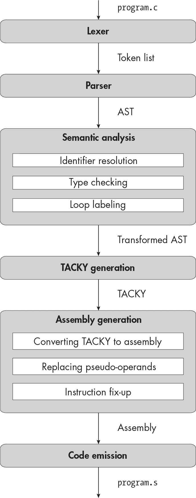

<samp class="SANS_Futura_Std_Book_Oblique_I_11">描述</samp>

<hgroup>

## <samp class="SANS_Futura_Std_Bold_Condensed_B_11">16</samp> <samp class="SANS_Dogma_OT_Bold_B_11">字符与字符串</samp>

</hgroup>


在本章中，你将实现三种新的整数类型：<samp class="SANS_TheSansMonoCd_W5Regular_11">char</samp>、<samp class="SANS_TheSansMonoCd_W5Regular_11">signed char</samp> 和 <samp class="SANS_TheSansMonoCd_W5Regular_11">unsigned char</samp>。这些是*字符类型*，它们的大小为 1 字节。由于你的编译器已经支持多种大小的有符号和无符号整数，你可以很轻松地添加这些新类型。你还将支持字符串字面量和字符常量。字符串字面量在 C 中扮演着一个奇怪的角色：有时它们表现得像复合初始化器，而有时它们表示常量 <samp class="SANS_TheSansMonoCd_W5Regular_11">char</samp> 数组。为了支持后者，你将把常量字符串和变量一起存储在符号表中，并且在 TACKY 中引入静态常量作为顶级构造。

在本章结束时，我们将编译一个“Hello, World!”程序。在第九章中，我们编译了一个每次打印一个字符的版本。这一次，我们将编译一个更合理的版本，能够打印整个字符串。在开始之前，我先给你一些背景信息：我将首先简要介绍字符类型与其他整数类型之间的几个显著差异，然后描述在 C 和汇编中字符串是如何工作的。

### <samp class="SANS_Futura_Std_Bold_B_11">字符类型</samp>

关于字符类型，最让人惊讶的是它们竟然有三种。<samp class="SANS_TheSansMonoCd_W5Regular_11">int</samp> 和 <samp class="SANS_TheSansMonoCd_W5Regular_11">signed int</samp> 之间没有区别，<samp class="SANS_TheSansMonoCd_W5Regular_11">long</samp> 和 <samp class="SANS_TheSansMonoCd_W5Regular_11">signed long</samp> 也没有区别，但规格说明符 <samp class="SANS_TheSansMonoCd_W5Regular_11">char</samp> 和 <samp class="SANS_TheSansMonoCd_W5Regular_11">signed char</samp> 指代的是两种不同的类型。是否“普通”的 <samp class="SANS_TheSansMonoCd_W5Regular_11">char</samp> 是有符号还是无符号是由实现决定的。我们将遵循 System V ABI，它规定 <samp class="SANS_TheSansMonoCd_W5Regular_11">char</samp> 是有符号的。

即使在我们的实现中 <samp class="SANS_TheSansMonoCd_W5Regular_11">char</samp> 和 <samp class="SANS_TheSansMonoCd_W5Regular_11">signed char</samp> 的行为完全相同，但它们作为不同类型的事实仍然会产生实际后果。例如，示例 16-1 是非法的，因为它将同一个全局变量同时声明为 <samp class="SANS_TheSansMonoCd_W5Regular_11">char</samp> 和 <samp class="SANS_TheSansMonoCd_W5Regular_11">signed char</samp>。

```
char c;
signed char c;
```

<samp class="SANS_Futura_Std_Book_Oblique_I_11">示例 16-1：具有不同字符类型的冲突文件范围变量声明</samp>

另一方面，将全局变量同时声明为 <samp class="SANS_TheSansMonoCd_W5Regular_11">int</samp> 和 <samp class="SANS_TheSansMonoCd_W5Regular_11">signed int</samp> 是完全合法的，因为这两种声明指定了相同的类型。

字符类型在类型转换规则上也与其他整数类型略有不同。当字符用于一元 <samp class="SANS_TheSansMonoCd_W5Regular_11">+</samp>、<samp class="SANS_TheSansMonoCd_W5Regular_11">-</samp> 或 <samp class="SANS_TheSansMonoCd_W5Regular_11">~</samp> 操作；按位二进制操作；或常规的算术转换时，它首先会被转换为 <samp class="SANS_TheSansMonoCd_W5Regular_11">int</samp>。这些转换称为*整数提升*。（如果 <samp class="SANS_TheSansMonoCd_W5Regular_11">int</samp> 无法容纳某个特定字符类型的所有值，则该字符会被转换为 <samp class="SANS_TheSansMonoCd_W5Regular_11">unsigned int</samp>。在我们的实现中，<samp class="SANS_TheSansMonoCd_W5Regular_11">int</samp> 可以容纳每种字符类型的所有值，因此这一点不重要。当然，我们也可以忽略未实现操作的类型规则，比如一元 <samp class="SANS_TheSansMonoCd_W5Regular_11">+</samp> 和按位二进制操作；我在这里提到它们只是为了完整性。）

字符和其他整数之间还有一个值得注意的区别：在 C17 中，字符类型没有标量常量。像 <samp class="SANS_TheSansMonoCd_W5Regular_11">'a'</samp> 这样的符号都具有 <samp class="SANS_TheSansMonoCd_W5Regular_11">int</samp> 类型，尽管它们被称为“字符常量”。也有像 <samp class="SANS_TheSansMonoCd_W5Regular_11">char16_t</samp>、<samp class="SANS_TheSansMonoCd_W5Regular_11">char32_t</samp> 和 <samp class="SANS_TheSansMonoCd_W5Regular_11">wchar_t</samp> 这样的*宽字符类型*常量，它们用于表示多字节字符，但我们不会实现它们。

> <samp class="SANS_Dogma_OT_Bold_B_39">注意</samp>

*C23 引入了 u8 字符常量，类型为 unsigned char。它们表示 1 字节的 UTF-8 字符。*

### <samp class="SANS_Futura_Std_Bold_B_11">字符串字面量</samp>

在本章中，我将区分字符串字面量和字符串。*字符串字面量*是源代码中出现的表达式，如<samp class="SANS_TheSansMonoCd_W5Regular_11">"abc"</samp>。*字符串*是一个存在于内存中的对象——具体来说，是一个空字符终止的<samp class="SANS_TheSansMonoCd_W5Regular_11">char</samp>数组。某些字符串在运行时不能被修改；我将这些称为*常量字符串*，尽管这不是一个标准术语。

你可以以两种不同的方式使用字符串字面量。首先，它可以初始化任何字符类型的数组：

```
signed char array[4] = "abc";
```

如果有空间，我们会包含一个终止的空字符；如果没有空间，则省略它。这与我们通常的数组初始化规则一致：如果初始化器比目标对象短，我们会用零填充剩余部分。因此，之前的声明等价于：

```
signed char array[4] = {'a', 'b', 'c', 0};
```

另一方面，在清单 16-2 中，我们省略了<samp class="SANS_TheSansMonoCd_W5Regular_11">array1</samp>中的空字符，因为数组不足够大，无法包含它。因此，<samp class="SANS_TheSansMonoCd_W5Regular_11">array1</samp>和<samp class="SANS_TheSansMonoCd_W5Regular_11">array2</samp>具有相同的内容。

```
char array1[3] = "abc";
char array2[3] = {'a', 'b', 'c'};
```

<samp class="SANS_Futura_Std_Book_Oblique_I_11">清单 16-2：将字符串字面量用作数组初始化器而不带空字符</samp>

当字符串字面量出现在数组初始化器之外时，它表示一个常量字符串。在这种情况下，字符串字面量的行为类似于其他数组类型的表达式。它们像其他数组表达式一样衰退为指针，因此你可以对其进行下标操作，或者将其赋值给<samp class="SANS_TheSansMonoCd_W5Regular_11">char *</samp>类型的对象。以下声明用常量字符串<samp class="SANS_TheSansMonoCd_W5Regular_11">"abc"</samp>中第一个字符的地址初始化变量<samp class="SANS_TheSansMonoCd_W5Regular_11">str_ptr</samp>：

```
char *str_ptr = "abc";
```

字符串字面量也是左值，因此它们支持<samp class="SANS_TheSansMonoCd_W5Regular_11">&</samp>操作符。在这里，我们使用该操作符获取常量字符串<samp class="SANS_TheSansMonoCd_W5Regular_11">"abc"</samp>的地址，然后将其赋值给<samp class="SANS_TheSansMonoCd_W5Regular_11">array_ptr</samp>：

```
char (*array_ptr)[4] = &"abc";
```

与之前的例子唯一不同的是，字符串字面量不会发生数组衰退。我们最终得到一个指向整个字符串的指针，类型为<samp class="SANS_TheSansMonoCd_W5Regular_11">char (*)[4]</samp>，而不是指向其第一个元素的指针，类型为<samp class="SANS_TheSansMonoCd_W5Regular_11">char *</samp>。在这两个例子中，我们将<samp class="SANS_TheSansMonoCd_W5Regular_11">"abc"</samp>当作任何其他数组类型的表达式来处理。

与其他数组不同，常量字符串是恒定的。尝试修改它们，如在清单 16-3 中所示，会导致未定义行为。

```
char *ptr = "abc";
ptr[0] = 'x';
```

<samp class="SANS_Futura_Std_Book_Oblique_I_11">清单 16-3：非法修改常量字符串</samp>

尽管这段代码能够编译，但它可能会抛出运行时错误，因为大多数 C 语言实现——包括我们的实现——将常量字符串存储在只读内存中。（<samp class="SANS_TheSansMonoCd_W5Regular_11">const</samp>限定符，虽然我们不会实现它，告诉编译器对象不能被修改。如果清单 16-3 是一个实际的 C 程序的一部分，那么给<samp class="SANS_TheSansMonoCd_W5Regular_11">ptr</samp>添加一个<samp class="SANS_TheSansMonoCd_W5Regular_11">const</samp>限定符会是一个好主意。）

让我们再看一个例子，如清单 16-4 所示，以澄清表示常量字符串的字符串字面量与初始化数组的字符串字面量之间的区别。

```
char arr[3] = "abc";
arr[0] = 'x';
```

<samp class="SANS_Futura_Std_Book_Oblique_I_11">清单 16-4：合法地修改从字符串字面量初始化的数组</samp>

与清单 16-3 不同，这段代码是完全合法的。在清单 16-3 中，<samp class="SANS_TheSansMonoCd_W5Regular_11">ptr</samp>指向常量字符串<samp class="SANS_TheSansMonoCd_W5Regular_11">"abc"</samp>的开头。另一方面，在清单 16-4 中，我们使用字符串字面量<samp class="SANS_TheSansMonoCd_W5Regular_11">"abc"</samp>的每个字符来初始化<samp class="SANS_TheSansMonoCd_W5Regular_11">arr</samp>的一个元素，而<samp class="SANS_TheSansMonoCd_W5Regular_11">arr</samp>是一个普通的、非常量的<samp class="SANS_TheSansMonoCd_W5Regular_11">char</samp>数组。

一旦我们看到它们如何转换为汇编语言，这两种情况就更容易理解了。

### <samp class="SANS_Futura_Std_Bold_B_11">汇编中处理字符串</samp>

我们将使用两种不同的汇编指令来初始化汇编中的字符串。<samp class="SANS_TheSansMonoCd_W5Regular_11">.ascii</samp>和<samp class="SANS_TheSansMonoCd_W5Regular_11">.asciz</samp>指令都告诉汇编器将 ASCII 字符串写入目标文件，就像<samp class="SANS_TheSansMonoCd_W5Regular_11">.quad</samp>指令告诉它写入一个四字节数一样。区别在于，<samp class="SANS_TheSansMonoCd_W5Regular_11">.asciz</samp>会包含一个终止的空字节，而<samp class="SANS_TheSansMonoCd_W5Regular_11">.ascii</samp>则不会。三条声明

```
static char null_terminated[4] = "abc";
static char not_null_terminated[3] = "abc";
static char extra_padding[5] = "abc";
```

对应于清单 16-5 中的汇编代码。

```
 .data
null_terminated:
    .asciz "abc"
not_null_terminated:
    .ascii "abc"
extra_padding:
    .asciz "abc"
    .zero 1
```

<samp class="SANS_Futura_Std_Book_Oblique_I_11">清单 16-5：从字符串字面量在汇编中初始化三个静态</samp> <samp class="SANS_Futura_Std_Book_Oblique_I_11">char</samp> <samp class="SANS_Futura_Std_Book_Oblique_I_11">数组</samp>

因为 <samp class="SANS_TheSansMonoCd_W5Regular_11">null_terminated</samp> 的长度足以容纳一个空字节，我们用 <samp class="SANS_TheSansMonoCd_W5Regular_11">.asciz</samp> 指令初始化它。我们用 <samp class="SANS_TheSansMonoCd_W5Regular_11">.ascii</samp> 来初始化 <samp class="SANS_TheSansMonoCd_W5Regular_11">not_null_terminated</samp>，这样我们就不会越界访问数组。由于 <samp class="SANS_TheSansMonoCd_W5Regular_11">extra_padding</samp> 需要两个零字节来达到正确的长度，我们先写一个空终止字符串，然后用 <samp class="SANS_TheSansMonoCd_W5Regular_11">.zero</samp> 指令再写一个额外的零字节。请注意，这些变量都不需要 <samp class="SANS_TheSansMonoCd_W5Regular_11">.align</samp> 指令。字符类型本身是 1 字节对齐的，因此字符数组也是如此。（包含 16 个或更多字符的数组是例外；它们是 16 字节对齐的，就像所有大于或等于 16 字节的数组变量一样。）

<samp class="SANS_TheSansMonoCd_W5Regular_11">.ascii</samp> 和 <samp class="SANS_TheSansMonoCd_W5Regular_11">.asciz</samp> 指令用来初始化具有静态存储持续时间的对象。接下来，让我们看看 列表 16-6，它初始化了一个非静态数组。

```
int main(void) {
    char letters[6] = "abcde";
    return 0;
}
```

<samp class="SANS_Futura_Std_Book_Oblique_I_11">列表 16-6：使用字符串字面量初始化一个非静态数组</samp>

列表 16-7 展示了一种在汇编中初始化 <samp class="SANS_TheSansMonoCd_W5Regular_11">letters</samp> 的方法，通过将 <samp class="SANS_TheSansMonoCd_W5Regular_11">"abcde"</samp> 每次一个字节地复制到栈上。

```
movb    $97,  -8(%rbp)
movb    $98,  -7(%rbp)
movb    $99,  -6(%rbp)
movb    $100, -5(%rbp)
movb    $101, -4(%rbp)
movb    $0,   -3(%rbp)
```

<samp class="SANS_Futura_Std_Book_Oblique_I_11">列表 16-7：在汇编中初始化一个非静态</samp> <samp class="SANS_Futura_Std_Book_Oblique_I_11">char</samp> <samp class="SANS_Futura_Std_Book_Oblique_I_11">数组</samp>

字符<samp class="SANS_TheSansMonoCd_W5Regular_11">'a'</samp>、<samp class="SANS_TheSansMonoCd_W5Regular_11">'b'</samp>、<samp class="SANS_TheSansMonoCd_W5Regular_11">'c'</samp>、<samp class="SANS_TheSansMonoCd_W5Regular_11">'d'</samp>和<samp class="SANS_TheSansMonoCd_W5Regular_11">'e'</samp>的 ASCII 值分别是<samp class="SANS_TheSansMonoCd_W5Regular_11">97</samp>、<samp class="SANS_TheSansMonoCd_W5Regular_11">98</samp>、<samp class="SANS_TheSansMonoCd_W5Regular_11">99</samp>、<samp class="SANS_TheSansMonoCd_W5Regular_11">100</samp>和<samp class="SANS_TheSansMonoCd_W5Regular_11">101</samp>。假设<samp class="SANS_TheSansMonoCd_W5Regular_11">letters</samp>从栈地址<samp class="SANS_TheSansMonoCd_W5Regular_11">-8(%rbp)</samp>开始，列表 16-7 中的指令会将每个字符复制到数组的适当位置。每条<samp class="SANS_TheSansMonoCd_W5Regular_11">movb</samp>指令中的<b>b</b>后缀表示它是操作一个字节。

列表 16-8 展示了一种更高效的方法。我们使用一条<samp class="SANS_TheSansMonoCd_W5Regular_11">movl</samp>指令初始化字符串的前 4 个字节，然后使用<samp class="SANS_TheSansMonoCd_W5Regular_11">movb</samp>指令初始化剩下的 2 个字节。

```
movl    $1684234849, -8(%rbp)
movb    $101, -4(%rbp)
movb    $0,   -3(%rbp)
```

<samp class="SANS_Futura_Std_Book_Oblique_I_11">列表 16-8：在汇编中更高效地初始化一个非静态</samp> <samp class="SANS_Futura_Std_Book_Oblique_I_11">char</samp> <samp class="SANS_Futura_Std_Book_Oblique_I_11">数组</samp>

当我们将字符串的前 4 个字节解释为一个整数时，得到的值是<samp class="SANS_TheSansMonoCd_W5Regular_11">1684234849</samp>。（我将在本章后面详细讨论如何得到这个整数。）这个列表与列表 16-7 的效果相同，但节省了几条指令。

接下来，我们来看常量字符串。我们将这些字符串写入目标文件的只读部分，就像浮点常量一样。在 Linux 上，我们将常量字符串存储在<samp class="SANS_TheSansMonoCd_W5Regular_11">.rodata</samp>中；在 macOS 上，我们将它们存储在<samp class="SANS_TheSansMonoCd_W5Regular_11">.cstring</samp>部分。请看列表 16-9 中的代码片段，它返回指向常量字符串起始位置的指针。

```
return "A profound statement.";
```

<samp class="SANS_Futura_Std_Book_Oblique_I_11">列表 16-9：返回指向字符串起始位置的指针</samp>

我们会为这个字符串生成一个唯一的标签，然后在适当的部分定义它。列表 16-10 给出了结果汇编代码。

```
 .section .rodata
.Lstring.0:
    .asciz "A profound statement."
```

<samp class="SANS_Futura_Std_Book_Oblique_I_11">列表 16-10：在汇编中定义一个常量字符串</samp>

常量字符串总是以空字符结尾，因为它们不需要适配任何特定的数组维度。一旦我们定义了常量字符串，就可以像访问其他静态对象一样，通过 RIP 相对寻址访问它。在这个特定的例子中，我们想要返回字符串的地址，因此我们将通过以下指令将其加载到 RAX 中：

```
leaq    .Lstring.0(%rip), %rax
```

最后，让我们看看如何像在示例 16-11 中那样，使用字符串常量初始化静态指针。

```
static char *ptr = "A profound statement.";
```

<samp class="SANS_Futura_Std_Book_Oblique_I_11">示例 16-11：从字符串常量初始化静态</samp> <samp class="SANS_Futura_Std_Book_Oblique_I_11">char *</samp> <samp class="SANS_Futura_Std_Book_Oblique_I_11">指针</samp>

我们将以与示例 16-10 相同的方式定义字符串。然而，我们不能通过 <samp class="SANS_TheSansMonoCd_W5Regular_11">lea</samp> 指令将其加载到 <samp class="SANS_TheSansMonoCd_W5Regular_11">ptr</samp> 中。因为 <samp class="SANS_TheSansMonoCd_W5Regular_11">ptr</samp> 是静态的，它必须在程序启动之前初始化。幸运的是，<samp class="SANS_TheSansMonoCd_W5Regular_11">.quad</samp> 指令不仅接受常量，还接受标签。示例 16-12 演示了如何使用该指令初始化 <samp class="SANS_TheSansMonoCd_W5Regular_11">ptr</samp>。

```
 .data
    .align 8
ptr:
    .quad .Lstring.0
```

<samp class="SANS_Futura_Std_Book_Oblique_I_11">示例 16-12：用静态常量的地址初始化静态变量</samp>

指令 <samp class="SANS_TheSansMonoCd_W5Regular_11">.quad .Lstring.0</samp> 告诉汇编器和链接器写入 <samp class="SANS_TheSansMonoCd_W5Regular_11">.Lstring.0</samp> 的地址。

顺便提一下，实际上可以用这种方式初始化任何静态指针，而不仅仅是字符串指针。虽然我们的实现不接受像 <samp class="SANS_TheSansMonoCd_W5Regular_11">&x</samp> 这样的表达式作为静态初始化器，但一个更完整的编译器可能会进行转换

```
static int x = 10;
static int *ptr = &x;
```

进入：

```
 .data
    .align 4
x:
    .long 10
    .align 8
ptr:
    .quad x
```

到此为止，你已经了解了如何在 C 和汇编中使用字符串，可以开始编写代码了。第一步是扩展词法分析器，使其能够识别字符串常量和字符常量。

### <samp class="SANS_Futura_Std_Bold_B_11">词法分析器</samp>

本章将介绍三个新的标记：

<samp class="SANS_TheSansMonoCd_W7Bold_B_11">char</samp> 一个关键字，用来指定字符类型

**字符常量** 单个字符，例如 <samp class="SANS_TheSansMonoCd_W5Regular_11">'a'</samp> 和 <samp class="SANS_TheSansMonoCd_W5Regular_11">'\n'</samp>

**字符串常量** 一系列字符，例如 <samp class="SANS_TheSansMonoCd_W5Regular_11">"Hello, World!"</samp>

字符常量由一个字符（如 <samp class="SANS_TheSansMonoCd_W5Regular_11">a</samp>）或转义序列（如 <samp class="SANS_TheSansMonoCd_W5Regular_11">\n</samp>）组成，并被单引号包围。C 标准第 6.4.4.4 节定义了一组转义序列，用于表示特殊字符。表 16-1 列出了这些转义序列及其 ASCII 码。

<samp class="SANS_Futura_Std_Heavy_B_11">表 16-1：</samp> <samp class="SANS_Futura_Std_Book_11">特殊字符的转义序列</samp>

| <samp class="SANS_Futura_Std_Heavy_B_11">转义序列</samp> | <samp class="SANS_Futura_Std_Heavy_B_11">描述</samp> | <samp class="SANS_Futura_Std_Heavy_B_11">ASCII 码</samp> |
| --- | --- | --- |
| <samp class="SANS_TheSansMonoCd_W5Regular_11">\'</samp> | <samp class="SANS_Futura_Std_Book_11">单引号</samp> | <samp class="SANS_TheSansMonoCd_W5Regular_11">39</samp> |
| <samp class="SANS_TheSansMonoCd_W5Regular_11">\"</samp> | <samp class="SANS_Futura_Std_Book_11">双引号</samp> | <samp class="SANS_TheSansMonoCd_W5Regular_11">34</samp> |
| <samp class="SANS_TheSansMonoCd_W5Regular_11">\?</samp> | <samp class="SANS_Futura_Std_Book_11">问号</samp> | <samp class="SANS_TheSansMonoCd_W5Regular_11">63</samp> |
| <samp class="SANS_TheSansMonoCd_W5Regular_11">\\</samp> | <samp class="SANS_Futura_Std_Book_11">反斜杠</samp> | <samp class="SANS_TheSansMonoCd_W5Regular_11">92</samp> |
| <samp class="SANS_TheSansMonoCd_W5Regular_11">\a</samp> | <samp class="SANS_Futura_Std_Book_11">可听警告</samp> | <samp class="SANS_TheSansMonoCd_W5Regular_11">7</samp> |
| <samp class="SANS_TheSansMonoCd_W5Regular_11">\b</samp> | <samp class="SANS_Futura_Std_Book_11">退格</samp> | <samp class="SANS_TheSansMonoCd_W5Regular_11">8</samp> |
| <samp class="SANS_TheSansMonoCd_W5Regular_11">\f</samp> | <samp class="SANS_Futura_Std_Book_11">换页符</samp> | <samp class="SANS_TheSansMonoCd_W5Regular_11">12</samp> |
| <samp class="SANS_TheSansMonoCd_W5Regular_11">\n</samp> | <samp class="SANS_Futura_Std_Book_11">新行</samp> | <samp class="SANS_TheSansMonoCd_W5Regular_11">10</samp> |
| <samp class="SANS_TheSansMonoCd_W5Regular_11">\r</samp> | <samp class="SANS_Futura_Std_Book_11">回车</samp> | <samp class="SANS_TheSansMonoCd_W5Regular_11">13</samp> |
| <samp class="SANS_TheSansMonoCd_W5Regular_11">\t</samp> | <samp class="SANS_Futura_Std_Book_11">水平制表符</samp> | <samp class="SANS_TheSansMonoCd_W5Regular_11">9</samp> |
| <samp class="SANS_TheSansMonoCd_W5Regular_11">\v</samp> | <samp class="SANS_Futura_Std_Book_11">垂直制表符</samp> | <samp class="SANS_TheSansMonoCd_W5Regular_11">11</samp> |

换行符、单引号（<samp class="SANS_TheSansMonoCd_W5Regular_11">'</samp>）和反斜杠（<samp class="SANS_TheSansMonoCd_W5Regular_11">\</samp>）字符不能单独作为字符常量出现，必须进行转义。其他任何字符，只要它在*源字符集*中，即可直接用作字符常量，源字符集是可以出现在源文件中的完整字符集合。

源字符集是由实现定义的，但它必须至少包含*C 标准*第 5.2.1 节中规定的*基本源字符集*。在我们的实现中，源字符集包括所有可打印的 ASCII 字符，以及所需的控制字符：换行符、水平制表符、垂直制表符和换页符。你不需要显式地排除这个集合以外的字符；你可以简单地假设它们在源文件中永远不会出现。

表 16-1 中的一些字符，如可听警告（<samp class="SANS_TheSansMonoCd_W5Regular_11">\a</samp>）和退格（<samp class="SANS_TheSansMonoCd_W5Regular_11">\b</samp>），不在我们的源字符集内，因此它们只能通过转义字符表示。其他字符，包括双引号（<samp class="SANS_TheSansMonoCd_W5Regular_11">"</samp>）、问号（<samp class="SANS_TheSansMonoCd_W5Regular_11">?</samp>）、换页符，以及水平和垂直制表符，都是源字符集的一部分；它们可以在字符常量中进行转义，但不一定需要这样做。例如，字符常量 <samp class="SANS_TheSansMonoCd_W5Regular_11">'?'</samp> 和 <samp class="SANS_TheSansMonoCd_W5Regular_11">'\?'</samp> 是等效的；它们都表示问号字符。换行符、单引号和反斜杠都在源字符集中，但仍然需要进行转义。

我们可以通过列表 16-13 中的真正令人震惊的正则表达式来识别字符常量。

```
'([^'\\\n]|\\['"?\\abfnrtv])'
```

<samp class="SANS_Futura_Std_Book_Oblique_I_11">列表 16-13：用于识别字符常量的正则表达式</samp>

让我们来分解一下。括号表达式中的第一个备选项，字符类 <samp class="SANS_TheSansMonoCd_W5Regular_11">[^'\\\n]</samp>，匹配除了单引号、反斜杠或换行符之外的任何单个字符。我们必须对反斜杠进行转义，因为它是 PCRE 正则表达式以及 C 字符串文字中的控制字符。类似地，我们在这个正则表达式中使用转义序列 <samp class="SANS_TheSansMonoCd_W5Regular_11">\n</samp> 来匹配字面量换行符。第二个备选项 <samp class="SANS_TheSansMonoCd_W5Regular_11">\\['"?\\abfnrtv]</samp> 匹配一个转义序列。第一个 <samp class="SANS_TheSansMonoCd_W5Regular_11">\\</samp> 匹配一个单独的反斜杠，紧随其后的字符类包含在转义序列中可能跟随的每个字符。整个表达式必须以单引号开始并结束。

字符串文字由可能为空的字符和转义序列组成，且被双引号包裹。单引号可以单独出现在字符串文字中，但双引号必须转义。清单 16-14 展示了用于识别字符串文字的正则表达式。

```
"([^"\\\n]|\\['"\\?abfnrtv])*"
```

<samp class="SANS_Futura_Std_Book_Oblique_I_11">清单 16-14：用于识别字符串文字的正则表达式</samp>

这里，<samp class="SANS_TheSansMonoCd_W5Regular_11">[^"\\\n]</samp> 匹配任何单个字符，除了双引号、反斜杠或换行符。与清单 16-13 中的情况类似，第二个备选项匹配每个转义序列。我们将 <samp class="SANS_TheSansMonoCd_W5Regular_11">*</samp> 量词应用于整个括号表达式，因为它可以重复零次或多次，并且我们用双引号将其界定。

在对字符串文字或字符标记进行词法分析后，你需要解除转义。换句话说，你需要将该标记中的每个转义序列转换为相应的 ASCII 字符。你可以现在进行，也可以在解析器中进行。

标准定义了一些其他类型的字符串文字和字符常量，我们不会实现它们。特别地，我们不会支持十六进制转义序列，如 <samp class="SANS_TheSansMonoCd_W5Regular_11">\xff</samp>，八进制转义序列，如 <samp class="SANS_TheSansMonoCd_W5Regular_11">\012</samp>，或者多字符常量，如 <samp class="SANS_TheSansMonoCd_W5Regular_11">'ab'</samp>。我们也不会支持任何用于非 ASCII 编码的类型或常量，比如宽字符类型、宽字符串文字或 UTF-8 字符串文字。

### <samp class="SANS_Futura_Std_Bold_B_11">解析器</samp>

我们将从三个方面扩展 AST 定义。首先，我们将添加 <samp class="SANS_TheSansMonoCd_W5Regular_11">char</samp>、<samp class="SANS_TheSansMonoCd_W5Regular_11">signed char</samp> 和 <samp class="SANS_TheSansMonoCd_W5Regular_11">unsigned char</samp> 类型。第二，我们将添加一种新的表达式类型来表示字符串字面量。第三，我们将扩展 <samp class="SANS_TheSansMonoCd_W5Regular_11">const</samp> AST 节点，以表示具有字符类型的常量：

```
const = ConstInt(int) | ConstLong(int) | ConstUInt(int) | ConstULong(int)
      | ConstDouble(double) | **ConstChar(int) | ConstUChar(int)**
```

这些新的常量构造函数有些不寻常，因为它们与实际出现在 C 程序中的常量字面量不对应。像 <samp class="SANS_TheSansMonoCd_W5Regular_11">'a'</samp> 这样的字符常量的类型是 <samp class="SANS_TheSansMonoCd_W5Regular_11">int</samp>，因此解析器会将它们转换为 <samp class="SANS_TheSansMonoCd_W5Regular_11">ConstInt</samp> 节点；它不会使用新的 <samp class="SANS_TheSansMonoCd_W5Regular_11">ConstChar</samp> 和 <samp class="SANS_TheSansMonoCd_W5Regular_11">ConstUChar</samp> 构造函数。但我们将在稍后需要这些构造函数，尤其是在类型检查期间填充部分初始化的字符数组和在 TACKY 中初始化字符数组时。

清单 16-15 给出了完整的 AST 定义，本章的更改部分已加粗。

```
program = Program(declaration*)
declaration = FunDecl(function_declaration) | VarDecl(variable_declaration)
variable_declaration = (identifier name, initializer? init,
                        type var_type, storage_class?)
function_declaration = (identifier name, identifier* params, block? body,
                        type fun_type, storage_class?)
initializer = SingleInit(exp) | CompoundInit(initializer*)
type = **Char | SChar | UChar |** Int | Long | UInt | ULong | Double
     | FunType(type* params, type ret)
     | Pointer(type referenced)
     | Array(type element, int size)
storage_class = Static | Extern
block_item = S(statement) | D(declaration)
block = Block(block_item*)
for_init = InitDecl(variable_declaration) | InitExp(exp?)
statement = Return(exp)
          | Expression(exp)
          | If(exp condition, statement then, statement? else)
          | Compound(block)
          | Break
          | Continue
          | While(exp condition, statement body)
          | DoWhile(statement body, exp condition)
          | For(for_init init, exp? condition, exp? post, statement body)
          | Null
exp = Constant(const)
 **| String(string)**
    | Var(identifier)
    | Cast(type target_type, exp)
    | Unary(unary_operator, exp)
    | Binary(binary_operator, exp, exp)
    | Assignment(exp, exp)
    | Conditional(exp condition, exp, exp)
    | FunctionCall(identifier, exp* args)
    | Dereference(exp)
    | AddrOf(exp)
    | Subscript(exp, exp)
unary_operator = Complement | Negate | Not
binary_operator = Add | Subtract | Multiply | Divide | Remainder | And | Or
                | Equal | NotEqual | LessThan | LessOrEqual
                | GreaterThan | GreaterOrEqual
const = ConstInt(int) | ConstLong(int) | ConstUInt(int) | ConstULong(int)
      | ConstDouble(double) | **ConstChar(int) | ConstUChar(int)**
```

<samp class="SANS_Futura_Std_Book_Oblique_I_11">清单 16-15：带有字符类型、字符常量和字符串字面量的抽象语法树</samp>

很容易扩展 <samp class="SANS_TheSansMonoCd_W5Regular_11">const</samp>，而不是 <samp class="SANS_TheSansMonoCd_W5Regular_11">exp</samp>，以包括字符串字面量，但字符串字面量与其他类型的常量足够不同，因此最容易将它们单独定义。例如，类型检查器在处理初始化器时，需要将它们与其他常量区分开来。

#### <samp class="SANS_Futura_Std_Bold_Condensed_Oblique_BI_11">解析类型说明符</samp>

我们需要扩展<samp class="SANS_TheSansMonoCd_W5Regular_11">parse_type</samp>，它将类型说明符的列表转换为一个<samp class="SANS_TheSansMonoCd_W5Regular_11">type</samp> AST 节点，以处理字符类型。我不会提供此部分的伪代码，因为逻辑非常简单。如果声明中单独出现<samp class="SANS_TheSansMonoCd_W5Regular_11">char</samp>，则表示普通的<samp class="SANS_TheSansMonoCd_W5Regular_11">char</samp>类型。如果与<samp class="SANS_TheSansMonoCd_W5Regular_11">unsigned</samp>关键字一起出现，则表示<samp class="SANS_TheSansMonoCd_W5Regular_11">unsigned char</samp>类型。如果与<samp class="SANS_TheSansMonoCd_W5Regular_11">signed</samp>关键字一起出现，则表示<samp class="SANS_TheSansMonoCd_W5Regular_11">signed char</samp>类型。像往常一样，类型说明符的顺序不重要。<samp class="SANS_TheSansMonoCd_W5Regular_11">char</samp>与其他任何类型说明符一起出现在声明中都是非法的。

#### <samp class="SANS_Futura_Std_Bold_Condensed_Oblique_BI_11">解析字符常量</samp>

解析器应该将每个字符常量标记转换为具有适当 ASCII 值的<samp class="SANS_TheSansMonoCd_W5Regular_11">ConstInt</samp>。例如，应该将标记<samp class="SANS_TheSansMonoCd_W5Regular_11">'a'</samp>转换为<samp class="SANS_TheSansMonoCd_W5Regular_11">ConstInt(97)</samp>，将<samp class="SANS_TheSansMonoCd_W5Regular_11">'\n'</samp>转换为<samp class="SANS_TheSansMonoCd_W5Regular_11">ConstInt(10)</samp>，以此类推。

#### <samp class="SANS_Futura_Std_Bold_Condensed_Oblique_BI_11">解析字符串字面量</samp>

如果词法分析器没有处理过，解析器应该解除字符串字面量的转义。字符串字面量中的每个字符，包括原始源代码中由转义序列表示的字符，必须在内部表示为一个单字节。否则，我们将在类型检查器中计算不准确的字符串长度，并在运行时使用不正确的值初始化数组。

相邻的字符串字面量标记应该连接成一个单独的<samp class="SANS_TheSansMonoCd_W5Regular_11">String</samp> AST 节点。例如，解析器应该将语句

```
return "foo" "bar";
```

转换为 AST 节点 <samp class="SANS_TheSansMonoCd_W5Regular_11">Return(String("foobar"))</samp>。

#### <samp class="SANS_Futura_Std_Bold_Condensed_Oblique_BI_11">将所有内容整合在一起</samp>

第 16-16 列表定义了完整的语法，并将本章的更改以粗体显示。

```
<program> ::= {<declaration>}
<declaration> ::= <variable-declaration> | <function-declaration>
<variable-declaration> ::= {<specifier>}+ <declarator> ["=" <initializer>] ";"
<function-declaration> ::= {<specifier>}+ <declarator> (<block> | ";")
<declarator> ::= "*" <declarator> | <direct-declarator>
<direct-declarator> ::= <simple-declarator> [<declarator-suffix>]
<declarator-suffix> ::= <param-list> | {"[" <const> "]"}+
<param-list> ::= "(" "void" ")" | "(" <param> {"," <param>} ")"
<param> ::= {<type-specifier>}+ <declarator>
<simple-declarator> ::= <identifier> | "(" <declarator> ")"
<type-specifier> ::= "int" | "long" | "unsigned" | "signed" | "double" **|** ❶ **"char"**
<specifier> ::= <type-specifier> | "static" | "extern"
<block> ::= "{" {<block-item>} "}"
<block-item> ::= <statement> | <declaration>
<initializer> ::= <exp> | "{" <initializer> {"," <initializer>} [","] "}"
<for-init> ::= <variable-declaration> | [<exp>] ";"
<statement> ::= "return" <exp> ";"
              | <exp> ";"
              | "if" "(" <exp> ")" <statement> ["else" <statement>]
              | <block>
              | "break" ";"
              | "continue" ";"
              | "while" "(" <exp> ")" <statement>
              | "do" <statement> "while" "(" <exp> ")" ";"
              | "for" "(" <for-init> [<exp>] ";" [<exp>] ")" <statement>
              | ";"
<exp> ::= <unary-exp> | <exp> <binop> <exp> | <exp> "?" <exp> ":" <exp>
<unary-exp> ::= <unop> <unary-exp>
              | "(" {<type-specifier>}+ [<abstract-declarator>] ")" <unary-exp>
              | <postfix-exp>
<postfix-exp> ::= <primary-exp> {"[" <exp> "]"}
<primary-exp> ::= <const> | <identifier> | "(" <exp> ")" **|** ❷ **{<string>}+**
                | <identifier> "(" [<argument-list>] ")"
<argument-list> ::= <exp> {"," <exp>}
<abstract-declarator> ::= "*" [<abstract-declarator>]
                        | <direct-abstract-declarator>
<direct-abstract-declarator> ::= "(" <abstract-declarator> ")" {"[" <const> "]"}
                               | {"[" <const> "]"}+
<unop> ::= "-" | "~" | "!" | "*" | "&"
<binop> ::= "-" | "+" | "*" | "/" | "%" | "&&" | "||"
          | "==" | "!=" | "<" | "<=" | ">" | ">=" | "="
<const> ::= <int> | <long> | <uint> | <ulong> | <double> **|** ❸ **<char>**
<identifier> ::= ? An identifier token ?
**<string> ::= ? A string token ?** ❹
<int> ::= ? An int token ?
**<char> ::= ? A char token ?** ❺
<long> ::= ? An int or long token ?
<uint> ::= ? An unsigned int token ?
<ulong> ::= ? An unsigned int or unsigned long token ?
<double> ::= ? A floating-point constant token ?
```

<samp class="SANS_Futura_Std_Book_Oblique_I_11">第 16-16 列表：包含字符类型、字符常量和字符串字面量的语法</samp>

语法中加粗的部分对应于我们刚刚讨论的解析器的三个更改。现在语法包括了<samp class="SANS_TheSansMonoCd_W5Regular_11">"char"</samp>类型说明符❶以及<samp class="SANS_TheSansMonoCd_W5Regular_11"><string></samp> ❹和<samp class="SANS_TheSansMonoCd_W5Regular_11"><char></samp>标记❺。我们将一个或多个字符串字面量的序列识别为一个基本表达式❷，将字符标记识别为常量❸。

### <samp class="SANS_Futura_Std_Bold_B_11">类型检查器</samp>

在大多数情况下，类型检查器可以像处理其他整数类型一样处理字符类型。它们遵循相同的类型规则并支持相同的操作。整数提升是这一模式的唯一例外，因此我们将在本节中实现它们。我们还将为字符类型引入静态初始化器。

字符串字面量的类型检查更加复杂，尤其是当它们出现在初始化器中时。我们需要跟踪每个字符串是否应该直接使用或转换为指针，并且需要确定哪些字符串应以空字节终止。我们将向符号表中添加一些新的构造来表示这些情况。

#### <samp class="SANS_Futura_Std_Bold_Condensed_Oblique_BI_11">字符</samp>

我们将会在常规算术转换中将字符类型提升为<samp class="SANS_TheSansMonoCd_W5Regular_11">int</samp>。清单 16-17 展示了如何在<samp class="SANS_TheSansMonoCd_W5Regular_11">get_common_type</samp>中执行这种提升。

```
get_common_type(type1, type2):
    if type1 is a character type:
        type1 = Int
    if type2 is a character type:
        type2 = Int
 `--snip--`
```

<samp class="SANS_Futura_Std_Book_Oblique_I_11">清单 16-17：在常规算术转换中应用整数提升</samp>

在提升了两个操作数的类型后，我们将像往常一样找到它们的公共类型。我们还将提升一元操作符<samp class="SANS_TheSansMonoCd_W5Regular_11">-</samp>和<samp class="SANS_TheSansMonoCd_W5Regular_11">~</samp>的操作数。清单 16-18 演示了如何提升一个取反操作数。

```
typecheck_exp(e, symbols):
    match e with
  | `--snip--`
    | Unary(Negate, inner) ->
        typed_inner = typecheck_and_convert(inner, symbols)
        inner_t = get_type(typed_inner)
        if inner_t is a pointer type:
            fail("Can't negate a pointer")
      ❶ if inner_t is a character type:
            typed_inner = convert_to(typed_inner, Int)
        unary_exp = Unary(Negate, typed_inner)
      ❷ return set_type(unary_exp, get_type(typed_inner))
```

<samp class="SANS_Futura_Std_Book_Oblique_I_11">清单 16-18：将整数提升应用于取反表达式</samp>

首先，我们确保操作数不是指针（我们在第十四章引入了此验证）。然后，我们应用整数提升。我们检查操作数是否是字符类型之一❶；如果是，我们将其转换为<samp class="SANS_TheSansMonoCd_W5Regular_11">Int</samp>，然后对提升后的值进行取反。表达式的结果与其提升后的操作数具有相同的类型❷。我们将以相同的方式处理<samp class="SANS_TheSansMonoCd_W5Regular_11">~</samp>，所以这里不提供该部分的伪代码。

在进行类型检查时，我们总是会将字符识别为整数类型。例如，我们会接受字符作为<samp class="SANS_TheSansMonoCd_W5Regular_11">~</samp>和<samp class="SANS_TheSansMonoCd_W5Regular_11">%</samp>表达式的操作数，以及指针运算中的索引。因为所有整数类型也是算术类型，所以我们会允许字符类型与任何其他算术类型之间的隐式转换，像在<samp class="SANS_TheSansMonoCd_W5Regular_11">convert_by_assignment</samp>中那样。

我们将为字符类型添加两个静态初始化器。清单 16-19 给出了更新后的<samp class="SANS_TheSansMonoCd_W5Regular_11">static_init</samp>定义。

```
static_init = IntInit(int) | LongInit(int) | UIntInit(int) | ULongInit(int)
 **| CharInit(int) | UCharInit(int)**
            | DoubleInit(double) | ZeroInit(int bytes)
```

<samp class="SANS_Futura_Std_Book_Oblique_I_11">清单 16-19：为字符类型添加静态初始化器</samp>

由于<samp class="SANS_TheSansMonoCd_W5Regular_11">signed char</samp>和普通的<samp class="SANS_TheSansMonoCd_W5Regular_11">char</samp>都是有符号类型，我们将使用<samp class="SANS_TheSansMonoCd_W5Regular_11">CharInit</samp>来初始化它们。我们将根据在第十一章和第十二章中讨论的类型转换规则，将每个初始化器转换为它所初始化的类型。例如，如果一个<samp class="SANS_TheSansMonoCd_W5Regular_11">unsigned char</samp>的值大于 255，我们将其值取模 256。

最后，我们将对非静态数组的复合初始化器进行类型检查的方式做一个小的、直接的更新。（我们将在下一节处理初始化数组的字符串字面量，作为一个单独的情况。）在前一章中，我们通过用零填充剩余元素来处理部分初始化的数组。我建议编写一个<samp class="SANS_TheSansMonoCd_W5Regular_11">zero_initializer</samp>辅助函数来生成这些填充零的初始化器。现在，我们可以扩展该函数，以便输出<samp class="SANS_TheSansMonoCd_W5Regular_11">ConstChar</samp>和<samp class="SANS_TheSansMonoCd_W5Regular_11">ConstUChar</samp>来将字符类型的元素初始化为零。

#### <samp class="SANS_Futura_Std_Bold_Condensed_Oblique_BI_11">表达式中的字符串字面量</samp>

当我们在表达式中遇到字符串字面量时，而不是在数组初始化器中，我们会将其标注为适当大小的<samp class="SANS_TheSansMonoCd_W5Regular_11">char</samp>数组。清单 16-20 展示了如何在<samp class="SANS_TheSansMonoCd_W5Regular_11">typecheck_exp</samp>中处理字符串字面量。

```
typecheck_exp(e, symbols):
    match e with
  | `--snip--`
    | String(s) -> return set_type(e, Array(Char, length(s) + 1))
```

<samp class="SANS_Futura_Std_Book_Oblique_I_11">清单 16-20：类型检查字符串字面量</samp>

请注意，数组大小会考虑一个终止的空字节。类型检查器已经在 <samp class="SANS_TheSansMonoCd_W5Regular_11">typecheck_and_convert</samp> 中处理了数组到指针的隐式转换。现在 <samp class="SANS_TheSansMonoCd_W5Regular_11">typecheck_and_convert</samp> 还会将字符串字面量转换为指针，因为它们也具有数组类型。

接下来，我们将更新类型检查器，使其识别 <samp class="SANS_TheSansMonoCd_W5Regular_11">String</samp> 表达式为左值，同时识别变量、下标运算符和解引用表达式。这使得程序可以使用 <samp class="SANS_TheSansMonoCd_W5Regular_11">&</samp> 运算符获取它们的地址。

这已经处理了普通表达式中的字符串字面量；现在我们将对初始化器中的字符串字面量进行类型检查。

#### <samp class="SANS_Futura_Std_Bold_Condensed_Oblique_BI_11">字符串字面量初始化非静态变量</samp>

通常，我们使用 <samp class="SANS_TheSansMonoCd_W5Regular_11">typecheck_and_convert</samp> 对 <samp class="SANS_TheSansMonoCd_W5Regular_11">SingleInit</samp> 构造进行类型检查，该函数将数组类型的值转换为指针。这种方法正确处理了初始化指针的字符串字面量。但当字符串字面量用于初始化数组时，我们会采用不同的方式进行类型检查。Listing 16-21 展示了如何处理这种情况。

```
typecheck_init(target_type, init, symbols):
    match target_type, init with
    | Array(elem_t, size), SingleInit(String(s)) ->
      ❶ if elem_t is not a character type:
            fail("Can't initialize a non-character type with a string literal")
      ❷ if length(s) > size:
            fail("Too many characters in string literal")
      ❸ return set_type(init, target_type)
    | `--snip--`
```

<samp class="SANS_Futura_Std_Book_Oblique_I_11">Listing 16-21：类型检查初始化数组的字符串字面量</samp>

首先，我们确保目标类型是字符数组，因为字符串字面量不能初始化任何其他类型的数组 ❶。然后，我们验证字符串的长度是否适合初始化该数组 ❷。最后，我们使用目标类型注释初始化器 ❸。稍后我们将使用这个注释来确定需要向字符串附加多少个空字节。

#### <samp class="SANS_Futura_Std_Bold_Condensed_Oblique_BI_11">字符串字面量初始化静态变量</samp>

我们的最终任务是处理初始化静态变量的字符串字面量。我们需要在符号表中表示两种新的初始值：ASCII 字符串（对应于 <samp class="SANS_TheSansMonoCd_W5Regular_11">.ascii</samp> 和 <samp class="SANS_TheSansMonoCd_W5Regular_11">.asciz</samp> 指令）和静态对象的地址（对应于像 <samp class="SANS_TheSansMonoCd_W5Regular_11">.quad .Lstring.0</samp> 这样的指令）。我们将再次更新 <samp class="SANS_TheSansMonoCd_W5Regular_11">static_init</samp>，以包含这两种类型的初始化器。Listing 16-22 给出了包含这两个新增项的更新定义。

```
static_init = IntInit(int) | LongInit(int)
            | UIntInit(int) | ULongInit(int)
            | CharInit(int) | UCharInit(int)
            | DoubleInit(double) | ZeroInit(int bytes)
            **| StringInit(string, bool null_terminated)**
 **| PointerInit(string name)**
```

<samp class="SANS_Futura_Std_Book_Oblique_I_11">Listing 16-22：为字符串和指针添加静态初始化器</samp>

<samp class="SANS_TheSansMonoCd_W5Regular_11">StringInit</samp> 定义了一个 ASCII 字符串初始化器。我们将用它来初始化常量字符串和字符数组。<samp class="SANS_TheSansMonoCd_W5Regular_11">null_terminated</samp> 参数指定是否在末尾包含空字节；我们将使用此参数在代码生成时在 <samp class="SANS_TheSansMonoCd_W5Regular_11">.ascii</samp> 和 <samp class="SANS_TheSansMonoCd_W5Regular_11">.asciz</samp> 指令之间进行选择。<samp class="SANS_TheSansMonoCd_W5Regular_11">PointerInit</samp> 使用另一个静态对象的地址来初始化指针。

我们还将开始在符号表中跟踪常量字符串。清单 16-23 给出了更新后的 <samp class="SANS_TheSansMonoCd_W5Regular_11">identifier_attrs</samp> 定义，其中包括常量。

```
identifier_attrs = FunAttr(bool defined, bool global)
                 | StaticAttr(initial_value init, bool global)
 **| ConstantAttr(static_init init)**
                 | LocalAttr
```

<samp class="SANS_Futura_Std_Book_Oblique_I_11">清单 16-23：在符号表中跟踪常量</samp>

与变量不同，变量可能未初始化、暂时初始化或通过值列表初始化，常量则仅通过单一值进行初始化。常量也不需要 <samp class="SANS_TheSansMonoCd_W5Regular_11">global</samp> 标志，因为我们永远不会定义全局常量。

既然我们已经扩展了 <samp class="SANS_TheSansMonoCd_W5Regular_11">static_init</samp> 和 <samp class="SANS_TheSansMonoCd_W5Regular_11">identifier_attrs</samp>，让我们讨论如何处理字符数组和 <samp class="SANS_TheSansMonoCd_W5Regular_11">char</samp> 指针的字符串初始化器。

##### <samp class="SANS_Futura_Std_Bold_Condensed_B_11">使用字符串字面量初始化静态数组</samp>

如果字符串字面量初始化了静态数组，我们首先验证数组的类型：确保数组元素是字符类型，并且数组足够大以容纳该字符串。（这与我们在 清单 16-21 中对非静态数组执行的验证相同。）然后，我们将字符串字面量转换为 <samp class="SANS_TheSansMonoCd_W5Regular_11">StringInit</samp> 初始化器，如果数组有足够的空间容纳终止的空字节，则设置 <samp class="SANS_TheSansMonoCd_W5Regular_11">null_terminated</samp> 标志。如果我们需要用额外的空字节填充它，则将 <samp class="SANS_TheSansMonoCd_W5Regular_11">ZeroInit</samp> 添加到初始化器列表中。例如，我们将转换声明

```
static char letters[10] = "abc";
```

对应符号表条目见 清单 16-24。

```
name="letters"
type=Array(Char, 10)
attrs=StaticAttr(init=Initial([StringInit("abc", True), ZeroInit(6)]),
                 global=False)
```

<samp class="SANS_Futura_Std_Book_Oblique_I_11">清单 16-24：由字符串字面量初始化的数组的符号表条目</samp>

这个条目用以空字符终止的字符串 <samp class="SANS_TheSansMonoCd_W5Regular_11">"abc"</samp> 初始化 <samp class="SANS_TheSansMonoCd_W5Regular_11">letters</samp>，接着是 6 字节的零。

##### <samp class="SANS_Futura_Std_Bold_Condensed_B_11">使用字符串字面量初始化静态指针</samp>

如果一个字符串字面量初始化了一个类型为 <samp class="SANS_TheSansMonoCd_W5Regular_11">char *</samp> 的静态变量，我们将在符号表中创建两个条目。第一个定义了字符串本身，第二个定义了指向该字符串的变量。让我们来看一个例子：

```
static char *message = "Hello!";
```

首先，我们为常量字符串 <samp class="SANS_TheSansMonoCd_W5Regular_11">"Hello!"</samp> 生成一个标识符；假设这个标识符是 <samp class="SANS_TheSansMonoCd_W5Regular_11">"string.0"</samp>。然后，我们将 Listing 16-25 中显示的条目添加到符号表中。

```
name="string.0"
type=Array(Char, 7)
attrs=ConstantAttr(StringInit("Hello!", True))
```

<samp class="SANS_Futura_Std_Book_Oblique_I_11">Listing 16-25: 在符号表中定义一个常量字符串</samp>

这个标识符必须是全局唯一的，并且必须是语法上有效的汇编标签。换句话说，它应遵循我们为浮点常量生成标识符时相同的约束条件。由于 Listing 16-25 定义了一个常量字符串，我们使用新的 <samp class="SANS_TheSansMonoCd_W5Regular_11">ConstantAttr</samp> 结构，并用以空字符结尾的字符串 <samp class="SANS_TheSansMonoCd_W5Regular_11">"Hello!"</samp> 来初始化它。

接着，当我们将 <samp class="SANS_TheSansMonoCd_W5Regular_11">message</samp> 本身添加到符号表时，我们用一个指向刚才添加的符号的指针来初始化它。Listing 16-26 显示了 <samp class="SANS_TheSansMonoCd_W5Regular_11">message</samp> 的符号表条目。

```
name="message"
type=Pointer(Char)
attrs=StaticAttr(init=Initial([PointerInit("string.0")]), global=False)
```

<samp class="SANS_Futura_Std_Book_Oblique_I_11">Listing 16-26: 在符号表中定义指向字符串的静态指针</samp>

如果一个字符串字面量初始化了一个指向除 <samp class="SANS_TheSansMonoCd_W5Regular_11">char</samp> 类型以外的指针，我们将抛出错误。（请注意，<samp class="SANS_TheSansMonoCd_W5Regular_11">typecheck_init</samp> 已经在非静态情况下捕获了这个错误。）即使是使用字符串字面量初始化一个 <samp class="SANS_TheSansMonoCd_W5Regular_11">signed char *</samp> 或 <samp class="SANS_TheSansMonoCd_W5Regular_11">unsigned char *</samp> 也是不合法的。这与普通的类型转换规则一致：字符串字面量的类型是 <samp class="SANS_TheSansMonoCd_W5Regular_11">char *</samp>，而我们不能隐式地从一种指针类型转换到另一种。相反，一个字符串字面量可以初始化任何字符类型的*数组*，因为将每个单独的字符从一种字符类型隐式转换到另一种字符类型是合法的。

到目前为止，我们已经为所有出现在静态初始化器中的字符串创建了符号表条目。在 TACKY 生成过程中，我们还将把程序中的所有其他常量字符串添加到符号表中。 ### <samp class="SANS_Futura_Std_Bold_B_11">TACKY 生成</samp>

当我们将程序转换为 TACKY 时，我们可以像处理其他整数一样处理字符。特别地，我们将使用现有的类型转换指令实现从字符类型到其他类型的转换。例如，我们将使用<	samp class="SANS_TheSansMonoCd_W5Regular_11">DoubleToUInt</samp>指令实现从<samp class="SANS_TheSansMonoCd_W5Regular_11">double</samp>到<samp class="SANS_TheSansMonoCd_W5Regular_11">unsigned char</samp>的转换，我们将使用<samp class="SANS_TheSansMonoCd_W5Regular_11">SignExtend</samp>指令实现从<samp class="SANS_TheSansMonoCd_W5Regular_11">char</samp>到<samp class="SANS_TheSansMonoCd_W5Regular_11">int</samp>的转换。然而，处理字符串字面量需要稍微多一点的工作。

#### <samp class="SANS_Futura_Std_Bold_Condensed_Oblique_BI_11">字符串字面量作为数组初始化器</samp>

在类型检查器中，我们处理了初始化静态数组的字符串字面量。现在我们将对具有自动存储持续时间的数组执行相同的操作。

正如我们在本章前面所看到的，这里有两种选择。更简单的选择是一次初始化一个字符的数组。更高效的选择是一次初始化整个 4 字节或 8 字节的块。无论哪种方式，我们都会通过一系列的<samp class="SANS_TheSansMonoCd_W5Regular_11">CopyToOffset</samp>指令将字符串复制到数组中。

让我们来详细讲解这两种选择。我们将使用清单 16-6 中的初始化器作为一个示例，具体如下：

```
int main(void) {
    char letters[6] = "abcde";
    return 0;
}
```

当我们第一次查看这个例子时，我们了解到<samp class="SANS_TheSansMonoCd_W5Regular_11">'a'</samp>、<samp class="SANS_TheSansMonoCd_W5Regular_11">'b'</samp>、<samp class="SANS_TheSansMonoCd_W5Regular_11">'c'</samp>、<samp class="SANS_TheSansMonoCd_W5Regular_11">'d'</samp>和<samp class="SANS_TheSansMonoCd_W5Regular_11">'e'</samp>的 ASCII 值分别为<samp class="SANS_TheSansMonoCd_W5Regular_11">97</samp>、<samp class="SANS_TheSansMonoCd_W5Regular_11">98</samp>、<samp class="SANS_TheSansMonoCd_W5Regular_11">99</samp>、<samp class="SANS_TheSansMonoCd_W5Regular_11">100</samp>和<samp class="SANS_TheSansMonoCd_W5Regular_11">101</samp>。使用简单的逐字节初始化方法，我们将用 TACKY 指令初始化<samp class="SANS_TheSansMonoCd_W5Regular_11">letters</samp>，具体见清单 16-27。

```
CopyToOffset(Constant(ConstChar(97)),  "letters", 0)
CopyToOffset(Constant(ConstChar(98)),  "letters", 1)
CopyToOffset(Constant(ConstChar(99)),  "letters", 2)
CopyToOffset(Constant(ConstChar(100)), "letters", 3)
CopyToOffset(Constant(ConstChar(101)), "letters", 4)
CopyToOffset(Constant(ConstChar(0)),   "letters", 5)
```

<samp class="SANS_Futura_Std_Book_Oblique_I_11">清单 16-27：在 TACKY 中逐字节初始化一个非静态数组</samp>

使用更高效的方法，我们将用一个 4 字节的整数初始化<samp class="SANS_TheSansMonoCd_W5Regular_11">letters</samp>，然后跟随 2 个单独的字节：

```
CopyToOffset(Constant(ConstInt(1684234849)), "letters", 0)
CopyToOffset(Constant(ConstChar(101)),       "letters", 4)
CopyToOffset(Constant(ConstChar(0)),         "letters", 5)
```

为了得出整数<samp class="SANS_TheSansMonoCd_W5Regular_11">1684234849</samp>，我们取 4 个字节<samp class="SANS_TheSansMonoCd_W5Regular_11">97</samp>、<samp class="SANS_TheSansMonoCd_W5Regular_11">98</samp>、<samp class="SANS_TheSansMonoCd_W5Regular_11">99</samp>和<samp class="SANS_TheSansMonoCd_W5Regular_11">100</samp>，并将它们解释为一个单一的小端整数。以十六进制表示，这些字节为<samp class="SANS_TheSansMonoCd_W5Regular_11">0x61</samp>、<samp class="SANS_TheSansMonoCd_W5Regular_11">0x62</samp>、<samp class="SANS_TheSansMonoCd_W5Regular_11">0x63</samp>和<samp class="SANS_TheSansMonoCd_W5Regular_11">0x64</samp>。在小端整数中，第一个字节是最低有效位，所以将这个字节序列解释为一个整数给我们的是<samp class="SANS_TheSansMonoCd_W5Regular_11">0x64636261</samp>，即十进制的<samp class="SANS_TheSansMonoCd_W5Regular_11">1684234849</samp>。无论你在什么语言中实现编译器，它可能都有用于操作字节缓冲区并将其解释为整数的实用函数，因此你不需要自己实现这些复杂的逻辑。

为了同时初始化八个字符，我们将使用<samp class="SANS_TheSansMonoCd_W5Regular_11">ConstLong</samp>，而不是<samp class="SANS_TheSansMonoCd_W5Regular_11">ConstInt</samp>。我们需要小心不要超出我们正在初始化的数组的边界；在这个例子中，用两个 4 字节的整数来初始化<samp class="SANS_TheSansMonoCd_W5Regular_11">letters</samp>是不正确的，因为它会覆盖相邻的值。

你可以选择使用这些方法中的任何一种；它们都是同样正确的。无论哪种方式，都需要确保在字符串的末尾初始化正确数量的空字节。在类型检查器中，你对每个初始化器，包括字符串字面量，都进行了类型注解。现在，你将利用这些类型信息来确定需要包含多少个空字节。如果字符串字面量比它初始化的数组长，只复制数组能够容纳的字符数量。换句话说，去掉空字节。如果字符串字面量太短，就在数组的其余部分填充零。

#### <samp class="SANS_Futura_Std_Bold_Condensed_Oblique_BI_11">表达式中的字符串字面量</samp>

当我们遇到一个数组初始化器外的字符串字面量时，我们会将其添加到符号表中作为常量字符串。然后，我们将使用它的标识符作为 TACKY 中的<samp class="SANS_TheSansMonoCd_W5Regular_11">Var</samp>。让我们回顾一下示例 16-9，它返回指向字符串中第一个字符的指针：

```
return "A profound statement.";
```

解析器和类型检查器将其转换为以下 AST 节点：

```
Return(AddrOf(String("A profound statement.")))
```

要将此 AST 节点转换为 TACKY，我们首先在符号表中定义<samp class="SANS_TheSansMonoCd_W5Regular_11">"A profound statement."</samp>：

```
name="string.1"
type=Array(Char, 22)
attrs=ConstantAttr(StringInit("A profound statement.", True))
```

这个条目与我们在类型检查器中定义的常量字符串没有什么不同。它有一个全局唯一的、自动生成的标签。它是一个 <samp class="SANS_TheSansMonoCd_W5Regular_11">char</samp> 数组，足够大以容纳整个字符串，包括终止的空字节。它通过新的 <samp class="SANS_TheSansMonoCd_W5Regular_11">ConstantAttr</samp> 结构进行初始化，因为我们最终会将其存储在只读内存中。

现在我们可以引用刚刚定义的标识符—在这个例子中是 <samp class="SANS_TheSansMonoCd_W5Regular_11">string.1</samp>—来加载字符串的地址：

```
GetAddress(Var("string.1"), Var("tmp2"))
Return(Var("tmp2"))
```

简而言之，我们像使用其他数组类型的符号一样使用 <samp class="SANS_TheSansMonoCd_W5Regular_11">string.1</samp>。

#### <samp class="SANS_Futura_Std_Bold_Condensed_Oblique_BI_11">TACKY 中的顶层常量</samp>

在将符号表中的条目转换为顶层 TACKY 定义时，我们需要考虑所有这些新的常量字符串。汇编 AST 已经有一个顶层常量结构。现在我们将为 TACKY 添加相应的结构：

```
top_level = `--snip--` | StaticConstant(identifier, type t, static_init init)
```

当我们从符号表生成顶层 TACKY 定义时，我们会为符号表中的每个常量生成一个 <samp class="SANS_TheSansMonoCd_W5Regular_11">StaticConstant</samp>，就像我们为每个静态变量生成一个 <samp class="SANS_TheSansMonoCd_W5Regular_11">StaticVariable</samp> 一样。在遍历符号表之前，请确保将函数定义转换为 TACKY；否则，您将错过在此过程中添加到符号表中的常量字符串。

列表 16-28 总结了 TACKY IR，并将本章新增部分加粗显示。

```
program = Program(top_level*)
top_level = Function(identifier, bool global, identifier* params, instruction* body)
          | StaticVariable(identifier, bool global, type t, static_init* init_list)
          **| StaticConstant(identifier, type t, static_init init)**
instruction = Return(val)
            | SignExtend(val src, val dst)
            | Truncate(val src, val dst)
            | ZeroExtend(val src, val dst)
            | DoubleToInt(val src, val dst)
            | DoubleToUInt(val src, val dst)
            | IntToDouble(val src, val dst)
            | UIntToDouble(val src, val dst)
            | Unary(unary_operator, val src, val dst)
            | Binary(binary_operator, val src1, val src2, val dst)
            | Copy(val src, val dst)
            | GetAddress(val src, val dst)
            | Load(val src_ptr, val dst)
            | Store(val src, val dst_ptr)
            | AddPtr(val ptr, val index, int scale, val dst)
            | CopyToOffset(val src, identifier dst, int offset)
            | Jump(identifier target)
            | JumpIfZero(val condition, identifier target)
            | JumpIfNotZero(val condition, identifier target)
            | Label(identifier)
            | FunCall(identifier fun_name, val* args, val dst)
val = Constant(const) | Var(identifier)
unary_operator = Complement | Negate | Not
binary_operator = Add | Subtract | Multiply | Divide | Remainder | Equal | NotEqual
                | LessThan | LessOrEqual | GreaterThan | GreaterOrEqual
```

<samp class="SANS_Futura_Std_Book_Oblique_I_11">列表 16-28：将静态常量添加到 TACKY IR</samp>

此时，您的 TACKY 生成过程应该已经可以顺利进行：它可以处理单个字符、隐式转换为指针的字符串字面量以及初始化数组的字符串字面量。

### <samp class="SANS_Futura_Std_Bold_B_11">汇编生成</samp>

在此阶段，我们不会做太复杂的操作。首先，我们将把对单个字符的操作转换为汇编。这将需要对汇编 AST 进行一些修改。然后，我们将处理 TACKY <samp class="SANS_TheSansMonoCd_W5Regular_11">StaticConstant</samp> 结构，并将常量字符串添加到后端符号表中。

#### <samp class="SANS_Futura_Std_Bold_Condensed_Oblique_BI_11">字符操作</samp>

大多数指令支持 1 字节操作数以及长字和四字。像指令 <samp class="SANS_TheSansMonoCd_W5Regular_11">movb</samp> 和 <samp class="SANS_TheSansMonoCd_W5Regular_11">andb</samp> 中的 <samp class="SANS_TheSansMonoCd_W5Regular_11">b</samp> 后缀表示指令作用于单个字节。我们将引入一个新的 <samp class="SANS_TheSansMonoCd_W5Regular_11">Byte</samp> 汇编类型来表示这种新的操作数大小：

```
assembly_type = Byte | `--snip--`
```

我们将把<samp class="SANS_TheSansMonoCd_W5Regular_11">char</samp>、<samp class="SANS_TheSansMonoCd_W5Regular_11">signed char</samp>和<samp class="SANS_TheSansMonoCd_W5Regular_11">unsigned char</samp>类型转换为<samp class="SANS_TheSansMonoCd_W5Regular_11">Byte</samp>。通用寄存器也有 1 字节的别名；例如，<samp class="SANS_TheSansMonoCd_W5Regular_11">%al</samp>是 RAX 的 1 字节别名。幸运的是，我们的代码生成阶段已经支持这些别名。

除了添加<samp class="SANS_TheSansMonoCd_W5Regular_11">Byte</samp>类型外，我们还需要正确地转换字符类型。你可以使用<samp class="SANS_TheSansMonoCd_W5Regular_11">movz</samp>指令将 1 字节的值零扩展到更大的类型。此指令带有两个字母的后缀，用于指示源和目标的类型。<samp class="SANS_TheSansMonoCd_W5Regular_11">movzbl</samp>指令将字节扩展为长字，<samp class="SANS_TheSansMonoCd_W5Regular_11">movzbq</samp>将字节扩展为四字。（你还可以使用<samp class="SANS_TheSansMonoCd_W5Regular_11">movzwl</samp>或<samp class="SANS_TheSansMonoCd_W5Regular_11">movzwq</samp>将 2 字节的字扩展为更大的类型，但我们不使用 2 字节操作数。）我们将在汇编抽象语法树中使用现有的<samp class="SANS_TheSansMonoCd_W5Regular_11">MovZeroExtend</samp>指令来表示<samp class="SANS_TheSansMonoCd_W5Regular_11">movz</samp>，但我们将添加两个操作数的类型信息。

```
MovZeroExtend(**assembly_type src_type, assembly_type dst_type,** operand src, operand dst)
```

如果<samp class="SANS_TheSansMonoCd_W5Regular_11">src_type</samp>是<samp class="SANS_TheSansMonoCd_W5Regular_11">Byte</samp>，我们最终将生成带有正确后缀的<samp class="SANS_TheSansMonoCd_W5Regular_11">movz</samp>指令。如果<samp class="SANS_TheSansMonoCd_W5Regular_11">src_type</samp>是<samp class="SANS_TheSansMonoCd_W5Regular_11">Longword</samp>，我们将在修复阶段将其重写为普通的<samp class="SANS_TheSansMonoCd_W5Regular_11">mov</samp>指令，就像在前面的章节中一样。

要将一个字节符号扩展到更大的类型，我们将使用现有的<samp class="SANS_TheSansMonoCd_W5Regular_11">Movsx</samp>指令。此指令还可以使用后缀来指定源和目标的类型：<samp class="SANS_TheSansMonoCd_W5Regular_11">movsbl</samp>将字节扩展到长字，<samp class="SANS_TheSansMonoCd_W5Regular_11">movsbq</samp>将字节扩展到四字，<samp class="SANS_TheSansMonoCd_W5Regular_11">movslq</samp>将长字扩展到四字。我们还将在汇编抽象语法树中为此指令添加类型信息：

```
Movsx(**assembly_type src_type, assembly_type dst_type,** operand src, operand dst)
```

你可以使用 <samp class="SANS_TheSansMonoCd_W5Regular_11">movb</samp> 指令将一个较大的整数截断为单字节，就像你可以使用 <samp class="SANS_TheSansMonoCd_W5Regular_11">movl</samp> 将四字长截断为长字一样。请注意，当你使用 <samp class="SANS_TheSansMonoCd_W5Regular_11">movb</samp> 指令将一个值复制到寄存器时，寄存器的高字节不会被清零。这不是问题；无论我们操作的是单字节还是长字，我们只使用寄存器中存储值的部分，忽略寄存器的高字节。

最后，让我们考虑如何在 <samp class="SANS_TheSansMonoCd_W5Regular_11">double</samp> 和字符类型之间进行转换。没有汇编指令可以直接将 <samp class="SANS_TheSansMonoCd_W5Regular_11">double</samp> 转换为 1 字节整数或反之。相反，我们会先将其转换为 <samp class="SANS_TheSansMonoCd_W5Regular_11">int</samp>，作为中间步骤。为了将一个 <samp class="SANS_TheSansMonoCd_W5Regular_11">double</samp> 转换为任何字符类型，我们首先将其转换为 <samp class="SANS_TheSansMonoCd_W5Regular_11">int</samp>，然后进行截断，如 列表 16-29 所示。

```
Cvttsd2si(Longword, src, Reg(AX))
Mov(Byte, Reg(AX), dst)
```

<samp class="SANS_Futura_Std_Book_Oblique_I_11">列表 16-29：将一个</samp> <samp class="SANS_Futura_Std_Book_Oblique_I_11">double</samp> <samp class="SANS_Futura_Std_Book_Oblique_I_11">转换为字符类型</samp>

列表 16-30 给出了将一个 <samp class="SANS_TheSansMonoCd_W5Regular_11">unsigned char</samp> 转换为 <samp class="SANS_TheSansMonoCd_W5Regular_11">double</samp> 的汇编代码。我们将其零扩展为一个 <samp class="SANS_TheSansMonoCd_W5Regular_11">int</samp>，然后将结果转换为一个 <samp class="SANS_TheSansMonoCd_W5Regular_11">double</samp>。

```
MovZeroExtend(Byte, Longword, src, Reg(AX))
Cvtsi2sd(Longword, Reg(AX), dst)
```

<samp class="SANS_Futura_Std_Book_Oblique_I_11">列表 16-30：将一个</samp> <samp class="SANS_Futura_Std_Book_Oblique_I_11">unsigned char</samp> <samp class="SANS_Futura_Std_Book_Oblique_I_11">转换为</samp> <samp class="SANS_Futura_Std_Book_Oblique_I_11">double</samp>

而要将任意符号字符类型转换为 <samp class="SANS_TheSansMonoCd_W5Regular_11">double</samp>，我们将首先将其符号扩展为一个 <samp class="SANS_TheSansMonoCd_W5Regular_11">int</samp>，正如 列表 16-31 所示。

```
Movsx(Byte, Longword, src, Reg(AX))
Cvtsi2sd(Longword, Reg(AX), dst)
```

<samp class="SANS_Futura_Std_Book_Oblique_I_11">列表 16-31：将一个</samp> <samp class="SANS_Futura_Std_Book_Oblique_I_11">char</samp> <samp class="SANS_Futura_Std_Book_Oblique_I_11">或</samp> <samp class="SANS_Futura_Std_Book_Oblique_I_11">signed char</samp> <samp class="SANS_Futura_Std_Book_Oblique_I_11">转换为</samp> <samp class="SANS_Futura_Std_Book_Oblique_I_11">double</samp>

接下来，我们将处理第二个任务：将顶级常量从 TACKY 转换为汇编。

#### <samp class="SANS_Futura_Std_Bold_Condensed_Oblique_BI_11">顶级常量</samp>

处理 TACKY <samp class="SANS_TheSansMonoCd_W5Regular_11">StaticConstant</samp> 非常简单：我们只需将其转换为汇编的 <samp class="SANS_TheSansMonoCd_W5Regular_11">StaticConstant</samp>。你还需要将符号表中的每个常量字符串转换为后端符号表中的等效条目，就像处理变量一样。当你将常量字符串添加到后端符号表时，将其 <samp class="SANS_TheSansMonoCd_W5Regular_11">is_static</samp> 属性设置为 <samp class="SANS_TheSansMonoCd_W5Regular_11">True</samp>。如果你的后端符号表包含 <samp class="SANS_TheSansMonoCd_W5Regular_11">is_constant</samp> 属性，也将其设置为 <samp class="SANS_TheSansMonoCd_W5Regular_11">True</samp>。（请记住，<samp class="SANS_TheSansMonoCd_W5Regular_11">is_constant</samp> 是在 第十三章 中添加的可选项；它告诉我们在代码生成时何时使用局部标签。）

#### <samp class="SANS_Futura_Std_Bold_Condensed_Oblique_BI_11">从 TACKY 到汇编的完整转换</samp>

列表 16-32 显示了本章对汇编 AST 的扩展。

```
program = Program(top_level*)
assembly_type = **Byte |** Longword | Quadword | Double | ByteArray(int size, int alignment)
top_level = Function(identifier name, bool global, instruction* instructions)
          | StaticVariable(identifier name, bool global, int alignment, static_init* init_list)
          | StaticConstant(identifier name, int alignment, static_init init)
instruction = Mov(assembly_type, operand src, operand dst)
            | Movsx(**assembly_type src_type, assembly_type dst_type,** operand src, operand dst)
            | MovZeroExtend(**assembly_type src_type, assembly_type dst_type,** operand src, 
                            operand dst)
            | Lea(operand src, operand dst)
            | Cvttsd2si(assembly_type dst_type, operand src, operand dst)
            | Cvtsi2sd(assembly_type src_type, operand src, operand dst)
            | Unary(unary_operator, assembly_type, operand)
            | Binary(binary_operator, assembly_type, operand, operand)
            | Cmp(assembly_type, operand, operand)
            | Idiv(assembly_type, operand)
            | Div(assembly_type, operand)
            | Cdq(assembly_type)
            | Jmp(identifier)
            | JmpCC(cond_code, identifier)
            | SetCC(cond_code, operand)
            | Label(identifier)
            | Push(operand)
            | Call(identifier)
            | Ret
unary_operator = Neg | Not | Shr
binary_operator = Add | Sub | Mult | DivDouble | And | Or | Xor
operand = Imm(int) | Reg(reg) | Pseudo(identifier) | Memory(reg, int) | Data(identifier)
        | PseudoMem(identifier, int) | Indexed(reg base, reg index, int scale)
cond_code = E | NE | G | GE | L | LE | A | AE | B | BE
reg = AX | CX | DX | DI | SI | R8 | R9 | R10 | R11 | SP | BP
    | XMM0 | XMM1 | XMM2 | XMM3 | XMM4 | XMM5 | XMM6 | XMM7 | XMM14 | XMM15
```

<samp class="SANS_Futura_Std_Book_Oblique_I_11">列表 16-32：带字节操作数的汇编 AST</samp>

表 16-2 至 16-5 概述了从 TACKY 到汇编的最新更新，新增的构造和现有构造的转换更改已加粗。

<samp class="SANS_Futura_Std_Heavy_B_11">表 16-2：</samp> <samp class="SANS_Futura_Std_Book_11">将顶级 TACKY 构造转换为汇编</samp>

| <samp class="SANS_Futura_Std_Heavy_B_11">TACKY 顶级构造</samp> | <samp class="SANS_Futura_Std_Heavy_B_11">汇编顶级构造</samp> |
| --- | --- |
| <samp class="SANS_Futura_Std_Heavy_B_11">StaticConstant(name, t, init)</samp> | <samp class="SANS_Futura_Std_Heavy_B_11">StaticConstant(name,</samp> <samp class="SANS_TheSansMonoCd_W7Bold_Italic_BI_11"><t 的对齐方式></samp><samp class="SANS_Futura_Std_Heavy_B_11">, init)</samp> |

<samp class="SANS_Futura_Std_Heavy_B_11">表 16-3：</samp> <samp class="SANS_Futura_Std_Book_11">将 TACKY 指令转换为汇编</samp>

| <samp class="SANS_Futura_Std_Heavy_B_11">TACKY 指令</samp> |  | <samp class="SANS_Futura_Std_Heavy_B_11">汇编指令</samp> |
| --- | --- | --- |
| <samp class="SANS_TheSansMonoCd_W5Regular_11">ZeroExtend(src, dst)</samp> |  | <samp class="SANS_TheSansMonoCd_W5Regular_11">MovZeroExtend(</samp><samp class="SANS_TheSansMonoCd_W7Bold_Italic_BI_11"><src type></samp><samp class="SANS_TheSansMonoCd_W5Regular_11">,</samp> <samp class="SANS_TheSansMonoCd_W7Bold_Italic_BI_11"><dst type></samp><samp class="SANS_TheSansMonoCd_W5Regular_11">,</samp> <samp class="SANS_TheSansMonoCd_W5Regular_11">src, dst)</samp> |
| <samp class="SANS_TheSansMonoCd_W5Regular_11">SignExtend(src, dst)</samp> |  | <samp class="SANS_TheSansMonoCd_W5Regular_11">Movsx(</samp><samp class="SANS_TheSansMonoCd_W7Bold_Italic_BI_11"><src type></samp><samp class="SANS_TheSansMonoCd_W5Regular_11">,</samp> <samp class="SANS_TheSansMonoCd_W7Bold_Italic_BI_11"><dst type></samp><samp class="SANS_TheSansMonoCd_W5Regular_11">,</samp> <samp class="SANS_TheSansMonoCd_W5Regular_11">src,</samp> <samp class="SANS_TheSansMonoCd_W5Regular_11">dst)</samp> |
| <samp class="SANS_TheSansMonoCd_W5Regular_11">Truncate(src, dst)</samp> |  | <samp class="SANS_TheSansMonoCd_W5Regular_11">Mov(</samp><samp class="SANS_TheSansMonoCd_W7Bold_Italic_BI_11"><dst type></samp><samp class="SANS_TheSansMonoCd_W5Regular_11">,</samp> <samp class="SANS_TheSansMonoCd_W5Regular_11">src,</samp> <samp class="SANS_TheSansMonoCd_W5Regular_11">dst)</samp> |
| <samp class="SANS_TheSansMonoCd_W5Regular_11">IntToDouble(src, dst)</samp> | <samp class="SANS_Futura_Std_Heavy_B_11">char</samp> <samp class="SANS_Futura_Std_Heavy_B_11">或</samp> <samp class="SANS_Futura_Std_Heavy_B_11">signed char</samp> | <samp class="SANS_Futura_Std_Heavy_B_11">Movsx(Byte,</samp> <samp class="SANS_Futura_Std_Heavy_B_11">Longword,</samp> <samp class="SANS_Futura_Std_Heavy_B_11">src,</samp> <samp class="SANS_Futura_Std_Heavy_B_11">Reg(</samp><samp class="SANS_TheSansMonoCd_W7Bold_Italic_BI_11"><R></samp><samp class="SANS_Futura_Std_Heavy_B_11">)) Cvtsi2sd(Longword, Reg(</samp><samp class="SANS_TheSansMonoCd_W7Bold_Italic_BI_11"><R></samp><samp class="SANS_Futura_Std_Heavy_B_11">), dst)</samp> |
| <samp class="SANS_TheSansMonoCd_W5Regular_11">int</samp> <samp class="SANS_Futura_Std_Book_11">或</samp> <samp class="SANS_TheSansMonoCd_W5Regular_11">long</samp> | <samp class="SANS_TheSansMonoCd_W5Regular_11">Cvtsi2sd(</samp><samp class="SANS_TheSansMonoCd_W5Regular_Italic_I_11"><src type></samp><samp class="SANS_TheSansMonoCd_W5Regular_11">,</samp> <samp class="SANS_TheSansMonoCd_W5Regular_11">src,</samp> <samp class="SANS_TheSansMonoCd_W5Regular_11">dst)</samp> |
| <samp class="SANS_TheSansMonoCd_W5Regular_11">DoubleToInt(src, dst)</samp> | <samp class="SANS_Futura_Std_Heavy_B_11">char</samp> <samp class="SANS_Futura_Std_Heavy_B_11">或</samp> <samp class="SANS_Futura_Std_Heavy_B_11">signed char</samp> | <samp class="SANS_Futura_Std_Heavy_B_11">Cvttsd2si(Longword,</samp> <samp class="SANS_Futura_Std_Heavy_B_11">src,</samp> <samp class="SANS_Futura_Std_Heavy_B_11">Reg(</samp><samp class="SANS_TheSansMonoCd_W7Bold_Italic_BI_11"><R></samp><samp class="SANS_Futura_Std_Heavy_B_11">)) Mov(Byte, Reg(</samp><samp class="SANS_TheSansMonoCd_W7Bold_Italic_BI_11"><R></samp><samp class="SANS_Futura_Std_Heavy_B_11">), dst)</samp> |
| <samp class="SANS_TheSansMonoCd_W5Regular_11">整数</samp> <samp class="SANS_Futura_Std_Book_11">或</samp> <samp class="SANS_TheSansMonoCd_W5Regular_11">长整数</samp> | <samp class="SANS_TheSansMonoCd_W5Regular_11">Cvttsd2si(</samp><samp class="SANS_TheSansMonoCd_W5Regular_Italic_I_11"><dst 类型></samp><samp class="SANS_TheSansMonoCd_W5Regular_11">, src, dst)</samp> |
| <samp class="SANS_TheSansMonoCd_W5Regular_11">UIntToDouble(src, dst)</samp> | <samp class="SANS_TheSansMonoCd_W7Bold_B_11">无符号字符</samp> | <samp class="SANS_TheSansMonoCd_W7Bold_B_11">MovZeroExtend(Byte,</samp> <samp class="SANS_TheSansMonoCd_W7Bold_B_11">长字,</samp> <samp class="SANS_TheSansMonoCd_W7Bold_B_11">src,</samp> <samp class="SANS_TheSansMonoCd_W7Bold_B_11">寄存器(</samp><samp class="SANS_TheSansMonoCd_W7Bold_Italic_BI_11"><R></samp><samp class="SANS_TheSansMonoCd_W7Bold_B_11">)) Cvtsi2sd(长字, 寄存器(</samp><samp class="SANS_TheSansMonoCd_W7Bold_Italic_BI_11"><R></samp><samp class="SANS_TheSansMonoCd_W7Bold_B_11">), dst)</samp> |
| <samp class="SANS_TheSansMonoCd_W5Regular_11">无符号整数</samp> | <samp class="SANS_TheSansMonoCd_W5Regular_11">MovZeroExtend(</samp><samp class="SANS_TheSansMonoCd_W7Bold_B_11">长字, 四字长,</samp> <samp class="SANS_TheSansMonoCd_W5Regular_11">src,</samp> <samp class="SANS_TheSansMonoCd_W5Regular_11">寄存器(</samp><samp class="SANS_TheSansMonoCd_W5Regular_Italic_I_11"><R></samp><samp class="SANS_TheSansMonoCd_W5Regular_11">)) Cvtsi2sd(四字长, 寄存器(</samp><samp class="SANS_TheSansMonoCd_W5Regular_Italic_I_11"><R></samp><samp class="SANS_TheSansMonoCd_W5Regular_11">), dst)</samp> |

| <samp class="SANS_TheSansMonoCd_W5Regular_11">无符号长整数</samp> | <samp class="SANS_TheSansMonoCd_W5Regular_11">Cmp(四字长,</samp> <samp class="SANS_TheSansMonoCd_W5Regular_11">常量(0),</samp> <samp class="SANS_TheSansMonoCd_W5Regular_11">src) JmpCC(L,</samp> <samp class="SANS_TheSansMonoCd_W5Regular_Italic_I_11"><label1></samp><samp class="SANS_TheSansMonoCd_W5Regular_11">)

Cvtsi2sd(四字长, src, dst)

Jmp(</samp><samp class="SANS_TheSansMonoCd_W5Regular_Italic_I_11"><label2></samp><samp class="SANS_TheSansMonoCd_W5Regular_11">)

标签(</samp><samp class="SANS_TheSansMonoCd_W5Regular_Italic_I_11"><label1></samp><samp class="SANS_TheSansMonoCd_W5Regular_11">)

Mov(四字长, src, 寄存器(</samp><samp class="SANS_TheSansMonoCd_W5Regular_Italic_I_11"><R1></samp><samp class="SANS_TheSansMonoCd_W5Regular_11">))

Mov(四字长, 寄存器(</samp><samp class="SANS_TheSansMonoCd_W5Regular_Italic_I_11"><R1></samp><samp class="SANS_TheSansMonoCd_W5Regular_11">), 寄存器(</samp><samp class="SANS_TheSansMonoCd_W5Regular_Italic_I_11"><R2></samp><samp class="SANS_TheSansMonoCd_W5Regular_11">))

Unary(Shr, 四字长, 寄存器(</samp><samp class="SANS_TheSansMonoCd_W5Regular_Italic_I_11"><R2></samp><samp class="SANS_TheSansMonoCd_W5Regular_11">))

二进制(And, Quadword, Imm(1), Reg(</samp><samp class="SANS_TheSansMonoCd_W5Regular_Italic_I_11"><R1></samp><samp class="SANS_TheSansMonoCd_W5Regular_11">))

二进制(Or, Quadword, Reg(</samp><samp class="SANS_TheSansMonoCd_W5Regular_Italic_I_11"><R1></samp><samp class="SANS_TheSansMonoCd_W5Regular_11">), Reg(</samp><samp class="SANS_TheSansMonoCd_W5Regular_Italic_I_11"><R2></samp><samp class="SANS_TheSansMonoCd_W5Regular_11">))

Cvtsi2sd(Quadword, Reg(</samp><samp class="SANS_TheSansMonoCd_W5Regular_Italic_I_11"><R2></samp><samp class="SANS_TheSansMonoCd_W5Regular_11">), dst)

二进制(Add, Double, dst, dst)

标签(</samp><samp class="SANS_TheSansMonoCd_W5Regular_Italic_I_11"><label2></samp><samp class="SANS_TheSansMonoCd_W5Regular_11">)</samp> |

| <samp class="SANS_TheSansMonoCd_W5Regular_11">DoubleToUInt(src, dst)</samp> | <samp class="SANS_TheSansMonoCd_W7Bold_B_11">无符号字符型</samp> | <samp class="SANS_TheSansMonoCd_W7Bold_B_11">Cvttsd2si(长整型,</samp> <samp class="SANS_TheSansMonoCd_W7Bold_B_11">src,</samp> <samp class="SANS_TheSansMonoCd_W7Bold_B_11">Reg(</samp><samp class="SANS_TheSansMonoCd_W7Bold_Italic_BI_11"><R></samp><samp class="SANS_TheSansMonoCd_W7Bold_B_11">)) Mov(Byte, Reg(</samp><samp class="SANS_TheSansMonoCd_W7Bold_Italic_BI_11"><R></samp><samp class="SANS_TheSansMonoCd_W7Bold_B_11">), dst)</samp> |
| --- | --- | --- |
| <samp class="SANS_TheSansMonoCd_W5Regular_11">无符号整数</samp> | <samp class="SANS_TheSansMonoCd_W5Regular_11">Cvttsd2si(Quadword, src, Reg(</samp><samp class="SANS_TheSansMonoCd_W5Regular_Italic_I_11"><R></samp><samp class="SANS_TheSansMonoCd_W5Regular_11">)) Mov(长整型, Reg(</samp><samp class="SANS_TheSansMonoCd_W5Regular_Italic_I_11">R</samp><samp class="SANS_TheSansMonoCd_W5Regular_11">), dst)</samp> |

|  | <samp class="SANS_TheSansMonoCd_W5Regular_11">无符号长整型</samp> | <samp class="SANS_TheSansMonoCd_W5Regular_11">Cmp(Double, Data(</samp><samp class="SANS_TheSansMonoCd_W5Regular_Italic_I_11"><upper-bound></samp><samp class="SANS_TheSansMonoCd_W5Regular_11">), src) JmpCC(AE,</samp> <samp class="SANS_TheSansMonoCd_W5Regular_Italic_I_11"><label1></samp><samp class="SANS_TheSansMonoCd_W5Regular_11">)

Cvttsd2si(Quadword, src, dst)

跳转(</samp><samp class="SANS_TheSansMonoCd_W5Regular_Italic_I_11"><label2></samp><samp class="SANS_TheSansMonoCd_W5Regular_11">)

标签(</samp><samp class="SANS_TheSansMonoCd_W5Regular_Italic_I_11"><label1></samp><samp class="SANS_TheSansMonoCd_W5Regular_11">)

Mov(Double, src, Reg(</samp><samp class="SANS_TheSansMonoCd_W5Regular_Italic_I_11"><X></samp><samp class="SANS_TheSansMonoCd_W5Regular_11">))

二进制(Sub, Double, Data(</samp><samp class="SANS_TheSansMonoCd_W5Regular_Italic_I_11"><upper-bound></samp><samp class="SANS_TheSansMonoCd_W5Regular_11">), Reg(</samp><samp class="SANS_TheSansMonoCd_W5Regular_Italic_I_11"><X></samp><samp class="SANS_TheSansMonoCd_W5Regular_11">))

Cvttsd2si(Quadword, Reg(</samp><samp class="SANS_TheSansMonoCd_W5Regular_Italic_I_11"><X></samp><samp class="SANS_TheSansMonoCd_W5Regular_11">), dst)

Mov(Quadword, Imm(9223372036854775808), Reg(</samp><samp class="SANS_TheSansMonoCd_W5Regular_Italic_I_11"><R></samp><samp class="SANS_TheSansMonoCd_W5Regular_11">))

Binary(Add, Quadword, Reg(</samp><samp class="SANS_TheSansMonoCd_W5Regular_Italic_I_11"><R></samp><samp class="SANS_TheSansMonoCd_W5Regular_11">), dst)

Label(</samp><samp class="SANS_TheSansMonoCd_W5Regular_Italic_I_11"><label2></samp><samp class="SANS_TheSansMonoCd_W5Regular_11">)</samp>

<samp class="SANS_Futura_Std_Book_11">并添加一个顶级常量：</samp>

<samp class="SANS_TheSansMonoCd_W5Regular_11">StaticConstant(</samp><samp class="SANS_TheSansMonoCd_W5Regular_Italic_I_11"><upper-bound></samp><samp class="SANS_TheSansMonoCd_W5Regular_11">, 8,

DoubleInit(9223372036854775808.0))</samp> |

<samp class="SANS_Futura_Std_Heavy_B_11">表 16-4：</samp> <samp class="SANS_Futura_Std_Book_11">将 TACKY 操作数转换为汇编</samp>

| <samp class="SANS_Futura_Std_Heavy_B_11">TACKY 操作数</samp> | <samp class="SANS_Futura_Std_Heavy_B_11">汇编操作数</samp> |
| --- | --- |
| <samp class="SANS_Futura_Std_Heavy_B_11">Constant(ConstChar(int))</samp> | <samp class="SANS_Futura_Std_Heavy_B_11">Imm(int)</samp> |
| <samp class="SANS_Futura_Std_Heavy_B_11">Constant(ConstUChar(int))</samp> | <samp class="SANS_Futura_Std_Heavy_B_11">Imm(int)</samp> |

<samp class="SANS_Futura_Std_Heavy_B_11">表 16-5：</samp> <samp class="SANS_Futura_Std_Book_11">类型转换为汇编代码</samp>

| <samp class="SANS_Futura_Std_Heavy_B_11">源类型</samp> | <samp class="SANS_Futura_Std_Heavy_B_11">汇编类型</samp> | <samp class="SANS_Futura_Std_Heavy_B_11">对齐方式</samp> |
| --- | --- | --- |
| <samp class="SANS_Futura_Std_Heavy_B_11">Char</samp> | <samp class="SANS_Futura_Std_Heavy_B_11">Byte</samp> | <samp class="SANS_Futura_Std_Heavy_B_11">1</samp> |
| <samp class="SANS_Futura_Std_Heavy_B_11">SChar</samp> | <samp class="SANS_Futura_Std_Heavy_B_11">Byte</samp> | <samp class="SANS_Futura_Std_Heavy_B_11">1</samp> |
| <samp class="SANS_Futura_Std_Heavy_B_11">UChar</samp> | <samp class="SANS_Futura_Std_Heavy_B_11">Byte</samp> | <samp class="SANS_Futura_Std_Heavy_B_11">1</samp> |

接下来，我们来看看伪操作数替换和指令修复。这两个过程的更新都很直接。

#### <samp class="SANS_Futura_Std_Bold_Condensed_Oblique_BI_11">伪操作数替换</samp>

我们将在堆栈上为每个 <samp class="SANS_TheSansMonoCd_W5Regular_11">Byte</samp> 对象分配 1 字节的空间。我们不需要担心将这些向下舍入到正确的对齐方式，因为它们都是 1 字节对齐的。

这一阶段不需要任何专门的逻辑来处理常量字符串。我们已经在后端符号表中记录了它们具有静态存储持续时间。现在，我们将像访问其他静态对象一样访问它们，使用<samp class="SANS_TheSansMonoCd_W5Regular_11">Data</samp>操作数。

#### <samp class="SANS_Futura_Std_Bold_Condensed_Oblique_BI_11">指令修复</samp>

<samp class="SANS_TheSansMonoCd_W5Regular_11">movz</samp>指令的目标必须是一个寄存器，且源操作数不能是立即数。如果<samp class="SANS_TheSansMonoCd_W5Regular_11">MovZeroExtend</samp>指令的源操作数大小为 1 字节且其源或目标无效，我们将按照通常的模式重写它。例如，我们将重写

```
movzbl  $10, -4(%rbp)
```

如下所示：

```
movb    $10, %r10b
movzbl  %r10b, %r11d
movl    %r11d, -4(%rbp)
```

如果其源操作数是一个长字，我们将用一个或多个<samp class="SANS_TheSansMonoCd_W5Regular_11">mov</samp>指令替换它，像前几章中那样。

如果<samp class="SANS_TheSansMonoCd_W5Regular_11">movb</samp>指令的源操作数是一个无法放入单个字节的立即数，我们将对其进行模 256 操作。例如，我们将重写

```
movb    $258, %al
```

如下所示：

```
movb    $2, %al
```

这是我们在第十一章中介绍的相同模式，用于处理源操作数为 8 字节立即数的<samp class="SANS_TheSansMonoCd_W5Regular_11">movl</samp>指令。

### <samp class="SANS_Futura_Std_Bold_B_11">代码生成</samp>

代码生成阶段需要支持字符串常量、指针初始化器以及其他一些更改。我们将每个<samp class="SANS_TheSansMonoCd_W5Regular_11">StringInit</samp>发射为一个<samp class="SANS_TheSansMonoCd_W5Regular_11">.ascii</samp>或<samp class="SANS_TheSansMonoCd_W5Regular_11">.asciz</samp>指令，具体取决于它是否包含一个空字节。ASCII 字符串中的双引号、反斜杠和换行符必须进行转义。要转义这些字符，您可以使用<samp class="SANS_TheSansMonoCd_W5Regular_11">\"</samp>、<samp class="SANS_TheSansMonoCd_W5Regular_11">\\</samp>和<samp class="SANS_TheSansMonoCd_W5Regular_11">\n</samp>转义序列，或者使用三位八进制转义序列来指定它们的 ASCII 值。例如，反斜杠字符的 ASCII 码是<samp class="SANS_TheSansMonoCd_W5Regular_11">92</samp>，或八进制表示为<samp class="SANS_TheSansMonoCd_W5Regular_11">134</samp>，因此可以使用转义序列<samp class="SANS_TheSansMonoCd_W5Regular_11">\134</samp>表示它。你还可以转义其他特殊字符，但不需要。某些转义序列，如<samp class="SANS_TheSansMonoCd_W5Regular_11">\a</samp>，在 C 语言中有效，但在汇编中无效，因此八进制转义序列是转义任意字符的最安全方式。

我们将把每个 <samp class="SANS_TheSansMonoCd_W5Regular_11">PointerInit</samp> 作为 <samp class="SANS_TheSansMonoCd_W5Regular_11">.quad</samp> 指令进行生成，并跟随我们希望指向的标签。我们将把 <samp class="SANS_TheSansMonoCd_W5Regular_11">CharInit</samp> 和 <samp class="SANS_TheSansMonoCd_W5Regular_11">UCharInit</samp> 转换为 <samp class="SANS_TheSansMonoCd_W5Regular_11">.byte</samp> 指令，它的工作方式与 <samp class="SANS_TheSansMonoCd_W5Regular_11">.long</samp> 和 <samp class="SANS_TheSansMonoCd_W5Regular_11">.quad</samp> 完全相同。当你生成一个 1 字节对齐的对象时，你可以选择包括 <samp class="SANS_TheSansMonoCd_W5Regular_11">.align</samp> 指令，或者省略它。每个对象默认至少是 1 字节对齐的，因此指定 1 字节对齐没有影响。

在 Linux 上，字符串常量将与浮点常量一起存储在 <samp class="SANS_TheSansMonoCd_W5Regular_11">.rodata</samp> 区段。在 macOS 上，它们将存储在 <samp class="SANS_TheSansMonoCd_W5Regular_11">.cstring</samp> 区段。如果你使用本地标签（以 <samp class="SANS_TheSansMonoCd_W5Regular_11">.L</samp> 或 <samp class="SANS_TheSansMonoCd_W5Regular_11">L</samp> 前缀开始）表示浮点常量，你也应该将它们用于字符串常量。用于为 <samp class="SANS_TheSansMonoCd_W5Regular_11">Data</samp> 操作数添加此前缀的逻辑不会改变；我们仍然会在后端符号表中查找每个 <samp class="SANS_TheSansMonoCd_W5Regular_11">Data</samp> 操作数，如果其 <samp class="SANS_TheSansMonoCd_W5Regular_11">is_constant</samp> 属性为真，则添加该前缀。

<samp class="SANS_TheSansMonoCd_W5Regular_11">movz</samp> 和 <samp class="SANS_TheSansMonoCd_W5Regular_11">movsx</samp> 指令应包括后缀，以指示源和目标类型。其他指令在处理字节时应包括 <samp class="SANS_TheSansMonoCd_W5Regular_11">b</samp> 后缀。表 16-6 至 16-9 总结了代码生成过程中的最新更新；新构造和现有构造的变化已加粗显示。

<samp class="SANS_Futura_Std_Heavy_B_11">表 16-6：</samp> <samp class="SANS_Futura_Std_Book_11">顶级汇编构造的格式化</samp>

| <samp class="SANS_Futura_Std_Heavy_B_11">汇编顶级构造</samp> |  | <samp class="SANS_Futura_Std_Heavy_B_11">输出</samp> |
| --- | --- | --- |
| <samp class="SANS_TheSansMonoCd_W5Regular_11">StaticConstant(name, alignment, init)</samp> | <samp class="SANS_Futura_Std_Book_11">Linux</samp> |

```
 <samp class="SANS_Futura_Std_Book_11"></samp> <samp class="SANS_TheSansMonoCd_W5Regular_11">  .section .rodata</samp>
 <samp class="SANS_Futura_Std_Book_11"></samp> <samp class="SANS_TheSansMonoCd_W5Regular_Italic_I_11">  <alignment-directive> 
<name></samp><samp class="SANS_TheSansMonoCd_W5Regular_11">:
</samp> <samp class="SANS_Futura_Std_Book_11"> </samp> <samp class="SANS_TheSansMonoCd_W5Regular_Italic_I_11">  <init></samp>
```

|

| <samp class="SANS_Futura_Std_Book_11">macOS（8 字节对齐的数字常量）</samp> |
| --- |

```
 <samp class="SANS_Futura_Std_Book_11"></samp> <samp class="SANS_TheSansMonoCd_W5Regular_11">  .literal8</samp>
 <samp class="SANS_Futura_Std_Book_11"></samp> <samp class="SANS_TheSansMonoCd_W5Regular_11">  .balign 8</samp>
 <samp class="SANS_TheSansMonoCd_W5Regular_Italic_I_11"><name></samp><samp class="SANS_TheSansMonoCd_W5Regular_11">:</samp>
 <samp class="SANS_Futura_Std_Book_11"> </samp> <samp class="SANS_TheSansMonoCd_W5Regular_Italic_I_11">  <init></samp>
```

|

| <samp class="SANS_Futura_Std_Book_11">macOS（16 字节对齐的数字常量）</samp> |
| --- |

```
 <samp class="SANS_Futura_Std_Book_11"></samp> <samp class="SANS_TheSansMonoCd_W5Regular_11">  .literal16</samp>
 <samp class="SANS_Futura_Std_Book_11"></samp> <samp class="SANS_TheSansMonoCd_W5Regular_11">  .balign 16</samp>
 <samp class="SANS_TheSansMonoCd_W5Regular_Italic_I_11"><name></samp><samp class="SANS_TheSansMonoCd_W5Regular_11">:</samp>
 <samp class="SANS_Futura_Std_Book_11"> </samp> <samp class="SANS_TheSansMonoCd_W5Regular_Italic_I_11">  <init></samp>
 <samp class="SANS_Futura_Std_Book_11"> </samp> <samp class="SANS_TheSansMonoCd_W5Regular_11">  .quad 0</samp>
```

|

| <samp class="SANS_Futura_Std_Heavy_B_11">macOS（字符串常量）</samp> |
| --- |

```
 <samp class="SANS_TheSansMonoCd_W7Bold_B_11">.cstring</samp>
 <samp class="SANS_TheSansMonoCd_W7Bold_Italic_BI_11"><name></samp><samp class="SANS_TheSansMonoCd_W5Regular_11">:</samp>
 <samp class="SANS_Futura_Std_Book_11"> </samp> <samp class="SANS_TheSansMonoCd_W7Bold_Italic_BI_11">  <init></samp>
```

|

<samp class="SANS_Futura_Std_Heavy_B_11">表 16-7：</samp> <samp class="SANS_Futura_Std_Book_11">格式化静态初始化器</samp>

| <samp class="SANS_Futura_Std_Heavy_B_11">静态初始化器</samp> | <samp class="SANS_Futura_Std_Heavy_B_11">输出</samp> |
| --- | --- |
| <samp class="SANS_Futura_Std_Heavy_B_11">CharInit(0)</samp> | <samp class="SANS_Futura_Std_Heavy_B_11">.zero 1</samp> |
| <samp class="SANS_Futura_Std_Heavy_B_11">CharInit(i)</samp> | <samp class="SANS_Futura_Std_Heavy_B_11">.byte</samp> <samp class="SANS_TheSansMonoCd_W7Bold_Italic_BI_11"><i></samp> |
| <samp class="SANS_Futura_Std_Heavy_B_11">UCharInit(0)</samp> | <samp class="SANS_Futura_Std_Heavy_B_11">.zero 1</samp> |
| <samp class="SANS_Futura_Std_Heavy_B_11">UCharInit(i)</samp> | <samp class="SANS_Futura_Std_Heavy_B_11">.byte</samp> <samp class="SANS_TheSansMonoCd_W7Bold_Italic_BI_11"><i></samp> |
| <samp class="SANS_Futura_Std_Heavy_B_11">StringInit(s, True)</samp> | <samp class="SANS_Futura_Std_Heavy_B_11">.asciz "</samp><samp class="SANS_TheSansMonoCd_W7Bold_Italic_BI_11"><s></samp><samp class="SANS_Futura_Std_Heavy_B_11">"</samp> |
| <samp class="SANS_Futura_Std_Heavy_B_11">StringInit(s, False)</samp> | <samp class="SANS_Futura_Std_Heavy_B_11">.ascii "</samp><samp class="SANS_TheSansMonoCd_W7Bold_Italic_BI_11"><s></samp><samp class="SANS_Futura_Std_Heavy_B_11">"</samp> |
| <samp class="SANS_Futura_Std_Heavy_B_11">PointerInit(label)</samp> | <samp class="SANS_Futura_Std_Heavy_B_11">.quad</samp> <samp class="SANS_TheSansMonoCd_W7Bold_Italic_BI_11"><label></samp> |

<samp class="SANS_Futura_Std_Heavy_B_11">表 16-8：</samp> <samp class="SANS_Futura_Std_Book_11">格式化汇编指令</samp>

| <samp class="SANS_Futura_Std_Heavy_B_11">汇编指令</samp> | <samp class="SANS_Futura_Std_Heavy_B_11">输出</samp> |
| --- | --- |
| <samp class="SANS_TheSansMonoCd_W5Regular_11">Movsx(</samp><samp class="SANS_Futura_Std_Heavy_B_11">src_t</samp><samp class="SANS_TheSansMonoCd_W5Regular_11">,</samp> <samp class="SANS_Futura_Std_Heavy_B_11">dst_t</samp><samp class="SANS_TheSansMonoCd_W5Regular_11">, src, dst)</samp> |

```
<samp class="SANS_TheSansMonoCd_W5Regular_11">movs</samp><samp class="SANS_TheSansMonoCd_W7Bold_Italic_BI_11"><src_t><dst_t></samp> <samp class="SANS_TheSansMonoCd_W5Regular_Italic_I_11"><src></samp><samp class="SANS_TheSansMonoCd_W5Regular_11">,</samp> <samp class="SANS_Futura_Std_Book_11"><samp class="SANS_TheSansMonoCd_W5Regular_Italic_I_11"><dst></samp></samp>
```

|

| <samp class="SANS_Futura_Std_Heavy_B_11">MovZeroExtend(src_t, dst_t, src, dst)</samp> |
| --- |

```
<samp class="SANS_Futura_Std_Heavy_B_11">movz</samp><samp class="SANS_TheSansMonoCd_W7Bold_Italic_BI_11"><src_t><dst_t>   <src></samp><samp class="SANS_TheSansMonoCd_W5Regular_11">,</samp> <samp class="SANS_TheSansMonoCd_W7Bold_Italic_BI_11"><dst></samp>
```

|

<samp class="SANS_Futura_Std_Heavy_B_11">表 16-9：</samp> <samp class="SANS_Futura_Std_Book_11">汇编类型的指令后缀</samp>

| <samp class="SANS_Futura_Std_Heavy_B_11">汇编类型</samp> | <samp class="SANS_Futura_Std_Heavy_B_11">指令后缀</samp> |
| --- | --- |
| <samp class="SANS_Futura_Std_Heavy_B_11">字节</samp> | <samp class="SANS_Futura_Std_Heavy_B_11">b</samp> |

现在您的编译器支持字符串和字符了！你仍然需要运行本章的测试，以确保这些功能已正确实现，但首先，我们将尝试几个例子。

### <samp class="SANS_Futura_Std_Bold_B_11">再次见面，世界！</samp>

在 第九章 中，我们逐个字符地打印了“Hello, World!”。现在我们可以使用 <samp class="SANS_TheSansMonoCd_W5Regular_11">puts</samp> 标准库函数来编写一个更传统的“Hello, World!”程序，该函数具有如下签名：

```
int puts(const char *s);
```

由于我们不支持 <samp class="SANS_TheSansMonoCd_W5Regular_11">const</samp>，我们将不使用它来声明 <samp class="SANS_TheSansMonoCd_W5Regular_11">puts</samp>。 清单 16-33 展示了我们新的“Hello, World!”程序。

```
int puts(char *c);
int main(void) {
    puts("Hello, World!");
    return 0;
}
```

<samp class="SANS_Futura_Std_Book_Oblique_I_11">清单 16-33: 使用</samp> <samp class="SANS_Futura_Std_Book_Oblique_I_11">puts</samp> <samp class="SANS_Futura_Std_Book_Oblique_I_11">打印字符串</samp>

这段代码并不完全合法，因为 <samp class="SANS_TheSansMonoCd_W5Regular_11">puts</samp> 的声明与标准库中的定义不兼容。然而，尽管有这一点小小的规则破坏，程序应该能够正常工作。编译并运行它，然后打印一条消息到标准输出：

```
$ **./hello_world**
Hello, World!
```

如果你想更加疯狂，可以甚至编译 清单 16-34，它从标准输入读取数据。

```
int getchar(void);
int puts(char *c);
char *strncat(char *s1, char *s2, unsigned long n);
char *strcat(char *s1, char *s2);
unsigned long strlen(char *s);

❶ static char name[30];
❷ static char message[40] = "Hello, ";

int main(void) {
    puts("Please enter your name: ");

    int idx = 0;
    while (idx < 29) {
        int c = getchar();

        // treat EOF, null byte, or line break as end of input
        if (c <= 0 || c == '\n') {
            break;
        }

        name[idx] = c;
        idx = idx + 1;
    }

  ❸ name[idx] = 0; // add terminating null byte to name

    // append name to message, leaving space for null byte
    // and exclamation point
    strncat(message, name, 40 - strlen(message) - 2);

    // append exclamation point
    strcat(message, "!");
    puts(message);
    return 0;
}
```

<samp class="SANS_Futura_Std_Book_Oblique_I_11">清单 16-34: 从标准输入读取</samp>

就像 清单 16-33 声明了没有 <samp class="SANS_TheSansMonoCd_W5Regular_11">const</samp> 限定符的 <samp class="SANS_TheSansMonoCd_W5Regular_11">puts</samp> 一样，这个程序声明了多个库函数，且没有使用它们通常的限定符，包括 <samp class="SANS_TheSansMonoCd_W5Regular_11">const</samp> 和 <samp class="SANS_TheSansMonoCd_W5Regular_11">restrict</samp>。我们使用 <samp class="SANS_TheSansMonoCd_W5Regular_11">getchar</samp> 从标准输入中逐个字符读取，因为我们的编译器不容易处理使用 C 标准库函数从标准输入读取的其他方式。

清单 16-34 声明了两个静态数组：<samp class="SANS_TheSansMonoCd_W5Regular_11">name</samp> 和 <samp class="SANS_TheSansMonoCd_W5Regular_11">message</samp>。因为 <samp class="SANS_TheSansMonoCd_W5Regular_11">name</samp> 是静态的，但没有显式的初始化器，它会被初始化为全零 ❶。<samp class="SANS_TheSansMonoCd_W5Regular_11">message</samp> 的开头被初始化为字符串 <samp class="SANS_TheSansMonoCd_W5Regular_11">"Hello, "</samp>，其余部分用空字节填充 ❷。这个程序调用 <samp class="SANS_TheSansMonoCd_W5Regular_11">puts</samp> 输出提示，然后在一个循环中调用 <samp class="SANS_TheSansMonoCd_W5Regular_11">getchar</samp> 来逐个字符地读取用户的响应到 <samp class="SANS_TheSansMonoCd_W5Regular_11">name</samp> 数组中。当 <samp class="SANS_TheSansMonoCd_W5Regular_11">getchar</samp> 返回负数（表示文件结束或错误）、空字节或换行符，或者读取了 29 个字符后，我们退出循环（先满足者）。(我们检查结果是否为负，而不是像普通 C 程序那样将其与 <samp class="SANS_TheSansMonoCd_W5Regular_11">EOF</samp> 宏进行比较，因为我们不能包含 <samp class="SANS_TheSansMonoCd_W5Regular_11"><stdio.h></samp>，其中定义了 <samp class="SANS_TheSansMonoCd_W5Regular_11">EOF</samp>)。最多读取 29 个字符是为了给终止的空字节留出空间，在退出循环后我们将其添加到 <samp class="SANS_TheSansMonoCd_W5Regular_11">name</samp> ❸。

调用 <samp class="SANS_TheSansMonoCd_W5Regular_11">strncat</samp> 将用户的名字追加到 <samp class="SANS_TheSansMonoCd_W5Regular_11">message</samp>，随后调用 <samp class="SANS_TheSansMonoCd_W5Regular_11">strcat</samp> 添加一个感叹号。最后，第二次调用 <samp class="SANS_TheSansMonoCd_W5Regular_11">puts</samp> 将整个消息写入标准输出。你的编译器应该能够处理这个清单，快去试试看吧！我会用这个程序向我的狗 Arlo 打个招呼。（我答应过它，至少要在这本书里提到它一次。）

```
$ **./hello_name**
Please enter your name:
**Arlo**
Hello, Arlo!
```

如果这个程序正常工作，你就准备好运行完整的测试套件了。

### <samp class="SANS_Futura_Std_Bold_B_11">总结</samp>

现在你的编译器可以处理与文本相关的程序了。在这一章中，你学习了如何词法分析字符串字面量和字符常量，并扩展了类型检查器，以区分常量字符串和初始化数组的字符串字面量。你还介绍了在符号表和 TACKY IR 中定义常量的新方法。在下一章中，你将介绍两种更方便动态分配内存的特性：<samp class="SANS_TheSansMonoCd_W5Regular_11">sizeof</samp> 运算符和 <samp class="SANS_TheSansMonoCd_W5Regular_11">void</samp> 类型。
