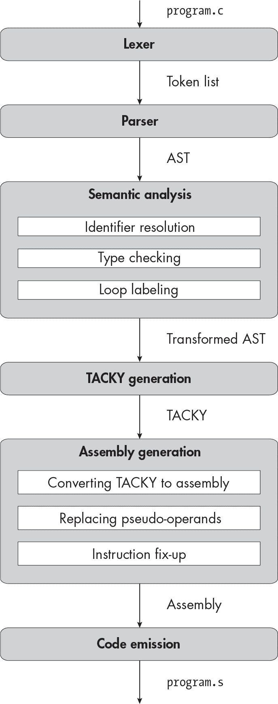

描述


## 17 支持动态内存分配


在第二部分中，你已经编译了调用越来越多标准库函数的程序。在第一部分的结尾时，你的编译器只支持那些参数和返回值类型为int的函数，如putchar。现在，你可以编译调用像fmax这样的浮点数学函数和像puts这样的字符串处理函数的程序。在本章中，你将实现调用标准库中一个非常重要部分——内存管理函数所需的剩余功能。这些函数包括动态分配内存的malloc、calloc和aligned_alloc；用于释放动态分配内存的free；以及释放一个内存块并重新分配另一个相同内容的内存块的realloc。

要编译声明并调用这些函数的程序，你需要实现void类型。直到现在，我们只用void关键字来指定空的参数列表；现在我们将其作为一个合适的类型说明符来处理。在 C 语言中，void *表示一个没有特定类型的内存块的地址；所有分配内存的标准库函数都返回这种类型。单独的void类型也非常有用。例如，你可以用它来声明那些不返回值的函数，像free。除了void外，我们还将实现sizeof运算符，它用来获取类型或对象的大小。C 程序常常使用sizeof来计算需要分配多少字节的内存。

本章的非秘密议程是让你为第十八章中实现结构体类型做准备。现实中的 C 程序通常将结构体存储在动态分配的内存中，这也是该章节许多测试的做法。我们对类型检查器所做的更改，在第十八章中也会派上用场，因为一些适用于<code>void</code>的类型规则也适用于结构体类型。

### void 类型

C 标准（第 6.2.5 节，第 19 段）给出了以下相当神秘的<code>void</code>定义：“<code>void</code>类型包含一个空的值集合；它是一个不完整的对象类型，无法完成。”我们稍后会详细讨论“不可完成的对象类型”是什么意思。现在，主要的观点是<code>void</code>是一种没有值的类型。你不能用这个类型做太多事情，但它确实有一些用处。

如果函数不返回任何值，你可以给它指定一个<code>void</code>返回类型。为了让函数具有<code>void</code>返回类型，你可以使用一个没有表达式的<code>return</code>语句，像示例 17-1 中那样。

```
void return_nothing(void) {
    return;
}
```

示例 17-1：一个具有 void 返回类型的函数

正如示例 17-2 所示，你还可以完全省略<code>return</code>语句。在这种情况下，当你到达函数体的末尾时，函数将返回。

```
void perform_side_effect(void) {
    extern int some_variable;
    some_variable = 100;
}
```

示例 17-2：一个 没有 return 语句的 void 函数

*void 表达式*是一个类型为<code>void</code>的表达式；它没有值，但你可以评估它的副作用。产生 void 表达式的方式有三种。首先，你可以调用一个<code>void</code>函数。其次，你可以评估一个条件表达式，其两个分支都是<code>void</code>类型：

```
flag ? perform_side_effect() : return_nothing();
```

第三，你可以将一个值转换为<code>void</code>类型：

```
(void) (1 + 1);
```

在这里，强制转换为 `void` 对程序执行没有影响；它的唯一目的是告诉编译器和程序员，表达式的值应该被丢弃。这是消除编译器关于未使用值警告的常见方法。

如果你特别热衷于遵循 C 语言的类型规则，你也可以像在示例 17-3 中那样，对代码进行强制转换为 `void`，以使两个条件分支的类型一致。

```
int i = 0;
flag ? perform_side_effect() : (void) (i = 3);
```

示例 17-3：类型为 void

如果我们在这个条件表达式中省略了对 `void` 的强制转换，一个分支将是 `void` 类型，另一个将是 `int` 类型。这将是非法的，尽管大多数编译器不会对此发出警告，除非你使用 `-pedantic` 标志启用额外的警告。我们的编译器会拒绝带有 `void` 分支的条件表达式，因为它一直是严格的。

有四个地方可以使用 `void` 表达式。首先，它可以作为条件表达式中的一个子句出现，如示例 17-3。其次，你可以将其作为独立的表达式使用：

```
perform_side_effect();
```

第三，它可以作为 `for` 循环头部的第一个或第三个子句出现，如示例 17-4。

```
for (perform_side_effect(); i < 10; perform_side_effect())
    `--snip--`
```

示例 17-4：在 for 循环头部中使用 void 表达式

第四，你可以将 `void` 表达式强制转换为 `void`：

```
(void) perform_side_effect();
```

最后一条并不特别有用，但它是合法的。

如你所知，你还可以使用 `void` 关键字在函数声明中指定一个空的参数列表。这是一个特殊情况，因为它实际上并没有指定一个表达式、对象或返回值的类型为 `void`。即使我们扩展编译器以完全支持 `void` 类型，我们仍将像以前一样处理这个特殊情况。

### 使用 void * 进行内存管理

现在让我们看看内存管理函数如何使用 `void *` 来表示分配的内存。`malloc` 函数具有以下签名：

```
void *malloc(size_t size);
```

size 参数指定要分配的字节数。它的类型 size_t 是一个实现定义的无符号整数类型。在 System V x64 ABI 下，size_t 是 unsigned long 的别名。由于我们不支持类型别名，我们的测试程序和示例使用以下声明：

```
void *malloc(unsigned long size);
```

`malloc` 函数分配一块内存并返回其地址。由于 `malloc` 并不知道这块内存将存储什么类型的对象，因此返回一个指向 int、char 或我们到目前为止看到的其他类型的指针会产生误导。相反，它返回 void *。不过，你不能通过 void * 指针来读写内存。因此，在你可以访问通过 malloc 分配的内存之前，你需要通过将其地址从 void * 转换为其他指针类型来指定它应包含的对象类型。

你可以在不显式转换的情况下将其他指针类型转换为 void *，反之亦然。例如，你可以使用 malloc 分配一个包含 100 个 int 元素的数组：

```
int *many_ints = malloc(100 * sizeof (int));
```

当你将 malloc 的结果赋值给 many_ints 时，它会隐式地将 void * 转换为 int *。然后，你可以像访问其他 int 数组一样访问 many_ints：

```
many_ints[10] = 10;
```

`free` 函数接受一个 void * 参数，指定要释放的内存块：

```
void free(void *ptr);
```

这个指针必须是之前由 malloc 或其他内存分配函数返回的相同值。以下是如何使用 free 来释放 many_ints 指向的内存：

```
free(many_ints);
```

这个函数调用隐式地将 many_ints 的值从 int * 转换回 void *，结果是与最初 malloc 返回的指针相同。

calloc 和 aligned_alloc 函数提供了稍有不同的内存分配方式；与 malloc 类似，它们返回指向分配空间的指针，类型为 void *。realloc 函数接受一个大小和一个 void * 指针，指向之前分配的内存，这块内存应该被释放，它返回一个 void * 指针，指向一个新分配的内存块，大小为新的指定值，并保留原有内容。就我们的目的而言，这些函数的细节并不重要；关键概念是它们都使用 void * 指针来标识它们分配和释放的内存块。

这些内存块是我们可以读取和写入的对象，类似于变量，但它们的生命周期管理方式不同。如我们所知，变量有自动存储持续时间（生命周期持续整个代码块执行期间）或静态存储持续时间（生命周期持续整个程序）。一块已分配的内存具有 *分配存储持续时间*：其生命周期从分配开始，直到释放为止。

编译器必须跟踪所有具有静态或自动存储持续时间的变量，记录它们的大小和生命周期的详细信息，并在数据段或栈上为它们保留空间。但编译器不需要知道任何关于具有分配存储持续时间的对象的信息，因为这些对象的跟踪是由程序员和内存管理库负责的。

### 完整类型和不完整类型

如果我们知道一个对象的大小，那么它的类型是 *完整的*；如果我们不知道它的大小，那么它的类型是 *不完整的*。void 类型是我们见过的第一个不完整类型。我们不知道它的大小，因为它没有 *大小*。在下一章中，我们将遇到不完整的结构类型，这些类型的大小和成员对编译器不可见。不完整的结构类型可以在程序后续部分通过编译器了解到更多信息后得到完成。而 void 类型则无法被完成。

C 标准规定，“只有在不需要知道该类型对象的大小时，才能使用不完整类型”（第 6.7.2.3 节，脚注 132）。例如，你不能定义一个不完整类型的变量，因为你不知道需要为它分配多少空间。而且，你不能给一个不完整类型的对象赋值或使用它的值，因为你需要知道读写多少字节。除了少数几个例外，其他不完整类型受与void相同的限制，类型检查器会以相同方式处理它们。

所有指针都是完整类型，即使它们指向的类型是不完整的；我们知道指针的大小始终是 8 字节。这就是为什么你可以声明类型为void *的变量和参数，从函数返回void *类型的值，将它们转换为其他指针类型，等等。正如你将在下一章看到的那样，你可以以相同的方式使用指向不完整结构类型的指针。

### sizeof 操作符

sizeof操作符接受表达式或类型名称。当它接受类型名称时，它返回该类型的字节大小。当它接受表达式时，它返回该表达式类型的大小。清单 17-5 展示了这两种情况。

```
sizeof (long);
sizeof 10.0;
```

清单 17-5：sizeof 的两种用法

这两个sizeof表达式的值都是 8，因为long和double类型的大小都是 8 字节。请注意，在sizeof表达式中，类型名称必须用括号括起来，但表达式不需要。

当你在sizeof表达式中使用数组时，它不会退化为指针。请参见清单 17-6 中的sizeof表达式。

```
int array[3];
return sizeof array;
```

清单 17-6：获取数组的大小

这段代码返回12，即一个包含三个int元素的数组的大小，而不是8，即指针的大小。

你总是可以在不评估表达式的情况下确定其类型——因此也能确定其大小。事实上，C 标准要求我们*不要*评估 sizeof 表达式的操作数。相反，我们推断操作数的类型，并在编译时评估 sizeof。这意味着 sizeof 表达式不会产生副作用。例如，语句

```
return sizeof puts("Shouting into the void");
```

不会调用 puts。它将直接返回 4，因为 puts 函数的返回类型是 int。

你也可以将 sizeof 应用于通常会产生运行时错误的表达式，正如 第 17-7 节 所演示的那样。

```
double *null_ptr = 0;
return sizeof *null_ptr;
```

第 17-7 节：在不评估表达式的情况下获取其大小

通常，解引用 null_ptr 会导致未定义行为。但是这个例子是明确定义的，因为它永远不会评估 *null_ptr。相反，它将返回 8，因为编译器可以确定 *null_ptr 的类型是 double。

可变长度数组是这一规则的唯一例外。可变长度数组的大小在编译时无法得知，因此必须在运行时进行评估。由于我们不支持可变长度数组，所以可以忽略这一情况。

现在我们知道了 C 程序如何使用 void、void * 和 sizeof，接下来让我们开始处理编译器。像往常一样，我们将从更新词法分析器开始。

### 词法分析器

本章将引入一个新关键字：

sizeof

你无需添加 void 关键字；词法分析器已经识别它了。

### 解析器

第 17-8 节展示了本章对 AST 的修改。

```
program = Program(declaration*)
declaration = FunDecl(function_declaration) | VarDecl(variable_declaration)
variable_declaration = (identifier name, initializer? init,
                        type var_type, storage_class?)
function_declaration = (identifier name, identifier* params, block? body,
                        type fun_type, storage_class?)
initializer = SingleInit(exp) | CompoundInit(initializer*)
type = Char | SChar | UChar | Int | Long | UInt | ULong | Double **|** **Void**
     | FunType(type* params, type ret)
     | Pointer(type referenced)
     | Array(type element, int size)
storage_class = Static | Extern
block_item = S(statement) | D(declaration)
block = Block(block_item*)
for_init = InitDecl(variable_declaration) | InitExp(exp?)
statement = Return(**exp?**)
          | Expression(exp)
 | If(exp condition, statement then, statement? else)
          | Compound(block)
          | Break
          | Continue
          | While(exp condition, statement body)
          | DoWhile(statement body, exp condition)
          | For(for_init init, exp? condition, exp? post, statement body)
          | Null
exp = Constant(const)
    | String(string)
    | Var(identifier)
    | Cast(type target_type, exp)
    | Unary(unary_operator, exp)
    | Binary(binary_operator, exp, exp)
    | Assignment(exp, exp)
    | Conditional(exp condition, exp, exp)
    | FunctionCall(identifier, exp* args)
    | Dereference(exp)
    | AddrOf(exp)
    | Subscript(exp, exp)
 **| SizeOf(exp)**
 **| SizeOfT(type)**
unary_operator = Complement | Negate | Not
binary_operator = Add | Subtract | Multiply | Divide | Remainder | And | Or
                | Equal | NotEqual | LessThan | LessOrEqual
                | GreaterThan | GreaterOrEqual
const = ConstInt(int) | ConstLong(int) | ConstUInt(int) | ConstULong(int)
      | ConstDouble(double) | ConstChar(int) | ConstUChar(int)
```

列表 17-8：带有 void， sizeof，和 return 没有返回值的 return 语句

我们在这里做了四个小修改。首先，我们添加了一个 void 类型。其次，Return 语句中的表达式现在是可选的，因此它可以表示有返回值和没有返回值的 return 语句。最后，有两个新的表达式，表示你可以使用 sizeof 操作符的两种方式。

接下来，我们将对语法进行相应的修改。这里唯一的难点是，除非类型转换表达式被括号括起来，否则我们不能对类型转换表达式应用 sizeof。例如，这是一个语法错误：

```
sizeof (int) a;
```

将类型转换表达式用括号括起来可以修复这个错误：

```
sizeof ((int) a);
```

这个限制使得解析器更容易区分 sizeof 操作是作用于类型名还是作用于表达式。为了在语法中捕捉到这个限制，我们需要将类型转换表达式与其他一元表达式分开。

让我们从重构类型名开始，创建一个符号，以便我们能在类型转换和 sizeof 表达式中都能使用：

```
<type-name> ::= {<type-specifier>}+ [<abstract-declarator>]
```

接下来，我们将定义新的 <cast-exp> 符号，包含一个类型转换表达式规则和另一个用于所有其他一元表达式的规则：

```
<cast-exp> ::= "(" <type-name> ")" <cast-exp>
             | <unary-exp>
```

我们将更新 <unary-exp> 以包含所有一元表达式，除了类型转换：

```
<unary-exp> ::= <unop> ❶ <cast-exp>
              | "sizeof" ❷ <unary-exp>
              | "sizeof" "(" <type-name> ")"
              | <postfix-exp>
```

一元操作符规则，比如 -、~、! 和 & 允许类型转换表达式作为操作数 ❶，而 sizeof 的规则则不允许 ❷。

最后，我们将使用新的 <cast-exp> 符号，而不是更具限制性的 <unary-exp>，来表示二元或三元表达式中的单个项：

```
<exp> ::= **<cast-exp>** | <exp> <binop> <exp> | <exp> "?" <exp> ":" <exp>
```

列表 17-9 给出了本章的完整语法。

```
<program> ::= {<declaration>}
<declaration> ::= <variable-declaration> | <function-declaration>
<variable-declaration> ::= {<specifier>}+ <declarator> ["=" <initializer>] ";"
<function-declaration> ::= {<specifier>}+ <declarator> (<block> | ";")
<declarator> ::= "*" <declarator> | <direct-declarator>
<direct-declarator> ::= <simple-declarator> [<declarator-suffix>]
<declarator-suffix> ::= <param-list> | {"[" <const> "]"}+
<param-list> ::= "(" "void" ")" | "(" <param> {"," <param>} ")"
<param> ::= {<type-specifier>}+ <declarator>
<simple-declarator> ::= <identifier> | "(" <declarator> ")"
<type-specifier> ::= "int" | "long" | "unsigned" | "signed" | "double" | "char" **| "void"**
<specifier> ::= <type-specifier> | "static" | "extern"
<block> ::= "{" {<block-item>} "}"
<block-item> ::= <statement> | <declaration>
<initializer> ::= <exp> | "{" <initializer> {"," <initializer>} [","] "}"
<for-init> ::= <variable-declaration> | [<exp>] ";"
<statement> ::= "return" **[<exp>]** ";"
              | <exp> ";"
              | "if" "(" <exp> ")" <statement> ["else" <statement>]
              | <block>
              | "break" ";"
              | "continue" ";"
              | "while" "(" <exp> ")" <statement>
              | "do" <statement> "while" "(" <exp> ")" ";"
 | "for" "(" <for-init> [<exp>] ";" [<exp>] ")" <statement>
              | ";"
<exp> ::= **<cast-exp>** | <exp> <binop> <exp> | <exp> "?" <exp> ":" <exp>
**<cast-exp> ::= "(" <type-name> ")" <cast-exp>**
 **| <unary-exp>**
<unary-exp> ::= <unop> **<cast-exp>**
              **| "sizeof" <unary-exp>**
              **| "sizeof" "(" <type-name> ")"**
              | <postfix-exp>
**<type-name> ::= {<type-specifier>}+ [<abstract-declarator>]**
<postfix-exp> ::= <primary-exp> {"[" <exp> "]"}
<primary-exp> ::= <const> | <identifier> | "(" <exp> ")" | {<string>}+
                | <identifier> "(" [<argument-list>] ")"
<argument-list> ::= <exp> {"," <exp>}
<abstract-declarator> ::= "*" [<abstract-declarator>]
                        | <direct-abstract-declarator>
<direct-abstract-declarator> ::= "(" <abstract-declarator> ")" {"[" <const> "]"}
                               | {"[" <const> "]"}+
<unop> ::= "-" | "~" | "!" | "*" | "&"
<binop> ::= "-" | "+" | "*" | "/" | "%" | "&&" | "||"
          | "==" | "!=" | "<" | "<=" | ">" | ">=" | "="
<const> ::= <int> | <long> | <uint> | <ulong> | <double> | <char>
<identifier> ::= ? An identifier token ?
<string> ::= ? A string token ?
<int> ::= ? An int token ?
<char> ::= ? A char token ?
<long> ::= ? An int or long token ?
<uint> ::= ? An unsigned int token ?
<ulong> ::= ? An unsigned int or unsigned long token ?
<double> ::= ? A floating-point constant token ?
```

示例 17-9：带有 void、 sizeof 和可选返回值的语法

parse_type 辅助函数，它将类型说明符列表转换为 type AST 节点，应当拒绝任何 void 说明符与其他类型说明符（如 long 或 unsigned）一起出现的声明。否则，解析器应像处理其他类型一样处理 void。void 类型可以通过指针、数组和函数声明符进行修饰；指向 void 的指针和返回 void 的函数都是完全合法的，而其他使用 void 的方式在语法上是有效的，但在语义上是非法的。例如，声明一个 void 元素的数组，定义一个 void 变量，或声明一个带有 void 参数的函数，都是语义错误。解析器不会捕捉这些语义错误，但类型检查器会。

即使语法规则本身没有改变，您可能仍需要更改对 <param-list> 的解析逻辑。如果开头的 ( 后面跟着 void 关键字，您需要再看下一个符号。如果下一个符号是），则参数列表为空。否则，列表不为空，且 void 关键字表示一个参数声明的开始。

注意，当 void 关键字表示空参数列表时，我们*不会*将其翻译为 AST 中的 Void 类型。例如，给定函数声明

```
int main(void);
```

生成的 AST 节点将具有此类型：

```
FunType(params=[], ret=Int)
```

params 列表为空，就像在前面的章节中一样；它不包含 Void。

### 类型检查器

现在让我们弄清楚如何进行 void、void * 和 sizeof 的类型检查。我们将从 void * 与其他指针类型之间的隐式转换开始。尽管大多数指针类型之间的隐式转换是不可行的，但在几种情况下，这种转换是被允许的。接下来，我们将检测 void 可能引发的所有新的和令人兴奋的类型错误。最后，我们将处理 sizeof 操作符。

#### 转换到和从 void *

void *与其他指针类型之间的隐式转换在三种情况下是合法的。首先，你可以使用 == 或 != 比较 void * 类型的值和另一个指针类型：

```
int *a;
void *b;
`--snip--`
return a == b;
```

第二，在形如 <cond> ? <clause1> : <clause2> 的条件表达式中，一个子句可以是 void * 类型，另一个子句可以是其他指针类型：

```
int *a;
void *b;
`--snip--`
return flag ? a : b;
```

在这两种情况下，非void 类型的指针会被转换为 void *。

第三，你可以在赋值时隐式地进行 void * 与其他指针类型之间的转换。你可以将任何指针类型的值赋给 void * 类型的对象：

```
int *a = 0;
void *b = a;
```

同样地，你也可以将 void * 类型的值赋给另一个指针类型的对象。

最后一种情况不仅包括简单的赋值操作；它涵盖了我们在第十四章中讨论的所有“类似于赋值”的转换。例如，传递 void * 类型的参数给期望其他指针类型的函数是合法的：

```
int use_int_pointer(int *a);
void *ptr = 0;
use_int_pointer(ptr);
```

并非巧合，这恰好是可以隐式地将空指针常量转换为其他指针类型的三种情况。为了支持 void * 的隐式转换，我们将扩展在 第十四章 中定义的两个辅助函数：get_common_pointer_type 和 convert_by_assignment。

让我们重新审视 列表 14-14，该列表定义了 get_common_pointer_type。它在此处复制为 列表 17-10，并已加粗本章的更改部分。

```
get_common_pointer_type(e1, e2):
    e1_t = get_type(e1)
    e2_t = get_type(e2)
    if e1_t == e2_t:
        return e1_t
    else if is_null_pointer_constant(e1):
        return e2_t
    else if is_null_pointer_constant(e2):
        return e1_t
    **else if e1_t == Pointer(Void) and e2_t is a pointer type:**
        **return Pointer(Void)**
    **else if e2_t == Pointer(Void) and e1_t is a pointer type:**
        **return Pointer(Void)**
    else:
        fail("Expressions have incompatible types")
```

列表 17-10：获取两个表达式的公共类型，其中至少一个具有指针类型

粗体部分的代码允许在 void * 和其他指针类型之间进行隐式转换，但不允许在 void * 和算术类型、数组类型或 void 之间进行隐式转换。接下来，我们将再次查看 列表 14-16，并将其复制到 列表 17-11 中，修改部分已加粗。

```
convert_by_assignment(e, target_type):
    if get_type(e) == target_type:
        return e
    if get_type(e) is arithmetic and target_type is arithmetic:
        return convert_to(e, target_type)
    if is_null_pointer_constant(e) and target_type is a pointer type:
        return convert_to(e, target_type)
 **if target_type == Pointer(Void) and get_type(e) is a pointer type:**
 **return convert_to(e, target_type)**
 **if target_type is a pointer type and get_type(e) == Pointer(Void):**
 **return convert_to(e, target_type)**
    else:
        fail("Cannot convert type for assignment")
```

列表 17-11：将表达式转换为目标类型，如同通过赋值操作一样

粗体部分的修改使我们可以在赋值过程中将 void * 转换为其他指针类型，反之亦然。请注意，本列表中的内容不会阻止我们将 void 表达式赋值给 void 目标类型。然而，我们将在类型检查器的其他地方引入对 void 的其他限制，以确保我们永远不会将目标类型为 void 的 convert_by_assignment 函数调用。例如，我们永远不会尝试将函数参数转换为 void，因为我们会拒绝包含 void 参数的函数声明。

#### 返回类型为 void 的函数

接下来，我们将对带有和不带有表达式的 return 语句进行类型检查。应该使用哪种 return 语句取决于函数的返回类型。返回类型为 void 的函数不能返回表达式。任何其他返回类型的函数在返回时必须包含表达式。因此，以下两个函数定义是合法的：

```
int return_int(void) {
    return 1;
}

void return_void(void) {
    return;
}
```

以下两种都是非法的：

```
int return_int(void) {
    return;
}

void return_void(void) {
    return 1;
}
```

你甚至不能从返回类型为void的函数中返回一个 void 表达式，这也使得以下示例非法：

```
void return_void(void) {
    return (void) 1;
}
```

GCC 和 Clang 都接受这个程序，但如果你使用`-pedantic`标志，它们会发出警告。你可以根据需要处理这种边缘情况；测试套件不会覆盖它。

我会跳过本节的伪代码，因为这只是我们现有逻辑的一种直接扩展，用于类型检查return语句。

#### 标量和非标量类型

一些 C 语言构造要求使用标量表达式，包括&&、||和!表达式的操作数；条件表达式的第一个操作数；以及循环和if语句中的控制条件。共同点是，所有这些语言构造都将表达式的值与零进行比较。将指针或算术值与零进行比较是有意义的，但将非标量值与零进行比较则没有意义。

在前面的章节中，没有办法编写一个违反这些类型约束的程序。数组是我们唯一的非标量类型，而且在需要标量表达式的地方，数组会退化为指针。但是一旦我们把void加入其中，就需要明确执行这些约束。（尽管void不是一个聚合类型，它也不是标量类型。标量表达式有一个单一的值，而 void 表达式则*没有*值。）清单 17-12 定义了一个小的辅助函数来告诉我们一个类型是否为标量。

```
is_scalar(t):
    match t with
    | Void -> return False
    | Array(elem_t, size) -> return False
    | FunType(param_ts, ret_t) -> return False
    | _ -> return True
```

清单 17-12：检查类型是否为标量

我们可以使用这个辅助函数来验证控制条件和逻辑操作数。例如，清单 17-13 演示了如何验证逻辑!表达式的操作数。

```
typecheck_exp(e, symbols):
    match e with
  | `--snip--`
    | Unary(Not, inner) ->
        typed_inner = typecheck_and_convert(inner, symbols)
        if not is_scalar(get_type(typed_inner)):
            fail("Logical operators only apply to scalar expressions")
 `--snip--`
```

清单 17-13：验证逻辑操作数是否为标量

类型转换表达式略有不同。除了我们已经禁止的`double`与指针之间的转换外，你可以将标量表达式转换为任何标量类型。你还可以将任何类型转换为void。 清单 17-14 展示了如何进行类型检查类型转换表达式。

```
 | Cast(t, inner) ->
        typed_inner = typecheck_and_convert(inner, symbols)
 `--snip--`
      ❶ if t == Void:
            return set_type(Cast(t, typed_inner), Void)
      ❷ if not is_scalar(t):
            fail("Can only cast to scalar type or void")
      ❸ if not is_scalar(get_type(typed_inner)):
            fail("Cannot cast non-scalar expression to scalar type")
        else:
            return set_type(Cast(t, typed_inner), t)
```

清单 17-14：类型检查类型转换表达式

首先，我们明确拒绝 double 和指针之间的转换。这项检查在 清单 17-14 中被省略，因为它与前几章相同。接着，我们检查目标类型是否为 void ❶。如果是，我们记录下整个表达式的类型是 void。否则，我们验证目标类型 ❷ 和内层表达式 ❸ 是否都是标量类型。这将拒绝从 void 到任何非 void 类型的转换，也禁止转换到数组和函数类型，这些我们已经知道是不合法的。

清单 17-13 和 17-14 中的类型检查逻辑也适用于结构体，我们将在下一章实现它们。结构体是聚合类型，但它们不像数组那样会衰退为指针。因此，我们需要验证程序中是否在需要标量类型的地方使用了结构体。

#### 不完整类型的限制

如果程序在需要完整类型的地方使用不完整类型，将会遇到类型错误。目前，我们将在三种情况下要求完整类型。首先，不能对指向不完整类型的指针进行加法、减法或下标操作，因为无法确定它们指向的数组元素的大小。其次，不能对不完整类型应用 sizeof，因为它的大小未知。第三，每当你指定数组类型时，其元素类型必须是完整类型。

> 注意

*作为语言扩展，Clang 和 GCC 允许对 void 指针进行指针运算，并对 void 执行 sizeof 操作。这些表达式的实现假定 void 的大小为 1。*

清单 17-15 定义了一些辅助函数来支持这种验证。

```
is_complete(t):
    return t != Void
is_pointer_to_complete(t):
    match t with
    | Pointer(t) -> return is_complete(t)
    | _ -> return False
```

清单 17-15：检查不完整类型和指向不完整类型的指针

我们将在需要检查完整类型时使用 is_complete。在需要检查指向完整类型的指针时，我们将使用 is_pointer_to_complete，特别是在我们进行指针加法、减法和下标操作时。例如，清单 17-16 演示了如何进行指针加法的类型检查。它复制了 清单 15-21，并将本章的更改加粗，同时省略了一些未更改的代码。

```
 | Binary(Add, e1, e2) ->
        typed_e1 = typecheck_and_convert(e1, symbols)
        typed_e2 = typecheck_and_convert(e2, symbols)
        t1 = get_type(typed_e1)
        t2 = get_type(typed_e2)
        if t1 and t2 are arithmetic:
 `--snip--`
        else if **is_pointer_to_complete(t1)** and t2 is an integer type:
 `--snip--`
        else if **is_pointer_to_complete(t2)** and t1 is an integer type:
 `--snip--`
        else:
            fail("Invalid operands for addition")
```

清单 17-16：类型检查指针加法，额外验证指针引用的类型是否完整

在下一章，我们将扩展is_complete，以区分完整类型和不完整类型的结构体类型。

我们暂时不考虑sizeof；我们将在稍后的“sizeof 表达式”部分对其进行类型检查，见第 477 页。这意味着我们只需要处理第三种情况，确保每个数组元素的类型是完整的。这同样适用于嵌套在更大类型中的数组。例如，以下声明是无效的：

```
void (*ptr_to_void_array)[3];
```

即使每个指针都是完整类型，声明指向void元素数组的指针也是非法的。在 Listing 17-17 中，我们定义了一个额外的辅助函数来捕捉这些无效的类型说明符。

```
validate_type_specifier(t):
    match t with
    | Array(elem_t, size) ->
      ❶ if not is_complete(elem_t):
            fail("Illegal array of incomplete type")
 validate_type_specifier(elem_t)
    | Pointer(referenced_t) -> ❷ validate_type_specifier(referenced_t)
    | FunType(param_ts, ret_t) ->
        for param_t in param_ts:
            validate_type_specifier(param_t)
        validate_type_specifier(ret_t)
  ❸ | _ -> return
```

Listing 17-17: 验证类型说明符

当我们看到一个数组类型时，我们会确保它的元素类型是完整的❶，然后递归验证该元素类型。这确保我们会拒绝包含void元素的嵌套数组、指向包含void元素的数组的指针数组，等等。为了处理另一个派生类型，我们将递归验证它所引用的任何类型❷。非派生类型，包括void本身，都是有效的❸。我们将在所有出现类型说明符的地方调用validate_type_specifier来验证类型说明符：在变量声明、函数声明、sizeof表达式和类型转换表达式中。

我们将在下一章引入更多对不完整类型的限制。例如，除了void之外，在条件表达式的分支中使用不完整类型是非法的。将值赋给具有不完整类型的左值也是非法的，但由于我们将在接下来实现的规则，void左值是不存在的，所以现在可以忽略这条规则。

#### 对 void 的额外限制

在我们刚刚实现的所有不完整类型的限制之外，我们还将对void施加两个额外的限制：你不能声明void变量或参数，也不能解引用指向void的指针。（这两种使用void的方式是合法的灰色地带；详细内容请参见框“void 何时有效：过于详细的讨论”。）

这些对void的限制不适用于其他不完整类型。在下一章中，你将看到你可以声明——但不能定义——一个不完整结构体类型的变量。然后，你可以在程序的不同位置定义该变量，一旦该类型被完成。同样，你可以声明一个使用不完整结构体类型作为参数或返回类型的函数，只要在调用或定义该函数之前完成该类型。最后，解引用指向不完整结构体类型的指针是合法的，尽管这不是特别有用；你唯一能对解引用结果做的事情就是获取其地址，这只会返回你最初的指针。

我们在这里稍微妥协了一下一个边缘情况。严格来说，获取*任何*解引用指针的地址都是合法的，无论它是指向完整类型、未完类型结构体类型还是void。正如我们在第十四章中看到的，获取解引用指针的地址是一个特殊情况；这两个操作会互相抵消，结果是明确的，即使解引用表达式本身是未定义的。这意味着这段代码是合法的：

```
void *void_ptr = malloc(4);
void *another_ptr = &*void_ptr;
```

我们的编译器将拒绝对void *操作数的所有解引用操作，即使在这种边缘情况下也是如此。但我们并不孤单：GCC 会对这段代码发出警告，MSVC 则完全拒绝它。（当然，如果你想，你可以正确处理这个边缘情况；我们的测试套件没有涵盖它。）

#### 具有 void 操作数的条件表达式

我们将明确允许在条件表达式中使用void操作数，正如清单 17-18 所示。

```
typecheck_exp(e, symbols):
    match e with
    | `--snip--`
    | Conditional(condition, e1, e2) ->
        typed_cond = typecheck_and_convert(condition, symbols)
        typed_e1 = typecheck_and_convert(e1, symbols)
        typed_e2 = typecheck_and_convert(e2, symbols)
      ❶ if not is_scalar(get_type(typed_cond)):
            fail("Condition in conditional operator must be scalar")
        t1 = get_type(typed_e1)
        t2 = get_type(typed_e2)
        if t1 == Void and t2 == Void:
          ❷ result_type = Void
        else if t1 and t2 are arithmetic types:
            result_type = get_common_type(t1, t2)
        else if t1 or t2 is a pointer type:
            result_type = get_common_pointer_type(typed_e1, typed_e2)
        else:
            fail("Cannot convert branches of conditional to a common type")
        `--snip--`
```

清单 17-18：条件表达式的类型检查

要进行条件表达式的类型检查，我们首先验证其控制条件是否为标量❶。然后，我们考虑两个子句的类型。如果它们都是void，则结果也是void ❷。否则，我们按照之前的方法确定结果类型：如果两个操作数都是算术类型，则应用常规的算术转换；如果其中一个是指针，则找到它们的公共指针类型。如果这些情况都不适用——例如，因为一个操作数是void，而另一个是指针或算术值——我们将抛出错误。

#### 现有的算术表达式和比较验证

接下来，我们将确保现有的逻辑在进行算术运算和比较时，即使混入了 void 类型，仍能正常进行类型检查。之前，我们可以假设每个表达式要么是算术类型，要么是指针类型。但现在我们不能再依赖这个假设。例如，我们可以重新查看 Listing 14-15，该示例展示了如何进行 Equal 表达式的类型检查。Listing 17-19 复现了这段代码，并加入了我们需要添加的额外验证逻辑。

```
typecheck_exp(e, symbols):
    match e with
  | `--snip--`
    | Binary(Equal, e1, e2) ->
        typed_e1 = typecheck_and_convert(e1, symbols)
        typed_e2 = typecheck_and_convert(e2, symbols)
        t1 = get_type(typed_e1)
        t2 = get_type(typed_e2)
        if t1 or t2 is a pointer type:
            common_type = get_common_pointer_type(typed_e1, typed_e2)
        else **if t1 and t2 are arithmetic types:**
            common_type = get_common_type(t1, t2)
 **else:**
 **fail("Invalid operands to equality expression")**
 `--snip--`
```

Listing 17-19: 带有额外验证的 Equal 表达式的类型检查

> 注意

*如果你将这段代码与 Listing 14-15 进行比较，你会注意到我们已经将递归调用 typecheck_exp 替换为 typecheck_and_convert。我们在 第十五章中做了这个更改，因此在这里没有加粗。*

在 第十四章中，如果 t1 和 t2 都不是指针类型，我们知道它们都是算术类型，因此可以继续执行通常的算术类型转换。现在我们将明确检查它们是否是指针类型或算术类型；如果是其他类型，则会失败。

更广泛来说，我们应该通过接受有效类型而不是拒绝无效类型来进行每个表达式操作数的类型检查。例如，我们应该验证 Multiply 和 Divide 的操作数 *是* 算术值，而不是确保它们 *不是* 指针。花点时间回顾一下你对所有关系运算和算术运算的类型检查逻辑，收紧任何过于宽松的验证。

#### sizeof 表达式

一个 sizeof 表达式的类型是 size_t；在我们的实现中，它就是 unsigned long。为了进行 sizeof 的类型检查，我们首先验证其操作数，然后将 unsigned long 记录为结果类型，正如 Listing 17-20 所示。

```
typecheck_exp(e, symbols):
    match e with
  | `--snip--`
    | SizeOfT(t) ->
      ❶ validate_type_specifier(t)
      ❷ if not is_complete(t):
            fail("Can't get the size of an incomplete type")
        return set_type(e, ULong)
    | SizeOf(inner) ->
 ❸ typed_inner = typecheck_exp(inner, symbols)
      ❹ if not is_complete(get_type(typed_inner)):
            fail("Can't get the size of an incomplete type")
        return set_type(SizeOf(typed_inner), ULong)
```

Listing 17-20: 类型检查 sizeof

如果 sizeof 操作的是一个类型，我们会强制执行两个关于不完整类型的规则，这些规则在“关于不完整类型的限制”中已经讨论过（见 第 471 页）：你不能指定一个具有不完整元素类型的数组 ❶，而且不能对不完整类型应用 sizeof ❷。（你也不能对函数类型应用 sizeof，但我们已经在解析器中捕获了这个错误。）

如果操作数是一个表达式，我们首先推断该表达式的类型 ❸。为了避免将数组转换为指针，我们使用 typecheck_exp 而不是 typecheck_and_convert。一旦我们确定了表达式的类型，我们确保该类型是完整的 ❹。

### TACKY 生成

接下来，我们将 sizeof 和 void 表达式转换为 TACKY。我们需要更新 Return 和 FunCall 指令，以适应返回类型为 void 的函数。我们还将稍微不同地处理类型为 void 的类型转换和条件表达式，与其非 void 对应类型相比；特别是，我们不会创建任何 void 临时变量。我们将在此步骤中评估 sizeof 表达式，并将它们替换为整数常量。我们无需为指向 void 的指针做任何更改。

#### 返回类型为 void 的函数

我们将对 TACKY IR 做两项更改，以便能够调用并从返回类型为 void 的函数返回。首先，我们将使 FunCall 指令的目标变为可选：

```
FunCall(identifier fun_name, val* args, **val? dst**)
```

对于调用 void 函数的情况，我们将保持 dst 为空。对于调用其他函数的情况，dst 将是一个临时变量，用于保存返回值，就像现在这样。我们将对 Return 指令进行类似的修改：

```
Return(**val?**)
```

然后，我们将把每个没有表达式的 return 语句转换为一个没有值的 TACKY Return 指令。

一个 void 函数可能不会使用显式的 return 语句；在这种情况下，当控制流到达函数末尾时，它会自动返回。我们通过在每个 TACKY 函数的末尾添加 Return 指令，已经正确处理了这种情况。

#### 转换为 void

列表 17-21 显示了如何处理转换为 void 的类型：只需处理内部表达式，而不发出其他任何指令。

```
emit_tacky(e, instructions, symbols):
    match e with
  | `--snip--`
    | Cast(Void, inner) ->
        emit_tacky_and_convert(inner, instructions, symbols)
        return PlainOperand(Var("DUMMY"))
```

列表 17-21：将转换为 void 转换为 TACKY

你可以在这里返回任何你想要的操作数；调用者不会使用它。

#### 带有 void 操作数的条件表达式

列表 17-22 演示了我们当前如何将条件表达式转换为 TACKY。

```
 | Conditional(condition, e1, e2) ->
 `--snip--`
        cond = emit_tacky_and_convert(condition, instructions, symbols)
        instructions.append(JumpIfZero(cond, e2_label))
        dst = make_tacky_variable(get_type(e), symbols)
        v1 = emit_tacky_and_convert(e1, instructions, symbols)
        instructions.append_all(
          ❶ [Copy(v1, dst),
              Jump(end),
              Label(e2_label)])
 v2 = emit_tacky_and_convert(e2, instructions, symbols)
        instructions.append_all(
          ❷ [Copy(v2, dst),
              Label(end)])
        return PlainOperand(dst)
```

列表 17-22：将非 void 条件表达式转换为 TACKY

如果 e1 和 e2 是 void 表达式，Copy 指令 ❶❷ 就会变得有问题。我们不应该创建类型为 void 的临时变量 dst，并且我们绝对不应该将任何东西复制到它里面。为了处理条件中的 void 表达式，我们将沿用 列表 17-22 中的基本方法，但不生成 dst 或发出任何 Copy 指令。列表 17-23 显示了更新后的伪代码，用于处理 void 条件表达式。

```
 | Conditional(condition, e1, e2) ->
 `--snip--`
        cond = emit_tacky_and_convert(condition, instructions, symbols)
        instructions.append(JumpIfZero(cond, e2_label))
        if get_type(e) == Void:
            emit_tacky_and_convert(e1, instructions, symbols)
            instructions.append_all(
            [Jump(end),
              Label(e2_label)])
            emit_tacky_and_convert(e2, instructions, symbols)
            instructions.append(Label(end))
          ❶ return PlainOperand(Var("DUMMY"))
        else:
 `--snip--`
```

列表 17-23：将带有 void 结果的条件表达式转换为 TACKY

由于我们不创建临时变量 dst，我们需要将某个其他操作数返回给调用者。我们可以返回一个虚拟值 ❶，因为我们知道调用者不会使用它。为了处理非 void 表达式，我们将生成与之前相同的指令，因此我已省略了处理该情况的伪代码。

#### sizeof 表达式

我们将在 TACKY 生成期间评估sizeof表达式，并将结果表示为unsigned long常量，正如示例 17-24 所示。

```
 | SizeOf(inner) ->
        t = get_type(inner)
        result = size(t)
        return PlainOperand(Constant(ConstULong(result)))
    | SizeOfT(t) ->
        result = size(t)
        return PlainOperand(Constant(ConstULong(result)))
```

示例 17-24: 在 TACKY 生成期间评估 sizeof 的过程

由于我们没有将sizeof的操作数转换为 TACKY，因此它不会在运行时被评估。

#### 最新且最强大的 TACKY IR

示例 17-25 定义了当前的 TACKY 中间表示（IR），本章中的两个更改已加粗。

```
program = Program(top_level*)
top_level = Function(identifier, bool global, identifier* params, instruction* body)
          | StaticVariable(identifier, bool global, type t, static_init* init_list)
          | StaticConstant(identifier, type t, static_init init)
instruction = Return(**val?**)
            | SignExtend(val src, val dst)
            | Truncate(val src, val dst)
            | ZeroExtend(val src, val dst)
            | DoubleToInt(val src, val dst)
            | DoubleToUInt(val src, val dst)
            | IntToDouble(val src, val dst)
            | UIntToDouble(val src, val dst)
            | Unary(unary_operator, val src, val dst)
            | Binary(binary_operator, val src1, val src2, val dst)
            | Copy(val src, val dst)
            | GetAddress(val src, val dst)
            | Load(val src_ptr, val dst)
            | Store(val src, val dst_ptr)
            | AddPtr(val ptr, val index, int scale, val dst)
            | CopyToOffset(val src, identifier dst, int offset)
            | Jump(identifier target)
            | JumpIfZero(val condition, identifier target)
            | JumpIfNotZero(val condition, identifier target)
            | Label(identifier)
            | FunCall(identifier fun_name, val* args, **val?** dst)
val = Constant(const) | Var(identifier)
unary_operator = Complement | Negate | Not
binary_operator = Add | Subtract | Multiply | Divide | Remainder | Equal | NotEqual
                | LessThan | LessOrEqual | GreaterThan | GreaterOrEqual
```

示例 17-25: 向 TACKY IR 添加对返回类型为 void 的函数的支持

本节中的大部分更改—为了支持 void 类型转换、void 条件表达式和sizeof—没有影响 TACKY IR。我们将在下一节处理这两条有所更改的指令。

### 汇编生成

本章的结尾，我们将生成没有返回值的Return指令和没有目标的FunCall指令。我们可以通过对汇编生成过程进行一些小的修改来处理这两条指令。

通常，形式为Return(val)的指令会转换为以下汇编：

```
Mov(`<val type>`, val, `<dst register>`)
Ret
```

如果返回值缺失，我们将跳过Mov指令，只生成Ret指令。类似地，示例 17-26 总结了我们通常如何将FunCall指令转换为汇编。

```
`<fix stack alignment>`
`<move arguments to general-purpose registers>`
`<move arguments to XMM registers>`
`<push arguments onto the stack>`
Call(fun_name)
`<deallocate arguments/padding>`
❶ Mov(`<dst type>`, `<dst register>`, dst)
```

示例 17-26: 当函数返回一个值时，将 FunCall 转换为汇编

如果dst缺失，我们将不会生成最后的Mov指令❶，但其他部分将保持不变。表 17-1 总结了从 TACKY 到汇编的最新更新，其中这两个小更改已加粗。

表 17-1： 将 TACKY 指令转换为汇编

| TACKY 指令 |  | 汇编指令 |
| --- | --- | --- |
| Return(val) | 整数 | Mov(<val type>, val, Reg(AX)) Ret |
| double | Mov(Double, val, Reg(XMM0)) Ret |
| void | Ret |

|

```
FunCall(fun_name, args,
        dst)
```

| dst 存在 |
| --- |

```
<fix stack alignment>
<move arguments to general-purpose registers>
<move arguments to XMM registers>
<push arguments onto the stack>
Call(fun_name)
<deallocate arguments/padding>
Mov(<dst type>, <dst register>, dst)
```

|

|  | dst 缺失 |
| --- | --- |

```
<fix stack alignment>
<move arguments to general-purpose registers>
<move arguments to XMM registers>
<push arguments onto the stack>
Call(fun_name)
<deallocate arguments/padding>
```

|

由于汇编 AST 没有改变，我们将不再修改后端的其余部分。

### 总结

在本章中，你实现了 void 类型和 sizeof 运算符。你学习了完整类型与不完整类型之间的差异，以及 C 程序如何使用 void 表达式。接着，你扩展了类型检查器，检测不完整类型和非标量类型的无效使用，修改了 TACKY 生成阶段，以在不求值其操作数的情况下评估 sizeof 运算符，并调整了后端以支持不返回值的函数。接下来，我们将通过添加结构体类型来完成 第二部分，结构体是你将在本书中实现的最后一种语言特性，也许是最具挑战性的。幸运的是，得益于你在之前章节中学到的技能和打下的基础，你已经为迎接这个挑战做好了充分准备。
