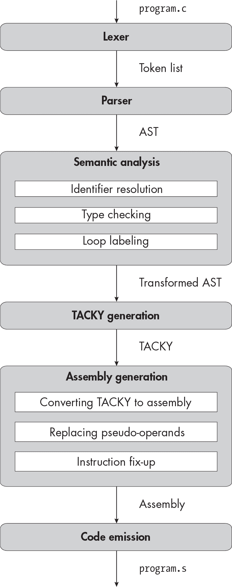
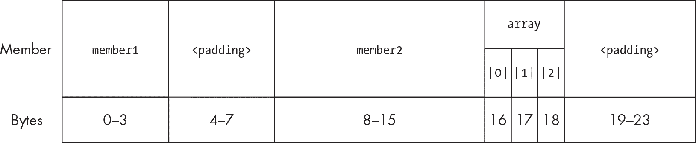
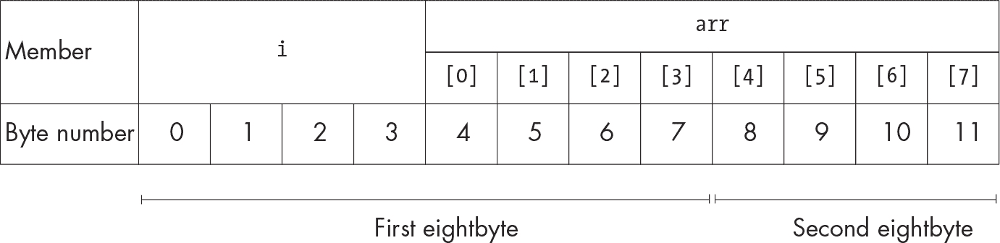
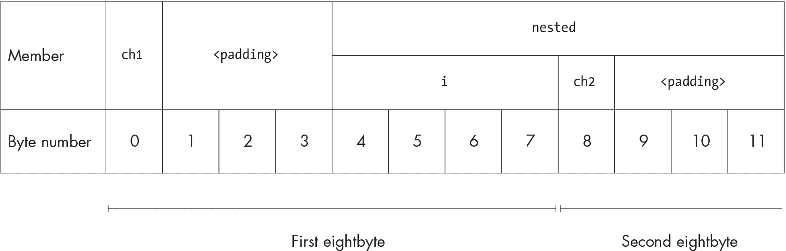
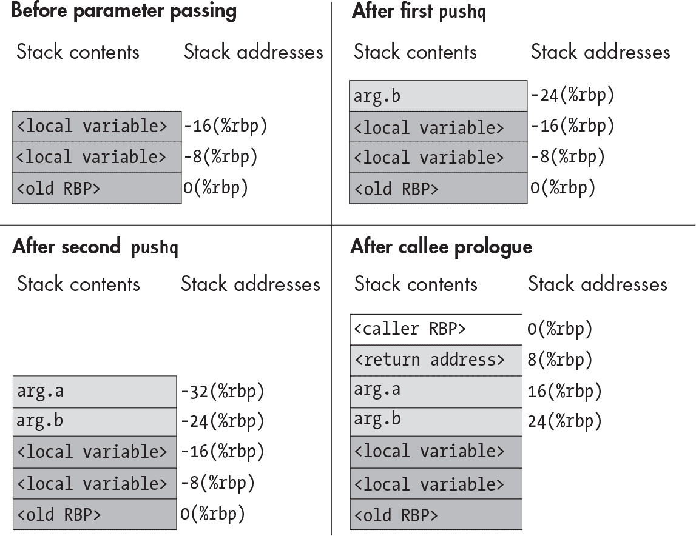
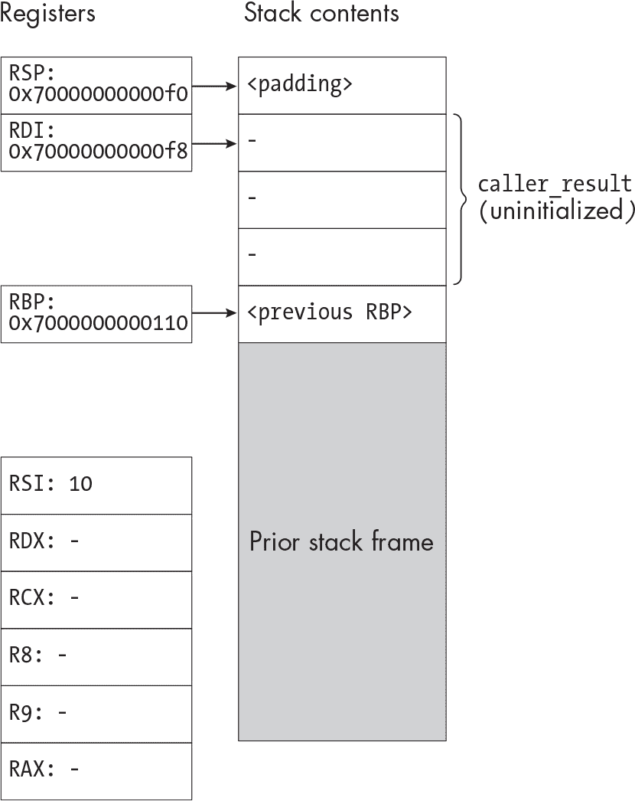
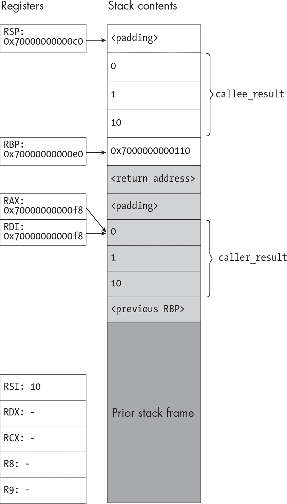
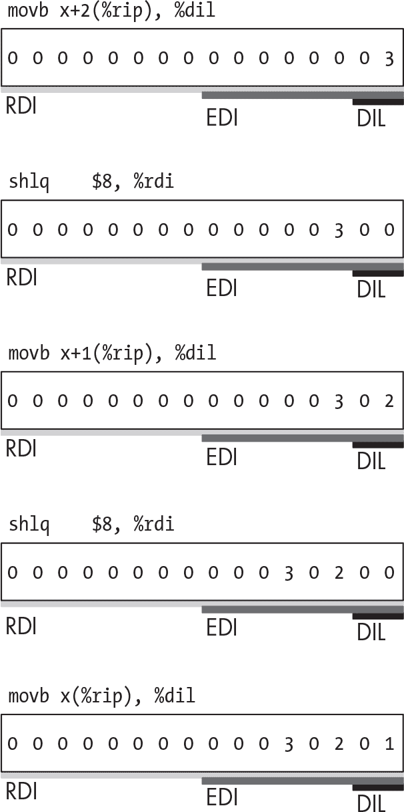

<samp class="SANS_Futura_Std_Book_Oblique_I_11">描述</samp>

<hgroup>

## <samp class="SANS_Futura_Std_Bold_Condensed_B_11">18</samp> <samp class="SANS_Dogma_OT_Bold_B_11">结构体</samp>

</hgroup>


在本章中，你将添加一个最终的语言特性：结构体。你还将实现 <samp class="SANS_TheSansMonoCd_W5Regular_11">.</samp> 和 <samp class="SANS_TheSansMonoCd_W5Regular_11">-></samp> 运算符来访问结构成员。在第二部分的恰当结尾，你将运用前几章学到的许多技能、概念和技术。在标识符解析阶段，你将解析结构标签以及函数和变量标识符。在类型检查器中，你将像记录函数和变量声明在符号表中一样，在类型表中记录结构定义。在 TACKY 生成过程中，你将基于第十四章中处理解引用指针和其他对象操作的策略进行扩展。而在后端，你将实现 System V 调用约定中指定如何将结构体作为函数参数和返回值传递的部分。由于联合体与结构体关系密切，你可能也想实现它们。我们不会详细讨论，但你可以将它们作为额外功能添加进去。

### <samp class="SANS_Futura_Std_Bold_B_11">声明结构类型</samp>

你必须在使用结构类型之前先声明它。结构类型声明有两种形式。第一种，如清单 18-1 所示，指定了结构的成员。

```
struct complete_struct {
    long member1;
    double member2;
};
```

<samp class="SANS_Futura_Std_Book_Oblique_I_11">清单 18-1：一个完整的结构类型声明</samp>

这个清单声明了一个包含两个成员的完整结构类型：一个 <samp class="SANS_TheSansMonoCd_W5Regular_11">long</samp> 类型和一个 <samp class="SANS_TheSansMonoCd_W5Regular_11">double</samp> 类型。标识符 <samp class="SANS_TheSansMonoCd_W5Regular_11">complete_struct</samp> 是这个类型的 *标签*，我们可以在程序中稍后使用它来指定类型。一个完整的结构类型必须至少有一个成员，因此声明一个没有成员的结构类型是非法的：

```
struct empty {};
```

第二种结构类型声明，如清单 18-2 所示，指定了结构的标签，但没有指定其成员。

```
struct incomplete_struct;
```

<samp class="SANS_Futura_Std_Book_Oblique_I_11">清单 18-2：一个不完整的结构类型声明</samp>

列表 18-2 声明了一个不完整的结构类型。正如你在上一章学到的，你只能在某些有限的情况下使用不完整类型。例如，你不能定义一个类型为 <samp class="SANS_TheSansMonoCd_W5Regular_11">struct incomplete_struct</samp> 的变量，但你可以定义一个指向 <samp class="SANS_TheSansMonoCd_W5Regular_11">struct incomplete_struct</samp> 的指针。（这是因为我们知道指针需要多少内存，但不知道这个结构需要多少内存。）我们可以说，带有成员列表的结构声明同时*声明*和*定义*了一个类型，而没有成员列表的结构声明仅仅*声明*了一个类型。这与 C 标准以及其他地方的术语不同；特别是，当人们谈到“类型定义”时，他们通常指的是使用 <samp class="SANS_TheSansMonoCd_W5Regular_11">typedef</samp> 关键字引入的别名。

结构标签仅在声明它们的作用域内可见，就像函数和变量名称一样。如果一个结构标签在文件作用域中声明，它从声明点开始一直可见直到文件末尾。如果它在块作用域中声明，它会一直可见直到块的末尾。如果在同一作用域中出现两个相同标签的结构类型声明，它们总是声明相同的类型；如果它们出现在不同的作用域中，则声明的是不同的类型。（类型声明没有链接性，所以你不能对它们应用 <samp class="SANS_TheSansMonoCd_W5Regular_11">static</samp> 或 <samp class="SANS_TheSansMonoCd_W5Regular_11">extern</samp> 关键字。）你可以多次声明相同的结构类型，但不能多次定义它。

一旦结构的定义在作用域内，它的类型就变成完整的，正如 列表 18-3 所示。

```
❶ struct s;

struct s *ptr = 0;

struct s {
    int a;
    int b;
}; ❷

❸ struct s x = {0,0};
```

<samp class="SANS_Futura_Std_Book_Oblique_I_11">列表 18-3：声明一个不完整的类型并将其完成</samp>

在 ❶ 和 ❷ 之间，<samp class="SANS_TheSansMonoCd_W5Regular_11">struct s</samp> 是一个不完整类型。在程序的这两点之间，定义类型为 <samp class="SANS_TheSansMonoCd_W5Regular_11">struct s</samp> 的变量是不合法的，但定义 <samp class="SANS_TheSansMonoCd_W5Regular_11">ptr</samp>（指向 <samp class="SANS_TheSansMonoCd_W5Regular_11">struct s</samp> 的指针）是合法的。在指定其成员列表的类型声明结束之后 ❷，<samp class="SANS_TheSansMonoCd_W5Regular_11">struct s</samp> 成为一个完整类型，因此可以合法地定义该类型的变量 ❸。

当相同的结构标签在两个不同的作用域中声明时，一个可以遮蔽另一个，正如 列表 18-4 所示。

```
#include <stdio.h>

❶ struct s {
    int a;
};

int main(void) {
    printf("Outer struct size: %lu\n", ❷ sizeof (struct s));

  ❸ struct s {
        long l;
    };

    printf("Inner struct size: %lu\n", ❹ sizeof (struct s));
    return 0;
}
```

<samp class="SANS_Futura_Std_Book_Oblique_I_11">列表 18-4：一个结构类型遮蔽另一个结构类型</samp>

首先，我们在文件作用域中定义一个 <samp class="SANS_TheSansMonoCd_W5Regular_11">struct s</samp> 类型 ❶。它的大小为 4 字节，因为它只包含一个 <samp class="SANS_TheSansMonoCd_W5Regular_11">int</samp>。在 <samp class="SANS_TheSansMonoCd_W5Regular_11">main</samp> 中的第一个 <samp class="SANS_TheSansMonoCd_W5Regular_11">sizeof</samp> 表达式引用了这个类型 ❷。然后，我们在块作用域中定义另一个 <samp class="SANS_TheSansMonoCd_W5Regular_11">struct s</samp> 类型 ❸，遮蔽了第一个类型。这个类型只包含一个 <samp class="SANS_TheSansMonoCd_W5Regular_11">long</samp>，因此它的大小为 8 字节。两个 <samp class="SANS_TheSansMonoCd_W5Regular_11">struct s</samp> 的定义不会冲突，因为它们出现在不同的作用域中。在第二个 <samp class="SANS_TheSansMonoCd_W5Regular_11">sizeof</samp> 表达式 ❹ 中，指定符 <samp class="SANS_TheSansMonoCd_W5Regular_11">struct s</samp> 引用的是内部作用域中定义的 8 字节结构体类型。运行该程序会输出以下内容：

```
$ ./listing_18_4
Outer struct size: 4
Inner struct size: 8
```

即使结构体的标签被遮蔽，它的成员仍然是可见的。请参见 示例 18-5。

```
int main(void) {

  ❶ struct shadow {
        int x;
    };
    struct shadow outer;
    outer.x = 2;
    {
      ❷ struct shadow {
            int y;
        };
        struct shadow inner;
        inner.y = 3;
      ❸ return outer.x + inner.y;
    }
}
```

<samp class="SANS_Futura_Std_Book_Oblique_I_11">示例 18-5：使用一个带有遮蔽结构类型的变量</samp>

在这个示例中，我们首先声明一个结构体类型，<samp class="SANS_TheSansMonoCd_W5Regular_11">struct shadow</samp> ❶。然后，我们用该类型定义一个变量，<samp class="SANS_TheSansMonoCd_W5Regular_11">outer</samp>。在内部作用域中，我们声明另一个具有相同标签的结构体类型 ❷，它会遮蔽外部的声明。接着，我们用这个新类型声明一个变量，<samp class="SANS_TheSansMonoCd_W5Regular_11">inner</samp>。在 <samp class="SANS_TheSansMonoCd_W5Regular_11">return</samp> 语句中，我们仍然可以访问两个变量的成员 ❸。即使在内部作用域中，编译器仍然知道原始的 <samp class="SANS_TheSansMonoCd_W5Regular_11">struct shadow</samp> 类型，并且仍然知道 <samp class="SANS_TheSansMonoCd_W5Regular_11">outer</samp> 属于该类型；我们只是不可以使用 <samp class="SANS_TheSansMonoCd_W5Regular_11">shadow</samp> 标签来指定该类型。

为了保持所有结构体类型的一致性，我们将像处理变量名一样处理结构体标签：在标识符解析阶段，我们将用一个唯一标识符替换每个用户定义的标签。

#### <samp class="SANS_Futura_Std_Bold_Condensed_Oblique_BI_11">结构体成员声明</samp>

结构体的成员可以是任何完整类型，包括原始类型如<samp class="SANS_TheSansMonoCd_W5Regular_11">int</samp>，以及派生类型如数组、指针或其他结构体。然而，声明一个不完整类型的结构体成员是非法的，因为这样会导致无法确定整个结构体的大小。正如 C 标准第 6.7.2.1 节第 3 段所说：“结构体不能包含其自身的实例。”也就是说，一个<samp class="SANS_TheSansMonoCd_W5Regular_11">struct s</samp>不能包含类型为<samp class="SANS_TheSansMonoCd_W5Regular_11">struct s</samp>的成员。另一方面，结构体可以包含指向自身的指针，因为指针类型总是完整的。经典的示例，如 Listing 18-6 所示，是一个链表节点，它包含一个值和指向下一个列表条目的指针。

```
struct linked_list_node ❶ {
    int val;
    struct linked_list_node *next;
}; ❷
```

<samp class="SANS_Futura_Std_Book_Oblique_I_11">Listing 18-6：包含指向自身指针的结构体类型定义</samp>

在❶之后，<samp class="SANS_TheSansMonoCd_W5Regular_11">struct linked_list_node</samp>作为不完整类型是可见的，因此我们可以将成员<samp class="SANS_TheSansMonoCd_W5Regular_11">next</samp>声明为指向该类型的指针。在❷之后，该类型是完整的。

声明函数作为结构体成员也是不合法的。结构体可以包含函数指针——它们是完整类型，就像任何其他指针一样——但我们不支持函数指针，因此这对我们来说并不重要。

#### <samp class="SANS_Futura_Std_Bold_Condensed_Oblique_BI_11">标签和成员命名空间</samp>

结构体标签位于与函数和变量不同的命名空间中。这意味着相同的标识符可以同时用作标签和函数或变量名，并且这两个标识符不会相互遮蔽或冲突。例如，在同一作用域内声明类型<samp class="SANS_TheSansMonoCd_W5Regular_11">struct s</samp>和变量<samp class="SANS_TheSansMonoCd_W5Regular_11">s</samp>是完全合法的。之所以能保持这些独立的命名空间，是因为<samp class="SANS_TheSansMonoCd_W5Regular_11">struct</samp>关键字告诉编译器，某个特定的标识符是结构体标签。

类似地，每个结构体成员列表都有自己的命名空间。结构体成员可以与任何函数、变量或结构体类型共享名称，包括包含它的结构体类型，如以下示例所示：

```
struct s {
    int s;
};
```

不同结构体中的成员也可以拥有相同的名称：

```
struct s1 {
    int x;
};

struct s2 {
    int x;
};
```

当标识符 <samp class="SANS_TheSansMonoCd_W5Regular_11">x</samp> 出现在表达式中，比如 <samp class="SANS_TheSansMonoCd_W5Regular_11">var->x</samp> 时，编译器可以从上下文中推断出它是指 <samp class="SANS_TheSansMonoCd_W5Regular_11">s1</samp> 中的成员、<samp class="SANS_TheSansMonoCd_W5Regular_11">s2</samp> 中的成员，还是一个函数或变量。毫不意外，同一结构体的两个成员不能共享相同的名称。

#### <samp class="SANS_Futura_Std_Bold_Condensed_Oblique_BI_11">我们没有实现的结构体类型声明</samp>

C 语法不会区分结构体类型说明符和类型声明，因此你可以同时声明一个新的结构体类型，并在某个更大的构造中使用该结构体类型。例如，在清单 18-7 中，一个声明定义了一个新的结构体类型，<samp class="SANS_TheSansMonoCd_W5Regular_11">struct s</samp>，以及一个类型为 <samp class="SANS_TheSansMonoCd_W5Regular_11">struct s</samp> 的变量 <samp class="SANS_TheSansMonoCd_W5Regular_11">x</samp>。

```
struct s {
    int member;
} x;
```

<samp class="SANS_Futura_Std_Book_Oblique_I_11">清单 18-7：在同一个声明中定义并指定结构体类型</samp>

为了简化解析和语义分析，我们要求每个声明必须只声明一个函数、变量或类型。我们不支持像清单 18-7 中那样同时声明新类型和其他实体的声明。这也适用于不完整类型。C 标准允许你仅通过指定它来隐式声明一个不完整的结构体类型：

```
struct s *f(void);
```

即使 <samp class="SANS_TheSansMonoCd_W5Regular_11">struct s</samp> 尚未声明，该声明仍然是合法的：它同时将 <samp class="SANS_TheSansMonoCd_W5Regular_11">struct s</samp> 声明为一个不完整类型，并声明了一个返回指向 <samp class="SANS_TheSansMonoCd_W5Regular_11">struct s</samp> 的指针的函数。然而，我们的实现不允许这样做。相反，我们要求首先声明 <samp class="SANS_TheSansMonoCd_W5Regular_11">struct s</samp>：

```
struct s;
struct s *f(void);
```

要求类型在使用之前声明，也意味着你不能在另一个结构体声明内嵌套一个结构体声明，像清单 18-8 中那样。

```
struct outer {
    struct inner {
        int a;
        long l;
    } i;
    double d;
};
```

<samp class="SANS_Futura_Std_Book_Oblique_I_11">清单 18-8：在同一个声明中声明</samp> <samp class="SANS_Futura_Std_Book_Oblique_I_11">内部</samp> <samp class="SANS_Futura_Std_Book_Oblique_I_11">结构体类型并声明具有该类型的成员</samp> <samp class="SANS_Futura_Std_Book_Oblique_I_11">i</samp> <samp class="SANS_Futura_Std_Book_Oblique_I_11">的声明</samp>

我们还会施加一些其他限制。我们将拒绝没有标签的结构体声明和没有名称的结构体成员，尽管 C 标准允许它们。我们也不支持 *位字段成员*，这使得可以在结构体内对单个比特进行寻址。

### <samp class="SANS_Futura_Std_Bold_B_11">操作结构体</samp>

你可以通过 <samp class="SANS_TheSansMonoCd_W5Regular_11">.</samp> 运算符访问结构体的成员：

```
struct s var;
`--snip--`
long l = var.member1;
```

如果你有一个指向结构体的指针，你可以通过 <samp class="SANS_TheSansMonoCd_W5Regular_11">-></samp> 运算符访问结构体的成员。继续使用相同的例子：

```
struct s *ptr = &var;
long l2 = ptr->member1;
```

你只能对完整的结构体类型使用 <samp class="SANS_TheSansMonoCd_W5Regular_11">.</samp> 和 <samp class="SANS_TheSansMonoCd_W5Regular_11">-></samp> 运算符。你不能访问不完整结构体类型的成员，因为这些成员尚未定义。

结构体是聚合类型，像数组一样。但结构体不像数组那样会退化为指针，因此你可以以几种不能用于数组的方式使用它们。例如，你可以将它们作为函数参数和返回值。你还可以像 示例 18-9 中那样进行赋值。

```
struct s foo;
struct s bar;
`--snip--`
foo = bar;
```

<samp class="SANS_Futura_Std_Book_Oblique_I_11">示例 18-9：赋值给结构体</samp>

你也可以将值赋给结构体的单个成员，只要它们是左值。通过 <samp class="SANS_TheSansMonoCd_W5Regular_11">-></samp> 运算符指定的结构体成员始终是左值：

```
ptr->member2 = 2.0;
```

回想一下，所有解引用的指针都是左值。<samp class="SANS_TheSansMonoCd_W5Regular_11">-></samp> 运算符产生一个解引用指针，就像 <samp class="SANS_TheSansMonoCd_W5Regular_11">*</samp> 和 <samp class="SANS_TheSansMonoCd_W5Regular_11">[]</samp> 运算符一样，因此同样的规则适用。

如果结构体是左值，那么你通过 <samp class="SANS_TheSansMonoCd_W5Regular_11">.</samp> 运算符访问的任何成员也是左值。如果结构体不是左值，那么它的成员也不是左值。因此，以下赋值表达式是合法的：

```
var.member2 = 2.0;
```

但是，由于函数调用的结果不是左值，因此这是非法的：

```
return_struct().member2 = 2.0;
```

结构体还可以出现在其他一些表达式中，基本上是你预期出现的地方。它们可以出现在条件表达式的分支中，只要两个分支有相同的结构体类型。你可以使用 <samp class="SANS_TheSansMonoCd_W5Regular_11">sizeof</samp> 获取它们的大小，并将它们转换为 <samp class="SANS_TheSansMonoCd_W5Regular_11">void</samp>，但你不能将它们转换为或从结构体类型进行转换。如果一个结构体或结构体成员是左值，你可以获取它的地址。

初始化结构体有两种方式。你可以使用与结构体类型相同的表达式进行初始化：

```
struct s return_struct(void);
struct s var = return_struct();
```

或者，你可以使用复合初始化器单独初始化每个成员，像 示例 18-10 中那样。

```
struct example {
    int member1;
    double member2;
    char array[3];
};

struct example var = {1, 2.0, ❶ {'a', 'b', 'c'}};
```

<samp class="SANS_Futura_Std_Book_Oblique_I_11">示例 18-10：使用复合初始化器初始化结构体</samp>

复合初始化器按顺序初始化结构的成员。清单 18-10 中的初始化器将<sup class="SANS_TheSansMonoCd_W5Regular_11">member1</samp>初始化为<sup class="SANS_TheSansMonoCd_W5Regular_11">1</samp>，将<sup class="SANS_TheSansMonoCd_W5Regular_11">member2</samp>初始化为<sup class="SANS_TheSansMonoCd_W5Regular_11">2.0</samp>。清单 18-10 中的内嵌复合初始化器初始化<sup class="SANS_TheSansMonoCd_W5Regular_11">array_member</sup>中的三个数组元素 ❶。请注意，数组和结构的复合初始化器具有相同的语法。（用于*指定初始化器*的语法，它用于初始化聚合对象中的特定子对象，数组元素和结构成员的语法不同，但我们不会实现指定初始化器。）通过嵌套复合初始化器，你可以初始化结构数组、包含其他结构的结构等。

### <samp class="SANS_Futura_Std_Bold_B_11">结构在内存中的布局</samp>

到目前为止，我们已经对结构类型在源代码中的工作方式有了相当清晰的理解。现在让我们来看一下它们在运行时内存中的布局。内存布局部分由 C 标准规定，部分由 System V ABI 规定。按照 ABI 的规定精确布局结构非常重要，这样我们编译的代码才能与其他使用结构的代码进行互操作。

结构的成员在内存中的顺序与原始结构声明中的顺序相同。第一个成员必须具有与整个结构相同的地址；你总是可以将结构的指针转换为指向其第一个成员的指针，反之亦然。每个后续成员将存储在正确对齐的最早可用地址处。我们以清单 18-10 中的<samp class="SANS_TheSansMonoCd_W5Regular_11">struct example</samp>类型为例。清单 18-11 重复了<samp class="SANS_TheSansMonoCd_W5Regular_11">struct example</samp>的定义。

```
struct example {
    int member1;
    double member2;
    char array[3];
};
```

<samp class="SANS_Futura_Std_Book_Oblique_I_11">清单 18-11：一个具有不同对齐方式的多个成员的结构类型</samp>

第一个成员必须从结构的最开始处开始。因为 <samp class="SANS_TheSansMonoCd_W5Regular_11">member1</samp> 是一个 <samp class="SANS_TheSansMonoCd_W5Regular_11">int</samp> 类型，它占用了结构的前 4 个字节。结构中的字节通常是零索引的，因此我们可以说 <samp class="SANS_TheSansMonoCd_W5Regular_11">member1</samp> 占用了字节 0 到 3。接下来的空闲空间因此位于字节 4。但是 <samp class="SANS_TheSansMonoCd_W5Regular_11">member2</samp> 是一个 <samp class="SANS_TheSansMonoCd_W5Regular_11">double</samp> 类型，它需要 8 字节对齐；它的起始地址必须是 8 的倍数。因此，<samp class="SANS_TheSansMonoCd_W5Regular_11">member2</samp> 会存储在字节 8 到 15 之间。我们说 <samp class="SANS_TheSansMonoCd_W5Regular_11">member2</samp> 从结构的起始位置有 8 字节的偏移。在 <samp class="SANS_TheSansMonoCd_W5Regular_11">member1</samp> 和 <samp class="SANS_TheSansMonoCd_W5Regular_11">member2</samp> 之间，即字节 4 到 7 之间，我们有 4 字节的填充。

最后的成员 <samp class="SANS_TheSansMonoCd_W5Regular_11">array</samp> 占用了 3 个字节，且对齐方式为 1 字节。由于我们不需要任何填充来正确对齐它，因此我们将其直接存储在 <samp class="SANS_TheSansMonoCd_W5Regular_11">member2</samp> 后面，即字节 16 到 18 之间。

在结构的末尾，即 <samp class="SANS_TheSansMonoCd_W5Regular_11">array</samp> 后面，我们还需要填充。根据 System V ABI，一个类型的大小必须是其对齐方式的倍数。ABI 还指出，结构体必须具有与其对齐最严格成员相同的对齐方式。<samp class="SANS_TheSansMonoCd_W5Regular_11">struct example</samp> 的最严格对齐成员是 <samp class="SANS_TheSansMonoCd_W5Regular_11">double</samp> 类型的 <samp class="SANS_TheSansMonoCd_W5Regular_11">member2</samp>。因此，整个结构体必须是 8 字节对齐的，且其大小必须是 8 的倍数。<samp class="SANS_TheSansMonoCd_W5Regular_11">struct example</samp> 的三个成员及它们之间的填充共占用 19 个字节。我们将在结构体的末尾添加 5 个字节的填充，将其总大小调整为 24 字节。图 18-1 展示了整个结构的布局。



<samp class="SANS_Futura_Std_Book_Oblique_I_11">图 18-1：内存中的结构布局 描述</samp>

成员之间的填充保证了每个成员最终会出现在正确对齐的内存地址。如果整个结构体的起始地址是 8 的倍数，并且 <samp class="SANS_TheSansMonoCd_W5Regular_11">member2</samp> 从起始位置的偏移量也是 8 的倍数，那么我们可以知道 <samp class="SANS_TheSansMonoCd_W5Regular_11">member2</samp> 的运行时内存地址也将是 8 的倍数。结构体末尾的填充保证了结构体数组中的每个元素都将正确对齐；如果一个 <samp class="SANS_TheSansMonoCd_W5Regular_11">struct example</samp> 对象数组的第一个元素是 8 字节对齐，并且其总大小为 24 字节，那么每个后续元素也将是 8 字节对齐的。

现在你已经理解了如何在 C 中使用结构体以及它们在内存中的布局，我们开始着手实现它们吧。

### <samp class="SANS_Futura_Std_Bold_B_11">词法分析器</samp>

本章中你将添加三个新令牌：

| <samp class="SANS_TheSansMonoCd_W7Bold_B_11">struct</samp> | 一个关键字，表示结构体类型说明符 |
| --- | --- |
| <samp class="SANS_TheSansMonoCd_W7Bold_B_11">.</samp> | 一个句点，表示结构体成员访问运算符 |
| <samp class="SANS_TheSansMonoCd_W7Bold_B_11">-></samp> | 一个箭头运算符，用于通过指针访问结构体成员 |

请记住，句点可以是结构体成员访问运算符，也可以是浮动点常量的一部分。我们只有在句点后跟着一个非数字字符时，才会将它识别为 <samp class="SANS_TheSansMonoCd_W5Regular_11">.</samp> 令牌。如果句点后跟着数字，那么它要么是浮动点常量的开始，要么是无效的。例如，如果词法分析器看到输入 <samp class="SANS_TheSansMonoCd_W5Regular_11">.100u</samp>，它应尝试将其解析为常量。然后它会报错，因为这不符合任何常量的正则表达式。它**不**应该把这个解析为一个 <samp class="SANS_TheSansMonoCd_W5Regular_11">.</samp> 令牌后面跟着常量 <samp class="SANS_TheSansMonoCd_W5Regular_11">100u</samp>。

### <samp class="SANS_Futura_Std_Bold_B_11">语法分析器</samp>

在本章中，我们将向 AST 添加几个新构造：结构体声明、结构类型说明符和两个新的结构体运算符。清单 18-12 给出了结构声明的 AST 定义。

```
struct_declaration = (identifier tag, member_declaration* members)
member_declaration = (identifier member_name, type member_type)
```

<samp class="SANS_Futura_Std_Book_Oblique_I_11">清单 18-12：在 AST 中表示结构声明</samp>

一个 <samp class="SANS_TheSansMonoCd_W5Regular_11">struct_declaration</samp> 包含一个标签和一系列成员。为了表示一个不完整的结构类型声明，我们将把成员列表留空。（记住，完整的结构类型必须至少有一个成员。）我们将用一个 <samp class="SANS_TheSansMonoCd_W5Regular_11">member_declaration</samp> 来表示每个成员，其中包括成员名称和类型。

接下来，我们将扩展 <samp class="SANS_TheSansMonoCd_W5Regular_11">declaration</samp> AST 节点，以支持结构类型声明以及函数和变量声明：

```
declaration = `--snip--` | StructDecl(struct_declaration)
```

我们还将扩展 <samp class="SANS_TheSansMonoCd_W5Regular_11">type</samp> AST 节点，以包含像 <samp class="SANS_TheSansMonoCd_W5Regular_11">struct s</samp> 这样的结构类型说明符：

```
type = `--snip--` | Structure(identifier tag)
```

最后，我们将添加两个新表达式：<samp class="SANS_TheSansMonoCd_W5Regular_11">.</samp> 和 <samp class="SANS_TheSansMonoCd_W5Regular_11">-></samp> 运算符，有时分别称为 *结构成员运算符* 和 *结构指针运算符*。我们将使用更简洁的名称 <samp class="SANS_TheSansMonoCd_W5Regular_11">Dot</samp> 和 <samp class="SANS_TheSansMonoCd_W5Regular_11">Arrow</samp>：

```
exp = `--snip--`
    | Dot(exp structure, identifier member)
    | Arrow(exp pointer, identifier member)
```

这些运算符中的每一个都将一个表达式作为第一个操作数，结构成员的名称作为第二个操作数。清单 18-13 定义了完整的 AST，并以粗体突出显示了本章的更改。

```
program = Program(declaration*)
declaration = FunDecl(function_declaration) | VarDecl(variable_declaration)
 **| StructDecl(struct_declaration)**
variable_declaration = (identifier name, initializer? init,
                        type var_type, storage_class?)
function_declaration = (identifier name, identifier* params, block? body,
                        type fun_type, storage_class?)
**struct_declaration = (identifier tag, member_declaration* members)**
**member_declaration = (identifier member_name, type member_type)**
initializer = SingleInit(exp) | CompoundInit(initializer*)
type = Char | SChar | UChar | Int | Long | UInt | ULong | Double | Void
     | FunType(type* params, type ret)
     | Pointer(type referenced)
     | Array(type element, int size)
 **| Structure(identifier tag)**
storage_class = Static | Extern
block_item = S(statement) | D(declaration)
block = Block(block_item*)
for_init = InitDecl(variable_declaration) | InitExp(exp?)
statement = Return(exp?)
          | Expression(exp)
          | If(exp condition, statement then, statement? else)
          | Compound(block)
          | Break
          | Continue
          | While(exp condition, statement body)
          | DoWhile(statement body, exp condition)
 | For(for_init init, exp? condition, exp? post, statement body)
          | Null
exp = Constant(const)
    | String(string)
    | Var(identifier)
    | Cast(type target_type, exp)
    | Unary(unary_operator, exp)
    | Binary(binary_operator, exp, exp)
    | Assignment(exp, exp)
    | Conditional(exp condition, exp, exp)
    | FunctionCall(identifier, exp* args)
    | Dereference(exp)
    | AddrOf(exp)
    | Subscript(exp, exp)
    | SizeOf(exp)
    | SizeOfT(type)
 **| Dot(exp structure, identifier member)**
 **| Arrow(exp pointer, identifier member)**
unary_operator = Complement | Negate | Not
binary_operator = Add | Subtract | Multiply | Divide | Remainder | And | Or
                | Equal | NotEqual | LessThan | LessOrEqual
                | GreaterThan | GreaterOrEqual
const = ConstInt(int) | ConstLong(int) | ConstUInt(int) | ConstULong(int)
      | ConstDouble(double) | ConstChar(int) | ConstUChar(int)
```

<samp class="SANS_Futura_Std_Book_Oblique_I_11">清单 18-13：带有结构类型的抽象语法树及</samp> <samp class="SANS_Futura_Std_Book_Oblique_I_11">.</samp> <samp class="SANS_Futura_Std_Book_Oblique_I_11">和</samp> <samp class="SANS_Futura_Std_Book_Oblique_I_11">-></samp> <samp class="SANS_Futura_Std_Book_Oblique_I_11">运算符</samp>

清单 18-14 显示了语法的相应变化。

```
<program> ::= {<declaration>}
<declaration> ::= <variable-declaration> | <function-declaration> **| <struct-declaration>**
<variable-declaration> ::= {<specifier>}+ <declarator> ["=" <initializer>] ";"
<function-declaration> ::= {<specifier>}+ <declarator> (<block> | ";")
**<struct-declaration> ::= "struct" <identifier>** ❶ **["{" {<member-declaration>}+ "}"] ";"**
**<member-declaration> ::= {<type-specifier>}+ <declarator> ";"**
<declarator> ::= "*" <declarator> | <direct-declarator>
<direct-declarator> ::= <simple-declarator> [<declarator-suffix>]
<declarator-suffix> ::= <param-list> | {"[" <const> "]"}+
<param-list> ::= "(" "void" ")" | "(" <param> {"," <param>} ")"
<param> ::= {<type-specifier>}+ <declarator>
<simple-declarator> ::= <identifier> | "(" <declarator> ")"
<type-specifier> ::= "int" | "long" | "unsigned" | "signed" | "double" | "char" | "void"
                   **| "struct" <identifier>**
<specifier> ::= <type-specifier> | "static" | "extern"
<block> ::= "{" {<block-item>} "}"
<block-item> ::= <statement> | <declaration>
<initializer> ::= <exp> | "{" <initializer> {"," <initializer>} [","] "}"
<for-init> ::= <variable-declaration> | [<exp>] ";"
<statement> ::= "return" [<exp>] ";"
              | <exp> ";"
              | "if" "(" <exp> ")" <statement> ["else" <statement>]
              | <block>
              | "break" ";"
              | "continue" ";"
              | "while" "(" <exp> ")" <statement>
 | "do" <statement> "while" "(" <exp> ")" ";"
              | "for" "(" <for-init> [<exp>] ";" [<exp>] ")" <statement>
              | ";"
<exp> ::= <cast-exp> | <exp> <binop> <exp> | <exp> "?" <exp> ":" <exp>
<cast-exp> ::= "(" <type-name> ")" <cast-exp>
             | <unary-exp>
<unary-exp> ::= <unop> <cast-exp>
              | "sizeof" <unary-exp>
              | "sizeof" "(" <type-name> ")"
              | <postfix-exp>
<type-name> ::= {<type-specifier>}+ [<abstract-declarator>]
<postfix-exp> ::= <primary-exp> {**<postfix-op>}**
**<postfix-op> ::= "[" <exp> "]"**
 **| "." <identifier>**
 **| "->" <identifier>**
<primary-exp> ::= <const> | <identifier> | "(" <exp> ")" | {<string>}+
                | <identifier> "(" [<argument-list>] ")"
<argument-list> ::= <exp> {"," <exp>}
<abstract-declarator> ::= "*" [<abstract-declarator>]
                        | <direct-abstract-declarator>
<direct-abstract-declarator> ::= "(" <abstract-declarator> ")" {"[" <const> "]"}
                               | {"[" <const> "]"}+
<unop> ::= "-" | "~" | "!" | "*" | "&"
<binop> ::= "-" | "+" | "*" | "/" | "%" | "&&" | "||"
          | "==" | "!=" | "<" | "<=" | ">" | ">=" | "="
<const> ::= <int> | <long> | <uint> | <ulong> | <double> | <char>
<identifier> ::= ? An identifier token ?
<string> ::= ? A string token ?
<int> ::= ? An int token ?
<char> ::= ? A char token ?
<long> ::= ? An int or long token ?
<uint> ::= ? An unsigned int token ?
<ulong> ::= ? An unsigned int or unsigned long token ?
<double> ::= ? A floating-point constant token ?
```

<samp class="SANS_Futura_Std_Book_Oblique_I_11">清单 18-14：带有结构类型的语法及</samp> <samp class="SANS_Futura_Std_Book_Oblique_I_11">.</samp> <samp class="SANS_Futura_Std_Book_Oblique_I_11">和</samp> <samp class="SANS_Futura_Std_Book_Oblique_I_11">-></samp> <samp class="SANS_Futura_Std_Book_Oblique_I_11">运算符</samp>

一个 <samp class="SANS_TheSansMonoCd_W5Regular_11"><struct-declaration></samp> 可能包含一个由大括号括起来的结构成员列表 ❶。这个成员列表是可选的，但如果存在大括号，它们必须包含至少一个成员。

结构成员声明的形式与变量声明相同；它包括一个类型说明符列表和一个声明符，并以分号结束。然而，与变量声明不同，结构成员不能有初始化器或存储类。我们将施加一个语法要求，尽管语法中并未体现：解析器应拒绝结构成员声明中的函数声明符，尽管 <samp class="SANS_TheSansMonoCd_W5Regular_11"><member -declaration></samp> 语法规则允许它们。例如，解析器应拒绝以下声明：

```
struct contains_function {
    int foo(void);
};
```

结构类型说明符由两个标记组成：<samp class="SANS_TheSansMonoCd_W5Regular_11">struct</samp> 关键字和一个标识符标记，指定结构标签。该说明符不能与其他类型说明符结合使用，但可以通过指针、数组或函数声明符进行修饰。

新的 <samp class="SANS_TheSansMonoCd_W5Regular_11">.</samp> 和 <samp class="SANS_TheSansMonoCd_W5Regular_11">-></samp> 操作符是后缀操作符，类似于我们在第十五章中添加的下标操作符。所有这三种后缀操作符的优先级都高于任何前缀操作符。新的 <samp class="SANS_TheSansMonoCd_W5Regular_11"><postfix-op></samp> 符号包括了所有三个操作符，这确保了它们会以正确的优先级进行解析。

### <samp class="SANS_Futura_Std_Bold_Condensed_B_11">语义分析</samp>

我们有一段时间没有对标识符解析过程做出实质性改动了。现在，我们将让它解析结构标签以及函数和变量名称。这个过程将为每个结构类型分配一个唯一的 ID，替换掉它原来的用户定义标签。如果程序在声明结构之前尝试指定结构类型，系统也会抛出错误。

在类型检查器中，我们将引入一个新的表格来跟踪结构定义。当我们对初始化器、成员访问操作符以及其他结构操作进行类型检查时，我们会参考这些定义。我们还将在后续阶段使用它们来生成 TACKY 和汇编代码。

#### <samp class="SANS_Futura_Std_Bold_Condensed_Oblique_BI_11">解析结构标签</samp>

让我们来看看如何在标识符解析过程中处理结构标签。我们将以基本相同的方式重命名这些标签，就像我们重命名局部变量一样。我们将保持一个从用户定义标签到唯一标识符的映射。当我们找到新的结构类型声明时，我们会生成一个新的标识符并将其添加到映射中。当我们遇到结构类型说明符时，我们将用映射中对应的唯一标识符替换它。由于结构标签存在于与函数和变量不同的命名空间中，我们将把它们跟踪在一个单独的映射中。

##### <samp class="SANS_Futura_Std_Bold_Condensed_B_11">定义结构标签映射</samp>

在我们现有的标识符映射中，我们追踪每个用户定义的函数或变量名称的三项信息：我们将替换它的唯一标识符，它是否有链接性，以及它是否在当前作用域中定义。在结构标签映射中，我们将跟踪每个标签的唯一标识符以及它是否在当前作用域中定义，但我们不会追踪链接性，因为这个概念不适用于类型。请定义这个数据结构。然后，我们将看看如何解析类型说明符和声明中的标签。

##### <samp class="SANS_Futura_Std_Bold_Condensed_B_11">解析类型说明符</samp>

示例 18-15 展示了如何解析类型说明符。

```
resolve_type(type_specifier, structure_map):
    match type_specifier with
    | Structure(tag) ->
        if tag is in structure_map:
            unique_tag = structure_map.get(tag).new_tag
          ❶ return Structure(unique_tag)
        else:
          ❷ fail("Specified an undeclared structure type")
    | Pointer(referenced_t) ->
        resolved_t = resolve_type(referenced_t, structure_map)
        return Pointer(resolved_t)
    | Array(elem_t, size) -> 
        `--snip--`
    | FunType(param_ts, ret_t) -> 
        `--snip--`
    | t -> return t
```

<samp class="SANS_Futura_Std_Book_Oblique_I_11">示例 18-15：在类型说明符中替换结构标签</samp>

<samp class="SANS_TheSansMonoCd_W5Regular_11">resolve_type</samp> 函数接受一个类型说明符，并返回该说明符的副本，其中任何结构标签已被唯一 ID 替换。当 <samp class="SANS_TheSansMonoCd_W5Regular_11">resolve_type</samp> 遇到结构类型时，它会用来自 <samp class="SANS_TheSansMonoCd_W5Regular_11">structure_map</samp> ❶ 的相应标识符替换标签。如果标签不在 <samp class="SANS_TheSansMonoCd_W5Regular_11">structure_map</samp> 中，则表示该结构尚未声明，因此会抛出错误 ❷。要解决派生类型（例如 <samp class="SANS_TheSansMonoCd_W5Regular_11">Pointer</samp>），我们递归地解析其组成类型。我已经省略了 <samp class="SANS_TheSansMonoCd_W5Regular_11">Array</samp> 和 <samp class="SANS_TheSansMonoCd_W5Regular_11">FunType</samp> 的伪代码，它们的处理方式与 <samp class="SANS_TheSansMonoCd_W5Regular_11">Pointer</samp> 相同。我们返回任何其他未变更的类型。我们将使用 <samp class="SANS_TheSansMonoCd_W5Regular_11">resolve_type</samp> 处理 AST 中的每个类型说明符，包括函数和变量声明中的说明符、强制转换和 <samp class="SANS_TheSansMonoCd_W5Regular_11">sizeof</samp> 表达式，以及结构成员声明。

##### <samp class="SANS_Futura_Std_Bold_Condensed_B_11">解析结构类型声明</samp>

接下来，让我们看看 Listing 18-16 中的伪代码，它展示了如何解析结构类型声明。

```
resolve_structure_declaration(decl, structure_map):
    prev_entry = structure_map.get(decl.tag) ❶
    if (prev_entry is null) or (not prev_entry.from_current_scope):
        unique_tag = make_temporary()
        structure_map.add(decl.tag, MapEntry(new_tag=unique_tag, from_current_scope=True)) ❷
    else:
        unique_tag = prev_entry.new_tag ❸
    processed_members = []
 for member in decl.members:
        processed_type = resolve_type(member.member_type, structure_map) ❹
        processed_member = (member_name=member.member_name, member_type=processed_type)
        processed_members.append(processed_member)
    resolved_decl = (tag=unique_tag, members=processed_members)
    return resolved_decl ❺
```

<samp class="SANS_Futura_Std_Book_Oblique_I_11">Listing 18-16: 将结构类型声明添加到结构标签映射中</samp>

首先，我们在结构标签映射中查找声明的标签 ❶。如果该标签尚未声明，或者它是在外部作用域声明的，则该声明引入了一个新类型。因此，我们生成一个新的标识符并将其添加到结构标签映射中 ❷。如果该结构的标签已经在当前作用域中声明，则当前声明只是重新声明了相同的类型。在这种情况下，我们不会生成新的唯一 ID；相反，我们使用映射中已有的 ID ❸。

此时，结构标签映射已是最新的。接下来，我们转变结构类型声明本身。如果该声明指定了结构的成员，我们通过对每个成员调用 <samp class="SANS_TheSansMonoCd_W5Regular_11">resolve_type</samp> 来解析其成员类型 ❹。我们用 <samp class="SANS_TheSansMonoCd_W5Regular_11">unique_tag</samp>（即我们在函数中之前生成或查找的 ID）替换声明的用户定义标签。最后，我们返回转换后的声明 ❺。

请注意，我们在处理任何结构成员之前，将新标签添加到 <samp class="SANS_TheSansMonoCd_W5Regular_11">structure_map</samp> 中。这使我们能够接受自引用结构，例如来自 Listing 18-6 的链表节点：

```
struct linked_list_node {
    int val;
    struct linked_list_node *next;
};
```

还需要注意的是，我们不会为结构体成员生成唯一名称。变量和函数需要唯一标识符，因为它们都存储在同一个符号表中，结构体标签需要唯一，因为它们都存储在同一个类型表中，但结构体成员不会全部存储在一个表中。相反，我们会为每个结构体类型维护一个单独的成员列表，因此不同结构体中具有相同名称的成员不会互相冲突。

我们将对标识符解析过程进行两个更新。首先，在每个新作用域的开始，我们将复制结构体标签映射，并将每个条目的 <samp class="SANS_TheSansMonoCd_W5Regular_11">from_current_scope</samp> 属性设置为 <samp class="SANS_TheSansMonoCd_W5Regular_11">False</samp>，就像我们对标识符映射所做的那样。第二个变化是纯粹的机械操作：我们将扩展 <samp class="SANS_TheSansMonoCd_W5Regular_11">resolve_exp</samp> 来处理新的 <samp class="SANS_TheSansMonoCd_W5Regular_11">Dot</samp> 和 <samp class="SANS_TheSansMonoCd_W5Regular_11">Arrow</samp> 表达式，就像它处理其他所有类型的表达式一样。我会跳过这些变化的伪代码，因为它们都很直白。

#### <samp class="SANS_Futura_Std_Bold_Condensed_Oblique_BI_11">类型检查结构体</samp>

就像类型检查器会在符号表中记录关于每个函数和变量的信息一样，它也会在*类型表*中记录每个完整结构体类型的信息。让我们先定义类型表；然后，我们将看看如何将结构体类型声明转换为类型表条目。最后，我们将使用类型表中的信息来对声明、表达式和初始化器进行类型检查。

##### <samp class="SANS_Futura_Std_Bold_Condensed_B_11">定义类型表</samp>

类型表将我们在前一阶段生成的结构体标签映射到 <samp class="SANS_TheSansMonoCd_W5Regular_11">struct_entry</samp> 结构体。清单 18-17 定义了 <samp class="SANS_TheSansMonoCd_W5Regular_11">struct_entry</samp>。

```
struct_entry = StructEntry(int alignment, int size, member_entry* members)
member_entry = MemberEntry(identifier member_name, type member_type, int offset)
```

<samp class="SANS_Futura_Std_Book_Oblique_I_11">清单 18-17：类型表中的一个条目</samp>

<samp class="SANS_TheSansMonoCd_W5Regular_11">struct_entry</samp> 描述了一个结构体类型的对齐方式、大小和成员。我们通过 <samp class="SANS_TheSansMonoCd_W5Regular_11">member_entry</samp> 结构来描述每个成员，该结构指定成员的名称、类型以及它在结构体起始位置的偏移量（以字节为单位）。一个 <samp class="SANS_TheSansMonoCd_W5Regular_11">struct_entry</samp> 应该支持两种不同的方式来访问 <samp class="SANS_TheSansMonoCd_W5Regular_11">成员</samp>：按名称查找特定成员和获取成员的整个列表。你可能想将 <samp class="SANS_TheSansMonoCd_W5Regular_11">成员</samp> 表示为一个有序字典，如果你的实现语言支持的话。

与符号表一样，类型表应该是一个全局变量或单例，您可以在编译器的任何阶段轻松访问它。（为了清晰起见，我们将在本节的伪代码中显式地传递它。）

接下来，我们将看到如何在遍历 AST 时将结构定义添加到类型表中。

##### <samp class="SANS_Futura_Std_Bold_Condensed_B_11">填充类型表</samp>

当类型检查器遇到一个完整结构类型的定义时，它应该验证该定义，然后将其转换为<samp class="SANS_TheSansMonoCd_W5Regular_11">struct_entry</samp>并将其添加到类型表中。类型检查器可以忽略没有成员列表的结构类型声明；没有成员列表的声明要么声明了一个不完整的类型，要么重新声明了一个已经定义的类型。

为了验证结构类型定义，我们将首先检查该结构是否已经存在于类型表中。如果存在，意味着在相同作用域内有相同标签的另一个定义，这时我们将抛出错误。然后，我们将确保结构体的成员没有重复名称，且没有成员的类型是不完整的，也没有成员类型指定了不完整元素类型的数组。（请记住，不完整类型的数组在任何地方都是非法的，不仅仅在结构体定义中。）你可能还希望验证结构体成员是否有函数类型，但这不是严格必要的，因为我们在解析过程中已经验证过这一点。

在验证结构类型满足所有这些要求之后，我们将计算每个成员的偏移量、整个结构的大小和对齐方式。在本章前面，我们已经展示了如何执行这些计算，并且通过一个示例进行了解释。现在让我们看一下 Listing 18-18，它展示了整个过程的伪代码。

```
typecheck_struct_declaration(struct_decl, type_table):
  ❶ if struct_decl.members is empty:
        return
  ❷ validate_struct_definition(struct_decl, type_table)

    // define a member_entry for each member
  ❸ member_entries = []
    struct_size = 0
    struct_alignment = 1
    for member in struct_decl.members:
        member_alignment = alignment(member.member_type, type_table)
      ❹ member_offset = round_up(struct_size, member_alignment)
      ❺ m = MemberEntry(member.member_name, member.member_type,
                        member_offset)
        member_entries.append(m)
        struct_alignment = max(struct_alignment, member_alignment)
        struct_size = member_offset + size(member.member_type, type_table)

    // define a struct_entry for the whole structure
  ❻ struct_size = round_up(struct_size, struct_alignment)
    struct_def = StructEntry(struct_alignment, struct_size, member_entries)
  ❼ type_table.add(struct_decl.tag, struct_def)
```

<samp class="SANS_Futura_Std_Book_Oblique_I_11">Listing 18-18: 计算结构定义</samp>

我们首先检查该声明是否包含成员列表❶。如果没有，我们立即返回，且不对类型表进行任何更改。如果有成员列表，我们将验证其是否满足本节前面描述的要求❷。由于<samp class="SANS_TheSansMonoCd_W5Regular_11">validate_struct_definition</samp>的伪代码并不复杂，我就不提供了。

然后，我们进入有趣的部分：弄清楚每个成员在内存中的布局。在这里，我们将为每个结构成员定义一个<samp class="SANS_TheSansMonoCd_W5Regular_11">member_entry</samp>❸。在此过程中，我们将维护一个结构体大小的总计，单位为字节，<samp class="SANS_TheSansMonoCd_W5Regular_11">struct_size</samp>。我们还将跟踪到目前为止看到的最严格的成员对齐方式，记作<samp class="SANS_TheSansMonoCd_W5Regular_11">struct_alignment</samp>。

为了计算结构成员的偏移量，我们采用下一个可用的偏移量，该偏移量由<samp class="SANS_TheSansMonoCd_W5Regular_11">struct_size</samp>给出，并将其四舍五入到该成员的对齐方式❹。（稍后我们将介绍如何查找每个类型的大小和对齐方式。）我们构建其<samp class="SANS_TheSansMonoCd_W5Regular_11">member_entry</samp>❺，然后更新<samp class="SANS_TheSansMonoCd_W5Regular_11">struct_alignment</samp>和<samp class="SANS_TheSansMonoCd_W5Regular_11">struct_size</samp>。

一旦处理完每个成员，我们通过将<samp class="SANS_TheSansMonoCd_W5Regular_11">struct_size</samp>四舍五入到其对齐方式的最接近倍数来计算结构的总大小❻。这个四舍五入的大小将考虑到结构末尾的任何填充。最后，我们将整个<samp class="SANS_TheSansMonoCd_W5Regular_11">struct_entry</samp>添加到类型表❼。

##### <samp class="SANS_Futura_Std_Bold_Condensed_B_11">在辅助函数中处理结构体</samp>

我们将大量的类型检查逻辑集中到了一些辅助函数中，包括<samp class="SANS_TheSansMonoCd_W5Regular_11">is_scalar</samp>和<samp class="SANS_TheSansMonoCd_W5Regular_11">is_complete</samp>。您可能也编写了几个辅助函数，用于查找每个类型的大小、对齐方式以及其他属性，尽管我还没有为这些提供伪代码。现在我们将扩展这些助手函数，以处理结构类型。

我们在清单 17-12 中定义了<samp class="SANS_TheSansMonoCd_W5Regular_11">is_scalar</samp>。清单 18-19 给出了更新后的定义，本章新增的部分已加粗。

```
is_scalar(t):
    match t with
    | Void -> return False
    | Array(elem_t, size) -> return False
    | FunType(param_ts, ret_t) -> return False
 **| Structure(tag) -> return False**
    | _ -> return True
```

<samp class="SANS_Futura_Std_Book_Oblique_I_11">清单 18-19：检查一个类型是否是标量</samp>

结构类型不是标量类型，因此这部分非常简单。我猜您可能已经编写了类似的辅助函数，用于测试类型是否为算术类型，是否为整数类型等等。这些都需要类似直接的更新，不过我们在这里不再深入探讨。

更新<samp class="SANS_TheSansMonoCd_W5Regular_11">is_complete</samp>稍微复杂一些；我们需要查阅类型表。清单 18-20 给出了该函数的新定义。

```
is_complete(t, type_table):
    match t with
    | Void -> return False
    | Structure(tag) ->
        if tag is in type_table:
            return True
        else:
            return False
    | _ -> return True
```

<samp class="SANS_Futura_Std_Book_Oblique_I_11">清单 18-20：检查一个类型是否是完整的</samp>

如果一个结构类型在类型表中，则它是完整的；如果不在，则它是不完整的。正如我们之前看到的，结构类型在程序中的某些时刻可能是不完整的，但后来会变得完整。在类型检查期间，类型表告诉我们在当前的抽象语法树（AST）中，结构类型是否完整。请参阅清单 18-21 中的代码片段。

```
❶ struct s;
❷ struct t {
    struct s member;
};
❸ struct s {
    int a;
    int b;
};
```

<samp class="SANS_Futura_Std_Book_Oblique_I_11">清单 18-21：声明一个包含不完整结构类型的变量</samp>

因为<samp class="SANS_TheSansMonoCd_W5Regular_11">struct s</samp> ❶的第一次声明没有指定任何成员，我们不会将其添加到类型表中。然后，当我们验证<samp class="SANS_TheSansMonoCd_W5Regular_11">struct t</samp> ❷的定义时，我们会在类型表中查找<samp class="SANS_TheSansMonoCd_W5Regular_11">struct s</samp>。（严格来说，我们会查找在标识符解析阶段替代<samp class="SANS_TheSansMonoCd_W5Regular_11">s</samp>的唯一标识符。）当我们找不到它时，我们会正确地得出结论，认为<samp class="SANS_TheSansMonoCd_W5Regular_11">struct s</samp>是不完整的，并抛出错误。如果<samp class="SANS_TheSansMonoCd_W5Regular_11">struct t</samp>的声明出现在<samp class="SANS_TheSansMonoCd_W5Regular_11">struct s</samp> ❸的定义之后，我们会在处理<samp class="SANS_TheSansMonoCd_W5Regular_11">struct t</samp>之前将<samp class="SANS_TheSansMonoCd_W5Regular_11">struct s</samp>添加到类型表中，这样我们就不会抛出错误。

我们还需要一些辅助函数来查找类型的大小和对齐。清单 18-22 展示了<samp class="SANS_TheSansMonoCd_W5Regular_11">alignment</samp>函数的伪代码。

```
alignment(t, type_table):
    match t with
    | Structure(tag) ->
        struct_def = type_table.get(tag)
        return struct_def.alignment
    | Array(elem_t, size) ->
        return alignment(elem_t, type_table)
    | `--snip--`
```

<samp class="SANS_Futura_Std_Book_Oblique_I_11">清单 18-22：计算类型的对齐</samp>

要查找一个结构体的对齐，我们将在类型表中查找它。要查找数组的对齐，我们将递归地计算其元素类型的对齐。我们将硬编码其他类型的对齐，这些对齐是由 ABI 决定的。我不会提供<samp class="SANS_TheSansMonoCd_W5Regular_11">size</samp>的伪代码，因为它与<samp class="SANS_TheSansMonoCd_W5Regular_11">alignment</samp>相似。

> <samp class="SANS_Dogma_OT_Bold_B_39">注意</samp>

*我们之前学到，如果一个数组类型的变量大小为 16 字节或更大，它必须是 16 字节对齐的。清单 18-22 没有体现这一要求，因为它计算的是类型的对齐，而不是变量的对齐。如果你还没有这样做，你可能需要编写一个不同的辅助函数来计算变量的对齐。*

我们在前面章节中定义的其他辅助函数应该能够正确处理结构体，无需任何修改。考虑一下<samp class="SANS_TheSansMonoCd_W5Regular_11">convert_by_assignment</samp>，我们用它来进行赋值表达式和其他需要将值“像赋值一样”转换为特定类型的地方的类型检查。清单 18-23 展示了这段代码的最新版本，来自清单 17-11。

```
convert_by_assignment(e, target_type):
    if get_type(e) == target_type:
        return e
    if get_type(e) is arithmetic and target_type is arithmetic:
        return convert_to(e, target_type)
    if is_null_pointer_constant(e) and target_type is a pointer type:
        return convert_to(e, target_type)
    if target_type == Pointer(Void) and get_type(e) is a pointer type:
        return convert_to(e, target_type)
    if target_type is a pointer type and get_type(e) == Pointer(Void):
        return convert_to(e, target_type)
    else:
        fail("Cannot convert type for assignment")
```

<samp class="SANS_Futura_Std_Book_Oblique_I_11">清单 18-23：将表达式转换为目标类型</samp>

如果我们传递给 <samp class="SANS_TheSansMonoCd_W5Regular_11">convert_by_assignment</samp> 一个已经具有正确结构类型的表达式，它将返回原表达式而不做更改。在任何其他具有源或目标结构类型的情况下，它将失败。这是正确的行为，因为没有办法转换到或从结构类型。

##### <samp class="SANS_Futura_Std_Bold_Condensed_B_11">处理不完整结构类型</samp>

我们需要对不完整结构类型施加若干限制。首先，我们将验证这些类型在声明中的使用；然后，我们将验证它们在表达式中的使用。

声明一个带有不完整结构类型的参数或返回值的函数是合法的，但定义则不合法。（请记住，函数定义是带有函数体的函数声明。）如果 <samp class="SANS_TheSansMonoCd_W5Regular_11">struct s</samp> 是不完整类型，类型检查器应该接受以下声明：

```
void take_a_struct(struct s incomplete);
```

但是它应该拒绝这个定义：

```
void take_a_struct(struct s incomplete) {
    return;
}
```

同样，我们将接受不完整结构类型的变量声明，但拒绝任何这些变量的定义，包括临时定义。（这比 C 标准更严格，C 标准在某些有限的情况下允许不完整类型的变量进行临时定义。）具体来说，只有在变量声明具有 <samp class="SANS_TheSansMonoCd_W5Regular_11">extern</samp> 存储类并且没有初始化器时，我们才接受不完整结构类型的变量声明。

这处理了声明的问题；现在让我们考虑表达式。使用不完整类型的变量在表达式中只有一种合法方式。你可以获取它的地址，正如以下示例所演示的：

```
extern struct s my_incomplete_struct;
struct s *ptr = &my_incomplete_struct;
```

然后，你可以像使用任何其他不完整类型的指针一样使用 <samp class="SANS_TheSansMonoCd_W5Regular_11">ptr</samp>。

同样，解引用指向不完整结构的指针并再取其地址也是合法的（尽管不特别有用），结果是你开始时的指针：

```
struct s *another_ptr = &*ptr;
```

任何其他对不完整结构类型的表达式使用都是无效的。你甚至不能将其转换为 <samp class="SANS_TheSansMonoCd_W5Regular_11">void</samp> 或将其作为表达式语句使用，因此类型检查器应该拒绝以下两条语句：

```
(void) my_incomplete_struct;
*ptr;
```

我们将扩展 <samp class="SANS_TheSansMonoCd_W5Regular_11">typecheck_and_convert</samp> 来捕获这些无效的表达式。清单 18-24 给出了这个函数的更新定义，原定义中的变化部分在 清单 15-19 中已加粗。

```
typecheck_and_convert(e, symbols, **type_table**):
    typed_e = typecheck_exp(e, symbols, **type_table**)
    match get_type(typed_e) with
    | Array(elem_t, size) ->
 `--snip--`
 **| Structure(tag) ->**
 **if tag is not in type_table:**
 **fail("Invalid use of incomplete structure type")**
 **return typed_e**
    | _ -> return typed_e
```

<samp class="SANS_Futura_Std_Book_Oblique_I_11">清单 18-24：在</samp> <samp class="SANS_Futura_Std_Book_Oblique_I_11">typecheck_and_convert</samp> <samp class="SANS_Futura_Std_Book_Oblique_I_11">中拒绝不完整结构类型</samp>

请记住，<samp class="SANS_TheSansMonoCd_W5Regular_11">typecheck_and_convert</samp> 处理 AST 中的每个表达式，除了静态初始化器（必须是常量）以及 <samp class="SANS_TheSansMonoCd_W5Regular_11">SizeOf</samp> 和 <samp class="SANS_TheSansMonoCd_W5Regular_11">AddrOf</samp> 表达式的操作数（这些表达式不进行数组衰减）。这使得 <samp class="SANS_TheSansMonoCd_W5Regular_11">typecheck_and_convert</samp> 成为添加新验证的最便捷位置，尽管这与该函数的原始目的是隐式地将数组转换为指针无关。通过这项新验证，我们将在每种表达式中正确处理不完全类型：我们将允许在 <samp class="SANS_TheSansMonoCd_W5Regular_11">AddrOf</samp> 表达式中使用不完全结构类型，我们现有的验证会拒绝在 <samp class="SANS_TheSansMonoCd_W5Regular_11">SizeOf</samp> 表达式中使用所有不完全类型（包括 <samp class="SANS_TheSansMonoCd_W5Regular_11">void</samp>），而 <samp class="SANS_TheSansMonoCd_W5Regular_11">typecheck_and_convert</samp> 会在其他地方拒绝不完全结构类型。请注意，<samp class="SANS_TheSansMonoCd_W5Regular_11">typecheck_and_convert</samp> 仍然接受 void 表达式，这在一些地方是合法的，而不完全结构类型的表达式则不合法。

我们已经实现了对不完全类型所需的所有其他验证。例如，我们已经要求指针运算表达式中的指针操作数指向完整类型，并且我们已经要求数组类型说明符中的元素类型必须是完整的。

##### <samp class="SANS_Futura_Std_Bold_Condensed_B_11">成员访问运算符的类型检查</samp>

接下来，我们来检查 <samp class="SANS_TheSansMonoCd_W5Regular_11">.</samp> 和 <samp class="SANS_TheSansMonoCd_W5Regular_11">-></samp> 运算符。在这两种情况下，我们会验证表达式，找出成员类型，并将其记录为整个表达式的类型。示例 18-25 展示了如何对 <samp class="SANS_TheSansMonoCd_W5Regular_11">.</samp> 运算符进行类型检查。

```
typecheck_exp(e, symbols, type_table):
    match e with
  | `--snip--`
    | Dot(structure, member) ->
        typed_structure = typecheck_and_convert(structure, symbols, type_table)
      ❶ match get_type(typed_structure) with
        | Structure(tag) ->
          ❷ struct_def = type_table.get(tag)
 ❸ member_def = `<find member in struct_def.members>`
            if member_def is not found:
                fail("Structure has no member with this name")
            member_exp = Dot(typed_structure, member)
          ❹ return set_type(member_exp, member_def.member_type)
        | _ -> fail("Tried to get member of non-structure")
    | Arrow(pointer, member) ->
        `--snip--`
```

<samp class="SANS_Futura_Std_Book_Oblique_I_11">示例 18-25：类型检查</samp> <samp class="SANS_Futura_Std_Book_Oblique_I_11">.</samp> <samp class="SANS_Futura_Std_Book_Oblique_I_11">运算符</samp>

我们首先通过调用`<samp class="SANS_TheSansMonoCd_W5Regular_11">typecheck_and_convert</samp>`来检查第一个操作数`<samp class="SANS_TheSansMonoCd_W5Regular_11">structure</samp>`的类型（如果`<samp class="SANS_TheSansMonoCd_W5Regular_11">structure</samp>`具有不完整类型，则会抛出错误）。然后，我们验证`<samp class="SANS_TheSansMonoCd_W5Regular_11">structure</samp>`确实是一个结构体 ❶。如果是，我们在类型表中查找其类型 ❷，然后在结果类型表项中查找`<samp class="SANS_TheSansMonoCd_W5Regular_11">member</samp>` ❸。最后，我们用成员类型标注表达式 ❹。如果`<samp class="SANS_TheSansMonoCd_W5Regular_11">structure</samp>`不是结构体，或者没有这个名字的成员，我们将抛出错误。

我不会提供关于类型检查`<samp class="SANS_TheSansMonoCd_W5Regular_11">-></samp>`操作符的伪代码，因为它几乎是相同的；唯一的区别在于，我们验证第一个操作数是指向结构体的指针，而不是结构体本身。

##### <samp class="SANS_Futura_Std_Bold_Condensed_B_11">验证左值</samp>

`<samp class="SANS_TheSansMonoCd_W5Regular_11">-></samp>`表达式总是左值。为了确定`<samp class="SANS_TheSansMonoCd_W5Regular_11">.</samp>`表达式是否是左值，类型检查器必须递归检查其第一个操作数是否是左值。例如，类型检查器应该拒绝表达式`<samp class="SANS_TheSansMonoCd_W5Regular_11">f().member = 3</samp>`。因为`<samp class="SANS_TheSansMonoCd_W5Regular_11">f()</samp>`不是左值，`<samp class="SANS_TheSansMonoCd_W5Regular_11">f().member</samp>`也不是。

这意味着我们可能会遇到不是左值的数组！显式地获取这种数组的地址是类型错误，就像在清单 18-26 中那样。

```
struct s {
    int arr[3];
};

struct s f(void);

int main(void) {
    int *pointer_to_array[3] = &(f().arr);
 `--snip--`
}
```

<samp class="SANS_Futura_Std_Book_Oblique_I_11">清单 18-26：非法获取非左值的地址</samp>

然而，这些数组仍然会衰减为指针，因此它们的地址仍然会被隐式加载。例如，清单 18-27 中的程序是完全合法的。

```
struct s {
    int arr[3];
};

struct s f(void);

int main(void) {
    return f().arr[0];
}
```

<samp class="SANS_Futura_Std_Book_Oblique_I_11">清单 18-27：隐式将非左值数组转换为指针</samp>

当我们对这个程序进行类型检查时，我们会插入`<samp class="SANS_TheSansMonoCd_W5Regular_11">AddrOf</samp>`来获取`<samp class="SANS_TheSansMonoCd_W5Regular_11">f().arr</samp>`的地址，就像我们对任何其他数组类型的表达式进行类型检查时一样。

##### <samp class="SANS_Futura_Std_Bold_Condensed_B_11">条件表达式中的结构体类型检查</samp>

类型检查器应该接受条件表达式，其中两个分支具有相同的结构体类型。它应拒绝那些只有一个分支具有结构体类型，或者两个分支具有不同结构体类型的条件表达式。要判断两个结构体类型是否相同，应比较它们的标签，而不是它们的内容。

##### <samp class="SANS_Futura_Std_Bold_Condensed_B_11">结构体初始化器的类型检查</samp>

最后，我们将处理结构体初始化器。正如你在本章前面学到的，你可以使用一个结构体类型的单一表达式，或者使用一个复合初始化器来初始化结构体。在第一种情况下，类型检查器不需要做任何修改。

为了处理复合初始化器，我们将对初始化器列表中的每一项进行类型检查，以确保其与相应的成员类型匹配，正如示例 18-28 所示。

```
typecheck_init(target_type, init, symbols, type_table):
    match target_type, init with
    | Structure(tag), CompoundInit(init_list) ->
        struct_def = type_table.get(tag) ❶
        if length(init_list) > length(struct_def.members): ❷
            fail("Too many elements in structure initializer")
        i = 0
        typechecked_list = []
        for init_elem in init_list: ❸
            t = struct_def.members[i].member_type
            typechecked_elem = typecheck_init(t, init_elem, symbols, type_table)
            typechecked_list.append(typechecked_elem)
            i += 1
        while i < length(struct_def.members): ❹
            t = struct_def.members[i].member_type
            typechecked_list.append(zero_initializer(t))
            i += 1
        return set_type(CompoundInit(typechecked_list), target_type)
    | `--snip--`
```

<samp class="SANS_Futura_Std_Book_Oblique_I_11">示例 18-28：结构体的复合初始化器类型检查</samp>

我们将首先查找类型表中的结构体 ❶。我们应该已经验证过<samp class="SANS_TheSansMonoCd_W5Regular_11">target_type</samp>是完整的，在调用<samp class="SANS_TheSansMonoCd_W5Regular_11">typecheck_init</samp>之前，所以此时可以安全地假设该结构体已经定义。接下来，我们将确保初始化器列表不会过长 ❷。就像我们处理数组初始化器时一样，我们会拒绝包含过多元素的初始化器列表，但接受那些包含过少元素，无法初始化整个对象的初始化器列表。

完成此检查后，我们将遍历初始化器列表 ❸。为了进行类型检查，我们将在结构体的成员列表中查找相应的成员类型，然后递归调用<samp class="SANS_TheSansMonoCd_W5Regular_11">typecheck_init</samp>，确保初始化器与该类型兼容。最后，我们将用零填充任何未初始化的结构成员 ❹。

更新了<samp class="SANS_TheSansMonoCd_W5Regular_11">typecheck_init</samp>后，你还需要扩展<samp class="SANS_TheSansMonoCd_W5Regular_11">zero_initializer</samp>以处理结构体类型。为了将结构体初始化为零，<samp class="SANS_TheSansMonoCd_W5Regular_11">zero_initializer</samp>应递归地为每个成员类型调用自身，并将结果返回为一个复合初始化器。

##### <samp class="SANS_Futura_Std_Bold_Condensed_B_11">初始化静态结构体</samp>

如果结构体具有静态存储持续时间，我们将把它的初始值作为<samp class="SANS_TheSansMonoCd_W5Regular_11">static_init</samp>列表存储在符号表中，就像我们处理数组一样。唯一的区别是，我们还会初始化结构体中的任何填充部分。让我们回到示例 18-10 中的例子：

```
struct example {
    int member1;
    double member2;
    char array[3];
};

struct example var = {1, 2.0, {'a', 'b', 'c'}};
```

我们发现这个结构体在 <samp class="SANS_TheSansMonoCd_W5Regular_11">member1</samp> 和 <samp class="SANS_TheSansMonoCd_W5Regular_11">member2</samp> 之间包含了 4 个字节的填充，在 <samp class="SANS_TheSansMonoCd_W5Regular_11">array</samp> 之后有 5 个字节的填充。如果 <samp class="SANS_TheSansMonoCd_W5Regular_11">var</samp> 是一个静态变量，我们将使用清单 18-29 中的构造来表示其初始值。

```
Initial([IntInit(1),
       ❶ ZeroInit(4),
         DoubleInit(2.0),
         CharInit(97),
         CharInit(98),
         CharInit(99),
       ❷ ZeroInit(5)])
```

<samp class="SANS_Futura_Std_Book_Oblique_I_11">清单 18-29：将来自清单 18-10 的初始化器表示为一个</samp> <samp class="SANS_Futura_Std_Book_Oblique_I_11">static_init</samp> <samp class="SANS_Futura_Std_Book_Oblique_I_11">列表</samp>

我们使用 <samp class="SANS_TheSansMonoCd_W5Regular_11">ZeroInit</samp> 构造来初始化填充 ❶❷，因为 C 标准要求静态结构体中的填充部分必须初始化为零。清单 18-30 展示了如何生成像清单 18-29 中的静态初始化器列表。

```
create_static_init_list(init_type, initializer, type_table):
    match init_type, initializer with
    | Structure(tag), CompoundInit(init_list) ->
      ❶ struct_def = type_table.get(tag)
        if length(init_list) > length(struct_def.members):
            fail("Too many elements in structure initializer")
        current_offset = 0
        static_inits = []
        i = 0
        for init_elem in init_list:
            member = struct_def.members[i]
            if member.offset != current_offset:
              ❷ static_inits.append(ZeroInit(member.offset - current_offset))
          ❸ more_static_inits = create_static_init_list(member.member_type,
                                                        init_elem,
                                                        type_table)
            static_inits.append_all(more_static_inits)
            current_offset = member.offset + size(member.member_type,
                                                  type_table)
            i += 1
        if struct_def.size != current_offset:
          ❹ static_inits.append(ZeroInit(struct_def.size - current_offset))
        return static_inits
 | Structure(tag), SingleInit(e) ->
      ❺ fail("Cannot initialize static structure with scalar expression")
    | `--snip--`
```

<samp class="SANS_Futura_Std_Book_Oblique_I_11">清单 18-30：为结构体生成静态初始化器</samp>

为了处理静态结构体的复合初始化器，我们首先在类型表中查找该结构体 ❶。我们确保初始化器列表不过长，就像在处理非静态初始化器时对 <samp class="SANS_TheSansMonoCd_W5Regular_11">typecheck_init</samp> 做的那样。然后，我们遍历初始化器列表，为结构体成员列表中的每个元素查找对应的成员定义。过程中，我们更新 <samp class="SANS_TheSansMonoCd_W5Regular_11">current_offset</samp> 变量来追踪已初始化的字节数。

每次处理结构体成员的初始化器时，我们首先检查是否已经初始化了足够的字节，以达到预期的偏移量。如果没有，我们会使用 <samp class="SANS_TheSansMonoCd_W5Regular_11">ZeroInit</samp> 初始化器 ❷ 来添加必要的填充。然后，我们通过递归调用 <samp class="SANS_TheSansMonoCd_W5Regular_11">create_static_init_list</samp> ❸ 来为结构体成员本身创建初始化器列表。接下来，我们根据刚刚初始化的成员的偏移量和大小来更新 <samp class="SANS_TheSansMonoCd_W5Regular_11">current_offset</samp>。

一旦我们初始化了所有结构体成员，如果需要，我们会添加另一个 <samp class="SANS_TheSansMonoCd_W5Regular_11">ZeroInit</samp>，以将结构体填充到正确的大小 ❹。这个最后的 <samp class="SANS_TheSansMonoCd_W5Regular_11">ZeroInit</samp> 会将任何未显式初始化的结构体成员以及最后一个成员后的任何填充部分置为零。

由于没有结构体类型的常量，用 <samp class="SANS_TheSansMonoCd_W5Regular_11">SingleInit</samp> 表达式初始化静态结构体是一个类型错误 ❺。

### <samp class="SANS_Futura_Std_Bold_B_11">TACKY 生成</samp>

在本节中，我们将介绍最后一条 TACKY 指令：

```
CopyFromOffset(identifier src, int offset, val dst)
```

本指令与我们在第十五章中添加的 <samp class="SANS_TheSansMonoCd_W5Regular_11">CopyToOffset</samp> 指令相似。<samp class="SANS_TheSansMonoCd_W5Regular_11">CopyFromOffset</samp> 中的 <samp class="SANS_TheSansMonoCd_W5Regular_11">src</samp> 标识符是一个聚合变量的名称，<samp class="SANS_TheSansMonoCd_W5Regular_11">offset</samp> 是该变量内子对象的字节偏移量，<samp class="SANS_TheSansMonoCd_W5Regular_11">dst</samp> 是我们将该子对象复制到的变量。清单 18-31 定义了完整的 TACKY IR，包括新的 <samp class="SANS_TheSansMonoCd_W5Regular_11">CopyFromOffset</samp> 指令。

```
program = Program(top_level*)
top_level = Function(identifier, bool global, identifier* params, instruction* body)
          | StaticVariable(identifier, bool global, type t, static_init* init_list)
          | StaticConstant(identifier, type t, static_init init)
instruction = Return(val?)
            | SignExtend(val src, val dst)
            | Truncate(val src, val dst)
            | ZeroExtend(val src, val dst)
            | DoubleToInt(val src, val dst)
            | DoubleToUInt(val src, val dst)
            | IntToDouble(val src, val dst)
            | UIntToDouble(val src, val dst)
            | Unary(unary_operator, val src, val dst)
            | Binary(binary_operator, val src1, val src2, val dst)
            | Copy(val src, val dst)
            | GetAddress(val src, val dst)
            | Load(val src_ptr, val dst)
            | Store(val src, val dst_ptr)
            | AddPtr(val ptr, val index, int scale, val dst)
 | CopyToOffset(val src, identifier dst, int offset)
            **| CopyFromOffset(identifier src, int offset, val dst)**
            | Jump(identifier target)
            | JumpIfZero(val condition, identifier target)
            | JumpIfNotZero(val condition, identifier target)
            | Label(identifier)
            | FunCall(identifier fun_name, val* args, val? dst)
val = Constant(const) | Var(identifier)
unary_operator = Complement | Negate | Not
binary_operator = Add | Subtract | Multiply | Divide | Remainder | Equal | NotEqual
                | LessThan | LessOrEqual | GreaterThan | GreaterOrEqual
```

<samp class="SANS_Futura_Std_Book_Oblique_I_11">清单 18-31: 将</samp> <samp class="SANS_Futura_Std_Book_Oblique_I_11">CopyFromOffset</samp> <samp class="SANS_Futura_Std_Book_Oblique_I_11">添加到 TACKY IR 中</samp>

不仅可以使用 <samp class="SANS_TheSansMonoCd_W5Regular_11">CopyToOffset</samp> 和 <samp class="SANS_TheSansMonoCd_W5Regular_11">CopyFromOffset</samp> 指令访问结构中的子对象，还可以使用 <samp class="SANS_TheSansMonoCd_W5Regular_11">Copy</samp>、<samp class="SANS_TheSansMonoCd_W5Regular_11">Load</samp> 和 <samp class="SANS_TheSansMonoCd_W5Regular_11">Store</samp> 将整个结构从一个位置复制到另一个位置，或通过 <samp class="SANS_TheSansMonoCd_W5Regular_11">Return</samp> 和 <samp class="SANS_TheSansMonoCd_W5Regular_11">FunCall</samp> 在函数之间传递，就像标量变量一样。我们将结构类型的变量表示为普通的 TACKY <samp class="SANS_TheSansMonoCd_W5Regular_11">Var</samp>。

接下来，我们将成员访问操作符转换为 TACKY。然后，我们将处理复合结构初始化器。我们不会改变处理大多数可以使用结构的构造的方式，例如函数调用、<samp class="SANS_TheSansMonoCd_W5Regular_11">return</samp> 语句和条件表达式。我们也不需要对新的顶层 <samp class="SANS_TheSansMonoCd_W5Regular_11">StructDecl</samp> 构造做任何处理；在这个阶段，我们将丢弃结构声明，就像我们丢弃没有函数体的函数声明和没有初始化器的变量声明一样。

#### <samp class="SANS_Futura_Std_Bold_Condensed_Oblique_BI_11">实现成员访问操作符</samp>

在前面的章节中，你学到了可以通过三种方式使用一个对象：你可以将其转换为左值、对其进行赋值，或获取它的地址。现在有了第四种选择：如果该对象是一个结构体，你可以访问它的某个成员。由于该结构体成员本身就是一个对象，你可以将其转换为左值、对其进行赋值、获取其地址，或访问它的*成员*。接下来，让我们看一下在这些情况下应该生成的 TACKY。然后，基于我们在第十四章中处理解引用指针的方法，我们将引入一种新的类型<samp class="SANS_TheSansMonoCd_W5Regular_11">exp_result</samp>来表示结构体成员。

##### <samp class="SANS_Futura_Std_Bold_Condensed_B_11">在 TACKY 中访问结构体成员</samp>

为了对结构体成员执行任何操作，我们将首先查找成员在类型表中的偏移量。首先，让我们考虑结构体本身是 TACKY 变量，而不是解引用的指针或某个更大结构体中的子对象的情况。要将结构体成员转换为左值，我们将使用<samp class="SANS_TheSansMonoCd_W5Regular_11">CopyFromOffset</samp>指令。我们将转换<samp class="SANS_TheSansMonoCd_W5Regular_Italic_I_11"><struct></samp><samp class="SANS_TheSansMonoCd_W5Regular_11">.</samp><samp class="SANS_TheSansMonoCd_W5Regular_Italic_I_11"><member></samp>为：

```
`<instructions for struct>`
s = `<result of struct>`
result = CopyFromOffset(s, `<member offset>`)
```

我们将使用<samp class="SANS_TheSansMonoCd_W5Regular_11">CopyToOffset</samp>对结构体成员进行赋值，将<samp class="SANS_TheSansMonoCd_W5Regular_Italic_I_11"><struct></samp><samp class="SANS_TheSansMonoCd_W5Regular_11">.</samp><samp class="SANS_TheSansMonoCd_W5Regular_Italic_I_11"><member></samp> <samp class="SANS_TheSansMonoCd_W5Regular_11">=</samp> <samp class="SANS_TheSansMonoCd_W5Regular_Italic_I_11"><right></samp>转换为：

```
`<instructions for struct>`
dst = `<result of struct>`
`<instructions for right>`
src = `<result of right>`
CopyToOffset(src, dst, `<member offset>`)
```

要获取结构体成员的地址，我们首先加载包含它的对象的地址，然后加上该成员的偏移量。我们将转换<samp class="SANS_TheSansMonoCd_W5Regular_11">&</samp><samp class="SANS_TheSansMonoCd_W5Regular_Italic_I_11"><struct></samp><samp class="SANS_TheSansMonoCd_W5Regular_11">.</samp><samp class="SANS_TheSansMonoCd_W5Regular_Italic_I_11"><member></samp>为：

```
`<instructions for struct>`
s = `<result of struct>`
result = GetAddress(s)
result = AddPtr(ptr=result, index=`<member offset>`, scale=1)
```

要处理一系列嵌套成员访问，我们将把它们的所有偏移量加在一起，然后根据序列中最后一个成员的使用方式发出指令。请考虑清单 18-32 中的结构体声明。

```
struct inner {
    char c;
    int i;
};

struct outer {
    int member1;
    struct inner member2;
};
```

<samp class="SANS_Futura_Std_Book_Oblique_I_11">清单 18-32：声明一个包含嵌套结构的结构体</samp>

如果<samp class="SANS_TheSansMonoCd_W5Regular_11">my_struct</samp>是一个<samp class="SANS_TheSansMonoCd_W5Regular_11">struct outer</samp>，并且我们需要将<samp class="SANS_TheSansMonoCd_W5Regular_11">my_struct.member2.i</samp>转换为左值，我们将生成：

```
result = CopyFromOffset("my_struct", 8)
```

因为 <samp class="SANS_TheSansMonoCd_W5Regular_11">member2</samp> 在 <samp class="SANS_TheSansMonoCd_W5Regular_11">struct outer</samp> 中的偏移量是 4 字节，而 <samp class="SANS_TheSansMonoCd_W5Regular_11">i</samp> 在 <samp class="SANS_TheSansMonoCd_W5Regular_11">struct inner</samp> 中的偏移量是 4 字节，因此通过 <samp class="SANS_TheSansMonoCd_W5Regular_11">my_struct.member2.i</samp> 指定的对象从 <samp class="SANS_TheSansMonoCd_W5Regular_11">my_struct</samp> 开始的总偏移量是 8 字节。

最后，考虑通过解引用指针访问结构成员。最典型的做法是使用箭头操作符，形式为 <samp class="SANS_TheSansMonoCd_W5Regular_Italic_I_11"><exp></samp><samp class="SANS_TheSansMonoCd_W5Regular_11">-></samp><samp class="SANS_TheSansMonoCd_W5Regular_Italic_I_11"><member></samp>。这等同于表达式 <samp class="SANS_TheSansMonoCd_W5Regular_11">(*</samp><samp class="SANS_TheSansMonoCd_W5Regular_Italic_I_11"><exp></samp><samp class="SANS_TheSansMonoCd_W5Regular_11">).</samp><samp class="SANS_TheSansMonoCd_W5Regular_Italic_I_11"><member></samp>。为了实现这两种表达式，你需要将成员的偏移量加到指针上，然后解引用结果。与任何解引用指针一样，无论是发出 <samp class="SANS_TheSansMonoCd_W5Regular_11">Load</samp> 还是 <samp class="SANS_TheSansMonoCd_W5Regular_11">Store</samp> 指令，还是仅仅使用指针的值，都取决于指针的使用方式。假设 <samp class="SANS_TheSansMonoCd_W5Regular_11">inner_struct_pointer</samp> 的类型是 <samp class="SANS_TheSansMonoCd_W5Regular_11">struct inner *</samp>。我们将转换表达式

```
inner_struct_pointer->i = 1
```

到：

```
ptr = AddPtr(ptr=inner_struct_pointer, index=4, scale=1)
Store(1, ptr)
```

我们可以用完全相同的指令实现等效表达式。

```
(*inner_struct_pointer).i = 1
```

现在我们知道了想要生成的指令，将相应地更新 TACKY 生成阶段。

##### <samp class="SANS_Futura_Std_Bold_Condensed_B_11">使用 SubObject 指定结构成员</samp>

让我们扩展 <samp class="SANS_TheSansMonoCd_W5Regular_11">exp_result</samp> 构造体，以指定一个聚合对象的成员。列表 18-33 给出了更新后的 <samp class="SANS_TheSansMonoCd_W5Regular_11">exp_result</samp> 定义。

```
exp_result = PlainOperand(val)
           | DereferencedPointer(val)
 **| SubObject(identifier base, int offset)**
```

<samp class="SANS_Futura_Std_Book_Oblique_I_11">列表 18-33：扩展</samp> <samp class="SANS_Futura_Std_Book_Oblique_I_11">exp_result</samp> <samp class="SANS_Futura_Std_Book_Oblique_I_11">以表示子对象</samp>

<samp class="SANS_TheSansMonoCd_W5Regular_11">base</samp> 作为 <samp class="SANS_TheSansMonoCd_W5Regular_11">SubObject</samp> 的参数是一个聚合对象，而不是指针。第二个参数 <samp class="SANS_TheSansMonoCd_W5Regular_11">offset</samp> 是该对象的字节偏移量。<samp class="SANS_TheSansMonoCd_W5Regular_11">SubObject</samp> 所指定的对象可以是标量，也可以是聚合对象。在 清单 18-34 中，我们使用该构造表示 <samp class="SANS_TheSansMonoCd_W5Regular_11">Dot</samp> 运算符的结果。

```
emit_tacky(e, instructions, symbols, type_table):
    match e with
  | `--snip--`
    | Dot(structure, member) ->
        struct_def = `<look up structure's type in the type table>`
        member_offset = `<look up member offset in struct_def>`
        inner_object = emit_tacky(structure, instructions, symbols, type_table)
        match inner_object with
        | PlainOperand(Var(v)) -> return SubObject(v, member_offset) ❶
        | SubObject(base, offset) -> return SubObject(base, offset + member_offset) ❷
        | DereferencedPointer(ptr) -> ❸
            dst_ptr = make_tacky_variable(Pointer(get_type(e)), symbols)
            instr = AddPtr(ptr=ptr, index=Constant(ConstLong(member_offset)),
                           scale=1, dst=dst_ptr)
            instructions.append(instr)
            return DereferencedPointer(dst_ptr)
```

<samp class="SANS_Futura_Std_Book_Oblique_I_11">清单 18-34: 将</samp> <samp class="SANS_Futura_Std_Book_Oblique_I_11">点</samp> <samp class="SANS_Futura_Std_Book_Oblique_I_11">运算符转换为 TACKY</samp>

首先，我们查找 <samp class="SANS_TheSansMonoCd_W5Regular_11">member</samp> 在结构中的偏移量。然后，我们处理该表达式的第一个操作数，而不进行左值转换。结果对象可以是一个普通的 TACKY 变量，一个 TACKY 变量的子对象，或一个解引用的指针。（我们知道结果不是常量，因为 TACKY 没有结构类型的常量。）

如果 <samp class="SANS_TheSansMonoCd_W5Regular_11">inner_object</samp> 只是一个变量，我们返回一个 <samp class="SANS_TheSansMonoCd_W5Regular_11">SubObject</samp>，指定该变量中 <samp class="SANS_TheSansMonoCd_W5Regular_11">member_offset</samp> 位置的对象 ❶。如果 <samp class="SANS_TheSansMonoCd_W5Regular_11">inner_object</samp> 本身是某个更大变量中的子对象，我们将其偏移量加到 <samp class="SANS_TheSansMonoCd_W5Regular_11">member_offset</samp> 上 ❷。这处理了像本节前面提到的表达式 <samp class="SANS_TheSansMonoCd_W5Regular_11">my_struct .member2.i</samp> 这样的嵌套成员运算符。

最后，如果内部结构是解引用的指针，我们通过指针运算符访问结构成员 ❸。由于 <samp class="SANS_TheSansMonoCd_W5Regular_11">DereferencedPointer(ptr)</samp> 指定了整个结构，因此 <samp class="SANS_TheSansMonoCd_W5Regular_11">ptr</samp> 必须指向结构的起始位置。我们将 <samp class="SANS_TheSansMonoCd_W5Regular_11">member_offset</samp> 加到 <samp class="SANS_TheSansMonoCd_W5Regular_11">ptr</samp> 上，以获取指向指定结构成员的指针。然后，我们解引用此指针来指定结构成员本身。

##### <samp class="SANS_Futura_Std_Bold_Condensed_B_11">处理 SubObject</samp>

接下来，我们将在左值转换、赋值表达式和 <samp class="SANS_TheSansMonoCd_W5Regular_11">AddrOf</samp> 表达式中处理 <samp class="SANS_TheSansMonoCd_W5Regular_11">SubObject</samp> 构造。要进行左值转换一个 <samp class="SANS_TheSansMonoCd_W5Regular_11">SubObject</samp>，我们使用 <samp class="SANS_TheSansMonoCd_W5Regular_11">CopyFromOffset</samp> 指令将其复制到一个新变量中，正如 列表 18-35 所示。

```
emit_tacky_and_convert(e, instructions, symbols, type_table):
    result = emit_tacky(e, instructions, symbols, type_table)
    match result with
    | SubObject(base, offset) ->
        dst = make_tacky_variable(get_type(e), symbols)
        instructions.append(CopyFromOffset(base, offset, dst))
        return dst
    | `--snip--`
```

<samp class="SANS_Futura_Std_Book_Oblique_I_11">列表 18-35：左值转换一个</samp> <samp class="SANS_Futura_Std_Book_Oblique_I_11">SubObject</samp>

相反，当一个 <samp class="SANS_TheSansMonoCd_W5Regular_11">SubObject</samp> 出现在赋值表达式的左侧时，我们通过 <samp class="SANS_TheSansMonoCd_W5Regular_11">CopyToOffset</samp> 指令向其写入数据，正如 列表 18-36 所示。

```
emit_tacky(e, instructions, symbols, type_table):
    match e with
    | `--snip--`
    | Assignment(left, right) ->
        lval = emit_tacky(left, instructions, symbols, type_table)
        rval = emit_tacky_and_convert(right, instructions, symbols, type_table)
        match lval with
        | SubObject(base, offset) ->
            instructions.append(CopyToOffset(rval, base, offset))
            return PlainOperand(rval)
        | `--snip--`
```

<samp class="SANS_Futura_Std_Book_Oblique_I_11">列表 18-36：赋值给一个</samp> <samp class="SANS_Futura_Std_Book_Oblique_I_11">SubObject</samp>

最后，列表 18-37 展示了如何计算一个 <samp class="SANS_TheSansMonoCd_W5Regular_11">SubObject</samp> 的地址。我们加载基对象的地址，然后加上偏移量。

```
 | AddrOf(inner) ->
        v = emit_tacky(inner, instructions, symbols, type_table)
        match v with
        | SubObject(base, offset) ->
            dst = make_tacky_variable(get_type(e), symbols)
            instructions.append(GetAddress(Var(base), dst))
            instructions.append(AddPtr(ptr=dst,
                                       index=Constant(ConstLong(offset)),
                                     ❶ scale=1,
                                       dst=dst))
            return PlainOperand(dst)
        | `--snip--`
```

<samp class="SANS_Futura_Std_Book_Oblique_I_11">列表 18-37：获取 a 的地址</samp> <samp class="SANS_Futura_Std_Book_Oblique_I_11">SubObject</samp>

我们重用相同的临时变量 <samp class="SANS_TheSansMonoCd_W5Regular_11">dst</samp>，它同时指向结构体的基址和其成员。我们也可以生成两个不同的临时变量，但不需要这么做。因为 <samp class="SANS_TheSansMonoCd_W5Regular_11">SubObject</samp> 构造中的偏移量是以字节为单位的，所以此 <samp class="SANS_TheSansMonoCd_W5Regular_11">AddPtr</samp> 指令的规模是 <samp class="SANS_TheSansMonoCd_W5Regular_11">1</samp> ❶。

##### <samp class="SANS_Futura_Std_Bold_Condensed_B_11">实现箭头操作符</samp>

现在我们已经实现了<samp class="SANS_TheSansMonoCd_W5Regular_11">Dot</samp>，我们也可以轻松实现<samp class="SANS_TheSansMonoCd_W5Regular_11">Arrow</samp>。为了计算<samp class="SANS_TheSansMonoCd_W5Regular_11">ptr->member</samp>，我们首先会对<samp class="SANS_TheSansMonoCd_W5Regular_11">ptr</samp>进行求值并进行左值转换。然后，我们使用<samp class="SANS_TheSansMonoCd_W5Regular_11">AddPtr</samp>加上<samp class="SANS_TheSansMonoCd_W5Regular_11">member</samp>的偏移量。这将为我们提供指向指定结构成员的指针。最后，我们将使用<samp class="SANS_TheSansMonoCd_W5Regular_11">DereferencedPointer</samp>构造解引用此指针。我将省略该部分的伪代码；你已经看到如何将<samp class="SANS_TheSansMonoCd_W5Regular_11">(*ptr).member</samp>转换为 TACKY，转换<samp class="SANS_TheSansMonoCd_W5Regular_11">ptr->member</samp>为 TACKY 也非常相似。

我们不需要额外的逻辑来处理<samp class="SANS_TheSansMonoCd_W5Regular_11">Arrow</samp>表达式的结果。该表达式将始终生成一个<samp class="SANS_TheSansMonoCd_W5Regular_11">DereferencedPointer</samp>构造，我们已经知道如何处理。

##### <samp class="SANS_Futura_Std_Bold_Condensed_B_11">省略无用的 AddPtr 指令</samp>

结构中的第一个成员的偏移量始终为零。作为一种可选的优化，在计算该成员的地址时，可以跳过<samp class="SANS_TheSansMonoCd_W5Regular_11">AddPtr</samp>指令。这影响了清单 18-34 和 18-37，以及<samp class="SANS_TheSansMonoCd_W5Regular_11">Arrow</samp>的实现，我没有提供其伪代码。在这三种情况下，如果<samp class="SANS_TheSansMonoCd_W5Regular_11">member_offset</samp>为<samp class="SANS_TheSansMonoCd_W5Regular_11">0</samp>，则无需生成<samp class="SANS_TheSansMonoCd_W5Regular_11">AddPtr</samp>指令。

#### <samp class="SANS_Futura_Std_Bold_Condensed_Oblique_BI_11">将复合初始化器转换为 TACKY</samp>

为了完成这一部分，我们将复合结构初始化器转换为 TACKY。基本方法与前几章相同：我们依次评估初始化器列表中的每个表达式，并使用<samp class="SANS_TheSansMonoCd_W5Regular_11">CopyToOffset</samp>指令将每个表达式的结果复制到目标的正确偏移量。但现在，我们需要检查类型表，以找到每个表达式的正确偏移量。我们还需要计算嵌套结构、结构数组、包含数组的结构等中的子对象的偏移量。

清单 18-38 演示了如何跟踪这些偏移量，并在遍历结构或数组的复合初始化器时发出<samp class="SANS_TheSansMonoCd_W5Regular_11">CopyToOffset</samp>指令。

```
compound_initializer_to_tacky(var_name, offset, init, instructions, symbols, type_table):
    match init, get_type(init) with
    | SingleInit(String(s)), Array(elem_t, size) ->     `--snip--`
    | SingleInit(e), t ->
        v = emit_tacky_and_convert(e, instructions, symbols, type_table)
        instructions.append(CopyToOffset(v, var_name, offset)) ❶
    | CompoundInit(init_list), Structure(tag) ->
        members = type_table.get(tag).members
        for mem_init, member in zip(init_list, members):
            mem_offset = offset + member.offset ❷
            compound_initializer_to_tacky(var_name, mem_offset, mem_init, instructions,
                                          symbols, type_table)
    | CompoundInit(init_list), Array(elem_t, size) -> 
        `--snip--`
```

<samp class="SANS_Futura_Std_Book_Oblique_I_11">列表 18-38：将复合初始化器转换为 TACKY</samp>

<samp class="SANS_TheSansMonoCd_W5Regular_11">compound_initializer_to_tacky</samp>的参数包括<samp class="SANS_TheSansMonoCd_W5Regular_11">var_name</samp>（正在初始化的数组或结构变量的名称）、<samp class="SANS_TheSansMonoCd_W5Regular_11">offset</samp>（该变量中当前子对象的字节偏移量）和<samp class="SANS_TheSansMonoCd_W5Regular_11">init</samp>（初始化器本身）。在初始化整个变量的顶级调用中，<samp class="SANS_TheSansMonoCd_W5Regular_11">offset</samp>参数将是<samp class="SANS_TheSansMonoCd_W5Regular_11">0</samp>。

在基础情况下，我们使用单个表达式的值初始化一个子对象。这个表达式可能是一个字符串字面量，用于初始化一个数组；我省略了这个情况的伪代码，我们在第十六章中已经讨论过了。如果不是这种情况，我们会计算该表达式并通过<samp class="SANS_TheSansMonoCd_W5Regular_11">CopyToOffset</samp>指令❶将结果复制到目标位置。即使结果具有结构类型，我们也可以通过单条指令将其复制到目标位置。

当我们遇到一个结构的复合初始化器时，我们会在类型表中查找该结构的成员列表。通过将每个初始化项的偏移量与对应成员的偏移量相加，我们计算出初始化器列表中每个项的偏移量。然后，我们递归处理这些项。我不会详细讲解数组的复合初始化器情况，因为你已经知道如何处理了。

我们的实现与 C 标准在这里略有偏差。在某些情况下，标准要求填充部分初始化为零；列表 18-38 并未初始化结构体的填充部分，而且我们的测试也没有检查非静态结构中的填充部分的值。

到目前为止，你已经知道如何将成员访问运算符和复合结构初始化器转换为 TACKY。实现这些转换后，你可以测试此编译器阶段。

### <samp class="SANS_Futura_Std_Bold_B_11">System V 调用约定中的结构</samp>

本章中生成汇编代码最棘手的部分是处理函数调用。像往常一样，我们需要根据 System V x64 调用约定传递参数和返回值。传递和返回结构的规则尤其复杂，因此在对后端做出任何更改之前，我们需要先了解这些规则。

#### <samp class="SANS_Futura_Std_Bold_Condensed_Oblique_BI_11">结构分类</samp>

在 System V x64 ABI 中，每个参数和返回值都有一个*类别*，决定了它在函数调用期间如何传输。我们已经遇到了 ABI 中定义的两个类别，虽然我没有用*类别*这个术语来描述它们。具有整数、字符和指针类型的值都属于 INTEGER 类别；它们通过通用寄存器传输。具有类型<samp class="SANS_TheSansMonoCd_W5Regular_11">double</samp>的值都属于 SSE 类别；它们通过 XMM 寄存器传输。

在本章中，我们将遇到第三个类别：MEMORY，用于必须通过内存传输的大型值。我们以前已经通过内存传递了函数参数，但通过内存传递返回值是一个新概念；稍后我们将详细介绍它是如何工作的。

ABI 提供了一个相对复杂的算法，用于对结构体和联合体进行分类。由于有许多类型我们不处理，比如<samp class="SANS_TheSansMonoCd_W5Regular_11">float</samp>和联合体，我们可以使用这个算法的简化版本。在本节中，我们将讲解简化的结构体分类规则。有关完整的算法，请参阅“附加资源”中列出的文档，见第 553 页。

##### <samp class="SANS_Futura_Std_Bold_Condensed_B_11">将结构体拆分成八字节</samp>

我们将为结构体的每个 8 字节部分分配一个单独的类别。ABI 称这些部分为*八字节*。如果结构体的大小不能被 8 整除，最后一个八字节可能会短于 8 字节（这使得这个术语有些误导）。请参考清单 18-39，它声明了一个 12 字节的结构体。

```
struct twelve_bytes {
    int i;
    char arr[8];
};
```

<samp class="SANS_Futura_Std_Book_Oblique_I_11">清单 18-39：一个包含两个八字节的结构体</samp>

该结构体的第一个八字节包含<samp class="SANS_TheSansMonoCd_W5Regular_11">i</samp>和<samp class="SANS_TheSansMonoCd_W5Regular_11">arr</samp>的前四个元素。第二个八字节长 4 字节，包含<samp class="SANS_TheSansMonoCd_W5Regular_11">arr</samp>的最后四个元素。图 18-2 展示了该结构体在内存中的布局。



<samp class="SANS_Futura_Std_Book_Oblique_I_11">图 18-2：结构体十二字节在内存中的布局 说明</samp>

图 18-2 展示了一个像<samp class="SANS_TheSansMonoCd_W5Regular_11">arr</samp>这样的嵌套数组可以跨越多个八字节。嵌套结构体也是如此。请参考清单 18-40 中的结构声明。

```
struct inner {
    int i;
    char ch2;
};

struct nested_ints {
    char ch1;
 struct inner nested;
};
```

<samp class="SANS_Futura_Std_Book_Oblique_I_11">清单 18-40：包含一个跨越两个八字节的嵌套结构体的结构类型</samp>

图 18-3 展示了<samp class="SANS_TheSansMonoCd_W5Regular_11">struct nested_ints</samp>在内存中的布局。



<samp class="SANS_Futura_Std_Book_Oblique_I_11">Figure 18-3：结构体 nested_ints 在内存中的布局 描述</samp>

该结构体的第一个八字节包含两个标量值：<samp class="SANS_TheSansMonoCd_W5Regular_11">ch1</samp>和嵌套成员<samp class="SANS_TheSansMonoCd_W5Regular_11">nested.i</samp>。第二个八字节包含<samp class="SANS_TheSansMonoCd_W5Regular_11">nested.ch2</samp>。在分类结构体时，我们关心的是每个八字节包含的标量值，而不关心这些值是如何在嵌套结构或数组中组织的。就我们的分类算法而言，<samp class="SANS_TheSansMonoCd_W5Regular_11">struct nested_ints</samp>等同于 Listing 18-41 中定义的<samp class="SANS_TheSansMonoCd_W5Regular_11">struct flattened_ints</samp>类型。

```
struct flattened_ints {
    char c;
    int i;
    char a;
};
```

<samp class="SANS_Futura_Std_Book_Oblique_I_11">Listing 18-41：具有与</samp> <samp class="SANS_Futura_Std_Book_Oblique_I_11">struct nested_ints</samp> <samp class="SANS_Futura_Std_Book_Oblique_I_11">相同布局的结构体</samp>

这个结构体在内存中的布局与<samp class="SANS_TheSansMonoCd_W5Regular_11">struct nested_ints</samp>完全相同：它的第一个八字节包含一个<samp class="SANS_TheSansMonoCd_W5Regular_11">char</samp>和一个<samp class="SANS_TheSansMonoCd_W5Regular_11">int</samp>，第二个八字节包含另一个<samp class="SANS_TheSansMonoCd_W5Regular_11">char</samp>。

##### <samp class="SANS_Futura_Std_Bold_Condensed_B_11">八字节分类</samp>

如果一个结构体大于 16 字节——换句话说，如果它由三个或更多的八字节组成——我们将把每个八字节分配到 MEMORY 类别。例如，<samp class="SANS_TheSansMonoCd_W5Regular_11">struct large</samp>由四个八字节组成，这些八字节都被归类为 MEMORY：

```
struct large {
    int i;
    double d;
    char arr[10];
};
```

如果一个结构体为 16 字节或更小，我们会根据其内容将每个八字节分配到 INTEGER 或 SSE 类别。如果一个八字节包含一个<samp class="SANS_TheSansMonoCd_W5Regular_11">double</samp>，它属于 SSE 类别；如果包含其他内容，则属于 INTEGER 类别。例如，Listing 18-39 中的<samp class="SANS_TheSansMonoCd_W5Regular_11">struct twelve_bytes</samp>的两个八字节都属于 INTEGER 类别。我们还将 Listing 18-40 中的<samp class="SANS_TheSansMonoCd_W5Regular_11">struct nested_ints</samp>的两个八字节和 Listing 18-41 中的<samp class="SANS_TheSansMonoCd_W5Regular_11">struct flattened_ints</samp>的两个八字节也都分配到 INTEGER 类别，因为它们都不包含<samp class="SANS_TheSansMonoCd_W5Regular_11">double</samp>。

Listing 18-42 定义了更多的结构体类型。让我们来分类其中的每一个。

```
struct two_ints {
    int i;
    int i2;
};

struct nested_double {
    double array[1];
};

struct two_eightbytes {
    double d;
    char c;
};
```

<samp class="SANS_Futura_Std_Book_Oblique_I_11">Listing 18-42：更多结构体类型</samp>

<samp class="SANS_TheSansMonoCd_W5Regular_11">struct two_ints</samp> 由一个八字节组成，它属于 INTEGER 类。<samp class="SANS_TheSansMonoCd_W5Regular_11">struct nested_double</samp> 由一个八字节组成，它属于 SSE 类。<samp class="SANS_TheSansMonoCd_W5Regular_11">struct two_eightbytes</samp> 由两个八字节组成：第一个属于 SSE 类，因为它包含一个 <samp class="SANS_TheSansMonoCd_W5Regular_11">double</samp>，第二个属于 INTEGER 类，因为它包含一个 <samp class="SANS_TheSansMonoCd_W5Regular_11">char</samp>。

#### <samp class="SANS_Futura_Std_Bold_Condensed_Oblique_BI_11">传递结构体类型的参数</samp>

一旦我们对结构体进行了分类，就可以确定如何将其作为参数传递。如果结构体由一个或两个八字节组成，我们会将结构体的每个八字节传递到该类别的下一个可用寄存器中。如果结构体由一个八字节组成，并且属于 INTEGER 类，我们将把它传递到下一个通用参数传递寄存器中。如果它由一个八字节组成，并且属于 SSE 类，我们将把它传递到下一个可用的参数传递 XMM 寄存器中。如果它由一个 INTEGER 八字节和一个 SSE 八字节组成，我们将把第一个八字节传递到通用寄存器中，第二个八字节传递到 XMM 寄存器中，依此类推。如果没有足够的寄存器来传递整个结构体，我们将把整个结构体压入栈中。

让我们来看几个例子。首先，在 清单 18-43 中，我们重现了在 清单 18-42 中定义的 <samp class="SANS_TheSansMonoCd_W5Regular_11">struct two_eightbytes</samp> 类型，并声明了一个接收该类型参数的函数。

```
struct two_eightbytes {
    double d;
    char c;
};

void pass_struct(struct two_eightbytes param);
```

<samp class="SANS_Futura_Std_Book_Oblique_I_11">清单 18-43：带有 <samp class="SANS_Futura_Std_Book_Oblique_I_11">struct two_eightbytes</samp> 参数的函数声明</samp>

假设 <samp class="SANS_TheSansMonoCd_W5Regular_11">x</samp> 是类型为 <samp class="SANS_TheSansMonoCd_W5Regular_11">struct two_eightbytes</samp> 的变量，且该变量存储在栈上，地址为 <samp class="SANS_TheSansMonoCd_W5Regular_11">-16(%rbp)</samp>。我们可能会将函数调用 <samp class="SANS_TheSansMonoCd_W5Regular_11">pass _struct(x)</samp> 转换为 清单 18-44 中的汇编代码。

```
movsd   -16(%rbp), %xmm0
movq    -8(%rbp), %rdi
call    pass_struct
```

<samp class="SANS_Futura_Std_Book_Oblique_I_11">清单 18-44：在两个寄存器中传递结构体参数</samp>

因为该结构体的第一个八字节属于 SSE 类，我们将其传递到第一个参数传递 XMM 寄存器 XMM0 中。结构体的第二个八字节属于 INTEGER 类，因此我们将其传递到第一个通用参数传递寄存器 RDI 中。

接下来，让我们看一下列表 18-45。这个列表声明了一个带有结构体参数的函数，我们需要将该参数推送到堆栈上。

```
struct two_longs {
    long a;
    long b;
};

void a_bunch_of_arguments(int i0, int i1, int i2, int i3, int i4,
                          struct two_longs param, int i5);
```

<samp class="SANS_Futura_Std_Book_Oblique_I_11">列表 18-45：带有必须通过内存传递的结构体参数的函数声明</samp>

当我们调用<samp class="SANS_TheSansMonoCd_W5Regular_11">a_bunch_of_arguments</samp>时，我们会通过寄存器 EDI、ESI、EDX、ECX 和 R8D 传递参数<samp class="SANS_TheSansMonoCd_W5Regular_11">i0</samp>到<samp class="SANS_TheSansMonoCd_W5Regular_11">i4</samp>。这不会留下足够的寄存器来传递<samp class="SANS_TheSansMonoCd_W5Regular_11">param</samp>参数；这两个八字节属于整数类型，但只有一个通用的参数传递寄存器 R9 可用。因此，我们将整个结构体推送到堆栈上。然后，由于 R9D 仍然可用，我们将使用它来传输<samp class="SANS_TheSansMonoCd_W5Regular_11">i5</samp>。如果<samp class="SANS_TheSansMonoCd_W5Regular_11">arg</samp>是一个具有静态存储持续时间的<samp class="SANS_TheSansMonoCd_W5Regular_11">struct two_longs</samp>，我们可以将函数调用转换为

```
a_bunch_of_arguments(0, 1, 2, 3, 4, arg, 5);
```

列表 18-46 中的汇编代码。

```
movl    $0, %edi
movl    $1, %esi
movl    $2, %edx
movl    $3, %ecx
movl    $4, %r8d
movl    $5, %r9d
❶ pushq   arg+8(%rip)
pushq   arg(%rip)
call    a_bunch_of_arguments
```

<samp class="SANS_Futura_Std_Book_Oblique_I_11">列表 18-46：将结构体传递到堆栈上</samp>

因为<samp class="SANS_TheSansMonoCd_W5Regular_11">arg</samp>位于数据段中，我们通过 RIP 相对寻址来访问它。我们这里使用了一些新的汇编语法：<samp class="SANS_TheSansMonoCd_W5Regular_11">arg+8(%rip)</samp>表示标签<samp class="SANS_TheSansMonoCd_W5Regular_11">arg</samp>之后 8 字节的地址。因此，我们的第一个<samp class="SANS_TheSansMonoCd_W5Regular_11">push</samp>指令将把结构体的第二个八字节推送到堆栈上，其中包含成员<samp class="SANS_TheSansMonoCd_W5Regular_11">b</samp>，如图 ❶所示。这保留了结构体在内存中的布局，如图 18-4 所示。



<samp class="SANS_Futura_Std_Book_Oblique_I_11">图 18-4：将结构体推送到堆栈上 描述</samp>

列表 18-46 中的两条<samp class="SANS_TheSansMonoCd_W5Regular_11">pushq</samp>指令将带有正确布局的<samp class="SANS_TheSansMonoCd_W5Regular_11">arg</samp>副本推送到堆栈上。被调用者在设置堆栈帧后，可以在<samp class="SANS_TheSansMonoCd_W5Regular_11">16(%rbp)</samp>处访问<samp class="SANS_TheSansMonoCd_W5Regular_11">arg</samp>，这是我们总是期望找到函数第一个堆栈参数的位置。

如果一个结构体属于内存类型，我们将始终将它推送到堆栈上。请参考列表 18-47 中的结构体类型声明和函数声明。

```
struct pass_in_memory {
    double w;
    double x;
    int y;
 long z;
};

void accept_struct(struct pass_in_memory arg);
```

<samp class="SANS_Futura_Std_Book_Oblique_I_11">列表 18-47：带有属于 MEMORY 类结构参数的函数声明</samp>

列表 18-48 演示了如何将存储在 <samp class="SANS_TheSansMonoCd_W5Regular_11">-32(%rbp)</samp> 处的结构作为参数传递给 <samp class="SANS_TheSansMonoCd_W5Regular_11">accept_struct</samp>。

```
pushq   -8(%rbp)
pushq   -16(%rbp)
pushq   -24(%rbp)
pushq   -32 (%rbp)
call    accept_struct
```

<samp class="SANS_Futura_Std_Book_Oblique_I_11">列表 18-48：在栈上传递属于 MEMORY 类的结构</samp>

在这种情况下，像在列表 18-46 中一样，我们通过将结构从后到前压入栈中来保持结构在内存中的布局。

#### <samp class="SANS_Futura_Std_Bold_Condensed_Oblique_BI_11">返回结构</samp>

如果结构适合放入单个寄存器，返回它就非常直接。我们将把属于 INTEGER 类的结构返回在 RAX 中，把属于 SSE 类的结构返回在 XMM0 中。如果一个结构的大小在 8 到 16 字节之间，我们将用两个寄存器返回它。为了容纳这些结构，我们将指定另外两个寄存器来传输返回值：RDX 和 XMM1。我们将在适当类的下一个可用返回寄存器中传输结构的每个八字节部分。例如，如果一个结构的第一部分属于 SSE 类，第二部分属于 INTEGER 类，我们将把第一部分传输到 XMM0，第二部分传输到 RAX。如果两个部分都属于 SSE 类，我们将把结构传输到 XMM0 和 XMM1；如果两个部分都属于 INTEGER 类，我们将把它传输到 RAX 和 RDX。

如果结构属于 MEMORY 类，事情会更加复杂。在这种情况下，调用者为返回值分配空间，并将该空间的地址通过 RDI 寄存器传递给被调用者，就像它是第一个整数参数一样。这意味着实际的第一个整数参数必须通过 RSI 传递，第二个通过 RDX 传递，以此类推。为了返回一个值，被调用者将其复制到 RDI 指向的空间中，并将指针本身复制到 RAX 中。让我们看一下列表 18-49 中的例子。

```
struct large_struct {
    long array[3];
};

struct large_struct return_a_struct(long i) {
    struct large_struct callee_result = {{0, 1, i}};
    return callee_result;
}

int main(void) {
  ❶ struct large_struct caller_result = return_a_struct(10);
 `--snip--`
}
```

<samp class="SANS_Futura_Std_Book_Oblique_I_11">列表 18-49：调用返回内存中结构的函数</samp>

因为 <samp class="SANS_TheSansMonoCd_W5Regular_11">struct large_struct</samp> 是 24 字节，所以我们将在内存中返回 <samp class="SANS_TheSansMonoCd_W5Regular_11">return_a_struct</samp> 函数的结果。在 <samp class="SANS_TheSansMonoCd_W5Regular_11">main</samp> 中，我们调用 <samp class="SANS_TheSansMonoCd_W5Regular_11">return_a_struct</samp> 并将结果赋值给 <samp class="SANS_TheSansMonoCd_W5Regular_11">caller_result</samp> ❶。假设 <samp class="SANS_TheSansMonoCd_W5Regular_11">main</samp> 已经为 <samp class="SANS_TheSansMonoCd_W5Regular_11">caller_result</samp> 在 <samp class="SANS_TheSansMonoCd_W5Regular_11">-24(%rbp)</samp> 预留了栈空间，Listing 18-50 展示了如何实现此函数调用。

```
leaq    -24(%rbp), %rdi
movq    $10, %rsi
call    return_a_struct
```

<samp class="SANS_Futura_Std_Book_Oblique_I_11">Listing 18-50：汇编中调用</samp> <samp class="SANS_Futura_Std_Book_Oblique_I_11">return_a_struct</samp> <samp class="SANS_Futura_Std_Book_Oblique_I_11">函数</samp>

首先，我们将 <samp class="SANS_TheSansMonoCd_W5Regular_11">caller_result</samp> 的地址传递给 RDI，该地址将保存 <samp class="SANS_TheSansMonoCd_W5Regular_11">return_a_struct</samp> 的结果。然后，我们在下一个可用的参数传递寄存器 RSI 中传递参数 <samp class="SANS_TheSansMonoCd_W5Regular_11">10</samp>。最后，我们发出 <samp class="SANS_TheSansMonoCd_W5Regular_11">call</samp> 指令。图 18-5 说明了程序在发出 <samp class="SANS_TheSansMonoCd_W5Regular_11">call</samp> 指令前的状态。



<samp class="SANS_Futura_Std_Book_Oblique_I_11">图 18-5：调用 return_a_struct 前栈和寄存器的状态 描述</samp>

如常，RSP 和 RBP 指向当前栈帧的顶部和底部。RDI 指向尚未初始化的 <samp class="SANS_TheSansMonoCd_W5Regular_11">caller_result</samp>。RSI 保存着传递给 <samp class="SANS_TheSansMonoCd_W5Regular_11">return_a_struct</samp> 的第一个参数 <samp class="SANS_TheSansMonoCd_W5Regular_11">10</samp>。

请注意，清单 18-50 没有为存储 <samp class="SANS_TheSansMonoCd_W5Regular_11">return_a_struct</samp> 的结果分配额外的堆栈空间；它只是加载了 <samp class="SANS_TheSansMonoCd_W5Regular_11">caller_result</samp> 变量的地址。通常这是可以的，但有一个前提：根据 ABI，存储返回值的内存“不能与被调用方通过除该参数外的其他名称可见的数据重叠。”例如，如果你需要实现如下函数调用：<samp class="SANS_TheSansMonoCd_W5Regular_11">var = foo(1, 2, &var)</samp>，那么将 <samp class="SANS_TheSansMonoCd_W5Regular_11">var</samp> 的地址既传递给 RDI 作为返回值的存储位置，又传递给 RCX 作为普通参数，会违反 ABI。相反，你需要为存储 <samp class="SANS_TheSansMonoCd_W5Regular_11">foo</samp> 的结果分配额外的堆栈空间，并在函数返回后将结果复制到 <samp class="SANS_TheSansMonoCd_W5Regular_11">var</samp>。我们不需要担心这种情况，因为我们在 TACKY 生成过程中为每次函数调用生成一个新的变量来存储结果。

现在让我们来看一下实现 <samp class="SANS_TheSansMonoCd_W5Regular_11">return_a_struct</samp> 的汇编代码 清单 18-51。

```
return_a_struct:
    pushq   %rbp
    movq    %rsp, %rbp
    subq    $32, %rsp
    movq    $0, -24(%rbp)
    movq    $1, -16(%rbp)
    movq    %rsi, -8(%rbp)
  ❶ movq    -24(%rbp), %r10
    movq    %r10, (%rdi)
    movq    -16(%rbp), %r10
    movq    %r10, 8(%rdi)
    movq    -8(%rbp), %r10
    movq    %r10, 16(%rdi)
  ❷ movq    %rdi, %rax
 `--snip--`
```

<samp class="SANS_Futura_Std_Book_Oblique_I_11">清单 18-51：在内存中返回结构体</samp>

在函数开始时，我们设置堆栈帧，为局部变量 <samp class="SANS_TheSansMonoCd_W5Regular_11">callee_result</samp> 分配堆栈空间，地址为 <samp class="SANS_TheSansMonoCd_W5Regular_11">-24(%rbp)</samp>，然后初始化它。返回 <samp class="SANS_TheSansMonoCd_W5Regular_11">result</samp> 的汇编代码从 ❶ 开始。首先，我们将 <samp class="SANS_TheSansMonoCd_W5Regular_11">result</samp> 复制到 RDI 指向的内存位置，每次复制 8 个字节；我们将前 8 个字节复制到 <samp class="SANS_TheSansMonoCd_W5Regular_11">(%rdi)</samp>，接下来的 8 个字节复制到 <samp class="SANS_TheSansMonoCd_W5Regular_11">8(%rdi)</samp>，最后 8 个字节复制到 <samp class="SANS_TheSansMonoCd_W5Regular_11">16(%rdi)</samp>。然后，我们将返回值的指针从 RDI 复制到 RAX ❷。最后，我们执行函数的尾部操作，这部分代码在本清单中省略。图 18-6 展示了函数尾部操作前程序的状态。



<samp class="SANS_Futura_Std_Book_Oblique_I_11">图 18-6：从 return_a_struct 返回前堆栈和寄存器的状态 说明</samp>

调用者栈帧中的 <samp class="SANS_TheSansMonoCd_W5Regular_11">caller_result</samp> 变量现在保存着函数的返回值，而 RAX 寄存器保存着 <samp class="SANS_TheSansMonoCd_W5Regular_11">caller_result</samp> 的地址。在这个例子中，RDI 寄存器也保存着该地址，但这并不是 ABI 所要求的。

我们已经涵盖了与结构体调用约定相关的所有内容。现在我们准备开始处理汇编生成过程！

### <samp class="SANS_Futura_Std_Bold_B_11">汇编生成</samp>

这个传递过程将会有几个变化。首先，我们需要生成汇编代码，以便将整个结构从一个位置复制到另一个位置。<samp class="SANS_TheSansMonoCd_W5Regular_11">Copy</samp>、<samp class="SANS_TheSansMonoCd_W5Regular_11">Load</samp>、<samp class="SANS_TheSansMonoCd_W5Regular_11">Store</samp> 和 <samp class="SANS_TheSansMonoCd_W5Regular_11">CopyToOffset</samp> 指令都可以传输标量值和聚合值。新的 <samp class="SANS_TheSansMonoCd_W5Regular_11">CopyFromOffset</samp> 指令也可以实现这一点，我们需要实现它。其次，我们将实现刚刚学习过的 System V 调用约定。

我们将通过对汇编 AST 做出一些小改动来开始。

#### <samp class="SANS_Futura_Std_Bold_Condensed_Oblique_BI_11">扩展汇编 AST</samp>

在 Listing 18-46 中，我们使用了操作数 <samp class="SANS_TheSansMonoCd_W5Regular_11">arg+8(%rip)</samp> 来访问与 RIP 相对标签具有常量偏移的数据。我们通常需要这种类型的操作数来访问具有静态存储持续时间的结构成员。汇编 AST 已经可以指定从大多数内存地址的常量偏移量，但不能从 RIP 相对地址指定。我们将通过向 <samp class="SANS_TheSansMonoCd_W5Regular_11">Data</samp> 操作数添加一个偏移量来移除这个限制：

```
operand = `--snip--` | Data(identifier, **int**)
```

我们还将引入两条新的汇编指令。首先，我们将添加左移指令 <samp class="SANS_TheSansMonoCd_W5Regular_11">shl</samp>。该指令将一个立即数作为源操作数，一个内存地址或寄存器作为目标操作数。它将目标操作数向左移动指定的位数。例如，指令

```
shlq    $8, %rax
```

将 RAX 中的值左移 1 字节，最低字节设为 0。如果 RAX 中的值在执行此指令前为 <samp class="SANS_TheSansMonoCd_W5Regular_11">0x8</samp>，则执行后将变为 <samp class="SANS_TheSansMonoCd_W5Regular_11">0x800</samp>。<samp class="SANS_TheSansMonoCd_W5Regular_11">shl</samp> 指令将帮助我们将不规则大小的结构复制到寄存器中，以便将它们作为参数和返回值传递。由于我们不能直接访问寄存器中的每个字节，我们将使用 <samp class="SANS_TheSansMonoCd_W5Regular_11">shl</samp> 将每个字节移到正确的位置。

其次，我们将添加逻辑右移指令 <samp class="SANS_TheSansMonoCd_W5Regular_11">shr</samp> 的双操作数形式。（我们在第十三章中已经添加了单操作数形式，它将操作数向右移动 1 位。）与 <samp class="SANS_TheSansMonoCd_W5Regular_11">shl</samp> 类似，它将目标操作数按源操作数指定的位数向右移动。它将发挥与 <samp class="SANS_TheSansMonoCd_W5Regular_11">shl</samp> 类似的作用，帮助我们将不规则大小的结构从寄存器转移到内存中，*从*寄存器移出。

> <samp class="SANS_Dogma_OT_Bold_B_39">注意</samp>

*shl 指令也有一个单操作数形式，但我们不会使用它；它是与我们已经熟悉的 shr 单操作数形式的对照形式。两条指令还有一种我们也不会使用的形式，它使用 CL 寄存器作为源操作数。*

我们将扩展 <samp class="SANS_TheSansMonoCd_W5Regular_11">binary_operator</samp> 来表示 <samp class="SANS_TheSansMonoCd_W5Regular_11">shl</samp> 和 <samp class="SANS_TheSansMonoCd_W5Regular_11">shr</samp>：

```
binary_operator = `--snip--` | **Shl | ShrTwoOp**
```

新的二元 <samp class="SANS_TheSansMonoCd_W5Regular_11">shr</samp> 指令获得了一个较为笨重的名称 <samp class="SANS_TheSansMonoCd_W5Regular_11">ShrTwoOp</samp>，以便与现有的单元 <samp class="SANS_TheSansMonoCd_W5Regular_11">Shr</samp> 指令在汇编 AST 中区分开来。

Listing 18-52 定义了更新后的汇编 AST，变化部分已加粗显示。

```
program = Program(top_level*)
assembly_type = Byte | Longword | Quadword | Double | ByteArray(int size, int alignment)
top_level = Function(identifier name, bool global, instruction* instructions)
          | StaticVariable(identifier name, bool global, int alignment, static_init* init_list)
          | StaticConstant(identifier name, int alignment, static_init init)
instruction = Mov(assembly_type, operand src, operand dst)
            | Movsx(assembly_type src_type, assembly_type dst_type, operand src, operand dst)
            | MovZeroExtend(assembly_type src_type, assembly_type dst_type,
                            operand src, operand dst)
            | Lea(operand src, operand dst)
            | Cvttsd2si(assembly_type dst_type, operand src, operand dst)
            | Cvtsi2sd(assembly_type src_type, operand src, operand dst)
            | Unary(unary_operator, assembly_type, operand)
            | Binary(binary_operator, assembly_type, operand, operand)
            | Cmp(assembly_type, operand, operand)
            | Idiv(assembly_type, operand)
            | Div(assembly_type, operand)
            | Cdq(assembly_type)
            | Jmp(identifier)
            | JmpCC(cond_code, identifier)
            | SetCC(cond_code, operand)
            | Label(identifier)
            | Push(operand)
            | Call(identifier)
            | Ret
unary_operator = Neg | Not | Shr
binary_operator = Add | Sub | Mult | DivDouble | And | Or | Xor | **Shl | ShrTwoOp**
operand = Imm(int) | Reg(reg) | Pseudo(identifier) | Memory(reg, int) | Data(identifier, **int**)
        | PseudoMem(identifier, int) | Indexed(reg base, reg index, int scale)
cond_code = E | NE | G | GE | L | LE | A | AE | B | BE
reg = AX | CX | DX | DI | SI | R8 | R9 | R10 | R11 | SP | BP
    | XMM0 | XMM1 | XMM2 | XMM3 | XMM4 | XMM5 | XMM6 | XMM7 | XMM14 | XMM15
```

<samp class="SANS_Futura_Std_Book_Oblique_I_11">Listing 18-52：带有静态操作数偏移量和位移指令的汇编 AST</samp>

类型转换和 TACKY 操作数转换为汇编相对简单。结构类型，如数组类型，转换为 <samp class="SANS_TheSansMonoCd_W5Regular_11">ByteArray</samp> 汇编类型。要将结构类型转换为汇编，你需要在类型表中查找它的大小和对齐方式。我们将结构类型的 TACKY 变量转换为 <samp class="SANS_TheSansMonoCd_W5Regular_11">PseudoMem</samp> 汇编操作数，就像我们处理数组一样。我们始终将数组和结构存储在内存中，而不是寄存器中，即使我们在第三部分实现寄存器分配后也是如此。

你遇到的一些 TACKY 变量可能具有不完整的结构类型。（记住，声明一个 <samp class="SANS_TheSansMonoCd_W5Regular_11">extern</samp> 变量并取其地址是合法的，但定义它或以其他方式使用它是非法的。）将这些变量转换为 <samp class="SANS_TheSansMonoCd_W5Regular_11">PseudoMem</samp> 操作数，就像其他结构类型的变量一样。当你将它们添加到后端符号表时，可以为这些变量指定一个虚拟的汇编类型；该虚拟类型永远不会被使用。

接下来，让我们处理 <samp class="SANS_TheSansMonoCd_W5Regular_11">Copy</samp>、<samp class="SANS_TheSansMonoCd_W5Regular_11">Load</samp>、<samp class="SANS_TheSansMonoCd_W5Regular_11">Store</samp>、<samp class="SANS_TheSansMonoCd_W5Regular_11">CopyToOffset</samp> 和 <samp class="SANS_TheSansMonoCd_W5Regular_11">CopyFromOffset</samp> 指令。然后，我们将处理函数调用。

#### <samp class="SANS_Futura_Std_Bold_Condensed_Oblique_BI_11">复制结构体</samp>

要将结构体复制到新位置，你不需要考虑其成员的类型或偏移量；你只需要复制正确数量的字节。为了最小化所需的 <samp class="SANS_TheSansMonoCd_W5Regular_11">mov</samp> 指令数量，一次复制 8 个字节，直到剩下少于 8 个字节需要移动。然后，每次复制 4 个字节。最后，当剩下的字节数少于 4 个字节时，每次复制 1 个字节。（x64 汇编中还有一个 2 字节的 <samp class="SANS_TheSansMonoCd_W5Regular_11">mov</samp> 指令，但我们的汇编 AST 不支持它。）例如，如果 <samp class="SANS_TheSansMonoCd_W5Regular_11">a</samp> 和 <samp class="SANS_TheSansMonoCd_W5Regular_11">b</samp> 是 20 字节的结构体，你应该翻译

```
Copy(Var("a"), Var("b"))
```

到 列表 18-53 中的汇编代码。

```
Mov(Quadword, PseudoMem("a", 0), PseudoMem("b", 0))
Mov(Quadword, PseudoMem("a", 8), PseudoMem("b", 8))
Mov(Longword, PseudoMem("a", 16), PseudoMem("b", 16))
```

<samp class="SANS_Futura_Std_Book_Oblique_I_11">列表 18-53：实现</samp> <samp class="SANS_Futura_Std_Book_Oblique_I_11">非标量值的 Copy</samp>

第一个 <samp class="SANS_TheSansMonoCd_W5Regular_11">Mov</samp> 指令将 <samp class="SANS_TheSansMonoCd_W5Regular_11">a</samp> 的前 8 个字节复制到 <samp class="SANS_TheSansMonoCd_W5Regular_11">b</samp>；第二条指令将 <samp class="SANS_TheSansMonoCd_W5Regular_11">a</samp> 的下一个 8 个字节复制到 <samp class="SANS_TheSansMonoCd_W5Regular_11">b</samp> 中相应的偏移位置，最后一条指令复制剩余的 4 个字节。这些 <samp class="SANS_TheSansMonoCd_W5Regular_11">Mov</samp> 指令无效，因为它们的源操作数和目标操作数都在内存中，但它们将在指令修复过程中被重写。

你可以使用相同的方法来翻译 <samp class="SANS_TheSansMonoCd_W5Regular_11">Load</samp> 和 <samp class="SANS_TheSansMonoCd_W5Regular_11">Store</samp> 指令。例如，如果 <samp class="SANS_TheSansMonoCd_W5Regular_11">y</samp> 是一个 6 字节的结构体，你将翻译

```
Load(Var("ptr"), Var("y"))
```

到 列表 18-54。

```
Mov(Quadword, Pseudo("ptr"), Reg(AX))
Mov(Longword, Memory(AX, 0), PseudoMem("y", 0))
Mov(Byte, Memory(AX, 4), PseudoMem("y", 4))
Mov(Byte, Memory(AX, 5), PseudoMem("y", 5))
```

<samp class="SANS_Futura_Std_Book_Oblique_I_11">列表 18-54：实现</samp> <samp class="SANS_Futura_Std_Book_Oblique_I_11">非标量值的 Load</samp>

第一条指令将指针复制到 RAX 寄存器中。每条后续的<samp class="SANS_TheSansMonoCd_W5Regular_11">Mov</samp>指令将从 RAX 中的地址偏移处复制一块数据到<samp class="SANS_TheSansMonoCd_W5Regular_11">y</samp>中的相应偏移处。

你还可以使用一系列<samp class="SANS_TheSansMonoCd_W5Regular_11">Mov</samp>指令实现非标量值的<samp class="SANS_TheSansMonoCd_W5Regular_11">CopyToOffset</samp>；唯一的不同之处在于，你需要将指定的偏移量添加到每条指令的目标地址中。再举个例子，假设有一个 6 字节的结构体<samp class="SANS_TheSansMonoCd_W5Regular_11">y</samp>，你需要转换为：

```
CopyToOffset(src=Var("y"), dst="z", offset=8)
```

转到清单 18-55。

```
Mov(Longword, PseudoMem("y", 0), PseudoMem("z", 8))
Mov(Byte, PseudoMem("y", 4), PseudoMem("z", 12))
Mov(Byte, PseudoMem("y", 5), PseudoMem("z", 13))
```

<samp class="SANS_Futura_Std_Book_Oblique_I_11">清单 18-55：实现</samp> <samp class="SANS_Futura_Std_Book_Oblique_I_11">CopyToOffset</samp> <samp class="SANS_Futura_Std_Book_Oblique_I_11">用于非标量值</samp>

最后，你需要实现新的<samp class="SANS_TheSansMonoCd_W5Regular_11">CopyFromOffset</samp>指令。像其他复制数据的 TACKY 指令一样，它接受标量和非标量操作数。我不会详细讲解这条指令；你应该以类似<samp class="SANS_TheSansMonoCd_W5Regular_11">CopyToOffset</samp>的方式处理它。

我建议编写一个辅助函数，我将其命名为<samp class="SANS_TheSansMonoCd_W5Regular_11">copy_bytes</samp>，它生成汇编指令，用于将任意数量的字节从一个<samp class="SANS_TheSansMonoCd_W5Regular_11">Memory</samp>或<samp class="SANS_TheSansMonoCd_W5Regular_11">PseudoMem</samp>操作数复制到另一个。你可以使用这个辅助函数来实现五条 TACKY 复制指令。当你需要将内存中的结构体作为参数传递或返回值时，它会再次派上用场。

一旦你实现了<samp class="SANS_TheSansMonoCd_W5Regular_11">CopyFromOffset</samp>并扩展了其他复制指令以支持非标量值，你就可以继续进行函数调用的部分了。

#### <samp class="SANS_Futura_Std_Bold_Condensed_Oblique_BI_11">在函数调用中使用结构体</samp>

由于传递和返回结构体的规则比较复杂，在进入伪代码之前，我们先来讨论一下总体策略。首先，我们将编写一个函数来分类每个结构体类型的八字节。然后，我们会扩展之前在第十三章中引入的辅助函数`classify_parameters`，帮助处理调用方和被调用方的参数传递。记住，这个函数会返回三个列表：通过通用寄存器传递的操作数，通过 XMM 寄存器传递的操作数，以及通过栈传递的操作数。一旦我们更新了这个函数，这些列表可能包含标量值和结构体的八字节值。

接下来，我们将介绍另一个辅助函数<samp class="SANS_TheSansMonoCd_W5Regular_11">classify_return_value</samp>，以类似的方式拆分返回值。它将返回一个包含在通用寄存器中返回的操作数的列表，一个包含在 XMM 寄存器中返回的操作数的列表，以及一个布尔标志，指示返回值是否通过内存传递。当这两个列表为空时，该标志将为<samp class="SANS_TheSansMonoCd_W5Regular_11">True</samp>。

当<samp class="SANS_TheSansMonoCd_W5Regular_11">classify_return_value</samp>处理标量值时，它将返回一个空列表，一个包含单个元素的列表，以及一个<samp class="SANS_TheSansMonoCd_W5Regular_11">False</samp>标志。当它处理结构时，可能会产生更有趣的结果。它的主要目的是将标量值和结构返回值转换成相同的形式，以便我们可以以统一的方式处理它们。

一旦这些辅助函数到位，我们将更新如何将<samp class="SANS_TheSansMonoCd_W5Regular_11">FunCall</samp> TACKY 指令转换为汇编代码。大多数情况下，我们可以像前面章节一样处理参数。我们将把从<samp class="SANS_TheSansMonoCd_W5Regular_11">classify_parameters</samp>获取的每个操作数复制到适当的寄存器中或推送到栈上，而不必担心它是标量值还是结构的一部分。只有少数几个细节会发生变化。首先，我们将考虑到如果 RDI 保存了为返回值预留的空间的地址，它可能不可用。我们还需要处理无法通过单个<samp class="SANS_TheSansMonoCd_W5Regular_11">mov</samp>指令传送的不规则大小的八字节。我们将编写一个新的辅助函数，将这些八字节移动到寄存器中。

获取函数的返回值将需要较大的改动。我们将使用<samp class="SANS_TheSansMonoCd_W5Regular_11">classify_return_value</samp>来了解我们可以在哪里找到返回值的每个部分，然后将每个部分从相应的寄存器或内存地址复制到最终目的地。这将需要另一个辅助函数，将不规则大小的八字节从寄存器中“取出”。

最后，我们将处理被调用方的事情。这里，与调用方类似，我们处理参数的方式只会有细微的变化，但处理返回值的方式将发生较大变化。我们将再次使用<samp class="SANS_TheSansMonoCd_W5Regular_11">classify_return_value</samp>来确定每个返回值部分应该放在哪里。

##### <samp class="SANS_Futura_Std_Bold_Condensed_B_11">分类结构类型</samp>

我们将首先编写一个辅助函数来分类结构类型。我们将使用在 Listing 18-56 中定义的<samp class="SANS_TheSansMonoCd_W5Regular_11">class</samp>构造来表示我们之前讨论的三个类。

```
class = MEMORY | SSE | INTEGER
```

<samp class="SANS_Futura_Std_Book_Oblique_I_11">清单 18-56: 类</samp> <samp class="SANS_Futura_Std_Book_Oblique_I_11">构造</samp>

分类函数将返回一个包含<samp class="SANS_TheSansMonoCd_W5Regular_11">class</samp> 元素的列表，每个元素对应于正在分类的结构体中的每个 8 字节。为了分类一个结构体，我们首先考虑它的大小，然后查看其成员的类型。清单 18-57 给出了这个过程的伪代码。

```
classify_structure(StructEntry(alignment, size, members)):
    if size > 16:
        result = []
        while size > 0:
            result.append(MEMORY)
            size -= 8
        return result
  ❶ scalar_types = `<flatten out list of member types>`
  ❷ if size > 8:
        if first and last type in scalar_types are Double:
            return [SSE, SSE]
        if first type in scalar_types is Double:
            return [SSE, INTEGER]
        if last type in scalar_types is Double:
            return [INTEGER, SSE]
        return [INTEGER, INTEGER]
    else if first type in scalar_types is Double:
      ❸ return [SSE]
    else:
      ❹ return [INTEGER]
```

<samp class="SANS_Futura_Std_Book_Oblique_I_11">清单 18-57: 分类结构类型</samp>

<samp class="SANS_TheSansMonoCd_W5Regular_11">classify_structure</samp> 函数从类型表中获取结构体定义。如果结构体的大小超过 16 字节，它必须通过内存传递，因此我们返回足够的 MEMORY 元素列表来覆盖整个结构体。例如，如果结构体的大小是 17 字节，<samp class="SANS_TheSansMonoCd_W5Regular_11">classify_structure</samp> 应该返回 <samp class="SANS_TheSansMonoCd_W5Regular_11">[MEMORY, MEMORY, MEMORY]</samp>。

否则，结构体的分类依赖于其成员的类型。我们会构建一个包含结构体中每个标量类型的列表，包括嵌套值的类型 ❶。假设一个结构体包含两个成员：一个 <samp class="SANS_TheSansMonoCd_W5Regular_11">int *</samp> 和一个 <samp class="SANS_TheSansMonoCd_W5Regular_11">char[3]</samp>。结果的 <samp class="SANS_TheSansMonoCd_W5Regular_11">scalar_types</samp> 列表将是 <samp class="SANS_TheSansMonoCd_W5Regular_11">[Pointer(Int), Char, Char, Char]</samp>。

如果结构体的大小在 8 到 16 字节之间，我们将返回两个类别的列表 ❷。由于 <samp class="SANS_TheSansMonoCd_W5Regular_11">double</samp> 的大小和对齐方式是 8 字节，任何出现在此大小结构体中的 <samp class="SANS_TheSansMonoCd_W5Regular_11">double</samp> 必须完全占据第一个或第二个 8 字节。利用这一点，我们只检查 <samp class="SANS_TheSansMonoCd_W5Regular_11">scalar_type</samp> 的第一个和最后一个元素。如果第一个元素是 <samp class="SANS_TheSansMonoCd_W5Regular_11">Double</samp>，那么第一个 8 字节必须属于 SSE 类；否则，它必须属于 INTEGER 类。同样，只有当 <samp class="SANS_TheSansMonoCd_W5Regular_11">scalar_type</samp> 的最后一个元素是 <samp class="SANS_TheSansMonoCd_W5Regular_11">Double</samp> 时，第二个 8 字节才属于 SSE 类。

最后，我们将结构体大小为 8 字节或更小的分类。如果结构体包含的第一个（也是唯一的）标量类型是<samp class="SANS_TheSansMonoCd_W5Regular_11">Double</samp> ❸，则该结构体属于 SSE 类。否则，它属于 INTEGER 类 ❹。

如果你愿意，你可以通过缓存结果来改进 列表 18-57 中的代码。你需要维护一个结构标签到其分类的映射。第一次分类某个特定结构类型时，将结果添加到该映射中。然后，如果需要再次分类该结构类型，你只需检索结果，而不必重新计算。

##### <samp class="SANS_Futura_Std_Bold_Condensed_B_11">参数分类</samp>

接下来，我们将扩展 <samp class="SANS_TheSansMonoCd_W5Regular_11">classify_parameters</samp> 函数。这个函数将根据每个参数是通过通用寄存器、XMM 寄存器，还是通过栈传递，将参数列表划分为三部分。现在，当它处理结构类型的值时，它会将该值拆分成八字节，并将每个八字节添加到正确的列表中。列表 18-58 复制了 列表 13-29 中 <samp class="SANS_TheSansMonoCd_W5Regular_11">classify_parameters</samp> 的定义，并对更改部分进行了加粗标注。

```
classify_parameters(values, **return_in_memory**):
    int_reg_args = []
    double_reg_args = []
    stack_args = []

    **if return_in_memory:**
        **int_regs_available = 5**
    **else:**
        **int_regs_available = 6**

    for v in values:
        operand = convert_val(v)
        t = assembly_type_of(v)
        typed_operand = (t, operand)

        if t == Double:
 `--snip--`
        else **if t is scalar**:
            if length(int_reg_args) < **int_regs_available**:
                int_reg_args.append(typed_operand)
            else:
                stack_args.append(typed_operand)

        **else:**
            **// v is a structure**
            **// partition it into eightbytes by class**
            **classes = classify_structure(**`**<struct definition for v>**`**)** ❶
            **use_stack = True**
            **struct_size =****t.size**
            **if classes[0] != MEMORY:** ❷

                **// make tentative assignments to registers**
                **tentative_ints = []**
                **tentative_doubles = []**
                **offset = 0**
                **for class in classes:**
                    **operand = PseudoMem(**`**<name of v>**`**, offset)** ❸
                    **if class == SSE:**
                        **tentative_doubles.append(operand)**
                    **else:**
                        **eightbyte_type = get_eightbyte_type(offset, struct_size)** ❹
                        **tentative_ints.append((eightbyte_type, operand))**
                    **offset += 8**

                **// finalize them if there are enough free registers**
                **if ((length(tentative_doubles) + length(double_reg_args)) <= 8 and**
                    **(length(tentative_ints) + length(int_reg_args)) <= int_regs_available):** ❺
                    **double_reg_args.append_all(tentative_doubles)**
                    **int_reg_args.append_all(tentative_ints)**
                    **use_stack = False**

            **if use_stack:**
                **// add each eightbyte of the structure to stack_args**
                **offset = 0**
                **for class in classes:**
                    **operand = PseudoMem(**`**<name of v>**`**, offset)**
                    **eightbyte_type = get_eightbyte_type(offset, struct_size)**
                    **stack_args.append((eightbyte_type, operand))** ❻
                    **offset += 8**

    return (int_reg_args, double_reg_args, stack_args)
```

<samp class="SANS_Futura_Std_Book_Oblique_I_11">列表 18-58：扩展</samp> <samp class="SANS_Futura_Std_Book_Oblique_I_11">classify_parameters</samp> <samp class="SANS_Futura_Std_Book_Oblique_I_11">以支持结构体</samp>

该函数的第一个变化是新增的布尔类型 <samp class="SANS_TheSansMonoCd_W5Regular_11">return_in_memory</samp> 参数。顾名思义，该参数指示函数的返回值是否通过内存传递。如果是，内存地址将通过 RDI 寄存器传递，这样就会有一个较少的通用寄存器可用于其他参数。我们会相应地设置 <samp class="SANS_TheSansMonoCd_W5Regular_11">int_regs_available</samp>。然后，当我们处理整数或指针类型的参数时，我们将使用 <samp class="SANS_TheSansMonoCd_W5Regular_11">int_regs_available</samp>，而不是常量 <samp class="SANS_TheSansMonoCd_W5Regular_11">6</samp>，作为可用的通用寄存器数量。（我们将以与 第十三章 中完全相同的方式处理 <samp class="SANS_TheSansMonoCd_W5Regular_11">double</samp> 类型的参数，所以我已经将该部分从列表中剪除。）

现在我们已经进入了有趣的部分：处理结构类型的参数。我们将从调用<samp class="SANS_TheSansMonoCd_W5Regular_11">classify_structure</samp> ❶开始。接下来，我们将检查结构的前一个八字节是否属于 MEMORY 类 ❷。如果是，那么结构的其余部分也必须属于 MEMORY 类。如果不是，我们将尝试将每个八字节分配到一个寄存器中。我们将把每个八字节转换为一个<samp class="SANS_TheSansMonoCd_W5Regular_11">PseudoMem</samp>操作数 ❸，然后根据其类型，将其添加到两个列表之一：<samp class="SANS_TheSansMonoCd_W5Regular_11">tentative_doubles</samp>或<samp class="SANS_TheSansMonoCd_W5Regular_11">tentative_ints</samp>。我们知道<samp class="SANS_TheSansMonoCd_W5Regular_11">v</samp>是一个变量，而不是常量，因为 TACKY 中没有聚合常量；该变量的名称将成为<samp class="SANS_TheSansMonoCd_W5Regular_11">PseudoMem</samp>操作数的基值。

当我们将一个八字节添加到<samp class="SANS_TheSansMonoCd_W5Regular_11">tentative_ints</samp>时，我们需要确定将其与哪个汇编类型关联。大多数八字节正好是 8 字节长，因此我们将它们与<samp class="SANS_TheSansMonoCd_W5Regular_11">Quadword</samp>类型关联。但是结构中的最后一个八字节可能更短。我们将通过<samp class="SANS_TheSansMonoCd_W5Regular_11">get_eightbyte_type</samp>辅助函数 ❹来查找每个八字节的汇编类型，我们稍后会逐步讲解这个函数。该函数接受两个参数：八字节的偏移量和结构的总大小。它将使用这些信息来确定八字节的大小，从而决定其汇编类型。

一旦我们将整个结构分割成两个临时列表，我们会检查是否有足够的空闲寄存器来容纳它们 ❺。如果有，我们将把这两个列表添加到它们各自的非临时列表中。如果没有足够的寄存器可用，或者结构属于 MEMORY 类，我们会将每个八字节添加到<samp class="SANS_TheSansMonoCd_W5Regular_11">stack_args</samp>中 ❻。我们使用<samp class="SANS_TheSansMonoCd_W5Regular_11">get_eightbyte</samp> <samp class="SANS_TheSansMonoCd_W5Regular_11">_type</samp>来确定我们在堆栈上传递的每个八字节的类型。

现在让我们逐步解析<samp class="SANS_TheSansMonoCd_W5Regular_11">get_eightbyte_type</samp>，它定义在清单 18-59 中。

```
get_eightbyte_type(offset, struct_size):
  ❶ bytes_from_end = struct_size - offset
    if bytes_from_end >= 8:
        return Quadword
    if bytes_from_end == 4:
        return Longword
    if bytes_from_end == 1:
        return Byte
  ❷ return ByteArray(bytes_from_end, 8)
```

<samp class="SANS_Futura_Std_Book_Oblique_I_11">清单 18-59：将八字节与</samp> <samp class="SANS_Futura_Std_Book_Oblique_I_11">assembly_type</samp> 关联

这里的目标是确定在将此八字节移动到寄存器或栈上时，应该使用什么操作数大小。首先，我们计算此八字节的起始位置与整个结构末尾之间的字节数 ❶。如果结构中剩余的字节超过 8 个，那么这不是最后一个八字节，因此我们使用 <samp class="SANS_TheSansMonoCd_W5Regular_11">Quadword</samp> 类型。如果此八字节正好是 8 字节、4 字节或 1 字节长，我们分别使用 <samp class="SANS_TheSansMonoCd_W5Regular_11">Quadword</samp>、<samp class="SANS_TheSansMonoCd_W5Regular_11">Longword</samp> 或 <samp class="SANS_TheSansMonoCd_W5Regular_11">Byte</samp> 类型。

否则，八字节的大小是不规则的；它不是汇编指令的有效操作数大小。在这种情况下，我们使用 <samp class="SANS_TheSansMonoCd_W5Regular_11">ByteArray</samp> 类型来记录八字节的确切字节大小 ❷。（此 <samp class="SANS_TheSansMonoCd_W5Regular_11">ByteArray</samp> 中的对齐是一个虚拟值，稍后我们不需要它。）我们无法安全地通过单个 <samp class="SANS_TheSansMonoCd_W5Regular_11">Mov</samp> 指令传输一个大小不规则的八字节。正如你在第九章中学到的，越过内存中某个值的末尾进行读取——例如，使用 8 字节的 <samp class="SANS_TheSansMonoCd_W5Regular_11">pushq</samp> 指令推送一个 4 字节的值——可能会触发内存访问违规。根据同样的逻辑，使用 8 字节的 <samp class="SANS_TheSansMonoCd_W5Regular_11">movq</samp> 指令传输 5 字节、6 字节或 7 字节的操作数，或使用 4 字节的 <samp class="SANS_TheSansMonoCd_W5Regular_11">movl</samp> 指令传输 3 字节的操作数都是不安全的。稍后我们将讨论如何传输大小不规则的八字节。

请注意，<samp class="SANS_TheSansMonoCd_W5Regular_11">get_eightbyte_type</samp> 不考虑八字节的类别；它会返回 <samp class="SANS_TheSansMonoCd_W5Regular_11">Quadword</samp> 对于任何完整长度的八字节，即使它属于 SSE 类别。这是正确的，因为我们使用 <samp class="SANS_TheSansMonoCd_W5Regular_11">get_eightbyte_type</samp> 仅仅是为了找出我们将要在通用寄存器或栈上转移的值的类型。当我们将一个结构的 8 字节推入栈时，我们不关心这些字节是否包含浮点值或整数。

##### <samp class="SANS_Futura_Std_Bold_Condensed_B_11">返回值分类</samp>

接下来，我们将编写一个类似的辅助函数来分类返回值。这个函数比 <samp class="SANS_TheSansMonoCd_W5Regular_11">classify_parameters</samp> 更简单。我们只需要处理一个值，而不是整个列表，因此不需要担心寄存器不够用。如果返回值需要存储在内存中，我们也不需要像在 <samp class="SANS_TheSansMonoCd_W5Regular_11">classify_parameters</samp> 中那样将值拆分成八字节。Listing 18-60 展示了 <samp class="SANS_TheSansMonoCd_W5Regular_11">classify_return_value</samp> 辅助函数的伪代码。

```
classify_return_value(retval):

    t = assembly_type_of(retval)

    if t == Double:
        operand = convert_val(retval)
      ❶ return ([], [operand], False)
    else if t is scalar:
        typed_operand = (t, convert_val(retval))
      ❷ return ([typed_operand], [], False)
    else:
        classes = classify_structure(`<struct definition for retval>`)
        struct_size = t.size
        if classes[0] == MEMORY:
            // the whole structure is returned in memory,
            // not in registers
          ❸ return ([], [], True)
        else:
            // the structure is returned in registers;
            // partition it into eightbytes by class
            int_retvals = []
            double_retvals = []
            offset = 0
 for class in classes:
                operand = PseudoMem(`<name of retval>`, offset)
              ❹ match class with
                | SSE ->
                    double_retvals.append(operand)
                | INTEGER ->
                    eightbyte_type = get_eightbyte_type(offset, struct_size)
                    int_retvals.append((eightbyte_type, operand))
                | MEMORY -> fail("Internal error")
                offset += 8
            return (int_retvals, double_retvals, False)
```

<samp class="SANS_Futura_Std_Book_Oblique_I_11">Listing 18-60：分类返回值</samp>

如果返回值是一个 <samp class="SANS_TheSansMonoCd_W5Regular_11">double</samp> 类型，第一个列表（包含在通用寄存器中返回的操作数）将为空。第二个列表（包含在 XMM 寄存器中返回的操作数）将包含返回值。表示值将在内存中返回的标志将是 <samp class="SANS_TheSansMonoCd_W5Regular_11">False</samp> ❶。如果返回值是其他标量类型，我们将把它添加到在通用寄存器中返回的操作数列表中，并附带其类型。XMM 寄存器中的操作数列表将为空，标志仍为 <samp class="SANS_TheSansMonoCd_W5Regular_11">False</samp> ❷。

否则，返回值必须是一个结构体。我们将通过 <samp class="SANS_TheSansMonoCd_W5Regular_11">classify_structure</samp> 查找它的类，然后检查它是否属于 MEMORY 类。如果属于，我们将返回两个空列表，表示寄存器中不会返回任何值，以及一个 <samp class="SANS_TheSansMonoCd_W5Regular_11">True</samp> 标志，表示返回值将会传递到内存中 ❸。

如果结构体不在 MEMORY 类中，它将通过寄存器返回。我们将把每个八字节值转换为 <samp class="SANS_TheSansMonoCd_W5Regular_11">PseudoMem</samp> 操作数，并根据其类将其添加到 <samp class="SANS_TheSansMonoCd_W5Regular_11">double_retvals</samp> 或 <samp class="SANS_TheSansMonoCd_W5Regular_11">int_retvals</samp> 中 ❹。在这里，与 <samp class="SANS_TheSansMonoCd_W5Regular_11">classify_parameters</samp> 中一样，我们将使用 <samp class="SANS_TheSansMonoCd_W5Regular_11">get_eightbyte_type</samp> 来查找每个操作数在 <samp class="SANS_TheSansMonoCd_W5Regular_11">int_retvals</samp> 中的汇编类型。最后，我们将返回两个列表，并附带一个 <samp class="SANS_TheSansMonoCd_W5Regular_11">False</samp> 标志。

##### <samp class="SANS_Futura_Std_Bold_Condensed_B_11">实现 FunCall</samp>

接下来，让我们更新如何在汇编中实现函数调用。清单 18-61 重现了 <samp class="SANS_TheSansMonoCd_W5Regular_11">convert_function_call</samp> 的定义，该定义来源于清单 13-31，修改部分用粗体显示，未修改的代码被省略。

```
convert_function_call(FunCall(fun_name, args, dst)):
    int_registers = [DI, SI, DX, CX, R8, R9]
    double_registers = [XMM0, XMM1, XMM2, XMM3, XMM4, XMM5, XMM6, XMM7]

    **return_in_memory = False**
    **int_dests = []**
    **double_dests = []**
    **reg_index = 0**

    **// classify return value**
    **if dst is not null:**
        **int_dests, double_dests, return_in_memory = classify_return_value(dst)** ❶

 **if return_in_memory:**
        **dst_operand = convert_val(dst)**
        **emit(Lea(dst_operand, Reg(DI)))** ❷
        **reg_index = 1**

    // classify arguments
    int_args, double_args, stack_args = classify_parameters(args, **return_in_memory**)

    `--snip--`

    // pass args in registers
    for (assembly_type, assembly_arg) in int_args:
        r = int_registers[reg_index]
        **if assembly_type is ByteArray(size, alignment):**
            **copy_bytes_to_reg(assembly_arg, r, size)** ❸
        **else:**
            emit(Mov(assembly_type, assembly_arg, Reg(r)))
        reg_index += 1

    `--snip--`

    // pass args on stack
    for (assembly_type, assembly_arg) in reverse(stack_args):
        **if assembly_type is ByteArray(size, alignment):**
            **emit(Binary(Sub, Quadword, Imm(8), Reg(SP)))** ❹
            **copy_bytes(from=assembly_arg, to=Memory(SP, 0), count=size)**
        **else** if (assembly_arg is a Reg or Imm operand
                 or assembly_type == Quadword
                 or assembly_type == Double):
            emit(Push(assembly_arg))
        else:
            emit(Mov(assembly_type, assembly_arg, Reg(AX)))
            emit(Push(Reg(AX)))

    `--snip--`

    // retrieve return value
    **if (dst is not null) and (not return_in_memory):**
        **int_return_registers = [AX, DX]**
        **double_return_registers = [XMM0, XMM1]**

        **// retrieve values returned in general-purpose registers**
        **reg_index = 0**
        **for (t, op) in int_dests:**
           **r = int_return_registers[reg_index]**
           **if t is ByteArray(size, alignment):**
               **copy_bytes_from_reg(r, op, size)** ❺
           **else:**
               **emit(Mov(t, Reg(r), op))** ❻
           **reg_index += 1**

        **// retrieve values returned in XMM registers**
        **reg_index = 0**
 **for op in double_dests:**
            **r = double_return_registers[reg_index]**
            **emit(Mov(Double, Reg(r), op))** ❼
            **reg_index += 1**
```

<samp class="SANS_Futura_Std_Book_Oblique_I_11">清单 18-61：函数调用中的支持结构</samp>

我们首先调用 <samp class="SANS_TheSansMonoCd_W5Regular_11">classify_return_value</samp>（除非函数调用没有返回值，因为其返回类型是 <samp class="SANS_TheSansMonoCd_W5Regular_11">void</samp>）❶。如果我们发现返回值将通过内存传递，我们将 <samp class="SANS_TheSansMonoCd_W5Regular_11">dst</samp> 转换为汇编操作数，然后生成指令将其地址加载到 RDI 寄存器中❷。我们还会递增 <samp class="SANS_TheSansMonoCd_W5Regular_11">reg_index</samp>，这样我们就可以通过 RSI 而不是 RDI 传递第一个整数参数。

接下来，我们调用 <samp class="SANS_TheSansMonoCd_W5Regular_11">classify_parameters</samp>，并传递新的 <samp class="SANS_TheSansMonoCd_W5Regular_11">return_in_memory</samp> 标志。然后，我们调整栈指针（我已省略这一步，因为它与之前章节中的相同）。

然后我们将参数传递到通用寄存器中。如果一个参数的类型是 <samp class="SANS_TheSansMonoCd_W5Regular_11">ByteArray</samp>，它的大小不是 1、4 或 8 字节，所以将其传送到寄存器需要多个指令。我们通过 <samp class="SANS_TheSansMonoCd_W5Regular_11">copy_bytes_to_reg</samp> 辅助函数❸来生成这些指令，稍后我们会详细了解。如果参数是其他类型，我们将通过单一的 <samp class="SANS_TheSansMonoCd_W5Regular_11">Mov</samp> 指令进行传送，就像之前的章节中一样。我们在 XMM 寄存器中传递参数的方式不会改变，所以我已经省略了这一步。

下一步是在栈上传递参数。我们传递 <samp class="SANS_TheSansMonoCd_W5Regular_11">Byte</samp>、<samp class="SANS_TheSansMonoCd_W5Regular_11">Longword</samp>、<samp class="SANS_TheSansMonoCd_W5Regular_11">Quadword</samp> 或 <samp class="SANS_TheSansMonoCd_W5Regular_11">Double</samp> 类型的操作数的方式不会改变。为了传递一个具有 <samp class="SANS_TheSansMonoCd_W5Regular_11">ByteArray</samp> 类型的不规则操作数，我们首先需要从 RSP 减去 8 个字节，以为该操作数分配栈槽❹。（请记住，ABI 为结构体参数的每个八字节预留一个完整的 8 字节栈槽，即使实际的八字节小于这个大小。）为了将操作数复制到该栈槽中，我们使用已经编写的 <samp class="SANS_TheSansMonoCd_W5Regular_11">copy_bytes</samp> 辅助函数。假设 <samp class="SANS_TheSansMonoCd_W5Regular_11">x</samp> 是一个全局变量，且它的大小是 3 字节。我们将发出以下指令，将它作为参数传递到栈上：

```
subq    $8, %rsp
movb    x(%rip), (%rsp)
movb    x+1(%rip), 1(%rsp)
movb    x+2(%rip), 2(%rsp)
```

这些 <samp class="SANS_TheSansMonoCd_W5Regular_11">movb</samp> 指令是无效的，因为两个操作数都在内存中；我们将在指令修正阶段重写它们。

接下来，我们发出 <samp class="SANS_TheSansMonoCd_W5Regular_11">call</samp> 指令，并将栈指针恢复到原来的位置。我已经省略了这些步骤，因为它们与前几章相同。

最后，我们将返回值复制到目标位置。如果返回值是在内存中传递的，我们不需要做任何操作；被调用者已经为我们复制了它。否则，我们会遍历由 <samp class="SANS_TheSansMonoCd_W5Regular_11">classify_return_value</samp> 返回的两个目标操作数列表——首先是 <samp class="SANS_TheSansMonoCd_W5Regular_11">int_dests</samp>，然后是 <samp class="SANS_TheSansMonoCd_W5Regular_11">double_dests</samp>——并从相应的寄存器中获取每个操作数。为了从通用寄存器中检索不规则大小的八字节，我们使用 <samp class="SANS_TheSansMonoCd_W5Regular_11">copy_bytes_from_reg</samp> 辅助函数❺，我们稍后会定义这个函数。它是 <samp class="SANS_TheSansMonoCd_W5Regular_11">copy_bytes_to_reg</samp> 的对等函数，后者用于传递参数。我们发出一条 <samp class="SANS_TheSansMonoCd_W5Regular_11">Mov</samp> 指令，以从通用寄存器❻中检索一个 <samp class="SANS_TheSansMonoCd_W5Regular_11">Byte</samp>、<samp class="SANS_TheSansMonoCd_W5Regular_11">Longword</samp> 或 <samp class="SANS_TheSansMonoCd_W5Regular_11">Quadword</samp> 值，或从 XMM 寄存器❼中检索一个 <samp class="SANS_TheSansMonoCd_W5Regular_11">Double</samp> 值。

复制返回值到 <samp class="SANS_TheSansMonoCd_W5Regular_11">dst</samp> 的代码无论 <samp class="SANS_TheSansMonoCd_W5Regular_11">dst</samp> 是结构体还是标量对象都能正常工作。如果它是一个结构体，那么 <samp class="SANS_TheSansMonoCd_W5Regular_11">int_dests</samp> 和 <samp class="SANS_TheSansMonoCd_W5Regular_11">double _dests</samp> 中的每个项目都是 <samp class="SANS_TheSansMonoCd_W5Regular_11">dst</samp> 的一个八字节，我们将从相应的返回寄存器填充它。如果 <samp class="SANS_TheSansMonoCd_W5Regular_11">dst</samp> 是标量，那么 <samp class="SANS_TheSansMonoCd_W5Regular_11">int_dests</samp> 或 <samp class="SANS_TheSansMonoCd_W5Regular_11">double_dests</samp> 将只有一个元素，另一个列表将为空。在这种情况下，代码将发出一个单一的 <samp class="SANS_TheSansMonoCd_W5Regular_11">Mov</samp> 指令，将返回值从 RAX 或 XMM0 传输到目标位置。

##### <samp class="SANS_Futura_Std_Bold_Condensed_B_11">在寄存器中传输不规则结构体</samp>

我们仍然需要实现 <samp class="SANS_TheSansMonoCd_W5Regular_11">copy_bytes_to_reg</samp> 和 <samp class="SANS_TheSansMonoCd_W5Regular_11">copy_bytes_from_reg</samp>，它们将不规则大小的八字节数据复制到通用寄存器中，反之亦然。这比在内存中两个位置之间进行复制要复杂，因为我们无法直接访问通用寄存器中的每个字节。在通用寄存器中，我们可以通过适当的 1 字节别名（如 AL 或 DIL）访问其最低字节，但无法单独访问其他字节。（每个寄存器的第二低字节也有自己的别名——例如，AH 是 RAX 的第二低字节——但是我们的汇编 AST 不支持这些别名。即使它支持，我们仍然无法访问其他 6 个字节。）

我们将使用新的位移指令来绕过这个限制。让我们回顾一下上一个例子中的 3 字节全局变量 <samp class="SANS_TheSansMonoCd_W5Regular_11">x</samp>。如果我们需要将 <samp class="SANS_TheSansMonoCd_W5Regular_11">x</samp> 复制到 RDI 中，我们将发出以下指令：

```
movb    x+2(%rip), %dil
shlq    $8, %rdi
movb    x+1(%rip), %dil
shlq    $8, %rdi
movb    x(%rip), %dil
```

我们首先将 <samp class="SANS_TheSansMonoCd_W5Regular_11">x</samp> 的*最后一个*字节复制到 RDI 的最低字节中，RDI 的别名是 DIL。然后，我们发出一个 <samp class="SANS_TheSansMonoCd_W5Regular_11">shl</samp> 指令，将 RDI 向左移动 1 字节。这将我们刚复制的字节移到 RDI 的第二低字节，并将 DIL 清零。接下来，我们将 <samp class="SANS_TheSansMonoCd_W5Regular_11">x</samp> 的中间字节复制到 DIL，并发出另一个 <samp class="SANS_TheSansMonoCd_W5Regular_11">shl</samp> 指令。此时，<samp class="SANS_TheSansMonoCd_W5Regular_11">x</samp> 的最后 2 个字节已经在寄存器中的正确位置，因此我们只需将 <samp class="SANS_TheSansMonoCd_W5Regular_11">x</samp> 的第一个字节复制到 DIL，就完成了。图 18-7 显示了每条指令执行后 RDI 的内容（以十六进制表示），假设 <samp class="SANS_TheSansMonoCd_W5Regular_11">x</samp> 包含字节 <samp class="SANS_TheSansMonoCd_W5Regular_11">0x1</samp>、<samp class="SANS_TheSansMonoCd_W5Regular_11">0x2</samp> 和 <samp class="SANS_TheSansMonoCd_W5Regular_11">0x3</samp>，且 RDI 的初始值为 0。



<samp class="SANS_Futura_Std_Book_Oblique_I_11">图 18-7：将结构以每字节方式传输到寄存器 描述</samp>

不要被这里的字节顺序弄混：由于我们的系统是小端字节序，当我们将值从 RDI 复制到内存中，或者反之，RDI 中的最小有效（最右侧）字节对应于最低的内存地址。这意味着——有些反直觉——将值向*左*移动会将每个字节移动到对应于*更高*内存地址的位置。如果在将这个结构复制到 RDI 之后，我们发出指令

```
movl    %edi, -4(%rbp)
```

然后内存的内容将如图 18-8 所示。


<samp class="SANS_Futura_Std_Book_Oblique_I_11">图 18-8：从寄存器复制结构后内存的内容 描述</samp>

现在结构在内存中按照正确的顺序布局。（这个 <samp class="SANS_TheSansMonoCd_W5Regular_11">movl</samp> 指令还会在结构的末尾写入 1 个字节的内存，如果你不打算用这个字节，这样做是没问题的。我们将不规则大小的结构以每次 1 字节的方式在寄存器中传输，但我们交互的其他翻译单元中的代码可能会在安全的情况下以 4 字节或 8 字节的块进行传输。）

这就是 <samp class="SANS_TheSansMonoCd_W5Regular_11">copy_bytes_to_reg</samp> 的基本思想；现在让我们实现它。清单 18-62 给出了伪代码。

```
copy_bytes_to_reg(src_op, dst_reg, byte_count):
    offset = byte_count - 1
    while offset >= 0:
        src_byte = add_offset(src_op, offset)
        emit(Mov(Byte, src_byte, Reg(dst_reg)))
        if offset > 0:
            emit(Binary(Shl, Quadword, Imm(8), Reg(dst_reg)))
        offset -= 1
```

<samp class="SANS_Futura_Std_Book_Oblique_I_11">清单 18-62：生成将字节从内存复制到寄存器的指令</samp>

该函数将 <samp class="SANS_TheSansMonoCd_W5Regular_11">byte_count</samp> 字节从 <samp class="SANS_TheSansMonoCd_W5Regular_11">src_op</samp> 复制到 <samp class="SANS_TheSansMonoCd_W5Regular_11">dst_reg</samp>。因为 <samp class="SANS_TheSansMonoCd_W5Regular_11">src_op</samp> 是一个结构的一部分，我们可以假设它是一个接受偏移量的内存操作数，如 <samp class="SANS_TheSansMonoCd_W5Regular_11">PseudoMem</samp> 或 <samp class="SANS_TheSansMonoCd_W5Regular_11">Memory</samp>。我们以反向顺序遍历 <samp class="SANS_TheSansMonoCd_W5Regular_11">src_op</samp> 的字节：从它的最后一个字节开始，偏移量为 <samp class="SANS_TheSansMonoCd_W5Regular_11">byte_count - 1</samp>，直到字节零。我们使用一个简单的辅助函数 <samp class="SANS_TheSansMonoCd_W5Regular_11">add_offset</samp> 来构造每个字节的汇编操作数。我不会给出这个函数的伪代码，因为它只是将指定的偏移量添加到 <samp class="SANS_TheSansMonoCd_W5Regular_11">src_op</samp> 上。例如，如果 <samp class="SANS_TheSansMonoCd_W5Regular_11">src_op</samp> 是 <samp class="SANS_TheSansMonoCd_W5Regular_11">PseudoMem("x", 2)</samp>，那么 <samp class="SANS_TheSansMonoCd_W5Regular_11">add_offset(src_op, 3)</samp> 应该返回 <samp class="SANS_TheSansMonoCd_W5Regular_11">PseudoMem("x", 5)</samp>。

一旦我们获得了当前字节的汇编操作数，我们就发出一个 <samp class="SANS_TheSansMonoCd_W5Regular_11">Mov</samp> 指令，将该字节复制到目标寄存器。接下来，在除最后一次循环迭代外的所有循环中，我们发出一个 <samp class="SANS_TheSansMonoCd_W5Regular_11">Shl</samp> 指令，将整个寄存器向左移动 8 位。然后，我们递减偏移量，继续处理下一个字节。

要从寄存器中复制字节，我们需要倒过来做。下面是我们如何将 3 个字节从 RDI 复制到栈上 <samp class="SANS_TheSansMonoCd_W5Regular_11">-4(%rbp)</samp>：

```
movb    %dil, -4(%rbp)
shrq    $8, %rdi
movb    %dil, -3(%rbp)
shrq    $8, %rdi
movb    %dil, -2(%rbp)
```

首先，我们将 RDI 的最低字节复制到内存中。然后，我们将 RDI 向右移动 1 字节，这样 DIL 就包含了结构的第二个最低字节。我们重复这个过程，直到所有字节都被传输。 清单 18-63 给出了生成这些指令的伪代码。

```
copy_bytes_from_reg(src_reg, dst_op, byte_count):
    offset = 0
    while offset < byte_count:
        dst_byte = add_offset(dst_op, offset)
        emit(Mov(Byte, Reg(src_reg), dst_byte))
        if offset < byte_count - 1:
            emit(Binary(ShrTwoOp, Quadword, Imm(8), Reg(src_reg)))
        offset += 1
```

<samp class="SANS_Futura_Std_Book_Oblique_I_11">清单 18-63：生成将字节从寄存器复制到内存的指令</samp>

如同在[Feynman 学习方法](https://wiki.example.org/feynmans_learning_method)中所示，我们可以假设<samp class="SANS_TheSansMonoCd_W5Regular_11">dst_op</samp>是带有偏移量的内存操作数。我们按顺序遍历<samp class="SANS_TheSansMonoCd_W5Regular_11">dst_op</samp>的字节，从字节零开始。在每次迭代中，我们将<samp class="SANS_TheSansMonoCd_W5Regular_11">src_reg</samp>的最低字节复制到当前字节位置的<samp class="SANS_TheSansMonoCd_W5Regular_11">dst_op</samp>。然后，在除了最后一次迭代之外的所有迭代中，我们将<samp class="SANS_TheSansMonoCd_W5Regular_11">src_reg</samp>右移 8 位。

有了这两个辅助函数，我们就完成了函数调用的实现。接下来，我们将处理被调用方的操作。

##### <samp class="SANS_Futura_Std_Bold_Condensed_B_11">设置函数参数</samp>

在函数开始时，我们将每个参数复制到该函数的栈帧中。现在我们也将复制结构类型的参数。主要的难点是 RDI 可能保存指向返回值目的地的指针，而不是普通参数。让我们重新审视一下来自[Feynman 学习方法](https://wiki.example.org/feynmans_learning_method)的<samp class="SANS_TheSansMonoCd_W5Regular_11">set_up_parameters</samp>，看看发生了哪些变化。Listing 18-64 给出了<samp class="SANS_TheSansMonoCd_W5Regular_11">set_up_parameters</samp>的新定义，改动部分已加粗。

```
set_up_parameters(parameters, **return_in_memory**):

    // classify them
    int_reg_params, double_reg_params, stack_params = classify_parameters(parameters,
                                                                          **return_in_memory**)

    // copy parameters from general-purpose registers
    int_regs = [DI, SI, DX, CX, R8, R9]
    reg_index = 0

    **if return_in_memory:**
        **emit(Mov(Quadword, Reg(DI), Memory(BP, -8)))**
        **reg_index = 1**

    for (param_type, param) in int_reg_params:
        r = int_regs[reg_index]
        **if param_type is ByteArray(size, alignment):**
            **copy_bytes_from_reg(r, param, size)**
        **else:**
            emit(Mov(param_type, Reg(r), param))
        reg_index += 1

    `--snip--`

    // copy parameters from the stack
    offset = 16
    for (param_type, param) in stack_params:
        **if param_type is ByteArray(size, alignment):**
            **copy_bytes(from=Memory(BP, offset), to=param, count=size)**
        **else:**
            emit(Mov(param_type, Memory(BP, offset), param))
        offset += 8
```

<samp class="SANS_Futura_Std_Book_Oblique_I_11">Listing 18-64: 将函数参数复制到栈上</samp>

我们添加了一个<samp class="SANS_TheSansMonoCd_W5Regular_11">return_in_memory</samp>标志，并将其传递给<samp class="SANS_TheSansMonoCd_W5Regular_11">classify_parameters</samp>。这个标志还决定了我们如何处理 RDI 中的值。如果 RDI 指向返回值的目的地，我们将其复制到栈上的第一个空槽，即<samp class="SANS_TheSansMonoCd_W5Regular_11">-8(%rbp)</samp>；当我们需要返回值时，会从这个槽中取出。 （在下一节中，我们将更新伪操作数替换过程，以确保它不会通过将局部变量分配到相同位置来覆盖这个指针。）在这种情况下，我们还将像在[Feynman 学习方法](https://wiki.example.org/feynmans_learning_method)中传递参数时那样，增加<samp class="SANS_TheSansMonoCd_W5Regular_11">reg_index</samp>，这样我们将从 RSI 而不是 RDI 开始查找普通参数。

为了将不规则大小的操作数从寄存器中复制出来，我们将使用来自列表 18-63 的<samp class="SANS_TheSansMonoCd_W5Regular_11">copy _bytes_from_reg</samp>辅助函数。为了复制通过栈传递的不规则大小的操作数，我们将使用<samp class="SANS_TheSansMonoCd_W5Regular_11">copy_bytes</samp>辅助函数。如果操作数的类型是<samp class="SANS_TheSansMonoCd_W5Regular_11">Byte</samp>、<samp class="SANS_TheSansMonoCd_W5Regular_11">Longword</samp>、<samp class="SANS_TheSansMonoCd_W5Regular_11">Quadword</samp>或<samp class="SANS_TheSansMonoCd_W5Regular_11">Double</samp>，我们将使用单一的<samp class="SANS_TheSansMonoCd_W5Regular_11">Mov</samp>指令将其复制到相应位置，不管它是标量值还是结构体的一部分。

##### <samp class="SANS_Futura_Std_Bold_Condensed_B_11">实现 Return</samp>

列表 18-65 展示了如何将<samp class="SANS_TheSansMonoCd_W5Regular_11">Return</samp>指令转换为汇编代码。

```
convert_return_instruction(Return(retval)):
    if retval is null:
        emit(Ret)
        return

    int_retvals, double_retvals, return_in_memory = classify_return_value(retval)

    if return_in_memory:
        emit(Mov(Quadword, Memory(BP, -8), Reg(AX))) ❶
        return_storage = Memory(AX, 0)
        ret_operand = convert_val(retval)
        t = assembly_type_of(retval)
        copy_bytes(from=ret_operand, to=return_storage, count=t.size) ❷
    else:
        int_return_registers = [AX, DX]
        double_return_registers = [XMM0, XMM1]

        reg_index = 0
        for (t, op) in int_retvals: ❸
            r = int_return_registers[reg_index]
            if t is ByteArray(size, alignment):
                copy_bytes_to_reg(op, r, size)
            else:
                emit(Mov(t, op, Reg(r)))
            reg_index += 1

        reg_index = 0
        for op in double_retvals: ❹
            r = double_return_registers[reg_index]
            emit(Mov(Double, op, Reg(r)))
            reg_index += 1

    emit(Ret)
```

<samp class="SANS_Futura_Std_Book_Oblique_I_11">列表 18-65：实现</samp> <samp class="SANS_Futura_Std_Book_Oblique_I_11">Return</samp> <samp class="SANS_Futura_Std_Book_Oblique_I_11">指令</samp>

假设该函数返回一个值，而不是<samp class="SANS_TheSansMonoCd_W5Regular_11">void</samp>，我们首先对该值进行分类。然后，我们检查是否需要将其返回到内存或寄存器中。为了将其返回到内存中，我们首先从<samp class="SANS_TheSansMonoCd_W5Regular_11">-8(%rbp)</samp>获取目标的指针。我们将该指针复制到 RAX 中，因为系统 V 调用约定要求这样做❶。然后，我们将返回值复制到 RAX 指针所指向的内存块中。我们使用<samp class="SANS_TheSansMonoCd_W5Regular_11">copy _bytes</samp>辅助函数进行这次复制❷。

如果返回值通过一个或多个寄存器传递，我们将遍历<samp class="SANS_TheSansMonoCd_W5Regular_11">int_retvals</samp>中的操作数，将每个操作数复制到相应的通用寄存器中❸。接着，我们遍历<samp class="SANS_TheSansMonoCd_W5Regular_11">double_retvals</samp>，将这些值复制到 XMM0 和 XMM1 中❹。一旦我们将返回值的每一部分复制到正确的位置，我们就会发出<samp class="SANS_TheSansMonoCd_W5Regular_11">Ret</samp>指令。

##### <samp class="SANS_Futura_Std_Bold_Condensed_B_11">跟踪哪些函数将返回值通过内存传递</samp>

最后，我们将扩展后端符号表，以跟踪哪些函数通过内存返回值。列表 18-66 展示了如何更新我们的后端符号表条目的定义。

```
asm_symtab_entry = ObjEntry(assembly_type, bool is_static, bool is_constant)
                 | FunEntry(bool defined, **bool return_on_stack**)
```

<samp class="SANS_Futura_Std_Book_Oblique_I_11">列表 18-66：后端符号表中条目的更新定义</samp>

正如你所期望的，如果一个函数通过栈传递返回值，我们将把<samp class="SANS_TheSansMonoCd_W5Regular_11">return_on_stack</samp>设置为<samp class="SANS_TheSansMonoCd_W5Regular_11">True</samp>，如果它通过寄存器传递返回值或返回<samp class="SANS_TheSansMonoCd_W5Regular_11">void</samp>，则设置为<samp class="SANS_TheSansMonoCd_W5Regular_11">False</samp>。伪操作数替换通道将使用此标志来判断从<samp class="SANS_TheSansMonoCd_W5Regular_11">-8(%rbp)</samp>开始的四字节是否可用，或者它是否包含返回值将被传递的内存指针。如果一个函数有一个不完整的返回类型（除了<samp class="SANS_TheSansMonoCd_W5Regular_11">void</samp>，这可能发生在它被声明但从未定义或调用的情况下），则<samp class="SANS_TheSansMonoCd_W5Regular_11">return_on_stack</samp>标志将不会被使用，因此我们可以将其设置为<samp class="SANS_TheSansMonoCd_W5Regular_11">False</samp>。

#### <samp class="SANS_Futura_Std_Bold_Condensed_Oblique_BI_11">将所有内容整合在一起</samp>

我们现在已经覆盖了所有汇编生成的部分！表 18-1 到 18-4 表总结了从 TACKY 到汇编的最新转换更新；如同往常一样，新的构造和现有构造的转换更改都用**粗体**标注。附录 B 包括了本章从 TACKY 到汇编的完整转换，因为这是第二部分的最后一章。

<samp class="SANS_Futura_Std_Heavy_B_11">表 18-1：</samp> <samp class="SANS_Futura_Std_Book_11">将顶层 TACKY 构造转换为汇编</samp>

| <samp class="SANS_Futura_Std_Heavy_B_11">TACKY 顶层构造</samp> | <samp class="SANS_Futura_Std_Heavy_B_11">汇编顶层构造</samp> |
| --- | --- |

|

```
<samp class="SANS_TheSansMonoCd_W5Regular_11">Function(name,
         global,
         params,
         instructions)</samp>
```

| <samp class="SANS_Futura_Std_Book_11">寄存器中的返回值

或无返回

value</samp> |

```
<samp class="SANS_TheSansMonoCd_W5Regular_11">Function(name, global,</samp>
  <samp class="SANS_Futura_Std_Book_11">[ </samp> <samp class="SANS_TheSansMonoCd_W7Bold_Italic_BI_11"><copy Reg(DI) into first int param/eightbyte></samp><samp class="SANS_TheSansMonoCd_W5Regular_11">,</samp>
 <samp class="SANS_TheSansMonoCd_W7Bold_Italic_BI_11">   <copy Reg(SI) into second int param/eightbyte></samp><samp class="SANS_TheSansMonoCd_W5Regular_11">,
   </samp> <samp class="SANS_TheSansMonoCd_W5Regular_Italic_I_11"><copy next four int</samp> <samp class="SANS_TheSansMonoCd_W7Bold_Italic_BI_11">params/eightbytes</samp> <samp class="SANS_TheSansMonoCd_W5Regular_Italic_I_11">from registers></samp><samp class="SANS_TheSansMonoCd_W5Regular_11">,
    Mov(Double,
        Reg(XMM0),
       </samp> <samp class="SANS_TheSansMonoCd_W5Regular_Italic_I_11"><first double</samp> <samp class="SANS_TheSansMonoCd_W7Bold_Italic_BI_11">param/eightbyte</samp><samp class="SANS_TheSansMonoCd_W5Regular_Italic_I_11">></samp><samp class="SANS_TheSansMonoCd_W5Regular_11">),
    Mov(Double,
        Reg(XMM1),</samp>
  <samp class="SANS_TheSansMonoCd_W7Bold_B_11">      </samp> <samp class="SANS_TheSansMonoCd_W5Regular_Italic_I_11"><second double</samp> <samp class="SANS_TheSansMonoCd_W7Bold_Italic_BI_11">param/eightbyte</samp><samp class="SANS_TheSansMonoCd_W5Regular_Italic_I_11">></samp><samp class="SANS_TheSansMonoCd_W5Regular_11">),
   </samp> <samp class="SANS_TheSansMonoCd_W5Regular_Italic_I_11"><copy next six double</samp> <samp class="SANS_TheSansMonoCd_W7Bold_Italic_BI_11">params/eightbytes</samp> <samp class="SANS_TheSansMonoCd_W5Regular_Italic_I_11">from registers></samp><samp class="SANS_TheSansMonoCd_W5Regular_11">,</samp> 
 <samp class="SANS_TheSansMonoCd_W7Bold_Italic_BI_11">   <copy Memory(BP, 16) into first stack param/eightbyte></samp><samp class="SANS_TheSansMonoCd_W5Regular_11">,</samp>
 <samp class="SANS_TheSansMonoCd_W7Bold_Italic_BI_11">   <copy Memory(BP, 24) into second stack param/eightbyte></samp><samp class="SANS_TheSansMonoCd_W5Regular_11">,</samp>
 <samp class="SANS_TheSansMonoCd_W7Bold_B_11">  </samp> <samp class="SANS_TheSansMonoCd_W5Regular_Italic_I_11"><copy remaining</samp> <samp class="SANS_TheSansMonoCd_W7Bold_Italic_BI_11">params/eightbytes</samp> <samp class="SANS_TheSansMonoCd_W5Regular_Italic_I_11">from stack></samp><samp class="SANS_TheSansMonoCd_W5Regular_11">] +
 instructions)</samp>
```

|

|  | <samp class="SANS_Futura_Std_Heavy_B_11">返回值在栈上</samp> |
| --- | --- |

```
<samp class="SANS_TheSansMonoCd_W5Regular_11">Function(name, global,
 [</samp><samp class="SANS_TheSansMonoCd_W7Bold_B_11">Mov(Quadword,
       Reg(DI),
       Memory(BP, -8)),</samp>
 <samp class="SANS_TheSansMonoCd_W5Regular_11"></samp> <samp class="SANS_TheSansMonoCd_W7Bold_Italic_BI_11"><copy Reg(SI) into first int param/eightbyte></samp><samp class="SANS_TheSansMonoCd_W5Regular_11">,
  </samp> <samp class="SANS_TheSansMonoCd_W7Bold_Italic_BI_11"><copy Reg(DX) into second int param/eightbyte></samp><samp class="SANS_TheSansMonoCd_W5Regular_11">,
  </samp> <samp class="SANS_TheSansMonoCd_W5Regular_Italic_I_11"><copy next</samp> <samp class="SANS_Futura_Std_Book_11"><samp class="SANS_TheSansMonoCd_W7Bold_Italic_BI_11">three</samp> <samp class="SANS_Futura_Std_Book_11"><samp class="SANS_TheSansMonoCd_W5Regular_Italic_I_11">int</samp> <samp class="SANS_TheSansMonoCd_W7Bold_Italic_BI_11">params/eightbytes</samp> <samp class="SANS_TheSansMonoCd_W5Regular_Italic_I_11">from registers></samp><samp class="SANS_TheSansMonoCd_W5Regular_11">,
   Mov(Double,
       Reg(XMM0),
      </samp> <samp class="SANS_TheSansMonoCd_W5Regular_Italic_I_11"><first</samp> <samp class="SANS_Futura_Std_Book_11"><samp class="SANS_TheSansMonoCd_W5Regular_Italic_I_11">double</samp> <samp class="SANS_TheSansMonoCd_W7Bold_Italic_BI_11">param/eightbyte></samp><samp class="SANS_TheSansMonoCd_W5Regular_11">),
   Mov(Double,
       Reg(XMM1),
      </samp> <samp class="SANS_TheSansMonoCd_W5Regular_Italic_I_11"><second double</samp> <samp class="SANS_TheSansMonoCd_W7Bold_Italic_BI_11">param/eightbyte</samp><samp class="SANS_TheSansMonoCd_W5Regular_Italic_I_11">></samp><samp class="SANS_TheSansMonoCd_W5Regular_11">),
  </samp> <samp class="SANS_TheSansMonoCd_W5Regular_Italic_I_11"><copy next six double</samp> <samp class="SANS_TheSansMonoCd_W7Bold_Italic_BI_11">params/eightbytes</samp> <samp class="SANS_TheSansMonoCd_W5Regular_Italic_I_11">from registers></samp><samp class="SANS_TheSansMonoCd_W5Regular_11">,
  </samp> <samp class="SANS_TheSansMonoCd_W7Bold_Italic_BI_11"><copy Memory(BP, 16) into first stack param/eightbyte></samp><samp class="SANS_TheSansMonoCd_W5Regular_11">,
  </samp> <samp class="SANS_TheSansMonoCd_W7Bold_Italic_BI_11"><copy Memory(BP, 24) into second stack param/eightbyte></samp><samp class="SANS_TheSansMonoCd_W5Regular_11">,
 </samp> <samp class="SANS_TheSansMonoCd_W5Regular_Italic_I_11"><copy remaining</samp> <samp class="SANS_TheSansMonoCd_W7Bold_Italic_BI_11">params/eightbytes</samp> <samp class="SANS_TheSansMonoCd_W5Regular_Italic_I_11">from stack></samp><samp class="SANS_TheSansMonoCd_W5Regular_11">] +
 instructions)</samp></samp></samp></samp>
```

|

<samp class="SANS_Futura_Std_Heavy_B_11">表 18-2：</samp> <samp class="SANS_Futura_Std_Book_11">将 TACKY 指令转换为汇编</samp>

| <samp class="SANS_Futura_Std_Heavy_B_11">TACKY 指令</samp> | <samp class="SANS_Futura_Std_Heavy_B_11">汇编指令</samp> |
| --- | --- |
| <samp class="SANS_TheSansMonoCd_W5Regular_11">Return(val)</samp> | <samp class="SANS_Futura_Std_Heavy_B_11">返回栈上</samp> |

```
<samp class="SANS_TheSansMonoCd_W7Bold_B_11">Mov(Quadword, Memory(BP, -8), Reg(AX))
Mov(Quadword,</samp>
 <samp class="SANS_TheSansMonoCd_W7Bold_Italic_BI_11"><first eightbyte of return value></samp><samp class="SANS_TheSansMonoCd_W7Bold_B_11">,
    Memory(AX, 0))
Mov(Quadword,
   </samp> <samp class="SANS_TheSansMonoCd_W7Bold_Italic_BI_11"><second eightbyte of return value></samp><samp class="SANS_TheSansMonoCd_W7Bold_B_11">,
    Memory(AX, 8))</samp>
<samp class="SANS_TheSansMonoCd_W7Bold_Italic_BI_11"><copy rest of return value></samp>
<samp class="SANS_TheSansMonoCd_W7Bold_B_11">Ret</samp>
```

|

|  | <samp class="SANS_Futura_Std_Heavy_B_11">寄存器中的返回</samp> |
| --- | --- |

```
<samp class="SANS_TheSansMonoCd_W7Bold_Italic_BI_11"><move integer parts of return value into RAX, RDX>
<move double parts of return value into XMM0, XMM1></samp>
<samp class="SANS_TheSansMonoCd_W7Bold_B_11">Ret</samp>
```

|

|  | <samp class="SANS_Futura_Std_Book_11">无返回值</samp> |
| --- | --- |

```
<samp class="SANS_TheSansMonoCd_W5Regular_11">Ret</samp>
```

|

|

```
<samp class="SANS_TheSansMonoCd_W5Regular_11">Unary(Negate, src, dst)</samp>
<samp class="SANS_Futura_Std_Book_11">(</samp><samp class="SANS_TheSansMonoCd_W5Regular_11">double</samp> <samp class="SANS_Futura_Std_Book_11">negation)</samp>
```

|  |
| --- |

```
<samp class="SANS_TheSansMonoCd_W5Regular_11">Mov(Double, src, dst)
Binary(Xor, Double, Data(</samp><samp class="SANS_TheSansMonoCd_W5Regular_Italic_I_11"><negative-zero></samp><samp class="SANS_TheSansMonoCd_W7Bold_B_11">, 0</samp><samp class="SANS_TheSansMonoCd_W5Regular_11">), dst)</samp>
<samp class="SANS_Futura_Std_Book_11">And add a top-level constant:</samp>
<samp class="SANS_TheSansMonoCd_W5Regular_11">StaticConstant(</samp><samp class="SANS_TheSansMonoCd_W5Regular_Italic_I_11"><negative-zero></samp><samp class="SANS_TheSansMonoCd_W5Regular_11">, 16,
               DoubleInit(-0.0))</samp>
```

|

|

```
<samp class="SANS_TheSansMonoCd_W5Regular_11">Copy(src, dst)</samp>
```

| <samp class="SANS_Futura_Std_Book_11">标量</samp> |
| --- |

```
<samp class="SANS_TheSansMonoCd_W5Regular_11">Mov(</samp><samp class="SANS_TheSansMonoCd_W5Regular_Italic_I_11"><src type></samp><samp class="SANS_TheSansMonoCd_W5Regular_11">, src, dst)</samp>
```

|

| <samp class="SANS_Futura_Std_Heavy_B_11">结构</samp> |
| --- |

```
<samp class="SANS_TheSansMonoCd_W7Bold_B_11">Mov(</samp><samp class="SANS_TheSansMonoCd_W7Bold_Italic_BI_11"><first chunk type></samp><samp class="SANS_TheSansMonoCd_W7Bold_B_11">,
    PseudoMem(src, 0),
    PseudoMem(dst, 0))
Mov(</samp><samp class="SANS_TheSansMonoCd_W7Bold_Italic_BI_11"><next chunk type></samp><samp class="SANS_TheSansMonoCd_W7Bold_B_11">,
    PseudoMem(src,</samp> <samp class="SANS_TheSansMonoCd_W7Bold_Italic_BI_11"><first chunk size></samp><samp class="SANS_TheSansMonoCd_W7Bold_B_11">),
    PseudoMem(dst,</samp> <samp class="SANS_TheSansMonoCd_W7Bold_Italic_BI_11"><first chunk size></samp><samp class="SANS_TheSansMonoCd_W7Bold_B_11">))</samp>
<samp class="SANS_TheSansMonoCd_W7Bold_Italic_BI_11"><copy remaining chunks></samp>
```

|

|

```
<samp class="SANS_TheSansMonoCd_W5Regular_11">Load(ptr, dst)</samp>
```

| <samp class="SANS_Futura_Std_Book_11">标量</samp> |
| --- |

```
<samp class="SANS_TheSansMonoCd_W5Regular_11">Mov(Quadword, ptr, Reg(</samp><samp class="SANS_TheSansMonoCd_W5Regular_Italic_I_11"><R></samp><samp class="SANS_TheSansMonoCd_W5Regular_11">))
Mov(</samp><samp class="SANS_TheSansMonoCd_W5Regular_Italic_I_11"><dst type></samp><samp class="SANS_TheSansMonoCd_W5Regular_11">, Memory(</samp><samp class="SANS_TheSansMonoCd_W5Regular_Italic_I_11"><R></samp><samp class="SANS_TheSansMonoCd_W5Regular_11">, 0), dst)</samp>
```

|

| <samp class="SANS_Futura_Std_Heavy_B_11">结构</samp> |
| --- |

```
<samp class="SANS_TheSansMonoCd_W7Bold_B_11">Mov(Quadword, ptr, Reg(</samp><samp class="SANS_TheSansMonoCd_W7Bold_Italic_BI_11"><R></samp><samp class="SANS_TheSansMonoCd_W7Bold_B_11">))
Mov(</samp><samp class="SANS_TheSansMonoCd_W7Bold_Italic_BI_11"><first chunk type></samp><samp class="SANS_TheSansMonoCd_W7Bold_B_11">,
    Memory(</samp><samp class="SANS_TheSansMonoCd_W7Bold_Italic_BI_11"><R></samp><samp class="SANS_TheSansMonoCd_W7Bold_B_11">, 0),
    PseudoMem(dst, 0))
Mov(</samp><samp class="SANS_TheSansMonoCd_W7Bold_Italic_BI_11"><next chunk type></samp><samp class="SANS_TheSansMonoCd_W7Bold_B_11">,
    Memory(</samp><samp class="SANS_TheSansMonoCd_W7Bold_Italic_BI_11"><R></samp><samp class="SANS_TheSansMonoCd_W7Bold_B_11">,</samp> <samp class="SANS_TheSansMonoCd_W7Bold_Italic_BI_11"><first chunk size></samp><samp class="SANS_TheSansMonoCd_W7Bold_B_11">),
    PseudoMem(dst,</samp> <samp class="SANS_TheSansMonoCd_W7Bold_Italic_BI_11"><first chunk size></samp><samp class="SANS_TheSansMonoCd_W7Bold_B_11">))</samp>
<samp class="SANS_TheSansMonoCd_W7Bold_Italic_BI_11"><copy remaining chunks></samp>
```

|

|

```
<samp class="SANS_TheSansMonoCd_W5Regular_11">Store(src, ptr)</samp>
```

| <samp class="SANS_Futura_Std_Book_11">标量</samp> |
| --- |

```
<samp class="SANS_TheSansMonoCd_W5Regular_11">Mov(Quadword, ptr, Reg(</samp><samp class="SANS_TheSansMonoCd_W5Regular_Italic_I_11"><R></samp><samp class="SANS_TheSansMonoCd_W5Regular_11">))
Mov(</samp><samp class="SANS_TheSansMonoCd_W5Regular_Italic_I_11"><src type></samp><samp class="SANS_TheSansMonoCd_W5Regular_11">, src, Memory(</samp><samp class="SANS_TheSansMonoCd_W5Regular_Italic_I_11"><R></samp><samp class="SANS_TheSansMonoCd_W5Regular_11">, 0))</samp>
```

|

| <samp class="SANS_Futura_Std_Heavy_B_11">结构体</samp> |
| --- |

```
<samp class="SANS_TheSansMonoCd_W7Bold_B_11">Mov(Quadword, ptr, Reg(</samp><samp class="SANS_TheSansMonoCd_W7Bold_Italic_BI_11"><R></samp><samp class="SANS_TheSansMonoCd_W7Bold_B_11">))
Mov(</samp><samp class="SANS_TheSansMonoCd_W7Bold_Italic_BI_11"><first chunk type></samp><samp class="SANS_TheSansMonoCd_W7Bold_B_11">,
    PseudoMem(src, 0),
    Memory(</samp><samp class="SANS_TheSansMonoCd_W7Bold_Italic_BI_11"><R></samp><samp class="SANS_TheSansMonoCd_W7Bold_B_11">, 0))
Mov(</samp><samp class="SANS_TheSansMonoCd_W7Bold_Italic_BI_11"><next chunk type></samp><samp class="SANS_TheSansMonoCd_W7Bold_B_11">,
    PseudoMem(src,</samp> <samp class="SANS_TheSansMonoCd_W7Bold_Italic_BI_11"><first chunk size></samp><samp class="SANS_TheSansMonoCd_W7Bold_B_11">),
    Memory(</samp><samp class="SANS_TheSansMonoCd_W7Bold_Italic_BI_11"><R></samp><samp class="SANS_TheSansMonoCd_W7Bold_B_11">,</samp> <samp class="SANS_TheSansMonoCd_W7Bold_Italic_BI_11"><first chunk size></samp><samp class="SANS_TheSansMonoCd_W7Bold_B_11">))</samp>
<samp class="SANS_TheSansMonoCd_W7Bold_Italic_BI_11"><copy remaining chunks></samp>
```

|

|

```
<samp class="SANS_TheSansMonoCd_W5Regular_11">CopyToOffset(src, dst,
             offset)</samp>
```

|

```
<samp class="SANS_TheSansMonoCd_W5Regular_11">src</samp> <samp class="SANS_Futura_Std_Book_11">is
scalar</samp>
```

|

```
<samp class="SANS_TheSansMonoCd_W5Regular_11">Mov(</samp><samp class="SANS_TheSansMonoCd_W5Regular_Italic_I_11"><src type></samp><samp class="SANS_TheSansMonoCd_W5Regular_11">, src, PseudoMem(dst, offset))</samp>
```

|

| <samp class="SANS_TheSansMonoCd_W7Bold_B_11">src</samp> <samp class="SANS_Futura_Std_Heavy_B_11">是一个结构体</samp> |
| --- |

```
<samp class="SANS_TheSansMonoCd_W7Bold_B_11">Mov(</samp><samp class="SANS_TheSansMonoCd_W7Bold_Italic_BI_11"><first chunk type></samp><samp class="SANS_TheSansMonoCd_W7Bold_B_11">,
    PseudoMem(src, 0),</samp>
 <samp class="SANS_TheSansMonoCd_W7Bold_B_11">PseudoMem(dst, offset))
Mov(</samp><samp class="SANS_TheSansMonoCd_W7Bold_Italic_BI_11"><next chunk type></samp><samp class="SANS_TheSansMonoCd_W7Bold_B_11">,
    PseudoMem(src,</samp> <samp class="SANS_TheSansMonoCd_W7Bold_Italic_BI_11"><first chunk size></samp><samp class="SANS_TheSansMonoCd_W7Bold_B_11">),
    PseudoMem(dst, offset +</samp> <samp class="SANS_TheSansMonoCd_W7Bold_Italic_BI_11"><first chunk size></samp><samp class="SANS_TheSansMonoCd_W7Bold_B_11">))</samp>
<samp class="SANS_TheSansMonoCd_W7Bold_Italic_BI_11"><copy remaining chunks></samp>
```

|

|

```
<samp class="SANS_TheSansMonoCd_W7Bold_B_11">CopyFromOffset(src,
               offset,
               dst)</samp>
```

| <samp class="SANS_TheSansMonoCd_W7Bold_B_11">dst 是标量</samp> |
| --- |

```
<samp class="SANS_TheSansMonoCd_W7Bold_B_11">Mov(</samp><samp class="SANS_TheSansMonoCd_W7Bold_Italic_BI_11"><dst type></samp><samp class="SANS_TheSansMonoCd_W7Bold_B_11">, PseudoMem(src, offset), dst)</samp>
```

|

| <samp class="SANS_TheSansMonoCd_W7Bold_B_11">dst 是一个结构体</samp> |
| --- |

```
<samp class="SANS_TheSansMonoCd_W7Bold_B_11">Mov(</samp><samp class="SANS_TheSansMonoCd_W7Bold_Italic_BI_11"><first chunk type></samp><samp class="SANS_TheSansMonoCd_W7Bold_B_11">,
    PseudoMem(src, offset),
    PseudoMem(dst, 0))
Mov(</samp><samp class="SANS_TheSansMonoCd_W7Bold_Italic_BI_11"><next chunk type></samp><samp class="SANS_TheSansMonoCd_W7Bold_B_11">,
    PseudoMem(src, offset +</samp> <samp class="SANS_TheSansMonoCd_W7Bold_Italic_BI_11"><first chunk size></samp><samp class="SANS_TheSansMonoCd_W7Bold_B_11">),
    PseudoMem(dst,</samp> <samp class="SANS_TheSansMonoCd_W7Bold_Italic_BI_11"><first chunk size></samp><samp class="SANS_TheSansMonoCd_W7Bold_B_11">))</samp>
<samp class="SANS_TheSansMonoCd_W7Bold_Italic_BI_11"><copy remaining chunks></samp>
```

|

|

```
<samp class="SANS_TheSansMonoCd_W5Regular_11">FunCall(fun_name,
        args, dst)</samp>
```

| <samp class="SANS_TheSansMonoCd_W7Bold_B_11">dst 将会是

返回

在

内存</samp> |

```
<samp class="SANS_TheSansMonoCd_W7Bold_B_11">Lea(dst, Reg(DI))</samp>
<samp class="SANS_TheSansMonoCd_W5Regular_Italic_I_11"><fix stack alignment></samp>
<samp class="SANS_TheSansMonoCd_W5Regular_Italic_I_11"><move arguments to general-purpose registers,</samp> <samp class="SANS_TheSansMonoCd_W7Bold_Italic_BI_11">starting with RSI</samp><samp class="SANS_TheSansMonoCd_W5Regular_Italic_I_11">>
<move arguments to XMM registers>
<push arguments onto the stack></samp>
<samp class="SANS_TheSansMonoCd_W5Regular_11">Call(fun_name)</samp>
<samp class="SANS_TheSansMonoCd_W5Regular_Italic_I_11"><deallocate arguments/padding></samp>
```

|

|  | <samp class="SANS_TheSansMonoCd_W7Bold_B_11">dst 将会是

返回

在

寄存器</samp> |

```
<samp class="SANS_TheSansMonoCd_W5Regular_Italic_I_11"><fix stack alignment>
<move arguments to general-purpose registers>
<move arguments to XMM registers>
<push arguments onto the stack></samp>
<samp class="SANS_TheSansMonoCd_W5Regular_11">Call(fun_name)</samp>
<samp class="SANS_TheSansMonoCd_W5Regular_Italic_I_11"><deallocate arguments/padding></samp>
<samp class="SANS_TheSansMonoCd_W7Bold_Italic_BI_11"><move integer parts of return value from RAX, RDX into dst>
<move double parts of return value from XMM0, XMM1 into dst></samp>
```

|

|  | <samp class="SANS_TheSansMonoCd_W5Regular_11">dst</samp> <samp class="SANS_Futura_Std_Book_11">不存在</samp> |
| --- | --- |

```
<samp class="SANS_TheSansMonoCd_W5Regular_Italic_I_11"><fix stack alignment>
<move arguments to general-purpose registers>
<move arguments to XMM registers>
<push arguments onto the stack></samp>
<samp class="SANS_TheSansMonoCd_W5Regular_11">Call(fun_name)</samp>
<samp class="SANS_TheSansMonoCd_W5Regular_Italic_I_11"><deallocate arguments/padding></samp>
```

|

|

```
<samp class="SANS_TheSansMonoCd_W5Regular_11">DoubleToUInt(src, dst)</samp>
```

|

```
<samp class="SANS_TheSansMonoCd_W5Regular_11">unsigned
char</samp>
```

|

```
<samp class="SANS_TheSansMonoCd_W5Regular_11">Cvttsd2si(Longword, src, Reg(</samp><samp class="SANS_TheSansMonoCd_W5Regular_Italic_I_11"><R></samp><samp class="SANS_TheSansMonoCd_W5Regular_11">))
Mov(Byte, Reg(</samp><samp class="SANS_TheSansMonoCd_W5Regular_Italic_I_11"><R></samp><samp class="SANS_TheSansMonoCd_W5Regular_11">), dst)</samp>
```

|

|

```
<samp class="SANS_TheSansMonoCd_W5Regular_11">unsigned
int</samp>
```

|

```
<samp class="SANS_TheSansMonoCd_W5Regular_11">Cvttsd2si(Quadword, src, Reg(</samp><samp class="SANS_TheSansMonoCd_W5Regular_Italic_I_11"><R></samp><samp class="SANS_TheSansMonoCd_W5Regular_11">))
Mov(Longword, Reg(</samp><samp class="SANS_TheSansMonoCd_W5Regular_Italic_I_11"><R></samp><samp class="SANS_TheSansMonoCd_W5Regular_11">), dst)</samp>
```

|

|  |
| --- |

```
<samp class="SANS_TheSansMonoCd_W5Regular_11">unsigned
long</samp>
```

|

```
<samp class="SANS_TheSansMonoCd_W5Regular_11">Cmp(Double, Data(</samp><samp class="SANS_TheSansMonoCd_W5Regular_Italic_I_11"><upper-bound></samp><samp class="SANS_TheSansMonoCd_W7Bold_B_11">, 0</samp><samp class="SANS_TheSansMonoCd_W5Regular_11">), src)
JmpCC(AE,</samp> <samp class="SANS_TheSansMonoCd_W5Regular_Italic_I_11"><label1></samp><samp class="SANS_TheSansMonoCd_W5Regular_11">)
Cvttsd2si(Quadword, src, dst)
Jmp(</samp><samp class="SANS_TheSansMonoCd_W5Regular_Italic_I_11"><label2></samp><samp class="SANS_TheSansMonoCd_W5Regular_11">)
Label(</samp><samp class="SANS_TheSansMonoCd_W5Regular_Italic_I_11"><label1></samp><samp class="SANS_TheSansMonoCd_W5Regular_11">)
Mov(Double, src, Reg(</samp><samp class="SANS_TheSansMonoCd_W5Regular_Italic_I_11"><X></samp><samp class="SANS_TheSansMonoCd_W5Regular_11">))
Binary(Sub, Double, Data(</samp><samp class="SANS_TheSansMonoCd_W5Regular_Italic_I_11"><upper-bound></samp><samp class="SANS_TheSansMonoCd_W7Bold_B_11">, 0</samp><samp class="SANS_TheSansMonoCd_W5Regular_11">), Reg(</samp><samp class="SANS_TheSansMonoCd_W5Regular_Italic_I_11"><X></samp><samp class="SANS_TheSansMonoCd_W5Regular_11">))
Cvttsd2si(Quadword, Reg(</samp><samp class="SANS_TheSansMonoCd_W5Regular_Italic_I_11"><X></samp><samp class="SANS_TheSansMonoCd_W5Regular_11">), dst)
Mov(Quadword, Imm(9223372036854775808), Reg(</samp><samp class="SANS_TheSansMonoCd_W5Regular_Italic_I_11"><R></samp><samp class="SANS_TheSansMonoCd_W5Regular_11">))
Binary(Add, Quadword, Reg(</samp><samp class="SANS_TheSansMonoCd_W5Regular_Italic_I_11"><R></samp><samp class="SANS_TheSansMonoCd_W5Regular_11">), dst)
Label(</samp><samp class="SANS_TheSansMonoCd_W5Regular_Italic_I_11"><label2></samp><samp class="SANS_TheSansMonoCd_W5Regular_11">)</samp>
<samp class="SANS_Futura_Std_Book_11">And add a top-level constant:</samp>
<samp class="SANS_TheSansMonoCd_W5Regular_11">StaticConstant(</samp><samp class="SANS_TheSansMonoCd_W5Regular_Italic_I_11"><upper-bound></samp><samp class="SANS_TheSansMonoCd_W5Regular_11">, 8,
DoubleInit(9223372036854775808.0))</samp>
```

|

<samp class="SANS_Futura_Std_Heavy_B_11">表 18-3：</samp> <samp class="SANS_Futura_Std_Book_11">将 TACKY 操作数转换为汇编</samp>

| <samp class="SANS_Futura_Std_Heavy_B_11">TACKY 操作数</samp> | <samp class="SANS_Futura_Std_Heavy_B_11">汇编操作数</samp> |
| --- | --- |

|

```
<samp class="SANS_TheSansMonoCd_W5Regular_11">Constant(ConstDouble(double))</samp>
```

|

```
<samp class="SANS_TheSansMonoCd_W5Regular_11">Data(</samp><samp class="SANS_TheSansMonoCd_W5Regular_Italic_I_11"><ident></samp><samp class="SANS_TheSansMonoCd_W7Bold_B_11">, 0</samp><samp class="SANS_TheSansMonoCd_W5Regular_11">)</samp>
<samp class="SANS_Futura_Std_Book_11">And add a top-level constant:</samp>
<samp class="SANS_TheSansMonoCd_W5Regular_11">StaticConstant(</samp><samp class="SANS_TheSansMonoCd_W5Regular_Italic_I_11"><ident></samp><samp class="SANS_TheSansMonoCd_W5Regular_11">, 8,
               DoubleInit(double))</samp>
```

|

<samp class="SANS_Futura_Std_Heavy_B_11">表 18-4：</samp> <samp class="SANS_Futura_Std_Book_11">将类型转换为汇编</samp>

| <samp class="SANS_Futura_Std_Heavy_B_11">源类型</samp> | <samp class="SANS_Futura_Std_Heavy_B_11">汇编类型</samp> | <samp class="SANS_Futura_Std_Heavy_B_11">对齐</samp> |
| --- | --- | --- |
| <samp class="SANS_TheSansMonoCd_W7Bold_B_11">结构体(tag)</samp> |

```
<samp class="SANS_TheSansMonoCd_W7Bold_B_11">ByteArray(</samp><samp class="SANS_TheSansMonoCd_W7Bold_Italic_BI_11"><size from type table></samp><samp class="SANS_TheSansMonoCd_W7Bold_B_11">,
         </samp> <samp class="SANS_TheSansMonoCd_W7Bold_Italic_BI_11"><alignment from type table></samp><samp class="SANS_TheSansMonoCd_W7Bold_B_11">)</samp>
```

| <samp class="SANS_Futura_Std_Heavy_B_11">来自类型表的对齐</samp> |
| --- |

请注意，我们现在在每个生成的 <samp class="SANS_TheSansMonoCd_W5Regular_11">数据</samp> 操作数上包括偏移量。此时唯一的 <samp class="SANS_TheSansMonoCd_W5Regular_11">数据</samp> 操作数代表浮点常量；这些包括我们在浮点数转换中使用的常量，例如 表 18-2 中的浮点数 <samp class="SANS_TheSansMonoCd_W5Regular_11">Negate</samp> 和 <samp class="SANS_TheSansMonoCd_W5Regular_11">DoubleToUInt</samp>，以及 表 18-3 中的普通浮点 TACKY 常量。这些操作数的偏移量都为零。

#### <samp class="SANS_Futura_Std_Bold_Condensed_Oblique_BI_11">替换伪操作数</samp>

我们将对这个过程做两个小改动。首先，我们将为 <samp class="SANS_TheSansMonoCd_W5Regular_11">数据</samp> 操作数提供偏移量。例如，如果 <samp class="SANS_TheSansMonoCd_W5Regular_11">v</samp> 是一个静态变量，我们将转换

```
PseudoMem("v", 0)
```

到

```
Data("v", 0)
```

和

```
PseudoMem("v", 10)
```

到：

```
Data("v", 10)
```

其次，我们需要避免覆盖 <samp class="SANS_TheSansMonoCd_W5Regular_11">-8(%rbp)</samp> 处的返回值指针。在开始分配栈空间之前，我们会检查后端符号表，以查看函数的返回值是否会通过内存传递。如果会传递，我们将保留从 <samp class="SANS_TheSansMonoCd_W5Regular_11">-8(%rbp)</samp> 开始的四字长（quadword）作为返回值指针，并仅在 <samp class="SANS_TheSansMonoCd_W5Regular_11">-8(%rbp)</samp> 以下的地址为伪寄存器分配空间。例如，如果我们遇到的第一个伪寄存器是 <samp class="SANS_TheSansMonoCd_W5Regular_11">Longword</samp>，我们将它映射到 <samp class="SANS_TheSansMonoCd_W5Regular_11">-12(%rbp)</samp>。

本章的指令修复阶段不会发生变化。在代码生成过程中，我们输出的 <samp class="SANS_TheSansMonoCd_W5Regular_11">shl</samp> 和 <samp class="SANS_TheSansMonoCd_W5Regular_11">shr</samp> 指令已经是有效的，不需要进一步修复，因为目标操作数始终是寄存器，而源操作数始终是立即数 <samp class="SANS_TheSansMonoCd_W5Regular_11">8</samp>。

### <samp class="SANS_Futura_Std_Bold_B_11">代码生成</samp>

代码生成阶段需要进行两个小的修改。首先，我们将包括 <samp class="SANS_TheSansMonoCd_W5Regular_11">Data</samp> 操作数的偏移量。例如，我们将 <samp class="SANS_TheSansMonoCd_W5Regular_11">Data("x", 4)</samp> 输出为：

```
x+4(%rip)
```

如果偏移量为零，可以选择包含或省略它。

其次，我们将新的 <samp class="SANS_TheSansMonoCd_W5Regular_11">Shl</samp> 和 <samp class="SANS_TheSansMonoCd_W5Regular_11">ShrTwoOp</samp> 汇编指令分别输出为 <samp class="SANS_TheSansMonoCd_W5Regular_11">shl</samp> 和 <samp class="SANS_TheSansMonoCd_W5Regular_11">shr</samp>，并且它们会使用常规的操作数大小后缀。

表 18-5 和 18-6 显示了代码生成阶段的这些变化。附录 B 包含了本章的完整代码生成过程，因为这是 第二部分的最后一章。

<samp class="SANS_Futura_Std_Heavy_B_11">表 18-5：</samp> <samp class="SANS_Futura_Std_Book_11">汇编操作符的指令名称</samp>

| <samp class="SANS_Futura_Std_Heavy_B_11">汇编操作符</samp> | <samp class="SANS_Futura_Std_Heavy_B_11">指令名称</samp> |
| --- | --- |
| <samp class="SANS_TheSansMonoCd_W7Bold_B_11">Shl</samp> | <samp class="SANS_TheSansMonoCd_W7Bold_B_11">shl</samp> |
| <samp class="SANS_TheSansMonoCd_W7Bold_B_11">ShrTwoOp</samp> | <samp class="SANS_TheSansMonoCd_W7Bold_B_11">shr</samp> |

<samp class="SANS_Futura_Std_Heavy_B_11">表 18-6：</samp> <samp class="SANS_Futura_Std_Book_11">格式化汇编操作数</samp>

| <samp class="SANS_Futura_Std_Heavy_B_11">汇编操作数</samp> | <samp class="SANS_Futura_Std_Heavy_B_11">输出</samp> |
| --- | --- |
| <samp class="SANS_TheSansMonoCd_W5Regular_11">Data(identifier</samp><samp class="SANS_TheSansMonoCd_W7Bold_B_11">, int</samp><samp class="SANS_TheSansMonoCd_W5Regular_11">)</samp> | <samp class="SANS_TheSansMonoCd_W5Regular_Italic_I_11"><identifier></samp><samp class="SANS_TheSansMonoCd_W7Bold_B_11">+</samp><samp class="SANS_TheSansMonoCd_W7Bold_Italic_BI_11"><int></samp><samp class="SANS_TheSansMonoCd_W5Regular_11">(%rip)</samp> |

这样，你就完成了这一章；你的编译器现在已经支持结构体了！

### <samp class="SANS_Futura_Std_Bold_B_11">额外加分：联合体</samp>

结构体和联合体类型有很多相似之处。它们的类型声明共享相同的语法，并在同一个命名空间中声明标签。它们遵循相同的类型规则，并支持相同的操作，包括<samp class="SANS_TheSansMonoCd_W5Regular_11">-></samp>和<samp class="SANS_TheSansMonoCd_W5Regular_11">.</samp>运算符。区别在于，结构体的成员在内存中是按顺序排列的，而联合体的所有成员都从相同的地址开始，因此对一个成员的写入会覆盖其他成员。从编译器的角度看，联合体基本上是一个结构体，其中每个成员的偏移量都是零。这使得你扩展本章中所做的工作以支持联合体变得相对简单。然而，这比之前的额外加分功能要更具挑战性。这是一个你可以自己添加新语言特性的机会。

如果你实现了联合体类型，有几个要点需要记住。首先，记住我们曾限制过结构体的声明位置，以便简化编译过程。联合体的测试用例也遵循相同的限制；这意味着你不需要支持匿名联合体声明或作为其他类型或变量声明一部分的联合体声明。

在类型检查器中，你将把联合体定义添加到类型表中。结构体和联合体标签共享同一个命名空间，因此在同一作用域内定义具有相同标签的结构体和联合体类型是错误的。你需要跟踪每个联合体的大小和对齐方式（你可以查阅如何计算这些内容，在 System V ABI 中有说明）。你还需要对联合体的复合初始化器进行类型检查。联合体初始化器应该只有一个元素，用来初始化联合体的第一个成员。（C 提供了语法来指定初始化哪个联合体成员，但你不需要实现这一点。）

在后端，System V 调用约定将联合体视为类似于结构体；联合体会在内存中、两个寄存器中或一个寄存器中传递，这取决于它的大小以及成员的类型。有关详细信息，请参阅“附加资源”中的链接。祝你好运！

你可以使用<samp class="SANS_TheSansMonoCd_W5Regular_11">--union</samp>标志来测试编译器对联合体类型的支持：

```
$ **./test_compiler** `**/path/to/your_compiler**` **--chapter 18 --union**
```

或者，你可以使用<samp class="SANS_TheSansMonoCd_W5Regular_11">--extra-credit</samp>标志来测试每个额外加分功能。

### <samp class="SANS_Futura_Std_Bold_B_11">总结</samp>

你已经完成了 第二部分！在这一章中，你学会了如何分析结构体类型声明、在 TACKY 中操作聚合对象，并根据 System V 调用约定传输结构体。你的编译器现在支持本书涵盖的每个语言特性，包括 C 语言中的大多数语句、表达式和类型。你可以正式告诉别人你已经写了一个 C 编译器。

如果你愿意，可以在这里停止。或者，你可以继续阅读 第三部分，在这里你将实现几个编译器优化，生成更高效的汇编代码。在 第十九章，你将通过消除无用指令和在编译时评估常量表达式来优化 TACKY 程序。在 第二十章，你将编写一个寄存器分配器，将伪寄存器映射到硬件寄存器，而不是堆栈上的位置。这些优化不仅仅适用于 C 或 x64 汇编；你将在支持多种源语言和目标语言的编译器中找到它们。

### <samp class="SANS_Futura_Std_Bold_B_11">附加资源</samp>

如果你想了解完整的 System V x64 调用约定，包括所有传递结构体和联合体的规则，你有几个选择：

+   官方的 System V x86-64 ABI 可在 *[`<wbr>gitlab<wbr>.com<wbr>/x86<wbr>-psABIs<wbr>/x86<wbr>-64<wbr>-ABI`](https://gitlab.com/x86-psABIs/x86-64-ABI)* 查阅。（我已经链接过几次了。）第 3.2.3 节讨论了参数传递。

+   Agner Fog 编写了一个有用的手册，描述了不同 C++ 编译器的调用约定（* [`<wbr>www<wbr>.agner<wbr>.org<wbr>/optimize<wbr>/calling<wbr>_conventions<wbr>.pdf`](https://www.agner.org/optimize/calling_conventions.pdf)*）。第 7.1 节的表 6 和表 7 讲述了结构体如何传递和返回。该文档涵盖了 C++，所以有些部分可能不相关，但如何传递普通结构体和联合体的描述适用于 C 和 C++。

我发现 Fog 对调用约定的总结比官方 ABI 更容易理解。如果你决定为额外学分实现联合体，你可能需要参考这两份文档。
