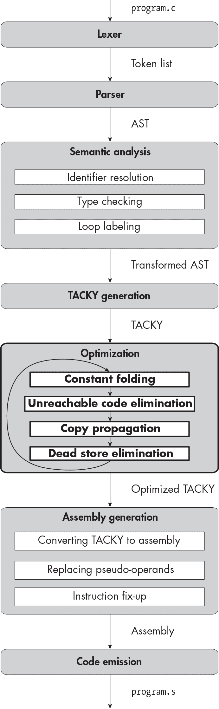

描述


## 19 优化蹩脚的程序


在本书的前两部分，你编写了一个支持大部分 C 语言的编译器。你确保生成的可执行程序是正确的——换句话说，它们的行为符合 C 标准——但你没有考虑它们的性能。你没有尝试让它们运行得更快、占用更少的存储空间或消耗更少的内存。在第三部分，你将专注于*优化*这些程序——也就是说，在不改变它们行为的前提下，让它们更小、更快。

一些编译器优化是*与机器无关*的。这意味着它们不受目标架构细节的影响，比如可用寄存器的数量或对特定汇编指令的限制。编译器通常在将代码转换为汇编之前，首先在像 TACKY 这样的中间表示上执行这些优化。*与机器相关*的优化则需要考虑目标架构，因此这些优化通常在程序被转换为汇编后才执行。本章将介绍四种广泛使用的与机器无关的优化：常量折叠、不可达代码消除、复制传播和死存储消除。你将在本章开始时的图表中新增一个优化阶段，将这四种优化应用于 TACKY 程序。下一章将介绍寄存器分配，一种与机器相关的优化。

在开始第三部分之前，你不需要完成第二部分。对于每个优化，我们会从一个没有考虑到第二部分语言特性的实现开始。然后，如果需要的话，我们会扩展它以支持这些特性；如果你没有做第二部分，则跳过这一步。除了不可达代码消除以外，我们对每个优化都需要这一步，后者不受第二部分特性的影响。

这两章仅包括了在生产级编译器中能找到的一些优化，但我们将要讲解的基本概念同样适用于许多其他优化。在开始之前，让我们考虑一个对所有编译器优化都至关重要的问题：我们如何知道优化后的代码是正确的？

### 安全性和可观察行为

首先，编译器优化必须是*安全的*，意味着它们不能改变程序的语义。（如果程序不按预期运行，无论多快都没有意义！）特别是，优化不能改变程序的*可观察行为*，即执行环境可以看到的行为。返回退出状态、打印消息到 stdout 以及写入文件都是可观察行为的例子。程序采取的大多数动作——比如计算值、更新局部变量、从一个语句转移控制到另一个——对执行环境不可见，因此它们仅间接地影响程序的可观察行为。这为我们提供了很多灵活性，可以重新排序、替换甚至删除代码，只要不改变可观察行为。

让我们看看 GCC 如何优化一个简单的 C 程序。清单 19-1 初始化了三个变量，分别赋值为1、2 和 3，然后将它们相加并返回结果。

```
int main(void) {
    int x = 1;
    int y = 2;
    int z = 3;
    return x + y + z;
}
```

清单 19-1：一个将三个变量相加的 C 程序

该程序每次运行时都会表现出相同的可观察行为：它将以退出状态6终止。你可以运行以下命令来编译没有优化的程序：

```
$ **gcc -S -fno-asynchronous-unwind-tables -fcf-protection=none listing_19_1.c**
```

这将生成清单 19-2 中的汇编代码，或类似的代码。

```
 .text
    .globl main
main:
    pushq   %rbp
    movq    %rsp, %rbp
    movl    $1, -4(%rbp)
    movl    $2, -8(%rbp)
    movl    $3, -12(%rbp)
    movl    -4(%rbp), %edx
    movl    -8(%rbp), %eax
    addl    %eax, %edx
    movl    -12(%rbp), %eax
    addl    %edx, %eax
    popq    %rbp
    ret
```

清单 19-2：未经优化的清单 19-1 汇编代码

这个汇编程序忠实地实现了清单 19-1 的源代码：它在栈上初始化了三个位置，赋值为1、2 和 3；然后将它们相加；最后在 EAX 中返回结果。现在让我们使用-O开关编译相同的源代码，以启用优化：

```
$ **gcc -S -O -fno-asynchronous-unwind-tables -fcf-protection=none listing_19_1.c**
```

这将生成清单 19-3 中的汇编代码。

```
 .text
    .globl main
main:
    movl    $6, %eax
    ret
```

清单 19-3：优化后的清单 19-1 汇编代码

这个汇编程序没有初始化三个变量再相加，而是直接返回常数6。清单 19-2 和 19-3 看起来很不一样，但它们都产生了正确的可观察行为。

### 四个粗劣的优化

本节介绍了我们将在本章中实现的优化：常量折叠、不可达代码删除、拷贝传播和死存储删除。这些优化旨在加速代码并减少其占用的空间。单独来看，它们中的一些在实现这两个目标上有所帮助，而其他的则单独作用不大。真正的收获来自于它们的协同工作，因为运行其中任何一个优化都能创造出应用其他三个优化的机会。我们将依次查看这四种优化，然后讨论每种优化如何使其他优化更加有效。

在我们深入之前，需要注意的是，我在本章的大多数 TACKY 列表中将使用简化的符号。我会将拷贝写成 x = y，而不是像早期章节中那样写成 Copy(Var("x"), Var("y"))，并且对其他指令也会采取类似的简化方式。例如，我会将二元操作写成 x = a + b，而不是写成 Binary(Add, Var("a"), Var("b"), Var("x"))，并且将标签写作 Target:，而不是写成 Label(Target)。这种符号可以让我们集中精力关注 TACKY 程序的高层逻辑，而不是每个 TACKY 指令的细节。

#### 常量折叠

*常量折叠*步骤会在编译时计算常量表达式。例如，常量折叠会将 Binary TACKY 指令替换为

```
a = 6 / 2
```

一条 Copy 指令：

```
a = 3
```

常量折叠还可以将条件跳转转化为无条件跳转，或者完全消除它们。它会将

```
JumpIfZero(0, Target)
```

进入

```
Jump(Target)
```

因为程序总是会执行这个跳转。它也会删除这条指令。

```
JumpIfZero(1, Target)
```

因为程序永远不会执行这个跳转。（删除无用的跳转通常被认为是一种死代码删除，而不是常量折叠，但由于我们在这个步骤中会转换条件跳转，因此我们也可以顺便删除那些无用的跳转。）

常量折叠同时有助于提高速度和减小代码体积。一个单独的算术操作或比较可能需要几条汇编指令。其中一些指令，如 idiv，非常慢。常量折叠最终会将这些汇编代码替换为一条 mov 指令。

#### 不可达代码删除

*不可达代码删除*会移除我们知道永远不会执行的指令。考虑 Listing 19-4 中的 TACKY 片段。

```
x = 5
Jump(Target)
x = my_function()
Target:
Return(x)
```

列表 19-4：包含无法访问指令的 TACKY 片段

由于我们总是跳过对my_function的调用，我们可以将其移除：

```
x = 5
Jump(Target)
Target:
Return(x)
```

现在，Jump 指令变得无用了，因为它跳转到我们接下来无论如何都会执行的指令。我们也会移除这条指令：

```
x = 5
Target:
Return(x)
```

最后，我们还可以移除 Target 标签，前提是没有其他指令跳转到它：

```
x = 5
Return(x)
```

严格来说，我们刚刚移除的Jump和Label指令并不是无法访问的代码；正在运行的程序会到达这两条指令，尽管它们没有任何效果。但移除无法访问的代码通常会让跳转和标签变得无用，因此这是移除它们的一个合乎逻辑的步骤。

消除无法访问的代码显然可以减少代码的大小。同样也很清楚，移除无用的跳转可以节省时间；即便是无用的指令，也需要一些时间来执行。事实证明，移除真正无法访问的指令，如列表 19-4 中的FunCall，也能通过减轻内存压力并释放处理器指令缓存中的空间，提升程序速度。

另一方面，移除未使用的标签不会影响速度或代码大小，因为标签在最终的可执行文件中并不会变成机器指令。我们还是会移除这些标签，因为这样可以让我们的 TACKY 程序更容易阅读和调试，并且几乎不需要额外的工作量。

这个步骤对于清理我们添加到每个 TACKY 函数末尾的额外Return指令尤其有用。回想一下，我们添加这条指令是为了防止源代码中缺少 return 语句的情况。当我们将程序转换为 TACKY 时，我们无法判断这条额外的 Return 是否必要，因此最终我们会把它添加到不需要的函数中。无法访问的代码消除步骤会移除所有我们不必要添加的 Return 指令，同时保留我们实际需要的指令。这是一个更广泛原则的例子：生成低效代码并在之后优化它，通常比一开始就生成高效代码要容易。

#### 复制传播

当程序包含 Copy 指令 dst = src 时，*复制传播* 过程会尝试在后续指令中用 src 替代 dst。考虑以下 TACKY 代码片段：

```
x = 3
Return(x)
```

我们可以将 x 用它当前的值 3 替换，在 Return 指令中：

```
x = 3
Return(3)
```

将变量替换为常量是复制传播的一个特例，称为 *常量传播*。在其他情况下，我们将用另一个变量替换一个变量。例如，我们可以重写

```
x = y
Return(x)
```

例如：

```
x = y
Return(y)
```

有时候，判断是否可以安全地进行复制传播是非常棘手的。考虑以下示例：

```
x = 4
JumpIfZero(flag, Target)
x = 3
Target:
Return(x)
```

根据我们所走的路径，x 的值将在我们到达 Return 指令时是 3 或 4。由于我们不知道会走哪条路径到达该指令，因此无法安全地将 x 替换为任何一个值。为了处理类似的情况，我们需要分析到达我们希望重写的指令的每一条可能路径。我们将使用一种叫做 *数据流分析* 的技术，查看函数中所有的路径，并找到可以安全执行复制传播的位置。数据流分析不仅对复制传播有用，它还被用于许多不同的编译器优化，包括死存储消除，接下来我们将讨论这个话题。

我们分析的某些复制操作将涉及具有静态存储持续时间的变量，这些变量可以被多个函数访问（或者在局部静态变量的情况下，仅为同一函数的多个调用）。我们并不总是能准确知道这些变量何时被更新，因此我们的数据流分析需要将它们与具有自动存储持续时间的变量区分开来。如果你完成了 第二部分，你将需要考虑类似的不确定性，尤其是对于那些使用 & 运算符取地址的变量，因为它们可能通过指针被更新。

复制传播本身并没有多大用处，但它能使其他优化更加有效。当我们传播常量时，就会为常量折叠创造新的机会。我们有时会将每个<sup class="SANS_TheSansMonoCd_W5Regular_11">Copy</sup>指令的目标替换为其源，这样就使得<sup class="SANS_TheSansMonoCd_W5Regular_11">Copy</sup>本身变得无用。我们将在最后的优化过程中移除这些无用的指令：死存储消除。

#### <sup class="SANS_Futura_Std_Bold_Condensed_Oblique_BI_11">死存储消除</sup>

当一条指令更新了变量的值，但我们从未使用该新值时，这条指令就被称为*死存储*。（这里的*store*指的是任何将值存储到变量中的指令，而不是我们在第二部分中介绍的 TACKY<sup class="SANS_TheSansMonoCd_W5Regular_11">Store</sup>指令。）由于死存储不会影响程序的可观察行为，因此可以安全地将其移除。让我们看一个简单的例子：

```
x = 10
Return(y)
```

假设<sup class="SANS_TheSansMonoCd_W5Regular_11">x</sup>具有自动存储持续时间，指令<sup class="SANS_TheSansMonoCd_W5Regular_11">x = 10</sup>就是死存储。在这条指令和函数结束（即<sup class="SANS_TheSansMonoCd_W5Regular_11">x</sup>的生命周期结束）之间，我们没有使用<sup class="SANS_TheSansMonoCd_W5Regular_11">x</sup>。

这是另一种死存储的例子：

```
x = a + b
x = 2
Return(x)
```

在这个例子中，我们永远不会使用<sup class="SANS_TheSansMonoCd_W5Regular_11">a + b</sup>的结果，因为我们会首先覆盖它；这意味着<sup class="SANS_TheSansMonoCd_W5Regular_11">x = a + b</sup>是一个死存储。死存储消除过程会识别这些无用的指令并将其移除。挑战在于证明一条指令确实是死存储；为此，我们需要分析函数的每一条路径，确保它为目标变量赋的值从未被使用。我们将再次使用数据流分析来确保何时可以安全地应用此优化。

与复制传播类似，当你考虑到可以由多个函数或通过指针访问的对象时，死存储消除会变得更加复杂。例如，如果<sup class="SANS_TheSansMonoCd_W5Regular_11">x</sup>是一个全局变量，那么我们第一个例子中的指令<sup class="SANS_TheSansMonoCd_W5Regular_11">x = 10</sup>就*不是*死存储；<sup class="SANS_TheSansMonoCd_W5Regular_11">x</sup>可能会在函数返回后被使用。我们的数据流分析必须考虑到这种可能性。

#### <sup class="SANS_Futura_Std_Bold_Condensed_Oblique_BI_11">当我们的力量结合时……</sup>

现在让我们看看本章中我们将实现的四种优化如何协同工作。我们将以 TACKY 程序为例进行讲解。

```
my_function(flag):
    x = 4
    y = 4 - x
    JumpIfZero(y, Target)
    x = 3
    Target:
    JumpIfNotZero(flag, End)
    z = 10
    End:
    z = x + 5
    Return(z)
```

清单 19-5：一个未优化的 TACKY 程序

使用所有四个优化方法，我们可以将这个函数简化为一条 Return 指令。我将展示每轮优化的结果，并突出显示任何改变的指令。由于每次优化都能为应用其他三种优化创造更多机会，我们需要多次运行大部分优化才能完全优化这个函数。现在，我们将根据每次查看代码来决定运行哪种优化，选择最有用的一种。我们将在实际实现优化管道时，采用更系统化的方法。

让我们从一次复制传播开始，将 4 替换为 x，在 y = 4 - x 中：

```
my_function(flag):
    x = 4
 **y = 4 - 4**
    JumpIfZero(y, Target)
    x = 3
    Target:
    JumpIfNotZero(flag, End)
    z = 10
    End:
    z = x + 5
    Return(z)
```

我们不能替换 x 的第二次使用，出现在 z = x + 5 中，因为此时 x 可能有多个值：它可能是 3 或 4，具体取决于是否进行条件跳转。接下来，我们将应用常量折叠来计算 y = 4 - 4：

```
my_function(flag):
    x = 4
 **y = 0**
    JumpIfZero(y, Target)
    x = 3
 Target:
    JumpIfNotZero(flag, End)
    z = 10
    End:
    z = x + 5
    Return(z)
```

通过用 Copy 指令替换二元操作，我们为复制传播创造了另一个机会。我们可以在 JumpIfZero 指令中用 0 替换 y 的值：

```
my_function(flag):
    x = 4
    y = 0
 **JumpIfZero(0, Target)**
    x = 3
    Target:
    JumpIfNotZero(flag, End)
    z = 10
    End:
    z = x + 5
    Return(z)
```

现在，JumpIfZero 依赖于常量条件，我们可以再次运行常量折叠，将其转化为无条件的 Jump：

```
my_function(flag):
    x = 4
    y = 0
 **Jump(Target)**
    x = 3
    Target:
    JumpIfNotZero(flag, End)
    z = 10
    End:
    z = x + 5
    Return(z)
```

这个变化使得 x = 3 无法到达，因此我们将运行无法到达代码消除来删除它。这个阶段还将删除 Jump 指令和 Target 标签，因为一旦我们删除了 x = 3，它们就不再有效：

```
my_function(flag):
    x = 4
    y = 0
    JumpIfNotZero(flag, End)
    z = 10
    End:
    z = x + 5
    Return(z)
```

我们之前不能重写 z = x + 5，因为 x 在不同路径上有两个不同的值。我们通过消除 x = 3 的路径解决了这个问题。现在我们可以再次运行复制传播：

```
my_function(flag):
    x = 4
    y = 0
    JumpIfNotZero(flag, End)
    z = 10
    End:
 **z = 4 + 5**
    Return(z)
```

然后我们将再运行一轮常量折叠：

```
my_function(flag):
    x = 4
    y = 0
    JumpIfNotZero(flag, End)
    z = 10
    End:
 **z = 9**
    Return(z)
```

我们将最后一次运行复制传播：

```
my_function(flag):
    x = 4
    y = 0
    JumpIfNotZero(flag, End)
    z = 10
    End:
    z = 9
 **Return(9)**
```

我们已经成功地在编译时计算了这个函数的返回值，消除了整个过程中对x、y和z的使用。现在我们将运行死代码消除，清理赋值给这三个变量的指令：

```
my_function(flag):
    JumpIfNotZero(flag, End)
    End:
    Return(9)
```

最后，我们将运行不可达代码消除，移除JumpIfNot Zero指令和End标签。这两者都是冗余的，因为我们刚刚移除了JumpIfNotZero跳过的那条指令。这轮优化将使我们的函数简化为单一指令：

```
my_function(flag):
    Return(9)
```

这个例子突出了我们的优化方法如何协同工作。复制传播可能会将变量替换为常量，从而为常量折叠创造新的机会；常量折叠将算术运算重写为Copy指令，创造了新的复制传播机会。常量折叠还可以将条件跳转替换为无条件跳转，从而使一些指令变得不可达；消除不可达代码简化了程序的控制流，这有助于复制传播。复制传播可能使Copy指令冗余，从而使我们能够在死代码消除过程中将其移除。死代码消除可能会移除跳转与其目标标签之间的每一条指令，这使得跳转和可能的标签成为不可达代码消除的候选项。

现在我们知道了每个优化的作用以及它们如何协同工作。接下来，我们将添加一些新的命令行选项，允许我们进行测试。

### 测试优化过程

本章的测试与早期章节的测试有所不同。我们需要验证我们的优化是否没有改变程序的可观察行为，但可以简化常量表达式并移除无用代码。我们当前的策略——编译 C 程序，运行它们，并确保它们行为正确——满足了第一个要求，但没有满足第二个要求。仅仅运行程序并不能告诉你优化阶段是否*做了*任何事情。为了处理第二个问题，测试脚本将检查每个测试程序的编译器汇编输出。为了处理第一个问题，它还将运行每个测试程序并验证其行为，就像在早期章节中一样。

为了支持本章的测试，你需要为编译器添加一些命令行选项：

-S 指示编译器生成汇编文件，但不进行汇编或链接。运行 ./YOUR_COMPILER -S /path/to/program.c 应该会将汇编文件写入 */path/to/program.s*。（我建议在第一章中添加此选项，以帮助调试；如果你还没有添加，现在需要加上它。）

--fold-constants 启用常量折叠。

--propagate-copies 启用复制传播。

--eliminate-unreachable-code 启用不可达代码消除。

--eliminate-dead-stores 启用死存储消除。

--optimize 启用所有四项优化。

启用优化的选项应传递给优化阶段，我们将在接下来实现它。应该能够启用多个单独的优化；例如，./YOUR_COMPILER --fold-constants --propagate-copies 应同时启用常量折叠和复制传播，但不启用其他两个优化。

如果你的编译器生成的汇编与我在本书中所描述的完全不同，测试脚本仍然应该能够验证你在本章测试中的汇编输出，但有几个注意事项需要记住。首先，测试脚本只理解 AT&T 汇编语法，这也是我们在本书中使用的语法。其次，脚本并不识别每一条汇编指令；它只知道我们在本书中使用的指令以及一些在现实汇编代码中特别常见的其他指令。如果你发出的指令是测试脚本无法识别的，某些测试可能会失败。

接下来，我们将接入新的优化阶段，控制何时调用每个单独的优化。

### 优化阶段的接线

优化阶段将在我们将程序转换为 TACKY 后立即运行。此阶段将独立地优化每个 TACKY 函数，而不考虑程序中定义的其他函数。例如，它不会在常量折叠阶段尝试评估函数调用，也不会在死存储消除阶段删除它们。（我们不能在死存储消除阶段删除函数调用，因为我们不知道它们是否有副作用。*但是*我们可以在不可达代码消除阶段删除它们——如果一个函数调用永远不会执行，那么它的副作用就无关紧要。）像这些一次只转换一个函数的优化被称为*过程内优化*。大多数生产级编译器还会执行*过程间优化*，即转换整个翻译单元，而不是单个函数。

每个单独的优化将以 TACKY 函数的函数体作为输入，返回一个语义等效的函数体作为输出。在常量折叠阶段，我们将像往常一样将函数体表示为一系列 TACKY 指令。但在其他三个优化阶段，我们将每个函数表示为*控制流图*。这是一个中间表示，显式地建模了代码段中不同的执行路径。我们将在本章后面详细讨论如何构建控制流图以及它们为什么有用。

优化阶段将通过反复运行所有启用的优化来处理每个函数。它将在达到*固定点*时停止，此时再次运行优化将不会进一步改变函数。列表 19-6 展示了这个优化管道。

```
optimize(function_body, enabled_optimizations):
    if function_body is empty:
        return function_body

    while True:
        if enabled_optimizations contains "CONSTANT_FOLDING":
          ❶ post_constant_folding = constant_folding(function_body)
        else:
            post_constant_folding = function_body

      ❷ cfg = make_control_flow_graph(post_constant_folding)

        if enabled_optimizations contains "UNREACHABLE_CODE_ELIM":
            cfg = unreachable_code_elimination(cfg)

        if enabled_optimizations contains "COPY_PROP":
            cfg = copy_propagation(cfg)

        if enabled_optimizations contains "DEAD_STORE_ELIM":
            cfg = dead_store_elimination(cfg)

      ❸ optimized_function_body = cfg_to_instructions(cfg)

      ❹ if (optimized_function_body == function_body
            or optimized_function_body is empty):
            return optimized_function_body

        function_body = optimized_function_body
```

列表 19-6：TACKY 优化管道

在这个列表中，function_body是 TACKY 函数体中指令的列表，enabled_optimizations是表示命令行中启用的优化的字符串列表。（在实际程序中，这将是存储命令行选项的一种相当笨重的方式；可以在你自己的代码中采用不同的方式表示这些选项。）如果function_body为空，我们将直接返回它，因为没有内容可以优化。否则，如果启用了常量折叠，我们将执行常量折叠❶。

接下来，我们将把函数体从指令列表转换为控制流图❷。我们将对该表示应用所有启用的优化。然后，我们将优化后的控制流图转换回指令列表❸，并与原始列表❹进行比较。如果它不同，并且我们没有优化掉整个函数，我们将重新进行循环，以利用任何新的优化机会。如果它相同，我们就不能再进一步优化了，优化过程结束。

使用清单 19-6 中的优化管道，我们就不会错过任何优化机会。每当一个优化改变了程序时，我们会重新运行其他三个优化，以利用这些变化。这是可行的，因为我们只实现了四个优化，而且我们所有的测试程序都足够小，能够快速优化。生产编译器实现了几十种优化，并编译了更大的程序，因此不会采用这种方法；如果采用，编译时间会非常长。相反，它们只会应用一次固定顺序的优化，按照可能产生最大影响的顺序运行每个优化。因此，它们可能会错过优化机会。（为任何给定的程序找到最佳优化执行顺序是一个开放的研究问题，称为*阶段排序问题*。）

继续将优化管道添加到你的编译器中。现在，先将每个优化定义为一个存根，它接受一个指令列表并返回不变的指令。你也可以以相同的方式为控制流图的转换添加存根。现在编写这些支撑代码，以便在实现各个优化时能够测试它们。

一旦所有内容都设置好，你就可以开始进行第一个优化：常量折叠！

### 常量折叠

常量折叠是本章中最简单的优化。此优化遍历 TACKY 函数中的所有指令，并评估任何具有常量源操作数的指令。首先，我们将简要讨论如何将常量折叠添加到你在第一部分中实现的编译器版本。然后，我们将讨论如何处理你在第二部分中添加的类型和 TACKY 指令。如果你还没有完成第二部分，可以跳过后面的讨论。

#### 第一部分 TACKY 程序的常量折叠

常量折叠过程应评估来自 第一部分 的四条 TACKY 指令：Unary、Binary、JumpIfZero 和 JumpIfNotZero。当你发现一个源操作数为常量的 Unary 指令，或者一个源操作数为常量的 Binary 指令时，将其替换为 Copy。例如，你应该替换

```
Binary(binary_operator=Add, src1=Constant(1), src2=Constant(2), dst=Var("b"))
```

使用：

```
Copy(src=Constant(3), dst=Var("b"))
```

你的常量折叠（constant folding）过程可能会遇到两种无效的表达式：除以零和导致整数溢出的操作。这些都是未定义的行为，因此无论你如何评估它们，结果都一样。然而，你的编译器不能在遇到这些无效表达式时直接失败，因为只有在程序运行时实际到达这些无效表达式时，程序的行为才是未定义的。例如，如果程序在一个从未被执行的分支中包含除以零的操作，你仍然应该能够编译它。

你还应该评估常量条件下的 JumpIfZero 和 JumpIfNotZero 指令。如果条件满足，将指令替换为无条件的 Jump。如果条件不满足，则从程序中移除该指令。就这么简单！如果你只完成了 第一部分，在实现了这四条指令的常量折叠后，你可以跳过测试套件。如果你完成了 第二部分，还有一些其他指令需要处理。

#### 支持第二部分 TACKY 程序

当我们在 第二部分 中添加了新的算术类型时，我们也添加了类型转换指令：Truncate、SignExtend、ZeroExtend、DoubleToInt、DoubleToUInt、IntToDouble 和 UIntToDouble。常量折叠过程应在源操作数为常量时评估所有这些指令。

`Copy`指令也可以执行类型转换；我们使用它在相同大小的有符号和无符号整数之间进行转换。当一个Copy指令将无符号常量复制到有符号变量，或反之时，这一过程应将常量转换为正确的类型。例如，如果a是一个signed char，你应该替换

```
Copy(src=Constant(ConstUChar(255)), dst=Var("a"))
```

with:

```
Copy(src=Constant(ConstChar(-1)), dst=Var("a"))
```

小心进行每一个类型转换，确保与程序运行时使用的语义完全一致。例如，当你将double转换为整数类型时，应将其值截断为零；当你将整数转换为double时，应舍入到最近的可表示值。好消息是，你已经知道如何在编译时执行所有这些类型转换，因为在第二部分中，你必须将静态初始化值转换为正确的类型。理想情况下，你应该能够重用你已经编写的代码来执行这些类型转换。

你还需要遵循 C 语言语义来评估无符号算术运算。特别是，你应该确保无符号算术运算能正确地回绕，就像运行时一样。如何实现这一点完全取决于你用来编写编译器的语言。例如，Rust 提供了像wrapping_add和wrapping_sub的方法，它们提供与 C 语言中的无符号算术相同的语义。在其他语言中，你可能需要使用第三方库来实现无符号算术。例如，Python 不提供无符号整数类型，但 NumPy 库提供了。如果你不想使用外部库，或者找不到合适的库，其实自己实现回绕无符号算术也并不困难。

最后，在评估浮点操作时，您需要使用四舍五入到最接近的值、偶数舍入规则，并正确处理负零和无穷大。如果您在第十三章为 NaN 添加了额外的支持，您还需要正确评估 NaN 上的操作。这应该不需要您做任何特别的工作——绝大多数编程语言都使用 IEEE 754 语义——但有小概率您的实现语言在处理负零、NaN 或无穷大时与 C 语言不同。从一个简单的常量折叠实现开始，不需要尝试解决这些边缘情况；您可以依赖测试套件来捕获任何问题。如果您遇到您的实现语言无法正确评估的情况，您有两个选择：要么找到一个第三方库来处理它们，要么将它们作为特殊情况自己处理。

### 控制流图

在本章的其余部分，我们将使用控制流图表示 TACKY 函数。图形表示非常适合我们剩下的优化，它们必须考虑我们在函数中可能经过的不同路径。控制流图中的节点表示称为*基本块*的直线代码序列，除了两个特殊节点，分别表示函数的入口和出口。每个节点都有指向可以立即执行的下一个节点的边。

例如，我们来看一下清单 19-7 的控制流图。

```
processing_loop():
    LoopStart:
    input = get_input()
    JumpIfNotZero(input, ProcessIt)
    Return(-1)
    ProcessIt:
    done = process_input(input)
    JumpIfNotZero(done, LoopStart)
    Return(0)
```

清单 19-7：具有多个执行路径的 TACKY 函数

该函数执行一个循环，通过调用get_input反复获取一个值，然后通过调用process_input处理该值。如果get_input返回0，该函数立即返回-1。如果process_input返回0，该函数立即返回0。图 19-1 展示了对应的控制流图。

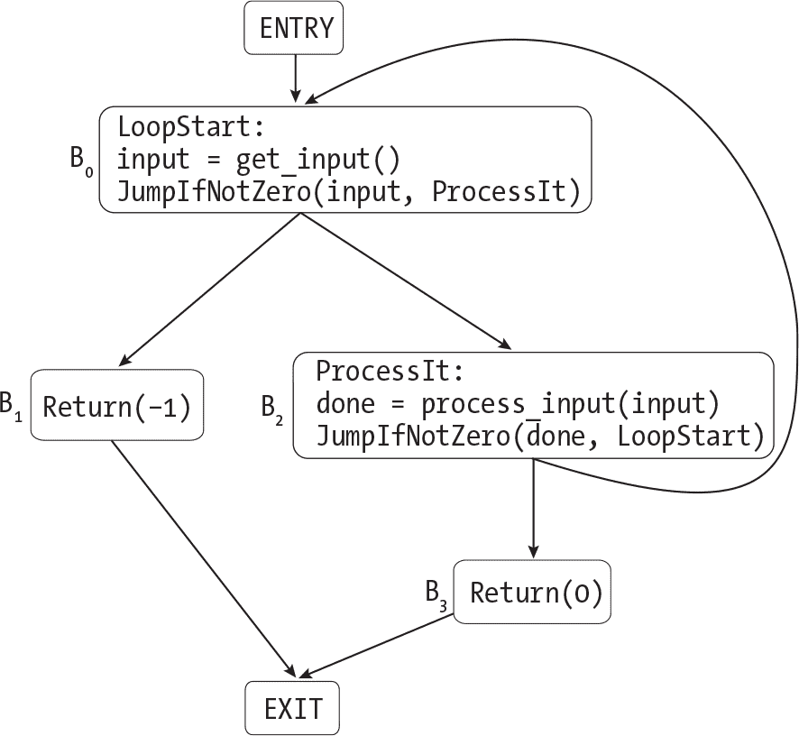

图 19-1：清单 19-7 的控制流图 描述

从特殊的 ENTRY 节点到块 B0 有一条单一的出边，因为我们总是在函数开始时执行 B0。（ENTRY 在每个控制流图中都会有一条出边，因为 C 函数只有一个入口点。）在执行完 B0 后，有两种可能性：我们可以执行程序中的下一个块 B1，或者我们可以跳转到块 B2。因此，B0 有指向这两个块的出边。按照同样的逻辑，B2 有指向 B0 和 B3 的出边。一个 Return 指令退出函数，因此 B1 和 B3 各自有一条出边指向 EXIT。

#### 定义控制流图

现在你已经知道控制流图是什么样子了，我们来看看如何构建一个。首先，我们将定义图的结构。清单 19-8 概述了其中一种可能的表示方法。

```
node_id = ENTRY | EXIT | BlockId(int num)
node = BasicBlock(node_id id, instruction* instructions,
                  node_id* predecessors, node_id* successors)
     | EntryNode(node_id* successors)
     | ExitNode(node_id* predecessors)
graph = Graph(node* nodes)
```

清单 19-8：表示控制流图的一种方式

图中的每个节点都有一个唯一的 node_id，用于标识该节点是 ENTRY、EXIT，还是一个编号的基本块。我们将根据它们在原始 TACKY 函数中的顺序为基本块分配数字 ID。每个基本块包含一个 TACKY 指令列表，一个 *后继* 列表（表示可以在其之后执行的块），以及另一个 *前驱* 列表（表示可以在其之前执行的块）。入口节点和出口节点不包含任何指令。ENTRY 作为函数的第一个节点，拥有后继但没有前驱。EXIT 则相反，拥有前驱但没有后继。

你需要一种方法将基本块和单独的指令与额外信息关联，以便在拷贝传播和死存储消除的过程中跟踪数据流分析的结果。清单 19-8 中的定义并没有提供跟踪这些信息的方法。你可以将它直接附加到图中，或者存储在一个单独的数据结构中。本章中的伪代码将使用 annotate _instruction 和 get_instruction_annotation 来保存和查找有关单个指令的信息。它将使用 annotate_block 和 get_block _annotation 来保存和查找通过块 ID 获取的基本块信息。

> 注意

*你的图数据结构可能与 清单 19-8 中的结构非常不同。例如，你可能希望将图表示为从 node_id 到节点的映射，而不是节点的列表，或者将入口和出口节点与表示基本块的节点分开跟踪。你可以按照适合你实现语言的方式定义控制流图，只要它包含你所需的所有信息。*

#### 创建基本块

接下来，让我们看看如何将 TACKY 函数的主体划分为基本块。基本块的中间不能有跳转进出。执行基本块的唯一方法是从其第一条指令开始，一直到结束。这意味着Label只能作为块中的第一条指令出现，而Return或跳转指令只能作为最后一条指令出现。清单 19-9 演示了如何在这些边界上将指令列表拆分为基本块。

```
partition_into_basic_blocks(instructions):
    finished_blocks = []
    current_block = []
    for instruction in instructions:
      ❶ if instruction is Label:
            if current_block is not empty:
                finished_blocks.append(current_block)
            current_block = [instruction]

      ❷ else if instruction is Jump, JumpIfZero, JumpIfNotZero, or Return:
            current_block.append(instruction)
            finished_blocks.append(current_block)
            current_block = []

        else:
          ❸ current_block.append(instruction)

    if current_block is not empty:
        finished_blocks.append(current_block)

    return finished_blocks
```

清单 19-9：将指令列表划分为基本块

当我们遇到一个Label指令时，我们会从该Label ❶开始一个新的基本块。当我们遇到一个Return指令或条件跳转或无条件跳转时，我们将其添加到当前块，然后开始一个新的空块 ❷。当我们遇到任何其他指令时，我们将其添加到当前块中，而不开始一个新的块 ❸。

清单 19-9 只是将函数体划分为指令的列表。接下来的步骤（我不会提供伪代码）是将这些指令列表转换为具有递增块 ID 的BasicBlock节点。然后我们将这些节点添加到图中，并添加入口节点和出口节点。

#### 向控制流图添加边

在将每个节点添加到图中之后，我们将从每个节点添加到其后继节点的边，如清单 19-10 所示。

```
add_all_edges( ❶ graph):

  ❷ add_edge(ENTRY, BlockId(0))

    for node in graph.nodes:
        if node is EntryNode or ExitNode:
            continue

        if node.id == max_block_id(graph.nodes):
            next_id = EXIT
        else:
          ❸ next_id = BlockId(node.id.num + 1)

        instr = get_last(node.instructions)
        match instr with
        | Return(maybe_val) -> add_edge(node.id, EXIT)
        | Jump(target) ->
            target_id = get_block_by_label(target)
            add_edge(node.id, target_id)
        | JumpIfZero(condition, target) ->
            target_id = get_block_by_label(target)
          ❹ add_edge(node.id, target_id)
          ❺ add_edge(node.id, next_id)
        | JumpIfNotZero(condition, target) ->
            // same as JumpIfZero
 `--snip--`
        | _ -> add_edge(node.id, next_id)
```

清单 19-10：向控制流图添加边

`graph` 参数传递给 `add_all_edges` ❶ 是我们未完成的控制流图，它有节点但没有边。我们将首先添加一条从 `ENTRY` 到第一个基本块 ❷ 的边。（我们可以假设该函数至少包含一个基本块，因为我们不会优化空函数。）在整个示例中，我们将使用 `add_edge` 函数，它接受两个节点 ID，用来向图中添加边。请记住，每次我们从 `node1` 添加一条边到 `node2` 时，我们必须更新 `node1` 的所有后继节点以及 `node2` 的所有前驱节点。我已省略了 `add_edge` 的伪代码，因为它将取决于你如何定义控制流图。

接下来，我们将为与基本块对应的节点添加外向边。为了处理其中一个节点，我们首先要确定如果在块的末尾不进行跳转或返回，默认情况下将跟随它的下一个节点。如果我们处理的是最后一个块，下一节点将是 `EXIT`。否则，下一节点将是原始 TACKY 函数中紧接着的基本块 ❸。

我们将通过检查当前基本块中的最后一条指令来确定需要添加哪些边。如果它是 `Return` 指令，我们将添加一条指向 `EXIT` 的外向边。如果它是无条件的 `Jump` 指令，我们将添加一条指向以对应 `Label` 开头的块的边。我们使用 `get_block_by_label` 辅助函数（我不会展示其伪代码），通过标签查找以特定标签开头的块。我建议提前构建一个从标签到块 ID 的映射，以便这个函数可以直接执行映射查找。

如果一个块以条件跳转结束，我们将添加两条外向边。第一条边，表示进行跳转，将指向以对应 `Label` ❹ 开头的块。另一条边，表示不进行跳转 ❺，将指向默认的下一个节点，由 `next_id` 标识。如果一个块以其他指令结束，我们将添加一条指向默认下一个节点的外向边。

#### 将控制流图转换为指令列表

此时，你应该已经有了能够将 TACKY 函数转换为控制流图的工作代码。你还需要一段代码来进行反向操作，将控制流图转换回指令列表。这一操作要简单得多：只需要按 ID 排序所有基本块，然后将它们的指令连接起来。

#### 使你的控制流图代码可重用

在下一章，我们将构建汇编程序的控制流图。我们将使用相同的算法来构建这些图，但我们会寻找不同的单独控制流指令。例如，jmp、ret，以及像 jne 和 je 这样的条件跳转指令，都会标志着汇编中基本块的结束。

一旦你有了构建控制流图的工作代码，你可能想重构它，以便也能用于汇编程序。这是完全可选的，但它会在下一章节省你一些精力。

首先，你需要将 graph 数据类型进行泛化，以便一个块可以包含 TACKY 或汇编指令。接着，你需要泛化逻辑来分析 清单 19-9 和 19-10 中的具体指令。例如，你可以定义一个一次性的数据类型，来表示汇编和 TACKY 指令，这样就能捕获构建控制流图所需的信息：

```
generic_instruction = Return
                    | Jump
                    | ConditionalJump(identifier label)
                    | Label(identifier)
                    | Other
```

不需要检查单独的 TACKY 指令来确定基本块的结束位置或它的后继，你可以将每个指令转换为一个 generic_instruction 并检查它。然后，当你需要为汇编程序构建控制流图时，你将使用不同的辅助函数将汇编指令转换为 generic_instruction，但其他部分保持不变。

这就结束了我们对控制流图的讨论。现在我们准备继续进行第二个优化步骤：不可达代码消除。

### 不可达代码消除

我们将把这个步骤分为三步，首先移除永远不会执行的基本块，然后是无用的跳转，最后是无用的标签。最后两个步骤可能会留下不包含任何指令的空块。可选地，我们可以通过从控制流图中移除这些空块来清理优化后的结果。

#### 消除不可达块

为了找到每一个可能执行的块，我们将从ENTRY开始遍历控制流图。我们将访问ENTRY的后继节点，然后访问该节点的所有后继节点，依此类推，直到没有更多的节点可以探索。如果这个遍历永远没有到达某个基本块，那么我们就知道该块可以安全地移除。我们来试试这种方法，基于清单 19-4 中的示例，正如我们第一次介绍无法到达的代码消除时所看的那样：

```
x = 5
Jump(Target)
x = my_function()
Target:
Return(x)
```

我们之前确定了x = my_function()是无法到达的。假设这个清单是一个 TACKY 函数的完整函数体，它将具有图 19-2 所示的控制流图。

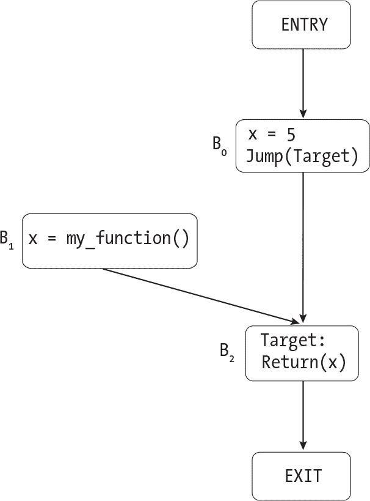

图 19-2：控制流图，清单 19-4 描述

注意，从ENTRY到B1之间没有路径。如果我们从ENTRY开始遍历这个图，我们将访问B0、B2和EXIT。在此过程中，我们将跟踪已经访问的节点。一旦完成，我们会发现我们从未访问过B1，因此我们将其移除。我不会提供用于遍历图的伪代码，因为这只是普通的广度优先或深度优先图遍历。

当你从图中移除一个节点时，记得也要移除它的输出边。例如，当我们在图 19-2 中移除B1时，我们还应该将其从B2的前驱列表中移除。

#### 移除无用的跳转

接下来，我们将移除所有无用的跳转指令。请记住，默认情况下，如果一个块没有以跳转或Return指令结尾，控制流将按照原始程序顺序流向下一个块。如果跳转指令指向这个默认的下一个块，我们可以删除它。

我们将查看每个以条件或无条件跳转结尾的基本块，并弄清楚如果没有执行跳转，默认情况下会跟随哪个块。如果这个默认的下一个块是它唯一的后继块，那么跳转指令就是冗余的。Listing 19-11 演示了这种方法。

```
remove_redundant_jumps(graph):
  ❶ sorted_blocks = sort_basic_blocks(graph)
    i = 0
  ❷ while i < length(sorted_blocks) - 1:
        block = sorted_blocks[i]
        if block.instructions ends with Jump, JumpIfZero, or JumpIfNotZero:
            keep_jump = False
            default_succ = sorted_blocks[i + 1]
 for succ_id in block.successors:
                if succ_id != default_succ.id:
                    keep_jump = True
                    break
            if not keep_jump:
              ❸ remove_last(block.instructions)
        i += 1
```

Listing 19-11: 删除冗余跳转

首先，我们将按原始 TACKY 函数中的位置对基本块进行排序❶；这也是我们在构建图时为基本块编号的原因之一。接下来，我们将遍历这个排序后的基本块列表（最后一个除外，因为函数结尾的跳转永远不会是冗余的）❷。如果某个块以跳转结尾，我们将寻找一个除了列表中下一个块之外的后继块。如果找到了，我们就保留跳转指令；否则，我们就删除它❸。

请注意，列表中的下一个块不一定会有下一个连续的数字 ID，因为我们可能已经删除了前面的块。例如，块 2 可能会被块 4 跟随。这就是为什么我们不能仅通过递增块的 ID 来找到它的默认后继块。

#### 删除无用标签

删除无用标签类似于删除无用跳转。在按数字 ID 对基本块进行排序后，如果某个基本块仅通过从前一个块的顺序流进入，而不是显式跳转到它，我们可以删除该块开头的 Label 指令。更具体地说，如果 sorted_blocks[i] 只有一个前驱块 sorted_blocks[i - 1]，我们就可以删除其开头的 Label。如果 sorted_blocks[0] 的唯一前驱是 ENTRY，我们也可以删除它开头的 Label。这个转换是安全的，因为我们只是删除了冗余的跳转指令；我们知道 sorted_blocks[i - 1] 不会以显式跳转到 sorted_blocks[i] 结尾。我不会为此步骤提供伪代码，因为它基本上与 Listing 19-11 中的内容相同。

#### 删除空块

消除不可达的跳转和标签可能会导致某些代码块没有指令。如果你愿意，可以删除它们；这将缩小图形并可能稍微加速后续的优化过程。当你删除一个块时，确保相应地更新控制流图中的边。例如，如果图中有从B0到B1的边，以及从B1到B2的边，而你删除了B1，你将需要添加一条从B0到B2的边。

### 关于数据流分析的一些基本介绍

本节将简要概述数据流分析，我们将在接下来的两个优化过程中依赖它。你将了解它是什么，何时有用，以及所有数据流分析共有的特征。这不是数据流分析的完整解释；我的目标只是介绍几个关键概念，并描述它们是如何结合在一起的，以便使后续部分中的具体分析更容易理解。

数据流分析回答有关值在整个函数中如何定义和使用的问题。不同的数据流分析回答不同的问题。例如，在复制传播阶段，我们将实现*到达复制分析*。它回答的问题是：在一个 TACKY 函数中，给定某个指令*i*，以及在该函数中出现的两个操作数u和v，我们能否保证在*i*执行之前，u和v是相等的？

我们可以将所有数据流分析分为两大类：正向分析和反向分析。在*正向分析*中，信息在控制流图中向前传播。达成副本分析是一种正向分析。当我们看到一条 `Copy` 指令 `x = y` 时，这意味着 `x` 和 `y` 可能在同一基本块中或该块的后继块中具有相同的值。在*反向分析*中，情况则相反。在死存储消除过程中，我们将实现一种反向分析，称为 *活跃度分析*。这种分析告诉我们一个变量的当前值是否会被使用。如果我们看到一条使用 `x` 的指令，这意味着 `x` 可能在同一基本块中或该块的前驱块中较早时刻活跃。

每个数据流分析都有其独特的传输函数和合并操作符。*传输函数* 计算单个基本块内的分析结果。此函数分析各个指令如何影响结果，但不需要处理多条执行路径。*合并操作符* 将多条路径的信息合并，以计算每个基本块如何受到其邻居的影响。我们将使用*迭代算法*来驱动整个分析。该算法会在每个基本块上调用传输函数和合并操作符，并跟踪哪些块仍然需要分析。它是迭代的，因为我们可能需要多次访问某些块，以便沿不同的执行路径传播信息。该算法将遍历控制流图，分析它访问的每个基本块，直到达到固定点，即分析结果不再变化。到那时，我们就知道所有可能的执行路径都已被考虑。迭代算法并不是解决数据流分析问题的唯一方法，但它是本书中唯一讨论的方法。

尽管不同的分析使用不同的传输函数和合并操作符，它们本质上都使用相同的迭代算法。正向分析和反向分析使用该算法的不同版本，因为它们在相反的方向上传递数据。我们将在接下来的两节中实现这两种版本。

### 副本传播

如果在一个函数中出现指令x = y，有时我们可以在函数的后续部分将x替换为y。我们称希望执行此替换的指令为*i*。当满足两个条件时，替换是安全的。首先，指令x = y必须出现在从程序入口点到*i*的每条路径上。考虑图 19-3 中的控制流图，它不满足这个条件。

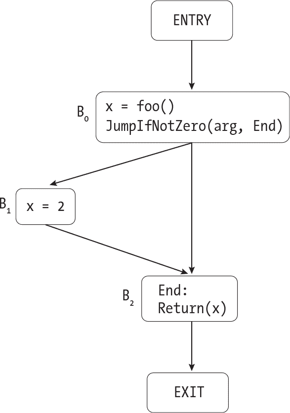

图 19-3：一个不能执行复制传播的函数控制流图 描述

在这个控制流图中，从函数的起始点到Return(x)有两条路径。因为只有其中一条路径经过x = 2，所以在这个Return指令中将x替换为2是不安全的。另一方面，在图 19-4 中，每条通向Return(x)的路径都会经过x = 2。

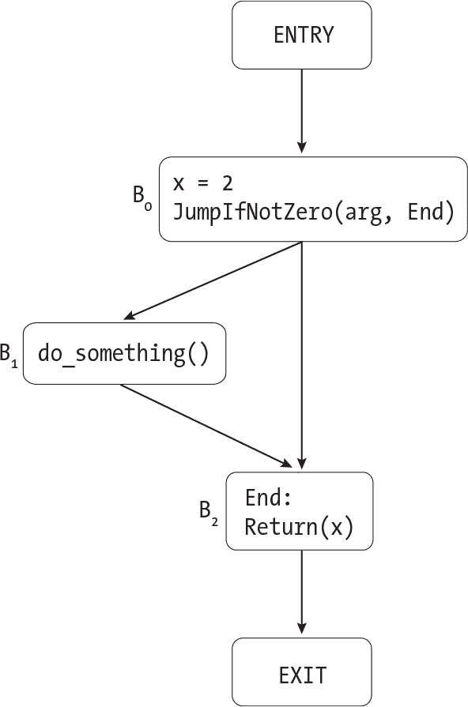

图 19-4：一个可以执行复制传播的函数控制流图 描述

无论我们通过图 19-4 选择哪条路径，我们都会在到达Return指令之前执行x = 2，因此我们可以安全地将该指令重写为Return(2)。

图 19-5 展示了另一个稍微复杂一点的例子。

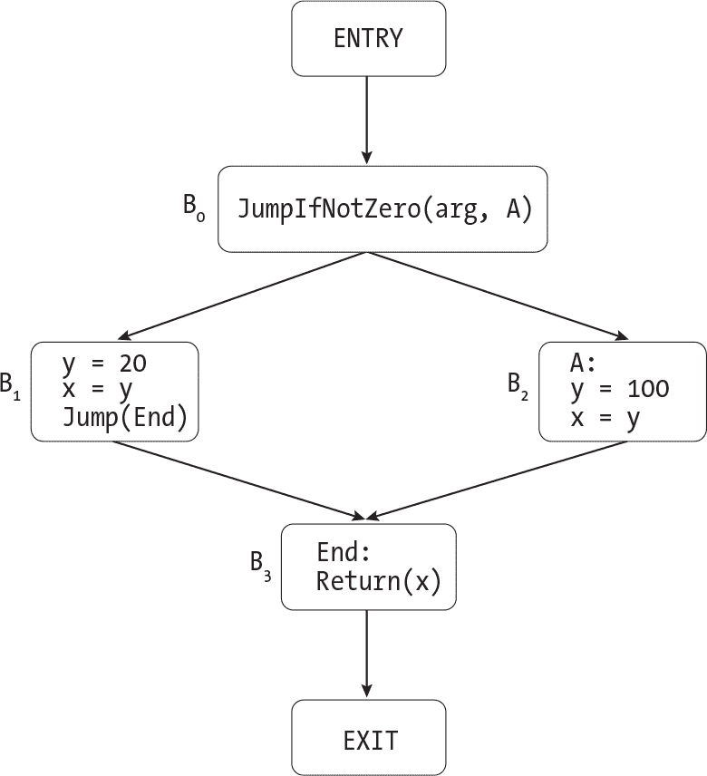

图 19-5：另一个可以安全执行复制传播的控制流图 描述

再次强调，通往Return(x)的路径有两条。两条路径都经过x = y，但它们通过不同的指令实例，这些实例出现在不同的块中。在B1中，y的值为20；在B2中，其值为100。但无论是哪种情况，当我们到达Return指令时，x和y的值是相同的。这意味着仍然可以将Return(x)重写为Return(y)。

在重写指令*i*之前，还有第二个条件需要满足：每条通往*i*的路径必须满足：在指令x = y和*i*之间，x和y不能再次被更新。请考虑以下 TACKY 片段：

```
x = 10
x = foo()
Return(x)
```

我们不能在Return(x)中将x替换为10，因为此时x的值不再是10。更新在Copy指令右侧出现的变量也会导致同样的问题：

```
x = y
y = 0
Return(x)
```

在y = 0之前，我们知道x和y的值是相同的。但在那条指令之后，它们的值将不同，因此我们不能重写Return(x)。当Copy指令的源或目标被更新时，我们称该复制被*杀死*。一旦复制被杀死，我们就不能将其传播到程序的后续位置。

x = y可能在通往*i*的某些路径中多次出现。只有当它在最后一次出现后被杀死时，传播它才是不安全的。在下面的示例中，将Return(x)重写为Return(2)是安全的：

```
x = 2
x = foo()
x = 2
Return(x)
```

如果有多个路径通向*i*，我们关注的<code>Copy</code>指令不能在任何路径上被杀死。看看图 19-6，其中<code>x = y</code>在一条路径上被杀死，但在另一条路径上没有。

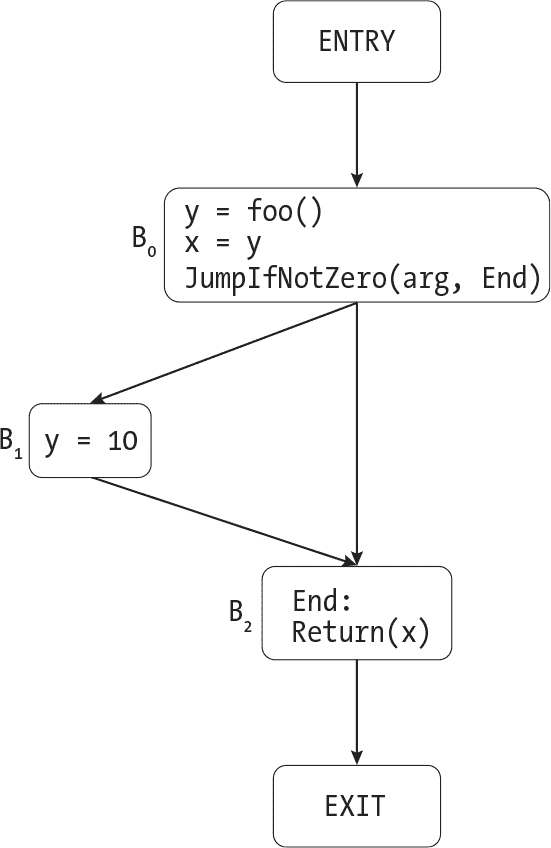

图 19-6：一个控制流图，其中一个到达的复制在一条路径上被杀死 描述

如果我们跳过<code>B</code>1，当我们到达<code>B</code>2中的<code>Return</code>指令时，<code>x</code>和<code>y</code>将具有相同的值。但如果我们走过<code>B</code>1路径，它们的值将会不同。因为我们无法预先知道程序会走哪条路径，所以我们不能重写<code>Return(x)</code>。

让我们考虑一个最终的边缘案例。假设<code>x = y</code>后面跟着<code>y = x</code>，且中间没有其他被杀死的指令：

```
x = y
`--snip--`
y = x
z = x + y
```

通常，更新y会导致之前的Copy指令失效。但是在y = x之后，x和y仍然拥有相同的值。处理这种情况有多种正确的方法。一个选项是说y = x会使x = y失效，因此只有y = x会影响z = x + y。在这种情况下，我们会将最后一条指令重写为z = x + x。这可能会让我们在后续的死存储消除过程中删除y = x，具体取决于y在其他地方的使用情况。另一个选项是简单地忽略我们的分析中的y = x，理由是它没有任何效果；它只是将y赋值为它已经拥有的相同的值。然后，当我们重写指令时，可以直接删除y = x并将最后的指令重写为z = y + y。第三个选项是将*两个*副本传播到最后一条指令中，分别将x替换为y，并将y替换为x。这种替换是安全的，但并不是特别有帮助，因为它不会帮助我们去掉任何一个Copy指令。我们将选择第二个选项，去除冗余的Copy。

如果一个Copy指令出现在到达指令*i*的每一条路径上，并且在这些路径上都没有被消除，我们就说它*到达*指令*i*。在副本传播过程的开始，我们将执行到达副本分析，以确定哪些副本到达 TACKY 函数中的每一条指令。然后，我们将利用这个分析结果来识别可以安全重写的指令。

我们将在第一部分中定义的 TACKY 子集上实现这个优化，然后扩展它以处理第二部分中的新语言特性。

#### 到达副本分析

为了实现到达复制分析，我们将定义之前讨论过的每一个数据流分析元素：转移函数、交汇操作符和迭代算法。我们将在本节中讨论的转移函数和交汇操作符是特定于到达复制分析的，而迭代算法适用于所有的前向数据流分析。

##### 转移函数

转移函数会接收所有到达基本块起始位置的 Copy 指令，并计算哪些复制指令会到达块内的每个单独指令。它还会计算哪些复制指令到达块的末尾，即最后一条指令之后。这里的规则相当简单。首先，如果 *i* 是一条 Copy 指令，它会到达紧跟其后的指令。其次，如果某条 Copy 指令到达 *i*，它也会到达 *i* 后面的指令，除非 *i* 会终结它。让我们通过一个例子来理解。假设一个基本块包含了 Listing 19-12 中的指令。

```
x = a
y = 10
x = y * 3
Return(x)
```

Listing 19-12: 一个基本块

假设有一条 Copy 指令，a = y，到达这个基本块的起始位置。这条 Copy 指令将会到达第一条指令，x = a。一旦我们遇到 x = a，我们将它添加到当前的到达复制集，因此 a = y 和 x = a 都会到达下一条指令 y = 10。由于这条指令更新了 y，它终结了 a = y。因此，我们将 a = y 从到达复制集移除，但添加 y = 10。最后，x = y * 3 终结了 x = a。我们不会将 x = y * 3 添加为到达复制，因为它不是一条 Copy 指令。最终的 Return 指令不会添加或移除任何到达复制。Table 19-1 列出了每条指令在这个基本块中到达的复制指令。

表 19-1： 示例 19-12 中每条指令达到的副本

| 指令 | 达到的副本 |
| --- | --- |
| x = a | {a = y} |
| y = 10 | {a = y, x = a} |
| x = y * 3 | {x = a, y = 10} |
| Return(x) | {y = 10} |
| 块结束 | {y = 10} |

当我们考虑具有静态存储持续时间的变量时，事情变得有些复杂。如示例 19-13 所示，这些变量可以在其他函数中被更新。

```
int static_var = 0;

int update_var(void) {
    static_var = 4;
    return 0;
}

int main(void) {
    static_var = 5;
  ❶ update_var();
    return static_var;
}
```

示例 19-13：一个 C 程序，其中多个函数访问同一个具有静态存储持续时间的变量

我们的达到副本分析应当识别出在 main 中调用 update _var 会导致 static_var = 5 ❶ 被修改。否则，它会错误地重写 main 使其返回常量 5。乍一看，这个问题似乎只适用于文件作用域的变量，但正如示例 19-14 所示，它同样影响静态局部变量。

```
int indirect_update(void);

int f(int new_total) {
    static int total = 0;
    total = new_total;
    if (total > 100)
        return 0;
    total = 10;
  ❶ indirect_update();
    return total;
}

int indirect_update(void) {
    f(101);
    return 0;
}
```

示例 19-14：一个 C 程序，其中函数调用间接更新静态局部变量

当我们分析 f 时，我们需要知道在 ❶ 处对 indirect_update 的调用可以更新 total。否则，我们会错误地将 f 重写为返回 10。

有几种方法可以解决这个问题。一种选择是找出哪些函数调用会更新哪些静态变量。这将使得到达副本分析成为一个跨过程分析，收集多个函数的信息。这种方法很快会变得复杂。我们的另一个选择是假设每个函数调用都会更新每个静态变量。我们将选择这个方法，因为它更简单。每当我们遇到一个函数调用时，我们将杀死任何指向或来自静态变量的副本。这个方法是*保守的*；它保证我们永远不会执行不安全的优化，但可能会导致我们不必要地杀死一些到达副本，并错过一些安全的优化。相比之下，使用跨过程分析将是一种更*激进的*方法，因为它会错过更少的优化。更激进的优化技术并不总是更好；它们通常会增加复杂性和更长的编译时间。

列表 19-15 给出了传递函数的伪代码。

```
transfer(block, initial_reaching_copies):
    current_reaching_copies = initial_reaching_copies

    for instruction in block.instructions:
      ❶ annotate_instruction(instruction, current_reaching_copies)
        match instruction with
        | Copy(src, dst) ->
          ❷ if Copy(dst, src) is in current_reaching_copies:
                continue

          ❸ for copy in current_reaching_copies:
                if copy.src == dst or copy.dst == dst:
                    current_reaching_copies.remove(copy)

          ❹ current_reaching_copies.add(instruction)
        | FunCall(fun_name, args, dst) ->
            for copy in current_reaching_copies:
              ❺ if (copy.src is static
                    or copy.dst is static
                    or copy.src == dst
                    or copy.dst == dst):
                    current_reaching_copies.remove(copy)
        | Unary(operator, src, dst) ->
          ❻ for copy in current_reaching_copies:
                if copy.src == dst or copy.dst == dst:
                    current_reaching_copies.remove(copy)
        | Binary(operator, src1, src2, dst) ->
            // same as Unary
 `--snip--`
        | _ -> continue

  ❼ annotate_block(block.id, current_reaching_copies)
```

列表 19-15：用于到达副本分析的传递函数

为了处理一条指令，我们首先会记录在该指令执行之前到达该点的副本集合❶。（当我们实际重写该指令时，将会用到这些信息。）然后，我们将检查该指令本身，以计算哪些副本到达指令执行后的点。在特殊情况下，当 x = y 到达 y = x 时，我们不会添加或移除任何到达副本❷。正如我们之前所看到的，y = x 不会产生任何效果，因为 x 和 y 已经具有相同的值。否则，我们将通过杀死所有指向或来自 x 的副本❸ 来处理 Copy 指令 x = y，然后将 x = y 添加到到达副本集合中❹。

当我们遇到<FunCall>指令时，我们将消除与静态存储期变量有关的任何拷贝以及与 dst 相关的任何拷贝，后者将保存函数调用结果❺。来自第 I 部分的另外两条更新变量的指令是<Unary>和<Binary>。为了处理其中任何一个，我们将消除与其目标❻有关的任何拷贝。来自第 I 部分的其余 TACKY 指令，如<Jump>，<Return>和<Label>，不会增加或杀死任何到达拷贝。在处理每个指令后，我们将记录哪些拷贝到达块的末尾 ❼。

##### meet 运算符

接下来，我们将实现 meet 运算符，它将传播关于从一个块到另一个块的到达拷贝的信息。该运算符计算了我们将传递给传输函数的初始到达拷贝集合。请记住，只有当拷贝在程序中的每条路径上都出现且没有被杀死时，拷贝才能到达某一点。因此，拷贝只有在到达所有该块前驱的末尾时，才能到达该块的开头。换句话说，我们将仅仅取每个前驱的结果的集合交集。清单 19-16 给出了 meet 运算符的伪代码。

```
meet(block, all_copies):

  ❶ incoming_copies = all_copies
    for pred_id in block.predecessors:
        match pred_id with
      ❷ | ENTRY -> return {}
        | BlockId(id) ->
          ❸ pred_out_copies = get_block_annotation(pred_id)
            incoming_copies = intersection(incoming_copies, pred_out_copies)
        | EXIT -> fail("Malformed control-flow graph")

    return incoming_copies
```

清单 19-16：用于到达拷贝分析的 meet 运算符

meet 运算符接受两个参数。第一个是我们想要计算传入拷贝的块。第二个参数 all_copies 是函数中出现的所有 Copy 指令的集合。我们将传入拷贝的集合初始化为这个值 ❶，因为它是集合交集的*恒等元素*。也就是说，对于任何到达拷贝的集合*S*，与 all_copies 的交集就是*S*。

接下来，我们遍历块的前驱，这些前驱可能包括其他基本块、ENTRY 节点，或者两者。如果我们在前驱列表中找到了 ENTRY，我们就返回空集 ❷。（空集与任何其他集合的交集仍然是空集，所以无需再查看该块的其他前驱。）否则，我们查找到达每个前驱末端的副本集 ❸，这些副本集我们在 Listing 19-15 末尾记录过，然后将 incoming_copies 与每个副本集进行交集。

我们有一个极端情况需要考虑。如果禁用了不可达代码消除，我们正在分析的块可能没有任何前驱。对没有前驱的块调用 meet 将返回 all_copies，因此我们假设每个可能的 Copy 指令都会到达该块的起始位置。我们并不关心这最终如何影响该块本身，因为它反正不会执行。我们*确实*关心的是它如何影响该块的后继块，后继块可能是可达的。例如，如果一个可达块 A 和一个不可达块 B 都跳转到块 C，那么块 C 就是可达的。

幸运的是，我们的分析依然是安全的。来自 A 的真实结果和来自 B 的垃圾结果的交集将始终是实际上从 A 到 C 的副本的子集；这是一个保守的近似结果，假设我们启用了不可达代码消除并完全删除了 B。

##### 迭代算法

一旦我们知道前面块的结果，就可以使用交集运算符和传输函数分析基本块。现在我们将把所有内容结合起来，分析整个函数。但有一个问题：控制流图可能有循环！我们无法分析一个块，直到我们分析完它的所有前驱，这要求我们分析它们的所有前驱，依此类推。一旦遇到循环，我们似乎就陷入困境了；我们无法分析循环中的任何一个块，因为每个块直接或间接地先于自己。

为了摆脱困境，我们需要某种方法来分析一个块，即使我们没有来自其所有前驱块的完整结果。解决方案是为每个块保持一个临时结果；如果我们需要在某些前驱块的结果之前分析一个块，我们可以使用那些前驱块的临时结果。最初，在我们还没有探索到某个块的任何路径之前，它的临时结果包含函数中的每一个 Copy 指令。然后，在我们探索到该块的每一条新路径时（更确切地说，是探索到该块的末端），我们会去除任何没有出现或在该路径上被“杀死”的副本。这意味着，一个块的临时结果始终告诉我们在我们目前为止探索的到达该块末端的*每一条*路径上，哪些到达副本出现（并且没有被杀死）。一旦我们探索了所有可能的路径，就会得到该块的最终结果。

这就是基本的思路；现在让我们付诸实践。首先，我们会用函数中所有的 Copy 指令集合对每个基本块进行注解。正如我们之前学到的，这个集合是我们 meet 操作符的单位元素。用单位元素初始化每个块可以确保我们还没有分析过的块不会改变 meet 操作符的结果。让我们在 图 19-7 中的控制流图上尝试这个方法。

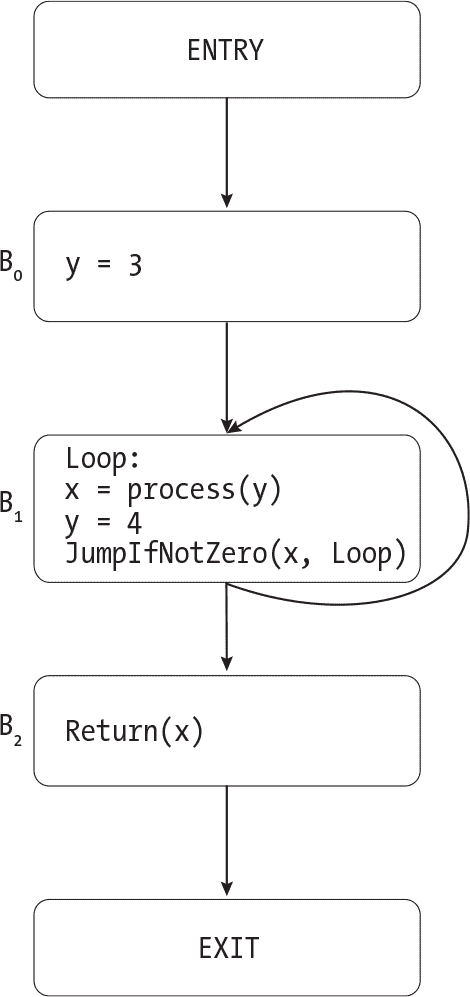

图 19-7：带有循环的控制流图 描述

这个控制流图包含两个 Copy 指令：y = 3 和 y = 4。我们最初会用包含这两个副本的集合对每个块进行注解。然后，我们按顺序分析这些块。我们只需一遍就能计算出 B0 的最终结果，因为它的唯一前驱是 ENTRY。 图 19-8 展示了我们处理完 B0 后在每个块上的注解。

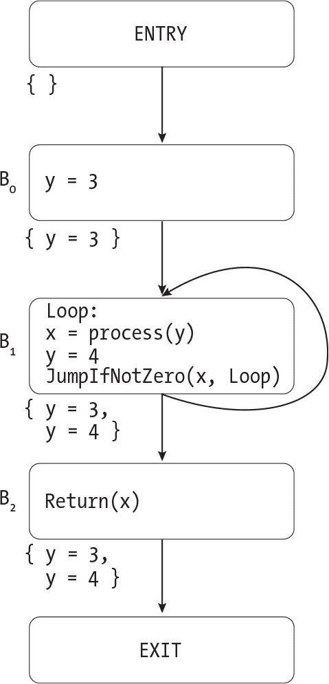

图 19-8：在处理 B 后，对 图 19-7 的到达副本分析的临时结果0 描述

此时，B0上的标注是正确的：只有 y = 3 到达了该块的末尾。其他两个块仍然标注着每个副本。接下来，我们将应用 meet 操作符，看看哪些副本能到达 B1 的起始位置。该块有两个前驱：B0 和它本身。因此，我们将取 {y = 3} 和 {y = 3, y = 4} 的交集，即 {y = 3}。这与如果 B0 是 B1 唯一前驱时的结果相同。这正是我们想要的行为：因为我们还没有分析 B1，它不应该对 meet 操作符的结果产生影响。一旦我们将传输函数应用于 B1，我们会发现只有 y = 4 到达了该块的末尾。然后，我们就能拥有处理 B2 所需的所有信息。图 19-9 展示了我们分析了 B1 和 B2 后每个块的标注情况。


图 19-9：分析每个基本块一次后的副本到达分析的临时结果 描述

每个块现在都有了正确的到达副本集合。但我们还没有得到 B1 中每个单独指令的正确答案。(图 19-8 和 19-9 没有显示个别指令的注释。) 当我们最后分析 B1 时，我们假设 y = 3 到达块的开始，这意味着它也到达了 x = process(y)。现在我们有了更准确的信息，我们需要重新分析 B1。这次，合并运算符将取 {y = 3} 和 {y = 4} 的交集，即空集合。我们将把这个结果传递给传递函数，以重新计算 B1 中个别指令的结果。这一次，我们将正确得出结论：没有任何 Copy 指令到达 x = process(y)（或者在 y = 4 之前块中的任何位置）。

现在我们已经看到了迭代算法的实际操作，让我们来实现它。列表 19-17 给出了该算法的伪代码。

```
find_reaching_copies(graph):

    all_copies = find_all_copy_instructions(graph)
    worklist = []

    for node in graph.nodes:
        if node is EntryNode or ExitNode:
            continue
      ❶ worklist.append(node)
        annotate_block(node.id, all_copies)

 while worklist is not empty:
      ❷ block = take_first(worklist)
        old_annotation = get_block_annotation(block.id)
        incoming_copies = meet(block, all_copies)
        transfer(block, incoming_copies)
      ❸ if old_annotation != get_block_annotation(block.id):
            for successor_id in block.successors:
                match successor_id with
                | EXIT -> continue
                | ENTRY -> fail("Malformed control-flow graph")
                | BlockId(id) ->
                    successor = get_block_by_id(successor_id)
                    if successor is not in worklist:
                        worklist.append(successor)
```

列表 19-17：用于到达副本分析的迭代算法

我们将维护一个工作列表，包含需要处理的基本块，包括在更新其前驱之一后需要重新访问的块。在该算法的初始设置中，我们将把每个基本块添加到工作列表中 ❶，因为我们需要至少分析一次每个块。我们还将用函数中所有出现的 Copy 指令初始化每个块。

接下来，我们进入主要的处理循环，在其中我们将从工作列表的前端移除一个块 ❷，然后使用合并运算符和传递函数分析它。如果此分析更改了块的传出到达副本，我们将把所有继承者添加到工作列表中，以便使用这些新的结果重新分析它们 ❸。如果某个继承者已经在工作列表中，我们就不需要再次添加它。我们将重复此过程，直到工作列表为空。

列表 19-17 适用于任何前向数据流分析。只有传递函数、合并运算符和初始化每个基本块所使用的单位元素会有所不同。

#### 重写 TACKY 指令

在执行到达副本分析后，我们将寻找机会重写或甚至删除 TACKY 函数中的每一条指令。为了重写一条指令，我们将检查到达它的副本是否定义了它的任何操作数。如果定义了，我们将用它们的值替换这些操作数。如果我们遇到形式为 x = y 的 Copy 指令，并且它的到达副本中包含 x = y 或 y = x，我们将删除它，而不是尝试重写它；因为如果 x 和 y 已经具有相同的值，那么该指令没有任何效果。Listing 19-18 演示了如何处理每一条指令。

```
replace_operand(op, reaching_copies):
    if op is a constant:
        return op

    for copy in reaching_copies:
        if copy.dst == op:
            return copy.src
    return op

rewrite_instruction(instr):
  ❶ reaching_copies = get_instruction_annotation(instr)
    match instr with
    | Copy(src, dst) ->
        for copy in reaching_copies:
          ❷ if (copy == instr) or (copy.src == dst and copy.dst == src):
                return null
      ❸ new_src = replace_operand(src, reaching_copies)
        return Copy(new_src, dst)
    | Unary(operator, src, dst) ->
        new_src = replace_operand(src, reaching_copies)
        return Unary(operator, new_src, dst)
    | Binary(operator, src1, src2, dst) ->
        new_src1 = replace_operand(src1, reaching_copies)
        new_src2 = replace_operand(src2, reaching_copies)
        return Binary(operator, new_src1, new_src2, dst)
    | `--snip--`
```

Listing 19-18: 基于到达副本分析结果重写指令

给定到达当前指令的副本集合，replace_operand 用其值替换单个 TACKY 操作数。如果操作数是常量，或者我们无法找到分配给它的到达副本，我们将直接返回原始值。

在 rewrite_instruction 中，我们首先查找到达当前指令的副本集合 instr ❶。如果 instr 是一条 Copy 指令，我们将搜索这个集合（我们称之为 reaching_copies），寻找一个从源到目的地或反向的副本 ❷。如果找到了，instr 的操作数已经具有相同的值，因此我们可以删除它。（Listing 19-18 返回 null 来表示我们应该删除该指令；您的代码可能会以不同的方式表示这一点。）否则，我们尝试使用 replace _operand ❸ 来替换该指令的源操作数。我们将以相同的方式尝试替换其他 TACKY 指令的源操作数。Listing 19-18 演示了如何在 Unary 和 Binary 中重写源操作数；我已经省略了 Part I 中其余的 TACKY 指令，因为它们的逻辑是相同的。

到目前为止，你已经完成了一个完整的复制传播过程，该过程执行了到达复制分析，并使用结果优化了一个 TACKY 函数。如果你跳过了第二部分，可以直接进入本节的测试套件。但如果你完成了第二部分，你还有一些工作要做。

#### 支持第二部分 TACKY 程序

为了使复制传播与我们在第二部分中生成的 TACKY 代码一起工作，我们需要解决几个问题。第一个问题是我们有时使用Copy指令进行类型转换。我们不希望在有符号和无符号类型之间传播复制，因为我们有时会为有符号和无符号值的操作生成不同的汇编代码。例如，如果我们在比较中将一个有符号值替换为无符号值，最终生成的条件码会是错误的。我们的到达复制分析会将任何有符号和无符号操作数之间的Copy视为类型转换指令，而不是普通的复制操作。我们不会将其作为到达复制添加到传递函数中，也不会在迭代算法开始时将其包含在初始到达复制集合中。

> 注意

*另一种解决方案是为比较、余数操作和除法引入单独的有符号和无符号 TACKY 运算符，这样我们就不需要在代码生成过程中检查操作数的类型来区分这些情况。LLVM IR 采用了这种方法。*

第二个问题是变量可以通过指针进行更新。这些更新很难分析。如果我们看到指令Store(v, ptr)，我们不知道ptr指向哪个对象，因此也无法知道该删除哪些复制。这与我们遇到的静态变量问题类似，静态变量可能在其他函数中更新。为了解决这个问题，我们将找到所有可能通过指针访问的变量（这些变量称为*别名变量*）。我们将假设每个Store指令都会更新这些变量。我们还假设函数调用也会更新这些变量，因为我们可以在一个函数中声明一个变量，然后在另一个函数中通过指针更新它。让我们用这种方法来分析示例 19-19。

```
function_with_pointers():
    x = 1
    y = 2
    z = 3
    ptr1 = GetAddress(x)
 Store(10, ptr1)
    ptr2 = GetAddress(y)
    z = x + y
    Return(z)
```

示例 19-19：通过指针更新变量的 TACKY 函数

首先，我们将识别 function_with_pointers 中的别名变量。由于 x 和 y 都在 GetAddress 指令中使用，它们是别名。 （假设此列表中的变量都不是静态的，因此我们无需担心其他函数是否取用它们的地址。）接下来，我们将进行到达副本分析。由于整个函数体是一个基本块，我们可以将传递函数应用于整个函数。像往常一样，我们将 x = 1、y = 2 和 z = 3 添加到到达副本集合中。然后，当我们到达 Store 指令时，我们将删除对两个别名变量 x 和 y 的副本。表 19-2 描述了每条指令将到达哪些副本。

表 19-2： 每条指令的到达副本 Listing 19-19

| 指令 | 到达副本 |
| --- | --- |
| x = 1 | {} |
| y = 2 | {x = 1} |
| z = 3 | {x = 1, y = 2} |
| ptr1 = GetAddress(x) | {x = 1, y = 2, z = 3} |
| Store(10, ptr1) | {x = 1, y = 2, z = 3} |
| ptr2 = GetAddress(y) | {z = 3} |
| z = x + y | {z = 3} |
| Return(z) | {} |
| 块的结尾 | {} |

我们正确地识别到 `Store` 指令可能会覆盖 `x`，这意味着我们不能在 `z = x + y` 中将 `x` 替换为 `1`。我们还假设 `Store` 指令可能会覆盖 `y`，因为我们的分析没有足够智能地意识到 `ptr1` 不可能指向 `y`。因此，即使将 `y` 替换为 `2` 在 `z = x + y` 中是安全的，我们也不会这么做。再一次，我们做出了保守的假设；我们可能会错过一些安全的优化，但绝不会应用任何不安全的优化。

##### 实现地址获取分析

我们刚刚使用的识别别名变量的方法叫做 *地址获取分析*。为了执行这个分析，我们将检查 TACKY 函数中的每一条指令，并识别出每个变量，它们要么具有静态存储持续时间，要么其地址被 `GetAddress` 指令获取。（我们假设所有静态变量都是别名，因为它们的地址可能在其他函数中被获取。）我们将在优化管道的每次迭代中重新执行此分析，因为如果我们优化掉任何 `GetAddress` 指令，结果可能会发生变化。示例 19-20 展示了它如何适应我们在 示例 19-6 中定义的整体优化管道。

```
optimize(function_body, enabled_optimizations):
 `--snip--`
    while True:
 **aliased_vars = address_taken_analysis(function_body)**
 `--snip--`
        if enabled_optimizations contains "COPY_PROP":
            cfg = copy_propagation(cfg, **aliased_vars**)
        if enabled_optimizations contains "DEAD_STORE_ELIM":
            cfg = dead_store_elimination(cfg, **aliased_vars**)
 `--snip--`
```

示例 19-20：将地址获取分析添加到 TACKY 优化管道中

地址获取分析只是 *别名分析* 的一种，也叫 *指针分析*，它尝试确定两个指针或变量是否可以引用同一个对象。大多数指针分析算法比地址获取分析更强大。例如，它们可以推断出在 示例 19-19 中 `ptr1` 永远不会指向 `y`。

##### 更新传递函数

接下来，我们将扩展传递函数，以支持我们在 第二部分 中添加的新类型和指令。

列表 19-21 展示了我们新改进的传输函数。它重新生成了列表 19-15，并将支持额外类型的更改部分加粗。

```
transfer(block, initial_reaching_copies, **aliased_vars**):
    current_reaching_copies = initial_reaching_copies

    for instruction in block.instructions:
        annotate_instruction(instruction, current_reaching_copies)
        match instruction with
        | Copy(src, dst) ->
            `--snip--`
            **if (get_type(src) == get_type(dst)) or (signedness(src) == signedness(dst)):**
                current_reaching_copies.add(instruction)
        | FunCall(fun_name, args, dst) ->
            for copy in current_reaching_copies:
                if (copy.src is **in aliased_vars**
                    or copy.dst is **in aliased_vars**
                    or (**dst is not null and** (copy.src == dst or copy.dst == dst))):
                    current_reaching_copies.remove(copy)
        **| Store(src, dst_ptr) ->**
            **for copy in current_reaching_copies:**
                **if (copy.src is in aliased_vars) or (copy.dst is in aliased_vars):**
                    **current_reaching_copies.remove(copy)**
        | Unary(operator, src, dst) **or any other instruction with dst field** ->
            `--snip--`
 | _ -> continue

    annotate_block(block.id, current_reaching_copies)
```

列表 19-21：用于到达拷贝分析的传输函数，支持第二部分中的特性

我们已经讨论了此列表中的大多数更改。在将Copy指令添加到current_reaching_copies之前，我们将确保其源和目标具有相同类型，或者至少是具有相同符号性的类型。signedness辅助函数应将char视为有符号类型，将所有指针类型视为无符号类型，因此我们可以在char和signed char、不同指针类型之间以及指针和unsigned long之间传播拷贝。（符号性概念不适用于double或非标量类型。没关系，因为我们不会使用Copy指令来转换这些类型。如果Copy使用double或非标量操作数，则两个操作数将具有相同类型，因此我们不需要检查它们的符号性。)

当我们遇到函数调用或Store指令时，我们将删除与别名变量相关的任何拷贝操作。我们还需要考虑到函数调用可能没有目标操作数的情况。请注意，我们不会删除Store指令的dst_ptr操作数。Store不会改变目标指针本身的值，只会改变它所指向对象的值。最后，当我们遇到我们在第二部分中添加的其他指令时——包括类型转换、CopyToOffset和CopyFromOffset——我们将删除与其目标相关的任何拷贝操作。我们不会跟踪结构或数组内部单独子对象的拷贝操作，因此CopyToOffset和CopyFromOffset将删除到达拷贝，而不会生成任何新的拷贝。

##### 更新 rewrite_instruction

我们将以与第一部分中的指令相同的方式重写第二部分中的大多数新 TACKY 指令，替换任何由传递复制定义的源操作数。唯一的例外是 GetAddress，我们永远不会重写它。对 GetAddress 应用复制传播没有意义，因为它使用的是源操作数的地址，而不是它的值。### 死存储消除

我们的最后一个优化是死存储消除。我们将使用活跃性分析，一种向后的数据流分析，来计算在我们优化的函数中的每个点哪些变量是活跃的。然后，我们将使用分析结果来识别并消除死存储。

如果一个变量在某个特定点的值可能在程序的后续部分被读取，那么它在该点是*活跃的*。否则，它是*死的*。更精确地说，当满足两个条件时，变量 x 在某个给定点 *p* 是活跃的。首先，必须存在至少一条从 *p* 到某个后续指令的路径，该路径使用了 x。我们说 x 是由任何使用它的指令*生成*的。其次，x 在从 *p* 到该后续指令的路径上不能被更新。我们说 x 是由任何更新它的指令*消除*的，就像当其操作数被更新时，一个传递复制会被消除一样。（在大多数数据流分析中，你会看到*生成*和*消除*这两个术语，而不仅仅是本章中提到的两个。）请参考图 19-10 中的控制流图。

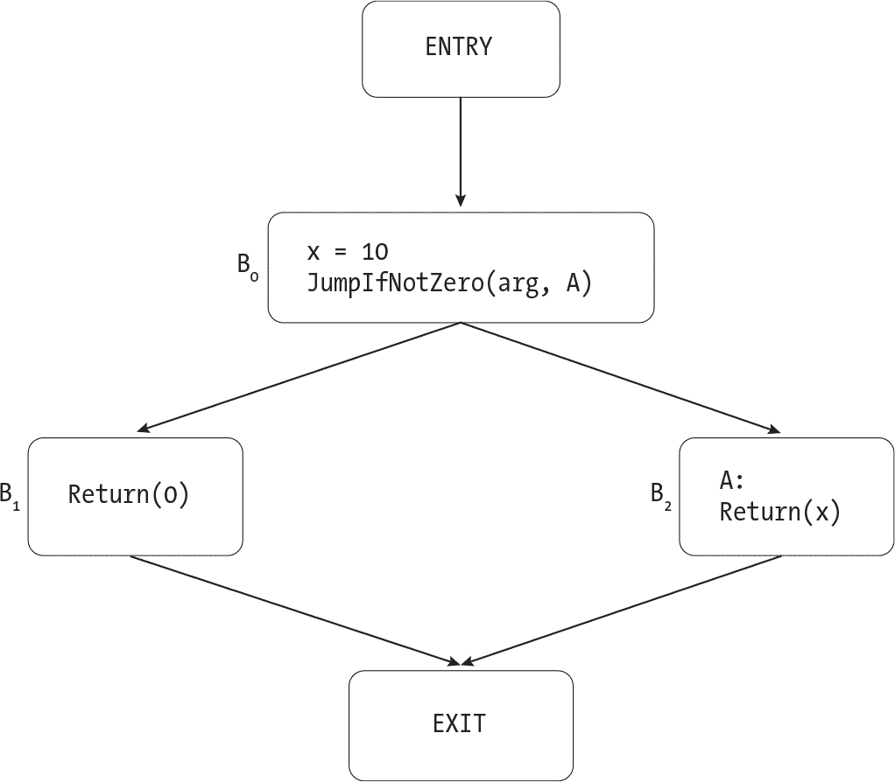

图 19-10：一个控制流图，其中 x 在定义后立即变为活跃 描述

从 x = 10 到 EXIT 有两条路径。在通过 B1 的路径上，x 从未被使用。在通过 B2 的路径上，x 被用于 Return 指令。我们知道，x 在 x = 10 后是活跃的，因为它在这些路径中的一条上被生成。按照相同的逻辑，x 在 B0 的末尾、在 B2 的开头以及在 B2 中的 Return 指令前也是活跃的。另一方面，x 在 B2 的末尾以及在 B1 中的每个点都是死的，因为从这些点到任何使用 x 的指令没有路径。注意，x 在 B0 的最开始也是死的，因为在我们为其赋新值之前，我们并没有使用它（未初始化的）值。

现在让我们看一下图 19-11 中的控制流图。

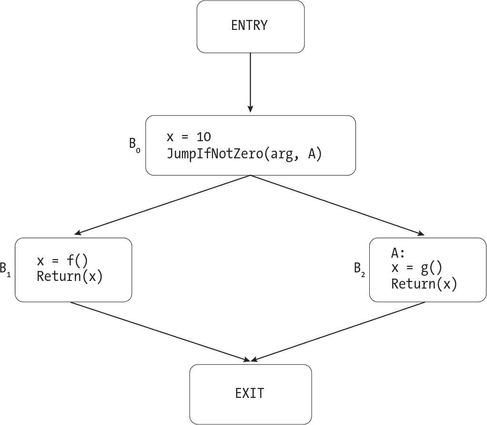

图 19-11：一个具有对 x 的死存储的控制流图 描述

再次，我们有两条路径从 x = 10 到 EXIT。这两条路径都经过使用 x 的 Return 指令，但在这两条路径上，x 在 x = 10 和生成它的 Return 指令之间被杀死。这意味着 x 在 x = 10 后立即死亡。在这个控制流图中，x 仅在两个点是活跃的：在 x = f() 之后（在 B1 中），以及在 x = g() 之后（在 B2 中）。

如果一条指令赋值给一个死变量且没有其他副作用，那么它就是一条死存储。因此，x = 10 在图 19-11 中是死存储，但在图 19-10 中不是。请注意，我们关心的是变量在指令执行*之后*是否为死变量，而不是在执行之前。代码片段中

```
x = x + 1
Return(0)
```

x 在 x = x + 1 之前是活跃的，但之后就死亡了。由于 x 在更新后立刻死亡，这意味着这条指令是一个死存储，因此我们可以将其消除。

#### 活跃性分析

与每个数据流分析一样，活跃性分析需要一个转移函数、一个合并运算符和一个迭代算法。由于这是一个反向流问题，转移函数将从基本块的末尾开始，逐步向前推进，而不是像我们在到达拷贝分析中那样从开始到结束。同样，合并运算符将从一个块的后继中收集信息，而不是从前驱中收集。我们还将使用一个稍微不同的迭代算法，通过控制流图将数据反向传递。让我们仔细看看这些部分。

##### 转移函数

转移函数获取基本块结束时的活跃变量集合，并计算出每条指令之前哪些变量是活跃的。正如我们在图 19-10 和图 19-11 中看到的，一条指令会生成它读取的任何变量，并杀死它更新的任何变量。例如，要计算指令x = y * z之前的活跃变量，我们需要先获取指令执行后活跃的变量集合，再加上y和z，并移除x。如果一条指令同时读取和写入同一个变量，它会生成该变量而不是杀死它。例如，指令x = x + 1会生成x。

让我们将转移函数应用于清单 19-22 中的基本块。

```
x = 4
x = x + 1
y = 3 * x
Return(y)
```

清单 19-22：一个基本块

转移函数将从基本块的底部开始，向上处理。假设在块的末尾，即在Return指令之后，没有活跃变量。（如果函数处理静态变量，这个假设可能不成立，但我们稍后再讨论这个问题。）当我们处理Return指令时，我们会将y添加到活跃变量集合中。然后，指令y = 3 * x会杀死y并生成x。接下来的指令x = x + 1会生成x，但没有实际效果，因为x已经是活跃的。最后，指令x = 4会杀死x，使得在基本块开始时没有任何活跃变量。表 19-3 总结了清单 19-22 中每条指令之后哪些变量是活跃的。

表 19-3： 清单 19-22 中每条指令后的活跃变量

| 指令 | 活跃变量 |
| --- | --- |
| 块的开始 | {} |
| x = 4 | {x} |
| x = x + 1 | {x} |
| y = 3 * x | {y} |
| Return(y) | {} |

静态变量使事情变得复杂，正如在到达拷贝分析时那样。我们不知道其他函数将如何与遇到的静态变量交互；它们可能会读取、更新，或者同时执行这两者。我们假设每个函数都会读取每个静态变量。这个假设是保守的，因为它防止我们忽略之前对这些变量的写操作。列表 19-23 给出了传递函数的伪代码。

```
transfer(block, end_live_variables, all_static_variables):
  ❶ current_live_variables = end_live_variables

 ❷ for instruction in reverse(block.instructions):
      ❸ annotate_instruction(instruction, current_live_variables)

        match instruction with
        | Binary(operator, src1, src2, dst) ->
            current_live_variables.remove(dst)
            if src1 is a variable:
                current_live_variables.add(src1)
            if src2 is a variable:
                current_live_variables.add(src2)
        | JumpIfZero(condition, target) ->
            if condition is a variable:
                current_live_variables.add(condition)
        | `--snip--`
        | FunCall(fun_name, args, dst) ->
            current_live_variables.remove(dst)
            for arg in args:
                if arg is a variable:
                    current_live_variables.add(arg)
          ❹ current_live_variables.add_all(all_static_variables)

  ❺ annotate_block(block.id, current_live_variables)
```

列表 19-23：活跃性分析的传递函数

我们将从在块结束时活跃的变量集合 ❶ 开始，然后反向处理指令列表 ❷。我们用每条指令执行后活跃的变量集合对每条指令进行注释 ❸；稍后我们将使用这些注释来判断指令是否是死存储。接下来，我们计算指令执行前活跃的变量。如果它有目标变量，我们将把它杀死，然后添加每个它读取的变量。列表 19-23 包括了处理 Binary 指令的伪代码，该指令更新一个操作数并读取两个操作数，和 JumpIfZero 指令，该指令读取一个操作数但不更新任何内容。大多数其他指令的伪代码没有包括，因为它们遵循相同的模式。FunCall 是一个特例；我们将像往常一样杀死它的目标并添加它的参数，但我们还将添加所有静态变量 ❹。最后，我们将用块中第一条指令前活跃的变量对整个块进行注释 ❺。Meet 运算符将在稍后使用这些信息。

计算 all_static_variables 有几种方法。一种选择是扫描这个 TACKY 函数，在开始死存储消除过程之前寻找静态变量。另一种选择是扫描整个符号表中的静态变量，而不必担心哪些变量出现在哪些函数中。在这里添加多余的静态变量没有害处，因为它们不会改变我们最终消除的指令。

##### Meet 运算符

meet 运算符计算基本块结束时哪些变量是活跃的。为了找出某个块 B 结束时哪些变量是活跃的，我们将查看它的所有后继节点。如果一个变量在至少一个后继节点的起始位置是活跃的，那么它在 B 结束时也一定是活跃的，因为从 B 结束到通过该后继节点到达生成该变量的指令之间至少存在一条路径。基本上，我们将取所有后继节点起始位置的活跃变量的集合并集。

我们假设每个静态变量在 EXIT 节点是活跃的。其他函数或当前函数的其他调用可能会读取这些变量。具有自动存储持续时间的变量在 EXIT 处都是死的，因为在离开函数后，它们无法访问。清单 19-24 中的伪代码定义了 meet 运算符。

```
meet(block, all_static_variables):
    live_vars = {}
    for succ_id in block.successors:
        match succ_id with
        | EXIT -> live_vars.add_all(all_static_variables)
        | ENTRY -> fail("Malformed control-flow graph")
        | BlockId(id) ->
            succ_live_vars = get_block_annotation(succ_id)
            live_vars.add_all(succ_live_vars)

    return live_vars
```

清单 19-24：生存性分析中的 meet 运算符

在到达副本分析中，我们寻找的是出现在*每一条*路径上的副本，因此我们使用集合交集作为 meet 运算符。在生存性分析中，我们想知道一个变量是否在从某一点出发的*任何*路径上被使用，因此我们改为使用集合并集。这与一种分析是前向的，另一种是后向的无关。有些前向分析使用集合并集，因为它们关心是否至少有一条路径到达某个点并具有某些属性。有些后向分析使用集合交集，因为它们关心从某个点出发的每条路径是否具有某些属性。其他一些更复杂的分析则不使用集合并集或交集，而是使用完全不同的 meet 运算符。

##### 迭代算法

最后，我们将实现生存性分析的迭代算法。这与清单 19-17 中的迭代算法有几个不同之处。首先，当一个代码块的注解发生变化时，我们将把它的前驱节点，而不是后继节点，添加到工作列表中。其次，我们将使用不同的初始块注解。回想一下，每个块的初始注解应该是 meet 运算符的单位元素。由于我们的 meet 运算符是集合并集，因此初始注解是空集。当我们分析更多从块到程序后续点的路径时，我们会将更多的活跃变量添加到这个集合中。

我不会提供反向迭代算法的伪代码，因为它与我们之前定义的前向算法非常相似。但我会给你一些关于如何实现它的建议。首先，你可能希望在后序遍历时初始化工作列表。（回忆一下，通过执行深度优先遍历并在访问所有后继节点后访问每个节点来对图的节点进行后序排序。）这种方式使得反向算法能更快结束，就像在反向后序排序中初始化工作列表能帮助前向算法更快结束一样。这个顺序意味着，只要可能，你将在访问完所有后继节点后才访问每个块。

我的第二个建议是使你的反向迭代算法具有可重用性。在下一章中，我们将再次实现活跃性分析，这次是针对汇编程序的。meet 操作符和传递函数的细节会有所不同，但迭代算法不会改变。尝试将代码结构化，以便能够使用不同的 meet 操作符和传递函数重用相同的迭代算法；这样，你就可以在下一章中用它来分析汇编程序。

#### 移除无效存储

在我们运行活跃性分析后，我们将找到 TACKY 函数中的所有无效存储并将其删除。如果一条指令的目标在执行时变为死值，那它就是无效存储，像下面这个例子：

```
x = 1
x = 2
```

活跃性分析会告诉我们，在执行完 x = 1 后，x 已经变为死值，这使得该指令可以安全删除。我们永远不会删除函数调用，即使它们更新了死变量，因为这些调用可能有其他副作用。我们也不会删除没有目标的指令，如 Jump 和 Label。 列表 19-25 展示了如何识别无效存储。

```
is_dead_store(instr):
    if instr is FunCall:
        return False

    if instr has a dst field:
        live_variables = get_instruction_annotation(instr)
        if instr.dst is not in live_variables:
            return True

    return False
```

列表 19-25：识别无效存储

如果你只完成了 第一部分，你已经学到了关于无效存储消除所需的所有知识！你可以直接跳到测试套件了。否则，请继续阅读，了解我们在 第二部分 中添加的类型和指令如何处理。

#### 支持第二部分 TACKY 程序

要更新传递函数，我们需要思考每个新指令可能生成或删除哪些活跃变量。类型转换指令，如 Truncate 和 SignExtend，是直接的。每个指令都会生成它的源操作数并删除它的目标操作数，就像我们已经处理过的 Copy 和 Unary 指令一样。AddPtr 也遵循相同的模式：它生成两个源操作数并删除它的目标。

指针和聚合类型的操作更加复杂。指针引发的基本问题和我们在分析拷贝时遇到的问题一样：当我们通过指针进行读取或写入时，我们无法判断是哪个底层对象被访问了。在不确定的情况下，我们应采取保守的方式，假设变量是活跃的。因此，通过指针读取应该生成所有别名变量，但通过指针写入不应删除任何一个变量。我们将对聚合变量采取类似的方法：读取聚合变量的部分内容将生成它，但更新它的部分内容不会使其失效。我不会提供传递函数的更新伪代码；现在我们已经覆盖了关键点，剩下的细节就交给你自己去处理。meet 操作符不会改变；特别是，静态变量在 EXIT 时仍然是活跃的，但其他别名变量不是，因为它们的生命周期在函数返回时结束。

最后，让我们更新这个优化中的最后一步，我们利用活跃性分析的结果来查找死存储并消除它们。我们永远不会消除 Store 指令，因为我们无法知道它的目的地是否已死。即使当前函数中的每一个变量都已死，Store 指令仍然可能有可见的副作用。例如，它可能会更新一个在不同函数中定义的对象，就像以下示例所示：

```
update_through_pointer(param):
    Store(10, param)
    Return(0)
```

在 Store 指令之后，在 update_through _pointer 中没有活跃的变量。但显然，该指令并不是死存储；它更新了一个我们分析未跟踪的对象，但该对象很可能会在程序后续中被读取。

识别死存储的常见逻辑适用于第二部分中的所有其他指令，包括Load、GetAddress、CopyToOffset和CopyFromOffset。

### 总结

在本章中，你实现了四个重要的编译器优化：常量折叠、不可达代码消除、复制传播和死存储消除。你学习了这些优化如何协同工作，转换程序的 TACKY 表示形式，从而生成比以前的编译器生成的更小、更快、更简洁的汇编代码。你还学习了如何构建控制流图并执行数据流分析。这些技术是许多不同优化的基础，不仅限于我们在本章中讨论的优化。如果你将来想自己实现更多 TACKY 优化，你将做好充分的准备。

在下一章中，你将编写一个寄存器分配器。你将使用图着色算法将伪寄存器映射到硬件寄存器，并学习如何在图着色失败且寄存器不足时溢出寄存器。你还将使用一种叫做寄存器合并的技术，清除汇编代码中许多不必要的mov指令。到本章结束时，你的汇编程序仍然不像生产编译器生成的那样，但会接近得多。

### 附加资源

本节列出了我在写这一章时参考的资源，按主题组织。

**编译器优化的安全隐患**

+   Zhaomo Yang 等人的《死存储消除（仍然）被认为有害》调查了程序员尝试避免不必要的死存储消除的不同方法，以及每种方法的局限性 (*[`<wbr>www<wbr>.usenix<wbr>.org<wbr>/system<wbr>/files<wbr>/conference<wbr>/usenixsecurity17<wbr>/sec17<wbr>-yang<wbr>.pdf`](https://www.usenix.org/system/files/conference/usenixsecurity17/sec17-yang.pdf)*).

+   Vijay D’Silva、Mathias Payer 和 Dawn Song 的《编译器优化中的正确性-安全性差距》探讨了几种不同编译器优化对安全性的影响，并对优化应保持的安全性特性进行了形式化定义 (*[`<wbr>ieeexplore<wbr>.ieee<wbr>.org<wbr>/stamp<wbr>/stamp<wbr>.jsp<wbr>?tp<wbr>=&arnumber<wbr>=7163211`](https://ieeexplore.ieee.org/stamp/stamp.jsp?tp=&arnumber=7163211)*).

**数据流分析**

+   《编译原理：原理、技术与工具》第 2 版，第九章，Alfred V. Aho 等人（Addison-Wesley，2006）对数据流分析进行了比我在这里更严谨的定义。它还证明了迭代算法是正确的，并在合理的时间内终止，并讨论了反向后序遍历（它称之为*深度优先排序*）在此算法中的应用。

+   Paul Hilfinger 在 UC Berkeley 的 CS164 课程讲座幻灯片提供了关于相同材料的实例丰富的概述 (*[`inst.eecs.berkeley.edu/~cs164/sp11/lectures/lecture37-2x2.pdf`](https://inst.eecs.berkeley.edu/~cs164/sp11/lectures/lecture37-2x2.pdf)*)。我发现这些幻灯片中关于活跃性分析的解释特别有帮助。

+   Eli Bendersky 的博客文章《有向图遍历、排序与数据流分析的应用》描述了如何通过后序和反向后序排序图形，以加速数据流分析 (*[`eli.thegreenplace.net/2015/directed-graph-traversal-orderings-and-applications-to-data-flow-analysis`](https://eli.thegreenplace.net/2015/directed-graph-traversal-orderings-and-applications-to-data-flow-analysis)*).

**复制传播**

+   每次讨论到达副本分析时，似乎都用稍微不同的方式进行表述。本章中的版本借鉴了 Jeffrey Ullman 在《编译原理：原理、技术与工具》中的讲义 (*[`infolab.stanford.edu/~ullman/dragon/slides3.pdf`](http://infolab.stanford.edu/~ullman/dragon/slides3.pdf)* 和 *[`infolab.stanford.edu/~ullman/dragon/slides4.pdf`](http://infolab.stanford.edu/~ullman/dragon/slides4.pdf)*).

+   我借用了 LLVM 低级复制传播阶段删除冗余副本的想法 (*[`llvm.org/doxygen/MachineCopyPropagation_8cpp_source.html`](https://llvm.org/doxygen/MachineCopyPropagation_8cpp_source.html)*).

**别名分析**

+   你可以在 Phillip Gibbons 的讲座幻灯片中找到关于别名分析算法的简要概述，这些幻灯片来自他在卡内基梅隆大学的编译器优化课程 (*[`www.cs.cmu.edu/afs/cs/academic/class/15745-s16/www/lectures/L16-Pointer-Analysis.pdf`](https://www.cs.cmu.edu/afs/cs/academic/class/15745-s16/www/lectures/L16-Pointer-Analysis.pdf)*).
