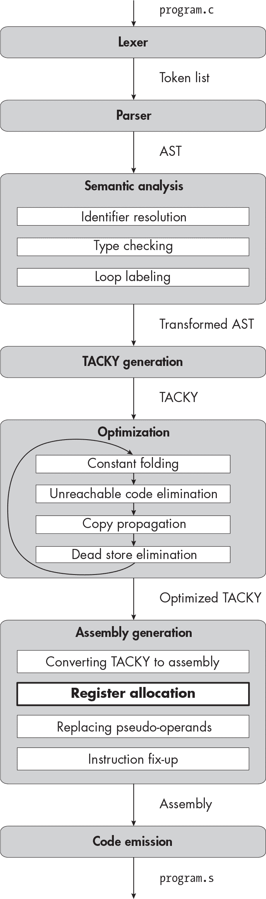

描述


## 第二十章：20 寄存器分配


到目前为止，你已经为每个伪寄存器在堆栈上分配了空间。这种策略很简单，但效率低下。由于指令无法总是直接操作内存中的值，因此有时你需要生成额外的指令来在这些堆栈位置和寄存器之间复制值。更糟糕的是，你生成的汇编代码必须不断访问内存，尽管寄存器的访问速度更快。现在你将解决这些问题。你将通过在本章开头的图示中添加一个 *寄存器分配* 过程，来完成你的编译器，将伪寄存器分配给硬寄存器，而不是分配给内存中的位置。你将使用图着色技术，这是一种经典的寄存器分配方法，来完成这一分配。

一旦寄存器分配器的初始版本启动并运行，你将给它安排另一个任务：清理在汇编生成过程中产生的一些不必要的 mov 指令。最终版本的寄存器分配器将在分配伪寄存器到硬寄存器之前执行 *寄存器合并*。寄存器合并步骤将查找那些源和目标可以合并成一个操作数的 mov 指令，这样就可以删除该指令。

寄存器分配涉及很多内容：高层次的理论、低层次的细节、全新的概念，以及来自前几章的熟悉技术。而且结果非常令人满意：在本章结束时，你将生成显著更高效的代码。我认为这是结束本书的一个好时机。

为了开始，我们来看一个例子，说明为什么寄存器分配是如此强大的优化手段。

### 寄存器分配实践

请查看 Listing 20-1 中的简单 C 函数。

```
int f(int x, int y) {
    return 10 - (3 * y + x);
}
```

Listing 20-1：一个简单的 C 函数

首先，我们的编译器将把它转化为 Listing 20-2 中的简单 TACKY 函数。

```
f(x, y):
    tmp0 = 3 * y
    tmp1 = tmp0 + x
    tmp2 = 10 - tmp1
    Return(tmp2)
```

Listing 20-2：针对 Listing 20-1 的 TACKY 代码

本清单给出了优化阶段后 f 的定义。（特别是，我们已经优化掉了每个 TACKY 函数末尾的额外 Return(0)，这作为缺失 return 语句的备用）

接下来，我们将把清单 20-2 转换为清单 20-3 中的汇编代码。

```
f:
  ❶ movl    %edi, %x
    movl    %esi, %y
  ❷ movl    $3, %tmp0
    imull   %y, %tmp0
    movl    %tmp0, %tmp1
 addl    %x, %tmp1
    movl    $10, %tmp2
    subl    %tmp1, %tmp2
  ❸ movl    %tmp2, %eax
    ret
```

清单 20-3： 清单 20-2 的汇编代码

我们设置函数的参数 ❶，然后计算 tmp0、tmp1 和 tmp2 ❷。最后，我们返回 tmp2 ❸。此清单中的操作数 %x、%y、%tmp0、%tmp1 和 %tmp2 指的是相应的伪寄存器；我将在整个章节中使用此表示法。

现在我们将通过三种方法来将这些伪寄存器替换为真实操作数。首先，我们将它们替换为栈地址，这正是我们当前编译器所做的。在下一个尝试中，我们将它们替换为硬件寄存器，而不先进行寄存器合并；这是我们寄存器分配器初始版本将执行的操作。第三次，我们将在替换伪寄存器为硬件寄存器之前执行寄存器合并。这就是我们完成的分配器将如何处理该程序。（关于术语的小提示：在本章中，我将使用*寄存器*一词来指代伪寄存器和硬件寄存器的统称。）

#### 方法一：将所有内容放入栈中

在当前形式下，我们的编译器会根据表 20-1 将每个伪寄存器替换为栈槽。

表 20-1: 用栈地址替换伪寄存器

| 伪寄存器 | 真实位置 |
| --- | --- |
| x | -4(%rbp) |
| y | -8(%rbp) |
| tmp0 | -12(%rbp) |
| tmp1 | -16(%rbp) |
| tmp2 | -20(%rbp) |

这将给我们清单 20-4 中的汇编代码。

```
f:
    movl    %edi, -4(%rbp)
    movl    %esi, -8(%rbp)
    movl    $3, -12(%rbp)
  ❶ imull   -8(%rbp), -12(%rbp)
  ❷ movl    -12(%rbp), -16(%rbp)
  ❸ addl    -4(%rbp), -16(%rbp)
    movl    $10, -20(%rbp)
  ❹ subl    -16(%rbp), -20(%rbp)
    movl    -20(%rbp), %eax
    ret
```

清单 20-4：将伪寄存器替换为栈地址后的清单 20-3

一旦我们将每个伪寄存器替换为内存地址，指令 ❶、❷、❸ 和 ❹ 将无效，因此指令修正过程需要修复它们。它会在❶之前插入一条额外的指令，将目标加载到硬寄存器中，并在之后插入另一条指令将结果存储回< sampa class="SANS_TheSansMonoCd_W5Regular_11">-12(%rbp)。它还会插入指令，将❷、❸ 和 ❹ 的源操作数加载到硬寄存器中。在寄存器分配的上下文中，我们说一个伪寄存器如果将其内容存储在栈上而不是硬寄存器中，它就被*溢出*到内存。我们插入的额外指令用于在寄存器和内存之间移动溢出的值，这些指令被称为*溢出代码*。

最终，我们将得到清单 20-5 中的汇编代码。我已经将溢出代码加粗，以便更容易找到。（我还删去了设置和拆卸栈帧的指令，这些与此无关。这些指令在本章后面的汇编程序中也会被删去。）

```
f:
 `--snip--`
    movl    %edi, -4(%rbp)
    movl    %esi, -8(%rbp)
    movl    $3, -12(%rbp)
 **movl    -12(%rbp), %r11d**
    imull   -8(%rbp), %r11d
 **movl    %r11d, -12(%rbp)**
 **movl    -12(%rbp), %r10d**
    movl    %r10d, -16(%rbp)
 **movl    -4(%rbp), %r10d**
    addl    %r10d, -16(%rbp)
    movl    $10, -20(%rbp)
 **movl    -16(%rbp), %r10d**
    subl    %r10d, -20(%rbp)
    movl    -20(%rbp), %eax
 `--snip--`
    ret
```

清单 20-5：清单 20-4 包含溢出代码

这段代码非常低效。几乎每条指令都访问内存，我们浪费了大量时间将数据从一个地方复制到另一个地方。举一个特别明显的例子，我们将< sampa class="SANS_TheSansMonoCd_W5Regular_11">3 * y的结果存储在< sampa class="SANS_TheSansMonoCd_W5Regular_11">-12(%rbp)，然后立即将其复制到< sampa class="SANS_TheSansMonoCd_W5Regular_11">-16(%rbp)—这需要两条< sampa class="SANS_TheSansMonoCd_W5Regular_11">mov指令—之后再也不使用< sampa class="SANS_TheSansMonoCd_W5Regular_11">-12(%rbp)了。

#### 第二次尝试：寄存器分配

让我们尝试一个更合理的策略。这次，我们将每个伪寄存器替换为硬寄存器，而不是栈地址，如表 20-2 所示。

表 20-2： 用硬寄存器替换伪寄存器

| 伪寄存器 | 真实位置 |
| --- | --- |
| x | %edx |
| y | %ecx |
| tmp0 | %r8d |
| tmp1 | %r9d |
| tmp2 | %edi |

我们将把 x、y、tmp0 和 tmp1 替换为在原始汇编程序中根本没有出现的寄存器。我们将把 tmp2 替换为 EDI，这在原始程序中是有使用的。这是可以的，因为我们只在完成其他 EDI 操作后使用 tmp2。在本章后面，我们将看到如何更系统地推理哪些伪寄存器到硬寄存器的映射是安全的，哪些可能会引发冲突。

这次没有溢出代码，因此我不会提供指令修复前后单独的清单。相反，我们直接跳到最终的汇编代码，如清单 20-6 所示。

```
f:
 `--snip--`
    movl    %edi, %edx
    movl    %esi, %ecx
    movl    $3, %r8d
    imull   %ecx, %r8d
    movl    %r8d, %r9d
    addl    %edx, %r9d
    movl    $10, %edi
    subl    %r9d, %edi
    movl    %edi, %eax
 `--snip--`
    ret
```

清单 20-6：经过寄存器分配后的清单 20-3 的最终汇编代码

这是一个重要的改进；我们不再访问内存，而且总体的指令数量减少了。如果我们愿意的话，甚至可以省略设置和拆除栈帧的指令，因为我们从未使用栈。但是，我们仍然在做不必要的数据移动。例如，我们将函数参数从 EDI 和 ESI 复制到新的位置，而不是将它们保留在原地。我们还将 tmp0（现在在 %r8d 中）复制到 tmp1（现在在 %r9d 中），其实我们完全可以连续两次使用 tmp0 来进行计算。这并不是寄存器分配器的错误；问题在于我们在早期的步骤中生成了低效的 TACKY 和汇编代码。但是，如果我们仔细考虑寄存器分配的方法，就可以清理早期步骤中的问题。这就是为什么我们的寄存器分配器将增加一步：寄存器合并。

#### 第三步：带合并的寄存器分配

我们的最后一种方法包含两个步骤。首先，我们将合并寄存器：我们会检查函数中的每一条 mov 指令，决定其操作数是否可以合并。接着，我们将像在之前的尝试中那样，把任何剩余的伪寄存器替换为硬寄存器。

让我们再看一下原始的汇编程序，来自示例 20-3。这个程序包含了四个源和目标都为寄存器的 mov 指令，下面我们将加粗显示这些寄存器：

```
f:
 **movl    %edi, %x**
 **movl    %esi, %y**
    movl    $3, %tmp0
    imull   %y, %tmp0
 **movl    %tmp0, %tmp1**
    addl    %x, %tmp1
    movl    $10, %tmp2
    subl    %tmp1, %tmp2
 **movl    %tmp2, %eax**
    ret
```

有时，从一个寄存器复制值到另一个寄存器确实是必要的。例如，如果我们后来要将另一个函数参数传递到 EDI 寄存器，我们可能需要将 x 从 EDI 中复制出来。但在这个案例中，将 x 合并到 EDI 中是安全的，因为在第一次 mov 指令之后，我们不再需要 EDI 寄存器。相同的逻辑适用于其他三个 mov 指令。我们不需要在源操作数和目标操作数中同时存储不同的值，因此将它们合并是安全的。我们将 x 合并到 EDI 中，y 合并到 ESI 中，tmp1 合并到 tmp0 中，tmp2 合并到 EAX 中。

表 20-3 总结了我们将合并的寄存器对，并显示了每对寄存器中将保留的成员。

表 20-3: 寄存器合并

| 合并后的寄存器对 | 剩余寄存器 |
| --- | --- |
| %edi, %x | %edi |
| %esi, %y | %esi |
| %tmp0, %tmp1 | %tmp0 |
| %tmp2, %eax | %eax |

我们还将删除所有四条 mov 指令，因为它们已经没有任何作用。示例 20-7 给出了合并后的汇编代码，并加粗显示了更新后的操作数。

```
f:
    movl    $3, %tmp0
    imull   **%esi**, %tmp0
    addl    **%edi**, **%tmp0**
    movl    $10, **%eax**
 subl    **%tmp0**, **%eax**
    ret
```

示例 20-7: 示例 20-3 合并寄存器后的代码

这样看起来更合理了！我们将 x 和 y 保持在 EDI 和 ESI 中，正如它们最初传递到这些寄存器一样，而不是将它们复制到新位置。当我们计算返回值时，我们直接将结果存储在 EAX 中，而不是在计算后再将它复制到 EAX 中。我们也不再使用两个独立的临时寄存器来计算 3 * y + x 的中间结果和最终结果；我们始终使用 tmp0。

我们还没有完全完成；我们仍然需要将 tmp0 替换为一个硬寄存器。除了 ESI、EDI 或 EAX，任何寄存器都可以——我们选用 ECX。清单 20-8 显示了我们最终会得到的汇编代码。

```
f:
 `--snip--`
    movl    $3, %ecx
    imull   %esi, %ecx
    addl    %edi, %ecx
    movl    $10, %eax
    subl    %ecx, %eax
 `--snip--`
    ret
```

清单 20-8：应用寄存器合并后，清单 20-3 的最终汇编代码

不进行寄存器合并的寄存器分配在两个方面改进了我们的代码：它减少了内存访问次数和程序中的溢出代码量。通过寄存器合并，我们通过去除之前步骤生成的许多不必要的 mov 指令，进一步优化了代码。

现在我们对要实现的目标有所了解，让我们来看看寄存器分配如何融入整个编译器流水线。

### 更新编译器流水线

寄存器分配器在有大量硬寄存器可用时效果最佳，因此我们要做的第一件事是将所有剩余的硬寄存器添加到汇编抽象语法树（AST）中，包括我们至今为止避免使用的调用者保存寄存器。我们还将对从 TACKY 转换到汇编的过程做一个小改动：在这一过程中，我们将把额外的信息存储在后端符号表中，记录每个函数用于传递参数和返回值的硬寄存器。

接下来，我们将实现寄存器分配器本身。寄存器分配器将在我们将程序从 TACKY 转换为汇编后运行，在其他后端编译器步骤之前。就像我们在第十九章中实现的优化一样，这一步将独立处理每个汇编函数。

即使在寄存器分配之后，程序中可能仍然存在一些伪寄存器。这可能是由于几个原因。首先，如果一个函数同时使用了大量伪寄存器，可能没有足够的硬寄存器来容纳它们。发生这种情况时，我们将不得不将一些伪寄存器溢出到内存中。我们的寄存器分配器不会替换已溢出的伪寄存器；它只会将它们保留在程序中，供下一轮处理。其次，一些伪寄存器代表具有静态存储持续时间的变量。这些变量必须存放在内存中，而不是寄存器中。如果你完成了第二部分，你还会遇到一些必须存放在内存中的对象，包括别名变量、结构体和数组。寄存器分配器也不会修改这些。

为了处理所有这些滞留的操作数，我们将在寄存器分配器之后立即运行旧的伪操作数替换过程。我们不会对这个过程做任何改动。它会以与之前完全相同的方式处理它找到的任何伪操作数；只不过它找到的数量会少很多。

接下来，我们将更新指令修正过程，处理保存和恢复被调用者保存的寄存器。我们现有的所有重写规则——包括生成溢出代码的规则——将保持不变。由于我们仍然会将一些伪寄存器替换为内存中的位置，我们仍然需要在某些情况下生成溢出代码。

最后，我们将扩展代码生成阶段，以支持本章引入的新硬寄存器。此时，你可能想要简单地先跳过新的寄存器分配阶段。然后，我们将最后一次更新汇编 AST。

### 扩展汇编 AST

到目前为止，汇编 AST 只包含我们为特定目的使用的寄存器，如传递参数或重写指令。它不包括任何被调用者保存的寄存器：RBX、R12、R13、R14 和 R15。现在，我们将添加这五个寄存器，以便寄存器分配器可以使用它们。我们还将添加 pop 指令，用于在函数结束时恢复被调用者保存的寄存器。如果你完成了第二部分，你还应该添加其余的 XMM 寄存器，即 XMM8 到 XMM13。这些寄存器不是被调用者保存的寄存器。

清单 20-9 显示了完整的汇编 AST，包括我们在第一部分、第二部分和第三部分中覆盖的所有内容，本章的新增内容已加粗显示。

```
program = Program(top_level*)
assembly_type = Byte | Longword | Quadword | Double | ByteArray(int size, int alignment)
top_level = Function(identifier name, bool global, instruction* instructions)
          | StaticVariable(identifier name, bool global, int alignment, static_init* init_list)
          | StaticConstant(identifier name, int alignment, static_init init)
instruction = Mov(assembly_type, operand src, operand dst)
            | Movsx(assembly_type src_type, assembly_type dst_type, operand src, operand dst)
            | MovZeroExtend(assembly_type src_type, assembly_type dst_type,
                            operand src, operand dst)
            | Lea(operand src, operand dst)
 | Cvttsd2si(assembly_type dst_type, operand src, operand dst)
            | Cvtsi2sd(assembly_type src_type, operand src, operand dst)
            | Unary(unary_operator, assembly_type, operand)
            | Binary(binary_operator, assembly_type, operand, operand)
            | Cmp(assembly_type, operand, operand)
            | Idiv(assembly_type, operand)
            | Div(assembly_type, operand)
            | Cdq(assembly_type)
            | Jmp(identifier)
            | JmpCC(cond_code, identifier)
            | SetCC(cond_code, operand)
            | Label(identifier)
            | Push(operand)
            **| Pop(reg)**
            | Call(identifier)
            | Ret
unary_operator = Neg | Not | Shr
binary_operator = Add | Sub | Mult | DivDouble | And | Or | Xor | Shl | ShrTwoOp
operand = Imm(int) | Reg(reg) | Pseudo(identifier) | Memory(reg, int) | Data(identifier, int)
        | PseudoMem(identifier, int) | Indexed(reg base, reg index, int scale)
cond_code = E | NE | G | GE | L | LE | A | AE | B | BE
reg = AX **| BX** | CX | DX | DI | SI | R8 | R9 | R10 | R11 **| R12 | R13 | R14 | R15** | SP | BP
    | XMM0 | XMM1 | XMM2 | XMM3 | XMM4 | XMM5 | XMM6 | XMM7
    **| XMM8 | XMM9 | XMM10 | XMM11 | XMM12 | XMM13** | XMM14 | XMM15
```

清单 20-9：包含 pop 指令和额外寄存器的完整汇编 AST

请注意，pop 仅接受寄存器，而不是其他操作数。现在我们已经更新了抽象语法树（AST），接下来让我们继续从 TACKY 到汇编的转换。

### 从 TACKY 到汇编的转换

我们对这个过程只做一个修改。我们不会改变生成的汇编内容；我们只是会在后端符号表中记录额外的信息。具体来说，我们将记录哪些寄存器用于传递每个函数的参数。如您将在下一节中看到的，寄存器分配器需要这些信息来确定哪些硬寄存器和伪寄存器存在冲突。

假设我们有以下的函数声明：

```
int foo(int i, int j);
```

我们将记录<sup>foo</sup>的参数是通过前两个参数传递寄存器 RDI 和 RSI 传递的。即使<sup>foo</sup>在不同的翻译单元中定义，我们也会跟踪这些信息，因为我们需要它来为调用<sup>foo</sup>的函数分配寄存器。

如果您完成了第二部分，那么您应该也跟踪哪些寄存器被用来传递每个函数的返回值。考虑到以下函数声明：

```
double foo(int i, double d);
```

我们将记录<sup>foo</sup>的参数通过 RDI 和 XMM0 传递，并且它的返回值也通过 XMM0 传递。为了找出一个函数使用哪些寄存器来传递参数和返回值，我们将使用在第十八章中实现的<sup>classify_parameters</sup>和<sup>classify_return_value</sup>辅助函数中实现的相同逻辑。请注意，我们可能会遇到具有不完整返回类型或参数类型的函数声明。无论我们记录什么关于这些函数的信息都没有关系，因为在当前翻译单元中定义或调用它们都是非法的；我们只需要在不崩溃的情况下处理它们。最简单的做法是直接记录它们没有通过寄存器传递任何值。

接下来，我们将构建寄存器分配器本身。

### 通过图着色进行寄存器分配

我们的编译器将把寄存器分配建模为一个*图着色*问题。着色一个图意味着为每个节点分配一个标签（传统上称为“颜色”），使得每个节点与其所有邻居的颜色都不同。如果一个图可以用*k*种或更少的颜色进行着色，那么它就是*k-可着色*的。图 20-1 展示了一个 3 色图。

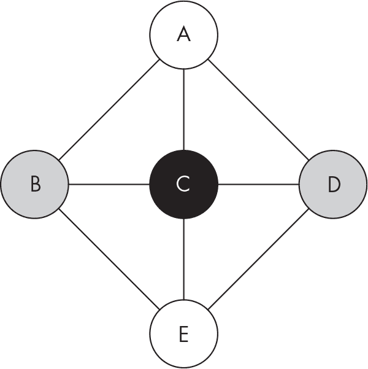

图 20-1：一个 3 色图 描述

图着色本身就是一个重要的研究领域；自 19 世纪以来，数学家们一直在研究如何为图着色！它与寄存器分配相关，因为它捕捉了我们在将伪寄存器分配到硬件寄存器时的两个基本约束：我们有有限数量的硬件寄存器可以使用，并且一些寄存器之间会*相互干扰*，这意味着它们不能占用相同的物理位置。如果两个伪寄存器发生干扰，我们需要将它们分配到两个不同的硬件寄存器上。一个伪寄存器也可能与硬件寄存器发生干扰，这意味着我们不能将它分配到那个硬件寄存器上。

图着色使我们能够表达两种类型的干扰，并以统一的方式处理它们。为了将寄存器分配问题转化为图着色问题，我们首先将构建一个*寄存器干扰图*，其中节点表示伪寄存器和硬件寄存器，边表示任意互相干扰的寄存器之间的关系。然后，我们将对图进行着色，为每个硬件寄存器分配一种颜色。最后，我们根据颜色将每个伪寄存器分配给一个硬件寄存器。因为每个寄存器的颜色都与它的邻居不同，所以我们永远不会将互相干扰的两个伪寄存器分配到同一个硬件寄存器，也不会将一个伪寄存器分配给它与之干扰的硬件寄存器。

让我们在清单 20-10 中的汇编函数上试用这个技巧。

```
divide_and_subtract:
  ❶ movl    %edi, %a
  ❷ movl    %esi, %b
    movl    %a, %eax
  ❸ cdq
    idivl   %b
  ❹ movl    %eax, %tmp
    subl    %b, %tmp
    movl    %tmp, %eax
    ret
```

清单 20-10：一个小型汇编函数

这个函数接受两个参数，将它们复制到伪寄存器 a 和 b 中。它计算 a / b - b 并将结果存储在 tmp 中。最后，它将 tmp 的值返回在 EAX 中。我们需要找出这个函数中哪些寄存器会发生冲突，以便构建冲突图。首先，很容易看出 a 和 b 会发生冲突。如果将它们映射到同一个硬件寄存器，当我们定义 b ❷ 时，a 会被覆盖。这是一个问题，因为 a 在此时仍然是活跃的。你在 第十九章 中学到，变量是活跃的，如果它的当前值可能会在程序中后续使用，否则它就是死的。这一定义同样适用于寄存器。当一个寄存器是活跃的时，我们需要保留它的值，因此不能在同一位置存储不同的值。当它是死的时，我们可以随意覆盖它的值。这给了我们一个简单的规则来检测冲突：两个寄存器如果在一个寄存器活跃时更新另一个寄存器，就会发生冲突。

这个规则还告诉我们，b 与 tmp 存在冲突，因为在我们定义 tmp ❹ 时，b 仍然是活跃的。但 a 和 tmp 不会发生冲突；因为在我们定义 tmp 时，a 已经是死的，所以可以将它们映射到同一个硬件寄存器。

现在让我们思考一下哪些硬寄存器会与伪寄存器干扰。ESI 与 a 干扰，因为当我们定义 a 时 ESI 是活跃的 ❶。如果我们将 a 映射到 ESI，我们将在有机会将其复制到 b 之前覆盖函数的第二个参数。EAX 与 b 干扰，因为当我们将 a 复制到 EAX 准备进行除法时，b 是活跃的。最后一个干扰源则不太明显。请记住，cdq 指令会将 EAX 中的值符号扩展到 EDX ❸。因为 cdq 在 b 活跃时隐式更新 EDX，它使得 EDX 与 b 干扰；如果我们将 b 映射到 EDX，这条指令将覆盖它。（同样，idiv 指令隐式更新 EAX 和 EDX，因此如果它们尚未干扰 b，它们也会使这两个寄存器与 b 干扰。）

最后，所有硬寄存器都会相互干扰。这有点自明；它们不能占据相同的物理位置，因为它们一开始就代表不同的物理位置。不过，我们需要在干扰图中捕捉这一点，以确保每个硬寄存器都有自己的颜色。

现在我们已经弄清楚了哪些寄存器相互干扰，接下来我们将构建干扰图。为了保持图的相对简洁和可读性，我们假设唯一的硬寄存器是 EDI、ESI、EAX 和 EDX。我们真实的寄存器干扰图将包括所有可以分配伪寄存器的硬寄存器，即使汇编程序没有使用它们。然而，它们将排除 RSP、RBP 以及我们在指令修正期间使用的临时寄存器。

图 20-2 展示了 清单 20-10 中函数的干扰图。

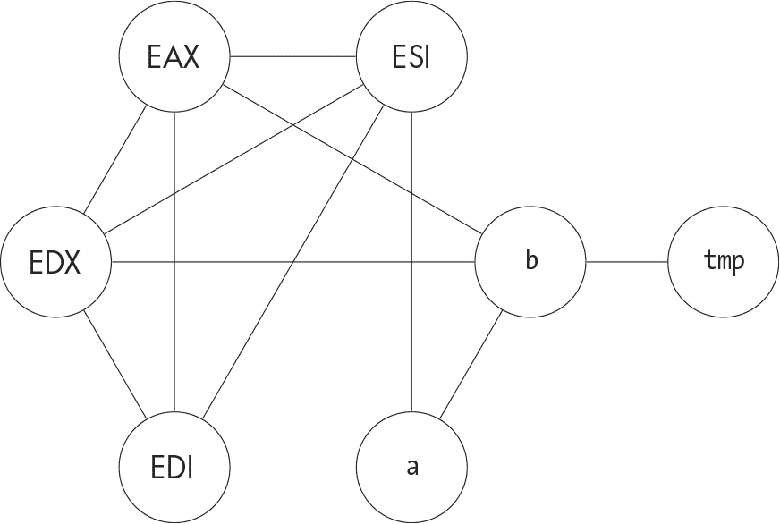

图 20-2：divide_and_subtract 的寄存器干扰图 描述

这个图表示了我们刚刚识别出的所有干扰：a与 ESI 和b产生干扰；b与tmp、EAX 和 EDX 产生干扰，并且与a产生干扰；所有四个硬寄存器之间都会相互干扰。

现在我们将尝试对这个图进行*k*着色，其中*k*是图中硬寄存器的数量。在这个小示例中，*k*是 4。图 20-2 中有几种可能的 4 种着色。图 20-3 展示了其中一些。

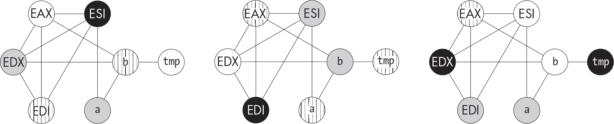

图 20-3：为 divide_and_subtract 的寄存器干扰图提供的三种有效 4 种着色描述

这些着色中的任何一种，或者我们能想到的任何其他 4 种着色，都会给我们一个有效的寄存器分配。每个寄存器都会从它的邻居那里接收到不同的颜色。因为所有的*k*个硬寄存器相互之间都会产生干扰，所以我们会将每种颜色分配给恰好一个硬寄存器，从而创建一个颜色与硬寄存器之间的 1:1 映射。

在我们给图着色之后，我们将用接收到相同颜色的硬寄存器替换每个伪寄存器。如果我们使用图 20-3 中的第一个着色，我们将把a替换为 EDX，b替换为 EDI，tmp替换为 EAX，这将给我们清单 20-11 中的汇编代码。

```
divide_and_subtract:
    movl    %edi, %edx
    movl    %esi, %edi
    movl    %edx, %eax
    cdq
    idivl   %edi
    movl    %eax, %eax
    subl    %edi, %eax
    movl    %eax, %eax
    ret
```

清单 20-11：根据图 20-3 中的第一个着色替换 divide_and_subtract 中的寄存器

如果你愿意，你可以通过这个列表进行操作，确认它产生的结果与清单 20-10 中`divide_and_subtract`的原始代码是相同的。你还可以尝试图 20-3 中的其他着色。

注意，给图形上色会产生两种不同的映射：一种是从所有寄存器到颜色，另一种是从颜色到硬寄存器。概念上，每种颜色代表一个硬寄存器，但我们在为图形着色之前并不知道*哪一个*硬寄存器。如果我们将硬寄存器的名字本身用作颜色，或者提前将每个硬寄存器与颜色关联，那么我们必须在尝试为其余图形着色之前对每个硬寄存器进行*预着色*。预着色会给图着色问题添加更多约束，导致更难找到有效的着色方案。一些图着色实现要求预着色节点；幸运的是，我们的实现不需要。

#### 干扰检测

之前，我说过只有在一个寄存器活跃时更新另一个寄存器，它们才会发生干扰。我们利用这个规则来确定在 divide _and_subtract 中哪些寄存器发生了干扰；它帮助我们识别了伪寄存器之间的干扰，以及伪寄存器与硬寄存器之间的干扰。但关于这个规则，还有一些重要的内容需要补充说明。

第一点是，只有在更新了一个寄存器后，另一个寄存器**立即活跃**时，它们才会发生干扰。这里有一个简短的例子：

```
movl    4(%rdi), %x
movl    %x, %eax
ret
```

在这段代码片段中，RDI 存储着某个内存地址——假设是结构体或数组的地址。该片段中的第一条指令从 RDI + 4 所指向的内存位置获取值，并将其复制到 x 中。在此指令之前，RDI 是活跃的；之后，它变为不活跃。RDI 和 x 不会发生干扰。如果我们将 x 映射到 RDI，那么第一条 mov 指令将覆盖 RDI 中的地址。但这没关系，因为我们之后不会再使用这个地址。

第二点是，只有当两个寄存器的值不同，它们才会发生干扰。具体来说，这意味着 mov src, dst 指令即使在 src 之后仍然活跃，也不会导致 src 和 dst 发生干扰。例如，在 Listing 20-12 中，x 和 y 不会发生干扰。

```
movl    $1, %y
movl    %y, %x
addl    %x, %ecx
addl    %y, %eax
```

Listing 20-12：一段汇编代码，展示了在该指令之后源操作数仍然活跃的情况

如果我们将 x 和 y 分配到相同的硬件寄存器，那么第二条 mov 指令就不会覆盖 x 的新值，而是完全没有效果。当我们进行寄存器合并时，我们甚至会特意将 x 和 y 放入相同的寄存器，以便我们可以完全删除这条指令。

两个寄存器通过一个 mov 指令连接，但仍然可能由于其他原因发生干扰，正如 清单 20-13 所展示的那样。

```
movl    $1, %y
movl    %y, %x
addl    $1, %y
addl    %x, %y
```

清单 20-13：一段汇编代码，其中后续指令使得 `mov` 指令的操作数发生干扰

在这个代码片段中，第二条 mov 指令没有造成 x 和 y 的干扰，但随后的 add 指令会，因为它在 x 仍然有效时更新了 y。在这种情况下，将 x 和 y 放入同一个寄存器是不安全的。

#### 溢出寄存器

我们不能总是 *k* 着色干扰图。考虑 清单 20-14 中的汇编函数，它计算 10 / arg1 + arg1 / arg2。

```
uncolorable:
    movl    %edi, %arg1
    movl    %esi, %arg2
    movl    $10, %eax
    cdq
    idivl   %arg1
    movl    %eax, %tmp
    movl    %arg1, %eax
    cdq
    idivl   %arg2
    addl    %tmp, %eax
    ret
```

清单 20-14：计算 10 / arg1 + arg1 / arg2

为了说明这个例子，我们假设有四个硬件寄存器：ESI、EDI、EDX 和 EAX。图 20-4 显示了该清单的干扰图。我不会一一说明如何构建这个图，但如果你愿意，可以自己验证。

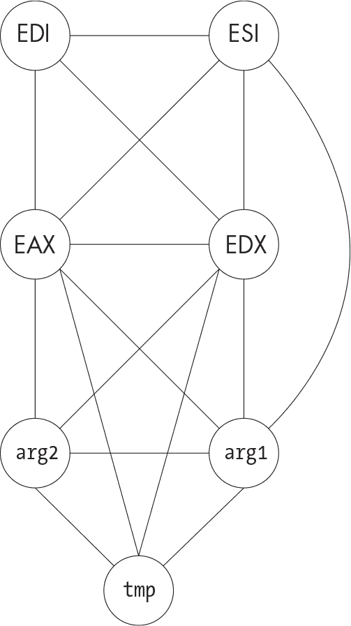

图 20-4：干扰图，来自 清单 20-14 描述

这个图无法进行 4 着色。注意到 EAX、EDX、arg1、arg2 和 tmp 彼此之间都存在干扰。这意味着它们每一个都必须与其他四个寄存器分配不同的颜色，这将需要五种不同的颜色。我们将通过溢出一个寄存器来解决这个问题——换句话说，就是将其从图中移除，而不是着色。溢出 arg1、arg2 或 tmp 中的任意一个，都会使得图可以着色。如果我们溢出 tmp，例如，我们可以使用图 20-5 所示的着色方式。

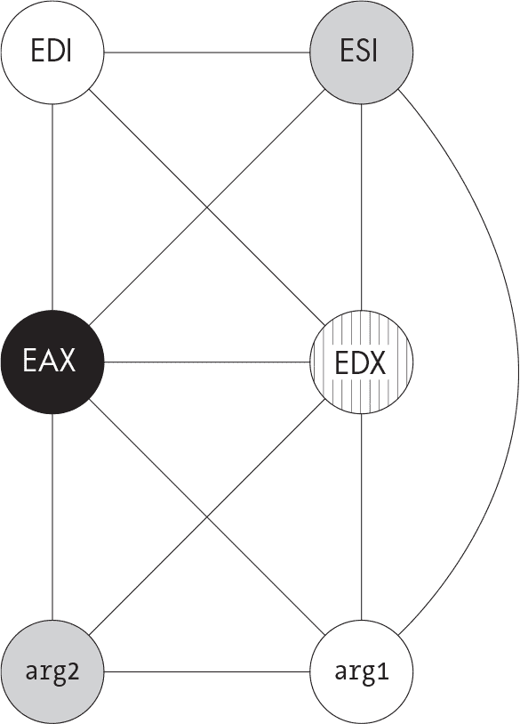

图 20-5：在溢出 tmp 后为干扰图着色 描述

现在我们可以替换掉我们之前标记的两个伪寄存器，但不会替换tmp。清单 20-15 展示了替换后的汇编代码，来自清单 20-14 的更改已加粗。

```
uncolorable:
    movl    %edi, **%edi**
    movl    %esi, **%esi**
    movl    $10, %eax
    cdq
    idivl   **%edi**
    movl    %eax, %tmp
    movl    **%edi**, %eax
    cdq
    idivl   **%esi**
    addl    %tmp, %eax
    ret
```

清单 20-15：寄存器分配后的 无法着色 函数

请注意，我们已经将此清单中的前两条指令做了冗余处理。我们本可以通过删除它们进一步优化代码，但暂时不考虑这个优化。

在寄存器分配器将 arg1 和 arg2 分配到硬寄存器后，伪操作数替换过程将把 tmp 放到栈上。清单 20-16 展示了该函数的最终汇编代码，其中来自清单 20-15 的更改已加粗。

```
uncolorable:
 `--snip--`
    movl    %edi, %edi
 movl    %esi, %esi
    movl    $10, %eax
    cdq
    idivl   %edi
    movl    %eax, **-4(%rbp)**
    movl    %edi, %eax
    cdq
    idivl   %esi
    addl    **-4(%rbp)**, %eax
 `--snip--`
    ret
```

清单 20-16：最终的汇编代码，适用于 无法着色

溢出一个伪寄存器使得我们能够用硬寄存器替换掉其他所有寄存器。但我们决定溢出*哪个*寄存器非常重要！通常，伪寄存器的访问频率越高，溢出该寄存器对性能的影响就越大。我们的分配器会为干扰图中的每个寄存器计算一个*溢出成本*。这是估算溢出该寄存器对性能的影响程度。然后，当我们对图进行着色时，会使用这些信息来最小化溢出的整体性能影响。

### 基本寄存器分配器

现在我们对寄存器分配器的工作方式有了一些了解，接下来让我们实现它吧！清单 20-17 描述了如何为单个函数分配寄存器。

```
allocate_registers(instructions):
    interference_graph = build_graph(instructions)
    add_spill_costs(interference_graph, instructions)
    color_graph(interference_graph)
    register_map = create_register_map(interference_graph)
    transformed_instructions = replace_pseudoregs(instructions, register_map)
    return transformed_instructions
```

清单 20-17：顶层寄存器分配算法

我们首先构建干扰图。然后，我们根据每个寄存器的使用频率计算溢出代价，并在图中注释这些信息。接下来，我们对图进行着色，为每个节点注释它的颜色。如果我们不能为每个节点着色，我们将使用在前一步计算的溢出代价来决定溢出哪个寄存器。要溢出一个节点，我们只需将其保持为无色。

最后一步是替换我们标记的所有伪寄存器。在 create _register_map 中，我们构建了一个从有颜色的伪寄存器到相同颜色的硬寄存器的映射。最后，我们重写函数体，将每个伪寄存器替换为映射中相应的硬寄存器。

继续并创建 allocate_registers 的存根。然后，我们将一步步实现这些步骤。

#### 处理寄存器分配中的多种类型

如果你完成了第二部分，你将需要运行整个算法两次：清单 20-17 一次分配通用寄存器，一次分配 XMM 寄存器。在每次运行时，你只会在干扰图中包含适当类型的寄存器。我们在第二部分中添加的新功能也会改变构建干扰图的一些细节。当我们实现 build_graph 时，我们将更详细地查看这些变化。

在构建干扰图后的单独步骤——包括计算溢出代价、着色图以及替换伪寄存器——无论我们处理的是浮点寄存器还是通用寄存器，步骤都完全相同。第二部分中添加的其他功能也不会影响这些步骤。

#### 定义干扰图

为了开始，我们将定义干扰图的数据结构。清单 20-18 展示了一种可能的表示方式。

```
node = Node(operand id, operand* neighbors, double spill_cost, int? color, bool pruned)
graph = Graph(node* nodes)
```

清单 20-18：寄存器干扰图的定义

图中的每个节点对应于汇编 AST 中的一个Pseudo或Register操作数。我们将跟踪每个节点的邻居、溢出代价和颜色。我们将使用整数1到k来表示颜色，其中*k*是可用硬件寄存器的数量。color字段是可选的，因为我们可能无法为每个节点上色。我们将在上色图时使用pruned标志；你可以在那之前忽略它。创建新节点时，应该将spill_cost初始化为0.0，将color初始化为null，并将pruned初始化为False。

这个node的定义比实际需要的要宽松一些；operand类型包括常量和内存位置，而我们永远不会将它们添加到干扰图中。或者，你可以用一个专门的node_id类型来替代operand，该类型只表示寄存器。我使用更宽松的定义，以便我们不必在整个分配器中不断地在operand和node_id之间来回转换。

#### 构建干扰图

我们终于准备好构建干扰图了！首先，我们将通过实现一个支持来自第一部分的汇编 AST 的build_graph来演示。然后，我们将讨论如何修改它以支持来自第二部分的汇编 AST。

由于构建这个图是一个相当复杂的过程，我们将它分解为几个步骤。清单 20-19 在伪代码中展示了这些步骤。

```
build_graph(instructions):
  ❶ interference_graph = base_graph
  ❷ add_pseudoregisters(interference_graph, instructions)
    cfg = make_control_flow_graph(instructions)
  ❸ analyze_liveness(cfg)
  ❹ add_edges(cfg, interference_graph)
    return interference_graph
```

清单 20-19：构建干扰图

我们将从一个包含所有硬件寄存器的图开始 ❶。（据我所知，这个图没有标准术语，所以我将它称为*基础图*。）接下来，我们将为函数中出现的每个伪寄存器插入一个节点 ❷。最后，我们将找出哪些寄存器相互干扰。由于这取决于每个点上哪些寄存器是活动的，我们需要在汇编代码上运行活跃性分析。就像在第十九章中一样，这项分析将采用控制流图（它与干扰图不同！）并用活跃性信息对其进行注释 ❸。最后，我们将使用这些信息来确定要向干扰图中添加哪些边 ❹。让我们仔细看看每个步骤。

##### 基础图

基础图，如图 20-6 所示，包含 12 个寄存器：RAX、RBX、RCX、RDX、RDI、RSI、R8、R9、R12、R13、R14 和 R15。

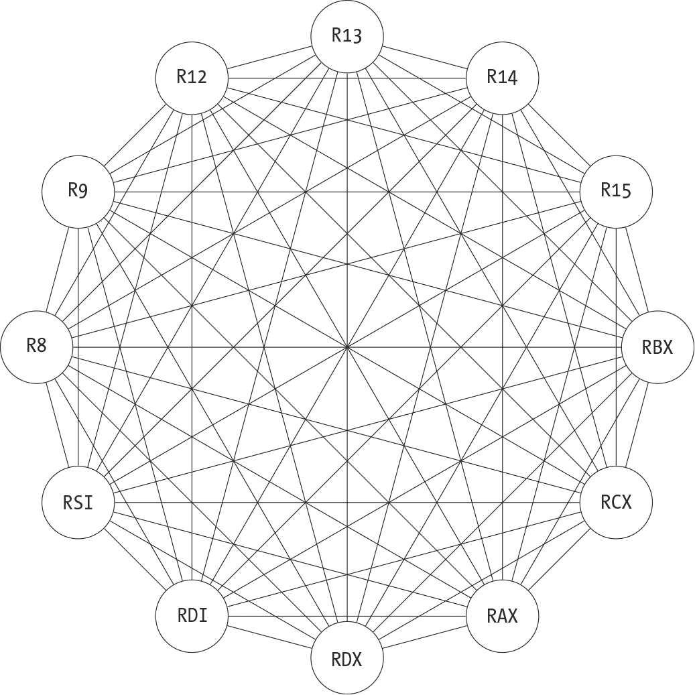

图 20-6：基础寄存器干扰图 描述

我们不会在图中包含 RSP 或 RBP，因为我们已经在使用它们来管理堆栈帧，也不会包含 R10 或 R11，因为我们将在指令修正过程中需要它们。由于所有硬寄存器彼此之间都会发生干扰，基础图中包含了每对节点之间的边。在图论术语中，这使得基础图成为一个*完全图*。

> 注意

*由于本章的示例程序处理的是 4 字节的伪寄存器，大多数干扰图的示意图使用 4 字节的硬寄存器别名。我在图 20-6 中使用了 8 字节的别名，因为它表示的是您将用于所有程序的基础图，而不是任何特定程序的干扰图。我们实际构建的干扰图将使用 reg 汇编 AST 节点来表示硬寄存器，而这些节点并不指定大小。*

##### 将伪寄存器添加到图中

这部分很简单：我们只需遍历每条指令中的每个操作数，并决定是否将其添加到图中。每个出现在汇编函数中的伪寄存器都应该加入图中，除非它具有静态存储期。我会跳过<sup class="SANS_TheSansMonoCd_W5Regular_11">add_pseudoregisters</sup>的伪代码，因为它并没有太多内容。

##### 活跃性分析

我们已经知道活跃性分析是如何工作的，因为我们在第十九章中实现过它。现在我们需要一个新的实现，来分析汇编代码而不是 TACKY，并跟踪寄存器而不是变量。幸运的是，基本逻辑是相同的。我们甚至可以重用一些现有的代码。

首先，我们将构建一个控制流图。这个过程与从 TACKY 函数构建控制流图一样，只不过基本块之间边界的具体指令不同。我们不会寻找像Label、Return、Jump、JumpIfZero和JumpIfNotZero这样的 TACKY 控制流指令，而是寻找它们的汇编等价指令：汇编中的Label指令、Ret、Jmp和JmpCC。你已经编写了将 TACKY 转换为控制流图的代码；理想情况下，你应该能够重构它以同时处理汇编。

接下来，我们将研究活跃度分析本身的三个组成部分：迭代算法、合并运算符和传输函数。迭代算法与第十九章中完全相同，因此你应该能够使用你已经编写的该算法的实现。

我们将使用集合并集作为我们的合并运算符，就像之前一样。然而，我们将在控制流图中的EXIT节点上进行不同的处理。我们原来的合并运算符假设在函数退出时静态变量是活跃的。现在我们不关心静态变量，因为它们不在干扰图中。相反，我们必须关心硬寄存器，特别是 EAX 寄存器，它保存函数的返回值。清单 20-20 定义了我们新的合并运算符，并在原始合并运算符（定义在清单 19-24 中）上做出了一个改动，这个改动已用粗体标出。

```
meet(block):
    live_registers = {}
    for succ_id in block.successors:
        match succ_id with
        | EXIT -> **live_registers.add(Reg(AX))**
        | ENTRY -> fail("Malformed control-flow graph")
        | BlockId(id) ->
            succ_live_registers = get_block_annotation(succ_id)
            live_registers.add_all(succ_live_registers)

    return live_registers
```

清单 20-20：汇编代码的活跃度分析合并运算符

我们忽略了被调用者保存的寄存器在EXIT时*也*处于活跃状态这一事实。我们之所以能够这么做，是因为指令修正阶段如果使用到这些寄存器，它会将其溢出：也就是说，它会在函数开始时将它们的值保存到栈中，并在返回之前恢复它们。假设这些寄存器在EXIT时是死的，使得我们实际上可以使用它们。如果我们将它们添加到活跃寄存器集合中，我们会得出它们在整个函数中都处于活跃状态的结论，并且与每一个伪寄存器发生干扰。

传输函数是活跃分析中与上一章显著不同的部分。基本思路是一样的：当寄存器被使用时，我们将其添加到活跃集合中，而当它们被更新时，我们将其移除。但具体细节有所不同，因为我们使用的是一组与之前不同的指令。

首先，让我们编写一个辅助函数，find_used_and_updated，它告诉我们每条指令使用和更新了哪些操作数。接下来我们要实现的传输函数和 add_edges 函数都将使用这个辅助函数。清单 20-21 给出了 find_used_and_updated 的伪代码。

```
find_used_and_updated(instruction):
    match instruction with
    | Mov(src, dst) -> ❶
        used = [src]
        updated = [dst]
    | Binary(op, src, dst) -> ❷
        used = [src, dst]
        updated = [dst]
    | Unary(op, dst) ->
        used = [dst]
        updated = [dst]
    | Cmp(v1, v2) ->
        used = [v1, v2]
        updated = []
    | SetCC(cond, dst) ->
        used = []
        updated = [dst]
    | Push(v) ->
        used = [v]
 updated = []
    | Idiv(divisor) ->
        used = [divisor, Reg(AX), Reg(DX)]
        updated = [Reg(AX), Reg(DX)]
    | Cdq ->
        used = [Reg(AX)]
        updated = [Reg(DX)]
    | Call(f) ->
        used = `<look up parameter passing registers in the backend symbol table>` ❸
        updated = [Reg(DI), Reg(SI), Reg(DX), Reg(CX), Reg(R8), Reg(R9), Reg(AX)]
    | _ ->
        used = []
        updated = []
    return (used, updated)
```

清单 20-21：识别每条指令使用和更新的操作数

请注意，这份清单仅涵盖了第一部分的汇编指令。Mov 是最直接的例子：它使用源操作数并更新其目标操作数 ❶。像 add src, dst 这样的二进制指令使用源操作数和目标操作数，并更新目标操作数 ❷。同样也很容易看出 Unary、Cmp、SetCC 和 Push 指令读取并更新了哪些操作数。

一些指令使用它们未明确提到的寄存器。Idiv 将存储在 EAX 和 EDX 寄存器中的值除以其源操作数，因此它使用了这三个值。它将结果存储在 EAX 和 EDX 中，所以它更新了这两个寄存器。Cdq 将 EAX 的符号扩展到 EDX，这意味着它使用 EAX 并更新 EDX。

Call 使用存储被调用者参数的寄存器；我们可以在后端符号表中查找这些寄存器，我们在汇编生成过程中记录了它们 ❸。它更新所有调用者保存的寄存器——无论我们是否通过这些寄存器传递被调用者的参数——因为这些寄存器可能会被被调用者破坏。这使得所有调用者保存的寄存器会干扰任何在调用此函数时仍然活跃的伪寄存器，因此我们的图着色算法会将这些伪寄存器分配给被调用者保存的寄存器。

如果一条指令既使用又更新相同的寄存器——例如，二进制指令既使用又更新它的目标寄存器——那么将该寄存器同时加入到 使用过的 和 更新过的 列表中是很重要的。在传输函数中，我们只关心寄存器的使用情况，因为这会使它变得活跃。但是，当我们在 add_edges 中再次使用这个辅助函数时，我们只关心寄存器的更新情况，因为这会使它与任何同时活跃的其他寄存器产生干扰。

现在我们可以编写传输函数，它定义在列表 20-22 中。

```
transfer(block, end_live_registers):
    current_live_registers = end_live_registers

    for instruction in reverse(block.instructions):
      ❶ annotate_instruction(instruction, current_live_registers)
      ❷ used, updated = find_used_and_updated(instruction)
 for v in updated:
            if v is a register:
                current_live_registers.remove(v)

        for v in used:
            if v is a register:
                current_live_registers.add(v)

  ❸ annotate_block(block.id, current_live_registers)
```

列表 20-22：汇编中的活动性分析传输函数

由于这是一个反向分析，我们按逆序分析汇编指令。处理一条指令时，我们首先记录指令执行后哪些寄存器是活跃的 ❶。然后，我们计算出指令执行前哪些寄存器是活跃的。我们调用刚才编写的辅助函数来确定它使用和更新了哪些操作数 ❷。接着，我们将它更新的任何寄存器从当前活跃寄存器集合中移除，并将它使用的寄存器添加进来。（如果一条指令使用并更新同一寄存器，我们将先将该寄存器从活跃寄存器集合中移除，再立刻将其添加回去。）一旦处理完每条指令，我们记录下该块开始时哪些寄存器是活跃的 ❸。

我们不会跟踪常量和内存操作数，但我们的活动寄存器集合可能仍然包括一些我们不关心的操作数（特别是具有静态存储持续时间的伪寄存器）。将它们包括在我们的活动性结果中不会造成任何 harm；当我们在下一步中使用这些结果时，我们会忽略它们。

##### 添加边

拿到活动性信息后，我们终于可以弄清楚要向图中添加哪些边。列表 20-23 给出了这一步的伪代码。

```
add_edges(liveness_cfg, interference_graph):
    for node in liveness_cfg.nodes:
        if node is EntryNode or ExitNode:
            continue

        for instr in node.instructions:
            used, updated = find_used_and_updated(instr)

          ❶ live_registers = get_instruction_annotation(instr)

            for l in live_registers:
              ❷ if (instr is Mov) and (l == instr.src):
                    continue

                for u in updated:
                  ❸ if (l and u are in interference_graph) and (l != u):
                        add_edge(interference_graph, l, u)
```

列表 20-23：向干扰图中添加边

我们之前学到，当一个寄存器在另一个寄存器活跃时被更新时，这两个寄存器会产生干扰。现在我们将查看每条指令并弄清楚它创建了哪些干扰。处理单条指令时，我们首先调用 find_used_and_updated 来查找它更新了哪些操作数。（我们会忽略该函数返回的第一个列表 used，因为我们不关心指令使用了哪些操作数。）接下来，我们查找指令执行后哪些寄存器是活跃的 ❶。

然后，我们在<_samp class="SANS_TheSansMonoCd_W5Regular_11">live_registers中的每个寄存器和<sam>p class="SANS_TheSansMonoCd_W5Regular_11">updated中的每个寄存器之间添加一条边。Mov指令是一个特殊的情况。如果当前指令是Mov，我们将在遍历活动寄存器集合时跳过其源寄存器，这样我们就不会在源寄存器和目标寄存器之间添加一条边 ❷。

在我们为两个节点之间添加一条边之前，我们会确保这两个节点已经存在于干扰图中。我们还会确保它们是不同的，因为我们不想添加一条从一个节点指向它自身的边 ❸。

##### 构建图时处理其他类型

现在我们将处理在第 II 部分中添加的所有功能。由于我们分别分配 XMM 和通用寄存器，因此我们将构建两个干扰图。我们将从每个寄存器类别的单独基本图开始。XMM 寄存器的基本图应包含 14 个节点；它将包括 XMM0 到 XMM13，但不包括临时寄存器 XMM14 和 XMM15。在add_pseudoregisters中，我们会检查伪寄存器是否具有正确的类型，然后再将其添加到图中。当我们分配 XMM 寄存器时，我们只会将<sam>p class="SANS_TheSansMonoCd_W5Regular_11">Double类型的伪寄存器添加到图中。当我们分配通用寄存器时，我们将排除<sam>p class="SANS_TheSansMonoCd_W5Regular_11">Double伪寄存器，并包括所有其他标量类型：Longword、Quadword和Byte。

除了浮点寄存器外，还有一些其他细节我们需要更改。我们将排除别名化的伪寄存器，因为它们不应该分配给寄存器。你可以在这里重用上一章的地址分析；只需在将程序从 TACKY 转换为汇编语言之前重新运行分析。如果在 TACKY 程序中某个变量被别名化，它在汇编程序中仍然会被别名化。

活跃度分析应反映我们在第 II 部分中实现的新调用约定。meet函数不能假定当函数退出时 EAX 仍然是活动的；它应该检查后端符号表，了解函数使用哪些寄存器来传递返回值。这些寄存器在EXIT时都会是活动的。

我们还将更新 find_used_and_updated 辅助函数。首先，这个函数需要正确处理 Memory 和 Indexed 操作数。这些操作数指定了内存中的位置，但它们在地址计算中使用了寄存器。当我们使用这些操作数时，即使我们是*写*入它指定的内存位置，我们也需要*读取*它所指向的任何寄存器。例如，指令 movl $1, 4(%rax) 使用 RAX 而不是更新它，而指令 leaq (%rax, %rcx, 4), %rdi 使用了 RAX 和 RCX，但更新了 RDI。其次，find_used_and_updated 必须识别出所有 XMM 寄存器都是调用者保存的，因此会被 Call 指令更新。最后，这个函数还需要处理我们在第二部分中添加的所有新汇编指令，但它们没有什么特别复杂的。

#### 计算溢出代价

在构建图之后，我们会给每个寄存器标注溢出代价。如果我们无法为图中的每个节点上色，这些代价将帮助我们决定应该溢出哪个节点（或哪些节点）。我们会尽量以最小化所有溢出节点的总代价的方式为图上色。

由于我们不能溢出硬寄存器，因此我们为每个硬寄存器分配一个无限的溢出代价。为了估算每个伪寄存器的溢出代价，我们只需计算它在汇编代码中出现的次数。例如，如果我们遇到指令 movl $1, %x，我们就将 x 的溢出代价增加一。如果我们看到指令 addl %x, %x，我们就将 x 的溢出代价增加二。其背后的原理是，伪寄存器使用得越频繁，如果我们溢出它，就会引入更多的内存访问和新的指令。

坦白说，这是一个糟糕的计算溢出代价的方法。它忽视了一个基本事实，即某些指令的执行频率比其他指令更高。显然，在执行一百万次的循环中使用伪寄存器，应该比在只执行一次的指令中使用它，增加更多的溢出代价。很难准确预测一个特定指令会执行多少次，但一种方法是将循环的嵌套深度作为执行频率的粗略代理。当采用这种方法的编译器计算溢出代价时，它们会给更深层嵌套的循环中的指令更多权重。

不幸的是，我们不知道程序中循环的位置。发现循环需要我们实现一种全新的分析方法，而本章内容已经够长了。如果你想自己实现这个分析方法，我在第 669 页的“附加资源”部分中列出了一些关于识别循环的参考资料。

#### 着色干扰图

现在是时候给图着色了！我们的目标是最小化我们留白节点的总溢出成本（理想情况下通过着色每个节点，使得总溢出成本为零）。但是，精确的图着色算法能够找到最佳着色方案，但在实际中速度太慢。因此，我们将使用一种近似算法。这个算法可能无法找到最优着色，但通常能找到一个相当不错的着色方案。

我们的图着色算法基于一个简单的观察：你总是可以给一个邻居少于*k*的节点着色，因为总会有一种颜色是它的邻居没有使用的。这个观察叫做*度数 <* k *规则*。（一个节点的邻居数量称为它的*度数*；如果一个节点有*k*个或更多邻居，我们称它具有*显著度数*。）度数 < *k* 规则为我们提供了一种分解问题的方法。首先，我们将临时移除任何邻居少于*k*的节点，这叫做*修剪*图。然后，我们将以某种方式着色图的其余部分（我们暂时不关心如何做）。最后，我们会一个一个地将修剪掉的节点放回图中。当我们放回一个节点时，我们将为它分配一种与我们已经着色的邻居不冲突的颜色。由于每个节点的邻居少于*k*，总会有至少一种可用颜色。

让我们尝试使用这种方法为图 20-7 中的图进行三色着色，看看能达到什么程度。

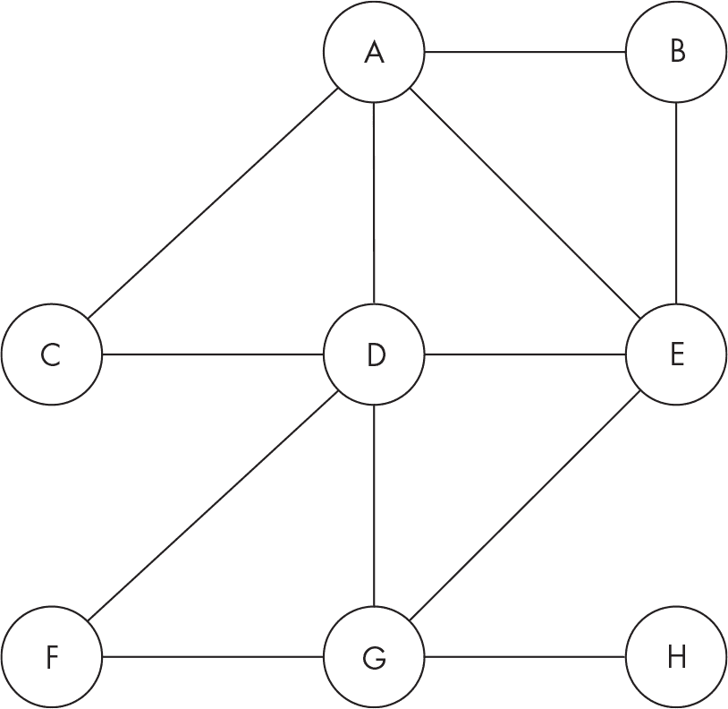

图 20-7：尚未着色的图 描述

这个图有四个邻居少于三个的节点：*B*、*C*、*F* 和 *H*。我们将从图中修剪这些节点，然后弄清楚如何着色这个较小的图。我们还将定义一个栈来跟踪被修剪的节点，这些节点最终需要重新放回图中。图 20-8 显示了修剪后的图和栈。

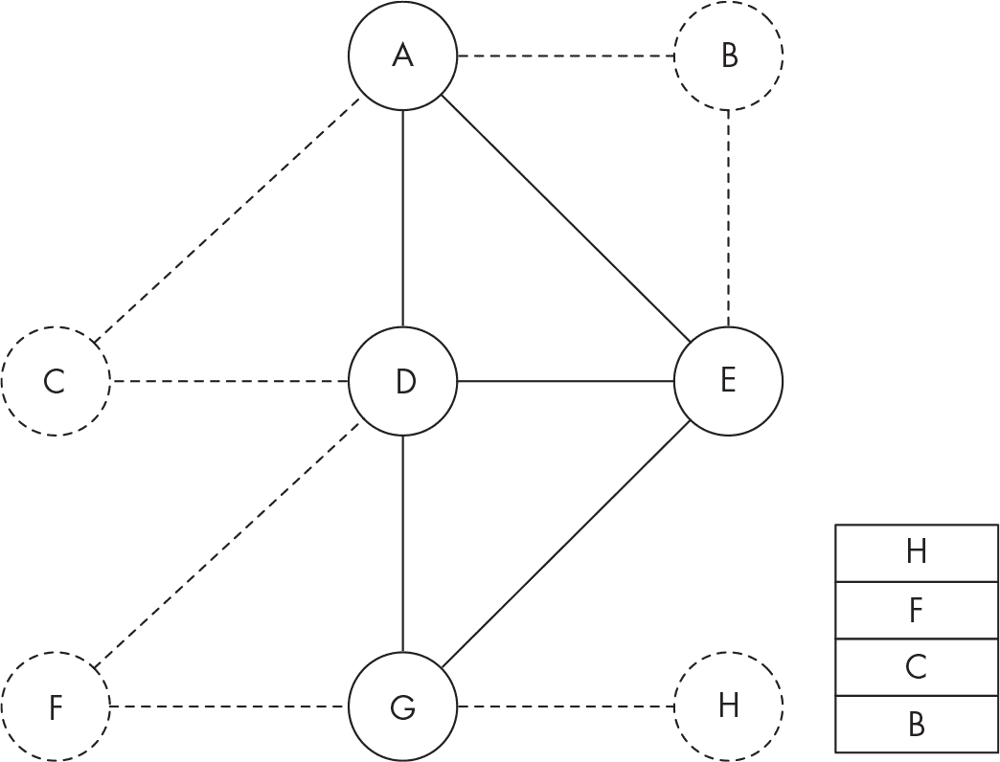

图 20-8：从图 20-7 中移除低度数节点后的图 描述

在这个修剪后的图中，*A* 和 *G* 都有少于三个邻居。这意味着我们可以应用相同的技巧再次修剪图形！我们将把 *A* 和 *G* 推到栈顶；然后，我们将弹出它们并为它们上色，再为 *B*、*C*、*F* 和 *H* 上色。当我们弹出 *A* 和 *G* 并将它们放回图中时，它们将保持当前的度数，所以我们知道我们可以为它们找到颜色。

图 20-9 展示了修剪 *A* 和 *G* 后图形和栈的状态。

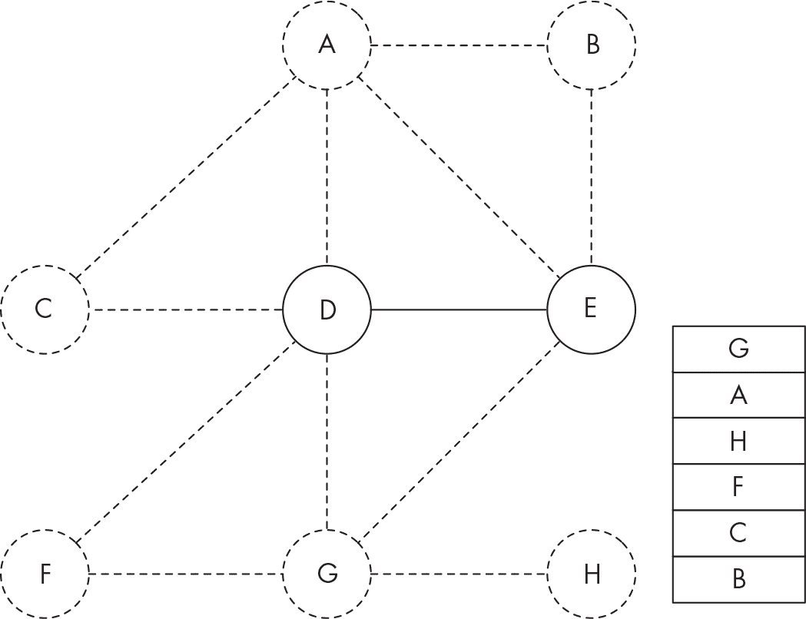

图 20-9：从图 20-7 修剪两轮后的图 描述

我们剩下的两个节点每个的邻居少于三个，因此我们可以直接为它们上色。但是，我们会采取稍微不同的方法来完成同样的任务：我们将从图中修剪它们，然后再把它们放回去。修剪后，图形为空。图 20-10 展示了修剪每个节点后的图形状态。

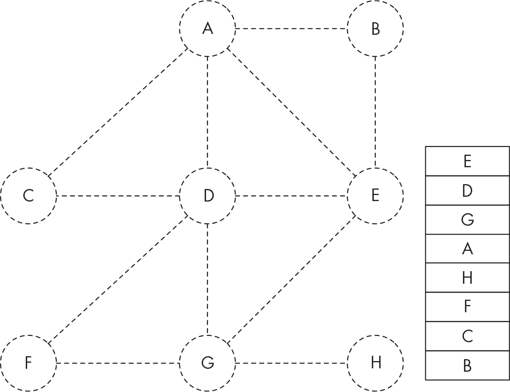

图 20-10：从图 20-7 修剪每个节点后的图 描述

我们的原计划是修剪图形，为剩下的节点上色，然后把修剪的节点放回。现在，修剪工作已经完成，我们不需要做第二步：没有剩下的节点需要上色！我们并不是每次都能这么幸运；有时我们会遇到无法修剪的节点。稍后我们会讨论如何处理这种情况。现在，让我们完成图形的上色。

作为我们计划的最后一步，我们将取回之前修剪的每个节点，为它分配颜色，然后将它放回图中。我们从最后一个被移除的节点开始，它在栈顶，然后重复此过程直到栈为空。图 20-11 中的图示展示了我们在这个例子中如何重建图形。

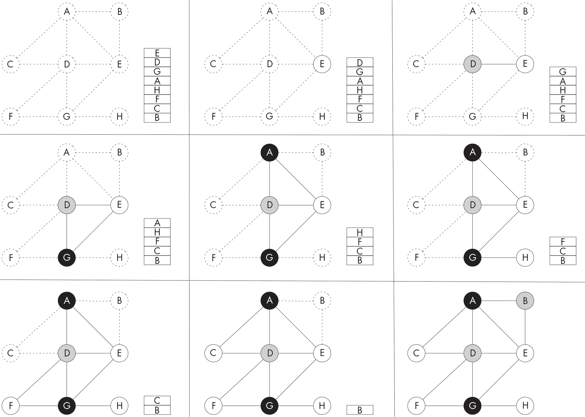

图 20-11：将节点添加回图中并分配颜色 描述

当我们将 *E* 加回图中时，它没有邻居，因此我们可以为它分配任何颜色。我们将它涂成白色。然后，当我们添加 *D* 时，它唯一的邻居是 *E*，所以我们可以为它分配黑色或灰色。当我们添加 *G* 时，我们发现它有一个白色邻居和一个灰色邻居，因此我们必须将它涂成黑色。我们继续这个过程，直到栈为空，图中的每个节点都被分配了颜色。

##### 处理溢出

对于许多干扰图，我们可以使用上一节中的方法修剪每个节点。我们可以为这些图着色而不发生溢出。但也有其他图，我们会陷入困境：我们会遇到一个每个节点都有*k*个或更多邻居的情况。假设我们想为图 20-12 着色。


图 20-12：每个节点有三个或更多邻居的图 描述

如果我们尝试修剪这个图，我们将立即陷入困境：每个节点至少有三个邻居！为了摆脱困境，我们无论如何都会选择一个节点进行修剪。我们将把这个节点放入堆栈中，然后照常继续算法。这个节点是一个*溢出候选项*，因为当我们将它重新加入图中时，可能无法为它着色。如果运气好，它的邻居不会用尽所有颜色，那么我们就能为它着色。如果运气不好，它的邻居会用尽所有*k*种颜色，那么我们就不得不溢出它。

我们希望选择一个溢出成本较低的溢出候选项。但我们也希望选择一个邻居较多且尚未被修剪的溢出候选项，因为修剪我们的溢出候选项会降低其邻居的度数，并帮助我们避免稍后溢出它们。为了平衡这两者的优先级，我们将选择*溢出成本 / 度数*值最小的节点，其中度数是尚未被修剪的邻居的数量。

请注意，我们永远不会选择硬寄存器作为溢出候选项，因为这些寄存器的*溢出成本 / 度数*总是无限大。如果图中还有伪寄存器，我们将始终选择其中一个作为溢出候选项，而不是选择硬寄存器。如果没有剩余的伪寄存器，寄存器的总数必须是*k*个或更少，因此我们将能够修剪每个寄存器。

有些图没有有效的*k*着色，这使得溢出成为不可避免的。对于其他图，存在有效的着色，但我们是否能找到它取决于运气；它取决于我们从图中删除节点的精确顺序，以及我们在将它们重新加入时如何着色它们。

为了说明这种方法中的偶然性，我们将尝试几次为图 20-12 着色。这个图是可以进行 3 着色的，但我们只有一次尝试会找到一个无溢出的着色。在这两种情况下，我们都将选择*C*作为溢出候选项，然后修剪*A*和*B*，留下*D*、*E*和*F*。在这两种情况下，我们都将使用相同的策略为节点着色，当我们将它们重新加入图中时：我们将从颜色列表*[白色、灰色、黑色]*中选择第一个可用的颜色。唯一的区别是我们修剪其余三个节点的顺序。在第一种情况下，我们将先修剪*D*，然后是*E*，最后是*F*。图 20-13 显示了当我们尝试将节点重新加入时会发生什么。

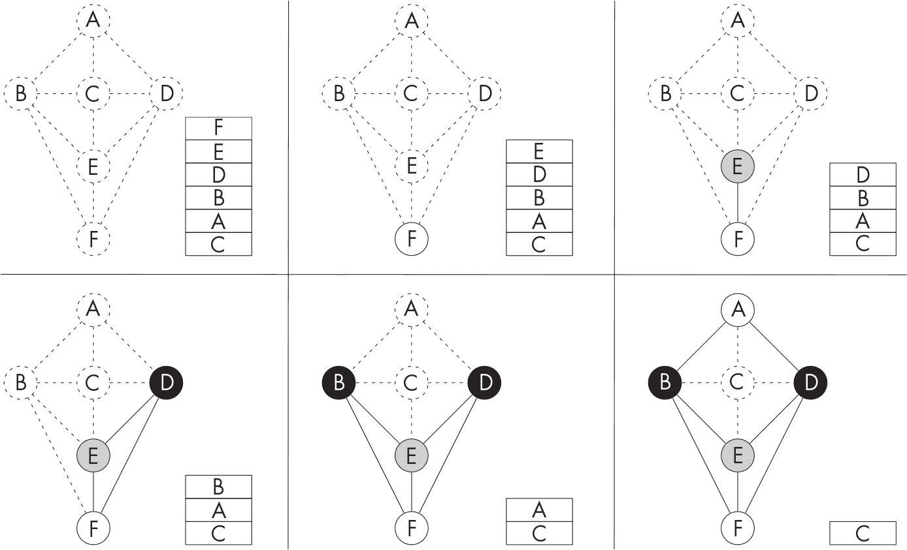

图 20-13：第一次尝试为图 20-12 上色 描述

当我们到达*C*时，我们会发现它的邻居已经使用了所有三种颜色，因此我们将被迫进行溢出。

现在让我们重复这个过程；这次我们将修剪*F*，然后是*E*，再然后是*D*。图 20-14 展示了当我们将节点重新放回图中时会发生什么。

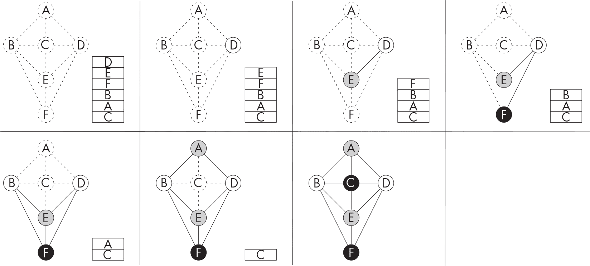

图 20-14：第二次尝试为图 20-12 上色 描述

这次，我们给*A*和*E*分配了相同的颜色，这使我们能够为*C*分配颜色，而不是溢出它。在像这样的简单例子中，我们很容易看到给这些节点分配相同颜色是更好的选择。但没有通用的规则可以让我们避免像图 20-13 中那样不必要的溢出；这就是这个算法近似的原因。如果我们使用精确算法，我们*可以*避免不必要的溢出，但正如我之前提到的，精确算法的成本太高，无法实际应用。

##### 实现图着色算法

现在我们已经通过一些例子使用了这个算法，接下来让我们看一下伪代码，伪代码显示在列表 20-24 中。

```
color_graph(g):
    remaining = `<unpruned nodes in g>`
  ❶ if remaining is empty:
        return

    // choose next node to prune
    chosen_node = null

    for node in remaining:
        degree = length(`<unpruned neighbors of node>`)
        if degree < k:
          ❷ chosen_node = node
            break

    if chosen_node is null:
        // choose a spill candidate
        best_spill_metric = infinity
        for node in remaining:
            degree = length(`<unpruned neighbors of node>`)
            spill_metric = node.spill_cost / degree
 if spill_metric < best_spill_metric:
              ❸ chosen_node = node
                best_spill_metric = spill_metric

    chosen_node.pruned = True

    // color the rest of the graph
  ❹ color_graph(g)

    // color this node
    colors = [1, 2, . . ., k]
    for neighbor_id in chosen_node.neighbors:
        neighbor = get_node_by_id(g, neighbor_id)
        if neighbor.color is not null:
            colors.remove(neighbor.color)

  ❺ if colors is not empty:
        if chosen_node is a callee-saved hard register:
            chosen_node.color = max(colors)
        else:
            chosen_node.color = min(colors)
        chosen_node.pruned = False

    return
```

列表 20-24：图着色算法

我们将递归地为图着色。在每一步中，我们将修剪一个节点，然后递归调用着色剩余的图，再把该节点放回并为其分配一个颜色。在基本情况下，我们已经修剪了所有节点，因此没有任何事情可做❶。

在递归情况下，我们首先选择一个节点进行修剪，这个列表中将其称为chosen_node。我们将选择第一个找到的、未修剪邻居数量少于*k*的节点❷。（如果你分配的是通用寄存器，*k*是 12；如果分配的是 XMM 寄存器，*k*是 14。）如果搜索结果为空，我们将选择具有最小*溢出成本/度数*值的节点❸。要修剪一个节点，我们只需要将它的pruned属性设置为True。然后，我们将递归调用color_graph来给图中的剩余节点着色❹。

在从递归调用返回后，我们将尝试为chosen_node分配颜色。我们将取出整数列表1到k，它们表示所有可能的颜色，并移除我们已经分配给chosen_node的邻居节点的颜色。chosen_node的某些邻居可能没有颜色，要么是因为我们将它们溢出，要么是因为在chosen_node之前我们就已经修剪了它们，因此我们将稍后为它们着色。我们可以忽略这些节点。

如果列表中还有剩余的颜色，我们将为chosen_node ❺分配其中一种颜色。如果有多种颜色可用，算法并不挑剔我们选择哪一种。尽管我们选择的颜色可能会影响最终溢出的节点数量，但这种影响是不可预测的；没有一种颜色选择策略能够在所有情况下最小化溢出。因此，我们将选择一种具有不同目标的颜色：将伪寄存器分配给调用者保存的硬寄存器，而不是被调用者保存的硬寄存器。（我们希望尽量少使用被调用者保存的寄存器，以避免保存和恢复它们的成本。）当chosen_node代表一个被调用者保存的硬寄存器时，我们将为它分配可用的最高编号的颜色。否则，我们将为它分配最低编号的可用颜色。通过这种策略，着色算法倾向于将更高编号的颜色分配给被调用者保存的寄存器，将较低编号的颜色分配给调用者保存的寄存器和伪寄存器。只有当没有较低编号的颜色可用时（例如，因与每个调用者保存的寄存器冲突），伪寄存器才会得到更高编号的颜色。一旦我们选择了颜色，就将pruned属性设置回False。虽然这不是绝对必要的，因为我们之后不会再使用这个属性，但它标记着我们已经将节点重新放回了图中。

如果列表中没有剩余的颜色，我们就得溢出chosen_node。具体来说，这意味着我们不会为它分配颜色。我们也不会更新它的pruned属性，因为我们不会把这个节点重新放回图中。请注意，我们并不会显式地将节点推入栈中或之后弹出它们。我们的递归算法自然地按照正确的顺序为节点着色，从我们修剪的最后一个节点开始。

#### 构建寄存器映射并重写函数体

一旦我们给图着色，剩下的寄存器分配过程就相对简单了。我们将构建一个从伪寄存器到硬寄存器的映射，利用这个映射来替换汇编代码中的伪寄存器。在构建这个映射的过程中，我们还将追踪已分配的被调用者保存寄存器，以便在指令修正阶段保存和恢复它们。Listing 20-25 展示了如何构建这个映射。

```
create_register_map(colored_graph):

    // build map from colors to hard registers
    color_map = `<empty map>`
    for node in colored_graph.nodes:
        match node.id with
        | Reg(r) ->
            color_map.add(node.color, r)
        | Pseudo(p) -> continue

    // build map from pseudoregisters to hard registers
    register_map = `<empty map>`
    callee_saved_regs = {}
    for node in colored_graph.nodes:
        match node.id with
        | Pseudo(p) ->
            if node.color is not null:
              ❶ hardreg = color_map.get(node.color)
                register_map.add(p, hardreg)
                if hardreg is callee saved:
                  ❷ callee_saved_regs.add(hardreg)
        | Reg(r) -> continue

 ❸ record_callee_saved_regs(`<current function name>`, callee_saved_regs)

    return register_map
```

Listing 20-25: 从伪寄存器到硬寄存器构建映射

首先，我们将遍历图中的硬寄存器，构建一个从颜色到硬寄存器的映射。请记住，我们将实现颜色和硬寄存器之间的 1:1 映射，因为每个*k*硬寄存器必须分配给*k*个可能颜色中的一个。接下来，我们将遍历所有的伪寄存器。如果一个伪寄存器被分配了颜色，我们将把它映射到与该颜色相同的硬寄存器，这可以在color_map中找到❶。如果一个伪寄存器没有被分配颜色，我们将不会将其添加到映射中。

在构建register_map的同时，我们还会跟踪该函数将使用的被调用者保存寄存器的集合。每当我们添加一个从伪寄存器到被调用者保存硬寄存器的映射时，我们就会将该硬寄存器添加到这个集合中❷。我们会记录每个函数的callee_saved_regs集合，以便将这些信息传递给指令修正阶段❸。（这个列表没有指定*在哪*记录这些信息；你可以将其添加到函数定义本身、后端符号表或其他数据结构中，具体取决于最方便的方式。）当我们分配 XMM 寄存器时可以跳过此步骤，因为 XMM 寄存器没有被调用者保存。

最后，我们将重写汇编代码。我们将用寄存器映射中的相应硬寄存器替换每条指令中的每个伪寄存器。如果某个伪寄存器不在映射中，我们将不替换它。同时，我们将删除任何源和目标寄存器相同的mov指令。例如，如果我们已经将tmp1和tmp2都映射到 EAX，我们可以重写

```
my_fun:
    movl    %edi, %tmp1
    addl    $5, %tmp1
  ❶ movl    %tmp1, %tmp2
  ❷ movl    %tmp2, %eax
    ret
```

如下所示：

```
my_fun:
    movl    %edi, %eax
    addl    $5, %eax
    ret
```

❶和❷都将被重写为movl %eax, %eax，这并不会做任何事情，因此我们可以将它们从最终的汇编程序中删除。

这个清理步骤是删除不必要的<code>mov</code>指令，它与寄存器合并相关，我们将在本章后面实现。但有一些重要的不同之处。寄存器合并步骤会故意合并通过<code>mov</code>连接的寄存器，例如<code>tmp1</code>和<code>tmp2</code>，然后删除它们之间的<code>mov</code>指令。这个过程会在我们着色图形之前完成。而我们在这里做的要简单得多；我们并不是试图合并寄存器，而是如果我们恰好将<code>mov</code>指令的两个操作数分配了相同的颜色，我们会利用这一点。

即使我们实现了寄存器合并，这个着色后清理步骤仍然是有用的。正如我们将看到的，寄存器合并过程并不完美；有时它会遗漏一对寄存器，这对寄存器如果合并的话会非常有帮助。如果我们足够幸运，给那对寄存器分配相同的颜色，那么这个最后的步骤仍然能够删除它们之间的<code>mov</code>指令。

到此为止，我们已经有了一个工作的寄存器分配器！我们只需要更新指令修复和代码生成过程，然后就可以进行测试。

### <b>使用被调用者保存的寄存器修复指令</b>

如果一个函数使用了任何被调用者保存的寄存器，我们需要在函数开始时保存它们的值，并在结束时恢复它们。我们通过将它们推入栈中，放在当前栈帧的其余部分之上来保存它们。例如，如果一个函数需要 16 个字节的栈空间用于局部变量，并且使用了 R12 和 R13 寄存器，我们将在函数体的最开始插入以下三条指令：

```
Binary(Sub, Quadword, Imm(16), Reg(SP))
Push(Reg(R12))
Push(Reg(R13))
```

初始的<code>Sub</code>指令分配当前的栈帧，就像前面的章节中一样。新的<code>Push</code>指令紧接在其后。（如果你跳过了第二部分，第一条指令将是<code>AllocateStack</code>，而不是<code>Sub</code>。）

在我们返回之前，我们通过将这些寄存器的值从栈中弹出，恢复它们的值。也就是说，我们会将此函数中的每条<code>Ret</code>指令重写为：

```
Pop(R13)
Pop(R12)
Ret
```

我们可以将被调用方保存的寄存器以任意顺序压入栈中，但我们始终需要以相反的顺序将其弹出，以确保每个寄存器恢复到其原始值。由于我们在代码生成过程中会添加函数尾部，我们将在恢复被调用方保存的寄存器后立即解除栈帧的分配：

```
popq    %r13
popq    %r12
movq    %rbp, %rsp
popq    %rbp
ret
```

我们还需要确保整个栈帧，包括我们保存到栈中的任何被调用方保存的寄存器的值，都保持 16 字节对齐。假设伪操作数替换阶段为特定函数分配了 20 字节的栈空间以存储局部变量。我们通常会从 RSP 减去 32 字节来保持正确的栈对齐。但是，如果该函数使用了单个被调用方保存的寄存器，我们应当首先从 RSP 减去 24 字节：

```
Binary(Sub, Quadword, Imm(24), Reg(SP))
Push(Reg(BX))
```

如果我们明确地从 RSP 减去 24 字节，再通过推送 RBX 再减去 8 字节，我们最终会总共减去 32 字节，因此栈会保持正确对齐。清单 20-26 演示了执行此复杂计算的一种方法。

```
calculate_stack_adjustment(bytes_for_locals, callee_saved_count):
    callee_saved_bytes = 8 * callee_saved_count
    total_stack_bytes = callee_saved_bytes + bytes_for_locals
  ❶ adjusted_stack_bytes = round_up(total_stack_bytes, 16)
  ❷ stack_adjustment = adjusted_stack_bytes - callee_saved_bytes
    return stack_adjustment
```

清单 20-26：考虑到被调用方保存寄存器的栈空间计算

在此清单中，bytes_for_locals是我们在伪操作数替换过程中分配的栈空间字节数，callee_saved_count是该函数使用的被调用方保存寄存器的数量。我们首先计算被调用方保存的值占用的字节数。然后，我们将这个值加到bytes_for_locals中，并四舍五入到最接近的 16 字节的倍数，以获得栈帧的总大小❶。从这个值向回计算，我们减去被调用方保存的值占用的字节数，从而得出我们需要明确从 RSP 中减去的字节数❷。

### 代码生成

最后，我们将更新代码生成阶段，以处理<sam class="SANS_TheSansMonoCd_W5Regular_11">pop指令和我们在本章中添加的所有新寄存器。像push一样，pop将始终使用 8 字节名称来表示寄存器。表 20-4 和表 20-5 描述了如何输出这些结构。（与早期章节中的大多数代码生成表格不同，我没有加粗新添加和改变的结构，因为这些结构都是新的。）有关本章末尾完整代码生成过程的总结，请参见附录 B，其中包括两组代码生成表格，用于第三部分：一组包含第二部分的特性，另一组则不包含。

表格 20-4： 格式化汇编指令

| 汇编指令 | 输出 |
| --- | --- |
| 弹出(寄存器) | popq <reg> |

表格 20-5： 格式化汇编操作数

| 汇编操作数 |  | 输出 |
| --- | --- | --- |
| 寄存器(BX) | 8 字节 | %rbx |
| 4 字节 | %ebx |
| 1 字节 | %bl |
| 寄存器(R12) | 8 字节 | %r12 |
| 4 字节 | %r12d |
| 1 字节 | %r12b |
| 寄存器(R13) | 8 字节 | %r13 |
| 4 字节 | %r13d |
| 1 字节 | %r13b |
| 寄存器(R14) | 8 字节 | %r14 |
| 4 字节 | %r14d |
| 1 字节 | %r14b |
| 寄存器(R15) | 8 字节 | %r15 |
| 4 字节 | %r15d |
| 1 字节 | %r15b |
| 寄存器(XMM8) |  | %xmm8 |
| Reg(XMM9) |  | %xmm9 |
| Reg(XMM10) |  | %xmm10 |
| Reg(XMM11) |  | %xmm11 |
| Reg(XMM12) |  | %xmm12 |
| Reg(XMM13) |  | %xmm13 |

现在你可以尝试在一些实际程序中使用你的寄存器分配器了！

### 寄存器合并

我们的寄存器分配器已经能正确工作。但正如我们在章节开始时的例子中看到的，如果我们加上一个合并步骤，它将生成更高效的代码。那个早期的例子还给我们提供了一个关于这个过程如何工作的总体印象：我们查看每条 mov 指令，该指令将一个值从一个寄存器复制到另一个寄存器，并决定是否合并源寄存器和目标寄存器。一旦做出这些决定，我们会重写汇编代码，替换掉合并后的寄存器，并删除那些不再需要的 mov 指令。

为了决定合并哪些寄存器，我们将参考干扰图。当满足两个条件时，我们将合并一对寄存器。第一个条件很明显：寄存器之间不能互相干扰。下面的 清单 20-13 例子再现了这个条件为何是必要的：

```
movl    $1, %y
movl    %y, %x
addl    $1, %y
addl    %x, %y
```

由于我们在 x 寄存器活跃时更新 y，这两个寄存器之间存在干扰。如果我们将它们合并，第一个 add 指令将覆盖 x，我们最终将计算出 2 + 2，而不是 1 + 2。

第二个条件更微妙：只有在不会迫使我们溢出更多寄存器的情况下，我们才会合并一对寄存器。为了理解为什么合并可能导致溢出，让我们看一下 清单 20-27。

```
f:
    movl    %edi, %arg
    movl    %arg, %tmp
    addl    $1, %tmp
    imull   %arg, %tmp
    movl    $10, %eax
    subl    %tmp, %eax
    ret
```

清单 20-27：一个合并寄存器会导致溢出的汇编函数

这个汇编函数计算 10 - (arg + 1) * arg。在这个例子中，我们假设只有 EDI 和 EAX 是可用的硬件寄存器，所以 *k* 是 2。 图 20-15 展示了此清单的干扰图，这个图显然是可以用 2 种颜色着色的。

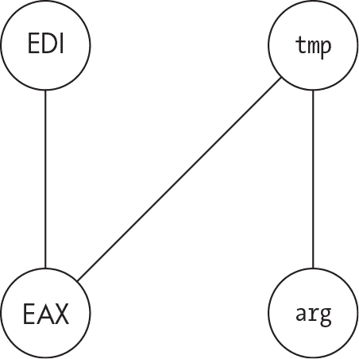

图 20-15: 清单 20-27 的干扰图 描述

在清单 20-27 中的第一个 mov 指令看起来是一个合并的候选项。（第二条指令不是，因为 arg 和 tmp 发生干扰。）但如果我们尝试将 arg 合并到 EDI 中，我们就会遇到问题。最终我们会得到清单 20-28 中的汇编代码。

```
f:
    movl    %edi, %tmp
    addl    $1, %tmp
    imull   %edi, %tmp
    movl    $10, %eax
    subl    %tmp, %eax
    ret
```

清单 20-28: 清单 20-27 合并 arg 到 EDI 后的代码

图 20-16 显示了这个合并代码的干扰图。

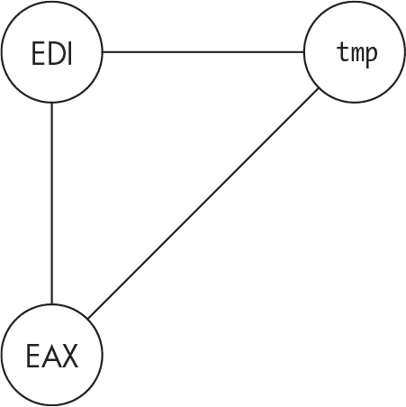

图 20-16: 清单 20-28 的干扰图 描述

现在我们无法再对这个图进行二色着色了。由于 tmp 与两个硬件寄存器发生干扰，我们必须将其溢出到内存中。我们没有提高性能，反而让情况更糟！将 tmp 溢出到内存的代价大于去除一条 mov 指令的好处。为了避免这种情况，我们将使用一种叫做 *保守合并* 的策略：只有在我们能提前知道不会使干扰图着色更困难的情况下，才会合并两个寄存器。但在深入讨论保守合并之前，我们需要先学习如何保持干扰图的更新。

#### 更新干扰图

每当我们决定合并一对寄存器时，都需要更新干扰图。否则，我们会基于错误的信息做出后续的合并决策。更新干扰图有两种方式。第一种是立即重写汇编代码，并从头开始重建干扰图。这个方法的问题在于，构建干扰图非常慢。我们可能在一个函数中合并几十个甚至上百个 mov 指令，但我们无法承受每次都重建干扰图。

更快的方法是直接在现有的干扰图中合并这两个节点，而不需要重新查看汇编代码。在图 20-17 中，我们使用这种方法将伪寄存器 tmp2 合并到 EAX 寄存器中。

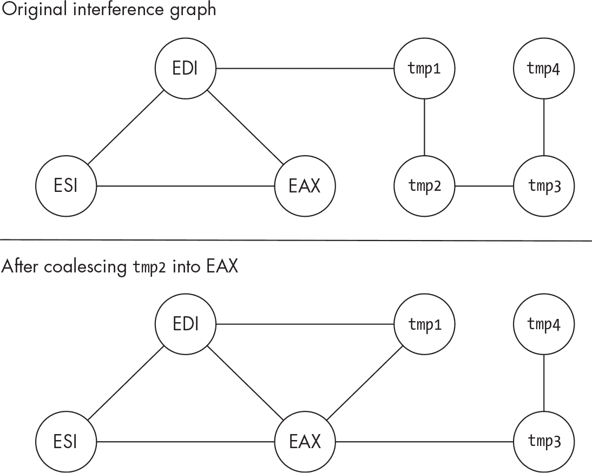

图 20-17：更新干扰图以反映合并决策 描述

我们假设原本与 tmp2 发生冲突的任何寄存器现在与 EAX 发生冲突。为了使干扰图反映这种变化，我们只需从每个 tmp2 的邻居添加一条边到 EAX，然后移除 tmp2。

但是，这种更新图形的方法也存在问题：它并不总是准确的！它可能会在不发生实际冲突的寄存器之间包含一些多余的边。列表 20-29 给出了一个稍显牵强的例子。

```
f:
    movl    %edi, %tmp1
    movl    %edi, %tmp2
    addl    %tmp1, %tmp2
    movl    %tmp2, %eax
    ret
```

列表 20-29：一个将其第一个参数复制到两个不同伪寄存器中的函数

请注意，tmp1 和 tmp2 发生了冲突：第二条 mov 指令在 tmp1 仍然处于活动状态时更新了 tmp2。让我们尝试将 tmp1 合并到 EDI 中，并使用我们快速、简便的方法相应地更新图形。图 20-18 显示了图形将如何变化。

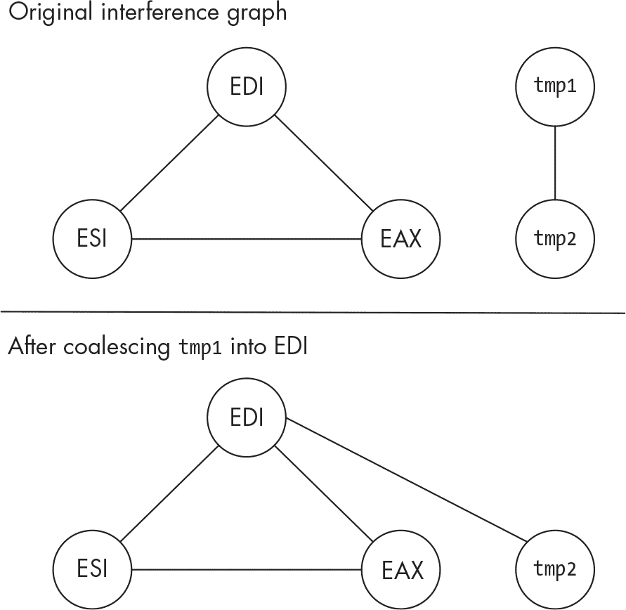

图 20-18：更新干扰图以反映 列表 20-29 描述

但是，当我们实际用 EDI 替换 tmp1 时，我们会发现与 tmp2 的冲突消失了！列表 20-30 显示了更新后的汇编代码。

```
f:
    movl    %edi, %tmp2
    addl    %edi, %tmp2
    movl    %tmp2, %eax
    ret
```

列表 20-30：列表 20-29 合并后 tmp1 合并到 EDI

我们之前学到，指令 mov src, dst 永远不会使 src 和 dst 发生冲突。最初，指令 movl %edi, %tmp2 导致了 tmp1 和 tmp2 之间的冲突。现在，我们将 tmp1 合并到 EDI 中，它不再引起冲突。

尽管它不完全准确，我们的快速更新方法仍然很有用。它产生了一个保守的真实干扰图近似；它包含了图中应该有的所有节点和边，但可能也有一些额外的边。如果这个图告诉我们两个寄存器可以安全合并，我们可以确信它们确实可以。但如果我们仅仅依赖这个方法，我们就会错过一些合并机会。例如，如果我们只查看图 20-18 中的图，我们就不会意识到可以将 `tmp2` 合并到 EDI 中。更糟糕的是，如果我们尝试为这个图着色，我们可能会不必要地溢出寄存器。

所以，我们将使用*两种*方法来更新图形。每次决定合并一对寄存器时，我们将通过合并它们的节点来快速更新。然后，在查看完每条 `mov` 指令并重写汇编代码之后，我们将从头重建图形。我们将重复这个构建-合并循环，直到找不到更多可以合并的寄存器。将一个快速、近似的内循环与一个缓慢、精确的外循环结合，使我们得到了两全其美的效果。我们将抓住每个合并机会，并将准确的干扰图传递到着色阶段，但我们不会在每次合并决策后都浪费时间重建图形。

#### 保守合并

现在我们已经理解了合并如何改变图形，我们可以推测它何时可能导致溢出。基本问题是，当我们合并两个节点时，合并后的节点将比原来任何一个节点的度数都高，这可能使得剪枝变得更加困难。它还可能比原来的任何节点都有更高的溢出成本，因为它被使用得更频繁。

我们将使用两个保守的合并测试，以确保合并后的节点在给图着色时不会造成问题。*Briggs 测试*保证我们不会溢出合并后的节点。*George 测试*保证我们不会溢出任何其他节点，除非它们在原始图中已经是潜在的溢出候选节点。只有当它们通过 Briggs 测试时，我们才会合并两个伪寄存器。如果两个寄存器通过任意一个测试，我们会将伪寄存器合并到硬寄存器中；在这种情况下我们可以更加宽松，因为我们已经知道硬寄存器不会溢出。两个测试都以发明它们的人的名字命名；你可以在第 669 页的“附加资源”中找到首次提出这些测试的论文链接。

值得明确的是，保守的合并测试保证的内容，因为这个结果有点反直觉。如果你能够在不选择任何溢出候选节点的情况下完全修剪原始图，那么这些测试保证合并后的图也将保持相同的情况。在这种情况下，我们可以确定，合并不会导致任何溢出。

但如果你无法完全修剪原始图，那么预测合并的影响就变得更加困难，因为选择溢出候选节点之后发生的很多事情都取决于运气。我们在本章早些时候看到过一个例子，当时我们尝试着为 图 20-12 着色；以不同的顺序修剪节点，决定了是否能够着色一个溢出候选节点，或者最终会导致溢出。合并寄存器也可能产生类似的连锁反应。如果我们不幸，这些效应可能导致一个原本可以避免的溢出。

换句话说，如果给原始图着色时需要我们选择一个溢出候选节点，那么在合并图时也可能需要这样做——而在那时，我们无法确定将会发生什么。在这种情况下，保守的合并测试仍然给我们提供了两个有价值的保证。首先，合并后的节点本身不会发生溢出。其次，在我们遇到困境并必须选择第一个溢出候选节点时，每个节点的度数都将与如果我们没有进行合并时遇到困境时的度数相同或更低。这意味着，从总体上看，我们可能成功地剪枝更多的节点，并且溢出较少的节点，而不进行合并的话，情况可能正好相反。

现在我们将更深入地研究布里格斯和乔治测试。我们将定义这两个测试，并通过一些例子来展示它们为什么有效。

##### 布里格斯测试

记住，如果一个节点有 *k* 个或更多邻居，那么它的度数就被认为是显著的。布里格斯测试允许我们合并两个节点，只要合并后的节点具有的显著度数少于 *k* 个邻居。当我们为图着色时，我们将能够修剪每个度数不显著的邻居。合并后的节点本身将拥有不显著的度数——它将剩下少于 *k* 个邻居——因此我们也可以修剪该节点。

让我们看一个例子。考虑 图 20-19 中的干扰图。

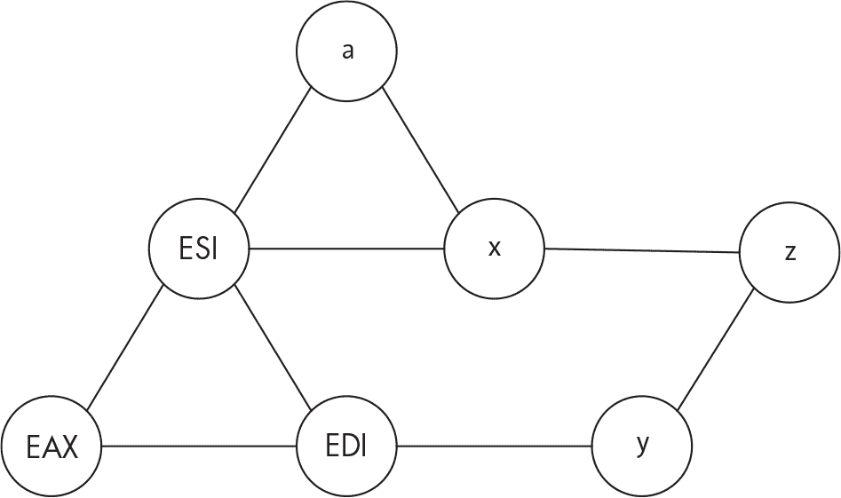

图 20-19：合并前的干扰图 描述

我们的着色算法可以毫不费力地修剪整个图。现在让我们应用布里格斯测试，看看能否将 x 合并到 y 中。图 20-20 展示了当我们合并这两个节点时图的样子。

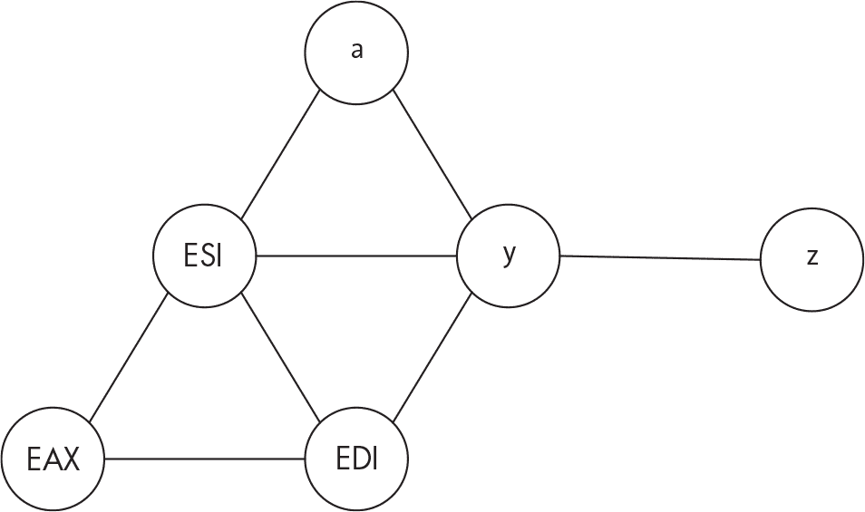

图 20-20：图 20-19 中的图，合并 x 到 y 后的结果 描述

合并后，y将有四个邻居：a、z、ESI 和 EDI。这些节点中只有两个，ESI 和 EDI，具有显著的度数。由于 *k* 为 3，这个例子通过了 Briggs 测试。实际上，在我们修剪了 a 和 z 后，我们将能够修剪 y，然后像之前那样完成图的其余部分的修剪。

接下来，让我们看看一个不符合 Briggs 测试的案例。图 20-21 中的图几乎与图 20-19 中的图完全相同，唯一的不同是从 a 到 EDI 的额外边。

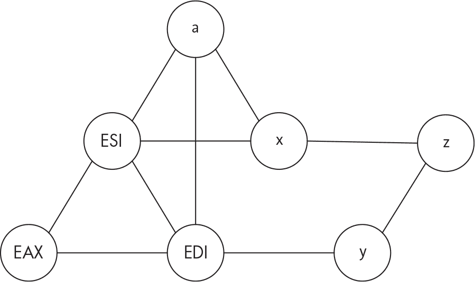

图 20-21：图 20-19 中的图，x 和 y 无法再合并 描述

即使有了这条额外的边，我们的着色算法仍然可以修剪整个图。但是图 20-22 展示了当我们将 x 合并到 y 时会发生什么。

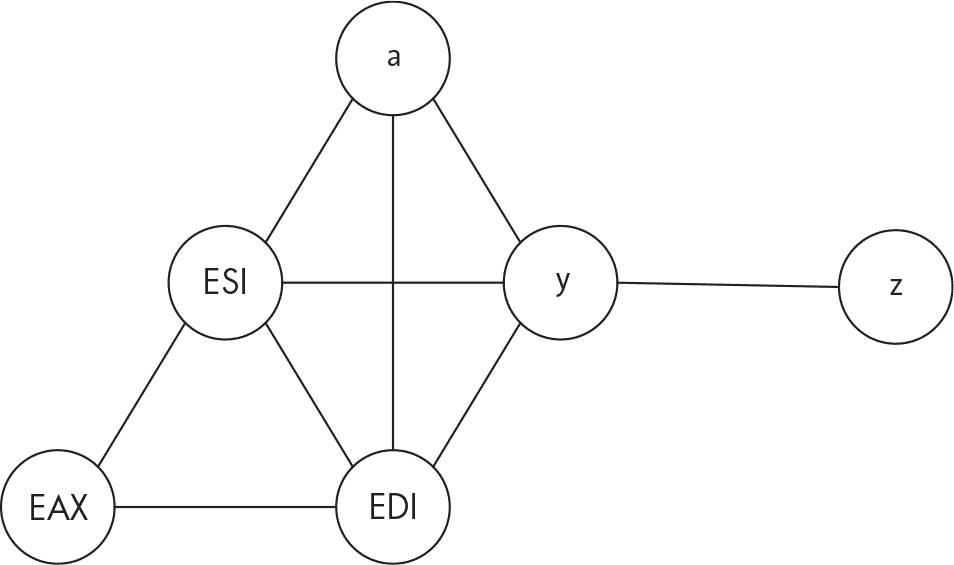

图 20-22：图 20-21 中的图，合并 x 到 y 后的结果 描述

现在，y有三个邻居，它们的度数很大：ESI、EDI 和 a。这个例子不符合 Briggs 测试，y确实无法修剪。在我们修剪了 z 和 EAX 后，我们会卡住，并且被迫选择 y 或 a 作为溢出候选节点。

正如这些例子所示，Briggs 测试阻止我们将一个可着色图转换为不可着色图。它还给我们提供了另一项保证：我们永远不会将两个节点合并在一起，如果合并后的节点可能会溢出。看看图 20-23。


图 20-23：一个干扰图，我们无法将 tmp1 和 tmp2 合并 描述

假设我们想将 tmp2 合并到 tmp1 中。这显然不会让图变得更难着色；它对干扰图的影响与完全移除 tmp2 相同。但是合并这些节点有一个不好的原因。无论我们是否将其与 tmp2 合并，我们都无法给 tmp1 着色，所以合并只会通过增加 tmp1 的溢出成本来使事情变得更糟。

这个例子未通过布里格斯测试，因为合并后 tmp1 会有三个重要度较高的邻居（就像合并前一样）。如果我们可能无法给它着色，布里格斯测试将不允许我们进行合并。

最后，让我们调整这个例子，说明布里格斯测试的一个局限性。假设我们想将 tmp2 合并到 EDI，而不是 tmp1。像我们之前的例子一样，这不会让图变得更难着色。这个例子也未通过布里格斯测试，因为 EDI 会有三个重要度较高的邻居。但有一个重要的区别：作为硬寄存器，EDI 不能溢出。这意味着将 tmp2 合并到 EDI 没有什么坏处；它不会迫使我们溢出 EDI，也不会使其他节点变得更难着色。在这种情况下，我们将使用乔治测试来找到布里格斯测试忽略的合并机会。

##### 乔治测试

当我们将伪寄存器与硬寄存器合并时，我们知道合并后的寄存器不能溢出。相反，我们担心的是稍微不同的结果：如果硬寄存器变得更难修剪，它的邻居也可能变得更难修剪。最终，这种变化可能会迫使我们溢出那些之前能够着色的节点。在涉及硬寄存器的情况下，我们将同时使用布里格斯测试和乔治测试，以尽可能多地识别合并机会。布里格斯测试证明我们可以修剪合并后的节点，因此它不会干扰着色其他节点的尝试。乔治测试证明即使我们无法修剪合并后的节点，我们也不会使合并节点的邻居变得更难修剪（因此不会使这些节点或图的其余部分变得更难着色）。我们可以合并通过这两个测试中的任意一个测试的节点对。

乔治测试表示，如果 *p* 的每个邻居都满足以下两个条件中的任意一个，那么你可以将伪寄存器 *p* 合并到硬寄存器 *h* 中：

1.  它的邻居少于 *k* 个。

1.  它已经与 *h* 有干扰。

如果一个邻居满足第一个条件，那么在我们为图着色时，肯定能对其进行修剪。如果它满足第二个条件，在合并后它的邻居将和之前完全一样（除了*p*），因此我们并没有让修剪变得更难；如果有的话，反而可能会让修剪变得更容易。

合并*h*和*p*也不会让*h*的邻居变得更难修剪。唯一可能会这样做的方式是阻止我们修剪*h*本身，但任何通过合并得到的*h*的新邻居都将具有微不足道的度，因此不会影响我们修剪它的能力。

让我们再看一遍图 20-23 中的图表，看看为什么这样做有效：

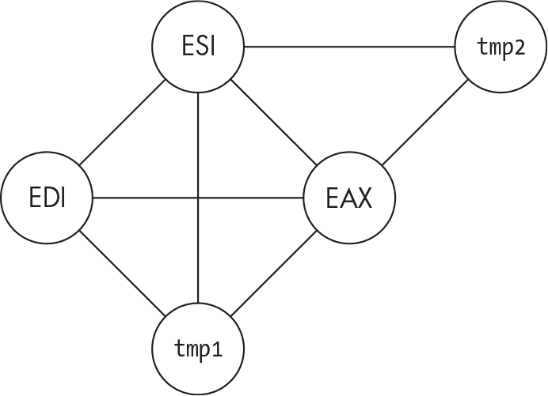

之前，我们决定将tmp2合并到 EDI 是安全的，因为 EDI 无法溢出，并且这个变化不会让其他节点变得更难着色。但我们也看到这个情况没有通过布里格斯测试，因为 EDI 那时将有三个具有显著度的邻居。现在我们将改用乔治测试。这个测试会通过，因为tmp2的两个邻居已经与 EDI 发生干扰。我们的分配器将把tmp2合并到 EDI，因为它合并通过我们两个测试的所有移动操作。

对于我们的最后一个例子，让我们重新审视图 20-15 中的图表：

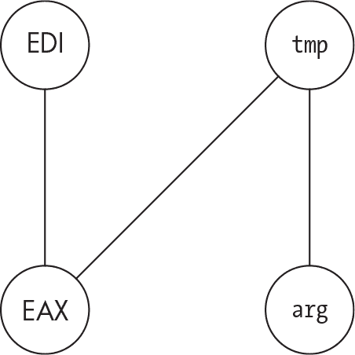

上次我们查看这个图表时，我们在考虑是否将arg合并到 EDI 中。现在我们知道我们不应该合并它们，因为这个情况没有通过我们的两个测试。它没有通过布里格斯测试，因为合并后的节点将有两个具有显著度的邻居，tmp和 EAX。它也没有通过乔治测试；arg的一个邻居，tmp，具有显著度，并且不会干扰 EDI。乔治测试告诉我们，如果我们进行这个变化，tmp*可能*会变得更难着色；我们会让它干扰到另一个寄存器，而我们无法预知这样会产生什么影响。在这个小例子中，通过查看图表，我们可以看出，如果我们将arg合并到 EDI 中，tmp实际上会变得更难着色，因为它会干扰到两个硬寄存器。

关于乔治测试，有一个不太美观的细节我想提一下。记得我们在每次合并决策后使用一种快速的近似方法来更新图形吗？这种近似方法可能会在寄存器之间留下实际上并不干扰的边。因此，当我们将乔治测试应用于寄存器*p*和*h*时，我们可能会误以为*p*的某个邻居*n*也与*h*干扰，尽管实际上并没有。接着我们可能会错误地得出结论，认为*p*和*h*通过了乔治测试并将它们合并。

听起来很糟糕，但它仅稍微削弱了乔治测试提供的保证。之前我提到过，乔治测试保证我们不会让合并节点的邻居变得更难修剪。实际上，它保证我们不会让它们比*我们开始当前合并轮次之前*更难修剪——也就是说，最后一次我们从头重建干扰图时的状态。

这个较弱的保证依然成立，因为我们的近似图会在*n*和*h*之间仅包含一条边，当且仅当*n*在我们构建干扰图时确实与*h*干扰，但某个早期的合并决策移除了这种干扰。本质上，如果某个早期的合并决策通过移除它们之间的边使得*n*或*h*更容易修剪，我们可能会因为再次添加这条边而意外地使它们更难修剪。然而，我们永远不会让事情变得比当前合并轮次之前更糟。（还值得记住的是，布里格斯和乔治测试的目的是提高性能，而*不是*保证正确性；即使是一个失败了这两个测试的“不好”合并决策，也不会改变程序的可观察行为。）

我们已经看过了两种保守的合并测试，它们提供了哪些保证，以及它们为何有效。现在我们只需要实现它们。

#### 实现寄存器合并

我们的第一步是将构建合并循环添加到顶层寄存器分配算法中。列表 20-31 给出了更新后的算法，新增部分以粗体标出。

```
allocate_registers(instructions):
 **while True:**
 **interference_graph = build_graph(instructions)**
 **coalesced_regs = coalesce(interference_graph, instructions)**
 **if nothing_was_coalesced(coalesced_regs):**
 **break**
 **instructions = rewrite_coalesced(instructions, coalesced_regs)**
    add_spill_costs(interference_graph, instructions)
    color_graph(interference_graph)
    register_map = create_register_map(interference_graph)
    transformed_instructions = replace_pseudoregs(instructions, register_map)
    return transformed_instructions
```

列表 20-31：将寄存器合并添加到顶层寄存器分配算法中

在这个循环中，我们构建干扰图，然后寻找需要合并的寄存器。如果找到，我们会重写汇编代码并重新开始整个过程。否则，我们退出循环，按照正常方式运行分配器的其余部分。

我们在coalesced_regs中记录了我们已经合并在一起的寄存器，这是一种*不相交集合*数据结构。让我们编写一个简单的实现，然后定义< samp class="SANS_TheSansMonoCd_W5Regular_11">coalesce和rewrite_coalesced函数。

##### 不相交集合

顾名思义，不相交集合数据结构表示多个不相交的值集合。每个集合由一个代表元素标识。不相交集合支持两个操作：union 合并两个集合，find 查找集合的代表元素。在我们的案例中，每个集合中的值是 Reg 和 Pseudo 操作数。最初，每个寄存器都在自己的集合中。当我们合并寄存器时，我们将使用 union 操作将这些集合合并在一起。当我们重写汇编代码时，我们将使用 find 将每个寄存器替换为其集合的代表元素。

实现不相交集合有几种不同的方法。我们将使用一种简单的实现，易于理解。清单 20-32 定义了我们的实现。

```
init_disjoint_sets():
  ❶ return `<empty map>`

union(x, y, reg_map):
  ❷ reg_map.add(x, y)

find(r, reg_map):
  ❸ if r is in reg_map:
        result = reg_map.get(r)
      ❹ return find(result, reg_map)
    return r

nothing_was_coalesced(reg_map):
  ❺ if reg_map is empty:
        return True
    return False
```

清单 20-32：不相交集合的基本实现

我们使用一个映射来跟踪哪些集合已经合并在一起。最初，这个映射是空的 ❶。为了合并两个代表元素分别为 x 和 y 的集合，union 操作将从 x 到 y 插入一个映射 ❷。这使得 y 成为新集合的代表元素。当我们将伪寄存器合并到硬寄存器时，重要的是要使硬寄存器成为集合的代表元素；我们不希望在稍后重写代码时将硬寄存器替换为伪寄存器。

为了查找包含寄存器 r 的集合的代表成员，find 操作首先检查 r 是否映射到其他寄存器 ❸。如果没有，r 本身就是其集合的代表成员，我们就返回它。否则，查找映射会得到 result，这就是我们之前合并 r 到的寄存器。然后我们递归地调用 find ❹，这将引导我们沿着从 r 到其代表成员的映射链。例如，如果我们将 a 合并到 b，然后将 b 合并到 c，我们将按照 a 到 b 到 c 的映射关系，确定 c 是 a 的代表成员。

在这个列表中我们定义的最后一个操作是 nothing_was_coalesced，它只是检查映射是否为空 ❺。

##### coalesce 函数

coalesce 函数将检查汇编代码中的每条 mov 指令，决定哪些寄存器需要合并，并在我们刚刚定义的不相交集合结构中跟踪这些决策。让我们通过 Listing 20-33 来逐步了解，这个列表给出了该函数的伪代码。

```
coalesce(graph, instructions):
    coalesced_regs = init_disjoint_sets()

    for i in instructions:
        match i with
        | Mov(src, dst) ->
          ❶ src = find(src, coalesced_regs)
            dst = find(dst, coalesced_regs)

          ❷ if (src is in graph
                and dst is in graph
                and src != dst
              ❸ and (not are_neighbors(graph, src, dst))
              ❹ and conservative_coalesceable(graph, src, dst)):

                if src is a hard register:
                    to_keep = src
                    to_merge = dst
                else:
                    to_keep = dst
                    to_merge = src

              ❺ union(to_merge, to_keep, coalesced_regs)
                update_graph(graph, to_merge, to_keep)

        | _ -> continue

    return coalesced_regs
```

Listing 20-33: 决定哪些寄存器需要合并

我们首先初始化一个新的不相交集结构coalesced_regs，用于跟踪我们已经合并的寄存器。然后，我们遍历指令列表。当我们遇到一个Mov指令时，我们使用find查找它当前的源操作数和目标操作数❶，因为我们可能已经将src和dst合并到了其他寄存器。请注意，这些操作数可能是常量或内存地址，而不是寄存器。这样是可以的；如果x在coalesced_regs中没有映射，find(x, coalesced_regs)将直接返回x，无论<x>是否是寄存器或其他类型的操作数。

接下来，我们决定是否将指令的源操作数和目标操作数合并❷。首先，我们检查它们是否都在干扰图中。（这可以防止我们尝试合并常量或内存操作数。）然后，我们确保它们是两个不同的寄存器，因为没有理由将寄存器与自身合并。如果这些检查通过，我们将测试之前学习的两个条件：src和dst必须没有干扰❸，并且合并它们不能使图的着色变得更加困难❹。我们用conservative_coalesceable函数来检查第二个条件，稍后我们会详细介绍这个函数。

如果src和dst满足所有这些条件，我们将合并它们！现在我们需要决定在汇编代码中保留哪一个，替换哪一个。如果其中一个操作数是硬寄存器，我们将保留那个并替换另一个。如果它们都是伪寄存器，我们将任意选择保留dst。我们调用union来实际合并这些寄存器❺，然后更新干扰图。列表 20-34 定义了执行此更新的函数。

```
update_graph(graph, x, y):

    node_to_remove = get_node_by_id(graph, x)
    for neighbor in node_to_remove.neighbors:
        add_edge(graph, y, neighbor)
        remove_edge(graph, x, neighbor)

    remove_node_by_id(graph, x)
```

列表 20-34：更新干扰图

该函数处理每个 x 的邻居，移除它与 x 之间的边，并添加一条连接到 y 的边。然后，它会从图中移除 x。

##### conservative_coalesceable 函数

现在其余的 coalesce 已经就位，让我们来看一下 清单 20-35，它定义了保守合并测试。

```
conservative_coalesceable(graph, src, dst):
  ❶ if briggs_test(graph, src, dst):
        return True
  ❷ if src is a hard register:
        return george_test(graph, src, dst)
    if dst is a hard register:
        return george_test(graph, dst, src)
    return False

briggs_test(graph, x, y):
    significant_neighbors = 0

    x_node = get_node_by_id(graph, x)
    y_node = get_node_by_id(graph, y)

    combined_neighbors = set(x_node.neighbors)
    combined_neighbors.add_all(y_node.neighbors)
    for n in combined_neighbors:
        neighbor_node = get_node_by_id(graph, n)
 ❸ degree = length(neighbor_node.neighbors)
        if are_neighbors(graph, n, x) and are_neighbors(graph, n, y):
          ❹ degree -= 1
        if degree >= k:
            significant_neighbors += 1

  ❺ return (significant_neighbors < k)

george_test(graph, hardreg, pseudoreg):
    pseudo_node = get_node_by_id(graph, pseudoreg)
    for n in pseudo_node.neighbors:
      ❻ if are_neighbors(graph, n, hardreg):
            continue

        neighbor_node = get_node_by_id(graph, n)
      ❼ if length(neighbor_node.neighbors) < k:
            continue

        return False
    return True
```

清单 20-35：保守合并测试

在 conservative_coalesceable 中，我们首先尝试布里格斯测试 ❶。然后，如果布里格斯测试失败，并且 src 或 dst 是硬寄存器，我们就尝试乔治测试 ❷。当我们使用乔治测试时，我们将确保将硬寄存器作为第一个参数传递，将伪寄存器作为第二个参数，因为该测试不会把这些寄存器视为可以互换的。

为了应用布里格斯测试，我们首先构造 combined_neighbors，它是与 x 或 y 发生冲突的节点集合。然后，我们遍历这个集合，查找每个邻居的度数 ❸。如果某个节点与它们两个都有冲突，那么合并 x 和 y 会使该节点的度数减少 1，因此我们会相应地调整 degree ❹。如果 combined_neighbors 中少于 *k* 个节点具有显著的度数 ❺，我们将返回 True。

为了应用乔治测试，我们遍历伪寄存器的邻居，确保每个邻居要么与硬寄存器有冲突 ❻，要么具有微不足道的度数 ❼。如果我们找到一个不满足任何条件的邻居，我们将返回 False。如果每个邻居都满足这两个条件，我们将返回 True。

##### rewrite_coalesced 函数

我们将通过重写汇编代码来结束。 清单 20-36 给出了这一步骤的伪代码。

```
rewrite_coalesced(instructions, coalesced_regs):
    new_instructions = []
    for i in instructions:
        match i with
        | Mov(src, dst) ->
            src = find(src, coalesced_regs)
            dst = find(dst, coalesced_regs)
 ❶ if src != dst:
                new_instructions.append(Mov(src, dst))
        | Binary(op, src, dst) ->
            src = find(src, coalesced_regs)
            dst = find(dst, coalesced_regs)
            new_instructions.append(Binary(op, src, dst))
        | `--snip--`

    return new_instructions
```

清单 20-36：在决定合并哪些寄存器后重写指令

我们使用find操作来替换每条指令中的每个操作数。（在这里，像在coalesce中一样，我们依赖find来正确处理非寄存器。）如果一个Mov指令的更新源和目标相同，我们将从重写的代码中省略该指令❶。作为副作用，这也会移除那些在寄存器合并前就已经冗余的Mov指令。

就这样，你完成了你的寄存器分配器！我们不需要更改其他阶段，所以你可以开始测试它了。

### 总结

在本章中，你构建了一个寄存器分配器。你使用了你已经学到的关于生存性分析的知识，构建了一个干扰图，然后实现了一个经典的图着色算法来对其着色。你引入了被调用保存寄存器，并学会了如何保存和恢复它们。接着，你使用寄存器合并清理了编译器早期阶段留下的杂乱。你已经写完了最后的优化，并完成了这个项目！

在本书的过程中，你已经构建了一款令人印象深刻的软件：一个优化编译器，能够处理 C 语言的一个重要部分。你已经涵盖了大量内容，从 C 标准的复杂性到 System V 调用约定的细节，再到数据流分析的基础知识。但如果你想进一步提升你的编译器，你有很多选择。我将以一些关于接下来可以进行的工作的建议来结束本书的这一部分。

### 附加资源

本章中你构建的寄存器分配器使用了经典的*Chaitin-Briggs 算法*的简化版本。本节告诉你在哪里可以找到有关该算法的原始论文，几章以更易理解的方式呈现这些内容的教科书章节，以及一些关于更具体主题的其他有用参考资料。

**关键论文**

+   “通过着色进行寄存器分配”，是 Gregory Chaitin 等人在 1981 年发表的论文，描述了原始的图着色寄存器分配器(*[`<wbr>doi<wbr>.org<wbr>/10<wbr>.1016<wbr>/0096<wbr>-0551(81)90048<wbr>-5`](https://doi.org/10.1016/0096-0551(81)90048-5)*)。它介绍了本章中的大部分基本概念，包括如何构建和着色干扰图。

+   Chaitin 于 1982 年发布了对同一分配器的更新描述，“通过图着色进行寄存器分配与溢出”(*[`<wbr>doi<wbr>.org<wbr>/10<wbr>.1145<wbr>/872726<wbr>.806984`](https://doi.org/10.1145/872726.806984)*)。

+   “图着色寄存器分配的改进”是 Preston Briggs、Keith Cooper 和 Linda Torczon 于 1994 年发表的一篇论文，描述了 Chaitin 设计的改进版本 (*[`doi.org/10.1145/177492.177575`](https://doi.org/10.1145/177492.177575)*)。*Chaitin-Briggs* 这个名字指的就是这种改进后的算法。本文提出了一种将溢出候选项放到栈上并尝试稍后着色，而不是立即溢出的技术。（Briggs 等人称这种技术为*乐观着色*。）它还引入了 Briggs 测试和保守合并的概念；Chaitin 的原始设计即使在使图变得更难着色时也会进行激进的合并。本文还描述了一些我们在这一章中没有涉及的技术，比如重新材料化技术。

**教科书章节**

+   Steven Muchnick 的《*高级编译器设计与实现*》第十六章（Morgan Kaufmann，1997 年）介绍了一种类似于 Chaitin-Briggs 的寄存器分配器。最显著的区别在于它没有使用保守合并；与 Chaitin 的原始分配器一样，它进行了激进的合并。我发现 Muchnick 关于如何在干扰图中包含硬寄存器、如何检测干扰以及分配器的整体结构的解释尤其有用。

+   Keith Cooper 和 Linda Torczon 的《*工程化编译器*》第十三章（第二版，Morgan Kaufmann，2011 年）对多种寄存器分配方法进行了出色的概述，其中包括 Chaitin-Briggs 算法以及一些我们在这里未讨论的其他方法。我参考了他们对干扰的定义，以及他们讨论的在合并过程中如何更新干扰图的内容；他们特别清楚地解释了为何需要同时进行快速但不精确的更新和缓慢但完全的更新。（你也可以参考该书的第三版，2022 年出版。）

> 注

*如果你想实现我们跳过的 Chaitin-Briggs 部分，这两本资源都非常有用。如果你想将溢出代码生成集成到你的寄存器分配器中，Muchnick 的章节尤其有用。这两本书都讨论了如何使用活动区间（Muchnick 称之为*webs*）而不是伪寄存器作为干扰图中的节点，并且它们提供了比我们使用的溢出成本度量更好的方法。*

**保守合并**

+   George 测试来源于 Lal George 和 Andrew Appel 的论文“迭代寄存器合并”（*[`doi.org/10.1145/229542.229546`](https://doi.org/10.1145/229542.229546)*)。论文的主要观点是，如果你在合并和修剪之间交替进行，就能合并更多的寄存器；George 测试作为一个次要的实现细节进行了介绍。

+   关于 George 和 Briggs 测试的非正式讨论以及大量实例，见 Phillip Gibbons 在卡内基梅隆大学编译优化课程中的幻灯片 (*[`www.cs.cmu.edu/afs/cs/academic/class/15745-s19/www/lectures/L23-Register-Coalescing.pdf`](https://www.cs.cmu.edu/afs/cs/academic/class/15745-s19/www/lectures/L23-Register-Coalescing.pdf)*)。

+   Max Hailperin 的《比较保守合并标准》严谨地定义了 Briggs 和 George 测试实际证明了什么，而这是原始论文的作者们从未费心做过的事情 (*[`doi.org/10.1145/1065887.1065894`](https://doi.org/10.1145/1065887.1065894)*)。我在《保守合并》一文开头关于这些测试所保证内容的讨论，主要依赖于 Hailperin 的论文。请注意，他的某些主张不适用于我们的图着色实现，因为他使用了预着色，而我们没有。

**识别循环**

要计算更准确的溢出成本，你需要检测程序中的循环。这些资源讲述了如何识别循环：

+   *编译器：原理、技术与工具*（第 2 版），Alfred Aho 等人著，章节 9，第六部分（Addison-Wesley，2006 年）。

+   Phillip Gibbons 关于归纳变量优化的讲座幻灯片，来自他在卡内基梅隆大学的编译优化课程 (*[`www.cs.cmu.edu/afs/cs/academic/class/15745-s19/www/lectures/L8-Induction-Variables.pdf`](https://www.cs.cmu.edu/afs/cs/academic/class/15745-s19/www/lectures/L8-Induction-Variables.pdf)*)。这是一个很好的起点，但这些幻灯片的细节不够丰富，无法单独作为循环分析的指南。你可能需要将它们与前述参考资料或其他教科书一起使用。
