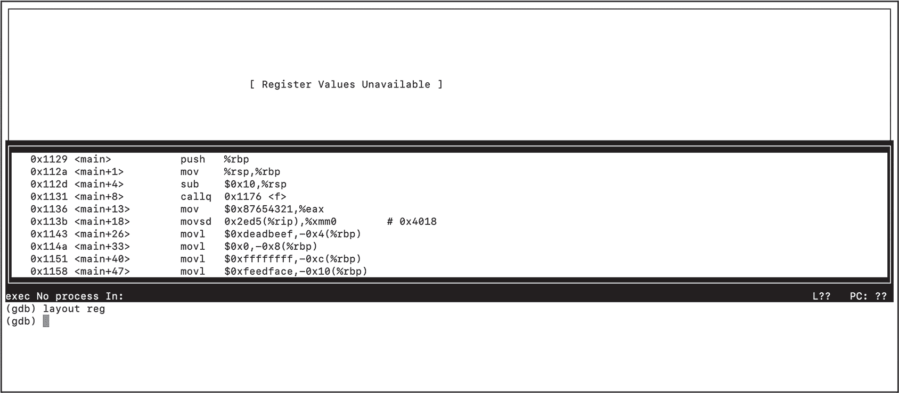
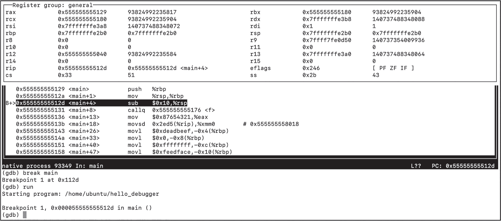

<hgroup>

## <samp class="SANS_Futura_Std_Bold_Condensed_B_11">A</samp> <samp class="SANS_Dogma_OT_Bold_B_11">使用 GDB 或 LLDB 调试汇编代码</samp>

</hgroup>


在某个时刻，你的编译器可能会生成不正确行为的汇编代码，这时你需要找出原因。当发生这种情况时，命令行调试器对于理解问题所在至关重要。调试器可以让你暂停运行中的程序，逐条执行指令，并在不同的时刻检查程序状态。你可以使用 GDB（GNU 调试器）或 LLDB（LLVM 项目的调试器）来调试编译器生成的汇编代码。如果你使用的是 Linux，建议使用 GDB；如果你使用的是 macOS，则建议使用 LLDB（我认为 GDB 在处理汇编时的 UI 略好，但在 macOS 上运行它可能会有些挑战）。

本附录是一个简短的指南，介绍如何使用 GDB 或 LLDB 调试汇编程序。它介绍了如果你以前没有使用过调试器，你需要了解的基础知识。它还涵盖了调试汇编代码时你需要使用的最重要命令和选项，即使你已经熟悉使用这些工具调试源代码，某些命令的细节可能对你来说是新的。我为这两个调试器分别提供了单独的操作流程；尽管它们具有非常相似的功能，但许多命令的细节是不同的。请根据你使用的调试器，遵循相应的操作流程。

在开始之前，你应该熟悉第一章和第二章中涵盖的汇编代码基础知识。后续章节中的一些汇编内容也会涉及，但如果你还没有学习到那些内容，可以暂时跳过。

## <samp class="SANS_Futura_Std_Bold_B_11">程序</samp>

我们将使用清单 A-1 中的汇编程序作为示例进行演示。

```
 .data
    .align 4
❶ integer:
    .long 100
    .align 8
❷ dbl:
    .double 3.5
    .text
    .globl main
❸ main:
    pushq   %rbp
    movq    %rsp, %rbp
    subq    $16, %rsp
    # call a function
 ❹ callq   f
 ❺ # put some stuff in registers
    movl    $0x87654321, %eax
    movsd   dbl(%rip), %xmm0
    # put some stuff on the stack
    movl    $0xdeadbeef, -4(%rbp)
    movl    $0, -8(%rbp)
    movl    $-1, -12(%rbp)
    movl    $0xfeedface, -16(%rbp)
 ❻ # initialize loop counter
    movl    $25, %ecx
.L_loop_start:
    # decrement counter
    subl    $1, %ecx
    cmpl    $0, %ecx
    # jump back to start of loop
    jne     .L_loop_start
    # return 0
    movl    $0, %eax
 movq    %rbp, %rsp
    popq    %rbp
    ret
    .text
    .globl  f
f:
    movl    $1, %eax
    ret
    .section .note.GNU-stack,"",@progbits
```

<samp class="SANS_Futura_Std_Book_Oblique_I_11">清单 A-1：一个无意义的汇编程序</samp>

这个程序没有做任何有用的事情，它只是给我们提供了一个机会来尝试调试器的最重要功能。它包括几个静态变量，供我们检查：<samp class="SANS_TheSansMonoCd_W5Regular_11">integer</samp> ❶ 和 <samp class="SANS_TheSansMonoCd_W5Regular_11">dbl</samp> ❷。在 <samp class="SANS_TheSansMonoCd_W5Regular_11">main</samp> ❸ 中，首先调用了一个非常小的函数 <samp class="SANS_TheSansMonoCd_W5Regular_11">f</samp>，这样我们就可以练习进入和退出函数调用 ❹，然后将一些数据移动到寄存器和栈中，以便我们可以练习检查程序状态 ❺。程序最后包含一个循环，每次迭代都会递减 ECX，直到它达到 0 ❻。我们将利用这个循环来练习设置条件断点。

从 *[`<wbr>norasandler<wbr>.com<wbr>/book<wbr>/#appendix<wbr>-a`](https://norasandler.com/book/#appendix-a)* 下载该程序，然后将其保存为 *hello_debugger.s*。该文件有两个不同版本，分别适用于 Linux 和 macOS，因此请确保选择适合您操作系统的版本。

保存文件后，组装并链接它，并确认它是否能够运行：

```
$ **gcc hello_debugger.s -o hello_debugger**
$ **./hello_debugger**
```

在 macOS 上，组装并链接文件时，请包含 <samp class="SANS_TheSansMonoCd_W5Regular_11">-g</samp> 选项：

```
$ **gcc -g hello_debugger.s -o hello_debugger**
```

<samp class="SANS_TheSansMonoCd_W5Regular_11">-g</samp> 选项会生成额外的调试信息。确保在组装和链接您自己的编译器汇编输出时也包含此选项以便调试。

现在，您可以开始逐步讲解。如果您使用 GDB，请按照下一部分的说明进行操作。如果您使用 LLDB，请跳转到 第 687 页的“使用 LLDB 调试”部分。

## <samp class="SANS_Futura_Std_Bold_B_11">使用 GDB 调试</samp>

运行以下命令启动 GDB：

```
$ **gdb hello_debugger**
`--snip--`
(gdb)
```

这将设置 <samp class="SANS_TheSansMonoCd_W5Regular_11">hello_debugger</samp> 为要调试的可执行文件，但并不实际执行它。在开始运行此可执行文件之前，我们来配置 UI，以便更方便地处理汇编代码。

### <samp class="SANS_Futura_Std_Bold_Condensed_Oblique_BI_11">配置 GDB UI</samp>

在 GDB 会话期间，您可以打开不同的文本窗口，以显示运行程序的不同信息。对于我们的目的来说，最重要的是 *汇编窗口*，它会在我们逐步执行时显示汇编代码。*寄存器窗口* 也很有用；默认情况下，它显示每个通用寄存器的当前内容。

<samp class="SANS_TheSansMonoCd_W5Regular_11">layout</samp> 命令控制哪些窗口是可见的。让我们打开汇编窗口和寄存器窗口：

```
(gdb) **layout asm**
(gdb) **layout reg**
```

现在，您应该能在终端中看到三个窗口：寄存器窗口、汇编窗口和带有 <samp class="SANS_TheSansMonoCd_W5Regular_11">(gdb)</samp> 提示符的命令窗口。它应该类似于 图 A-1。



<samp class="SANS_Futura_Std_Book_Oblique_I_11">图 A-1：一个 GDB 会话，打开了汇编窗口和寄存器窗口 描述</samp>

在启动程序之前，寄存器窗口不会显示任何信息。

您可以在当前聚焦的窗口中滚动。使用 <samp class="SANS_TheSansMonoCd_W5Regular_11">focus</samp> 命令来更改聚焦窗口：

```
(gdb) **focus cmd**
(gdb) **focus asm**
(gdb) **focus regs**
```

### <samp class="SANS_Futura_Std_Bold_Condensed_Oblique_BI_11">启动与停止程序</samp>

接下来，我们将设置一个 *断点*—即调试器暂停程序执行的位置—并运行程序直到该断点。如果我们在未设置断点的情况下启动程序，它将直接执行到底部，这样不太有用。

命令 <samp class="SANS_TheSansMonoCd_W5Regular_11">break <</samp><samp class="SANS_TheSansMonoCd_W5Regular_Italic_I_11">function name></samp> 在函数的开始设置断点。我们在 <samp class="SANS_TheSansMonoCd_W5Regular_11">main</samp> 的入口处设置一个断点：

```
(gdb) **break main**
Breakpoint 1 at 0x112d
```

现在我们开始程序：

```
(gdb) **run**
Starting program: /home/ubuntu/hello_debugger

❶ Breakpoint 1, 0x000055555555512d in main ()
```

该命令的输出告诉我们程序已经命中我们刚设置的断点 ❶。请注意，当前的指令在汇编窗口中被高亮显示，通用寄存器的当前值也在寄存器窗口中显示，如图 A-2 所示。



<samp class="SANS_Futura_Std_Book_Oblique_I_11">图 A-2：程序在断点处停止时的 GDB 会话 描述</samp>

一旦程序暂停，你可以使用一些命令来让程序继续执行：

<samp class="SANS_TheSansMonoCd_W7Bold_B_11">continue</samp> 恢复程序，并运行直到我们遇到另一个断点或退出。

<samp class="SANS_TheSansMonoCd_W7Bold_B_11">finish</samp> 恢复程序，并在我们从当前函数返回时再次暂停。

<samp class="SANS_TheSansMonoCd_W7Bold_B_11">stepi</samp> 执行下一条指令，然后暂停。它会进入 <samp class="SANS_TheSansMonoCd_W5Regular_11">call</samp> 指令，在被调用函数的第一条指令处暂停。命令 <samp class="SANS_TheSansMonoCd_W5Regular_11">stepi</samp> <samp class="SANS_TheSansMonoCd_W5Regular_Italic_I_11"><n></samp> 将执行 *n* 条指令。

<samp class="SANS_TheSansMonoCd_W7Bold_B_11">nexti</samp> 执行下一条指令，然后暂停。它会跳过 <samp class="SANS_TheSansMonoCd_W5Regular_11">call</samp> 指令，在当前函数中 <samp class="SANS_TheSansMonoCd_W5Regular_11">call</samp> 后的下一条指令处暂停。命令 <samp class="SANS_TheSansMonoCd_W5Regular_11">nexti</samp> <samp class="SANS_TheSansMonoCd_W5Regular_Italic_I_11"><n></samp> 将执行 *n* 条指令。

大多数 GDB 指令可以缩写为一到两个字母：你可以输入 <samp class="SANS_TheSansMonoCd_W5Regular_11">c</samp> 来代替 <samp class="SANS_TheSansMonoCd_W5Regular_11">continue</samp>，输入 <samp class="SANS_TheSansMonoCd_W5Regular_11">b</samp> 来代替 <samp class="SANS_TheSansMonoCd_W5Regular_11">break</samp>，输入 <samp class="SANS_TheSansMonoCd_W5Regular_11">si</samp> 来代替 <samp class="SANS_TheSansMonoCd_W5Regular_11">stepi</samp>，等等。表 A-1 以及 第 687 页 给出了我们讨论的所有命令的完整和简写版本。

> <samp class="SANS_Dogma_OT_Bold_B_39">警告</samp>

*虽然 nexti 和 stepi 命令可以逐步执行汇编指令，但 next 和 step 命令是逐行执行原始源代码文件中的代码。由于我们没有原始源代码文件的信息，输入其中一个命令将导致程序运行直到当前函数的结束。这些命令分别简写为 n 和 s，因此在你打算使用 nexti 或 stepi 时，容易不小心执行它们。*

让我们试试新的命令。首先，我们将执行两条指令，这将使我们进入对 <samp class="SANS_TheSansMonoCd_W5Regular_11">f</samp> 的调用：

```
(gdb) **stepi 2**
0x0000555555555176 in ❶ f ()
```

从命令输出 ❶ 和汇编窗口中高亮的指令来看，我们被停在了 <samp class="SANS_TheSansMonoCd_W5Regular_11">f</samp> 而不是 <samp class="SANS_TheSansMonoCd_W5Regular_11">main</samp>。接下来，我们将从 <samp class="SANS_TheSansMonoCd_W5Regular_11">f</samp> 返回：

```
(gdb) **finish**
Run till exit from #0  0x0000555555555176 in f ()
0x0000555555555136 in main ()
```

现在我们回到了 <samp class="SANS_TheSansMonoCd_W5Regular_11">main</samp>，在 <samp class="SANS_TheSansMonoCd_W5Regular_11">callq</samp> 后面的指令。让我们继续：

```
(gdb) **continue**
Continuing.
[Inferior 1 (process 82326) exited normally]
```

由于我们没有触发更多的断点，程序运行直到退出。为了继续调试，我们需要重新启动它：

```
(gdb) **run**
Starting program: /home/ubuntu/hello_debugger

Breakpoint 1, 0x000055555555512d in main ()
```

现在我们再次在 <samp class="SANS_TheSansMonoCd_W5Regular_11">main</samp> 的起始位置暂停。我们将再向前执行两条指令，但这次我们将使用 <samp class="SANS_TheSansMonoCd_W5Regular_11">nexti</samp> 来跳过 <samp class="SANS_TheSansMonoCd_W5Regular_11">f</samp>，而不是进入它：

```
(gdb) **nexti 2**
0x0000555555555136 in main ()
```

这将把我们带回到 <samp class="SANS_TheSansMonoCd_W5Regular_11">callq</samp> 后面的指令。

#### <samp class="SANS_Futura_Std_Bold_Condensed_B_11">按地址设置断点</samp>

除了在函数上设置断点，你还可以在特定的机器指令上设置断点。我们将设置一个在指令 <samp class="SANS_TheSansMonoCd_W5Regular_11">movl 0xdeadbeef, -4(%rbp)</samp> 上的断点。首先，我们将在汇编窗口中找到这个指令。它应该看起来像这样：

```
 ❶ 0x555555555143 ❷ <main+26>        movl    0xdeadbeef, -4(%rbp)
```

指令在内存中的地址位于行的开始 ❶，后面是该地址相对于函数起始位置的字节偏移量 ❷。确切的地址可能在你的机器上有所不同，但偏移量应该是相同的。要设置此断点，你可以输入以下任一命令

```
(gdb) **break *main+26**
```

或者

```
(gdb) **break ***`**MEMORY_ADDRESS**`
```

其中 <samp class="SANS_TheSansMonoCd_W5Regular_Italic_I_11">MEMORY_ADDRESS</samp> 是你在汇编窗口中找到的地址。<samp class="SANS_TheSansMonoCd_W5Regular_11">*</samp> 符号告诉 GDB 我们指定的是一个精确的地址，而不是函数名。

#### <samp class="SANS_Futura_Std_Bold_Condensed_B_11">管理断点</samp>

让我们列出所有已设置的断点：

```
(gdb) **info break**
Num     Type           Disp Enb Address            What
1       breakpoint     keep y   0x000055555555512d <main+4>
        breakpoint already hit 1 time
2       breakpoint     keep y   0x0000555555555143 <main+26>
```

每个断点都有一个唯一的编号，如果需要删除、禁用或修改它，你可以参考这个编号。我们来删除断点 1：

```
(gdb) **delete 1**
```

接下来，我们将介绍几种不同的方式来检查程序的状态。### <samp class="SANS_Futura_Std_Bold_Condensed_Oblique_BI_11">打印表达式</samp>

你可以使用命令 <samp class="SANS_TheSansMonoCd_W5Regular_11">print/</samp><samp class="SANS_TheSansMonoCd_W5Regular_Italic_I_11"><format> <expr></samp> 打印出表达式的值，其中：

<samp class="SANS_TheSansMonoCd_W7Bold_Italic_BI_11"><format></samp> 是一个单字符的格式说明符。你可以使用大多数在 <samp class="SANS_TheSansMonoCd_W5Regular_11">printf</samp> 中使用的格式说明符：<samp class="SANS_TheSansMonoCd_W5Regular_11">x</samp> 用于以十六进制整数的形式显示一个值，<samp class="SANS_TheSansMonoCd_W5Regular_11">d</samp> 用于以有符号整数的形式显示它，等等。

<samp class="SANS_TheSansMonoCd_W7Bold_Italic_BI_11"><expr></samp> 是一个任意的表达式。这个表达式可以引用寄存器、内存地址以及运行程序中的符号。它还可以包含像算术运算、指针解引用和强制类型转换等 C 语言操作。

让我们尝试一些示例。现在，程序应该已经在指令 <samp class="SANS_TheSansMonoCd_W5Regular_11">movl 0x87654321, %eax</samp> 处暂停。我们将逐步执行这条指令，然后以几种不同的格式打印出 EAX 的值：

```
(gdb) **stepi**
`--snip--`
(gdb) **print $eax**
$1 = ❶ -2023406815
(gdb) **print/x $eax**
$2 = ❷ 0x87654321
(gdb) **print/u $eax**
$3 = ❸ 2271560481
```

默认情况下，GDB 会将通用寄存器中的值格式化为有符号整数❶。在这里，我们还将 EAX 的值以十六进制❷和无符号整数❸的形式显示。符号 <samp class="SANS_TheSansMonoCd_W5Regular_11">$1</samp>、<samp class="SANS_TheSansMonoCd_W5Regular_11">$2</samp> 等是 *便捷变量*，是 GDB 自动生成的，用来存储每个表达式的结果。

你可以在 <samp class="SANS_TheSansMonoCd_W5Regular_11">x</samp> 命令的文档中找到完整的格式说明符列表，我们稍后会详细介绍：

```
(gdb) **help x**
`--snip--`
Format letters are o(octal), x(hex), d(decimal), u(unsigned decimal),
  t(binary), f(float), a(address), i(instruction), c(char), s(string)
  and z(hex, zero padded on the left).
`--snip--`
```

第十三章介绍了 XMM 寄存器，它们用于存储浮点值。我们程序中的下一条指令 <samp class="SANS_TheSansMonoCd_W5Regular_11">movsd dbl(%rip), %xmm0</samp> 将静态变量 <samp class="SANS_TheSansMonoCd_W5Regular_11">dbl</samp> 中的值 <samp class="SANS_TheSansMonoCd_W5Regular_11">3.5</samp> 复制到 XMM0 寄存器中。

让我们逐步执行这条指令，然后检查 XMM0：

```
(gdb) **stepi**
`--snip--`
(gdb) **print $xmm0**
$4 = {v4_float = {0, 2.1875, 0, 0}, v2_double = {3.5, 0}, v16_int8 = {0, 0, 0, 0,
0, 0, 12, 64, 0, 0, 0, 0, 0, 0, 0, 0}, v8_int16 = {0, 0, 0, 16396, 0, 0, 0, 0},
v4_int32 = {0, 1074528256, 0, 0}, v2_int64 = {4615063718147915776, 0}, uint128 =
4615063718147915776}
```

GDB 向我们展示了相同数据的多种不同视图：<samp class="SANS_TheSansMonoCd_W5Regular_11">v4_float</samp> 以四个 32 位浮点数组的形式显示这个寄存器的内容，<samp class="SANS_TheSansMonoCd_W5Regular_11">v2_double</samp> 以 64 位双精度浮点数组的形式显示它，等等。由于我们将仅使用 XMM 寄存器来存储单个双精度浮点数，你可以通过类似这样的命令来检查它们：

```
(gdb) **print $xmm0.v2_double[0]**
$5 = 3.5
```

这会打印出寄存器低 64 位的值，并将其解释为双精度浮点数。

除了寄存器，我们还可以打印符号表中对象的值。让我们检查程序中的两个静态变量，<samp class="SANS_TheSansMonoCd_W5Regular_11">integer</samp>和<samp class="SANS_TheSansMonoCd_W5Regular_11">dbl</samp>：

```
(gdb) **print (long) integer**
$6 = 100
(gdb) **print (double) dbl**
$7 = 3.5
```

由于 GDB 对这些对象的类型没有任何信息，我们必须显式地将它们强制转换为正确的类型。

让我们看一些更复杂表达式的示例。除了直接引用硬件寄存器之外，这些表达式都使用普通的 C 语法。

我们可以执行基本的算术运算：

```
(gdb) **print/x $eax + 0x10**
$8 = 0x87654331
```

我们可以调用当前程序或标准库中定义的函数。在这里，我们调用<samp class="SANS_TheSansMonoCd_W5Regular_11">f</samp>，它返回<samp class="SANS_TheSansMonoCd_W5Regular_11">1</samp>：

```
(gdb) **print (int) f()**
$9 = 1
```

我们还可以解引用指针。让我们执行下一个指令，<samp class="SANS_TheSansMonoCd_W5Regular_11">movl 0xdeadbeef, -4(%rbp)</samp>，然后检查<samp class="SANS_TheSansMonoCd_W5Regular_11">-4(%rbp)</samp>处的值：

```
(gdb) **stepi**
`--snip--`
(gdb) **print/x *(int *)($rbp - 4)**
$10 = 0xdeadbeef
```

首先，我们计算出要检查的内存地址，<samp class="SANS_TheSansMonoCd_W5Regular_11">$rbp - 4</samp>。然后，我们将此地址强制转换为正确的指针类型，<samp class="SANS_TheSansMonoCd_W5Regular_11">(int *)</samp>。最后，我们使用解引用操作符<samp class="SANS_TheSansMonoCd_W5Regular_11">*</samp>对其进行解引用。这将得到一个整数，我们使用<samp class="SANS_TheSansMonoCd_W5Regular_11">/x</samp>说明符以十六进制打印出来。

接下来，我们将看看一种更灵活的检查内存中值的方法。

### <samp class="SANS_Futura_Std_Bold_Condensed_Oblique_BI_11">检查内存</samp>

我们可以通过命令<samp class="SANS_TheSansMonoCd_W5Regular_11">x/<</samp><samp class="SANS_TheSansMonoCd_W5Regular_Italic_I_11">n><format><unit> <expr></samp>来检查内存，其中：

<samp class="SANS_TheSansMonoCd_W7Bold_Italic_BI_11"><n></samp>是要显示的内存单位数（根据<samp class="SANS_TheSansMonoCd_W5Regular_Italic_I_11"><unit></samp>指定的单位大小）。

<samp class="SANS_TheSansMonoCd_W7Bold_Italic_BI_11"><format></samp>指定了如何格式化每个单位。这些格式说明符与我们在<samp class="SANS_TheSansMonoCd_W5Regular_11">print</samp>命令中使用的格式说明符相同。

<samp class="SANS_TheSansMonoCd_W7Bold_Italic_BI_11"><unit></samp>是单位大小的一个单字母说明符：<samp class="SANS_TheSansMonoCd_W5Regular_11">b</samp>表示字节，<samp class="SANS_TheSansMonoCd_W5Regular_11">h</samp>表示 2 字节半字，<samp class="SANS_TheSansMonoCd_W5Regular_11">w</samp>表示 4 字节字，或<samp class="SANS_TheSansMonoCd_W5Regular_11">g</samp>表示 8 字节“大”字。

<samp class="SANS_TheSansMonoCd_W7Bold_Italic_BI_11"><expr></samp> 是一个任意表达式，它会被计算为某个有效的内存地址。这些表达式与我们在 <samp class="SANS_TheSansMonoCd_W5Regular_11">print</samp> 命令中使用的表达式相同。

让我们使用 <samp class="SANS_TheSansMonoCd_W5Regular_11">x</samp> 命令来检查 <samp class="SANS_TheSansMonoCd_W5Regular_11">-4(%rbp)</samp> 处的整数：

```
(gdb) **x/1xw ($rbp - 4)**
❶ 0x7fffffffe2ac: ❷ 0xdeadbeef
```

这个命令告诉 GDB 打印出一个 4 字节的十六进制数字。输出包括内存地址 ❶ 和该地址上的值 ❷。

在 清单 A-1 中的下三条指令将三个整数存储到栈上：

```
 movl    $0, -8(%rbp)
    movl    $-1, -12(%rbp)
    movl    $0xfeedface, -16(%rbp)
```

我们将使用 清单 A-2 中的命令逐步执行这些指令，然后打印出整个栈帧。

```
(gdb) **stepi 3**
(gdb) **x/6xw $rsp**
0x7fffffffe2a0: ❶ 0xfeedface      0xffffffff     0x00000000     ❷ 0xdeadbeef
0x7fffffffe2b0: ❸ 0x00000000      0x00000000
```

<samp class="SANS_Futura_Std_Book_Oblique_I_11">清单 A-2：前进三条指令，然后打印当前栈帧</samp>

命令 <samp class="SANS_TheSansMonoCd_W5Regular_11">x/6xw $rsp</samp> 告诉 GDB 从 RSP 地址开始打印六个 4 字节的字。我们打印六个字是因为这个特定函数的栈帧是 24 字节的。在 <samp class="SANS_TheSansMonoCd_W5Regular_11">main</samp> 开始时，我们将 RBP 的旧值保存在栈上。这是 8 字节。然后，我们使用命令 <samp class="SANS_TheSansMonoCd_W5Regular_11">subq $16, %rsp</samp> 再分配了 16 字节。请记住，RSP 总是保存栈顶的地址，也就是*最低*的栈地址。

这个命令显示了我们保存到栈上的四个整数，顶部是 <samp class="SANS_TheSansMonoCd_W5Regular_11">0xfeedface</samp> ❶，底部是 <samp class="SANS_TheSansMonoCd_W5Regular_11">0xdeadbeef</samp> ❷，接着是 RBP 的旧值 ❸。在某些系统中，这个值会是 0，因为我们处于最外层的栈帧；而在其他系统中，它会是一个有效的内存地址。

保存的 RBP 值位于当前栈帧的底部。紧接着，在*调用者*的栈帧顶部，我们将找到调用者的返回地址——也就是我们从 <samp class="SANS_TheSansMonoCd_W5Regular_11">main</samp> 返回时跳转到的地址。（我们在 第九章 中详细讲解了这一点。）让我们检查这个返回地址：

```
(gdb) **x/4ag $rsp**
0x7fffffffe2a0: 0xfffffffffeedface      0xdeadbeef00000000
0x7fffffffe2b0: 0x0     ❶ 0x7ffff7dee083 <__libc_start_main+243>
```

这个命令将打印出四个 8 字节的“巨型”字，首先是 RSP 地址上的值。<samp class="SANS_TheSansMonoCd_W5Regular_11">a</samp> 修饰符告诉 GDB 以内存地址的格式输出这些值；这意味着它会以十六进制打印每个地址，并且如果可能，还会打印出它与程序中最近的符号的偏移量。由于函数和静态变量的名称在符号表中已定义，GDB 可以显示汇编指令和静态数据的相对偏移。它不会显示栈地址、堆地址或无效地址的相对偏移，因为这些完全没有意义。

输出的第一行包括我们保存在栈上的四个整数，现在它们显示为两个 8 字节的值，而不是四个 4 字节的值。下一行中的空指针 <samp class="SANS_TheSansMonoCd_W5Regular_11">0x0</samp> 是保存的 RBP 值。由于这三个位 8 字节的值都不是有效的地址，所以 GDB 无法显示它们与符号的偏移量。栈上的下一个值是返回地址 ❶。GDB 告诉我们这是 <samp class="SANS_TheSansMonoCd_W5Regular_11">_libc_start_main</samp> 中一条指令的地址，该函数负责调用 <samp class="SANS_TheSansMonoCd_W5Regular_11">main</samp> 并在它退出后进行清理。

<samp class="SANS_TheSansMonoCd_W5Regular_11">a</samp> 修饰符可以帮助我们轻松识别返回地址和指向静态变量的指针。如果你的程序的栈帧已经损坏，找到每个栈帧的返回地址会帮助你定位当前的执行位置。

### <samp class="SANS_Futura_Std_Bold_Condensed_Oblique_BI_11">设置条件断点</samp>

在这次操作演示的最后，我们将介绍如何设置 *条件断点*。程序只会在条件为真时暂停在条件断点处。这个条件可以是任意表达式；如果该表达式的结果为 0，GDB 会认为其为假，否则为真。

我们将在 <samp class="SANS_TheSansMonoCd_W5Regular_11">hello_debugger</samp> 中最后一次循环迭代的 <samp class="SANS_TheSansMonoCd_W5Regular_11">jne</samp> 指令上设置一个断点。首先，我们需要在汇编窗口中找到这个指令。它应该在函数开始后的第 65 字节位置：

```
 0x55555555516a <main+65>        jne    0x555555555164 <main+59>
```

我们将设置一个条件断点，当 ECX 为 0 时暂停在该指令处：

```
(gdb) **break *main+65 if $ecx == 0**
```

由于该循环会重复执行，直到 ECX 为 0，因此条件 <samp class="SANS_TheSansMonoCd_W5Regular_11">$ecx</samp> <samp class="SANS_TheSansMonoCd_W5Regular_11">==</samp> <samp class="SANS_TheSansMonoCd_W5Regular_11">0</samp> 只有在最后一次迭代时才会为真。让我们继续执行直到这个断点，然后验证该条件是否为真：

```
(gdb) **c**
Continuing.

Breakpoint 3, 0x000055555555516a in main ()
(gdb) **print $ecx**
$11 = 0
```

到目前为止，一切正常。如果你得到的 ECX 值不同，检查一下你是否正确设置了断点：

```
(gdb) **info break**
`--snip--`
3       breakpoint     keep y   0x000055555555516a ❶ <main+65>
        stop only if ❷ $ecx == 0
```

确保你的断点位于 <samp class="SANS_TheSansMonoCd_W5Regular_11">main+65</samp> ❶ 处，并且包含条件 <samp class="SANS_TheSansMonoCd_W5Regular_11">$ecx</samp> <samp class="SANS_TheSansMonoCd_W5Regular_11">==</samp> <samp class="SANS_TheSansMonoCd_W5Regular_11">0</samp> ❷。若你的断点不同，可能是输入错误，删除后再试一次。

我们应该处于最后一次循环迭代，因此让我们执行一步指令并确保跳转没有发生：

```
(gdb) **stepi**
```

通常，<samp class="SANS_TheSansMonoCd_W5Regular_11">jne</samp> 会跳回循环的起始位置，但在最后一次迭代时，它会跳到下一条指令。

### <samp class="SANS_Futura_Std_Bold_Condensed_Oblique_BI_11">获取帮助</samp>

要了解我们在此未涵盖的命令和选项，请参阅 GDB 文档，访问 *[`<wbr>sourceware<wbr>.org<wbr>/gdb<wbr>/current<wbr>/onlinedocs<wbr>/gdb<wbr>/index<wbr>.html`](https://sourceware.org/gdb/current/onlinedocs/gdb/index.html)*。正如你之前看到的，你也可以在提示符下输入 <samp class="SANS_TheSansMonoCd_W5Regular_11">help</samp> 来了解更多有关 GDB 命令的信息。例如，要查看 <samp class="SANS_TheSansMonoCd_W5Regular_11">run</samp> 命令的文档，请输入：

```
(gdb) **help run**
Start debugged program.
You may specify arguments to give it.
`--snip--`
```

表 A-1 总结了我们所介绍的命令和选项，包括每个命令的完整形式和简写形式（除了 <samp class="SANS_TheSansMonoCd_W5Regular_11">x</samp>，它无法进一步简化）。这两种形式接受相同的参数。

<samp class="SANS_Futura_Std_Heavy_B_11">表 A-1：</samp> <samp class="SANS_Futura_Std_Book_11">GDB 命令汇总</samp>

| <samp class="SANS_Futura_Std_Heavy_B_11">命令</samp> | <samp class="SANS_Futura_Std_Heavy_B_11">描述</samp> |
| --- | --- |
| <samp class="SANS_TheSansMonoCd_W5Regular_11">run</samp> | <samp class="SANS_Futura_Std_Book_11">启动程序。</samp> |
| <samp class="SANS_TheSansMonoCd_W5Regular_11">r</samp> |
| <samp class="SANS_TheSansMonoCd_W5Regular_11">continue</samp> | <samp class="SANS_Futura_Std_Book_11">恢复程序。</samp> |
| <samp class="SANS_TheSansMonoCd_W5Regular_11">c</samp> |
| <samp class="SANS_TheSansMonoCd_W5Regular_11">finish</samp> | <samp class="SANS_Futura_Std_Book_11">恢复程序，并继续执行直到当前函数退出。</samp> |
| <samp class="SANS_TheSansMonoCd_W5Regular_11">fin</samp> |
| <samp class="SANS_TheSansMonoCd_W5Regular_11">stepi [</samp><samp class="SANS_TheSansMonoCd_W5Regular_Italic_I_11"><n></samp><samp class="SANS_Futura_Std_Book_11">]</samp> | <samp class="SANS_Futura_Std_Book_11">执行一条指令（或</samp> <samp class="SANS_Futura_Std_Book_Oblique_I_11">n</samp> <samp class="SANS_Futura_Std_Book_11">条指令），进入函数调用。</samp> |
| <samp class="SANS_TheSansMonoCd_W5Regular_11">si</samp> |
| <samp class="SANS_TheSansMonoCd_W5Regular_11">nexti [</samp><samp class="SANS_TheSansMonoCd_W5Regular_Italic_I_11"><n></samp><samp class="SANS_Futura_Std_Book_11">]</samp> | <samp class="SANS_Futura_Std_Book_11">执行一条指令（或</samp> <samp class="SANS_Futura_Std_Book_Oblique_I_11">n</samp> <samp class="SANS_Futura_Std_Book_11">条指令），跳过函数调用。</samp> |
| <samp class="SANS_TheSansMonoCd_W5Regular_11">ni</samp> |
| <samp class="SANS_TheSansMonoCd_W5Regular_11">break</samp> <samp class="SANS_TheSansMonoCd_W5Regular_Italic_I_11"><loc></samp> <samp class="SANS_TheSansMonoCd_W5Regular_11">[if</samp> <samp class="SANS_TheSansMonoCd_W5Regular_Italic_I_11"><cond></samp><samp class="SANS_Futura_Std_Book_11">]</samp> | <samp class="SANS_Futura_Std_Book_11">在</samp> <samp class="SANS_TheSansMonoCd_W5Regular_Italic_I_11"><loc></samp> <samp class="SANS_Futura_Std_Book_11">设置断点（如果提供，则基于</samp> <samp class="SANS_TheSansMonoCd_W5Regular_Italic_I_11"><cond></samp><samp class="SANS_Futura_Std_Book_11">进行条件设置）。</samp> |
| <samp class="SANS_TheSansMonoCd_W5Regular_11">b</samp> |
| <samp class="SANS_TheSansMonoCd_W5Regular_11">info break</samp> | <samp class="SANS_Futura_Std_Book_11">列出所有断点。（其他的</samp> <samp class="SANS_TheSansMonoCd_W5Regular_11">info</samp> <samp class="SANS_Futura_Std_Book_11">子命令显示其他信息。）</samp> |
| <samp class="SANS_TheSansMonoCd_W5Regular_11">i b</samp> |
| <samp class="SANS_TheSansMonoCd_W5Regular_11">delete [</samp><samp class="SANS_TheSansMonoCd_W5Regular_Italic_I_11"><id></samp><samp class="SANS_Futura_Std_Book_11">]</samp> | <samp class="SANS_Futura_Std_Book_11">删除所有断点（或删除由</samp> <samp class="SANS_TheSansMonoCd_W5Regular_Italic_I_11"><id></samp><samp class="SANS_Futura_Std_Book_11">指定的断点）。</samp> |
| <samp class="SANS_TheSansMonoCd_W5Regular_11">d</samp> |
| <samp class="SANS_TheSansMonoCd_W5Regular_11">print/<</samp><samp class="SANS_TheSansMonoCd_W5Regular_Italic_I_11">format> <expr></samp> | <samp class="SANS_Futura_Std_Book_11">求值</samp> <samp class="SANS_TheSansMonoCd_W5Regular_Italic_I_11"><expr></samp> <samp class="SANS_Futura_Std_Book_11">并根据格式说明符</samp> <samp class="SANS_TheSansMonoCd_W5Regular_Italic_I_11"><format></samp><samp class="SANS_Futura_Std_Book_11">显示结果。</samp> |
| <samp class="SANS_TheSansMonoCd_W5Regular_11">p</samp> |
| <samp class="SANS_TheSansMonoCd_W5Regular_11">x/</samp><samp class="SANS_TheSansMonoCd_W5Regular_Italic_I_11"><n><format><unit></samp> <samp class="SANS_TheSansMonoCd_W5Regular_11"><</samp><samp class="SANS_TheSansMonoCd_W5Regular_Italic_I_11">addr></samp> | <samp class="SANS_Futura_Std_Book_11">从</samp> <samp class="SANS_TheSansMonoCd_W5Regular_Italic_I_11"><addr></samp> <samp class="SANS_Futura_Std_Book_11">开始打印内存</samp> <samp class="SANS_Futura_Std_Book_Oblique_I_11">n</samp> <samp class="SANS_Futura_Std_Book_11">个大小为</samp> <samp class="SANS_TheSansMonoCd_W5Regular_Italic_I_11"><unit></samp><samp class="SANS_Futura_Std_Book_11">的块，按照</samp> <samp class="SANS_TheSansMonoCd_W5Regular_Italic_I_11"><format></samp><samp class="SANS_Futura_Std_Book_11">格式化。</samp> |
| <samp class="SANS_TheSansMonoCd_W5Regular_11">layout</samp> <samp class="SANS_TheSansMonoCd_W5Regular_Italic_I_11"><window></samp> | <samp class="SANS_Futura_Std_Book_11">打开</samp> <samp class="SANS_TheSansMonoCd_W5Regular_Italic_I_11"><window></samp><samp class="SANS_Futura_Std_Book_11">。</samp> |
| <samp class="SANS_TheSansMonoCd_W5Regular_11">la</samp> |
| <samp class="SANS_TheSansMonoCd_W5Regular_11">focus</samp> <samp class="SANS_TheSansMonoCd_W5Regular_Italic_I_11"><window></samp> | <samp class="SANS_Futura_Std_Book_11">将焦点更改为</samp> <samp class="SANS_TheSansMonoCd_W5Regular_Italic_I_11"><window></samp><samp class="SANS_Futura_Std_Book_11">。</samp> |
| <samp class="SANS_TheSansMonoCd_W5Regular_11">fs</samp> |
| <samp class="SANS_TheSansMonoCd_W5Regular_11">help</samp> <samp class="SANS_TheSansMonoCd_W5Regular_Italic_I_11"><cmd></samp> | <samp class="SANS_Futura_Std_Book_11">显示关于</samp> <samp class="SANS_TheSansMonoCd_W5Regular_Italic_I_11"><cmd></samp><samp class="SANS_Futura_Std_Book_11">的帮助文本。</samp> |
| <samp class="SANS_TheSansMonoCd_W5Regular_11">h</samp> |

现在，您准备好使用 GDB 开始调试了！

## <samp class="SANS_Futura_Std_Bold_B_11">使用 LLDB 调试</samp>

运行此命令以启动 LLDB：

```
$ **lldb hello_debugger**
(lldb) target create "hello_debugger"
Current executable set to 'hello_debugger' (x86_64).
(lldb)
```

这将设置<sup class="SANS_TheSansMonoCd_W5Regular_11">hello_debugger</sup>为调试的可执行文件，但不会立即执行它。如果提示，请输入您的用户名和密码以授权 LLDB 控制<sup class="SANS_TheSansMonoCd_W5Regular_11">hello_debugger</sup>。

### <samp class="SANS_Futura_Std_Bold_Condensed_Oblique_BI_11">启动和停止程序</samp>

接下来，我们将设置一个*断点*——调试器将暂停程序的位置——并运行程序直到该断点。如果我们在没有首先设置断点的情况下启动程序，它将一直运行到结束，这样就没什么用处了。

让我们在<sup class="SANS_TheSansMonoCd_W5Regular_11">main</sup>入口处设置一个断点：

```
(lldb) **break set -n main**
Breakpoint 1: where = hello_debugger`main, address = 0x0000000100003f65
```

请注意，<samp class="SANS_TheSansMonoCd_W5Regular_11">main</samp>函数可能在您机器上的内存地址不同。<samp class="SANS_TheSansMonoCd_W5Regular_11">break set</samp>命令创建了一个新的断点；<samp class="SANS_TheSansMonoCd_W5Regular_11">-n</samp>选项指定了我们希望设置断点的函数名称。稍后我们将了解其他设置断点的方法。

现在让我们运行程序：

```
(lldb) **run**
Process 6750 launched: '/Users/me/hello_debugger' (x86_64)
Process 6750 stopped
* thread #1, queue = 'com.apple.main-thread', ❶ stop reason = breakpoint 1.1
    frame #0: 0x0000000100003f65 hello_debugger`main
❷ hello_debugger`main:
❸ ->  0x100003f65 <+0>: pushq  %rbp
    0x100003f66 <+1>: movq   %rsp, %rbp
    0x100003f69 <+4>: subq   $0x10, %rsp
    0x100003f6d <+8>: callq  0x100003fb2               ; f
Target 0: (hello_debugger) stopped.
(lldb)
```

<samp class="SANS_TheSansMonoCd_W5Regular_11">stop reason</samp> ❶ 告诉我们程序已命中我们刚设置的断点。LLDB 还贴心地告诉我们，我们已暂停在<sup class="SANS_TheSansMonoCd_W5Regular_11">main</sup>函数中，并打印出接下来的几条汇编指令 ❸。

一旦程序被暂停，我们可以使用一些命令继续执行它：

<samp class="SANS_TheSansMonoCd_W7Bold_B_11">continue</samp> 恢复程序运行，直到遇到另一个断点或程序退出。

<samp class="SANS_TheSansMonoCd_W7Bold_B_11">finish</samp> 恢复程序运行，当我们从当前函数返回时再次暂停。

<samp class="SANS_TheSansMonoCd_W7Bold_B_11">stepi</samp> 执行下一条指令，然后暂停。它会进入 <samp class="SANS_TheSansMonoCd_W5Regular_11">call</samp> 指令，暂停在被调用函数中的第一条指令。命令 <samp class="SANS_TheSansMonoCd_W5Regular_11">stepi -c</samp> <samp class="SANS_TheSansMonoCd_W5Regular_Italic_I_11"><n></samp> 会逐步执行 *n* 条指令。

<samp class="SANS_TheSansMonoCd_W7Bold_B_11">nexti</samp> 执行下一条指令，然后暂停。它会跳过 <samp class="SANS_TheSansMonoCd_W5Regular_11">call</samp> 指令，暂停在当前函数中 <samp class="SANS_TheSansMonoCd_W5Regular_11">call</samp> 后的下一条指令。命令 <samp class="SANS_TheSansMonoCd_W5Regular_11">nexti -c</samp> <samp class="SANS_TheSansMonoCd_W5Regular_Italic_I_11"><n></samp> 会逐步执行 *n* 条指令。

大多数 LLDB 命令都有多个别名。例如，<samp class="SANS_TheSansMonoCd_W5Regular_11">continue</samp> 是 <samp class="SANS_TheSansMonoCd_W5Regular_11">process continue</samp> 的快捷方式，甚至可以进一步简化为一个字母命令 <samp class="SANS_TheSansMonoCd_W5Regular_11">c</samp>。有关我们涵盖的所有命令的完整版本和简化版本，请参阅 表 A-2 和 第 697 页。

让我们尝试这些新命令。首先，我们将执行四条指令，应该会进入对 <samp class="SANS_TheSansMonoCd_W5Regular_11">f</samp> 函数的调用：

```
(lldb) **stepi -c 4**
`--snip--`
❶ hello_debugger`f:
->  0x100003fb2 <+0>: movl   $0x1, %eax
`--snip--`
```

从命令输出中可以看到，我们停在了 <samp class="SANS_TheSansMonoCd_W5Regular_11">f</samp> 函数而不是 <samp class="SANS_TheSansMonoCd_W5Regular_11">main</samp> ❶。现在我们将从 <samp class="SANS_TheSansMonoCd_W5Regular_11">f</samp> 返回：

```
(lldb) **finish**
`--snip--`
hello_debugger`main:
->  0x100003f72 <+13>: movl   $0x87654321, %eax         ; imm = 0x87654321
`--snip--`
```

这将我们带回到 <samp class="SANS_TheSansMonoCd_W5Regular_11">main</samp>，并停在 <samp class="SANS_TheSansMonoCd_W5Regular_11">callq</samp> 后的指令。让我们继续：

```
(lldb) **continue**
Process 6750 resuming
Process 6750 exited with status = 0 (0x00000000)
```

由于我们没有遇到更多的断点，程序一直运行直到退出。要继续调试它，我们必须重新启动程序：

```
(lldb) **run**
```

现在我们再次在 <samp class="SANS_TheSansMonoCd_W5Regular_11">main</samp> 函数的开头暂停。我们将再次向前执行四条指令，但这次我们将使用 <samp class="SANS_TheSansMonoCd_W5Regular_11">nexti</samp> 跳过 <samp class="SANS_TheSansMonoCd_W5Regular_11">f</samp>，而不是进入它：

```
(lldb) **nexti -c 4**
`--snip--`
hello_debugger`main:
->  0x100003f72 <+13>: movl   $0x87654321, %eax         ; imm = 0x87654321
`--snip--`
```

这将我们带回到 <samp class="SANS_TheSansMonoCd_W5Regular_11">callq</samp> 后的指令。

#### <samp class="SANS_Futura_Std_Bold_Condensed_B_11">按地址设置断点</samp>

除了在函数上设置断点之外，你还可以在特定的机器指令上设置断点。我们来在指令<samp class="SANS_TheSansMonoCd_W5Regular_11">movl 0xdeadbeef, -4(%rbp)</samp>上设置一个断点。首先，我们需要找到该指令的地址。幸运的是，LLDB 已经给出了这个信息。上一条命令的输出应该像这样：

```
hello_debugger`main:
->  0x100003f72 <+13>: movl   $0x87654321, %eax         ; imm = 0x87654321
    0x100003f77 <+18>: movsd  0x181(%rip), %xmm0        ; dbl, xmm0 = mem[0],zero
  ❶ 0x100003f7f ❷ <+26>: movl   $0xdeadbeef, -0x4(%rbp)   ; imm = 0xDEADBEEF
    0x100003f86 <+33>: movl   $0x0, -0x8(%rbp)
```

这显示了接下来的几条指令，包括我们想要设置断点的那条。我们可以看到该指令的内存地址❶以及该地址相对于函数开始位置的字节偏移量❷。准确的地址在你的机器上可能不同，但偏移量应该是相同的。要设置这个断点，输入

```
(lldb) **break set -a** `**MEMORY_ADDRESS**`
```

其中<samp class="SANS_TheSansMonoCd_W5Regular_Italic_I_11">MEMORY_ADDRESS</samp>是该指令在你机器上的地址。<samp class="SANS_TheSansMonoCd_W5Regular_11">-a</samp>选项表示我们指定的是地址而不是函数名称。我们还可以使用更复杂的表达式来指定指令的地址。以下是另一种设置断点在同一指令上的方法：

```
(lldb) **break set -a '(void()) main + 26'**
```

首先，我们将<samp class="SANS_TheSansMonoCd_W5Regular_11">main</samp>转换为函数类型，这样 LLDB 就可以在地址计算中使用它。（我们可以将其转换为任何函数类型。）然后，我们加上 26 字节的偏移量，以获取我们想要在其上设置断点的<samp class="SANS_TheSansMonoCd_W5Regular_11">movl</samp>指令的地址。由于这个地址表达式包含空格和特殊字符，我们必须将整个表达式用引号括起来。

一会儿我们将看到如何反汇编整个函数，并查看每条指令的地址。首先，让我们看看一些管理断点的其他有用命令。

#### <samp class="SANS_Futura_Std_Bold_Condensed_B_11">管理断点</samp>

让我们列出所有已经设置的断点：

```
(lldb) **break list**
Current breakpoints:
1: name = 'main', locations = 1, resolved = 1, hit count = 1
  1.1: where = hello_debugger`main, address = 0x0000000100003f65, resolved, hit count = 1

2: address = hello_debugger[0x0000000100003f7f], locations = 1, resolved = 1, hit count = 0
  2.1: where = hello_debugger`main + 26, address = 0x0000000100003f7f, resolved, hit count = 0

3: address = hello_debugger[0x0000000100003f7f], locations = 1, resolved = 1, hit count = 0
  3.1: where = hello_debugger`main + 26, address = 0x0000000100003f7f, resolved, hit count = 0
```

每个断点都有一个唯一的编号，如果你需要删除、禁用或修改它，可以通过这个编号来引用。在上一节中，我们在相同的位置<samp class="SANS_TheSansMonoCd_W5Regular_11">main+26</samp>设置了断点 2 和 3。我们来删除其中一个：

```
 (lldb) **break delete 3**
```

接下来，我们将看看如何显示一个函数中的所有汇编指令，以及它们的地址。

### <samp class="SANS_Futura_Std_Bold_Condensed_Oblique_BI_11">显示汇编代码</samp>

命令<samp class="SANS_TheSansMonoCd_W5Regular_11">disassemble -n</samp> <samp class="SANS_TheSansMonoCd_W5Regular_Italic_I_11"><function name></samp>告诉 LLDB 打印出一个函数中的所有汇编指令。我们可以尝试在<samp class="SANS_TheSansMonoCd_W5Regular_11">main</samp>上运行这个命令：

```
(lldb) **disassemble -n main**
hello_debugger`main:
    0x100003f65 <+0>:  pushq  %rbp
    0x100003f66 <+1>:  movq   %rsp, %rbp
    0x100003f69 <+4>:  subq   $0x10, %rsp
    0x100003f6d <+8>:  callq  0x100003fb2               ; f
->  0x100003f72 <+13>: movl   $0x87654321, %eax         ; imm = 0x87654321
    0x100003f77 <+18>: movsd  0x181(%rip), %xmm0        ; dbl, xmm0 = mem[0],zero
    0x100003f7f <+26>: movl   $0xdeadbeef, -0x4(%rbp)   ; imm = 0xDEADBEEF
    0x100003f86 <+33>: movl   $0x0, -0x8(%rbp)
    0x100003f8d <+40>: movl   $0xffffffff, -0xc(%rbp)   ; imm = 0xFFFFFFFF
    0x100003f94 <+47>: movl   $0xfeedface, -0x10(%rbp)  ; imm = 0xFEEDFACE
    0x100003f9b <+54>: movl   $0x19, %ecx
    0x100003fa0 <+59>: subl   $0x1, %ecx
    0x100003fa3 <+62>: cmpl   $0x0, %ecx
    0x100003fa6 <+65>: jne    0x100003fa0               ; <+59>
    0x100003fa8 <+67>: movl   $0x0, %eax
    0x100003fad <+72>: movq   %rbp, %rsp
    0x100003fb0 <+75>: popq   %rbp
    0x100003fb1 <+76>: retq
(lldb)
```

<samp class="SANS_TheSansMonoCd_W5Regular_11">-></samp> 符号指向当前指令。我们还可以打印出固定数量的指令，从特定地址开始。让我们从 <samp class="SANS_TheSansMonoCd_W5Regular_11">main</samp> 中的第三条指令开始，反汇编五条指令。在这里显示的反汇编代码中，该指令的地址是 <samp class="SANS_TheSansMonoCd_W5Regular_11">0x100003f69</samp>；在您的机器上，它可能有不同的地址。<samp class="SANS_TheSansMonoCd_W5Regular_11">-s</samp> 选项指定了 LLDB 开始反汇编的地址，<samp class="SANS_TheSansMonoCd_W5Regular_11">-c</samp> 选项指定了要显示的指令数量，因此我们将使用以下命令反汇编这五条指令：

```
(lldb) **disassemble -s 0x100003f69 -c 5**
hello_debug`main:
    0x100003f69 <+4>:  subq   $0x10, %rsp
    0x100003f6d <+8>:  callq  0x100003fb2               ; f
->  0x100003f72 <+13>: movl   $0x87654321, %eax         ; imm = 0x87654321
    0x100003f77 <+18>: movsd  0x181(%rip), %xmm0        ; dbl, xmm0 = mem[0],zero
    0x100003f7f <+26>: movl   $0xdeadbeef, -0x4(%rbp)   ; imm = 0xDEADBEEF
```

最后，我们可以使用 <samp class="SANS_TheSansMonoCd_W5Regular_11">--pc</samp> 选项从当前指令开始反汇编：

```
(lldb) **disassemble --pc -c 3**
->  0x100003f72 <+13>: movl   $0x87654321, %eax         ; imm = 0x87654321
    0x100003f77 <+18>: movsd  0x181(%rip), %xmm0        ; dbl, xmm0 = mem[0],zero
    0x100003f7f <+26>: movl   $0xdeadbeef, -0x4(%rbp)   ; imm = 0xDEADBEEF
```

该命令显示三条指令，从当前指令开始。当我们使用 <samp class="SANS_TheSansMonoCd_W5Regular_11">-s</samp> 或 <samp class="SANS_TheSansMonoCd_W5Regular_11">--pc</samp> 指定起始地址时，可以使用 <samp class="SANS_TheSansMonoCd_W5Regular_11">-c</samp> 选项，但在使用 <samp class="SANS_TheSansMonoCd_W5Regular_11">-n</samp> 反汇编整个函数时则不能使用该选项。

### <samp class="SANS_Futura_Std_Bold_Condensed_Oblique_BI_11">打印表达式</samp>

您可以使用命令 <samp class="SANS_TheSansMonoCd_W5Regular_11">exp -f</samp> <samp class="SANS_TheSansMonoCd_W5Regular_Italic_I_11"><format></samp> <samp class="SANS_TheSansMonoCd_W5Regular_11">--</samp> <samp class="SANS_TheSansMonoCd_W5Regular_Italic_I_11"><expr></samp> 来评估表达式，其中：

<samp class="SANS_TheSansMonoCd_W7Bold_Italic_BI_11"><format></samp> 是一种格式说明符，告诉 LLDB 如何显示表达式的结果。

<samp class="SANS_TheSansMonoCd_W7Bold_Italic_BI_11"><expr></samp> 是一个任意表达式。该表达式可以引用寄存器、内存地址和正在运行程序中的符号。它还可以包括 C 操作，例如算术运算、指针解引用和类型转换表达式。

让我们尝试一些例子。目前，程序应该在指令 <samp class="SANS_TheSansMonoCd_W5Regular_11">movl 0x87654321, %eax</samp> 处暂停。我们将逐步执行该指令，然后以不同的格式打印出 EAX 的值：

```
(lldb) **stepi**
`--snip--`
hello_debugger`main:
->  0x100003f77 <+18>: movsd  0x181(%rip), %xmm0        ; dbl, xmm0 = mem[0],zero
`--snip--`
(lldb) **exp -- $eax**
(unsigned int) $0 = ❶ 2271560481
(lldb) **exp -f x -- $eax**
(unsigned int) $1 = ❷ 0x87654321
(lldb) **exp -f d -- $eax**
(unsigned int) $2 = ❸ -2023406815
```

默认情况下，LLDB 将通用寄存器中的值格式化为无符号整数 ❶。在这里，我们还将 EAX 的值显示为十六进制 ❷ 和带符号整数 ❸。（要查看完整的格式列表，可以使用 <samp class="SANS_TheSansMonoCd_W5Regular_11">help format</samp> 命令。）符号 <samp class="SANS_TheSansMonoCd_W5Regular_11">$0</samp>、<samp class="SANS_TheSansMonoCd_W5Regular_11">$1</samp> 等是 *便利变量*，LLDB 会自动生成这些变量来存储每个表达式的结果。

第十三章介绍了 XMM 寄存器，它们保存浮点值。程序中的下一条指令，<samp class="SANS_TheSansMonoCd_W5Regular_11">movsd dbl(%rip), %xmm0</samp>，将静态变量 <samp class="SANS_TheSansMonoCd_W5Regular_11">dbl</samp> 中的值 <samp class="SANS_TheSansMonoCd_W5Regular_11">3.5</samp> 复制到 XMM0 中。让我们逐步执行这条指令，然后检查 XMM0。我们将使用 <samp class="SANS_TheSansMonoCd_W5Regular_11">float64[]</samp> 格式，它将寄存器的内容显示为两个 double 数值的数组：

```
(lldb) **stepi**
`--snip--`
hello_debugger`main:
->  0x100003f7f <+26>: movl   $0xdeadbeef, -0x4(%rbp)   ; imm = 0
`--snip--`
(lldb) **exp -f float64[] -- $xmm0**
(unsigned char __attribute__((ext_vector_type(16)))) $3 = ( ❶ 3.5, 0)
```

第一个数组元素对应于寄存器的低 64 位 ❶，我们已经使用 <samp class="SANS_TheSansMonoCd_W5Regular_11">movsd</samp> 指令更新了它。第二个元素对应于寄存器的高 64 位，我们可以忽略它。

除了寄存器外，我们还可以打印符号表中对象的值。让我们检查一下程序中的两个静态变量，<samp class="SANS_TheSansMonoCd_W5Regular_11">integer</samp>和<samp class="SANS_TheSansMonoCd_W5Regular_11">dbl</samp>：

```
(lldb) **exp -f d -- integer**
(void *) $4 = 100
(lldb) **exp -f f -- dbl**
(void *) $5 = 3.5
```

现在让我们看几个更复杂表达式的例子。我们可以进行基本的算术运算：

```
(lldb) **exp -f x -- $eax + 0x10**
(unsigned int) $6 = 0x87654331
```

我们可以调用当前程序或标准库中的函数。这里我们调用 <samp class="SANS_TheSansMonoCd_W5Regular_11">f</samp>，它返回 <samp class="SANS_TheSansMonoCd_W5Regular_11">1</samp>：

```
(lldb) **exp -- (int) f()**
(int) $7 = 1
```

我们还可以解引用指针。让我们执行下一条指令，<samp class="SANS_TheSansMonoCd_W5Regular_11">movl 0xdeadbeef, -4(%rbp)</samp>，然后检查 <samp class="SANS_TheSansMonoCd_W5Regular_11">-4(%rbp)</samp> 处的值：

```
(lldb) **stepi**
`--snip--`
hello_debugger`main:
->  0x100003f86 <+33>: movl   $0x0, -0x8(%rbp)
`--snip--`
(lldb) **exp -f x -- *(int *)($rbp - 4)**
(int) $8 = 0xdeadbeef
```

首先，我们计算出要检查的内存地址，<samp class="SANS_TheSansMonoCd_W5Regular_11">$rbp - 4</samp>。然后，我们将此地址转换为正确的指针类型，<samp class="SANS_TheSansMonoCd_W5Regular_11">(int *)</samp>。最后，我们使用解引用操作符 <samp class="SANS_TheSansMonoCd_W5Regular_11">*</samp> 对其进行解引用。这将生成一个整数，我们可以使用选项 <samp class="SANS_TheSansMonoCd_W5Regular_11">-f x</samp> 以十六进制形式打印出来。

接下来，我们将看看一种更灵活的方式来检查内存中的值。

### <samp class="SANS_Futura_Std_Bold_Condensed_Oblique_BI_11">检查内存</samp>

我们可以使用 <samp class="SANS_TheSansMonoCd_W5Regular_11">memory read</samp> 命令检查内存。像 <samp class="SANS_TheSansMonoCd_W5Regular_11">exp</samp> 一样，它接受一个任意表达式，该表达式必须评估为有效的内存地址。这为我们提供了另一种检查 <samp class="SANS_TheSansMonoCd_W5Regular_11">-4(%rbp)</samp> 处整数的方式：

```
(lldb) **memory read -f x -s 4 -c 1 '$rbp - 4'**
0x3040bb93c: 0xdeadbeef
```

<samp class="SANS_TheSansMonoCd_W5Regular_11">-f x</samp> 选项表示以十六进制格式打印输出；<samp class="SANS_TheSansMonoCd_W5Regular_11">-s 4</samp> 表示将内存内容解释为 4 字节的值序列；而 <samp class="SANS_TheSansMonoCd_W5Regular_11">-c 1</samp> 表示只打印其中一个值。换句话说，这条命令打印出 <samp class="SANS_TheSansMonoCd_W5Regular_11">$rbp - 4</samp> 处的单个 4 字节整数，并以十六进制格式显示。我们必须将表达式 <samp class="SANS_TheSansMonoCd_W5Regular_11">$rbp - 4</samp> 包含在引号中，因为它包含空格。

清单 A-1 中的接下来的三条指令将另外三个整数存储到堆栈上：

```
 movl    $0, -8(%rbp)
    movl    $-1, -12(%rbp)
    movl    $0xfeedface, -16(%rbp)
```

让我们逐步执行这些指令，然后打印出整个堆栈帧。我们会告诉 LLDB 打印出六个 4 字节的字，从 RSP 中的地址开始。我们将使用选项 <samp class="SANS_TheSansMonoCd_W5Regular_11">-l 1</samp> 让每个字打印在单独的一行上：

```
(lldb) **stepi -c 3**
`--snip--`
hello_debugger`main:
->  0x100003f9b <+54>: movl   $0x19, %ecx
`--snip--`
(lldb) **memory read -f x -s 4 -c 6 -l 1 $rsp**
0x3040bb930: ❶ 0xfeedface
0x3040bb934: 0xffffffff
0x3040bb938: 0x00000000
0x3040bb93c: 0xdeadbeef
0x3040bb940: ❷ 0x040bba50
0x3040bb944: 0x00000003
```

我们打印出六个字是因为在这个特定函数中堆栈是 24 字节的。在 <samp class="SANS_TheSansMonoCd_W5Regular_11">main</samp> 函数开始时，我们将旧的 RBP 值保存到堆栈中。那是 8 字节。然后，我们用命令 <samp class="SANS_TheSansMonoCd_W5Regular_11">subq $16, %rsp</samp> 分配了另外 16 字节。请记住，RSP 始终保存堆栈顶部的地址，也就是 *最低* 的堆栈地址。

这条命令显示了我们保存到堆栈中的四个整数，其中 <samp class="SANS_TheSansMonoCd_W5Regular_11">0xfeedface</samp> 在最上面 ❶，而旧的 RBP 值在最下面 ❷。由于 ❷ 处的值实际上是一个 8 字节的地址，我们可以更容易地读取它，如果我们将堆栈分组为 8 字节的值：

```
(lldb) **memory read -f x -s 8 -c 3 -l 1 $rsp**
0x3040bb930: 0xfffffffffeedface
0x3040bb938: 0xdeadbeef00000000
0x3040bb940: ❶ 0x00000003040bba50
```

现在很清楚，堆栈底部的 8 字节保存着一个单一的内存地址 ❶。

紧接在保存的 RBP 值下方，即调用者的堆栈帧上方，我们应该会找到调用者的返回地址——也就是我们从 <samp class="SANS_TheSansMonoCd_W5Regular_11">main</samp> 返回时跳转的地址。（当我们在 第九章 中实现函数调用时，会详细讲解这一部分。）让我们检查一下这个地址：

```
(lldb) **memory read -f A -s 8 -c 4 -l 1 $rsp**
0x3040bb930: 0xfffffffffeedface
0x3040bb938: 0xdeadbeef00000000
0x3040bb940: 0x00000003040bba50
0x3040bb948: ❶ 0x0000000200012310 dyld`start + 2432
```

这条命令与前一条几乎相同，唯一的区别是我们使用了选项 <samp class="SANS_TheSansMonoCd_W5Regular_11">-c 4</samp> 来打印出四个值而不是三个，使用选项 <samp class="SANS_TheSansMonoCd_W5Regular_11">-f A</samp> 来将每个值格式化为内存地址。<samp class="SANS_TheSansMonoCd_W5Regular_11">A</samp> 格式说明符告诉 LLDB 以十六进制打印每个地址，并且如果可能的话，打印出其相对于程序中最近符号的偏移量。由于函数和静态变量名称在符号表中定义，LLDB 可以显示汇编指令和静态数据的相对偏移量。它不会显示堆栈地址、堆地址或无效地址的相对偏移量，因为它们完全没有意义。

输出的前三行与之前相同。前两个值不是有效的内存地址，第三个是栈地址，因此 LLDB 无法显示它们与符号的偏移量。栈上的下一个值是返回地址 ❶。标签 <samp class="SANS_TheSansMonoCd_W5Regular_11">dyld`start</samp> 告诉我们这是 <samp class="SANS_TheSansMonoCd_W5Regular_11">dyld</samp> 动态库中 <samp class="SANS_TheSansMonoCd_W5Regular_11">start</samp> 函数中某条指令的地址。（<samp class="SANS_TheSansMonoCd_W5Regular_11">start</samp> 函数负责调用 <samp class="SANS_TheSansMonoCd_W5Regular_11">main</samp> 并在其退出后进行清理；<samp class="SANS_TheSansMonoCd_W5Regular_11">dyld</samp> 是动态链接器。）

<samp class="SANS_TheSansMonoCd_W5Regular_11">-f A</samp> 选项使得找到返回地址和指向静态变量的指针变得容易。这在程序的栈帧损坏时特别有用；找到每个栈帧的返回地址有助于你重新确定位置。

### <samp class="SANS_Futura_Std_Bold_Condensed_Oblique_BI_11">设置条件断点</samp>

在本次演练的最后，我们将介绍如何设置 *条件断点*。程序仅在关联的条件为真时才会在条件断点处暂停。这个条件可以是任意表达式；如果它的计算结果为 0，LLDB 会认为它为假，否则为真。

让我们在 <samp class="SANS_TheSansMonoCd_W5Regular_11">hello_debugger</samp> 的最后一个循环迭代的 <samp class="SANS_TheSansMonoCd_W5Regular_11">jne</samp> 指令处设置一个断点。首先，我们将在反汇编的 <samp class="SANS_TheSansMonoCd_W5Regular_11">main</samp> 函数中找到此指令的地址：

```
(lldb) **disassemble -n main**
hello_debugger`main:
 `--snip--`
  ❶ 0x100003fa6 <+65>:  jne    0x100003fa0               ; <+59>
 `--snip--`
```

这里，<samp class="SANS_TheSansMonoCd_W5Regular_11">jne</samp> 的地址是 <samp class="SANS_TheSansMonoCd_W5Regular_11">0x100003fa6</samp> ❶。现在我们将设置一个条件断点，当 ECX 为 0 时暂停在 <samp class="SANS_TheSansMonoCd_W5Regular_11">jne</samp> 指令上。我们可以使用 <samp class="SANS_TheSansMonoCd_W5Regular_11">-c</samp> 选项来指定条件：

```
(lldb) **break set -a** `**MEMORY_ADDRESS**` **-c '$ecx == 0'**
```

由于该循环会重复执行直到 ECX 为 0，条件 <samp class="SANS_TheSansMonoCd_W5Regular_11">$ecx</samp> <samp class="SANS_TheSansMonoCd_W5Regular_11">==</samp> <samp class="SANS_TheSansMonoCd_W5Regular_11">0</samp> 仅在最后一次迭代时为真。让我们继续执行直到断点，然后验证这个条件是否为真：

```
(lldb) **continue**
`--snip--`
hello_debugger`main:
->  0x100003fa6 <+65>:  jne    0x100003fa0               ; <+59>
`--snip--`
(lldb) **exp -- $ecx**
(unsigned int) $9 = 0
```

如果你得到不同的 ECX 值，请检查是否正确设置了断点：

```
(lldb) **break list**
`--snip--`
4: address = hello_debugger[0x0000000100003fa6], locations = 1, resolved = 1, hit count = 0
Condition: $ecx == 0 ❶

  4.1: where = ❷ hello_debugger`main + 65, address = 0x0000000100003fa6, resolved, hit count
 = 0
```

确保你的断点包含条件 <samp class="SANS_TheSansMonoCd_W5Regular_11">$ecx</samp> <samp class="SANS_TheSansMonoCd_W5Regular_11">==</samp> <samp class="SANS_TheSansMonoCd_W5Regular_11">0</samp> ❶，并且位于位置 <samp class="SANS_TheSansMonoCd_W5Regular_11">hello_debugger`main</samp> <samp class="SANS_TheSansMonoCd_W5Regular_11">+</samp> <samp class="SANS_TheSansMonoCd_W5Regular_11">65</samp> ❷。如果你的断点看起来不同，可能是打字错误；删除它并重新尝试。

我们应该在最后一次循环迭代，所以让我们向前执行一条指令，确保跳转没有发生：

```
(lldb) **stepi**
`--snip--`
hello_debugger`main:
->  0x100003fa8 <+67>:  movl   $0x0, %eax
`--snip--`
```

通常，<samp class="SANS_TheSansMonoCd_W5Regular_11">jne</samp> 会跳回循环的开始，但在最后一次迭代时，它会跳到下一条指令。

### <samp class="SANS_Futura_Std_Bold_Condensed_Oblique_BI_11">获取帮助</samp>

要了解更多我们未在此覆盖的命令和选项，请参阅 LLDB 文档，链接为 *[`<wbr>lldb<wbr>.llvm<wbr>.org<wbr>/index<wbr>.html`](https://lldb.llvm.org/index.html)*。你还可以在提示符下键入 <samp class="SANS_TheSansMonoCd_W5Regular_11">help</samp> 来了解更多关于任何 LLDB 命令的信息。例如，要查看 <samp class="SANS_TheSansMonoCd_W5Regular_11">run</samp> 命令的文档，请键入：

```
(lldb) **help run**
     Launch the executable in the debugger
`--snip--`
```

表 A-2 总结了我们所覆盖的命令和选项。我们在演示中使用的每个命令版本会列在前面，后跟更短的缩写（<samp class="SANS_TheSansMonoCd_W5Regular_11">exp</samp> 除外，通常不会进一步缩写），然后是当与我们使用的版本不同的完整形式。每个命令的所有版本都接受相同的参数。

<samp class="SANS_Futura_Std_Heavy_B_11">表 A-2：</samp> <samp class="SANS_Futura_Std_Book_11">LLDB 命令总结</samp>

| <samp class="SANS_Futura_Std_Heavy_B_11">命令</samp> | <samp class="SANS_Futura_Std_Heavy_B_11">描述</samp> |
| --- | --- |
| <samp class="SANS_TheSansMonoCd_W5Regular_11">run</samp> | <samp class="SANS_Futura_Std_Book_11">启动程序。</samp> |
| <samp class="SANS_TheSansMonoCd_W5Regular_11">r</samp> |
| <samp class="SANS_TheSansMonoCd_W5Regular_11">process launch --</samp> |
| <samp class="SANS_TheSansMonoCd_W5Regular_11">continue</samp> | <samp class="SANS_Futura_Std_Book_11">恢复程序。</samp> |
| <samp class="SANS_TheSansMonoCd_W5Regular_11">c</samp> |
| <samp class="SANS_TheSansMonoCd_W5Regular_11">process continue</samp> |
| <samp class="SANS_TheSansMonoCd_W5Regular_11">finish</samp> | <samp class="SANS_Futura_Std_Book_11">恢复程序，并继续执行直到当前函数退出。</samp> |
| <samp class="SANS_TheSansMonoCd_W5Regular_11">fin</samp> |
| <samp class="SANS_TheSansMonoCd_W5Regular_11">thread step-out</samp> |
| <samp class="SANS_TheSansMonoCd_W5Regular_11">stepi [-c</samp> <samp class="SANS_TheSansMonoCd_W5Regular_Italic_I_11"><n></samp><samp class="SANS_Futura_Std_Book_11">]</samp> | <samp class="SANS_Futura_Std_Book_11">执行一条指令（或</samp> <samp class="SANS_Futura_Std_Book_Oblique_I_11">n</samp> <samp class="SANS_Futura_Std_Book_11">条指令），并进入函数调用。</samp> |
| <samp class="SANS_TheSansMonoCd_W5Regular_11">si</samp> |
| <samp class="SANS_TheSansMonoCd_W5Regular_11">线程步进-指令</samp> |
| <samp class="SANS_TheSansMonoCd_W5Regular_11">nexti [-c</samp> <samp class="SANS_TheSansMonoCd_W5Regular_Italic_I_11"><n></samp><samp class="SANS_Futura_Std_Book_11">]</samp> | <samp class="SANS_Futura_Std_Book_11">执行一条指令（或</samp> <samp class="SANS_Futura_Std_Book_Oblique_I_11">n</samp> <samp class="SANS_Futura_Std_Book_11">条指令），并跳过函数调用。</samp> |
| <samp class="SANS_TheSansMonoCd_W5Regular_11">ni</samp> |
| <samp class="SANS_TheSansMonoCd_W5Regular_11">线程步进-指令覆盖</samp> |
| <samp class="SANS_TheSansMonoCd_W5Regular_11">设置断点 [-n</samp> <samp class="SANS_TheSansMonoCd_W5Regular_Italic_I_11"><fun></samp> <samp class="SANS_TheSansMonoCd_W5Regular_11">&#124; -a</samp> <samp class="SANS_TheSansMonoCd_W5Regular_Italic_I_11"><addr></samp><samp class="SANS_Futura_Std_Book_11">]</samp> <samp class="SANS_TheSansMonoCd_W5Regular_11">[-c</samp> <samp class="SANS_TheSansMonoCd_W5Regular_Italic_I_11"><cond></samp><samp class="SANS_Futura_Std_Book_11">]</samp> | <samp class="SANS_Futura_Std_Book_11">在函数</samp> <samp class="SANS_TheSansMonoCd_W5Regular_Italic_I_11"><fun></samp> <samp class="SANS_Futura_Std_Book_11">的开始处或在地址</samp> <samp class="SANS_TheSansMonoCd_W5Regular_Italic_I_11"><addr></samp> <samp class="SANS_Futura_Std_Book_11">处设置断点（若提供，按</samp> <samp class="SANS_TheSansMonoCd_W5Regular_Italic_I_11"><cond></samp><samp class="SANS_Futura_Std_Book_11">进行条件设置）。</samp> |
| <samp class="SANS_TheSansMonoCd_W5Regular_11">br s</samp> |
| <samp class="SANS_TheSansMonoCd_W5Regular_11">设置断点</samp> |
| <samp class="SANS_TheSansMonoCd_W5Regular_11">断点列表</samp> | <samp class="SANS_Futura_Std_Book_11">列出所有断点。</samp> |
| <samp class="SANS_TheSansMonoCd_W5Regular_11">br l</samp> |
| <samp class="SANS_TheSansMonoCd_W5Regular_11">断点列表</samp> |
| <samp class="SANS_TheSansMonoCd_W5Regular_11">删除断点 [</samp><samp class="SANS_TheSansMonoCd_W5Regular_Italic_I_11"><id></samp><samp class="SANS_Futura_Std_Book_11">]</samp> | <samp class="SANS_Futura_Std_Book_11">删除所有断点（或指定的断点</samp> <samp class="SANS_TheSansMonoCd_W5Regular_Italic_I_11"><id></samp><samp class="SANS_Futura_Std_Book_11">）。</samp> |
| <samp class="SANS_TheSansMonoCd_W5Regular_11">删除 br</samp> |
| <samp class="SANS_TheSansMonoCd_W5Regular_11">删除断点</samp> |
| <samp class="SANS_TheSansMonoCd_W5Regular_11">exp -f</samp> <samp class="SANS_TheSansMonoCd_W5Regular_Italic_I_11"><format></samp> <samp class="SANS_TheSansMonoCd_W5Regular_11">--</samp> <samp class="SANS_TheSansMonoCd_W5Regular_Italic_I_11"><expr></samp> | <samp class="SANS_Futura_Std_Book_11">评估</samp> <samp class="SANS_TheSansMonoCd_W5Regular_Italic_I_11"><expr></samp> <samp class="SANS_Futura_Std_Book_11">并以格式显示结果</samp> <samp class="SANS_TheSansMonoCd_W5Regular_Italic_I_11"><format></samp><samp class="SANS_Futura_Std_Book_11">。</samp> |
| <samp class="SANS_TheSansMonoCd_W5Regular_11">表达式</samp> |
| <samp class="SANS_TheSansMonoCd_W5Regular_11">memory read -f</samp> <samp class="SANS_TheSansMonoCd_W5Regular_Italic_I_11"><format></samp> <samp class="SANS_TheSansMonoCd_W5Regular_11">-s</samp> <samp class="SANS_TheSansMonoCd_W5Regular_Italic_I_11"><size></samp> <samp class="SANS_TheSansMonoCd_W5Regular_11">-c</samp> <samp class="SANS_TheSansMonoCd_W5Regular_Italic_I_11"><count></samp> <samp class="SANS_TheSansMonoCd_W5Regular_11">-l</samp> <samp class="SANS_TheSansMonoCd_W5Regular_Italic_I_11"><num-per-line> <addr></samp> | <samp class="SANS_Futura_Std_Book_11">以</samp> <samp class="SANS_TheSansMonoCd_W5Regular_Italic_I_11"><count></samp> <samp class="SANS_Futura_Std_Book_11">字节为单位打印内存块，起始地址为</samp> <samp class="SANS_TheSansMonoCd_W5Regular_Italic_I_11"><addr></samp><samp class="SANS_Futura_Std_Book_11">。</samp> <samp class="SANS_Futura_Std_Book_11">在每行中以格式显示</samp> <samp class="SANS_TheSansMonoCd_W5Regular_Italic_I_11"><format></samp><samp class="SANS_Futura_Std_Book_11">的内存块</samp> <samp class="SANS_TheSansMonoCd_W5Regular_Italic_I_11"><num-per-line></samp><samp class="SANS_Futura_Std_Book_11">。</samp> |
| <samp class="SANS_TheSansMonoCd_W5Regular_11">我读取</samp> |
| <samp class="SANS_TheSansMonoCd_W5Regular_11">disassemble [-n</samp> <samp class="SANS_TheSansMonoCd_W5Regular_Italic_I_11"><fun></samp> <samp class="SANS_TheSansMonoCd_W5Regular_11">&#124; -s</samp> <samp class="SANS_TheSansMonoCd_W5Regular_Italic_I_11"><addr></samp> <samp class="SANS_TheSansMonoCd_W5Regular_11">-c</samp> <samp class="SANS_TheSansMonoCd_W5Regular_Italic_I_11"><count></samp> <samp class="SANS_TheSansMonoCd_W5Regular_11">&#124; --pc -c</samp> <samp class="SANS_TheSansMonoCd_W5Regular_Italic_I_11"><count></samp><samp class="SANS_Futura_Std_Book_11">]</samp> | <samp class="SANS_Futura_Std_Book_11">反汇编函数</samp> <samp class="SANS_TheSansMonoCd_W5Regular_Italic_I_11"><fun></samp><samp class="SANS_Futura_Std_Book_11">中的所有指令，或者</samp> <samp class="SANS_TheSansMonoCd_W5Regular_Italic_I_11"><count></samp> <samp class="SANS_Futura_Std_Book_11">从地址</samp> <samp class="SANS_TheSansMonoCd_W5Regular_Italic_I_11"><addr></samp><samp class="SANS_Futura_Std_Book_11">开始的指令，或者</samp> <samp class="SANS_TheSansMonoCd_W5Regular_Italic_I_11"><count></samp> <samp class="SANS_Futura_Std_Book_11">从当前指令开始的指令。</samp> |
| <samp class="SANS_TheSansMonoCd_W5Regular_11">di</samp> |
| <samp class="SANS_TheSansMonoCd_W5Regular_11">help</samp> <samp class="SANS_TheSansMonoCd_W5Regular_Italic_I_11"><cmd></samp> | <samp class="SANS_Futura_Std_Book_11">显示有关</samp> <samp class="SANS_TheSansMonoCd_W5Regular_Italic_I_11"><cmd></samp><samp class="SANS_Futura_Std_Book_11">的帮助文本。</samp> |
| <samp class="SANS_TheSansMonoCd_W5Regular_11">h</samp> |

现在，你已经准备好开始使用 LLDB 进行调试了！
