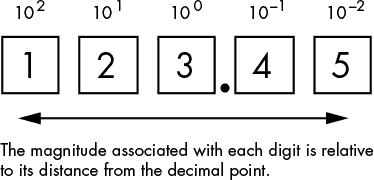
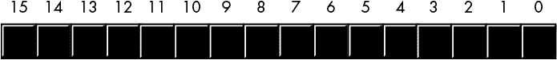
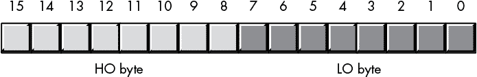
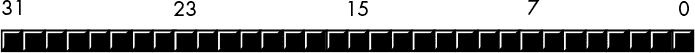
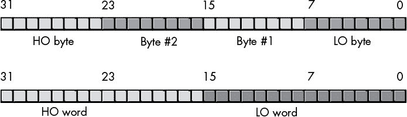
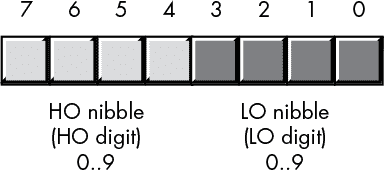

## 第二章：数字表示**


高级语言屏蔽了程序员处理底层数字表示的痛苦。然而，编写优秀的代码需要理解计算机是如何表示数字的，所以本章的重点就是这个。一旦你理解了内部数字表示，你会发现许多算法的高效实现方法，并避免常见编程实践中可能出现的陷阱。

### 2.1 什么是数字？

在教授汇编语言编程多年后，我发现大多数人并不理解数字与数字表示之间的根本区别。大多数情况下，这种混淆是无害的。然而，许多算法依赖于我们用来操作数字的内部和外部表示，以确保其正确高效地运行。如果你不理解数字的抽象概念和该数字的表示之间的区别，你将很难理解、使用或创建这样的算法。

一个*数字*是一个无形的、抽象的概念。它是我们用来表示数量的智力工具。假设我告诉你一本书有一百页。你可以触摸这些页面——它们是有形的。你甚至可以数一数这些页面，以验证它们是否有一百页。然而，“一百”只是我应用于这本书的一个抽象概念，用来描述它的大小。

需要认识到的重要一点是，下面的*并不是*一百：

100

这不过是纸上墨水形成的一些特定线条和曲线（称为*字形*）。你可能会把这组符号认作一百的表示，但这并不是实际的 100 值。它只是页面上的三个符号。它甚至不是一百的唯一表示——考虑以下这些，它们都是 100 值的不同表示：

| 100 | 十进制表示 |
| --- | --- |
| C | 罗马数字表示 |
| 64[16] | 十六进制（基 16）表示 |
| 1100100[2] | 二进制（基 2）表示 |
| 144[8] | 八进制（基 8）表示 |
| 一百 | 英文表示 |

一个数字的表示（通常）是一些符号的序列。例如，数字一百的常见表示“100”，实际上是由三个数字组成的序列：数字 1 后跟数字 0，再后跟第二个数字 0。每个数字都有其特定的意义，但我们本可以用“64”这个序列来表示一百。即使是组成这个 100 表示的单个数字也不是数字。它们是数字符号，是我们用来表示数字的工具，但它们本身不是数字。

现在你可能会想，为什么你应该关心像“100”这样的符号序列是实际的数字一百，还是仅仅是它的表示。原因是你在计算机程序中会遇到几种看起来像数字（也就是说，它们看起来像“100”）的符号序列，而你不想将它们与实际的数值混淆。相反，计算机可能使用许多不同的表示方式来表示数字一百，重要的是你要意识到它们是等效的。

### 2.2 数字系统

*数字系统*是一种我们用来表示数值的机制。今天，大多数人使用*十进制*（或*基数 10*）数字系统，大多数计算机系统使用*二进制*（或*基数 2*）数字系统。两者之间的混淆可能会导致不良的编码习惯。

阿拉伯人发明了我们今天常用的十进制数字系统（这就是为什么 10 个十进制数字被称为*【阿拉伯数字】(gloss01.xhtml#gloss01_13)*）。十进制系统使用*【位置记数法】(gloss01.xhtml#gloss01_197)*来用一小组不同的符号表示值。位置记数法不仅赋予符号本身意义，还赋予符号在符号序列中的位置意义——这一方案远优于其他非位置表示法。为了理解位置系统和非位置系统之间的区别，可以参考图 2-1 中的*记数划线*表示法，表示数字 25。


*图 2-1：记数划线表示法的 25*

记数划线表示法使用一系列*n*个符号来表示值*n*。为了让数值更易于阅读，大多数人将记数符号按五个一组排列，如图 2-1 所示。记数划线数字系统的优点在于它对于计数物体非常方便。然而，这种符号表示方法体积庞大，且进行算术运算时很困难。记数划线表示法的最大问题是它占用的物理空间。表示值*n*需要的空间与*n*成正比。因此，对于较大的*n*值，这种表示法就变得不可使用了。

#### *2.2.1 十进制位置数字系统*

十进制位置数制使用阿拉伯数字的字符串表示数字，通常包括一个小数点，用于分隔数字的整数部分和小数部分。数字在字符串中的位置影响其含义：小数点左边的每个数字表示一个 0 到 9 之间的值，并乘以递增的 10 的幂（见 图 2-2）。序列中小数点左边紧邻的符号表示 0 到 9 之间的值。如果有至少两个数字，小数点左边第二个符号表示 0 到 9 乘以 10 的值，依此类推。小数点右边的值则逐渐减小。



*图 2-2：位置数制*

数字序列 123.45 表示：

（1 × 10²）+（2 × 10¹）+（3 × 10⁰）+（4 × 10^(–1)）+（5 × 10^(–2)）

或：

100 + 20 + 3 + 0.4 + 0.05

为了理解十进制位置数制的强大功能，可以考虑与记数划线系统相比：

+   它可以在三分之一的空间内表示值 10。

+   它可以在大约 3% 的空间内表示值 100。

+   它可以在大约 0.3% 的空间内表示值 1,000。

随着数字变大，差距会变得更加显著。由于其紧凑且易于识别的符号，位置数制非常流行。

#### *2.2.2 基数（进制）值*

人类发展了十进制数制，因为它与他们手上的手指（“数字”）数量相对应。然而，十进制并不是唯一可能的进制数制；事实上，对于大多数基于计算机的应用，十进制甚至不是最佳的数制。所以，让我们来看看如何在其他数制中表示数值。

十进制位置数制使用 10 的幂和 10 个独特的符号表示每个数字位置。由于十进制数使用 10 的幂，我们称它们为“十进制”数字。通过替换一组不同的数字符号，并将这些符号乘以某个除 10 以外的基数的幂，我们可以设计出另一种数制。基数，或 *基数*，是我们为每个小数点左边的数字位置提高到递增幂的值（注意，*十进制点*仅适用于十进制数字）。

例如，我们可以使用八个符号（0-7）和连续的 8 的幂，创建一个基数为 8（*八进制*）的数制。考虑八进制数 123[8]（下标表示进制，采用标准数学符号），其等价于十进制数 83[10]：

1 × 8² + 2 × 8¹ + 3 × 8⁰

或：

64 + 16 + 3

要创建一个基数为 *n* 的数字系统，你需要 *n* 个唯一的数字。最小的进制是 2（对于这种方案）。对于 2 到 10 之间的进制，约定使用阿拉伯数字 0 到 *n* - 1（对于基数为 *n* 的系统）。对于大于 10 的进制，约定使用字母数字 *a* 到 *z* 或 *A* 到 *Z*（忽略大小写）表示大于 9 的数字。该方案支持从基数 2 到 36 的数字系统（10 个数字字符和 26 个字母字符）。对于大于 10 的阿拉伯数字和 26 个字母字符之外的符号，目前没有统一的约定。在本书中，我们将处理基数为 2、基数为 8 和基数为 16 的值，因为基数 2（二进制）是大多数计算机使用的原生表示，基数 8 曾在旧计算机系统中流行，而基数 16 比基数 2 更紧凑。你会发现许多程序使用这三种进制，因此了解它们非常重要。

#### *2.2.3 二进制数字系统*

既然你在读这本书，那么很可能你已经熟悉了基数为 2 的二进制数字系统；不过，快速回顾一下也是有必要的。二进制数字系统的工作原理与十进制数字系统相似，只是二进制只使用 0 和 1（而不是 0 到 9），并且使用 2 的幂（而不是 10 的幂）。

为什么要担心二进制呢？毕竟，几乎所有的计算机语言都允许程序员使用十进制表示法（自动将十进制表示转换为内部的二进制表示）。尽管有这个功能，但大多数现代计算机系统在与 I/O 设备通信时使用二进制，且它们的算术电路处理的是二进制数据。许多算法依赖于二进制表示来确保正确运行。因此，为了编写优秀的代码，你需要完全理解二进制表示法。

##### 2.2.3.1 十进制与二进制之间的转换

为了理解计算机为你做了什么，学习如何手动将十进制和二进制表示法进行转换是很有用的。

要将二进制值转换为十进制，需将 2^(*i*)加到每个二进制字符串中为 1 的位置，其中 *i* 是二进制位的零基位置。例如，二进制值 11001010[2]表示：

1 × 2⁷ + 1 × 2⁶ + 0 × 2⁵ + 0 × 2⁴ + 1 × 2³ + 0 × 2² + 1 × 2¹ + 0 × 2⁰

或者：

128 + 64 + 8 + 2

或者：

202[10]

将十进制转换为二进制几乎一样简单。这里有一个算法可以将十进制表示转换为对应的二进制表示：

1.  如果数字是偶数，则输出 0。如果数字是奇数，则输出 1。

1.  将数字除以 2，丢弃任何小数部分或余数。

1.  如果商为 0，算法完成。

1.  如果商不为 0 且数字为奇数，则在当前字符串前插入 1。如果商不为 0 且数字为偶数，则在二进制字符串前加上 0。

1.  返回步骤 2 并重复。

这个例子将 202 转换为二进制：

1.  202 是偶数，因此输出 0 并除以 2（101）：0

1.  101 是奇数，因此输出 1 并除以 2（50）：10

1.  50 是偶数，因此输出 0 并除以 2（25）：010

1.  25 是奇数，因此输出 1 并除以 2（12）：1010

1.  12 是偶数，因此输出 0 并除以 2（6）：01010

1.  6 是偶数，因此输出 0 并除以 2（3）：001010

1.  3 是奇数，因此输出 1 并除以 2（1）：1001010

1.  1 是奇数，因此输出 2 并除以 2（0）：11001010

1.  结果是 0，因此算法完成，得出 11001010。

##### 2.2.3.2 使二进制数字更易读

如你从等价表示 202[10]和 11001010[2]中可以看出，二进制表示法不如十进制表示法紧凑。我们需要找到一种方法，让二进制数字中的每一位，或*(位)，更加简洁并易于阅读。

在美国，大多数人会用逗号将每三位数字分开，以便更容易阅读较大的数字。例如，1,023,435,208 比 1023435208 更容易阅读和理解。本书将采用类似的约定来表示二进制数字；每 4 个位的二进制数会用下划线分开。例如，二进制值 1010111110110010[2]将写作 1010_1111_1011_0010[2]。

##### 2.2.3.3 在编程语言中表示二进制值

到目前为止，本章已经使用了数学家采用的下标符号来表示二进制值（缺少下标表示十进制）。然而，下标符号通常不被程序文本编辑器或编程语言编译器识别，因此我们需要一些其他方法来在标准的 ASCII 文本文件中表示不同的进制。

一般来说，只有汇编语言编译器（“汇编器”）允许在程序中使用字面二进制常量。^(1) 由于汇编器的种类繁多，在汇编语言程序中表示字面二进制常量的方式也各不相同。本书使用 MASM 和 HLA 作为示例，因此采用它们的表示约定是有意义的。

MASM 将二进制值表示为一串二进制数字（`0`和`1`），并以`b`或`B`结尾。在 MASM 源文件中，9 的二进制表示为`1001b`。

HLA 使用百分号符号（`%`）作为二进制值的前缀。为了使二进制数字更易读，HLA 还允许在二进制字符串中插入下划线，像这样：

```
%11_1011_0010_1101
```

#### *2.2.4 十六进制数制*

如前所述，二进制数字表示方式较为冗长。十六进制表示法具有两个重要优点：它非常紧凑，并且在二进制和十六进制之间转换很容易。因此，软件工程师通常使用十六进制表示法而不是二进制，以使程序更具可读性。

由于十六进制表示法是以 16 为基数的，每一位数字左边的十六进制点代表某个值乘以 16 的连续幂。例如，数字 1234[16]等于：

1 × 16³ + 2 × 16² + 3 × 16¹ + 4 × 16⁰

或：

4096 + 512 + 48 + 4

或：

4660[10]

十六进制表示法使用字母*A*到*F*表示它所需的额外六个数字（超过 10 个标准十进制数字，0–9）。以下是所有有效十六进制数字的示例：

234[16]   DEAD[16]   BEEF[16]   0AFB[16]   FEED[16]   DEAF[16]

##### 2.2.4.1 在编程语言中表示十六进制值

十六进制表示法的一个问题是很难区分像“DEAD”这样的十六进制值与标准程序标识符。因此，大多数编程语言使用特殊的前缀或后缀字符来表示十六进制值。以下是几种流行语言中如何指定字面十六进制常量：

+   C、C++、C#、Java、Swift 及其他 C 派生编程语言使用前缀`0x`。你可以使用字符序列`0xdead`来表示十六进制值 DEAD[16]。

+   MASM 汇编器使用`h`或`H`后缀。由于这并不能完全消除某些标识符与字面十六进制常量之间的歧义（例如，“deadh”对 MASM 仍然看起来像一个标识符），它还要求十六进制值以数字字符开头。因此，你需要在值的开头添加`0`（因为数字表示的前缀`0`不会改变值），得到`0deadh`，这就明确表示 DEAD[16]。

+   Visual Basic 使用`&H`或`&h`前缀。继续当前的示例，你需要使用`&Hdead`来表示 Visual Basic 中的 DEAD[16]。

+   Pascal（Delphi）使用前缀`$`。因此，你可以使用`$dead`来表示 Delphi/Free Pascal 中的当前示例。

+   HLA 也使用前缀`$`。与二进制数一样，它还允许你在十六进制数字中插入下划线，以便更容易阅读（例如，`$FDEC_A012`）。

一般来说，本书将使用 HLA/Delphi/Free Pascal 格式，除非是在针对其他编程语言的示例中。由于本书中有若干 C/C++示例，因此你会经常看到 C/C++表示法。

##### 2.2.4.2 在十六进制和二进制表示之间转换

十六进制表示法流行的另一个原因是它便于在二进制和十六进制表示之间进行转换。通过记住表 2-1 中展示的几个简单规则，你可以在脑海中进行这种转换。

**表 2-1:** 二进制/十六进制转换表

| **二进制** | **十六进制** |
| --- | --- |
| `%0000` | `$0` |
| `%0001` | `$1` |
| `%0010` | `$2` |
| `%0011` | `$3` |
| `%0100` | `$4` |
| `%0101` | `$5` |
| `%0110` | `$6` |
| `%0111` | `$7` |
| `%1000` | `$8` |
| `%1001` | `$9` |
| `%1010` | `$A` |
| `%1011` | `$B` |
| `%1100` | `$C` |
| `%1101` | `$D` |
| `%1110` | `$E` |
| `%1111` | `$F` |

要将数字的十六进制表示转换为二进制，需要为每个十六进制数字替换相应的 4 位。例如，要将 `$ABCD` 转换为二进制形式 `%1010_1011_1100_1101`，根据 表 2-1 中的值转换每个十六进制数字：

| `A` | `B` | `C` | `D` | 十六进制 |
| --- | --- | --- | --- | --- |
| `1010` | `1011` | `1100` | `1101` | 二进制 |

将数字的二进制表示转换为十六进制几乎同样简单。首先，将二进制数用 0 补齐，确保它的位数是 4 的倍数。例如，给定二进制数 1011001010，将两个 0 位加到数字的左侧，使其变为 12 位而不改变其值：001011001010。接下来，将二进制值分成 4 位一组：0010_1100_1010。最后，在 表 2-1 中查找这些二进制值，并替换为相应的十六进制数字：`$2CA`。正如你所见，这比将十进制与二进制或十进制与十六进制之间的转换要简单得多。

#### *2.2.5 八进制计数系统*

八进制（基数 8）表示法在早期计算机系统中很常见，因此你可能会偶尔看到它的使用。八进制对于 12 位和 36 位计算机系统（或任何位数是 3 的倍数的系统）很有用，但对于位数是 2 的幂（如 8 位、16 位、32 位和 64 位计算机系统）的计算机系统并不特别合适。然而，一些编程语言允许你以八进制表示法指定数字值，你仍然可以找到一些使用它的旧版 Unix 应用程序。

##### 2.2.5.1 编程语言中的八进制表示

C 编程语言（以及 C++ 和 Java 等衍生语言）、MASM、Swift 和 Visual Basic 支持八进制表示。你应该了解它们使用的八进制表示法，以防在这些语言编写的程序中遇到这种情况。

+   在 C 中，你可以通过在数字字符串前加上 `0`（零）来指定八进制。例如，`0123` 等于十进制值 83[10]，并且绝对*不是*十进制值 123[10]。

+   MASM 使用 `Q` 或 `q` 后缀。（微软/英特尔可能选择 *Q*，因为它看起来像字母 *O*，但不容易与零混淆。）

+   Swift 使用 `0o` 前缀。例如，`0o14` 表示十进制值 12[10]。

+   Visual Basic 使用前缀 `&O`（是字母 *O*，不是零）。例如，你会用 `&O123` 来表示十进制值 83[10]。

##### 2.2.5.2 二进制与八进制表示之间的转换

二进制与八进制之间的转换类似于二进制与十六进制之间的转换，只是这次是按 3 位一组，而不是 4 位一组。查看 表 2-2，它列出了二进制与八进制的等价表示。

**表 2-2：** 二进制/八进制转换表

| **二进制** | **八进制** |
| --- | --- |
| `%000` | `0` |
| `%001` | `1` |
| `%010` | `2` |
| `%011` | `3` |
| `%100` | `4` |
| `%101` | `5` |
| `%110` | `6` |
| `%111` | `7` |

要将八进制转换为二进制，请将数字中的每个八进制数字替换为表 2-2 中对应的 3 位二进制位。例如，当你将`123q`转换为二进制值时，最终结果是`%0_0101_0011`：

| `1` | `2` | `3` |
| --- | --- | --- |
| `001` | `010` | `011` |

要将二进制数字转换为八进制，你需要将二进制字符串分成 3 位一组（根据需要用 0 填充），然后将每组三位替换为表 2-2 中的对应八进制数字。

要将八进制值转换为十六进制表示法，先将八进制数字转换为二进制，然后再将二进制值转换为十六进制。

### 2.3 数字/字符串转换

在本节中，我们将探讨从字符串到数字形式的转换以及反向转换。由于大多数编程语言（或其库）会自动执行这些转换，初学者往往不知道这些转换的发生。例如，考虑在各种语言中将字符串转换为数字形式是多么容易：

```
cin >> i;                      // C++

readln( i );                   // Pascal

let j = Int(readLine() ?? "")! // Swift

input i                        // BASIC

stdin.get( i );                // HLA
```

在这些语句中，变量`i`可以保存一个整数值。然而，用户从控制台输入的是一串字符。编程语言的运行时库负责将这串字符转换为 CPU 所需的内部二进制形式。请注意，Swift 只允许你从标准输入读取一个字符串；你必须显式地使用`Int()`构造函数/类型转换函数将该字符串转换为整数。

不幸的是，如果你不了解这些语句的成本，你将无法意识到它们在性能关键时如何影响你的程序。理解转换算法中涉及的底层工作非常重要，这样你就不会轻率地使用这些语句。

**注意**

*为了简便起见，我们将讨论无符号整数值，并忽略非法字符和数值溢出的可能性。因此，以下算法稍微低估了实际涉及的工作。*

使用此算法将一串十进制数字转换为整数值：

1.  初始化一个值为`0`的变量；这个变量将保存最终的值。

1.  如果字符串中没有更多的数字，则算法完成，变量保存了数字值。

1.  从字符串中提取下一个数字（从左到右），并将其从 ASCII 转换为整数。

1.  将变量乘以 10，然后加上步骤 3 中提取的数字。

1.  返回步骤 2 并重复。

将整数值转换为字符字符串需要更多的努力：

1.  初始化一个空字符串。

1.  如果整数值为 0，输出`0`，并且算法完成。

1.  将当前的整数值除以 10，计算余数和商。

1.  将余数（始终在 0..9 的范围内^(2))转换为字符，并将该字符插入字符串的开头。

1.  如果商不为 0，则将其作为新的值，并重复步骤 3 至步骤 5。

1.  输出字符串中的字符。

这些算法的细节并不重要。重要的是，*每个输出字符执行一次这些步骤，且除法运算非常缓慢*。因此，像以下这样的简单语句可以隐藏程序员相当多的工作：

```
printf( "%d", i );    // C

cout << i;            // C++

print i               // BASIC

write( i );           // Pascal

print( i )            // Swift

stdout.put( i );      // HLA
```

要编写出色的代码，你不必完全避免使用数字/字符串转换；然而，一名出色的程序员会小心只在必要时使用它们。

记住，这些算法仅适用于无符号整数。带符号整数需要稍微更多的处理（尽管额外的工作几乎可以忽略不计）。然而，浮点值在字符串与数值之间的转换要困难得多，因此在编写涉及浮点运算的代码时，务必记住这一点。

### 2.4 内部数值表示

大多数现代计算机系统使用内部二进制格式来表示值和其他对象。然而，大多数系统只能有效地表示特定大小的二进制值。为了编写出色的代码，你需要确保你的程序使用计算机能够高效表示的数据对象。本节将描述计算机如何物理表示值，以便你能相应地设计程序。

#### *2.4.1 比特*

在二进制计算机中，数据的最小单位是单个比特。因为一个比特只能表示两个不同的值（通常是`0`或`1`），你可能会认为它无法发挥太大作用。但实际上，使用单个比特可以表示无数种两项组合。以下是一些例子（我创建的任意二进制编码）：

+   零（`0`）或一（`1`）

+   假（`0`）或真（`1`）

+   关闭（`0`）或开启（`1`）

+   男性（`0`）或女性（`1`）

+   错误（`0`）或正确（`1`）

你不仅限于表示二进制数据类型（即那些只有两种不同值的对象）。你也可以使用单个比特来表示任何两个不同的项：

+   数字 723（`0`）和 1,245（`1`）

+   红色（`0`）和蓝色（`1`）

你甚至可以使用单个比特表示两个不相关的对象。例如，你可以使用比特值`0`表示红色，使用比特值`1`表示数字 3,256。你可以用单个比特表示*任何*两种不同的值——但*仅仅*两种不同的值。因此，单个比特对于大多数计算需求是不足够的。为了克服单个比特的局限性，我们通过多个比特的序列创建*【比特串】(gloss01.xhtml#gloss01_32)*。

#### *2.4.2 位串*

通过将比特组合成一个序列，我们可以形成与其他数值表示方式（如十六进制和八进制）等价的二进制表示。大多数计算机系统不允许你组合任意数量的比特，因此你必须使用固定长度的比特串。

*半字节*是由 4 位组成的集合。大多数计算机系统在内存中无法高效访问半字节。特别地，恰好需要 1 个半字节来表示一个十六进制数字。

*字节*是 8 位，是许多 CPU 上最小的可寻址数据项；即 CPU 可以高效地从内存中以 8 位为一组来检索数据。正因如此，许多语言支持的最小数据类型消耗 1 个字节的内存（无论该数据类型实际需要多少位）。

因为字节是大多数计算机中最小的存储单位，并且许多语言使用字节表示需要少于 8 位的对象，我们需要某种方式表示字节中的单个位。为了描述字节中的位，我们将使用*位编号*。如图 2-3 所示，位 0 是*低位（LO）*，或*最不重要*的位，位 7 是*高位（HO）*，或*最重要*的位。其余位将通过它们的编号来表示。


*图 2-3：字节中的位编号*

*字*的定义因 CPU 而异：它可能是 16 位、32 位或 64 位的对象。本书采用 80x86 术语，并将一个字定义为 16 位的集合。与字节一样，我们将为一个字使用位编号，从位 0（LO 位）开始，逐步到位 15（HO 位）（参见图 2-4）。



*图 2-4：一个字中的位编号*

请注意，一个字包含正好 2 个字节。位 0 到 7 组成 LO 字节，位 8 到 15 组成 HO 字节（参见图 2-5）。



*图 2-5：一个字中的 2 个字节*

*双字*（或*dword）*的含义正如其名称所示——一对字。因此，双字的长度是 32 位，如图 2-6 所示。



*图 2-6：双字中的位布局*

图 2-7 显示一个双字由 2 个字或 4 个字节组成。



*图 2-7：双字中的字节和字*

如前所述，大多数 CPU 高效地处理大小不超过某一限制的对象（现代系统上通常为 32 位或 64 位）。这并不意味着你不能处理更大的对象，只是这样做的效率较低。你通常不会看到程序处理超过大约 128 位或 256 位的数字对象。一些编程语言提供 64 位整数，且大多数语言支持 64 位浮点值，因此对于这些数据类型，我们将使用*四字*（quad word）这个术语。最后，我们将使用*长字*（long word）来描述 128 位的值；尽管今天很少有语言支持它们，^(3)，但这给了我们一定的扩展空间。

我们可以将四字长（quad word）分解为 2 个双字（double word），4 个字（word），8 个字节（byte）或 16 个半字节（nibble）。同样，我们也可以将长字（long word）分解为 2 个四字长，4 个双字，8 个字或 16 个字节。

英特尔 80x86 平台还支持一种 80 位类型，英特尔称之为 *tbyte*（即“十字节”对象的缩写）。80x86 CPU 系列使用 tbyte 变量来保存扩展精度的浮点值和某些二进制编码十进制（BCD）值。

一般来说，使用 *n* 位串，您可以表示最多 2^(*n*) 个不同的值。表 2-3 显示了使用半字节、字节、字、双字、四字和长字可以表示的可能对象数量。

**表 2-3：** 可由位串表示的值的数量

| **位串大小（以位为单位）** | **可能的组合数量（2^(*n*)）** |
| --- | --- |
| 4 | 16 |
| 8 | 256 |
| 16 | 65,536 |
| 32 | 4,294,967,296 |
| 64 | 18,446,744,073,709,551,616 |
| 128 | 340,282,366,920,938,463,463,374,607,431,768,211,456 |

### 2.5 有符号与无符号数

二进制数字 0…00000^(4) 表示 0；0…00001 表示 1；0…00010 表示 2；依此类推直到无穷大。那么负数呢？为了表示有符号的值，大多数计算机系统使用 *二进制补码* 数字系统。有符号数的表示方式对它们施加了一些基本的限制，因此理解有符号数和无符号数在计算机系统中的不同表示方式非常重要，以便有效地使用它们。

使用 *n* 位，我们只能表示 2^(*n*) 个不同的对象。由于负数本身也是一个对象，我们需要将这 2^(*n*) 个组合分配给负值和非负值。例如，一个字节可以表示从 -128 到 -1 的负值，以及从 0 到 127 的非负值。使用 16 位字，可以表示从 -32,768 到 +32,767 的有符号值。使用 32 位双字，可以表示从 -2,147,483,648 到 +2,147,483,647 的值。一般来说，使用 *n* 位可以表示从 -2^(*n–*)¹ 到 +2^(*n–*)¹ – 1 范围内的有符号值。

二进制补码系统使用最高位（HO 位）作为 *符号位*。如果最高位为 `0`，则该数字为非负数，并使用通常的二进制编码；如果最高位为 `1`，则该数字为负数，并使用二进制补码编码。以下是一些使用 16 位数字的例子：

+   `$8000`（`%1000_0000_0000_0000`）是负数，因为最高位（HO 位）为 `1`。

+   `$100`（`%0000_0001_0000_0000`）是非负数，因为最高位（HO 位）为 `0`。

+   `$7FFF`（`%0111_1111_1111_1111`）是非负数。

+   `$FFFF`（`%1111_1111_1111_1111`）是负数。

+   `$FFF`（`%0000_1111_1111_1111`）是非负数。

要取反一个数字，可以使用二进制补码操作，方法如下：

1.  反转数字中的所有位；也就是说，将所有 `0` 改为 `1`，将所有 `1` 改为 `0`。

1.  将`1`加到反转后的结果（忽略任何溢出）。

如果结果是负数（其 HO 位被设置），那么这就是非负值的二进制补码形式。

例如，以下是计算十进制值 –5 的 8 位等价数的步骤：

1.  `%0000_0101`   5（二进制）。

1.  `%1111_1010`   反转所有位。

1.  `%1111_1011`   加 1 得到 –5（二进制补码形式）。

如果我们取 –5 并取反，结果是 5（`%0000_0101`），正如我们预期的那样：

1.  `%1111_1011`   –5 的二进制补码。

1.  `%0000_0100`   反转所有位。

1.  `%0000_0101`   加 1 得到 5（二进制）。

让我们来看一些 16 位示例及其反转。

首先，取反 32,767（`$7FFF`）：

1.  `%0111_1111_1111_1111`   +32,767，最大的 16 位正数。

1.  `%1000_0000_0000_0000`   反转所有位（`8000h`）。

1.  `%1000_0000_0000_0001`   加 1（`8001h`，或 –32,767）。

现在取反 16,384（`$4000`）：

1.  `%0100_0000_0000_0000`   16,384。

1.  `%1011_1111_1111_1111`   反转所有位（`$BFFF`）。

1.  `%1100_0000_0000_0000`   加 1（`$C000` 或 –16,384）。

现在取反 –32,768（`$8000`）：

1.  `%1000_0000_0000_0000`   –32,768，最小的 16 位负数。

1.  `%0111_1111_1111_1111`   反转所有位（`$7FFF`）。

1.  `%1000_0000_0000_0000`   加 1（`$8000` 或 –32,768）。

`$8000` 反转后变为 `$7FFF`，加 1 后我们得到 `$8000`！等等，发生了什么：–(–32,768) 就是 –32,768？当然不是。然而，16 位二进制补码系统无法表示 +32,768。一般来说，你不能取二进制补码系统中最小负值的反。

### 2.6 二进制数的有用性质

以下是一些你可能在程序中用到的二进制值性质：

+   如果二进制（整数）值的第 0 位包含 `1`，则该数是奇数；如果该位包含 `0`，则该数是偶数。

+   如果二进制数的低 *n* 位都包含 `0`，那么该数可以被 2^(*n*) 整除。

+   如果二进制值的第 *n* 位是 `1`，而其他所有位都是 `0`，那么该数等于 2^(*n*)。

+   如果二进制值从第 0 位到第 *n*-1 位都包含 `1`，而其他所有位都是 `0`，那么该值等于 2^(*n*) – 1。

+   将一个数的所有位向左移动一位，会将该二进制值乘以 2。

+   将无符号二进制数的所有位右移一位，实际上是将该数除以 2（这不适用于有符号整数值）。奇数会向下舍入。

+   两个 *n* 位二进制值相乘可能需要多达 2 × *n* 位来存储结果。

+   加法或减法两个 *n* 位二进制值从不需要超过 *n* + 1 位来存储结果。

+   反转二进制数中的所有位（即将所有 `0` 改为 `1`，反之亦然）与取反（改变符号）该值并从结果中减去 1 是相同的。

+   *递增*（加 1）给定位数的最大无符号二进制值总是产生 `0`。

+   *递减*（减去 1）0 总是会生成一个给定位数的最大无符号二进制值。

+   一个*n*位的值提供 2^(*n*)种唯一的位组合。

+   2^(*n*)–1 的值包含*n*个位，每个位都包含值`1`。

记住从 2⁰到 2¹⁶的所有 2 的幂是个好主意（见表 2-4），因为这些值在程序中经常出现。

**表 2-4：** 2 的幂

| ***n*** | 2***n*** |
| --- | --- |
| 0 | 1 |
| 1 | 2 |
| 2 | 4 |
| 3 | 8 |
| 4 | 16 |
| 5 | 32 |
| 6 | 64 |
| 7 | 128 |
| 8 | 256 |
| 9 | 512 |
| 10 | 1,024 |
| 11 | 2,048 |
| 12 | 4,096 |
| 13 | 8,192 |
| 14 | 16,384 |
| 15 | 32,768 |
| 16 | 65,536 |

### 2.7 符号扩展、零扩展与收缩

使用补码系统时，单一负值的表示方式会根据表示大小的不同而有所不同。8 位的符号值必须转换才能用于涉及 16 位数的表达式。这种转换及其逆操作——将 16 位数转换为 8 位数——分别是*符号扩展*和*收缩*操作。

考虑值-64。这个数的 8 位补码值是`$C0`，16 位等效值是`$FFC0`。显然，这些不是相同的位模式。现在考虑值+64。这个数的 8 位和 16 位版本分别是`$40`和`$0040`。我们扩展负值的方式与扩展非负值的方式不同。

要进行*符号扩展*，将符号位复制到新格式中的额外高位。例如，将一个 8 位数扩展到 16 位时，将 8 位数的第 7 位复制到 16 位数的第 8 到 15 位。将一个 16 位数扩展到双字时，将第 15 位复制到双字的第 16 到 31 位。

在将一个字节数量加到一个字数量时，需要先将字节扩展到 16 位，再加上这两个数。其他操作可能需要扩展到 32 位。

表 2-5 提供了几个符号扩展的示例。

**表 2-5：** 符号扩展示例

| **8 位** | **16 位** | **32 位** | **二进制（补码）** |
| --- | --- | --- | --- |
| `$80` | `$FF80` | `$FFFF_FF80` | `%1111_1111_1111_1111_1111_1111_1000_0000` |
| `$28` | `$0028` | `$0000_0028` | `%0000_0000_0000_0000_0000_0000_0010_1000` |
| `$9A` | `$FF9A` | `$FFFF_FF9A` | `%1111_1111_1111_1111_1111_1111_1001_1010` |
| `$7F` | `$007F` | `$0000_007F` | `%0000_0000_0000_0000_0000_0000_0111_1111` |
| n/a | `$1020` | `$0000_1020` | `%0000_0000_0000_0000_0001_0000_0010_0000` |
| n/a | `$8086` | `$FFFF_8086` | `%1111_1111_1111_1111_1000_0000_1000_0110` |

*零扩展*将小的无符号值转换为更大的无符号值。零扩展非常简单——只需将`0`存储在更大操作数的高位字节中。例如，将 8 位值`$82`零扩展到 16 位时，将高位字节插入`0`，得到`$0082`。

更多示例请见表 2-6。

**表 2-6：** 零扩展示例

| **8 位** | **16 位** | **32 位** | **二进制** |
| --- | --- | --- | --- |
| `$80` | `$0080` | `$0000_0080` | `%0000_0000_0000_0000_0000_0000_1000_0000` |
| `$28` | `$0028` | `$0000_0028` | `%0000_0000_0000_0000_0000_0000_0010_1000` |
| `$9A` | `$009A` | `$0000_009A` | `%0000_0000_0000_0000_0000_0000_1001_1010` |
| `$7F` | `$007F` | `$0000_007F` | `%0000_0000_0000_0000_0000_0000_0111_1111` |
| 不适用 | `$1020` | `$0000_1020` | `%0000_0000_0000_0000_0001_0000_0010_0000` |
| 不适用 | `$8086` | `$0000_8086` | `%0000_0000_0000_0000_1000_0000_1000_0110` |

许多高级语言编译器会自动处理符号扩展和零扩展。下面的 C 语言示例演示了这一过程：

```
signed char sbyte;   // Chars in C are byte values.

short int sword;     // Short integers in C are *usually* 16-bit values.

long int sdword;     // Long integers in C are *usually* 32-bit values.

 . . .

sword = sbyte;       // Automatically sign-extends the 8-bit value to 16 bits.

sdword = sbyte;      // Automatically sign-extends the 8-bit value to 32 bits.

sdword = sword;      // Automatically sign-extends the 16-bit value to 32 bits.
```

一些语言（如 Ada 或 Swift）要求从较小的大小显式转换为较大的大小。请查阅特定语言的参考手册，查看是否需要这样做。要求显式转换的语言的优点是，编译器永远不会在你不知情的情况下做任何事情。如果你没有进行转换，编译器会发出诊断信息。

关于符号扩展和零扩展，重要的是要意识到它们并非总是免费的。将较小的整数赋值给较大的整数可能需要更多的机器指令（执行时间更长），而不是在两个相同大小的整数变量之间移动数据。因此，在同一个算术表达式或赋值语句中混合不同大小的变量时，应小心。

符号扩展——将一个具有某些位数的值转换为具有较少位数的相同值——稍微麻烦一些。例如，考虑值 –448。作为一个 16 位的十六进制数，它的表示是 `$FE40`。这个数的大小太大，无法适应 8 位，因此你无法将其符号扩展到 8 位。

为了正确地将一个值符号扩展到另一个值，你必须查看你想要丢弃的高位字节。首先，所有高位字节必须包含 `0` 或 `$FF`。其次，结果值的高位字节必须与你从数字中移除的每一位匹配。以下是将 16 位值转换为 8 位值的一些示例（包括几个失败的例子）：

+   `$FF80`（`%1111_1111_1000_0000`）可以符号扩展为 `$80`（`%1000_0000`）。

+   `$0040`（`%0000_0000_0100_0000`）可以符号扩展为 `$40`（`%0100_0000`）。

+   `$FE40`（`%1111_1110_0100_0000`）不能被符号扩展到 8 位。

+   `$0100`（`%0000_0001_0000_0000`）不能符号扩展到 8 位。

一些高级语言，如 C，通常会将表达式的低位部分存储到一个较小的变量中，丢弃高位部分——最多，C 编译器可能会给出有关可能发生精度丢失的警告。你通常可以让编译器静默，但它仍然不会检查无效值。通常，你可以使用类似以下代码来符号扩展 C 中的值：

```
signed char sbyte;    // Chars in C are byte values.

short int sword;      // Short integers in C are *usually* 16-bit values.

long int sdword;      // Long integers in C are *usually* 32-bit values.

 . . .

sbyte = (signed char) sword;

sbyte = (signed char) sdword;

sword = (short int) sdword;
```

在 C 中唯一安全的解决方案是在尝试将值存入较小的变量之前，先将表达式的结果与上限和下限值进行比较。以下是加入这些检查后的代码：

```
if( sword >= -128 && sword <= 127 )

{

    sbyte = (signed char) sword;

}

else

{

    // Report appropriate error.

}

// Another way, using assertions:

assert( sword >= -128 && sword <= 127 )

sbyte = (signed char) sword;

assert( sdword >= -32768 && sdword <= 32767 )

sword = (short int) sdword;
```

这段代码显得相当复杂。在 C/C++ 中，你可能希望将其转换为宏（`#define`）或函数，这样代码会更加易读。

一些高级语言（例如 Free Pascal 和 Delphi）会自动进行符号收缩值转换，然后检查该值以确保它适合目标操作数。^(5) 这样的语言如果发生范围违反，会抛出某种异常（或停止程序）。要采取纠正措施，你需要编写一些异常处理代码，或者使用类似于 C 示例中给出的 `if` 语句序列。

### 2.8 饱和

你还可以通过 *饱和* 来减小整数值的大小，当你愿意接受可能的精度损失时，这非常有用。要通过饱和转换一个值，你需要将较大对象的低位（LO bits）复制到较小的对象中。如果较大的值超出了较小对象的范围，那么你就 *裁剪* 较大的值，将较小对象的值设置为该范围内的最大（或最小）值。

例如，在将一个 16 位有符号整数转换为 8 位有符号整数时，如果 16 位值的范围在 -128 到 +127 之间，你只需将低字节（LO byte）复制到 8 位对象中。如果 16 位有符号值大于 +127，那么你就裁剪该值至 +127，并将 +127 存储到 8 位对象中。同样地，如果该值小于 -128，你就将最终的 8 位对象裁剪至 -128。饱和操作在将 32 位值裁剪为较小值时，效果相同。

如果较大的值超出了较小值的范围，那么在转换过程中会丢失精度。虽然裁剪值并不是最理想的选择，但有时它比抛出异常或拒绝计算更好。对于许多应用程序，比如音频或视频，即使裁剪后的结果，最终用户依然能够识别，因此这是一种合理的转换方案。

许多 CPU 支持其特殊的“多媒体扩展”指令集中的饱和运算——例如，英特尔 80x86 处理器系列的 MMX/SSE/AVX 指令扩展。大多数 CPU 的标准指令集以及大多数高级语言并未直接支持饱和运算，但这种技术并不难实现。请看以下使用饱和技术将 32 位整数转换为 16 位整数的 Free Pascal/Delphi 代码：

```
var

    li  :longint;

    si  :smallint;

        . . .

    if( li > 32767 ) then

        si := 32767;

    else if( li < -32768 ) then

        si := -32768;

    else 

        si := li;
```

### 2.9 二进制编码十进制表示法

*二进制编码十进制（BCD）* 格式，顾名思义，使用二进制表示法对十进制值进行编码。常见的通用高级语言（如 C/C++、Pascal 和 Java）很少支持十进制值。然而，面向业务的编程语言（如 COBOL 和许多数据库语言）是支持的。因此，如果你正在编写与数据库或支持十进制算术的语言接口的代码，你可能需要处理 BCD 表示。

BCD 值由一系列 nibble 组成，每个 nibble 表示一个范围在 0 到 9 之间的值。（BCD 格式仅使用 nibble 可表示的 16 个值中的 10 个。）使用一个字节可以表示包含两位十进制数字的值（0..99），如 图 2-8 所示。使用一个字，可以表示四位十进制数字（0..9999）。一个双字可以表示最多八位十进制数字。



*图 2-8：字节中的 BCD 数据表示*

一个 8 位的 BCD 变量可以表示从 0 到 99 之间的值，而同样的 8 位二进制值则可以表示从 0 到 255 之间的值。同样，一个 16 位的二进制值可以表示从 0 到 65,535 之间的值，而一个 16 位的 BCD 值只能表示其中约六分之一的值（0..9999）。不过，BCD 的问题不仅仅是存储效率低——BCD 计算也往往比二进制计算慢。

BCD 格式确实有两个优点：它非常容易在内部数字表示和十进制字符串表示之间转换 BCD 值，而且在使用 BCD 时，硬件编码多位十进制值也非常简单——例如，使用一组拨盘，每个拨盘表示一个数字。因此，你可能会在嵌入式系统（如烤面包机和闹钟）中看到 BCD 的应用，但在通用计算机软件中很少见。

几十年前，人们认为涉及 BCD（或仅十进制）算术的计算比二进制计算更为准确。因此，他们通常会使用基于十进制的算术来执行重要的计算，比如涉及货币单位的计算。某些计算在 BCD 中可能会产生更准确的结果，但对于大多数计算来说，二进制更加准确。这就是为什么大多数现代计算机程序将所有值（包括十进制值）表示为二进制形式的原因。例如，Intel 80x86 *浮点单元（FPU）* 支持一对指令来加载和存储 BCD 值。在内部，FPU 会将这些 BCD 值转换为二进制。它仅将 BCD 用作外部（FPU 之外的）数据格式。这种方法通常会产生更准确的结果。

### 2.10 定点表示

计算机系统常用两种方式来表示带有小数部分的数字：定点表示和浮点表示。

在过去，当 CPU 不支持硬件浮点运算时，定点运算在编写高性能软件、处理小数值的程序员中非常流行。定点格式支持小数值所需的软件开销比浮点格式少。然而，CPU 制造商在 CPU 中添加了 FPU 来支持硬件浮点运算，如今在通用 CPU 上很少有人尝试定点运算。通常，使用 CPU 的本地浮点格式更具成本效益。

尽管 CPU 制造商已经努力优化其系统中的浮点运算，但在某些情况下，精心编写的汇编语言程序使用定点计算比等效的浮点代码运行得更快。例如，某些 3D 游戏应用可能使用 16:16（16 位整数，16 位小数）格式，而不是 32 位浮点格式，从而产生更快的计算。由于定点运算有一些非常好的应用场景，本节将讨论定点表示法和使用定点格式的小数值。

**注意**

*第四章将讨论浮点格式。*

正如你所看到的，位置编号系统通过将数字放置在基点右侧来表示小数值（介于 0 和 1 之间的值）。在二进制编号系统中，基点右侧的每一位代表值 0 或 1，乘以 2 的某个连续负次方。我们使用二进制分数的和来表示值的小数部分。例如，值 5.25 被二进制表示为 101.01。转换为十进制得到：

1 × 2² + 1 × 2⁰ + 1 × 2^(–2) = 4 + 1 + 0.25 = 5.25

在使用定点二进制格式时，你选择二进制表示中的特定位，并隐式地将二进制点放在该位之前。你根据小数部分所需的有效位数来选择二进制点的位置。例如，如果你的值的整数部分范围从 0 到 999，你将需要至少 10 个位在二进制点的左侧来表示这个范围的值。如果需要有符号值，你还需要额外的一个位来表示符号。在 32 位定点格式中，这将剩下 21 或 22 个位用于小数部分，具体取决于你的值是否是有符号的。

定点数是实数的一个小子集。由于任何两个整数之间的值是无限的，定点值无法准确表示每一个值（做到这一点需要无限位数）。使用定点表示法时，我们必须逼近大多数实数。考虑 8 位定点格式，其中 6 位用于整数部分，2 位用于分数部分。整数部分可以表示范围为 0 到 63 的值（或表示范围为–32 到+31 的带符号值）。分数部分只能表示四个不同的值：0.0、0.25、0.5 和 0.75。使用这种格式无法精确表示 1.3；你能做的最好的就是选择最接近它的值（1.25）。这就引入了误差。你可以通过在定点格式的二进制小数点右侧添加更多位来减少这种误差（但这样会减少整数部分的范围，或者需要为定点格式添加更多位）。例如，如果你使用一个 16 位的定点格式，整数部分使用 8 位，分数部分使用 8 位，那么你可以通过二进制值 1.01001101 来逼近 1.3。其十进制等价值如下：

1 + 0.25 + 0.03125 + 0.15625 + 0.00390625 = 1.30078125

向定点数的分数部分添加更多位数，将使该值的逼近更加精确（使用这种格式时误差仅为 0.00078125，而使用之前的格式时误差为 0.05）。

在定点二进制计数系统中，无论你向定点表示的分数部分添加多少位，总有一些值无法准确表示（1.3 恰好是这样一个值）。这可能是人们（错误地）认为十进制运算比二进制运算更精确的主要原因（尤其是在处理像 0.1、0.2、0.3 等十进制小数时）。

为了对比这两种系统的精度，我们考虑一个定点十进制系统（使用 BCD 表示法）。如果我们选择一个 16 位格式，其中 8 位用于整数部分，8 位用于分数部分，那么我们可以表示范围为 0.0 到 99.99 的十进制值，小数点右侧有两位十进制精度。我们可以通过像`$0130`这样的十六进制值精确表示 1.3（在这个数字中，隐含的小数点出现在第二位和第三位之间）。只要在计算中仅使用分数值 0.00 到 0.99，这种 BCD 表示法比二进制定点表示法（使用 8 位分数部分）更精确。

然而，通常情况下，二进制格式更为精确。二进制格式允许你精确表示 256 个不同的分数值，而 BCD 格式只能表示 100 个。如果你选择一个任意的分数值，那么二进制定点表示法通常能比十进制格式提供更好的近似值（因为二进制分数值的数量是十进制的两倍多）。(你可以将这个比较扩展到更大的格式：例如，使用 16 位分数部分，十进制/BCD 定点格式提供精确的四位数字精度；而二进制格式则提供超过六倍的分辨率——65,536 个分数值，而不是 10,000 个。) 十进制定点格式只有在你经常处理它能精确表示的分数值时才有优势。在美国，货币计算通常会产生这些分数值，因此程序员认为十进制格式在货币计算中更好。然而，考虑到大多数金融计算要求的精度（通常是小数点后四位是最小精度），通常使用二进制格式更好。

如果你确实需要精确表示 0.00 到 0.99 之间的分数值，并且要求至少有两位数字的精度，那么二进制定点格式就不是一个可行的解决方案。幸运的是，你不必使用十进制格式；正如你将很快看到的，还有其他二进制格式可以让你精确表示这些值。

### 2.11 缩放数字格式

幸运的是，有一种数字表示方法，它结合了某些十进制分数的精确表示和二进制格式的精度。这个格式被称为*缩放数字*格式，它在使用时也很高效，并且不需要任何特殊硬件。

缩放数字格式的另一个优点是，你可以选择任何进制，而不仅仅是十进制。例如，如果你处理的是三进制（基数为 3）分数，你可以将原始输入值乘以 3（或 3 的幂），并精确表示像¹/[3]、²/[3]、⁴/[9]、⁷/[27]这样的值——这是在二进制或十进制数字系统中无法做到的。

为了表示分数值，你将原始值乘以某个数值，将分数部分转换为整数。例如，如果你希望在小数点右边保持两位精度，输入时将数值乘以 100。这将类似于将 1.3 转换为 130，我们可以精确地使用整数表示。如果你对所有的分数值都进行这样的转换（并且它们都在小数点右边有相同的两位精度），那么你可以使用标准的整数运算操作来处理这些数值。例如，如果你有值 1.5 和 1.3，它们的整数转换分别为 150 和 130。将这两个值相加，你得到 280（这对应于 2.8）。当你需要输出这些值时，你将它们除以 100，并将商作为整数部分，余数（如果需要，零扩展至两位）作为分数部分。除了需要编写专门的输入和输出例程来处理乘以 100 和除以 100（以及处理小数点）外，你会发现这种缩放数字方案几乎和普通的整数运算一样简单。

如果你按照这里描述的方式缩放数值，那么你限制了数字的整数部分的最大范围。例如，如果你需要在小数点右边保留两位精度（即将原始值乘以 100），那么你只能表示（无符号）范围为 0 到 42,949,672 的值，而不是正常范围 0 到 4,294,967,296。

当你使用缩放格式进行加法或减法时，两个操作数必须具有相同的缩放因子。如果你将左边的操作数乘以 100，那么右边的操作数也必须乘以 100。例如，如果你将变量`i10`缩放了 10，且将变量`j100`缩放了 100，那么你需要将`i10`乘以 10（将其缩放至 100）或将`j100`除以 10（将其缩放至 10），然后才能进行加法或减法运算。这样可以确保两个操作数的小数点位置相同（注意，这适用于文字常量和变量）。

在乘法和除法操作中，操作数在运算之前不需要相同的缩放因子。然而，一旦运算完成，你可能需要调整结果。假设你有两个值，分别将它们缩放了 100 来保留小数点后两位精度，`i = 25`（0.25）和 `j = 1`（0.01）。如果你使用标准的整数运算计算`k = i * j`，你将得到 25（25 × 1 = 25），这被解释为 0.25，但结果应该是 0.0025。计算是正确的；问题在于理解乘法运算符的工作原理。实际上，我们在计算的是：

(0.25 × (100)) × (0.01 × (100)) = 0.25 × 0.01 × (100 × 100)（交换律允许这样做）= 0.0025 × (10,000) = 25

最终结果实际上会被放大 10000 倍，因为`i`和`j`都被乘以了 100；当你乘以它们的值时，结果会是乘以 10000（100 × 100），而不是 100。为了解决这个问题，在计算完成后，你应该将结果除以缩放因子。例如，`k = (i * j)/100`。

除法操作也有类似的问题。假设我们有`m = 500`（5.0）和`n = 250`（2.5），并且我们想计算`k = m/n`。我们通常期望得到 200（2.0，5.0/2.5）的结果。然而，实际上我们正在计算的是：

(5 × 100) / (2.5 × 100) = 500/250 = 2

一开始看起来这似乎是正确的，但当你考虑到缩放操作后，结果实际上是 0.02。我们需要的结果是 200（2.0）。除以缩放因子会在最终结果中消除缩放因子。因此，为了正确计算结果，我们需要计算`k = 100 * m/n`。

乘法和除法对你可用的精度有限制。如果你必须先将被除数乘以 100，那么被除数必须至少比最大整数值小 100 倍，否则将发生溢出（产生错误的结果）。同样，当你乘以两个缩放值时，最终结果必须比最大整数值小 100 倍，否则也会发生溢出。由于这些问题，在使用缩放数值表示时，你可能需要保留额外的位或使用小数字。

### 2.12 有理数表示法

我们看到的分数表示法的一个大问题是，它们提供的是一个近似值，而不是一个精确的表示，适用于所有有理数值。^(6) 例如，在二进制或十进制中，无法精确表示值¹/[3]。你可以切换到三进制（基数为 3）的编号系统，并精确表示¹/[3]，但这样你就无法精确表示像¹/[2]或¹/[10]这样的分数值。我们需要一个可以表示*任何*有理分数值的编号系统。

有理数表示法使用整数对来表示分数值。一个整数表示分数的分子（*n*），另一个表示分母（*d*）。实际的值等于*n*/*d*。只要*n*和*d*是“互质的”（即，不是都能被同一个数整除），这种方案提供了一个很好的分数值表示，在你为*n*和*d*使用的整数表示范围内。算术运算相当简单；你可以使用在小学学习分数时学到的相同算法来加、减、乘、除分数值。然而，某些运算可能会产生非常大的分子或分母（以至于你会遇到整数溢出）。除了这个问题外，你可以使用这种方案表示广泛的分数值。

### 2.13 更多信息

Knuth, Donald E. *计算机程序设计艺术，第 2 卷：半数字算法*。第 3 版。波士顿：Addison-Wesley，1998 年。
