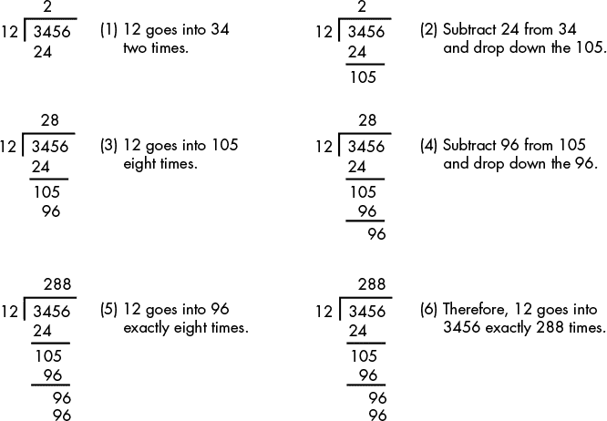
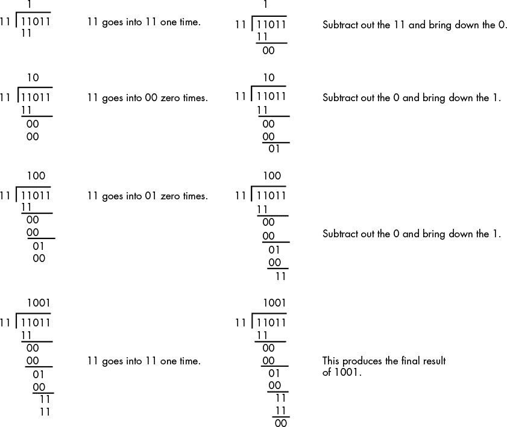
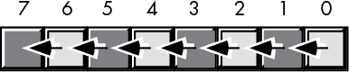
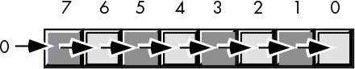
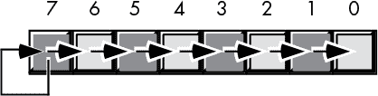
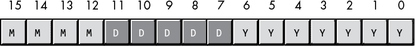
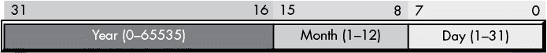
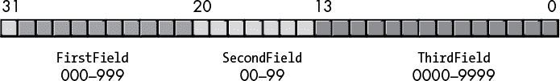
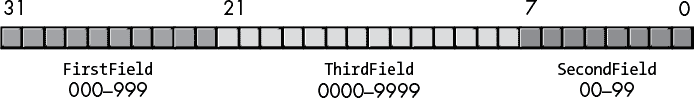
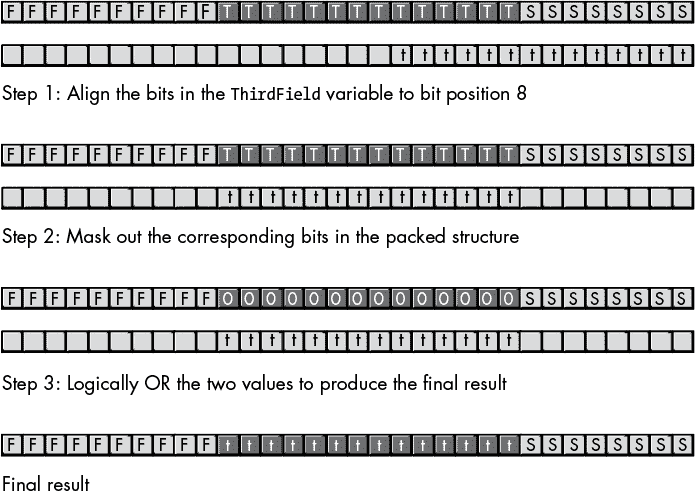

## 第三章：**二进制算术和位运算**


正如第二章所解释的，理解计算机如何以二进制表示数据是编写在计算机上运行良好的软件的前提。与此同样重要的是理解计算机如何处理二进制数据。这是本章的重点，探讨了对二进制数据的算术、逻辑和位运算。

### 3.1 二进制和十六进制数的算术运算

通常，你需要手动对两个二进制（或十六进制）值进行运算，以便将结果用于你的源代码中。虽然有计算器可以计算这些结果，但你应该能够手动对二进制操作数进行简单的算术运算。十六进制算术相对复杂，因此十六进制计算器（或支持十六进制运算的软件计算器，如 Windows 计算器或智能手机应用）应该放在每个程序员的桌面上。然而，二进制算术比十进制算术更简单。

知道如何手动计算二进制算术结果非常重要，因为许多重要的算法使用这些运算（或其变种）。本节描述了如何手动进行二进制的加法、减法、乘法和除法运算，并执行各种逻辑运算。

#### *3.1.1 二进制值的加法*

将两个二进制值相加很简单；只需要掌握八条规则：^(1)

+   0 + 0 = 0

+   0 + 1 = 1

+   1 + 0 = 1

+   1 + 1 = 0，带进位

+   进位 + 0 + 0 = 1

+   进位 + 0 + 1 = 0，带进位

+   进位 + 1 + 0 = 0，带进位

+   进位 + 1 + 1 = 1，带进位

一旦掌握了这八条规则，你就可以将任意两个二进制值相加。以下是一个逐步的二进制加法示例：

```
          0101

        + 0011

        ------

Step 1: Add the LO bits (1 + 1 = 0 + carry).

            c

          0101

        + 0011

        ------

             0

Step 2: Add the carry plus the bits in bit position 1 (carry + 0 + 1 = 0 + carry).

           c

          0101

        + 0011

        -------

            00

Step 3: Add the carry plus the bits in bit position 2 (carry + 1 + 0 = 0 + carry).

          c

          0101

        + 0011

        ------

           000

Step 4: Add the carry plus the bits in bit position 3 (carry + 0 + 0 = 1).

          0101

        + 0011

        ------

          1000
```

这里是一些更多的示例：

```
  1100_1101       1001_1111       0111_0111

+ 0011_1011     + 0001_0001     + 0000_1001

-----------     -----------     -----------

1_0000_1000       1011_0000       1000_0000
```

#### *3.1.2 二进制值的减法*

与加法类似，二进制减法有八条规则：

+   0 – 0 = 0

+   0 – 1 = 1，借位

+   1 – 0 = 1

+   1 – 1 = 0

+   0 – 0 – 借位 = 1，带借位

+   0 – 1 – 借位 = 0，带借位

+   1 – 0 – 借位 = 0

+   1 – 1 – 借位 = 1，带借位

这是一个逐步的二进制减法示例：

```
          0101

        - 0011

        ------

Step 1: Subtract the LO bits (1 – 1 = 0).

          0101

        - 0011

        ------

             0

Step 2: Subtract the bits in bit position 1 (0 – 1 = 1 + borrow).

          0101

        - 0011

           b

        ------

            10

Step 3: Subtract the borrow and the bits in bit position 2 (1 – 0 – b = 0).

          0101

        - 0011

        ------

           010

Step 4: Subtract the bits in bit position 3 (0 – 0 = 0).

          0101

        - 0011

        ------

          0010
```

这里是一些更多的示例：

```
  1100_1101       1001_1111       0111_0111

- 0011_1011     - 0001_0001     - 0000_1001

-----------     -----------     -----------  

  1001_0010       1000_1110       0110_1110
```

#### *3.1.3 二进制值的乘法*

二进制数的乘法很简单；它遵循与十进制乘法相同的规则，只涉及 0 和 1：

+   0 × 0 = 0

+   0 × 1 = 0

+   1 × 0 = 0

+   1 × 1 = 1

这是一个逐步的二进制乘法示例：

```
      1010

   ×  0101

   -------

Step 1: Multiply the LO bit of the multiplier times the multiplicand.

      1010

   ×  0101

   -------

      1010    (1 × 1010)

Step 2: Multiply bit 1 of the multiplier times the multiplicand.

      1010

   ×  0101

   -------

      1010    (1 × 1010)

      0000    (0 × 1010)

   -------

     01010    (partial sum)

Step 3: Multiply bit 2 of the multiplier times the multiplicand.

      1010

   ×  0101

   -------

    001010    (previous partial sum)

    1010      (1 × 1010)

   -------

    110010    (partial sum)

Step 4: Multiply bit 3 of the multiplier times the multiplicand.

      1010

   ×  0101

   -------

    110010    (previous partial sum)

   0000       (0 × 1010)

   -------

   0110010    (product)
```

#### *3.1.4 二进制值的除法*

二进制除法使用与十进制除法相同的（长除法）算法。图 3-1 显示了一个十进制除法问题的步骤。



*图 3-1：十进制除法（3456/12）*

这个算法在二进制下更简单，因为在每一步中，你不需要猜测 12 能被余数整除多少次，也不需要将 12 与你的猜测相乘来获得需要减去的数值。在二进制算法的每一步中，除数只能整除余数零次或一次。例如，考虑将 27（11011）除以 3（11）的过程，如图 3-2 所示。



*图 3-2：二进制长除法*

### 3.2 位运算

我们需要在十六进制和二进制数上执行四种主要的逻辑运算：与（AND）、或（OR）、异或（XOR，排他或）和非（NOT）。与算术运算不同，执行这些运算不需要十六进制计算器。

逻辑与（AND）、或（OR）和异或（XOR）运算接受两个单比特操作数，并计算出以下结果：

```
AND:

            0 and 0 = 0

            0 and 1 = 0

            1 and 0 = 0

            1 and 1 = 1

OR:

            0 or 0 = 0

            0 or 1 = 1

            1 or 0 = 1

            1 or 1 = 1

XOR:

            0 xor 0 = 0

            0 xor 1 = 1

            1 xor 0 = 1

            1 xor 1 = 0
```

表 3-1，3-2 和 3-3 显示了与（AND）、或（OR）和异或（XOR）操作的*真值表*。真值表就像你在小学时接触过的乘法表。左列的值对应于操作数的左操作数，顶行的值对应于右操作数。结果位于行和列的交点处（针对特定的一对操作数）。

**表 3-1：** 与（AND）真值表

| 与（AND） | 0 | 1 |
| --- | --- | --- |
| 0 | 0 | 0 |
| 1 | 0 | 1 |

**表 3-2：** 或（OR）真值表

| 或（OR） | 0 | 1 |
| --- | --- | --- |
| 0 | 0 | 1 |
| 1 | 1 | 1 |

**表 3-3：** 异或（XOR）真值表

| 异或（XOR） | 0 | 1 |
| --- | --- | --- |
| 0 | 0 | 1 |
| 1 | 1 | 0 |

用通俗的话来说，逻辑“与”运算的定义是：“如果第一个操作数为 1 且第二个操作数为 1，结果为 1；否则，结果为 0。”我们也可以这样表达：“如果任何一个或两个操作数为 0，结果为 0。”逻辑“与”运算对于强制得到 0 结果很有用。如果其中一个操作数为 0，无论另一个操作数的值是什么，结果都是 0。如果其中一个操作数为 1，则结果是另一个操作数的值。

通常来说，逻辑“或”运算的定义是：“如果第一个操作数或第二个操作数（或两者）为 1，结果为 1；否则，结果为 0。”这也被称为*包含*或*运算*。如果逻辑“或”运算的操作数之一为 1，则结果为 1。如果某个操作数为 0，则结果为另一个操作数的值。

用英语来说，逻辑“异或”运算的定义是：“如果第一个或第二个操作数为 1，但不是两个都为 1，结果为 1；否则，结果为 0。”如果某个操作数为 1，结果为另一个操作数的*逆（inverse）*值。

逻辑“非”运算是*一元*运算（意味着它只接受一个操作数）。表 3-4 是“非”运算的真值表。该运算符将其操作数的值取反。

**表 3-4：** 非（NOT）真值表

| 非（NOT） | 0 | 1 |
| --- | --- | --- |
|  | 1 | 0 |

### 3.3 二进制数和位串的逻辑运算

因为大多数编程语言操作的是 8 位、16 位、32 位或 64 位的位组，我们需要将这些逻辑操作的定义扩展到不仅限于单个位操作数，以便按位（或 *按位）的方式进行操作。给定两个值，按位逻辑函数对两个源操作数的位 0 进行操作，产生结果操作数的位 0；对两个操作数的位 1 进行操作，产生结果的位 1；以此类推。例如，如果你想计算两个 8 位数的按位逻辑 AND，你会对这两个数中的每一对位进行按位 AND 运算：

```
%1011_0101

%1110_1110

-----------

%1010_0100
```

这种按位执行同样适用于其他逻辑操作。当你使用逻辑 AND 和 OR 操作强制位为 `0` 或 `1`，以及使用逻辑 XOR 操作反转位时，它对于处理位串（如二进制数）非常重要。这些操作使你能够有选择性地操作值中的某些位，同时保持其他位不变。例如，如果你有一个 8 位的二进制值 *X*，并且你想确保第 4 到第 7 位为 `0`，可以将 *X* 与二进制值 `%0000_1111` 进行 AND 运算。此按位 AND 运算将强制 *X* 的高 4 位为 `0`，并且不改变 *X* 的低 4 位。同样，你可以通过将 *X* 与 `%0000_0001` 进行 OR 运算，再将 *X* 与 `%0000_0100` 进行异或（XOR）运算，来强制 *X* 的低位为 `1`，并反转 *X* 的第 2 位。

使用逻辑 AND、OR 和 XOR 运算操作位串被称为 *掩码操作*。这个术语来源于我们可以使用某些值（`1` 用于 AND，`0` 用于 OR 和 XOR）来“屏蔽”或“激活”操作数中的某些位，同时强制其他位为 `0`、`1` 或其反值。

几种语言提供了运算符，允许你计算其操作数的按位 AND、OR、XOR 和 NOT。C/C++/Java/Swift 语言族使用与号（`&`）表示按位 AND，竖线（`|`）表示按位 OR，插入符号（`^`）表示按位 XOR，波浪号（`~`）表示按位 NOT，如下所示：

```
// Here's a C/C++ example:

    i = j & k;    // Bitwise AND

    i = j | k;    // Bitwise OR

    i = j ^ k;    // Bitwise XOR

    i = ~j;       // Bitwise NOT
```

Visual Basic 和 Free Pascal/Delphi 语言允许你使用 `and`、`or`、`xor` 和 `not` 运算符与整数操作数。对于 80x86 汇编语言，你可以使用 `AND`、`OR`、`NOT` 和 `XOR` 指令。

### 3.4 有用的位操作

虽然位操作看起来可能有点抽象，但它们在许多非显而易见的用途上非常有用。本节描述了在各种语言中它们的一些有用特性。

#### *3.4.1 使用 AND 测试位串中的位*

你可以使用按位 AND 运算符来测试位串中的单个位，以查看它们是 `0` 还是 `1`。如果你将一个值与包含某个位位置为 `1` 的位串进行按位 AND 运算，且对应的位是 `0`，则 AND 运算的结果为 `0`；如果该位置的位是 `1`，结果则为非零。考虑以下 C/C++ 代码，它通过测试整数的第 0 位来检查一个整数值是奇数还是偶数：

```
IsOdd = (ValueToTest & 1) != 0;
```

在二进制形式下，以下是此按位与运算操作的实现：

```
xxxx_xxxx_xxxx_xxxx_xxxx_xxxx_xxxx_xxxx  // Assuming ValueToTest is 32 bits

0000_0000_0000_0000_0000_0000_0000_0001  // Bitwise AND with the value 1

---------------------------------------

0000_0000_0000_0000_0000_0000_0000_000x  // Result of bitwise AND
```

如果 ValueToTest 的最低位（LO bit）在位位置 0 处为 `0`，则结果为 `0`。如果 ValueToTest 在位位置 1 处为 `1`，则结果为 `1`。此计算忽略了 ValueToTest 中的其他所有位。

#### *3.4.2 使用 AND 测试一组位是否为零或非零*

你还可以使用按位与（bitwise AND）运算符来检查一组位是否全部为 `0`。例如，检查一个数字是否能被 16 整除的其中一种方法是检查最低的 4 位是否全为 `0`。以下是使用按位与运算符来实现这一点的 Free Pascal/Delphi 语句：

```
IsDivisibleBy16 := (ValueToTest and $f) = 0;
```

在二进制形式下，以下是此按位与运算操作的实现：

```
xxxx_xxxx_xxxx_xxxx_xxxx_xxxx_xxxx_xxxx  // Assuming ValueToTest is 32 bits

0000_0000_0000_0000_0000_0000_0000_1111  // Bitwise AND with $F

---------------------------------------

0000_0000_0000_0000_0000_0000_0000_xxxx  // Result of bitwise AND
```

只有当且仅当 `ValueToTest` 的最低 4 位全为 `0` 时，结果才为 `0`。

#### *3.4.3 比较二进制字符串中的一组位*

AND 和 OR 操作特别有用，如果你需要将二进制值中的某一位子集与其他值进行比较。例如，你可能想比较两个 6 位值，这两个值分别位于两个 32 位值的位 0、1、10、16、24 和 31 中。诀窍是将所有不感兴趣的位设置为 `0`，然后比较两个结果。^(2)

请考虑以下三个二进制值；`x` 表示我们不关心的位：

```
%1xxxxxx0xxxxxxx1xxxxx0xxxxxxxx10

%1xxxxxx0xxxxxxx1xxxxx0xxxxxxxx10

%1xxxxxx1xxxxxxx1xxxxx1xxxxxxxx11
```

第一个和第二个二进制值（假设我们只关注位 31、24、16、10、1 和 0）是相等的。如果我们将这两个值中的任何一个与第三个值进行比较，我们会发现它们不相等。第三个值也大于前两个值。在 C/C++ 和汇编语言中，我们可以通过以下方式比较这些值：

```
// C/C++ example

    if( (value1 & 0x81010403) == (value2 & 0x81010403))

    {

        // Do something if bits 31, 24, 16, 10, 1, and 0 of

        // value1 and value2 are equal

    }

    if( (value1 & 0x81010403) != (value3 & 0x81010403))

    {

        // Do something if bits 31, 24, 16, 10, 1, and 0 of

        // value1 and value3 are not equal

    }

// HLA/x86 assembly example:

    mov( value1, eax );        // EAX = value1

    and( $8101_0403, eax );   // Mask out unwanted bits in EAX

    mov( value2, edx );        // EDX = value2

    and( $8101_0403, edx );   // Mask out the same set of unwanted bits in EDX

    if( eax = edx ) then      // See if the remaining bits match

        // Do something if bits 31, 24, 16, 10, 1, and 0 of

        // value1 and value2 are equal

    endif;

    mov( value1, eax );       // EAX = value1

    and( $8101_0403, eax );  // Mask out unwanted bits in EAX

    mov( value3, edx );       // EDX = value2

    and( $8101_0403, edx );  // Mask out the same set of unwanted bits in EDX

    if( eax <> edx ) then    // See if the remaining bits do not match

        // Do something if bits 31, 24, 16, 10, 1, and 0 of

        // value1 and value3 are not equal

    endif;
```

#### *3.4.4 使用 AND 创建模-*n* 计数器*

一个 *模-*n* 计数器* 从 0^(3) 计数到某个最大值，然后重置为 0。模-*n* 计数器非常适合创建重复的数字序列，例如 0, 1, 2, 3, 4, 5, . . . *n* – 1; 0, 1, 2, 3, 4, 5, . . . *n* – 1; 0, 1, . . .。你可以使用这样的序列来创建循环队列和其他在遇到数据结构末尾时重新利用数组元素的对象。创建模-*n* 计数器的常规方法是将计数器加 1，然后将结果除以 *n*，最后保留余数。以下是 C/C++、Pascal 和 Visual Basic 中模-*n* 计数器实现的代码示例：

```
cntr = (cntr + 1 ) % n;    // C/C++/Java/Swift

cntr := (cntr + 1) mod n;  // Pascal/Delphi

cntr = (cntr + 1) Mod n     ' Visual Basic
```

然而，除法是一种昂贵的操作，执行的时间远长于加法。通常，你会发现使用比较而不是取余运算符来实现模-*n* 计数器更为高效。以下是一个 Pascal 示例：

```
cntr := cntr + 1;      // Pascal example

if( cntr >= n ) then

    cntr := 0;
```

对于某些特殊情况，当 *n* 是 2 的幂时，你可以使用 AND 操作更高效、方便地增加模 *n* 计数器。为此，增加你的计数器，然后将其与值 *x* = 2^(*m*) – 1 进行逻辑与运算（2^(*m*) – 1 在比特位 0..*m* – 1 中包含 `1`，其他地方是 `0`）。因为 AND 操作比除法快得多，所以使用 AND 的模 *n* 计数器比使用余数操作符的要高效得多。在大多数 CPU 上，使用 AND 操作要比使用 `if` 语句快得多。以下示例展示了如何使用 AND 操作实现一个模 *n* 计数器，其中 *n* = 32：

```
//Note: 0x1f = 31 = 25 – 1, so n = 32 and m = 5

    cntr = (cntr + 1) & 0x1f;    // C/C++/Java/Swift example

    cntr := (cntr + 1) and $1f;  // Pascal/Delphi example

    cntr = (cntr + 1) and &h1f    ' Visual Basic example
```

汇编语言代码特别高效：

```
inc( eax );                      // Compute (eax + 1) mod 32

and( $1f, eax );
```

### 3.5 左移与旋转

另一组对比特串的逻辑操作是 *左移* 和 *旋转* 操作。这些功能可以进一步细分为 *左移*、*左旋转*、*右移* 和 *右旋转*。这些操作在许多程序中都非常有用。

左移操作将每个比特在比特串中向左移动一个位置，如 图 3-3 所示。比特 0 移动到比特位置 1，原先在比特位置 1 的值移到比特位置 2，依此类推。



*图 3-3：左移操作（对一个字节）*

你可能会问两个问题：“什么会进入比特 0？”和“HO 比特会最终去哪？”我们会将 `0` 移入比特 0，HO 比特的前一个值将成为这次操作的*进位*。

许多高级语言（如 C/C++/C#、Swift、Java 和 Free Pascal/Delphi）提供了左移操作符。在 C 语言家族中，该操作符是 `<<`。在 Free Pascal/Delphi 中，你使用 `shl` 操作符。以下是一些示例：

```
// C:

        cLang = d << 1;     // Assigns d shifted left one position to

                            // variable "cLang"

// Delphi:

        Delphi := d shl 1;  // Assigns d shifted left one position to

                            // variable "Delphi"
```

将一个数字的二进制表示向左移动一位，相当于将该值乘以 2。如果你使用的编程语言没有提供显式的左移操作符，你可以通过将二进制整数值乘以 2 来模拟这一操作。虽然乘法操作通常比左移操作慢，但大多数编译器足够智能，能够将乘以 2 的常数转换为左移操作。因此，你可以像下面这样在 Visual Basic 中编写代码来进行左移：

```
vb = d * 2
```

右移操作类似于左移操作，区别在于我们将数据朝相反方向移动。比特 7 移动到比特 6，比特 6 移动到比特 5，比特 5 移动到比特 4，依此类推。在右移操作中，我们会将 `0` 移入比特 7，比特 0 将成为操作的进位（参见 图 3-4）。C、C++、C#、Swift 和 Java 使用 `>>` 操作符进行右移操作。Free Pascal/Delphi 使用 `shr` 操作符。大多数汇编语言也提供了右移指令（在 80x86 上是 `shr`）。



*图 3-4：右移操作（对一个字节）*

将一个无符号二进制值右移一个位置相当于将该值除以 2。例如，如果你将无符号表示的 254 (`$FE`) 右移一位，你得到的是 127 (`$7F`)，完全符合预期。然而，如果你将 8 位二进制补码表示的 –2 (`$FE`) 右移一位，你得到的是 127 (`$7F`)，这显然是*不正确*的。为了通过右移将有符号数除以 2，我们使用第三种右移操作——*算术右移*，它不会改变 HO 位的值。图 3-5 展示了一个 8 位操作数的算术右移操作。



*图 3-5：算术右移操作（字节级）*

对于二进制补码的有符号操作数，这通常会产生你预期的结果。例如，如果你对 –2 (`$FE`) 执行算术右移操作，得到的是 –1 (`$FF`)。然而，值得注意的是，这种操作总是将数字舍入到*小于或等于实际结果*的最接近整数。如果你对 –1 (`$FF`) 执行算术右移，结果是 –1，而不是 0。因为 –1 小于 0，所以算术右移操作会向 –1 舍入。这不是算术右移操作的“bug”；它只是采用了不同（尽管有效）的整数除法定义。关键是，在不支持算术右移的语言中，你可能无法使用有符号除法运算符来代替算术右移，因为大多数整数除法运算符是向 0 舍入的。

高级语言同时支持逻辑右移和算术右移的情况很少见。更糟糕的是，某些语言的规范将是否使用算术右移或逻辑右移操作的决定权留给编译器的实现者。因此，只有在操作数的最高有效位（HO 位）会导致两种右移操作产生相同结果时，使用右移运算符才是安全的。为了保证右移是逻辑右移或算术右移操作，你必须降到汇编语言中，或者手动处理 HO 位。高级代码很快就会变得难以维护，因此如果你的程序不需要跨不同 CPU 可移植，快速的内联汇编语句可能是更好的解决方案。以下代码演示了如何在不保证右移类型的语言中模拟 32 位逻辑右移和算术右移：

```
// Written in C/C++, assuming 32-bit integers, logical shift right:

    // Compute bit 30.

    Bit30 = ((ShiftThisValue & 0x80000000) != 0) ? 0x40000000 : 0;

    // Shifts bits 0..30.

    ShiftThisValue = (ShiftThisValue & 0x7fffffff) >> 1;

    // Merge in Bit #30.

    ShiftThisValue = ShiftThisValue | Bit30; 

// Arithmetic shift right operation

    Bits3031 = ((ShiftThisValue & 0x80000000) != 0) ? 0xC0000000 : 0;

    // Shifts bits 0..30.

    ShiftThisValue = (ShiftThisValue & 0x7fffffff) >> 1;

    // Merge bits 30/31.

    ShiftThisValue = ShiftThisValue | Bits3031;
```

许多汇编语言还提供各种旋转指令，通过将操作数一端移出的位重新移入另一端，循环移动位。很少有高级语言提供这种操作；幸运的是，你通常不需要使用它。如果你确实需要，你可以使用你所用高级语言中可用的移位运算符来合成这种操作：

```
// Pascal/Delphi Rotate Left, 32-bit example:

// Puts bit 31 into bit 0, clears other bits.

CarryOut := (ValueToRotate shr 31); 

ValueToRotate := (ValueToRotate shl 1) or CarryOut;
```

有关可能的移位和旋转操作的更多信息，请参考 *汇编语言的艺术*（No Starch Press）。

### 3.6 比特字段和打包数据

CPU 通常在字节、字、双字和四字数据类型上运行最为高效，^(4)但偶尔你需要处理的某些数据类型的大小并非 8、16、32 或 64 位。在这种情况下，你可能通过将不同的比特串尽可能紧凑地打包在一起而节省一些内存，避免浪费任何比特来对齐特定的数据字段到字节或其他边界。

假设日期为 04/02/01。表示这个日期需要三个数字值：月份、日期和年份。月份使用 1 到 12 的值，至少需要 4 个比特来表示。日期使用 1 到 31 的范围，需要 5 个比特来表示。年份值，假设我们处理的是 0 到 99 之间的值，则需要 7 个比特。4 + 5 + 7 总共是 16 个比特，或者 2 字节。我们可以将日期数据打包成 2 字节，而不是每个值使用一个单独的字节，这样每存储一个日期就能节省 1 字节内存。如果你需要存储许多日期，这可能会带来显著的节省。你可以像 图 3-6 中所示那样排列这些比特。



*图 3-6：短整型打包日期格式（16 位）*

`MMMM` 代表保存月份值的 4 个比特，`DDDDD` 代表保存日期值的 5 个比特，`YYYYYYY` 代表保存年份值的 7 个比特。每一组表示数据项的比特就是一个 *比特字段*。我们可以用 `$4101` 来表示 2001 年 4 月 2 日：

```
0100    00010    0000001    = %0100_0001_0000_0001 or $4101

 04      02       01
```

尽管打包值在空间上是高效的（也就是说，它们使用较少的内存），但它们在计算上是低效的（慢！）。原因是什么？因为需要额外的指令从不同的比特字段中解包数据。这些额外的指令需要时间来执行（并且还需要额外的字节来存储指令）；因此，你必须仔细考虑打包数据字段是否真的能为你节省什么。以下是一个示例 HLA/x86 代码，演示了如何打包和解包这种 16 位日期格式。

```
program dateDemo;

#include( "stdlib.hhf" )

static

    day:        uns8;

    month:      uns8;

    year:       uns8;

    packedDate: word;

begin dateDemo;

    stdout.put( "Enter the current month, day, and year: " );

    stdin.get( month, day, year );

    // Pack the data into the following bits:

    //

    //  15 14 13 12 11 10  9  8  7  6  5  4  3  2  1  0

    //   m  m  m  m  d  d  d  d  d  y  y  y  y  y  y  y

    mov( 0, ax );

    mov( ax, packedDate );  // Just in case there is an error.

    if( month > 12 ) then 

        stdout.put( "Month value is too large", nl );

    elseif( month = 0 ) then 

        stdout.put( "Month value must be in the range 1..12", nl );

    elseif( day > 31 ) then 

        stdout.put( "Day value is too large", nl );

    elseif( day = 0 ) then 

        stdout.put( "Day value must be in the range 1..31", nl );

    elseif( year > 99 ) then 

        stdout.put( "Year value must be in the range 0..99", nl );

    else

        mov( month, al );

        shl( 5, ax );

        or( day, al );

        shl( 7, ax );

        or( year, al );

        mov( ax, packedDate );

    endif;

    // Okay, display the packed value:

    stdout.put( "Packed data = $", packedDate, nl );

    // Unpack the date:

    mov( packedDate, ax );

    and( $7f, al );         // Retrieve the year value.

    mov( al, year );

    mov( packedDate, ax );  // Retrieve the day value.

    shr( 7, ax );

    and( %1_1111, al );

    mov( al, day );

    mov( packedDate, ax );  // Retrieve the month value.

    rol( 4, ax );

    and( %1111, al );

    mov( al, month );

    stdout.put( "The date is ", month, "/", day, "/", year, nl ); 

end dateDemo;
```

记住 Y2K^(5) 问题，采用仅支持两位数年份的日期格式是相当愚蠢的。考虑 图 3-7 中展示的更好的日期格式。



*图 3-7：长整型打包日期格式（32 位）*

由于 32 位变量中的比特数超过了存储日期所需的数量，即使考虑到年份范围为 0 到 65,535，这种格式仍为 `month` 和 `day` 字段分配了一个完整的字节。应用程序可以将这两个字段作为字节对象进行操作，从而减少在支持字节访问的处理器上打包和解包这些字段的开销。这为年份留下了更少的比特，但 65,536 年可能足够了（你可以放心地认为你的软件在 63,000 年后不会再使用）。

你可以认为这不再是打包日期格式。毕竟，我们需要三个数值，其中两个可以各自正好适应 1 个字节，而一个至少需要 2 个字节。这种“打包”的日期格式消耗了与解包版本相同的 4 个字节，而不是最少的位数。所以，在这个例子中，打包实际上意味着*打包*或*封装*。通过将数据打包到一个双字变量中，程序可以将日期值视为一个单一的数据值，而不是三个单独的变量。这意味着你通常可以用一条机器指令操作这组数据，而不是三条单独的指令。

这个长日期格式与 图 3-6 中的短日期格式之间的另一个区别在于，长日期格式重新排列了 `年份`、`月份` 和 `日期` 字段。这使你可以轻松地使用无符号整数比较两个日期。考虑以下 HLA/汇编代码：

```
mov( Date1, eax );        // Assume Date1 and Date2 are double-word variables

if( eax > Date2 ) then    // using the long packed date format.

    << do something if Date1 > Date2 >>

endif;
```

如果你将不同的日期字段保存在单独的变量中，或者以不同方式组织字段，你就无法像现在这样简单地比较 `Date1` 和 `Date2`。即使你没有节省任何空间，打包数据也可以使某些计算变得更方便，甚至更高效（这与通常在打包数据时发生的情况相反）。

一些高级语言提供对打包数据的内置支持。例如，在 C 中，你可以定义如下结构：

```
struct

{

    unsigned bits0_3   :4;

    unsigned bits4_11  :8;

    unsigned bits12_15 :4;

    unsigned bits16_23 :8;

    unsigned bits24_31 :8;

} packedData;
```

这个结构指定每个字段是一个无符号对象，分别包含 4 位、8 位、4 位、8 位和 8 位。每个声明后的 `:`n 项指定编译器为给定字段分配的*最小*位数。

不幸的是，无法展示 C/C++ 编译器如何在字段之间分配来自 32 位双字的数据值，因为 C/C++ 编译器的实现者可以自由选择任何方式实现这些位字段。位字符串中位的排列是任意的（例如，编译器可能将 `bits0_3` 字段分配到最终对象的第 28 到 31 位之间）。编译器还可以在字段之间插入额外的位，或者为每个字段使用更多的位（这实际上和在字段之间插入额外的填充位是同一件事）。大多数 C 编译器会尽量减少多余的填充，但编译器（尤其是在不同的 CPU 上）确实存在差异。因此，C/C++ 结构体位字段声明几乎肯定是不可移植的，你无法依赖编译器对这些字段的处理方式。

使用编译器的内置数据打包功能的优点是，编译器会自动为你打包和解包数据。给定以下 C/C++ 代码，编译器会自动生成必要的机器指令，为你存储和检索单个位字段：

```
struct

{

    unsigned year  :7;

    unsigned month :4;

    unsigned day   :5;

} ShortDate;

        . . .

    ShortDate.day = 28;

    ShortDate.month = 2;

    ShortDate.year = 3;  // 2003
```

### 3.7 数据打包与解包

打包数据类型的优点是高效的内存使用。以美国的社会安全号码（SSN）为例，它是一个九位数的身份识别码，格式如下（每个 `X` 代表一个数字）：

```
XXX–XX–XXXX
```

使用三个单独的 32 位整数来编码 SSN 需要 12 字节。这比使用字符数组表示该数字所需的 11 字节还要多。更好的解决方案是使用短整数（16 位）编码每个字段。这样只需要 6 字节就能表示 SSN。由于 SSN 中间字段的值总是在 0 到 99 之间，我们实际上可以通过用一个字节来编码中间字段，再缩减这个结构的大小。以下是一个示例 Free Pascal/Delphi 记录结构，定义了这个数据结构：

```
SSN :record

        FirstField:  smallint;  // smallints are 16 bits in Free Pascal/Delphi

        SecondField: byte;

        ThirdField:  smallint;

end;
```

如果我们去掉 SSN 中的连字符，结果是一个九位数的数字。因为我们可以用 30 位精确表示所有九位数值，因此可以使用 32 位整数来编码任何合法的 SSN。然而，一些处理 SSN 的软件可能需要操作各个字段。这意味着必须使用昂贵的除法、取余和乘法运算符，以从你已编码为 32 位整数格式的 SSN 中提取字段。此外，使用 32 位格式时，将 SSN 转换为字符串并进行转换会更复杂。

相反，使用快速机器指令插入和提取单独的位字段非常容易，而且创建这些字段的标准字符串表示（包括连字符）也更轻松。图 3-8 展示了使用每个字段的单独位串实现 SSN 打包数据类型的简单实现（请注意，该格式使用 31 位并忽略了 HO 位）。



*图 3-8：SSN 打包字段编码*

在打包数据对象中，从第 0 位开始的字段可以最有效地访问，因此你应该在打包数据类型中安排字段，使得你最常访问的字段^(6)从第 0 位开始。如果你不知道哪个字段会被访问得最频繁，则应将字段安排在字节边界上。如果你的打包类型中有未使用的位，应将它们均匀分布在整个结构中，以确保各个字段从字节边界开始，并且这些字段占据的是 8 位的倍数。

在图 3-8 中展示的 SSN 示例中，我们只有一个未使用的位，但实际上我们可以利用这个额外的位将两个字段对齐到字节边界，并确保其中一个字段占据一个长度为 8 位倍数的位串。请参考图 3-9，它展示了我们 SSN 数据类型的重新排列版本。



*图 3-9：可能改进的 SSN 编码*

图 3-9 中的数据格式的一个问题是，我们无法通过比较 32 位无符号整数以直观的方式对 SSN 进行排序。^(7) 如果你打算对整个 SSN 进行大量排序，图 3-8 中的格式可能会更好。

如果这种排序方式对你不重要，那么图 3-9 中的格式有一些优势。这个打包格式实际上使用了 8 位（而不是 7 位）来表示`SecondField`（同时将`SecondField`移到位位置 0）；额外的一位将始终包含`0`。这意味着`SecondField`占用了位 0 到 7（一个完整的字节），而`ThirdField`从字节边界开始（位位置 8）。`ThirdField`并不占用 8 位的倍数，且`FirstField`并不从字节边界开始，但考虑到我们只多了一个额外的位来处理，整个编码效果还算不错。

下一个问题是：“我们如何访问这个打包类型的字段？”这里有两个独立的操作。我们需要检索或*提取*打包字段，并且需要*插入*数据到这些字段中。AND、OR 和 SHIFT 操作提供了完成这些操作的工具。

在操作这些字段时，使用三个独立的变量而不是直接操作打包数据会更方便。以我们的 SSN 示例为例，我们可以创建三个变量——`FirstField`、`SecondField` 和 `ThirdField`——然后从打包的值中提取实际数据到这三个变量中，操作这些变量，最后在完成操作后将数据插入回各自的字段。

要从图 3-9 所示的打包格式中提取`SecondField`数据（记住，位 0 对齐的字段最容易访问），将打包表示中的数据复制到`SecondField`变量，然后使用 AND 操作屏蔽除`SecondField`位之外的所有位。因为`SecondField`是一个 7 位的值，所以掩码是一个整数，包含位位置 0 到 6 为`1`，其他位置为`0`。下面的 C/C++ 代码演示了如何将此字段提取到`SecondField`变量中（假设 packedValue 是一个保存了 32 位打包 SSN 的变量）：

```
SecondField = packedValue & 0x7f;   // 0x7f = %0111_1111
```

提取那些没有对齐在位 0 上的字段需要稍微多一点工作。考虑图 3-9 中的`ThirdField`条目。我们可以通过逻辑 AND 操作将打包值与`%_11_1111_1111_1111_0000_0000`（`$3F_FF00`）进行与运算，从而屏蔽掉与第一和第二字段相关的所有位。然而，这样会把`ThirdField`值留在位 8 到 21 中，这对于各种算术操作并不方便。解决方法是将掩码后的值向下移 8 位，使其与我们的工作变量的位 0 对齐。下面的 Pascal/Delphi 代码实现了这个过程：

```
ThirdField := (packedValue and $3fff00) shr 8;
```

你也可以先进行移位操作，然后执行逻辑与（AND）操作（不过这需要使用不同的掩码，`$11_1111_1111_1111 或 $3FFF`）。以下是使用该技术提取`ThirdField`的 C/C++/Swift 代码：

```
ThirdField = (packedValue >> 8) & 0x3FFF;
```

为了提取一个对齐在高位（HO）位的字段，例如我们 SSN 打包数据类型中的第一个字段，需要将高位字段移到第 0 位。逻辑右移操作会自动将结果的高位填充为`0`，因此不需要掩码操作。以下 Pascal/Delphi 代码演示了这一过程：

```
FirstField := packedValue shr 22; // Delphi's SHR is a logical shift right.
```

在 HLA/x86 汇编语言中，我们可以轻松地访问内存中任意字节边界的数据。这使得我们能够将第二个和第三个字段看作它们在数据结构中的对齐位置是从第 0 位开始的。此外，由于`SecondField`值是一个 8 位值（高位始终为`0`），因此只需要一个机器指令就能解包数据，如下所示：

```
movzx( (type byte packedValue), eax );
```

该指令提取打包值对象的第一个字节（在 80x86 架构中是打包值的低 8 位），并将该值零扩展为 32 位存储在 EAX 寄存器中（`movzx`表示“带零扩展的移动”）。该指令执行后，EAX 寄存器包含`SecondField`值。

来自打包数据类型的`ThirdField`值并不是 8 位的整数倍长度，因此我们仍然需要进行一个掩码操作，以清除我们产生的 32 位结果中的未使用位。然而，由于`ThirdField`在打包结构中是对齐在字节（8 位）边界上的，我们将能够避免在高级代码中所需的移位操作。以下是提取打包值对象中第三个字段的 HLA/x86 汇编代码：

```
mov( (type word packedValue[1]), ax );    // Extracts bytes 1 & 2 

                                        // from packedValue.

and( $3FFF, eax );                      // Clears all the undesired bits.
```

在 HLA/x86 汇编代码中，从打包值对象中提取`FirstField`与高级代码相同；我们只需将包含`FirstField`的上 10 位移到第 0 位：

```
mov( packedValue, eax );

shr( 22, eax );
```

假设你要插入的数据存储在某个变量中，并且在未使用的位中包含`0`，那么将一个字段插入到一个打包的对象中需要三步操作。首先，如果有必要，你需要将字段的数据向左移动，使其对齐方式与打包对象中对应字段的对齐方式一致。接下来，清除打包结构中的对应位，然后使用逻辑或（OR）操作将移动后的字段插入到打包对象中。图 3-10 显示了这一操作的细节。



*图 3-10：将`ThirdField`插入到 SSN 打包类型中*

以下是完成图 3-10 中显示操作的 C/C++/Swift 代码：

```
packedValue = (packedValue & 0xFFc000FF) | (ThirdField << 8 );
```

`$FFC000FF`是一个十六进制值，它对应于从第 8 位到第 21 位的`0`，而其他位置是`1`。

### 3.8 更多信息

Hyde, Randall. *汇编语言艺术*。第二版。旧金山：No Starch Press，2010。

Knuth, Donald E. *计算机程序设计的艺术，第 2 卷：半数值算法*。第三版。波士顿：Addison-Wesley，1998。
