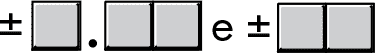
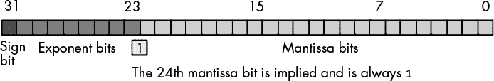
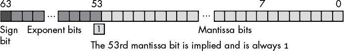
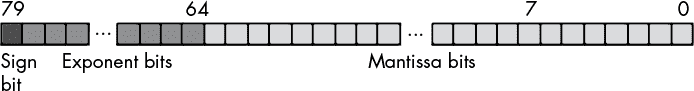
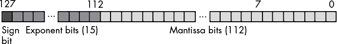

## 第四章：**浮点表示**


浮点算术是实数算术的近似，它解决了整数数据类型的一个主要问题——无法表示小数值。然而，这种近似中的不准确性可能会导致应用软件中的严重缺陷。为了编写能够在使用浮点算术时产生正确结果的优秀软件，程序员必须了解计算机底层的数字表示，并准确理解浮点算术如何近似实数算术。

### 4.1 浮点算术简介

实际上有无限多的实数值。浮点表示使用有限数量的位，因此只能表示有限数量的不同值。当给定的浮点格式无法精确表示某个实数值时，会使用该格式*可以*精确表示的最接近的值。本节将描述浮点格式的工作原理，以便你更好地理解这些近似值的缺点。

考虑一下整数和定点格式的一些问题。整数不能表示任何小数值，它们只能表示范围在 0 到 2^(*n*) – 1 或–2^(*n*)^(–1)到 2^(*n*)^(–1) – 1 之间的值。定点格式表示小数值，但以牺牲它们可以表示的整数值的范围为代价。浮点格式解决的这个问题就是*【动态范围】(gloss01.xhtml#gloss01_85)*。

考虑一个简单的 16 位无符号定点格式，它使用 8 位表示小数部分，8 位表示整数部分。整数部分可以表示 0 到 255 之间的值，小数部分可以表示 0 和介于 2^(–8)与 1 之间的小数（精度大约为 2^(–8)）。如果在一串计算中只需要 2 位表示小数值 0.0、0.25、0.5 和 0.75，那么小数部分的额外 6 位就浪费了。如果我们能将这些位用在数字的整数部分，将其范围从 0 到 255 扩展到 0 到 16,383，那该多好呢？这就是浮点表示的基本概念。

在浮点值中，基数点（二进制点）可以根据需要在数字的各个数字之间浮动。因此，在一个 16 位二进制数中，如果只需要 2 位精度表示小数部分，那么二进制点可以在第 1 位和第 2 位之间浮动，从而将第 2 位到第 15 位用于整数部分。浮点格式需要一个额外的字段来指定基数点在数字中的位置，这相当于科学计数法中的指数部分。

大多数浮点格式使用若干位来表示尾数，并用较少的位来表示指数*.* *尾数*是一个通常位于有限范围内的基本值（例如，介于 0 和 1 之间）。*指数*是一个乘数，应用于尾数后，能生成超出该范围的值。尾数/指数配置的一个大优点是，浮点格式可以表示广泛范围的值。然而，将数字分为这两部分意味着浮点格式只能表示具有特定数量*有效*数字的数字。如果最小指数与最大指数之间的差值大于尾数中有效数字的数量（通常是这样的），那么浮点格式就无法精确表示浮点表示中最小和最大值之间的所有整数。

为了看到有限精度算术的影响，我们将采用一个简化的*十进制*浮点格式作为例子。我们的浮点格式将使用一个有三位有效数字的尾数，并使用一个有两位数字的十进制指数。尾数和指数都是有符号值，如图 4-1 所示。



*图 4-1：简单的浮点格式*

这种特定的浮点表示可以逼近 0.00 到 9.99 × 10⁹⁹之间的所有值。然而，这种格式无法表示这个范围内的所有（整数）值（那需要 100 位的精度！）。像 9,876,543,210 这样的值将被逼近为 9.88 × 10⁹（或`9.88e+9`，这是本书中通常使用的编程语言表示法）。

浮点格式无法像整数格式那样**精确**表示那么多不同的值，因为浮点格式对同一值编码了多种表示（即不同的位模式）。例如，在图 4-1 中展示的简化十进制浮点格式中，`1.00e` `+` `1`和`0.10e + 2`是同一值的不同表示。由于不同可能表示的数量是有限的，每当一个值有两个可能的表示时，这就意味着该格式能表示的唯一值少了一个。

此外，浮点格式（科学计数法的一种形式）使得算术运算变得稍微复杂一些。在进行科学计数法下的加法和减法时，必须调整两个数值，使它们的指数相同。例如，在加法运算`1.23e1`与`4.56e0`时，可以将`4.56e0`转换为`0.456e1`，然后再进行相加。结果`1.686e1`无法符合我们当前格式的三位有效数字，因此我们必须将结果*四舍五入*或*截断*至三位有效数字。通常，四舍五入能产生最准确的结果，因此我们将结果四舍五入为`1.69e1`。缺乏*精度*（在计算中保持的数字或位数）会影响*准确性*（计算的正确性）。

在前面的例子中，我们能够四舍五入结果，因为我们在计算过程中保持了*四*位有效数字。如果我们的浮点计算在计算过程中仅限于三位有效数字，我们就必须截断（舍弃）较小数字的最后一位，得到`1.68e1`，这结果甚至不那么准确。因此，为了提高准确性，我们在计算过程中使用额外的数字。这些额外的数字被称为*守卫数字*（在二进制格式中称为*守卫位*）。它们在一长串计算过程中大大提高了准确性。

单次计算中丧失的准确性通常不会很严重。然而，误差可能会在一系列浮点运算中累积，从而对整个计算结果产生较大影响。例如，假设我们将`1.23e3`与`1.00e0`相加。调整这两个数值，使它们的指数相同后进行加法得到`1.23e3` `+` `0.001e3`。即使四舍五入后，这两者之和仍为`1.23e3`。这可能看起来完全合理：如果我们只能保持三位有效数字，添加一个小值应该不会影响结果。然而，假设我们将`1.00e0`与`1.23e3`*相加 10 次*。第一次加法时，我们得到`1.23e3`。同样，第二次、第三次、第四次……直到第十次，我们都得到相同的结果。如果我们将`1.00e0`与自己相加 10 次，然后将结果（`1.00e1`）加到`1.23e3`，我们将得到一个不同的结果`1.24e3`。这是有限精度算术中的一个重要规则：

计算顺序可能会影响结果的准确性。

加法或减法操作涉及到相对大小（即指数的大小）相似的数字时，能得到更好的结果。如果你正在进行一个包含加法和减法的链式计算，应该将运算分组，以便先加或减那些大小接近的数值，再加或减那些差距较大的数值。

另一个关于加法和减法的问题是*虚假精度*。考虑计算`1.23e0` `-` `1.22e0`。这产生了`0.01e0`。尽管这在数学上等同于`1.00e` `–` `2`，但后者形式暗示最后两位数字（千分位和万分位）都是精确的 0。遗憾的是，经过此计算后，我们只有一个有效数字，这个数字在百分位上，而一些 FPU 或浮点软件包可能实际上会将随机数字（或位）插入低位位置。这引出了第二条重要规则：

每当你从两个同号数字中减去，或从两个异号数字中相加时，结果的精度可能会低于浮点格式中可用的精度。

乘法和除法不受这些问题的影响，因为在操作之前你无需调整指数；你只需将指数相加并乘以尾数（或将指数相减并除以尾数）。就其本身而言，乘法和除法不会产生特别差的结果。然而，它们会加剧值中已经存在的任何精度误差。例如，如果你将`1.23e0`乘以 2，而应该将`1.24e0`乘以 2，那么结果会比之前的更不准确。这引出了第三条重要规则：

在执行涉及加法、减法、乘法和除法的计算链时，先执行乘法和除法操作。

通常，通过应用常规的代数变换，你可以安排计算，使得乘法和除法操作先进行。例如，假设你想计算以下内容：

*x* × (*y* + *z*)

通常，你会将*y*和*z*相加，然后将它们的和乘以*x*。然而，如果你首先将表达式转化为以下形式，你会获得更高的精度：

*x* × *y* + *x* × *z*

现在你可以通过先执行乘法来计算结果。^(1)

乘法和除法也有其他问题。当你将两个非常大的或非常小的数字相乘时，可能会发生*溢出*或*下溢*。当你将一个小数字除以一个大数字，或一个大数字除以一个小数字时，也会发生这种情况。这引出了第四条规则：

在乘法和除法数字集合时，尽量选择具有相同相对大小的数字进行相乘或相除。

比较浮点数是非常危险的。考虑到任何计算中固有的不准确性（包括将输入字符串转换为浮点值），你*永远不要*直接比较两个浮点值是否相等。不同的计算可能会产生相同的（数学上的）结果，但它们的最低有效位可能不同。例如，将`1.31e0`与`1.69e0`相加应该得到`3.00e0`。同样，将`1.50e0`与`1.50e0`相加也应该得到`3.00e0`。然而，如果你将（`1.31e0` + `1.69e0`）与（`1.50e0` + `1.50e0`）进行比较，你可能会发现这两个和*不*相等。因为两个看似等效的浮点计算不一定会产生完全相等的结果，直接进行相等比较——只有在两个操作数的所有位（或数字）完全相同的情况下才会成功——可能会失败。

为了测试浮点数是否相等，首先确定在比较中允许的误差（或容差）范围，然后检查一个值是否在另一个值的误差范围内，像这样：

```
if(  (Value1 >= (Value2 – error))  and  (Value1 <= (Value2 + error)) then . . .
```

更高效的方法是使用如下形式的语句：

```
if( abs(Value1 – Value2) <= error ) then . . .
```

误差值应稍大于你在计算中允许的最大误差值。确切的误差值取决于你使用的特定浮点格式以及你正在比较的值的大小。因此，最终的规则是：

在比较两个浮点数是否相等时，始终比较这两个值之间的差异，看它是否小于某个小的误差值。

检查两个浮点数是否相等是一个非常著名的问题，几乎所有的入门编程教材都会讨论这个问题。然而，对于小于或大于的比较，类似的问题并没有那么广为人知。假设一系列浮点计算的结果仅在±误差范围内准确，尽管浮点表示提供的精度比误差所暗示的更好。如果你将这样的结果与某个计算误差较小的结果进行比较，并且这两个值非常接近，那么进行小于或大于的比较可能会产生不正确的结果。

例如，假设我们在简化的十进制表示中进行的一系列计算得出 1.25，这个结果的准确度仅为±0.05（即，真实值可能在 1.20 和 1.30 之间），而第二个计算链产生的结果是 1.27，且其准确度达到浮点表示的最大精度（即，在四舍五入之前，实际值可能在 1.265 和 1.275 之间）。将第一个计算结果（1.25）与第二个计算结果（1.27）进行比较时，发现第一个结果小于第二个结果。不幸的是，鉴于第一个计算的不准确性，这可能并不成立——例如，如果第一个计算的正确结果在 1.27 到 1.30 之间（不包括 1.30）。

唯一合理的测试方法是检查这两个值是否在误差容限范围内。如果是，则视为相等（两者不认为小于或大于对方）。如果这些值在期望的误差容限内不相等，你可以将它们进行比较，看是否一个值小于或大于另一个值。这被称为*吝啬方法*；也就是说，我们尽量找出最少的值小于或大于的情况。

另一种可能性是使用*急功近利方法*，它试图尽可能使比较结果为`true`。给定两个要比较的值和一个误差容限，下面是如何急功近利地比较两个值的大小：

```
if( A < (B + error) ) then Eager_A_lessthan_B;

if( A > (B – error) ) then Eager_A_greaterthan_B;
```

不要忘记，像（`B +`误差）这样的计算也可能会有自己的不准确性，这取决于值`B`和误差的相对大小，以及此计算的不准确性可能会影响比较的最终结果。

**注意**

*由于篇幅限制，本书仅简单介绍了在使用浮点值时可能出现的一些主要问题，以及为什么你不能将浮点运算当作实数运算来看待。如需详细了解，请查阅一本优秀的数值分析或科学计算教材。如果你打算使用浮点运算，*无论使用哪种语言，*都应花时间研究有限精度运算对计算结果的影响。*

### 4.2 IEEE 浮点格式

当英特尔计划为其原始的 8086 微处理器引入浮点单元（FPU）时，公司足够聪明地意识到，设计芯片的电气工程师和固态物理学家可能没有足够的数值分析背景来设计一个好的浮点表示。所以，英特尔出资雇用了它能找到的最优秀的数值分析师来为其 8087 FPU 设计浮点格式。那位专家随后雇用了另外两位该领域的专家，他们三人（卡汉、库宁和斯通）共同设计了*KCS 浮点标准*。他们的工作非常出色，以至于 IEEE 组织将此格式作为 IEEE Std 754 浮点格式的基础。

为了处理广泛的性能和精度要求，英特尔实际上引入了*三种*浮点格式：单精度、双精度和扩展精度。单精度和双精度格式对应于 C 语言中的`float`和`double`类型，或 FORTRAN 中的`real`和`double precision`类型。扩展精度包含 16 个额外的位，长链计算可以使用这些位作为保护位，在将结果四舍五入到双精度值时进行存储。

#### *4.2.1 单精度浮点格式*

单精度格式使用 24 位尾数和 8 位指数。尾数表示一个值，范围在 1.0 到接近 2.0 之间。尾数的 HO 位始终为`1`，表示二进制点的左侧值。剩余的 23 位尾数位出现在二进制点右侧，表示该值：

```
1.mmmmmmm mmmmmmmm mmmmmmmm
```

由于隐含的`1`位，尾数始终大于或等于 1。即使其他尾数位都是`0`，隐含的`1`位也总是给我们值`1`。二进制点右侧的每个位置表示一个值（`0`或`1`）乘以连续的负二次幂，但即使我们在二进制点后有几乎无限多个`1`位，它们仍然不能加到 2。因此，尾数可以表示的值范围是 1.0 到接近 2.0。

这里可能需要一些例子。考虑十进制值 1.7997。以下是我们可以用来计算此值的二进制尾数的步骤：

1.  从 1.7997 中减去 2⁰，得到 0.7997 和`%1.00000000000000000000000`。

1.  从 0.7997 中减去 2^(–1) (¹/[2])，得到 0.2997 和`%1.10000000000000000000000`。

1.  从 0.2997 中减去 2^(–2) (¹/[4])，得到 0.0497 和`%1.11000000000000000000000`。

1.  从 0.0497 中减去 2^(–5) (¹/[32])，得到 0.0185 和`%1.11001000000000000000000`。

1.  从 0.0185 中减去 2^(–6) (¹/[64])，得到 0.00284 和`%1.11001100000000000000000`。

1.  从 0.00284 中减去 2^(–9) (¹/[512])，得到 0.000871 和`%1.11001100100000000000000`。

1.  从 0.000871 中减去 2^(-10) (¹/[1,024])，（大约）得到 0 和`%1.11001100110000000000000`。

尽管 1 和 2 之间有无穷多个值，但我们只能表示其中的 800 万（2²³）个，因为我们使用的是 23 位尾数（第 24 位总是`1`），因此只有 23 位的精度。

尾数使用的是*反码*格式，而不是二进制补码。这意味着尾数的 24 位值仅仅是一个无符号的二进制数，符号位在第 31 位，决定该值是正数还是负数。反码有一个不寻常的特性，那就是`0`有两个表示（符号位可以设置或清除）。通常，这一点对于设计浮点软件或硬件系统的人来说很重要。我们假设`0`的符号位始终是清除的。

单精度浮点格式如图 4-2 所示。



*图 4-2：单精度（32 位）浮点格式*

我们通过将 2 的指数指定的幂次方提升，然后将结果与尾数相乘来表示超出尾数范围的值。指数是 8 位，采用*超出 127 格式*（有时称为*偏置-127 指数*）。在超出 127 格式中，指数 2⁰由值 127（`$7f`）表示。要将一个指数转换为超出 127 格式，需要将 127 加到指数值上。例如，1.0 的单精度表示为`$3f800000`。尾数是 1.0（包括隐含位），指数是 2⁰，编码为 127（`$7f`）。2.0 的表示为`$40000000`，指数 2¹编码为 128（`$80`）。

超出 127 的指数使得比较两个浮点数是否小于或大于变得容易，仿佛它们是无符号整数，只要我们单独处理符号位（第 31 位）。如果两个值的符号不同，那么符号位为`0`的正值大于符号位为`1`的值^(2)。如果符号位都为`0`，我们使用直接的无符号二进制比较。如果符号位都为`1`，我们做无符号比较，但将结果反转（即，我们将“较小”视为“较大”，反之亦然）。在某些 CPU 上，32 位无符号比较的速度远快于 32 位浮点比较，因此，使用整数运算而非浮点运算进行比较可能会更有效。

一个 24 位的尾数提供大约 6½位十进制精度（半位精度意味着前六位数字可以在 0..9 的范围内，而第七位数字只能在 0 到*x*的范围内，其中*x* < 9 且通常接近 5）。通过一个 8 位的超出 127 的指数，单精度浮点数的动态范围大约是 2^(±128)，即大约 10^(±38)。

尽管单精度浮点数非常适合许多应用，但它的动态范围对于许多金融、科学及其他应用来说并不合适。此外，在长链计算中，有限的精度可能会引入显著的误差。对于精确的计算，我们需要一种具有更高精度的浮点格式。

#### *4.2.2 双精度浮点格式*

双精度格式有助于克服单精度浮点数的问题。使用两倍的空间，双精度格式具有 11 位的超出-1,023 的指数，53 位的尾数（包括一个隐含的 HO 位`1`）和一个符号位。这提供了大约 10^(±308)的动态范围和 15 到 16+位的精度，对于大多数应用程序来说已经足够。双精度浮点值的形式如图 4-3 所示。



*图 4-3：双精度（64 位）浮点格式*

#### *4.2.3 扩展精度浮点格式*

为确保在涉及双精度浮动点数的长链计算中保持准确性，英特尔设计了扩展精度格式。扩展精度格式使用 80 位：64 位尾数、15 位超出 16,383 的指数和 1 位符号。尾数没有隐含的 HO 位，始终为`1`。扩展精度浮动点值的格式见图 4-4。



*图 4-4：扩展精度（80 位）浮动点格式*

在 80x86 FPU 上，所有计算都使用扩展精度格式。每当你加载单精度或双精度值时，FPU 会自动将其转换为扩展精度值。同样，当你将单精度或双精度值存储到内存时，FPU 会在存储前自动将该值四舍五入到适当的大小。扩展精度格式确保 32 位和 64 位计算中包含大量的保护位，这有助于确保（但不能保证）你在计算中获得完整的 32 位或 64 位精度。由于 FPU 在 80 位计算中不提供保护位（FPU 在 80 位计算中仅使用 64 位尾数），因此一些误差不可避免地会渗入 LO 位。虽然你不能假设你会得到准确的 80 位计算结果，但通常使用扩展精度格式时，你的计算结果会比 64 位更好。

支持浮动点运算的非英特尔 CPU 通常只提供 32 位和 64 位格式。因此，在这些 CPU 上进行的计算可能比在使用 80 位计算的 80x86 上进行的等效计算结果更不准确。还需注意，现代 x86-64 CPU 具有作为 SSE 扩展一部分的额外浮动点硬件；然而，这些 SSE 扩展只支持 64 位和 32 位浮动点计算。

#### *4.2.4 四倍精度浮动点格式*

原始的 80 位扩展精度浮动点格式是一个过渡措施。从“类型应保持一致”的角度来看，64 位浮动点格式的正确扩展应该是 128 位浮动点格式。可惜，当英特尔在 1970 年代末期研究浮动点格式时，四倍精度（128 位）浮动点格式在硬件上实现成本过高，因此 80 位扩展精度格式成为了过渡的折衷方案。今天，一些 CPU（如 IBM 的 POWER9 及后续版本的 ARM）能够进行四倍精度浮动点运算。

IEEE Std 754 四倍精度浮动点格式使用一个符号位、一个 15 位的超出 16,383 的偏移指数和一个 112 位（含隐含 113 位）尾数（见图 4-5）。这提供了 36 位十进制数字的精度，并且指数的大致范围为 10^(±4932)。



*图 4-5：扩展精度（80 位）浮动点格式*

### 4.3 归一化和非归一化值

为了在浮点运算中保持最大精度，大多数计算使用*规范化*值。一个规范化的浮点值是其高阶尾数位包含`1`的值。如果浮点计算仅涉及规范化值，则计算将更加精确，因为如果尾数的多个高阶位都为`0`，尾数的可用精度位数就会大大减少，从而影响计算精度。

你几乎可以通过将尾数位向左移动并减少指数，直到尾数的高阶位出现`1`，来规范化任何非规范化值^(3)。记住，指数是二进制指数。每次增加指数时，浮点值会乘以 2。同样，每次减少指数时，浮点值会除以 2。因此，将尾数向左移动一位并减小指数不会改变浮点数的值（这就是为什么，如你之前所见，某些数字在浮点格式中有多个表示方法）。

下面是一个非规范化值的示例：

```
0.100000 × 21
```

将尾数向左移动一位，并将指数减小，以便将其规范化：

```
1.000000 × 20
```

有两种重要的情况，浮点数无法被规范化。首先，0 无法规范化，因为浮点表示在指数和尾数字段中都包含所有的`0`位。不过这并不成问题，因为我们可以用一个单一的`0`位精确表示 0，额外的精度位是没有必要的。

当尾数的某些高阶位为`0`，但是偏置指数^(4)也为`0`时，我们也无法规范化浮点数（并且我们不能通过减小指数来规范化尾数）。IEEE 标准允许在这些情况下使用特殊的*非规范化*值，而不是禁止某些高阶尾数位和偏置指数均为`0`的小值（这是可能的最小指数）。尽管使用非规范化值使得 IEEE 浮点运算能够在不发生下溢的情况下产生更好的结果，但非规范化值提供的精度位数较少。

### 4.4 四舍五入

在计算过程中，浮点算术函数可能会产生比浮点格式支持的精度更高的结果（计算中的*保护位*保持了这部分额外的精度）。当计算完成后，代码需要将结果存储回浮点变量时，必须处理这些多余的精度位。系统如何使用保护位影响剩余位数的方式称为*舍入*，而舍入的方式会影响计算的准确性。传统上，浮点软件和硬件使用四种不同的方式来舍入值：截断、向上舍入、向下舍入或舍入到最接近值。

截断操作很简单，但在一系列计算中产生的结果最不准确。除了将浮点值转换为整数的手段外，现代的浮点系统几乎不使用截断（截断是将浮点值强制转换为整数的标准方式）。

向上舍入会保持数值不变，如果保护位（guard bits）全为`0`，但如果当前的尾数无法精确适应目标位数，向上舍入会将尾数设置为浮点格式中可能的最小较大值。像截断一样，这并不是一种常规的舍入方式。然而，它对于实现像`ceil()`这样的函数非常有用，`ceil()`会将浮点值舍入为最小可能的较大整数。

向下舍入与向上舍入类似，只不过它将结果舍入为最大的可能较小值。这听起来像是截断，但有一个微妙的区别：截断始终朝着 0 舍入。对于正数来说，截断和向下舍入执行的是相同的操作。对于负数，截断只是使用尾数中的现有位数，而向下舍入则会在最低有效位置（LO position）添加一个`1`位。如果结果为负数，向下舍入也会与截断不同。这也不是常规的舍入方式，但它对于实现像`floor()`这样的函数非常有用，`floor()`会将浮点值舍入为最大的可能较小整数。

四舍五入到最近是处理守护位的最直观方式。如果守护位的值小于尾数 LO 位的一半，那么四舍五入到最近将结果截断为最大的可能较小值（忽略符号）。如果守护位表示的值大于尾数 LO 位的一半，则四舍五入到最近将尾数舍入为最小的可能较大值（忽略符号）。如果守护位表示的值正好是尾数 LO 位的一半，那么 IEEE 浮动点标准规定，应该有一半的时间向上舍入，一半的时间向下舍入。你可以通过将尾数舍入到 LO 位为 `0` 的值来实现这一点。也就是说，如果当前尾数的 LO 位已经是 `0`，则使用当前尾数；如果当前尾数的 LO 位是 `1`，则加 1 以将其舍入到 LO 位为 `0` 的最小较大值。根据 IEEE 浮动点标准，采用这种方案，在精度丢失的情况下可以产生最佳的结果。

下面是一些四舍五入的例子，使用 24 位尾数，4 个守护位（即这些例子使用四舍五入到最近算法将 28 位数字四舍五入为 24 位数字）：

```
1.000_0100_1010_0100_1001_0101_0001 -> 1.000_0100_1010_0100_1001_0101

1.000_0100_1010_0100_1001_0101_1100 -> 1.000_0100_1010_0100_1001_0110

1.000_0100_1010_0100_1001_0101_1000 -> 1.000_0100_1010_0100_1001_0110

1.000_0100_1010_0100_1001_0100_0001 -> 1.000_0100_1010_0100_1001_0100

1.000_0100_1010_0100_1001_0100_1100 -> 1.000_0100_1010_0100_1001_0101

1.000_0100_1010_0100_1001_0100_1000 -> 1.000_0100_1010_0100_1001_0100
```

### 4.5 特殊浮动点值

IEEE 浮动点格式为几个特殊值提供了特殊编码。在本节中，我们将探讨这些特殊值，它们的目的和意义，以及它们在浮动点格式中的表示。

在正常情况下，浮动点数的指数位不会包含所有 `0` 或所有 `1`。包含所有 `1` 或 `0` 位的指数表示特殊值。

如果指数包含所有 `1`，且尾数非零（不考虑隐式位），则尾数的 HO 位（同样不考虑隐式位）决定该值是否表示 *安静的非数字*（QNaN）或 *信号非数字*（SNaN）（见 表 4-1）。这些非数字（NaN）结果告诉系统发生了严重的误算，计算结果是完全未定义的。QNaN 表示 *不确定* 的结果，而 SNaN 表示发生了 *无效* 操作。任何涉及 NaN 的计算都会产生 NaN 结果，无论其他操作数的值如何。请注意，对于 NaN，符号位无关紧要。NaN 的二进制表示见 表 4-1。

**表 4-1：** NaN 的二进制表示

| **NaN** | **FP 格式** | **值** |
| --- | --- | --- |
| SNaN | 32 位 | `%s_11111111_0`xxxx...xx（`s` 的值无关紧要—至少有一个 x 位必须为非零。） |
| SNaN | 64 位 | `%s_1111111111_0`xxxxx`...`x（`s` 的值无关紧要—至少有一个 x 位必须为非零。） |
| SNaN | 80 位 | `%``s_1111111111_0`xxxxx...x（`s`的值无关紧要——至少有一个 x 位必须非零。） |
| QNaN | 32 位 | `%s_11111111_1`xxxx...xx（`s`的值无关紧要。） |
| QNaN | 64 位 | `%s_1111111111_1`xxxxx...x（`s`的值无关紧要。） |
| QNaN | 80 位 | `%s_1111111111_1`xxxxx...x（`s`的值无关紧要。） |

另有两个特殊值，当指数包含全 1 位，尾数包含全 0 时进行表示。在这种情况下，符号位决定结果是表示+*infinity*还是–*infinity*。每当一个计算涉及到无限大作为其中一个操作数时，结果将会是表 4-2 中定义的（明确的）值之一。

**表 4-2：** 涉及无限大的操作

| **操作** | **结果** |
| --- | --- |
| `n / ±infinity` | `0` |
| `±infinity × ±infinity` | `±infinity` |
| `±nonzero / 0` | `±infinity` |
| `infinity + infinity` | `infinity` |
| `n + infinity` | `infinity` |
| `n - infinity` | `-infinity` |
| `±0 / ±0` | `NaN` |
| `infinity - infinity` | `NaN` |
| `±infinity / ±infinity` | `NaN` |
| `±infinity × 0` | `NaN` |

最后，如果指数位全为`0`，符号位指示浮点数表示的是两个特殊值中的哪一个，即–0 或+0。因为浮点格式使用的是反码表示法，所以 0 有两种不同的表示。需要注意的是，在比较、算术和其他操作中，+0 与–0 是相等的。

使用多重零表示

IEEE 浮点格式支持+0 和–0（取决于符号位的值），它们在算术运算和比较中被视为相等——符号位被忽略。操作浮点值的软件可以使用符号位作为标志来表示不同的含义。例如，可以使用符号位指示值为 0（符号位清除）或表示该值非零但太小，无法用当前格式表示（符号位设置）。英特尔建议使用符号位来指示 0 是通过负值的下溢（符号位设置）或正值的下溢（符号位清除）产生的。假设它们的 FPU 会根据推荐的方式设置符号位，当 FPU 产生`0`结果时。

### 4.6 浮点异常

IEEE 浮点标准定义了一些退化条件，在这些条件下，浮点处理器（或软件实现的浮点代码）应当通知应用程序。这些特殊条件包括：

+   无效操作

+   除零

+   非规格化操作数

+   数值溢出

+   数值下溢

+   不精确的结果

在这些异常中，不精确的结果是最轻微的，因为大多数浮动点计算都会产生不精确的结果。非规格化操作数也不算太严重（尽管这个异常表明你的计算可能因为精度不足而不那么准确）。其他的异常则表示更严重的问题，你不应该忽视它们。

计算机系统如何通知应用程序这些异常情况，取决于 CPU/FPU、操作系统和编程语言，因此我们无法详细讨论你可能如何处理这些异常。然而，一般来说，你可以使用编程语言中的异常处理机制来捕捉这些条件。请注意，大多数计算机系统不会在出现异常条件时通知你，除非你明确设置了通知机制。

### 4.7 浮动点运算

尽管大多数现代 CPU 支持硬件浮动点运算单元（FPU），但开发一套软件浮动点运算例程仍然值得尝试，这样可以更好地理解涉及的过程。通常，你会使用汇编语言来编写数学函数，因为速度是浮动点包的设计目标之一。然而，因为我们在这里编写浮动点包只是为了更清楚地了解过程，所以我们将选择容易编写、阅读和理解的代码。

事实证明，浮动点加法和减法在 C/C++ 或 Pascal 这样的高级语言中非常容易实现，因此我们将在这些语言中实现这些函数。而浮动点乘法和除法在汇编语言中比在高级语言中更容易实现，所以我们将使用高级汇编语言（HLA）编写这些例程。

#### *4.7.1 浮动点表示*

本节将使用 IEEE 32 位单精度浮动点格式（如前面图 4-2 所示），该格式采用补码表示法来表示带符号值。这意味着，如果数字为负数，则符号位（第 31 位）为`1`，如果数字为正数，则符号位为`0`。指数是一个 8 位的超出 127 的指数，位于第 23 到第 30 位之间，尾数是一个 24 位的值，并且隐含的 HO 位为`1`。由于有隐含的 HO 位，因此该格式不支持非规格化值。

#### *4.7.2 浮动点加法和减法*

加法和减法基本上使用相同的代码。毕竟，计算`X` `-` `Y` 相当于计算 `X + (-` `Y)`。如果我们能将负数加到某个其他值上，那么我们也能通过先将某个数字取反再加到另一个值上来进行减法。而且，由于 IEEE 浮动点格式使用补码表示法，取反一个值是非常简单的——我们只需要反转符号位即可。

因为我们使用的是标准的 IEEE 32 位单精度浮点格式，理论上我们可以使用 C/C++ 的 `float` 数据类型（假设底层 C/C++ 编译器也使用这种格式，现代机器大多数都采用这种格式）。然而，你很快会发现，在软件中进行浮点计算时，我们需要将浮点格式中的各个字段作为位串和整数值进行操作。因此，使用 32 位的 `unsigned` 整型来存储浮点值的位表示会更加方便。为了避免将我们的 `real` 值与程序中的实际整数值混淆，我们将定义以下 `real` 数据类型，假设 `unsigned long` 是你 C/C++ 实现中的 32 位值（这一部分假设 `uint32_t` 类型实现了这一点，即类似于 `typedef unsigned long uint32_t`），并使用这种类型声明我们所有的 `real` 变量：

```
typedef uint32_t  real;
```

使用 C/C++ 用于浮点值的相同浮点格式有一个优点，那就是我们可以将浮点字面常量赋值给我们的 `real` 变量，并且可以使用现有的库例程执行其他浮点操作，如输入和输出。然而，一个潜在的问题是，如果我们在浮点表达式中使用 `real` 变量，C/C++ 会尝试在整数和浮点格式之间自动转换（记住，在 C/C++ 中，`real` 只是一个 `unsigned long` 整数值）。这意味着我们需要告诉编译器将我们 `real` 变量中的位模式视为 `float` 对象，而不是进行转换。

像 `(float)` realVariable 这样的简单类型强制转换是行不通的。C/C++ 编译器将生成代码，把它认为 realVariable 包含的整数转换为等效的浮点值。然而，我们希望 C/C++ 编译器将 realVariable 中找到的位模式视为 `float`，而不进行任何转换。以下是一个巧妙的 C/C++ 宏实现：

```
#define asreal(x) (*((float *) &x))
```

这个宏需要一个参数，该参数必须是一个 `real` 变量。结果是一个编译器认为是 `float` 变量的变量。

现在我们有了 `float` 变量，我们将开发两个 C/C++ 函数来计算浮点加法和减法：`fpadd()` 和 `fpsub()`。这两个函数每个接受三个参数：操作符的左右操作数和一个指向目标的指针，这些函数将把结果存储到该目标中。这些函数的原型如下：

```
void fpadd( real left, real right, real *dest );

void fpsub( real left, real right, real *dest );
```

`fpsub()` 函数对右操作数取反，并调用 `fpadd()` 函数。以下是 `fpsub()` 函数的代码：

```
void fpsub( real left, real right, real *dest )

{

    right = right ^ 0x80000000;   // Invert the sign bit of the right operand.

    fpadd( left, right, dest );   // Let fpadd do the real work.

}
```

`fpadd()`函数是执行所有实际工作的地方。为了让`fpadd()`更易于理解和维护，我们将其分解为几个不同的函数，每个函数执行不同的任务。在实际的软件浮点库程序中，通常不会这样分解，因为额外的子程序调用会稍微降低效率；然而，我们开发`fpadd()`是为了教学目的，而且如果你需要高性能的浮点加法，可能会使用硬件 FPU 而非软件实现。

IEEE 浮点格式是打包数据类型的一个很好的例子。如你在前几章中所见，打包数据类型对于减少数据类型的存储需求非常有用，但在需要在实际计算中使用这些打包字段时就不太合适。因此，我们的浮点函数首先要做的一件事就是从浮点表示中解包符号、指数和尾数字段。

第一个解包函数`extractSign()`从我们打包的浮点表示中提取符号位（第 31 位），并返回值`0`（表示正数）或`1`（表示负数）。

```
inline int extractSign( real from )

{

    return( from >> 31);

}
```

这段代码也可以使用这个（可能更高效的）表达式来提取符号位：

```
(from & 0x80000000) != 0
```

然而，将第 31 位移到第 0 位可以说更容易理解。

下一个工具函数`extractExponent()`从打包的实数格式中解包指数位，范围为第 23 到 30 位。它通过将实数值右移 23 位，屏蔽符号位，并将超出 127 的指数转换为二进制补码格式（通过减去 127）来实现。

```
inline int extractExponent( real from )

{

    return ((from >> 23) & 0xff) - 127;

}
```

接下来是`extractMantissa()`函数，它从实数值中提取尾数。为了提取尾数，我们必须屏蔽指数和符号位，然后插入隐含的`1`高位。唯一需要注意的是，如果整个值为`0`，我们必须返回`0`。

```
inline int extractMantissa( real from )

{

    if( (from & 0x7fffffff) == 0 ) return 0;

    return ((from & 0x7FFFFF) | 0x800000 );

}
```

如你之前所学，每当使用科学计数法（IEEE 浮点格式所使用的格式）进行加法或减法时，必须首先调整两个数值的指数，使它们相同。例如，要将两个十进制（基数为 10）的数`1.2345e3`和`8.7654e1`相加，我们必须先调整其中一个数，使它们的指数相同。我们可以通过将第一个数的小数点右移来减少它的指数。例如，以下值都等价于`1.2345e3`：

```
12.345e2 123.45e1 1234.5 12345e-1
```

同样，我们可以通过将小数点向左移动来增加指数的值。以下值都等价于`8.7654e1`：

```
0.87654e2 0.087654e3 0.0087654e4
```

对于涉及二进制数的浮点加法和减法，我们可以通过将尾数左移一位并递减指数，或者将尾数右移一位并递增指数来使二进制指数相同。

将尾数位右移意味着我们减少了数字的精度（因为这些位最终会被移出尾数的低位端）。为了在计算中尽可能保持准确性，我们不应截断右移出去的尾数位，而应该将结果四舍五入到我们可以用剩余的尾数位表示的最接近的值。这些是 IEEE 四舍五入的规则，按顺序：

1.  如果最后被右移出去的位是 `0`，则截断结果。

1.  如果最后被右移出去的位是 `1`，并且所有其他被右移出去的位中至少有一个位被设置为 `1`，则将尾数加 1。^(6)

1.  如果我们右移出去的最后一位是 `1`，且所有其他位都是 `0`，则如果尾数的低位包含 `1`，则将结果尾数向上四舍五入 1。

右移尾数并进行四舍五入是一个相对复杂的操作，并且在浮点加法代码中会发生几次。因此，它是另一个可以作为工具函数的候选项。以下是实现此功能的 C/C++ 代码，`shiftAndRound()`：

```
void shiftAndRound( uint32_t *valToShift, int bitsToShift )

{

    // Masks is used to mask out bits to check for a "sticky" bit.

    static unsigned masks[24] =

    {

        0, 1, 3, 7, 0xf, 0x1f, 0x3f, 0x7f, 

        0xff, 0x1ff, 0x3ff, 0x7ff, 0xfff, 0x1fff, 0x3fff, 0x7fff,

        0xffff, 0x1ffff, 0x3ffff, 0x7ffff, 0xfffff, 0x1fffff, 0x3fffff,

        0x7fffff

    };

    // HOmasks: Masks out the HO bit of the value masked by the masks entry.

    static unsigned HOmasks[24] =

    {

        0, 

        1, 2, 4, 0x8, 0x10, 0x20, 0x40, 0x80, 

        0x100, 0x200, 0x400, 0x800, 0x1000, 0x2000, 0x4000, 0x8000, 

        0x10000, 0x20000, 0x40000, 0x80000, 0x100000, 0x200000, 0x400000

    };

    // shiftedOut: Holds the value that will be shifted out of a mantissa

    // during the denormalization operation (used to round a denormalized

    // value).

    int shiftedOut;

    assert( bitsToShift <= 23 );

    // Okay, first grab the bits we're going to shift out (so we can determine

    // how to round this value after the shift).

    shiftedOut = *valToShift & masks[ bitsToShift ];

    // Shift the value to the right the specified number of bits.

    // Note: bit 31 is always 0, so it doesn't matter if the C

    // compiler does a logical shift right or an arithmetic shift right.

    *valToShift = *valToShift >> bitsToShift;

    // If necessary, round the value:

    if(  shiftedOut > HOmasks[ bitsToShift ] )

    {

        // If the bits we shifted out are greater than 1/2 the LO bit, then

        // round the value up by 1.

        *valToShift = *valToShift + 1;

    }

    else if( shiftedOut == HOmasks[ bitsToShift ] )

    {

        // If the bits we shifted out are exactly 1/2 of the LO bit's value,

        // then round the value to the nearest number whose LO bit is 0.

        *valToShift = *valToShift + (*valToShift & 1);

    }

    // else

    // We round the value down to the previous value. The current

    // value is already truncated (rounded down), so we don't have to do

    // anything.

}
```

这段代码的“技巧”在于它使用了几个查找表，`masks` 和 `HOmasks`，来提取尾数在右移操作中使用的那些位。`masks` 表中的条目包含 `1` 位（已设置的位），这些位是右移过程中将会丢失的位置。`HOmasks` 表中的条目在由索引指定的位置包含一个单独的设置位；也就是说，索引为 0 的条目在位位置 0 包含 `1`，索引为 1 的条目在位位置 1 包含 `1`，依此类推。该代码根据尾数需要右移的位数，从这两个表中各自选择一个条目。

如果原始尾数值与 `masks` 中适当条目按位与的结果大于 `HOmasks` 中相应条目的值，则 `shiftAndRound()` 函数将右移后的尾数四舍五入到下一个较大的值。如果按位与后的尾数值等于相应的 `HOmasks` 元素，则代码根据尾数的低位（LO 位）来四舍五入右移后的尾数值（请注意，表达式 `(*valToShift & 1)` 如果尾数的低位是 `1` 会产生 `1`，否则产生 `0`）。最后，如果按位与后的尾数值小于 `HOmasks` 表中的条目，则代码不需要做任何操作，因为尾数已经被四舍五入到较小的值。

一旦我们调整了其中一个值，使得两个操作数的指数相同，下一步就是在加法算法中比较值的符号。如果两个操作数的符号相同，我们将它们的尾数相加（使用标准整数加法操作）。如果符号不同，我们必须进行减法，而不是加法。由于浮点值使用的是反码表示，而标准整数运算使用的是补码表示，我们不能简单地将负值从正值中减去。相反，我们必须从较大的值中减去较小的值，并根据原始操作数的符号和大小确定结果的符号。表 4-3 说明了如何实现这一点。

**表 4-3：** 处理具有不同符号的操作数

| **左符号** | **右符号** | **左尾数 > 右尾数？** | **计算尾数为** | **结果符号为** |
| --- | --- | --- | --- | --- |
| – | + | 是 | 左尾数 `-` 右尾数 | – |
| + | – | 是 | 左尾数 `-` 右尾数 | + |
| – | + | 否 | 右尾数 `-` 左尾数 | + |
| + | – | 否 | 右尾数 `-` 左尾数 | – |

每当你加减两个 24 位数时，可能会产生一个需要 25 位的结果（实际上，当处理规范化值时，这是常见的）。加法或减法操作后，浮点代码必须检查结果，看看是否发生了溢出。如果发生溢出，它需要将尾数右移 1 位，四舍五入结果，然后递增指数。完成此步骤后，剩下的就是将结果的符号、指数和尾数字段打包到 32 位 IEEE 浮点格式中。以下 `packFP()` 函数负责将 `sign`、`exponent` 和 `mantissa` 字段打包到 32 位浮点格式中：

```
inline real packFP( int sign, int exponent, int mantissa )

{

   return 

        (real)

        ( 

                (sign << 31) 

            |   ((exponent + 127) << 23)  

            |   (mantissa & 0x7fffff)

        );

}
```

请注意，此函数适用于规范化值、非规范化值和零，但不适用于 NaN 和无穷大。

处理完实用程序例程后，看看 `fpadd()` 函数，它用于将两个浮点值相加，产生一个 32 位实数结果：

```
void fpadd( real left, real right, real *dest )

{   

    // The following variables hold the fields associated with the 

    // left operand:

    int             Lexponent;

    uint32_t        Lmantissa;

    int             Lsign;

    // The following variables hold the fields associated with the 

    // right operand:

    int             Rexponent;

    uint32_t        Rmantissa;

    int             Rsign;

    // The following variables hold the separate fields of the result:

    int             Dexponent;

    uint32_t        Dmantissa;

    int             Dsign;

    // Extract the fields so that they're easy to work with:

    Lexponent = extractExponent( left );

    Lmantissa = extractMantissa( left );

    Lsign     = extractSign( left );

    Rexponent = extractExponent( right );

    Rmantissa = extractMantissa( right );

    Rsign     = extractSign( right );

    // Code to handle special operands (infinity and NaNs):

    if( Lexponent == 127 )

    {

        if( Lmantissa == 0 )

        {

            // If the left operand is infinity, then the result

            // depends upon the value of the right operand.

            if( Rexponent == 127 )

            {

                // If the exponent is all 1 bits (127 after unbiasing)

                // then the mantissa determines if we have an infinity value

                // (zero mantissa), a QNaN (mantissa = 0x800000), or a SNaN

                // (nonzero mantissa not equal to 0x800000). 

                if( Rmantissa == 0 )  // Do we have infinity?

                {

                    // infinity + infinity = infinity

                    // -infinity - infinity = -infinity 

                    // -infinity + infinity = NaN

                    // infinity - infinity = NaN

                    if( Lsign == Rsign )

                    {

                        *dest = right;

                    }

                    else

                    {

                        *dest = 0x7fC00000;  // +QNaN

                    }

                }

                else  // Rmantissa is nonzero, so it's a NaN

                {

                    *dest = right;  // Right is a NaN, propagate it.

                }

            }

        }

        else // Lmantissa is nonzero, Lexponent is all 1s.

        {

            // If the left operand is some NaN, then the result will

            // also be the same NaN.

            *dest = left;

        }

        // We've already calculated the result, so just return.

        return;

    }

    else if( Rexponent == 127 )

    {

        // Two case: right is either a NaN (in which case we need to

        // propagate the NaN regardless of left's value) or it is

        // +/– infinity. Because left is a "normal" number, we'll also

        // wind up propagating the infinity because any normal number

        // plus infinity is infinity.

        *dest = right;  // Right is a NaN, so propagate it.

        return;

    }

    // Okay, we've got two actual floating-point values. Let's add them 

    // together. First, we have to "denormalize" one of the operands if

    // their exponents aren't the same (when adding or subtracting values,

    // the exponents must be the same).

    //

    // Algorithm: choose the value with the smaller exponent. Shift its 

    // mantissa to the right the number of bits specified by the difference 

    // between the two exponents.

    Dexponent = Rexponent;

    if( Rexponent > Lexponent )

    {

        shiftAndRound( &Lmantissa, (Rexponent - Lexponent));

    }

    else if( Rexponent < Lexponent )

    {

        shiftAndRound( &Rmantissa, (Lexponent - Rexponent));

        Dexponent = Lexponent;

    }

    // Okay, add the mantissas. There is one catch: if the signs are opposite

    // then we've actually got to subtract one value from the other (because

    // the FP format is one's complement, we'll subtract the larger mantissa

    // from the smaller and set the destination sign according to a

    // combination of the original sign values and the largest mantissa).

    if( Rsign ^ Lsign )

    {

        // Signs are different, so we must subtract one value from the other.

        if( Lmantissa > Rmantissa )

        {

            // The left value is greater, so the result inherits the

            // sign of the left operand.

            Dmantissa = Lmantissa - Rmantissa;

            Dsign = Lsign;

        }

        else

        {

            // The right value is greater, so the result inherits the

            // sign of the right operand.

            Dmantissa = Rmantissa - Lmantissa;

            Dsign = Rsign;

        }

    }

    else

    {

        // Signs are the same, so add the values:

        Dsign = Lsign;

        Dmantissa = Lmantissa + Rmantissa;

    }

    // Normalize the result here.

    //

    // Note that during addition/subtraction, overflow of 1 bit is possible.

    // Deal with that possibility here (if overflow occurred, shift the 

    // mantissa to the right one position and adjust for this by incrementing 

    // the exponent). Note that this code returns infinity if overflow occurs 

    // when incrementing the exponent (infinity is a value with an exponent 

    // of $FF);

   if( Dmantissa >= 0x1000000 )

    {

        // Never more than 1 extra bit when doing addition/subtraction.

        // Note that by virtue of the floating-point format we're using,

        // the maximum value we can produce via addition or subtraction is

        // a mantissa value of 0x1fffffe. Therefore, when we round this

        // value it will not produce an overflow into the 25th bit.

        shiftAndRound( &Dmantissa, 1 ); // Move result into 24 bits.

        ++Dexponent;                    // Shift operation did a div by 2,

                                        // this counteracts the effect of

                                        // the shift (incrementing exponent

                                        // multiplies the value by 2).

    }

    else

    {

        // If the HO bit is clear, normalize the result

        // by shifting bits up and simultaneously decrementing

        // the exponent. We will treat 0 as a special case

        // because it's a common enough result.

        if( Dmantissa != 0 )

        {

            // The while loop multiplies the mantissa by 2 (via a shift 

            // left) and then divides the whole number by 2 (by 

            // decrementing the exponent. This continues until the HO bit of 

            // Dmantissa is set or the exponent becomes -127 (0 in the 

            // biased-127 form). If Dexponent drops down to -128, then we've 

            // got a denormalized number and we can stop.

            while( (Dmantissa < 0x800000) && (Dexponent > -127 ))

            {

                Dmantissa = Dmantissa << 1;

                --Dexponent;

            }

        }

        else

        {

            // If the mantissa went to 0, clear everything else, too.

            Dsign = 0;

            Dexponent = 0;

        }

    }

    // Reconstruct the result and store it away:

    *dest = packFP( Dsign, Dexponent, Dmantissa );

}
```

为总结关于 `fpadd()` 和 `fsub()` 函数的软件实现讨论，以下是一个展示它们使用的 C `main()` 函数：

```
// A simple main program that does some trivial tests on fpadd and fpsub.

int main( int argc, char **argv )

{

    real l, r, d;

    asreal(l) = 1.0;

    asreal(r) = 2.0;

    fpadd( l, r, &d );

    printf( "dest = %x\n", d );

    printf( "dest = %12E\n", asreal( d ));

    l = d;

    asreal(r) = 4.0;

    fpsub( l, r, &d );

    printf( "dest2 = %x\n", d );

    printf( "dest2 = %12E\n", asreal( d ));

}
```

以下是使用 Microsoft Visual C++ 编译（并将 `uint32_t` 定义为 `unsigned long`）时产生的输出：

```
l = 3f800000

l = 1.000000E+00

r = 40000000

r = 2.000000E+00

dest = 40400000

dest = 3.000000E+00

dest2 = bf800000

dest2 = -1.000000E+00
```

#### *4.7.3 浮点数乘法和除法*

大多数软件浮点库实际上是用手工优化的汇编语言编写的，而不是用高级语言（HLL）编写的。正如前一节所示，实际上可以用高级语言编写浮点运算例程，特别是在单精度浮点加法和减法的情况下，您可以高效地编写代码。只要有合适的库函数，您还可以用高级语言编写浮点乘法和除法例程。然而，由于它们的实现实际上在汇编语言中更容易，因此本节展示了单精度浮点乘法和除法算法的 HLA 实现。

本节中的 HLA 代码实现了两个函数，`fpmul()`和`fpdiv()`，它们有以下原型：

```
procedure fpmul( left:real32; right:real32 );  @returns( "eax" );

procedure fpdiv( left:real32; right:real32 );  @returns( "eax" );
```

除了这段代码是用汇编语言而不是 C 语言编写的之外，它与前一节的代码有两个主要不同之处。首先，它使用内置的`real32`数据类型，而不是为实数值创建新的数据类型，因为我们可以轻松地将任何 32 位内存对象强制转换为`real32`或`dword`类型。其次，这些原型只支持两个参数；没有目标参数。这些函数简单地将`real32`结果返回在 EAX 寄存器中。^(7)

##### 4.7.3.1 浮点乘法

每当你在科学计数法中乘以两个值时，你需要按以下方式计算结果符号、指数和尾数：

+   结果符号是操作数符号的异或运算。也就是说，如果两个操作数的符号相同，结果符号为正；如果操作数的符号不同，结果符号为负。

+   结果指数是操作数指数的和。

+   结果尾数是两个操作数尾数的整数（定点）乘积。

有一些附加规则影响浮点乘法算法，这些规则是 IEEE 浮点格式的直接结果：

+   如果任一或两个操作数为`0`，结果就是`0`（这是一个特例，因为`0`的表示是特殊的）。

+   如果任一操作数是无穷大，结果就是无穷大。

+   如果任一操作数是 NaN，结果就是那个相同的 NaN。

`fpmul()`过程首先检查任一操作数是否为`0`。如果是，函数立即返回`0.0`给调用者。接着，`fpmul()`代码检查`left`和`right`操作数是否为 NaN 或无穷大。如果发现其中一个值为 NaN 或无穷大，它将该值返回给调用者。

如果`fpmul()`的两个操作数都是合理的浮点值，那么`fpmul()`代码将提取打包浮点值的符号、指数和尾数字段。实际上，*提取*在这里并不是正确的术语；*隔离*是更好的描述。以下是隔离两个操作数符号位并计算结果符号的代码：

```
mov( (type dword left), ebx );  // Result sign is the XOR of the

xor( (type dword right), ebx ); // operand signs.

and( $8000_0000, ebx );         // Keep only the sign bit.
```

这段代码对两个操作数进行异或运算，然后屏蔽掉第 0 到第 30 位，只留下 EBX 寄存器中第 31 位的符号值。这一过程没有将符号位移到第 0 位（通常在解包数据时需要这么做），因为在后续重新打包浮点值时，这个位会重新被移动回第 31 位。

为了处理指数，`fpmul()`会隔离第 23 到第 30 位，并在原地操作指数。在使用科学计数法进行两个值的乘法时，你必须将指数值相加。然而，你必须从指数和中减去 127，因为添加超出 127 的指数会导致偏差被加两次。以下代码隔离指数位，调整额外的偏差，并将指数相加：

```
mov( (type dword left), ecx );  // Exponent goes into bits 23..30

and( $7f80_0000, ecx );         // of ECX; mask these bits.

sub( 126 << 23, ecx );          // Eliminate the bias of 127 and multiply by 2

mov( (type dword right), eax );

and( $7f80_0000, eax );

// For multiplication, we need to add the exponents:

add( eax, ecx );                // Exponent value is now in bits

                                // 23..30 of ECX.
```

首先，请注意这段代码减去的是 126 而不是 127。原因是稍后我们需要将尾数相乘的结果乘以 2。减去 126 而不是 127，隐式地完成了乘 2 的操作（这样可以节省后续的一条指令）。

如果前面代码中使用`add(eax, ecx)`的指数和过大，无法容纳在 8 位中，就会导致从 ECX 的第 30 位向第 31 位发生进位，这会设置 80x86 溢出标志。如果乘法发生溢出，我们的代码将返回`infinity`作为结果。

如果没有发生溢出，那么`fpmul()`过程需要设置两个尾数值的隐式高位。以下代码处理这项工作，去除尾数中的所有指数和符号位，并将尾数位左对齐至 EAX 和 EDX 的第 31 位。

```
mov( (type dword left), eax );

mov( (type dword right), edx );

// If we don't have a 0 value, then set the implied HO bit of the mantissa:

if( eax <> 0 ) then

    or( $80_0000, eax );  // Set the implied bit to 1.

endif;

shl( 8, eax );  // Moves mantissa to bits 8..31 and removes sign/exp.

// Repeat this for the right operand.

if( edx <> 0 ) then

    or( $80_0000, edx );

endif;

shl( 8, edx );
```

一旦尾数被移到 EAX 和 EDX 的第 31 位，我们就使用 80x86 的`mul()`指令进行乘法：

```
mul( edx );
```

该指令计算 EAX 和 EDX 的 64 位乘积，并将结果存储在 EDX:EAX 中（高双字在 EDX 中，低双字在 EAX 中）。由于任意两个*n*位整数的乘积可能需要最多 2×*n*位，因此`mul()`指令计算 EDX:EAX = EAX×EDX。在进行乘法之前将尾数左对齐确保了乘积的尾数会出现在 EDX 的第 7 到第 30 位。我们实际上需要它们出现在 EDX 的第 8 到第 31 位——这就是为什么前面这段代码在调整超出 127 的值时，减去的是 126 而不是 127（这样乘法结果会乘 2，相当于将位移左移一个位置）。由于这些数字在乘法前已经规范化，所以除非结果为`0`，否则 EDX 的第 30 位在乘法后会包含`1`。32 位 IEEE 浮点格式不支持非规范化值，因此在使用 32 位浮点数时，我们不需要担心这种情况。

因为尾数每个都是 24 位，尾数的乘积可能有多达 48 位的有效位数。我们的结果尾数只能容纳 24 位，因此需要对值进行舍入以产生 24 位的结果（使用 IEEE 舍入算法 — 参见“Rounding” 页面 71）。以下是将 EDX 中的值舍入为 24 位有效位数（位于位置 8..31）的代码：

```
test( $80, edx );  // Clears zero flag if bit 7 of EDX = 1.

if( @nz ) then

    add( $FFFF_FFFF, eax );  // Sets carry if EAX <> 0.

    adc( $7f, dl );          // Sets carry if DL:EAX > $80_0000_0000.

    if( @c ) then

        // If DL:EAX > $80_0000_0000 then round the mantissa

        // up by adding 1 to bit position 8:

        add( 1 << 8, edx );

    else // DL:EAX = $80_0000_0000

        // We need to round to the value that has a 0

        // in bit position 0 of the mantissa (bit #8 of EDX):

        test( 8, edx );  // Clears zero flag if bit #8 contains a 1.

        if( @nz ) then

            add( 1 << 8, edx );  // Adds a 1 starting at bit position 8.

            // If there was an overflow, renormalize:

            if( @c ) then

                rcr( 1, edx );  // Shift overflow (in carry) back into EDX.

                inc( ecx );     // Shift did a divide by 2\. Fix that.

        endif;

        endif;

    endif;

endif;
```

在舍入后可能需要重新规范化数字。如果尾数包含所有的 `1` 位并且需要向上舍入，则会导致尾数的 HO 位溢出。此代码序列末尾的 `rcr()` 和 `inc()` 指令将溢出位放回尾数中（如果发生溢出）。

在此之后要做的唯一事情是将目标符号、指数和尾数打包到 32 位的 EAX 寄存器中。以下代码实现了这一点：

```
shr( 8, edx );          // Move mantissa into bits 0..23.

and( $7f_ffff, edx );   // Clear the implied bit.

lea( eax, [edx+ecx] );  // Merge mantissa and exponent into EAX.

or( ebx, eax );         // Merge in the sign.
```

此代码中唯一棘手的部分是使用 `lea()`（加载有效地址）指令来计算 EDX（尾数）和 ECX（指数）的和，并将结果移动到 EAX 中，所有这些只需一条指令。

##### 4.7.3.2 浮点除法

浮点除法比乘法复杂一些，因为 IEEE 浮点标准在除法过程中可能发生多种退化条件。我们不打算在此处讨论处理这些条件的所有代码。相反，请参阅前面关于 `fpmul()` 条件的讨论，并查看本节后面关于 `fdiv()` 的完整代码清单。

假设我们有合理的数字进行除法，除法算法首先使用与乘法相同的算法（和代码）计算结果符号。在使用科学记数法除法两个值时，我们必须减去它们的指数。与乘法算法相反，在这里真正拆开两个除法操作数的指数并将它们从 excess-127 转换为二进制补码形式更为方便。以下是执行此操作的代码：

```
mov( (type dword left), ecx );  // Exponent comes from bits 23..30.

shr( 23, ecx );

and( $ff, ecx );                // Mask out the sign bit (in bit 8).

mov( (type dword right), eax );

shr( 23, eax );

and( $ff, eax );

// Eliminate the bias from the exponents:

sub( 127, ecx );

sub( 127, eax );

// For division, we need to subtract the exponents:

sub( eax, ecx );                // Leaves result exponent in ECX.
```

80x86 的 `div()` 指令绝对要求商适合 32 位。如果此条件不成立，则 CPU 可能会因为除法异常而中止操作。只要除数的 HO 位包含 `1`，被除数的 HO 2 位包含 `%01`，我们就不会得到除法错误。以下是准备除法操作前操作数的代码：

```
mov (type dword left), edx );

if( edx <> 0 ) then

    or( $80_0000, edx );   // Set the implied bit to 1 in the left operand.

    shl( 8, edx );

endif;

mov( (type dword right), edi );

if( edi <> 0 ) then

    or( $80_0000, edi );        // Set the implied bit to 1 in the right operand.

    shl( 8, edi );

else

    // Division by zero error, here.

endif;
```

接下来的步骤是实际执行除法。正如前面提到的，为了防止除法错误，我们必须将被除数向右移动 1 位（将 HO 2 位设置为 `%01`），具体如下：

```
xor( eax, eax );    // EAX := 0;

shr( 1, edx );      // Shift EDX:EAX to the right 1 bit to

rcr( 1, eax );      // prevent a division error.

div( edi );         // Compute EAX = EDX:EAX / EDI.
```

一旦`div()`指令执行完毕，商就会存储在 EAX 的高 24 位中，余数则存储在 AL:EDX 中。接下来，我们需要对结果进行标准化和四舍五入。四舍五入会稍微简单一些，因为 AL:EDX 包含了除法后的余数；如果我们需要向下取整，它会包含一个小于`$80:0000_0000`的值（即 80x86 的 AL 寄存器包含`$80`，而 EDX 包含`0`）；如果我们需要向上取整，它会包含一个大于`$80:0000_`的值；如果我们需要四舍五入到最接近的值，它将包含恰好`$80:0000_0000`。

以下是执行此操作的代码：

```
test( $80, al );    // See if the bit just below the LO bit of the

if( @nz ) then      // mantissa contains a 0 or 1.

    // Okay, the bit just below the LO bit of our mantissa contains a 1.

    // If all other bits below the mantissa and this bit contain 0s,

    // we have to round to the nearest mantissa value whose LO bit is 0.

    test( $7f, al );             // Clears zero flag if bits 0..6 <> 0.

    if( @nz || edx <> 0 ) then   // If bits 0..6 in AL are 0 and EDX

                                 // is 0.

        // We need to round up:

        add( $100, eax );  // Mantissa starts in bit #8 );

        if( @c ) then      // Carry set if mantissa overflows.

            // If there was an overflow, renormalize.

            rcr( 1, eax );

            inc( ecx );

        endif;

    else

        // The bits below the mantissa are exactly 1/2 the value

        // of the LO mantissa bit. So we need to round to the value

        // that has a LO mantissa bit of 0:

        test( $100, eax );

        if( @nz ) then

            add( $100, eax );

            if( @c ) then

                // If there was an overflow, renormalize.

                rcr( 1, eax );  // Put overflow bit back into EAX.

                inc( ecx );     // Adjust exponent accordingly.

            endif;

        endif;

    endif;

endif;
```

`fpdiv`的最后一步是将偏置值加回到指数中（并验证不会发生溢出），然后将商的符号、指数和尾数字段打包成 32 位浮点格式。以下是执行此操作的代码：

```
if( (type int32 ecx) > 127 ) then

    mov($ff-127, ecx );    // Set exponent value for infinity

    xor( eax, eax );       // because we just had overflow.

elseif( (type int32 ecx) < -128 ) then

    mov( -127, ecx );      // Return 0 for underflow (note that

    xor( eax, eax );       // next we add 127 to ECX).

endif;                                      

add( 127, ecx );           // Add the bias back in.

shl( 23, ecx );            // Move the exponent to bits 23..30.

// Okay, assemble the final real32 value:

shr( 8, eax );             // Move mantissa into bits 0..23.

and( $7f_ffff, eax );      // Clear the implied bit.

or( ecx, eax );            // Merge mantissa and exponent into EAX.

or( ebx, eax );            // Merge in the sign.
```

哇！这一部分代码真不少。然而，阅读所有这些代码只是为了理解浮点运算的工作原理，希望它能让你更好地理解 FPU 到底为你做了什么。

### 4.8 获取更多信息

Hyde, Randall. *《汇编语言的艺术》* 第二版. 旧金山: No Starch Press, 2010 年。

———. “Webster: 学习汇编的互联网平台。” *[`plantation-productions.com/Webster/index.html`](http://plantation-productions.com/Webster/index.html)*。

Knuth, Donald E. *《计算机程序设计艺术》第 2 卷：半数值算法* 第 3 版. 波士顿: Addison-Wesley, 1998 年。
