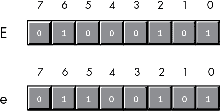
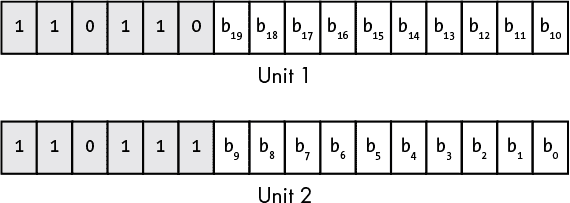
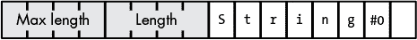
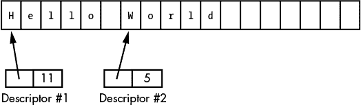
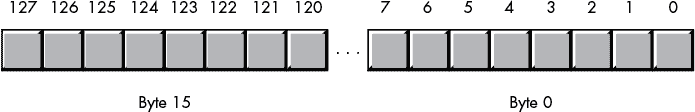

## 第五章：字符表示**


尽管计算机以“数字运算”能力而闻名，但事实是，大多数计算机系统处理字符数据的频率远高于数字数据。*字符*一词指的是一种人类或机器可读的符号，通常是非数字实体。一般来说，字符是你可以在键盘上输入或在显示器上显示的任何符号。除了字母字符外，字符数据还包括标点符号、数字、空格、制表符、回车符（回车键）、其他控制字符和其他特殊符号。

本章介绍了如何在计算机系统中表示字符、字符串和字符集，并讨论了对这些数据类型的各种操作。

### 5.1 字符数据

大多数计算机系统使用 1 字节或多字节的二进制序列来编码各种字符。Windows、macOS 和 Linux 都属于这一类别，使用 ASCII 或 Unicode 字符集，其成员可以通过 1 字节或多字节的二进制序列表示。EBCDIC 字符集在 IBM 大型机和小型计算机上使用，也是单字节字符编码的另一个例子。

本章将讨论这三种字符集及其内部表示方式，并介绍如何创建自己的字符集。

#### *5.1.1 ASCII 字符集*

ASCII（美国信息交换标准代码）字符集将 128 个字符映射到无符号整数值 0 到 127（`$0` 到 `$7F`）。尽管字符与数字值的精确映射是任意的并且并不重要，但标准化的映射使得你能够在程序和外部设备之间进行通信。标准 ASCII 代码很有用，因为几乎每个人都使用它们。例如，如果你使用 ASCII 代码 `65` 来表示字符 *A*，你可以放心，某些外部设备（如打印机）会正确地将这个值解释为 *A*。

由于 ASCII 字符集只提供 128 个不同的字符，你可能会问：“我们该如何处理额外的 128 个值（`$80..$FF`），这些值可以用一个字节表示？”一个选项是忽略这些额外的值，这也是本书的主要做法。另一种可能性是通过添加 128 个字符来扩展 ASCII 字符集。当然，除非你能让每个人都同意某个特定的字符集扩展^(1)（这确实是一个困难的任务），否则拥有标准化字符集的整个目的将会失效。

尽管存在一些重大缺点，如无法表示今天使用的所有字符和字母，但 ASCII 数据仍然是跨计算机系统和程序数据交换的*标准*。大多数程序都能接受 ASCII 数据，也能生成 ASCII 数据。因为你可能会在程序中处理 ASCII 字符，所以研究字符集的布局并记住一些关键的 ASCII 代码（如*0*、*A*和*a*的代码）是明智的。

**注意**

*附录 A 中的表 A-1 列出了标准 ASCII 字符集中的所有字符。*

ASCII 字符集被分为四组 32 个字符。前 32 个字符，ASCII 代码`$0`到`$1F`（0 到 31），形成了一组特殊的非打印字符，称为*控制字符*。顾名思义，这些字符执行各种打印机和显示控制操作，而不是显示符号。控制字符的示例包括回车符，它将光标定位到当前行的开头；^(2) 换行符，它将光标向下移动一行；以及退格符，它将光标向左移动一个位置。不幸的是，由于输出设备之间几乎没有标准化，不同的控制字符在不同的输出设备上执行不同的操作。要准确了解某个控制字符如何影响某个设备，请查阅该设备的手册。

第二组 32 个 ASCII 字符代码包括各种标点符号、特殊字符和数字字符。该组中最显著的字符包括空格字符（ASCII 代码`$20`）和数字字符（ASCII 代码`$30..$39`）。

第三组 32 个 ASCII 字符包含大写字母字符。字符*A*到*Z*的 ASCII 代码范围为`$41`到`$5A`。因为只有 26 个不同的字母字符，其余六个代码用于表示各种特殊符号。

第四组也是最后一组 32 个 ASCII 字符代码表示小写字母符号、五个额外的特殊符号和另一个控制字符（删除）。小写字母符号使用 ASCII 代码`$61`到`$7A`。如果你将大写和小写字符的代码转换为二进制，你会发现大写字母与其小写字母之间仅在一个比特位置上有所不同。例如，考虑图 5-1 中*E*和*e*的字符代码。



*图 5-1：E 和 e 的 ASCII 代码*

这两个代码仅在位 5 上有所不同。大写字母字符的位 5 总是为 `0`；小写字母字符的位 5 总是为 `1`。要快速将字母字符在大写和小写之间转换，只需反转位 5。要将大写字母转换为小写字母，只需将位 5 设置为 `1`。同样，你可以通过将位 5 设置为 `0` 将小写字母转换为大写字母。

位 5 和位 6 决定了字符的组（见 表 5-1）。因此，你可以通过将位 5 和位 6 设置为 `0` 来将任何大写或小写字母（或特殊字符）转换为其对应的控制字符（例如，当你将位 5 和位 6 设置为 `0` 时，*A* 变为 CTRL-A；也就是说，`0x41` 变为 `0x01`）。

**表 5-1：** 由位 5 和位 6 决定的 ASCII 字符组

| **位 6** | **位 5** | **组** |
| --- | --- | --- |
| `0` | `0` | 控制字符 |
| `0` | `1` | 数字和标点符号 |
| 1 | `0` | 大写字母和特殊字符 |
| 1 | `1` | 小写字母和特殊字符 |

位 5 和位 6 不是唯一编码有用信息的位。请考虑一下 表 5-2 中数字字符的 ASCII 码。这些 ASCII 码的十进制表示并不太能提供直观的信息。然而，十六进制表示却揭示了非常重要的内容——低阶 nibble 是所表示数字的二进制等价物。通过去除（设置为 `0`）ASCII 码的高阶 nibble，你就能得到该数字的二进制表示。反之，你可以通过简单地将高阶 nibble 设置为 `%0011`，即十进制值 `3`，将 `0` 到 `9` 范围内的二进制值转换为其对应的 ASCII 字符表示。你可以使用逻辑与操作来强制将高阶位设置为 `0`；同样，你也可以使用逻辑或操作将高阶位强制设置为 `%0011`。有关字符串到数字转换的更多信息，请参见 第二章。

**表 5-2：** 数字字符的 ASCII 码

| **字符** | **十进制** | **十六进制** |
| --- | --- | --- |
| 0 | `48` | `$30` |
| 1 | `49` | `$31` |
| 2 | `50` | `$32` |
| 3 | `51` | `$33` |
| 4 | `52` | `$34` |
| 5 | `53` | `$35` |
| 6 | `54` | `$36` |
| 7 | `55` | `$37` |
| 8 | `56` | `$38` |
| 9 | `57` | `$39` |

尽管它是一个“标准”，但仅仅使用 ASCII 字符编码数据并不能保证在不同系统之间的兼容性。一个系统上的*A*字符在另一个系统上很可能仍然是*A*；然而，在 ASCII 代码的第一组 32 个控制码中，加上最后一组的删除码，只有 4 个控制码在大多数设备和应用程序中得到普遍支持——退格（BS）、制表符、回车（CR）和换行符（LF）。更糟糕的是，不同的机器往往以不同的方式使用这些“支持的”控制码。行尾就是一个特别棘手的例子。Windows、MS-DOS、CP/M 和其他系统使用两个字符的序列 CR/LF 来标记行尾。原版 Apple Macintosh 操作系统和许多其他系统通过单一的 CR 字符来标记行尾。Linux、BeOS、macOS 和其他 Unix 系统则通过单一的 LF 字符来标记行尾。

在不同系统之间交换简单文本文件可能会让人感到沮丧。即使你在所有文件中都使用标准的 ASCII 字符，在不同系统之间交换文件时，你仍然需要转换数据。幸运的是，许多文本编辑器会自动处理具有不同换行符的文件（许多免费的实用工具也可以为你执行此转换）。如果你必须在自己的软件中进行此操作，只需将除行尾序列外的所有字符从一个文件复制到另一个文件，然后在遇到旧的行尾序列时，发出新的行尾序列。

#### *5.1.2 EBCDIC 字符集*

尽管 ASCII 字符集无疑是最流行的字符表示法，但它并不是唯一可用的。例如，IBM 在许多大型机和小型计算机产品线中使用 *EBCDIC* 码。然而，在个人计算机系统中，你很少会遇到它，因此在本书中我们仅简要讨论它。

EBCDIC（发音为“Eb-suh-dic”）代表*扩展二进制编码十进制交换码*。如果你在想是否有这个字符编码的未扩展版本，答案是有的。早期的 IBM 系统和打孔机使用的是*BCDIC（二进制编码十进制交换码）*，这是一个基于打孔卡和十进制表示法的字符集（用于 IBM 的老旧十进制机器）。

BCDIC 在现代数字计算机出现之前就已经存在；它诞生于旧式的 IBM 打孔机和制表机。EBCDIC 扩展了这种编码，以便为 IBM 的计算机提供一个字符集。然而，EBCDIC 继承了 BCDIC 的几个特性，这些特性在现代计算机的背景下显得有些奇怪。例如，字母字符的编码不是连续的。最初，字母字符可能确实有一个顺序编码；然而，当 IBM 扩展字符集时，它使用了一些在 BCD 格式中不存在的二进制组合（如 `%1010..%1111`）。这些二进制值出现在两个原本连续的 BCD 值之间，这也解释了为什么某些字符序列（如字母字符）在 EBCDIC 编码中不连续。

EBCDIC 不是单一的字符集；它是一个字符集家族。虽然 EBCDIC 字符集有一个共同的核心（例如，字母字符的编码通常是相同的），不同的版本被称为 *代码页*，它们对标点符号和特殊字符有不同的编码。由于单个字节中可用的编码数量有限，不同的代码页会重用一些字符编码来表示它们自己特殊的字符集。因此，如果你得到一个包含 EBCDIC 字符的文件，有人让你将其翻译为 ASCII，你很快会发现这并不是一项简单的任务。

由于 EBCDIC 字符集的奇特性，许多在 ASCII 字符上效果良好的常见算法在 EBCDIC 上根本无法使用。然而，请记住，大多数 ASCII 字符都有对应的 EBCDIC 功能等价物。有关更多细节，请查阅 IBM 的文献。

#### *5.1.3 双字节字符集*

因为一个字节最多可以表示 256 个字符，一些计算机系统使用*双字节字符集（DBCSs）*来表示超过 256 个字符。DBCSs 并不是使用 16 位对每个字符进行编码；相反，它们对大多数字符编码使用一个字节，仅对某些字符使用双字节编码。

一个典型的双字节字符集使用标准的 ASCII 字符集以及 `$80` 到 `$FF` 范围内的几个额外字符。该范围内的某些值用作扩展码，告诉软件紧跟其后的是第二个字节。每个扩展字节使 DBCS 能够支持另外 256 个不同的字符编码。例如，通过三个扩展值，DBCS 可以支持最多 1,021 个不同的字符：每个扩展字节支持 256 个字符，而标准单字节集支持 253 个字符（256 – 3），我们减去 3 是因为这三个扩展字节的值每个都占用了 256 种组合中的一个，它们不算作字符。

在终端和计算机使用内存映射字符显示的年代，双字节字符集并不是很实用。硬件字符生成器确实希望每个字符的大小相同，并且希望处理有限数量的字符。然而，随着位图显示和软件字符生成器的普及（如 Windows、Macintosh、Unix/XWindows 机器、平板电脑和智能手机），处理 DBCS 成为可能。

尽管 DBCS 可以紧凑地表示大量字符，但处理 DBCS 格式的文本需要更多的计算资源。例如，确定一个包含 DBCS 字符的零终止字符串的长度（在 C/C++ 语言中很常见）可能需要相当大的工作量。字符串中的某些字符占用 2 个字节，而大多数其他字符只占用 1 个字节，因此字符串长度函数必须逐字节扫描字符串，定位任何扩展值，这些值指示一个字符占用 2 个字节。这个过程使得高性能的字符串长度函数的执行时间增加了两倍以上。

更糟糕的是，许多用于操作字符串数据的常见算法在应用于双字节字符集（DBCS）时会失败。例如，一种常见的 C/C++ 技巧是通过使用 `++ptrChar` 或 `--ptrChar` 等表达式递增或递减指向字符串的指针。这在 DBCS 中不起作用。虽然使用 DBCS 的人可能有一套可以在 DBCS 上工作的标准 C 库例程，但其他他们或他人编写的字符函数也很可能无法正确处理扩展字符。

DBCS 的另一个大问题是缺乏一致的标准。不同的 DBCS 对不同的字符使用相同的编码。因此，如果你需要一个支持超过 256 个字符的标准化字符集，使用 Unicode 字符集无疑是更好的选择。

#### *5.1.4 Unicode 字符集*

几十年前，Aldus、NeXT、Sun、Apple Computer、IBM、Microsoft、Research Library Group 和 Xerox 的工程师们意识到，他们的新计算机系统配备位图和用户可选字体，可以同时显示远超过 256 个不同的字符。当时，DBCS 是最常见的解决方案，但正如刚才所提到的，它们存在一些兼容性问题。因此，工程师们寻求了一条不同的道路。

他们提出的解决方案是 Unicode 字符集。最初开发 Unicode 的工程师选择了 2 字节字符大小。与 DBCS 一样，这种方法仍然需要特定的库代码（现有的单字节字符串函数并不总是适用于双字节字符），但除了改变字符的大小外，大多数现有的字符串算法仍然能够与 2 字节字符一起工作。Unicode 的定义包括了当时所有（已知/现存的）字符集，为每个字符分配了唯一的编码，以避免困扰不同 DBCS 的一致性问题。

最初的 Unicode 标准使用 16 位字来表示每个字符。因此，Unicode 支持最多 65,536 个不同的字符代码——这比 8 位字节能够表示的 256 个代码要大大提升。此外，Unicode 还与 ASCII 向后兼容。如果 Unicode 字符的二进制表示的高 9 位^(3) 为 `0`，则低 7 位使用标准的 ASCII 代码。如果高 9 位包含非零值，则这 16 位组成扩展字符代码（即扩展自 ASCII）。如果你想知道为什么需要如此多不同的字符代码，请注意，当时某些亚洲字符集包含了 4,096 个字符。Unicode 字符集甚至提供了一组代码，可以用来创建应用程序定义的字符集。大约一半的 65,536 个可能字符代码已经被定义，剩余的字符编码则保留用于未来扩展。

今天，Unicode 是一个通用字符集，已经长期取代了 ASCII 和旧的 DBCS（双字节字符集）。所有现代操作系统（包括 macOS、Windows、Linux、iOS、Android 和 Unix）、网页浏览器和大多数现代应用程序都提供 Unicode 支持。Unicode 联盟是一个非营利性公司，负责维护 Unicode 标准。通过维护该标准，Unicode, Inc. (*[`home.unicode.org/`](https://home.unicode.org/)*), 帮助确保你在一个系统中编写的字符会在不同的系统或应用程序中按照预期显示。

#### *5.1.5 Unicode 码点*

可惜的是，尽管最初的 Unicode 标准考虑得非常周全，但它未能预见到字符数量的爆炸性增长。表情符号、星座符号、箭头、指示符号以及为互联网、移动设备和网页浏览器引入的各种符号大大扩展了 Unicode 符号库（同时也包含了对历史、过时和罕见文字的支持）。1996 年，系统工程师发现 65,536 个符号不足以满足需求。为了避免每个 Unicode 字符需要 3 或 4 个字节，Unicode 定义者放弃了创建固定大小字符表示的方法，允许使用不透明的（且可多重）编码来表示 Unicode 字符。今天，Unicode 定义了 1,112,064 个码点，远远超过了最初为 Unicode 字符分配的 2 字节容量。

一个 Unicode *码点* 只是一个整数值，Unicode 将其与特定的字符符号关联；你可以把它当作字符的 ASCII 代码的 Unicode 等价物。Unicode 码点的约定是以十六进制表示，并以 `U+` 为前缀；例如，`U+0041` 是字母 *A* 的 Unicode 码点。

**注意**

*详情请见* [`en.wikipedia.org/wiki/Unicode#General_Category_property`](https://en.wikipedia.org/wiki/Unicode#General_Category_property) *了解更多关于码点的信息。*

#### *5.1.6 Unicode 编码平面*

由于其历史原因，Unicode 中的 65,536 字符块是特殊的——它们被称为 *多语言平面*。第一个多语言平面，`U+000000` 到 `U+00FFFF`，大致对应于原始的 16 位 Unicode 定义；Unicode 标准将其称为 *基本多语言平面（BMP）*。平面 1（`U+010000` 到 `U+01FFFF`）、平面 2（`U+020000` 到 `U+02FFFF`）和平面 14（`U+0E0000` 到 `U+0EFFFF`）是补充平面。Unicode 保留了平面 3 到 13 供未来扩展使用，而平面 15 和 16 则为用户定义字符集保留。

Unicode 标准定义了范围为 `U+000000` 到 `U+10FFFF` 的码点。请注意，`0x10ffff` 是 1,114,111，这也是 Unicode 字符集中的大多数 1,112,064 个字符的来源；剩余的 2,048 个码点被保留作为 *代理*，即 Unicode 扩展。你可能听说过的另一个术语 *Unicode 标量*，是指所有 Unicode 码点的集合中的值，*除了* 2,048 个代理码点。六位码点值的 HO 两个十六进制数字指定了多语言平面。为什么是 17 个平面？原因如你将看到的那样，Unicode 使用特殊的多字词条目来编码超出 `U+FFFF` 的码点。每个扩展编码 10 位，总共 20 位；20 位可以表示 16 个多语言平面，再加上原始的 BMP，就得到了 17 个多语言平面。这也是为什么码点范围是 `U+000000` 到 `U+10FFFF`：编码这 16 个多语言平面加上 BMP 需要 21 位。

#### *5.1.7 代理码点*

如前所述，Unicode 最初是作为一个 16 位（2 字节）字符集编码的。当显然 16 位不足以处理当时所有可能存在的字符时，扩展变得必要。从 Unicode v2.0 开始，Unicode, Inc. 组织扩展了 Unicode 的定义，包含了多字词字符。现在，Unicode 使用代理码点（`U+D800` 到 `U+DFFF`）来编码大于 `U+FFFF` 的值。图 5-2 显示了这种编码方式。



*图 5-2：Unicode 平面 1-16 的代理码点编码*

请注意，两个单元（单元 1/高代理和单元 2/低代理）总是一起出现。单元 1 的值（具有 HO 位 `%110110`）指定 Unicode 标量的高 10 位（`b`[`10`]..`b`[`19`]），而单元 2 的值（具有 HO 位 `%110111`）指定 Unicode 标量的低 10 位（`b`[`0`]..`b`[`9`]）。因此，`b`[`16`] 到 `b`[`19`] 位的值加 1 指定了 Unicode 平面 1 到 16，`b`[`0`] 到 `b`[`15`] 位则指定了该平面内的 Unicode 标量值。

注意，代理码仅出现在基本多文种平面（BMP）中。其他的多语言平面不包含代理码。位`b`[`0`]到`b`[`19`]，从单元 1 和 2 的值中提取，始终指定一个 Unicode 标量值（即使这些值落在`U+D800`到`U+DFFF`范围内）。

#### *5.1.8 字形、字符和字素集*

每个 Unicode 码点都有一个唯一的名称。例如，`U+0045`的名称是“拉丁大写字母 A”。请注意，符号*A*不是字符的名称。*A*是一个*字形*—设备绘制的一系列笔画（一个水平笔画和两个斜笔画），用以表示这个字符。

“拉丁大写字母 A”这个单一的 Unicode 字符有许多不同的字形。例如，Times Roman 字体中的字母 A 和 Times Roman 斜体字母*A*有不同的字形，但 Unicode 不会区分它们（也不会区分任何两种不同字体中的*A*字符）。无论你使用什么字体或样式绘制，它的 Unicode 字符“拉丁大写字母 A”始终是`U+0045`。

顺便提一句，如果你可以访问 Swift 编程语言，你可以使用以下代码打印任何 Unicode 字符的名称：

```
import Foundation

let charToPrintName  :String = "A"      // Print name of this character

let unicodeName =

    String(charToPrintName).applyingTransform(

        StringTransform(rawValue: "Any-Name"),

        reverse: false

    )! // Forced unwrapping is legit here because it always succeeds.

print( unicodeName )

Output from program:

\N{LATIN CAPITAL LETTER A}
```

那么，Unicode 中的字符到底是什么呢？Unicode 标量是 Unicode 字符，但你通常所称的字符与标量的定义是有所区别的。例如，*©*是一个字符还是两个？考虑下面的 Swift 代码：

```
import Foundation

let eAccent  :String = "e\u{301}"

print( eAccent )

print( "eAccent.count=\(eAccent.count)" )

print( "eAccent.utf16.count=\(eAccent.utf16.count)" )
```

`"\u{301}"`是 Swift 语法，用于在字符串中指定一个 Unicode 标量值；在这个特定的案例中，`301`是*组合尖音符*字符的十六进制代码。

第一个`print`语句：

```
print( eAccent )
```

打印字符（在输出中生成`©`，正如我们所预期的那样）。

第二个`print`语句打印出 Swift 确定在字符串中存在的字符数量：

```
print( "eAccent.count=\(eAccent.count)" )
```

这会在标准输出上打印`1`。

第三个`print`语句打印出字符串中的元素数量（UTF-16 元素^(4))：

```
print( "eAccent.utf16.count=\(eAccent.utf16.count)" )
```

这会在标准输出上打印`2`，因为字符串包含两个 UTF-16 数据的单词。

那么，再一次，这到底是一个字符还是两个？在内部（假设使用 UTF-16 编码），计算机会为这个单一字符预留 4 个字节的内存（两个 16 位的 Unicode 标量值）。^(5) 然而，在屏幕上，输出只占用一个字符位置，并且在用户看来像是一个单一字符。当这个字符出现在文本编辑器中，并且光标紧挨着字符右侧时，用户会期望按下退格键删除它。从用户的角度来看，这就是一个单一字符（正如 Swift 在打印字符串的`count`属性时报告的那样）。

然而，在 Unicode 中，一个字符大体上等同于一个代码点。这并不是人们通常认为的字符。在 Unicode 术语中，*字形簇*是人们通常所称的字符——它是一个或多个 Unicode 代码点的序列，这些代码点组合成一个单一的语言元素（即单个字符）。因此，当我们谈论与应用程序显示给终端用户的符号相关的字符时，我们实际上是在谈论字形簇。

字形簇可能会让软件开发人员感到头疼。考虑以下 Swift 代码（前一个示例的修改版）：

```
import Foundation

let eAccent  :String = "e\u{301}\u{301}"

print( eAccent )

print( "eAccent.count=\(eAccent.count)" )

print( "eAccent.utf16.count=\(eAccent.utf16.count)" )
```

这段代码从前两个 `print` 语句输出相同的 `©` 和 `1`。以下输出 `©`：

```
print( eAccent )
```

并且这个 `print` 语句产生 `1`。

```
print( "eAccent.count=\(eAccent.count)" )
```

然而，第三个 `print` 语句：

```
print( "eAccent.utf16.count=\(eAccent.utf16.count)" )
```

显示的是 `3`，而不是原始示例中的 `2`。

这个字符串中确实有三个 Unicode 标量值（`U+0065`，`U+0301` 和 `U+0301`）。打印时，操作系统将 `e` 和两个急性重音组合字符结合，形成单一字符 `©`，然后将该字符输出到标准输出设备。Swift 足够智能，知道这种组合会在显示器上创建一个单一的输出符号，因此打印 `count` 属性的结果仍然输出 `1`。然而，这个字符串中确实有（三个）Unicode 代码点，因此打印 `utf16.count` 输出 `3`。

#### *5.1.9 Unicode 规范和规范等价性*

Unicode 字符 *©* 实际上在 Unicode 出现之前就已经存在于个人计算机中。它是原始 IBM PC 字符集的一部分，也是 Latin-1 字符集的一部分（例如，旧的 DEC 终端使用的字符集）。事实证明，Unicode 在 `U+00A0` 到 `U+00FF` 范围内使用了 Latin-1 字符集，而 `U+00E9` 恰好对应于 *©* 字符。因此，我们可以按照以下方式修改之前的程序：

```
import Foundation

let eAccent  :String = "\u{E9}"

print( eAccent )

print( "eAccent.count=\(eAccent.count)" )

print( "eAccent.utf16.count=\(eAccent.utf16.count)" )
```

该程序的输出为：

```
©

1

1
```

哎呀！三个不同的字符串都输出 `©`，但包含不同数量的代码点。想象一下，这将如何使包含 Unicode 字符的字符串编程变得复杂。例如，如果你有以下三个字符串（Swift 语法），并尝试比较它们，结果会是什么？

```
let eAccent1 :String = "\u{E9}"

let eAccent2 :String = "e\u{301}"

let eAccent3 :String = "e\u{301}\u{301}"
```

对用户而言，所有三种字符串在屏幕上看起来相同。然而，它们显然包含不同的值。如果你比较它们是否相等，结果是 `true` 还是 `false`？

最终，这取决于你使用的是哪个字符串库。大多数当前的字符串库如果比较这些字符串的相等性，会返回`false`。有趣的是，Swift 会认为`eAccent1`等于`eAccent2`，但是它并不够聪明，无法报告`eAccent1`等于`eAccent3`，或者`eAccent2`等于`eAccent3`——尽管它显示这三个字符串的符号是相同的。许多编程语言的字符串库简单地报告这三者都不相等。

这三个 Unicode/Swift 字符串 `"\{E9}"`、`"e\{301}"` 和 `"e\{301}\{301}"` 在显示时都会产生相同的输出；因此，根据 Unicode 标准，它们是规范等效的。然而，一些字符串库并不会将这些字符串视为相等。其他一些库，如 Swift 的字符串库，会处理小的规范等效（例如，`"\{E9}" == "e\{301}"`），但不会处理应该等效的任意序列。^(6)

Unicode 为 Unicode 字符串定义了*规范形式*。规范形式的一个方面是将规范等效的序列替换为等效的序列——例如，将 `"e\u{309}"` 替换为 `"\u{E9}"`，或者将 `"\u{E9}"` 替换为 `"e\u{309}"`（通常较短的形式是首选）。一些 Unicode 序列允许多个组合字符。通常，组合字符的顺序对于生成所需的字形簇来说并不重要。然而，如果组合字符按照指定的顺序排列，比较这两个字符串会更容易。规范化 Unicode 字符串还可能生成结果，其中的组合字符总是以固定顺序出现（从而提高字符串比较的效率）。

#### *5.1.10 Unicode 编码*

从 Unicode v2.0 起，标准支持一个 21 位的字符空间，能够处理超过一百万个字符（尽管大部分代码点仍然保留供将来使用）。为了支持更大的字符集，Unicode 公司允许不同的编码方式——UTF-32、UTF-16 和 UTF-8——每种方式都有其自身的优缺点。^(7)

UTF-32 使用 32 位整数来存储 Unicode 标量值。该方案的优点是，32 位整数可以表示每一个 Unicode 标量值（该值只需要 21 位）。需要随机访问字符串中字符的程序——而不必查找代理对——以及其他常数时间操作（大部分情况下）都可以使用 UTF-32 来实现。UTF-32 的明显缺点是每个 Unicode 标量值需要 4 个字节的存储——是原始 Unicode 定义的两倍，是 ASCII 字符的四倍。看起来，使用比 ASCII 和原始 Unicode 多两倍或四倍的存储空间似乎是一个小代价。毕竟，现代计算机的存储空间比 Unicode 最初出现时要大几个数量级。然而，这额外的存储空间对性能有巨大影响，因为这些额外的字节很快就会消耗掉缓存存储。此外，现代字符串处理库通常一次处理 8 个字节（在 64 位机器上）。对于 ASCII 字符，这意味着一个给定的字符串函数可以并行处理多达八个字符；而对于 UTF-32，相同的字符串函数只能并行处理两个字符。因此，UTF-32 版本的执行速度将比 ASCII 版本慢四倍。最终，即便是 Unicode 标量值也不足以表示所有 Unicode 字符（即，许多 Unicode 字符需要一系列的 Unicode 标量值），所以使用 UTF-32 并不能解决这个问题。

Unicode 支持的第二种编码格式是 UTF-16。顾名思义，UTF-16 使用 16 位（无符号）整数来表示 Unicode 值。为了处理大于 `0xFFFF` 的标量值，UTF-16 使用代理对方案来表示 `0x010000` 到 `0x10FFFF` 范围内的值（参见页面 102 中的 “代理码点”）。因为绝大多数有用的字符适合 16 位表示，所以大多数 UTF-16 字符只需要 2 个字节。对于那些需要代理的罕见情况，UTF-16 需要 2 个字（32 位）来表示该字符。

最后的编码格式，毫无疑问是最流行的编码格式，是 UTF-8。UTF-8 编码与 ASCII 字符集向前兼容。特别地，所有 ASCII 字符都有一个单字节表示（它们原本的 ASCII 码，其中包含该字符的字节的高位包含 `0` 位）。如果 UTF-8 的高位是 `1`，则 UTF-8 需要额外的 1 到 3 个字节来表示 Unicode 码点。表 5-3 提供了 UTF-8 编码方案。

**表 5-3：** UTF 编码

| **字节** | **码点位数** | **第一个码点** | **最后一个码点** | **字节 1** | **字节 2** | **字节 3** | **字节 4** |
| --- | --- | --- | --- | --- | --- | --- | --- |
| `1` | `7` | `U+00` | `U+7F` | `0`xxxxxxx |  |  |  |
| `2` | `11` | `U+80` | `U+7FF` | `110`xxxxx | `10`xxxxxx |  |  |
| `3` | `16` | `U+800` | `U+FFFF` | `1110`xxxx | `10`xxxxxx | `10`xxxxxx |  |
| `4` | `21` | `U+10000` | `U+10FFFF` | `11110`xxx | `10`xxxxxx | `10`xxxxxx | `10`xxxxxx |

“xxx . . .”部分是 Unicode 码点的比特位。对于多字节序列，第 1 字节包含高位比特，第 2 字节包含下一个高位比特（与第 1 字节相比为低位比特），以此类推。例如，2 字节序列（`%11011111`，`%10000001`）对应的 Unicode 标量是`%0000_0111_1100_0001`（`U+07C1`）。

UTF-8 编码可能是最常用的编码。大多数网页都使用它。大多数 C 标准库字符串函数在处理 UTF-8 文本时无需修改（尽管一些 C 标准库函数如果程序员不小心，可能会产生格式错误的 UTF-8 字符串）。

不同的语言和操作系统使用不同的编码作为默认编码。例如，macOS 和 Windows 倾向于使用 UTF-16 编码，而大多数 Unix 系统使用 UTF-8。某些 Python 变种使用 UTF-32 作为其本地字符格式。然而，大多数编程语言都使用 UTF-8，因为它们可以继续使用基于 ASCII 的旧字符处理库来处理 UTF-8 字符。苹果的 Swift 是首批尝试正确实现 Unicode 的编程语言之一（尽管这样做会带来巨大的性能损失）。

#### *5.1.11 Unicode 合成字符*

虽然 UTF-8 和 UTF-16 编码比 UTF-32 更紧凑，但处理多字节（或多字）字符集所带来的 CPU 开销和算法复杂性使得它们的使用变得复杂，容易引入 bug 和性能问题。尽管浪费内存（尤其是缓存）存在问题，为什么不直接将字符定义为 32 位实体，然后就此了结呢？这似乎可以简化字符串处理算法，提高性能并减少代码中的缺陷可能性。

这个理论的问题在于，无法仅用 21 位（甚至 32 位）存储来表示所有可能的字形集群。许多字形集群由多个连接的 Unicode 码点组成。以下是 Chris Eidhof 和 Ole Begemann 的《*Advanced Swift*》（CreateSpace，2017）中的一个例子：

```
let chars: [Character] = [

    "\u{1ECD}\u{300}", 

    "\u{F2}\u{323}",

    "\u{6F}\u{323}\u{300}",

    "\u{6F}\u{300}\u{323}"

]
```

这些 Unicode 字形集群中的每一个都会产生相同的字符：一个带有下划点的`ó`（这是一个来自约鲁巴字符集的字符）。字符序列（`U+1ECD`，`U+300`）是一个带有下划点的`o`，后跟一个合成重音符号。字符序列（`U+F2`，`U+323`）是一个`ó`，后跟一个合成点。字符序列（`U+6F`，`U+323`，`U+300`）是一个`o`，后跟一个合成点，接着是一个合成重音符号。最后，字符序列（`U+6F`，`U+300`，`U+323`）是一个`o`，后跟一个合成重音符号，接着是一个合成点。所有四个字符串都会产生相同的输出。实际上，Swift 的字符串比较将这四个字符串视为相等：

```
print( "\u{1ECD} + \u{300} = \u{1ECD}\u{300}" )

print( "\u{F2} + \u{323} = \u{F2}\u{323}" )

print( "\u{6F} + \u{323} + \u{300} = \u{6F}\u{323}\u{300}" )

print( "\u{6F} + \u{300} + \u{323} = \u{6F}\u{300}\u{323}" )

print( chars[0] == chars[1] ) // Outputs true

print( chars[0] == chars[2] ) // Outputs true

print( chars[0] == chars[3] ) // Outputs true

print( chars[1] == chars[2] ) // Outputs true

print( chars[1] == chars[3] ) // Outputs true

print( chars[2] == chars[3] ) // Outputs true
```

请注意，并没有单一的 Unicode 标量值可以生成这个字符。你必须至少组合两个 Unicode 标量（或者最多三个）来在输出设备上生成这个字形簇。即使使用 UTF-32 编码，它仍然需要两个（32 位）标量来生成这个特定的输出。

表情符号带来了另一个挑战，这个问题无法通过 UTF-32 解决。考虑 Unicode 标量 `U+1F471`，它会打印出一个有着金发的人的表情符号。如果我们为此添加一个肤色修饰符，就会得到（`U+1F471`，`U+1F3FF`），它生成的是一个肤色较深的金发人。在这两种情况下，屏幕上显示的都是一个字符。第一个例子使用了一个 Unicode 标量值，而第二个例子则需要两个标量。没有办法通过单个 UTF-32 值来编码此内容。

关键点是，某些 Unicode 字形簇需要多个标量，无论我们给标量分配多少位（例如，可能会将 30 或 40 个标量组合成一个字形簇）。这意味着我们必须处理多词序列来表示一个单一的“字符”，无论我们多么努力地避免这种情况。这就是为什么 UTF-32 从未真正普及的原因。它并没有解决对 Unicode 字符串进行随机访问的问题。如果你必须处理 Unicode 标量的归一化和组合，使用 UTF-8 或 UTF-16 编码会更有效率。

同样，今天大多数语言和操作系统都以某种形式支持 Unicode（通常使用 UTF-8 或 UTF-16 编码）。尽管处理多字节字符集存在明显的问题，但现代程序需要处理 Unicode 字符串，而不是简单的 ASCII 字符串。Swift 几乎是“纯 Unicode”的，甚至在标准的 ASCII 字符支持方面也没有太多内容。

### 5.2 字符串

在整数之后，字符字符串可能是现代程序中最常用的数据类型。一般来说，*字符字符串*是一个具有两个主要属性的字符序列：*长度*和*字符数据*。

字符串也可能具有其他属性，例如该特定变量允许的*最大长度*或*引用计数*，用于指定有多少不同的字符串变量引用同一个字符字符串。在本节中，我们将探讨这些属性以及程序如何使用它们，描述了各种字符串格式和一些可能的字符串操作。

#### *5.2.1 字符串格式*

不同的编程语言使用不同的数据结构来表示字符串。一些字符串格式占用更少的内存，其他格式则允许更快的处理，有的格式使用起来更为方便，还有的格式为程序员和操作系统提供了额外的功能。为了帮助你更好地理解字符字符串设计背后的原理，让我们看看一些由不同高级语言推广的常见字符串表示方式。

##### 5.2.1.1 零终止字符串

毫无疑问，*零终止字符串*（zero-terminated strings）是目前最常用的字符串表示方式，因为这是 C、C++以及其他几种语言的原生字符串格式。此外，你会在没有特定原生字符串格式的语言编写的程序中发现零终止字符串，例如汇编语言。

一个零终止的 ASCII 字符串是一个序列，包含零个或多个 8 位字符代码，以一个包含`0`字节的字节结尾（或者在 UTF-16 的情况下，序列包含零个或多个 16 位字符代码，并以一个包含`0`的 16 位字组成）。例如，在 C/C++中，ASCII 字符串`"abc"`需要 4 个字节：每个字符`a`、`b`和`c`各占 1 个字节，再加上一个`0`字节。

零终止字符串相较于其他字符串格式有一些优势：

+   零终止字符串可以用一个字节的开销（UTF-16 中是 2 字节，UTF-32 中是 4 字节）表示任何实际长度的字符串。

+   鉴于 C/C++编程语言的普及，已有高性能的字符串处理库可以很好地与零终止字符串配合使用。

+   零终止字符串很容易实现。就 C 和 C++语言而言，字符串只是字符数组。这可能是 C 语言设计者最初选择这种格式的原因——这样他们就不必用字符串操作符来使语言变得更加复杂。

+   你可以在任何能够创建字符数组的语言中轻松表示零终止字符串。

然而，零终止字符串也有一些缺点，这意味着它们并不总是表示字符字符串数据的最佳选择：

+   需要在操作字符串数据之前知道字符串长度的字符串函数，在操作零终止字符串时通常效率不高。计算零终止字符串的长度的唯一合理方法是从字符串开始扫描到结尾。你的字符串越长，这个函数运行的速度就越慢，所以如果你需要处理长字符串，零终止字符串格式并不是最佳选择。

+   尽管这是一个小问题，但你不能轻易地用零终止字符串格式表示字符代码`0`（例如 ASCII 和 Unicode 中的 NUL 字符）。

+   零终止字符串不包含任何信息，告诉你字符串在终止`0`字节之后可以增长的长度。因此，某些字符串函数（如连接操作）只能扩展现有字符串变量的长度，并且只有在调用者明确传递最大长度时，才会检查是否有溢出。

##### 5.2.1.2 长度前缀字符串

第二种字符串格式，* 长度前缀字符串 *，克服了零终止字符串的一些问题。长度前缀字符串在像 Pascal 这样的语言中很常见；它们通常由一个字节组成，该字节指定字符串的长度，后面跟着零个或多个 8 位字符代码。在长度前缀方案中，字符串 `"abc"` 由 4 个字节组成：长度字节（`$03`），后面是 `a`、`b` 和 `c`。

长度前缀字符串解决了与零终止字符串相关的两个问题：它们允许你表示 NUL 字符，并且字符串操作更加高效。长度前缀字符串的另一个优点是长度通常位于字符串的`0`位置（如果我们将字符串视为字符数组），因此字符串的第一个字符在数组表示中从索引`1`开始。对于许多字符串函数来说，使用基于`1`的索引来访问字符数据比使用基于`0`的索引（零终止字符串使用的）更加方便。

长度前缀字符串的主要缺点是它们的最大长度限制为 255 个字符（假设使用 1 字节的长度前缀）。你可以通过使用 2 字节或 4 字节的长度值来去除这个限制，但这样做会将每个字符串的开销数据从 1 字节增加到 2 字节或 4 字节。

##### 5.2.1.3 七位字符串

7 位字符串格式是一个有趣的选项，适用于像 ASCII 这样的 7 位编码。它使用字符串中字符的（通常未使用的）高位来表示字符串的结束。除了字符串中的最后一个字符代码外，所有字符的高位都被清除，字符串中的最后一个字符的高位被设置为 1。

这种 7 位字符串格式有几个缺点：

+   你必须扫描整个字符串才能确定字符串的长度。

+   你不能使用零长度字符串。

+   很少有语言为 7 位字符串提供字面量字符串常量。

+   你最多只能使用 128 个字符代码，但在使用纯 ASCII 时这并不成问题。

然而，7 位字符串的一个大优点是它们不需要任何额外字节来编码长度。汇编语言（使用宏来创建字面量字符串常量）可能是处理 7 位字符串时最好的语言。因为 7 位字符串的优势在于它们紧凑，而汇编语言程序员往往最关注紧凑性，所以这非常契合。以下是一个将字面量字符串常量转换为 7 位字符串的 HLA 宏：

```
#macro sbs( s );

    // Grab all but the last character of the string:

    (@substr( s, 0, @length(s) – 1) +

        // Concatenate the last character with its HO bit set:

        char( uns8( char( @substr( s, @length(s) – 1, 1))) | $80 ) )

#endmacro

    . . .

byte sbs( "Hello World" );
```

##### 5.2.1.4 HLA 字符串

只要你不太在乎每个字符串增加一些额外的字节开销，你就可以创建一种结合了长度前缀和零终止字符串优点的字符串格式，而没有它们各自的缺点。高级汇编语言已经通过其本地字符串格式实现了这一点。^(8)

HLA 字符串格式的最大缺点是每个字符串所需的开销：每个字符串 9 字节，^(9)，如果你处于内存受限的环境中并且处理许多小字符串，这可能会占用显著的百分比。

HLA 字符串格式使用 4 字节的长度前缀，允许字符字符串的长度超过四十亿个字符（显然，这远远超过任何实际的 HLA 应用程序所需的）。HLA 还会将一个 `0` 字节附加到字符字符串数据后。额外的 4 字节开销包含该字符串的最大合法长度。拥有这个额外的字段允许 HLA 字符串函数在必要时检查字符串溢出。在内存中，HLA 字符串呈现出 图 5-3 所示的形式。



*图 5-3：HLA 字符串格式*

字符串第一个字符之前的 4 个字节包含当前字符串的长度。当前字符串长度之前的 4 个字节包含最大字符串长度。字符数据之后紧接着是一个 `0` 字节。最后，HLA 始终确保字符串数据结构的长度是 4 字节的倍数（出于性能考虑），因此对象的末尾可能会有最多 3 个额外的填充字节。（注意，图 5-3 中的字符串仅需要 1 字节的填充，以确保数据结构的长度是 4 字节的倍数。）

HLA 字符串变量是包含字符串中第一个字符字节地址的指针。要访问长度字段，你需要将字符串指针的值加载到 32 位寄存器中，然后访问偏移量为 -4 的 `Length` 字段和偏移量为 -8 的 `MaxLength` 字段。以下是一个示例：

```
static

        s :string := "Hello World";

                . . .

        mov( s, esi );        // Move the address of 'H' in "Hello World"

                              // into esi.

        mov( [esi-4], ecx );  // Puts length of string (11 for "Hello World")

                              // into ECX.

                . . .

        mov( s, esi );

        cmp( eax, [esi-8] );  // See if value in EAX exceeds the maximum

                              // string length.

        ja StringOverflow;
```

作为只读对象，HLA 字符串与零终止字符串兼容。例如，如果你有一个用 C 语言编写的函数，它期望你传递一个零终止字符串，你可以调用该函数并传递一个 HLA 字符串变量，如下所示：

```
someCFunc( hlaStringVar );
```

唯一的注意事项是 C 函数不能对字符串进行任何会影响其长度的修改（因为 C 代码不会更新 HLA 字符串的 `Length` 字段）。当然，你可以在返回时调用 C 的 `strlen()` 函数来更新长度字段，但通常情况下，最好不要将 HLA 字符串传递给修改零终止字符串的函数。

##### 5.2.1.5 基于描述符的字符串

我们到目前为止考虑过的字符串格式都将属性信息（即长度和终止字节）与字符数据一起保存在内存中。一个稍微更灵活的方案是将这些信息保存在一个记录结构中，称为*描述符*，该结构还包含指向字符数据的指针。考虑以下 Pascal/Delphi 数据结构：

```
type

    dString :record

              curLength  :integer;

              strData    :^char;

   end;
```

请注意，这个数据结构并不保存实际的字符数据。相反，`strData` 指针包含字符串第一个字符的地址。`curLength` 字段指定字符串的当前长度。你可以向这个记录中添加任何其他字段，比如最大长度字段，尽管通常不需要最大长度字段，因为大多数使用描述符的字符串格式是 *动态的*（如下一节将讨论的那样）。大多数使用描述符的字符串格式只维护 `Length` 字段。

基于描述符的字符串系统的一个有趣特点是，关联到字符串的实际字符数据可以是更大字符串的一部分。因为实际字符数据中没有长度或终止字节，所以可以让两个字符串的字符数据重叠（见 图 5-4）。



*图 5-4：使用描述符的重叠字符串*

在这个例子中，有两个字符串——`"Hello World"` 和 `"World"`——是重叠的。这可以节省内存并使某些函数（如 `substring()`）非常高效。当然，当字符串像这样重叠时，你不能修改字符串数据，因为这可能会擦除其他字符串的一部分。

##### 5.2.1.6 Java 字符串

Java 使用基于描述符的字符串形式。实际的 `String` 数据类型（即定义 Java 字符串内部表示的结构/类）是 *不透明的*，这意味着你不应该知道或去修改它。尝试以 Java String API 以外的方式操作 Java 字符串是一个非常糟糕的主意，因为 Java 标准已经在几个场合更改了它们的内部表示。

例如，Java 最初将 `String` 类型定义为一个包含四个项的描述符：指向一个 16 位（原始）Unicode 字符数组的指针（不扩展到 16 位以上）、一个计数字段、一个偏移量字段和一个哈希码字段。偏移量和计数字段允许高效的子字符串操作，因为所有子字符串都将共享同一个字符数组。不幸的是，这种格式在一些退化的情况下产生了内存泄漏，因此 Java 的设计者更改了格式并删除了这些字段。如果你的代码使用了偏移量和计数字段（同样，这是一个不好的做法），你的代码就会因为这个更改而崩溃。

Java 还从最初的 Unicode 2 字节定义切换到 UTF-16 编码，因为很明显 16 位字符是不够的。然而，在对互联网上各种 Java 程序进行一些研究后，Oracle（Java 的所有者）发现大多数程序只使用 Latin-1 字符集（基本上是 ASCII）。正如 Oracle 自己所说：

来自不同应用程序的数据表明，字符串是 Java 堆内存使用的主要组成部分，并且大多数 `java.lang.String` 对象只包含 Latin-1 字符。这些字符仅需要一个字节的存储空间。因此，`java.lang.String` 对象的内部字符数组中有一半的空间未被使用。Java SE 9 引入的紧凑字符串特性减少了内存占用，并减少了垃圾回收活动。

这一变化对 Java 用户及其程序几乎是透明的。Oracle 向 `String` 描述符中添加了一个新字段，用于指定编码是 UTF-16 还是 Latin-1。如果你的程序依赖于内部表示，它们将会受到影响。

始终假设 Java `String` 是标准的 Unicode 字符串（通常使用 UTF-16 编码）。Java 并不试图隐藏多字字符的复杂性。作为 Java 程序员，你必须意识到字符串中字符数、代码点和字形集群之间的区别。Java 提供了一些函数——例如，`String.length()`、`String.codePointCount()` 和 `BreakIterator.getCharacterInstance()`——来计算所有这些值，但你的代码必须显式地调用它们。

##### 5.2.1.7 Swift 字符串

与 Java 类似，Swift 编程语言在其字符串中使用 Unicode 字符。Swift 4.x 及更早版本使用 UTF-16 编码，这是 macOS（Apple 开发 Swift 所基于的操作系统）原生支持的编码；而在 Swift v5.0 中，Apple 将 Swift 字符串的原生编码更改为 UTF-8。与 Java 一样，Swift 的 `String` 类型是透明的，因此你不应该尝试修改（或以其他方式使用）其内部表示。

##### 5.2.1.8 C# 字符串

C# 编程语言使用 UTF-16 编码表示其字符串中的字符。与 Java 和 Swift 一样，C# 的 `string` 类型是透明的，因此你不应该尝试修改（或以其他方式使用）其内部表示。不过，微软的文档确实声称 C# 字符串是（Unicode）字符的数组。

##### 5.2.1.9 Python 字符串

Python 编程语言最初使用 UCS-2（原始的 16 位 Unicode，仅限 BMP）编码表示字符串。然后，Python 被修改为支持 UTF-16 或 UTF-32 编码（语言可以编译为“窄字符”或“宽字符”版本，分别支持 16 位或 32 位字符）。今天，现代版本的 Python 使用一种特殊的字符串格式，该格式跟踪字符串中的字符，并根据最紧凑的表示方式将它们存储为 ASCII、UTF-8、UTF-16 或 UTF-32。你无法直接访问 Python 中的内部字符串表示，因此不需要担心不透明类型的问题。

#### *5.2.2 字符串类型：静态、伪动态和动态*

基于迄今为止覆盖的各种字符串格式，我们现在可以根据系统何时为字符串分配存储来定义三种字符串类型。它们是静态字符串、伪动态字符串和动态字符串。

##### 5.2.2.1 静态字符串

纯*静态字符串*是那些程序员在编写程序时选择其最大大小的字符串。Pascal 字符串和 Delphi 的“短”字符串属于这一类。你在 C/C++ 中用来保存以零为终止符的字符串的字符数组也属于这一类。考虑以下在 Pascal 中的声明：

```
(* Pascal static string example *)

var  pascalString :string(255);  // Max length will always be 255 characters.
```

下面是 C/C++ 中的一个示例：

```
// C/C++ static string example:

char cString[256];  // Max length will always be 255 characters

                    // (plus 0 byte).
```

当程序运行时，无法增加这些静态字符串的最大大小。也没有办法减少它们使用的存储空间；这些字符串对象在运行时将始终消耗 256 字节。纯静态字符串的一个优点是，编译器可以在编译时确定它们的最大长度，并隐式将此信息传递给字符串函数，以便它在运行时检查是否有越界违规。

##### 5.2.2.2 伪动态字符串

伪动态字符串是其长度由系统在运行时通过调用类似 `malloc()` 的内存管理函数来分配存储空间的字符串。然而，一旦系统为字符串分配了存储空间，字符串的最大长度就会被固定。HLA 字符串通常属于这一类。^(10) HLA 程序员通常会调用 `stralloc()` 函数为字符串变量分配存储空间，之后该特定字符串对象的长度将被固定，无法改变。^(11)

##### 5.2.2.3 动态字符串

动态字符串系统通常使用基于描述符的格式，每当创建一个新字符串或执行任何影响现有字符串的操作时，它会自动分配足够的存储空间给字符串对象。在动态字符串系统中，像字符串赋值和子字符串操作这样的操作相对简单——通常它们只复制字符串描述符数据，因此这些操作非常快。然而，正如在“基于描述符的字符串”一节中第 114 页所提到的那样，当以这种方式使用字符串时，你无法将数据存储回字符串对象中，因为这可能会修改系统中其他字符串对象的部分数据。

解决这个问题的方法是使用写时复制技术。每当一个字符串函数需要修改动态字符串中的字符时，该函数首先会创建字符串的副本，然后对副本进行必要的修改。研究表明，写时复制语义能够提升许多典型应用程序的性能，因为像字符串赋值和子字符串提取（其实只是部分字符串赋值）这样的操作比修改字符串中的字符数据要常见得多。这种方法唯一的缺点是，在内存中多次修改字符串数据之后，可能会有一些字符串堆区域包含不再使用的字符数据。为了避免* 内存泄漏 *，采用写时复制的动态字符串系统通常会提供* 垃圾回收 *代码，它会扫描字符串堆区域，寻找*陈旧*的字符数据，并将该内存回收供其他用途。不幸的是，取决于使用的算法，垃圾回收可能会非常慢。

#### *5.2.3 字符串的引用计数*

假设有两个字符串描述符（或指针）指向内存中的同一字符串数据。显然，在程序仍然使用另一个指针访问相同数据时，你不能*释放*（即，重新用于其他用途）与一个指针关联的存储空间。一个常见的解决方案是让程序员负责跟踪这些细节。不幸的是，随着应用程序变得更加复杂，这种方法常常导致悬空指针、内存泄漏和其他与指针相关的问题。一个更好的解决方案是允许程序员释放与字符串字符数据相关联的存储空间，并且实际的释放过程会推迟，直到程序员释放最后一个引用该数据的指针。为此，字符串系统可以使用引用计数器，它用于跟踪指针及其关联的数据。

*引用计数器* 是一个整数，用来计数在内存中引用字符串字符数据的指针数量。每当你将字符串的地址赋给某个指针时，你就将引用计数器加 1。同样，每当你希望释放与字符串字符数据相关的存储空间时，你就将引用计数器减 1。只有当引用计数器减到 0 时，才会发生字符数据存储空间的释放。

引用计数在语言自动处理字符串赋值的细节时效果非常好。如果你尝试手动实现引用计数，你必须确保在将字符串指针赋值给其他指针变量时始终递增引用计数。实现这一点的最佳方法是不要直接赋值指针，而是通过某个函数（或宏）调用处理所有字符串赋值，并在复制指针数据的同时更新引用计数。如果你的代码未能正确更新引用计数，你将会遇到悬空指针或内存泄漏问题。

#### *5.2.4 Delphi 字符串*

尽管 Delphi 提供了一种与早期版本 Delphi 中的长度前缀字符串兼容的“短字符串”格式，但后来的 Delphi 版本（4.0 及更高版本）使用动态字符串。虽然这种字符串格式没有公开（因此可能会有所变化），但有迹象表明，Delphi 的字符串格式与 HLA 非常相似。Delphi 使用一个以零结尾的字符序列，前面有字符串长度和引用计数（而不是像 HLA 那样使用最大长度）。图 5-5 展示了 Delphi 字符串在内存中的布局。


*图 5-5：Delphi 字符串数据格式*

与 HLA 一样，Delphi 字符串变量是指向实际字符串数据第一个字符的指针。为了访问长度和引用计数字段，Delphi 字符串例程使用从字符数据基地址向后的偏移量——4 和——8。然而，由于这种字符串格式没有公开，应用程序不应直接访问长度或引用计数字段。Delphi 提供了一个长度函数，用于提取字符串长度，实际上你的应用程序无需访问引用计数字段，因为 Delphi 字符串函数会自动维护它。

#### *5.2.5 自定义字符串格式*

通常，你将使用语言提供的字符串格式，除非你有特殊的需求。如果是这样，你会发现大多数语言提供了用户定义的数据结构功能，允许你创建自己的自定义字符串格式。

请注意，语言可能会坚持使用单一的字符串格式来表示文字字符串常量。然而，通常你可以编写一个简短的转换函数，将你的语言中的文字字符串转换为你选择的任何格式。

### 5.3 字符集数据类型

与字符串一样，字符集数据类型（或称*字符集*）是一种复合数据类型，建立在字符数据类型之上。*字符集*是字符的数学集合。集合中的成员关系是二元关系：一个字符要么在集合中，要么不在，不能在字符集中出现同一个字符的多个副本。此外，顺序的概念（例如，某个字符是否在另一个字符之前出现，像在字符串中一样）对字符集而言是陌生的。如果两个字符是集合的成员，它们在集合中的顺序是无关紧要的。

表 5-4 列出了应用程序对字符集执行的一些常见操作。

**表 5-4：** 常见的字符集函数

| **功能/操作符** | **描述** |
| --- | --- |
| 成员资格（在） | 检查一个字符是否是字符集的成员（返回`true`/`false`）。 |
| 交集 | 返回两个字符集的交集（即，既属于两个集合的字符集合）。 |
| 联集 | 返回两个字符集的并集（即，属于任意一个集合或两个集合的字符）。 |
| 差集 | 返回两个集合的差集（即，属于一个集合但不属于另一个集合的字符）。 |
| 提取 | 从集合中提取单个字符。 |
| 子集 | 如果一个字符集是另一个字符集的子集，则返回`true`。 |
| 正确的子集 | 如果一个字符集是另一个字符集的正确子集，则返回`true`。 |
| 超集 | 如果一个字符集是另一个字符集的超集，则返回`true`。 |
| 正确的超集 | 如果一个字符集是另一个字符集的超集，则返回`true`。 |
| 等式 | 如果一个字符集等于另一个字符集，则返回`true`。 |
| 不等式 | 如果一个字符集不等于另一个字符集，则返回`true`。 |

#### *5.3.1 字符集的幂集表示*

表示字符集有许多不同的方式。一些语言使用布尔值数组来实现字符集（每个可能的字符代码对应一个布尔值）。每个布尔值决定它对应的字符是否（`true`）或不（`false`）是字符集的成员。为了节省内存，大多数字符集实现只为集合中的每个字符分配一个位；因此，当支持 128 个字符时，它们消耗 16 字节（128 位）内存，当支持最多 256 个字符时，消耗 32 字节（256 位）内存。这种字符集的表示方式被称为*幂集*。

HLA 语言使用一个 16 字节的数组来表示 128 个可能的 ASCII 字符，该数组在内存中的组织方式如图 5-6 所示。



*图 5-6：HLA 字符集表示*

字节 0 的位 0 对应于 ASCII 码 `0`（NUL 字符）。如果这个位是 `1`，则字符集包含 NUL 字符；如果这个位是 `0`，则字符集不包含 NUL 字符。同样，字节 8 的位 1 对应于 ASCII 码 `65`，大写字母 *A*。如果 *A* 是字符集的当前成员，则位 65 将为 `1`，如果不是，则为 `0`。

Pascal（例如 Delphi）使用类似的方案来表示字符集。Delphi 允许在字符集中最多包含 256 个字符，因此 Delphi 字符集占用 256 位（或 32 字节）内存。

尽管实现字符集的方法有很多种，但这种位向量（数组）实现使得执行集合操作，如并集、交集、差集比较和成员测试，变得非常简单。

#### *5.3.2 字符集的列表表示*

有时，幂集位图并不是表示字符集的最佳方式。例如，如果你的集合通常非常小（最多三个或四个成员），使用 16 或 32 字节来表示每个集合可能会显得过于浪费。在这种情况下，你最好使用字符字符串来表示字符列表。^(12) 如果你的集合中很少有超过几个字符的元素，那么扫描字符串以查找特定字符通常对大多数应用来说已经足够高效。同样，如果你的字符集有大量可能的字符，那么幂集表示法可能会变得非常庞大（例如，实现原始的 Unicode UCS-2 字符集作为幂集需要 8,192 字节的内存，即使集合中只有一个字符）。在这种情况下，列表或字符字符串表示法可能比幂集表示法更为合适，因为你不需要为集合中的所有可能成员保留内存（只需要为实际存在的成员保留内存）。

### 5.4 设计你自己的字符集

ASCII、EBCDIC 和 Unicode 字符集几乎没有什么是神圣不可侵犯的。它们的主要优点在于它们是国际标准，许多系统都遵循这些标准。如果你坚持使用其中一种标准， chances are good 你将能够与他人交换信息，这也是这些代码设计的初衷。

然而，这些字符集并不是为了简化各种字符计算而设计的。ASCII 和 EBCDIC 是在如今已经过时的硬件条件下开发的——分别是机械电传打字机的键盘和打孔卡片系统。鉴于如今这类设备主要只能在博物馆里找到，因此这些字符集中的代码布局在现代计算机系统中几乎没有任何优势。如果今天我们可以设计自己的字符集，它们与 ASCII 或 EBCDIC 会有很大不同。它们可能会基于现代键盘（因此会包括常见按键的代码，如左箭头、右箭头、页面向上和页面向下）。它们的布局也会使得各种常见计算变得更加轻松。

尽管 ASCII 和 EBCDIC 字符集在短期内不会消失，但没有什么能阻止你定义自己的应用程序特定字符集。当然，这样的字符集是应用程序特定的，你将无法与不了解你私有编码的应用程序共享包含你自定义字符集的文本文件。但使用查找表在不同字符集之间进行转换是相当容易的，因此在执行输入/输出操作时，你可以在应用程序的内部字符集和外部字符集（如 ASCII）之间进行转换。假设你选择了一个合理的编码，使得程序整体更高效，尽管输入/输出过程中的效率可能会有所损失，但还是值得的。那么，你该如何选择编码呢？

你首先要问自己的是：“我希望我的字符集支持多少个字符？”显然，你选择的字符数量将直接影响字符数据的大小。一个简单的选择是 256 个可能的字符，因为字节是软件用于表示字符数据的最常见原始数据类型。然而，记住，如果你实际上并不需要 256 个字符，你可能不应该在字符集里定义那么多。例如，如果你只需 128 个，甚至 64 个字符来满足需求，那么你使用它创建的“文本文件”将会更好地压缩。同样，使用它进行数据传输时，如果每个字符只需传输 6 或 7 位而不是 8 位，传输速度会更快。如果你需要超过 256 个字符，你必须权衡使用多个编码页、双字节字符集或 16 位字符的优缺点。并且请记住，Unicode 支持用户自定义字符。所以，如果你需要超过 256 个字符，你可能需要考虑将其插入到 Unicode 中，以便与全球其他系统保持“某种程度的标准”。

在本节中，我们将定义一个包含 128 个字符的字符集，使用 8 位字节表示。大多数情况下，我们将仅仅重新排列 ASCII 字符集中的代码，使其在进行几种计算时更加方便，并且会重新命名一些控制代码，以便它们在现代系统中更有意义，而不是当初为老旧的主机和电传打字机设计的那些代码。我们还会添加一些 ASCII 标准之外的新字符。同样，这个练习的主要目的是使各种计算更加高效，而不是创造新的字符。我们将这个字符集称为*HyCode*字符集。

**注意**

*这一点需要重复强调：本章中使用 HyCode 并不是试图创建某种新的字符集标准。这只是一个如何创建自定义、应用程序特定字符集以提升程序效率的示范。*

#### *5.4.1 设计高效的字符集*

在设计一个新的字符集时，我们应该考虑几个方面。例如，我们是否需要能够使用现有的字符串格式来表示字符字符串？这会影响我们字符串的编码——如果你想使用操作零终止字符串的函数库，那么你需要在自定义字符集中保留编码`0`，用于作为字符串结束标记。然而，请记住，很多字符串函数无论你做什么，都无法与新字符集一起使用。像`stricmp()`这样的函数只有在你使用与 ASCII（或其他常见字符集）相同的字母字符表示时才有效。因此，你不应感到受某种特定字符串表示的限制，因为你无论如何都会编写许多自己的字符串函数来处理自定义字符。HyCode 字符集不保留`0`编码作为字符串结束标记，这是可以的，因为零终止字符串效率不高。

如果你查看使用字符函数的程序，你会发现某些函数经常出现，例如：

+   检查一个字符，看看它是否是数字。

+   将数字字符转换为其对应的数字。

+   将数字字符转换为其对应的字符。

+   检查一个字符，看看它是否是字母字符。

+   检查一个字符，看看它是否是小写字母字符。

+   检查一个字符，看看它是否是大写字母字符。

+   使用*不区分大小写*的比较方法比较两个字符（或字符串）。

+   对字母字符串进行排序（区分大小写和不区分大小写排序）。

+   检查一个字符，看看它是否是字母数字字符。

+   检查一个字符，看看它是否在标识符中是合法的。

+   检查一个字符，看看它是否是常见的算术或逻辑运算符。

+   检查一个字符，看看它是否是括号字符（即，*(*、*)*、*[*、*]*、*{*、*}*、*<* 或 *>*）。

+   检查一个字符，看看它是否是标点符号字符。

+   检查一个字符，看看它是否是*空白*字符（如空格、制表符或换行符）。

+   检查一个字符，看看它是否是光标控制字符。

+   检查一个字符，看看它是否是滚动控制键（如 PGUP、PGDN、HOME 和 END）。

+   检查一个字符，看看它是否是功能键。

我们将设计 HyCode 字符集，使这些类型的操作尽可能高效和简便。相较于 ASCII 字符集，我们可以做出一个巨大的改进，即为属于同一类型的字符（如字母字符和控制字符）分配连续的字符编码，这样我们就可以通过一对比较来进行上述任何测试。例如，如果我们能通过与表示整个标点符号字符范围上下限的两个值进行比较来确定某个字符是否为标点符号，那就太好了。ASCII 中无法做到这一点，因为标点符号字符分散在整个字符集内。虽然我们无法通过这种方式满足每一个可能的范围比较，但我们可以设计我们的字符集，使其能够以最少的比较次数满足最常见的测试。

#### *5.4.2 数字字符编码分组*

我们可以通过将字符编码 `0` 到 `9` 保留给数字字符 0 到 9 来实现前面列表中的前三个功能。首先，通过使用单一的无符号比较来检查字符编码是否小于或等于 `9`，我们可以判断一个字符是否为数字。接下来，字符与其数字表示之间的转换非常简单，因为字符编码和数字表示是相同的。

#### *5.4.3 字母字符分组*

ASCII 字符集尽管远不如 EBCDIC 那样糟糕，但在处理字母字符的测试和操作时设计得并不好。以下是我们将通过 HyCode 解决的 ASCII 中的一些问题：

+   字母字符分布在两个不重叠的范围内。进行字母字符测试时需要四次比较。

+   小写字母的 ASCII 编码大于大写字母。如果我们要进行区分大小写的比较，将小写字母视为小于大写字母会更直观。

+   所有小写字母的值都大于任何单个的大写字母。这会导致一些违反直觉的结果，例如 *a* 大于 *B*。

HyCode 以几种有趣的方式解决了这些问题。首先，HyCode 使用 `$4C` 到 `$7F` 的编码来表示 52 个字母字符。因为 HyCode 只使用 128 个字符编码（`$00..$7F`），字母字符编码占用了最后的 52 个字符编码。这意味着我们可以通过比较字符编码是否大于或等于 `$4C` 来测试一个字符是否为字母。在高级语言中，你会像这样写这个比较：

```
if( c >= 76) . . .
```

或者，如果你的编译器支持 HyCode 字符集，可以像这样：

```
if( c >= 'a') . . .
```

在汇编语言中，你可以使用一对类似下面的指令：

```
         cmp( al, 76 );

         jnae NotAlphabetic;

             // Execute these statements if it's alphabetic

NotAlphabetic:
```

HyCode 交替使用小写字母和大写字母（即，顺序编码对应的字符为 *a*、*A*、*b*、*B*、*c*、*C* 等）。这使得排序和比较字符串变得非常容易，无论你是在进行区分大小写还是不区分大小写的搜索。交替使用字符编码的 LO 位来确定字符编码是小写字母（LO 位为 `0`）还是大写字母（LO 位为 `1`）。HyCode 对字母字符使用以下编码：

```
a:76, A:77, b:78, B:79, c:80, C:81, . . . y:124, Y:125, z:126, Z:127
```

使用 HyCode 检查字母字符是大写字母还是小写字母比检查字符是否是字母字符要多一些工作，但在汇编语言中，这仍然比等效的 ASCII 比较要少工作。要测试一个字符是否属于某一大小写，你需要进行两次比较——首先检查它是否是字母字符，然后判断它的大小写。在 C/C++ 中，你可以使用如下语句：

```
if( (c >= 76) && (c & 1) )

{

    // execute this code if it's an uppercase character

}

if( (c >= 76) && !(c & 1) )

{

    // execute this code if it's a lowercase character

}
```

子表达式 `(c & 1)` 如果 `c` 的 LO 位是 `1`，则为 `true`（`1`），意味着如果 `c` 是字母字符，那么它是大写字母。同样，`!(c & 1)` 如果 `c` 的 LO 位是 `0`，则为 `true`，意味着 `c` 是小写字母。如果你在 80x86 汇编语言中工作，你可以通过使用三条机器指令来测试一个字符是大写字母还是小写字母：

```
// Note: ROR(1, AL) maps lowercase to the range $26..$3F (38..63)

//       and uppercase to $A6..$BF (166..191). Note that all other characters

//       get mapped to smaller values within these ranges.

         ror( 1, al );

         cmp( al, $26 );

         jnae NotLower;    // Note: must be an unsigned branch!

             // Code that deals with a lowercase character.

NotLower:

// For uppercase, note that the ROR creates codes in the range $A8..$BF which 

// are negative (8-bit) values. They also happen to be the *most* negative 

// numbers that ROR will produce from the HyCode character set.

         ror( 1, al );

         cmp( al, $a6 );

         jge NotUpper;    // Note: must be a signed branch!

             // Code that deals with an uppercase character.

NotUpper:
```

很少有语言提供 `ror()` 操作的等价功能，并且只有少数几种语言允许你（轻松地）在同一代码序列中将字符值视为有符号和无符号。因此，这个序列可能仅限于汇编语言程序。

#### *5.4.4 比较字母字符*

HyCode 对字母字符的分组意味着字典排序几乎是免费的。通过比较 HyCode 字符值对字符串进行排序，你可以获得字典顺序，因为 HyCode 定义了以下字母字符的关系：

```
a < A < b < B < c < C < d < D < . . . < w < W < x < X < y < Y < z < Z
```

这正是你所期望的字典排序关系，同时也是大多数人直觉上会期望的关系。要进行不区分大小写的比较，你只需屏蔽字母字符的 LO 位（或将它们都强制为 `1`）。

为了看到在进行不区分大小写比较时 HyCode 字符集的优势，我们先来看一下在 C/C++ 中标准的不区分大小写字符比较对于两个 ASCII 字符的实现方式：

```
if( toupper( c ) == toupper( d ))

{

    // do code that handles c==d using a case-insensitive comparison.

}
```

这段代码看起来不算太复杂，但考虑一下 `toupper()` 函数（或通常是宏）展开后的样子：^(13)

```
#define toupper(ch) ( (ch >= 'a' && ch <= 'z') ? ch & 0x5f : ch )
```

使用这个宏，当 C 预处理器展开前面的 `if` 语句时，结果如下：

```
if

(

        ( (c >= 'a' && c <= 'z') ? c & 0x5f : c )

     == ( (d >= 'a' && d <= 'z') ? d & 0x5f : d )

)

{

        // do code that handles c==d using a case-insensitive comparison.

}
```

这会展开为类似于以下的 80x86 代码：

```
        // assume c is in cl and d is in dl.

        cmp( cl, 'a' );     // See if c is in the range 'a'..'z'

        jb NotLower;

        cmp( cl, 'z' );

        ja NotLower;

        and( $5f, cl );     // Convert lowercase char in cl to uppercase.

NotLower:

        cmp( dl, 'a' );     // See if d is in the range 'a'..'z'

        jb NotLower2;

        cmp( dl, 'z' );

        ja NotLower2;

        and( $5f, dl );     // Convert lowercase char in dl to uppercase.

NotLower2:

        cmp( cl, dl );      // Compare the (now uppercase if alphabetic)

                            // chars.

        jne NotEqual;       // Skip the code that handles c==d if they're 

                            // not equal.

            // do code that handles c==d using a case-insensitive comparison.

NotEqual:
```

在 HyCode 中，不区分大小写的比较要简单得多。以下是 HLA 汇编代码的样子：

```
// Check to see if CL is alphabetic. No need to check DL as the comparison

// will always fail if DL is nonalphabetic.

        cmp( cl, 76 );      // If CL < 76 ('a') then it's not alphabetic

        jb TestEqual;       // and there is no way the two chars are equal

                            // (even ignoring case).

        or( 1, cl );        // CL is alpha, force it to uppercase.

        or( 1, dl );        // DL may or may not be alpha. Force to 

                            // uppercase if it is.

TestEqual:

        cmp( cl, dl );      // Compare the uppercase versions of the chars.

        jne NotEqual;       // Bail out if they're not equal.

TheyreEqual:

            // do code that handles c==d using a case-insensitive comparison.

NotEqual:
```

如你所见，HyCode 序列使用了用于不区分大小写的两个字符比较的一半指令。

#### *5.4.5 分组其他字符*

因为字母字符位于字符编码范围的一端，而数字字符位于另一端，所以检查一个字符是否为字母数字字符需要进行两次比较（这仍然比 ASCII 中所需的四次比较要好）。以下是你可以用来检查一个字符是否为字母数字的 Pascal/Delphi 代码：

```
if( ch < chr(10) or ch >= chr(76) ) then . . .
```

一些程序（超出编译器之外）需要高效地处理表示程序标识符的字符字符串。大多数语言允许标识符中使用字母数字字符，正如你刚刚看到的，我们可以通过仅进行两次比较来检查一个字符是否为字母数字字符。

许多语言也允许在标识符中使用下划线，并且一些语言，如 MASM，允许其他字符，如“at”符号（`@`）和美元符号（`$`）出现在标识符中。因此，通过将下划线字符分配值 `75`，并将 `$` 和 `@` 字符分别分配代码 `73` 和 `74`，我们仍然可以仅通过两次比较来测试一个字符是否为标识符字符。

由于类似的原因，HyCode 将光标控制键、空白字符、括号字符（圆括号、方括号、大括号和尖括号）、算术运算符、标点字符等分组在一起。表格 5-5 列出了完整的 HyCode 字符集。如果你研究每个字符所分配的数字代码，你会发现它们允许高效地计算前面描述的大多数字符操作。

**表格 5-5：** HyCode 字符集

| **二进制** | **十六进制** | **十进制** | **字符** | **二进制** | **十六进制** | **十进制** | **字符** |
| --- | --- | --- | --- | --- | --- | --- | --- |
| `0000_0000` | `00` | `0` | `0` | `0001_1110` | `1E` | `30` | 结束 |
| `0000_0001` | `01` | `1` | `1` | `0001_1111` | `1F` | `31` | Home |
| `0000_0010` | `02` | `2` | `2` | `0010_0000` | `20` | `32` | PgDn |
| `0000_0011` | `03` | `3` | `3` | `0010_0001` | `21` | `33` | PgUp |
| `0000_0100` | `04` | `4` | `4` | `0010_0010` | `22` | `34` | 左 |
| `0000_0101` | `05` | `5` | `5` | `0010_0011` | `23` | `35` | 右 |
| `0000_0110` | `06` | `6` | `6` | `0010_0100` | `24` | `36` | Up |
| `0000_0111` | `07` | `7` | `7` | `0010_0101` | `25` | `37` | 下/换行 |
| `0000_1000` | `08` | `8` | `8` | `0010_0110` | `26` | `38` | 不换行空格 |
| `0000_1001` | `09` | `9` | `9` | `0010_0111` | `27` | `39` | 段落 |
| `0000_1010` | `0A` | `10` | 小键盘 | `0010_1000` | `28` | `40` | 回车 |
| `0000_1011` | `0B` | `11` | 光标 | `0010_1001` | `29` | `41` | 新行/回车 |
| `0000_1100` | `0C` | `12` | 功能 | `0010_1010` | `2A` | `42` | Tab |
| `0000_1101` | `0D` | `13` | Alt | `0010_1011` | `2B` | `43` | 空格 |
| `0000_1110` | `0E` | `14` | 控制 | `0010_1100` | `2C` | `44` | `(` |
| `0000_1111` | `0F` | `15` | 命令 | `0010_1101` | `2D` | `45` | `)` |
| `0001_0000` | `10` | `16` | 长度 | `0010_1110` | `2E` | `46` | `[` |
| `0001_0001` | `11` | `17` | Len128 | `0010_1111` | `2F` | `47` | `]` |
| `0001_0010` | `12` | `18` | Bin128 | `0011_0000` | `30` | `48` | `{` |
| `0001_0011` | `13` | `19` | Eos | `0011_0001` | `31` | `49` | `}` |
| `0001_0100` | `14` | `20` | Eof | `0011_0010` | `32` | `50` | `<` |
| `0001_0101` | `15` | `21` | Sentinel | `0011_0011` | `33` | `51` | `>` |
| `0001_0110` | `16` | `22` | Break/interrupt | `0011_0100` | `34` | `52` | `=` |
| `0001_0111` | `17` | `23` | Escape/cancel | `0011_0101` | `35` | `53` | `^` |
| `0001_1000` | `18` | `24` | Pause | `0011_0110` | `36` | `54` | `&#124;` |
| `0001_1001` | `19` | `25` | Bell | `0011_0111` | `37` | `55` | `&` |
| `0001_1010` | `1A` | `26` | Back tab | `0011_1000` | `38` | `56` | `-` |
| `0001_1011` | `1B` | `27` | Backspace | `0011_1001` | `39` | `57` | `+` |
| `0001_1100` | `1C` | `28` | Delete |  |  |  |  |
| `0001_1101` | `1D` | `29` | Insert |  |  |  |  |
| `0011_1010` | `3A` | `58` | `*` | `0101_1101` | `5D` | `93` | `I` |
| `0011_1011` | `3B` | `59` | `/` | `0101_1110` | `5E` | `94` | `j` |
| `0011_1100` | `3C` | `60` | `%` | `0101_1111` | `5F` | `95` | `J` |
| `0011_1101` | `3D` | `61` | `~` | `0110_0000` | `60` | `96` | `k` |
| `0011_1110` | `3E` | `62` | `!` | `0110_0001` | `61` | `97` | `K` |
| `0011_1111` | `3F` | `63` | `?` | `0110_0010` | `62` | `98` | `l` |
| `0100_0000` | `40` | `64` | `,` | `0110_0011` | `63` | `99` | `L` |
| `0100_0001` | `41` | `65` | `.` | `0110_0100` | `64` | `100` | `m` |
| `0100_0010` | `42` | `66` | `:` | `0110_0101` | `65` | `101` | `M` |
| `0100_0011` | `43` | `67` | `;` | `0110_0110` | `66` | `102` | `n` |
| `0100_0100` | `44` | `68` | `"` | `0110_0111` | `67` | `103` | `N` |
| `0100_0101` | `45` | `69` | `'` | `0110_1000` | `68` | `104` | `o` |
| `0100_0110` | `46` | `70` | `` ` `` | `0110_1001` | `69` | `105` | `O` |
| `0100_0111` | `47` | `71` | `\` | `0110_1010` | `6A` | `106` | `p` |
| `0100_1000` | `48` | `72` | `#` | `0110_1011` | `6B` | `107` | `P` |
| `0100_1001` | `49` | `73` | `$` | `0110_1100` | `6C` | `108` | `q` |
| `0100_1010` | `4A` | `74` | `@` | `0110_1101` | `6D` | `109` | `Q` |
| `0100_1011` | `4B` | `75` | `_` | `0110_1110` | `6E` | `110` | `r` |
| `0100_1100` | `4C` | `76` | `a` | `0110_1111` | `6F` | `111` | `R` |
| `0100_1101` | `4D` | `77` | `A` | `0111_0000` | `70` | `112` | `s` |
| `0100_1110` | `4E` | `78` | `b` | `0111_0001` | `71` | `113` | `S` |
| `0100_1111` | `4F` | `79` | `B` | `0111_0010` | `72` | `114` | `t` |
| `0101_0000` | `50` | `80` | `c` | `0111_0011` | `73` | `115` | `T` |
| `0101_0001` | `51` | `81` | `C` | `0111_0100` | `74` | `116` | `u` |
| `0101_0010` | `52` | `82` | `d` | `0111_0101` | `75` | `117` | `U` |
| `0101_0011` | `53` | `83` | `D` | `0111_0110` | `76` | `118` | `v` |
| `0101_0100` | `54` | `84` | `e` | `0111_0111` | `77` | `119` | `V` |
| `0101_0101` | `55` | `85` | `E` | `0111_1000` | `78` | `120` | `w` |
| `0101_0110` | `56` | `86` | `f` | `0111_1001` | `79` | `121` | `W` |
| `0101_0111` | `57` | `87` | `F` | `0111_1010` | `7A` | `122` | `x` |
| `0101_1000` | `58` | `88` | `g` | `0111_1011` | `7B` | `123` | `X` |
| `0101_1001` | `59` | `89` | `G` | `0111_1100` | `7C` | `124` | `y` |
| `0101_1010` | `5A` | `90` | `h` | `0111_1101` | `7D` | `125` | `Y` |
| `0101_1011` | `5B` | `91` | `H` | `0111_1110` | `7E` | `126` | `z` |
| `0101_1100` | `5C` | `92` | `i` | `0111_1111` | `7F` | `127` | `Z` |

### 5.5 获取更多信息

Hyde, Randall. “HLA 标准库参考手册。”无日期。 *[`www.plantation-productions.com/Webster/HighLevelAsm/HLADoc/`](http://www.plantation-productions.com/Webster/HighLevelAsm/HLADoc/)* 或 *[`bit.ly/2W5G1or`](https://bit.ly/2W5G1or)*。

IBM. “ASCII 和 EBCDIC 字符集。”无日期。 *[`ibm.co/33aPn3t`](https://ibm.co/33aPn3t)*。

Unicode, Inc. “Unicode 技术网站。”最后更新于 2020 年 3 月 4 日。 *[`www.unicode.org/`](https://www.unicode.org/)*。
