## 第六章：**内存组织与访问**


本章描述了计算机系统的基本组件：CPU、内存、I/O 以及连接它们的总线。我们将首先讨论总线组织和内存组织。这两个硬件组件对软件的性能影响可能与 CPU 的速度一样大。了解内存性能特性、数据局部性和缓存操作可以帮助你设计出尽可能快速运行的软件。

### 6.1 基本系统组件

计算机系统的基本操作设计称为其*架构*。计算机设计的先驱约翰·冯·诺依曼被认为是今天使用的主要架构的创立者。例如，80x86 系列采用了*冯·诺依曼架构（VNA）*。典型的 VNA 包含三个主要组件：*中央处理单元（CPU）*、*内存*和*输入/输出（I/O）*，如图 6-1 所示。

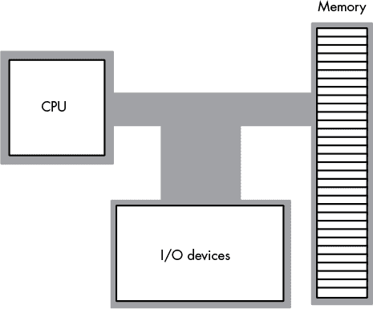

*图 6-1：典型的冯·诺依曼机器*

在 VNA 机器中，如 80x86 系统，所有计算都在 CPU 内部进行。数据和机器指令存储在内存中，直到 CPU 需要它们为止，此时系统会将数据传输到 CPU 中。对于 CPU 而言，大多数 I/O 设备看起来像内存；它们之间的主要区别在于，I/O 设备通常位于外部世界，而内存则位于同一台机器内。

#### *6.1.1 系统总线*

*系统总线*连接 VNA 机器的各个组件。*总线*是一组电线，电信号通过这些电线在系统组件之间传递。大多数 CPU 有三条主要总线：*数据*总线、*地址*总线和*控制*总线。这些总线在不同处理器之间有所不同，但每条总线在大多数 CPU 中传输相似的信息。例如，Pentium 和 80386 的数据信号总线有不同的实现，但这两种变体都在处理器、I/O 和内存之间传输数据。

##### 6.1.1.1 数据总线

CPU 使用数据总线在计算机系统的各个组件之间传输数据。这个总线的大小在不同 CPU 之间差异很大。实际上，总线大小（或*宽度*）是定义处理器“大小”的主要属性之一。

大多数现代通用 CPU（如 PC 中的 CPU）采用 32 位宽或更常见的 64 位宽数据总线。有些处理器使用 8 位或 16 位数据总线，到你读到这本书的时候，也许已经有 128 位数据总线的 CPU 了。

你经常会听到 *8 位*、*16 位*、*32 位* 或 *64 位处理器* 这样的术语。处理器的大小由较小的值决定：处理器的数据线数量或最大通用整数寄存器的大小。例如，旧的 Intel 80x86 CPU 都有 64 位总线，但只有 32 位的通用整数寄存器，因此它们被归类为 32 位处理器。AMD（以及更新的 Intel）x86-64 处理器支持 64 位整数寄存器和 64 位总线，因此它们是 64 位处理器。

尽管具有 8 位、16 位、32 位和 64 位数据总线的 80x86 系列处理器可以处理与总线位宽相同大小的数据块，但它们也可以访问更小的内存单元（8 位、16 位或 32 位）。因此，任何小数据总线可以完成的任务，大数据总线也能完成；然而，较大的数据总线可能能更快地访问内存，并且能在一次内存操作中访问更大的数据块。你将在本章稍后了解这些内存访问的具体性质。

##### 6.1.1.2 地址总线

80x86 系列处理器的数据总线在特定的内存位置或 I/O 设备与 CPU 之间传输信息。*哪个*内存位置或 I/O 设备就是地址总线的作用所在。系统设计师为每个内存位置和 I/O 设备分配一个唯一的内存地址。当软件想要访问特定的内存位置或 I/O 设备时，它将相应的地址放到地址总线上。设备内部的电路检查该地址，如果匹配，则传输数据。所有其他内存位置会忽略地址总线上的请求。

通过单个地址总线线，处理器可以访问两个唯一地址：0 和 1。通过 *n* 根地址线，处理器可以访问 2^(*n*) 个唯一地址（因为 *n* 位二进制数中有 2^(*n*) 个唯一值）。地址总线的位数决定了*最大*可寻址的内存和 I/O 位置数量。例如，早期的 80x86 处理器仅提供 20 根地址总线线。因此，它们最多只能访问 1,048,576（或 2²⁰）个内存位置。更大的地址总线可以访问更多的内存（请参见 表 6-1）。

**表 6-1:** 80x86 地址能力

| **处理器** | **地址总线大小** | **最大可寻址内存** |
| --- | --- | --- |
| 8088, 8086, 80186, 80188 | 20 | 1,048,576 (1MB) |
| 80286, 80386sx | 24 | 16,777,216 (16MB) |
| 80386dx | 32 | 4,294,976,296 (4GB) |
| 80486, Pentium | 32 | 4,294,976,296 (4GB) |
| Pentium Pro, II, III, IV | 36 | 68,719,476,736 (64GB) |
| Core, i3, i5, i7, i9 | ≥ 40 | ≥1,099,511,627,776 (≥1TB) |

更新的处理器将支持更大的地址总线。许多其他处理器（如 ARM 和 IA-64）已经提供了更大的地址总线，实际上，在软件中支持高达 64 位的地址。

就内存而言，64 位地址范围实际上是无限的。没有人会在计算机系统中放入 2⁶⁴字节的内存，并感到还需要更多。当然，过去人们曾做过类似的预测。几年前，没有人会认为计算机需要 1GB 的内存，而如今配备 64GB 内存（或更多）的计算机已经非常常见。然而，2⁶⁴实际上等同于无限，原因很简单——根据当前宇宙的估计大小（大约是 2⁸⁶个不同的基本粒子），物理上是不可能构建出这么多内存的。除非你能将每个基本粒子连接 1 字节的内存，否则即使是整个地球上的所有内存也无法接近 2⁶⁴字节的内存。当然，也许有一天我们真会像道格拉斯·亚当斯在《银河系漫游指南》中预测的那样，使用整个行星作为计算机系统，谁知道呢？

虽然较新的 64 位处理器具有 64 位的内部地址空间，但它们很少在芯片上引出 64 条地址线。这是因为在大型 CPU 中引脚是宝贵资源，没必要引出那些永远不会使用的额外地址引脚。目前，40 到 52 位地址总线是上限。在遥远的未来，可能会有所扩展，但很难想象会有需要或甚至可能实现物理 64 位地址总线的情况。

在现代处理器中，CPU 制造商将内存控制器直接集成到 CPU 中。新型 CPU 不再采用传统的地址和数据总线来连接任意内存设备，而是包含专用的总线，用于与非常特定的*动态随机存取内存（DRAM）*模块进行通信。典型的 CPU 内存控制器仅连接到一定数量的 DRAM 模块；因此，您可以轻松连接到 CPU 的最大 DRAM 容量，取决于集成在 CPU 中的内存控制，而不是外部地址总线的大小。这也是为什么一些较旧的笔记本电脑即便拥有 64 位 CPU，仍然存在 16MB 或 32MB 最大内存限制的原因。^(1)

##### 6.1.1.3 控制总线

控制总线是一个多样化的信号集合，用于控制处理器如何与系统的其余部分进行通信。为了理解它的重要性，先考虑一下数据总线。CPU 使用数据总线在自己与内存之间传输数据。系统通过控制总线上的两条线，*读取*和*写入*，来确定数据流动的方向（从 CPU 到内存，或从内存到 CPU）。因此，当 CPU 想要将数据写入内存时，它会*激活*（在控制线中放置信号）写入控制线。当 CPU 想要从内存读取数据时，它会激活读取控制线。

尽管控制总线的确切组成在不同的处理器之间有所不同，但一些控制线——如系统时钟线、 interrupt 线、状态线和字节使能线——在所有处理器中都是共同的。字节使能线出现在一些支持字节可寻址内存的 CPU 的控制总线上。这些控制线允许 16 位、32 位和 64 位处理器通过传递伴随数据的大小来处理更小的数据块。更多细节请参见“16 位数据总线”章节，位于第 138 页和“32 位数据总线”章节，位于第 140 页。

在 80x86 系列处理器中，控制总线还包含一个信号，用于区分不同的地址空间。与许多其他处理器不同，80x86 系列提供了两个不同的地址空间：一个用于内存，另一个用于 I/O。然而，它只有一个物理地址总线，I/O 和内存共享这个总线，因此需要额外的控制线来决定该地址指向哪个组件。当这些信号处于激活状态时，I/O 设备使用地址总线的低 16 位地址；当它们处于非激活状态时，I/O 设备忽略这些信号，内存子系统接管地址总线。

### 6.2 内存的物理组织

一个典型的 CPU 最多可以寻址 2^(*n*)个不同的内存位置，其中 *n* 是地址总线上的位数（大多数基于 80x86 系列 CPU 构建的计算机系统并不包括最大可寻址的内存量）。但内存位置究竟是什么呢？以 80x86 为例，它支持*字节可寻址内存*。因此，基本的内存单元是字节。80x86 处理器通过包含 20、24、32、36 或 40 条地址线的地址总线，可以分别寻址 1MB、16MB、4GB、64GB 或 1TB 的内存。一些 CPU 系列不提供字节可寻址内存；相反，它们通常仅以双字或甚至四字块寻址内存。然而，由于大量软件*假设*内存是字节可寻址的（比如所有 C/C++程序），即使是那些硬件上不支持字节可寻址内存的 CPU，仍然会使用字节地址并在软件中模拟字节寻址。稍后我们会回到这个话题。

将内存视为一个字节数组。第一个字节的地址是 0，最后一个字节的地址是 2^(*n*) – 1。对于一个具有 20 位地址总线的 CPU，以下伪 Pascal 数组声明可以很好地近似内存的组织：

```
Memory: array [0..1048575] of byte; // 1MB address space (20 bits)
```

为了执行等效的 Pascal 语句 `Memory [125] := 0;`，CPU 将值`0`放置到数据总线上，将地址`125`放置到地址总线上，并在控制总线上激活写操作线，如图 6-2 所示。

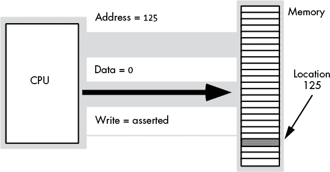

*图 6-2：内存写操作*

为了执行相当于`CPU := Memory [125];`的操作，CPU 将地址`125`放置在地址总线上，激活控制总线上的读线，然后从数据总线上读取相应的数据（参见图 6-3）。

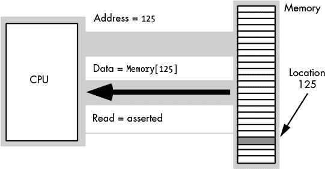

*图 6-3：内存读操作*

这个讨论*仅*适用于处理器在访问内存中的单个字节时。那么当它访问一个字或双字时会发生什么呢？因为内存由字节数组组成，我们怎么处理大于 8 位的值呢？

不同的计算机系统对于这个问题有不同的解决方案。80x86 系列将一个字的低字节存储在指定的地址，并将高字节存储在下一个位置。因此，一个字消耗两个连续的内存地址（正如你所期望的，因为一个字由 2 个字节组成）。类似地，一个双字消耗四个连续的内存位置。

一个字或双字的地址是其低字节（LO byte）的地址。其余的字节紧跟在低字节之后，高字节（HO byte）出现在字的地址加 1 或双字的地址加 3 的位置（参见图 6-4）。

字节、字和双字的值在内存中可能会重叠。例如，在图 6-4 中，你可能会有一个从地址 193 开始的字变量，一个从地址 194 开始的字节变量，以及一个从地址 192 开始的双字变量。字节、字和双字可能从内存中的*任何*有效地址开始。然而，我们很快会看到，从任意地址开始较大的对象并不是一个好主意。

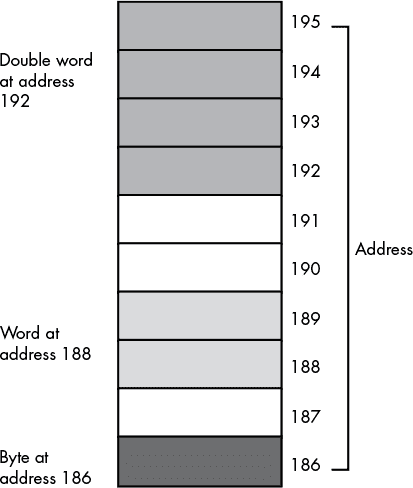

*图 6-4：内存中的字节、字和双字存储（在 80x86 上）*

#### *6.2.1 8 位数据总线*

一个具有 8 位总线的处理器（如老旧的 8088 CPU）一次可以传输 8 位数据。因为每个内存地址对应一个 8 位字节，所以 8 位总线被证明是最方便的架构（从硬件角度看），正如图 6-5 所示。

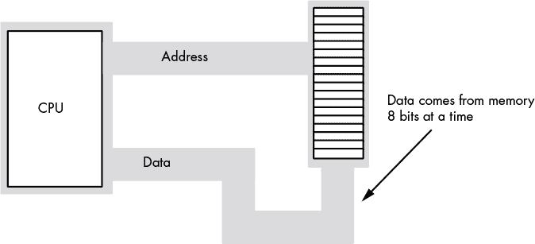

*图 6-5：8 位 CPU <–> 内存接口*

*字节寻址内存阵列*的术语意味着 CPU 可以以最小为单个字节的块来寻址内存。这也意味着这是你可以一次通过处理器访问的*最小*内存单元。也就是说，如果处理器想要访问一个 4 位的值，它必须读取 8 位，然后忽略额外的 4 位。

字节寻址*并不*意味着 CPU 可以从任何任意的位边界开始访问 8 位。当你在内存中指定地址 125 时，你将获取该地址的所有 8 位——不多也不少。地址是整数；例如，你不能指定地址 125.5 来获取少于 8 位的内容，或者获取跨越两个字节地址的字节。

虽然具有 8 位数据总线的 CPU 可以方便地操作字节值，但它们也能够操作字和双字值。然而，这需要多次内存操作，因为这些处理器每次只能移动 8 位数据。加载一个字需要两次内存操作；加载一个双字需要四次内存操作。

#### *6.2.2 16 位数据总线*

一些 CPU（例如 8086、80286 以及 ARM 处理器家族的变种）有 16 位数据总线。这使得这些处理器在相同时间内可以访问比其 8 位对手多一倍的内存。这些处理器将内存组织成两个*银行*：一个是“偶数”银行，另一个是“奇数”银行（见图 6-6）。

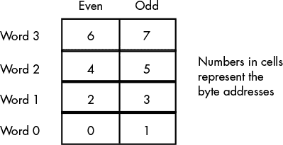

*图 6-6：字节寻址中的字内存*

图 6-7 展示了数据总线与 CPU 的连接。在此图中，数据总线线路 D0 至 D7 传输字的 LO 字节，而数据总线线路 D8 至 D15 传输字的 HO 字节。

80x86 家族的 16 位处理器可以从任何任意地址加载字。如前所述，处理器从指定地址获取字的 LO 字节，从下一个连续地址获取字的 HO 字节。然而，这会产生一个微妙的问题。当你访问一个从奇数地址开始的字时，会发生什么呢？假设你要从位置 125 读取一个字。该字的 LO 字节来自位置 125，HO 字节来自位置 126。事实证明，这种方法实际上存在*两个*问题。

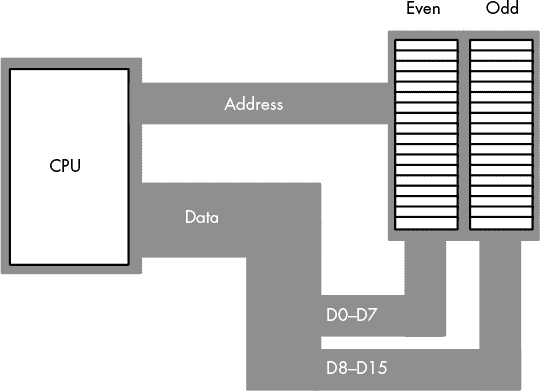

*图 6-7：16 位处理器内存组织*

如你在图 6-7 中看到的，数据总线线路 8 至 15（HO 字节）连接到奇数银行，而数据总线线路 0 至 7（LO 字节）连接到偶数银行。访问内存位置 125 时，会通过数据总线的 D8 至 D15 线路将数据传输到 CPU，数据会放置在 HO 字节中，但我们需要将数据放在 LO 字节！幸运的是，80x86 CPU 会自动识别并处理这种情况。

第二个问题更为隐晦。当访问字时，我们实际上是在访问两个独立的字节，每个字节都有自己的字节地址。那么，地址总线上会出现什么地址呢？16 位的 80x86 CPU 始终将偶数地址放置在总线上。位于偶数地址的字节总是出现在数据线路 D0 至 D7 上，而位于奇数地址的字节总是出现在数据线路 D8 至 D15 上。如果你访问偶数地址处的字，CPU 可以通过一次内存操作将整个 16 位数据块加载进来。同样，如果你访问一个字节，CPU 会激活适当的银行（使用字节使能控制线），并通过适当的数据线路传输该字节。

那么，当 CPU 以奇数地址访问一个字时会发生什么呢？就像之前给出的例子那样？CPU 不能将地址 125 放入地址总线并从内存读取 16 位数据。16 位 80x86 CPU 不会有奇数地址——它们总是偶数。因此，如果你尝试将 125 放入地址总线，实际上显示的是 124。如果你在这个地址读取 16 位数据，你会得到地址 124（低字节）和地址 125（高字节）处的字——这并不是你预期的。访问奇数地址的字需要两次内存操作（就像 8088/80188 上的 8 位总线一样）。首先，CPU 必须读取地址 125 处的字节，然后读取地址 126 处的字节。其次，它需要在内部交换这两个字节的位置，因为它们都进入了 CPU 的错误数据总线半部分。

幸运的是，16 位的 80x86 CPU 将这些细节对你隐藏起来。你的程序可以访问*任何*地址的字，CPU 会正确地访问并交换（如果需要）内存中的数据。然而，由于需要两次操作，在 16 位处理器上访问奇数地址的字比访问偶数地址的字要慢。通过精心安排内存使用方式，你可以提高程序在这些 CPU 上的运行速度。

#### *6.2.3 32 位数据总线*

在 16 位处理器上，访问 32 位数据总是至少需要两次内存操作。要在奇数地址访问 32 位数据，16 位处理器可能需要三次内存操作。

具有 32 位数据总线的 80x86 处理器，如奔腾和 Core 处理器，使用四个内存银行连接到 32 位数据总线（见图 6-8）。

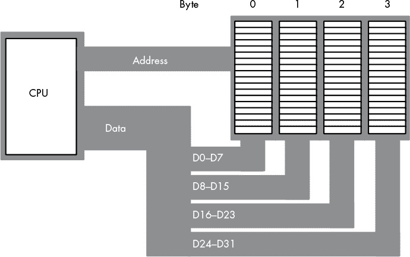

*图 6-8：32 位处理器内存接口*

在 32 位内存接口下，80x86 CPU 可以通过一次内存操作访问任意单字节。而在 16 位内存接口下，放入地址总线的地址总是偶数；而在 32 位内存接口下，地址总是 4 的倍数。通过各种字节使能控制线，CPU 可以选择该地址上 4 个字节中的哪个进行访问。与 16 位处理器一样，CPU 会根据需要自动重新排列字节。

32 位 CPU 也可以通过单次内存操作访问最多一个字的内存地址，尽管在某些地址上的字访问需要进行两次内存操作（见图 6-9）。这是我们在 16 位处理器尝试以奇数地址取字时遇到的相同问题，只是它发生的频率是原来的一半——只有当地址除以 4 余 3 时才会出现。

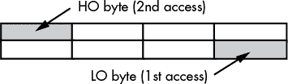

*图 6-9：在 32 位处理器上访问一个字，地址模 4 余 3*

32 位 CPU 只能在目标值的地址能够被 4 整除的情况下，单次内存操作访问一个双字。如果不能整除，CPU 可能需要两次内存操作。

再次强调，80x86 CPU 会自动处理这一切。然而，正确的数据对齐仍然能带来性能上的好处。通常，字值的低字节应始终放置在偶数地址，而双字值的低字节应始终放置在能够被 4 整除的地址上。

#### *6.2.4 64 位数据总线*

像英特尔 i 系列这样的奔腾及之后的处理器，提供了 64 位的数据总线和特殊的缓存内存，这减少了非对齐数据访问的影响。尽管访问不适当地址的数据可能仍会带来一定的性能损失，但现代 x86 CPU 在此问题上的表现要优于早期的 CPU。我们将在“缓存内存”一节中进一步讨论，详见第 151 页。

#### *6.2.5 非 80x86 处理器上的小数据访问*

尽管 80x86 处理器并不是唯一允许你在任意字节地址访问字节、字或双字对象的处理器，但过去 30 年中大多数处理器都*不*允许这样做。例如，最初的 Apple Macintosh 系统中使用的 68000 处理器允许你在任何地址访问字节，但如果你尝试在奇数地址访问字，则会引发异常。^(2) 许多处理器要求你在对象大小的倍数地址上访问该对象，否则会抛出异常。

大多数 RISC 处理器，包括现代智能手机和平板电脑中使用的 ARM 处理器，并不允许你访问字节或字对象。大多数 RISC CPU 要求所有的数据访问大小与数据总线（或通用整数寄存器大小，以较小者为准）相同。通常情况下，这是双字（32 位）或四字（64 位）的访问。如果你想在这样的机器上访问字节或字，你必须将其视为打包字段，并使用移位和掩码技术在双字中提取或插入字节和字数据。虽然在进行字符和字符串处理的软件中几乎无法避免字节访问，但如果你期望软件能够在各种现代 RISC CPU 上高效运行，应该避免使用字数据类型（及其访问带来的性能损失），而倾向于使用双字。

### 6.3 大端与小端存储方式

之前，你读到过 80x86 CPU 系列将一个字或双字值的低字节存储在内存中的某个特定地址，而后续的高字节则存储在更高的地址。现在我们将更深入地探讨不同处理器如何在字节可寻址的内存中存储多字节对象。

几乎每个“位大小”是 2 的幂（8、16、32、64 等）的 CPU 都按前几章所示的方式对位和半字节进行编号。虽然有一些例外，但它们很少见，而且大多数情况下它们代表的是符号的变化，而不是功能上的变化（这意味着你可以安全地忽略差异）。然而，一旦开始处理大于 8 位的对象，事情变得更加复杂。不同的 CPU 对多字节对象中的字节进行不同的组织。

考虑 80x86 CPU 上双字节的字节布局（见 图 6-10）。LO 字节，作为二进制数中最小的组成部分，位于第 0 到第 7 位，并出现在内存中最低的地址位置。似乎最少贡献的位应当位于内存中的最低地址。

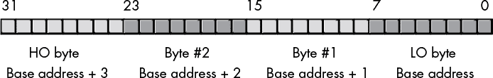

*图 6-10：80x86 处理器中的双字节布局*

然而，这并不是唯一的组织方式。某些 CPU 会反转双字节中所有字节的内存地址，使用 图 6-11 所示的组织方式。

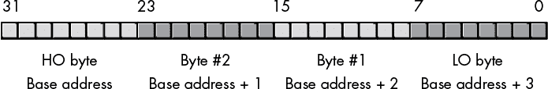

*图 6-11：双字的替代字节布局*

原始的苹果 Macintosh（68000 和 PowerPC）以及大多数非 80x86 Unix 机器使用 图 6-11 所示的数据组织方式。即便是在 80x86 系统上，某些协议（如网络传输）也规定了这种数据组织方式。因此，这并不是某种罕见的、深奥的约定；它相当常见，如果你在 PC 上工作，是不容忽视的。

英特尔使用的字节组织方式被戏谑地称为 *小端字节组织方式*。另一种形式则称为 *大端字节组织方式*。

**注意**

*这些术语来自 Jonathan Swift 的* 《格列佛游记》；*小人国的人们争论是否应该从小端还是大端打开鸡蛋——这是对当时天主教徒和新教徒在 Swift 写作时对各自教义争论的讽刺。*

关于哪种格式更优的争论，早在多种使用不同 *字节序* 的 CPU 被创造出来之前就已经过时了。今天，这种争论已经没有意义。无论哪种格式更好或更差，我们都必须面对不同 CPU 存在不同字节序的事实，并且在编写软件时要小心，以确保我们的程序能够在这两种类型的处理器上运行。

当我们尝试在两台计算机之间传递二进制数据时，就会遇到大端与小端的问题。例如，在小端机上，256 的双字二进制表示具有以下字节值：

```
LO byte:     0

Byte #1:     1

Byte #2:     0

HO byte:     0
```

如果你在小端机器上组装这 4 个字节，它们的布局将呈现以下形式：

```
Byte:        3    2    1    0

256:         0    0    1    0    (each digit represents an 8-bit value)
```

然而，在大端机上，布局呈现以下形式：

```
Byte:        3    2    1    0

256:         0    1    0    0    (each digit represents an 8-bit value)
```

这意味着，如果你从一台机器获取一个 32 位值并试图在另一台具有不同字节序的机器上使用它，你将无法得到正确的结果。例如，如果你将一个大端版本的 256 值作为小端格式来解释，你会发现它在第 16 位上有一个`1`，而小端机器会认为该值实际上是 65,536（即`%1_0000_0000_0000_0000`）。

当你在两台不同的机器之间交换数据时，最佳的解决方案是将数据转换为某种规范形式（canonical form），然后在本地格式和规范格式不一致的情况下，将规范格式转换回本地格式。什么构成“规范”格式通常取决于传输介质。例如，当你通过网络传输数据时，规范格式通常是大端字节序（big-endian），因为 TCP/IP 和其他一些网络协议使用大端格式。当你通过通用串行总线（USB）传输数据时，规范格式是小端字节序（little-endian）。当然，如果你能控制两端的软件，选择规范格式是可以任意的；不过，为了避免今后出现混淆，仍然应该尝试使用适合传输介质的格式。

要在字节序之间转换，你必须进行*镜像交换*，即交换对象中二进制数字两端的字节，然后逐步向对象的中间移动，交换字节对。例如，要在双字之间转换大端和小端格式，你首先交换字节 0 和字节 3，然后交换字节 1 和字节 2（参见图 6-12）。

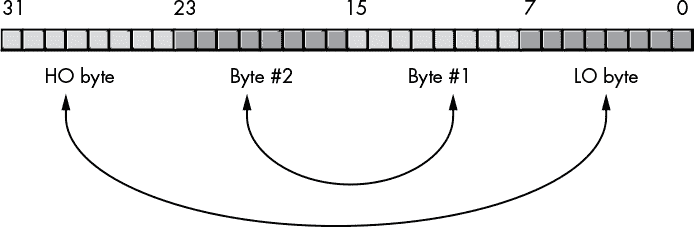

*图 6-12：双字的字节序转换*

对于字（word）值，你只需要交换高位字节（HO）和低位字节（LO）来改变字节序。对于四字（quad-word）值，你需要交换字节 0 和字节 7、字节 1 和字节 6、字节 2 和字节 5、字节 3 和字节 4。因为很少有软件处理 128 位整数，你可能不需要担心长字（long-word）字节序转换，但如果需要，概念是相同的。

请注意，字节序转换过程是*自反的*；也就是说，将大端字节序转换为小端字节序的相同算法，也可以将小端字节序转换为大端字节序。如果你运行该算法两次，数据将恢复为原始格式。

即使你没有编写用于在两台计算机之间交换数据的软件，字节序的问题仍然可能出现。有些程序通过将离散的字节分配到较大值的特定位置来组装较大的对象。如果软件在大端机器上将低位字节放置在第 0 到 7 位（小端格式），程序将无法产生正确的结果。因此，如果软件需要在具有不同字节组织方式的不同 CPU 上运行，它必须确定运行的机器的字节序，并相应地调整如何从字节中组装较大的对象。

为了说明如何从离散字节构建较大的对象，我们将通过一个简单示例开始，展示如何从 4 个独立字节组装一个 32 位对象。最常见的方法是创建一个*判别联合体*结构，它包含一个 32 位对象和一个 4 字节数组。

**注意**

*许多语言（但并非全部）支持判别联合数据类型。例如，在 Pascal 中，你会使用一种称为“case variant”的记录。详情请参阅你的语言参考手册。*

联合体类似于记录或结构，唯一的不同是编译器在内存中的同一地址为联合体的每个字段分配存储空间。考虑以下来自 C 语言的两个声明：

```
struct

{

    short unsigned i;   // Assume shorts require 16 bits.

    short unsigned u;

    long unsigned r;    // Assume longs require 32 bits.

} RECORDvar;

union

{

    short unsigned i;

    short unsigned u;

    long unsigned r;

} UNIONvar;
```

如图 6-13 所示，`RECORDvar`对象在内存中占用 8 个字节，且各字段的内存不与其他字段共享（也就是说，每个字段从记录的基地址开始有不同的偏移量）。另一方面，`UNIONvar`对象将联合体中的所有字段叠加在相同的内存位置。因此，向联合体中的`i`字段写入一个值，也会覆盖`u`字段的值以及`r`字段的 2 个字节（无论是低字节还是高字节，完全取决于 CPU 的字节序）。


*图 6-13：联合体与记录（结构）在内存中的布局*

在 C 编程语言中，你可以利用这种行为来访问 32 位对象的单个字节。考虑以下 C 语言中的联合体声明：

```
union

{

    unsigned long bits32; /* This assumes that C uses 32 bits for 

                             unsigned long */

    unsigned char bytes[4];

} theValue;
```

这会在小端机器上创建图 6-14 所示的数据类型，而在大端机器上则创建图 6-15 所示的结构。

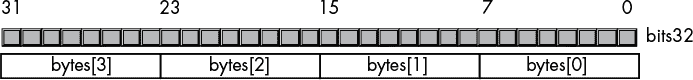

*图 6-14：在小端机器上的 C 联合体*

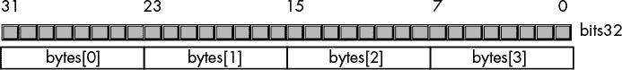

*图 6-15：在大端机器上的 C 联合体*

在小端机器上，从 4 个离散字节组装一个 32 位对象，你可以使用如下代码：

```
theValue.bytes[0] = byte0;

theValue.bytes[1] = byte1;

theValue.bytes[2] = byte2;

theValue.bytes[3] = byte3;
```

这段代码能够正常工作，因为 C 语言将数组的第一个字节分配到内存中最低的地址（对应小端机器上`theValue.bits32`对象的第 0 到 7 位）；数组的第二个字节紧随其后（第 8 到 15 位），然后是第三个字节（第 16 到 23 位），最后是最高字节（占用内存中的最高地址，对应第 24 到 31 位）。

然而，在大端机器上，这段代码无法正常工作，因为`theValue.bytes[0]`对应的是 32 位值的第 24 到 31 位，而不是第 0 到 7 位。要在大端系统上正确组装这个 32 位值，您需要使用如下代码：

```
theValue.bytes[0] = byte3;

theValue.bytes[1] = byte2;

theValue.bytes[2] = byte1;

theValue.bytes[3] = byte0;
```

但是，如何判断你的代码是在小端还是大端机器上运行呢？这其实是一个简单的任务。考虑以下 C 代码：

```
theValue.bytes[0] = 0;

theValue.bytes[1] = 1;

theValue.bytes[2] = 0;

theValue.bytes[3] = 0;

isLittleEndian = theValue.bits32 == 256;
```

在大端机器上，这段代码将把值`1`存储到第 16 位，产生一个 32 位值，该值肯定不等于 256；而在小端机器上，这段代码将把值`1`存储到第 8 位，产生一个等于 256 的 32 位值。因此，您可以测试`isLittleEndian`变量，以确定当前机器是小端（`true`）还是大端（`false`）。

### 6.4 系统时钟

尽管现代计算机速度非常快，并且一直在不断加快，但它们仍然需要时间来完成即使是最小的任务。在冯·诺依曼结构的机器中，大多数操作都是*串行化*的，这意味着计算机按规定的顺序执行命令。（见注释^3）在以下代码序列中，如果在`I := J;`语句完成之前执行`I := I * 5 + 2;`，那是行不通的：

```
I := J;

I := I * 5 + 2;
```

这些操作并不是瞬间完成的。将`J`的副本移动到`I`中需要一定的时间。同样，乘以 5 后再加 2 并将结果存回`I`也需要时间。

为了按正确的顺序执行语句，处理器依赖于*系统时钟*，该时钟作为系统内部的时序标准。要理解为什么某些操作需要比其他操作更长的时间，您首先必须理解系统时钟是如何工作的。

系统时钟是控制总线上的电信号，它周期性地在 0 和 1 之间切换（见图 6-16）。CPU 内的所有活动都与该时钟信号的边缘（上升沿或下降沿）同步。

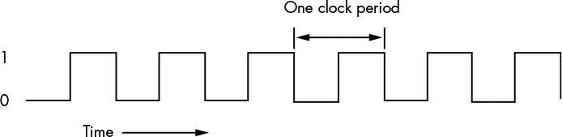

*图 6-16：系统时钟*

系统时钟在 0 和 1 之间切换的速率被称为*系统时钟频率*，而系统时钟从 0 切换到 1 再回到 0 所需的时间称为*时钟周期*或*时钟周期*。在大多数现代系统中，系统时钟频率超过数十亿个周期每秒。典型的 Pentium IV 处理器，大约在 2004 年左右，运行速度为每秒三十亿个周期或更快。*赫兹（Hz）*是每秒一个周期对应的单位，因此前述的 Pentium 芯片运行在 3000 到 4000 百万赫兹之间，或 3000 到 4000 兆赫（MHz），或 3 到 4 吉赫（GHz，或每秒十亿个周期）。80x86 系列的典型频率范围从 5 MHz 到数吉赫赫兹及以上。

时钟周期是时钟频率的倒数。例如，1 MHz（兆赫，或每秒一百万个周期）的时钟，其时钟周期为 1 微秒（百万分之一秒，µs^(4))。一颗运行在 1 GHz 的 CPU，其时钟周期为 1 纳秒（ns），即十亿分之一秒。时钟周期通常以微秒或纳秒为单位表示。

为了确保同步，大多数 CPU 在时钟的*下降沿*（时钟从 1 变为 0 时）或*上升沿*（时钟从 0 变为 1 时）启动一个操作。系统时钟大部分时间处于 0 或 1 状态，而在两者之间切换的时间非常短暂。因此，时钟沿是一个完美的同步点。

由于所有 CPU 操作都与时钟同步，因此 CPU 的任务执行速度不能超过时钟的运行速度。然而，仅仅因为 CPU 运行在某个时钟频率上，并不意味着它每秒执行那么多操作。许多操作需要多个时钟周期才能完成，因此 CPU 的操作速度往往比时钟速度慢得多。

#### *6.4.1 内存访问和系统时钟*

内存访问是一个与系统时钟同步的操作；也就是说，内存访问每个时钟周期最多只发生一次。在一些旧的处理器中，访问一个内存位置需要多个时钟周期。*内存访问时间*是从内存请求（读取或写入）到内存操作完成之间的时钟周期数。这是一个重要的值，因为更长的内存访问时间会导致较低的性能。

现代 CPU 的速度远快于内存设备，因此以这些 CPU 为基础的系统通常使用第二个时钟，即*总线时钟*，其频率是 CPU 速度的一部分。例如，典型的 100 MHz 到 4 GHz 范围的处理器可以使用 1600 MHz、800 MHz、500 MHz、400 MHz、133 MHz、100 MHz 或 66 MHz 的总线时钟（某个特定的 CPU 通常支持多种不同的总线速度，具体支持的范围取决于该 CPU）。

在读取内存时，内存访问时间是 CPU 将地址放到地址总线上的时间与 CPU 从数据总线上取数据的时间之间的间隔。在典型的 80x86 CPU 中，内存访问时间为一个周期，读取操作的时序大致如下图 6-17。将数据写入内存的时序类似（见图 6-18）。

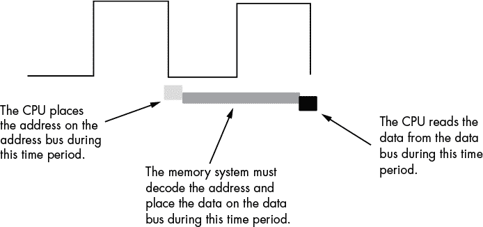

*图 6-17：典型的内存读取周期*

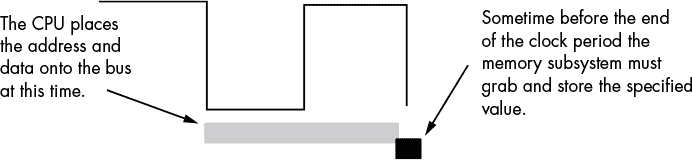

*图 6-18：典型的内存写入周期*

CPU 不会等待内存。访问时间由总线时钟频率指定。如果内存子系统的工作速度不足以跟上 CPU 预期的访问时间，CPU 在内存读取操作时将读取到垃圾数据，在内存写入时也无法正确存储数据。这肯定会导致系统失败。

内存设备有各种不同的评级，但主要有两个参数：容量和速度。典型的动态 RAM（随机存取内存）设备的容量为 16GB（或更大），速度为 0.1 到 100 纳秒。一个典型的 4 GHz 英特尔系统使用 1600 MHz（1.6 GHz，或 0.625 纳秒）内存设备。

现在，我刚才提到内存速度必须与总线速度匹配，否则系统将会失败。在 4 GHz 下，时钟周期大约为 0.25 纳秒。那么，系统设计师如何使用 0.625 纳秒的内存呢？答案是* 等待状态*。

#### *6.4.2 等待状态*

等待状态是一个额外的时钟周期，给设备额外的时间来响应 CPU。例如，一个 100 MHz 的 Pentium 系统有 10 纳秒的时钟周期，这意味着你需要 10 纳秒的内存。实际上，你需要更快的内存设备，因为在许多计算机系统中，CPU 和内存之间有额外的解码和缓冲逻辑，这些电路会引入自己的延迟。在图 6-19 中，你可以看到缓冲和解码使系统多出了 10 纳秒的延迟。如果 CPU 需要在 10 纳秒内获得数据，内存必须在 0 纳秒内响应（这显然是不可能的）。

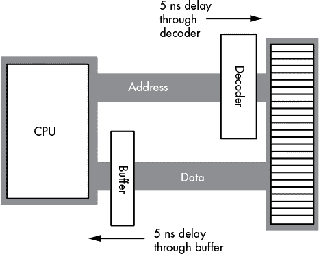

*图 6-19：解码和缓冲延迟*

如果具有成本效益的内存无法与快速处理器配合使用，那么公司如何销售快速 PC 呢？其中一个答案就是等待状态。例如，如果你有一个 100 MHz 的处理器，内存周期时间为 10 纳秒，而你因为缓冲和解码损失了 2 纳秒，你将需要 8 纳秒的内存。然而，如果你的系统只能支持 20 纳秒的内存怎么办？通过添加等待状态来延长内存周期到 20 纳秒，你就能解决这个问题。

几乎所有通用 CPU 都提供一个引脚（其信号出现在控制总线上），允许你插入等待状态。如果需要，内存地址解码电路会触发该信号，以便为内存提供足够的访问时间（见图 6-20）。

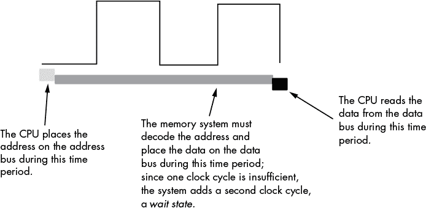

*图 6-20：在内存读取操作中插入等待状态*

从系统性能的角度来看，等待状态*并不是*好事。只要 CPU 在等待来自内存的数据，它就无法对数据进行操作。添加一个等待状态通常会*加倍*（或者在某些系统上更糟糕）访问内存所需的时间。在每次内存访问时都加上一个等待状态几乎就像是将处理器的时钟频率减半。在相同的时间内，你完成的工作会更少。

然而，由于增加了等待状态，我们并不注定会遭遇慢速执行。硬件设计师可以采取几种技巧，在*大多数*时间里实现零等待状态。最常见的做法是使用*缓存*（发音为“cash”）内存。

#### *6.4.3 缓存内存*

一个典型的程序倾向于反复访问相同的内存位置（称为*时间局部性*），并访问相邻的内存位置（*空间局部性*）。这两种局部性在以下 Pascal 代码段中都出现了。

```
for i := 0 to 10 do

         A [i] := 0;
```

在这个循环中，有两个空间局部性和时间局部性的出现。我们先来看一下显而易见的情况。

在这段 Pascal 代码中，程序多次引用变量`i`。`for`循环将`i`与`10`进行比较，以检查循环是否完成。它还会在循环的底部将`i`加 1。赋值语句也使用`i`作为数组索引。这显示了时间局部性的实际应用。

循环本身通过将`0`写入`A`的第一个位置，再写入`A`的第二个位置，以此类推，从而将数组`A`的元素清零。由于 Pascal 将数组`A`的元素存储在连续的内存位置中，每次循环迭代都访问相邻的内存位置。这显示了空间局部性。

那么，时间和空间局部性的第二次出现呢？机器指令也存储在内存中，CPU 从内存中顺序获取这些指令，并在每次循环迭代时重复执行它们。

如果你查看一个典型程序的执行概况，你可能会发现程序执行的语句不到一半。通常，程序可能只使用分配给它的内存的 10%到 20%。在任何给定时刻，一个 1MB 的程序可能只访问 4KB 到 8KB 的数据和代码。因此，如果你花费一笔天价买了昂贵的零等待状态 RAM，在任何时刻你只会使用其中的极小一部分。如果你能购买少量快速 RAM，并在程序执行时动态重新分配其地址，岂不是很好？这正是缓存内存为你做的事情。

缓存内存是一种位于 CPU 和主内存之间的少量非常快速的内存。与普通内存不同，缓存中的字节没有固定的地址。缓存内存可以动态地重新分配地址，这使得系统能够将最近访问过的值保留在缓存中。CPU 从未访问过的地址，或长时间未访问的地址，仍然保留在主（慢）内存中。由于大多数内存访问是访问最近使用的变量（或接近最近访问位置的地址），因此数据通常出现在缓存内存中。

当 CPU 访问内存并在缓存中找到数据时，就会发生*缓存命中*。在这种情况下，CPU 通常可以零等待状态地访问数据。如果数据无法在缓存中找到，则会发生*缓存未命中*。在这种情况下，CPU 必须从主内存中读取数据，从而带来性能损失。为了利用时间局部性，CPU 每次访问缓存中没有的地址时，会将数据复制到缓存中。因为系统可能会很快访问该地址，所以通过将数据存储在缓存中，它可以在未来的访问中节省等待状态。

缓存内存并不能消除等待状态的需要。尽管程序可能会在内存的某个区域花费大量时间执行代码，但最终它会调用一个过程或跳转到缓存内存以外的某个代码段。当这种情况发生时，CPU 必须去主内存获取数据。由于主内存较慢，这将需要插入等待状态。然而，一旦 CPU 访问了数据，它将会被存储在缓存中，以便将来使用。

我们已经讨论了缓存内存如何处理内存访问的时间方面，但尚未涉及空间方面。*当你访问它们时*，缓存内存位置并不会加速程序，如果你不断访问一些你以前从未访问过的连续位置。为了解决这个问题，当发生缓存未命中时，大多数缓存系统会读取主内存中的几个连续字节（工程师称之为*缓存行*）。例如，80x86 系列 CPU 在缓存未命中时会读取 16 到 64 个字节。今天大多数内存芯片都有特殊模式，可以让你快速访问芯片上几个连续的内存位置。缓存利用这个功能来减少访问顺序内存位置时所需的平均等待状态数量。尽管每次缓存未命中时读取 16 个字节是昂贵的，如果你只访问对应缓存行中的少数几个字节，但缓存内存系统在平均情况下表现得相当好。

缓存命中率与缓存内存子系统的大小（以字节为单位）成正比。例如，80486 CPU 有 8,192 字节的片上缓存。英特尔声称使用这个缓存时，命中率可以达到 80%到 95%（意味着 80%到 95%的时间 CPU 会在缓存中找到数据）。这听起来非常令人印象深刻，但让我们稍微调整一下数据。假设我们选择 80%的命中率。意味着平均每五次内存访问中，就有一次不会在缓存中找到。如果你有一个 50 MHz 的处理器（20 ns 周期）和 90 ns 的内存访问时间，四分之三的内存访问只需要 20 ns（一个时钟周期），因为它们在缓存中，剩下的那一次访问将需要大约四个等待状态（正常内存访问需要 20 ns，加上额外的 80 ns 或四个等待状态，才能确保至少达到 90 ns）。然而，缓存总是从内存中读取 16 个连续的字节（4 个双字）。大多数 80486 时代的内存子系统，在访问第一个位置后大约 40 ns 内就可以读取连续地址。因此，80486 将需要额外的六个时钟周期来读取剩余的 3 个双字，总共需要 220 ns。这相当于 11 个时钟周期（每个时钟周期 20 ns），即一个正常的内存周期加上 10 个等待状态。

总的来说，系统需要 15 个时钟周期来访问五个内存位置，或者平均每次访问需要 3 个时钟周期。这相当于每次内存访问都增加了两个等待状态。听起来并不那么令人印象深刻，对吧？当你升级到更快的处理器，并且 CPU 和内存之间的速度差异增大时，情况会变得更糟。

为了提高命中率，你可以添加更多的缓存内存。遗憾的是，你不能拆开英特尔 i9 芯片，然后在芯片上焊接更多的缓存。然而，现代英特尔 CPU 的缓存比 80486 大得多，并且操作时的平均等待状态更少。这提高了缓存命中率。例如，将命中率从 80%提高到 90%可以让你在 20 个周期内访问 10 个内存位置。这将每次内存访问的平均等待状态数减少到一个等待状态——这是一个显著的改进。

改善性能的另一种方法是构建一个*二级*（L2）缓存系统。许多英特尔 CPU 采用这种方式。第一层是片上 8,192 字节的缓存。接下来的层级位于片上缓存和主内存之间，是一个二级缓存（见图 6-21）。在更新的处理器中，一级和二级缓存通常与 CPU 在同一个封装内。这使得 CPU 设计人员能够构建更高性能的 CPU/内存接口，从而使 CPU 能够更快速地在缓存和 CPU（以及主内存）之间传输数据。

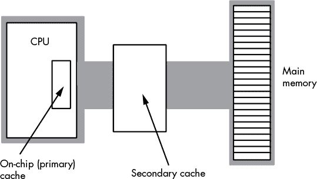

*图 6-21：二级缓存系统*

一般的 CPU 二级缓存包含从 32,768 字节到超过 2MB 的内存。

二级缓存通常无法在零等待周期下运行。支持如此高速内存的电路将是 *非常* 昂贵的，因此大多数系统设计师使用较慢的内存，这需要一个或两个等待周期。尽管如此，这仍然比主内存要快得多。结合现有的片上 L1 缓存，使用 L2 缓存系统可以提升系统性能。

今天，许多 CPU 集成了 *三级 (L3) 缓存*。尽管 L3 缓存带来的性能提升远不及 L1 或 L2 缓存子系统，但 L3 缓存子系统通常可以非常大（通常为数兆字节^(5))，并且在拥有数 GB 主内存的大型系统中表现良好。对于那些处理大量数据但具有局部性特征的程序，L3 缓存子系统非常有效。

### 6.5 CPU 内存访问

大多数 CPU 有两种或三种不同的内存访问方式。现代 CPU 支持的最常见 *内存寻址模式* 包括 *直接*、*间接* 和 *索引*。一些 CPU（如 80x86）支持额外的寻址模式，如 *缩放索引*，而某些 RISC CPU 仅支持间接内存访问。拥有额外的内存寻址模式使得内存访问更加灵活。有时，某种特定的寻址模式允许你使用一条指令访问复杂数据结构中的数据，而否则可能需要两条或更多的指令。

RISC 处理器通常需要三到五条指令才能完成一条 80x86 指令的工作。然而，这并不意味着 80x86 程序将运行得快三到五倍。不要忘记，内存访问非常慢，通常需要等待周期。而 80x86 经常访问内存，而 RISC 处理器则很少这样做。因此，RISC 处理器可能能执行前四条指令，而这些指令根本不访问内存，而 80x86 指令则在等待内存访问时等待某些周期。在第五条指令时，RISC CPU 可能会访问内存，并可能需要自己的等待周期。如果两个处理器每个时钟周期执行一条指令，并且都需要为主内存访问插入 30 个等待周期，我们就谈到 31 个时钟周期（80x86）对 35 个时钟周期（RISC），差距大约为 12%。

选择适当的寻址模式通常可以使应用程序以更少的指令和内存访问计算相同的结果，从而提高性能。因此，如果你想编写快速且紧凑的代码，理解应用程序如何使用 CPU 提供的不同寻址模式非常重要。

#### *6.5.1 直接内存寻址模式*

直接寻址模式将变量的内存地址编码为访问变量的实际机器指令的一部分。在 80x86 上，直接地址是附加到指令编码的 32 位值。通常，程序使用直接寻址模式来访问全局静态变量。以下是 HLA 汇编语言的一个示例：

```
static

    i:dword;

         . . .

    mov( eax, i ); // Store EAX's value into the i variable.
```

当您访问那些程序执行前已知内存地址的变量时，直接寻址模式是理想的选择。通过一条指令，您可以引用与变量关联的内存位置。在那些不支持直接寻址模式的 CPU 上，您可能需要额外的指令（或更多指令）来在访问该变量之前将寄存器加载到变量的内存地址。

#### *6.5.2 间接寻址模式*

间接寻址模式通常使用一个寄存器来保存内存地址（有一些 CPU 使用内存位置来保存间接地址，但这种形式的间接寻址在现代 CPU 中很少见）。

间接寻址模式相比于直接寻址模式有几个优点。首先，您可以在运行时修改间接地址的值（该值保存在寄存器中）。其次，编码指定间接地址的寄存器所需的位数远少于编码 32 位（或 64 位）直接地址，因此指令更小。缺点是在访问该地址之前可能需要一条或多条指令将寄存器加载到地址中。

以下 HLA 序列使用了 80x86 间接寻址模式（在寄存器名称周围的括号表示使用间接寻址）：

```
static

    byteArray: byte[16];

         . . .

    lea( ebx, byteArray );  // Loads EBX register with the address 

                            // of byteArray.

    mov( [ebx], al );       // Loads byteArray[0] into AL.

    inc( ebx );             // Point EBX at the next byte in memory

                            // (byteArray[1]).

    mov( [ebx], ah );       // Loads byteArray[1] into AH.
```

间接寻址模式对许多操作很有用，例如访问由指针变量引用的对象。

#### *6.5.3 索引寻址模式*

索引寻址模式结合了直接和间接寻址模式。具体来说，使用这种寻址模式的机器指令在编码中同时包含偏移量（直接地址）和寄存器。在运行时，CPU 计算这两个地址组件的和以创建一个*有效地址*。这种寻址模式非常适合访问数组元素和间接访问结构和记录等对象。尽管指令编码通常比间接寻址模式更大，但索引寻址模式的优势在于您可以在指令中直接指定地址，而无需使用单独的指令将地址加载到寄存器中。

这是一个典型的使用 80x86 索引寻址模式的 HLA 序列的示例：

```
static

    byteArray: byte[16];

        . . .

    mov( 0, ebx );                    // Initialize an index into the array.

    while( ebx < 16 ) do

        mov( 0, byteArray[ebx] );     // Zeros out byteArray[ebx].

        inc( ebx );                   // EBX := EBX +1, move on to the

                                      // next array element.

    endwhile;
```

在这个简短程序中，`byteArray[ebx]`指令演示了索引寻址模式。有效地址是`byteArray`变量的地址加上 EBX 寄存器的当前值。

为了避免在每条使用索引寻址模式的指令中浪费空间编码 32 位或 64 位地址，许多 CPU 提供了一种更短的形式，将 8 位或 16 位偏移量编码为指令的一部分。在使用这种更小的形式时，寄存器提供内存中对象的基址，而偏移量则提供数据结构在内存中的固定位移。例如，这对于通过指向结构的指针访问内存中记录或结构的字段非常有用。前面的 HLA 示例使用 4 字节地址编码了`byteArray`的地址。与此相比，下面是使用索引寻址模式的示例：

```
lea( ebx, byteArray ); // Loads the address of byteArray into EBX.

    . . .

mov( al, [ebx+2] );    // Stores al into byteArray[2]
```

这条指令使用一个字节（而不是 4 个字节）编码位移值；因此，这条指令更短且更高效。

#### *6.5.4 缩放索引寻址模式*

可在多个 CPU 上使用的缩放索引寻址模式提供了比索引寻址模式更多的两个功能：

+   使用两个寄存器（加上偏移量）来计算有效地址的能力

+   在计算有效地址之前，能够将这两个寄存器中的一个寄存器的值乘以一个常数（通常是 1、2、4 或 8）。

这种寻址模式对于访问数组元素尤其有用，前提是数组元素的大小与某个缩放常数匹配（有关原因，请参见第七章中关于数组的讨论）。

80x86 提供了一种缩放索引寻址模式，它有几种不同的形式，如下所示的 HLA 语句所示：

```
mov( [ebx+ecx*1], al );             // EBX is base address, ecx is index.

mov( wordArray[ecx*2], ax );        // wordArray is base address, ecx is index.

mov( dwordArray[ebx+ecx*4], eax );  // Effective address is combination 

                                    // of offset(dwordArray)+ebx+(ecx*4).
```

### 6.6 获取更多信息

Hennessy, John L., 和 David A. Patterson. *计算机架构：定量方法*. 第 5 版. Waltham, MA: Elsevier, 2012.

Hyde, Randall. *汇编语言的艺术*. 第 2 版. San Francisco: No Starch Press, 2010.

Patterson, David A., 和 John L. Hennessy. *计算机组织与设计：硬件/软件接口*. 第 5 版. Waltham, MA: Elsevier, 2014.

**注意**

*第十一章在本书中提供了关于缓存内存和内存架构的额外信息。*
