## 第七章：复合数据类型和内存对象**


复合数据类型由其他更基础的类型组成。例如，指针、数组、记录或结构、元组和联合体等。许多高级语言（HLLs）为这些复合数据类型提供了语法抽象，使它们易于声明和使用，同时隐藏了其底层的复杂性。

尽管使用这些复合数据类型的成本并不算高，但如果程序员不理解它们，容易在应用程序中引入低效问题。本章将概述这些成本，帮助你更好地编写优秀的代码。

### 7.1 指针类型

一个 *指针* 是一个变量，其值指向另一个对象。像 Pascal 和 C/C++ 这样的高级语言通过抽象层隐藏了指针的简单性。如果你不了解背后的运作原理，这种增加的复杂性可能会让人感到害怕。然而，一些基础知识能帮助你轻松理解这一点。

让我们从简单的开始：一个数组。考虑以下 Pascal 中的数组声明：

```
M: array [0..1023] of integer;
```

`M` 是一个包含 1,024 个整数的数组，索引从 `M[0]` 到 `M[1023]`。每个数组元素都可以容纳一个独立的整数值，彼此之间不受影响。换句话说，这个数组为你提供了 1,024 个不同的整数变量，每个变量都可以通过数组索引来访问，而不是通过名称。

语句 `M[0]:=100` 将值 `100` 存储到数组 `M` 的第一个元素中。现在考虑以下两条语句：

```
i := 0; (* assume i is an integer variable *)

M [i] := 100;
```

这两条语句与 `M[0]:=100;` 执行的是相同的操作。你可以使用任何整数表达式，范围从 `0` 到 `1023`，作为该数组的索引。以下语句 *依然* 执行与之前相同的操作：

```
i := 5;      (* assume all variables are integers*)

j := 10;

k := 50;

m [i * j - k] := 100;
```

但是，下面的情况如何呢？

```
M [1] := 0;

M [ M [1] ] := 100;
```

哇！这需要一些时间来消化。然而，如果你慢慢思考，你会意识到这两条指令与之前执行的是相同的操作。第一条语句将 `0` 存储到数组元素 `M[1]` 中。第二条语句获取 `M[1]` 的值（即 `0`），并使用该值来确定存储值 `100` 的位置。

如果你愿意接受这个例子作为合理的——也许有点奇怪，但仍然可以使用——那么你将不会对指针感到困惑，因为 `M[1]` 就是一个指针！好吧，严格来说不是，但如果你把 `M` 改成 “memory”，并把该数组的每个元素当作一个独立的内存位置，那么这就符合指针的定义——也就是说，一个内存变量，其值是指向另一个内存对象的地址。

#### *7.1.1 指针实现*

尽管大多数语言使用内存地址实现指针，但指针实际上是内存地址的一种抽象。因此，一种语言可以使用任何机制来定义指针，映射指针的值到内存中某个对象的地址。例如，某些 Pascal 的实现使用从某个固定内存地址的偏移量作为指针值。某些语言（包括像 LISP 这样的动态语言）通过使用*双级间接访问*来实现指针；也就是说，指针对象包含某个内存变量的地址，而该内存变量的值是要访问的对象的地址。这种方法看起来可能很复杂，但在复杂的内存管理系统中，它提供了某些优势。然而，为了简化起见，本章将假设，如前所定义，指针是一个变量，其值是内存中某个对象的地址。

正如你在前几章的示例中所见，你可以通过使用一个指针和两条 32 位 80x86 机器指令（或者在其他 CPU 上使用类似的指令序列）间接访问一个对象，如下所示：

```
mov( PointerVariable, ebx );   // Load the pointer variable into a register.

mov( [ebx], eax );             // Use register indirect mode to access data.
```

通过双级间接访问数据的效率低于直接指针实现，因为它需要额外的机器指令从内存中获取数据。在像 C/C++或 Pascal 这样的高级语言中，这一点并不明显，你会像下面这样使用双级间接访问：

```
i = **cDblPtr;            // C/C++

i := ^^pDblPtr;           (* Pascal *)
```

这看起来与单级间接访问非常相似。然而，在汇编语言中，你会看到额外的工作：

```
mov( hDblPtr, ebx );  // Get the pointer to a pointer.

mov( [ebx], ebx );    // Get the pointer to the value.

mov( [ebx], eax );    // Get the value.
```

将其与之前两条汇编指令进行对比，后者用于通过单级间接访问对象。因为双级间接访问比单级间接访问需要多 50%的代码，许多语言实现指针时采用单级间接访问。

#### *7.1.2 指针与动态内存分配*

指针通常引用你在*堆*上分配的匿名变量（堆是为动态存储分配保留的内存区域），通过像 C 中的`malloc()`/`free()`，Pascal 中的`new()`/`dispose()`，以及 C++中的`new()`/`delete()`这样的内存分配/释放函数（然而，C++11 及以后的版本更倾向于使用`std::unique_ptr`和`std_shared_ptr`进行内存分配，且自动进行内存释放）。Java、Swift、C++11（及以后的版本）和其他更现代的语言只提供与`new()`等效的函数。这些语言通过垃圾回收自动处理内存释放。

你在堆上分配的对象被称为*匿名变量*，因为你是通过它们的地址而不是名称来引用它们的。而且，由于分配函数返回堆上对象的地址，你通常将函数的返回结果存储到一个指针变量中。虽然指针变量可能有一个名称，但这个名称适用于指针的数据（一个地址），而不是该地址所引用的对象。

#### *7.1.3 指针操作与指针运算*

大多数提供指针数据类型的语言允许你为指针变量分配地址，比较指针值的相等性或不相等性，并通过指针间接引用一个对象。有些语言还允许进行额外的操作，正如你将在本节中看到的那样。

许多语言允许你对指针进行有限的算术运算。至少，这些语言提供了将整数常量加到指针上，或者从指针中减去一个整数的能力。为了理解这两种算术运算的目的，请注意 C 标准库中`malloc()`函数的语法：

```
ptrVar = malloc( bytes_to_allocate );
```

你传递给`malloc()`的参数指定了要分配的存储字节数。一个好的 C 程序员通常会像`sizeof(int)`这样的表达式作为此参数传递。`sizeof()`函数返回其单个参数所需的字节数。因此，`sizeof(int)`告诉`malloc()`至少分配足够的存储空间来存放一个`int`类型的变量。现在考虑以下对`malloc()`的调用：

```
ptrVar = malloc( sizeof( int ) * 8 );
```

如果一个整数的大小是 4 个字节，那么对`malloc()`的这个调用将为 32 个字节分配存储空间，地址连续分布在内存中（参见图 7-1）。

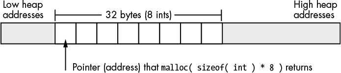

*图 7-1：使用`malloc(sizeof(int) * 8)`进行内存分配*

`malloc()`返回的指针包含这个集合中第一个整数的地址，因此 C 程序只能直接访问这八个整数中的第一个。要访问其他七个整数的单独地址，你需要在该*基*地址上加上一个整数偏移量。在支持字节可寻址内存的机器（例如 80x86）上，内存中每个连续整数的地址是前一个整数地址加上该整数的大小。例如，如果对 C 标准库`malloc()`例程的调用返回内存地址`$0300_1000`，那么`malloc()`分配的八个整数将位于表 7-1 中显示的内存地址。

**表 7-1：** 分配给基地址`$0300_1000`的整数地址

| **整数** | **内存地址** |
| --- | --- |
| `0` | `$0300_1000..$0300_1003` |
| `1` | `$0300_1004..$0300_1007` |
| `2` | `$0300_1008..$0300_100b` |
| `3` | `$0300_100c..$0300_100f` |
| `4` | `$0300_1010..$0300_1013` |
| `5` | `$0300_1014..$0300_1017` |
| `6` | `$0300_1018..$0300_101b` |
| `7` | `$0300_101c..$0300_101f` |

##### 7.1.3.1 将整数加到指针上

因为前面章节描述的这些整数之间的间隔正好是 4 个字节，我们将 4 加到第一个整数的地址，以获得第二个整数的地址；将 4 加到第二个整数的地址，以得到第三个整数的地址；以此类推。在汇编语言中，我们可以通过以下代码访问这八个整数：

```
malloc( @size( int32 ) * 8 );  // Returns storage for eight int32 objects.

                               // EAX points at this storage.

mov( 0, ecx );

mov( ecx, [eax] );             // Zero out the 32 bytes (4 bytes

mov( ecx, [eax+4] );           // at a time).

mov( ecx, [eax+8] );

mov( ecx, [eax+12] );

mov( ecx, [eax+16] );

mov( ecx, [eax+20] );

mov( ecx, [eax+24] );

mov( ecx, [eax+28] );
```

注意使用 80x86 索引寻址模式来访问`malloc()`分配的八个整数。EAX 寄存器保持着这段代码分配的八个整数的基址（第一个地址），而`mov()`指令中的常量在寻址模式中选择了该基址偏移量所对应的具体整数。

大多数 CPU 使用字节地址来表示内存对象。因此，当程序在内存中分配多个* n *字节的对象时，这些对象不会从连续的内存地址开始；相反，它们会出现在相距*n*字节的内存地址上。然而，一些机器不允许程序在内存中的任意地址访问数据；相反，它们要求在字、双字甚至四字对齐的地址边界上访问数据。任何尝试在其他边界上访问内存的行为都会引发异常，并可能导致应用程序停止。如果高级语言支持指针运算，它必须考虑这一事实，并提供一个通用的指针运算方案，能够在不同的 CPU 架构上移植。高级语言在给指针添加整数偏移时，最常见的解决方案是将偏移量乘以指针所引用对象的大小。也就是说，如果你有一个指向 16 字节对象的指针`p`，那么`p + 1`指向比`p`指向的地址向后 16 字节的地方。同样，`p + 2`指向该地址向后 32 字节的地方。只要数据对象的大小是所需对齐大小的倍数（编译器可以通过必要时添加填充字节来强制此约束），这种方案就能避免在需要对齐数据访问的架构上出现问题。

注意，只有在指针和整数值之间，使用加法运算符才有意义。例如，在 C/C++中，你可以使用表达式`*(p + i)`（其中`p`是指向对象的指针，`i`是整数值）间接访问内存中的对象。将两个指针相加，或者将其他数据类型加到指针上，是没有意义的。例如，将浮点数值加到指针上就不合逻辑。（将数据引用设为某个基地址加上 1.5612 又意味着什么呢？）整数——有符号和无符号——是唯一可以加到指针上的合理值。

另一方面，你不仅可以将整数加到指针上，还可以将指针加到整数上，结果仍然是一个指针（`p` `+` `i`和`i` `+` `p`都是合法的）。这是因为加法是* 交换律*——操作数的顺序不影响结果。

##### 7.1.3.2 从指针中减去整数

从指针中减去一个整数表示指针所指向地址之前的一个内存位置。然而，减法不是交换的，且将指针减去一个整数不是合法操作（`p` `-` `i`是合法的，但`i` `-` `p`则不合法）。

在 C/C++ 中，`*(p` `-` `i)` 访问 `p` 所指向的对象之前的第 `i` 个对象。在 80x86 汇编语言中，像许多处理器上的汇编语言一样，你也可以在使用索引寻址模式时指定负常数偏移。例如：

```
mov( [ebx-4], eax );
```

请记住，80x86 汇编语言使用的是字节偏移，而不是对象偏移（如 C/C++ 所做的那样）。因此，这条语句将把紧接在 EBX 中内存地址之前的双字加载到 EAX 中。

##### 7.1.3.3 从指针中减去指针

与加法不同，从一个指针变量减去另一个指针变量是有意义的。考虑以下 C/C++ 代码，它通过字符字符串查找第一个紧跟在第一个 `a` 后面的 `e` 字符：

```
int distance;

char *aPtr;

char *ePtr;

    . . .

aPtr = someString;    // Get ptr to start of string in aPtr.

// While we're not at the end of the string and the current

// char isn't 'a':

while( *aPtr != '\0' && *aPtr != 'a' )

{

    aPtr = aPtr + 1;  // Move on to the next character pointed

                      // at by aPtr.

}

// While we're not at the end of the string and the current 

// character isn't 'e':

ePtr = aPtr;          // Start at the 'a' char (or end of string 

                      // if no 'a').

while( *ePtr != '\0' && *ePtr != 'a' )

{

    ePtr = ePtr + 1;  // Move on to the next character pointed at by aPtr.

}

// Now compute the number of characters between the 'a' and the 'e' 

// (counting the 'a' but not counting the 'e'):

distance = (ePtr - aPtr);
```

从一个指针减去另一个指针会得到它们之间存在的数据对象数量（在此例中，`ePtr` 和 `aPtr` 指向字符，所以减法结果会得到两个指针之间的字符数或字节数）。

只有当两个指针都指向同一数据结构（例如，在内存中指向同一字符串中的字符，如此 C/C++ 示例所示）时，两个指针相减才有意义。虽然 C/C++（以及汇编语言）允许你减去指向内存中完全不同对象的两个指针，但结果可能几乎没有什么意义。

在 C/C++ 中进行指针相减时，两个指针的基本类型必须相同（即，两个指针必须包含两个对象的地址，这些对象的类型是相同的）。这一限制存在的原因是，C/C++ 中的指针相减会产生两个指针之间的对象数量，而不是字节数量。如果你计算内存中的字节和双字之间的对象数量，那就没有意义了；你是要计算字节数还是双字数呢？在汇编语言中你可以这样做（结果始终是两个指针之间的字节数），但从语义上讲，这样做也没有太大意义。

两个指针相减可能会返回负数，如果左侧的指针操作数的内存地址低于右侧的指针操作数。根据你的编程语言及其实现方式，如果你只关心两个指针之间的距离而不在乎哪个指针包含更大的地址，你可能需要取结果的绝对值。

##### 7.1.3.4 比较指针

几乎所有支持指针的语言都会允许你比较两个指针，看看它们是否相等。比较两个指针将告诉你它们是否引用了内存中的同一个对象。一些语言（如汇编和 C/C++）还允许你比较两个指针，看看一个指针是否小于或大于另一个指针。然而，只有当两个指针具有相同的基类型并包含同一数据结构（如数组、字符串或记录）中某个对象的地址时，这种比较才有意义。如果你发现一个指针小于另一个指针，这意味着它引用的数据结构中的某个对象出现在第二个指针所引用的对象之前。大于比较的反向情况也适用。

### 7.2 数组

在字符串之后，数组可能是最常见的复合（或 *聚合*）数据类型。从抽象角度来看，数组是一个聚合数据类型，其成员（元素）都是相同类型的。你可以通过指定数组索引（一个整数或某些底层表示为整数的值，如字符、枚举和布尔类型）来选择数组中的成员。在本章中，我们假设数组的整数索引是连续的（尽管这并不是必须的）。也就是说，如果`x`和`y`都是数组的有效索引，并且`x` `<` `y`，那么所有满足`x` `<` `i` `<` `y`的`i`也是有效的索引。我们还假设数组元素在内存中占据连续的存储位置。因此，包含五个元素的数组在内存中的表现如图 7-2 所示。

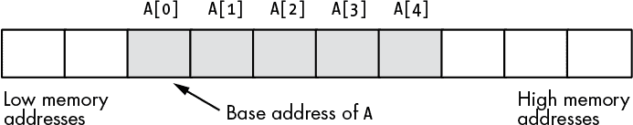

*图 7-2：数组在内存中的布局*

数组的*基地址*是其第一个元素的地址，并占据最低的内存位置。第二个数组元素直接跟在第一个元素之后，第三个元素紧随其后，以此类推。索引不要求从`0`开始；它们可以从任何数字开始，只要是连续的。然而，除非有充分的理由，否则我们将数组从索引`0`开始。

每当你对数组应用索引运算符时，结果就是该索引指定的数组元素。例如，`A[i]`选择数组`A`中的第`i`个元素。

#### *7.2.1 数组声明*

数组声明在许多高级语言中都非常相似。C、C++和 Java 都允许你通过指定数组中元素的总数来声明数组。这些语言中的数组声明语法如下：

```
data_type  array_name [ number_of_elements ];
```

下面是一些典型的 C/C++数组声明：

```
char CharArray[ 128 ];

int intArray[ 8 ];

unsigned char ByteArray[ 10 ];

int *PtrArray[ 4 ];
```

如果你将这些数组声明为自动变量，那么 C/C++会用内存中存在的任何位模式来“初始化”它们。另一方面，如果你将这些数组声明为静态对象，那么 C/C++会将每个数组元素初始化为零。如果你想自己初始化数组，可以使用以下 C/C++语法：

```
data_type array_name[ number_of_elements ] = {element_list};
```

这是一个典型的例子：

```
int intArray[8] = {0,1,2,3,4,5,6,7};
```

Swift 数组声明与其他 C 类语言略有不同。Swift 数组声明有以下两种（等效的）形式：

```
var array_name = Array<element_type>()

var array_name = [element_type]()
```

与其他语言不同，Swift 中的数组是纯动态的。你通常在第一次创建数组时不会指定元素的数量；相反，你可以使用`append()`或`insert()`等函数按需将元素添加到数组中。如果你想预声明一个具有一定数量元素的数组，你可以使用这种特殊的数组构造形式：

```
var array_name = Array<element_type>( repeating: initial_value, count: elements)
```

在这个示例中，initial_value 是元素类型的值，elements 是要在数组中创建的元素数量。例如，以下 Swift 代码创建了两个包含 100 个 `Int` 值的数组，每个数组元素初始化为 `0`：

```
var intArray = Array<Int>( repeating: 0, count: 100)

var intArray2 = Int
```

你仍然可以扩展这个数组的大小（例如，通过使用`append()`函数）；因为 Swift 数组是动态的，它们的大小可以在运行时增长或缩小。

Swift 数组可以通过初始值来创建，以下示例展示了这一点：

```
var intArray = [1, 2, 3]

var strArray = ["str1", "str2", "str3"]
```

C# 数组也是动态对象；尽管它们的语法与 Swift 略有不同，但概念是相同的：

```
type[ ] array_name = new type[elements];
```

在这里，type 是数据类型（例如，`double` 或 `int`），array_name 是数组变量名，elements 是要在数组中分配的元素数量。

你也可以通过以下方式在声明时初始化 C# 数组（其他语法也是可能的；这只是一个简单的示例）：

```
int[ ] intArray = {1, 2, 3};

string[ ] strArray = {"str1", "str2", "str3"};
```

HLA（高级汇编语言）中的数组声明语法如下，它在语义上等同于 C/C++ 的声明：

```
array_name : data_type [ number_of_elements ];
```

以下是一些 HLA 数组声明的示例，它们为未初始化的数组分配存储空间（第二个示例假设你已在 HLA 程序的 `type` 部分定义了 `integer` 数据类型）：

```
static

    CharArray: char[128];         // Character array with elements

                                  //  0..127.

    IntArray: integer[8];         // Integer array with elements 0..7.

    ByteArray: byte[10];          // Byte array with elements 0..9.

    PtrArray: dword[4];           // Double-word array with elements 0..3.
```

你也可以使用以下声明方式来初始化数组元素：

```
RealArray: real32[8] := [ 0.0, 1.0, 2.0, 3.0, 4.0, 5.0, 6.0, 7.0 ];

IntegerAry: integer[8] := [ 8, 9, 10, 11, 12, 13, 14, 15 ];
```

这两个定义都会创建包含八个元素的数组。第一个定义将每个 4 字节的 `real32` 数组元素初始化为 `0.0` 到 `7.0` 范围内的某个值。第二个声明将每个 `integer` 数组元素初始化为 `8` 到 `15` 范围内的某个值。

Pascal/Delphi 使用以下语法来声明数组：

```
array_name : array[ lower_bound..upper_bound ] of data_type;
```

与前面的示例一样，array_name 是标识符，data_type 是该数组中每个元素的类型。与 C/C++、Java、Swift 和 HLA 不同，在 Free Pascal/Delphi 中，你指定的是数组的上下界，而不是数组的大小。以下是 Pascal 中的典型数组声明：

```
type

    ptrToChar = ^char;

var

    CharArray: array[0..127] of char;          // 128 elements

    IntArray: array[ 0..7 ] of integer;        // 8 elements

    ByteArray: array[0..9] of char;            // 10 elements

    PtrArray: array[0..3] of ptrToChar;        // 4 elements
```

尽管这些 Pascal 示例的索引从`0`开始，但 Pascal 并不要求如此。以下 Pascal 数组声明也是完全有效的：

```
var

     ProfitsByYear : array[ 1998..2039 ] of real;  // 42 elements
```

声明该数组的程序在访问该数组的元素时会使用`1998`到`2039`的索引，而不是`0`到`41`。

许多 Pascal 编译器提供一个非常有用的功能，可以帮助你定位程序中的缺陷。每当你访问数组的一个元素时，这些编译器会自动插入代码，以验证数组索引是否在声明中指定的范围内。如果索引超出范围，这段额外的代码会使程序停止。例如，如果对`Profits``ByYear`的索引超出了`1998`到`2039`的范围，程序将因错误而中止。^(1)

通常，数组的索引是整数值，尽管一些语言允许使用其他*序数类型*（使用底层整数表示的数据类型）作为索引。例如，Pascal 允许`char`和`boolean`作为数组索引。在 Pascal 中，声明一个数组如下是完全合理且有用的：

```
alphaCnt : array[ 'A'..'Z' ] of integer;
```

你可以通过字符表达式作为数组索引来访问`alphaCnt`的元素。例如，考虑以下 Pascal 代码，它将`alphaCnt`的每个元素初始化为`0`（假设`ch:char`出现在`var`部分）：

```
for ch := 'A' to 'Z' do

    alphaCnt[ ch ] := 0;
```

汇编语言和 C/C++将大多数序数值视为整数值的特殊实例，因此它们是合法的数组索引。大多数 BASIC 实现允许使用浮点数作为数组索引，尽管 BASIC 在使用浮点数作为索引前会将其截断为整数。^(2)

#### *7.2.2 数组在内存中的表示*

从抽象的角度来看，数组是一个变量集合，你可以通过索引来访问这些变量。从语义上讲，我们可以根据自己的需求定义数组，只要它将不同的索引映射到内存中的不同对象，并且始终将相同的索引映射到相同的对象。然而，在实际应用中，大多数语言使用一些常见的算法来提供对数组数据的高效访问。

数组占用的存储字节数是数组元素个数与每个元素所占字节数的乘积。许多语言还会在数组的末尾添加一些填充字节，以确保数组的总长度是 4 或 8 等常见值的偶数倍（在 32 位或 64 位机器上，编译器可能会向数组添加字节，以使其长度扩展为机器字大小的倍数）。然而，程序**不应该**依赖这些额外的填充字节，因为它们可能存在也可能不存在。一些编译器总是添加这些字节，一些则从不添加，还有一些则根据内存中紧跟数组的对象类型决定是否添加。

许多优化编译器会尝试将数组的起始内存地址设置为某个常见大小（如 2、4 或 8 字节）的偶数倍。实际上，这就相当于在数组开始前添加填充字节，或者如果你愿意这样理解的话，添加到内存中上一个对象之后（见图 7-3）。

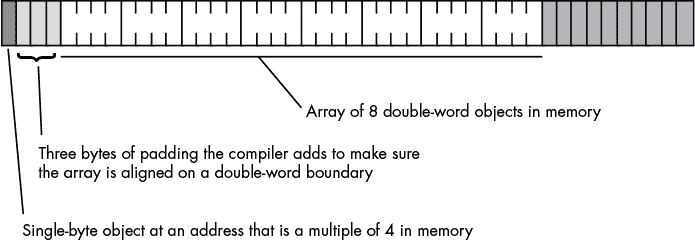

*图 7-3：在数组前添加填充字节*

在不支持字节寻址内存的机器上，编译器会尝试将数组的第一个元素放置在一个容易访问的边界上，并根据机器支持的边界分配数组的存储空间。如果每个数组元素的大小小于 CPU 支持的最小内存对象大小，编译器实现者有两个选择：

+   为每个数组元素分配最小可访问的内存对象。

+   将多个数组元素打包成一个内存单元。

第一种选择的优点是速度快，但它浪费内存，因为每个数组元素携带了一些不需要的额外存储。第二种选择则更紧凑，但较慢，因为它需要额外的指令来打包和解包数据以访问数组元素。这些机器上的编译器通常允许你指定是否希望数据打包或解包，这样你就可以在空间和速度之间做出选择。

如果你在字节寻址的机器上工作（例如 80x86），你可能不需要担心这个问题。然而，如果你使用的是高级语言（HLL），并且你的代码将来可能在其他机器上运行，你应该选择一种在所有机器上都高效的数组组织方式。

#### *7.2.3 访问数组元素*

如果你为一个数组分配了连续的内存位置，并且数组的第一个索引是`0`，那么访问一维数组的元素非常简单。你可以使用以下公式计算数组中任何给定元素的地址：

```
Element_Address = Base_Address + index * Element_Size
```

Element_Size 是每个数组元素所占的字节数。因此，如果每个数组元素是`byte`类型，Element_Size 字段为`1`，计算就非常简单。如果每个元素是`word`（或其他 2 字节类型），那么 Element_Size 就是`2`，依此类推。

考虑以下 Pascal 数组声明：

```
var  SixteenInts : array[ 0..15 ] of integer;
```

要在字节寻址机器上访问`SixteenInts`数组的元素，假设是 4 字节的整数，你可以使用以下计算：

```
Element_Address = AddressOf( SixteenInts ) + index * 4
```

在汇编语言中（在这种情况下你需要手动进行计算，而不是让编译器为你做这件事），你可以使用以下代码来访问数组元素`SixteenInts[index]`：

```
mov( index, ebx );

mov( SixteenInts[ ebx*4 ], eax );
```

#### *7.2.4 多维数组*

大多数 CPU 可以轻松处理一维数组。不幸的是，没有一种神奇的寻址模式可以让你轻松访问多维数组的元素。访问多维数组元素需要一些工作和多个机器指令。

在讨论如何声明或访问多维数组之前，让我们先看看如何在内存中实现它们。第一个挑战是弄清楚如何将一个多维对象存储在一维内存空间中。

想象一下一个 Pascal 数组，形式如下：

```
A:array[0..3,0..3] of char;
```

这个数组包含 16 个字节，按四行四列的方式组织。我们需要将这个数组中的每个 16 个字节映射到主内存中的 16 个连续字节。图 7-4 展示了这样做的一种方式。

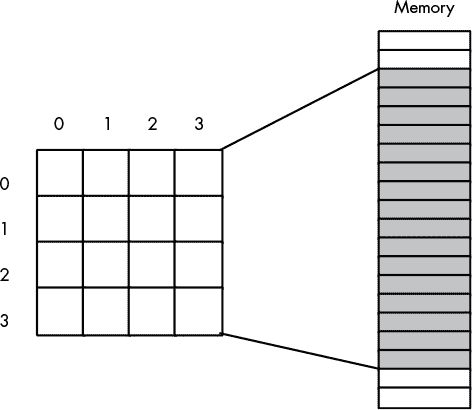

*图 7-4：将 4×4 数组映射到顺序内存位置*

只要遵循以下两条规则，实际的映射方式并不重要：

+   数组中的任何两个元素不能占用相同的内存位置。

+   数组中的每个元素必须始终映射到相同的内存位置。

因此，你需要一个具有两个输入参数的函数——一个用于行，一个用于列的值——该函数会产生一个偏移量，指向连续的 16 个内存位置块。任何满足这两个约束条件的函数都能正常工作。然而，你真正需要的是一个映射函数，它能够在运行时高效计算，并且适用于任何维度和任意维度范围的数组。虽然有许多符合这些条件的函数，但大多数高级语言使用的是两种类型：*行主序排列* 和 *列主序排列*。

在我真正描述行主序和列主序排列之前，让我们先回顾一些术语。*行索引*指的是对行的数字索引；也就是说，如果将单行视为一维数组，行索引将是该数组的索引。*列索引*有类似的含义；如果将单列视为一维数组，列索引将是该数组的索引。如果你回头看看图 7-4，在每一列上方的数字 0、1、2 和 3 是*列号*，而位于行左侧的这些相同数字则是*行号*。这个术语容易让人混淆，因为*列号与行索引相同*；也就是说，列号等同于索引任何一行中的位置。类似地，*行号与列索引相同*。本书使用术语*行索引*和*列索引*，但请注意，其他作者可能使用*行*和*列*来指代行号和列号。

##### 7.2.4.1 行主序排列

行主序排列通过先横向遍历一行，再纵向遍历列，将数组元素分配到连续的内存位置。图 7-5 演示了这种映射方式。

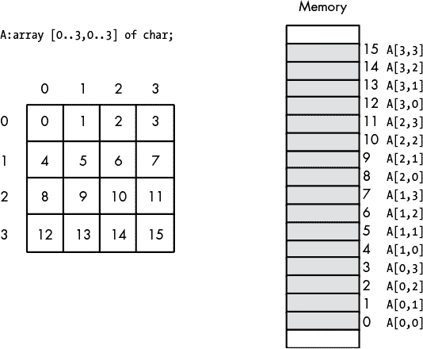

*图 7-5：行主序排列*

行主序排列是大多数高级编程语言采用的方法，包括 Pascal、C/C++、Java、C#、Ada 和 Modula-2。这种组织方式非常容易实现，并且在机器语言中使用也很方便。从二维结构到线性序列的转换非常直观。图 7-6 提供了 4×4 数组排列的另一种视图。

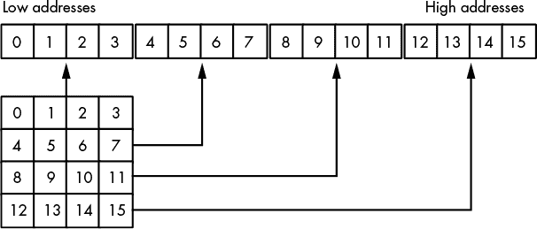

*图 7-6：4×4 数组的行主序排列的另一种视图*

将多维数组索引集转换为单个偏移量的函数，是计算一维数组元素地址公式的轻微修改。计算 4×4 二维行主序数组的偏移量公式，假设访问形式如下：

```
A[ colindex ][ rowindex ]
```

如下所示：

```
Element_Address = Base_Address + (colindex * row_size + rowindex) * Element_Size
```

如常，Base_Address 是数组第一个元素的地址（此例为 `A[0][0]`），Element_Size 是数组单个元素的大小（以字节为单位）。row_size 是数组中每行的元素数量（在此例中为 `4`，因为每行有四个元素）。假设 Element_Size 为 `1`，此公式计算的偏移量如表 7-2 所示，从基地址开始。

**表 7-2：** 二维行主序数组的偏移量

| **列索引** | **行索引** | **数组偏移量** |
| --- | --- | --- |
| `0` | `0` | `0` |
| `0` | `1` | `1` |
| `0` | `2` | `2` |
| `0` | `3` | `3` |
| `1` | `0` | `4` |
| `1` | `1` | `5` |
| `1` | `2` | `6` |
| `1` | `3` | `7` |
| `2` | `0` | `8` |
| `2` | `1` | `9` |
| `2` | `2` | `10` |
| `2` | `3` | `11` |
| `3` | `0` | `12` |
| `3` | `1` | `13` |
| `3` | `2` | `14` |
| `3` | `3` | `15` |

以下 C/C++ 代码访问行主序数组中的顺序内存位置：

```
for( int col=0; col < 4; ++col )

{

    for( int row=0; row < 4; ++row )

    {

        A[ col ][ row ] = 0;

    }

}
```

对于三维数组，计算内存偏移量的公式只稍微复杂一点。考虑以下 C/C++ 数组声明：

```
someType A[depth_size][col_size][row_size];
```

如果你有类似 `A[`depth_index`][`col_index`][`row_index`]` 的数组访问，那么计算内存偏移量的公式为：

```
Address = 

Base + ((depth_index * col_size + col_index) * row_size + row_index) * Element_Size
```

再次强调，Element_Size 是单个数组元素的大小，以字节为单位。

如果你在 C/C++ 中声明了一个 *n* 维数组，如下所示：

```
dataType A[bn-1][bn-2]...[b0];
```

并且你希望访问该数组中的以下元素：

```
A[an-1][an-2]...[a1][a0]
```

然后，你可以使用以下算法计算特定数组元素的地址：

```
Address := an-1

for i := n-2 downto 0 do

    Address := Address * bi + ai

Address := Base_Address + Address * Element_Size
```

##### 7.2.4.2 列主序

列主序是另一种常见的数组元素地址函数，FORTRAN 和各种 BASIC 方言（如旧版的 Microsoft BASIC）使用列主序索引数组。列主序数组的组织方式如图 7-7 所示。

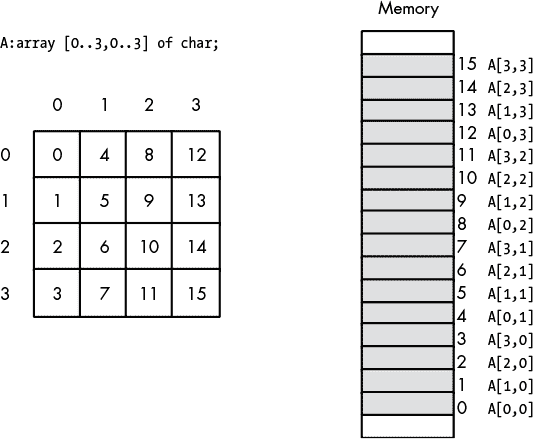

*图 7-7：列主序*

使用列主序访问数组元素的地址计算公式与行主序非常相似。不同之处在于，你需要在计算中反转索引和大小变量的顺序。也就是说，不是从最左边的索引开始到最右边，而是从右向左操作。

对于二维列主序数组，公式如下：

```
Element_Address = 

   Base_Address + (rowindex * col_size + colindex) * Element_Size
```

对于三维列主序数组，公式如下：

```
Element_Address = 

   Base_Address + 

       ((rowindex * col_size + colindex) * depth_size + depthindex) * Element_Size
```

如此类推。除了使用这些新公式外，使用列主序访问数组元素与使用行主序访问数组元素是相同的。

##### 7.2.4.3 声明多维数组

一个“*m* × *n*”的数组有 `m` × `n` 个元素，并且需要 `m` × `n` × 元素大小字节的存储空间。为了分配数组存储空间，你必须预留这些内存。对于一维数组，不同高级语言的语法非常相似。然而，在多维数组的声明上，它们的语法开始有所不同。

在 C、C++和 Java 中，你使用以下语法来声明多维数组：

```
data_type array_name [dim1][dim2] . . . [dimn];
```

例如，下面是一个 C/C++中的三维数组声明：

```
int threeDInts[ 4 ][ 2 ][ 8 ];
```

这个示例创建了一个包含 64 个元素的数组，组织成 4 个深度、2 行和 8 列。假设每个 `int` 对象需要 4 个字节，那么这个数组占用 256 个字节的存储空间。

Pascal 的语法支持两种等效的方式来声明多维数组：

```
var

        threeDInts  : array[0..3] of array[0..1] of array[0..7] of integer;

        threeDInts2 : array[0..3, 0..1, 0..7] of integer;
```

C#使用以下语法来定义多维数组：

```
type [,]array_name = new type [dim1,dim2] ;

type [,,]array_name = new type [dim1,dim2,dim3] ;

type [,,,]array_name = new type [dim1,dim2,dim3,dim4] ;

etc.
```

从语义上讲，不同语言之间只有两个主要区别。第一个是数组声明是否指定每个数组维度的整体大小，还是指定上下边界。第二个是起始索引是 `0`、`1` 还是用户指定的值。

Swift 在传统意义上并不真正支持多维数组。它允许你创建数组的数组（数组的数组……），这些数组可以提供与多维数组相同的功能，但表现方式略有不同。有关更多细节，请参阅第 179 页的 “Swift 数组实现”。

##### 7.2.4.4 访问多维数组的元素

在高级语言中，访问多维数组的元素是如此简单，以至于许多程序员在不考虑相关成本的情况下就这样做。在本节中，为了让你对这些成本有更清晰的了解，我们将查看一些需要访问多维数组元素时的汇编语言序列。

再次考虑上一节中 C/C++ 的 `ThreeDInts` 数组声明：

```
int ThreeDInts[ 4 ][ 2 ][ 8 ];
```

在 C/C++中，如果你想将该数组的元素 `[i][j][k]` 设置为 `n`，你可能会使用以下语句：

```
ThreeDInts[i][j][k] = n;
```

然而，这个语句隐藏了很多复杂性。回想一下访问三维数组元素所需的公式：

```
Element_Address = 

   Base_Address + 

      ((rowindex * col_size + colindex) * depth_size + depthindex) * 

          Element_Size
```

`ThreeDInts` 示例并没有避免此计算，它只是将其隐藏了。C/C++ 编译器生成的机器码类似于以下内容：

```
intmul( 2, i, ebx );            // EBX = 2 * i

add( j, ebx );                  // EBX = 2 * i + j

intmul( 8, ebx );               // EBX = (2 * i + j) * 8

add( k, ebx );                  // EBX = (2 * i + j) * 8 + k

mov( n, eax );

mov( eax, ThreeDInts[ebx*4] );  // ThreeDInts[i][j][k] = n
```

事实上，`ThreeDInts` 是特殊的。所有数组维度的大小都是很好的 2 的幂。这意味着 CPU 可以使用移位操作代替乘法指令，将 EBX 乘以 2 和 4。在这个示例中，由于移位操作通常比乘法更快，一个不错的 C/C++编译器会生成如下代码：

```
mov( i, ebx );

shl( 1, ebx );                  // EBX = 2 * i

add( j, ebx );                  // EBX = 2 * i + j

shl( 3, ebx );                  // EBX = (2 * i + j) * 8

add( k, ebx );                  // EBX = (2 * i + j) * 8 + k

mov( n, eax );

mov( eax, ThreeDInts[ebx*4] );  // ThreeDInts[i][j][k] = n
```

请注意，编译器只有在数组维度是 2 的幂时，才能使用更快的代码；这也是为什么许多程序员尝试声明具有这些维度的数组。当然，如果你必须在数组中声明额外的元素来实现这一目标，可能会浪费空间（尤其是在高维数组中），从而只获得微小的速度提升。

例如，如果你需要一个 10×10 的数组，并且使用行主序排列，你可以创建一个 10×16 的数组，以便使用移位（乘以 4）指令，而不是乘法（乘以 10）指令。当使用列主序排列时，你可能希望声明一个 16×10 的数组来实现相同的效果，因为行主序计算在计算数组偏移量时不使用第一维的大小，而列主序计算则不使用第二维的大小。在任何情况下，数组最终都会有 160 个元素，而不是 100 个元素。只有你能决定这种额外的空间是否值得为了略微提高的速度进行牺牲。

##### 7.2.4.5 Swift 数组实现

Swift 数组与许多其他语言中的数组不同。首先，Swift 数组是基于 `struct` 对象的封闭类型（而不仅仅是内存中的元素集合）。Swift 不保证数组元素出现在连续的内存位置。然而，语言提供了以下 `ContiguousArray` 类型规范，它保证数组元素会出现在连续的内存位置（如 C/C++ 及其他语言中）：

```
var array_name = ContiguousArray<element_type>()
```

到目前为止，一切正常。使用连续数组时，实际数组数据的存储方式与其他语言相匹配。然而，当你开始声明多维数组时，相似性就结束了。如前所述，Swift 实际上并没有多维数组；相反，它支持 *数组的数组*。

对于大多数编程语言，数组对象严格来说是内存中数组元素的顺序，数组的数组和多维数组是相同的。然而，Swift 使用描述符（基于 `struct`）对象来指定数组。像字符串描述符一样，Swift 数组由包含多个字段的数据结构组成（如当前数组元素的数量和一个或多个指向实际数组数据的指针）。

当你创建一个数组的数组时，实际上是在创建一个包含这些描述符的数组，每个描述符指向一个子数组。考虑以下两个（等效的）Swift 数组数组声明（`a1` 和 `a2`）及示例程序：

```
import Foundation

var a1 = [[Int]]()

var a2 = ContiguousArray<Array<Int>>()

a1.append( [1,2,3] )

a1.append( [4,5,6] )

a2.append( [1,2,3] )

a2.append( [4,5,6] )

print( a1 )

print( a2 )

print( a1[0] )

print( a1[0][1] )
```

运行该程序会产生以下输出：

```
[[1, 2, 3], [4, 5, 6]]

[[1, 2, 3], [4, 5, 6]]

[1, 2, 3]

2
```

对于二维数组，你会期待这种类型的输出。然而，实际上，`a1` 和 `a2` 是一维数组，每个数组有两个元素。这两个元素是数组描述符，它们本身指向包含三个元素的数组。

尽管 `a2` 是一个 `ContiguousArray` 类型，但与 `a2` 相关的六个数组元素不太可能出现在连续的内存位置中。`a2` 中保存的两个数组描述符可能出现在连续的内存位置，但这并不一定会延续到它们共同指向的六个数据元素。

由于 Swift 动态分配数组，二维数组中的行可能具有不同的元素数量。请考虑对之前的 Swift 程序进行以下修改：

```
import Foundation

var a2 = ContiguousArray<Array<Int>>()

a2.append( [1,2,3] )

a2.append( [4,5] )

print( a2 )

print( a2[0] )

print( a2[0][1] )
```

运行此程序将产生以下输出：

```
[[[1, 2, 3], [4, 5]]

[1, 2, 3]

2
```

`a2` 数组中的两行具有不同的大小。根据你要完成的任务，这可能是有用的，也可能是缺陷的来源。

在 Swift 中获取标准的多维数组存储的一种方式是声明一个一维的 `ContiguousArray`，其元素数量足够存储多维数组的所有元素。然后使用行主序（或列主序）功能，在不需要元素大小操作数的情况下计算数组中的索引。

### 7.3 记录/结构体

另一个主要的复合数据结构是 Pascal 的 *记录* 或 C/C++ 的 *结构体*。Pascal 的术语可能更好，因为它避免了与 *数据结构* 这一术语的混淆，因此我们在这里一般使用 *记录*。

数组是 *同质* 的，意味着它的所有元素都是相同类型的。另一方面，记录是 *异质* 的——它的元素可以具有不同的类型。记录的目的是让你将逻辑相关的值封装到一个单一的对象中。

数组让你可以通过整数索引选择特定元素。使用记录时，你必须通过字段的名称选择元素，这些元素被称为 *字段*。记录中的每个字段名称必须是唯一的；也就是说，你不能在同一记录中多次使用相同的字段名称。然而，所有字段名称都是本地于它们的记录的，你可以在程序的其他地方重用这些名称。

#### *7.3.1 Pascal/Delphi 中的记录*

这是 Pascal/Delphi 中 `Student` 数据类型的典型记录声明：

```
type

    Student = 

        record

            Name:     string (64);

            Major:    smallint;    // 2-byte integer in Delphi

            SSN:      string (11);

            Mid1:     smallint;

            Midt:     smallint;

            Final:    smallint;

            Homework: smallint;

            Projects: smallint;

        end;
```

许多 Pascal 编译器会将所有字段分配到连续的内存位置。这意味着 Pascal 会为姓名预留前 65 字节，^(3) 为专业代码预留接下来的 2 字节，为社会安全号码预留接下来的 12 字节，以此类推。

#### *7.3.2 C/C++ 中的记录*

这是相同声明的 C/C++ 版本：

```
typedef

    struct 

    {

        char Name[65]; // Room for a 64-character zero-terminated string.

        short Major;   // Typically a 2-byte integer in C/C++

        char SSN[12];  // Room for an 11-character zero-terminated string.

        short Mid1;

        short Mid2;

        short Final;

        short Homework;

        short Projects

    } Student;
```

由于 C++ 结构体实际上是类声明的一个专门形式，因此它们的行为与 C 结构体不同，并且可能包含在 C 变体中没有的额外数据（这就是 C++ 中结构体的内存存储可能不同的原因；详见第 184 页的 “记录的内存存储”）。C 和 C++ 结构体之间还有命名空间等一些小区别。

事实上，你可以告诉 C++ 使用 `extern` `"C"` 块按如下方式编译一个真正的 C `struct` 定义：

```
extern "C"

{

    struct 

    {

        char Name[65]; // Room for a 64-character zero-terminated string.

        short Major;   // Typically a 2-byte integer in C/C++

        char SSN[12];  // Room for an 11-character zero-terminated string.

        short Mid1;

        short Mid2;

        short Final;

        short Homework;

        short Projects;

    } Student;

}
```

**注意**

*Java 不支持与 C `struct` 相对应的任何东西——它只支持类（参见第 192 页的“类”）。*

#### *7.3.3 HLA 中的记录*

在 HLA 中，你也可以使用 `record`/`endrecord` 声明来创建结构类型。例如，你可以如下编码前面章节中的记录：

```
type

    Student:

        record

            Name:     char[65];    // Room for a 64-character

                                   // zero-terminated string.

            Major:    int16;

            SSN:      char[12];    // Room for an 11-character

                                   // zero-terminated string.

            Mid1:     int16;

            Mid2:     int16;

            Final:    int16;

            Homework: int16;

            Projects: int16;

        endrecord;
```

如你所见，HLA 声明与 Pascal 声明非常相似。为了与 Pascal 声明保持一致，这个例子使用字符数组而不是字符串来表示 `Name` 和 `SSN`（社会安全号码）字段。在典型的 HLA 记录声明中，你可能会使用 `string` 类型来表示至少是 `Name` 字段（请记住，字符串变量是一个 4 字节的指针）。

#### *7.3.4 Swift 中的记录（元组）*

尽管 Swift 不支持记录的概念，但你可以使用 Swift *元组* 来模拟一个记录。虽然 Swift 不像其他编程语言那样以相同方式存储记录（元组）元素（参见第 184 页的“记录的内存存储”），但是如果你想创建一个复合/聚合数据类型，而不想增加类的开销，元组是一个有用的构造。

Swift 元组只是以以下形式组织的值列表：

```
( value1, value2, ..., valuen )
```

元组中值的类型不需要完全相同。

Swift 通常使用元组从函数返回多个值。考虑以下简短的 Swift 代码片段：

```
func returns3Ints()->(Int, Int, Int )

{

    return(1, 2, 3)

}

var (r1, r2, r3) = returns3Ints();

print( r1, r2, r3 )
```

`returns3Ints()` 函数返回三个值（`1`、`2` 和 `3`）。以下语句将这三个整数值分别存储到 `r1`、`r2` 和 `r3` 中：

```
var (r1, r2, r3) = returns3Ints();
```

你还可以将元组赋值给一个单一变量，并通过整数索引作为字段名称访问元组的“字段”：

```
let rTuple = ( "a", "b", "c" )

print( rTuple.0, rTuple.1, rTuple.2 ) // Prints "a b c"
```

当然，使用像 `.0` 这样的字段名称会导致非常难以维护的代码。虽然你可以通过元组创建记录，但通过整数索引引用字段在实际程序中很少适用。

幸运的是，Swift 允许你为每个元组字段分配一个标签，然后你可以使用该标签代替整数索引来引用字段。考虑以下 Swift 代码片段：

```
typealias record = ( field1:Int, field2:Int, field3:Float64 )

var r = record(1, 2, 3.0 )

print( r.field1, r.field2, r.field3 )  // prints "1 2 3.0"
```

以这种方式使用 Swift 元组在语法上等同于使用 Pascal 或 HLA 记录（或 C 结构）。然而，请记住，元组在内存中的存储方式可能与这些其他语言中的记录或结构的布局不一致。像 Swift 中的数组一样，元组是一个不透明类型，没有保证定义 Swift 如何在内存中存储它们。

#### *7.3.5 记录的内存存储*

以下 Pascal 示例演示了一个典型的 `Student` 变量声明：

```
var

     John: Student;
```

基于前面为 Pascal `Student` 数据类型的声明，这将分配 81 字节的存储，并按图 7-8 所示的方式布局在内存中。

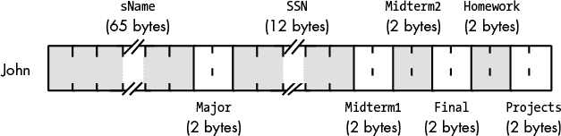

*图 7-8：学生数据结构在内存中的存储*

如果标签 `John` 对应于该记录的 *基地址*，那么 `Name` 字段位于偏移量 `John+0`，`Major` 字段位于偏移量 `John+65`，`SSN` 字段位于偏移量 `John+67`，依此类推。

大多数编程语言允许你通过字段名称而非数字偏移量来引用记录字段。访问字段的典型语法使用 *点运算符* 从记录变量中选择一个字段。假设变量 `John` 来自前面的示例，以下是你如何访问该记录中的不同字段：

```
John.Mid1 = 80;              // C/C++ example

John.Final := 93;            (* Pascal example *)

mov( 75, John.Projects );    // HLA example
```

图 7-8 表明，记录的所有字段在内存中按声明顺序出现，通常在实际应用中是这样的。不过从理论上讲，编译器可以自由地将字段放置在内存中的任何位置。第一个字段通常出现在记录的最低地址，第二个字段出现在下一个较高的地址，第三个字段紧跟第二个字段在内存中依次排列，依此类推。

图 7-8 还表明，编译器将字段打包到相邻的内存位置，没有它们之间的间隙。虽然许多语言都如此，但这并不是记录最常见的内存组织方式。出于性能考虑，大多数编译器实际上会将记录的字段按适当的内存边界对齐。具体的细节因语言、编译器实现和 CPU 而异，但典型的编译器会将字段放置在记录存储区内的偏移位置，这个位置对该字段的数据类型是“自然的”。以 80x86 为例，遵循 Intel ABI（应用二进制接口）的编译器将 1 字节对象分配到记录中的任何偏移量，单字只分配到偶数偏移量，双字或更大的对象则在双字边界上分配。尽管并非所有 80x86 编译器都支持 Intel ABI，但大多数支持，这使得记录能够在不同语言编写的函数和过程之间共享。在 80x86 上，其他 CPU 厂商为其处理器提供了自己的 ABI，遵循 ABI 的程序可以在运行时与其他遵循相同 ABI 的程序共享二进制数据。

除了在合理的偏移边界对齐记录的字段外，大多数编译器还确保整个记录的长度是 2、4、8 甚至 16 字节的倍数。如本章前面提到的，它们通过附加填充字节来填充记录的大小。这样可以确保记录的长度是记录中最大标量（非复合数据类型）对象的大小或 CPU 的最佳对齐大小的最小倍数。例如，如果一个记录的字段长度分别是 1、2、4、8 和 10 字节，那么一个 80x86 编译器通常会为记录的长度添加填充，使其成为 8 的倍数。这可以让您创建一个记录数组，并确保数组中的每个记录都从内存中的合理地址开始。

尽管某些 CPU 不允许访问内存中不对齐地址的对象，但许多编译器允许您禁用记录中字段的自动对齐。通常，编译器会提供一个选项，允许您全局禁用此功能。许多编译器还提供一个`pragma`或`packed`关键字，允许您逐个记录地禁用字段对齐。禁用自动字段对齐功能可以通过消除字段之间以及记录末尾的填充字节来节省一些内存（前提是您的 CPU 能够接受字段不对齐）。然而，当程序需要访问内存中不对齐的值时，它的运行速度可能会稍微变慢。

使用打包记录的一个原因是可以手动控制记录字段的对齐方式。例如，假设您有两个不同语言编写的函数，这两个函数都需要访问记录中的某些数据。假设这两个函数的编译器使用的字段对齐算法不同。像下面这样的记录声明（在 Pascal 中）可能与这两个函数访问记录数据的方式不兼容：

```
type

    aRecord: record

        bField : byte;  (* assume Pascal compiler supports a byte type *)

        wField : word;  (* assume Pascal compiler supports a word type *)

        dField : dword; (* assume Pascal compiler supports a double-word type *)

    end; (* record *)
```

这里的问题是，第一个编译器可能会分别为`bField`、`wField`和`dField`字段使用偏移量 0、2 和 4，而第二个编译器可能会使用偏移量 0、4 和 8。

然而，假设第一个编译器允许您在`record`关键字前指定`packed`关键字，这会导致编译器将每个字段紧跟着前一个字段存储。虽然使用`packed`关键字并不能使记录与两个函数兼容，但它确实允许您手动向记录声明中添加填充字段，如下所示：

```
type

    aRecord: packed record

        bField   :byte;

        padding0 :array[0..2] of byte; (* add padding to dword align wField *)

        wField   :word;

        padding1 :word;                (* add padding to dword align dField *)

        dField   :dword; 

    end; (* record *)
```

手动添加填充可能会使代码维护变得非常麻烦。然而，如果不兼容的编译器需要共享数据，这是一个值得了解的技巧。关于打包记录的具体细节，请查阅您编程语言的参考手册。

### 7.4 判别联合

判别联合（或简称 *联合*）与记录非常相似。像记录一样，联合也有字段，可以使用点号表示法进行访问。在许多语言中，记录和联合之间唯一的语法区别是使用 `union` 关键字而不是 `record`。然而，从语义上讲，它们之间有很大的区别。在记录中，每个字段都有自己的偏移量，从记录的基地址开始，字段不重叠。然而，在联合中，所有字段的偏移量都是 0，所有字段都重叠。因此，记录的大小是所有字段大小的总和（可能还有一些填充字节），而联合的大小是其最大字段的大小（可能还有一些填充字节）。

由于联合的字段重叠，你可能会认为它在实际程序中几乎没什么用。毕竟，如果所有字段都重叠，那么更改一个字段的值会改变所有其他字段的值。这意味着联合字段是 *互斥的*——也就是说，你一次只能使用一个字段。虽然这确实使得联合比记录更不通用，但它们仍然有很多用途。

#### *7.4.1 C/C++ 中的联合*

下面是 C/C++ 中联合声明的示例：

```
typedef union

{

      unsigned int  i;

      float         r;

      unsigned char c[4];

} unionType;
```

假设 C/C++ 编译器为无符号整数分配 4 个字节，那么 `unionType` 对象的大小将为 4 个字节（因为所有三个字段都是 4 字节的对象）。

**注意**

*不幸的是，由于涉及到安全问题，Java 不支持判别联合。你可以通过子类化实现判别联合的一些功能，但 Java 不支持在不同变量之间显式共享内存位置。*

#### *7.4.2 Pascal/Delphi 中的联合*

Pascal/Delphi 使用 *变体记录* 来创建判别联合。变体记录的语法如下：

```
type

    typeName = 

       record

            <<nonvariant/union record fields go here>>

            case tag of

                const1:( field_declaration );

                const2:( field_declaration );

                    .

                    .

                    .

                constn:( field_declaration )  (* no semicolon follows

                                            the last field *)

        end;
```

在这个例子中，tag 是一个类型标识符（例如 `boolean`、`char` 或某个用户定义的类型），或者是一个字段声明，形式为 identifier`:`type。如果标签项采用后一种形式，那么 identifier 就成了记录的另一个字段，而不是 *变体部分*（那些跟在 `case` 后面的声明），并具有指定的类型。此外，Pascal 编译器可以生成代码，当应用程序尝试访问任何变体字段（除了由标签字段的值指定的字段）时，会引发异常。然而，实际上几乎没有 Pascal 编译器做这个检查。尽管如此，记住 Pascal 语言标准建议编译器应该这样做，因此一些编译器可能会这样做。

下面是 Pascal 中两个不同的变体记录声明示例：

```
type

    noTagRecord=

        record

            someField: integer;

            case boolean of

                true:( i:integer );

                false:( b:array[0..3] of char)

        end; (* record *)

    hasTagRecord=

        record

            case which:0..2 of

                0:( i:integer );

                1:( r:real );

                2:( c:array[0..3] of char )

        end; (* record *)
```

正如你在 `hasTagRecord` 联合中看到的，Pascal 的变体记录不需要任何普通的记录字段。即使你没有标签字段，这也是真的。

#### *7.4.3 Swift 中的联合*

Swift 不直接支持判别联合体的概念。然而，Swift 提供了一个替代方案——相当于 Pascal 的变体记录——支持安全使用联合体：枚举数据类型。

请考虑以下 Swift 枚举定义：

```
enum EnumType

{

    case a

    case b

    case c

}

let et = EnumType.b

print( et )  // prints "b" on standard output
```

到目前为止，这只是一个枚举数据类型，与联合体无关。不过，我们可以为枚举数据类型的每个枚举项附加一个值（实际上是一个元组值）。请考虑以下 Swift 程序，它演示了 `enum` *关联值*：

```
import Foundation

enum EnumType

{

    case isInt( Int )

    case isReal( Double )

    case isString( String )

}

func printEnumType( _ et:EnumType )

{

    switch( et )

    {

        case .isInt( let i ):

            print( i )

        case .isReal( let r ):

            print( r )

        case .isString( let s ):

            print( s )

    }

}

let etI = EnumType.isInt( 5 )

let etF = EnumType.isReal( 5.0 )

let etS = EnumType.isString( "Five" )

print( etI, etF, etS )

printEnumType( etI )

printEnumType( etF )

printEnumType( etS )
```

该程序生成以下输出：

```
isInt(5) isReal(5.0) isString("Five")

5

5.0

Five
```

`EnumType` 类型的变量会获取枚举值之一：`isInt`、`isReal` 或 `isString`（这三者是 `EnumType` 类型的常量）。除了 Swift 为这三种常量选择的内部编码（可能是 `0`、`1` 和 `2`，尽管它们的实际值并不重要）外，Swift 会将一个整数值与 `isInt` 关联，将一个 64 位双精度浮动点数值与 `isReal` 关联，并将一个字符串值与 `isString` 关联。这三个 `let` 语句将适当的值赋给 `EnumType` 变量；如你所见，为了赋值，你需要将其放在常量名称后的括号中。然后，你可以使用 `switch` 语句提取该值。

#### *7.4.4 HLA 中的联合体*

HLA 同样支持联合体；以下是一个典型的联合体声明：

```
type

    unionType:

        union

            i: int32;

            r: real32;

            c: char[4];

        endunion;
```

#### *7.4.5 联合体的内存存储*

如前所述，联合体与记录体之间的最大区别在于，记录体为每个字段分配不同偏移量的存储，而联合体则将所有字段重叠在内存中的同一偏移量。例如，考虑以下 HLA 记录体和联合体声明：

```
type

    numericRec:

        record

            i: int32;

            u: uns32;

            r: real64;

        endrecord;

    numericUnion:

        union

            i: int32;

            u: uns32;

            r: real64;

        endunion;
```

如果你声明一个变量 `n`，类型为 `numericRec`，你可以像访问 `numericUnion` 类型的变量一样，通过 `n.i`、`n.u` 和 `n.r` 访问各字段。然而，`numericRec` 对象的大小是 16 字节，因为该记录包含两个双字字段和一个四字（`real64`）字段。相比之下，`numericUnion` 变量的大小为 8 字节。图 7-9 显示了记录和联合体中 `i`、`u` 和 `r` 字段的内存布局。

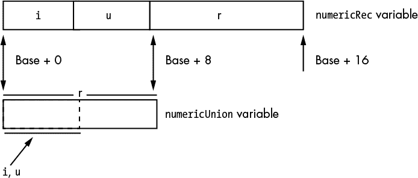

*图 7-9：联合体与记录变量的布局*

注意，Swift 的 `enum` 类型是不可见的。它们可能不会将每个枚举项的关联值存储在相同的内存地址中——即使它们目前存储在相同的内存位置，未来版本的 Swift 也不能保证它们会保持如此。

#### *7.4.6 联合体的其他用途*

除了节省内存，程序员使用联合体的另一个常见原因是为了在代码中创建别名。*别名*是某个内存对象的第二个名称。尽管别名往往会导致程序中的混淆，因此应该谨慎使用，但有时使用它们会更加方便。例如，在程序的某些部分，你可能需要不断地使用类型强制转换来引用特定对象。为了避免这种情况，你可以使用一个联合体变量，每个字段代表你想要为对象使用的不同类型。考虑以下 HLA 代码片段：

```
type

    CharOrUns:

        union

            c:char;

            u:uns32;

            endunion;

static

    v:CharOrUns;
```

使用这样的声明，你可以通过访问`v.u`来操作`uns32`对象。如果在某些时候，你需要将这个`uns32`变量的 LO 字节当作字符来处理，只需按照以下方式访问`v.c`变量即可：

```
mov( eax, v.u );

stdout.put( "v, as a character, is '", v.c, "'" nl );
```

另一个常见的做法是使用联合体将一个较大的对象拆解成其组成的字节。考虑以下 C/C++代码片段：

```
typedef union

{

    unsigned int u;

    unsigned char bytes[4];

} asBytes;

asBytes composite;

        .

        .

        .

    composite.u = 1234567890;

    printf

    ( 

        "HO byte of composite.u is %u, LO byte is %u\n",

        composite.u[3],

        composite.u[0]

    );
```

尽管以这种方式组合和拆解数据类型是一个偶尔使用的有用技巧，但请记住，这段代码不可移植。在大端和小端机器上，多字节对象的高字节（HO）和低字节（LO）出现在不同的地址。因此，这段代码在小端机器上运行正常，但在大端 CPU 上无法显示正确的字节。每当你使用联合体来拆解更大的对象时，应该意识到这一限制。尽管如此，这种技巧通常比使用左移、右移和与操作要高效得多，因此你会看到它被广泛使用。

**注意**

*Swift 的类型安全系统不允许你使用判别联合体将比特集合作为不同类型访问。如果你真的想通过原始位赋值将一种类型转换为另一种类型，可以使用 Swift 的`unsafeBitCast()`函数。详情请参阅 Swift 标准库文档。*

### 7.5 类

乍一看，像 C++、Object Pascal 或 Swift 这样的编程语言中的类看起来像是记录（或结构）的简单扩展，应该具有类似的内存组织。事实上，大多数编程语言确实非常类似地组织类的数据字段到内存中，就像记录和结构一样。编译器按照在类声明中遇到字段的顺序，将字段布局到连续的内存位置。然而，类有几个额外的特性，是纯粹的记录和结构中没有的；具体来说，成员函数（在类中声明的函数）、继承和多态对编译器如何在内存中实现类对象有很大的影响。

考虑以下 HLA 结构和 HLA 类声明：

```
type

     student: record 

          sName:    char[65]; 

          Major:    int16; 

          SSN:      char[12]; 

          Midterm1: int16; 

          Midterm2: int16; 

          Final:    int16; 

          Homework: int16; 

          Projects: int16;  

     endrecord; 

     student2: class 

          var 

               sName:    char[65]; 

               Major:    int16; 

               SSN:      char[12]; 

               Midterm1: int16; 

               Midterm2: int16; 

               Final:    int16; 

               Homework: int16; 

               Projects: int16;

          method setName( source:string );

          method getName( dest:string );

          procedure create;  // Constructor for class

     endclass;
```

与记录类型一样，HLA 为类中的所有`var`字段按顺序分配存储空间。实际上，如果一个类仅由`var`数据字段组成，它的内存表示几乎与相应的记录声明完全相同（参见图 7-10 和图 7-11）。

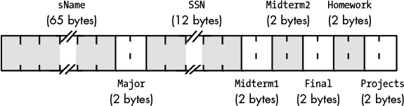

*图 7-10：HLA `student` 记录的布局*

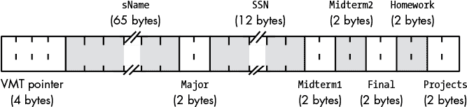

*图 7-11：HLA `student2` 类的布局*

从这些图中可以看出，区别在于`student2`类数据的开始处存在 VMT 指针字段。*VMT*，即*虚拟方法表*，是指向与类相关联的函数（方法）指针数组的指针。^(4) 在`student2`示例中，VMT 字段指向一个包含两个 32 位指针的表——一个指向`setName()`方法，一个指向`getName()`方法。当程序调用此类中的虚拟方法`setName()`或`getName()`时，它不会直接通过它们在内存中的地址调用这些方法。相反，它会从对象中获取 VMT 的地址，利用该指针获取具体方法的地址（`setName()`可能位于 VMT 的第一个索引，`getName()`位于第二个索引），然后使用获取到的地址间接调用方法。

#### *7.5.1 继承*

从 VMT 中获取方法地址是一项繁琐的工作。那么，为什么编译后的代码要这样做，而不是直接调用方法呢？原因在于类和对象支持的一对神奇特性：继承和多态。考虑以下 HLA 类声明：

```
type

        student3: class  inherits( student2 )

            var

                extraTime: int16; // Extra time allotted for exams

            override method setName;

            override procedure create;

     endclass;
```

`student3`类继承了`student2`类的所有数据字段和方法（如类声明中的`inherits`子句所指定），然后定义了一个新的数据字段`extraTime`，它为学生在考试期间分配额外的时间，单位为分钟。`student3`的声明还定义了一个新的方法`setName()`，它替代了`student2`类中原来的`setName()`方法（它还定义了一个重写的`create`过程，但我们现在暂时忽略这一点）。`student3`对象的内存布局见图 7-12。

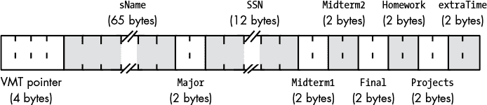

*图 7-12：HLA `student3` 类的布局*

在内存中，`student2` 和 `student3` 对象的区别在于 `student3` 数据结构末尾的额外 2 个字节以及 VMT 字段所保存的值。对于 `student2` 对象，VMT 字段指向 `student2` 类的 VMT（内存中只有一个实际的 `student2` VMT，所有 `student2` 对象都包含指向它的指针）。如果我们有一对名为 `John` 和 `Joan` 的 `student2` 对象，它们的 VMT 字段将都包含指向同一个内存中 VMT 的地址，这个地址包含了 表 7-3 中显示的信息。

**表 7-3:** `student2` VMT 的条目

| **偏移量^(5)** | **条目** |
| --- | --- |
| 0（字节） | 指向 (`student2`) `setName()` 方法的指针 |
| 4（字节） | 指向 `getName()` 方法的指针 |

现在考虑我们在内存中有一个 `student3` 对象（我们称它为 `Jenny`）。`Jenny` 的内存布局与 `John` 和 `Joan` 类似（参见 图 7-11 和 7-12）。然而，尽管 `John` 和 `Joan` 中的 VMT 字段都包含相同的值（指向 `student2` VMT 的指针），但 `Jenny` 对象的 VMT 字段将指向 `student3` VMT（参见 表 7-4）。

**表 7-4:** `student3` VMT 的条目

| **偏移量** | **条目** |
| --- | --- |
| 0（字节） | 指向 (`student3`) `setName()` 方法的指针 |
| 4（字节） | 指向 `getName()` 方法的指针 |

尽管 `student3` VMT 看起来与 `student2` VMT 几乎相同，但有一个关键的区别：在 表 7-3 中的第一个条目指向 `student2` 的 `setName()` 方法，而 表 7-4 中的第一个条目指向 `student3` 的 `setName()` 方法。

将从 *基类* 继承的字段添加到另一个类中时，必须小心操作。记住，一个从基类继承字段的类的一个重要特征是，你可以使用指向基类的指针来访问其字段，即使该指针包含的是指向其他类的地址（该类继承了基类的字段）。考虑以下类：

```
type  

     tBaseClass: class

          var

               i:uns32;

               j:uns32;

               r:real32;

          method mBase;

     endclass;

     tChildClassA: class inherits( tBaseClass )

          var

               c:char;

               b:boolean;

               w:word;

          method mA;

     endclass;

     tChildClassB: class inherits( tBaseClass )

          var

               d:dword;

               c:char;

               a:byte[3];

     endclass;
```

因为 `tChildClassA` 和 `tChildClassB` 都继承了 `tBaseClass` 的字段，这两个子类包含了 `i`、`j` 和 `r` 字段以及它们各自特有的字段。

为了确保继承正常工作，`i`、`j` 和 `r` 字段在所有子类中的偏移量必须与在 `tBaseClass` 中相同。这样，即使 EBX 指向的是 `tChildClassA` 或 `tChildClassB` 类型的对象，像 `mov((type tBaseClass [ebx]).i, eax);` 这样的指令也能正确访问 `i` 字段。图 7-13 显示了子类和基类的布局。

请注意，两个子类中的新字段相互之间没有任何关联，即使它们的名称相同（例如，两个子类中的`c`字段并不位于相同的偏移量）。尽管两个子类共享它们从公共基类继承的字段，但它们添加的任何新字段都是唯一且独立的。如果两个类中的字段共享相同的偏移量，那只是巧合，前提是这些字段并未从公共基类继承。

所有类（即使它们彼此之间没有关系）都会在对象的相同偏移量处放置指向 VMT 的指针（通常是偏移量 0）。每个程序中的类都有一个唯一的 VMT；即使类从某个基类继承字段，它们的 VMT（通常）也会与基类的 VMT 不同。图 7-14 展示了` tBaseClass`、`tChildClassA`和` tChildClassB`类型的对象如何指向它们各自的 VMT。

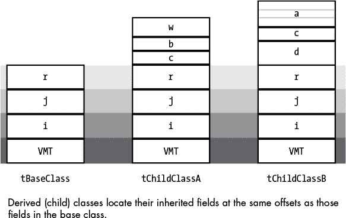

*图 7-13：内存中基类和子类的布局*

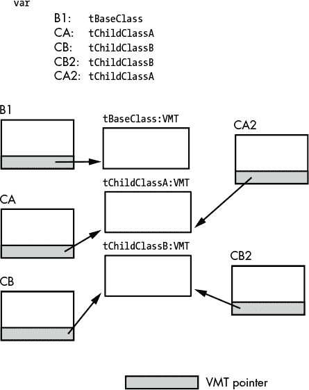

*图 7-14：对象中的 VMT 引用*

每当子类从某个基类继承字段时，子类的虚拟方法表（VMT）也会继承基类的虚拟方法表中的条目。例如，`tBaseClass`类的 VMT 只包含一个条目——指向方法`tBaseClass.mBase()`的指针。`tChildClassA`类的 VMT 包含两个条目：指向`tBaseClass.mBase()`和`tChildClassA.mA()`的方法指针。由于`tChildClassB`没有定义任何新的方法或迭代器，它的 VMT 只包含一个条目：指向`tBaseClass.mBase()`方法的指针。请注意，`tChildClassB`的 VMT 与`tBaseClass`的 VMT 完全相同。尽管如此，HLA 仍然生成了两个不同的 VMT。图 7-15 展示了这种关系。

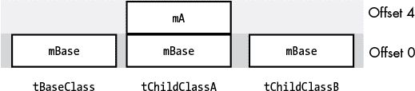

*图 7-15：内存中基类和子类的布局*

#### *7.5.2 类构造函数*

在你实际调用 VMT 中的任何方法之前，必须确保该表格已经存在于内存中（存储类中定义的方法地址），你还必须初始化你创建的每个类中的 VMT 指针字段。如果你使用的是高级语言（如 C++、C#、Java 或 Swift），编译器在你编译类定义时会自动为你生成 VMT。至于初始化对象本身中的 VMT 指针字段，通常由每个类的默认构造函数（对象初始化函数）来处理。所有这些工作对于高级语言程序员来说都是隐藏的。这就是为什么这些类示例使用 HLA 的原因——在汇编语言（即使是高级汇编语言）中，很少有东西是隐藏的。因此，在 HLA 示例中，你可以清楚地看到对象如何工作，以及使用它们的代价。

首先，HLA 不会自动为你创建 VMT。你必须在代码中显式声明每个你定义的类的 VMT。例如，对于`student2`和`student3`示例，你可以按如下方式声明它们：

```
readonly

      VMT( student2 );

      VMT( student3 );
```

从技术上讲，这些不必出现在`readonly`部分（它们也可以出现在 HLA 的`static`部分）；然而，你永远不会更改 VMT 的值，因此这个部分是声明它们的好地方。

本示例中的`VMT`声明定义了两个符号，你可以在 HLA 程序中访问：`student2._VMT_`和`student3._VMT_`。这些符号对应于每个 VMT 中的第一个条目的地址。在你的代码中的某个地方（通常是在构造函数中），你需要使用相关类的 VMT 地址来初始化对象的 VMT 字段。HLA 的类构造函数约定如下所示：

```
procedure student2.create; @noframe;

begin create;

    push( eax );

    // ESI will contain NULL if this is called as "student2.create();"

    // ESI will not be NULL if you call create from an object reference,

    // such as "John.create();" (in which case ESI will point at the object,

    // John in this case).

    if( esi == NULL ) then

        // If a class call, allocate storage for the object

        // on the heap.

        mov( malloc( @size( student2 )), esi );

    endif;

    mov( &student2._VMT_, this._pVMT_ );

    // If you're going to initialize other fields of the class, do that here.

    pop( eax );

    ret();

end create;

procedure student3.create; @noframe;

begin create;

    push( eax );

    if( esi == NULL ) then

        mov( malloc( @size( student3 )), esi );

    endif;

    // Must call the base constructor to do any class initialization

    // it requires.

    (type student2 [esi]).create();  // Must call the base class constructor.

    // Might want to initialize any student3-specific fields (such 

    // as extra time) here:

    // student2.create filled in the VMT pointer with the address of the

    // student2 VMT. It really needs to point at the student3 VMT.

    // Fix that here.

    mov( &student3._VMT_, this._pVMT_ );

    pop( eax );

    ret();

end create;
```

`student2.create()`和`student3.create()`是*类过程*（在某些语言中也称为*静态类方法*或*函数*）。类过程的主要特点是代码直接调用它们，而不是间接调用（即通过 VMT）。因此，如果你调用`John.create()`或`Joan.create()`，你总是会调用`student2.create()`类过程。同样，如果你调用`Jenny.create()`——或者任何`student3`变量的`create`构造函数——你总是会调用`student3.create()`过程。

这两条语句：

```
mov( &student2._VMT_, this._pVMT_ );

mov( &student3._VMT_, this._pVMT_ );
```

将 VMT 的地址（针对给定类）复制到正在创建的对象的 VMT 指针字段（`this._pVMT_`）中。

注意`student3.create()`构造函数中的以下语句：

```
(type student2 [esi]).create();  // Must call the base class constructor.
```

到达这一点时，80x86 的 ESI 寄存器包含指向`student3`对象的指针。文本`(type student2 [esi])`将其类型转换为`student2`指针。这将最终调用父类的构造函数（以初始化基类中的任何字段）。

最后，考虑以下代码：

```
var

    John        :pointer to student2;

    Joan        :pointer to student2;

    Jenny       :pointer to student3;

        .

        .

        .

    student2.create(); // Equivalent to calling "new student2"

                       // in other languages.

    mov( esi, John );  // Save pointer to new student2

                       // object in John

    student2.create();

    mov( esi, Joan );

    student3.create();

    mov( esi, Jenny );
```

如果你查看`John`和`Joan`对象中的`_pVMT_`条目，你会发现它们包含`student2`类的 VMT 地址。同样，`Jenny`对象的`_pVMT_`字段包含`student3`类的 VMT 地址。

#### *7.5.3 多态性*

如果你有一个 HLA `student2`变量（即一个包含指向`student2`对象的指针的变量），你可以使用以下 HLA 代码调用该对象的`setName()`方法：

```
John.setName("John");

Joan.setName("Joan");
```

这些特定的调用是 HLA 中高级活动的示例。HLA 编译器为这些语句中的第一个生成的机器代码大致如下所示：

```
mov( John, esi );

mov( (type student2 [esi])._pVMT_, edi );

call( [edi+0] );        // Note: the offset of the setName method in the VMT is 0.
```

下面是这段代码在做什么：

1.  第一行将`John`指针所持有的地址复制到 ESI 寄存器中。这是因为在 80x86 架构中，大多数间接访问操作发生在寄存器中，而不是内存变量中。

1.  VMT 指针是`student2`对象结构中的一个字段。代码需要获取指向 VMT 中`setName()`方法的指针。对象的`_pVMT_`字段（在内存中）保存着 VMT 的地址。我们必须将其加载到寄存器中，以间接访问该数据。程序将 VMT 指针复制到 80x86 的 EDI 寄存器中。

1.  VMT（现在由 EDI 指向的内存位置）包含两个条目。第一个条目（偏移量 0）包含`student2.setName()`方法的地址；第二个条目（偏移量 4）包含`student2.getName()`方法的地址。因为我们想调用`student2.setName()`方法，所以该指令序列中的第三条指令调用了内存位置`[edi+0]`所指向地址处的方法。

如你所见，这比直接调用`student.``setName()`方法要复杂得多。为什么我们要这么做呢？毕竟我们知道`John`和`Joan`都是`student2`对象。我们还知道`Jenny`是`student3`对象。所以我们本应该能直接调用`student2.setName()`或`student3.setName()`方法。这将只需要一条机器指令，既更快又更简短。

进行所有这些额外工作的原因是为了支持多态性。假设我们声明了一个通用的`student2`对象：

```
var student:pointer to student2;
```

当我们将`Jenny`的值赋给`student`并调用`student.setName()`时会发生什么？嗯，代码序列与之前调用`John`的代码完全相同。也就是说，代码将`student`中的指针加载到 ESI 寄存器，将`_pVMT_`字段复制到 EDI 寄存器，然后通过 VMT 的第一个条目间接跳转（该条目指向`setName()`方法）。然而，这个例子和前一个例子之间有一个主要区别：在这种情况下，`student`指向内存中的一个`student3`对象。所以，当代码将 VMT 的地址加载到 EDI 寄存器时，EDI 实际上指向的是`student3`的 VMT，而不是`student2`的 VMT（就像我们使用`John`指针时的情况）。因此，当程序调用`setName()`方法时，实际上是在调用`student3.setName()`方法，而不是`student2.setName()`方法。这种行为是现代面向对象编程语言中多态的基础。

#### *7.5.4 抽象方法和抽象基类*

*【抽象基类】(gloss01.xhtml#gloss01_2)*仅存在于为其派生类提供一组共同字段。你永远不会声明类型为抽象基类的变量；你总是使用某个派生类。抽象基类是用于创建其他类的模板，仅此而已。

标准基类和抽象基类在语法上的唯一区别是至少有一个抽象方法声明。一个*【抽象方法】(gloss01.xhtml#gloss01_3)*是一个特殊方法，在抽象基类中没有实际的实现。任何尝试调用该方法的行为都会引发异常。如果你在想抽象方法到底有什么用，那就继续阅读吧。

假设你想创建一组类来存储数字值。一个类可以表示无符号整数，另一个类可以表示有符号整数，第三个类可以实现 BCD 值，第四个类可以支持`real64`值。虽然你可以创建四个独立的类，它们各自独立工作，但这样做错失了将这组类变得更易于使用的机会。为了理解为什么，请考虑以下 HLA 类声明：

```
type  

     uint: class 

          var 

               TheValue: dword;

          method put; 

          << Other methods for this class >>  

     endclass;

     sint: class

          var

               TheValue: dword;

          method put; 

          << Other methods for this class >>  

     endclass;

     r64: class

          var

               TheValue: real64;

          method put; 

          << Other methods for this class >>  

     endclass;
```

这些类的实现是合理的。它们有用于数据的字段，并且有一个`put()`方法，假设该方法将数据写入标准输出设备。它们可能还有其他方法和过程来实现对数据的各种操作。然而，这些类有两个问题，一个是次要问题，另一个是主要问题，都是因为这些类没有从一个共同的基类继承任何字段。

次要问题是你必须在这些类中重复声明几个公共字段。例如，`put()`方法在每个类中都有声明。^(6) 主要问题是这种方法不是通用的——也就是说，你不能创建一个指向“numeric”对象的通用指针，并对该值执行加法、减法和输出等操作（不管其底层的数字表示方式如何）。

我们可以通过将之前的类声明转换为一组派生类，轻松解决这两个问题。以下代码演示了实现这一点的简便方法：

```
type

     numeric: class

          method put;

          << Other common methods shared by all the classes >>

     endclass;

     uint: class inherits( numeric )

          var

               TheValue: dword;

          override method put;

          << Other methods for this class >>

     endclass;

     sint: class inherits( numeric )

          var

               TheValue: dword;

          override method put;

          << Other methods for this class >>

     endclass;

     r64: class inherits( numeric )

          var

               TheValue: real64;

          override method put;

          << Other methods for this class >>  

endclass;
```

首先，通过使`put()`方法继承自`numeric`，这段代码鼓励派生类始终使用`put()`这个名称，从而使程序更易于维护。其次，因为这个例子使用了派生类，所以可以创建一个指向`numeric`类型的指针，并用`uint`、`sint`或`r64`对象的地址来填充该指针。该指针可以调用`numeric`类中找到的方法来执行加法、减法或数值输出等功能。因此，使用这个指针的应用程序不需要知道确切的数据类型；它只需以通用的方式处理数值。

这个方案的一个问题是，可以声明和使用`numeric`类型的变量。不幸的是，这种`numeric`变量无法表示任何类型的数字（请注意，`numeric`字段的实际数据存储实际上出现在派生类中）。更糟糕的是，因为你已经在`numeric`类中声明了`put()`方法，所以实际上你必须编写一些代码来实现该方法，即使你不应该真正调用它；实际的实现应该只出现在派生类中。虽然你可以编写一个虚拟方法来打印错误消息（或者更好的是，抛出异常），但你不应该不得不这样做。幸运的是，没有理由这么做——如果你使用*抽象*方法的话。

HLA 的 `abstract` 关键字，如果出现在方法声明后面，表示你不会为这个类提供该方法的实现。相反，所有派生类都负责为抽象方法提供具体实现。如果你尝试直接调用抽象方法，HLA 会抛出异常。以下代码修改了 `numeric` 类，将 `put()` 方法转换为抽象方法：

```
type

     numeric: class

          method put; abstract;

          << Other common methods shared by all the classes >>

     endclass;
```

抽象基类至少有一个抽象方法。但你不必让抽象基类中的 *所有* 方法都是抽象的；在其中声明一些标准方法（当然，还可以提供它们的实现）是完全合法的。

抽象方法声明提供了一种机制，通过该机制，基类可以指定一些派生类必须实现的通用方法。如果派生类没有提供所有抽象方法的具体实现，它们自己也将成为抽象基类。

之前你读到过，不应该创建类型为抽象基类的变量。记住，如果你尝试执行抽象方法，程序会立即抛出异常，抱怨这个非法的函数调用。

### 7.6 C++ 中的类

到目前为止，所有的类和对象示例都使用了 HLA。这是有道理的，因为讨论的是类的低级实现，而 HLA 很好地展示了这一点。然而，你可能在编写的程序中永远不会使用 HLA。所以现在我们来看看高级语言是如何实现类和对象的。由于 C++ 是最早支持类的高级语言之一，我们将从它开始。

以下是 C++ 中 `student2` 类的一个变体：

```
class student2

{

    private:

        char    Name[65];

        short   Major;

        char    SSN[12];

        short   Midterm1;

        short   Midterm2;

        short   Final;

        short   Homework;

        short   Projects;

    protected:

        virtual void clearGrades();

    public:

        student2();

        ~student2();

        virtual void getName(char *name_p, int maxLen);

        virtual void setName(const char *name_p);

};
```

与 HLA 类的主要区别之一是 `private`、`protected` 和 `public` 关键字的存在。C++ 及其他高级语言（HLL）都努力支持 *封装*（信息隐藏），而这三个关键字是 C++ 强制执行封装的主要工具之一。作用域、隐私和封装是有助于软件工程构造的语法问题，但它们实际上并不影响类和对象在内存中的 *实现*。因此，由于本书的重点是实现，我们将在 *WGC4* 和 *WGC5* 中进一步讨论封装问题。

C++ 中 `student2` 对象在内存中的布局将与 HLA 变体非常相似（当然，不同的编译器可能会有不同的布局，但数据字段和虚拟方法表（VMT）的基本思想仍然适用）。

下面是 C++ 中继承的一个例子：

```
class student3 : public student2

{

    public:

        short extraTime;

        virtual void setName(char *name_p, int maxLen);

        student3();

        ~student3();

};
```

在 C++ 中，结构体和类几乎是相同的。两者之间的主要区别在于，类的默认可见性是 `private`，而 `struct` 的默认可见性是 `public`。因此，我们可以将 `student3` 类重写如下：

```
struct student3 : public student2

{

        short extraTime;

        virtual void setName(char *name_p, int maxLen);

        student3();

        ~student3();

};
```

#### *7.6.1 C++ 中的抽象成员函数和类*

C++有一种特别奇怪的声明抽象成员函数的方式——你需要在类中为函数定义添加“`= 0;`”，如下所示：

```
struct absClass

{

        int someDataField;

        virtual void absFunc( void ) = 0;

 };
```

与 HLA 类似，如果一个类包含至少一个抽象函数，那么该类就是一个抽象类。需要注意的是，抽象函数也必须是虚函数，因为它们必须在某个派生类中被重写才能有用。

#### *7.6.2 C++中的多重继承*

C++是为数不多的几种现代编程语言之一，支持*多重继承*；也就是说，一个类可以从多个类继承数据和成员函数。考虑以下 C++代码片段：

```
class a

{

    public:

        int i;

        virtual void setI(int i) { this->i = i; }

};

class b

{

    public:

        int j;

        virtual void setJ(int j) { this->j = j; }

};

class c : public a, public b

{

    public:

        int k;

        virtual void setK(int k) { this->k = k; }

};
```

在这个示例中，`c`类继承了来自`a`和`b`类的所有信息。在内存中，典型的 C++编译器会创建如图 7-16 所示的对象。

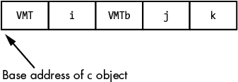

*图 7-16：多重继承的内存布局*

`VMT`指针条目指向一个典型的 VMT，其中包含`setI()`、`setJ()`和`setK()`方法的地址（如图 7-17 所示）。如果你调用`setI()`方法，编译器会生成代码，将`this`指针加载为对象中`VMT`指针条目的地址（即图 7-16 中`c`对象的基地址）。当进入`setI()`方法时，系统认为`this`指向的是一个`a`类型的对象。特别地，`this.VMT`字段指向一个 VMT，其第一个（也是对于`a`类型来说唯一的）条目是`setI()`方法的地址。同样，在内存中的偏移量`(this+4)`处（因为`VMT`指针是 4 字节），`setI()`方法将找到`i`数据值。对于`setI()`方法来说，`this`指向的是一个`a`类型的对象（尽管它实际上指向的是一个`c`类型的对象）。

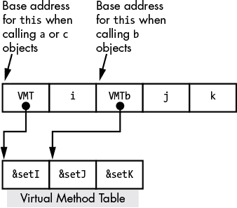

*图 7-17：多重继承中的`this`值*

当你调用`setK()`方法时，系统还会传递`c`对象的基地址。当然，`setK()`方法期望的是一个类型为`c`的对象，而`this`指针指向的是类型为`c`的对象，因此对象中的所有偏移量都完全符合`setK()`的预期。需要注意的是，`c`类型的对象（以及`c`类中的方法）通常会忽略`c`对象中的`VMT2`指针字段。

问题出现在程序尝试调用 `setJ()` 方法时。因为 `setJ()` 属于类 `b`，它期望 `this` 持有指向类 `b` 的 VMT 指针的地址。它还期望在偏移量（`this+4`）处找到数据字段 `j`。如果我们将 `c` 对象的 `this` 指针传递给 `setJ()`，访问（`this+4`）将引用数据字段 `i`，而不是 `j`。此外，如果类 `b` 的某个方法调用了类 `b` 中的另一个方法（例如 `setJ()` 递归调用自身），VMT 指针将是错误的——它指向的是包含指向 `setI()` 的指针的 VMT，而类 `b` 期望它指向的是包含指向 `setJ()` 的指针的 VMT（偏移量为 0）。为了解决这个问题，典型的 C++ 编译器会在 `c` 对象中 `j` 数据字段之前插入一个额外的 VMT 指针。它将初始化这个第二个 VMT 字段，使其指向 `c` 的 VMT 中类 `b` 方法指针开始的位置（见 图 7-17）。当调用类 `b` 的方法时，编译器会生成代码，将 `this` 指针初始化为指向这个第二个 VMT 指针的地址（而不是指向内存中 `c` 类型对象的开头）。现在，在进入类 `b` 的方法时——比如 `setJ()`——`this` 将指向一个合法的 VMT 指针，并且 `j` 数据字段将出现在类 `b` 方法所期望的偏移量（`this+4`）处。

### 7.7 Java 中的类

Java 作为一种基于 C 的语言，其类定义与 C++ 有些相似（尽管 Java 不支持多重继承，并且具有更合理的抽象方法声明方式）。下面是一些 Java 类声明的示例，以帮助你理解它们是如何工作的：

```
public abstract class a

{

        int i;

        abstract void setI(int i);

};

public class b extends a

{

    int j;

    void setI( int i )

    {

        this.i = i;

    }

    void setJ(int j)

    {

        this.j = j; 

    }

};
```

### 7.8 Swift 中的类

Swift 也是 C 语言家族的一员。像 C++ 一样，Swift 允许使用 `class` 或 `struct` 关键字声明类。与 C++ 不同的是，Swift 的结构体和类是两种不同的概念。Swift 的结构体有点像 C++ 类的变量，而 Swift 类则类似于 C++ 中指向对象的指针。在 Swift 的术语中，结构体是 *值* 类型对象，类是 *引用* 类型对象。基本上，当你创建一个结构体对象时，Swift 会为整个对象分配足够的内存，并将这块存储与变量绑定起来。^(7) 与 Java 一样，Swift 不支持多重继承；仅支持单一继承。同时，注意 Swift 不支持抽象成员函数或类。下面是一对 Swift 类的示例：

```
class a

{

    var i: Int;

    init( i:Int )

    {

        self.i = i;

    }

    func setI( i :Int )

    {

        self.i = i;

    }

};

class b : a

{

    var j: Int = 0;

    override func setI( i :Int )

    {

    self.i = I;

    }

    func setJ( j:Int)

    {

        self.j = j;

    }

};
```

在 Swift 中，所有成员函数默认都是虚拟函数。此外，`init()` 函数是 Swift 的构造函数。析构函数的名称是 `deinit()`。

### 7.9 协议和接口

Java 和 Swift 不支持多重继承，因为它存在一些逻辑问题。经典的例子是“钻石格”数据结构。这发生在两个类（比如 `b` 和 `c`）都从同一个类（比如 `a`）继承信息，然后一个第四个类（比如 `d`）从 `b` 和 `c` 继承。因此，`d` 从 `a` 继承数据两次——一次通过 `b`，一次通过 `c`。

尽管多重继承可能会导致一些奇怪的问题，比如这样的问题，但毫无疑问，能够从多个地方继承通常是有用的。因此，像 Java 和 Swift 这样的语言的解决方案是允许一个类从多个来源继承方法或函数，但只从一个祖先类继承数据字段。这避免了多重继承的大部分问题（特别是继承的数据字段的模糊选择），同时允许程序员从不同来源包含方法。Java 称这种扩展为 *接口*，Swift 称其为 *协议*。

这是几个 Swift 协议声明和支持该协议的类的示例：

```
protocol someProtocol

{

    func doSomething()->Void;

    func doSomethingElse() ->Void;

}

protocol anotherProtocol

{

    func doThis()->Void;

    func doThat()->Void;

}

class supportsProtocols: someProtocol, anotherProtocol

{

    var i:Int = 0;

    func doSomething()->Void

    {

        // appropriate function body

    }

    func doSomethingElse()->Void

    {

        // appropriate function body

    }

    func doThis()->Void

    {

        // appropriate function body

    }

    func doThat()->Void

    {

        // appropriate function body

    }}

}
```

Swift 协议不提供任何函数。相反，支持协议的类承诺提供协议所指定的函数的实现。在前面的示例中，`supportsProtocols` 类负责提供它所支持的协议所要求的所有函数。实际上，协议就像只包含抽象方法的抽象类——继承类必须为所有抽象方法提供实际的实现。

这是之前示例在 Java 中的代码，它演示了相应的机制——接口：

```
class InterfaceDemo {

    interface someInterface

    {

        public void doSomething();

        public void doSomethingElse();

    }

    interface anotherInterface

    {

        public void doThis();

        public void doThat();

    }

    class supportsInterfaces implements someInterface, anotherInterface

    {

        int i;

        public void doSomething()

        {

                // appropriate function body

        }

        public void doSomethingElse()

        {

                // appropriate function body

        }

        public void doThis()

        {

                // appropriate function body

        }

        public void doThat()

        {

                // appropriate function body

        }

    }

    public static void main(String[] args) {

    System.out.println("InterfaceDemo");

    }

}
```

接口和协议在行为上有些类似于 Java 和 Swift 中的基类类型。如果你实例化一个类对象，并将该实例分配给一个接口/协议类型的变量，你可以执行该接口或协议所支持的成员函数。考虑以下 Java 示例：

```
someInterface some = new supportsInterfaces();

// We can call the member functions defined for someInterface:

some.doSomething();

some.doSomethingElse();

// Note that it is illegal to try and call doThis 

// or doThat (or access the i data field) using

// the "some" variable.
```

这是一个在 Swift 中的类似示例：

```
import Foundation

protocol a

{

    func b()->Void;

    func c()->Void;

}

protocol d

{

    func e()->Void;

    func f()->Void;

}

class g : a, d

{

    var i:Int = 0;

    func b()->Void {print("b")}

    func c()->Void {print("c")}

    func e()->Void {print("e")}

    func f()->Void {print("f")}

    func local()->Void {print( "local to g" )}

}

var x:a = g()

x.b()

x.c()
```

你通过指向包含该协议或接口中声明的函数地址的 VMT 来实现一个协议或接口。因此，在前面的示例中，Swift `g` 类的数据结构会有三个 VMT 指针——一个指向协议 `a`，一个指向协议 `d`，一个指向类 `g`（保存指向 `local()` 函数的指针）。

当你创建一个类型为协议/接口的变量（在前面的示例中是 `x`）时，变量会保存该协议的 VMT 指针。在当前示例中，将 `g()` 赋值给 `x` 变量实际上只是将协议 `a` 的 VMT 指针复制到 `x` 中。然后，当代码执行 `x.b` 和 `x.c` 时，它会从 VMT 中获取实际函数的地址。

### 7.10 泛型和模板

尽管类和对象允许软件工程师以面向对象编程无法实现的方式扩展他们的系统，但对象并没有提供完全通用的解决方案。*泛型*，最早由 ML 编程语言在 1973 年引入，并通过 Ada 编程语言普及，为扩展性提供了面向对象编程所缺失的关键功能。今天，大多数现代编程语言——C++（模板）、Swift、Java、HLA（通过宏）和 Delphi——都支持某种形式的泛型编程。在泛型编程风格中，你会开发能够操作任意数据类型的算法，这些数据类型将在未来定义，并且在使用泛型类型之前立即提供实际的数据类型。

经典的例子是链表。编写一个简单的单链表类非常容易——比如，管理一个整数列表。然而，在创建了整数列表后，你决定需要一个双精度浮点数的列表。只需快速复制粘贴（再把节点类型从 `int` 改成 `double`），你就得到了一个处理双精度浮点数链表的类。等等，现在你需要一个字符串列表？再来一次复制粘贴，你就得到了字符串列表。现在你需要一个对象列表？好吧，再来一次复制粘贴……你明白了吧。不久之后，你就创建了半打不同的列表类，结果，哦不，你在原始实现中发现了一个 bug。现在，你得回去修复所有你创建的列表类中的这个 bug。如果你在多个不同的项目中使用了这些列表实现（你刚刚发现了“复制粘贴”编程为什么不被认为是优秀代码）。

泛型（C++ 模板）来解救你了。通过泛型类定义，你只需指定操作列表的算法（方法/成员函数）；你无需担心节点类型。当你声明泛型类类型的对象时，再填充节点类型。要创建整数、双精度浮点数、字符串或对象列表，你只需向泛型列表类提供你想要的类型，仅此而已。如果你在原始（泛型）实现中发现了 bug，你只需修复该缺陷并重新编译代码；在你使用泛型类型的每个地方，编译都会应用修正。

这里是一个 C++ 节点和列表定义：

```
template< class T >

class node {

  public:

    T data;

  private:

    node< T > *next;

};

template< class T >

class list {

  public:

    int  isEmpty();

    void append( T data );

    T    remove();

    list() { 

      listEnd = new node< T >(); 

      listEnd->next = listEnd; 

    }

  private:

    node< T >* listEnd;

};
```

这段 C++ 代码中的`<T>`序列是一个 *参数化类型*。这意味着你将提供一个类型，编译器将在模板中看到 `T` 的每个位置时都用该类型进行替换。因此，在前面的代码中，如果你提供 `int` 作为参数类型，C++ 编译器将用 `int` 替换所有的 `T`。要创建一个整数和双精度浮点数的列表，你可以使用以下 C++ 代码：

```
#include <iostream>

#include <list>

using namespace std;

int main(void) {

    list< int > integerList;

    list< double > doubleList;

    integerList.push_back( 25 );

    integerList.push_back( 0 );

    doubleList.push_back( 1.2 );

    doubleList.push_back( 3.14 );

    cout << "integerList.size() " << integerList.size() << endl;

    cout << "doubleList.size()  " << doubleList.size()  << endl;

    return 0;

}

    doubleList.add( 3.14 );
```

实现泛型的最简单方法是使用宏。当编译器看到类似`list <int> integerList;`的声明时，它会展开相关的模板代码，并将`int`替换为`T`，在整个展开过程中如此。

因为模板展开可能会生成大量代码，现代编译器尽可能优化这一过程。例如，如果你声明两个变量如下：

```
list <int> iList1;

list <int> iList2;
```

其实没有必要为两种类型为`int`的`list`类分别创建两个独立的类。显然，模板展开结果是相同的，因此任何一个合格的编译器都会对这两个声明使用相同的类定义。

即使是更智能的编译器，也会意识到某些函数（如`remove()`）其实并不关心底层节点的数据类型。基本的移除操作对于所有数据类型都是相同的；由于列表数据类型使用指针指向节点数据，所以没有理由为每种类型生成不同的`remove()`函数。借助多态性，一个`remove()`成员函数就能正常工作。编译器识别这一点需要更多的复杂度，但这是完全可行的。

然而，最终模板/泛型展开是一个宏展开过程。任何其他发生的事情仅仅是编译器的优化。

### 7.11 更多信息

Hyde, Randall. *汇编语言的艺术*。第二版。旧金山：No Starch Press，2010 年。

Knuth, Donald. *计算机程序设计的艺术, 第一卷：基础算法*。第三版。波士顿：Addison-Wesley Professional，1997 年。
