# 第八章：布尔逻辑与数字设计**


布尔逻辑是现代计算机系统中计算的基础。你可以使用布尔方程系统表示任何算法或任何电子计算机电路。因此，要充分理解软件如何运作，你需要理解基本的布尔逻辑和数字设计。

这部分内容对那些想设计电子电路或编写控制它们的软件的人尤其重要。即使你不打算做这些，你仍然可以利用布尔逻辑的知识来优化你的软件。许多高级语言处理布尔表达式，如控制 `if` 语句或 `while` 循环的表达式。理解布尔逻辑为你提供了优化布尔表达式并提高 HLL 代码性能所需的工具。

本章涵盖以下内容，这些内容将帮助你在优化布尔表达式时提供帮助：

+   布尔代数、布尔运算符和布尔函数

+   布尔公理与定理的介绍

+   真值表与布尔函数优化

+   规范形式

+   电子电路及其布尔函数对照

虽然如果你只是想编写典型的程序，布尔代数和数字电路设计的详细知识并非必需，但熟悉这些主题将有助于回答为什么 CPU 制造商以某种方式实现指令的问题——这些问题无疑会在我们开始研究 CPU 的低级实现时出现。

### 8.1 布尔代数

布尔代数是一个演绎的数学系统。*二元运算符*（°）接受一对布尔输入并生成一个布尔输出。例如，布尔与运算符接受两个布尔输入并生成一个布尔输出（两个输入的逻辑与运算）。

#### *8.1.1 布尔运算符*

为了我们的目的，我们将布尔代数基于以下一组值和运算符：

+   布尔系统中的两个可能的值是 0 和 1。通常，我们分别称这些值为`false`和`true`。

+   • 符号表示逻辑与运算。*A* • *B* 是对布尔值 *A* 和 *B* 进行逻辑与运算的操作，也称为 *A* 和 *B* 的 *积*。对于单字母变量名，本文省略了•符号；因此，*AB* 也表示变量 *A* 和 *B* 的逻辑与。

+   +（加号）表示逻辑或运算。*A* + *B* 是对布尔值 *A* 和 *B* 进行逻辑或运算的结果。我们也称之为 *A* 和 *B* 的 *和*。

+   逻辑补数、逻辑否定和 NOT 是同一个一元运算符的不同名称。本章将使用'（撇号符号）来表示逻辑否定。*A'* 表示 *A* 的逻辑非。

#### *8.1.2 布尔公理*

每个代数系统都遵循一组特定的初始假设，或 *公理*。你可以从这一基本公理集中推导出额外的规则、定理和其他系统特性。布尔代数采用以下公理：

**闭包** 如果对于每一对布尔值，布尔系统在特定的二元运算符下只产生布尔结果，则该布尔系统对该运算符是 *闭包* 的。

**交换律** 如果对于所有可能的布尔值 *A* 和 *B*，*A* ° *B* = *B* ° *A*，则二元运算符 ° 是 *交换律* 的。

**结合律** 如果对于所有布尔值 *A*、*B* 和 *C*，(*A* ° *B*) ° *C* = *A* ° (*B* ° *C*)，则二元运算符 ° 是 *结合律* 的。

**分配律** 两个二元运算符 ° 和 % 是 *分配律* 的，如果对于所有布尔值 *A*、*B* 和 *C*，*A* ° (*B* % *C*) = (*A* ° *B*) % (*A* ° *C*)。

**单位元素** 如果对于所有布尔值 *A*，*A* ° *I* = *A*，则布尔值 *I* 被称为某个二元运算符 ° 的 *单位元素*。

**逆元** 如果对于所有布尔值 *A* 和 *B*，*A* ° *I* = *B* 且 *B* ° *A*（即 *B* 是 *A* 在布尔系统中的对立值），则布尔值 *I* 被称为关于某个二元运算符 ° 的 *逆元*。

当应用于布尔运算符时，上述公理产生以下一组 *布尔公理*：

**P1**   布尔代数在与 AND、OR 和 NOT 操作下是封闭的。

**P2**   AND（•）的单位元素是 1，OR（+）的单位元素是 0。逻辑非（'）没有单位元素。

**P3**   • 和 + 运算符是交换律的。

**P4**   • 和 + 在彼此之间是分配律的。即，*A* • (*B* + *C*) = (*A* • *B*) + (*A* • *C*) 和 *A* + (*B* • *C*) = (*A* + *B*) • (*A* + *C*)。

**P5**   • 和 + 都是结合律的。即，(*A* • *B*) • *C* = *A* • (*B* • *C*) 和 (*A* + *B*) + *C* = *A* + (*B* + *C*)。

**P6**   对于每个值 *A*，都存在一个值 *A'*，使得 *A* • *A'* = 0 和 *A* + *A'* = 1。这个值是 *A* 的逻辑补码（或 NOT）。

你可以使用这一组布尔公理证明所有其他的布尔代数定理。本章不会深入讨论以下定理的正式证明，但对它们的熟悉将是有用的：

**Th1**   *A* + *A* = *A*

**Th2**   *A* • *A* = *A*

**Th3**   *A* + 0 = *A*

**Th4**   *A* • 1 = *A*

**Th5**   *A* • 0 = 0

**Th6**   *A* + 1 = 1

**Th7**   (*A* + *B*)*' = A'* • *B'*

**Th8**   (*A* • *B*)*' = *A'* + *B'*

**Th9**   *A* + *A* • *B* = *A*

**Th10**   *A* • (*A* + *B*) = *A*

**Th11**   *A* + *A'B* = *A* + *B*

**Th12**   *A'* • (*A* + *B'*) = *A'B'*

**Th13**   *AB* + *AB'* = *A*

**Th14**   (*A'* + *B'* ) • (*A'* + *B*) = *A'*

**Th15**   *A* + *A'* = 1

**Th16**   *A* • *A'* = 0

**注意**

*定理 7 和 8 被称为* 德摩根定理 *，得名于发现这些定理的数学家。*

布尔代数系统中的一个重要原则是*对偶性*。每一对定理（定理 1 和 2，定理 3 和 4，等等）形成一个*对偶*。你可以通过交换表达式中的运算符和常数，创造出任何有效的布尔代数表达式，结果仍然有效。具体来说，如果交换•和+运算符并且交换表达式中的 0 和 1 值，得到的表达式将遵循布尔代数的所有规则。*这并不意味着对偶表达式计算相同的值*，仅仅表示两者在布尔代数系统中都是合法的。

#### *8.1.3 布尔运算符优先级*

如果在一个布尔表达式中出现多个不同的布尔运算符，表达式的结果取决于运算符的*优先级*。以下布尔运算符按从高到低的优先级排序：

+   括号

+   逻辑非

+   逻辑与

+   逻辑或

逻辑与和或运算符是*左结合的*。这意味着如果两个运算符具有相同的优先级出现在三个操作数之间，你必须从左到右评估表达式。逻辑非运算是*右结合的*，虽然无论使用左结合还是右结合，它都会产生相同的结果，因为它是一个一元运算符，只有一个操作数。

### 8.2 布尔函数与真值表

一个布尔*表达式*是由 0、1 和字面量通过布尔运算符连接而成的序列。布尔*字面量*是带有否定符号（取反）或不带否定符号的变量名，所有的变量名都是单个字母字符。布尔函数是特定的布尔表达式；我们通常将布尔函数命名为*F*，并可能带有下标。例如，考虑以下布尔函数：

*F*[0] = *AB* + *C*

这个函数计算*A*和*B*的逻辑与，并将这个结果与*C*进行逻辑或运算。如果*A* = 1，*B* = 0，*C* = 1，那么*F*[0]返回 1（1 • 0 + 1 = 1）。

你也可以使用*真值表*表示布尔函数。逻辑与和或函数的真值表分别显示在表 8-1 和 8-2 中。

**表 8-1：** 与运算真值表

| **与** | **0** | **1** |
| --- | --- | --- |
| 0 | 0 | 0 |
| 1 | 0 | 1 |

**表 8-2：** 或运算真值表

| **或** | **0** | **1** |
| --- | --- | --- |
| 0 | 0 | 1 |
| 1 | 1 | 1 |

对于二元运算符和两个输入变量，这种真值表格式非常直观和方便。然而，对于涉及多个变量的函数，它并不适用。

表 8-3 展示了另一种表示真值表的方式。这种格式有几个优点——它更容易填写表格，支持三个或更多变量，并且为两个或更多函数提供了紧凑的表示。

**表 8-3：** 三变量函数的真值表格式

| ***C*** | ***B*** | ***A*** | ***F = ABC*** | ***F = AB + C*** | ***F = A + BC*** |
| --- | --- | --- | --- | --- | --- |
| 0 | 0 | 0 | 0 | 0 | 0 |
| 0 | 0 | 1 | 0 | 0 | 1 |
| 0 | 1 | 0 | 0 | 0 | 0 |
| 0 | 1 | 1 | 0 | 1 | 1 |
| 1 | 0 | 0 | 0 | 1 | 0 |
| 1 | 0 | 1 | 0 | 1 | 1 |
| 1 | 1 | 0 | 0 | 1 | 1 |
| 1 | 1 | 1 | 1 | 1 | 1 |

尽管你可以创建无限多种布尔函数，但它们并非都唯一。例如，*F* = *A* 和 *F* = *AA* 是两个不同的函数。然而，依据定理 2，可以轻松证明无论你为 *A* 提供何种输入值，这两个函数的结果完全相同。事实证明，如果你固定输入变量的数量，那么可能的唯一布尔函数数量是有限的。例如，两个输入变量的布尔函数有 16 种唯一可能，三个输入变量的布尔函数有 256 种可能。给定 *n* 个输入变量，存在 2^(2^(*n*)) 种唯一布尔函数（2 的 2 的 *n* 次方）。对于两个输入变量，有 2²² 或 16 种不同的函数；对于三个输入变量，有 2²³ 或 256 种可能的函数；四个输入变量有 2²⁴ 或 2¹⁶ 或 65,536 种唯一布尔函数。

当只处理 16 个布尔函数（两个输入变量）时，我们可以为每个唯一函数命名（见 表 8-4）。

**表 8-4：** 两个变量的布尔函数常见名称

| 函数编号^(1) | **函数名称** | **描述** |
| --- | --- | --- |
| 0 | 零（清除） | 无论 *A* 和 *B* 的输入值如何，始终返回 0。 |
| 1 | 逻辑非或 | (NOT (*A* OR *B*)) = (*A* + *B*)*'* |
| 2 | 抑制 (*AB*') | 抑制 = *AB**'* (*A* AND not *B*)。也等同于 *A* > *B* 或 *B* < *A*。 |
| 3 | 非 *B* | 忽略 *A*，返回 *B**'*. |
| 4 | 抑制 (*BA**'*) | 抑制 = *BA**'* (*B* AND not *A*)。也等同于 *B* > *A* 或 *A* < *B*。 |
| 5 | 非 *A* | 返回 *A**'* 并忽略 *B*。 |
| 6 | 异或（XOR） | *A* ⊕ *B*。等同于 *A* ≠ *B*。 |
| 7 | 逻辑与非 | (NOT (*A* AND *B*)) = (*A* • *B*)*'* |
| 8 | 逻辑与 | *A* • *B* = (*A* AND *B*) |
| 9 | 等价（异或非） | (*A* = *B*)。也称为异或非（不是异或）。 |
| 10 | *A* | 复制 *A*。返回 *A* 的值，忽略 *B* 的值。 |
| 11 | 蕴涵，*B* 蕴涵 *A* | *A* + *B**'*.（如果 *B* 则 *A*。）等价于 *B* ≥ *A*。 |
| 12 | *B* | 复制 *B*。返回 *B* 的值，忽略 *A* 的值。 |
| 13 | 蕴涵，*A* 蕴涵 *B* | *B* + *A**'*.（如果 *A* 则 *B*。）等价于 *A* ≥ *B*。 |
| 14 | 逻辑或 | *A* + *B*。返回 *A* 或 *B*。 |
| 15 | 一（集合） | 无论 *A* 和 *B* 的输入值如何，始终返回 1。 |

### 8.3 函数编号

对于两个输入变量以上的情况，函数的种类太多，以至于无法为每一个函数提供具体的名称。即使是针对两个输入变量的函数，我们也通常引用函数的编号而不是其名称。例如，*F*[8]表示两个输入函数的逻辑与操作（*A*和*B*的与），而*F*[14]表示逻辑或操作。当然，对于超过两个输入变量的函数，问题是：“我们如何确定一个函数的编号？”例如，函数*F* = *AB* + *C*对应的编号是多少？我们通过查看该函数的真值表来计算答案。如果我们将*A*、*B*和*C*的值视为一个二进制数中的位，其中*C*是高位，*A*是低位，它们会产生对应于 0 到 7 范围内的二进制字符串。每个二进制字符串关联的函数结果要么是 0，要么是 1。如果我们通过将每个组合的*A*、*B*和*C*输入值的函数结果放置到由*A*、*B*和*C*的二进制字符串指定的位位置中，最终得到的二进制数将是相应的函数编号。如果这个理解不清楚，下面的例子会帮助你理清楚。考虑*F* = *AB* + *C*的真值表（见表 8-5）。

**表 8-5：** *F* = *AB* + *C* 的真值表

| ***C*** | ***B*** | ***A*** | ***F = AB + C*** |
| --- | --- | --- | --- |
| 0 | 0 | 0 | 0 |
| 0 | 0 | 1 | 0 |
| 0 | 1 | 0 | 0 |
| 0 | 1 | 1 | 1 |
| 1 | 0 | 0 | 1 |
| 1 | 0 | 1 | 1 |
| 1 | 1 | 0 | 1 |
| 1 | 1 | 1 | 1 |

输入变量*C*、*B*和*A*结合形成二进制数序列，范围从`%000`到`%111`（即从 0 到 7）。如果我们用这些值表示一个 8 位值中的位编号（*CBA* = `%111`表示位 7，*CBA* = `%110`表示位 6，以此类推），我们可以通过将每个对应的*C*、*B*和*A*值组合的*F* = *AB* + *C*的结果放入每个位位置来确定函数编号：

```
CBA:           7    6    5    4    3    2    1    0

F = AB + C:    1    1    1    1    1    0    0    0
```

现在，如果我们将这个比特串视为一个二进制数，它会产生函数编号`$F8`，即 248。我们通常使用十进制表示函数编号。这也为为什么存在 2^(2^(*n*))个不同的函数提供了洞察力：如果你有*n*个输入变量，那么有 2^(*n*)种不同的变量值组合，因此在函数的二进制数中有 2^(*n*)位。如果你有*m*位，那么这些位有 2^(*m*)种不同的排列方式。因此，对于*n*个输入变量，存在*m* = 2^(*n*)个可能的位和 2^(*m*)或 2^(2^(*n*))个可能的函数。

### 8.4 布尔表达式的代数运算

你可以通过应用布尔代数的公理和定理，将一个布尔表达式转换为等效表达式。如果你想将给定表达式转换为规范形式（参见下一节），或如果你希望最小化表达式中的文字或项的数量，这一点非常重要。（*文字*是一个带或不带撇号的变量，*项*是一个变量或多个不同文字的积——逻辑与运算。）电路通常由实现每个文字或项的单独组件组成，因此，最小化表达式中的文字和项的数量，可以让电路设计师使用更少的电气组件，从而减少系统的成本。

不幸的是，没有固定的规则可以应用于优化给定的表达式。就像构造数学证明一样，个人轻松完成这些转换的能力通常是经验问题。尽管如此，几个例子展示了其可能性：

```
ab + ab' + a'b            =  a(b + b') + a'b             By P4

                          =  a • 1 + a'b                 By P5

                          =  a + a'b                     By Th4

                          =  a + b                       By Th11

(a'b + a'b' + b')'        =  ( a'(b + b') + b')'         By P4

                          =  (a'• 1 + b')'               By P5

                          =  (a' + b')                   By Th4

                          =  ( (ab)' )'                  By Th8

                          =  ab                          By definition of not

b(a + c) + ab' + bc' + c  =  ba + bc + ab' + bc' + c     By P4

                          =  a(b + b') + b(c + c') + c   By P4

                          =  a • 1 + b • 1 + c           By P5

                          =  a + b + c                   By Th4
```

### 8.5 规范形式

每个布尔函数都有无数个等效的逻辑表达式。为了帮助消除混淆，逻辑设计师通常使用*规范*或标准化的形式来指定布尔函数。对于每个不同的布尔函数，我们可以从定义的集合中选择一个规范表示。

有几种方法可以为所有可能的 *n* 个变量的布尔函数定义一组规范表示。在每个规范集合中，单个表达式描述系统中的每个布尔函数，因此集合中的所有函数都是唯一的。本章将讨论两种规范系统——*最小项和合项的和*（sum of minterms）和*最大项和的积*（product of maxterms），但我们只会使用第一个。利用对偶原理，我们可以在这两个系统之间进行转换。

如前所述，项是单一文字或多个不同文字的积（逻辑与）。例如，如果你有两个变量，*A* 和 *B*，则有八个可能的项：*A*、*B*、*A'*、*B'*、*A'B'*、*A'B*、*AB'* 和 *AB*。对于三个变量，我们有 26 个不同的项：*A*、*B*、*C*、*A'*、*B'*、*C'*、*A'B'*、*A'B*、*AB'*、*AB*、*A'C'*、*A'C*、*AC'*、*AC*、*B'C'*、*B'C*、*BC'*、*BC*、*A'B'C'*、*AB'C'*、*A'BC'*、*ABC'*、*A'B'C*、*AB'C*、*A'BC* 和 *ABC*。随着变量数量的增加，项的数量会急剧增加。*最小项*是一个包含恰好 *n* 个文字的积，其中 *n* 是输入变量的数量。例如，两个变量 *A* 和 *B* 的最小项是 *A'B'*、*AB'*、*A'B* 和 *AB*。同样，三个变量 *A*、*B* 和 *C* 的最小项是 *A'B'C'*、*AB'C'*、*A'BC'*、*ABC'*、*A'B'C*、*AB'C*、*A'BC* 和 *ABC*。一般来说，对于 *n* 个变量，有 2^(*n*) 个最小项。最小项的集合很容易生成，因为它们对应于二进制数的序列（见 表 8-6）。

**表 8-6：** 从二进制数生成最小项

| **二进制等价（**CBA**）** | **最小项** |
| --- | --- |
| 000 | *A'B'C'* |
| 001 | *AB'C'* |
| 010 | *A'BC'* |
| 011 | *ABC'* |
| 100 | *A'B'C* |
| 101 | *AB'C* |
| 110 | *A'BC* |
| 111 | *ABC* |

我们可以通过将最小项之和（逻辑“或”）来推导出 *任何* 布尔函数的标准形式。给定 *F*[248] = *AB* + *C*，其等效的标准形式为 *ABC* + *A'BC* + *AB'C* + *A'B'C* + *ABC'*。从代数角度，我们可以如下展示标准形式等价于 *AB* + *C*：

```
ABC + A'BC + AB'C + A'B'C + ABC'  =  BC(A + A') + B'C(A + A') + ABC'   By P4

                                  =  BC • 1 + B'C • 1 + ABC'           By Th15

                                  =  C(B + B') + ABC'                  By P4

                                  =  C + ABC'                          By Th15 & Th4

                                  =  C + AB                            By Th11
```

显然，标准形式并不是最优的。然而，从标准形式生成函数的真值表非常容易。从真值表生成最小项之和的标准形式方程也非常容易。

#### *8.5.1 最小项之和的标准形式与真值表*

从最小项之和的标准形式构建真值表，请按照以下步骤操作：

1.  将最小项转换为二进制等价物，通过将未加撇号的变量替换为 1，将加撇号的变量替换为 0，如下所示：

    ```
    F248 = CBA + CBA' + CB'A + CB'A' + C' BA

         = 111 + 110  + 101  + 100   + 011
    ```

1.  在函数列中为适当的最小项条目放置 1：

    | ***C*** | ***B*** | ***A*** | ***F = AB +* *C*** |
    | --- | --- | --- | --- |
    | 0 | 0 | 0 |  |
    | 0 | 0 | 1 |  |
    | 0 | 1 | 0 |  |
    | 0 | 1 | 1 | 1 |
    | 1 | 0 | 0 | 1 |
    | 1 | 0 | 1 | 1 |
    | 1 | 1 | 0 | 1 |
    | 1 | 1 | 1 | 1 |

1.  最后，为剩余的条目在函数列中放置数字 0：

    | ***C*** | ***B*** | ***A*** | ***F =* *AB + C*** |
    | --- | --- | --- | --- |
    | 0 | 0 | 0 | 0 |
    | 0 | 0 | 1 | 0 |
    | 0 | 1 | 0 | 0 |
    | 0 | 1 | 1 | 1 |
    | 1 | 0 | 0 | 1 |
    | 1 | 0 | 1 | 1 |
    | 1 | 1 | 0 | 1 |
    | 1 | 1 | 1 | 1 |

从另一个方向出发，要从真值表生成逻辑函数，请按照以下步骤操作：

1.  找到真值表中函数结果为 1 的所有条目。在此表中，这些条目是最后五个条目。包含 1 的表格条目数量决定了标准方程中的最小项数量。

1.  通过将 *A*、*B* 或 *C* 替换为 1，将 *A'*、*B'* 或 *C'* 替换为 0，生成单独的最小项。在此示例中，当 *CBA* 等于 111、110、101、100 或 011 时，*F*[248] 的结果为 1。因此，*F*[248] = *CBA* + *CBA'* + *CB'A* + *CB'A'* + *C'AB*。

1.  可以选择重新排列最小项内的项，并重新排列整个函数中的最小项。这是可行的，因为逻辑“或”和逻辑“与”运算都具有交换性。

这个过程同样适用于任何数量的变量，就像在表 8-7 中所示的函数 *F*[53,504] = *ABCD* + *A'BCD* + *A'B'CD* + *A'B'C'D*。

**表 8-7：** *F*[53,504] 的真值表

| ***D*** | ***C*** | ***B*** | ***A*** | ***F = ABCD + A'BCD + A'B'CD + A'B'C'D*** |
| --- | --- | --- | --- | --- |
| 0 | 0 | 0 | 0 | 0 |
| 0 | 0 | 0 | 1 | 0 |
| 0 | 0 | 1 | 0 | 0 |
| 0 | 0 | 1 | 1 | 0 |
| 0 | 1 | 0 | 0 | 0 |
| 0 | 1 | 0 | 1 | 0 |
| 0 | 1 | 1 | 0 | 0 |
| 0 | 1 | 1 | 1 | 0 |
| 1 | 0 | 0 | 0 | 1 |
| 1 | 0 | 0 | 1 | 0 |
| 1 | 0 | 1 | 0 | 0 |
| 1 | 0 | 1 | 1 | 0 |
| 1 | 1 | 0 | 0 | 1 |
| 1 | 1 | 0 | 1 | 0 |
| 1 | 1 | 1 | 0 | 1 |
| 1 | 1 | 1 | 1 | 1 |

也许生成布尔函数的标准形式最简单的方法是首先生成它的真值表，然后从真值表构建标准形式。实际上，我们将在两种标准形式之间转换时使用这种技术。

#### *8.5.2 代数推导的最小项和标准形式*

为了代数地生成最小项和的标准形式，我们使用分配律和定理 15（*A* + *A'* = 1）。考虑*F*[248] = *AB* + *C*。该函数包含两个项，*AB*和*C*，但它们不是最小项。我们可以将第一个项转换为最小项和，如下所示：

```
AB    =  AB • 1            By Th4

      =  AB • (C + C')     By Th15

      =  ABC + ABC'        By distributive law

      =  CBA + C'BA        By associative law
```

类似地，我们可以将*F*[248]中的第二项转换为最小项和的形式，如下所示：

```
C     =  C • 1                              By Th4

      =  C • (A + A')                       By Th15

      =  CA + CA'                           By distributive law

      =  CA • 1 + CA' • 1                   By Th4

      =  CA • (B + B') + CA' • (B + B')     By Th15

      =  CAB + CAB' + CA'B + CA'B'          By distributive law

      =  CBA + CBA' + CB'A + CB'A'          By associative law
```

在这两个转换中的最后一步（重新排列项）是可选的。为了得到*F*[248]的最终标准形式，我们将这两个转换的结果求和：

```
F248    =  (CBA + C'BA) + (CBA + CBA' + CB'A + CB'A')

       =  CBA + CBA' + CB'A + CB'A' + C'BA
```

#### *8.5.3 最大项积标准形式*

另一种标准形式是*最大项积*。最大项是所有输入变量的和（逻辑或），无论是否加上取反符号。例如，考虑以下三个变量的逻辑函数，*G*，其为最大项积形式：

```
G = (A + B + C) • (A' + B + C) • (A + B' + C)
```

与最小项和的形式一样，每个可能的逻辑函数都有一个唯一的最大项积。每个最大项积形式都有一个等效的最小项和形式。事实上，示例中的函数*G*等价于之前*F*[248]的最小项和形式：

```
F248 = CBA + CBA' + CB'A + CB'A' + C'BA = AB + C
```

为了从最大项积生成真值表，你可以使用对偶原理；即，交换 AND 为 OR，0 为 1（反之亦然）。因此，构建真值表时，你首先要交换取反和非取反的字面量。在*G*中，这将得到：

```
G = (A' + B' + C') • (A + B' + C') • (A' + B + C')
```

下一步是交换逻辑或（OR）和逻辑与（AND）运算符，得到以下结果：

```
G = A'B'C' + AB'C' + A'BC'
```

最后，你需要交换所有的 0 和 1。这意味着，对于之前列出的每个最小项，你需要将 0 存入真值表的函数列，然后将真值表的其余函数列填入 1。这将会在真值表的第 0、1、2 行放入 0，剩余项填入 1，从而得到*F*[248]。

你可以通过生成其中一个形式的真值表并反向操作来轻松转换这两种标准形式。考虑两个变量的函数，*F*[7] = *A* + *B*。其最小项和形式为*F*[7] = *A'B* + *AB'* + *AB*。真值表见表 8-8。

**表 8-8：** 两变量的 OR 真值表

| ***A*** | ***B*** | ***F***7 |
| --- | --- | --- |
| 0 | 0 | 0 |
| 1 | 0 | 1 |
| 0 | 1 | 1 |
| 1 | 1 | 1 |

从后向前推导出最大项的积，我们首先定位真值表中所有结果为 0 的条目。*A*和*B*都等于 0 的条目是唯一一个结果为 0 的条目。这给了我们*G* = *A' B'*的第一步。然而，我们仍然需要将所有变量取反，得到*G* = *AB*。根据对偶性原则，我们还需要交换逻辑或（OR）和逻辑与（AND）运算符，得到*G* = *A* + *B*。这就是典型的*最大项积*形式。

### 8.6 布尔函数的简化

由于布尔函数的变量数是无限多样的，但唯一的布尔函数数量是有限的，你可能会想是否有某种方法能够简化给定的布尔函数，从而得到最优形式——即包含最少运算符的表达式。对于所有逻辑函数，都必定存在最优形式，但我们不会在规范形式中使用它，原因有二。首先，虽然在真值表形式和规范形式之间转换很容易，但从真值表生成最优形式并不那么容易。其次，对于一个函数，可能会有多个最优形式。

你可以尝试使用代数变换来产生最优形式，但不能保证你会得到最佳结果。有两种方法*总是*将给定的布尔函数简化为最优形式：*映射*方法和*最小因子*方法。本书介绍的是映射方法。

使用映射方法手动优化布尔函数对于二、三、四个变量的函数是可行的，但对于五个或六个变量的函数来说，它是可行但繁琐的。对于超过六个变量的函数，你应该编写程序。

映射方法的第一步是为该函数构建一个特殊的二维真值表（参见图 8-1）。*仔细观察这些真值表*。它们并没有使用本章前面展示的相同形式。特别地，2 位值的进展顺序是 00、01、11、10，而不是 00、01、10、11。这一点非常重要！如果你按二进制顺序组织真值表，映射优化方法将无法正常工作。我们将此称为*真值映射*，以便与标准真值表区分开来。^(2)

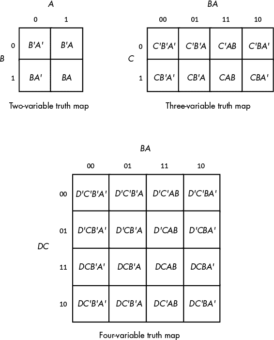

*图 8-1：二、三、四变量真值映射*

假设你的布尔函数已经是最小项和式的规范形式，则为与该函数的每个最小项相对应的真值映射单元插入 1。其他地方插入 0。例如，考虑三变量函数*F* = *C'B'A* + *C'BA'* + *C'BA* + *CB'A'* + *CB'A* + *CBA'* + *CBA*。图 8-2 展示了该函数的真值映射。

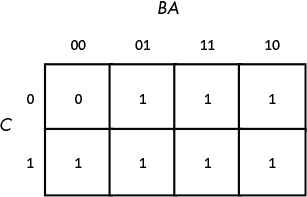

*图 8-2：* F = C'B'A + C'BA' + C'BA + CB'A' + CB'A + CBA' + CBA 的真值映射

下一步是围绕 1 的矩形组画出轮廓。你围起来的矩形必须是边长为 2 的幂。对于三个变量的布尔函数，矩形的边长可以是 1、2 和 4。你画出的矩形集合必须围绕真值图中所有包含 1 的单元格。诀窍是画出所有可能的矩形，除非一个矩形完全被另一个矩形包围，但同时要画出尽可能少的矩形。请注意，矩形可以重叠，只要一个矩形没有完全包含另一个矩形。在图 8-3 的真值图中，有三个这样的矩形。

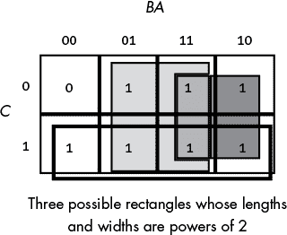

*图 8-3：在真值图中围绕 1 的矩形组*

每个矩形代表简化后的布尔函数中的一个项。因此，简化后的布尔函数将只包含三个项。你可以通过去除矩形内同时出现正负形式的变量来构建每个项（因为正负形式会相互抵消）。在图 8-3 中，那个长条形矩形位于*C* = 1 的行，其中同时包含*A*和*B*的正负形式。因此，我们可以从该项中去除*A*和*B*。由于该矩形位于*C* = 1 区域，它代表的是单一项*C*。

图 8-3 中的浅灰色方块包含*C*、*C'*、*B*、*B'*和*A*。因此，它代表单一项*A*。同样，图 8-3 中的深灰色方块包含*C*、*C'*、*A*、*A'*和*B*，因此它代表单一项*B*。

最终的最优函数是由三个方块所代表的项的总和（逻辑或），即*F* = *A* + *B* + *C*。你无需考虑剩余的包含 0 的方块。

真值图形成了一个*环面*（类似甜甜圈的形状）。图的右边缘连接到左边缘，反之亦然。同样，顶部边缘连接到底部边缘。这为在真值图中围绕 1 的组画出矩形提供了更多可能性。考虑布尔函数*F* = *C'B'A'* + *C'BA'* + *CB'A'* + *CBA'*。该函数的真值图如图 8-4 所示。

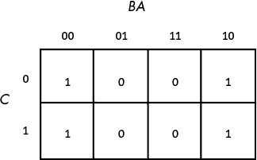

*图 8-4：F = C'B'A' + C'BA' + CB'A + CBA' 的真值图*

初看之下，你可能认为最小的矩形数量是两个，如图 8-5 所示。

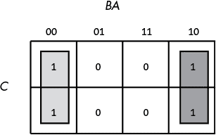

*图 8-5：首次尝试围绕由 1 形成的矩形*

然而，由于真值图是一个连续的对象，右侧和左侧相连接，因此我们实际上可以形成一个单一的正方形矩形，如图 8-6 所示。

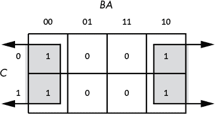

*图 8-6：函数的正确矩形*

为什么在真值图中我们有一个矩形或两个矩形很重要呢？矩形越大，它们能够消去的项就越多。因此，矩形越少，最终布尔函数中出现的项就越少。

图 8-5 中的两个矩形示例生成了一个包含两个项的函数。左侧的矩形消除了*C*变量，留下了*A'B'*作为它的项。右侧的矩形也消除了*C*变量，留下了项*BA'*。因此，这个真值图将产生方程*F* = *A'B'* + *A'B*。我们知道这是不最优的（参见定理 13）。

现在考虑图 8-6 中的真值图。这里我们只有一个矩形，所以我们的布尔函数将只有一个项。因为这个矩形包括了*C*和*C'*，还包括了*B*和*B'*，所以剩下的唯一项就是*A'*。因此，这个布尔函数简化为*F = A'*。

映射方法不能正确处理的真值图只有两种类型：包含所有 0 的真值图或包含所有 1 的真值图。这两种情况对应于布尔函数*F* = 0 和*F* = 1（即函数编号为 0 或 2^(*n*) – 1）。当你遇到这两种真值图时，你就知道如何最优化地表示该函数。

在使用映射方法优化布尔函数时，请记住你总是要选择边长是 2 的幂的最大矩形。即使是重叠的矩形也必须这样做（除非一个矩形完全包含另一个矩形）。考虑布尔函数*F* = *C'B'A'* + *C'BA'* + *CB'A'* + *C'AB* + *CBA'* + *CBA*。这将生成图 8-7 中的真值图。

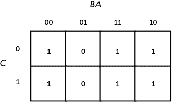

*图 8-7：F = C'B'A' + C'BA' + CB'A' + C'AB + CBA' + CBA 的真值图*

初步的诱惑是创建图 8-8 中找到的矩形集合。然而，正确的映射出现在图 8-9 中。

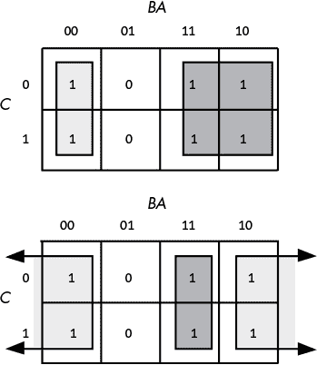

*图 8-8：矩形的显而易见选择*

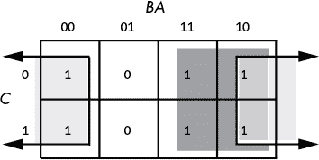

*图 8-9：F = C'B'A' + C'BA' + CB'A' + C'AB + CBA' + CBA 的矩形集合*

所有三种映射都会生成一个包含两个项的布尔函数。然而，前两种会生成表达式*F* = *B* + *A'B'*和*F* = *AB* + *A'*。第三种形式生成*F* = *B* + *A'*。最后这种形式是最优化的（参见定理 11 和 12）。

为四个变量的函数创建的真值图更加复杂；你会发现许多矩形可能隐藏在边缘，这在图 8-10 中可以看到。这个模式列表甚至没有涵盖所有的矩形！例如，图 8-10 中的图示就没有显示任何 1×2 的矩形。

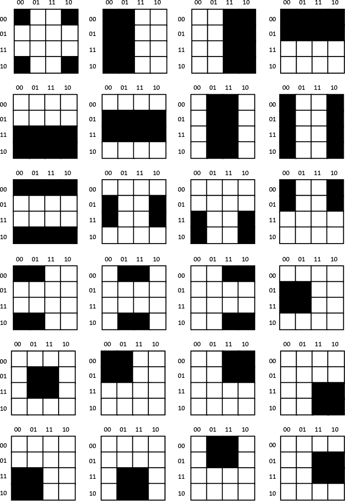

*图 8-10：4×4 真值图的部分模式列表*

这个最终的例子展示了如何优化一个四变量的函数。该函数是 *F* = *D'C'B'A'* + *D'C'B'A* + *D'C'BA* + *D'C'BA'* + *D'CB'A* + *D'CBA* + *DCB'A* + *DCBA* + *DC'B'A'* + *DC'BA'*，其真值表见于图 8-11。

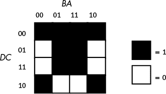

*图 8-11：F = D'C'B'A' + D'C'B'A + D'C'BA + D'C'BA' + D'CB'A + D'CBA + DCB'A + DCBA + DC'B'A' + DC'BA'* 的真值图*

图 8-12 展示了该函数的两个可能的最大矩形集合，每个集合生成三个项。

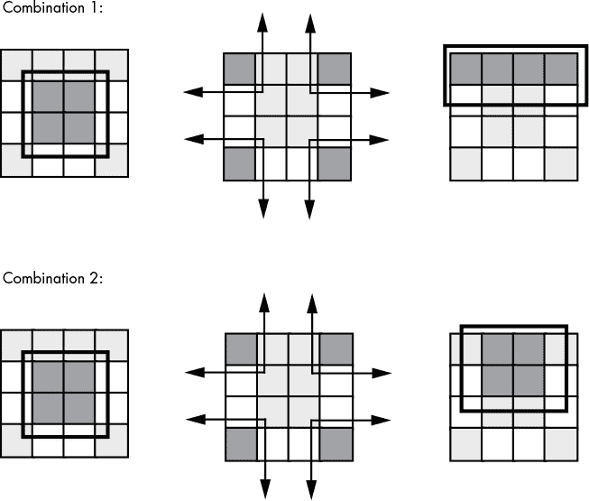

*图 8-12：两种组合生成三项*

由四个角形成的矩形，两个图中都有，包含 *B*、*B'*、*D* 和 *D'*，因此我们可以去掉这些项。矩形内剩下的项是 *C'* 和 *A'*，所以这个矩形表示项 *C'A'*。

由中间四个方格形成的矩形，在两种组合中也都有，包含了* A*、*B*、*B'*、*C*、*D* 和 *D'* 等项。去掉 *B*、*B'*、*D* 和 *D'*，我们得到 *CA*。

组合 1 有第三项，由顶行表示。这个项包含了变量 *A*、*A'*、*B*、*B'*、*C'* 和 *D'*。我们可以去掉 *A*、*A'*、*B* 和 *B'*。剩下的项是 *C'D'*。因此，上方真值表所表示的函数是 *F* = *C'A'* + *CA* + *C'D'*。

组合 2 有第三项，由顶部/中间的四个方格表示。这个矩形包含了变量 *A*、*B*、*B'*、*C*、*C'* 和 *D'*。我们可以去掉 *B*、*B'*、*C* 和 *C'*，剩下的项是 *AD*。因此，下方真值表所表示的函数是 *F* = *C'A'* + *CA* + *AD'*。

这两个函数是等价的；两个都是最优的（记住，没有保证唯一的最优解）。其中任何一个都足够满足我们的需求：使用最少的电路组件实现布尔函数。

### 8.7 这和计算机有什么关系？

你可以将任何你编写的程序，也可以指定为一系列布尔方程。这意味着你可以将任何在软件中实现的算法，也能直接在硬件中实现——所有布尔函数集合与所有电子电路集合之间存在一一对应的关系。设计 CPU 和其他与计算机相关电路的电气工程师，必须对这些内容非常熟悉。

因为使用像 Pascal、C 甚至汇编语言这样的语言来指定编程问题的解决方案，比使用布尔方程来指定解决方案要容易，所以你不太可能使用一组状态机和其他逻辑电路来实现整个程序。然而，硬件解决方案可能比等效的软件解决方案快几个数量级，而且一些时间关键的操作需要硬件解决方案。

也可以在软件中实现所有硬件功能。这一点非常重要，因为你通常在硬件中实现的许多操作，使用微处理器的软件实现要便宜得多。事实上，在现代系统中，汇编语言的主要用途之一就是以低成本替代复杂的电子电路。通常，你可以用一个单价为 2 美元的微计算机芯片，通过编程来执行等效的功能，从而替代价值数十或数百美元的电子元件。

整个*嵌入式系统*（嵌入到其他产品中的计算机系统）领域都涉及这个问题。例如，大多数微波炉、电视机、视频游戏、CD 播放器和其他消费电子设备都包含一个或多个完整的计算机系统，其唯一目的是替代复杂的硬件设计。工程师使用计算机来完成这个任务，因为它们比传统电子电路更便宜、更容易设计。

要编写能够读取开关（输入变量）并启动电动机、LED 灯或灯具，或锁定或解锁门的软件，你需要理解布尔函数以及如何在软件中实现它们。

#### *8.7.1 电子电路与布尔函数之间的对应关系*

对于任何布尔函数，你都可以设计一个等效的电子电路，反之亦然。我们可以使用与、或和非布尔运算符构造任何电子电路，它们分别对应与门、或门和反相器（非门）电路（参见图 8-13）。这些符号是*原理图*中标准的电子符号。（要了解更多关于电子原理图的内容，可以查阅任何一本电子设计书籍。）

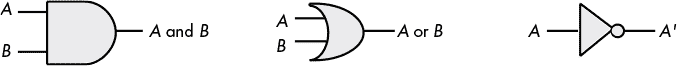

*图 8-13：与门、或门和反相器（非门）*

每个门左侧的带有*A*和*B*标签的线路对应逻辑功能的输入；每个图示右侧的线路则对应该功能的输出。

一个*电子电路*是由多个门组合而成，能够实现某些布尔函数。考虑布尔函数*F* = *AB* + *B*。你可以使用与门和或门来实现这个函数。只需将两个输入变量（*A*和*B*）连接到与门的输入，将与门的输出连接到或门的一个输入，将*B*输入变量连接到另一个或门输入。现在你就有了一个实现该函数的电子（硬件）电路。

然而，你实际上只需要一个单一的门类型——NAND（非与）门，就能实现*任何*电子电路（参见图 8-14）。NAND 门测试其两个输入（*A*和*B*），如果两个输入均为`true`，则输出`false`；如果两个输入均为`false`，则输出`true`。你可以通过一个与门和一个反相器来构建 NAND 电路。然而，从晶体管/硬件的角度来看，NAND 门实际上比与门更容易构建；因此，NAND 门（例如 7400 集成电路）非常常见。


*图 8-14：NAND 门*

我们可以仅使用 NAND 门构造任何布尔函数，因为我们可以从 NAND 门构建反相器（NOT）、与门和或门。^(3) 构建反相器很简单；只需将两个输入连接在一起（见图 8-15）。

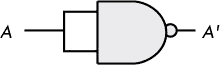

*图 8-15：由 NAND 门构建的反相器*

在构建了反相器之后，我们可以通过反转 NAND 门的输出，来构建一个与门，因为 NOT（NOT（*A* AND *B*））等同于*A* AND *B*（见图 8-16）。构建一个与门需要两个 NAND 门（没有人说仅用 NAND 门构建的电路是最优的，只是说它们是可能的）。

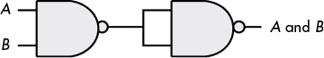

*图 8-16：从两个 NAND 门构建 AND 门*

剩下的门是逻辑“或”门。我们可以通过应用德摩根定律，从 NAND 门构建一个或门。

```
(A or B)'    =    A' and B'            DeMorgan's Theorem.

A or B       =    (A' and B')'         Invert both sides of the equation.

A or B       =    A' nand B'           Definition of NAND operation.
```

应用这些变换产生了图 8-17 中显示的电路。


*图 8-17：从 NAND 门构建 OR 门*

与其他门相比，NAND 门通常更便宜，且从相同的基本构建模块构建复杂电路比使用不同基本门构建集成电路要容易得多。

#### *8.7.2 组合电路*

计算机的 CPU 是由*组合电路*构建的，这些电路包含基本的布尔运算（与、或、非）、一些输入和一组输出。组合电路通常实现多个不同的布尔函数，每个输出对应一个独立的逻辑功能。

**注意**

*非常重要的是，你要记住* 每个输出代表一个不同的布尔函数。

##### 8.7.2.1 组合加法电路

你可以使用布尔函数实现加法。假设你有两个 1 比特数字，*A*和*B*。你可以使用这两个布尔函数产生这次加法的 1 比特和与 1 比特进位：

```
S  =  AB' + A'B        Sum of A and B.

C  =  AB               Carry from addition of A and B.
```

这两个布尔函数实现了一个*半加法器*，之所以叫半加法器，是因为它能将两个比特加在一起，但不能加上来自先前运算的进位。注意，如果*A*或*B*为 1，则*S* = 1；如果*A*和*B*都为 0 或 1（两个 1 会产生进位，这是*C* = *AB*表达式的作用），则*S* = 0。

一个*全加法器*加三个 1 比特输入（两个比特加一个来自先前加法的进位），并产生两个输出：和与进位。以下是全加法器的两个逻辑方程：

```
S     =  A'B'Cin + A'BCin' + AB'Cin' + ABCin

Cout  =  AB + ACin + BCin
```

尽管这些方程只产生单比特结果（加上进位），但通过组合加法器电路，构造一个*n*比特和是很容易的（见图 8-18）。


*图 8-18：使用半加法器和全加法器构建 n 比特加法器*

两个*n*位输入，*A*和*B*，逐位传入加法器，LO 位输入为*A*[0]和*B*[0]，依此类推直到 HO 位*A*[*n*][–1]和*B*[*n*][–1]。*S*[0]是和的 LO 位，一直到*S*[*n*][–1]，最终进位表示加法是否溢出了*n*位。

##### 8.7.2.2 使用七段 LED 解码器

另一个常见的组合电路是*七段解码器*。在计算机系统设计中，解码器电路使计算机能够识别（或*解码*）一串比特。

七段解码器电路接受 4 位输入，并确定在七段 LED 显示器上点亮哪些段。由于七段显示器包含七个输出值（每个段一个），因此与之相关联有七个逻辑函数（段 0 至段 6）。请参见图 8-19 了解段的分配。图 8-20 展示了每个十进制值的活跃段。

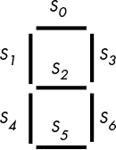

*图 8-19：七段显示器*


*图 8-20：0 至 9 的七段值*

每个七个布尔函数的四个输入是从范围为 0 到 9 的二进制数字中提取的 4 位。设*D*为该数字的最高位（HO 位），*A*为最低位（LO 位）。每个段的逻辑函数应为所有在图 8-20 中该段被点亮的二进制数字输入产生`1`（段点亮）。例如，*S*[4]（段 4）应在数字 0、2、6 和 8 时点亮，这些数字对应的二进制值分别为 0000、0010、0110 和 1000。对于每一个点亮段的二进制值，你将有一个最小项在逻辑方程中：

```
S4 = D'C'B'A' + D'C'BA' + D'CBA' + DC'B'A'
```

*S*[0]（段 0），作为第二个例子，对于数字 0、2、3、5、6、7、8 和 9 点亮，这些数字对应的二进制值为 0000、0010、0011、0101、0110、0111、1000 和 1001。因此，*S*[0]的逻辑函数如下：

```
S0 = D'C'B'A' + D'C'BA' + D'C'BA + D'CB'A + D'CBA' + D'CBA + DC'B'A' + DC'B'A
```

##### 8.7.2.3 解码内存地址

解码器在内存扩展中也常被使用。例如，假设系统设计师希望在系统中安装四个（相同的）256MB 内存模块，以使总内存达到 1GB。每个 256MB 的内存模块有 28 条地址线（*A*[0]..*A*[27]），假设每个内存模块宽度为 8 位（2²⁸ × 8 位即为 256MB）。^(4)

不幸的是，如果系统设计者将这四个内存模块连接到 CPU 的地址总线上，每个模块都会响应总线上相同的地址。这将导致混乱。为了解决这个问题，每个内存模块需要响应出现在完整地址总线上的不同地址集合（地址总线的低 28 位上会显示模块地址）。通过为每个内存模块添加一个芯片选择线，并使用一个两输入、四输出的解码电路，我们可以使用芯片选择线 *A*[28] 和 *A*[29] 来指定（现在有效的 30 位）内存地址的高 2 位。详情请参见图 8-21。

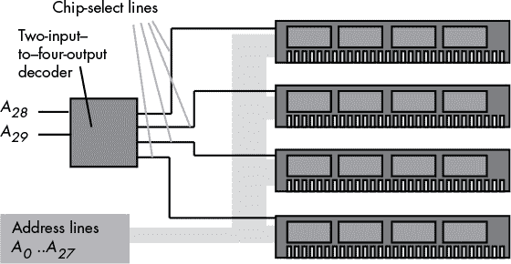

*图 8-21：向系统添加四个 256MB 内存模块*

图 8-21 中的两到四线解码器电路包含四种不同的逻辑功能：每个输出一个功能。每种输入位的组合将激活单一的芯片选择线，并禁用其他三个。假设输入为 *A* 和 *B*（*A* = *A*[28]，*B* = *A*[29]），四个输出功能如下：

```
Q0 = A'B'

Q1 = AB'

Q2 = A'B

Q3 = AB
```

根据标准电子电路符号，这些方程使用 *Q* 来表示输出。

请注意，大多数电路设计师为解码器和芯片使能使用 *低电平有效逻辑*。这意味着当输入值为低电平（`0`）时，电路被启用；当输入值为高电平（`1`）时，电路被禁用。实际的解码电路可能会使用以下最大项函数的和：

```
Q0 = A + B

Q1 = A' + B

Q2 = A + B'

Q3 = A' + B'
```

##### 8.7.2.4 解码机器指令

解码电路也用于解码机器指令。我们将在第九章和第十章中更深入地探讨这一主题，但这里我们先介绍一个简单的例子。

大多数现代计算机系统使用内存中的二进制值来表示机器指令。为了执行指令，CPU 从内存中获取指令的二进制值，使用解码电路对其进行解码，然后执行相应的工作。为了了解这一过程，我们将创建一个具有非常简单指令集的虚构 CPU。图 8-22 提供了我们 CPU 的指令格式（所有对应各种指令的数字代码）。在 1 字节的操作码（opcode）中，3 位（`iii`）表示指令，2 位（`ss`）表示源操作数，2 位表示目标操作数（`dd`）。

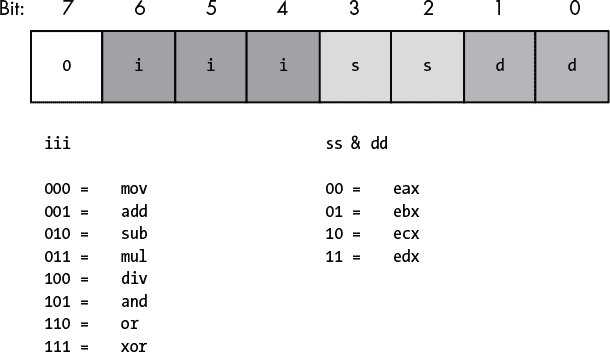

*图 8-22：一个非常简单的 CPU 的指令（操作码）格式*

要确定给定指令的 8 位操作码，可以在图 8-22 的表格中查找指令的每个组成部分，并替换相应的位值。

让我们选择`mov(eax, ebx);`作为我们的简单示例。为了将这条指令转换为其数值等效，`mov`被编码为`000`，`eax`被编码为`00`，`ebx`被编码为`01`。将这三个字段组装成操作码字节（一种压缩数据类型），得到比特值：`%00000001`。因此，数值`$1`是`mov(eax, ebx);`指令的值（见图 8-23）。

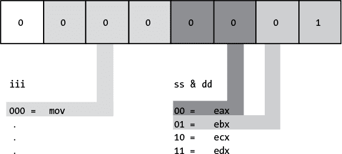

*图 8-23：编码`mov(eax, ebx);`指令*

本示例的典型解码器电路见图 8-24。该电路使用三个独立的解码器来解码操作码的各个字段。这比创建一个单一的 7 到 128 线解码器来解码整个操作码要简单得多。

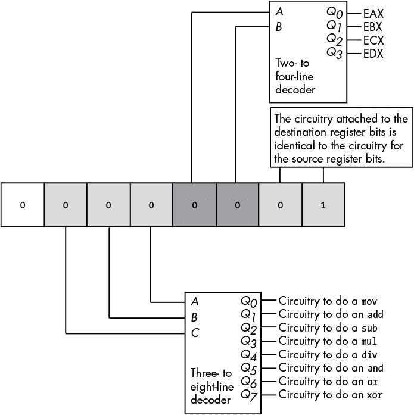

*图 8-24：解码简单的机器指令*

图 8-24 中的电路告诉你给定的操作码指定了哪条指令以及哪些操作数。要实际执行这条指令，你必须提供额外的电路来从一组寄存器中选择源操作数和目标操作数，并相应地对这些操作数进行处理。这样的电路超出了本章的范围，因此我们将把详细内容留到后面再讲。

#### *8.7.3 顺序和时钟逻辑*

组合逻辑的一个主要问题是它是*无记忆*的。从理论上讲，所有逻辑函数的输出仅依赖于当前输入。输入值的任何变化都会立即反映在输出上。^(5) 不幸的是，计算机需要能够*记住*过去计算的结果。这就是顺序逻辑或时钟逻辑的领域。

##### 8.7.3.1 置/复位触发器

*存储单元*是一个电子电路，能够在去除输入值后仍然记住该输入值。最基本的存储单元是*置/复位（S/R）触发器*。你可以使用两个 NAND 门构建一个 S/R 触发器存储单元，如图 8-25 所示。在该图中，两个 NAND 门的输出被反馈到另一个 NAND 门的输入之一。

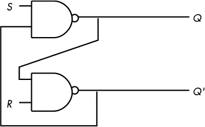

*图 8-25：由 NAND 门构建的置/复位触发器*

*S*和*R*输入通常为高电平，即`1`。如果你通过*暂时*将*S*输入的值设置为`0`，然后再将其恢复为`1`，则*Q*输出被设置为`1`。同样，如果你将*R*输入从`1`切换到`0`，然后再切换回`1`，则将*Q*输出重置为`0`。*Q'*输出与*Q*相反。

如果 *S* 和 *R* 都为 `1`，则 *Q* 输出取决于 *Q* 的原始值。也就是说，不论 *Q* 是什么，顶端 NAND 门将继续输出相同的值。如果 *Q* 最初为 `1`，则底部 NAND 门接收到两个输入为 `1`（*Q* 和 *R*），底部 NAND 门将输出 `0` (*Q'*)。因此，顶端 NAND 门的两个输入为 `0` 和 `1`，顶端 NAND 门输出 `1`，与 *Q* 的原始值相匹配。

另一方面，如果 *Q* 的原始值为 `0`，则底部 NAND 门的输入为 *Q* = `0` 和 *R* = `1`，该底部 NAND 门的输出为 `1`。因此，顶端 NAND 门的输入为 *S =* `1` 和 *Q' =* `1`。这将产生一个 `0` 输出，即 *Q* 的原始值。

假设 *Q* 为 `0`，*S* 为 `0`，*R* 为 `1`。这将把顶端 NAND 门的两个输入设置为 `1` 和 `0`，强制输出 (*Q*) 为 `1`。将 *S* 恢复到高电平状态不会改变输出，因为 *Q'* 的值为 `1`。如果 *Q* 为 `1`，*S* 为 `0`，*R* 为 `1`，你也会得到相同的结果。同样，这会产生一个 *Q* 输出值为 `1`，即使 *S* 从 `0` 切换到 `1`，这个值仍然保持为 `1`。为了克服这个问题并使 *Q* 输出为 `1`，你必须切换 *S* 输入。同样的思想适用于 *R* 输入，不过切换它会将 *Q* 输出强制为 `0`，而不是 `1`。

这个电路有一个陷阱。如果你同时将 *S* 和 *R* 输入都设置为 `0`，它将无法正常工作。这将强制 *Q* 和 *Q'* 输出都为 `1`（这在逻辑上是不一致的）。哪个输入保持 `0` 的时间最长，就决定了触发器的最终状态。以这种方式操作的触发器被称为 *不稳定*。

表 8-9 列出了基于当前输入和先前输出值的所有 S/R 触发器输出配置。

**表 8-9：** 基于当前输入和先前输出的 S/R 触发器输出状态

| **前一个 Q** | **前一个 Q'** | **S 输入** | **R 输入** | **Q 输出** | **Q' 输出** |
| --- | --- | --- | --- | --- | --- |
| x^(6) | x | `0` (`1` > `0` > `1`) | `1` | `1` | `0` |
| x | x | `1` | `0` (`1` > `0` > `1`) | `0` | `1` |
| x | x | `0` | `0` | `1` | `1`^(7) |
| `0` | `1` | `1` | `1` | `0` | `1` |
| `1` | `0` | `1` | `1` | `1` | `0` |

##### 8.7.3.2 D 触发器

S/R 触发器唯一的问题是，为了能够记住 `0` 或 `1` 的值，你必须有两个不同的输入。如果我们能够通过一个输入值来指定要记住的数据值，并且提供第二个 *时钟输入* 来 *锁存* 数据输入值，那么存储单元对我们来说将更有价值。此类型的触发器，即 D 触发器（*D* 代表 *数据*），使用的是 图 8-26 中的电路。

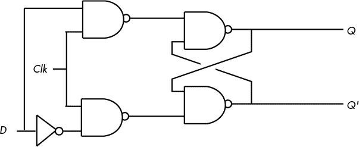

*图 8-26：使用 NAND 门实现 D 触发器*

假设你将*Q*和*Q'*输出固定为`0`/`1`或`1`/`0`，发送一个从`0`到`1`再到`0`的*时钟脉冲*，将把*D*输入复制到*Q*输出（并将*Q'*设置为*Q*的反值）。要了解它是如何工作的，注意到图 8-26 中电路图的右半部分是一个 S/R 触发器。如果数据输入为`1`，而时钟线为高电平，这会将`0`置于 S/R 触发器的*S*输入端（并将`1`置于*R*输入端）。相反，如果数据输入为`0`，而时钟线为高电平，这会将`0`置于 S/R 触发器的*R*输入端（并将`1`置于*S*输入端），从而清除 S/R 触发器的输出。每当时钟输入为低电平时，*S*和*R*输入都为高电平，S/R 触发器的输出不会改变。

尽管记住一个单独的比特通常很重要，但在大多数计算机系统中，你需要记住一*组*比特。你可以通过将多个 D 触发器并联来实现这一点。将触发器串联以存储*n*位值形成一个*寄存器*。图 8-27 中的电子原理图展示了如何从一组 D 触发器构建一个 8 位寄存器。

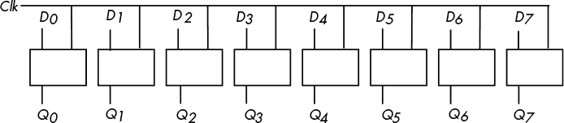

*图 8-27：由八个 D 触发器实现的 8 位寄存器*

请注意，图 8-27 中的八个 D 触发器使用一个公共时钟线。该图没有显示触发器上的*Q'*输出，因为在寄存器中它们很少被需要。

D 触发器在构建许多顺序电路时非常有用，超越了简单的寄存器。例如，你可以构建一个*移位寄存器*，它在每次时钟脉冲时将位向左移动一个位置。一个 4 位移位寄存器如图 8-28 所示。

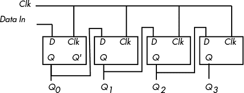

*图 8-28：由 D 触发器构建的 4 位移位寄存器*

你甚至可以使用触发器构建一个*计数器*，它计算时钟从`1`到`0`再回到`1`的切换次数。图 8-29 中的电路使用 D 触发器实现了一个 4 位计数器。

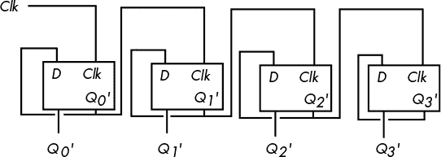

*图 8-29：由 D 触发器构建的 4 位计数器*

出乎意料的是，你可以用组合电路和少数额外的顺序电路构建一个完整的 CPU。例如，你可以通过将计数器和解码器结合来构建一个简单的状态机，称为*序列器*，如图 8-30 所示。

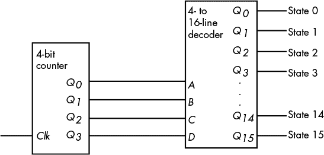

*图 8-30：一个简单的 16 状态序列器*

对于图 8-30 中的每一个时钟周期，这个序列发生器都会激活它的一个输出线。这些输出线反过来可能控制其他电路。通过在解码器的 16 条输出线上的“触发”这些其他电路，我们可以控制电路完成任务的顺序。这对于 CPU 至关重要，因为我们经常需要控制各种操作的顺序。例如，如果`add(eax, ebx);`指令在从 EAX（或 EBX）获取源操作数之前就把结果存储到 EBX 中，那就不好了。一个简单的序列发生器可以告诉 CPU 何时获取第一个操作数，何时获取第二个操作数，何时将它们相加，何时存储结果。然而，我们现在有些超前了——我们将在接下来的两章中详细讨论这个问题。

### 8.8 更多信息

Horowitz, Paul, 和 Winfield Hill. *《电子艺术》*. 第 3 版. 英国剑桥：剑桥大学出版社, 2015.

**注意**

*本章并非全面讨论布尔代数和数字设计。如果你有兴趣深入了解，可以查阅该领域的众多书籍。*
