## 第九章：CPU 架构**


毫无疑问，中央处理单元（CPU）的设计对软件性能有着最大的影响。为了执行特定的指令（或命令），CPU 需要特定的电子电路来处理该指令。随着 CPU 支持的指令数量增加，CPU 的复杂度和执行这些指令所需的电路量或*逻辑门*也会增加。因此，为了保持逻辑门的数量和相关成本合理地较小，CPU 设计师必须限制 CPU 能够执行的指令数量和复杂性。这就是所谓的 CPU 的*指令集*。

本章以及下一章将讨论 CPU 及其指令集的设计——这些信息对于编写高性能软件至关重要。

### 9.1 基本的 CPU 设计

早期计算机系统中的程序通常是硬接线到电路中的。也就是说，计算机的接线决定了计算机将执行的算法。计算机必须重新接线才能解决不同的问题。这是一个困难的任务，只有电气工程师能够完成。

因此，计算机设计的下一个进展是可编程计算机系统，在这种系统中，计算机操作员可以使用一组插槽和连接电线的面板，轻松地“重新接线”计算机，这就是*跳线板*。计算机程序由一排排插槽组成，每一排表示程序执行期间的一个操作（指令）。为了执行一条指令，程序员将电线插入相应的插槽中（参见图 9-1）。

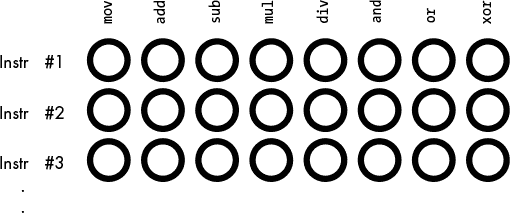

*图 9-1：跳线板编程*

可用指令的数量受到每排插槽能够容纳多少个插槽的限制。CPU 设计师很快意识到，通过少量的额外逻辑电路，他们可以将指定*n*个不同指令所需的插槽数量从*n*个插槽减少到 log2 个插槽。他们通过为每个指令分配一个唯一的二进制数字来实现这一点（例如，图 9-2 展示了如何使用仅 3 个位表示 8 条指令）。

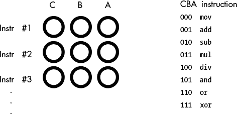

*图 9-2：编码指令*

图 9-2 中的示例需要八个逻辑功能来解码跳线板上的*A*、*B*和*C*位，但额外的电路（一个三到八线解码器）是值得的，因为它将每个指令的插槽总数从八个减少到三个。

许多 CPU 指令需要操作数。例如，`mov` 指令将数据从计算机的一个位置移动到另一个位置，比如从一个寄存器到另一个寄存器，因此需要源操作数和目标操作数。操作数被编码为机器指令的一部分，插槽对应源和目标。图 9-3 展示了处理 `mov` 指令的插槽组合之一。

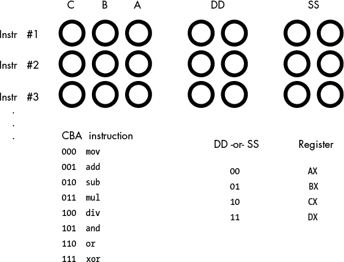

*图 9-3：编码带有源和目标字段的指令*

`mov` 指令将数据从源寄存器移动到目标寄存器，`add` 指令将源寄存器的值加到目标寄存器，以此类推。这个方案允许在每条指令仅使用七个插槽的情况下，编码出 128 条不同的指令。

如前所述，早期板式编程的一个大问题是，程序的功能受限于机器上可用的插槽数量。早期计算机设计师意识到，板式插槽与内存中的比特之间存在关系。他们意识到，可以将机器指令的二进制等价物存储在主内存中，当 CPU 需要执行指令时，从内存中获取该二进制数，并将其加载到一个特殊寄存器中进行解码。这个发明被称为*存储程序计算机*，它是计算机设计的另一个重要进展。

解决方法是向 CPU 中添加更多电路，称为*控制单元（CU）*。控制单元使用一个特殊的寄存器，即*指令指针*，来保存指令的二进制数字代码地址（也称为*操作码*或*opcode*）。控制单元从内存中提取指令的操作码，并将其放入指令解码寄存器中执行。执行完指令后，控制单元递增指令指针，并从内存中获取下一条指令进行执行。

### 9.2 解码与执行指令：随机逻辑与微代码

一旦控制单元从内存中获取指令，传统 CPU 通常使用两种常见方法来执行指令：随机逻辑（硬连线）和微代码（仿真）。例如，80x86 系列就同时使用了这两种技术。

*随机逻辑*^(1)或硬连线方法使用解码器、锁存器、计数器和其他硬件逻辑设备来操作操作码数据。随机逻辑速度快，但在电路设计上带来挑战；对于具有大规模复杂指令集的 CPU 来说，很难合理布局电路，以便在芯片的二维空间中将相关电路放置得尽可能接近。

基于微码的 CPU 包含一个小而快速的*执行单元*（负责执行特定功能的电路），称为* 微引擎*，它使用二进制操作码从微码库中选择一组指令。这个微码每个时钟周期执行一条微指令，微指令的序列执行所有步骤，以完成该指令所需的所有计算。

尽管这个*微引擎*本身非常快，但它必须从微码 ROM（只读内存）中获取指令。因此，如果内存技术比执行逻辑更慢，微引擎必须以与微码 ROM 相同的速度运行，这反过来限制了 CPU 的运行速度。

随机逻辑方法可以减少执行操作码指令的时间，前提是典型的 CPU 速度比内存速度更快，但这并不意味着它一定比微码方法更快。随机逻辑通常包含一个顺序器，按顺序遍历多个状态（每个时钟周期一个状态）。无论你是通过执行微指令消耗时钟周期，还是在随机逻辑状态机中逐步执行，你仍然在消耗时间。

哪种方法更适合 CPU 设计完全取决于当前的内存技术状态。如果内存技术比 CPU 技术更快，微码方法可能更有意义。如果内存技术比 CPU 技术更慢，随机逻辑通常能更快地执行机器指令。

### 9.3 按步骤执行指令

无论 CPU 使用哪种方法，你都需要理解 CPU 如何执行单个机器指令。为此，我们将考虑四个具有代表性的 80x86 指令——`mov`、`add`、`loop`和`jnz`（*如果不为零则跳转*）——来让你了解 CPU 如何执行其指令集中的所有指令。

正如你之前看到的，`mov`指令将数据从源操作数复制到目标操作数。`add`指令将源操作数的值加到目标操作数中。`loop`和`jnz`是*条件跳转*指令——它们测试某个条件，如果为`true`，它们跳转到内存中的某个其他指令；如果为`false`，则继续执行下一条指令。`jnz`指令测试 CPU 内的一个布尔变量，称为*零标志*，如果零标志的值为`0`，则将控制转移到目标指令（跳转到的指令）；如果零标志的值为`1`，则继续执行下一条指令。程序通过指定目标指令与`jnz`指令在内存中的字节距离来指示目标指令的地址。

`loop`指令递减 ECX 寄存器的值，并且如果结果值不为`0`，则将控制转移到目标指令。这是*复杂指令集计算机（CISC）*指令的一个好例子，因为它执行了多个操作：

1.  它从 ECX 中减去 1。

1.  如果 ECX 不为`0`，它会进行条件跳转。

也就是说，`loop`大致相当于以下指令序列：

```
sub( 1, ecx ); // On the 80x86, the sub instruction sets the zero flag

jnz SomeLabel; // the result of the subtraction is 0.
```

为了执行`mov`、`add`、`jnz`和`loop`指令，CPU 需要执行一系列不同的操作。每个操作执行都需要一定的时间，整个指令执行所需的时间通常等于 CPU 执行每个操作或*阶段*（步骤）所需的一个时钟周期。显然，指令所需的阶段越多，它的运行速度就越慢。由于复杂指令具有多个执行阶段，因此它们的运行速度通常比简单指令慢。

尽管 80x86 CPU 有所不同，并不一定执行完全相同的步骤，但它们的操作序列是相似的。本节展示了一些可能的序列，所有序列都从相同的三个执行阶段开始：

1.  从内存中获取指令的操作码。

1.  用紧跟操作码后的字节地址更新 EIP（扩展指令指针）寄存器。

1.  解码指令的操作码，以查看它指定了什么指令。

#### *9.3.1 mov 指令*

解码后的 32 位 80x86 `mov(`srcReg`,` destReg`);`指令可能使用以下（额外的）执行阶段：

1.  从源寄存器（srcReg）获取数据。

1.  将获取的值存储到目标寄存器（destReg）中。

`mov(`srcReg`,` destMem`);`指令可能使用以下执行阶段：

1.  从紧跟操作码后的内存位置获取与内存操作数相关的位移值。

1.  更新 EIP，使其指向操作码后面操作数的第一个字节。

1.  如果`mov`指令使用复杂的寻址模式（例如，索引寻址模式），则计算目标内存位置的有效地址。

1.  从 srcReg 获取数据。

1.  将获取的值存储到目标内存位置。

`mov(`srcMem`,` destReg`);`指令非常类似，只是将寄存器访问与内存访问交换了这些步骤。

`mov(`constant`,` destReg`);`指令可能使用以下执行阶段：

1.  从紧跟操作码后的内存位置获取与源操作数相关的常量。

1.  更新 EIP，使其指向操作码后面的第一个字节。

1.  将常量值存储到目标寄存器中。

假设每个阶段需要一个时钟周期执行，那么这个序列（包括三个共同的阶段）将需要六个时钟周期来执行。

`mov(`constant`,` destMem`);`指令可能使用以下执行阶段：

1.  从紧跟在操作码后的内存位置获取与内存操作数相关的位移值。

1.  更新 EIP，使其指向紧跟在操作数后的第一个字节。

1.  从紧跟在内存操作数位移后的内存位置获取常量操作数的值。

1.  更新 EIP，使其指向常量的第一个字节。

1.  计算目标内存位置的有效地址，如果`mov`指令使用复杂寻址模式（例如，索引寻址模式）。

1.  将常量值存入目标内存位置。

#### *9.3.2 add 指令*

`add`指令稍微复杂一些。以下是解码后的`add(`srcReg`,` destReg`);`指令必须完成的典型操作（超出了常见操作集）：

1.  获取源寄存器的值并将其发送到*算术逻辑单元（ALU）*，该单元负责处理 CPU 中的算术运算。

1.  获取目标寄存器操作数的值并将其发送到 ALU。

1.  指示 ALU 将值相加。

1.  将结果存回目标寄存器操作数。

1.  使用加法操作的结果更新标志寄存器。

**注意**

*标志寄存器，*也称为*条件码寄存器*或*程序状态字*，是 CPU 中的一个布尔变量数组，用于跟踪前一条指令是否产生溢出、零结果、负结果或其他类似的条件。*

如果源操作数是内存位置而非寄存器，且`add`指令的形式为`add(`srcMem`,` destReg`);`，则指令序列稍微复杂一些：

1.  从紧跟在操作码后的内存位置获取与内存操作数相关的位移值。

1.  更新 EIP，使其指向紧跟在操作数后的第一个字节。

1.  计算源内存位置的有效地址，如果`add`指令使用复杂寻址模式（例如，索引寻址模式）。

1.  从内存中获取源操作数的数据并将其发送到 ALU。

1.  获取目标寄存器操作数的值并将其发送到 ALU。

1.  指示 ALU 将值相加。

1.  将结果存回目标寄存器操作数。

1.  使用加法操作的结果更新标志寄存器。

如果源操作数是常量且目标操作数是寄存器，则`add`指令的形式为`add(`constant`,` destReg`);`，CPU 可能会按如下方式处理它：

1.  获取紧跟在操作码后的常量操作数，并将其发送到 ALU。

1.  更新 EIP，使其指向紧跟在操作码后的常量的第一个字节。

1.  获取目标寄存器操作数的值并将其发送到 ALU。

1.  指示 ALU 将值相加。

1.  将结果存回目标寄存器操作数。

1.  使用加法操作的结果更新标志寄存器。

这个指令序列需要九个周期来完成。

如果源操作数是常数，并且目标操作数是内存位置，那么`add`指令的形式为`add(`constant`,` destMem`);`，此时序列稍显复杂：

1.  从紧跟操作码之后的内存中获取与内存操作数相关的位移值。

1.  更新 EIP，使其指向操作码后紧跟操作数的第一个字节。

1.  如果`add`指令使用复杂的寻址模式（例如，索引寻址模式），则计算目标内存位置的有效地址。

1.  获取紧跟在内存操作数位移值后的常数操作数，并将其发送到 ALU。

1.  从内存中获取目标操作数的数据并将其发送到 ALU。

1.  更新 EIP，使其指向紧跟内存操作数后常数的第一个字节。

1.  指示 ALU 进行加法运算。

1.  将结果存储回目标内存操作数中。

1.  使用加法运算结果更新标志寄存器。

这个指令序列需要 11 或 12 个周期来完成，具体取决于是否需要计算有效地址。

#### *9.3.3 jnz 指令*

由于 80x86 的`jnz`指令不允许不同类型的操作数，它只需要一个步骤序列。解码后的`jnz` `label;`指令可能使用以下附加的执行阶段：

1.  获取位移值（跳转距离），并将其发送到 ALU。

1.  更新 EIP 寄存器，以保存紧跟位移操作数后的指令地址。

1.  测试零标志，看它是否被清除（即是否包含`0`）。

1.  如果零标志被清除，将 EIP 中的值复制到 ALU。

1.  如果零标志被清除，指示 ALU 将位移值与 EIP 值相加。

1.  如果零标志被清除，将加法结果复制回 EIP。

注意，如果跳转未被执行，`jnz`指令需要的步骤更少，因此运行时所需的时钟周期也更少。这对于条件跳转指令来说是非常典型的。

#### *9.3.4 循环指令*

由于 80x86 的`loop`指令不允许不同类型的操作数，它只需要一个步骤序列。解码后的 80x86 `loop`指令可能使用如下的执行序列：^(2)

1.  获取 ECX 寄存器的值并将其发送到 ALU。

1.  指示 ALU 将此值递减。

1.  将结果发送回 ECX 寄存器。如果该结果非零，则设置一个特殊的内部标志。

1.  从内存中获取紧跟在操作码后的位移值（跳转距离），并将其发送到 ALU。

1.  使用紧跟在位移操作数后的指令地址更新 EIP 寄存器。

1.  测试特殊的内部标志，查看 ECX 是否非零。

1.  如果标志被设置（即它包含`1`），将 EIP 中的值复制到 ALU。

1.  如果标志被设置，指示 ALU 将位移值与 EIP 值相加。

1.  如果标志位被设置， 将加法的结果复制回 EIP 寄存器。

与`jnz`指令类似，请注意，`loop`指令在未跳转时执行得更快，CPU 将继续执行紧接在`loop`指令之后的指令。

### 9.4 RISC 与 CISC：通过执行更多、更快的指令提高性能

早期的微处理器（包括 80x86 及其前身）是*复杂指令集计算机（CISC）*的典型例子。当时设计这些 CPU 时的思路是，让每条指令完成更多的工作可以让程序运行得更快，因为它们执行的指令较少（而具有较少复杂指令的 CPU 则需要执行更多指令才能完成相同的工作量）。数字设备公司（DEC）的 PDP-11 及其继任者 VAX 就是这种设计理念的代表。

在 1980 年代初期，计算机架构研究人员发现，这种复杂性带来了巨大的代价。所有支持这些复杂指令所需的硬件最终限制了 CPU 的整体时钟速度。对 VAX 11-780 小型计算机的实验表明，执行多个简单指令的程序比执行较少、更加复杂的指令的程序运行得更快。这些研究人员假设，如果将指令集精简到最基本的部分，只使用简单的指令，就能提升硬件性能（通过提高时钟速度）。他们将这种新架构称为*精简指令集计算机（RISC）*。^(3)由此开始了伟大的“RISC 与 CISC”辩论：哪种架构更好？

至少在纸面上，RISC CPU 看起来更好。实际上，它们的时钟速度较慢，因为现有的 CISC 设计有一个巨大的先发优势（因为它们的设计者有更多的时间来优化它们）。当 RISC CPU 设计成熟到足以实现更高时钟速度时，CISC 设计已经进化，利用了 RISC 研究的成果。今天，80x86 CISC CPU 仍然是高性能的王者。RISC CPU 则找到了不同的市场：它们通常比 CISC 处理器更节能，因此通常出现在便携和低功耗设计中（例如手机和平板电脑）。

尽管 80x86（CISC CPU）仍然是性能的领导者，但仍然可以编写包含更多简单的 80x86 指令的程序，这些程序比那些包含较少、更复杂 80x86 指令的程序运行得更快。80x86 设计者保留了这些遗留指令，以便你能够执行仍包含这些指令的旧软件。然而，新的编译器避免使用这些遗留指令，从而生成运行速度更快的代码。

然而，从 RISC 研究中得出一个重要的结论是，每条指令的执行时间在很大程度上取决于它所做的工作量。一条指令所需的内部操作越多，执行时间就越长。除了通过减少内部操作的数量来提高执行时间，RISC 还优先考虑能够并行执行的内部操作——即*并行*。

### 9.5 并行性：加速处理的关键

如果我们能够减少 CPU 执行其指令集中的每条指令所需的时间，那么包含这些指令序列的应用程序也将比平时运行得更快。

RISC 处理器的早期目标是平均每个时钟周期执行一条指令。然而，即使 RISC 指令被简化，它的实际执行仍然需要多个步骤。那么，处理器如何实现这一目标呢？答案是并行性。

考虑以下`mov(srcReg, destReg)`指令的步骤：

1.  从内存中获取指令的操作码。

1.  用操作码后一个字节的地址更新 EIP 寄存器。

1.  解码指令的操作码，以查看它指定了什么指令。

1.  从`srcReg`中获取数据。

1.  将获取的值存入目标寄存器（destReg）。

CPU 必须在更新 EIP 寄存器并获取操作码后一个字节的地址之前从内存中获取指令的操作码，必须在知道要获取源寄存器的值之前解码操作码，必须在能够将获取的值存入目标寄存器之前获取源寄存器的值。

执行这个`mov`指令的所有阶段都*是串行的*。也就是说，CPU 必须在执行下一阶段之前完成当前阶段。唯一的例外是第 2 步，更新 EIP 寄存器。虽然这一阶段必须在第一阶段之后执行，但之后的所有阶段都不依赖于它。我们可以与其他任何阶段并行执行这一步，它也不会影响`mov`指令的操作。通过并行执行两个阶段，我们可以将该指令的执行时间减少一个时钟周期。以下序列展示了一个可能的并行执行方式：

1.  从内存中获取指令的操作码。

1.  解码指令的操作码，以查看它指定了什么指令。

1.  从`srcReg`中获取数据，并用操作码后一个字节的地址更新 EIP 寄存器。

1.  将获取的值存入目标寄存器（destReg）。

尽管`mov(srcReg, destReg)`指令中的其余阶段必须串行执行，但`mov`指令的其他形式也提供了通过并行执行阶段来节省周期的类似机会。例如，考虑 80x86 的`mov([ebx+disp], eax)`指令：

1.  从内存中获取指令的操作码。

1.  用操作码后一个字节的地址更新 EIP 寄存器。

1.  解码指令的操作码，以确定其指定的指令。

1.  获取位移值，用于计算源操作数的有效地址。

1.  更新 EIP，指向内存中位移值后的第一个字节。

1.  计算源操作数的有效地址。

1.  从内存中获取源操作数的数据值。

1.  将结果存储到目标寄存器操作数中。

再次，我们可以重叠执行此指令的多个阶段。在以下示例中，我们通过将 EIP 的两次更新与其他两项操作重叠，将步骤数从八个减少到六个：

1.  从内存中获取指令的操作码。

1.  解码指令的操作码，以确定其指定的指令，*并*更新 EIP 寄存器，指向操作码后面的字节地址。

1.  获取位移值，用于计算源操作数的有效地址。

1.  计算源操作数的有效地址，*并*更新 EIP，指向内存中位移值后的第一个字节。

1.  从内存中获取源操作数的数据值。

1.  将结果存储到目标寄存器操作数中。

作为最后一个示例，考虑 `add(`constant`,` `[ebx+`disp`]);` 指令。其串行执行如下：

1.  从内存中获取指令的操作码。

1.  使用操作码后面的字节地址更新 EIP 寄存器。

1.  解码指令的操作码，以确定其指定的指令。

1.  从紧跟在操作码后面的内存位置获取位移值。

1.  更新 EIP，指向操作码后面的第一个字节，超越位移操作数。

1.  计算第二个操作数的有效地址。

1.  获取紧跟在位移值后面的常量操作数，并将其发送到 ALU。

1.  从内存中获取目标操作数的数据，并将其发送到算术逻辑单元（ALU）。

1.  更新 EIP，指向位移操作数后面常量的第一个字节。

1.  指示 ALU 执行加法操作。

1.  将结果存储回目标（第二）操作数中。

1.  使用加法操作的结果更新标志寄存器。

我们可以重叠执行此指令的多个阶段，因为它们不依赖于其直接前驱的结果：

1.  从内存中获取指令的操作码。

1.  解码指令的操作码，以确定其指定的指令，*并*更新 EIP 寄存器，指向操作码后面的字节地址。

1.  从紧跟在操作码后面的内存位置获取位移值。

1.  更新 EIP，指向操作码后面超越位移操作数的第一个字节，*并*计算内存操作数（`ebx+`disp）的有效地址。

1.  获取紧跟在位移值后面的常量操作数，并将其发送到 ALU。

1.  从内存中获取目标操作数的数据，并将其发送到 ALU。

1.  指示 ALU 执行加法操作，并更新 EIP 以指向常量值之后的第一个字节。

1.  将结果存储回第二个操作数 *并* 使用加法操作的结果更新标志寄存器。

尽管看起来 CPU 可以在同一阶段获取常量和内存操作数，因为它们的值互不依赖，但它不能这样做（至少目前不能！），因为它只有一个数据总线，而这两个值都来自内存。在接下来的章节中，你将看到我们如何克服这个问题。

通过重叠执行的各个阶段，我们大大减少了这些指令完成执行所需的步骤数，从而减少了时钟周期数。这是提升 CPU 性能的关键之一，而无需提高芯片的时钟频率。然而，单凭这一方法的收获是有限的，因为指令执行仍然是串行的。从下一个章节开始，我们将看到如何重叠相邻指令的执行，以节省额外的周期。

#### *9.5.1 功能单元*

如你在 `add` 指令中所见，两个值相加并存储其和的步骤不能并行进行，因为你必须先计算出和，才能进行存储操作。此外，CPU 无法在指令执行过程中共享某些资源。只有一个数据总线，CPU 在试图将数据存储到内存时不能获取指令的操作码。此外，许多构成指令执行的步骤共享 CPU 中的功能单元。

*功能单元* 是执行公共操作的逻辑单元，例如算术逻辑单元和控制单元。一个功能单元一次只能执行一个操作；你不能同时执行两个使用相同功能单元的操作。为了设计一个可以并行执行多个阶段的 CPU，我们必须合理安排这些阶段，以减少潜在的冲突，或者增加额外的逻辑，以便通过在不同功能单元中执行，能够同时进行两个（或更多）操作。

再次考虑 `mov(srcMem, destReg);` 指令可能需要的步骤：

1.  从内存中获取指令的操作码。

1.  更新 EIP 寄存器以保存紧跟操作码之后的位移值地址。

1.  解码指令的操作码，查看它指定了什么指令。

1.  从内存中获取位移值，以计算源操作数的有效地址。

1.  更新 EIP 寄存器以保存超出位移值的字节地址。

1.  计算源操作数的有效地址。

1.  获取源操作数的值。

1.  将获取的值存储到目标寄存器中。

第一个操作使用 EIP 寄存器的值，因此我们不能将其与后续步骤重叠，后续步骤会调整 EIP 中的值。此外，第一个操作使用总线从内存中获取指令操作码，并且由于后续的每个步骤都依赖于该操作码，因此不太可能将其与其他步骤重叠。

第二步和第三步没有共享任何功能单元，并且第三步不依赖于 EIP 寄存器的值，而该寄存器在第二步中被修改。因此，我们可以修改控制单元，使其在解码指令的同时调整 EIP 寄存器。这样可以减少`mov`指令执行所需的一个周期。

第三步和第四步，即解码指令操作码和获取位移值，看起来无法并行执行，因为必须解码操作码以确定 CPU 是否需要从内存中获取位移操作数。然而，我们可以设计 CPU 使其仍然预取位移值，以便在需要时可以使用。

当然，步骤 7 和步骤 8 的执行无法重叠，因为 CPU 必须在存储之前先获取该值。

通过将所有可能的步骤组合在一起，我们可能得到以下`mov`指令的执行顺序：

1.  从内存中获取指令的操作码。

1.  解码指令的操作码以查看它指定的指令，*并*更新 EIP 寄存器以保存操作码后跟的位移值的地址。

1.  从内存中获取位移值，以计算源操作数的有效地址，*并*更新 EIP 寄存器以保存位移值后的字节地址。

1.  计算源操作数的有效地址。

1.  从内存中获取源操作数的值。

1.  将获取的值存入目标寄存器。

通过向 CPU 添加少量逻辑，我们已经减少了`mov`指令执行所需的一两个周期。这种简单的优化同样适用于大多数其他指令。

现在考虑`loop`指令，它有几个使用 ALU 的步骤。如果 CPU 只有一个 ALU，它必须按顺序执行这些步骤。然而，如果 CPU 有多个 ALU（即多个功能单元），它可以并行执行其中的一些步骤。例如，CPU 可以在更新 EIP 值的同时减少 ECX 寄存器中的值（使用 ALU）。请注意，`loop`指令还使用 ALU 将减少后的 ECX 值与`0`进行比较（以决定是否跳转）。然而，递减 ECX 和将其与`0`比较之间存在数据依赖关系，因此 CPU 无法同时执行这两项操作。

#### *9.5.2 预取队列*

现在我们已经看过一些简单的优化技术，考虑当`mov`指令在具有 32 位数据总线的 CPU 上执行时会发生什么。如果`mov`指令从内存中获取一个 8 位位移值，CPU 可能会连同位移值一起获取额外的 3 个字节（32 位数据总线使我们可以在一个总线周期中获取 4 个字节）。数据总线上的第二个字节实际上是下一条指令的操作码。如果我们能够将这个操作码保留到下一条指令执行时再使用，那么我们就能节省一个周期的执行时间，因为它就不需要再次获取相同的操作码字节了。

##### 9.5.2.1 使用未使用的总线周期

我们仍然可以做更多的改进。当`mov`指令执行时，CPU 并不是在每个时钟周期都访问内存。例如，当数据被存储到目标寄存器时，数据总线是空闲的。数据总线空闲时，我们可以预取并保存下一条指令的操作码和操作数。

执行此操作的硬件是*【预取队列】(gloss01.xhtml#gloss01_203)*。图 9-4 展示了带有预取队列的 CPU 内部结构。

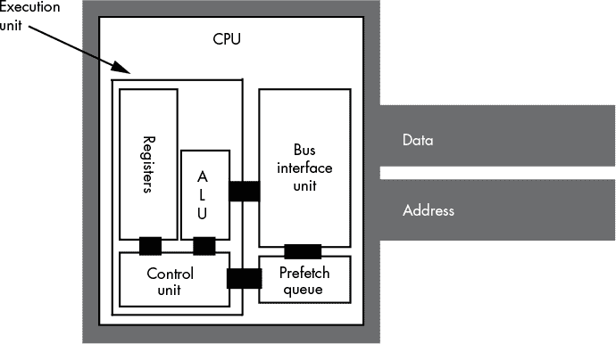

*图 9-4：带有预取队列的 CPU 设计*

*总线接口单元（BIU）*，顾名思义，控制着地址总线和数据总线的访问。BIU 充当“交通警察”，处理不同模块（如执行单元和预取队列）对总线访问的同时请求。每当 CPU 内部的某个组件希望访问主存时，它会向 BIU 发送这个请求。

每当执行单元不使用总线接口单元（BIU）时，BIU 可以从存储机器指令的内存中获取更多字节，并将它们存储在预取队列中。然后，每当 CPU 需要指令操作码或操作数值时，它从预取队列中获取*下一个可用字节*。因为 BIU 一次从内存中获取多个字节，并且每个时钟周期内，CPU 通常从预取队列中消耗的字节数少于可用字节数，所以指令通常会在预取队列中待命，供 CPU 使用。

然而，并不能保证所有指令和操作数在需要时都能位于预取队列中。例如，考虑 80x86 的`jnz Label;`指令。如果该指令的 2 字节形式出现在内存的地址 400 和 401 处，预取队列可能包含地址 402、403、404、405、406、407 等位置的字节。如果`jnz`将控制转移到目标地址 480 处的`Label`，那么地址 402、403、404 等处的字节对 CPU 就没有用了。系统将不得不暂停片刻，以便从地址 480 处获取数据，才能继续执行。尽管如此，大多数时候，CPU 从内存中获取的是顺序值，因此将数据保存在预取队列中可以节省时间。

##### 9.5.2.2 指令重叠

另一个改进是将解码下一个指令的操作码与执行前一个指令的最后一步操作重叠。在 CPU 处理操作数后，预取队列中下一个可用的字节是操作码，CPU 可以解码它，因为指令解码器在 CPU 执行当前指令的步骤时处于空闲状态。当然，如果当前指令修改了 EIP 寄存器，那么 CPU 在解码操作上花费的时间就会浪费；然而，由于这与当前指令的其他操作并行进行，因此这种解码不会拖慢系统速度（尽管需要额外的电路）。

##### 9.5.2.3 总结背景预取事件

现在我们的指令执行顺序假设以下 CPU 预取事件正在后台（并行）发生：

1.  如果预取队列未满（通常它可以容纳 8 到 32 字节，具体取决于处理器），并且 BIU 在当前时钟周期内处于空闲状态，则从 EIP 寄存器中找到的地址开始，获取下一个双字。

1.  如果指令解码器处于空闲状态，并且当前指令不需要操作数，CPU 应开始解码预取队列前端的操作码。如果当前指令需要操作数，那么 CPU 会开始解码预取队列中位于该操作数之后的字节。

现在让我们重新考虑我们的`mov(`srcreg`,` destreg`);`指令。因为我们已经添加了预取队列和 BIU，我们可以将此指令的获取和解码阶段与前一个指令的特定阶段重叠，以得到以下步骤：

1.  获取并解码指令；这与前一个指令重叠。

1.  获取源寄存器，并使用下一个指令的地址更新 EIP 寄存器。

1.  将获取的值存储到目标寄存器中。

本示例中的指令执行时序假设操作码已存在于预取队列中，并且 CPU 已对其进行解码。如果两者之一不成立，则需要额外的周期来从内存中获取操作码并解码指令。

#### *9.5.3 阻碍预取队列性能的条件*

跳转和条件跳转指令在转移控制到目标位置时比其他指令慢，因为 CPU 不能将获取和解码下一个指令的操作与执行跳转指令的过程重叠，这会导致控制转移。在执行跳转指令之后，预取队列可能需要几个周期才能重新加载。

**注意**

*如果你想写出快速的代码，尽量避免在程序中跳来跳去。*

条件跳转指令只有在实际跳转到目标位置时才会使预取队列失效。如果跳转条件为`false`，执行将继续进行下一条指令，且预取队列中的值保持有效。因此，在编写程序时，如果你能确定哪个跳转条件最常发生，应安排程序使最常见的条件导致程序继续执行下一条指令，而不是跳转到其他位置。

此外，指令大小（以字节为单位）会影响预取队列的性能。指令越大，CPU 清空预取队列的速度就越快。涉及常数和内存操作数的指令通常是最大的。如果你连续执行一系列这样的指令，CPU 可能会因为它从预取队列中移除指令的速度快于 BIU 将数据复制到预取队列的速度而不得不等待。因此，尽可能使用较短的指令。

最后，预取队列在数据总线较宽时表现最佳。16 位的 8086 处理器比 8 位的 8088 运行得更快，因为它可以用更少的总线访问来保持预取队列的满状态。别忘了，CPU 需要使用总线进行其他操作。访问内存的指令与预取队列争夺对总线的访问。如果你有一系列访问内存的指令，预取队列可能会很快被清空，一旦发生这种情况，CPU 必须等待 BIU 从内存中获取新的操作码，才能继续执行指令。

#### *9.5.4 流水线：重叠执行多条指令*

使用 BIU 和执行单元并行执行指令是流水线的一个特例。大多数现代处理器都采用流水线技术来提高性能。除少数例外，流水线使我们能够每个时钟周期执行一条指令。

预取队列的优势在于它允许 CPU 将获取和解码指令操作码的过程与其他指令的执行过程重叠。假设你愿意添加硬件，你几乎可以并行执行所有操作。这就是流水线的基本思想。

流水线操作通过并行执行多条指令来提高应用程序的平均性能。然而，正如你在预取队列中看到的那样，某些指令（及其组合）在流水线系统中表现得比其他指令更好。通过理解流水线操作的工作原理，你可以组织你的应用程序，使其运行得更快。

##### 9.5.4.1 一个典型的流水线

考虑执行一个通用操作所需的步骤，每个步骤都需要一个时钟周期：

1.  从内存中获取指令的操作码。

1.  解码操作码*并*（如果需要）预取位移操作数、常数操作数或两者。

1.  如果需要，计算内存操作数的有效地址（例如，`[ebx+disp]`）。

1.  如有需要，获取任何内存操作数和/或寄存器的值。

1.  计算结果。

1.  将结果存储到目标寄存器中。

假设你愿意为一些额外的硅片付费，你可以为每个步骤构建一个小型*微处理器*来处理。其组织结构类似于图 9-5 所示。

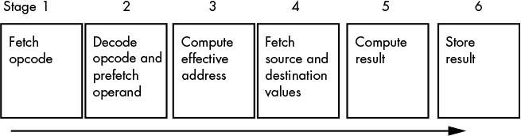

*图 9-5：指令执行的流水线实现*

在第 4 阶段，CPU 获取源操作数和目的操作数。你可以通过在 CPU 内部放置多个数据路径（例如从寄存器到算术逻辑单元 ALU）并确保没有两个操作数会同时竞争数据总线的使用来设置这一点（也就是说，没有内存到内存的操作）。

如果你为流水线中的每个阶段设计一个单独的硬件组件，如图 9-5 所示，它们几乎都可以并行执行。当然，你不能同时获取和解码多个指令的操作码，但你可以在解码当前指令的操作码时，提前获取下一条指令的操作码。如果你有一个*n*阶段的流水线，通常会有*n*条指令并发执行。图 9-6 展示了流水线操作的情况。T1、T2、T3 等代表系统时钟的连续“滴答”（时间 = 1，时间 = 2，依此类推）。

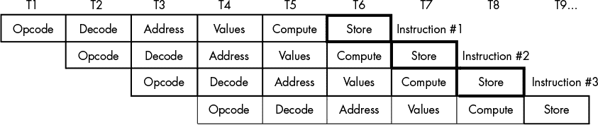

*图 9-6：流水线中的指令执行*

在时间 T = T1 时，CPU 获取第一条指令的操作码字节。在 T = T2 时，CPU 开始解码第一条指令的操作码，并且并行地从预取队列中获取一块字节，假设第一条指令有一个操作数。同时，CPU 还指示 BIU 获取第二条指令的操作码，因为第一条指令不再需要那个电路。

注意，这里存在一个小冲突。CPU 正试图从预取队列中获取下一个字节作为操作数；同时，它也在从预取队列中获取操作数数据作为操作码。它如何能同时做这两件事呢？稍后你将看到解决方案。

在时间 T = T3 时，CPU 计算任何内存操作数的地址，如果第一条指令访问了内存。如果第一条指令不访问内存，CPU 什么也不做。在 T3 期间，CPU 还解码第二条指令的操作码，并获取第二条指令中的操作数。最后，CPU 还获取第三条指令的操作码。随着时钟每一次的前进，流水线中每条指令的另一个执行阶段完成，CPU 又从内存中获取下一条指令的操作码。

这个过程持续进行，直到 T = T6 时，CPU 完成了第一条指令的执行，计算了第二条指令的结果，并获取了流水线中第六条指令的操作码。需要注意的重要事项是，在 T = T5 之后，CPU 在每个时钟周期内都会完成一条指令。一旦 CPU 填充了流水线，它就在每个周期完成一条指令。即使有复杂的寻址模式需要计算、内存操作数需要获取，或其他在非流水线处理器上消耗周期的操作，这一点也是成立的。你所需要做的只是增加更多的阶段到流水线中，你仍然可以在一个时钟周期内有效地处理每一条指令。

现在回到我之前提到的流水线组织中的小冲突。例如，在 T = T2 时，CPU 尝试预取包含第一条指令任何操作数的一块字节，同时它还获取第二条指令的操作码。在 CPU 解码第一条指令之前，它不知道该指令需要多少个操作数，也不知道它们的长度。而且，直到它确定了这些信息，CPU 才知道该获取哪一个字节作为第二条指令的操作码。那么，流水线如何能与当前指令的任何地址操作数并行获取下一条指令的操作码呢？

一种解决方案是禁止同时操作，以避免潜在的数据危害。如果一条指令有地址或常量操作数，我们可以简单地延迟下一条指令的开始。不幸的是，许多指令都有这些额外的操作数，因此这种方法会显著阻碍 CPU 的执行速度。

第二种解决方案是投入更多硬件来解决问题。操作数和常量的大小通常为 1 字节、2 字节或 4 字节。因此，如果我们实际从内存中获取位于当前操作码解码位置之后 1 字节、3 字节和 5 字节的字节，那么其中之一可能包含下一条指令的操作码。一旦我们解码完当前指令，就知道它消耗了多少字节，因此我们也知道下一条操作码的偏移位置。我们可以使用一个简单的数据选择电路来选择三个候选操作码字节中我们要使用的字节。

在实际操作中，我们实际上需要从三个以上的候选项中选择下一个操作码字节，因为 80x86 指令有多种不同的长度。例如，一个将 32 位常量复制到内存位置的`mov`指令可能长达 10 个字节或更多。此外，指令的长度从 1 字节到 15 字节不等。并且 80x86 上的一些操作码超过 1 字节，因此 CPU 可能需要获取多个字节才能正确解码当前指令。然而，通过投入更多硬件，我们可以在获取下一条指令的同时解码当前的操作码。

##### 9.5.4.2 流水线中的停顿

不幸的是，上一节中呈现的场景过于简单。我们的简单流水线忽略了两个问题：指令之间对总线的访问竞争（即*总线竞争*）和非顺序指令执行。这两个问题可能会增加流水线中指令的平均执行时间。通过了解流水线的工作原理，你可以编写软件以避免这些陷阱，从而提高应用程序的性能。

总线竞争可能发生在任何一条指令需要访问内存中的某个项时。例如，如果`mov(`reg`,` mem`);`指令需要将数据存储到内存中，而`mov(`mem`,` reg`);`指令需要从内存中取数据，那么由于 CPU 试图同时执行这两个操作，可能会发生地址和数据总线的竞争。

处理总线竞争的一个简单方法是通过*流水线停顿*。当 CPU 面临总线竞争时，会优先处理流水线中已执行得最远的指令。这会导致流水线中较后的指令停顿，并且该指令的执行需要两个时钟周期（参见图 9-7）。

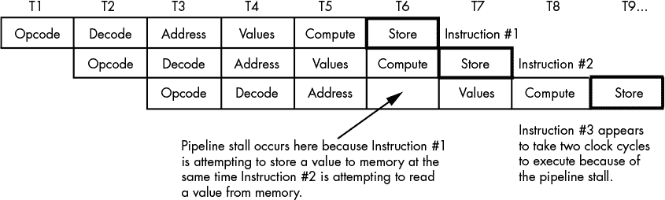

*图 9-7：流水线停顿*

还有许多其他总线竞争的情况。例如，获取操作数的指令需要访问预取队列，同时 CPU 还需要访问该队列以获取下一条指令的操作码。鉴于我们迄今为止概述的简单流水线方案，大多数指令不太可能以每条指令一个时钟周期（CPI）来执行。

作为流水线停顿的另一个例子，考虑当一条指令*修改*EIP 寄存器中的值时会发生什么。例如，如果`jnz`指令将控制转移到目标标签，它可能会改变 EIP 寄存器中的值，这意味着下一组要执行的指令并不紧接在`jnz`指令之后。当指令`jnz label;`执行完毕时（假设零标志位清除，因此分支被采取），我们已经启动了另外五条指令，而且距离完成第一条指令只剩一个时钟周期。CPU 必须避免执行这些指令，否则它将计算出不正确的结果。

唯一合理的解决方案是*刷新*整个流水线，并重新开始获取操作码。然而，这样做会导致严重的执行时间惩罚。在我们的示例中，下一条指令完成执行需要流水线的长度（六个周期）。流水线越长，系统每个周期可以完成的任务就越多，但如果程序跳跃很频繁，执行速度就越慢。不幸的是，你无法控制流水线的阶段数^(4)，但你*可以*控制程序中的传输指令数量，因此在流水线系统中最好将这些指令保持在最小限度。

#### *9.5.5 指令缓存：提供多条内存路径*

系统设计师可以通过智能使用预取队列和缓存内存子系统来解决许多总线竞争问题。正如你所看到的，他们可以设计预取队列来缓冲来自指令流的数据。然而，他们也可以使用一个独立的*指令缓存*（与数据缓存分开）来存储机器指令。作为程序员，你无法控制 CPU 的指令缓存是如何组织的，但了解它的工作方式可能会促使你使用某些指令序列，这些序列在其他情况下可能会导致停顿。

假设 CPU 有两个独立的内存空间，一个用于指令，另一个用于数据，每个内存空间都有自己的总线。这被称为*哈佛架构*，因为第一台这样的机器是在哈佛大学建造的。在哈佛机器上，不会发生总线竞争；BIU 可以继续在指令总线上获取操作码，同时访问数据/内存总线上的内存（参见图 9-8）。

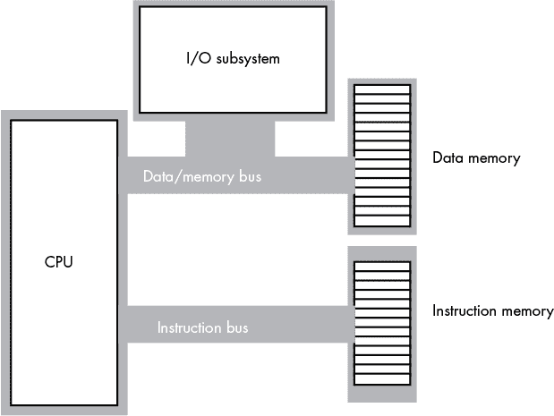

*图 9-8：典型的哈佛架构机器*

在现实世界中，真正的哈佛架构机器非常少。为了支持两个物理上独立的总线，处理器上需要额外的引脚，这增加了处理器的成本并引入了许多其他工程问题。然而，微处理器设计师发现，通过使用独立的片上缓存来存储数据和指令，他们可以在很少有其缺点的情况下获得哈佛架构的许多优点。先进的 CPU 使用内部哈佛架构和外部冯·诺依曼架构。图 9-9 展示了带有独立数据和指令缓存的 80x86 结构。

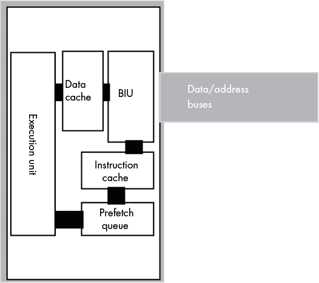

*图 9-9：使用独立的代码和数据缓存*

CPU 内部各部分之间的每条路径代表一个独立的总线，数据可以在所有路径上并行流动。这意味着预取队列可以从指令缓存中拉取指令操作码，而执行单元则将数据写入数据缓存。然而，即使有缓存，也不总是能避免总线竞争。在有两个独立缓存的安排中，BIU 仍然需要使用数据/地址总线从内存中提取操作码，只要它们不在指令缓存中。同样，数据缓存仍然需要偶尔从内存中缓存数据。

尽管你无法控制 CPU 上缓存的存在、大小或类型，但你必须了解缓存的工作原理，以便编写最佳程序。在芯片上，一级（L1）指令缓存通常非常小（在典型的 CPU 上，介于 4KB 和 64KB 之间），与主内存的大小相比，因此，指令越短，就能装入缓存的指令越多（你还厌烦“短指令”了吗？）。缓存中存储的指令越多，总线竞争发生的频率就越低。同样，使用寄存器保存临时结果会减少对数据缓存的压力，这样就不需要频繁地将数据刷新到内存或从内存中检索数据了。

#### *9.5.6 流水线危害*

使用流水线还有另一个问题：危害。危害有两种类型：控制危害和数据危害。我们实际上已经讨论过控制危害，尽管没有按名称提及。当 CPU 跳转到内存中的某个新位置时，控制危害就会发生，随之而来的是必须从流水线中清除各个执行阶段的指令。数据危害发生在两条指令试图按顺序访问同一个内存位置时。

让我们通过以下指令序列的执行概况来看一下数据危害：

```
mov( SomeVar, ebx );

mov( [ebx], eax );
```

当这两条指令执行时，流水线的状态会像图 9-10 一样。

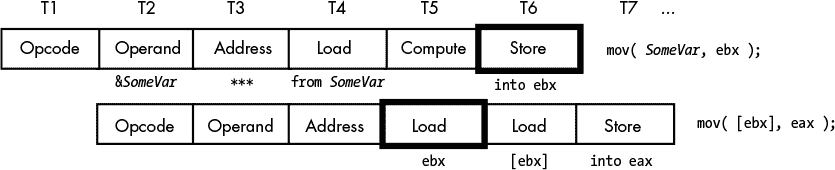

*图 9-10：数据危害*

这两条指令试图获取地址存储在 SomeVar 指针变量中的 32 位值。*然而，这个指令序列无法正常工作！* 第二条指令在第一条指令将内存位置 SomeVar 的地址复制到 EBX 之前就访问了 EBX 中的值（图 9-10 中的 T5 和 T6）。

像 80x86 这样的 CISC 处理器会自动处理危害。（有些 RISC 芯片不会，如果你在某些 RISC 芯片上尝试这个序列，你将把一个错误的值存储在 EAX 中。）为了处理这个示例中的数据危害，CISC 处理器会暂停流水线以同步这两条指令。实际执行可能看起来像图 9-11。

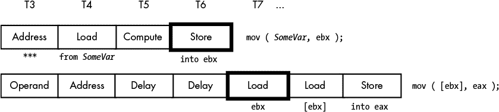

*图 9-11：CISC CPU 如何处理数据危害*

通过将第二条指令延迟两个时钟周期，CPU 确保加载指令会在正确的地址加载 EAX 的值。不幸的是，`mov([ebx], eax);`指令现在需要三个时钟周期才能执行，而不是一个时钟周期。然而，增加两个时钟周期总比产生错误的结果要好。

幸运的是，你（或你的编译器）可以减少程序执行速度中，由于冲突带来的影响。数据冲突发生在当一条指令的源操作数是前一条指令的目的操作数时。将 EBX 从 SomeVar 加载然后再从[EBX]加载 EAX（即，EBX 指向的双字内存位置）是没有问题的，*只要它们不是紧接着执行的*。假设代码序列是：

```
mov( 2000, ecx );

mov( SomeVar, ebx );

mov( [ebx], eax );
```

我们可以通过简单地重新排列指令来减少该代码序列中冲突的影响，具体如下：

```
mov( SomeVar, ebx );

mov( 2000, ecx );

mov( [ebx], eax );
```

现在，`mov([ebx], eax);`指令只需要一个额外的时钟周期。通过在`mov(`SomeVar`, ebx);`和`mov([ebx], eax);`指令之间插入另一条指令，你可以完全消除冲突的影响（当然，插入的指令不能修改 EAX 和 EBX 寄存器中的值）。

在一个流水线处理器中，程序中指令的顺序可能会极大地影响程序的性能。如果你在编写汇编代码，始终要注意可能的冲突，并通过重新排列指令序列尽可能消除它们。如果你使用的是编译器，选择一个能够正确处理指令顺序的编译器。

#### *9.5.7 超标量操作：并行执行指令*

在目前的流水线架构下，最好的执行时间是每条指令一个 CPI。是否可以比这个更快地执行指令呢？一开始你可能会想，“当然不行——我们每个时钟周期最多只能执行一条操作，所以我们不可能每个时钟周期执行多条指令。”然而，请记住，一个指令*并非*一个操作。在之前的例子中，每条指令完成的操作数量在六到八个之间。通过在 CPU 中添加七到八个独立的单元，我们可以有效地在一个时钟周期内执行这八个操作，从而得到一个 CPI。如果我们添加更多硬件，并一次性执行例如 16 个操作，我们能达到 0.5 CPI 吗？答案是有条件的“可以”。一个包含这些额外硬件的 CPU 被称为*超标量*CPU，它可以在一个时钟周期内执行多条指令。80x86 家族从 Pentium 处理器开始支持超标量执行。

超标量 CPU 拥有多个执行单元（见图 9-12）。如果它在预取队列中遇到两条或更多条可以独立执行的指令，它将同时执行它们。

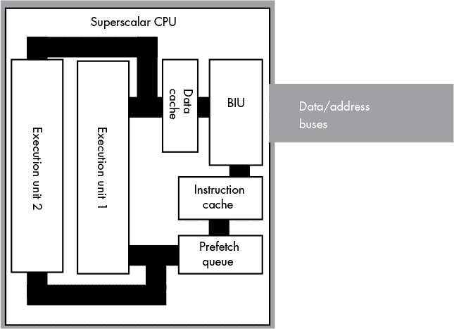

*图 9-12：支持超标量操作的 CPU*

使用超标量有几个优点。假设指令流中有以下指令：

```
mov( 1000, eax );

mov( 2000, ebx );
```

如果周围代码没有其他问题或冒险，而且这两条指令的 6 个字节目前都在预取队列中，那么没有理由不能并行获取并执行这两条指令。实现这一点只需要在 CPU 芯片上增加额外的硅片来实现两个执行单元。

除了加速独立指令外，超标量 CPU 还可以加速具有数据冒险的程序序列。普通 CPU 的一项限制是，一旦发生冒险，受影响的指令会完全停滞管线。随后的每条指令也必须等待 CPU 同步执行被阻塞的指令。然而，超标量 CPU 可以在不具有自身冒险的情况下，继续执行那些跟随冒险指令的指令。这减轻了（虽然并未消除）对精确指令调度的某些需求。

你编写针对超标量 CPU 的软件方式会显著影响其性能。最重要的是你现在可能已经厌烦的规则：*使用短指令*。指令越短，CPU 每次操作中可以获取的指令就越多，因此，CPU 执行速度比每周期指令数（CPI）大于 1 的情况更有可能更快。大多数超标量 CPU 并没有完全复制执行单元。可能有多个算术逻辑单元（ALU）、浮点单元等，这意味着某些指令序列可以非常快速地执行，而其他指令则不能。你需要研究 CPU 的精确组成，以决定哪些指令序列能产生最佳的性能。

#### *9.5.8 非顺序执行*

在标准超标量 CPU 中，安排指令以避免冒险和管线停滞是程序员（或编译器）的责任。更先进的 CPU 实际上可以通过在程序执行过程中自动重新调度指令，减轻这一负担并提高性能。为了理解如何实现这一点，考虑以下的指令序列：

```
mov( SomeVar, ebx );

mov( [ebx], eax );

mov( 2000, ecx );
```

第一条和第二条指令之间存在数据冒险。第二条指令必须等待直到第一条指令执行完毕。这会导致流水线停顿，并增加程序的运行时间。通常，停顿会影响随后的每一条指令。然而，第三条指令的执行不依赖于前两条指令的任何结果。因此，**`mov(2000, ecx);`** 指令的执行不需要停顿。它可以在第二条指令等待第一条指令完成时继续执行。这种技术被称为 *乱序执行*，因为 CPU 可以在代码流中出现的指令完成之前就执行这些指令。

请记住，CPU 只能在确保执行顺序与顺序执行结果完全相同的情况下乱序执行指令。虽然有许多技术问题使得这一特性比看起来更为复杂，但只要付出足够的工程努力，还是可以实现的。

#### *9.5.9 寄存器重命名*

一个限制 80x86 CPU 超标量操作效能的问题是其有限数量的通用寄存器。例如，假设 CPU 拥有四个不同的流水线，因此能够同时执行四条指令。假设这些指令之间没有冲突，且可以同时执行，那么实际上很难在每个时钟周期内实现四条指令同时执行，因为大多数指令需要操作两个寄存器操作数。为了实现四条指令同时执行，你需要八个不同的寄存器：四个目标寄存器和四个源寄存器（任何目标寄存器都不能作为其他指令的源寄存器）。拥有大量寄存器的 CPU 可以轻松处理这个任务，但 80x86 的寄存器有限，使得这一任务变得困难。幸运的是，有一个技巧可以缓解部分问题：*寄存器重命名*。

寄存器重命名是一种巧妙的方式，能够让 CPU 拥有比实际更多的寄存器。程序员无法直接访问这些额外的寄存器，但 CPU 可以利用它们在某些情况下防止发生数据冒险。例如，考虑以下的简短指令序列：

```
mov( 0, eax );

mov( eax, i );

mov( 50, eax );

mov( eax, j );
```

第一条和第二条指令之间、第三条和第四条指令之间都有数据冲突。在超标量 CPU 中，乱序执行通常会允许第一条和第三条指令同时执行，然后第二条和第四条指令也可以同时执行。然而，第一条和第三条指令之间也存在数据冲突，因为它们使用了相同的寄存器。程序员本可以通过使用不同的寄存器（比如 EBX）来解决第三条和第四条指令之间的冲突。然而，假设程序员无法这么做，因为所有其他寄存器都保存着重要的值。这个指令序列是否注定会在应该只需两个周期的超标量 CPU 上执行四个周期？

CPU 可以采用的一个高级技巧是为每个通用寄存器创建一个寄存器池。也就是说，CPU 可以支持一个 EAX 寄存器数组，而不是只有一个 EAX 寄存器；我们可以将这些寄存器称为 EAX[0]、EAX[1]、EAX[2]，以此类推。同样，你也可以为其他寄存器创建一个数组：EBX[0]到 EBX[*n*]、ECX[0]到 ECX[*n*]，以此类推。指令集不允许程序员为某条指令选择这些特定寄存器数组元素中的一个，但如果这样做不会改变整体计算并且能够加速程序执行，CPU 可以自动选择其中的一个。这就是*寄存器重命名*。例如，考虑以下序列（由 CPU 自动选择寄存器数组元素）：

```
mov( 0, eax[0] );

mov( eax[0], i );

mov( 50, eax[1] );

mov( eax[1], j );
```

因为 EAX[0]和 EAX[1]是不同的寄存器，CPU 可以同时执行第一条和第三条指令。同样，CPU 也可以同时执行第二条和第四条指令。

尽管这是一个简单的示例，而且不同的 CPU 在实现寄存器重命名时有不同的方式，但你可以看到 CPU 如何利用这一技术来提升性能。

#### *9.5.10 VLIW 架构*

超标量操作尝试在硬件中调度多个指令同时执行。另一种技术是 Intel 在其 IA-64 架构中使用的*超长指令字（VLIW）*。在 VLIW 计算机系统中，CPU 会提取一个大的字节块（对于 IA-64 Itanium CPU 是 41 位），并一次性解码并执行。这块字节块通常包含两条或更多指令（在 IA-64 中是三条）。VLIW 计算要求程序员或编译器正确调度每个块中的指令，以避免任何数据冲突或其他问题，但如果一切顺利，CPU 每个时钟周期可以执行三条或更多指令。

#### *9.5.11 并行处理*

大多数通过架构进步提高 CPU 性能的技术都涉及指令的并行执行。如果程序员了解底层架构，他们可以编写更快的代码，但即使程序员没有编写特殊代码来利用这些架构进步，这些进步也常常能显著提升性能。  

忽视底层架构的唯一问题是，硬件在将需要顺序执行才能正常运行的程序并行化方面所能做的有限。要真正生成并行程序，程序员必须专门编写并行代码，当然，这也需要 CPU 的架构支持。本节及下一节将涉及 CPU 可以提供的支持类型。

常见的 CPU 使用被称为*单指令单数据（SISD）*模型。这意味着 CPU 一次只执行一条指令，并且该指令只操作一片数据。^(5) 两种常见的并行模型是*单指令多数据（SIMD）*和*多指令多数据（MIMD）*模型。许多现代 CPU，包括 80x86，都在一定程度上支持这些并行执行模型，提供了一种混合的 SISD/SIMD/MIMD 架构。  

在 SIMD 模型中，CPU 执行单一的指令流，就像纯 SISD 模型一样，但它并行地操作多个数据片段。例如，考虑 80x86 的`add`指令。这是一个 SISD 指令，操作（即生成）单个数据。的确，该指令从两个源操作数中获取值，但最终结果是`add`指令只将和存储到一个目标操作数中。另一方面，SIMD 版本的`add`会同时计算多个和。例如，通过`paddb` MMX 指令，你可以在执行单一指令的情况下，加法最多达到八对独立的值。以下是此指令的示例：  

```
paddb( mm0, mm1 );
```

尽管该指令看起来只有两个操作数（像典型的 80x86 的 SISD `add`指令），但 MMX 寄存器（MM0 和 MM1）实际上存储着八个独立的字节值（MMX 寄存器是 64 位宽，但被视为八个 8 位值）。  

除非你有一个能够利用 SIMD 指令的算法，否则它们并不那么有用。幸运的是，高速 3D 图形和多媒体应用程序从这些 SIMD（和 MMX）指令中受益匪浅，因此它们在 80x86 CPU 中的加入为这些重要应用程序提供了巨大的性能提升。  

MIMD 模型使用多个指令，操作多个数据块（通常每个数据对象使用一条指令，尽管这些指令中的某一条也可能操作多个数据项）。这些指令彼此独立执行，因此很少有单个程序（或者更具体地说，单个执行线程）会使用 MIMD 模型。然而，如果你有一个多任务环境，其中多个程序试图同时执行，MIMD 模型确实允许每个程序同时执行自己的代码流。这种类型的并行系统被称为*多处理器系统*。

#### *9.5.12 多处理*

流水线技术、超标量操作、乱序执行和 VLIW 设计都是 CPU 设计师用来并行执行多个操作的技术。这些技术支持*精细粒度并行性*，并有助于加速计算机系统中相邻指令的执行。如果增加更多的功能单元可以提高并行性，那么如果你向系统中添加另一个 CPU 会发生什么呢？这种方法称为*多处理*，它可以提高系统性能，尽管没有其他技术那样均匀。

多处理并不会提高程序的性能，除非该程序是专门为在多处理器系统上运行而编写的。如果你构建一个有两个 CPU 的系统，这些 CPU 无法在单个程序中交替执行指令。将程序的指令从一个处理器切换到另一个处理器在时间上是非常昂贵的。因此，多处理器系统仅在能够并发执行多个进程或线程的操作系统中有效。为了将这种类型的并行性与流水线和超标量操作提供的并行性区分开来，我们称其为*粗粒度并行性*。

向系统中添加多个处理器并不像将两个或多个处理器接入主板那样简单。为了理解为什么会这样，考虑在一个多处理器系统中运行的两个独立程序，这两个程序分别运行在不同的处理器上。这两个处理器通过写入共享物理内存块来相互通信。当 CPU 1 向该内存块写入数据时，它会在本地缓存数据，并且可能不会立即将数据写入物理内存。如果 CPU 2 尝试同时读取这个共享内存块，它最终从主内存（或其本地缓存）中读取旧数据，而不是读取 CPU 1 写入其本地缓存的更新数据。这就是*缓存一致性*问题。为了让这两个功能正常运行，这两个 CPU 必须在修改共享对象时互相通知对方，以便另一个 CPU 可以更新其本地缓存的副本。

多处理是 RISC CPU 相对于英特尔 CPU 的一个重要优势领域。虽然英特尔 80x86 系统在大约 32 个处理器时会遇到收益递减的情况，Sun SPARC 和其他 RISC 处理器则轻松支持 64 个 CPU 系统（而且似乎每天都有更多的处理器问世）。这就是为什么大型数据库和大型网页服务器系统倾向于使用昂贵的基于 Unix 的 RISC 系统，而非 80x86 系统。

更新版的英特尔 i 系列和 Xeon 处理器支持一种称为*超线程技术*的混合多处理方式。超线程技术背后的理念看似简单——在典型的超标量处理器中，很少有指令序列能够在每个时钟周期内充分利用 CPU 的所有功能单元。与其让这些功能单元空闲，CPU 可以同时运行两个独立的执行线程，从而保持所有功能单元都在工作。这使得单个 CPU 在典型的多处理器系统中，能够有效地完成相当于 1.5 个 CPU 的工作量。

### 9.6 更多信息

Hennessy, John L., 和 David A. Patterson. *计算机架构：定量方法*. 第 5 版. Waltham, MA: Elsevier, 2012.

**注意**

*本章中缺少的一个主题是 CPU 实际指令集的设计。这是下一章的内容。*
