## 第十章：10  

**指令集架构**  

  

本章讨论了 CPU 指令集的实现。尽管给定指令集的选择通常超出了软件工程师的控制范围，但理解硬件设计工程师在设计 CPU 指令集时必须做出的决策，肯定能帮助你编写更高效的代码。

CPU 指令集包含若干基于计算机架构师对软件工程师编写代码方式假设的权衡。如果你选择的机器指令符合这些假设，你的代码可能会运行得更快，并且需要更少的机器资源。相反，如果你的代码违反了这些假设，它的性能很可能不会像本应表现得那样好。  

虽然研究指令集看似只适合汇编语言程序员，但即便是高级语言程序员也能从中受益。毕竟，每个高级语言（HLL）语句都会映射到某些机器指令序列，而指令集设计的一般概念在不同架构之间是可以迁移的。即使你从不打算使用汇编语言编写软件，理解底层机器指令的工作原理以及它们是如何设计的依然很重要。  

### 10.1 指令集设计的重要性  

尽管像缓存、流水线和超标量实现这样的特性可以在原始设计过时之后加入到 CPU 中，但一旦 CPU 进入生产阶段并且人们开始使用它编写软件，改变指令集就变得非常困难。因此，指令集设计需要非常谨慎的考虑；设计师必须从设计周期的开始就确保*【指令集架构（ISA）】(gloss01.xhtml#gloss01_125)*的正确性。  

你可能会认为“厨房水槽”式的指令集设计方法——即你能想到的每一条指令都包括在内——是最好的。然而，指令集设计是妥协管理的典范。为什么我们不能拥有一切？实际上，现实世界中有一些让人难以接受的现实阻止了这一点：  

**硅片资源** 第一个现实问题是，每个特性都需要在 CPU 的硅片（芯片）上占用一定数量的晶体管，因此 CPU 设计师有一个“硅片预算”——即有限的晶体管数量。显然，没有足够的晶体管来支持在 CPU 上加入每一个可能的特性。例如，原始的 8086 处理器的硅片预算不到 30,000 个晶体管。1999 年的 Pentium III 处理器的预算超过 900 万个晶体管。2019 年的 AWS Graviton2（ARM）CPU 拥有超过 300 亿个晶体管。（^(1)）这三种预算反映了从 1978 年到今天半导体技术的差异。  

**成本** 尽管今天在 CPU 上使用数十亿个晶体管是可能的，但使用的晶体管越多，CPU 的成本就越高。例如，在 2018 年初，使用数十亿晶体管的英特尔 i7 处理器的价格为数百美元，而当时的现代 CPU 拥有 30,000 个晶体管，价格却低于一美元。

**可扩展性** 很难预见人们未来会需要哪些功能。例如，英特尔的 MMX 和 SIMD 指令扩展是为了使多媒体编程在奔腾处理器上更加实用而添加的。回到 1978 年，当英特尔创建第一款 8086 处理器时，几乎没有人能预测到这些指令的需求。CPU 设计师必须为在未来的 CPU 系列中扩展指令集预留空间，以满足当前无法预见的需求。

**对旧指令的遗留支持** 这种残酷的现实几乎与可扩展性相反。通常，CPU 设计师认为重要的某个指令，最终会发现它的实用性远不如预期。例如，80x86 CPU 上的 `loop` 和 `enter` 指令在现代高性能程序中几乎没有使用。通常情况下，采用万象俱全方法的 CPU 中有些指令根本不会被程序使用。不幸的是，一旦指令被添加到指令集中，它必须在所有未来版本的处理器中得到支持，除非极少数程序使用该指令，以至于 CPU 设计师愿意让这些程序不再支持。

**复杂性** 一个 CPU 设计师必须考虑到汇编程序员和编译器开发人员将如何使用这个芯片。采用万象俱全方法的 CPU 可能会吸引已经熟悉该 CPU 的人，但其他人不会愿意学习一个过于复杂的系统。

采用万象俱全方法所面临的问题有一个共同的解决方案：为 CPU 的第一个版本设计一个简单的指令集，并为后续扩展留下空间。这是 80x86 之所以如此受欢迎且长寿的主要原因之一。英特尔从一个相对简单的 CPU 开始，并在多年里找到了一种扩展指令集的方法，以适应新的功能。

### 10.2 基本指令设计目标

你的程序效率在很大程度上取决于它们使用的指令。短指令使用极少的内存，且通常执行速度快，但它们无法处理大型任务。较大的指令可以处理更复杂的任务，单个指令通常能完成多个短指令的工作，但它们可能会消耗过多内存或需要执行多个机器周期。为了让软件工程师能够编写出最佳的代码，计算机架构师必须在两者之间找到平衡。

在典型的 CPU 中，计算机将指令编码为数字值（操作码，或*opcodes*），并将其存储在内存中。对这些指令进行编码是指令集设计中的一项主要任务，需要仔细考虑。每条指令必须有一个唯一的操作码，以便 CPU 能够区分它们。使用*n*位数字，可以有 2^(*n*)个不同的操作码，因此编码*m*条指令至少需要 log2 位。需要记住的要点是，单个 CPU 指令的大小取决于 CPU 支持的指令总数。

编码操作码比为每条指令分配一个唯一的数字值更复杂。如前一章所讨论的，解码每条指令并执行指定的任务需要实际的电路。对于一个 7 位操作码，我们可以编码 128 条不同的指令。要解码这 128 条指令，需要一个 7 到 128 行的解码器——这是一块昂贵的电路。然而，假设指令操作码包含某些（按位）模式，一个大型解码器通常可以通过几个更小、更便宜的解码器来替代。

如果一个指令集包含 128 个不相关的指令，除了对每条指令解码整个比特串外，你几乎无能为力。然而，在大多数架构中，指令是有分类的。例如，在 80x86 的 CPU 中，`mov(eax,` `ebx);` 和 `mov(ecx,` `edx);` 有不同的操作码，因为它们是不同的指令，但显然它们是相关的，因为它们都将数据从一个寄存器移动到另一个寄存器。唯一的区别是它们的源操作数和目标操作数。因此，CPU 设计师可以用*子操作码*对像`mov`这样的指令进行编码，然后使用操作码中的其他位字段来编码指令的操作数。

例如，给定一个仅包含八条指令的指令集，每条指令有两个操作数，且每个操作数只有四个可能值中的一个，我们可以使用三个打包字段进行编码，分别包含 3、2 和 2 位（见图 10-1）。


*图 10-1：将操作码分成几个字段以简化解码*

这种编码只需要三个简单的解码器来确定 CPU 应该执行的操作。虽然这是一个基础示例，但它展示了指令集设计中的一个非常重要的方面：操作码应该易于解码。简化操作码的最简单方法是使用多个不同的位字段来构造它。这些位字段越小，硬件解码和执行指令就越容易。

因此，CPU 设计师的目标是为操作码的指令字段和操作数字段分配适当数量的位。为指令字段选择更多的位可以让操作码编码更多的指令，就像为操作数字段选择更多的位可以让操作码指定更多的操作数（通常是内存位置或寄存器）。你可能会认为，当使用 *n* 位编码 2^(*n*) 个不同的指令时，你在选择指令大小上几乎没有什么余地。为了编码这 2^(*n*) 个指令，肯定需要 *n* 位；你无法用更少的位来做到这一点。然而，*n* 位以上是可以使用的。这可能看起来浪费，但有时却是有利的。同样，选择适当的指令大小是指令集设计中更重要的方面之一。

#### *10.2.1 选择操作码长度*

操作码的长度不是任意的。假设 CPU 能够从内存中读取字节，那么操作码可能必须是 8 位的倍数。如果 CPU 无法从内存中读取字节（大多数 RISC CPU 只能以 32 位或 64 位为单位读取内存），那么操作码的大小将与 CPU 能够一次从内存读取的最小对象的大小相同。任何试图将操作码大小缩小到这一限制以下的尝试都是徒劳的。在本章中，我们将讨论第一种情况：操作码必须是 8 位的倍数。

另一个需要考虑的点是指令操作数的大小。一些 CPU 设计师将所有操作数包含在他们的操作码中。另一些 CPU 设计师则不将像立即数或地址偏移量这样的操作数算作操作码的一部分，我们将采用这种方法。

一个 8 位的操作码只能编码 256 个不同的指令。即使我们不将指令操作数算作操作码的一部分，只有 256 个不同指令也是一个严格的限制。尽管存在 8 位操作码的 CPU，但现代处理器通常有超过 256 个不同的指令。由于操作码的长度必须是 8 位的倍数，所以下一个最小的操作码大小是 16 位。一个 2 字节的操作码可以编码最多 65,536 个不同的指令，尽管这些指令会更大。

当减少指令大小是一个重要设计目标时，CPU 设计师通常会采用数据压缩理论。第一步是分析为典型 CPU 编写的程序，并统计每条指令在大量应用中出现的频率。第二步是创建这些指令的列表，并按使用频率进行排序。接下来，设计师将 1 字节的操作码分配给最常用的指令；2 字节的操作码分配给次常用的指令；3 字节或更多字节的操作码分配给使用较少的指令。尽管这种方案需要操作码的最大大小为 3 字节或更多，但大多数程序中的实际指令将使用 1 字节或 2 字节的操作码。平均操作码长度将在 1 字节和 2 字节之间（假设为 1.5 字节），而且典型程序的长度将比所有指令都采用 2 字节操作码时要短（参见图 10-2）。

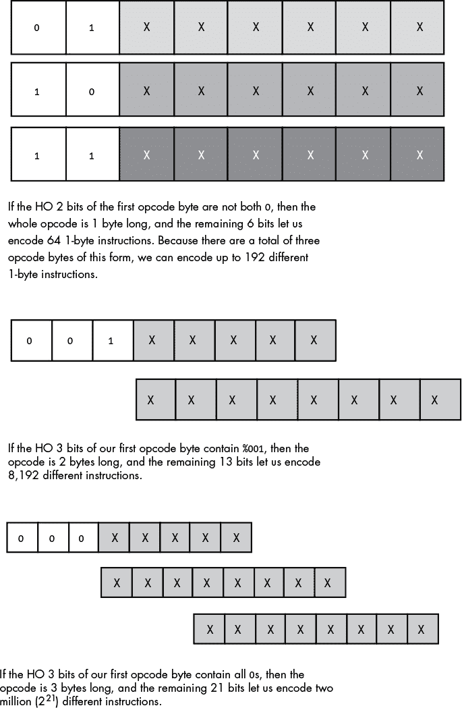

*图 10-2：使用可变长度操作码编码指令*

尽管使用可变长度指令可以让我们创建更小的程序，但这也有代价。首先，解码可变长度指令比解码固定长度指令要复杂一些。在解码特定指令字段之前，CPU 必须首先解码指令的大小，这会消耗一定时间。这可能会影响 CPU 的整体性能，因解码步骤的延迟会限制 CPU 的最大时钟速度（因为这些延迟拉长了一个时钟周期，从而降低了 CPU 的时钟频率）。可变长度指令还会使得在流水线中解码多个指令变得困难，因为 CPU 无法轻松地确定预取队列中的指令边界。

由于这些原因及其他原因，大多数流行的 RISC 架构都避免使用可变长度指令。然而，在本章中，我们将研究一种可变长度方法，因为节省内存是一个值得追求的目标。

#### *10.2.2 面向未来的规划*

在实际选择要在 CPU 中实现的指令之前，设计师必须为未来做规划。如前所述，初始设计后，新的指令需求无疑会出现，因此明智的做法是专门为扩展预留一些操作码。鉴于图 10-2 中的指令操作码格式，预留 64 个 1 字节操作码块、半数（4,096 个）2 字节操作码和半数（1,048,576 个）3 字节操作码以备将来使用，这可能不是个坏主意。放弃 64 个极为宝贵的 1 字节操作码似乎有些奢侈，但历史表明，这种远见最终会得到回报。

#### *10.2.3 选择指令*

下一步是选择要实现的指令。即使近一半的指令已经为将来扩展预留，也并不意味着所有剩余的操作码必须用于实现指令。设计师可以将其中一些指令保持未实现，实际上也是为未来保留。正确的方法不是尽可能快地使用完操作码，而是根据设计妥协，生成一个一致且完整的指令集。添加指令比删除指令容易得多，因此，在第一次设计时，通常最好采用更简单的设计。

首先，选择一些通用的指令类型。在设计初期，限制选择常见的指令非常重要。其他处理器的指令集可能是寻找建议的最佳地方。例如，大多数处理器都有以下指令：

+   数据移动指令（例如`mov`）

+   算术与逻辑指令（例如`add`、`sub`、`and`、`or`、`not`）

+   比较指令

+   条件跳转指令（通常在比较指令后使用）

+   输入/输出指令

+   其他杂项指令

初始指令集应包括合理数量的指令，以使程序员能够编写高效的程序，同时不超出硅片预算或违反其他设计约束。这要求 CPU 设计师基于深入的研究、实验和仿真做出战略决策。

#### *10.2.4 指令操作码分配*

在选择初步指令后，CPU 设计师将为其分配操作码。这个过程的第一步是根据指令所共享的特征对指令进行分组。例如，`add` 指令可能支持与 `sub` 指令完全相同的操作数，因此将这两条指令分组是合乎逻辑的。另一方面，`not` 和 `neg` 指令通常只需要一个操作数。因此，将这两条指令放入同一组是合理的，但与 `add` 和 `sub` 分开。

一旦所有指令被分组，下一步就是对它们进行编码。典型的编码方案使用一些位来选择组别，使用一些位来选择该组中的特定指令，还有一些位用于编码操作数类型（例如寄存器、内存位置和常量）。编码所有这些信息所需的位数会直接影响指令的大小，而不管指令的使用频率如何。例如，假设需要 2 位来选择指令的组，4 位来选择该组中的指令，6 位来指定指令的操作数类型。在这种情况下，指令将无法适应 8 位的操作码。另一方面，如果我们只需要将 8 个不同寄存器中的一个推入栈中，那么 4 位就足以指定`push`指令组，3 位足以指定寄存器。

使用最少空间对指令操作数进行编码始终是一个问题，因为许多指令允许多个操作数。例如，通用的 32 位 80x86 `mov`指令允许两个操作数并且需要 2 字节的操作码。^(2) 然而，英特尔注意到`mov(`disp`, eax);`和`mov(eax,` disp`);`在程序中经常出现，因此它创建了这些指令的特殊 1 字节版本，以减少它们的大小，从而减小使用它们的程序的大小。然而，英特尔并没有移除这些指令的 2 字节版本：有两个不同的指令将 EAX 存储到内存中，还有两个不同的指令从内存中加载 EAX。编译器或汇编器将始终生成每对指令中的较短版本。

英特尔在`mov`指令上做了一个重要的权衡：它放弃了一个额外的操作码，以提供每个指令变体的更短版本。事实上，英特尔在很多地方都使用了这个技巧，以创建更短且更易解码的指令。回到 1978 年，为了减少程序大小，创建冗余指令是一个很好的折衷方案，因为当时内存的成本较高。然而，今天的 CPU 设计师可能会将这些冗余操作码用于其他目的。

### 10.3 Y86 假设处理器

由于 80x86 处理器家族随着时间的推移进行了改进，英特尔在 1978 年的设计目标，以及计算机架构的演变，80x86 指令的编码非常复杂且有些不合逻辑。简而言之，80x86 并不是一个很好的指令集设计入门示例。为了绕过这一点，我们将分两个阶段讨论指令集设计：首先，我们将为 Y86 开发一个简单的指令集，Y86 是一个 80x86 的小子集，然后我们将扩展讨论到完整的 80x86 指令集。

#### *10.3.1 Y86 的局限性*

假设的 Y86 处理器是 80x86 CPU 的*非常*简化版本。它仅支持：

+   一个操作数大小：16 位。这个简化使我们不必将操作数大小作为操作码的一部分进行编码（从而减少我们所需的操作码总数）。

+   四个 16 位寄存器：AX、BX、CX 和 DX。这使我们能够仅用 2 位编码寄存器操作数（相比 80x86 系列需要 3 位来编码八个寄存器）。

+   一个 16 位的地址总线，最大可寻址 65,536 字节的内存。

这些简化，加上非常有限的指令集，将使我们能够通过 1 字节的操作码和在适用时 2 字节的位移/偏移量来编码所有 Y86 指令。

#### *10.3.2 Y86 指令*

包括两种形式的 `mov` 指令，Y86 CPU 仍然只提供 18 条基本指令。这些指令中，七条有两个操作数，八条有一个操作数，五条没有操作数。指令包括 `mov`（两种形式）、`add`、`sub`、`cmp`、`and`、`or`、`not`、`je`、`jne`、`jb`、`jbe`、`ja`、`jae`、`jmp`、`get`、`put` 和 `halt`。

##### 10.3.2.1 mov 指令

`mov` 指令有两种形式，合并到同一个指令类别中：

```
mov( reg/memory/constant, reg );

mov( reg, memory );
```

在这些形式中，reg 是寄存器 `ax`、`bx`、`cx` 或 `dx`；内存是指定内存位置的操作数；常数是使用十六进制表示的数字常数。

##### 10.3.2.2 算术和逻辑指令

算术和逻辑指令如下：

```
add( reg/memory/constant, reg );

sub( reg/memory/constant, reg );

cmp( reg/memory/constant, reg );

and( reg/memory/constant, reg );

or( reg/memory/constant, reg );

not( reg/memory );
```

`add` 指令将第一个操作数的值加到第二个操作数的值，并将结果存储在第二个操作数中。`sub` 指令将第一个操作数的值从第二个操作数的值中减去，并将差值存储在第二个操作数中。`cmp` 指令将第一个操作数的值与第二个操作数的值进行比较，并保存比较结果以供条件跳转指令（在下一节中描述）使用。`and` 和 `or` 指令计算它们两个操作数之间的按位逻辑运算，并将结果存储在第二个操作数中。`not` 指令单独出现，因为它只支持单个操作数。`not` 是按位逻辑操作，它反转其单个内存或寄存器操作数的位。

##### 10.3.2.3 控制转移指令

*控制转移指令* 中断顺序存储在内存位置的指令执行，并将控制权转移到存储在内存其他位置的指令。这些指令可以是无条件的，也可以是根据 `cmp` 指令的结果有条件地执行。控制转移指令包括：

```
ja   dest;  // Jump if above (i.e., greater than)

jae  dest;  // Jump if above or equal (i.e., greater than or equal to)

jb   dest;  // Jump if below (i.e., less than)

jbe  dest;  // Jump if below or equal (i.e., less than or equal to)

je   dest;  // Jump if equal

jne  dest;  // Jump if not equal

jmp  dest;  // Unconditional jump
```

前六条指令（`ja`、`jae`、`jb`、`jbe`、`je` 和 `jne`）允许你检查前一条 `cmp` 指令的结果——即该指令的第一个和第二个操作数的比较结果。^(3) 例如，如果你使用 `cmp(ax,` `bx);` 指令比较 AX 和 BX 寄存器，然后执行 `ja` 指令，若 AX 大于 BX，Y86 CPU 将跳转到指定的目标位置。如果 AX 不大于 BX，控制流将继续执行程序中的下一条指令。与前六条指令不同，`jmp` 指令无条件地将控制转移到目标地址的指令。

##### 10.3.2.4 杂项指令

Y86 支持三条没有操作数的指令：

```
get;   // Read an integer value into the AX register

put;   // Display the value in the AX register

halt;  // Terminate the program
```

`get` 和 `put` 指令让你读取和写入整数值：`get` 提示用户输入一个十六进制值，并将该值存储到 AX 寄存器中；`put` 显示 AX 寄存器的十六进制值。`halt` 指令终止程序执行。

#### *10.3.3 Y86 的操作数类型和寻址模式*

在分配操作码之前，我们需要查看这些指令支持的操作数。18 条 Y86 指令使用五种不同的操作数类型：寄存器、常数以及三种内存寻址模式（*间接*寻址模式、*索引*寻址模式和*直接*寻址模式）。有关这些寻址模式的更多细节，请参见第六章。

#### *10.3.4 编码 Y86 指令*

因为真实的 CPU 使用逻辑电路解码操作码并相应地执行操作，所以随意分配操作码给机器指令并不好。通常，CPU 操作码使用一定数量的比特来表示指令类别（如 `mov`、`add` 和 `sub`），并使用一定数量的比特来编码每个操作数。

一条典型的 Y86 指令如图 10-3 所示。

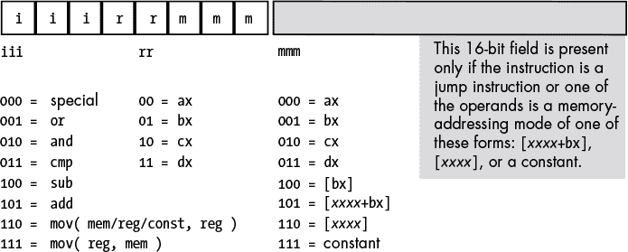

*图 10-3：基本 Y86 指令编码*

基本指令长度为 1 或 3 字节，其操作码由一个字节组成，该字节包含三个字段。第一个字段由高位 3 比特组成，用于定义指令，这 3 比特提供了八种可能的组合。由于有 18 条不同的 Y86 指令，我们需要采取一些方法来处理剩余的 10 条指令。

##### 10.3.4.1 八条通用 Y86 指令

如图 10-3 所示，八个基本操作码中的七个用于编码 `or`、`and`、`cmp`、`sub` 和 `add` 指令，以及两种版本的 `mov` 指令。第八个 `000` 是 *扩展操作码*。这个特殊的指令类别，我们稍后会讨论，它提供了一种机制，允许我们扩展可用指令集。

要确定特定指令的完整操作码，你只需选择适当的`iii`、`rr`和`mmm`字段的位（见图 10-3）。`rr`字段包含目标寄存器（除了`mov`指令的版本，其`iii`字段为`111`），`mmm`字段编码源寄存器。例如，要编码`mov(bx, ax);`指令，你需要选择`iii` = `110`（`mov(`reg`,` reg`);`），`rr` = `00`（`ax`），`mmm` = `001`（`bx`）。这将生成 1 字节的指令`%11000001`，即`$c0`。

一些 Y86 指令的大小大于 1 字节。为了说明为什么需要这种方式，举个例子，考虑`mov([1000], ax);`指令，它将存储在内存位置`$1000`的值加载到 AX 寄存器中。该操作码的编码是`%11000110`，即`$c6`。然而，`mov([2000], ax);`指令的编码也是`$c6`。显然，这两条指令执行的操作不同：一条将 AX 寄存器从内存位置`$1000`加载，而另一条则从内存位置`$2000`加载 AX 寄存器。

为了区分使用[xxxx]或[xxxx`+bx`]寻址模式编码地址的指令，或使用立即寻址模式编码常数的指令，你必须将 16 位地址或常数附加到指令的操作码中。在这个 16 位地址或常数中，LO 字节在内存中紧随操作码，HO 字节则紧跟 LO 字节。因此，`mov([1000], ax);`的 3 字节编码为`$c6`、`$00`、`$10`，而`mov([2000], ax);`的 3 字节编码为`$c6`、`$00`、`$20`。

##### 10.3.4.2 特殊扩展操作码

图 10-3 中的特殊操作码使 Y86 CPU 能够扩展可通过单字节编码的指令集。该操作码处理多个零操作数和单操作数指令，如图 10-4 和图 10-5 所示。

图 10-4 展示了四种单操作数指令类的编码。`rr`字段的前 2 位编码`%00`进一步扩展了指令集，通过提供一种编码零操作数指令的方法，如图 10-5 所示。这些指令中有五条是非法操作码；三条合法操作码是`halt`指令，用于终止程序执行；`get`指令，用于从用户读取十六进制值并存储到 AX 寄存器中；以及`put`指令，用于输出 AX 寄存器中的值。

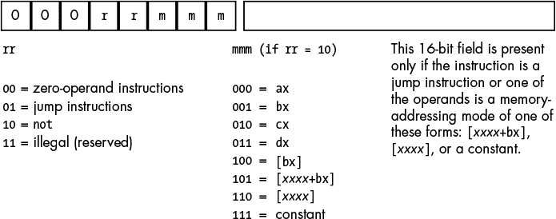

*图 10-4：单操作数指令编码（`iii = %000`）*


*图 10-5：零操作数指令编码（`iii = %000`和`rr = %00`）*

`rr` 字段的第二个 2 位编码 `%01` 也是一个扩展操作码的一部分，提供了所有 Y86 跳转指令（参见 图 10-6）。第三个 `rr` 字段编码 `%10` 用于 `not` 指令。第四个 `rr` 字段编码目前尚未分配。任何试图执行 `iii` 字段编码为 `%000` 且 `rr` 字段编码为 `%11` 的操作码的操作都会导致处理器因非法指令错误而停止。正如前面所讨论的，CPU 设计师通常会保留未分配的操作码，以便未来扩展指令集（如英特尔在从 80286 处理器过渡到 80386 或从 32 位 x86 处理器过渡到 64 位 x86-64 处理器时所做的那样）。

Y86 指令集中的七个跳转指令都采用 `j`xx 地址`;` 的形式。`jmp` 指令将跟随操作码后的 16 位地址值复制到指令指针寄存器中，导致 CPU 从 `jmp` 的目标地址获取下一条指令。其余六条指令—`ja`、`jae`、`jb`、`jbe`、`je` 和 `jne`—会测试某个条件，如果条件为 `true`，则将地址值复制到指令指针寄存器中。第八个操作码 `%00001111` 是另一个非法操作码。这些编码显示在 图 10-6 中。


*图 10-6：跳转指令编码*

#### *10.3.5 编码 Y86 指令的示例*

Y86 处理器并不像人类可读的字符串（例如 `mov(ax, bx);`）那样执行指令。相反，它从内存中获取指令的位模式，例如 `$c1`，然后解码并执行这些位模式。像 `mov(ax,` `bx);` 和 `add(5,` `cx);` 这样的可读指令必须首先转换为二进制表示，或 *机器码*。本节将探讨这种转换。

##### 10.3.5.1 add 指令

我们将从一个非常简单的例子开始转换，即 `add(cx,` `dx);` 指令。一旦选择了指令，就可以在前一节的操作码图中查找该指令。`add` 指令位于第一组（参见 图 10-3），其 `iii` 字段为 `%101`。源操作数是 `cx`，因此 `mmm` 字段为 `%010`。目标操作数是 `dx`，所以 `rr` 字段为 `%11`。将这些位合并产生操作码 `%10111010`，即 `$ba`（参见 图 10-7）。

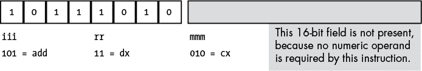

*图 10-7：编码 `add(` `cx,` `dx` `);` 指令*

现在考虑`add(5, ax)`指令。由于它有一个立即数源操作数（常数），`mmm`字段将是`%111`（见图 10-3）。目标寄存器操作数是`ax`（`%00`），指令类字段是`%101`，所以完整的操作码为`%10100111`，即`$a7`。然而，我们还没有完成。我们还必须将 16 位常数`$0005`作为指令的一部分，常数的低字节紧随操作码之后，高字节紧随低字节之后，因为字节是以小端字节序排列的。因此，内存中的字节序列从最低地址到最高地址是`$a7,` `$05,` `$00`（见图 10-8）。

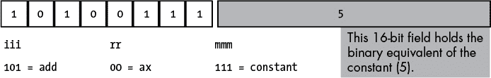

*图 10-8：编码`add(` `5,` `ax` `);`指令*

`add([2ff+bx],` `cx)`指令还包含一个 16 位常数，它是索引寻址模式中的位移部分。为了编码这条指令，我们使用以下字段值：`iii` = `%101`，`rr` = `%10`，`mmm` = `%101`。这产生了操作码字节`%10110101`，即`$b5`。完整的指令还需要常数`$2ff`，因此完整的指令是 3 字节序列`$b5,` `$ff,` `$02`（见图 10-9）。


*图 10-9：编码`add(` `[$2ff+bx],` `cx` `);`指令*

现在考虑`add([1000],` `ax)`。该指令将内存位置`$1000`和`$1001`中的 16 位内容加到 AX 寄存器中的值上。再次强调，`iii` = `%101`用于`add`指令。目标寄存器是`ax`，因此`rr` = `%00`。最后，寻址模式是仅位移寻址模式，因此`mmm` = `%110`。这就形成了操作码`%10100110`，即`$a6`。完整的指令长度为 3 个字节，因为它还必须在操作码后的 2 个字节中编码内存位置的位移（地址）。因此，完整的 3 字节序列是`$a6,` `$00,` `$10`（见图 10-10）。

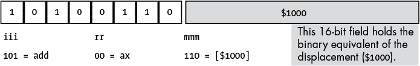

*图 10-10：编码`add(` `[1000],` `ax` `);`指令*

最后需要考虑的寻址模式是寄存器间接寻址模式`[bx]`。`add([bx],bx)`指令使用以下编码值：`mmm` = `%101`，`rr` = `%01`（`bx`），`mmm` = `%100`（`[bx]`）。由于 BX 寄存器中的值完全指定了内存地址，因此无需为指令编码附加位移字段。因此，该指令仅为 1 个字节长（见图 10-11）。

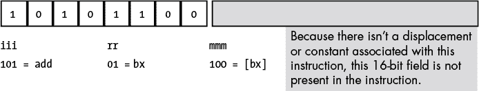

*图 10-11：编码`add([bx],` `bx);`指令*

你使用类似的方法来编码`sub`、`cmp`、`and`和`or`指令。编码这些指令与`add`指令之间唯一的区别在于你在操作码中的`iii`字段使用的值。

##### 10.3.5.2 mov 指令

Y86 的 `mov` 指令是特别的，因为它有两种形式。`add` 指令的编码和 `mov` 指令第一种形式的编码（`iii` = `%110`）之间的唯一区别是 `iii` 字段。这种形式的 `mov` 将常量或由 `mmm` 字段指定的寄存器或内存地址的数据复制到由 `rr` 字段指定的目标寄存器。

第二种形式的 `mov` 指令（`iii` = `%111`）将数据从 `rr` 字段指定的源寄存器复制到 `mmm` 字段指定的目标内存位置。在这种形式的 `mov` 指令中，`rr` 和 `mmm` 字段的源和目标含义是颠倒的：`rr` 是源字段，`mmm` 是目标字段。另一种区别是，在第二种形式的 `mov` 指令中，`mmm` 字段只能包含 `%100` (`[bx]`)、`%101` (`[disp+bx]`) 和 `%110` (`[disp]`) 这些值。目标值不能是 `mmm` 字段在 `%000` 到 `%011` 范围内编码的任何寄存器，或者是由 `mmm` 字段为 `%111` 编码的常量。这些编码是非法的，因为 `mov` 的第一种形式处理的是寄存器目标的情况，而且将数据存储到常量中没有任何意义。

##### 10.3.5.3 not 指令

`not` 指令是 Y86 处理器支持的唯一具有单一内存/寄存器操作数的指令。它的语法如下：

```
not(reg);
```

或者：

```
not(address);
```

其中，地址表示一种内存寻址模式（`[bx]`、`[disp+bx]` 或 `[disp]`）。你不能为 `not` 指令指定常量操作数。

因为 `not` 只有一个操作数，所以它只需要 `mmm` 字段来编码该操作数。`iii` 字段为 `%000` 和 `rr` 字段为 `%10` 可以标识 `not` 指令。实际上，只要 `iii` 字段包含 `0`，CPU 就知道它必须解码超出 `iii` 字段的位来识别指令。在这种情况下，`rr` 字段指定我们编码的是 `not` 还是其他一些特殊编码的指令。

要编码类似 `not(ax)` 的指令，指定 `iii` 字段为 `%000`，`rr` 字段为 `%10`，然后按照 `add` 指令的编码方式编码 `mmm` 字段。因为 `mmm` *= `%000` 对应于 AX，`not(ax)` 将被编码为 `%00010000`，即 `$10`（参见 图 10-12）。*

*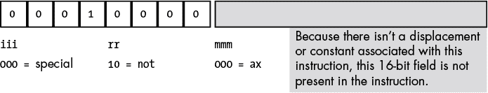

*图 10-12: 编码 `not(AX);` 指令*

`not` 指令不允许立即数或常量操作数，因此操作码 `%00010111` (`$17`) 是非法的操作码。

##### 10.3.5.4 跳转指令

Y86 跳转指令也使用特殊编码，这意味着跳转指令的`iii`字段总是`%000`。这些指令总是 3 字节长。第一个字节是操作码，指定要执行的跳转指令，接下来的 2 个字节指定内存中 CPU 要跳转到的地址（如果条件满足，针对条件跳转的情况）。Y86 有七种不同的跳转指令，六种条件跳转和一种无条件跳转`jmp`。这七种指令都将`iii` = `%000`和`rr` = `%01`，因此它们仅在`mmm`字段上有所不同。第八个可能的操作码，`mmm`字段值为`%111`，是非法操作码（见图 10-6）。

编码这些指令相对简单。选择你要编码的指令就能完全确定操作码。操作码的值范围是`$08`到`$0e`（`$0f`是非法操作码）。

唯一需要考虑的字段是操作码后面的 16 位操作数。这个字段保存目标指令的地址，目标指令是无条件跳转总是跳转到的指令，也是条件跳转在条件为`true`时跳转到的指令。要正确编码这个 16 位操作数，你必须知道目标指令操作码字节的地址。如果你已经将目标指令转换成二进制形式并存储到内存中，那么就不成问题——只需将目标指令的地址指定为跳转指令的唯一操作数。另一方面，如果你还没有编写、转换并将目标指令放入内存，那么知道它的地址似乎需要一些预言的技巧。幸运的是，你可以通过计算当前跳转指令和目标指令之间所有指令的长度来弄清楚——但不幸的是，这是一个艰巨的任务。

计算距离的最佳方法是将所有指令写在纸上，计算它们的长度（这很容易，因为所有指令要么是 1 字节，要么是 3 字节，具体取决于是否有 16 位操作数），然后为每条指令分配一个合适的地址。完成后，你就知道每条指令的起始地址，并且可以在编码时将目标地址操作数放入你的跳转指令中。

##### 10.3.5.5 零操作数指令

剩余的指令，即零操作数指令，是最容易编码的。因为它们没有操作数，所以它们总是 1 字节长。这些指令总是具有`iii` = `%000`和`rr` = `%00`，而`mmm`指定特定的指令操作码（见图 10-5）。注意，Y86 CPU 将五个这样的指令未定义（因此我们可以将这些操作码用于未来的扩展）。

#### *10.3.6 扩展 Y86 指令集*

Y86 CPU 是一个简单的 CPU，仅适合用于演示如何编码机器指令。然而，和任何优秀的 CPU 一样，Y86 设计允许通过添加新指令来进行扩展。

你可以通过使用未定义或非法操作码来扩展 CPU 的指令集。因此，由于 Y86 CPU 有几个非法和未定义的操作码，我们将利用它们来扩展指令集。

使用未定义操作码来定义新指令最有效的方法是，当操作码组内有未定义的位模式，并且你想要添加的新指令属于同一组时。例如，操作码`%00011`mmm 属于与`not`指令相同的组，`not`指令的`iii`字段值也是`%000`。如果你决定确实需要一个`neg`（取反）指令，使用`%00011`mmm 操作码是合理的，因为你可能希望`neg`指令使用与`not`指令相同的语法。同样，如果你想向指令集中添加一个零操作数指令，Y86 提供了五个未定义的零操作数指令供你选择（`%0000000..%00000100`；见图 10-5）。你只需占用其中一个操作码，并将你的指令分配给它。

不幸的是，Y86 CPU 没有很多非法操作码可用。例如，如果你想添加`shl`（左移）、`shr`（右移）、`rol`（左旋转）和`ror`（右旋转）指令作为单操作数指令，那么单操作数指令操作码组内没有足够的空间（目前只有`%00011`mmm 是开放的）。同样，也没有开放的双操作数操作码，因此如果你想添加`xor`（异或）指令或其他双操作数指令，你将会遇到困难。

处理这种困境的一种常见方法，也是英特尔设计师采用的方法，是使用未定义的操作码作为前缀操作码字节。例如，操作码`$ff`是非法的（它对应于`mov(dx,`常量`)`指令），但我们可以将其用作特殊前缀字节，进一步扩展指令集（见图 10-13）。^(4)

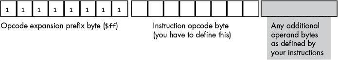

*图 10-13：使用前缀字节扩展指令集*

每当 CPU 在内存中遇到前缀字节时，它会读取并解码内存中的下一个字节作为实际的操作码。然而，它不会像处理没有前缀字节的标准操作码那样处理第二个字节。相反，它允许 CPU 设计师创建一个完全新的操作码方案，独立于原始指令集。单字节扩展操作码允许 CPU 设计师将最多 256 条指令添加到指令集中。为了增加更多的指令，设计师可以使用原始指令集中未使用的非法操作码字节来添加更多的扩展操作码，每个扩展操作码都有自己独立的指令集；或者他们可以在操作码扩展前缀字节后添加一个 2 字节的操作码（最多增加 65,536 条新指令）；或者他们可以执行任何他们能想到的其他方案。

当然，这种方法的一个重大缺点是它将新指令的大小增加了 1 字节，因为每条指令现在都需要将前缀字节作为操作码的一部分。这也增加了电路的成本（因为解码前缀字节和多重指令集相对复杂），所以你不希望对基本指令集使用这种方案。尽管如此，当操作码用尽时，这是一种扩展指令集的好方法。

### 10.4 编码 80x86 指令

Y86 处理器易于理解；我们可以轻松地手动为其编码指令，它是学习如何分配操作码的绝佳工具。它也是一个完全假设的设备，仅作为教学工具。因此，是时候看一看真实 CPU 的机器指令格式了：80x86。毕竟，你编写的程序将在真实的 CPU 上运行，因此，为了充分理解编译器如何处理你的代码——以便在编写代码时选择最佳的语句和数据结构——你需要理解真实指令是如何编码的。

即使你使用的是不同的 CPU，研究 80x86 指令编码仍然很有帮助。他们之所以称 80x86 为*复杂*指令集计算机（CISC）芯片，绝非没有理由。虽然确实存在更复杂的指令编码，但没有人会挑战它是目前常用的更复杂的指令集之一的说法。因此，探索它将为理解其他现实世界 CPU 的运行提供宝贵的见解。

通用 80x86 32 位指令的形式如图 10-14 所示。^(5)

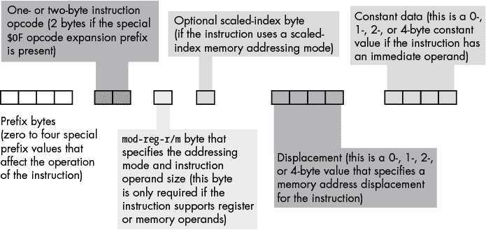

*图 10-14：80x86 32 位指令编码*

**注意**

*尽管这个图表似乎暗示指令的最大长度可以达到 16 字节，但实际上 15 字节才是上限。*

前缀字节不同于我们在上一节讨论的操作码扩展前缀字节。相反，80x86 前缀字节修改现有指令的行为。每条指令最多可以附加四个前缀字节，但 80x86 支持超过四个不同的前缀值。许多前缀字节的行为是互斥的，如果你在指令前添加一对互斥的前缀字节，指令的结果将是未定义的。稍后我们将看一下这些前缀字节中的几个。

（32 位）80x86 支持两种基本的操作码大小：标准的 1 字节操作码和由`$0f`操作码扩展前缀字节和第二个字节组成的 2 字节操作码，后者指定实际的指令。可以将这个操作码扩展前缀字节视为 Y86 编码中`iii`字段的 8 位扩展。这使得能够编码最多 512 种不同的指令类别，尽管 80x86 并没有全部使用它们。实际上，许多指令类别使用此操作码扩展前缀字节中的某些位，用于明确与指令类别无关的用途。例如，考虑一下图 10-15 中显示的`add`指令操作码。

位 1（`d`）指定传输的方向。如果该位为`0`，则目标操作数是一个内存位置，例如`add(al,` `[ebx]);`。如果该位为`1`，则目标操作数是一个寄存器，如`add([ebx],` `al);`。

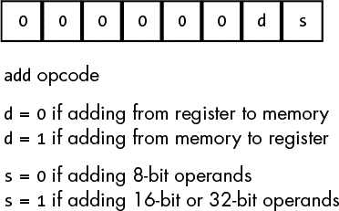

*图 10-15：80x86 `add`操作码*

位 0（`s`）指定`add`指令操作的操作数的大小。然而，这里有个问题。32 位 80x86 家族支持最多三种不同的操作数大小：8 位操作数、16 位操作数和 32 位操作数。通过一个大小位，指令只能编码这三种大小中的两种。在 32 位操作系统中，绝大多数操作数是 8 位或 32 位的，因此 80x86 CPU 使用操作码中的大小位来编码这些大小。对于 16 位操作数，它们的出现频率低于 8 位或 32 位操作数，Intel 使用一个特殊的操作码前缀字节来指定大小。只要 16 位操作数的指令出现频率低于每八条指令中的一条（这通常是情况），这种方式比在指令大小中添加另一个位更为紧凑。使用大小前缀字节使得 Intel 的设计者能够扩展操作数的大小数量，而无需改变来自原始 16 位处理器的指令编码。

请注意，AMD/Intel 的 64 位架构在操作码前缀字节上更为复杂。然而，CPU 在特殊的 64 位模式下运行；实际上，64 位 80x86 CPU（通常称为 *X86-64 CPUs*）具有两种完全不同的指令集，每种指令集有自己的编码。X86-64 CPU 可以在 64 位和 32 位模式之间切换，以处理使用不同指令集编写的程序。本章中的编码覆盖的是 32 位变体；有关 64 位版本的详细信息，请参阅 Intel 或 AMD 文档。

#### *10.4.1 编码指令操作数*

`mod-reg-r/m` 字节（见 图 10-14）通过指定用于访问操作数的基本寻址模式及其大小，提供了指令操作数的编码。这个字节包含了在 图 10-16 中展示的字段。

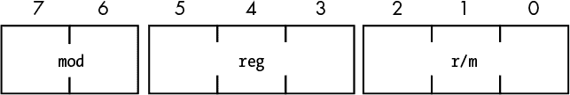

*图 10-16：`mod-reg-r/m` 字节*

`reg` 字段几乎总是指定一个 80x86 寄存器。然而，根据指令的不同，`reg` 指定的寄存器可以是源操作数也可以是目标操作数。为了区分这两者，许多指令的上码包含了 `d`（方向）字段，当 `reg` 是源操作数时，`d` 的值为 `0`，当 `reg` 是目标操作数时，`d` 的值为 `1`。

该字段使用在 表 10-1 中找到的 3 位寄存器编码。如前所述，指令操作码中的大小位指示 `reg` 字段是指定 8 位还是 32 位寄存器（当在现代 32 位操作系统下运行时）。为了使 `reg` 字段指定一个 16 位寄存器，你必须将操作码中的大小位设置为 `1`，并且添加一个额外的前缀字节。

**表 10-1：** `reg` 字段编码

| **reg 值** | **数据大小为 8 位时的寄存器** | **数据大小为 16 位时的寄存器** | **数据大小为 32 位时的寄存器** |
| --- | --- | --- | --- |
| `%000` | `al` | `ax` | `eax` |
| `%001` | `cl` | `cx` | `ecx` |
| `%010` | `dl` | `dx` | `edx` |
| `%011` | `bl` | `bx` | `ebx` |
| `%100` | `ah` | `sp` | `esp` |
| `%101` | `ch` | `bp` | `ebp` |
| `%110` | `dh` | `si` | `esi` |
| `%111` | `bh` | `di` | `edi` |

在双操作数指令的操作码中，`d` 位指示 `reg` 字段是包含源操作数还是目标操作数，`mod` 和 `r/m` 字段一起指定另一个操作数。在像 `not` 或 `neg` 这样的单操作数指令中，`reg` 字段包含操作码扩展，`mod` 和 `r/m` 字段组合在一起指定唯一的操作数。`mod` 和 `r/m` 字段指定的操作数寻址模式列在 表 10-2 和 10-3 中。

**表 10-2：** `mod` 字段编码

| mod | **描述** |
| --- | --- |
| `%00` | 指定寄存器间接寻址模式（有两个例外：当 `r/m = %100` 时，没有位移操作数的缩放索引[`sib`]寻址模式；当 `r/m = %101` 时，仅为位移的寻址模式）。 |
| `%01` | 指定后续有一个 1 字节的有符号位移紧跟在寻址模式字节之后。 |
| `%10` | 指定后续有一个 1 字节的有符号位移紧跟在寻址模式字节之后。 |
| `%11` | 指定直接寄存器访问。 |

**表 10-3：** `mod-r/m` 编码

| mod | r/m | **寻址模式** |
| --- | --- | --- |
| `%00` | `%000` | `[eax]` |
| `%01` | `%000` | `[eax+`disp[8]`]` |
| `%10` | `%000` | `[eax+`disp[32]`]` |
| `%11` | `%000` | `al`、`ax` 或 `eax` |
| `%00` | `%001` | `[ecx]` |
| `%01` | `%001` | `[ecx+`disp[8]`]` |
| `%10` | `%001` | `[ecx+`disp[32]`]` |
| `%11` | `%001` | `cl`、`cx` 或 `ecx` |
| `%00` | `%010` | `[edx]` |
| `%01` | `%010` | `[edx+`disp[8]`]` |
| `%10` | `%010` | `[edx+`disp[32]`]` |
| `%11` | `%010` | `dl`、`dx` 或 `edx` |
| `%00` | `%011` | `[ebx]` |
| `%01` | `%011` | `[ebx+`disp[8]`]` |
| `%10` | `%011` | `[ebx+`disp[32]`]` |
| `%11` | `%011` | `bl`、`bx` 或 `ebx` |
| `%00` | `%100` | 扩展索引（`sib`）模式 |
| `%01` | `%100` | `sib` + disp[8] 模式 |
| `%10` | `%100` | `sib` + disp[32] 模式 |
| `%11` | `%100` | `ah`、`sp` 或 `esp` |
| `%00` | `%101` | 仅位移模式（32 位位移） |
| `%01` | `%101` | `[ebp+`disp[8]`]` |
| `%10` | `%101` | `[ebp+`disp[32]`]` |
| `%11` | `%101` | `ch`、`bp` 或 `ebp` |
| `%00` | `%110` | `[esi]` |
| `%01` | `%110` | `[esi+`disp[8]`]` |
| `%10` | `%110` | `[esi+`disp[32]`]` |
| `%11` | `%110` | `dh`、`si` 或 `esi` |
| `%00` | `%111` | `[edi]` |
| `%01` | `%111` | `[edi+`disp[8]`]` |
| `%10` | `%111` | `[edi+`disp[32]`]` |
| `%11` | `%111` | `bh`、`di` 或 `edi` |

关于 表 10-2 和 10-3 有几个有趣的地方需要注意。首先，`[reg+disp]` 寻址模式有两种不同的形式：一种形式使用 8 位位移，另一种形式使用 32 位位移。位移范围在 -128 到 +127 之间的寻址模式，仅需要在操作码后面添加一个字节来编码位移。位移值位于此范围内的指令比位移值超出此范围并需要 4 字节编码的指令通常更短且有时更快。 

第二点需要注意的是，**[ebp]** 寄存器寻址模式并不存在。如果你查看 表 10-3 中这个寻址模式应当属于的位置（即 `r/m` 为 `%101` 且 `mod` 为 `%00`），你会发现该位置被 32 位位移仅寻址模式所占用。寻址模式的基本编码方案并不允许仅使用位移的寻址模式，因此英特尔“偷用了”`[ebp]`的编码，并将其用于仅位移寻址模式。幸运的是，使用`[ebp]`寻址模式时，你可以通过将 8 位位移设置为 `0`，改用 `[ebp+disp[8]]` 寻址模式来完成相同的操作。尽管这样的指令比实际存在`[ebp]`寻址模式时会稍微长一些，但其功能是一样的。英特尔明智地选择用这种方式替代特定的寄存器间接寻址模式，预见到程序员使用它的频率会比其他寄存器间接寻址模式要少。

你还会发现表格中缺少了以下几种寻址模式：`[esp]`、`[esp+disp[8]]` 和 `[esp+disp[32]]`。英特尔的设计师借用了这三种寻址模式的编码，以支持它们在 80x86 系列的 32 位处理器中添加的 *缩放索引寻址* 模式。

如果 `r/m` = `%100` 且 `mod` = `%00`，这表示一种寻址模式，形式为 `[reg[1]32+reg[2]32*n]`。这种缩放索引寻址模式通过将 `reg[2]` 乘以 n（n = `1`、`2`、`4` 或 `8`），再加上 `reg[1]`，来计算内存中的最终地址。程序通常在 `reg[1]` 是指向字节数组（n = `1`）、字数组（n = `2`）、双字数组（n = `4`）或四字数组（n = `8`）的基地址的指针时使用此寻址模式，`reg[2]` 存储该数组的索引。

如果 `r/m` = `%100` 且 `mod` = `%01`，这表示一种寻址模式，形式为 `[reg[1]32+reg[2]32*n+disp[8]]`。这种缩放索引寻址模式通过将 `reg[2]` 乘以 n（n = `1`、`2`、`4` 或 `8`），再加上 `reg[1]` 和 8 位符号位移（符号扩展至 32 位），来计算内存中的最终地址。程序通常在 `reg[1]` 是指向记录数组基地址的指针时使用此寻址模式，`reg[2]` 存储该数组的索引，`disp[8]` 提供指向记录中所需字段的偏移量。

如果 `r/m` = `%100` 且 `mod` = `%10`，这表示一种寻址模式，形式为 `[reg[1]32+reg[2]32*n+disp[32]]`。这种缩放索引寻址模式通过将 `reg[2]` 乘以 n（n = `1`、`2`、`4` 或 `8`），再加上 `reg[1]` 和 32 位符号位移，来计算内存中的最终地址。程序通常在对字节、字、双字或四字的静态数组进行索引时使用此寻址模式。

如果 `sib` 模式的某个值出现在 `mod` 和 `r/m` 字段中，那么寻址模式就是一个缩放索引寻址模式，并且在 `mod-reg-r/m` 字节之后会有一个第二个字节（即 `sib`）。不过，不要忘记，`mod` 字段仍然指定了 0、1 或 4 字节的位移大小。图 10-17 显示了这个额外的 `sib` 的布局，表 10-4、表 10-5 和 表 10-6 解释了每个 `sib` 字段的值。

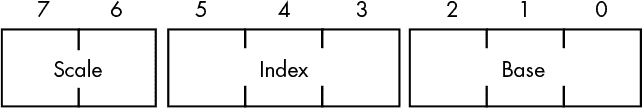

*图 10-17：`sib`（缩放索引字节）布局*

**表 10-4：** 缩放值

| **缩放值** | **索引 * 缩放值** |
| --- | --- |
| `%00` | 索引 * 1 |
| `%01` | 索引 * 2 |
| `%10` | 索引 * 4 |
| `%11` | 索引 * 8 |

**表 10-5：** `sib` 编码的寄存器值

| **索引值** | **寄存器** |
| --- | --- |
| `%000` | EAX |
| `%001` | ECX |
| `%010` | EDX |
| `%011` | EBX |
| `%100` | 非法 |
| `%101` | EBP |
| `%110` | ESI |
| `%111` | EDI |

**表 10-6：** `sib` 编码的基址寄存器值

| **基址值** | **寄存器** |
| --- | --- |
| `%000` | EAX |
| `%001` | ECX |
| `%010` | EDX |
| `%011` | EBX |
| `%100` | ESP |
| `%101` | 仅在 `mod` = `%00` 时为位移，如果 `mod` = `%01` 或 `%10` 则为 EBP |
| `%110` | ESI |
| `%111` | EDI |

`mod-reg-r/m` 和 `sib` 字节是复杂且难以理解的，毫无疑问。原因在于英特尔在转换为 32 位格式时，重用了其 16 位寻址电路，而不是直接放弃它。在那个时候保留它是有合理的硬件原因的，但结果就是指定寻址模式的方案变得非常复杂。正如你可以想象的那样，当英特尔和 AMD 开发出 x86-64 架构时，情况变得更加糟糕。

请注意，如果 `mod-reg-r/m` 字节的 `r/m` 字段包含 `%100`，并且 `mod` 字段不包含 `%11`，那么寻址模式是 `sib` 模式，而不是预期的 `[esp]`、`[esp+disp[8]]` 或 `[esp+disp[32]]` 模式。在这种情况下，编译器或汇编器会在 `mod-reg-r/m` 字节之后立即生成一个额外的 `sib` 字节。表 10-7 列出了 80x86 上合法的缩放索引寻址模式的各种组合。

在表 10-7 中列出的每种寻址模式下，`mod-reg-r/m` 字节的 `mod` 字段指定位移的大小（0、1 或 4 字节）。`sib` 字段中的基址和索引字段分别指定基址寄存器和索引寄存器。请注意，该寻址模式不允许使用 ESP 作为索引寄存器。推测英特尔之所以将这一特定模式设为未定义，是为了允许将寻址模式扩展到 3 字节，以便在未来版本的 CPU 中使用，尽管这样做看起来有点极端。

就像 `mod-reg-r/m` 编码用位移寻址模式替换了 `[ebp]` 寻址模式一样，`sib` 寻址格式用位移加索引模式（即没有基址寄存器）替换了 `[ebp+`index`*`scale`]` 模式。如果你确实需要使用 `[ebp+`index`*`scale`]` 寻址模式，你需要改用 `[`disp[`8`]`+ebp+`index`*`scale`]` 模式，并指定一个值为 `0` 的 1 字节位移。

**表 10-7：比例索引寻址模式**

| mod | **索引** | **合法的比例索引寻址模式^(6)** |
| --- | --- | --- |
| `%00`Base ° `%101` | `%000` | `[`base[`32`]`+eax*`n`]` |
| `%001` | `[`base[`32`]`+ecx*`n`]` |
| `%010` | `[`base[`32`]`+edx*`n`]` |
| `%011` | `[`base[`32`]`+ebx*`n`]` |
| `%100` | n/a^(7) |
| `%101` | `[`base[`32`]`+ebp*`n`]` |
| `%110` | `[`base[`32`]`+esi*`n`]` |
| `%111` | `[`base[`32`]`+edi*`n`]` |
| `%00`Base = `%101`^(8) | `%000` | `[`disp[`32`]`+eax*`n`]` |
| `%001` | `[`disp[`32`]`+ecx*`n`]` |
| `%010` | `[`disp[`32`]`+edx*`n`]` |
| `%011` | `[`disp[`32`]`+ebx*`n`]` |
| `%100` | n/a |
| `%101` | `[`disp[`32`]`+ebp*`n`]` |
| `%110` | `[`disp[`32`]`+esi*`n`]` |
| `%111` | `[`disp[`32`]`+edi*`n`]` |
| `%01` | `%000` | `[`disp[`8`]`+`base[`32`]`+eax*`n`]` |
| `%001` | `[`disp[`8`]`+`base[`32`]`+ecx*`n`]` |
| `%010` | `[`disp[`8`]`+`base[`32`]`+edx*`n`]` |
| `%011` | `[`disp[`8`]`+`base[`32`]`+ebx*`n`]` |
| `%100` | n/a |
| `%101` | `[`disp[`8`]`+`base[`32`]`+ebp*`n`]` |
| `%110` | `[`disp[`8`]`+`base[`32`]`+esi*`n`]` |
| `%111` | `[`disp[`8`]`+`base[`32`]`+edi*`n`]` |
| `%10` | `%000` | `[`disp[`32`]`+`base[`32`]`+eax*`n`]` |
| `%001` | `[`disp[`32`]`+`base[`32`]`+ecx*`n`]` |
| `%010` | `[`disp[`32`]`+`base[`32`]`+edx*`n`]` |
| `%011` | `[`disp[`32`]`+`base[`32`]`+ebx*`n`]` |
| `%100` | n/a |
| `%101` | `[`disp[`32`]`+`base[`32`]`+ebp*`n`]` |
| `%110` | `[`disp[`32`]`+`base[`32`]`+esi*`n`]` |
| `%111` | `[`disp[`32`]`+`base[`32`]`+edi*`n`]` |

#### *10.4.2 编码 add 指令*

为了帮助你弄清楚如何使用这个复杂的方案来编码指令，我们来看一个使用各种寻址模式的 80x86 `add` 指令示例。`add` 操作码根据其方向和大小位可以是 `$00`、`$01`、`$02` 或 `$03`（见 图 10-15）。图 10-18 到 10-25 展示了如何使用不同的寻址模式编码 `add` 指令的各种形式。


*图 10-18：编码 `add(al,` `cl);` 指令*

`mod-reg-r/m` 组织和方向位有一个有趣的副作用：一些指令有两种合法的操作码。例如，我们也可以通过反转 `reg` 和 `r/m` 字段中 AL 和 CL 寄存器的位置，并将操作码中的 `d` 位（第 1 位）设置为 `1`，将 `add(al,` `cl);` 指令（如 图 10-18 所示）编码为 `$02,` `$c8`。这适用于所有具有两个寄存器操作数和方向位的指令，例如 图 10-19 中的 `add(eax,` `ecx);` 指令，它也可以编码为 `$03,` `$c8`。

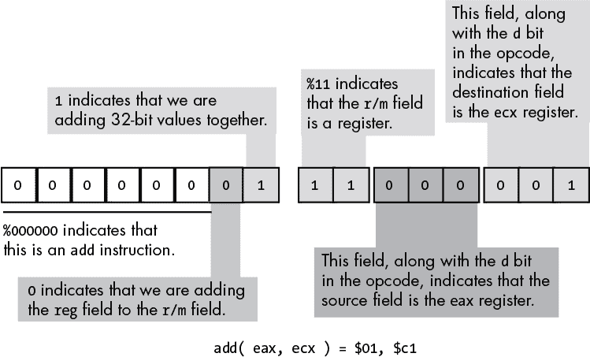

*图 10-19：编码 `add(eax,` `ecx);` 指令*

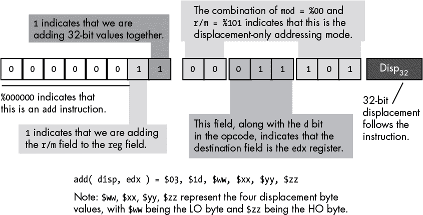

*图 10-20：编码 `add(disp,` `edx);` 指令*

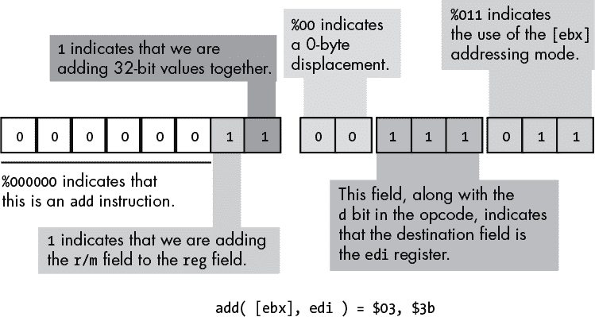

*图 10-21：编码 `add([ebx],` `edi);` 指令*

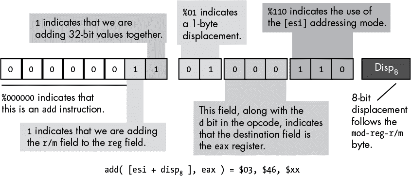

*图 10-22：编码 `add([esi+disp``[8]``],` `eax);` 指令*

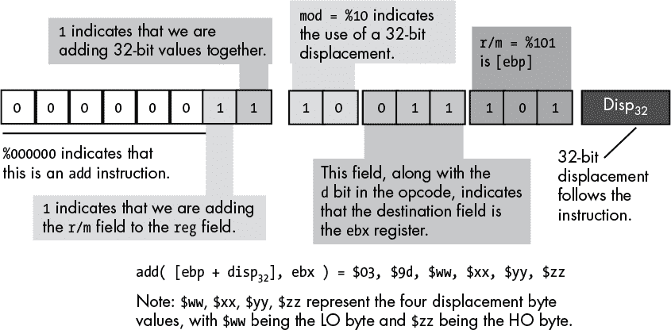

*图 10-23：编码 `add([ebp+disp``[32]``],` `ebx);` 指令*

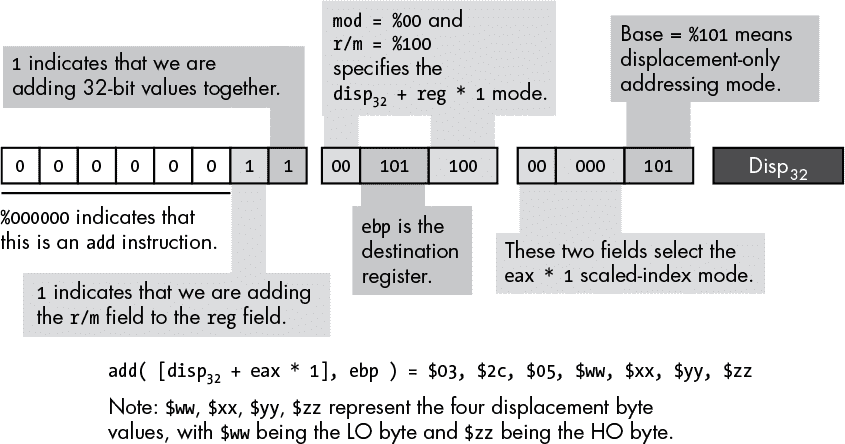

*图 10-24：编码 `add([disp``[32]``+eax*1],` `ebp);` 指令*

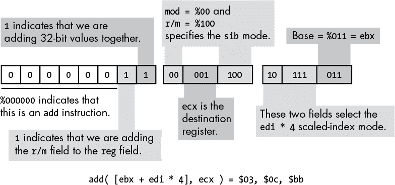

*图 10-25：编码 `add([ebx+edi*4],` `ecx);` 指令*

#### *10.4.3 在 x86 上编码立即数（常量）操作数*

你可能已经注意到，`mod-reg-r/m` 和 `sib` 字节不包含任何可以用来指定指令包含立即操作数的位组合。80x86 使用完全不同的操作码来指定立即操作数。图 10-26 显示了 `add` 立即数指令的基本编码。

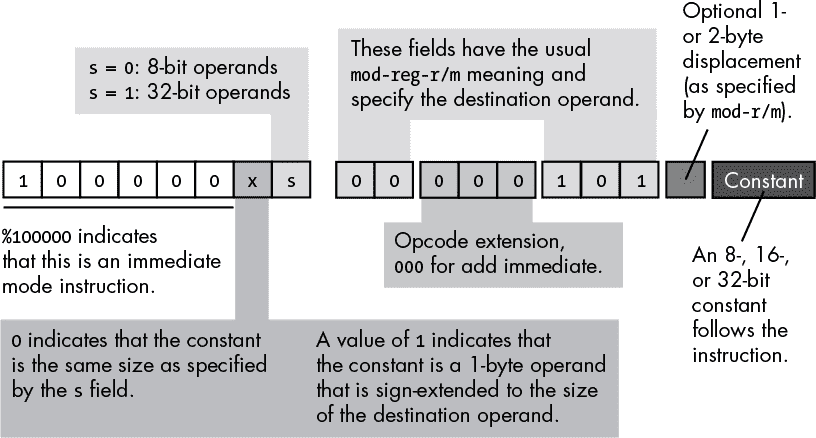

*图 10-26：编码 `add` 立即数指令*

`add` 立即数指令和标准 `add` 指令的编码有三个主要区别。首先，也是最重要的，操作码在 HO 位上有一个 `1`。这告诉 CPU 指令包含一个立即常数。然而，仅凭这一变化，并不能告诉 CPU 必须执行 `add` 指令，正如你稍后将看到的那样。

第二个区别是操作码中没有方向位。这是有道理的，因为你不能将常量指定为目标操作数。因此，目标操作数总是由 `mod-reg-r/m` 字段中的 `mod` 和 `r/m` 位指定的位置。

在方向位的位置，操作码有一个符号扩展（`x`）位。对于 8 位操作数，CPU 忽略符号扩展位。对于 16 位和 32 位操作数，符号扩展位指定了 `add` 指令后常数的大小。如果符号扩展位为 `0`，则常数已经与操作数的大小相同（16 或 32 位）。如果符号扩展位为 `1`，则常数为带符号 8 位值，CPU 会在将其加到操作数之前对该值进行符号扩展，扩展到适当的大小。这个小技巧通常会让程序变得更短，因为你常常会将小常数加到 16 位或 32 位的目标操作数中。

`add` 立即数指令和标准 `add` 指令的第三个区别是 `mod-reg-r/m` 字节中 `reg` 字段的含义。由于该指令意味着源操作数是常数，而 `mod-r/m` 字段指定了目标操作数，因此指令无需使用 `reg` 字段来指定操作数。相反，80x86 CPU 使用这 3 位作为操作码扩展。对于 `add` 立即数指令，这 3 位必须为 `0`，而其他位模式则对应于不同的指令。

当常数被加到内存位置时，任何与该内存位置相关的位移值会立即出现在常数数据之前。

#### *10.4.4 编码 8 位、16 位和 32 位操作数*

在设计 8086 时，英特尔使用了一个操作码位（`s`）来指定操作数大小是 8 位还是 16 位。后来，当英特尔通过引入 80386 将 80x86 架构扩展到 32 位时，英特尔遇到了一个问题：使用这个单一的操作数大小位，它只能编码两种大小，但需要编码三种（8 位、16 位和 32 位）。为了解决这个问题，英特尔使用了一个 *操作数大小前缀字节*。

英特尔研究了其指令集，得出结论：在 32 位环境中，程序更可能使用 8 位和 32 位操作数，而不是 16 位操作数。因此，它决定让操作码中的大小位（`s`）在 8 位和 32 位操作数之间进行选择，正如前面章节所描述的那样。尽管现代 32 位程序不常使用 16 位操作数，但有时仍然需要使用它们。因此，英特尔允许你在 32 位指令前加上操作数大小前缀字节，其值为 `$66`，该前缀字节告诉 CPU 操作数包含的是 16 位数据，而不是 32 位数据。

对于 16 位指令，你不必显式添加操作数大小前缀字节；汇编器或编译器会自动处理这个问题。然而，请记住，当你在 32 位程序中使用 16 位对象时，由于前缀值的原因，指令会多出 1 个字节。因此，如果大小和（在较小程度上）速度很重要，你应该小心使用 16 位指令。

#### *10.4.5 编码 64 位操作数*

在 64 位模式下运行时，英特尔和 AMD 的 x84-64 处理器使用特殊的操作码前缀字节来指定 64 位寄存器。有 16 个 REX 操作码字节用于处理 64 位操作数和寻址模式。由于没有 16 个可用的单字节操作码，AMD（该指令集的设计者）选择重新利用 16 个现有的操作码（`inc(`reg`)` 和 `dec(`reg`)` 指令的 1 字节操作码变体）。这些指令仍然有 2 字节变体，因此 AMD 并没有完全删除这些指令，而是仅移除了 1 字节版本。然而，标准的 32 位代码（其中很多确实使用这些 1 字节的增量和递减指令）不能再在 64 位模型上运行。这就是为什么 AMD 和英特尔引入了新的 32 位和 64 位操作模式——使得 CPU 可以在同一块硅片上运行旧的 32 位代码和新的 64 位代码。

#### *10.4.6 指令的替代编码*

如本章前面所述，英特尔为 80x86 设计的主要目标之一是创建一个指令集，使程序员能够编写非常短的程序，以节省当时非常宝贵的内存。英特尔实现这一目标的一种方法是为一些常用指令创建替代编码。这些替代指令比其标准对应指令更短，英特尔希望程序员能广泛使用这些较短版本，从而编写出更短的程序。

这些替代指令的一个好例子是 `add(`constant`,` accumulator`);` 指令，其中累加器为 `al`、`ax` 或 `eax`。80x86 为 `add(`constant`, al);` 和 `add(`constant`, eax);` 提供了 1 字节的操作码，分别为 `$04` 和 `$05`。由于是 1 字节的操作码且没有 `mod-reg-r/m` 字节，这些指令比其标准的 `add` 立即数指令短 1 字节。`add(`constant`, `ax);` 指令需要一个操作数大小前缀，因此其操作码实际上是 2 字节的。然而，这仍然比对应的标准 `add` 立即数指令少 1 字节。

使用这些指令不需要指定任何特殊内容。任何合适的汇编器或编译器在将源代码转换为机器代码时，都会自动选择它可以使用的最短指令。然而，您应该注意，英特尔只为累加器寄存器提供了替代编码。因此，如果您有多个指令可供选择，并且这些选择中包含累加器寄存器，通常来说，AL、AX 和 EAX 寄存器是最佳选择。然而，这个选项通常只对汇编语言程序员可用。

### 10.5 指令集设计对程序员的影响

只有通过了解计算机架构，特别是 CPU 如何编码机器指令，您才能最有效地使用计算机的指令。通过研究指令集设计，您可以清楚地了解以下内容：

+   为什么有些指令比其他指令短

+   为什么有些指令比其他指令执行得更快

+   CPU 能高效处理哪些常量值

+   常量是否比内存位置更高效

+   为什么某些算术和逻辑操作比其他操作更高效

+   哪些类型的算术表达式比其他类型更容易被翻译成机器代码

+   为什么如果代码在目标代码中控制流跨越较大的距离，会导致效率降低

……等等。

通过研究指令集设计，你将更加意识到你所编写代码的影响（即使是在高级语言中），这些影响在 CPU 上的高效运行方面尤为重要。掌握了这些知识后，你将能够编写出更优秀的代码。

### 10.6 更多信息

Hennessy, John L., 和 David A. Patterson. *计算机架构：量化方法*. 第 5 版. Waltham, MA: Elsevier, 2012 年。

Hyde, Randall. *汇编语言艺术*. 第 2 版. 旧金山：No Starch Press, 2010 年。

Intel. “Intel® 64 和 IA-32 架构软件开发者手册。”最后更新于 2019 年 11 月 11 日。 *[`software.intel.com/en-us/articles/intel-sdm/`](https://software.intel.com/en-us/articles/intel-sdm/).*
