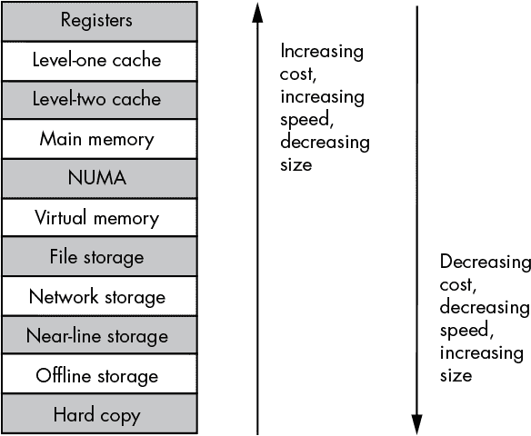
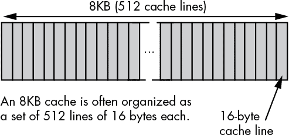
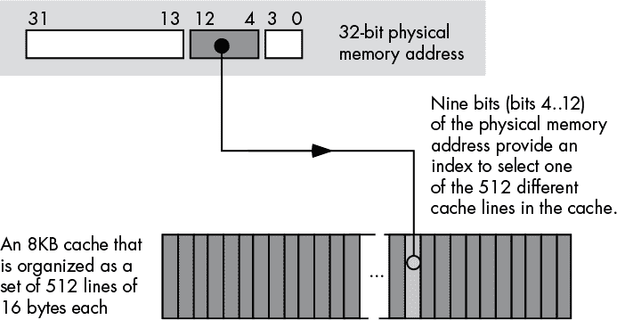
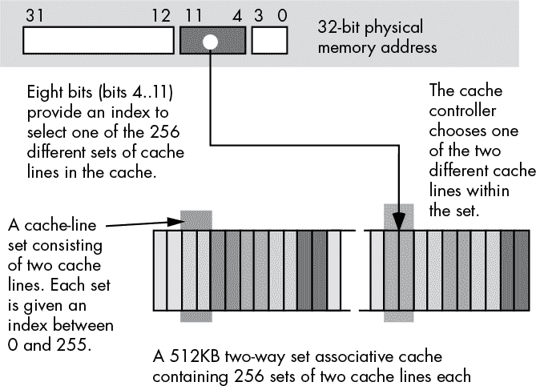
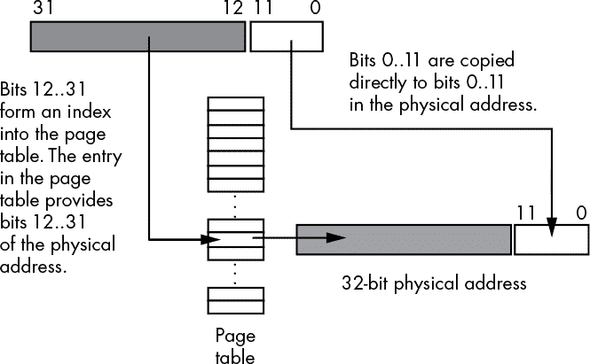
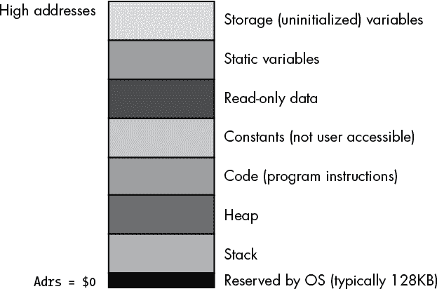
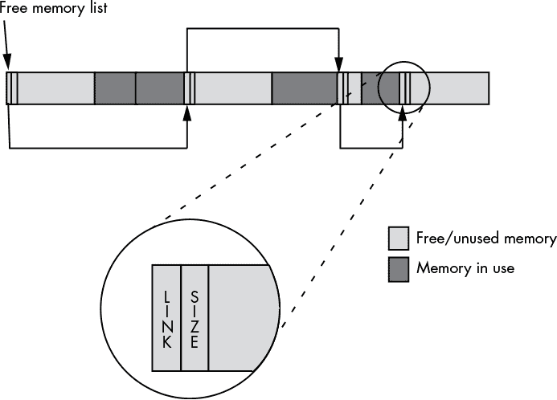
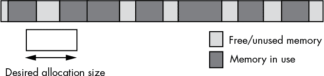
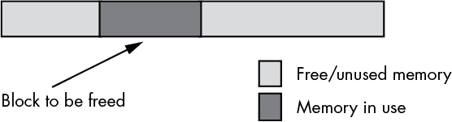

## 第十一章：内存架构与组织**


本章讨论内存层次结构——计算机系统中不同类型和性能级别的内存。尽管程序员通常将所有形式的内存视为等同，但不正确地使用内存可能会对性能产生负面影响。本章将展示如何在程序中最好地利用内存层次结构。

### 11.1 内存层次结构

大多数现代程序都能从大量非常快速的内存中受益。不幸的是，随着内存设备变大，它往往会变得更慢。例如，缓存内存非常快速，但它们也很小且昂贵。主内存便宜且容量大，但它很慢，需要等待周期。内存层次结构提供了一种比较不同类型内存的成本和性能的方式。图 11-1 显示了内存层次结构的一种变种。



*图 11-1：内存层次结构*

内存层次结构的顶层是 CPU 的通用 *寄存器*。寄存器提供了对数据的最快访问方式。寄存器文件也是层次结构中最小的内存对象（例如，32 位的 80x86 只有八个通用寄存器，而 x86-64 变种最多有 16 个通用寄存器）。由于无法在 CPU 中增加更多寄存器，因此它们也是最昂贵的内存位置。即使我们将 FPU、MMX/AltiVec/Neon、SSE/SIMD、AVX/2/-512 和其他 CPU 寄存器计算在内，这一部分内存层次结构的寄存器数量仍然非常有限，而且每个寄存器字节的成本相当高。

接下来，我们进入 *一级缓存（L1 Cache）* 系统，它是内存层次结构中下一个性能最好的子系统。与寄存器类似，CPU 制造商通常将 L1 缓存集成在芯片上，且无法扩展。其大小通常较小，通常在 4KB 到 32KB 之间，尽管这比 CPU 芯片上可用的寄存器内存要大得多。虽然 L1 缓存的大小在 CPU 上是固定的，但每个缓存字节的成本远低于每个寄存器字节的成本，因为缓存存储的容量超过了所有寄存器总和，而系统设计者为这两种内存类型支付的成本等于 CPU 的价格。

*二级缓存（L2 Cache）* 在某些 CPU 上存在，但并非所有 CPU 都有。例如，英特尔的 i3、i5、i7 和 i9 CPU 包括 L2 缓存作为其一部分，但一些英特尔旧版 Celeron 芯片则没有。L2 缓存通常比 L1 缓存大得多（例如，256KB 到 1MB，相较于 4KB 到 32KB）。在具有内建 L2 缓存的 CPU 上，缓存无法扩展。它的成本仍然低于 L1 缓存，因为我们将 CPU 的成本分摊到两个缓存的所有字节上，而 L2 缓存更大。

*三级缓存（L3）*出现在几乎所有 Intel 处理器中，除了最旧的型号。L3 缓存比 L2 缓存更大（在较新的 Intel 芯片上通常为 8MB）。

*主内存*子系统位于 L3（如果没有 L3 则是 L2）缓存系统下方，属于内存层次结构中的一部分。主内存是通用的、相对低成本的内存——通常是 DRAM 或类似的便宜内存——存在于大多数计算机系统中。然而，主内存技术存在许多差异，导致速度有所不同。主内存类型包括标准 DRAM、同步 DRAM（SDRAM）、双倍数据速率 DRAM（DDRAM）、DDR3、DDR4 等。通常，你不会在同一台计算机系统中发现这些技术的混合。

主内存下方是*NUMA*内存子系统。NUMA 代表*非统一内存访问*，这有点误导。该术语意味着不同类型的内存具有不同的访问时间，这描述了整个内存层次结构；然而，在图 11-1 中，它指的是与主内存电子特性相似，但因某种原因操作速度明显较慢的内存块。NUMA 的一个典型例子是视频（或图形）卡上的内存。另一个例子是闪存，它的访问和传输时间比标准半导体 RAM 慢得多。其他提供内存块以供 CPU 和外设共享的外部设备通常也具有较慢的访问时间。

大多数现代计算机系统实现了一个*虚拟内存*方案，利用大容量存储磁盘驱动器来模拟主内存。虚拟内存子系统负责在程序需要时，透明地将数据从磁盘复制到主内存，反之亦然。虽然磁盘的速度明显慢于主内存，但磁盘每比特的成本也低三个数量级。因此，将数据保存在磁存储器或固态硬盘（SSD）上比保存在主内存中便宜得多。

*文件存储*内存也使用磁盘介质来存储程序数据。然而，虚拟内存子系统负责在程序需要时，将数据在磁盘（或 SSD）和主内存之间传输，而存储和检索文件存储数据则由程序负责。在许多情况下，使用文件存储内存的速度比使用虚拟内存稍慢，这也是文件存储内存在内存层次结构中较低的原因。^(1)

接下来是*网络存储*。在内存层次结构的这一层，程序将数据保存在通过网络连接到计算机系统的不同内存系统中。网络存储可以是虚拟内存、文件存储内存或*分布式共享内存（DSM）*，其中不同计算机系统上运行的进程共享存储在公共内存块中的数据，并通过网络交流对该内存块的更改。

虚拟内存、文件存储和网络存储是*在线内存子系统*的例子。这些内存子系统中的内存访问速度比访问主内存要慢。然而，当程序请求来自这些三种在线内存子系统的数据时，内存设备会尽可能快地响应请求，取决于其硬件的响应能力。这对内存层次结构中其余的层次并不适用。

*近线*和*离线存储*子系统可能无法立即响应程序对数据的请求。离线存储系统将数据以电子形式（通常是磁性或光学形式）存储在介质上，但这些介质未必与需要数据的计算机系统相连接。离线存储的例子包括磁带、未连接的外部磁盘驱动器、磁盘盒、光盘、USB 存储棒、SD 卡和软盘。当程序需要访问离线存储的数据时，它必须停止并等待某人或某个设备将适当的介质挂载到计算机系统上。这种延迟可能相当长（也许计算机操作员决定去喝杯咖啡？）。

近线存储使用与离线存储相同类型的介质，但它不需要外部源在数据可供访问之前挂载介质。近线存储系统将介质存放在一个特殊的机器人唱盘设备中，程序请求时，该设备可以自动挂载所需的介质。

硬拷贝存储只是以某种形式打印出来的数据。如果程序请求某些数据，而这些数据仅以硬拷贝形式存在，那么必须由某人手动将数据输入计算机。纸张或其他硬拷贝介质可能是最便宜的存储形式，至少对于某些数据类型来说是如此。

### 11.2 内存层次结构的运作

内存层次结构的核心目的是为了允许合理快速地访问大量内存。如果只需要少量内存，我们会为所有操作使用快速的静态 RAM（缓存内存使用的电路）。如果速度不是问题，我们会为所有操作使用虚拟内存。内存层次结构使我们能够利用*空间局部性*和*时间局部性*的原理，将经常访问的数据移入快速内存，将不常访问的数据留在较慢的内存中。不幸的是，在程序执行过程中，常用数据和不常用数据的集合会发生变化。我们不能在程序开始时就简单地将数据分配到各个内存层级中，并在程序执行过程中不再处理这些数据。相反，不同的内存子系统需要能够在程序执行过程中根据空间局部性或时间局部性的变化，通过动态移动数据来适应这些变化。

在寄存器和内存之间移动数据完全是程序的功能。程序使用诸如`mov`之类的机器指令将数据加载到寄存器中，并将寄存器中的数据存储到内存中。程序员或编译器有责任尽可能长时间将频繁访问的数据保留在寄存器中；CPU 不会自动将数据放入通用寄存器以提高性能。

程序只能在文件存储层及以下的级别显式控制对寄存器、主内存和那些内存层次子系统的访问。程序通常并不意识到寄存器级别和主内存之间的内存层次关系。特别是，缓存访问和虚拟内存操作通常对程序是透明的；也就是说，对这些内存层次的访问通常在程序不干预的情况下发生。程序只是访问主内存，硬件和操作系统负责其余部分。

当然，如果程序总是访问主内存，它会运行得很慢，因为现代 DRAM 主内存子系统的速度远远慢于 CPU。缓存内存子系统和 CPU 缓存控制器的工作是将数据从主内存移动到 L1、L2 和 L3 缓存，以便 CPU 能够快速访问经常请求的数据。同样，虚拟内存子系统的职责是将经常请求的数据从硬盘移动到主内存（如果需要更快的访问，缓存子系统则会将数据从主内存移动到缓存）。

除少数例外，大多数内存子系统的访问都是透明的，在内存层次结构的一个级别与其上下一个级别之间进行。例如，CPU 很少直接访问主内存。相反，当 CPU 请求数据时，L1 缓存子系统接管此请求。如果请求的数据在缓存中，L1 缓存子系统将数据返回给 CPU，内存访问过程结束。如果请求的数据不在 L1 缓存中，L1 缓存子系统会将请求传递给 L2 缓存子系统。如果 L2 缓存子系统有该数据，它将数据返回给 L1 缓存，然后 L1 缓存将数据返回给 CPU。未来对相同数据的请求将由 L1 缓存而非 L2 缓存来满足，因为 L1 缓存现在拥有该数据的副本。L2 缓存之后，L3 缓存接管。

如果 L1、L2 或 L3 缓存子系统都没有数据的副本，请求将传送到主内存。如果在主内存中找到数据，主内存子系统将其传递给 L3 缓存，L3 缓存再将其传递给 L2 缓存，L2 缓存再传递给 L1 缓存，L1 缓存最终将其传递给 CPU。数据现在已经位于 L1 缓存中，因此未来对该数据的任何请求都将由 L1 缓存来满足。

如果数据不在主内存中，而是存储在某个存储设备上的虚拟内存中，操作系统会接管，先从磁盘或其他设备（如网络存储服务器）读取数据，再将数据传递给主内存子系统。然后，主内存通过缓存将数据传递给 CPU，如前所述。

由于空间局部性和时间局部性，大部分内存访问发生在 L1 缓存子系统。接下来，大部分访问发生在 L2 缓存子系统。之后，L3 缓存系统处理大部分访问。最不频繁的访问发生在虚拟内存中。

### 11.3 内存子系统的相对性能

再看一下图 11-1，注意到随着层次的上升，各个内存层级的速度增加。那么，每个连续层级的速度差异有多大呢？简短的回答是，速度梯度不是均匀的。任何两个相邻层级之间的速度差异从“几乎没有差别”到“四个数量级”不等。

寄存器无疑是存储你需要快速访问的数据的最佳位置。访问寄存器从不需要额外时间，大多数访问数据的机器指令可以访问寄存器数据。此外，访问内存的指令通常需要额外的字节（位移字节）作为指令编码的一部分。这使得指令变得更长，且通常执行更慢。

英特尔的 80x86 指令时序表声称，像`mov(`someVar`,` `ecx);`这样的指令应该和`mov(ebx,` `ecx);`一样快速。然而，如果你仔细阅读细则，会发现英特尔是基于几个假设做出这一声明的。首先，它假设 someVar 的值已经存在于 L1 缓存中。如果不在，缓存控制器必须先在 L2 缓存中查找，再到 L3 缓存、主内存，甚至更糟的是，在虚拟内存子系统的磁盘上查找。突然之间，原本应该在 4 GHz 处理器上的 0.25 纳秒（即一个时钟周期）内执行的指令，竟然需要几毫秒才能完成。这是一个超过六个数量级的差异。确实，未来访问该变量时，将只需一个时钟周期，因为它会被存储在 L1 缓存中。但是，即使你在缓存中访问 someVar 的值一百万次，每次访问的平均时间仍然大约是两个时钟周期，因为第一次访问 someVar 时需要的时间比较长。

当然，某些变量在虚拟内存子系统中存储在磁盘上的可能性是相当低的。然而，L1 缓存子系统和主内存子系统之间仍然存在几倍数量级的性能差异。因此，如果程序必须从主内存中检索数据，经过 999 次内存访问后，你仍然需要支付大约两个时钟周期的平均成本，而英特尔的文档声称这应该只需要一个周期。

除非二级或三级缓存没有与 CPU 一起打包，否则 L1、L2 和 L3 缓存系统之间的速度差异不会那么显著。在 4 GHz 的处理器上，如果缓存在零等待周期下工作，L1 缓存必须在 0.25 纳秒内响应（一些处理器在 L1 缓存访问中实际上会引入等待周期，但 CPU 设计师会尽量避免这种情况）。访问 L2 缓存中的数据总是比 L1 缓存慢，并且总是至少包含一个等待周期，相对可能更多。

L2 缓存访问速度慢于 L1 缓存访问的原因有几个。首先，CPU 需要时间来判断它要寻找的数据是否不在 L1 缓存中。当它做出判断时，内存访问周期几乎已经完成，已经没有时间去访问 L2 缓存中的数据。其次，为了降低成本，L2 缓存的电路可能比 L1 缓存的电路更慢。第三，L2 缓存通常比 L1 缓存大 16 到 64 倍，而较大的内存子系统往往比较小的更慢。这一切都会导致访问 L2 缓存时需要额外的等待周期。如前所述，L2 缓存的访问速度可能比 L1 缓存慢一个数量级。当你必须访问 L3 缓存中的数据时，也会出现同样的情况。

L1、L2 和 L3 缓存在发生缓存未命中时系统获取的数据量也有所不同（参见 第六章）。当 CPU 从 L1 缓存中获取或写入数据时，通常只会获取或写入请求的数据。如果你执行 `mov(al,` `memory);` 指令，CPU 只会向缓存写入一个字节。类似地，如果你执行 `mov(mem32,` `eax);` 指令，CPU 会从 L1 缓存中读取恰好 32 位的数据。然而，访问 L1 缓存以下的内存子系统并不像这样按小块操作。通常，内存子系统在访问内存层级的更低级别时，会移动数据块或 *缓存行*。例如，如果你执行 `mov(mem32,` `eax);` 指令，并且 `mem32` 的值不在 L1 缓存中，缓存控制器不会仅仅从 L2 缓存中读取 `mem32` 的 32 位数据，假设它在那里存在。相反，缓存控制器会从 L2 缓存中读取一整块字节（通常为 16、32 或 64 字节，具体取决于处理器）。希望程序能表现出空间局部性，从而读取一块字节可以加速对内存中相邻对象的未来访问。不幸的是，`mov(mem32,` `eax);` 指令不会完成，直到 L1 缓存从 L2 缓存中读取完整的缓存行。这段额外的时间被称为 *延迟*。如果程序在未来不再访问与 `mem32` 相邻的内存对象，这段延迟时间就成了浪费的时间。

L2 和 L3 缓存以及 L3 和主内存之间存在类似的性能差距。主内存通常比 L3 缓存慢一个数量级；L3 访问比 L2 访问慢得多。为了加速对相邻内存对象的访问，L3 缓存会以缓存行的形式从主内存中读取数据。同样，L2 缓存也会从 L3 中读取缓存行。

标准 DRAM 比 SSD 存储快两个到三个数量级（SSD 存储比硬盘快一个数量级，这也是为什么硬盘通常有自己的基于 DRAM 的缓存）。为了克服这个问题，L3 缓存和主内存之间通常存在两到三个数量级的差异，以便磁盘和主内存之间的速度差异与主内存和 L3 缓存之间的速度差异相匹配。（在内存层级中平衡性能特征是一个目标，旨在有效利用不同类型的内存。）

在本章中，我们不考虑其他内存层级子系统的性能，因为它们或多或少由程序员控制。由于它们的访问不是自动的，所以很难说程序将会多频繁地访问它们。然而，在 第十二章中，我们将讨论一些关于这些存储设备的考虑因素。

### 11.4 缓存架构

到目前为止，我们已经将缓存视为一个神奇的地方，它在需要时自动存储数据，或许会根据 CPU 的需求获取新的数据。但缓存究竟是如何做到这一点的呢？当缓存已满而 CPU 请求额外数据时，会发生什么情况？在这一节中，我们将探讨缓存的内部组织结构，并尝试解答这两个问题以及其他一些问题。

程序在任意时刻只访问少量数据，按照这种方式大小调整的缓存将提高程序的性能。不幸的是，程序需要的数据通常不会在连续的内存位置上——它通常会分布在整个地址空间中。因此，缓存设计必须考虑到缓存需要将位于内存中不同地址的数据对象进行映射。

如前一节所述，缓存内存并不是以单一字节组的方式组织的。相反，它通常以*【缓存行】(gloss01.xhtml#gloss01_42)*的块形式组织，每一行包含一定数量的字节（通常是像 16、32 或 64 这样的 2 的幂次），如图 11-2 所示。



*图 11-2：8KB 缓存的可能组织方式*

我们可以将不同的非连续地址附加到每个缓存行上。缓存行 0 可能对应地址`$10000`到`$1000F`，缓存行 1 可能对应地址`$21400`到`$2140F`。通常，如果一个缓存行的长度为*n*字节，它将包含主内存中位于*n*字节边界上的*n*字节数据。在图 11-2 中的例子里，缓存行的长度为 16 字节，因此一个缓存行包含 16 字节的块，这些块在主内存中位于 16 字节的边界上（换句话说，缓存行中第一个字节地址的低 4 位总是 0）。

当缓存控制器从内存层次结构中的较低层读取一个缓存行时，数据会被存放到缓存的哪个位置？答案取决于使用的缓存方案。缓存方案有三种不同的类型：直接映射缓存、完全关联缓存和*n*路集合关联缓存。

#### *11.4.1 直接映射缓存*

在*直接映射缓存*（也称为*单路集合关联缓存*）中，主内存中的特定数据块总是被加载到——映射到——相同的缓存行，该缓存行由数据块内存地址中的少量位确定。图 11-3 展示了缓存控制器如何为一个拥有 512 个 16 字节缓存行和 32 位主内存地址的 8KB 缓存选择合适的缓存行。



*图 11-3：在直接映射缓存中选择缓存行*

一个具有 512 个缓存行的缓存需要 9 位来选择其中一个缓存行（2⁹ = 512）。在这个例子中，地址的第 4 到第 12 位决定使用哪个缓存行（假设我们将缓存行编号为 0 到 511），而地址的第 0 到第 3 位则决定 16 字节缓存行内的具体字节。

直接映射缓存方案非常容易实现。从内存地址中提取 9 个（或其他数量的）位，并将结果用作缓存行数组的索引是非常简单且快速的，尽管这种设计可能无法有效利用所有的缓存内存。

例如，图 11-3 中的缓存方案将地址 0 映射到缓存行 0。它还将地址`$2000`（8KB）、`$4000`（16KB）、`$6000`（24KB）、`$8000`（32KB）以及所有其他是 8KB 倍数的地址映射到缓存行 0。这意味着，如果一个程序不断访问的是 8KB 倍数的地址，并且不访问其他位置，系统将仅使用缓存行 0，其他所有缓存行将未被使用。在这种极端情况下，缓存实际上被限制为一个缓存行的大小，并且每次 CPU 请求一个映射到缓存行 0 但未存在于其中的地址时，必须降级到内存层次结构的较低级别来访问该数据。

#### *11.4.2 完全关联缓存*

在一个完全关联的缓存子系统中，缓存控制器可以将字节块放置在缓存内存中任意一个缓存行中。虽然这是最灵活的缓存系统，但实现完全关联所需的额外电路非常昂贵，甚至可能会拖慢内存子系统的速度。由于这个原因，大多数 L1 和 L2 缓存并不是完全关联的。

#### *11.4.3 n 路集合关联缓存*

如果完全关联缓存过于复杂、过于缓慢且过于昂贵，而直接映射缓存又过于低效，那么*n*路集合关联缓存是两者之间的折衷方案。在*n*路集合关联缓存中，缓存被划分为*n*个缓存行的集合。CPU 根据内存地址位的某个子集来确定使用哪个集合，就像在直接映射方案中一样，缓存控制器则使用完全关联映射算法来确定在该集合内使用哪一个缓存行。

例如，一个 8KB 二路集合关联缓存子系统，具有 16 字节的缓存线，将缓存组织为 256 个缓存行集合，每个集合包含两条缓存线。内存地址的八位用于确定这 256 个不同集合中的哪一个将包含数据。一旦确定了缓存行集合，缓存控制器将数据块映射到该集合中的两个缓存线之一（见图 11-4）。这意味着位于 8KB 边界上的两个不同内存地址（在第 4 到第 11 位上的值相同的地址）可以同时出现在缓存中。然而，如果尝试访问一个地址为 8KB 的偶数倍的第三个内存位置，则会发生冲突。



*图 11-4：二路集合关联缓存*

四路集合关联缓存将四条关联缓存线放入每个缓存行集合中。在像图 11-4 中的 8KB 缓存中，四路集合关联缓存方案将有 128 个缓存行集合，每个集合包含四条缓存线。这将使得缓存能够在没有冲突的情况下保持最多四个不同的数据块，每个数据块都会映射到直接映射缓存中的同一缓存行。

二路或四路集合关联缓存比直接映射缓存要好得多，而且比全关联缓存复杂度低得多。每个缓存行集合中的缓存线越多，我们就越接近创建全关联缓存，但也会带来复杂性和速度上的问题。大多数缓存设计都是直接映射、二路集合关联或四路集合关联。80x86 系列的各种成员都使用这三种缓存方案。

将缓存方案与访问类型匹配

尽管直接映射缓存有其缺点，但对于顺序访问的数据，它实际上非常有效，而非随机访问的数据。因为 CPU 通常按顺序执行机器指令，所以指令字节可以非常有效地存储在直接映射缓存中。然而，程序访问数据的方式往往比访问代码更为随机，因此数据更适合存储在二路或四路集合关联缓存中。

由于这些不同的访问模式，许多 CPU 设计师为数据和机器指令字节使用独立的缓存——例如，使用一个 8KB 数据缓存和一个 8KB 指令缓存，而不是单一的 16KB 统一缓存。这种方法的优点是，每个缓存都可以使用最适合它将存储的特定值的缓存方案。缺点是这两个缓存的大小各为统一缓存的一半，可能导致比统一缓存更多的缓存未命中。选择合适的缓存组织结构是一个困难的问题，超出了本书的范围，只有在分析了目标处理器上运行的多个程序后，才能做出选择。

#### *11.4.4 缓存行替换策略*

到目前为止，我们已经回答了“我们将数据块存放在哪里”的问题。现在，我们转向同样重要的问题：“如果我们想要将数据块放入缓存行，但缓存行不可用，会发生什么？”

对于直接映射缓存架构，缓存控制器只是简单地用新数据替换缓存行中原本的数据。任何后续对旧数据的引用都会导致缓存未命中，缓存控制器将不得不通过替换该行中的任何数据，将旧数据恢复到缓存中。

对于二路组相联缓存，替换算法要复杂一些。如你所见，每当 CPU 引用一个内存位置时，缓存控制器会使用地址的某些位来确定应该用来存储数据的缓存行组。然后，借助一些精密电路，缓存控制器判断数据是否已经存在于目标组的两个缓存行中的一个。如果数据不存在，CPU 必须从内存中获取它，控制器则需要从两个缓存行中选择一个来使用。如果其中一个或两个缓存行当前未被使用，控制器会选择未使用的缓存行。然而，如果两个缓存行都正在使用，控制器必须从中选择一个，并用新数据替换它的内容。

控制器无法预测哪个缓存行的数据会首先被引用并替换其他缓存行，但它可以使用时效性原理：如果一个内存位置最近被引用过，那么它很可能在不久的将来再次被引用。这意味着以下推论：如果一个内存位置有一段时间没有被访问，它很可能要很长时间后 CPU 才会再次访问它。因此，许多缓存控制器使用*最近最少使用（LRU）*算法。

在二路组相联缓存系统中，LRU 策略很容易实现，只需为每组两个缓存行使用一个比特位。每当 CPU 访问其中一个缓存行时，该比特位会被设置为`0`，而每当 CPU 访问另一个缓存行时，该比特位会被设置为`1`。然后，当需要替换时，缓存控制器将替换 LRU 缓存行，该行由该比特位的反值指示。

对于四路（或更多路）组相联缓存，维护 LRU 信息会更加困难，这也是此类缓存电路更复杂的原因之一。由于 LRU 可能带来的复杂性，其他替换策略有时会代替它使用。其中两种，*先进先出（FIFO）*和*随机*，比 LRU 更容易实现，但它们也有各自的问题。它们的优缺点的全面讨论超出了本书的范围，但你可以在计算机架构或操作系统的书籍中找到更多信息。

#### *11.4.5 缓存写入策略*

当 CPU 向内存写入数据时会发生什么？简单的答案是，CPU 将数据写入缓存，这也是最快的操作。然而，当缓存行数据随后被从内存读取的数据替换时会发生什么？如果修改过的缓存行内容没有写入主存，它们将丢失。下次 CPU 访问该数据时，它将重新加载带有旧数据的缓存行。

很明显，任何写入缓存的数据最终都必须写入主存。缓存使用两种常见的写入策略：*写直达*和*写回*。

写直达策略规定，每次将数据写入缓存时，缓存会立即将该缓存行的副本写入主存。CPU 在缓存控制器将数据从缓存写入主存时不需要暂停。因此，除非 CPU 在写操作后需要立即访问主存，否则该操作与程序的执行并行进行。由于写直达策略会尽可能快地用新值更新主存，当两个不同的 CPU 通过共享内存进行通信时，这是一种更好的策略。

然而，写操作需要一定时间，在此期间 CPU 很可能想要访问主存，因此这种策略可能不是高性能的解决方案。更糟糕的是，假设 CPU 连续多次从内存位置读取并写入数据。使用写直达策略时，CPU 将使总线饱和，进行缓存行写入，这将显著影响程序的性能。

使用写回策略时，写入缓存的数据不会立即写入主存；相反，缓存控制器会稍后更新主存。此方案通常性能更高，因为在短时间内对同一缓存行的多次写入不会生成多次写入主存。

为了确定哪些缓存行必须写回主存，缓存控制器通常会在每个缓存行中维护一个*脏位*。每当缓存控制器将数据写入缓存时，系统会设置此位。在稍后的时间里，缓存控制器检查脏位以判断是否需要将缓存行写入内存。例如，每当缓存控制器用内存中的其他数据替换缓存行时，它首先检查脏位，如果该位被设置，控制器将在进行缓存行替换之前将该缓存行写入内存。请注意，这会增加缓存行替换期间的延迟时间。如果缓存控制器能够在没有其他总线访问的情况下将脏缓存行写入主存，延迟时间可能会减少。有些系统提供此功能，而有些系统由于经济原因不提供此功能。

#### *11.4.6 缓存使用与软件*

缓存子系统并不是解决内存访问慢的灵丹妙药，实际上它可能会*损害*应用程序的性能。为了让缓存系统有效，软件必须在设计时考虑缓存行为。特别地，好的软件必须表现出空间或时间局部性——软件设计师通过将常用变量放置在内存相邻位置，以确保它们尽可能地落入同一缓存行——并避免使用会导致缓存频繁替换缓存行的数据结构和访问模式。

假设一个应用程序访问多个不同地址的数据，这些地址会被缓存控制器映射到同一缓存行。每次访问时，缓存控制器必须读取一个新的缓存行（如果旧缓存行有脏数据，可能需要将其刷新回内存）。因此，每次内存访问都会带来从主内存获取缓存行的延迟成本。这个退化情况被称为* thrashing *，它可能会使程序变慢一个到两个数量级，具体取决于主内存的速度和缓存行的大小。我们将在本章稍后再次讨论 thrashing。

现代 80x86 CPU 上缓存子系统的一个好处是它可以自动处理许多不对齐的数据引用。记住，如果访问的单词或双字对象的地址不是该对象大小的偶数倍，会产生性能惩罚。通过提供一些复杂的逻辑，Intel 的设计师消除了这个惩罚，只要数据对象完全位于缓存行内。然而，如果该对象跨越了一个缓存行，惩罚仍然存在。

### 11.5 NUMA 和外部设备

尽管系统中的大多数 RAM 是基于与处理器总线直接连接的高速 DRAM，但并非所有内存都以这种方式连接到 CPU。有时，一大块 RAM 是外部设备的一部分——例如，显卡、网络接口卡或 USB 控制器——你通过将数据写入该设备的 RAM 来与设备通信。不幸的是，这些外部设备的 RAM 访问时间通常比主内存的访问时间要慢得多。在本节中，我们将以显卡为例，尽管 NUMA 性能同样适用于其他设备和内存技术。

一块典型的显卡通过计算机系统内部的*外部组件互联高速总线（PCI-e）*与 CPU 接口。尽管 16 通道 PCI-e 总线非常快速，但内存访问仍然要快得多。游戏程序员早就发现，将屏幕数据的副本放在主内存中处理，并只在每次视频回扫时（通常是每秒 1/60 次，以避免闪烁）将这些数据写入显卡的 RAM，比每次想要更改时直接写入显卡要快得多。

缓存和虚拟内存子系统是透明操作的（也就是说，应用程序无法察觉底层的操作），但 NUMA 内存不是，所以写入 NUMA 设备的程序必须尽可能最小化访问次数（例如，通过使用离屏位图来保存临时结果）。如果你实际在 NUMA 设备上存储和检索数据，例如在闪存卡上，你必须显式地自己缓存数据。

### 11.6 虚拟内存、内存保护与分页

在现代操作系统中，如 Android、iOS、Linux、macOS 或 Windows，多个不同的程序通常会同时在内存中运行。这会带来几个问题：

+   如何防止程序互相干扰彼此的内存呢？

+   如果两个程序都希望将一个值加载到内存中的地址`$1000`，那么如何才能同时加载这两个值并同时执行这两个程序呢？

+   如果计算机有 64GB 内存，并且你决定加载并执行三个不同的应用程序，其中两个需要 32GB，一个需要 16GB（更别提操作系统为自身目的所需的内存）会发生什么呢？

这些问题的答案都在现代处理器支持的虚拟内存子系统中。

在像 80x86 这样的 CPU 上，虚拟内存为每个进程提供其自己的 32 位地址空间^(2)。这意味着一个程序中的地址`$1000`在物理上与另一个程序中的地址`$1000`不同。CPU 通过将程序使用的*虚拟地址*映射到实际内存中的不同*物理地址*来实现这种“魔术”。虚拟地址和物理地址不必相同，而且通常它们不是。例如，程序 1 的虚拟地址`$1000`可能实际上对应物理地址`$215000`，而程序 2 的虚拟地址`$1000`可能对应物理内存地址`$300000`。CPU 通过*分页*实现这一点。

分页的概念非常简单。首先，你将内存分割成叫做*页面*的字节块。主内存中的一个页面可以与缓存子系统中的缓存行相比较，尽管页面通常比缓存行要大得多。例如，32 位的 80x86 CPU 使用的页面大小为 4,096 字节；而 64 位变种允许更大的页面大小。

对于每个页面，你使用查找表将虚拟地址的高位映射到内存中物理地址的高位，并将虚拟地址的低位作为该页面的索引。例如，使用 4,096 字节的页面时，你将虚拟地址的低 12 位用作页面内的偏移量（0..4095），而将高 20 位作为查找表的索引，该表返回物理地址的实际高 20 位（参见图 11-5）。



*图 11-5：将虚拟地址转换为物理地址*

20 位索引进入页表会在页表中需要超过一百万个条目。如果每个条目是 32 位的，那么页表的大小将是 4MB——比许多运行在内存中的程序还要大！然而，通过使用多级页表，你可以轻松地为大多数小程序创建一个仅有 8KB 长的页表。具体细节在这里不重要。只需要放心，除非你的程序使用了整个 4GB 的地址空间，否则你不需要一个 4MB 的页表。

如果你稍微研究一下图 11-5，你可能会发现使用页表的一个问题——它需要两次独立的内存访问才能检索存储在内存中单一物理地址的数据：一次是从页表中获取值，另一次是从所需的内存位置读取或写入数据。为了防止将页表条目堆积在数据或指令缓存中，从而增加数据和指令请求的缓存未命中次数，页表使用了它自己的缓存，称为*转换旁路缓冲区（TLB）*。这个缓存通常在现代 Intel 处理器中有 64 到 512 个条目——足够处理相当数量的内存而不会发生未命中。因为程序通常在任何给定时刻处理的数据少于这个数量，所以大多数页表访问来自缓存，而非主内存。

如前所述，页表中的每个条目包含 32 位，尽管系统实际上只需要 20 位来将每个虚拟地址映射到物理地址。Intel 在 80x86 上使用剩余的 12 位来提供内存保护信息：

+   一位标志位表示页面是可读写还是只读。

+   一位标志位决定你是否可以在该页面上执行代码。

+   若干位决定应用程序是否可以访问该页面，还是仅操作系统可以访问。

+   若干位决定 CPU 是否已写入页面，但尚未写入对应的物理内存地址（即页面是否“脏”以及 CPU 是否最近访问了该页面）。

+   一位标志位决定页面是否实际存在于物理内存中，还是存在于某个地方的二级存储中。

你的应用程序无法访问页表（读取和写入页表是操作系统的责任），因此它们不能修改这些位。然而，一些操作系统提供了你可以调用的函数，若你想更改页表中的某些位（例如，Windows 允许你将一个页面设置为只读）。

除了重新映射内存使多个程序能够在主内存中共存外，分页还提供了一种机制，使操作系统能够将不常用的页面移动到辅助存储。引用局部性不仅适用于缓存行，也适用于主内存中的页面。在任何给定时刻，程序只会访问包含数据和指令字节的主内存中少量的页面；这组页面被称为*工作集*。尽管工作集随时间变化缓慢，但在较短的时间内，它保持不变。因此，程序的其余部分不需要占用其他进程可能需要的宝贵主内存存储。如果操作系统能够将当前未使用的页面保存到磁盘，那么它们将释放的主内存空间可以供其他需要的程序使用。

当然，将数据从主内存移出的一个问题是，程序最终可能确实需要这些数据。如果你尝试访问一个内存页，而页表位告诉内存管理单元（MMU）该页不在主内存中，CPU 将中断程序并将控制权交给操作系统。操作系统从磁盘驱动器读取相应的页面数据，并将其复制到主内存中的某个空闲页面。这一过程几乎与完全关联缓存子系统使用的过程相同，唯一不同的是访问磁盘比访问主内存要慢得多。事实上，你可以将主内存视为一个具有 4,096 字节缓存行的完全关联写回缓存，它缓存了存储在磁盘驱动器上的数据。缓存和主内存的置换策略及其他行为非常相似。

**注意**

*有关操作系统如何在主内存和辅助存储之间交换页面的更多信息，请参考操作系统设计的教科书。*

因为每个程序都有一个独立的页表，而且程序本身无法访问这些页表，所以程序之间无法相互干扰。也就是说，一个程序不能修改其页表以访问另一个进程的*［地址空间］(gloss01.xhtml#gloss01_7)*中的数据。如果你的程序通过覆盖自身而崩溃，它不会同时崩溃其他程序。这是分页内存系统的一个重要优点。

如果两个程序想要协作并共享数据，它们可以通过将数据放入它们共享的内存区域来实现。它们只需要告诉操作系统它们希望共享某些内存页。操作系统将返回每个进程一个指向某个内存段的指针，该段的物理地址对两个进程来说是相同的。在 Windows 系统中，你可以通过使用*内存映射文件*来实现；更多细节请参见操作系统文档。macOS 和 Linux 也支持内存映射文件以及一些特殊的共享内存操作；同样，详情请参见操作系统文档。

尽管本讨论特别适用于 80x86 CPU，但多级分页系统在其他 CPU 上也很常见。页面大小通常在约 1KB 到 4MB 之间，具体取决于 CPU。对于支持大于 4GB 地址空间的 CPU，一些 CPU 使用*反向页表*或*三层页表*。尽管这些细节超出了本章的讨论范围，但基本原理是相同的：CPU 在主内存和磁盘之间移动数据，以尽量将经常访问的数据保持在主内存中。这些其他的页表方案在应用程序仅使用部分可用内存空间时，能够有效减少页表的大小。

抖动

抖动是一个退化的情况，可能会导致整个系统性能下降到内存层次结构中较低层次的速度，如主内存，或者更糟糕的是，磁盘驱动器。抖动的主要原因有两个：

+   在内存层次结构中的某个级别上，内存不足以适当地容纳程序的工作集缓存行或页面

+   不具备引用局部性的程序

如果内存不足以容纳工作集页面或缓存行，内存系统将不断地用主内存或磁盘中的另一个数据块替换缓存或主内存中的一个数据块。结果，系统的运行速度就会降到内存层次结构中较慢的内存的速度。虚拟内存中常见的抖动现象就是如此。例如，一个用户可能同时运行多个应用程序，这些程序所需的内存总和大于可用的物理内存。因此，当操作系统在应用程序之间切换时，它必须将每个应用程序的数据，可能还有程序指令，从磁盘中读入或写出。由于在程序之间切换通常比从磁盘中获取数据要快得多，这会使程序运行速度大幅下降。

如前所述，如果程序没有展示引用局部性，并且低层内存子系统不是完全关联的，即使当前内存层级中有空闲内存，抖动也可能发生。让我们回顾之前的例子，假设一个 8KB 的 L1 缓存系统使用一个直接映射的缓存，拥有 512 个 16 字节的缓存行。如果一个程序在*每次*访问时引用间隔为 8KB 的数据对象，那么系统将不得不反复用主内存中的数据替换缓存中的相同缓存行。即使其他 511 个缓存行当前未被使用，这种情况仍然会发生。

当内存不足导致抖动（thrashing）时，你可以通过增加内存来解决问题。如果无法增加内存，可以尝试减少并发运行的进程数量，或者修改程序，使其在给定时间内引用更少的内存。若是引用局部性（locality of reference）导致了抖动，则应重构程序及其数据结构，使其内存引用物理上更加接近。

### 11.7 编写能够理解内存层级的软件

意识到内存性能行为的软件可以比那些没有意识到的运行得更快。虽然一个系统的缓存和分页机制对于典型程序可能表现得相当好，但其实很容易编写出即使没有缓存系统也能运行得更快的软件。最好的软件是能够最大化利用内存层级结构的。

一个典型的坏设计案例是以下循环，它初始化了一个二维整数数组：

```
int array[256][256];

        . . .

    for( i=0; i<256; ++i )

        for( j=0; j<256; ++j )

            array[j][i] = i*j;
```

信不信由你，以下代码在现代 CPU 上运行的速度比前面的代码要慢得多：

```
int array[256][256];

        . . .

    for( i=0; i<256; ++i )

        for( j=0; j<256; ++j )

            array[i][j] = i*j;
```

这两段代码的唯一不同之处在于，在访问数组元素时，`i` 和 `j` 索引被交换了。这个小修改可能导致它们的运行时间相差一到两个数量级！要理解为什么，记住 C 语言对二维数组在内存中的排列使用的是行主序（row-major ordering）。这意味着第二段代码在内存中访问的是顺序位置，展示了空间局部性（spatial locality of reference）。而第一段代码则按以下顺序访问数组元素：

```
array[0][0]

array[1][0]

array[2][0]

array[3][0]

    . . .

array[254][0]

array[255][0]

array[0][1]

array[1][1]

array[2][1]

    . . .
```

如果整数占用 4 字节，那么该序列将从数组的基地址开始，分别访问偏移量为 0、1,024、2,048、3,072 等的双字（double-word）值，这些值显然是*非*顺序的。很可能，这段代码会将 *n* 个整数加载到一个 *n*-路集合关联缓存中，然后立刻导致抖动，因为每个随后的数组元素都必须从缓存复制到主内存中，以防数据被覆盖。

第二段代码序列没有出现抖动。假设使用 64 字节的缓存行，第二段代码序列将在加载另一个缓存行并替换已有缓存行之前，将 16 个整数值存储到同一个缓存行中。因此，第二段代码序列将内存中缓存行的检索成本分摊到 16 次内存访问中，而不是像第一段代码序列那样仅通过一次访问来完成。

除了按顺序访问内存中的变量外，你还可以使用几种其他的变量声明技巧来最大化内存层次结构的性能。首先，将在公共代码序列中使用的所有变量一起声明。在大多数语言中，这将为变量分配物理上相邻的内存位置，从而支持空间局部性和时间局部性。其次，使用局部（自动）变量，因为大多数语言将局部存储分配到栈上，而系统频繁访问栈，栈上的变量往往会被缓存。第三，将标量变量一起声明，并与数组和记录变量分开。访问任何一个相邻的标量变量通常会迫使系统将所有相邻的对象加载到缓存中。

通常，研究你程序表现出的内存访问模式，并相应地调整你的应用程序。你可以花费数小时用手动优化的汇编语言重写代码，试图提高 10%的性能，但如果你改进程序访问内存的方式，通常会看到性能提升一个数量级的情况。

### 11.8 运行时内存组织

像 macOS、Linux 或 Windows 这样的操作系统将不同类型的数据放入主内存的不同区段（或*段*）。虽然可以通过运行链接器并指定各种参数来控制内存组织，但默认情况下，Windows 会按照图 11-6 中所示的组织方式将典型程序加载到内存中（macOS 和 Linux 也类似，尽管它们重新排列了一些区段）。



*图 11-6：典型的 Windows 运行时内存组织*

操作系统保留了最低的内存地址，你的应用程序通常不能访问这些地址的数据（或执行这些地址的指令）。操作系统保留这些空间的一个原因是帮助检测`NULL`指针引用。程序员通常会将指针初始化为`NULL`（`0`），表示指针无效。如果你尝试在这样的操作系统中访问内存位置`0`，它会生成*通用保护错误*，以表明你访问了一个不包含有效数据的内存位置。

剩余的七个内存区段存储与你程序相关的不同类型的数据：

+   代码段存储程序的机器指令。

+   常量区包含编译器生成的只读数据。

+   只读数据段保存用户定义的只能读取、不能写入的数据。

+   静态区保存用户定义的已初始化静态变量。

+   存储区或 BSS 区保存用户定义的未初始化变量。

+   栈区维护着局部变量和其他临时数据。

+   堆区维护动态变量。

**注意**

*通常，编译器会将代码、常量和只读数据段合并在一起，因为它们都包含只读数据。*

大多数情况下，给定的应用程序可以使用编译器和链接器/加载器为这些区段选择的默认布局。然而，在某些情况下，了解内存布局可以帮助你开发更短的程序。例如，将代码、常量和只读数据区段合并为一个只读区段，可以节省编译器/链接器可能在它们之间插入的填充空间。尽管这些节省对大型应用程序来说可能微不足道，但对小程序的大小影响却可能非常大。

以下各节将详细讨论这些内存区域。

#### *11.8.1 静态与动态对象、绑定与生命周期*

在探讨典型程序的内存组织结构之前，我们需要定义一些术语：绑定、生命周期、静态和动态。

*绑定* 是将属性与对象关联的过程。例如，当你给一个变量赋值时，这个值就被*绑定*到该变量上，直到你将另一个值赋给该变量为止。类似地，如果你在程序运行时为一个变量分配内存，这个变量就绑定到那个地址，直到你将不同的地址与该变量关联。绑定不一定发生在运行时。例如，在编译时，值会被绑定到常量对象上，而这些绑定在程序运行时不能改变。

*生命周期* 是指一个属性从你首次将该属性绑定到对象开始，到你断开这个绑定（例如通过将另一个属性绑定到该对象）为止的过程。例如，一个变量的生命周期是从你首次为该变量分配内存开始，到你释放该变量的存储空间为止。

*静态*对象是指在应用程序执行之前就绑定了某个属性的对象（通常是在编译时或链接阶段，尽管也有可能在更早的时候就绑定值）。常量就是静态对象的一个很好的例子；它们在整个程序执行过程中绑定着相同的值。像 Pascal、C/C++ 和 Ada 等编程语言中的全局（程序级别）变量也是静态对象的例子，因为它们在程序生命周期内始终绑定着相同的地址。因此，静态对象的生命周期从程序开始执行的时刻起，直到应用程序终止为止。

与静态绑定相关的是标识符的*作用域*概念——标识符名称绑定到对象的程序部分。由于名称仅在编译期间存在，作用域在编译语言中被视为静态属性。（在解释性语言中，解释器在程序执行期间维护标识符名称，因此作用域可以是非静态属性。）局部变量的作用域通常限制在声明它的过程或函数内（或者在像 Pascal 或 Ada 这样的块结构语言中的任何嵌套过程或函数声明内），并且该名称在子程序外不可见。事实上，可以在不同的作用域中重用标识符的名称（即，在不同的函数或过程内）。在这种情况下，标识符的第二次出现将绑定到与第一次出现不同的对象。

*动态*对象是指在程序执行过程中某个属性被赋予的对象。在程序运行时，程序可能会选择动态地更改该属性。该属性的生命周期从应用程序将属性绑定到对象的那一刻开始，直到程序断开该绑定时结束。如果程序从未断开该绑定，那么该属性的生命周期将从关联时刻延续到程序终止时刻。系统在程序执行期间将动态属性绑定到对象。

**注意**

*一个对象可能同时拥有静态和动态属性的组合。例如，一个静态变量在程序的整个执行时间内都绑定着一个地址，但它可以在程序生命周期内绑定不同的值。然而，任何给定的属性要么是静态的，要么是动态的；它不可能同时是两者。*

#### *11.8.2 代码、只读和常量部分*

内存中的代码部分包含程序的机器指令。您的编译器将您编写的每个语句转换为一个或多个字节值的序列。在程序执行过程中，CPU 将这些字节值解释为机器指令。

大多数编译器还将程序的只读数据附加到代码区块，因为像代码指令一样，只读数据已经是写保护的。然而，在 Windows、macOS、Linux 以及许多其他操作系统中，完全可以在可执行文件中创建一个单独的区块并将其标记为只读。因此，一些编译器支持一个独立的只读数据区块。这些区块包含已初始化的数据、表格和程序在执行过程中不应修改的其他对象。

图 11-6 中所示的常量区块通常包含编译器生成的数据（与用户定义的只读数据相对）。大多数编译器实际上会直接将这些数据写入代码区块。这就是为什么如前所述，在大多数可执行文件中，你会发现有一个单一的区块，它结合了代码区块、只读数据区块和常量数据区块。

#### *11.8.3 静态变量区块*

许多语言允许你在编译阶段初始化全局变量。例如，在 C/C++中，你可以使用如下语句为这些静态对象提供初始值：

```
static int i = 10;

static char ch[] = { 'a', 'b', 'c', 'd' };
```

在 C/C++以及其他语言中，编译器将这些初始值放置在可执行文件中。当你执行应用程序时，操作系统会将包含这些静态变量的可执行文件部分加载到内存中，以便这些值出现在与静态变量相关的地址上。因此，当此程序首次开始执行时，`i`和`ch`将绑定这些值。

#### *11.8.4 存储变量区块*

存储变量（或 BSS）区块是编译器通常放置没有显式值的静态对象的地方。BSS 代表“由符号开始的区块”（Block Started by Symbol），这是一个旧的汇编语言术语，用来描述一种伪操作码，通常用于为未初始化的静态数组分配存储空间。在像 Windows 和 Linux 这样的现代操作系统中，编译器/链接器会将所有未初始化的变量放入 BSS 区块，这个区块仅告诉操作系统为该区块保留多少字节。当操作系统将程序加载到内存中时，它会为 BSS 区块中的所有对象保留足够的内存，并将这部分内存填充为`0`。

请注意，可执行文件中的 BSS 区块实际上不包含任何数据，因此在 BSS 区块中声明未初始化的静态对象（尤其是大型数组）的程序将占用较少的磁盘空间。

然而，并不是所有编译器都实际使用 BSS 部分。例如，一些 Microsoft 语言和链接器只是将未初始化的对象放置在静态/只读数据部分，并显式地给它们一个初始值`0`。尽管 Microsoft 声称这种方案更快，但如果你的代码包含大型未初始化数组，这无疑会使可执行文件变得更大（因为数组的每个字节最终都出现在可执行文件中——如果编译器将数组放在 BSS 部分，这种情况就不会发生）。

#### *11.8.5 堆栈部分*

堆栈是一种数据结构，它根据过程调用和返回等操作动态扩展和收缩。在运行时，系统将所有自动变量（非静态局部变量）、子程序参数、临时值以及其他对象放置在内存中的堆栈部分，采用一种称为*激活记录*的特殊数据结构（这个名字恰如其分，因为系统在子程序开始执行时创建它，并在子程序返回到调用者时销毁它）。因此，内存中的堆栈部分非常繁忙。

大多数 CPU 使用一个叫做*栈指针*的寄存器来实现堆栈。然而，一些 CPU 并不提供显式的栈指针，而是使用通用寄存器来实现堆栈。如果 CPU 提供栈指针，我们称它支持*硬件栈*；如果它使用通用寄存器，则称它使用*软件实现的栈*。80x86 提供硬件栈，而 MIPS Rx000 系列 CPU 则使用软件实现的栈。提供硬件栈的系统通常可以比实现软件栈的系统用更少的指令操作堆栈上的数据。理论上，硬件栈会减慢 CPU 执行所有指令的速度，但实际上，80x86 CPU 是最快的 CPU 之一，这充分证明了拥有硬件栈并不一定意味着 CPU 会变慢。

#### *11.8.6 堆部分与动态内存分配*

尽管简单程序可能只需要静态和自动变量，但复杂的程序需要能够在程序控制下动态地分配和释放存储（在运行时）。C 语言和 HLA 语言为此提供了`malloc()`和`free()`函数，C++提供了`new()`和`delete()`，Pascal 使用`new()`和`dispose()`，其他语言也包括类似的例程。这些内存分配例程有一些共同点：它们允许程序员请求分配多少字节的存储，它们返回一个指向新分配存储的*指针*（即该存储的地址），并且它们提供一个将存储空间返回给系统的功能，一旦存储不再需要，系统就可以在未来的分配调用中重新利用这部分空间。动态内存分配发生在被称为*堆*的内存部分。

一般来说，应用程序通过指针变量隐式或显式地引用堆上的数据；一些语言，如 Java，背后隐式地使用指针。因此，堆内存中的对象通常被称为*匿名变量*，因为我们通过它们的内存地址（通过指针）来引用它们，而不是通过名称。

操作系统和应用程序在程序开始执行后创建堆内存区域；堆从来不是可执行文件的一部分。通常，操作系统和语言运行时库为应用程序维护堆。尽管内存管理的实现方式有所不同，但你仍然应该对堆的分配和回收有一个基本的了解，因为不当使用它们会对应用程序的性能产生非常负面的影响。

##### 11.8.6.1 一种简单的内存分配方案

一个极其简单（且快速）的内存分配方案会返回一个指向内存块的指针，该内存块的大小由调用者请求。它会从堆中划分出分配请求，返回当前未使用的内存块。

一个非常简单的内存管理器可能会维护一个单一的变量（*空闲空间*指针），指向堆。每当有内存分配请求时，系统会复制这个堆指针并将其返回给应用程序；然后，堆管理例程会将内存请求的大小加到指针变量中保存的地址，并验证内存请求是否试图使用比堆中可用内存更多的空间（一些内存管理器在内存请求过大时返回错误指示，如`NULL`指针，其他的则抛出异常）。当堆管理例程增加空闲空间指针时，它们实际上会将所有之前的内存标记为“不可供未来请求使用”。

##### 11.8.6.2 垃圾回收

这种简单的内存管理方案的问题在于它浪费内存，因为没有*垃圾回收*机制来帮助应用程序释放内存，以便之后可以重新使用。垃圾回收——即在应用程序使用完内存后回收内存——是堆管理系统的主要目的之一。

唯一的难点是，支持垃圾回收需要一定的开销。内存管理代码需要更复杂，执行时间会更长，并且需要一些额外的内存来维护堆管理系统使用的内部数据结构。

让我们考虑一个支持垃圾回收的堆管理器的简单实现。这个简单的系统维护一个（链式）空闲内存块列表。列表中的每个空闲内存块需要两个双字节值：一个指定空闲块的大小，另一个包含指向列表中下一个空闲块的链接（即指针），如图 11-7 所示。

系统用一个`NULL`链接指针初始化堆，大小字段包含堆中所有空闲空间的大小。当有内存分配请求时，堆管理器会遍历列表，找到一个足够大的空闲块来满足请求。这个搜索过程是堆管理器的一个重要特征。一些常见的搜索算法有首次适应搜索和最适应搜索。*首次适应搜索*，顾名思义，扫描块列表，直到找到第一个足够大的块来满足分配请求。*最适应搜索*则扫描整个列表，找到一个足够大的最小块来满足请求。最适应算法的优点是，它通常能比首次适应算法更好地保存较大的块，因此系统在后续有更大内存分配请求时，依然能够满足。另一方面，首次适应算法则会直接抓取它找到的第一个合适的大块，即使有一个较小的块就能满足请求，这可能会限制系统处理未来大型内存请求的能力。



*图 11-7：使用空闲内存块列表进行堆管理*

尽管如此，首次适应算法（first-fit）相比最适应算法（best-fit）确实有一些优势。最明显的一点是它通常更快。最适应算法需要扫描空闲块列表中的每一个块，以找到足够大的最小块来满足分配请求（除非，它在过程中恰好找到了一个尺寸完全合适的块）。而首次适应算法一旦找到一个足够大的块满足请求，就可以停止。

首次适应算法通常也较少受到一种叫做*外部碎片*的退化状态的影响。碎片化是经过一系列分配和回收请求后的结果。记住，当堆管理器满足内存分配请求时，它通常会创建两个内存块：一个是用于请求的已使用块，另一个是包含剩余字节的空闲块（假设请求的大小与块大小不完全匹配）。经过一段时间的操作后，最适应算法可能会产生大量剩余内存块，这些块太小，无法满足平均大小的内存请求，因此它们实际上变得无法使用。随着这些小碎片在堆中积累，它们可能会占用大量内存。这可能导致堆中没有足够大的块来满足内存分配请求，尽管堆中仍然有足够的总空闲内存（分散在堆的各个地方）。请参见图 11-8 查看这一情况的示例。



*图 11-8：内存碎片*

除了首次适应（first-fit）和最佳适应（best-fit）搜索算法外，还有其他的内存分配策略。这些策略中有些执行速度更快，有些内存开销更小，有些容易理解（而有些则非常复杂），有些可以减少碎片，有些则能够合并并使用非连续的空闲内存块。内存/堆管理是计算机科学中研究得比较深入的课题之一，关于不同方案优缺点的文献也相当多。如果你想了解更多内存分配策略的信息，可以参考一本关于操作系统设计的好书。

##### 11.8.6.3 释放分配的内存

内存分配只是整个过程的一半。如前所述，堆管理器必须提供一个调用，使得应用程序能够将不再需要的内存返回以供未来重用。例如，在 C 和 HLA 中，应用程序通过调用 `free()` 函数来完成这一操作。

初看起来，`free()` 似乎是一个非常简单的函数：只需将先前分配的、现在未使用的内存块附加到空闲链表的末尾。这个简单实现的问题在于，它几乎可以保证堆在非常短的时间内碎片化到不可用的程度。考虑一下图 11-9 中的情况。



*图 11-9：释放内存块*

如果 `free()` 的简单实现只是将要释放的内存块添加到空闲链表中，那么图 11-9 中的内存组织就会产生三个空闲块。然而，由于这三个块是连续的，堆管理器实际上应该将它们合并成一个单一的空闲块，以便能够满足更大的请求。不幸的是，这个操作需要扫描空闲块列表，以确定是否有任何空闲块与系统正在释放的块相邻。

虽然你可以设计一种数据结构，使得组合相邻的空闲块变得更加容易，但这种方案通常会在堆上的每个块中增加 8 个或更多字节的开销。是否这是一个合理的折衷，取决于内存分配的平均大小。如果使用堆管理器的应用程序倾向于分配小对象，那么每个内存块的额外开销可能会占用堆空间的较大百分比。然而，如果大多数分配是大的，那么这几个字节的开销就不那么重要了。

##### 11.8.6.4 操作系统与内存分配

堆管理器使用的算法和数据结构的性能只是性能难题中的一部分。最终，堆管理器需要向操作系统请求内存块。在一种极端情况下，操作系统直接处理所有内存分配请求。在另一种极端情况下，堆管理器是一个与应用程序链接的运行时库例程，首先向操作系统请求大块内存，然后在应用程序发出分配请求时将这些内存块分配出去。

向操作系统发出直接的内存分配请求的问题在于，操作系统的 API 调用通常非常慢。这是因为它们通常涉及 CPU 在内核模式和用户模式之间的切换（这并不快）。因此，操作系统直接实现的堆管理器，如果应用程序频繁调用内存分配和释放例程，性能表现会不好。

由于操作系统调用的高开销，大多数语言在其运行时库中实现了自己版本的`malloc()`和`free()`函数。在第一次内存分配时，`malloc()`例程会向操作系统请求一个大块内存，应用程序的`malloc()`和`free()`例程自己管理这块内存。如果出现一个`malloc()`函数无法在其最初创建的内存块中满足的分配请求，`malloc()`将向操作系统请求另一个大块内存（通常比请求的大得多），并将该内存块添加到其空闲列表的末尾。因为应用程序的`malloc()`和`free()`例程只偶尔调用操作系统，所以应用程序不会遭受频繁操作系统调用所带来的性能损失。

大多数标准堆管理函数在典型程序中表现合理。然而，请记住，这些过程在实现和语言上具有很强的特定性；在编写需要高性能组件的软件时，假设`malloc()`和`free()`相对高效是危险的。确保高性能堆管理器的唯一便携方式是开发自己应用程序特定的分配/释放例程。编写此类例程超出了本书的范围，但你应该知道你有这个选项。

##### 11.8.6.5 堆内存开销

堆管理器通常会出现两种开销：性能（速度）和内存（空间）。到目前为止，这一讨论主要涉及性能方面，但现在我们将注意力转向内存。

系统分配的每个块需要比应用程序请求的存储空间多出一些开销；至少，这些开销是用于跟踪块大小的几个字节。更复杂（更高性能）的方案可能需要额外的字节，但通常开销在 4 到 16 字节之间。堆管理器可以将这些信息保存在一个单独的内部表中，或者直接将块大小和其他内存管理信息附加到它分配的块上。

将这些信息保存在内部表中的有几个优点。首先，应用程序很难不小心覆盖存储在其中的信息；而将数据附加到堆内存块本身并不能很好地防止这种可能性。其次，将内存管理信息放在内部数据结构中，允许内存管理器判断给定的指针是否有效（即，它是否指向堆管理器认为已分配的某个内存块）。

将控制信息直接附加到堆管理器分配的每个块上的优点在于，它非常容易找到这些信息，而将信息存储在内部表中可能需要进行搜索操作。

影响堆管理器相关开销的另一个问题是*分配粒度*——堆管理器支持的最小字节数。尽管大多数堆管理器允许你请求最小为 1 字节的分配，但它们实际上可能分配一个大于 1 的最小字节数。为了确保分配的对象在该对象的合理地址上对齐，大多数堆管理器在 4 字节、8 字节或 16 字节边界上分配内存块。出于性能原因，许多堆管理器会在典型的缓存行边界上开始每次分配，通常是 16 字节、32 字节或 64 字节。

无论粒度如何，如果应用程序请求的字节数小于堆管理器粒度的倍数，堆管理器将分配额外的存储字节，以确保完整的分配是粒度值的偶数倍。这个数量因堆管理器（甚至可能因特定堆管理器的版本）而异，因此应用程序不应假设它拥有比请求更多的内存。

堆管理器分配的额外内存会导致另一种形式的碎片化，称为*内部碎片化*。与外部碎片化类似，内部碎片化在系统中产生了少量无法满足未来分配请求的剩余内存。假设内存分配是随机大小的，每次分配时产生的内部碎片化的平均量是粒度大小的一半。幸运的是，对于大多数内存管理器，粒度大小非常小（通常为 16 字节或更少），所以经过成千上万次的内存分配后，你只会因为内部碎片化而丧失几十个字节或几千字节的内存。

在分配粒度和内存控制信息相关的开销之间，一个典型的内存请求可能需要 4 到 16 字节，再加上应用程序所请求的字节数。如果你进行大规模的内存分配请求（数百或数千字节），这些额外的开销字节不会占用堆内存的很大比例。然而，如果你分配许多小对象，由于内部碎片和内存控制信息所消耗的内存，可能会占据堆区域的很大一部分。例如，考虑一个简单的内存管理器，它总是以 4 字节对齐分配数据块，并且需要一个 4 字节的长度值，附加到每个内存请求上用于存储。这意味着堆管理器为每次分配所需的最小存储量为 8 字节。如果你进行一系列`malloc()`调用来分配单个字节，应用程序将无法使用它分配的几乎 88%的内存。即使你在每次分配请求中分配 4 字节的值，堆管理器也会消耗 67%的内存用于开销。然而，如果你的平均分配是 256 字节的块，开销仅占总内存分配的约 2%。总之，分配请求越大，控制信息和内部碎片对堆的影响就越小。

许多计算机科学期刊中的软件工程研究发现，内存分配/释放请求会导致显著的性能损失。在这些研究中，作者通过实现自己简化的、特定应用程序的内存管理算法，而不是调用标准的运行时库或操作系统内核的内存分配代码，通常可以获得 100%或更好的性能提升。希望本节内容能让你意识到自己代码中可能存在的这个潜在问题。

### 11.9 获取更多信息

Hennessy, John L., 和 David A. Patterson. *计算机体系结构：定量方法*（第五版）。马萨诸塞州沃尔瑟姆：Elsevier，2012 年。
