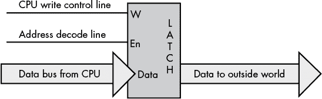
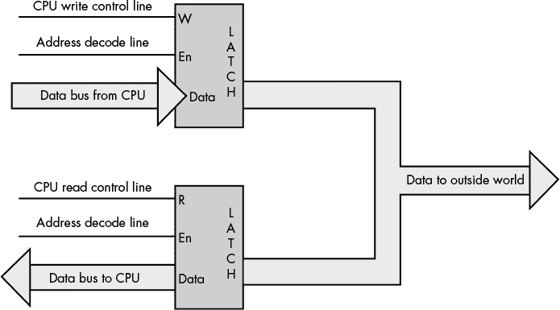
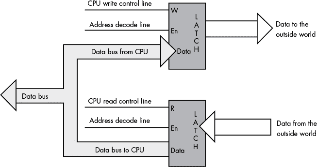
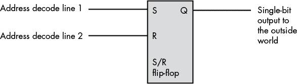
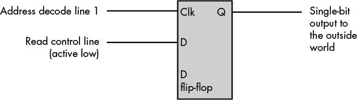
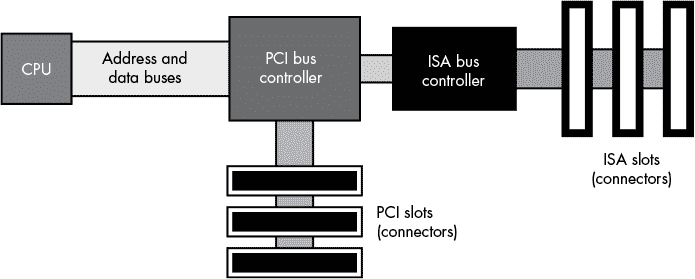
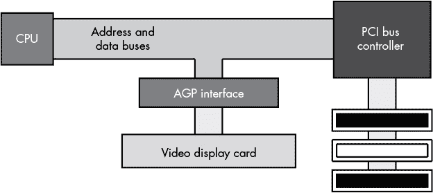

## 第十二章：输入与输出**


一个典型程序有三个基本任务：输入、计算和输出。到目前为止，我们主要关注计算机系统的计算方面，但现在我们将转向输入和输出。

本章将重点讨论 CPU 的原始输入/输出（I/O）活动，而不是高层应用通常使用的抽象文件或字符 I/O。它将讨论 CPU 如何将数据传输到外部世界并从外部世界获取数据，特别关注 I/O 操作背后的性能问题。由于所有高层 I/O 活动最终都会通过低层 I/O 系统进行，因此如果你想编写与外部世界高效通信的程序，理解这些过程的工作原理至关重要。

### 12.1 将 CPU 连接到外部世界

首先要知道的是，典型计算机系统中的 I/O 与典型高级编程语言中的 I/O 截然不同。在计算机系统的原始 I/O 层次上，你很少能找到像 Pascal 的 `writeln`、C++ 的 `cout`、C 的 `printf`、Swift 的 `print`，甚至 HLA 的 `stdin` 和 `stdout` 语句那样的机器指令。事实上，大多数 I/O 机器指令的行为完全像 80x86 的 `mov` 指令。为了将数据发送到输出设备，CPU 只需将数据移动到一个特殊的内存位置；而为了从输入设备读取数据，CPU 会从设备的地址中获取数据。I/O 操作的行为与内存的读写操作非常相似，不同之处在于 I/O 通常涉及更多的等待状态。

根据 CPU 在给定端口地址上读取和写入数据的能力，I/O 端口可以分为五类：只读、写入、读/写、双重 I/O 和双向 I/O。

*只读端口*是一个输入端口。如果 CPU 只能从端口读取数据，那么这些数据必须来自计算机系统外部的某个来源。尝试写入只读端口通常不是一个好主意，因为尽管硬件通常会忽略这种尝试，但它可能会导致某些设备出现故障。一个好的只读端口例子是原始 IBM PC 上并行打印机接口的状态端口。该端口的数据指定打印机的当前状态，而硬件会忽略写入该端口的任何数据。

*写入端口*始终是一个输出端口。写入此类端口的数据可以供外部设备使用。尝试从写入端口读取数据通常会返回总线上的垃圾值，因此你的程序不应依赖于这些值的含义。输出端口通常使用一个锁存器设备来存储要发送到外部世界的数据。当 CPU 写入与输出锁存器关联的端口地址时，锁存器会存储数据，并将其通过一组外部信号线提供（见图 12-1）。



*图 12-1：典型的写入端口*

输出端口的一个完美示例是并行打印机端口。CPU 通常将一个 ASCII 字符写入一个字节宽的输出端口，该端口连接到计算机机箱背面的 DB-25F 连接器。通过电缆将此数据传输到打印机，打印机的输入端口接收到该数据（从打印机的角度来看，它是从计算机系统读取数据）。打印机内部的处理器通常将此 ASCII 字符转换为一系列点，并打印到纸上。

输出端口可以是只写或读/写端口。例如，图 12-1 中的端口是一个只写端口。由于触发器上的输出不会回路到 CPU 的数据总线，因此 CPU 无法读取触发器中包含的数据。要使触发器工作，地址解码线（En）和写控制线（W）都必须处于激活状态。如果 CPU 尝试读取触发器地址上的数据，地址解码线虽然处于激活状态，但写控制线未激活，因此触发器不会响应读取请求。

*读/写端口*从外界角度来看是一个输出（只写）端口。然而，顾名思义，CPU 也可以从这样的端口读取数据——具体来说，它读取的是最后写入该端口的数据。这样做不会影响传递给外部外设的数据显示。^(1) 图 12-2 展示了一个读/写端口。



*图 12-2：读/写端口*

如你所见，写入输出端口的数据会回路到第二个触发器。将这两个触发器的地址放置在地址总线上，会激活两个触发器的*地址解码线*。因此，为了在这两个触发器之间选择，CPU 还必须激活读线或写线。激活读线（即在读操作过程中发生的情况）将启用下触发器。这会将先前写入输出端口的数据放到 CPU 的数据总线上，允许 CPU 读取该数据。

图 12-2 中的端口不是输入端口——真正的输入端口从外部引脚读取数据。尽管 CPU 可以从这个触发器读取数据，但该电路的结构只是允许 CPU 读取它之前写入端口的数据，从而避免程序必须将该值保存在单独的变量中。外部连接器上的数据仅供输出，不能将现实世界的输入设备连接到这些信号引脚。

*双 I/O 端口*也是一个读/写端口，但当你读取双 I/O 端口时，你是从外部输入设备读取数据，而不是从端口地址的输出侧读取最后写入的数据。向双 I/O 端口写入数据会将数据传输到某个外部输出设备，就像向只写端口写入数据一样。图 12-3 展示了如何将双 I/O 端口与系统进行接口。



*图 12-3：双 I/O 端口*

双 I/O 端口实际上是由两个端口组成——一个只读端口和一个只写端口——它们共享相同的端口地址。读取该地址会访问只读端口，而写入该地址会访问只写端口。本质上，这种端口安排利用了读（R）和写（W）控制线，提供了一个额外的地址位，指定使用哪一个端口。

最后，*双向端口*允许 CPU 既能从外部设备读取数据，又能向外部设备写入数据。为了正常工作，双向端口必须向外围设备传递各种控制线，如读写使能信号，以便设备能够根据 CPU 的读写请求改变数据传输的方向。实际上，双向端口通过双向锁存器或缓冲器扩展了 CPU 的总线。

通常，给定的外围设备使用多个 I/O 端口。例如，原始的 IBM PC 并行打印机接口使用了三个端口地址：一个读写 I/O 端口、一个只读输入端口和一个只写输出端口。读写数据端口允许 CPU 读取通过它写入的最后一个 ASCII 字符。输入端口返回来自打印机的控制信号，指示打印机是否准备好接收另一个字符、是否离线、是否缺纸等状态。输出端口则向打印机传输控制信息。后来的 PC 型号用双向端口替代了数据端口，通过并行端口实现设备间的数据传输。双向数据端口提高了连接到 PC 并行端口的各种设备（如磁盘和磁带驱动器）的性能。（当然，现代 PC 通过 USB 端口与打印机通信——从硬件角度来看，这是完全不同的一种设备。）

### 12.2 连接端口到系统的其他方式

到目前为止的例子可能给你留下了这样一个印象：CPU 总是通过数据总线读取和写入外围设备数据。然而，虽然 CPU 通常会通过数据总线传输从输入端口*读取*的数据，但它并不总是通过数据总线将数据*写入*输出端口。事实上，一种非常常见的输出方式是直接访问端口的地址，而不向其写入任何数据。图 12-4 展示了一个使用置位/复位（S/R）触发器的简单例子，演示了这一技术。



*图 12-4：通过直接访问端口输出数据*

在该电路中，地址解码器解码两个独立的地址。对第一个地址的任何读写访问都会将输出线设置为`1`；对第二个地址的任何读写访问都会将输出线设置为`0`。该电路忽略了 CPU 数据线上的数据以及读写线的状态。唯一重要的是，CPU 访问了这两个地址中的一个。

另一种将输出端口连接到系统的方法是将读/写状态线连接到 D 触发器的数据输入端。图 12-5 展示了如何设计这样的设备。



*图 12-5：使用读/写控制作为输出数据的方式*

在此图中，任何对端口的读取操作都会将输出位设置为`0`，而对该端口的任何写入操作都会将输出位设置为`1`（在写入指定地址时，读控制线会是`HIGH`）。

这些只是工程师们为避免使用数据总线（主要是为了降低硬件成本或提高性能）而设计的众多方案中的两个例子。然而，除非另有说明，本章中其余的例子假设 CPU 通过数据总线与外部设备进行数据的读写。

### 12.3 I/O 机制

计算机系统用来与外设设备通信的三种基本 I/O 机制是：内存映射输入/输出、I/O 映射输入/输出和直接内存访问（DMA）。*内存映射 I/O*使用 CPU 内存地址空间中的普通位置与外设设备进行通信。*I/O 映射输入/输出*使用与内存分开的地址空间，并且通过特殊的机器指令在该 I/O 地址空间与外部世界之间传输数据。*直接内存访问（DMA）*是一种特殊的内存映射 I/O 形式，其中外设设备在没有 CPU 干预的情况下读取和写入位于内存中的数据。每种 I/O 机制都有其优点和缺点，我们将在本节中讨论。

通常，硬件系统设计师决定设备如何连接到计算机系统；程序员对这个决定几乎没有控制权。然而，通过关注用于 CPU 与外设之间通信的 I/O 机制的成本与效益，你可以选择最大化应用程序中 I/O 性能的代码序列。

#### *12.3.1 内存映射 I/O*

内存映射外设设备与 CPU 的地址和数据线连接的方式与常规内存相同，因此每当 CPU 写入或读取与外设相关联的地址时，CPU 都会将数据传输到设备或从设备传输数据。这种机制有几个优点，仅有少数几个缺点。

内存映射 I/O 子系统的主要优点是 CPU 可以使用任何访问内存的指令，如`mov`，在 CPU 与外设之间传输数据。例如，如果你正在尝试访问一个读/写或双向端口，你可以使用 80x86 的*读/修改/写*指令，如`add`，来读取端口、操作值，然后将数据写回端口，所有这些操作只需一个指令。当然，如果端口是只读或只写的，那么这样的指令就没有太大用处。

内存映射 I/O 设备的一个大缺点是它们会占用 CPU 内存映射中的地址空间。外设设备消耗的每一个地址字节，都会减少一个可用于安装实际内存的字节。通常，分配给外设（或一组相关外设）的最小空间是一个内存页（在 80x86 架构中为 4,096 字节）。幸运的是，一台典型的 PC 通常只有几十个这样的设备，因此这通常不是大问题。然而，对于一些外设设备（如显卡）来说，这可能会成为问题，因为它们会消耗大量地址空间。一些显卡拥有 1GB 到 32GB 的板载内存，并将其映射到内存地址空间中，这意味着这些显卡消耗的 1GB 到 32GB 地址范围无法作为常规内存被系统使用（尽管在 64 位处理器上，这几乎不会成为问题）。

I/O 与缓存

CPU 不能缓存用于内存映射 I/O 端口的值。从输入端口缓存数据意味着后续读取该端口时，会从缓存中访问值，而不是直接从端口读取数据，而端口的数据可能会发生变化。同样，在写回缓存机制下，某些写操作可能永远无法到达输出端口，因为 CPU 可能会先将多个写操作保存在缓存中，然后再将最后一个写操作发送到实际的 I/O 端口。为了避免这些潜在问题，我们需要一种机制来告诉 CPU 不要缓存对某些内存位置的访问。

解决方案在于 CPU 的内存管理子系统。例如，80x86 的页表项包含一个标志，CPU 可以使用该标志来确定是否可以将内存中的页面数据映射到缓存中。如果该标志设置为某个方式，缓存会正常工作；如果该标志设置为另一种方式，CPU 不会缓存对该页面的访问。

#### *12.3.2 I/O 映射输入/输出*

如前所述，I/O 映射输入/输出使用一个与正常内存空间分开的特殊 I/O 地址空间，并结合特殊的机器指令来访问设备地址。例如，80x86 CPU 提供了 `in` 和 `out` 指令，专门用于这个目的。这些指令的行为类似于 `mov`，不同之处在于它们传输数据时使用的是特殊的 I/O 地址空间，而不是普通的内存地址空间。通常，提供 I/O 映射输入/输出功能的处理器使用相同的物理地址总线来传输内存地址和 I/O 设备地址。额外的控制线区分了属于正常内存空间的地址和属于特殊 I/O 地址空间的地址。这意味着这类 CPU 可以同时使用 I/O 映射输入/输出或内存映射 I/O。因此，如果 CPU 地址空间中的 I/O 映射位置数量不足，硬件设计师始终可以改用内存映射 I/O（就像典型 PC 上的显卡一样）。

在现代的 80x86 PC 系统中，使用 PCI 总线（或其后续变种）的系统主板上的特殊外设芯片将 I/O 地址空间重新映射到主内存空间，从而允许程序使用内存映射或 I/O 映射输入/输出访问 I/O 映射的设备。

#### *12.3.3 直接内存访问*

内存映射 I/O 子系统和 I/O 映射子系统都是*程序化 I/O*的一种形式，因为它们要求 CPU 在外设设备和内存之间移动数据。为了将从程序化 I/O 输入端口获取的 10 字节数据存储到内存中，CPU 必须从输入端口读取每个值并将其存储到内存中。

然而，通过 CPU 每次处理 1 字节（或字或双字）的数据可能对于非常高速的 I/O 设备来说过于缓慢。这些设备通常有一个接口连接到 CPU 的总线，这样它们可以直接读写内存——也就是说，无需 CPU 作为中介。直接内存访问（DMA）允许 I/O 操作与其他 CPU 操作并行进行，从而提高系统的整体速度——除非 CPU 和 DMA 设备同时试图使用地址和数据总线。只有当总线为空闲时，I/O 设备才能并行处理，这种情况发生在 CPU 拥有缓存并访问缓存的代码和数据时。尽管如此，即使 CPU 必须停止并等待 DMA 操作完成才能开始不同的操作，DMA 方法仍然要快得多，因为许多总线操作是指令获取或 I/O 端口访问，这些操作在 DMA 操作期间不会发生。

一个典型的 DMA 控制器由一对计数器和其他电路组成，电路与内存和外设设备进行接口。一个计数器作为地址寄存器，为每次传输提供地址总线上的地址。第二个计数器指定数据传输的数量。应用程序用应该开始传输数据的块的地址初始化 DMA 控制器的地址计数器。每当外设设备想要向内存传输数据或从内存传输数据时，它会向 DMA 控制器发送信号，后者将地址计数器的值放置在地址总线上。与 DMA 控制器协调，外设设备在输入操作期间将数据放置到数据总线上以写入内存，或者在输出操作期间从数据总线上读取内存中取出的数据。^(2) 在成功的数据传输后，DMA 控制器递增其地址寄存器并递减传输计数器。此过程会重复，直到传输计数器递减为零。

### 12.4 I/O 速度层级

不同的外设有不同的数据传输速率。一些设备，如键盘，与 CPU 的速度相比极为缓慢。其他设备，如固态硬盘驱动器，实际上可以比 CPU 处理数据的速度更快地传输数据。数据传输的适当编程技巧在很大程度上取决于参与 I/O 操作的外设的传输速度。因此，在讨论如何编写最合适的代码之前，我们应当建立一些术语，以描述外设的不同传输速率。

**低速设备**：数据产生或消耗速率远低于 CPU 可处理速率的设备。为了讨论的目的，我们假设低速设备的工作速度比 CPU 慢三倍或更多数量级。

**中速设备**：数据传输速率大致与 CPU 相同，或比 CPU 慢三个数量级的设备（使用程序化 I/O 访问设备）。

**高速设备**：数据传输速度超过 CPU 使用程序化 I/O 处理的设备。

外设的速度决定了 I/O 操作使用的 I/O 机制类型。显然，高速设备必须使用 DMA，因为程序化 I/O 太慢。中速和低速设备可以使用三种 I/O 机制中的任何一种进行数据传输（尽管低速设备由于额外硬件成本的原因很少使用 DMA）。

对于典型的总线架构，CPU 每微秒可以进行一次数据传输，甚至更快。因此，高速设备是指那些数据传输速度超过每微秒一次的设备。中速传输是指每 1 到 100 微秒进行一次数据传输的设备。低速设备通常每 100 微秒以上才传输一次数据。当然，低速、中速和高速设备的这些定义是依赖于系统的。更快的 CPU 和总线支持更快的中速操作。

请注意，每微秒一次的传输与每秒 1MB 的传输速率并不相同。外设实际上每次数据传输操作可以传输超过 1 字节的数据。例如，当使用 80x86 `in(dx,` `eax);` 指令时，外设可以在一次传输中传输 4 字节的数据。因此，如果设备能够每微秒进行一次传输，它可以通过此指令以每秒 4MB 的速度进行数据传输。

### 12.5 系统总线和数据传输速率

在第六章中，你看到 CPU 使用系统总线与内存和 I/O 设备进行通信。如果你曾经查看过计算机内部或阅读过系统规格，你可能见过诸如 *PCI*、 *ISA*、 *EISA* 或甚至 *NuBus* 等术语，用来指代计算机的系统总线。在本节中，我们将讨论这些不同的计算机系统总线如何与 CPU 总线相关，以及它们如何影响系统的性能。

单一计算机系统通常使用多个总线。因此，软件工程师可以根据外设设备的总线连接选择使用哪些外设设备。为了最大化某一特定总线的性能，可能需要不同于其他总线的编程技术。尽管无法选择特定计算机系统所采用的总线，但软件工程师可以在可用的总线中进行选择，以提升应用程序的性能。

计算机系统总线，如 PCI（外设组件互连）和 ISA（工业标准架构），定义了计算机系统内部的物理连接器。具体来说，它们描述了一组电子信号（总线上的*连接针脚*）、物理尺寸（即连接器布局及其相互之间的距离）以及连接不同电子设备的数据传输协议。这些总线通常是 CPU *本地总线*（地址、数据和控制线）的扩展，因为系统总线上的许多信号与 CPU 的信号是相同的。

然而，外设总线本身不一定与 CPU 的总线相同——它们可能比 CPU 上的信号多或少。例如，ISA 总线仅支持 24 条地址线，而英特尔和 AMD 的 x86-64 总线则支持 40 到 52 条地址线。

不同的外设设备被设计为使用不同的外设总线。图 12-6 显示了典型计算机系统中 PCI 和 ISA 总线的组织结构。^(3)



*图 12-6：典型 PC 中 PCI 和 ISA 总线的连接*

注意 CPU 的地址和数据总线如何连接到 PCI 总线控制器外设设备，但不直接连接到 PCI 总线本身。PCI 总线控制器包含两组针脚，提供一个 *桥接*，连接 CPU 的本地总线和 PCI 总线。当地总线上的信号线不会直接连接到 PCI 总线上的对应信号线；相反，PCI 总线控制器充当中介，重新路由所有 CPU 和 PCI 总线之间的数据传输请求。

请注意，ISA 总线控制器通常连接到 PCI 总线控制器，而不是直接连接到 CPU。这通常是出于成本或性能的考虑（例如，可能有一个限制，规定能够直接连接到 CPU 总线的设备数量，超出这个数量可能需要额外的缓冲）。

CPU 的本地总线通常以 CPU 频率的一部分运行。当前典型的本地总线频率为 66 MHz、100 MHz、133 MHz、400 MHz、533 MHz 和 800 MHz，但它们可能会变得更快。通常，只有内存和少数选定外设，如 PCI 总线控制器，才能连接到 CPU 的总线，并在这个高频率下运行。

因为典型的 CPU 总线宽度为 64 位，并且理论上每个时钟周期可以完成一次数据传输，所以 CPU 的总线最大数据传输速率为每秒 8 字节乘以时钟频率，例如对于 100 MHz 的总线为每秒 800MB。实际上，CPU 很少能够达到最大数据传输速率，但它们通常能达到某个百分比的速率，因此总线越快，数据在给定时间内进出 CPU（及缓存）的速度就越快。

#### *12.5.1 PCI 总线的性能*

PCI 总线有几种配置。基础配置有一个 32 位宽的数据总线，运行在 33 MHz。像 CPU 的本地总线一样，PCI 总线理论上能够在每个时钟周期传输数据。这意味着总线的理论最大数据传输速率为 4 字节乘以 33 MHz，即每秒 132MB。然而，实际上，PCI 总线除非在短暂的突发模式下，否则无法接近这一性能水平。更新版本的 PCI-e 提供多达 16 条“通道”，使数据传输速度更快（主要用于高性能显卡）。

每当 CPU 想要访问 PCI 总线上的外设时，它必须与其他外设协商以获得使用总线的权利。这种协商可能需要几个时钟周期，直到 PCI 控制器授予 CPU 访问总线的权限。如果 CPU 每次总线传输写入双字，协商时间实际上会大大降低传输速率。要接近总线的最大理论带宽，唯一的方法是使用 DMA 控制器并以*突发模式*传输数据。在突发模式下，DMA 控制器只进行一次协商，然后进行多次传输，在每次传输之间不释放总线。

PCI 总线有几个增强功能可以提高性能。一些 PCI 总线支持 64 位宽的数据路径。显然，这将最大理论数据传输速率从每次传输 4 字节提高到每次传输 8 字节。另一个增强功能是将总线运行在 66 MHz，这也将吞吐量翻倍。使用 64 位宽、66 MHz 的总线，数据传输速率将是基线配置的四倍。这些 PCI 总线的可选增强功能使其能够随着 CPU 性能的提升而增长。高性能版本的 PCI 总线——PCI-X 曾经使用一段时间，但它已经被 PCI-e 总线所取代。PCI-e 是一种串行总线，通过几条数据线串行传输数据。然而，它使用通道并行传输额外的数据。例如，16 通道的 PCI-e 总线比单通道版本快 16 倍。

#### *12.5.2 ISA 总线的性能*

ISA 总线是从原始的 PC/AT 计算机系统继承下来的。该总线宽 16 位，工作频率为 8 MHz。每个总线周期需要四个时钟周期（*总线周期*是指通过 ISA 总线传输一个 16 位数据字所需的时间）。由于这些原因，ISA 总线每微秒大约只能完成一次数据传输。使用 16 位宽的总线时，数据传输速率大约为每秒 2MB。这比 CPU 本地总线和 PCI 总线都要慢得多。通常，ISA 总线只能支持低速和中速设备——如 RS-232 通信设备、调制解调器或并行打印机接口——连接到 ISA 总线。大多数其他设备，如磁盘、扫描仪和网络卡，速度都超过了 ISA 总线的能力。

在大多数系统上访问 ISA 总线首先需要争取 PCI 总线的使用权，但因为 PCI 总线的速度远快于 ISA 总线，这种协商时间对 ISA 总线上外设的性能几乎没有影响。因此，将 ISA 控制器直接连接到 CPU 的本地总线并不会显著提高性能。

幸运的是，ISA 总线如今已经彻底过时，你在现代 PC 上是找不到它的。少数工业 PC 和 SBC（单板计算机）仍然支持 ISA 总线连接，以兼容遗留应用程序，但除此之外，ISA 总线已经不复存在。

#### *12.5.3 AGP 总线*

视频显示（即图形）卡是非常特殊的外设，它们需要极高的总线性能，以确保快速的屏幕更新和图形操作。不幸的是，如果 CPU 必须不断与其他外设争用 PCI 总线的使用权，图形性能可能会受到影响。为了解决这个问题，显卡设计师创造了*加速图形端口（AGP）*，它是 CPU 本地总线与视频显示卡之间的接口，提供了多种控制线和总线协议，专门为视频显示卡设计。

AGP 连接允许 CPU 快速将数据传输到视频显示 RAM 并从中获取数据（见图 12-7）。



*图 12-7：AGP 总线接口*

因为每个系统只有一个 AGP 端口，所以一次只能有一张显卡使用 AGP 插槽。这样做的好处是系统无需与其他设备争用 AGP 总线的访问权限。然而，到了 2008 年，显卡的性能超过了 AGP 总线的性能。大多数现代显卡改用多通道 PCI-e 总线接口。

### 12.6 缓冲区

如果某个 I/O 设备生成或消耗数据的速度超过了系统能够从该设备传输数据的速度，系统设计者有两个选择：提供更快的连接以连接 CPU 和设备，或降低两者之间的数据传输速度。

如果外围设备连接到像 ISA 这样较慢的总线，系统设计师可以通过切换到更宽的总线（如 64 位 PCI）、更快的总线（具有更高频率的总线）或更高性能的总线（如 PCI-e）来创建更快的连接。系统设计师有时还可以创建更快的总线接口，正如他们在 AGP 连接中所做的那样。

另一种选择——减慢外围设备与计算机系统之间的传输速率——并不像最初看起来那么糟糕。大多数高速设备并不是以恒定的速率向系统传输数据。相反，它们通常会快速传输一块数据，然后闲置一段时间。虽然突发速率高于 CPU 或内存能够处理的速率，但平均数据传输速率通常较低。如果你能够平衡高带宽的峰值，并在外围设备空闲时传输一些数据，就可以轻松地在外围设备和计算机系统之间移动数据，而不需要依赖昂贵的高带宽总线或连接。

这个技巧是利用外围设备的内存来缓冲数据。外围设备在输入操作时可以快速将数据填充到缓冲区，而在输出操作时可以快速从缓冲区提取数据。一旦外围设备处于空闲状态，系统就以可持续的速度清空或重新填充缓冲区。只要外围设备的平均数据传输速率低于系统所支持的最大带宽，并且缓冲区足够大以容纳传入和传出的数据，这种方案就可以让外围设备以较低的平均数据传输速率与系统进行通信。

通常，为了节省成本，缓冲会发生在 CPU 的内存中，而不是外围设备上。在这种情况下，通常由软件工程师负责为外围设备初始化缓冲区。在某些情况下，外围设备或操作系统都不会为外围设备的数据提供缓冲区，因此应用程序必须提供缓冲区，以保持最大性能并避免数据丢失。在其他情况下，设备或操作系统可能提供一个小的缓冲区，但应用程序可能不会处理数据足够频繁，导致小缓冲区中的数据溢出；在这种情况下，应用程序可以创建一个更大的本地缓冲区。

### 12.7 握手

许多 I/O 设备不能接受任何速率的数据。例如，一个基于 i9 的 PC 每秒可以发送数亿个字符到打印机，但打印机无法每秒打印这么多字符。同样，一个输入设备（如键盘）永远不会每秒向系统传输数百万次按键（因为键盘的操作速度是人类速度，而不是计算机速度）。由于这些能力上的差异，CPU 需要某种方式来协调计算机系统与外围设备之间的数据传输。

一种常见的方法是通过一个与数据端口不同的端口发送和接收状态位。例如，打印机可以发送一个单独的位来告诉系统它是否准备好接收更多数据。同样，另一个端口中的单一状态位可以指示键盘数据端口是否有按键输入。CPU 可以在向打印机写入字符或从键盘读取键值之前测试这些位。

使用状态位指示设备是否准备好接收或传输数据被称为*握手*，因为这种协议类似于两个人通过握手表示达成一致。

以下 80x86 汇编语言程序段演示了握手的工作原理：

```
mov( $379, dx );      // Initialize DX with the address of the status port.

repeat

    in( dx, al );     // Get the parallel port status into the AL register.

    and( $80, al );   // Clear z flag if the HO bit is set.

until( @nz );         // Repeat until the HO bit contains a 1.

// Okay to write another byte to the printer data port here.
```

这段代码会持续循环，直到打印机状态寄存器（在输入端口`$379`处）的 HO 位为`0`，并且一旦 HO 位被设置（表示打印机已准备好接收数据），循环才会退出。

### 12.8 I/O 端口超时

上一节中`repeat..until`循环的一个问题是，它可能会无限旋转，等待打印机准备好接收更多输入。如果有人关闭了打印机或者打印机电缆断开，程序可能会冻结，永远等待打印机重新可用。通常，更好的做法是在出现问题时告知用户，而不是让系统挂起。为此，可以在循环中加入*超时*期限；一旦超过该期限，超时就会导致程序提示用户外设设备出现问题。

大多数外设设备在合理时间内都会有所响应。例如，即使在最坏的情况下，大多数打印机也会在上次传输后的几秒钟内准备好接收额外的字符数据。因此，如果超过 30 秒或更长时间，打印机没有接收新字符，可能存在问题。通常，编写的程序会暂停，提示用户检查打印机，之后用户确认问题解决后，程序会继续打印。

选择一个合适的超时期限并不是一件容易的事。你必须仔细平衡程序可能产生的虚假警报带来的烦恼与程序在出现实际问题时长时间卡住的痛苦。这两种情况同样令人恼火。

创建超时期限的一个简单方法是计算程序在等待外设的握手信号时循环的次数。考虑以下对上一节`repeat..until`循环的修改：

```
mov( $379, dx );          // Initialize DX with the address of the status port.

mov( 30_000_000, ecx );   // Timeout period of approximately 30 seconds,

                          // assuming port access time is about 1 microsecond.

HandshakeLoop:

    in( dx, al );         // Get the parallel port status into the AL register.

    and( $80, al );       // Clear z flag if the HO bit is set.

loopz HandshakeLoop;      // Decrement ECX and loop while ECX <> 0 and

                          // the HO bit of AL contains a 0.

if( ecx <> 0 ) then

    // Okay to write another byte to the printer data port here.

else

    // We had a timeout condition if we get here.

endif;
```

这段代码将在打印机准备好接受数据时退出，或者大约 30 秒后退出。你可能会对 30 秒的数字产生疑问，因为基于软件的循环（将 ECX 计数到 0）在不同处理器上运行的速度应该不同。然而，`in()`指令读取总线上的端口，这意味着该指令执行大约需要 1 微秒（I/O 端口通常会注入很多等待状态）。因此，循环执行一百万次大约需要 1 秒（上下浮动 50%，但对于我们的目的来说足够接近）。几乎无论 CPU 的频率如何，这一点都是成立的。

### 12.9 中断和轮询输入/输出

*轮询*是不断测试端口以查看数据是否可用的过程。前面章节中的握手循环提供了轮询的好例子——CPU 在一个短小的循环中等待，测试打印机端口的状态值，直到打印机准备好接受更多数据，然后 CPU 可以将更多数据传输到打印机。轮询输入/输出本质上是低效的。如果这个例子中的打印机需要 10 秒钟来接收另一个字节的数据，那么在这 10 秒钟内，CPU 什么都不做，完全浪费时间。

在早期的个人计算机系统中，程序的行为正是如此。当程序想要从键盘读取一个按键时，它会轮询键盘状态端口，直到有按键输入。这些早期的计算机在等待键盘时无法进行其他处理。

解决这个问题的方法是使用*中断机制*。中断是由外部硬件事件触发的，例如打印机准备好接收另一个字符，这会导致 CPU 中断当前的指令序列并调用一个特殊的*中断服务程序（ISR）*。通常，ISR 会执行以下一系列事件：

1.  它保留了所有机器寄存器和标志的当前值，以便中断的计算可以稍后继续。

1.  它执行所需的操作来*服务*该中断。

1.  它恢复寄存器和标志为中断前的值。

1.  它恢复被中断的代码的执行。

在大多数计算机系统中，典型的 I/O 设备在将数据提供给 CPU 时，或在能够接收来自 CPU 的数据时，都会产生一个中断。ISR 在后台快速处理中断请求，允许前台的其他计算继续正常进行。

虽然 ISR 通常由操作系统设计者或外围设备制造商编写，大多数操作系统允许通过*信号*或类似机制将中断传递给应用程序。这使得你可以直接在应用程序中包含 ISR。例如，你可以利用这个功能，当外围设备的内部缓冲区已满时，通知应用程序，并让应用程序将数据从外围设备的缓冲区复制到应用程序的缓冲区，以防止数据丢失。

### 12.10 受保护模式操作与设备驱动程序

如果你正在使用一个古老的 Windows 95 或 98 系统，你可以编写汇编代码直接访问 I/O 端口。前面提到的握手代码就是一个很好的例子。然而，现代版本的 Windows 以及所有版本的 Linux 和 macOS 都采用了*受保护模式*操作。在这种模式下，只有操作系统和某些特权程序可以直接访问设备。标准应用程序，即使是用汇编语言编写的，也没有这种特权。如果你编写一个简单的程序，试图将数据发送到 I/O 端口，系统会产生一个非法访问异常并停止你的程序。

Linux 不允许任何程序访问 I/O 端口，只有拥有“超级用户”（root）权限的程序才能这样做。对于有限的 I/O 访问，可以使用 Linux 的 `ioperm` 系统调用，使某些 I/O 端口对用户应用程序可用。（有关更多详细信息，请阅读 `ioperm` 的 man 页面。）

如果 Linux、macOS 和 Windows 不允许直接访问外部设备，那么程序是如何与这些设备进行通信的呢？显然，这是*可以*做到的，因为应用程序一直在与现实世界的设备互动。答案是，这些操作系统允许特别编写的模块，即*设备驱动程序*，来访问 I/O 端口。编写设备驱动程序的完整讨论远远超出了本书的范围，但了解它们的工作原理有助于你理解在受保护模式操作系统下 I/O 的可能性和局限性。

#### *12.10.1 设备驱动模型*

设备驱动程序是一种特殊类型的程序，它与操作系统相连接。它必须遵循一些特定的协议，并且必须调用操作系统的某些特殊接口，这些接口是标准应用程序无法使用的。此外，为了在系统中安装设备驱动程序，你必须拥有管理员权限，因为设备驱动程序可能带来各种安全性和资源分配风险，你不能让系统变得脆弱。因此，安装过程不是一件简单的事情，应用程序也不能随意加载或卸载驱动程序。

幸运的是，典型 PC 上的设备数量是有限的，因此你只需要有限数量的设备驱动程序。你通常会在安装设备的同时在操作系统中安装设备驱动程序，或者如果设备内置于 PC 中，则在安装操作系统时一并安装。实际上，只有在自己构建设备时，或者在某些特殊情况下，你需要利用某些标准设备驱动程序无法处理的设备功能时，才需要编写自己的设备驱动程序。

设备驱动程序模型非常适用于低速设备，在这种情况下，操作系统和设备驱动程序能够比设备所需的速度更快地响应设备。该模型对于中高速设备也非常适用，尤其是在系统需要传输大量数据块到设备与设备之间时。然而，设备驱动程序模型也有一些缺点，其中之一是它不支持需要设备与应用程序之间进行大量交互的中高速数据传输。

问题在于，调用操作系统是一个昂贵的过程。每当应用程序调用操作系统将数据传输到设备时，可能需要几百微秒，甚至几毫秒，设备驱动程序才能实际看到应用程序的数据。如果设备与应用程序之间的交互需要持续不断的数据传输，那么如果每次传输都必须通过操作系统，就会产生很大的延迟。对于这类应用程序，你需要编写一个特殊的设备驱动程序，能够自行处理交易，而不是不断地返回给应用程序。

因为应用程序不能直接访问设备（在现代操作系统中），它们之间的所有通信必须通过设备驱动程序作为中介进行。那么，问题是，应用程序如何与设备驱动程序进行通信？

#### *12.10.2 与设备驱动程序的通信*

在大多数情况下，现代操作系统下与外部设备的通信就像向文件写入数据或从文件读取数据一样。在大多数操作系统中，你通过使用特殊的文件名如*COM1*（串行端口）或*LPT1*（并行端口）来打开一个“文件”，操作系统会自动与指定的设备建立连接。当你使用完设备时，你需要“关闭”关联的文件，这告诉操作系统应用程序已经完成对该设备的使用，其他应用程序可以使用该设备。

当然，大多数设备并不支持与磁盘文件相同的语义。有些设备，如打印机或调制解调器，可以接受一长串未格式化的数据流，但其他设备可能需要你将数据预先格式化为块，并通过单次写操作将这些块写入设备。具体的语义取决于特定的设备。不过，向外部设备发送数据的典型方法是使用操作系统的“写”函数，向该函数传递一个包含一些数据的缓冲区，而从设备读取数据的方法是调用操作系统的“读”函数，向该函数传递一个缓冲区的地址，操作系统将数据写入该缓冲区。

但是并非所有设备都符合这些*流式 I/O*文件 I/O 的数据语义。因此，大多数操作系统提供了一个*设备控制 API*，允许你将信息直接传递给外部设备的设备驱动程序，以处理流式 I/O 模型失败的情况。

由于各个操作系统不同，关于操作系统 API 接口的具体细节超出了本书的范围。尽管大多数操作系统使用类似的方案，但它们的差异足以使得无法用一般方式描述它们。因此，欲了解更多详情，请参考你特定操作系统的程序员参考手册。

### 12.11 更多信息

Silberschatz, Abraham, Peter Baer Galvin, 和 Greg Gagne. “第十三章: 输入/输出系统.” 载于 *操作系统概念*. 第 8 版. 霍博肯, NJ: 约翰·威利与儿子出版社, 2009 年。

**注意**

*Patterson 和 Hennessy 的早期版本*《计算机架构：定量方法*提供了关于 I/O 设备和总线的良好章节；可惜的是，由于它涵盖了非常旧的外围设备，作者决定删除该章节，而不是在后续版本中更新它。互联网搜索似乎是你能找到关于这个主题一致信息的最后地方（当然，除了这本书）。*
