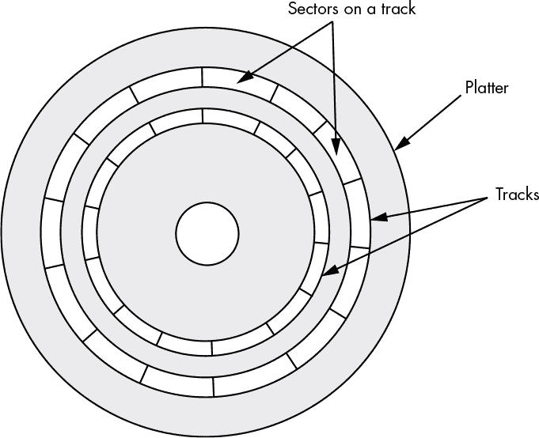
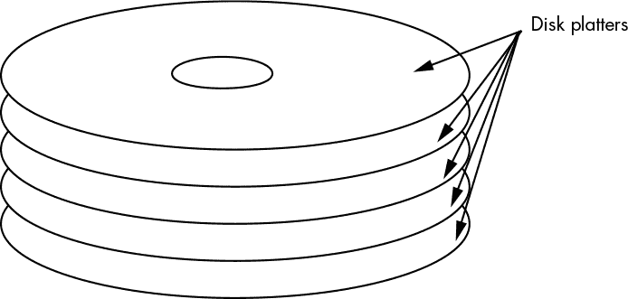
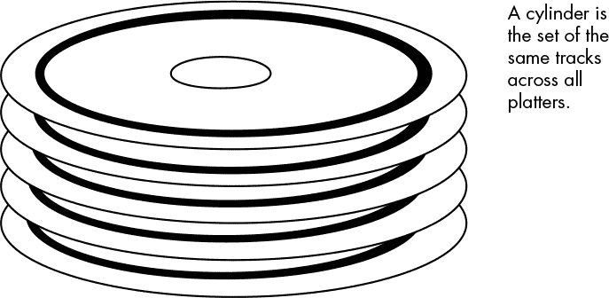
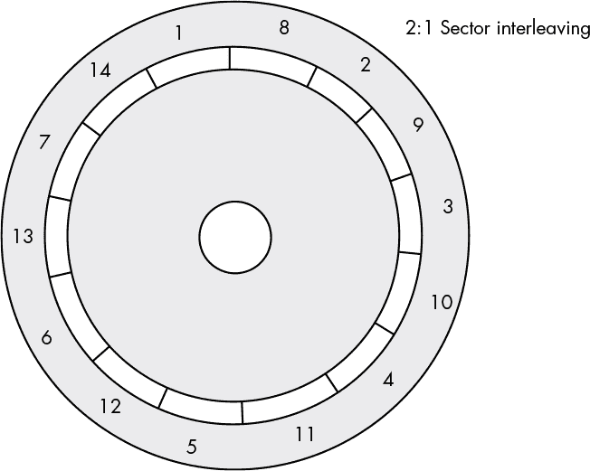
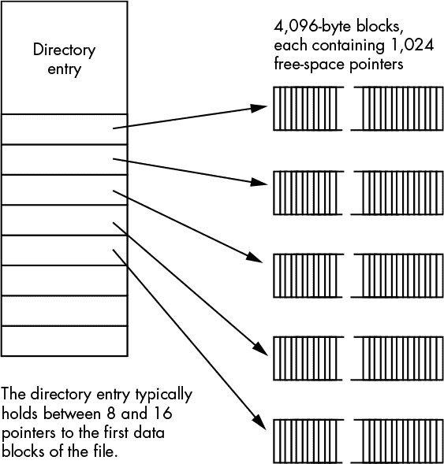
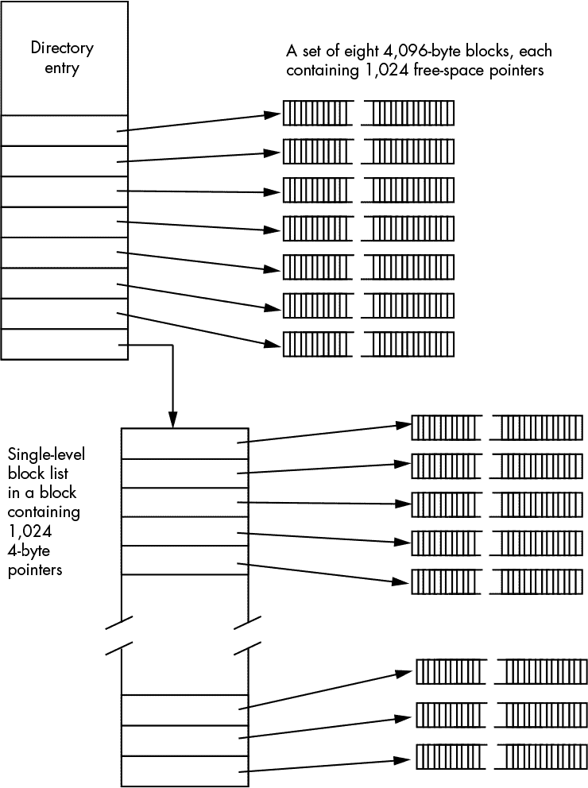
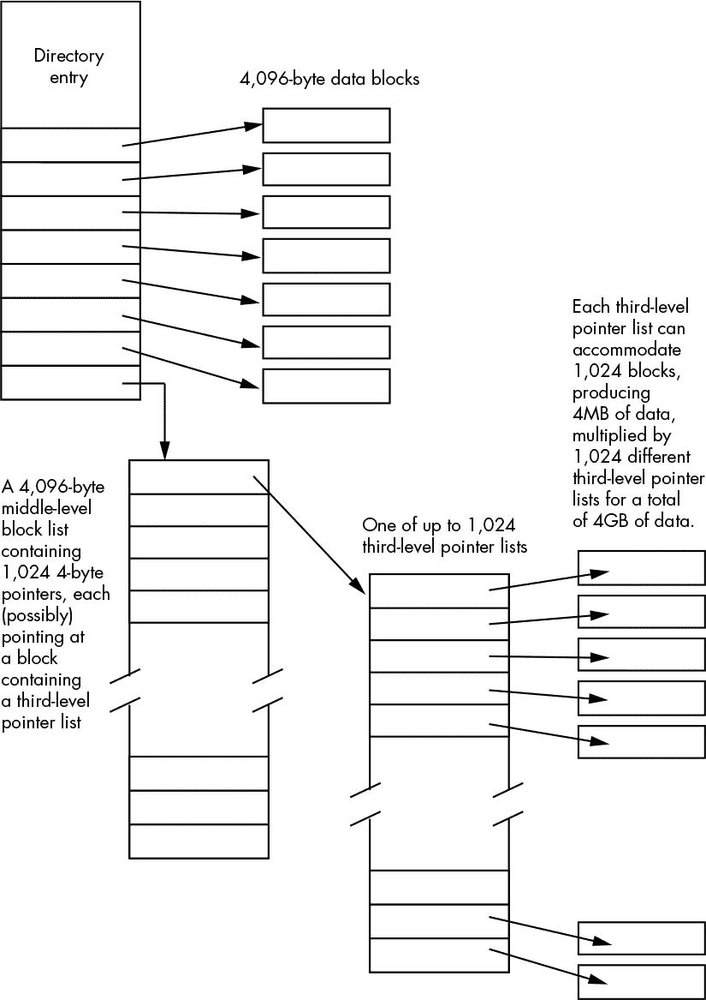

## 第十四章：大容量存储设备和文件系统**


现代计算机中最常见的输入输出设备可能就是大容量存储设备了。尽管有些 PC 没有显示器（它们是*无头*操作的），甚至没有键盘或鼠标（它们是远程访问的），几乎所有被认作 PC 的计算机系统都配有某种大容量存储设备。本章将重点介绍各种大容量存储设备——硬盘、软盘、磁带驱动器、闪存驱动器、固态硬盘等——以及它们用于组织存储数据的特殊文件系统格式。

### 14.1 磁盘驱动器

几乎所有现代计算机系统都包含某种硬盘驱动单元，以提供在线大容量存储。曾几何时，某些工作站厂商生产*无盘工作站*，但由于固定（即“硬”）磁盘和固态硬盘（SSD）单元的价格不断下降，存储空间不断增加，几乎完全消除了无盘计算机系统的存在。磁盘驱动器在现代系统中如此普及，以至于大多数人都视其为理所当然。然而，对于程序员来说，理所当然地看待磁盘驱动器是非常危险的。软件不断与磁盘驱动器交互，作为应用文件存储的媒介，因此，如果你想编写高效的代码，理解磁盘驱动器的工作原理是非常重要的。

#### *14.1.1 软盘驱动器*

软盘几乎已经从今天的 PC 中消失。它们有限的存储容量（通常为 1.44MB）对于现代应用程序及其产生的数据来说过于小。很难相信，在 PC 革命初期，一个 143KB（那是*千*字节，不是兆字节或吉字节）容量的软盘驱动器曾被视为高档商品。然而，软盘驱动器未能跟上计算机行业技术的进步。因此，我们在本章中不再考虑它们。

#### *14.1.2 硬盘*

固定磁盘驱动器，通常称为硬盘，是当今最常见的大容量存储设备（不过，截止到 2020 年，SSD 正在迅速取代硬盘）。现代硬盘真的是一项工程奇迹。1982 年到 2020 年间，单个硬盘驱动单元的容量增长了超过 240 万倍，从 5MB 增至超过 16TB（千兆字节）。与此同时，新的硬盘驱动单元的最低价格从 2500 美元降至 50 美元以下。没有其他计算机系统组件经历过如此激烈的容量和性能提升，同时价格却大幅下降。（半导体 RAM 可能排名第二：如果你用 1982 年的价格，今天能买到大约 40,000 倍容量的 RAM。）

在硬盘价格逐渐降低、容量逐渐增加的同时，它们的速度也在不断提升。在 1980 年代初，硬盘子系统能够实现每秒 1MB 的数据传输速率，往返于硬盘和 CPU 内存之间；而现代硬盘的传输速率可以超过 2500MBps。^(1) 尽管这种性能提升不像内存或 CPU 那样显著，但要记住，硬盘是机械设备，物理定律对其有更大的限制。在某些情况下，硬盘成本的下降使得系统设计人员可以通过使用磁盘阵列来提升性能（详见第 388 页的“RAID 系统”）。通过使用某些硬盘子系统，如磁盘阵列，你可以实现 2500MBps（或更高）的传输速率，尽管这样做并不便宜。

硬盘之所以叫这个名字，是因为它们的数据存储在一个小而坚硬的盘片上，盘片通常由铝或玻璃制成，并涂有磁性材料。与此相对，软盘则将数据存储在一片薄薄的可弯曲的 Mylar 塑料上。

在硬盘驱动的术语中，小型的铝或玻璃盘片称为*盘片*。每个盘片有两个表面，前面和后面（或顶部和底部），这两个表面都涂有磁性涂层。在操作过程中，硬盘单元以特定的速度旋转这个盘片，通常的速度是 3600、5400、7200、10000 或 15000 转每分钟（RPM）。一般来说，虽然并不总是如此，盘片转速越快，从磁盘读取数据的速度越快，磁盘和系统之间的数据传输速率也越高。笔记本电脑中的小型硬盘通常以较慢的速度旋转，比如 2000 或 4000 RPM，以节省电池寿命并减少热量产生。

硬盘子系统包含两个主要的活动组件：磁盘盘片和读写磁头。读写磁头在静止时，悬浮在磁盘表面的同心圆上，或称为*轨道*。每个轨道被分成一个个被称为*扇区*或*块*的部分。扇区的实际数量因硬盘设计而异，但典型的硬盘每个轨道上有 32 到 128 个扇区（参见图 14-1）。每个扇区通常包含 256 到 4096 字节的数据。许多硬盘驱动单元允许操作系统在几种不同的扇区大小之间进行选择，最常见的有 512 字节和 4096 字节。



*图 14-1：硬盘盘片上的轨道和扇区*

硬盘通过读写磁头向盘片发送一系列电脉冲来记录数据，这些电脉冲转化为磁脉冲并被盘片的磁性表面保存。磁盘控制器记录这些脉冲的频率受到电子质量、读写磁头设计和磁性表面质量的限制。

磁介质能够在其磁盘表面记录两个相邻的比特，并在稍后的读取操作中区分它们。然而，随着比特记录越来越紧密，它在磁性领域中变得越来越难以区分它们。*比特密度*是衡量某个硬盘能在其轨道中压缩数据的紧密程度——比特密度越高，单个轨道上可以挤压的数据就越多。然而，恢复密集压缩的数据需要更快和更昂贵的电子设备。

比特密度对驱动器的性能有很大影响。如果驱动器的盘片以固定的转速旋转，那么比特密度越高，在一定时间内，更多的比特将会旋转到读写头下方。较大的磁盘驱动器通常比小型磁盘驱动器更快，因为它们采用了更高的比特密度。

通过将磁盘的读写头大致沿着从磁盘盘片中心到外缘的直线路径移动，系统可以将单个读写头定位到几千个轨道中的任何一个。然而，仅使用一个读写头意味着在磁盘的多个轨道之间移动头部需要相当长的时间。实际上，两个最常引用的硬盘性能参数是读写头的平均寻道时间和轨道到轨道寻道时间。

*平均寻道时间*是将读写头从磁盘的边缘移动到中心，或者反向移动所需时间的一半。一个典型的高性能磁盘驱动器的平均寻道时间在 5 到 10 毫秒之间。另一方面，它的*轨道到轨道寻道时间*——即将磁盘读写头从一个轨道移动到下一个轨道所需的时间——大约是 1 或 2 毫秒。从这些数字可以看出，读写头的加速和减速在轨道到轨道寻道时间中占据的比例远远高于在平均寻道时间中的比例。横跨 1000 个轨道的时间是移动到下一个轨道的时间的 20 倍。而且，由于将读写头从一个轨道移动到下一个轨道通常是最常见的操作，因此轨道到轨道寻道时间可能更能反映磁盘的性能。然而，无论你使用哪种度量标准，都要记住，移动磁盘的读写头是你在磁盘驱动器上可以执行的最昂贵的操作之一，所以你应该尽量减少这类操作。

由于大多数硬盘子系统在磁盘盘片的两面上记录数据，因此每个盘片上有两个读写头——一个用于顶部，一个用于底部。由于大多数硬盘为了增加存储容量而在磁盘组件中采用多个盘片（见图 14-2），一个典型的硬盘有多个读写头对。



*图 14-2：多盘片硬盘组件*

各种读写头物理上连接到同一个执行器。因此，每个读写头都位于其各自盘片上的同一轨道上，并且所有读写头作为一个整体一起在磁盘表面上移动。当前所有读写头所在的轨道集合称为*圆柱*（参见图 14-3）。



*图 14-3：硬盘圆柱*

尽管使用多个读写头和盘片会增加硬盘驱动器的成本，但也能提高性能。当系统所需的数据不位于当前轨道时，性能提升尤为明显。在只有一个盘片的硬盘子系统中，读写头需要移动到另一个轨道以找到数据。但在一个具有多个盘片的子系统中，下一块要读取的数据通常位于同一个圆柱内。而且，由于硬盘控制器可以快速在读写头之间进行电子切换，因此将盘片数量加倍，几乎可以使磁盘单元的轨道到轨道寻道性能加倍，因为它减少了寻道操作的次数。当然，增加盘片数量还会增加单元的存储容量，这也是高容量硬盘通常具有更高性能的原因之一。

在较旧的磁盘驱动器中，当系统希望从某个盘片的某个轨道读取特定扇区时，它会指示磁盘将读写头定位到相应的轨道上，然后磁盘驱动器等待所需的扇区转到读写头下方。但是在读写头定位好之前，所需的扇区有可能已经刚好从读写头下方经过，这时磁盘必须等到几乎完成一整圈旋转后才能读取数据。平均而言，所需的扇区大约出现在磁盘的中间位置。如果磁盘以 7,200 转每分钟（每秒 120 转）的速度旋转，则完成一次盘片旋转需要 8.333 毫秒。通常，在扇区转到读写头下方之前会有 4.2 毫秒的延迟。这种延迟称为*平均旋转延迟*，通常等于一次旋转所需的时间除以 2。

要了解平均旋转延迟可能带来的问题，可以考虑操作系统通常以扇区大小的数据块来操作磁盘数据。例如，当从磁盘文件中读取数据时，操作系统通常请求磁盘子系统读取一个数据扇区并返回该数据。在收到数据后，操作系统会处理数据，然后很可能会向磁盘发出额外的数据请求。但是，当第二次请求的数据位于当前磁道的下一个扇区时会发生什么情况呢？不幸的是，当操作系统正在处理第一个扇区的数据时，磁盘盘片仍然在读写磁头下方转动。如果操作系统在读取第一个扇区后没有立即通知驱动器读取下一个磁道上的扇区，那么第二个扇区会在读写磁头下方旋转。这时，操作系统将不得不等待几乎一整个磁盘旋转周期，才能读取第二个扇区。这种现象被称为*转速丧失*（blowing revs）。如果操作系统（或应用程序）在读取文件数据时不断发生转速丧失，文件系统性能会显著下降。在早期的“单任务”操作系统中，这种转速丧失是一个令人不愉快的生活事实。如果一个磁道有 64 个扇区，通常需要磁盘旋转 64 次才能读取完一个磁道上的所有数据。

为了解决这个问题，旧款驱动器的磁盘格式化程序允许用户交错扇区。*交错*是将扇区分布在磁道上，使得逻辑上相邻的扇区在磁盘表面上并不物理相邻的过程（见图 14-4）。

交错扇区的优点是，一旦操作系统读取一个扇区，在逻辑上相邻的扇区旋转到读写磁头下方之前，会经过一个完整的扇区旋转时间。这给操作系统提供了时间来进行一些处理，并在所需的扇区进入读写磁头下方之前发出新的磁盘 I/O 请求。然而，在现代的多任务操作系统中，很难保证一个应用程序能获得 CPU 的控制权，以便在下一个逻辑扇区进入磁头下方之前做出响应，因此交错并不是很有效。



*图 14-4：扇区交错*

为了解决这个问题，并提高磁盘性能，现代大多数磁盘驱动器在磁盘控制器中包括内存，使其能够在一次磁盘旋转中读取整个磁道的数据。一旦控制器将磁道数据缓存到内存中，控制器可以以 RAM 速度而非磁盘旋转速度进行磁盘读写操作，这可以显著提高性能。读取磁道的第一个扇区仍然会表现出旋转延迟，但一旦磁盘控制器读取整个磁道，延迟几乎会消失。

一个典型的轨道可能有 64 个扇区，每个扇区 512 字节，总共 32KB 每个轨道。由于新型硬盘通常具有 8MB 到 512MB 的控制器内存，因此控制器可以在其内存中缓存数百个轨道。因此，磁盘控制器缓存不仅提高了单个轨道上磁盘读写操作的性能，还提高了整体磁盘性能。请注意，磁盘控制器缓存加速了读操作*和*写操作。例如，CPU 通常可以在几微秒内将数据写入磁盘控制器的缓存内存，然后返回到正常的数据处理，同时磁盘控制器将磁头移动到适当的轨道位置。当磁头最终到达适当的轨道位置时，控制器可以将缓存中的数据写入磁盘表面。

从应用设计者的角度来看，磁盘子系统设计的进展减少了理解磁盘驱动器几何结构（轨道和扇区布局）以及磁盘控制器硬件如何影响应用程序性能的必要性。尽管有这些努力使硬件对应用程序透明，然而，想要编写出优秀代码的软件工程师必须始终意识到磁盘驱动器的底层操作。例如，知道顺序文件操作通常比随机访问操作快得多是非常有价值的，因为顺序操作需要的磁头寻道次数较少。此外，如果你知道磁盘控制器有板载缓存，你可以将文件数据写入较小的块，在块操作之间做其他处理，从而为硬件写入数据到磁盘表面提供时间。尽管早期程序员用来最大化磁盘性能的技术不适用于现代硬件，但通过了解磁盘的工作原理及其数据存储方式，你可以避免导致代码运行缓慢的各种陷阱。

#### *14.1.3 RAID 系统*

由于现代硬盘通常有 8 到 16 个磁头，你可能会想知道是否可以通过同时在多个磁头上读取或写入数据来提高性能。虽然这在理论上是可能的，但直到 SATA 和更大的磁盘缓存出现之前，实际上并没有发生过这种情况。但还有另一种提高磁盘驱动器性能的方法，那就是使用并行读写操作——*冗余廉价磁盘阵列（RAID）*配置。

RAID 的概念非常简单：你将多个硬盘驱动器连接到一个特殊的主机控制卡（有时称为*适配器*），该控制卡同时读取和写入各个硬盘驱动器。通过将两个硬盘连接到 RAID 控制卡，你可以实现比单个硬盘驱动器快大约两倍的读写速度。通过连接四个硬盘驱动器，你可以将平均性能提高接近四倍。

RAID 控制器根据磁盘子系统的用途支持不同的配置。所谓的*RAID 0*子系统使用多个磁盘驱动器仅仅是为了提高数据传输速率。如果你将两块 150GB 的磁盘驱动器连接到 RAID 控制器，你将得到相当于 300GB 的磁盘子系统，并且数据传输速率翻倍。这是个人 RAID 系统的典型配置——即那些没有安装在文件服务器上的系统。

许多高端文件服务器系统是*RAID 1*（及更高版本）子系统，这些系统将数据的多个副本存储在多个磁盘驱动器上，而不是通过提高系统与磁盘驱动器之间的数据传输速率。在这种配置下，如果某块磁盘发生故障，数据的副本仍会保存在另一块磁盘上。一些更高级别的 RAID 子系统结合了四块或更多的磁盘驱动器，以提高数据传输速率并提供冗余数据存储。这种配置通常出现在高端、高可用性的文件服务器系统中。

现代 RAID 系统配置可以分为以下几类：

**RAID 0** 将数据交错存储在所有磁盘上以提高性能（以牺牲可靠性为代价）。这被称为*条带化*。需要至少两块磁盘。

**RAID 1** 将数据复制到成对的磁盘上，以提高可靠性（以牺牲性能为代价；同时将可用的总存储空间减少一半）。允许至少一块磁盘故障而不丢失数据（根据故障磁盘的不同，可能支持两块或更多磁盘的故障）。需要偶数块磁盘，最少两块磁盘。这被称为*镜像*。

**RAID 5** 在磁盘上存储校验信息。比 RAID 1 快，比 RAID 0 慢。允许一块磁盘故障而不丢失数据。最少需要三块磁盘。使用三块磁盘时，66%的总存储空间可用于数据；超过三块磁盘时，增加的磁盘空间将提高数据存储容量。

**RAID 6** 在磁盘上存储冗余的校验信息。比 RAID 1 快，比 RAID 0 和 RAID 5 慢。允许两块磁盘故障而不丢失数据。最少需要四块磁盘。使用四块磁盘时，一半的总存储空间可用于数据，但超过四块磁盘时，增加的磁盘空间将提高系统存储容量。

**RAID 10** 是 RAID 1 + RAID 0 的组合。最少需要四块驱动器；扩展必须以成对驱动器的形式进行。数据在磁盘间交错（条带化）以提高性能，并且在成对的驱动器上提供冗余存储以确保可靠性。比 RAID 1 快（但比 RAID 0 慢）。

**RAID 50**, **RAID 60** 是 RAID 5 + RAID 0 或 RAID 6 + RAID 0 的组合。

还有其他 RAID 组合（如 2、3 和 4），但大多数已经过时，你不会在现代系统中看到它们的使用。

RAID 系统使你能够显著提高磁盘子系统的性能，而无需购买昂贵且特殊的大容量存储解决方案。尽管软件工程师不能假设世界上所有的计算机系统都有可用的快速 RAID 子系统，但对于那些要求绝对最高性能存储子系统的应用，RAID（可能使用 SSD）可以是一个解决方案。

#### *14.1.4 光驱*

光驱使用激光束和特殊的光敏介质来记录和播放数字数据。与使用磁性介质的硬盘子系统相比，光驱有一些优势：

+   它们更具抗震性，因此在操作过程中敲击磁盘驱动器时，不会像硬盘那样轻易损坏驱动单元。

+   该介质通常是可拆卸的，可以让你保持几乎无限量的离线或近线存储。

+   它们的容量相当大（尽管现代的 USB 闪存驱动器和 SD 卡的容量更大）。

曾几何时，光存储系统看起来像是未来的趋势，因为它们在一个小空间内提供了非常高的存储容量。不幸的是，除了少数一些细分市场外，它们已不再受欢迎，因为它们也有几个缺点：

+   虽然它们的读取性能尚可，但写入速度非常慢——比硬盘慢一个数量级，而且只比*磁光*（旧的结合磁性/光学的软盘）驱动器快几倍。

+   尽管光学介质比磁性介质要坚固得多，但硬盘中的磁性介质通常被密封，以防尘土、湿气和磨损。相比之下，光学介质很容易被任何真正想要损坏磁盘表面的人接触到。

+   光盘子系统的寻址时间远比磁盘慢。

+   光盘的存储容量有限，目前低于约 128GB（蓝光）。

最终，USB 闪存驱动器的低价和日益增长的容量使得光驱在个人电脑中的使用逐渐消失。

然而，光盘子系统仍然在*近线存储子系统*中使用，这些系统通常使用机器人唱机来管理数百或数千张光盘。虽然可以争辩说，一排高容量硬盘驱动器会提供更节省空间的存储解决方案，但它将消耗更多电力，产生更多热量，并且需要比光盘唱机更复杂的接口，后者通常只有一个光驱单元和一个机器人磁盘选择机制。对于归档存储，服务器系统很少需要访问存储子系统中的任何特定数据，唱机系统是一种非常具有成本效益的解决方案。

如果你编写的软件需要操作光驱子系统上的文件，最重要的是记住读取访问速度远快于写入访问速度。你应该尽量将光驱系统作为“以读为主”的设备，并尽量避免向设备写入数据。你还应该避免在光盘表面进行随机访问，因为寻道时间非常慢。

CD、DVD 和 Blu-ray 驱动器也是光驱。不过，由于它们的广泛使用，以及与标准光驱相比，其组织和性能的显著不同，它们值得单独讨论。

#### *14.1.5 CD、DVD 和 Blu-ray 驱动器*

CD-ROM 是第一个在个人计算机市场上获得广泛接受的光驱子系统。CD-ROM 磁盘基于音频 CD 的数字录音标准，并且与当时的硬盘驱动器存储容量（通常为 100MB）相比，它们提供了大量存储（650MB）。随着时间的推移，当然这种关系发生了反转。不过，CD-ROM 仍然成为大多数商业应用的首选分发载体，完全取代了软盘作为这一目的的媒介。

尽管 CD-ROM 格式在大批量分发中非常便宜，通常每张磁盘只需几美分，但它不适合小批量生产。问题在于，制作一个磁盘母盘（用于制作一批 CD-ROM）通常需要花费数百或数千美元，这意味着只有在生产的磁盘数量达到至少几千张时，CD-ROM 才通常具有成本效益。

解决方案是新的 CD 介质——CD-可记录（CD-R），它允许制作一次性 CD-ROM。CD-R 使用一次写入的光盘技术，委婉地称为*WORM*（一次写入，多次读取）。首次推出时，CD-R 磁盘的价格大约为 10 到 15 美元。然而，一旦驱动器达到临界数量，媒体制造商开始大规模生产空白 CD-R 磁盘，它们的批发零售价格降至大约 0.25 美元。因此，CD-R 使得分发大量小数据成为可能。

CD-R 的一个明显缺点是“一次写入”的限制。为了解决这一问题，创建了 CD-可重写（CD-RW）驱动器和介质。顾名思义，CD-RW 支持读取和写入。然而，与光盘不同的是，你不能仅仅重写 CD-RW 上的某一个扇区。相反，要在 CD-RW 磁盘上重写数据，你必须先擦除整个磁盘。

尽管当 CD 首次推出时，650MB 的存储空间看起来像是一个巨大的容量，但“数据和程序会填满所有可用空间”这一古老的格言在实际中完全成立。尽管 CD 最终扩展到了 700MB，但各种游戏（含嵌入视频）、大型数据库、开发者文档、程序员开发系统、剪贴画、股票照片，甚至常规应用程序，都达到了一个单一 CD 无法满足的程度。DVD-ROM（后来是 DVD-R、DVD-RW、DVD+RW 和 DVD-RAM）磁盘通过在单个磁盘上提供 3GB 到 17GB 的存储空间解决了这个问题。除了 DVD-RAM 格式外，DVD 格式可以看作是 CD 格式的更快、更大容量的版本。两者之间有一些明显的技术差异，但大多数差异对软件而言是透明的。今天，蓝光光盘提供高达 128GB 的存储空间（蓝光 BDXL）。然而，通过互联网进行的电子分发已经在很大程度上取代了物理介质，因此蓝光光盘从未像分发或存储介质那样普及。

CD 和 DVD 格式是为了从存储介质中读取连续流数据——*流式*数据而创建的。读取硬盘上存储的数据所需的磁头到磁头的移动时间，在流式数据传输序列中产生了一个较大的间隙，这对于音频和视频应用来说是不可接受的。CD 和 DVD 将信息记录在一个单一的、非常长的轨道上，这个轨道在整个磁盘表面形成一个螺旋形。因此，CD 或 DVD 播放器可以通过以恒定速度沿着磁盘的单一螺旋轨道移动激光束，来连续读取数据。

虽然拥有单一轨道非常适合流式数据的传输，但这也使得在磁盘上定位特定扇区变得更加困难。CD 或 DVD 驱动器只能通过机械地将激光束定位到磁盘上的某个位置，来大致估算扇区的位置。接下来，它必须从磁盘表面实际读取数据，以确定激光的位置，然后进行微调以定位所需的扇区。因此，在 CD 或 DVD 磁盘上搜索特定扇区的时间可能比在硬盘上搜索特定扇区的时间长一个数量级。

对于编写与 CD 或 DVD 媒体交互的代码的程序员来说，最重要的要记住的是随机访问是禁忌的。这些媒体是为顺序流式访问设计的，在这样的媒体上查找数据会影响你的应用程序性能。如果你使用这些光盘来将应用程序及其数据提供给最终用户，如果需要高性能的随机访问，应该让用户在使用前将数据复制到硬盘上。

### 14.2 磁带驱动器

磁带驱动器曾是流行的大容量存储设备。在硬盘驱动器容量较小的年代，PC 用户通常使用磁带驱动器来备份存储在硬盘上的数据。许多年里，磁带存储的每兆字节成本远低于硬盘存储。事实上，曾经磁带存储和磁盘存储之间每兆字节的成本差距达到了一个数量级。而且，由于磁带驱动器比大多数硬盘驱动器存储更多的数据，它们在空间利用上也更高效。

然而，由于竞争和硬盘驱动器市场的技术进步，磁带逐渐失去了这些优势。如今，硬盘驱动器的存储容量已超过 16TB，硬盘的最优价格点大约为每 GB $0.25。如今，磁带存储每兆字节的成本远高于硬盘存储。此外，只有少数几种磁带技术可以在单个磁带上存储 250GB 的数据，而且这些技术（如数字线性磁带（DLT））非常昂贵。难怪磁带驱动器在如今的家庭 PC 中使用越来越少，通常只出现在大型文件服务器上。线性磁带开放（LTO）驱动器的容量已扩展到大约 12TB（预计未来可达到约 200TB）。尽管如此，今天一盘典型的 LTO-8 磁带的价格几乎为$130（美元），每兆字节的价格大约是硬盘的一半。

在大型机时代，应用程序与磁带驱动器的交互方式与今天的应用程序与硬盘驱动器的交互方式非常相似。然而，磁带驱动器并不是一个高效的随机访问设备。也就是说，尽管软件可以从磁带中读取随机位置的数据块，但其性能并不理想。当然，在大多数应用程序运行在大型机上的时代，应用程序通常不是交互式的，而且 CPU 的处理速度也更慢；因此，“可接受性能”的标准是不同的。

在磁带驱动器中，读写头是固定的，磁带传输机制会将磁带沿线性方式从磁带的起始位置移动到结束位置，或反之。如果此时磁带的起始位置正好位于读写头下方，而你想读取磁带末端的数据，就必须将整个磁带移动过读写头，才能到达所需的数据。这可能非常缓慢，可能需要几十秒甚至几百秒，具体取决于磁带的长度和格式。相比之下，硬盘读写头重新定位的时间通常只有几十毫秒（或者 SSD 的数据访问几乎是瞬间完成的）。因此，为了在磁带驱动器上获得良好的性能，软件必须针对顺序访问设备的限制进行编写。特别是，数据应该在磁带上按顺序读取或写入。

最初，数据是以块的形式写入磁带（就像硬盘上的扇区一样），并且驱动器被设计为允许准随机访问磁带的块。如果你曾经看过使用磁带驱动器的老电影，看到磁带卷轴不断地停止、启动、停止、反转、停止、继续，你就看到了“随机访问”的实际操作。这种磁带驱动器非常昂贵，因为它们需要强大的电机、精细加工的磁带路径机制等等。随着硬盘容量的增加和价格的下降，应用程序不再将磁带作为数据处理介质，仅将其用于离线存储（备份硬盘数据）。

由于磁带的顺序数据访问不再需要原始磁带驱动器的重型机械结构，磁带驱动器制造商试图制造一种低成本的产品，专门用于顺序访问。它们的解决方案是*流式磁带驱动器*，其设计目的是让数据不断地从 CPU 传输到磁带，或者反之。例如，在将硬盘数据备份到磁带时，流式磁带驱动器像录音视频一样处理数据，让磁带不断运行，将硬盘数据持续写入磁带。由于流式磁带驱动器的工作方式，极少有应用程序直接与磁带单元交互。今天，除了由系统管理员运行的磁带备份工具程序外，其他任何程序几乎都不会访问磁带硬件。

### 14.3 闪存存储

一种由于其紧凑的形态而变得流行的存储介质是闪存。闪存介质实际上是一种半导体设备，基于*电可擦可编程只读存储器（EEPROM）*技术，尽管名称中包含“只读”，但它既可读取也可写入。与常规的半导体存储器不同，闪存是*非易失性的*，意味着即使断电，它也能保持数据。像其他半导体技术一样，闪存存储完全依赖电子操作，不需要任何马达或其他机电设备才能正常工作。因此，闪存存储设备比机械存储解决方案（如硬盘驱动器）更可靠、更抗震，并且消耗的电量远低于这些机械存储设备。这使得闪存存储在便携式电池驱动设备中尤其有价值，如手机、平板电脑、笔记本电脑、电子相机、MP3 播放器和录音机。

目前，闪存存储模块提供超过 1TB 的存储空间，其最佳价格大约为每千兆字节 0.15 美元（美国）。这使得它们在每比特的成本上与硬盘存储相当。

闪存设备以多种不同的形式销售。OEM（原始设备制造商）可以购买外观类似其他半导体芯片的闪存存储设备，并将其直接安装在电路板上。然而，今天销售的大多数闪存存储设备都被集成在几种标准形式中，包括 SDHC 卡、CompactFlash 卡、智能内存模块、存储棒、USB/闪存模块或 SSD。例如，你可能会从相机中取出 CompactFlash 卡，将其插入 PC 上的特殊 CompactFlash 卡读卡器，然后像访问磁盘驱动器上的文件一样访问你的照片。

闪存存储模块中的内存是以字节块的形式组织的，类似于硬盘上的扇区。然而，与普通的半导体内存或 RAM 不同，你不能在闪存存储模块中写入单个字节。尽管通常可以*读取*闪存存储设备中的单个字节，但要写入特定字节，你必须首先擦除该字节所在的整个块。块的大小因设备而异，但大多数操作系统会将这些闪存块视为磁盘扇区，用于读取和写入。尽管基本的闪存存储设备本身可以直接连接到 CPU 的内存总线，但大多数常见的闪存存储包（如 CompactFlash 卡和存储棒）包含模拟硬盘接口的电子元件，你可以像访问硬盘驱动器一样访问闪存设备。

闪存内存设备，尤其是 EEPROM 设备，的一个有趣方面是它们有一个有限的写入寿命。也就是说，你只能在闪存内存模块的特定存储单元中写入一定次数的数据，超过这个次数后，该单元将开始无法保持信息。早期的 EEPROM/闪存设备中，这个问题尤为严重，因为在出现故障之前的平均写入次数大约为 10,000 次。也就是说，如果某个软件连续写入同一个内存块 10,000 次，那么该 EEPROM/闪存设备可能会在该块中产生坏内存单元，从而使整个芯片失效。另一方面，如果软件仅在 10,000 个独立的块中各写一次，该设备仍然可以在每个存储单元上进行 9,999 次写入。因此，这些早期设备的操作系统会尽量将写操作分散到整个设备中，以减少损坏。尽管现代闪存设备仍然存在这个问题，但技术进步已经将其减少到几乎可以忽略不计的程度。现代闪存内存单元支持大约一百万次写入周期，之后才会出现问题。此外，今天的操作系统会像标记硬盘上的坏扇区一样标记坏闪存块，一旦确定某个块坏了，操作系统会跳过该块。

由于是电子设备，闪存设备根本没有旋转延迟时间，也没有太多寻道时间。写入地址到闪存模块需要一点点时间，但与硬盘的磁头寻道时间相比，这几乎可以忽略不计。尽管如此，闪存的速度通常远不及典型的 RAM。读取闪存设备的数据通常需要微秒（而不是纳秒），而闪存设备与系统之间的接口可能还需要额外的时间来设置数据传输。此外，通常会通过 USB 闪存读卡器设备将闪存存储模块与 PC 连接，这进一步将每字节的平均读取时间降低到几百微秒。

写入性能更差。为了将一块数据写入闪存，你必须先写入数据，再读取回来，与原始数据进行比较，如果不匹配则重新写入。这个过程可能需要几十分甚至几百毫秒的时间。

因此，闪存存储模块通常比高性能硬盘子系统慢得多。然而，主要由于高端数码相机用户希望能够在短时间内拍摄尽可能多的照片，技术进步正在提升它们的性能。尽管闪存的性能可能短期内无法赶上硬盘性能，但预计它将随着时间的推移不断提高。

### 14.4 RAM 磁盘

另一个有趣的大容量存储设备是 RAM 磁盘，它是一种半导体解决方案，将计算机系统的大块内存当作磁盘驱动器来使用，利用内存阵列模拟块和扇区。基于内存的磁盘的优势在于它们具有非常高的性能。RAM 磁盘不受硬盘、光盘和软盘驱动器上与磁头寻道时间和旋转延迟相关的时间延迟的影响。它们与 CPU 的接口也更快，因此数据传输时间非常短，通常以最大总线速度运行。很难想象有比 RAM 磁盘更快的存储技术。

然而，RAM 磁盘有两个缺点：成本和易失性。RAM 磁盘系统中每字节存储的成本非常高。事实上，按字节计算，半导体存储比磁盘硬盘存储贵多达 10,000 倍。因此，RAM 磁盘通常具有较低的存储容量，通常不超过几 GB。而且 RAM 磁盘是易失性的——如果没有持续供电，它们会丢失数据。这通常意味着半导体磁盘非常适合存储临时文件和在关机之前会复制回永久存储设备的文件。它们不太适合长期保存重要信息。

### 14.5 固态硬盘

现代高性能 PC 使用固态硬盘（SSD）。SSD 使用闪存（如 USB 闪存驱动器）并通过高性能接口与系统连接。但 SSD 不仅仅是外观不同的 USB 闪存驱动器。USB 闪存驱动器设计时主要考虑每比特的成本——除了某些相机应用（特别是 4K 和 8K 摄像机）外，速度通常是次要的，成本和容量才是主要考量。例如，典型的 USB 闪存驱动器速度远不及一款中等水平的硬盘。另一方面，SSD 必须非常快速。由于其固态设计，它们通常比旋转磁介质快一个数量级。通过 RAID 配置，SSD 实际上能够达到 SATA 接口的性能极限。

在撰写本文时，SSD 的价格是高容量硬盘的 4 到 16 倍（8TB 硬盘和 1TB SSD 的价格大约都是 100 美元）。然而，按每千兆字节计算的价格差距正在缩小。SSD 正在迅速取代旋转磁盘驱动器，而旋转磁介质可能会被历史的垃圾桶所淘汰（就像磁带驱动器一样）。在那之前，为什么还会有人愿意为 SSD 支付更多呢？

SSD 通常使用不同的底层技术来存储数据，并提供更快速的电子接口到计算机。这就是为什么 SSD 通常比 USB 闪存驱动器要贵得多的原因。这也是为什么 SSD 能够实现 2,500MBps 的数据传输速度，而高质量的存储卡只能达到大约 100MBps（而 USB 闪存/拇指驱动器的速度甚至更慢）。

从程序员的角度来看，SSD 的一个重大优势是你不再需要担心寻道时间和其他延迟问题。与硬盘相比，SSD 通常是更接近真正的随机访问设备。在 SSD 上，从驱动器的开始位置访问数据，再到结束位置的访问时间，仅比访问驱动器中其他数据元素的时间稍长。

然而，SSD 也有一些缺点。首先，它们的写入性能通常比读取性能慢得多（尽管写入 SSD 的速度仍然比写入硬盘快）。幸运的是，读取数据的频率远高于写入，但在处理向 SSD 写入数据的软件时，必须考虑这一点。第二个缺点是 SSD 在一段时间后会磨损。反复写入同一位置最终会导致相关的存储单元失败。幸运的是，现代操作系统能够绕过这些故障。然而，当你编写持续覆盖文件数据的应用程序时，请牢记这一问题。

### 14.6 混合硬盘

大多数现代硬盘都包含板载 RAM 缓存（例如，用于存储整个磁道的数据，以消除旋转延迟）。混合硬盘，如苹果公司早期的 Fusion Drive，结合了一块小型 SSD 与一个大容量硬盘——在苹果的例子中，通常是一个 32GB 到 128GB 的 SSD 和一个 2TB 的磁盘。常访问的数据会保留在 SSD 缓存中，当需要为新数据腾出空间时，它会被交换到硬盘中。这与主内存中的缓存工作方式相同，可以提高系统性能，使经常访问的数据接近 SSD 的速度。

### 14.7 大容量存储设备上的文件系统

很少有应用程序直接访问大容量存储设备。也就是说，应用程序通常不会直接读取和写入大容量存储设备上的磁道、扇区或块；相反，它们是在存储设备上打开、读取、写入并以其他方式操作*文件*。操作系统的*文件管理器*抽象化了底层存储设备的物理配置，并为单个设备上的多个独立文件提供了一个方便的存储设施。

在最早的计算机系统中，应用程序负责跟踪数据在大容量存储设备上的物理位置，因为当时没有文件管理器可用来执行此操作。它们通过仔细考虑数据在磁盘上的布局来最大化性能。例如，它们可以手动交错数据在磁道的不同扇区中，以便在读取和写入磁道上的扇区之间，给 CPU 留出时间进行处理。这类软件通常比使用通用文件管理器的软件快好几倍。后来，当文件管理器变得普遍可用时，一些应用程序开发者仍然出于性能原因自行管理存储设备上的文件。特别是在软盘时代，低级软件通过在磁道和扇区级别操作数据，通常比使用文件管理器系统的相同应用程序快 10 倍。

理论上，今天的软件也可以从这种方法中受益，但在实践中，你很少会在现代应用程序中看到这种低级别的磁盘访问，原因有几个。首先，编写能够以如此低的级别操作大容量存储设备的软件会让你依赖于特定的设备。也就是说，如果你的软件操作的是一个每个磁道有 48 个扇区、每个柱面有 12 个磁道、每个驱动器有 768 个柱面的磁盘，那么该软件在不同扇区、磁道和柱面布局的驱动器上将无法实现最佳性能（如果能运行的话）。第二，以低级别访问磁盘会使得在不同应用程序之间共享设备变得困难，尤其是在多任务系统中，可能会有多个应用程序同时共享该设备。例如，如果你已经在磁道的各个扇区上布置了数据，以便将计算时间与扇区访问协调，那么当操作系统中断你的程序并分配时间片给其他应用程序时，你的工作将会丢失——这段时间本来是用来在下一个数据扇区经过读写头之前完成必要的计算的。第三，一些现代大容量存储设备的功能，例如板载缓存控制器和将存储设备呈现为一系列块的 SCSI 接口，而不是呈现为具有特定磁道和扇区几何结构的设备，消除了低级软件可能具有的任何优势。第四，现代操作系统通常包含文件缓冲和块缓存算法，可以提供良好的文件系统性能，从而无需以如此低的级别操作。最后，低级磁盘访问非常复杂，编写这种软件很困难。

#### *14.7.1 顺序文件系统*

最早的文件管理系统将文件顺序存储在磁盘表面。也就是说，如果磁盘上的每个扇区/块存储 512 字节，并且一个文件的大小是 32KB，那么该文件将在磁盘表面上占用 64 个连续的扇区/块。为了在未来的某个时间访问该文件，文件管理器只需要知道文件的起始块号和它占用的块数。文件系统必须在某个非易失性存储介质中维护这两条信息。显然，这些信息存储在存储介质本身中，称为*目录*——这是一个从特定磁盘位置开始的值数组，操作系统可以在应用程序请求特定文件时引用。文件管理器可以在目录中查找文件的名称，并提取其起始块和长度。通过这些信息，文件系统可以向应用程序提供访问文件数据的权限。

顺序文件系统的一个优点是非常快速。如果文件存储在磁盘表面上的顺序块中，操作系统可以非常迅速地读取或写入单个文件的数据。但顺序文件组织也存在一些严重的问题。最大且最明显的缺点是，一旦文件管理器将另一个文件放置在磁盘上的下一个块处，就无法扩展文件的大小。磁盘碎片化是另一个大问题。随着应用程序创建和删除许多小型和中型文件，磁盘会填满许多短小的未使用扇区，这些扇区单独来看对于大多数文件来说太小了。在顺序文件系统上，磁盘上常常有足够的空闲空间来存储一些数据，但因为它被分散在磁盘表面的小块上，无法使用。为了解决这个问题，用户必须运行磁盘压缩程序，将所有空闲扇区合并并通过物理重新排列文件，将它们移动到磁盘的末端。另一种解决方案是将文件从一个满磁盘复制到另一个空磁盘，收集那些许多小的未使用扇区。显然，这是用户必须做的额外工作——这本应该是操作系统执行的任务。

顺序文件存储方案在多任务操作系统中真正崩溃。如果两个应用程序试图同时将文件数据写入磁盘，文件系统必须将第二个应用程序文件的起始块放置在第一个应用程序文件所需的最后一个块之后。由于操作系统无法确定文件可以增长多大，每个应用程序在首次打开文件时必须告诉操作系统文件的最大长度。不幸的是，许多应用程序无法预先确定它们需要多少空间来存储文件，因此它们在打开文件时必须猜测文件的大小。如果估算的文件大小太小，程序要么必须因“文件已满”错误而中止，要么应用程序必须创建一个更大的文件，将“已满”文件中的旧数据复制到新文件中，然后删除旧文件。正如你能想象的那样，这种做法效率极低，绝对不是优良的代码。

为了避免此类性能问题，许多应用程序严重高估了它们所需的文件空间。因此，当文件实际上没有使用分配给它们的所有数据时，它们最终会浪费磁盘空间，这是一种*内部*碎片化形式。此外，如果应用程序在关闭文件时截断了文件，那么返回给操作系统的空闲部分往往会把磁盘分割成之前描述的那些小的、无法使用的空闲块，这个问题被称为*外部*碎片化。基于这些原因，现代操作系统已经用更为复杂的存储管理方案取代了磁盘上的顺序存储。

#### *14.7.2 高效的文件分配策略*

大多数现代文件分配策略允许文件存储在磁盘的任意块上。由于文件系统现在可以将文件的字节放置在磁盘上的任何空闲块中，因此外部碎片和文件大小限制的问题几乎被消除了。只要磁盘上至少有一个空闲块，就可以扩展任何文件的大小。然而，这种灵活性也带来了一些额外的复杂性。在顺序文件系统中，查找磁盘上的空闲空间很容易；只需记下目录中各个文件的起始块号和大小，文件系统就可以找到足够大的空闲块来满足当前的磁盘分配请求（如果有的话）。但在文件跨任意块存储的情况下，扫描目录并记录一个文件使用了哪些块计算起来太昂贵，因此文件系统必须跟踪空闲和已使用的块。大多数现代操作系统使用三种数据结构之一——集合、表格（数组）或列表——来跟踪哪些扇区是空闲的，哪些是已用的。每种方案都有其优缺点。

##### 14.7.2.1 空间位图

空间位图方案使用集合数据结构来维护磁盘驱动器上的空闲块集合。如果一个块是该集合的成员，文件管理器可以在需要另一个块为文件时将其移除。由于集合成员关系是布尔关系（一个块要么在集合中，要么不在），因此只需要 1 位就能指定每个块的集合成员关系。

通常，文件管理器会保留磁盘的某个部分来存放一个位图，该位图指定磁盘上哪些块是空闲的。位图会占用磁盘上的若干块，每个块所占的空间表示磁盘上其它块的数量，我们可以通过将块大小（以字节为单位）乘以 8（每字节的位数）来计算。例如，如果操作系统在磁盘上使用 4,096 字节的块，则由一个块组成的位图可以跟踪磁盘上最多 32,768 个其他块。

位图方案的缺点是，随着磁盘容量的增大，位图也会变得越来越大。例如，在一个 120GB 的驱动器上，块大小为 4,096 字节时，位图几乎长达 4MB。虽然这只是磁盘总容量的一个小比例，但访问这么大位图中的单个比特位可能会很笨拙。为了找到一个空闲块，操作系统必须在线性查找中遍历这个 4MB 的位图。即使你将位图保存在系统内存中（考虑到每个磁盘都必须这样做，这其实是有点昂贵的），每次需要空闲扇区时查找它也是一种昂贵的提议。因此，你很少会看到这种方案用于较大的磁盘驱动器上。

位图方案的一个优点（也是缺点）是，文件管理器仅使用它来跟踪磁盘上的空闲空间，而不是跟踪属于某个特定文件的扇区。因此，如果空闲空间位图发生损坏，实际上并不会永久丢失任何数据；你可以通过遍历所有磁盘目录并计算哪些扇区被这些目录中的文件使用来轻松重建它（显然，剩余的扇区就是空闲的）。虽然这个过程有点耗时，但如果发生灾难时，能够有这个选项还是挺好的。

##### 14.7.2.2 文件分配表

另一种跟踪磁盘扇区使用情况的方法是使用扇区指针表，或者称为*文件分配表（FAT）*。这种方案被广泛使用，巩固了它的流行性，这也是大多数 USB 闪存驱动器上默认的文件分配方案。FAT 结构的一个有趣方面是，它将空闲空间管理和文件扇区分配管理合并为同一数据结构，与使用各自独立数据结构的位图方案相比，最终节省了空间。此外，与位图方案不同，FAT 不需要进行低效的线性搜索来找到下一个可用的空闲扇区。

FAT 实际上不过是一组自相对指针数组（也就是说，指向自身的索引），为存储设备上的每个扇区/块保留一个指针。当磁盘初始化时，它的表面上的前几个块被保留给根目录和 FAT 本身等对象，磁盘上剩余的块则是空闲的。根目录中的某个地方有一个空闲空间指针，它指定磁盘上下一个可用的空闲块。假设空闲空间指针最初包含值`64`，意味着下一个空闲块是块 64，那么 FAT 中索引 64、65、66 等位置的条目将包含以下值，假设磁盘上有*n*个块，从 0 到*n*–1 编号：

| **FAT 索引** | **FAT 条目值** |
| --- | --- |
| . . . | . . . |
| 64 | `65` |
| 65 | `66` |
| 66 | `67` |
| 67 | `68` |
| . . . | . . . |
| *n* – 2 | *n* – 1 |
| *n* – 1 | `0` |

块 64 中的条目告诉你磁盘上下一个可用的空闲块是 65。接着查看条目 65，你会发现磁盘上下一个可用空闲块的值是`66`。FAT 中的最后一个条目包含一个`0`（块 0 包含整个磁盘分区的元数据，永远不会被使用）。

每当应用程序需要一个或多个块来存储一些新数据时，文件管理器会获取空闲空间指针的值，然后继续遍历 FAT 条目，直到找到足够的块来存储新数据。例如，如果每个块大小为 4,096 字节，而当前应用程序试图向一个文件写入 8,000 字节，文件管理器需要从空闲块列表中移除两个块，步骤如下：

1.  获取空闲空间指针的值。

1.  保存空闲空间指针的值，以便确定第一个空闲扇区。

1.  继续查看 FAT 条目，直到存储应用程序数据所需的块数。

1.  提取应用程序需要存储其数据的最后一个块的 FAT 条目值，并将空闲空间指针设置为该值。

1.  在应用程序使用的最后一个块的 FAT 条目值上存储一个`0`，标记应用程序所需块列表的结束。

1.  将空闲空间指针的原始值（即在这些步骤之前的值）返回到 FAT 中，作为指向现在已分配给应用程序的块列表的指针。

在我们之前的示例中，块分配之后，应用程序可以使用块 64 和 65，空闲空间指针包含`66`，FAT 看起来如下所示：

| **FAT 索引** | **FAT 条目值** |
| --- | --- |
| . . . | . . . |
| 64 | `65` |
| 65 | `0` |
| 66 | `67` |
| 67 | `68` |
| . . . | . . . |
| *n* – 2 | *n* – 1 |
| *n* – 1 | `0` |

这并不意味着 FAT 中的条目*总是*包含表中下一个条目的索引。随着文件管理器为磁盘上的文件分配和释放存储空间，这些数字往往会变得混乱。例如，如果一个应用程序将块 64 归还到空闲列表，但仍保留块 65，空闲空间指针将包含值`64`，FAT 将具有以下值：

| **FAT 索引** | **FAT 条目值** |
| --- | --- |
| . . . | . . . |
| 64 | `66` |
| 65 | `0` |
| 66 | `67` |
| 67 | `68` |
| . . . | . . . |
| *n* – 2 | *n* – 1 |
| *n* – 1 | `0` |

如前所述，FAT 数据结构的一个优点是，它将空闲空间管理和文件分配管理合并为一个单一的数据结构。这意味着每个文件不需要携带其数据占用的块的列表。相反，它只需要一个指针值，指定 FAT 中的一个索引，从该索引可以找到文件数据的第一个块。剩余包含文件数据的块可以通过遍历 FAT 来找到。

FAT 方案相对于集合（位图）方案的一个重要优势是，一旦使用 FAT 文件系统的磁盘满了，它就不再维护哪些块是空闲的。相比之下，位图方案即使没有空闲块可用，仍然会占用磁盘空间来跟踪空闲块。FAT 方案用文件块指针替换了原本用来跟踪空闲块的条目。当磁盘满时，原本用于维护空闲块列表的值不再占用磁盘空间，因为它们现在都在跟踪文件中的块。在这种情况下，空闲空间指针包含`0`（表示空的空闲空间列表），所有 FAT 条目都包含文件数据的块索引链。

然而，FAT 方案确实有几个缺点。首先，FAT 文件系统中的表格与集合方案文件系统中的位图不同，它代表了一个单点故障。如果 FAT 以某种方式被破坏，修复磁盘和恢复文件可能会非常困难；丢失磁盘上的一些空闲空间是一个问题，但丢失文件在磁盘上的位置则是一个*重大*问题。此外，由于磁盘头通常比在磁盘的任何其他区域花费更多时间在 FAT 区域，FAT 是硬盘最容易受到磁头撞击损坏的部分，也是软盘或光驱最容易出现过度磨损的部分。这是一个足够重要的担忧，以至于一些 FAT 文件系统提供了在磁盘上保留 FAT 额外副本的选项。

FAT 的另一个问题是它通常位于磁盘上的固定位置，通常是在某些较低的块号处。为了确定要读取哪个块或哪些块以获取特定文件，磁盘读写头必须移动到 FAT 区域，因此，如果 FAT 位于磁盘的开头，它们将不断地来回移动，跨越较大的距离。这种大规模的读写头移动不仅很慢，而且容易加速磁盘驱动器机械部件的磨损。在微软操作系统的新版本中，FAT-32 方案通过允许将 FAT 定位在磁盘的开头以外的位置来解决部分问题，尽管 FAT 仍然处于固定位置。如果操作系统没有将 FAT 缓存到主内存中，FAT 文件系统的应用程序文件 I/O 性能可能会非常低，这在系统崩溃时可能很危险，因为你可能会失去所有尚未写入磁盘的 FAT 条目对应的文件数据。

FAT 方案对于文件的随机访问也非常低效。为了从文件的偏移量*m*读取到偏移量*n*，文件管理器必须将*n*除以块大小，以获得包含偏移量*n*的字节的块偏移量，将*m*除以块大小以获得其块偏移量，然后依次在这两个块之间的 FAT 链中查找包含所需数据的扇区。这种线性搜索可能非常耗时，尤其是当文件是一个大型数据库，当前块位置与所需块位置之间有成千上万个块时。

FAT 文件系统的另一个问题，虽然相对深奥，却依然存在，那就是它不支持稀疏文件。也就是说，你不能在文件的字节 0 和字节 1,000,000 之间写入数据，而不在这两个位置之间的每个字节上都分配磁盘空间。一些非 FAT 的文件管理器只分配应用程序写入数据的块。例如，如果一个应用程序只在文件的字节 0 和 1,000,000 处写入数据，那么文件管理器只为该文件分配两个块。如果应用程序尝试读取一个未先分配的块（例如，如果应用程序在当前示例中尝试读取偏移量为 500,000 的字节，而该位置之前没有写入过数据），文件管理器会简单地返回`0`，而不会实际占用磁盘上的任何空间。但由于 FAT 的组织方式，你无法在磁盘上创建稀疏文件。

##### 14.7.2.3 块列表

为了克服 FAT 文件系统的局限性，先进的操作系统——如 Windows NT/2000/XP/7/8/10、macOS（APFS）以及各种版本的 Unix——采用了块列表方案。事实上，块列表方案享有 FAT 系统的所有优点（如高效的非线性空闲块定位和空闲块列表的高效存储），同时解决了许多 FAT 系统的问题。

块列表方案的实现方式是首先在磁盘上预留几个块，用于存储（通常是）32 位或 64 位的指针，指向磁盘上的每个空闲块。如果磁盘上的每个块大小为 4,096 字节，则一个块可以存储 1,024（或 512）个指针。通过将磁盘上的块数除以 1,024（或 512），可以确定空闲块列表最初将消耗的块数。正如你很快会看到的那样，一旦磁盘被填满，系统将使用这些块来存储数据，因此空闲块列表所占用的块并不会带来额外的存储开销。

如果空闲块列表中的一个块包含 1,024 个指针（以下示例假设使用 32 位指针），那么前 1,023 个指针包含磁盘上空闲块的块号。文件管理器在磁盘上维护两个指针：一个保存当前包含空闲块指针的块的块号，另一个保存该块中的索引。每当文件系统需要一个空闲块时，它会通过这两个指针从空闲块列表中获取一个索引。然后，文件管理器将索引增加到空闲块列表中的下一个可用条目。当索引增加到 1,023（即空闲块列表中的第 1,024 项）时，文件管理器不会使用该索引处的指针值来定位一个空闲块，而是将其作为包含磁盘上空闲块指针列表的下一个块的地址，并将当前块（其中包含现在空的块指针列表）用作空闲块。这就是文件管理器如何重用最初用于保存空闲块列表的块，而不是像 FAT 那样重用空闲块列表中的指针来跟踪属于给定文件的块。一旦文件管理器用完了某个块中的所有空闲块指针，它将使用该块来存储实际的文件数据。

与 FAT 不同，列表方案并不将空闲块列表和文件列表合并为同一数据结构。相反，每个文件都有一个独立的数据结构，用于保存与该文件相关联的块列表。在典型的 Unix 和 Linux 文件系统中，文件的目录项实际上保存了列表中的前 8 到 16 个条目（见 图 14-5）。这样，操作系统就能追踪小文件（最大 32KB 或 64KB），而不需要在磁盘上分配任何额外的空间。



*图 14-5：小文件的块列表*

对于不同类型的 Unix 系统的研究表明，绝大多数文件都很小，将多个指针嵌入目录项提供了一种高效访问小文件的方式。当然，随着时间的推移，平均文件大小似乎有所增加。但事实证明，块大小也趋向于增大。最初进行这项研究时，典型的块大小为 512 字节，而今天已经是 4,096 字节。因此，在这段时间内，平均文件大小可能增加了 8 倍，而在平均情况下，目录项并未需要额外的空间。

对于中等大小的文件，最大约为 4MB，操作系统将分配一个包含 1,024 个指针的单个块，用于指向存储文件数据的块。操作系统继续使用目录项中找到的指针来指向文件的前几个块，然后它使用磁盘上的一个块来存储下一组块指针。通常，目录项中的最后一个指针保存此块的位置（见 图 14-6）。



*图 14-6：中等文件的块列表*

对于大于大约 4MB 的文件，文件系统切换到三级块方案，该方案适用于最大 4GB 的文件大小。在该方案中，目录条目的最后一个指针存储了一个包含 1,024 个指针的块的位置，而该块中的每个指针都指向另一个包含 1,024 个指针的块，这些指针存储的每个指针在*这个*块中指向包含实际文件数据的块。详细信息请参见 图 14-7。



*图 14-7：适用于大文件（最大 4GB）的三级块列表*

这种树形结构的一个优点是，它可以轻松支持稀疏文件：应用程序可以在文件的第 0 块和第 100 块写入数据，而无需为这两个点之间的每个块分配数据块。通过在块列表的中间条目中放置一个特殊的块指针值（通常是 `0`），操作系统可以判断文件中是否不存在某个块。如果应用程序尝试读取文件中丢失的块，操作系统可以简单地返回所有 `0`，表示该块为空。当然，一旦应用程序向一个先前未分配的块写入数据，操作系统必须将数据复制到磁盘，并在块列表中填入相应的块指针。

随着磁盘容量的增大，这种方案所施加的 4GB 文件限制开始对某些应用程序（如视频编辑器、大型数据库应用程序和 Web 服务器）造成问题。通过向块列表树中添加另一级，可以轻松将此方案扩展 1,000 倍，达到 4TB。这个方法的唯一问题是，间接层级越多，随机文件访问速度越慢，因为操作系统可能需要从磁盘读取多个块才能获取一个数据块。（当只有一层时，将块指针列表缓存在内存中是有意义的，但有两层和三层时，想对每个文件都这样做就不现实了）。另一种扩展最大文件大小（每次扩展 4GB）的方法是使用多个指针指向二级文件块（例如，将目录中的所有或大部分 8 到 16 个指针指向二级块列表项，而不是直接指向文件数据块）。虽然目前没有扩展超过三层的惯例，但可以放心，一旦需求出现，操作系统设计师将会开发高效访问大文件的方案。例如，64 位操作系统可以使用 64 位指针，而不是 32 位指针，从而消除 4GB 限制。

### 14.8 编写操作大容量存储设备上数据的软件

理解不同大容量存储设备的行为非常重要，特别是当你想编写能够操作这些设备中文件的高性能软件时。尽管现代操作系统试图将应用程序与大容量存储的物理现实隔离开来，但操作系统能为你做的事是有限的。而且，由于操作系统无法预测你特定应用程序如何访问大容量存储设备上的文件，它无法为你的应用程序量身定制文件访问优化；相反，它的优化是针对具有*典型*文件访问模式的应用程序设计的。因此，如果你的应用程序的文件 I/O 方式不典型，那么你就不太可能从系统中获得最佳的性能。在本节中，我们将探讨如何与操作系统协调文件访问活动，以实现最佳性能。

#### *14.8.1 文件访问性能*

虽然磁盘驱动器和大多数其他大容量存储设备常被认为是“随机访问”设备，但实际上，大容量存储的访问通常在顺序访问时更为高效。磁盘驱动器上的顺序访问相对高效，因为操作系统可以一次移动读写头一个磁道（假设文件按顺序块出现在磁盘上）。这比访问磁盘上的一个块、将读写头移动到另一个磁道、访问另一个块、再移动读写头，依此类推，要快得多。因此，如果可能的话，你应该避免应用程序中的随机文件访问。

你还应该尽量在每次文件访问时读取或写入大块数据，而不是更频繁地读取或写入小块数据。这有两个原因。首先，操作系统调用的速度并不快，因此，如果你通过每次读取或写入更多的数据来减少调用次数，应用程序通常会运行得更快。其次，操作系统必须读取或写入整个磁盘块。如果你的块大小是 4,096 字节，但你只向某个块写入 2,000 字节，然后又跳到文件中的另一个位置进行访问，操作系统实际上必须先从磁盘读取整个 4,096 字节的块，将 2,000 字节合并进去，然后再将整个 4,096 字节写回磁盘。与此对比，如果写入操作是一次性写入完整的 4,096 字节，操作系统就不必先从磁盘读取数据；它只需要写入这个块。写入完整的块提高了磁盘访问性能，提升幅度为 2 倍，因为写入部分块需要操作系统首先读取块、合并数据，再写入块；而写入完整块则无需读取操作。即使你的应用程序没有按磁盘块大小的整数倍写入数据，写入大块数据仍然能提高性能。如果你在一次写入操作中向文件写入 16,000 字节，操作系统仍然需要使用读-合并-写操作来写入那 16,000 字节中的最后一个块，但它将只使用写操作来写入前面三个块。

如果你从一个相对空的磁盘开始，操作系统通常会尝试将新文件的数据写入顺序块。这种组织方式对于未来文件访问可能是最有效的。然而，随着系统用户在磁盘上创建和删除文件，单个文件的数据块可能会非顺序分布。在非常糟糕的情况下，操作系统可能会在磁盘的不同位置分配几个块。这会导致即使是顺序文件访问，也可能像慢速的随机文件访问那样表现。如前所述，这种文件碎片化会显著降低文件系统的性能。不幸的是，应用程序无法确定其文件数据是否在磁盘表面上碎片化，即使它能确定，也几乎无法解决这一问题。虽然有一些工具可以*整理*磁盘表面上的数据块，应用程序通常不能请求它们的执行（而且“碎片整理”工具本身也非常慢）。

尽管应用程序在正常程序执行过程中很少有机会对数据文件进行碎片整理，但你可以采取一些措施来减少数据文件碎片化的概率。你可以遵循的最佳建议是始终以大块数据写入文件。实际上，如果你能够通过一次写操作将整个文件写入，最好这样做。除了加快操作系统的访问速度外，写入大量数据往往会导致分配顺序块。当你将小块数据写入磁盘时，其他应用程序在多任务环境下也可能同时写入磁盘。在这种情况下，操作系统可能会交错不同应用程序对文件的块分配请求，从而使某个特定文件的数据不太可能按顺序写入。即使你计划随机访问数据的某些部分，也要尽量将文件的数据写入顺序块，因为在顺序写入的文件中查找随机记录通常需要的寻道时间远少于查找那些数据块散布在各处的文件。

如果你打算创建一个文件并反复访问其数据块，无论是随机访问还是顺序访问，最好在磁盘上预分配这些数据块。例如，如果你知道文件的数据不会超过 1MB，你可以在应用程序开始操作文件之前，先将一百万个`0`写入磁盘。这样做可以帮助确保操作系统将文件写入磁盘的顺序块中。尽管你需要付出初始代价来写入这些`0`（这通常不是你会做的操作），但在读写头寻道时间上的节省很可能弥补了这一点。如果一个应用程序同时读取或写入两个或更多文件（这几乎肯定会导致不同文件的数据块交错），这种方法尤其有用。

#### *14.8.2 同步与异步 I/O*

由于大多数大容量存储设备是机械式的，因此会受到机械延迟的影响，频繁使用它们的应用程序必须等待它们完成读写操作。大多数磁盘 I/O 操作是*同步的*，意味着发出操作系统调用的应用程序必须等待该 I/O 请求完成后才能继续后续操作。

这就是为什么大多数现代操作系统也提供* 异步 I/O*功能的原因，在这种功能中，操作系统启动应用程序的请求后，会立即将控制权返回给应用程序，而无需等待 I/O 操作完成。当 I/O 操作进行时，应用程序承诺不会对指定的数据缓冲区进行任何操作。然而，应用程序可以进行计算并安排额外的 I/O 操作，因为操作系统会在原始请求完成时通知它。当你在系统中访问多个磁盘驱动器上的文件时，这种方式尤其有用，通常只有 SCSI 和其他高端驱动器才能做到这一点。

#### *14.8.3 I/O 类型的影响*

编写处理大容量存储设备的软件时，另一个重要的考虑因素是你所执行的 I/O 类型。*二进制 I/O* 通常比*格式化文本 I/O* 更快，因为写入磁盘的数据格式不同。例如，假设你有一个包含 16 个整数值的数组，想要将其写入文件。为此，你可以使用以下两段 C/C++ 代码序列中的任何一个：

```
FILE *f;

int array[16];

    . . .

// Sequence #1:

fwrite( f, array, 16 * sizeof( int ));

    . . .

// Sequence #2:

for( i=0; i < 16; ++i )

    fprintf( f, "%d ", array[i] );
```

第二个代码序列看起来比第一个运行得慢，因为它使用了循环，而不是单一的调用，来逐步遍历数组中的每个元素。但是，尽管循环带来的额外执行开销对写操作的执行时间有些许负面影响，这种效率损失与第二个序列中的真正问题相比微不足道。第一个代码序列将由 16 个 32 位整数组成的 64 字节内存映像写入磁盘，而第二个代码序列则将每个 16 个整数转换为字符串，然后将每个字符串写入磁盘。这种整数到字符串的转换过程相对较慢。此外，`fprintf()` 函数必须在运行时解释格式字符串（`"%d"`），这也会带来额外的延迟。

格式化 I/O 的优势在于，生成的文件既易于人类阅读，也容易被其他应用程序读取。然而，如果你使用文件来存储只对你的应用程序有意义的数据，更高效的方法可能是将数据以内存映像的形式写入文件。

#### *14.8.4 内存映射文件*

内存映射文件利用操作系统的虚拟内存功能，将应用程序空间中的内存地址直接映射到磁盘上的块。现代操作系统拥有高度优化的虚拟内存子系统，因此将文件 I/O 叠加在虚拟内存子系统之上，可以实现非常高效的文件访问。此外，内存映射文件的访问非常简便。当你打开一个内存映射文件时，操作系统会返回指向某个内存块的内存指针。只需像访问任何其他内存数据结构一样访问此指针引用的内存位置，你就可以访问文件数据。这使得文件访问几乎变得微不足道，同时通常能提高文件操作性能，尤其是在文件访问是随机的情况下。

内存映射文件比普通文件更高效的原因之一是操作系统只需要读取一次内存映射文件所属的块的列表。然后，操作系统会设置系统的内存管理表，指向文件所属的每个块。打开文件后，操作系统很少需要从磁盘读取任何文件元数据，这大大减少了在随机文件访问过程中多余的磁盘访问。它也改善了顺序文件访问，尽管程度较轻。操作系统不需要不断地在磁盘、操作系统内部缓冲区和应用程序数据缓冲区之间复制数据。

内存映射文件访问确实有一些缺点。首先，你无法将庞大的文件完全映射到内存中，至少在那些使用 32 位地址总线并为每个应用程序分配最多 4GB 内存的旧 PC 和操作系统上无法实现。通常，对于大于 256MB 的文件，使用内存映射访问方案并不实际，尽管随着越来越多支持 64 位寻址的 CPU 的问世，这一情况有所改变。当应用程序已经使用了系统中大部分物理内存时，使用内存映射文件也不是一个好主意。幸运的是，这两种情况并不常见，因此它们对内存映射文件的使用限制不大。

一个更常见且重要的问题是，当你首次创建一个内存映射文件时，必须告诉操作系统该文件的最大大小。如果无法确定文件的最终大小，你必须高估它，然后在关闭文件时截断它。不幸的是，这会在文件打开时浪费系统内存。内存映射文件在你以只读模式操作文件或只是读取和写入现有文件中的数据而不扩展文件大小时表现良好。幸运的是，你总是可以先使用传统的文件访问机制创建一个文件，然后使用内存映射文件 I/O 在稍后访问该文件。

最后，几乎每个操作系统对内存映射文件的访问方式都不同，因此内存映射文件的 I/O 代码在操作系统之间不太可能是可移植的。不过，打开和关闭内存映射文件的代码非常简短，而且为需要支持的不同操作系统提供多个版本的代码也并不难。当然，实际访问文件数据的操作是简单的内存访问，这与操作系统无关。有关内存映射文件的更多信息，请查阅操作系统的 API 参考文档。鉴于它们的便利性和性能，你应该在应用程序中尽可能考虑使用内存映射文件。

### 14.9 更多信息

Silberschatz, Abraham, Peter Baer Galvin, 和 Greg Gagne. *操作系统概念*。第 8 版。霍博肯，NJ：John Wiley & Sons, 2009.
