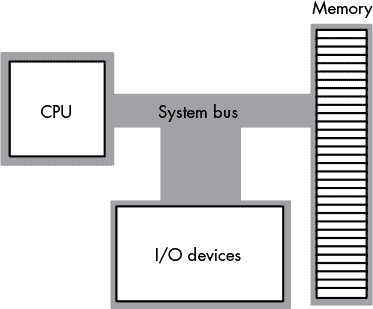
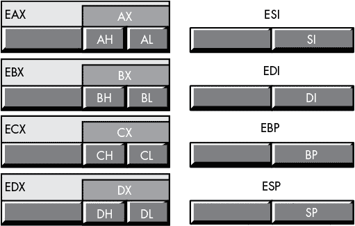
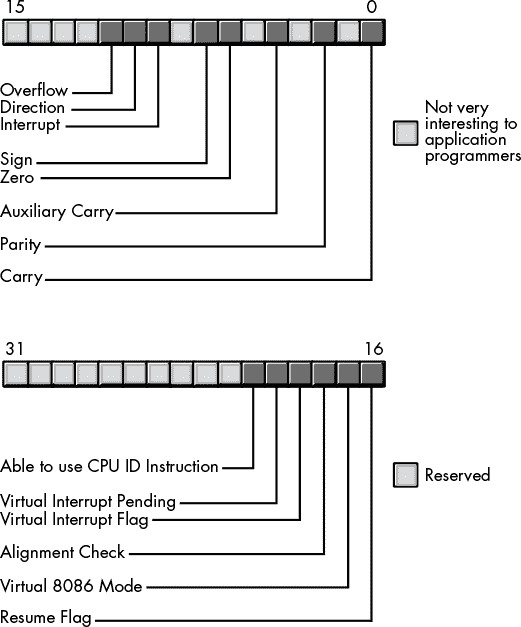
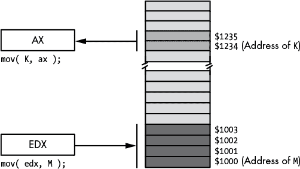
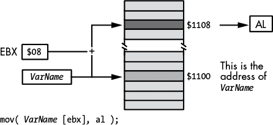
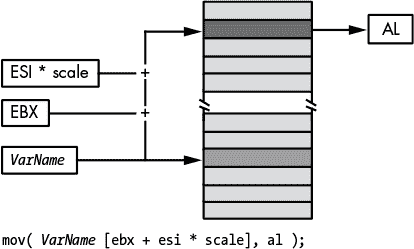

# 第三章：**80X86 为 HLL 程序员提供的汇编语言**


在本书中，你将研究高级语言代码，并将其与编译器为其生成的机器码进行对比。理解编译器的输出需要一定的汇编语言知识，但幸运的是，你不需要成为专家级汇编程序员。正如前几章所讨论的，你真正需要的只是能够阅读编译器和其他汇编程序员生成的代码。

本章提供了专门讲解 80x86 汇编语言的入门知识，涵盖以下主题：

+   基本的 80x86 机器架构

+   如何读取由各种编译器生成的 80x86 输出

+   32 位和 64 位 80x86 CPU 支持的寻址模式

+   几种常见 80x86 汇编器（HLA、MASM 和 Gas）使用的语法

+   如何在汇编语言程序中使用常量并声明数据

### 3.1 学习一种汇编语言很好，学习更多更好

如果你打算为除 80x86 之外的其他处理器编写代码，你应该至少学习两种不同的汇编语言。通过这样做，你可以避免在高级语言中为 80x86 编写代码，然后发现你的“优化”只能在 80x86 CPU 上工作。出于这个原因，本书包含了几个在线附录，提供了额外的资源：

+   附录 A 介绍了最小的 x86 指令集。

+   附录 B 是 PowerPC CPU 的入门知识。

+   附录 C 讲解了 ARM 处理器。

+   附录 D 描述了 Java 字节码汇编语言。

+   附录 E 介绍了 Microsoft 中间语言。

你将看到所有五种架构都依赖于许多相同的概念，但它们之间存在一些重要的差异，每种架构也有其优点和缺点。

也许*复杂指令集计算机（CISC）*和*精简指令集计算机（RISC）*架构之间的主要区别是它们使用内存的方式。RISC 架构将内存访问限制为特定的指令，因此应用程序会尽力避免访问内存。另一方面，80x86 架构允许大多数指令访问内存，应用程序通常会利用这一功能。

Java 字节码（JBC）和 Microsoft 中间语言（IL）架构与 80x86、PowerPC 和 ARM 架构不同，JBC 和 IL 是*虚拟机*，而不是实际的 CPU。通常，软件在运行时解释或尝试编译 JBC（IL 代码始终在运行时编译）。^(1) 这意味着 JBC 和 IL 代码通常比真正的机器码运行得要慢。

### 3.2 80x86 汇编语法

尽管 80x86 程序员可以选择多种程序开发工具，但这种丰富性也有一个小小的缺点：语法不兼容性。不同的 80x86 编译器和调试器对于完全相同的程序输出不同的汇编语言列表。这是因为这些工具为不同的汇编器生成代码。例如，微软的 Visual C++ 套件生成与微软宏汇编器 (MASM) 兼容的汇编代码。GNU 编译器套件（GCC）生成与 Gas 兼容的源代码（Gas 是来自自由软件基金会的 GNU 汇编器）。除了编译器生成的代码外，你还会看到大量使用像 FASM、NASM、GoAsm 和 HLA（高级汇编）等汇编器编写的汇编编程示例。

本书中最好使用单一的汇编语言语法，但由于我们的方法并不特定于某一编译器，因此必须考虑几种不同常见汇编器的语法。本书通常会使用 HLA 提供与编译器无关的示例。因此，本章将讨论 HLA 语法以及其他两种常见汇编器的语法：MASM 和 Gas。幸运的是，一旦你掌握了某一汇编器的语法，学习其他汇编器的语法就非常容易。

#### 3.2.1 基本的 80x86 架构

英特尔 CPU 通常被归类为 *冯·诺依曼机*。冯·诺依曼计算机系统包含三个主要构建模块：*中央处理单元 (CPU)*、*内存* 和 *输入/输出 (I/O) 设备*。这三部分通过 *系统总线* 连接（系统总线由地址总线、数据总线和控制总线组成）。图 3-1 显示了这种关系。



*图 3-1：冯·诺依曼系统的框图*

CPU 通过在 *地址总线* 上放置一个数字值来与内存和 I/O 设备进行通信，以选择其中一个内存位置或 I/O 设备端口位置，每个位置都有一个唯一的二进制数字地址。然后，CPU、I/O 设备和内存设备通过将数据放置在 *数据总线* 上相互传递数据。*控制总线* 包含信号，决定数据传输的方向（是向内存传输还是从内存传输，或是向 I/O 设备传输还是从 I/O 设备传输）。

#### 3.2.2 寄存器

寄存器组是 CPU 内最显著的特征。几乎所有在 80x86 CPU 上的运算都涉及至少一个寄存器。例如，要将两个变量的值相加并将它们的和存储到第三个变量中，必须先将其中一个变量加载到寄存器中，再将第二个操作数加到该寄存器中，最后将寄存器的值存储到目标变量中。寄存器几乎是每次计算中的中介，因此在 80x86 汇编语言程序中非常重要。

80x86 CPU 寄存器可以分为四类：通用寄存器、特殊用途的应用程序可访问寄存器、段寄存器和特殊用途的内核模式寄存器。我们不会考虑最后两类，因为在现代操作系统中段寄存器的使用并不广泛（例如，Windows、BSD、macOS 和 Linux），而特殊用途的内核模式寄存器是为编写操作系统、调试器以及其他系统级工具而设计的——这超出了本书的讨论范围。

#### 3.2.3 80x86 32 位通用寄存器

32 位 80x86（Intel 家族）CPU 提供了多个供应用程序使用的通用寄存器。这些包括八个 32 位寄存器：EAX、EBX、ECX、EDX、ESI、EDI、EBP 和 ESP。

每个寄存器名称前的*E*前缀代表*扩展*。这个前缀区分了 32 位寄存器和原始的八个 16 位寄存器：AX、BX、CX、DX、SI、DI、BP 和 SP。

最后，80x86 CPU 提供了八个 8 位寄存器：AL、AH、BL、BH、CL、CH、DL 和 DH。

关于通用寄存器，最重要的要点是它们不是独立的。也就是说，80x86 架构并没有提供 24 个独立的寄存器。相反，它将 32 位寄存器与 16 位寄存器重叠，并且将 16 位寄存器与 8 位寄存器重叠。图 3-2 展示了这种关系。



*图 3-2：Intel 80x86 CPU 通用寄存器*

修改一个寄存器可能会同时修改多达三个其他寄存器这一点非常重要。例如，修改 EAX 寄存器可能也会修改 AL、AH 和 AX 寄存器。你将经常看到编译器生成的代码利用这一点。例如，编译器可能会清除（设置为`0`）EAX 寄存器中的所有位，然后将`1`或`0`加载到 AL 中，以产生一个 32 位的`true`（`1`）或`false`（`0`）值。某些机器指令仅操作 AL 寄存器，但程序可能需要将这些指令的结果返回到 EAX 中。通过利用寄存器的重叠，编译器生成的代码可以使用操作 AL 的指令，并将该值返回到整个 EAX 寄存器中。

尽管 Intel 将这些寄存器称为*通用寄存器*，但这并不意味着你可以将任何寄存器用于任何目的。例如，SP/ESP 寄存器对具有非常特殊的功能，实际上阻止你将它用于其他任何目的（它是*堆栈指针*）。同样，BP/EBP 寄存器也有一个特殊用途，限制了它作为通用寄存器的有效性。所有 80x86 寄存器都有各自的特殊用途，这限制了它们在某些上下文中的使用；我们将在讨论使用这些寄存器的机器指令时考虑这些特殊用途（见在线资源）。

当代版本的 80x86 CPU（通常称为 *x86-64 CPU*）为 32 位寄存器集提供了两个重要扩展：一组 64 位寄存器和另一组八个寄存器（64 位、32 位、16 位和 8 位）。主要的 64 位寄存器具有以下名称：RAX、RBX、RCX、RDX、RSI、RDI、RBP 和 RSP。

这些 64 位寄存器与 32 位的“E”寄存器重叠。也就是说，32 位寄存器包含了这些寄存器的低（低序）32 位。例如，EAX 是 RAX 的低 32 位。同样，AX 是 RAX 的低 16 位，AL 是 RAX 的低 8 位。

除了提供现有 80x86 32 位寄存器的 64 位变体外，x86-64 CPU 还增加了八个其他的 64/32/16/8 位寄存器：R15、R14、R13、R12、R11、R10、R9 和 R8。

你可以将这些寄存器的低 32 位称为 R15d、R14d、R13d、R12d、R11d、R10d、R9d 和 R8d。

你可以将这些寄存器的低 16 位称为 R15w、R14w、R13w、R12w、R11w、R10w、R9w 和 R8w。

最后，你可以将这些寄存器的低字节称为 R15b、R14b、R13b、R12b、R11b、R10b、R9b 和 R8b。

#### 3.2.4 80x86 EFLAGS 寄存器

32 位 EFLAGS 寄存器封装了许多单个位的布尔值（`true`/`false`）（或 *标志*）。其中大多数位要么是为内核模式（操作系统）功能保留，要么对于应用程序开发者而言没有太大意义。然而，有 8 位对于编写（或读取）汇编语言代码的应用程序开发者是相关的：溢出标志、方向标志、禁止中断标志、符号标志、零标志、辅助进位标志、奇偶标志和进位标志。图 3-3 显示了它们在 EFLAGS 寄存器中的布局。

在应用程序开发者可以使用的八个标志中，尤其有四个标志非常有价值：溢出标志、进位标志、符号标志和零标志。我们将这四个标志称为 *条件码*。每个标志都有一个状态——设置或清除——你可以利用它来测试之前计算的结果。例如，在比较两个值之后，条件码标志会告诉你哪个值小于、等于或大于另一个值。



*图 3-3：80x86 标志寄存器的布局（低 16 位）*

x86-64 64 位 RFLAGS 寄存器保留了从位 32 到位 63 的所有位。EFLAGS 寄存器的上 16 位通常只对操作系统代码有用。

因为 RFLAGS 寄存器在读取编译器输出时不包含任何有用信息，本书将简单地将 x86 和 x86-64 标志寄存器称为 EFLAGS，即使在 64 位 CPU 变体上也是如此。

### 3.3 字面常量

大多数汇编器支持字面数值（包括二进制、十进制和十六进制）、字符和字符串常量。不幸的是，几乎所有的汇编器都使用不同的字面常量语法。本节将描述本书中使用的汇编器的语法。

#### 3.3.1 二进制字面常量

所有汇编器都提供了指定基数 2（二进制）字面常量的能力。很少有编译器生成二进制常量，因此你可能不会在编译器输出中看到这些值，但在手写的汇编代码中你可能会看到它们。C++ 14 也支持二进制字面常量（`0b`xxxxx）。

##### 3.3.1.1 HLA 中的二进制字面常量

HLA 中的二进制字面常量以百分号字符（`%`）开头，后跟一个或多个二进制数字（`0` 或 `1`）。下划线字符可以出现在二进制数字的任何两个数字之间。根据惯例，HLA 程序员使用下划线分隔每四个数字一组。例如：

```

			%1011
%1010_1111
%0011_1111_0001_1001
%1011001010010101
```

##### 3.3.1.2 Gas 中的二进制字面常量

Gas 中的二进制字面常量以特殊的 `0b` 前缀开头，后跟一个或多个二进制数字（`0` 或 `1`）。例如：

```

			0b1011
0b10101111
0b0011111100011001
0b1011001010010101
```

##### 3.3.1.3 MASM 中的二进制字面常量

MASM 中的二进制字面常量由一个或多个二进制数字（`0` 或 `1`）组成，并以特殊的 `b` 后缀结尾。例如：

```

			1011b
10101111b
0011111100011001b
1011001010010101b
```

#### 3.3.2 十进制字面常量

大多数汇编器中的十进制常量采用标准格式——一系列一个或多个十进制数字，没有任何特殊的前缀或后缀。这是编译器生成的两种常见数字格式之一，因此你经常会在编译器输出的代码中看到十进制字面常量。

##### 3.3.2.1 HLA 中的十进制字面常量

HLA 允许你在十进制数字的任何两个数字之间插入下划线。HLA 程序员通常使用下划线来分隔十进制数字中的每组三个数字。例如，对于以下数字：

```

			123
1209345
```

HLA 程序员可以按如下方式插入下划线：

```

			1_024
1_021_567
```

##### 3.3.2.2 Gas 和 MASM 中的十进制字面常量

Gas 和 MASM 使用一串十进制数字（标准的“计算机”格式用于表示十进制值）。例如：

```

			123
1209345
```

与 HLA 不同，Gas 和 MASM 不允许在十进制字面常量中嵌入下划线。

#### 3.3.3 十六进制字面常量

十六进制（基数 16）字面常量是汇编语言程序中另一种常见的数字格式（尤其是编译器生成的程序）。 

##### 3.3.3.1 HLA 中的十六进制字面常量

HLA 中的十六进制字面常量由一串十六进制数字（`0..9`，`a..f` 或 `A..F`）组成，并以 `$` 为前缀。下划线可以选择性地出现在数字的任何两个十六进制数字之间。根据惯例，HLA 程序员使用下划线分隔每四个数字一组。例如：

```

			$1AB0
$1234_ABCD
$dead
```

##### 3.3.3.2 Gas 中的十六进制字面常量

Gas 中的十六进制字面常量由一串十六进制数字（`0..9`，`a..f` 或 `A..F`）组成，并以 `0x` 为前缀。例如：

```

			0x1AB0
0x1234ABCD
0xdead
```

##### 3.3.3.3 MASM 中的十六进制字面常量

MASM 中的十六进制字面常量由一串十六进制数字（`0..9`，`a..f` 或 `A..F`）组成，并以 `h` 为后缀。值必须以十进制数字开始（如果常量通常以 `a..f` 范围内的字母开头，则以 `0` 开头）。例如：

```

			1AB0h
1234ABCDh
0deadh
```

#### 3.3.4 字符和字符串字面常量

字符和字符串数据也是汇编程序中常见的数据类型。MASM 不区分字符字面常量和字符串字面常量。然而，HLA 和 Gas 使用不同的内部表示来处理字符和字符串，因此在这些汇编器中，区分这两种字面常量非常重要。

##### 3.3.4.1 HLA 中的字符和字符串字面常量

HLA 中的字符字面常量有几种不同的形式。最常见的是一个单一的可打印字符，周围有一对撇号，如 `'A'`。为了指定实际的撇号作为字符字面常量，HLA 要求你用一对撇号包围另一对撇号（`''''`）。最后，你也可以使用 `#` 符号后跟一个二进制、十进制或十六进制的数值，来指定你要使用的字符的 ASCII 码。例如：

```

			'a'
''''
' '
#$d
#10
#%0000_1000
```

HLA 中的字符串字面常量由零个或多个字符组成，字符由引号包围。为了在字符串常量中表示实际的引号字符，你需要使用两个相邻的引号。例如：

```

			"Hello World"
"" -- The empty string
"He said ""Hello"" to them"
"""" -- string containing one quote character
```

##### 3.3.4.2 Gas 中的字符和字符串字面常量

Gas 中的字符字面常量由一个撇号后跟一个字符组成。更新版本的 Gas（以及 Mac 上的 Gas）也允许类似 `'a'` 的字符常量。例如：

```

			'a
''
'!
'a'   // Modern versions of Gas and Mac's assembler
'!'   // Modern versions of Gas and Mac's assembler
```

Gas 中的字符串字面常量由零个或多个字符组成，字符由引号包围，并且使用与 C 字符串相同的语法。你可以使用 `\` 转义序列在 Gas 字符串中嵌入特殊字符。例如：

```

			"Hello World"
"" -- The empty string
"He said \"Hello\" to them"
"\"" -- string containing one quote character
```

##### 3.3.4.3 MASM 中的字符和字符串字面常量

MASM 中的字符和字符串字面常量采用相同的形式：一个或多个字符组成的序列，由撇号或引号包围。MASM 不区分字符常量和字符串常量。例如：

```

			'a'
"'" - An apostrophe character
'"' - A quote character
"Hello World"
"" -- The empty string
'He said "Hello" to them'
```

#### 3.3.5 浮点字面常量

汇编语言中的浮点字面常量通常采用你在高级语言（HLL）中会看到的形式（一个数字序列，可能包含小数点，可选地跟着一个带符号的指数）。例如：

```

			3.14159
2.71e+2
1.0e-5
5e2
```

### 3.4 汇编语言中的显式（符号）常量

几乎每个汇编器都提供了一种声明符号（命名）常量的机制。事实上，大多数汇编器提供了几种方式，将一个值与源文件中的标识符关联起来。

#### 3.4.1 HLA 中的显式常量

HLA 汇编器，名副其实，采用高级语法在源文件中声明命名常量。你可以通过三种方式定义常量：在`const`部分、在`val`部分，或使用`?`编译时运算符。`const`和`val`部分出现在 HLA 程序的声明部分，它们的语法非常相似。它们之间的区别在于，你可以重新赋值给`val`部分中定义的标识符，但不能重新赋值给`const`部分中的标识符。尽管 HLA 在这些声明部分中支持多种选项，但基本声明的形式如下：

```

			const
    someIdentifier := someValue;
```

在源文件中，任何出现某个标识符的地方（在此声明之后），HLA 将用该标识符所对应的值`someValue`进行替换。例如：

```

			const
    aCharConst := 'a';
    anIntConst := 12345;
    aStrConst := "String Const";
    aFltConst := 3.12365e-2;

val
    anotherCharConst := 'A';
    aSignedConst := -1;
```

在 HLA 中，`?`语句允许你在源文件中任何允许空格的地方嵌入`val`声明。这有时很有用，因为在声明部分声明常量并不总是方便。例如：

```
?aValConst := 0;
```

#### 3.4.2 Gas 中的清单常量

Gas 使用`.equ`（“等式”）语句在源文件中定义符号常量。该语句的语法如下：

```

			.equ        symbolName, value
```

下面是一些 Gas 源文件中等式的示例：

```

			.equ        false, 0
.equ        true, 1
.equ        anIntConst, 12345
```

#### 3.4.3 MASM 中的清单常量

MASM 也提供了几种不同的方式来在源文件中定义清单常量。一种方式是使用`equ`指令：

```

			false       equ    0
true        equ    1
anIntConst  equ    12345
```

另一个是使用`=`运算符：

```

			false       =    0
true        =    1
anIntConst  =    12345
```

两者之间的区别很小；有关详细信息，请参阅 MASM 文档。

**注意**

*在大多数情况下，编译器倾向于生成 equ 形式而非=形式。*

### 3.5 80x86 寻址模式

*寻址模式*是访问指令操作数的硬件特定机制。80x86 系列提供三种不同类型的操作数：寄存器、立即数和内存操作数。本节讨论了每种寻址模式。

#### 3.5.1 80x86 寄存器寻址模式

大多数 80x86 指令可以操作 80x86 的通用寄存器集。你通过指定寄存器的名称作为指令操作数来访问寄存器。

让我们考虑一些示例，看看我们的汇编器如何使用 80x86 的`mov`（移动）指令来实现这一策略。

##### 3.5.1.1 HLA 中的寄存器访问

HLA 的`mov`指令如下所示：

```

			mov( source, destination );
```

该指令将数据从源操作数复制到目标操作数。8 位、16 位和 32 位寄存器是该指令的有效操作数；唯一的限制是两个操作数必须是相同的大小。

现在让我们来看一些实际的 80x86 `mov`指令：

```

			mov( bx, ax );      // Copies the value from BX into AX
mov( al, dl );      // Copies the value from AL into DL
mov( edx, esi );    // Copies the value from EDX into ESI
```

请注意，HLA 仅支持 32 位的 80x86 寄存器集，不支持 64 位寄存器集。

##### 3.5.1.2 Gas 中的寄存器访问

Gas 在每个寄存器名称前加上百分号（`%`）。例如：

```

			%al, %ah, %bl, %bh, %cl, %ch, %dl, %dh
%ax, %bx, %cx, %dx, %si, %di, %bp, %sp
%eax, %ebx, %ecx, %edx, %esi, %edi, %ebp, %esp
%rax, %rbx, %rcx, %rdx, %rsi, %rdi, %rbp, %rsp
%r15b, %r14b, %r13b, %r12b, %r11b, %r10b, %r9b, %r8b
%r15w, %r14w, %r13w, %r12w, %r11w, %r10w, %r9w, %r8w
%r15d, %r14d, %r13d, %r12d, %r11d, %r10d, %r9d, %r8d
%r15, %r14, %r13, %r12, %r11, %r10, %r9, %r8
```

`mov` 指令的 Gas 语法与 HLA 类似，不同之处在于它去掉了括号和分号，并要求汇编语言语句必须完全适应于一行源代码。例如：

```

			mov %bx, %ax       // Copies the value from BX into AX
mov %al, %dl       // Copies the value from AL into DL
mov %edx, %esi     // Copies the value from EDX into ESI
```

##### 3.5.1.3 在 MASM 中的寄存器访问

MASM 汇编器使用与 HLA 相同的寄存器名称，但增加了对 64 位寄存器组的支持：

```

			al, ah, bl, bh, cl, ch, dl, dh
ax, bx, cx, dx, si, di, bp, sp
eax, ebx, ecx, edx, esi, edi, ebp, esp
rax, rbx, rcx, rdx, rsi, rdi, rbp, rsp
r15b, r14b, r13b, r12b, r11b, r10b, r9b, r8b
r15w, r14w, r13w, r12w, r11w, r10w, r9w, r8w
r15d, r14d, r13d, r12d, r11d, r10d, r9d, r8d
r15, r14, r13, r12, r11, r10, r9, r8
```

MASM 使用的基础语法与 Gas 类似，不同之处在于 MASM 交换了操作数的顺序（这是标准的 Intel 语法）。即，像 `mov` 这样的典型指令采用以下形式：

```

			mov destination, source
```

下面是 MASM 语法中的一些 `mov` 指令示例：

```

			mov ax, bx       ; Copies the value from BX into AX
mov dl, al       ; Copies the value from AL into DL
mov esi, edx     ; Copies the value from EDX into ESI
```

#### 3.5.2 立即寻址模式

大多数允许寄存器和内存操作数的指令也允许立即数或 *常量* 操作数。例如，以下 HLA `mov` 指令会将适当的值加载到相应的目标寄存器中：

```

			mov( 0, al );
mov( 12345, bx );
mov( 123_456_789, ecx );
```

大多数汇编器在使用立即寻址模式时，允许你指定各种字面常量类型。例如，你可以提供十六进制、十进制或二进制形式的数字。你还可以将字符常量作为操作数提供。规则是常量必须符合目标操作数指定的大小。

下面是一些使用 HLA、Gas 和 MASM 的附加示例（请注意，Gas 需要在立即操作数前加上 `$`）：

```

			mov( 'a', ch );  // HLA
mov $'a', %ch    // Gas
mov ch, 'a'       ; MASM

mov( $1234, ax ); // HLA
mov $0x1234, %ax  // Gas
mov ax, 1234h      ; MASM

mov( 4_012_345_678, eax ); // HLA
mov $4012345678, %eax      // Gas
mov eax, 4012345678         ; MASM
```

几乎每个汇编器都允许你创建符号常量名并将其作为源操作数提供。例如，HLA 预定义了两个布尔常量 `true` 和 `false`，因此你可以将这些名称作为 `mov` 指令的操作数：

```

			mov( true, al );
mov( false, ah );
```

一些汇编器甚至允许指针常量和其他抽象数据类型常量。（有关详细信息，请参阅汇编器的参考手册。）

#### 3.5.3 仅位移内存寻址模式

最常见的 32 位寻址模式，也是最容易理解的一种，是 *仅位移*（或 *直接*）寻址模式，在这种模式下，32 位常量指定内存位置的地址，这个地址可以是源操作数或目标操作数。请注意，这种寻址模式仅在 32 位 x86 处理器或在 64 位处理器的 32 位模式下可用。

例如，假设变量 `J` 是一个位于地址 `$8088` 的字节变量，HLA 指令 `mov(J,al);` 会将内存地址 `$8088` 处的字节加载到 AL 寄存器中。类似地，如果字节变量 `K` 位于内存地址 `$1234`，那么指令 `mov(dl,K);` 会将 DL 寄存器中的值写入内存地址 `$1234`（参见 图 3-4）。


*图 3-4：仅位移（直接）寻址模式*

仅位移寻址模式非常适合访问简单的标量变量。这是你通常用来访问 HLL 程序中的静态或全局变量的寻址模式。

**注意**

*英特尔将此寻址模式命名为“仅位移”，因为一个 32 位常量（位移）紧跟在 mov 操作码后面，存储在内存中。在 80x86 处理器上，这个位移是从内存起始位置（即地址`0`）开始的偏移量。*

本章中的示例将经常访问内存中的字节大小对象。然而，别忘了，你也可以通过指定其第一个字节的地址来访问 80x86 处理器上的字和双字（见图 3-5）。



*图 3-5：使用直接寻址模式访问字或双字*

MASM 和 Gas 在位移寻址模式的语法上与 HLA 相同：对于操作数，只需指定要访问的对象名称。一些 MASM 程序员会将变量名放在方括号中，尽管这些汇编器中并不严格要求这样做。

以下是使用 HLA、Gas 和 MASM 语法的几个示例：

```

			mov( byteVar, ch );  // HLA
movb byteVar, %ch    // Gas
mov ch, byteVar       ; MASM

mov( wordVar, ax ); // HLA
movw wordVar, %ax   // Gas
mov ax, wordVar      ; MASM

mov( dwordVar, eax );   // HLA
movl dwordVar, %eax     // Gas
mov eax, dwordVar        ; MASM
```

#### 3.5.4 RIP 相对寻址模式

x86-64 CPU 在 64 位模式下不支持 32 位直接寻址模式。由于不希望在指令末尾添加一个 64 位常量（以支持整个 64 位地址空间），AMD 工程师选择创建一个 RIP 相对寻址模式，通过将一个带符号的 32 位常量（替代直接地址）加到 RIP（指令指针）寄存器中的值来计算有效的内存地址。这允许在当前指令周围的±2GB 范围内访问数据。^(3)

#### 3.5.5 寄存器间接寻址模式

80x86 CPU 允许通过寄存器使用寄存器间接寻址模式间接访问内存。这些模式被称为*间接*，因为操作数不是实际地址；相反，它的值指定了要使用的内存地址。在寄存器间接寻址模式中，寄存器的值就是要访问的地址。例如，HLA 指令`mov(eax,[ebx]);`告诉 CPU 将 EAX 的值存储在 EBX 中保存的地址所指向的位置。

x86-64 CPU 在 64 位模式下还支持使用 64 位寄存器（例如 RAX、RBX、……、R15）进行寄存器间接寻址模式。寄存器间接寻址模式允许完全访问 64 位地址空间。例如，MASM 指令`mov eax, [rbx]`指示 CPU 从 RBX 中存储的地址加载 EAX 寄存器的值。

##### 3.5.5.1 HLA 中的寄存器间接模式

在 80x86 上，这种寻址模式有八种形式。使用 HLA 语法，它们看起来是这样的：

```

			mov( [eax], al );
mov( [ebx], al );
mov( [ecx], al );
mov( [edx], al );
mov( [edi], al );
mov( [esi], al );
mov( [ebp], al );
mov( [esp], al );
```

这八种寻址模式通过寄存器中的偏移量引用内存位置，该寄存器用方括号括起来（分别为 EAX、EBX、ECX、EDX、EDI、ESI、EBP 或 ESP）。

**注意**

*HLA 的寄存器间接寻址模式需要一个 32 位寄存器。使用间接寻址模式时，不能指定 16 位或 8 位寄存器。*

##### 3.5.5.2 MASM 中的寄存器间接模式

MASM 在 32 位模式下使用的寄存器间接寻址模式与 HLA 的语法完全相同（不过需要注意的是，MASM 会反转指令操作数；只有寻址模式语法是相同的）。在 64 位模式下，语法相同——即寄存器名称周围有一对方括号——不过这种模式使用的是 64 位寄存器，而不是 32 位寄存器。

以下是前面给出的指令的 MASM 等效实现：

```

			mov al, [eax]
mov al, [ebx]
mov al, [ecx]
mov al, [edx]
mov al, [edi]
mov al, [esi]
mov al, [ebp]
mov al, [esp]
```

以下是 MASM 64 位寄存器间接寻址模式的示例：

```

			mov al,   [rax]
mov ax,   [rbx]
mov eax,  [rcx]
mov rax,  [rdx]
mov r15b, [rdi]
mov r15w, [rsi]
mov r15d, [rbp]
mov r15,  [rsp]
mov al,   [r8]
mov ax,   [r9]
mov eax,  [r10]
mov rax,  [r11]
mov r15b, [r12]
mov r15w, [r13]
mov r15d, [r14]
mov r15,  [r15]
```

##### 3.5.5.3 Gas 中的寄存器间接模式

Gas 使用括号而不是方括号来表示寄存器名称。以下是前述 32 位 HLA `mov` 指令的 Gas 变体：

```

			movb (%eax), %al
movb (%ebx), %al
movb (%ecx), %al
movb (%edx), %al
movb (%edi), %al
movb (%esi), %al
movb (%ebp), %al
movb (%esp), %al
```

以下是 Gas 的 64 位寄存器间接寻址变体：

```

			movb (%rax), %al
movb (%rbx), %al
movb (%rcx), %al
movb (%rdx), %al
movb (%rdi), %al
movb (%rsi), %al
movb (%rbp), %al
movb (%rsp), %al
movb (%r8),  %al
movb (%r9),  %al
movb (%r10), %al
movb (%r11), %al
movb (%r12), %al
movb (%r13), %al
movb (%r14), %al
movb (%r15), %al
```

#### 3.5.6 索引寻址模式

*有效地址*是指令在所有地址计算完成后将访问的最终内存地址。索引寻址模式通过将变量的地址（也称为*位移量*或*偏移*）与方括号内的 32 位或 64 位寄存器的值相加，来计算有效地址。它们的和提供了指令访问的内存地址。例如，如果 VarName 在内存中的地址为 `$1100`，而 EBX 寄存器包含值 `8`，那么 `mov(`VarName`[ebx],al);` 将从地址 `$1108` 加载字节到 AL 寄存器中（见图 3-6）。

在 x86-64 CPU 上，寻址模式使用其中一个 64 位寄存器。但是，值得注意的是，作为指令一部分编码的位移量仍然是 32 位的。因此，寄存器必须保存基地址，而位移量则提供相对于基地址的偏移（索引）。



*图 3-6：索引寻址模式*

##### 3.5.6.1 HLA 中的索引寻址模式

索引寻址模式使用以下 HLA 语法，其中 VarName 是你程序中某个静态变量的名称：

```

			mov( VarName[ eax ], al );
mov( VarName[ ebx ], al );
mov( VarName[ ecx ], al );
mov( VarName[ edx ], al );
mov( VarName[ edi ], al );
mov( VarName[ esi ], al );
mov( VarName[ ebp ], al );
mov( VarName[ esp ], al );
```

##### 3.5.6.2 MASM 中的索引寻址模式

MASM 在 32 位模式下支持与 HLA 相同的语法，但它还允许多种变体的语法，用于指定索引寻址模式。以下是展示 MASM 支持的某些变体的等效格式：

```
varName[reg32]
[reg32 + varName]
[varName][reg32]
[varName + reg32]
[reg32][varName]
varName[reg32 + const]
[reg32 + varName + const]
[varName][reg32][const]
varName[const + reg32]
[const + reg32 + varName]
[const][reg32][varName]
varName[reg32 - const]
[reg32 + varName - const]
[varName][reg32][-const]
```

由于加法的交换律，MASM 还允许许多其他组合。它将括号内的两个并排项视为被 `+` 运算符分隔。

以下是 MASM 对前述 HLA 示例的等效实现：

```

			mov  al, VarName[ eax ]
mov  al, VarName[ ebx ]
mov  al, VarName[ ecx ]
mov  al, VarName[ edx ]
mov  al, VarName[ edi ]
mov  al, VarName[ esi ]
mov  al, VarName[ ebp ]
mov  al, VarName[ esp ]
```

在 64 位模式下，MASM 要求你为索引寻址模式指定 64 位寄存器名称。在 64 位模式下，寄存器保存内存中变量的基地址，而编码到指令中的位移量提供了从该基地址的偏移。这意味着你不能使用寄存器作为全局数组的索引（通常使用的是 RIP 相对寻址模式）。

以下是 64 位模式下有效的 MASM 索引寻址模式示例：

```

			mov  al, [ rax + SomeConstant ]
mov  al, [ rbx + SomeConstant ]
mov  al, [ rcx + SomeConstant ]
mov  al, [ rdx + SomeConstant ]
mov  al, [ rdi + SomeConstant ]
mov  al, [ rsi + SomeConstant ]
mov  al, [ rbp + SomeConstant ]
mov  al, [ rsp + SomeConstant ]
```

##### 3.5.6.3 Gas 中的索引寻址模式

与寄存器间接寻址模式一样，Gas 使用括号而非方括号。以下是 Gas 的索引寻址模式语法：

```
varName(%reg32)
const(%reg32)
varName + const(%reg32)
```

以下是 Gas 对应于前面给出的 HLA 指令的等价形式：

```

			movb VarName( %eax ), al
movb VarName( %ebx ), al
movb VarName( %ecx ), al
movb VarName( %edx ), al
movb VarName( %edi ), al
movb VarName( %esi ), al
movb VarName( %ebp ), al
movb VarName( %esp ), al
```

在 64 位模式下，Gas 要求你为索引寻址模式指定 64 位寄存器名称。与 MASM 一样，适用相同的规则。

以下是 64 位模式下有效的 Gas 索引寻址模式示例：

```

			mov  %al, SomeConstant(%rax)
mov  %al, SomeConstant(%rbx)
mov  %al, SomeConstant(%rcx)
mov  %al, SomeConstant(%rdx)
mov  %al, SomeConstant(%rsi)
mov  %al, SomeConstant(%rdi)
mov  %al, SomeConstant(%rbp)
mov  %al, SomeConstant(%rsp)
```

#### 3.5.7 缩放索引寻址模式

缩放索引寻址模式与索引寻址模式相似，但有两个不同点。缩放索引寻址模式使你能够：

+   组合两个寄存器加上一个位移量

+   将索引寄存器乘以 1、2、4 或 8 的（缩放）因子

要了解是什么使其成为可能，请考虑以下 HLA 示例：

```

			mov( eax, VarName[ ebx + esi*4 ] );
```

缩放索引寻址模式与索引寻址模式之间的主要区别是包含了 `esi*4` 这一部分。这个示例通过加上 ESI 乘以 4 的值来计算有效地址（见 图 3-7）。



*图 3-7：缩放索引寻址模式*

在 64 位模式下，替换基址寄存器和索引寄存器为 64 位寄存器。

##### 3.5.7.1 HLA 中的缩放索引寻址

HLA 的语法提供了几种不同的方法来指定缩放索引寻址模式。以下是各种语法形式：

```
VarName[ IndexReg[32]*scale ]
VarName[ IndexReg[32]*scale + displacement ]
VarName[ IndexReg[32]*scale - displacement ]

[ BaseReg[32] + IndexReg[32]*scale ]
[ BaseReg[32] + IndexReg[32]*scale + displacement ]
[ BaseReg[32] + IndexReg[32]*scale - displacement ]

VarName[ BaseReg[32] + IndexReg[32]*scale ]
VarName[ BaseReg[32] + IndexReg[32]*scale + displacement ]
VarName[ BaseReg[32] + IndexReg[32]*scale - displacement ]
```

在这些示例中，BaseReg[32] 表示任何通用的 32 位寄存器，IndexReg[32] 表示除 ESP 之外的任何通用 32 位寄存器，缩放因子必须是 `1`、`2`、`4` 或 `8` 中的常量。VarName 表示一个静态变量名，位移量表示一个 32 位常量。

##### 3.5.7.2 MASM 中的缩放索引寻址

MASM 支持与 HLA 相同的寻址模式语法，但有一些额外的形式，与索引寻址模式的呈现方式类似。这些形式只是基于 `+` 运算符的交换性而产生的语法变体。

MASM 还支持 64 位缩放索引寻址，它与 32 位模式具有相同的语法，只不过你需要使用 64 位寄存器名称。32 位和 64 位缩放索引寻址模式之间的主要区别在于，64 位 `disp[reg*index]` 寻址模式不存在。在 64 位寻址模式中，这是一个相对程序计数器的索引寻址模式，其中位移量是与当前指令指针值的 32 位偏移量。

##### 3.5.7.3 Gas 中的缩放索引寻址

和往常一样，Gas 使用括号而非方括号来包围缩放索引操作数。Gas 还使用三操作数语法来指定 *基址寄存器*、*索引寄存器* 和 *缩放因子*，而不是其他汇编程序使用的算术表达式语法。Gas 缩放索引寻址模式的通用语法是：

```
expression( baseReg[32], indexReg[32], scaleFactor )
```

更具体地说：

```
VarName( ,IndexReg[32], scale )
VarName + displacement( ,IndexReg[32], scale )
VarName - displacement( ,IndexReg[32], scale )
( BaseReg[32], IndexReg[32], scale )
displacement( BaseReg[32], IndexReg[32], scale)

VarName( BaseReg[32], IndexReg[32], scale )
VarName + displacement( BaseReg[32], IndexReg[32], scale )
VarName - displacement( BaseReg[32], IndexReg[32], scale )
```

其中缩放因子是 `1`、`2`、`4` 或 `8` 中的一个值。

Gas 还支持 64 位缩放索引寻址。它使用与 32 位模式相同的语法，只是将 64 位寄存器名称交换进来。在使用 64 位寻址时，不能同时指定 RIP 相关的变量名（例如这些示例中的 VarName）；只能使用 32 位位移量。

### 3.6 在汇编语言中声明数据

80x86 架构提供的仅有少数几种低级机器数据类型，供各个机器指令操作：

byte 用于存储任意 8 位值。

word 用于存储任意 16 位值。

dword “双字”；用于存储任意 32 位值。

qword “四字双字”；用于存储任意 64 位值。

real32 **（也叫** real4**）** 用于存储 32 位单精度浮点值。

real64 **（也叫** real8**）** 用于存储 64 位双精度浮点值。

**注意**

*80x86 汇编器通常支持 tbyte（“十字节”）和 real80/real10 数据类型，但我们在这里不讨论这些类型，因为大多数现代（64 位）高级语言编译器不使用它们。（然而，某些 C/C++编译器使用 long double 数据类型支持 real80 值；Swift 在 Intel 机器上也通过 float80 类型支持 real80 值。）*

#### 3.6.1 在 HLA 中声明数据

HLA 汇编器忠于其高级语言的特性，提供了多种单字节数据类型，包括字符、带符号整数、无符号整数、布尔值和枚举类型。如果你用汇编语言编写应用程序，拥有所有这些不同的数据类型（以及 HLA 提供的类型检查）将非常有用。然而，对于我们的目的，我们可以简单地为字节变量分配存储空间，并为更大的数据结构预留一块字节空间。对于 8 位和数组对象，HLA 的`byte`类型就足够了。

你可以在 HLA 的`static`部分声明`byte`对象，方法如下：

```

			static
    variableName : byte;
```

要为一块字节分配存储空间，可以使用以下 HLA 语法：

```

			static
    blockOfBytes : byte[ sizeOfBlock ];
```

这些 HLA 声明创建了*未初始化*的变量。从技术上讲，HLA 始终将`static`对象初始化为`0`，因此它们并不真正是未初始化的，但关键点是这段代码没有显式地为这些字节对象赋初值。不过，你可以告诉 HLA 在操作系统将程序加载到内存时，使用如下语句来初始化你的字节变量：

```

			static
    // InitializedByte has the initial value 5:

    InitializedByte : byte := 5;

    // InitializedArray is initialized with 0, 1, 2, and 3;

    InitializedArray : byte[4] := [0,1,2,3];
```

#### 3.6.2 MASM 中的数据声明

在 MASM 中，通常会在`.data`节中使用`db`或`byte`指令来为字节对象或字节对象数组预留存储空间。单个声明的语法会采取以下等效形式：

```
variableName    db      ?
variableName    byte    ?
```

上述声明创建了未初始化的对象（实际上与 HLA 一样，初始化为`0`）。`db`/`byte`指令的操作数字段中的`?`告诉汇编器你不想显式地为声明附加值。

要声明一个字节块变量，可以使用如下语法：

```
variableName    db      sizeOfBlock dup (?)
variableName    byte    sizeOfBlock dup (?)
```

要创建一个初始值不为零的对象，你可以使用如下语法：

```

			                        .data
InitializedByte         db      5
InitializedByte2        byte    6
InitializedArray0       db      4 dup (5)   ; array is 5,5,5,5
InitializedArray1       db      5 dup (6)   ; array is 6,6,6,6,6
```

要创建一个初始化的字节数组，其值并不完全相同，你只需在 MASM 的`db`/`byte`指令的操作数字段中指定一个以逗号分隔的值列表：

```

			                    .data
InitializedArray2   byte    0,1,2,3
InitializedArray3   byte    4,5,6,7,8
```

#### 3.6.3 Gas 中的数据声明

Gas 在`.data`节中使用`.byte`指令声明字节变量。该指令的通用形式是：

```
variableName: .byte 0
```

Gas 没有提供显式格式来创建未初始化的变量；相反，你只需为未初始化的变量提供一个`0`操作数。以下是两个 Gas 中的字节变量声明示例：

```

			InitializedByte: .byte   5
ZeroedByte       .byte   0  // Zeroed value
```

Gas 没有提供一个显式的指令来声明字节对象数组，但你可以使用`.rept`/`.endr`指令创建多个`.byte`指令的副本，如下所示：

```
variableName:
        .rept   sizeOfBlock
        .byte   0
        .endr
```

**注意**

*如果你想使用不同的值初始化数组，你也可以提供一个以逗号分隔的值列表。*

这里是一些 Gas 中数组声明的示例：

```

			            .section    .data
InitializedArray0:      // Creates an array with elements 5,5,5,5
            .rept       4
            .byte       5
            .endr

InitializedArray1:
            .byte       0,1,2,3,4,5
```

##### 3.6.3.1 在汇编语言中访问字节变量

在访问字节变量时，你只需在 80x86 寻址模式之一中使用变量声明的名称。例如，给定一个名为`byteVar`的字节对象和一个名为`byteArray`的字节数组，你可以使用以下任一指令，通过`mov`指令将该变量加载到 AL 寄存器中（这些示例假设是 32 位代码）：

```

			// HLA's mov instruction uses "src, dest" syntax:

mov( byteVar, al );
mov( byteArray[ebx], al ); // EBX is the index into byteArray

// Gas's movb instruction also uses a "src, dest" syntax:

movb byteVar, %al
movb byteArray(%ebx), %al

; MASM's mov instructions use "dest, src" syntax

mov al, byteVar
mov al, byteArray[ebx]
```

对于 16 位对象，HLA 使用`word`数据类型，MASM 使用`dw`或`word`指令，Gas 使用`.int`指令。除了这些指令声明的对象大小外，它们的使用方式与字节声明完全相同。例如：

```

			// HLA example:

static

    // HLAwordVar: 2 bytes, initialized with 0s:

    HLAwordVar : word;

    // HLAwordArray: 8 bytes, initialized with 0s:

    HLAwordArray : word[4];

    // HLAwordArray2: 10 bytes, initialized with 0, ..., 5:

    HLAwordArray2 : word[5] := [0,1,2,3,4];

; MASM example:

                    .data
MASMwordVar         word    ?
MASMwordArray       word    4 dup (?)
MASMwordArray2      word    0,1,2,3,4

// Gas example:

                    .section    .data
GasWordVar:         .int    0
GasWordArray:
                    .rept   4
                    .int    0
                    .endr

GasWordArray2:      .int    0,1,2,3,4
```

对于 32 位对象，HLA 使用`dword`数据类型，MASM 使用`dd`或`dword`指令，Gas 使用`.long`指令。例如：

```

			// HLA example:

static
    // HLAdwordVar: 4 bytes, initialized with 0s:

    HLAdwordVar : dword;

    // HLAdwordArray: 16 bytes, initialized with 0s.

    HLAdwordArray : dword[4];

    // HLAdwordArray: 20 bytes, initialized with 0, ..., 4:

    HLAdwordArray2 : dword[5] := [0,1,2,3,4];

; MASM/TASM example:

                    .data
MASMdwordVar        dword   ?
MASMdwordArray      dword   4 dup (?)
MASMdwordArray2     dword   0,1,2,3,4

// Gas example:

                    .section    .data
GasDWordVar:        .long   0
GasDWordArray:
                    .rept   4
                    .long   0
                    .endr

GasDWordArray2:     .long   0,1,2,3,4
```

### 3.7 在汇编语言中指定操作数大小

80x86 汇编器使用两种机制来指定它们的操作数大小：

+   操作数通过类型检查指定大小（大多数汇编器都会这样做）。

+   指令本身指定了大小（Gas 这样做）。

例如，考虑以下三个 HLA 的`mov`指令：

```

			mov( 0, al );
mov( 0, ax );
mov( 0, eax );
```

在每种情况下，寄存器操作数指定`mov`指令将数据复制到该寄存器时的数据大小。MASM 使用类似的语法（尽管操作数顺序相反）：

```

			mov al,  0 ; 8-bit data movement
mov ax,  0 ; 16-bit data movement
mov eax, 0 ; 32-bit data movement
```

这里需要记住的是，指令助记符（`mov`）在所有六种情况下都是完全相同的。是操作数，而不是指令助记符，指定了数据传输的大小。

**注意**

*现代版本的 Gas 也允许你通过操作数（寄存器）大小来指定操作的大小，而不使用如 b 或 w 的后缀。然而，本书将继续使用类似`movb`或`movw`的助记符，以避免与旧版本 Gas 产生混淆。有关“Gas 中的类型强制”请参见第 45 页。*

#### 3.7.1 HLA 中的类型强制

关于指定操作数大小的前一种方法有一个问题。考虑以下 HLA 示例：

```

			mov( 0, [ebx] );  // Copy 0 to the memory location
                  // pointed at by EBX.
```

该指令不明确。EBX 所指向的内存位置可能是一个字节、一个字或一个双字。指令中没有任何内容可以告诉汇编器操作数的大小。当遇到这样的指令时，汇编器会报告错误，你必须显式地告诉它内存操作数的大小。在 HLA 的情况下，可以通过如下类型强制操作符来完成：

```
mov( 0, (type word [ebx]) );  // 16-bit data movement.
```

通常，你可以使用以下 HLA 语法将任何内存操作数强制为适当的大小：

```

			(type new_type memory)
```

其中，new_type 代表数据类型（如 `byte`、`word` 或 `dword`），memory 代表你希望覆盖类型的内存地址。

#### 3.7.2 MASM 中的类型强制

MASM 也面临同样的问题。你需要使用像以下这样的强制操作符来强制内存位置的类型：

```
mov  word ptr [ebx], 0   ; 16-bit data movement.
```

当然，你可以在这两个例子中将 `byte` 或 `dword` 替换为 `word`，以将内存位置强制为字节或双字大小。

#### 3.7.3 Gas 中的类型强制

Gas 不需要类型强制操作符，因为它采用不同的技术来指定操作数的大小。与使用单一助记符 `mov` 不同，Gas 使用四个助记符，其中包括 `mov` 和一个单字符后缀，后缀表示大小：

movb 复制一个 8 位（`byte`）值

movw 复制一个 16 位（`word`）值

movl 复制一个 32 位（`long`）值

movq 复制一个 64 位（`long long`）值

使用这些助记符时，永远不会存在任何歧义，即使它们的操作数没有明确的大小。例如：

```

			movb $0, (%ebx) // 8-bit data copy
movw $0, (%ebx) // 16-bit data copy
movl $0, (%ebx) // 32-bit data copy
movq $0, (%rbx) // 64-bit data copy
```

通过这些基本信息，你现在应该能够理解来自典型编译器的输出。

### 3.8 更多信息

Bartlett, Jonathan. *从零开始学编程*。由 Dominick Bruno Jr. 编辑。自出版，2004 年。该书的一个较旧且免费的版本，使用 Gas 教授汇编语言编程，可以在网上找到，链接为 *[`www.plantation-productions.com/AssemblyLanguage/ProgrammingGroundUp-1-0-booksize.pdf`](http://www.plantation-productions.com/AssemblyLanguage/ProgrammingGroundUp-1-0-booksize.pdf)*。

Blum, Richard. *专业汇编语言*。印第安纳波利斯：Wiley，2005 年。

Duntemann, Jeff. *从基础开始学汇编语言*。第 3 版。印第安纳波利斯：Wiley，2009 年。

Hyde, Randall. *汇编语言的艺术*。第 2 版。旧金山：No Starch Press，2010 年。

Intel. “Intel 64 和 IA-32 架构软件开发者手册。”更新于 2019 年 11 月 11 日。 *[`software.intel.com/en-us/articles/intel-sdm/`](https://software.intel.com/en-us/articles/intel-sdm/)*。
